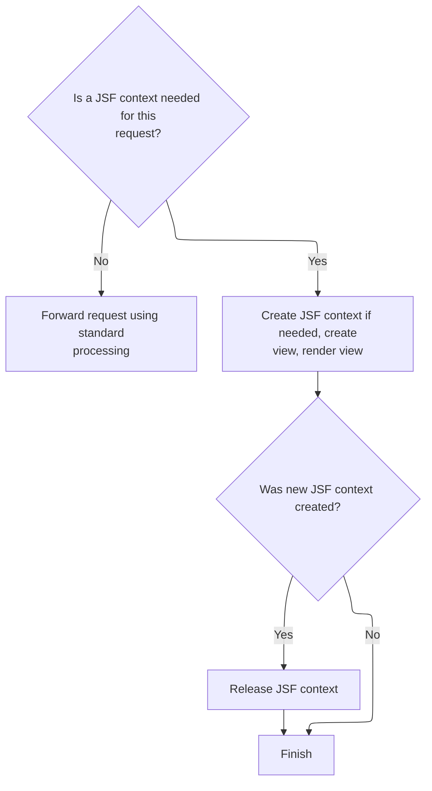

This document describes how incoming web requests are routed to either the Struts or JSF framework, ensuring the appropriate page or view is rendered to the user. The flow supports applications that use both Struts and JSF technologies.

# Hybrid Struts/JSF Request Routing

<SwmSnippet path="/faces/src/main/java/org/apache/struts/faces/application/FacesTilesRequestProcessor.java" line="99">

---

In <SwmToken path="faces/src/main/java/org/apache/struts/faces/application/FacesTilesRequestProcessor.java" pos="99:5:5" line-data="    protected void doForward(String uri,">`doForward`</SwmToken>, we first clear any leftover <SwmToken path="faces/src/main/java/org/apache/struts/faces/application/FacesTilesRequestProcessor.java" pos="108:9:9" line-data="        // Remove the current ActionEvent (if any)">`ActionEvent`</SwmToken> from the request, then immediately check if the URI should be handled as a Struts request using <SwmToken path="faces/src/main/java/org/apache/struts/faces/application/FacesTilesRequestProcessor.java" pos="112:4:4" line-data="        if (isStrutsRequest(uri)) {">`isStrutsRequest`</SwmToken>. This check is what splits the flow between Struts and JSF handling, so everything after this depends on the result.

```java
    protected void doForward(String uri,
                             HttpServletRequest request,
                             HttpServletResponse response)
        throws IOException, ServletException {

        if (log.isDebugEnabled()) {
            log.debug("doForward(" + uri + ")");
        }

        // Remove the current ActionEvent (if any)
        request.removeAttribute(Constants.ACTION_EVENT_KEY);

        // Process a Struts controller request normally
        if (isStrutsRequest(uri)) {
```

---

</SwmSnippet>

<SwmSnippet path="/faces/src/main/java/org/apache/struts/faces/application/FacesTilesRequestProcessor.java" line="463">

---

<SwmToken path="faces/src/main/java/org/apache/struts/faces/application/FacesTilesRequestProcessor.java" pos="463:5:5" line-data="    private boolean isStrutsRequest(String uri) {">`isStrutsRequest`</SwmToken> checks if the URI matches the Struts mapping pattern by first removing any query parameters, then comparing the URI against either an extension or prefix mapping from the servlet context. If the mapping string doesn't fit those patterns, it just returns false.

```java
    private boolean isStrutsRequest(String uri) {

        int question = uri.indexOf("?");
        if (question >= 0) {
            uri = uri.substring(0, question);
        }
        String mapping = (String)
            servlet.getServletContext().getAttribute(Globals.SERVLET_KEY);
        if (mapping == null) {
            return (false);
        } else if (mapping.startsWith("*.")) {
            return (uri.endsWith(mapping.substring(1)));
        } else if (mapping.endsWith("/*")) {
            return (uri.startsWith(mapping.substring(0, mapping.length() - 2)));
        } else {
            return (false);
        }

    }
```

---

</SwmSnippet>

<SwmSnippet path="/faces/src/main/java/org/apache/struts/faces/application/FacesTilesRequestProcessor.java" line="113">

---

Back in `FacesTilesRequestProcessor.doForward`, after checking if it's a Struts request, we branch based on whether the response is already committed. If it is, we include the resource; otherwise, we forward by calling the superclass. This is where we hand off to the core Struts request processor.

```java
            if (response.isCommitted()) {
                if (log.isTraceEnabled()) {
                    log.trace("  super.doInclude(" + uri + ")");
                }
                super.doInclude(uri, request, response);
            } else {
                if (log.isTraceEnabled()) {
                    log.trace("  super.doForward(" + uri + ")");
                }
```

---

</SwmSnippet>

## Dispatching the Resource Include

<SwmSnippet path="/core/src/main/java/org/apache/struts/action/RequestProcessor.java" line="1098">

---

In <SwmToken path="core/src/main/java/org/apache/struts/action/RequestProcessor.java" pos="1098:5:5" line-data="    protected void doInclude(String uri, HttpServletRequest request,">`doInclude`</SwmToken>, we try to get a dispatcher for the URI. If it's missing, we fetch a localized error message and send an internal server error. This is where message lookup comes into play.

```java
    protected void doInclude(String uri, HttpServletRequest request,
        HttpServletResponse response)
        throws IOException, ServletException {
        RequestDispatcher rd = getServletContext().getRequestDispatcher(uri);

        if (rd == null) {
            response.sendError(HttpServletResponse.SC_INTERNAL_SERVER_ERROR,
                getInternal().getMessage("requestDispatcher", uri));

            return;
        }

```

---

</SwmSnippet>

### Localized Message Lookup and Fallback

```mermaid
%%{init: {"flowchart": {"defaultRenderer": "elk"}} }%%
flowchart TD
    node1["Try to find message for requested
locale"] --> node2{"Message found?"}
    click node1 openCode "core/src/main/java/org/apache/struts/util/PropertyMessageResources.java:238:241"
    node2 -->|"Yes"| node3["Return message"]
    click node2 openCode "core/src/main/java/org/apache/struts/util/PropertyMessageResources.java:239:241"
    click node3 openCode "core/src/main/java/org/apache/struts/util/PropertyMessageResources.java:240:241"
    node2 -->|"No"| node4{"mode == JSTL?"}
    click node4 openCode "core/src/main/java/org/apache/struts/util/PropertyMessageResources.java:244:248"
    node4 -->|"Yes"| node7["Try default properties file"]
    node4 -->|"No"| node5{"Requested locale != defaultLocale?"}
    click node5 openCode "core/src/main/java/org/apache/struts/util/PropertyMessageResources.java:252:263"
    node5 -->|"Yes"| node6["Try to find message for default locale"]
    node5 -->|"No"| node7
    click node6 openCode "core/src/main/java/org/apache/struts/util/PropertyMessageResources.java:253:254"
    node6 --> node8{"Message found?"}
    click node8 openCode "core/src/main/java/org/apache/struts/util/PropertyMessageResources.java:266:268"
    node8 -->|"Yes"| node3
    node8 -->|"No"| node7
    node7["Try default properties file"] --> node9{"Message found?"}
    click node7 openCode "core/src/main/java/org/apache/struts/util/PropertyMessageResources.java:271:273"
    node9 -->|"Yes"| node3
    node9 -->|"No"| node10{"returnNull?"}
    click node9 openCode "core/src/main/java/org/apache/struts/util/PropertyMessageResources.java:277:281"
    node10 -->|"Yes"| node11["Return null"]
    node10 -->|"No"| node12["Return placeholder (???key???)"]
    click node11 openCode "core/src/main/java/org/apache/struts/util/PropertyMessageResources.java:278:279"
    click node12 openCode "core/src/main/java/org/apache/struts/util/PropertyMessageResources.java:280:281"

classDef HeadingStyle fill:#777777,stroke:#333,stroke-width:2px;

%% Swimm:
%% %%{init: {"flowchart": {"defaultRenderer": "elk"}} }%%
%% flowchart TD
%%     node1["Try to find message for requested
%% locale"] --> node2{"Message found?"}
%%     click node1 openCode "<SwmPath>[core/…/util/PropertyMessageResources.java](core/src/main/java/org/apache/struts/util/PropertyMessageResources.java)</SwmPath>:238:241"
%%     node2 -->|"Yes"| node3["Return message"]
%%     click node2 openCode "<SwmPath>[core/…/util/PropertyMessageResources.java](core/src/main/java/org/apache/struts/util/PropertyMessageResources.java)</SwmPath>:239:241"
%%     click node3 openCode "<SwmPath>[core/…/util/PropertyMessageResources.java](core/src/main/java/org/apache/struts/util/PropertyMessageResources.java)</SwmPath>:240:241"
%%     node2 -->|"No"| node4{"mode == JSTL?"}
%%     click node4 openCode "<SwmPath>[core/…/util/PropertyMessageResources.java](core/src/main/java/org/apache/struts/util/PropertyMessageResources.java)</SwmPath>:244:248"
%%     node4 -->|"Yes"| node7["Try default properties file"]
%%     node4 -->|"No"| node5{"Requested locale != <SwmToken path="core/src/main/java/org/apache/struts/util/PropertyMessageResources.java" pos="252:5:5" line-data="            if (!defaultLocale.equals(locale)) {">`defaultLocale`</SwmToken>?"}
%%     click node5 openCode "<SwmPath>[core/…/util/PropertyMessageResources.java](core/src/main/java/org/apache/struts/util/PropertyMessageResources.java)</SwmPath>:252:263"
%%     node5 -->|"Yes"| node6["Try to find message for default locale"]
%%     node5 -->|"No"| node7
%%     click node6 openCode "<SwmPath>[core/…/util/PropertyMessageResources.java](core/src/main/java/org/apache/struts/util/PropertyMessageResources.java)</SwmPath>:253:254"
%%     node6 --> node8{"Message found?"}
%%     click node8 openCode "<SwmPath>[core/…/util/PropertyMessageResources.java](core/src/main/java/org/apache/struts/util/PropertyMessageResources.java)</SwmPath>:266:268"
%%     node8 -->|"Yes"| node3
%%     node8 -->|"No"| node7
%%     node7["Try default properties file"] --> node9{"Message found?"}
%%     click node7 openCode "<SwmPath>[core/…/util/PropertyMessageResources.java](core/src/main/java/org/apache/struts/util/PropertyMessageResources.java)</SwmPath>:271:273"
%%     node9 -->|"Yes"| node3
%%     node9 -->|"No"| node10{"<SwmToken path="core/src/main/java/org/apache/struts/util/PropertyMessageResources.java" pos="277:4:4" line-data="        if (returnNull) {">`returnNull`</SwmToken>?"}
%%     click node9 openCode "<SwmPath>[core/…/util/PropertyMessageResources.java](core/src/main/java/org/apache/struts/util/PropertyMessageResources.java)</SwmPath>:277:281"
%%     node10 -->|"Yes"| node11["Return null"]
%%     node10 -->|"No"| node12["Return placeholder (???key???)"]
%%     click node11 openCode "<SwmPath>[core/…/util/PropertyMessageResources.java](core/src/main/java/org/apache/struts/util/PropertyMessageResources.java)</SwmPath>:278:279"
%%     click node12 openCode "<SwmPath>[core/…/util/PropertyMessageResources.java](core/src/main/java/org/apache/struts/util/PropertyMessageResources.java)</SwmPath>:280:281"
%% 
%% classDef HeadingStyle fill:#777777,stroke:#333,stroke-width:2px;
```



<SwmSnippet path="/core/src/main/java/org/apache/struts/util/PropertyMessageResources.java" line="227">

---

<SwmToken path="core/src/main/java/org/apache/struts/util/PropertyMessageResources.java" pos="227:5:5" line-data="    public String getMessage(Locale locale, String key) {">`getMessage`</SwmToken> tries to find a localized message for the given key and locale, using different fallback strategies depending on the mode. If nothing is found, it either returns null or a placeholder string.

```java
    public String getMessage(Locale locale, String key) {
        if (log.isDebugEnabled()) {
            log.debug("getMessage(" + locale + "," + key + ")");
        }

        // Initialize variables we will require
        String localeKey = localeKey(locale);
        String originalKey = messageKey(localeKey, key);
        String message = null;

        // Search the specified Locale
        message = findMessage(locale, key, originalKey);
        if (message != null) {
            return message;
        }

        // JSTL Compatibility - JSTL doesn't use the default locale
        if (mode == MODE_JSTL) {

           // do nothing (i.e. don't use default Locale)

        // PropertyResourcesBundle - searches through the hierarchy
        // for the default Locale (e.g. first en_US then en)
        } else if (mode == MODE_RESOURCE_BUNDLE) {

            if (!defaultLocale.equals(locale)) {
                message = findMessage(defaultLocale, key, originalKey);
            }

        // Default (backwards) Compatibility - just searches the
        // specified Locale (e.g. just en_US)
        } else {

            if (!defaultLocale.equals(locale)) {
                localeKey = localeKey(defaultLocale);
                message = findMessage(localeKey, key, originalKey);
            }

        }
        if (message != null) {
            return message;
        }

        // Find the message in the default properties file
        message = findMessage("", key, originalKey);
        if (message != null) {
            return message;
        }

        // Return an appropriate error indication
        if (returnNull) {
            return (null);
        } else {
            return ("???" + messageKey(locale, key) + "???");
        }
    }
```

---

</SwmSnippet>

<SwmSnippet path="/core/src/main/java/org/apache/struts/util/PropertyMessageResources.java" line="393">

---

<SwmToken path="core/src/main/java/org/apache/struts/util/PropertyMessageResources.java" pos="393:5:5" line-data="    private String findMessage(Locale locale, String key, String originalKey) {">`findMessage`</SwmToken> searches for a message by trying the most specific locale first, then stripping off locale modifiers (using underscores) to fall back to more general locales until it finds a match or runs out of options.

```java
    private String findMessage(Locale locale, String key, String originalKey) {

        // Initialize variables we will require
        String localeKey = localeKey(locale);
        String messageKey = null;
        String message = null;
        int underscore = 0;

        // Loop from specific to general Locales looking for this message
        while (true) {
            message = findMessage(localeKey, key, originalKey);
            if (message != null) {
                break;
            }

            // Strip trailing modifiers to try a more general locale key
            underscore = localeKey.lastIndexOf("_");

            if (underscore < 0) {
                break;
            }

            localeKey = localeKey.substring(0, underscore);
        }
```

---

</SwmSnippet>

### Including the Target Resource

<SwmSnippet path="/core/src/main/java/org/apache/struts/action/RequestProcessor.java" line="1110">

---

Back in `RequestProcessor.doInclude`, after getting the error message (if needed), we include the resource output in the response. This is the last step for handling includes.

```java
        rd.include(request, response);
    }
```

---

</SwmSnippet>

## Continuing Hybrid Forwarding or JSF Handling



<SwmSnippet path="/faces/src/main/java/org/apache/struts/faces/application/FacesTilesRequestProcessor.java" line="122">

---

<SwmToken path="faces/src/main/java/org/apache/struts/faces/application/FacesTilesRequestProcessor.java" pos="122:3:3" line-data="                super.doForward(uri, request, response);">`doForward`</SwmToken> in <SwmToken path="faces/src/main/java/org/apache/struts/faces/application/FacesTilesRequestProcessor.java" pos="50:10:10" line-data="import org.apache.struts.tiles.TilesRequestProcessor;">`TilesRequestProcessor`</SwmToken> decides between including or forwarding the resource based on whether the response is committed. If committed, it includes; otherwise, it forwards by calling the superclass.

```java
                super.doForward(uri, request, response);
            }
            return;
        }

```

---

</SwmSnippet>

<SwmSnippet path="/tiles2/src/main/java/org/apache/struts/tiles2/TilesRequestProcessor.java" line="148">

---

Back in `FacesTilesRequestProcessor.doForward`, if the URI isn't a Struts request, we switch to JSF handling. This means setting up the JSF lifecycle and context, which involves looking up factories and possibly creating a new <SwmToken path="faces/src/main/java/org/apache/struts/faces/application/FacesTilesRequestProcessor.java" pos="127:7:7" line-data="        // Create a FacesContext for this request if necessary">`FacesContext`</SwmToken>.

```java
    protected void doForward(
        String uri,
        HttpServletRequest request,
        HttpServletResponse response)
        throws IOException, ServletException {

        if (response.isCommitted()) {
            this.doInclude(uri, request, response);

        } else {
            super.doForward(uri, request, response);
        }
    }
```

---

</SwmSnippet>

<SwmSnippet path="/faces/src/main/java/org/apache/struts/faces/application/FacesTilesRequestProcessor.java" line="127">

---

<SwmToken path="faces/src/main/java/org/apache/struts/faces/application/FacesTilesRequestProcessor.java" pos="129:3:3" line-data="            FactoryFinder.getFactory(FactoryFinder.LIFECYCLE_FACTORY);">`getFactory`</SwmToken> retrieves or creates a <SwmToken path="tiles/src/main/java/org/apache/struts/tiles/xmlDefinition/FactorySet.java" pos="74:3:3" line-data="  protected DefinitionsFactory getFactory(Object key, ServletRequest request, ServletContext servletContext)">`DefinitionsFactory`</SwmToken> for the given key, using double-checked locking for thread safety and caching. If the key is null, it returns a default factory.

```java
        // Create a FacesContext for this request if necessary
        LifecycleFactory lf = (LifecycleFactory)
            FactoryFinder.getFactory(FactoryFinder.LIFECYCLE_FACTORY);
        Lifecycle lifecycle = 
            lf.getLifecycle(getLifecycleId());
        boolean created = false;
        FacesContext context = FacesContext.getCurrentInstance();
        if (context == null) {
            if (log.isTraceEnabled()) {
                log.trace("  Creating new FacesContext for '" + uri + "'");
            }
            created = true;
            FacesContextFactory fcf = (FacesContextFactory)
                FactoryFinder.getFactory(FactoryFinder.FACES_CONTEXT_FACTORY);
            context = fcf.getFacesContext(servlet.getServletContext(),
                                          request, response, lifecycle);
        }

```

---

</SwmSnippet>

<SwmSnippet path="/tiles/src/main/java/org/apache/struts/tiles/xmlDefinition/FactorySet.java" line="74">

---

Back in `FacesTilesRequestProcessor.doForward`, after setting up the JSF context and factories, we create a new view root for the URI and trigger the JSF render phase. If we created a new context, we release it after rendering; otherwise, we just log completion.

```java
  protected DefinitionsFactory getFactory(Object key, ServletRequest request, ServletContext servletContext)
    throws DefinitionsFactoryException
  {
  if(key == null )
    return getDefaultFactory();

  Object factory = factories.get( key );
  if( factory == null )
    {
      // synchronize creation to avoid double creation by separate threads.
      // Also, check if factory hasn't been created while waiting for synchronized
      // section.
    synchronized(factories)
      {
      factory = factories.get( key );
      if( factory == null )
        {
        factory = createFactory( key, request, servletContext);
        factories.put( key, factory );
        } // end if
      } // end synchronized
    } // end if
  return (DefinitionsFactory)factory;
  }
```

---

</SwmSnippet>

<SwmSnippet path="/faces/src/main/java/org/apache/struts/faces/application/FacesTilesRequestProcessor.java" line="145">

---

Back in `FacesTilesRequestProcessor.doForward`, after getting the correct factory and setting up the JSF context, we create a new view root for the URI and run the JSF render phase. If we created a new context, we release it after rendering; otherwise, we just log completion. This wraps up the hybrid Struts/JSF handling for the request.

```java
        // Create a new view root
        ViewHandler vh = context.getApplication().getViewHandler();
        if (log.isTraceEnabled()) {
            log.trace("  Creating new view for '" + uri + "'");
        }
        context.setViewRoot(vh.createView(context, uri));

        // Cause the view to be rendered
        if (log.isTraceEnabled()) {
            log.trace("  Rendering view for '" + uri + "'");
        }
        try {
            lifecycle.render(context);
        } finally {
            if (created) {
                if (log.isTraceEnabled()) {
                    log.trace("  Releasing context for '" + uri + "'");
                }
                context.release();
            } else {
                if (log.isTraceEnabled()) {
                    log.trace("  Rendering completed");
                }
            }
        }

    }
```

---

</SwmSnippet>

&nbsp;

*This is an auto-generated document by Swimm 🌊 and has not yet been verified by a human*

<SwmMeta version="3.0.0" repo-id="Z2l0aHViJTNBJTNBc3RydXRzMSUzQSUzQVN3aW1tLURlbW8=" repo-name="struts1"><sup>Powered by [Swimm](https://app.swimm.io/)</sup></SwmMeta>
