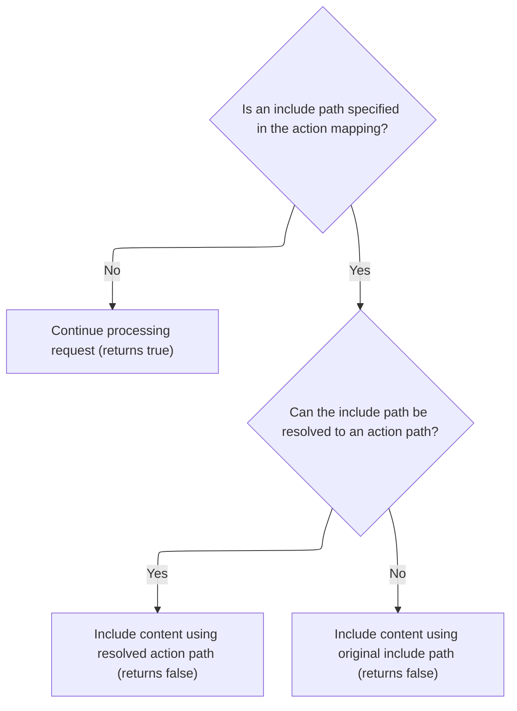

This document explains how the system dynamically includes additional content in HTTP responses based on action mappings. When a request is received, the flow checks for an include path in the mapping. If present, it attempts to resolve and include the relevant content; otherwise, normal processing continues.

# Delegating Include Handling from Faces Layer

<SwmSnippet path="/faces/src/main/java/org/apache/struts/faces/application/FacesRequestProcessor.java" line="291">

---

<SwmToken path="faces/src/main/java/org/apache/struts/faces/application/FacesRequestProcessor.java" pos="291:5:5" line-data="    protected boolean processInclude(HttpServletRequest request,">`processInclude`</SwmToken> in <SwmToken path="faces/src/main/java/org/apache/struts/faces/application/FacesRequestProcessor.java" pos="65:4:4" line-data="public class FacesRequestProcessor extends RequestProcessor {">`FacesRequestProcessor`</SwmToken> starts the flow by delegating include handling to the core <SwmToken path="faces/src/main/java/org/apache/struts/faces/application/FacesRequestProcessor.java" pos="45:10:10" line-data="import org.apache.struts.action.RequestProcessor;">`RequestProcessor`</SwmToken>. This lets the framework reuse the standard Struts1 logic for includes, so any Faces-specific tweaks can happen before or after if needed. We call the core processor next to keep the flow consistent with the rest of the Struts1 framework.

```java
    protected boolean processInclude(HttpServletRequest request,
                                     HttpServletResponse response,
                                     ActionMapping mapping)
        throws IOException, ServletException {

        if (log.isTraceEnabled()) {
            log.trace("Performing standard include handling");
        }
        boolean result = super.processInclude
            (request, response, mapping);
        if (log.isDebugEnabled()) {
            log.debug("Standard include handling returned " + result);
        }
        return (result);

    }
```

---

</SwmSnippet>

# Resolving and Processing the Include Path



<SwmSnippet path="/core/src/main/java/org/apache/struts/action/RequestProcessor.java" line="584">

---

<SwmToken path="core/src/main/java/org/apache/struts/action/RequestProcessor.java" pos="584:5:5" line-data="    protected boolean processInclude(HttpServletRequest request,">`processInclude`</SwmToken> in <SwmToken path="faces/src/main/java/org/apache/struts/faces/application/FacesRequestProcessor.java" pos="45:10:10" line-data="import org.apache.struts.action.RequestProcessor;">`RequestProcessor`</SwmToken> checks if there's an include path in the mapping. If not, it lets processing continue. If there is, it tries to resolve it to an action path, then calls <SwmToken path="core/src/main/java/org/apache/struts/action/RequestProcessor.java" pos="600:1:1" line-data="        internalModuleRelativeInclude(include, request, response);">`internalModuleRelativeInclude`</SwmToken> to handle the include, and stops further processing by returning false.

```java
    protected boolean processInclude(HttpServletRequest request,
        HttpServletResponse response, ActionMapping mapping)
        throws IOException, ServletException {
        // Are we going to processing this request?
        String include = mapping.getInclude();

        if (include == null) {
            return (true);
        }

        // If the forward can be unaliased into an action, then use the path of the action
        String actionIdPath = RequestUtils.actionIdURL(include, this.moduleConfig, this.servlet);
        if (actionIdPath != null) {
            include = actionIdPath;
        }

        internalModuleRelativeInclude(include, request, response);

        return (false);
    }
```

---

</SwmSnippet>

# Prefixing and Delegating <SwmToken path="core/src/main/java/org/apache/struts/action/RequestProcessor.java" pos="1008:8:10" line-data="     * @param uri      Module-relative URI to forward to">`Module-relative`</SwmToken> Includes

<SwmSnippet path="/core/src/main/java/org/apache/struts/action/RequestProcessor.java" line="1044">

---

<SwmToken path="core/src/main/java/org/apache/struts/action/RequestProcessor.java" pos="1044:5:5" line-data="    protected void internalModuleRelativeInclude(String uri,">`internalModuleRelativeInclude`</SwmToken> takes the URI, adds the module prefix so it's scoped to the right module, logs the delegation, and then hands off to <SwmToken path="core/src/main/java/org/apache/struts/action/RequestProcessor.java" pos="1056:1:1" line-data="        doInclude(uri, request, response);">`doInclude`</SwmToken> to actually perform the include.

```java
    protected void internalModuleRelativeInclude(String uri,
        HttpServletRequest request, HttpServletResponse response)
        throws IOException, ServletException {
        // Construct a request dispatcher for the specified path
        uri = moduleConfig.getPrefix() + uri;

        // Delegate the processing of this request
        // FIXME - exception handling?
        if (log.isDebugEnabled()) {
            log.debug(" Delegating via include to '" + uri + "'");
        }

        doInclude(uri, request, response);
    }
```

---

</SwmSnippet>

<SwmSnippet path="/core/src/main/java/org/apache/struts/action/RequestProcessor.java" line="1098">

---

<SwmToken path="core/src/main/java/org/apache/struts/action/RequestProcessor.java" pos="1098:5:5" line-data="    protected void doInclude(String uri, HttpServletRequest request,">`doInclude`</SwmToken> grabs a <SwmToken path="core/src/main/java/org/apache/struts/action/RequestProcessor.java" pos="1101:1:1" line-data="        RequestDispatcher rd = getServletContext().getRequestDispatcher(uri);">`RequestDispatcher`</SwmToken> for the URI, checks if it's valid, and either includes the resource in the response or sends an error if the dispatcher can't be found.

```java
    protected void doInclude(String uri, HttpServletRequest request,
        HttpServletResponse response)
        throws IOException, ServletException {
        RequestDispatcher rd = getServletContext().getRequestDispatcher(uri);

        if (rd == null) {
            response.sendError(HttpServletResponse.SC_INTERNAL_SERVER_ERROR,
                getInternal().getMessage("requestDispatcher", uri));

            return;
        }

        rd.include(request, response);
    }
```

---

</SwmSnippet>

&nbsp;

*This is an auto-generated document by Swimm 🌊 and has not yet been verified by a human*

<SwmMeta version="3.0.0" repo-id="Z2l0aHViJTNBJTNBc3RydXRzMSUzQSUzQVN3aW1tLURlbW8=" repo-name="struts1"><sup>Powered by [Swimm](https://app.swimm.io/)</sup></SwmMeta>
