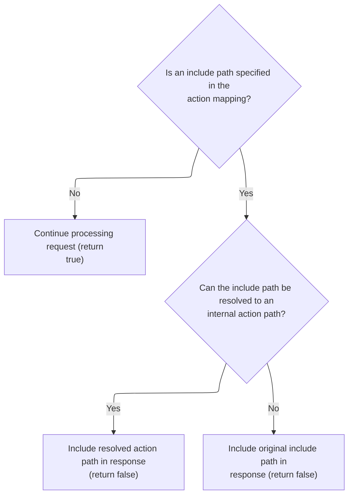

This document describes how HTTP requests are processed to include additional resources based on configuration in the action mapping. The flow enables modular request handling by resolving and dispatching the appropriate resource, or returning a localized error message if the resource cannot be found.

# Delegating Include Handling from Faces Layer

```mermaid
%%{init: {"flowchart": {"defaultRenderer": "elk"}} }%%
flowchart TD
    node1{"Is trace logging enabled?"}
    click node1 openCode "faces/src/main/java/org/apache/struts/faces/application/FacesRequestProcessor.java:296:298"
    node1 -->|"Yes"| node2["Log trace message"]
    click node2 openCode "faces/src/main/java/org/apache/struts/faces/application/FacesRequestProcessor.java:297:297"
    node1 -->|"No"| node3["Delegate to standard include handling
and get result"]
    click node3 openCode "faces/src/main/java/org/apache/struts/faces/application/FacesRequestProcessor.java:299:300"
    node2 --> node3
    node3 --> node4{"Is debug logging enabled?"}
    click node4 openCode "faces/src/main/java/org/apache/struts/faces/application/FacesRequestProcessor.java:301:303"
    node4 -->|"Yes"| node5["Log debug message with result"]
    click node5 openCode "faces/src/main/java/org/apache/struts/faces/application/FacesRequestProcessor.java:302:302"
    node4 -->|"No"| node6["Return result of standard include
handling"]
    click node6 openCode "faces/src/main/java/org/apache/struts/faces/application/FacesRequestProcessor.java:304:304"
    node5 --> node6
classDef HeadingStyle fill:#777777,stroke:#333,stroke-width:2px;

%% Swimm:
%% %%{init: {"flowchart": {"defaultRenderer": "elk"}} }%%
%% flowchart TD
%%     node1{"Is trace logging enabled?"}
%%     click node1 openCode "<SwmPath>[faces/…/application/FacesRequestProcessor.java](faces/src/main/java/org/apache/struts/faces/application/FacesRequestProcessor.java)</SwmPath>:296:298"
%%     node1 -->|"Yes"| node2["Log trace message"]
%%     click node2 openCode "<SwmPath>[faces/…/application/FacesRequestProcessor.java](faces/src/main/java/org/apache/struts/faces/application/FacesRequestProcessor.java)</SwmPath>:297:297"
%%     node1 -->|"No"| node3["Delegate to standard include handling
%% and get result"]
%%     click node3 openCode "<SwmPath>[faces/…/application/FacesRequestProcessor.java](faces/src/main/java/org/apache/struts/faces/application/FacesRequestProcessor.java)</SwmPath>:299:300"
%%     node2 --> node3
%%     node3 --> node4{"Is debug logging enabled?"}
%%     click node4 openCode "<SwmPath>[faces/…/application/FacesRequestProcessor.java](faces/src/main/java/org/apache/struts/faces/application/FacesRequestProcessor.java)</SwmPath>:301:303"
%%     node4 -->|"Yes"| node5["Log debug message with result"]
%%     click node5 openCode "<SwmPath>[faces/…/application/FacesRequestProcessor.java](faces/src/main/java/org/apache/struts/faces/application/FacesRequestProcessor.java)</SwmPath>:302:302"
%%     node4 -->|"No"| node6["Return result of standard include
%% handling"]
%%     click node6 openCode "<SwmPath>[faces/…/application/FacesRequestProcessor.java](faces/src/main/java/org/apache/struts/faces/application/FacesRequestProcessor.java)</SwmPath>:304:304"
%%     node5 --> node6
%% classDef HeadingStyle fill:#777777,stroke:#333,stroke-width:2px;
```



<SwmSnippet path="/faces/src/main/java/org/apache/struts/faces/application/FacesRequestProcessor.java" line="291">

---

<SwmToken path="faces/src/main/java/org/apache/struts/faces/application/FacesRequestProcessor.java" pos="291:5:5" line-data="    protected boolean processInclude(HttpServletRequest request,">`processInclude`</SwmToken> in <SwmToken path="faces/src/main/java/org/apache/struts/faces/application/FacesRequestProcessor.java" pos="65:4:4" line-data="public class FacesRequestProcessor extends RequestProcessor {">`FacesRequestProcessor`</SwmToken> just logs the include operation and delegates the actual work to the superclass. We need to call <SwmToken path="faces/src/main/java/org/apache/struts/faces/application/FacesRequestProcessor.java" pos="45:10:10" line-data="import org.apache.struts.action.RequestProcessor;">`RequestProcessor`</SwmToken> next because that's where the real include logic happens.

```java
    protected boolean processInclude(HttpServletRequest request,
                                     HttpServletResponse response,
                                     ActionMapping mapping)
        throws IOException, ServletException {

        if (log.isTraceEnabled()) {
            log.trace("Performing standard include handling");
        }
        boolean result = super.processInclude
            (request, response, mapping);
        if (log.isDebugEnabled()) {
            log.debug("Standard include handling returned " + result);
        }
        return (result);

    }
```

---

</SwmSnippet>

# Resolving Include Path and Action Mapping



<SwmSnippet path="/core/src/main/java/org/apache/struts/action/RequestProcessor.java" line="584">

---

In <SwmToken path="core/src/main/java/org/apache/struts/action/RequestProcessor.java" pos="584:5:5" line-data="    protected boolean processInclude(HttpServletRequest request,">`processInclude`</SwmToken> of <SwmToken path="faces/src/main/java/org/apache/struts/faces/application/FacesRequestProcessor.java" pos="45:10:10" line-data="import org.apache.struts.action.RequestProcessor;">`RequestProcessor`</SwmToken>, we check if there's an include path and resolve it to an <SwmToken path="core/src/main/java/org/apache/struts/util/RequestUtils.java" pos="1087:3:3" line-data="        String actionId = null;">`actionId`</SwmToken> URL using <SwmToken path="core/src/main/java/org/apache/struts/action/RequestProcessor.java" pos="595:7:7" line-data="        String actionIdPath = RequestUtils.actionIdURL(include, this.moduleConfig, this.servlet);">`RequestUtils`</SwmToken>. We call <SwmToken path="core/src/main/java/org/apache/struts/action/RequestProcessor.java" pos="595:7:7" line-data="        String actionIdPath = RequestUtils.actionIdURL(include, this.moduleConfig, this.servlet);">`RequestUtils`</SwmToken> next to convert the logical action reference into a servlet path.

```java
    protected boolean processInclude(HttpServletRequest request,
        HttpServletResponse response, ActionMapping mapping)
        throws IOException, ServletException {
        // Are we going to processing this request?
        String include = mapping.getInclude();

        if (include == null) {
            return (true);
        }

        // If the forward can be unaliased into an action, then use the path of the action
        String actionIdPath = RequestUtils.actionIdURL(include, this.moduleConfig, this.servlet);
```

---

</SwmSnippet>

<SwmSnippet path="/core/src/main/java/org/apache/struts/util/RequestUtils.java" line="1080">

---

<SwmToken path="core/src/main/java/org/apache/struts/util/RequestUtils.java" pos="1080:7:7" line-data="    public static String actionIdURL(String originalPath, ModuleConfig moduleConfig, ActionServlet servlet) {">`actionIdURL`</SwmToken> checks if the path is absolute or root-relative and skips those. It splits the path to separate <SwmToken path="core/src/main/java/org/apache/struts/util/RequestUtils.java" pos="1087:3:3" line-data="        String actionId = null;">`actionId`</SwmToken> and query string, finds the <SwmToken path="core/src/main/java/org/apache/struts/util/RequestUtils.java" pos="1098:1:1" line-data="        ActionConfig actionConfig = moduleConfig.findActionConfigId(actionId);">`ActionConfig`</SwmToken>, builds the servlet path based on mapping patterns, and appends any query parameters. This ensures the include targets the right action resource.

```java
    public static String actionIdURL(String originalPath, ModuleConfig moduleConfig, ActionServlet servlet) {
        if (originalPath.startsWith("http") || originalPath.startsWith("/")) {
            return null;
        }

        // Split the forward path into the resource and query string;
        // it is possible a forward (or redirect) has added parameters.
        String actionId = null;
        String qs = null;
        int qpos = originalPath.indexOf("?");
        if (qpos == -1) {
            actionId = originalPath;
        } else {
            actionId = originalPath.substring(0, qpos);
            qs = originalPath.substring(qpos);
        }

        // Find the action of the given actionId
        ActionConfig actionConfig = moduleConfig.findActionConfigId(actionId);
        if (actionConfig == null) {
            if (log.isDebugEnabled()) {
                log.debug("No actionId found for " + actionId);
            }
            return null;
        }

        String path = actionConfig.getPath();
        String mapping = RequestUtils.getServletMapping(servlet);
        StringBuffer actionIdPath = new StringBuffer();

        // Form the path based on the servlet mapping pattern
        if (mapping.startsWith("*")) {
            actionIdPath.append(path);
            actionIdPath.append(mapping.substring(1));
        } else if (mapping.startsWith("/")) {  // implied ends with a *
            mapping = mapping.substring(0, mapping.length() - 1);
            if (mapping.endsWith("/") && path.startsWith("/")) {
                actionIdPath.append(mapping);
                actionIdPath.append(path.substring(1));
            } else {
                actionIdPath.append(mapping);
                actionIdPath.append(path);
            }
        } else {
            log.warn("Unknown servlet mapping pattern");
            actionIdPath.append(path);
        }

        // Lastly add any query parameters (the ? is part of the query string)
        if (qs != null) {
            actionIdPath.append(qs);
        }

        // Return the path
        if (log.isDebugEnabled()) {
            log.debug(originalPath + " unaliased to " + actionIdPath.toString());
        }
        return actionIdPath.toString();
    }
```

---

</SwmSnippet>

<SwmSnippet path="/core/src/main/java/org/apache/struts/action/RequestProcessor.java" line="596">

---

Back in RequestProcessor.processInclude, we use the path returned from <SwmToken path="core/src/main/java/org/apache/struts/action/RequestProcessor.java" pos="595:7:7" line-data="        String actionIdPath = RequestUtils.actionIdURL(include, this.moduleConfig, this.servlet);">`RequestUtils`</SwmToken> and call <SwmToken path="core/src/main/java/org/apache/struts/action/RequestProcessor.java" pos="600:1:1" line-data="        internalModuleRelativeInclude(include, request, response);">`internalModuleRelativeInclude`</SwmToken> to actually dispatch the include. This moves the flow to the next step where the include is handled relative to the module.

```java
        if (actionIdPath != null) {
            include = actionIdPath;
        }

        internalModuleRelativeInclude(include, request, response);

        return (false);
    }
```

---

</SwmSnippet>

# Dispatching Module-Relative Include

<SwmSnippet path="/core/src/main/java/org/apache/struts/action/RequestProcessor.java" line="1044">

---

<SwmToken path="core/src/main/java/org/apache/struts/action/RequestProcessor.java" pos="1044:5:5" line-data="    protected void internalModuleRelativeInclude(String uri,">`internalModuleRelativeInclude`</SwmToken> prepends the module prefix to the URI and delegates the request to <SwmToken path="core/src/main/java/org/apache/struts/action/RequestProcessor.java" pos="1056:1:1" line-data="        doInclude(uri, request, response);">`doInclude`</SwmToken>. This ensures the include is scoped to the right module before dispatching.

```java
    protected void internalModuleRelativeInclude(String uri,
        HttpServletRequest request, HttpServletResponse response)
        throws IOException, ServletException {
        // Construct a request dispatcher for the specified path
        uri = moduleConfig.getPrefix() + uri;

        // Delegate the processing of this request
        // FIXME - exception handling?
        if (log.isDebugEnabled()) {
            log.debug(" Delegating via include to '" + uri + "'");
        }

        doInclude(uri, request, response);
    }
```

---

</SwmSnippet>

# Obtaining Dispatcher and Handling Errors

<SwmSnippet path="/core/src/main/java/org/apache/struts/action/RequestProcessor.java" line="1098">

---

In <SwmToken path="core/src/main/java/org/apache/struts/action/RequestProcessor.java" pos="1098:5:5" line-data="    protected void doInclude(String uri, HttpServletRequest request,">`doInclude`</SwmToken>, we get the dispatcher for the URI. If it's missing, we send an error using a localized message from <SwmToken path="core/src/main/java/org/apache/struts/util/PropertyMessageResources.java" pos="82:8:8" line-data=" * Configure &lt;code&gt;PropertyMessageResources&lt;/code&gt; to operate in this mode by">`PropertyMessageResources`</SwmToken>. That's why we call <SwmToken path="core/src/main/java/org/apache/struts/util/PropertyMessageResources.java" pos="82:8:8" line-data=" * Configure &lt;code&gt;PropertyMessageResources&lt;/code&gt; to operate in this mode by">`PropertyMessageResources`</SwmToken> next.

```java
    protected void doInclude(String uri, HttpServletRequest request,
        HttpServletResponse response)
        throws IOException, ServletException {
        RequestDispatcher rd = getServletContext().getRequestDispatcher(uri);

        if (rd == null) {
            response.sendError(HttpServletResponse.SC_INTERNAL_SERVER_ERROR,
                getInternal().getMessage("requestDispatcher", uri));

            return;
        }

```

---

</SwmSnippet>

## Localized Message Lookup and Fallback

```mermaid
%%{init: {"flowchart": {"defaultRenderer": "elk"}} }%%
flowchart TD
  node1["Look up message for requested locale
and key"]
  click node1 openCode "core/src/main/java/org/apache/struts/util/PropertyMessageResources.java:238:241"
  node2{"Message found?"}
  click node2 openCode "core/src/main/java/org/apache/struts/util/PropertyMessageResources.java:239:241"
  node3["Return found message"]
  click node3 openCode "core/src/main/java/org/apache/struts/util/PropertyMessageResources.java:240:241"
  node4{"Which mode?"}
  click node4 openCode "core/src/main/java/org/apache/struts/util/PropertyMessageResources.java:244:265"
  node5{"Is requested locale the default?"}
  click node5 openCode "core/src/main/java/org/apache/struts/util/PropertyMessageResources.java:252:254"
  node6["Try fallback locale (Resource Bundle
mode)"]
  click node6 openCode "core/src/main/java/org/apache/struts/util/PropertyMessageResources.java:252:254"
  node7["Try fallback locale (Default mode)"]
  click node7 openCode "core/src/main/java/org/apache/struts/util/PropertyMessageResources.java:260:263"
  node8{"Message found in fallback?"}
  click node8 openCode "core/src/main/java/org/apache/struts/util/PropertyMessageResources.java:266:268"
  node9["Return found message"]
  click node9 openCode "core/src/main/java/org/apache/struts/util/PropertyMessageResources.java:267:268"
  node10["Try default message"]
  click node10 openCode "core/src/main/java/org/apache/struts/util/PropertyMessageResources.java:271:273"
  node11{"Message found in default?"}
  click node11 openCode "core/src/main/java/org/apache/struts/util/PropertyMessageResources.java:272:274"
  node12["Return found message"]
  click node12 openCode "core/src/main/java/org/apache/struts/util/PropertyMessageResources.java:273:274"
  node13{"Return null or missing indicator?
(returnNull flag)"}
  click node13 openCode "core/src/main/java/org/apache/struts/util/PropertyMessageResources.java:277:281"
  node14["Return null"]
  click node14 openCode "core/src/main/java/org/apache/struts/util/PropertyMessageResources.java:278:279"
  node15["Return missing message indicator"]
  click node15 openCode "core/src/main/java/org/apache/struts/util/PropertyMessageResources.java:280:281"

  node1 --> node2
  node2 -->|"Yes"| node3
  node2 -->|"No"| node4
  node4 -->|"JSTL"| node10
  node4 -->|"Resource Bundle"| node5
  node4 -->|"Default"| node5
  node5 -->|"No"| node6
  node5 -->|"Yes"| node10
  node6 --> node8
  node7 --> node8
  node8 -->|"Yes"| node9
  node8 -->|"No"| node10
  node10 --> node11
  node11 -->|"Yes"| node12
  node11 -->|"No"| node13
  node13 -->|"Yes"| node14
  node13 -->|"No"| node15

classDef HeadingStyle fill:#777777,stroke:#333,stroke-width:2px;

%% Swimm:
%% %%{init: {"flowchart": {"defaultRenderer": "elk"}} }%%
%% flowchart TD
%%   node1["Look up message for requested locale
%% and key"]
%%   click node1 openCode "<SwmPath>[core/…/util/PropertyMessageResources.java](core/src/main/java/org/apache/struts/util/PropertyMessageResources.java)</SwmPath>:238:241"
%%   node2{"Message found?"}
%%   click node2 openCode "<SwmPath>[core/…/util/PropertyMessageResources.java](core/src/main/java/org/apache/struts/util/PropertyMessageResources.java)</SwmPath>:239:241"
%%   node3["Return found message"]
%%   click node3 openCode "<SwmPath>[core/…/util/PropertyMessageResources.java](core/src/main/java/org/apache/struts/util/PropertyMessageResources.java)</SwmPath>:240:241"
%%   node4{"Which mode?"}
%%   click node4 openCode "<SwmPath>[core/…/util/PropertyMessageResources.java](core/src/main/java/org/apache/struts/util/PropertyMessageResources.java)</SwmPath>:244:265"
%%   node5{"Is requested locale the default?"}
%%   click node5 openCode "<SwmPath>[core/…/util/PropertyMessageResources.java](core/src/main/java/org/apache/struts/util/PropertyMessageResources.java)</SwmPath>:252:254"
%%   node6["Try fallback locale (Resource Bundle
%% mode)"]
%%   click node6 openCode "<SwmPath>[core/…/util/PropertyMessageResources.java](core/src/main/java/org/apache/struts/util/PropertyMessageResources.java)</SwmPath>:252:254"
%%   node7["Try fallback locale (Default mode)"]
%%   click node7 openCode "<SwmPath>[core/…/util/PropertyMessageResources.java](core/src/main/java/org/apache/struts/util/PropertyMessageResources.java)</SwmPath>:260:263"
%%   node8{"Message found in fallback?"}
%%   click node8 openCode "<SwmPath>[core/…/util/PropertyMessageResources.java](core/src/main/java/org/apache/struts/util/PropertyMessageResources.java)</SwmPath>:266:268"
%%   node9["Return found message"]
%%   click node9 openCode "<SwmPath>[core/…/util/PropertyMessageResources.java](core/src/main/java/org/apache/struts/util/PropertyMessageResources.java)</SwmPath>:267:268"
%%   node10["Try default message"]
%%   click node10 openCode "<SwmPath>[core/…/util/PropertyMessageResources.java](core/src/main/java/org/apache/struts/util/PropertyMessageResources.java)</SwmPath>:271:273"
%%   node11{"Message found in default?"}
%%   click node11 openCode "<SwmPath>[core/…/util/PropertyMessageResources.java](core/src/main/java/org/apache/struts/util/PropertyMessageResources.java)</SwmPath>:272:274"
%%   node12["Return found message"]
%%   click node12 openCode "<SwmPath>[core/…/util/PropertyMessageResources.java](core/src/main/java/org/apache/struts/util/PropertyMessageResources.java)</SwmPath>:273:274"
%%   node13{"Return null or missing indicator?
%% (<SwmToken path="core/src/main/java/org/apache/struts/util/PropertyMessageResources.java" pos="277:4:4" line-data="        if (returnNull) {">`returnNull`</SwmToken> flag)"}
%%   click node13 openCode "<SwmPath>[core/…/util/PropertyMessageResources.java](core/src/main/java/org/apache/struts/util/PropertyMessageResources.java)</SwmPath>:277:281"
%%   node14["Return null"]
%%   click node14 openCode "<SwmPath>[core/…/util/PropertyMessageResources.java](core/src/main/java/org/apache/struts/util/PropertyMessageResources.java)</SwmPath>:278:279"
%%   node15["Return missing message indicator"]
%%   click node15 openCode "<SwmPath>[core/…/util/PropertyMessageResources.java](core/src/main/java/org/apache/struts/util/PropertyMessageResources.java)</SwmPath>:280:281"
%% 
%%   node1 --> node2
%%   node2 -->|"Yes"| node3
%%   node2 -->|"No"| node4
%%   node4 -->|"JSTL"| node10
%%   node4 -->|"Resource Bundle"| node5
%%   node4 -->|"Default"| node5
%%   node5 -->|"No"| node6
%%   node5 -->|"Yes"| node10
%%   node6 --> node8
%%   node7 --> node8
%%   node8 -->|"Yes"| node9
%%   node8 -->|"No"| node10
%%   node10 --> node11
%%   node11 -->|"Yes"| node12
%%   node11 -->|"No"| node13
%%   node13 -->|"Yes"| node14
%%   node13 -->|"No"| node15
%% 
%% classDef HeadingStyle fill:#777777,stroke:#333,stroke-width:2px;
```



<SwmSnippet path="/core/src/main/java/org/apache/struts/util/PropertyMessageResources.java" line="227">

---

<SwmToken path="core/src/main/java/org/apache/struts/util/PropertyMessageResources.java" pos="227:5:5" line-data="    public String getMessage(Locale locale, String key) {">`getMessage`</SwmToken> looks up a localized message, using different fallback strategies depending on the mode. If not found, it checks the default locale or properties file, and returns either null or a formatted error string. We call <SwmToken path="core/src/main/java/org/apache/struts/util/PropertyMessageResources.java" pos="238:5:5" line-data="        message = findMessage(locale, key, originalKey);">`findMessage`</SwmToken> next to walk through locale variants.

```java
    public String getMessage(Locale locale, String key) {
        if (log.isDebugEnabled()) {
            log.debug("getMessage(" + locale + "," + key + ")");
        }

        // Initialize variables we will require
        String localeKey = localeKey(locale);
        String originalKey = messageKey(localeKey, key);
        String message = null;

        // Search the specified Locale
        message = findMessage(locale, key, originalKey);
        if (message != null) {
            return message;
        }

        // JSTL Compatibility - JSTL doesn't use the default locale
        if (mode == MODE_JSTL) {

           // do nothing (i.e. don't use default Locale)

        // PropertyResourcesBundle - searches through the hierarchy
        // for the default Locale (e.g. first en_US then en)
        } else if (mode == MODE_RESOURCE_BUNDLE) {

            if (!defaultLocale.equals(locale)) {
                message = findMessage(defaultLocale, key, originalKey);
            }

        // Default (backwards) Compatibility - just searches the
        // specified Locale (e.g. just en_US)
        } else {

            if (!defaultLocale.equals(locale)) {
                localeKey = localeKey(defaultLocale);
                message = findMessage(localeKey, key, originalKey);
            }

        }
        if (message != null) {
            return message;
        }

        // Find the message in the default properties file
        message = findMessage("", key, originalKey);
        if (message != null) {
            return message;
        }

        // Return an appropriate error indication
        if (returnNull) {
            return (null);
        } else {
            return ("???" + messageKey(locale, key) + "???");
        }
    }
```

---

</SwmSnippet>

<SwmSnippet path="/core/src/main/java/org/apache/struts/util/PropertyMessageResources.java" line="393">

---

<SwmToken path="core/src/main/java/org/apache/struts/util/PropertyMessageResources.java" pos="393:5:5" line-data="    private String findMessage(Locale locale, String key, String originalKey) {">`findMessage`</SwmToken> tries the most specific locale key first, then strips modifiers to check more general keys. This lets us find a message even if it's not defined for the exact locale variant.

```java
    private String findMessage(Locale locale, String key, String originalKey) {

        // Initialize variables we will require
        String localeKey = localeKey(locale);
        String messageKey = null;
        String message = null;
        int underscore = 0;

        // Loop from specific to general Locales looking for this message
        while (true) {
            message = findMessage(localeKey, key, originalKey);
            if (message != null) {
                break;
            }

            // Strip trailing modifiers to try a more general locale key
            underscore = localeKey.lastIndexOf("_");

            if (underscore < 0) {
                break;
            }

            localeKey = localeKey.substring(0, underscore);
        }
```

---

</SwmSnippet>

## Executing the Include or Sending Error

<SwmSnippet path="/core/src/main/java/org/apache/struts/action/RequestProcessor.java" line="1110">

---

Just returned from <SwmToken path="core/src/main/java/org/apache/struts/util/PropertyMessageResources.java" pos="82:8:8" line-data=" * Configure &lt;code&gt;PropertyMessageResources&lt;/code&gt; to operate in this mode by">`PropertyMessageResources`</SwmToken>, so in RequestProcessor.doInclude, if the dispatcher was found, we call include to process the request. If not, the error message was already sent and nothing else happens.

```java
        rd.include(request, response);
    }
```

---

</SwmSnippet>

&nbsp;

*This is an auto-generated document by Swimm 🌊 and has not yet been verified by a human*

<SwmMeta version="3.0.0" repo-id="Z2l0aHViJTNBJTNBc3RydXRzMSUzQSUzQVN3aW1tLURlbW8=" repo-name="struts1"><sup>Powered by [Swimm](https://app.swimm.io/)</sup></SwmMeta>
