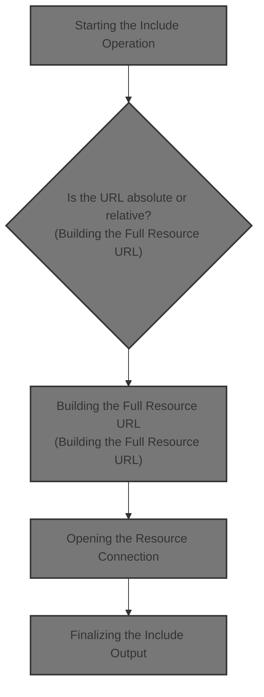
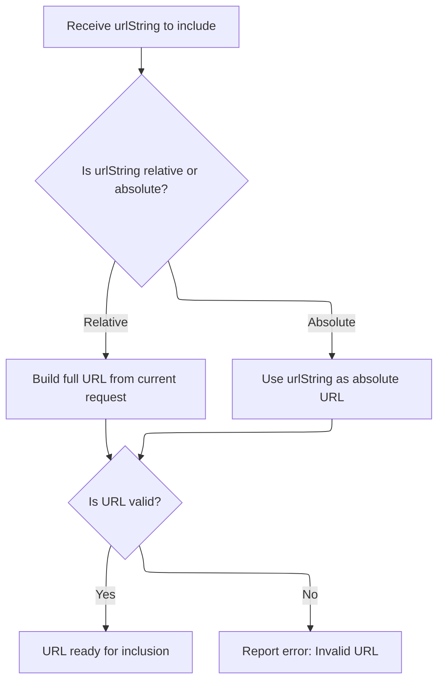
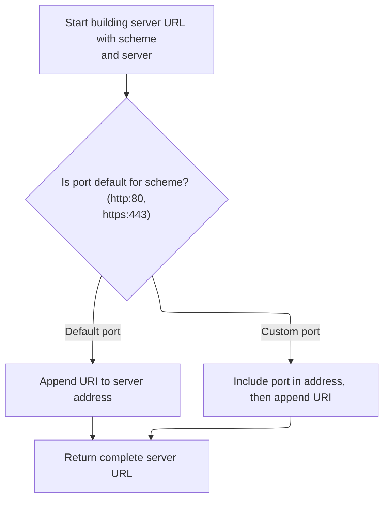
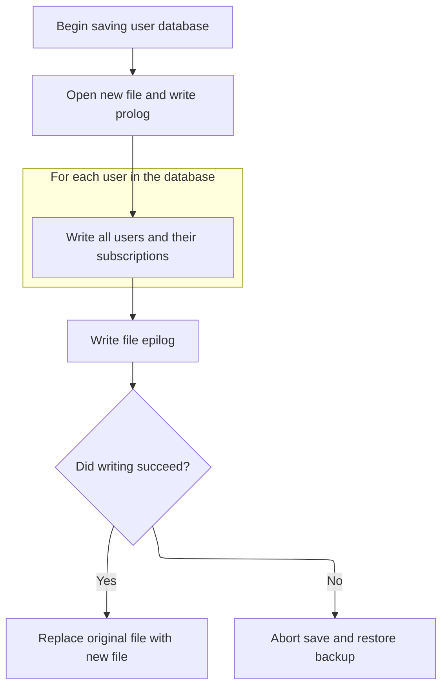

This document describes how content from a specified URL is dynamically included in the current page. The process determines if the URL is absolute or relative, ensures session continuity if needed, and makes the fetched content available for page output.



# Starting the Include Operation

```mermaid
%%{init: {"flowchart": {"defaultRenderer": "elk"}} }%%
flowchart TD
  node1["Start: Prepare to include content from
target URL"] --> node2{"Is URL absolute?"}
  click node1 openCode "taglib/src/main/java/org/apache/struts/taglib/bean/IncludeTag.java:164:174"
  node2 -->|"No"| node3["Build full URL using request context"]
  click node2 openCode "taglib/src/main/java/org/apache/struts/taglib/bean/IncludeTag.java:180:182"
  node2 -->|"Yes"| node4["Use absolute URL"]
  click node3 openCode "core/src/main/java/org/apache/struts/util/RequestUtils.java:934:934"
  click node4 openCode "taglib/src/main/java/org/apache/struts/taglib/bean/IncludeTag.java:186:186"
  node3 --> node5["Open connection to target URL"]
  node4 --> node5
  click node5 openCode "taglib/src/main/java/org/apache/struts/taglib/bean/IncludeTag.java:198:201"
  node5 --> node6{"Session ID present?"}
  click node6 openCode "taglib/src/main/java/org/apache/struts/taglib/bean/IncludeTag.java:263:265"
  node6 -->|"Yes"| node7["Add session cookie to connection"]
  click node7 openCode "taglib/src/main/java/org/apache/struts/taglib/bean/IncludeTag.java:266:269"
  node6 -->|"No"| node8["Proceed without session cookie"]
  click node8 openCode "taglib/src/main/java/org/apache/struts/taglib/bean/IncludeTag.java:270:270"
  node7 --> node9
  node8 --> node9
  subgraph loop1["Read content from URL in chunks"]
    node9{
classDef HeadingStyle fill:#777777,stroke:#333,stroke-width:2px;

%% Swimm:
%% %%{init: {"flowchart": {"defaultRenderer": "elk"}} }%%
%% flowchart TD
%%   node1["Start: Prepare to include content from
%% target URL"] --> node2{"Is URL absolute?"}
%%   click node1 openCode "<SwmPath>[taglib/…/bean/IncludeTag.java](taglib/src/main/java/org/apache/struts/taglib/bean/IncludeTag.java)</SwmPath>:164:174"
%%   node2 -->|"No"| node3["Build full URL using request context"]
%%   click node2 openCode "<SwmPath>[taglib/…/bean/IncludeTag.java](taglib/src/main/java/org/apache/struts/taglib/bean/IncludeTag.java)</SwmPath>:180:182"
%%   node2 -->|"Yes"| node4["Use absolute URL"]
%%   click node3 openCode "<SwmPath>[core/…/util/RequestUtils.java](core/src/main/java/org/apache/struts/util/RequestUtils.java)</SwmPath>:934:934"
%%   click node4 openCode "<SwmPath>[taglib/…/bean/IncludeTag.java](taglib/src/main/java/org/apache/struts/taglib/bean/IncludeTag.java)</SwmPath>:186:186"
%%   node3 --> node5["Open connection to target URL"]
%%   node4 --> node5
%%   click node5 openCode "<SwmPath>[taglib/…/bean/IncludeTag.java](taglib/src/main/java/org/apache/struts/taglib/bean/IncludeTag.java)</SwmPath>:198:201"
%%   node5 --> node6{"Session ID present?"}
%%   click node6 openCode "<SwmPath>[taglib/…/bean/IncludeTag.java](taglib/src/main/java/org/apache/struts/taglib/bean/IncludeTag.java)</SwmPath>:263:265"
%%   node6 -->|"Yes"| node7["Add session cookie to connection"]
%%   click node7 openCode "<SwmPath>[taglib/…/bean/IncludeTag.java](taglib/src/main/java/org/apache/struts/taglib/bean/IncludeTag.java)</SwmPath>:266:269"
%%   node6 -->|"No"| node8["Proceed without session cookie"]
%%   click node8 openCode "<SwmPath>[taglib/…/bean/IncludeTag.java](taglib/src/main/java/org/apache/struts/taglib/bean/IncludeTag.java)</SwmPath>:270:270"
%%   node7 --> node9
%%   node8 --> node9
%%   subgraph loop1["Read content from URL in chunks"]
%%     node9{
%% classDef HeadingStyle fill:#777777,stroke:#333,stroke-width:2px;
```

<SwmSnippet path="/taglib/src/main/java/org/apache/struts/taglib/bean/IncludeTag.java" line="164">

---

In <SwmToken path="taglib/src/main/java/org/apache/struts/taglib/bean/IncludeTag.java" pos="164:5:5" line-data="    public int doStartTag() throws JspException {">`doStartTag`</SwmToken>, we prep the parameters and build the URL for the resource to include. If the URL is relative (no ':'), we need the current <SwmToken path="taglib/src/main/java/org/apache/struts/taglib/bean/IncludeTag.java" pos="181:1:1" line-data="                HttpServletRequest request =">`HttpServletRequest`</SwmToken> to resolve it, so we grab it from the page context. That's why the next step is to get the servlet request context.

```java
    public int doStartTag() throws JspException {
        // Set up a URLConnection to read the requested resource
        Map params =
            TagUtils.getInstance().computeParameters(pageContext, null, null,
                null, null, null, null, null, transaction);

        // FIXME - <html:link> attributes
        String urlString = null;
        URL url = null;

        try {
            urlString =
                TagUtils.getInstance().computeURLWithCharEncoding(pageContext,
                    forward, href, page, null, null, params, anchor, false,
                    useLocalEncoding);

            if (urlString.indexOf(':') < 0) {
                HttpServletRequest request =
                    (HttpServletRequest) pageContext.getRequest();

```

---

</SwmSnippet>

## Accessing the Servlet Request

<SwmSnippet path="/core/src/main/java/org/apache/struts/chain/contexts/ServletActionContext.java" line="94">

---

<SwmToken path="core/src/main/java/org/apache/struts/chain/contexts/ServletActionContext.java" pos="94:5:5" line-data="    public HttpServletRequest getRequest() {">`getRequest`</SwmToken> just pulls the <SwmToken path="core/src/main/java/org/apache/struts/chain/contexts/ServletActionContext.java" pos="94:3:3" line-data="    public HttpServletRequest getRequest() {">`HttpServletRequest`</SwmToken> from the underlying <SwmToken path="core/src/main/java/org/apache/struts/chain/contexts/ServletActionContext.java" pos="67:3:3" line-data="    protected ServletWebContext servletWebContext() {">`ServletWebContext`</SwmToken>. We need this to resolve relative <SwmToken path="core/src/main/java/org/apache/struts/util/RequestUtils.java" pos="677:9:9" line-data="     * the case for URLs that were originally created from relative or">`URLs`</SwmToken> against the current request.

```java
    public HttpServletRequest getRequest() {
        return servletWebContext().getRequest();
    }
```

---

</SwmSnippet>

<SwmSnippet path="/core/src/main/java/org/apache/struts/chain/contexts/ServletActionContext.java" line="67">

---

<SwmToken path="core/src/main/java/org/apache/struts/chain/contexts/ServletActionContext.java" pos="67:5:5" line-data="    protected ServletWebContext servletWebContext() {">`servletWebContext`</SwmToken> does a direct cast from the base context to <SwmToken path="core/src/main/java/org/apache/struts/chain/contexts/ServletActionContext.java" pos="67:3:3" line-data="    protected ServletWebContext servletWebContext() {">`ServletWebContext`</SwmToken>. If the base context isn't what we expect, this blows up. It's a shortcut for getting the servlet-specific context.

```java
    protected ServletWebContext servletWebContext() {
        return (ServletWebContext) this.getBaseContext();
    }
```

---

</SwmSnippet>

## Building the Full Resource URL



<SwmSnippet path="/taglib/src/main/java/org/apache/struts/taglib/bean/IncludeTag.java" line="184">

---

Back in IncludeTag.doStartTag, after getting the request, we use <SwmToken path="taglib/src/main/java/org/apache/struts/taglib/bean/IncludeTag.java" pos="184:9:11" line-data="                url = new URL(RequestUtils.requestURL(request), urlString);">`RequestUtils.requestURL`</SwmToken> to resolve the relative URL against the current request. This gives us the base URL to combine with the resource path.

```java
                url = new URL(RequestUtils.requestURL(request), urlString);
            } else {
                url = new URL(urlString);
            }
        } catch (MalformedURLException e) {
            TagUtils.getInstance().saveException(pageContext, e);
            throw new JspException(messages.getMessage("include.url",
                    e.toString()), e);
        }

```

---

</SwmSnippet>

## Resolving the Request Base URL

<SwmSnippet path="/core/src/main/java/org/apache/struts/util/RequestUtils.java" line="934">

---

<SwmToken path="core/src/main/java/org/apache/struts/util/RequestUtils.java" pos="934:7:7" line-data="    public static URL requestURL(HttpServletRequest request)">`requestURL`</SwmToken> calls <SwmToken path="core/src/main/java/org/apache/struts/util/RequestUtils.java" pos="936:7:7" line-data="        StringBuffer url = requestToServerUriStringBuffer(request);">`requestToServerUriStringBuffer`</SwmToken> to build the base URL for the current request, then wraps it in a URL object. This is used to resolve the resource location.

```java
    public static URL requestURL(HttpServletRequest request)
        throws MalformedURLException {
        StringBuffer url = requestToServerUriStringBuffer(request);

        return (new URL(url.toString()));
    }
```

---

</SwmSnippet>

## Composing the Server URI String

<SwmSnippet path="/core/src/main/java/org/apache/struts/util/RequestUtils.java" line="968">

---

<SwmToken path="core/src/main/java/org/apache/struts/util/RequestUtils.java" pos="968:7:7" line-data="    public static StringBuffer requestToServerUriStringBuffer(">`requestToServerUriStringBuffer`</SwmToken> builds the server URI string from the request's scheme, host, port, and path by delegating to <SwmToken path="core/src/main/java/org/apache/struts/util/RequestUtils.java" pos="971:1:1" line-data="            createServerUriStringBuffer(request.getScheme(),">`createServerUriStringBuffer`</SwmToken>. This keeps the URI construction logic consistent.

```java
    public static StringBuffer requestToServerUriStringBuffer(
        HttpServletRequest request) {
        StringBuffer serverUri =
            createServerUriStringBuffer(request.getScheme(),
                request.getServerName(), request.getServerPort(),
                request.getRequestURI());

        return serverUri;
    }
```

---

</SwmSnippet>

## Building the Server URI Components



<SwmSnippet path="/core/src/main/java/org/apache/struts/util/RequestUtils.java" line="1037">

---

In <SwmToken path="core/src/main/java/org/apache/struts/util/RequestUtils.java" pos="1037:7:7" line-data="    public static StringBuffer createServerUriStringBuffer(String scheme,">`createServerUriStringBuffer`</SwmToken>, we call <SwmToken path="core/src/main/java/org/apache/struts/util/RequestUtils.java" pos="1039:7:7" line-data="        StringBuffer serverUri = createServerStringBuffer(scheme, server, port);">`createServerStringBuffer`</SwmToken> to assemble the scheme, host, and port, then we'll append the URI path. This splits the work for clarity and reuse.

```java
    public static StringBuffer createServerUriStringBuffer(String scheme,
        String server, int port, String uri) {
        StringBuffer serverUri = createServerStringBuffer(scheme, server, port);

```

---

</SwmSnippet>

<SwmSnippet path="/core/src/main/java/org/apache/struts/util/RequestUtils.java" line="1005">

---

<SwmToken path="core/src/main/java/org/apache/struts/util/RequestUtils.java" pos="1005:7:7" line-data="    public static StringBuffer createServerStringBuffer(String scheme,">`createServerStringBuffer`</SwmToken> builds the scheme, host, and port part of the URL. It works around a <SwmToken path="core/src/main/java/org/apache/struts/util/RequestUtils.java" pos="1010:14:18" line-data="            port = 80; // Work around java.net.URL bug">`java.net.URL`</SwmToken> bug by forcing negative ports to 80, and only appends the port if it's not the default for http/https.

```java
    public static StringBuffer createServerStringBuffer(String scheme,
        String server, int port) {
        StringBuffer url = new StringBuffer();

        if (port < 0) {
            port = 80; // Work around java.net.URL bug
        }

        url.append(scheme);
        url.append("://");
        url.append(server);

        if ((scheme.equals("http") && (port != 80))
            || (scheme.equals("https") && (port != 443))) {
            url.append(':');
            url.append(port);
        }

        return url;
    }
```

---

</SwmSnippet>

<SwmSnippet path="/core/src/main/java/org/apache/struts/util/RequestUtils.java" line="1041">

---

We just returned from <SwmToken path="core/src/main/java/org/apache/struts/util/RequestUtils.java" pos="1005:7:7" line-data="    public static StringBuffer createServerStringBuffer(String scheme,">`createServerStringBuffer`</SwmToken>, so now we append the URI path to get the complete <SwmToken path="core/src/main/java/org/apache/struts/util/RequestUtils.java" pos="1041:1:1" line-data="        serverUri.append(uri);">`serverUri`</SwmToken>. This is the final step in <SwmToken path="core/src/main/java/org/apache/struts/util/RequestUtils.java" pos="936:7:7" line-data="        StringBuffer url = requestToServerUriStringBuffer(request);">`requestToServerUriStringBuffer`</SwmToken>.

```java
        serverUri.append(uri);

        return serverUri;
    }
```

---

</SwmSnippet>

## Opening the Resource Connection

```mermaid
%%{init: {"flowchart": {"defaultRenderer": "elk"}} }%%
flowchart TD
    node1["Prepare connection to URL"] --> node2{"Session id present and required?"}
    click node1 openCode "taglib/src/main/java/org/apache/struts/taglib/bean/IncludeTag.java:194:202"
    node2 -->|"Yes"| node3["Add session cookie to request"]
    click node2 openCode "taglib/src/main/java/org/apache/struts/taglib/bean/IncludeTag.java:262:270"
    node2 -->|"No"| node4["Connect to URL"]
    node3 --> node4
    click node3 openCode "taglib/src/main/java/org/apache/struts/taglib/bean/IncludeTag.java:207:207"
    node4 --> node5{"Connection and reading successful?"}
    click node4 openCode "taglib/src/main/java/org/apache/struts/taglib/bean/IncludeTag.java:210:211"
    node5 -->|"Yes"| node6["Read content from URL"]
    node5 -->|"No"| node8["Content not included in page"]
    click node5 openCode "taglib/src/main/java/org/apache/struts/taglib/bean/IncludeTag.java:217:242"
    subgraph loop1["Read content from URL in chunks"]
        node6 --> node7{"More content to read?"}
        click node6 openCode "taglib/src/main/java/org/apache/struts/taglib/bean/IncludeTag.java:227:235"
        node7 -->|"Yes"| node9["Append content"]
        click node7 openCode "taglib/src/main/java/org/apache/struts/taglib/bean/IncludeTag.java:228:234"
        node9 --> node7
        node7 -->|"No"| node10["Content ready for inclusion"]
        click node10 openCode "taglib/src/main/java/org/apache/struts/taglib/bean/IncludeTag.java:235:237"
    end
    node10 --> node11["Include content in page"]
    click node11 openCode "taglib/src/main/java/org/apache/struts/taglib/bean/IncludeTag.java:237:237"
    node8 --> node12["End"]
    click node8 openCode "taglib/src/main/java/org/apache/struts/taglib/bean/IncludeTag.java:211:215"
    click node12 openCode "taglib/src/main/java/org/apache/struts/taglib/bean/IncludeTag.java:215:215"

classDef HeadingStyle fill:#777777,stroke:#333,stroke-width:2px;

%% Swimm:
%% %%{init: {"flowchart": {"defaultRenderer": "elk"}} }%%
%% flowchart TD
%%     node1["Prepare connection to URL"] --> node2{"Session id present and required?"}
%%     click node1 openCode "<SwmPath>[taglib/…/bean/IncludeTag.java](taglib/src/main/java/org/apache/struts/taglib/bean/IncludeTag.java)</SwmPath>:194:202"
%%     node2 -->|"Yes"| node3["Add session cookie to request"]
%%     click node2 openCode "<SwmPath>[taglib/…/bean/IncludeTag.java](taglib/src/main/java/org/apache/struts/taglib/bean/IncludeTag.java)</SwmPath>:262:270"
%%     node2 -->|"No"| node4["Connect to URL"]
%%     node3 --> node4
%%     click node3 openCode "<SwmPath>[taglib/…/bean/IncludeTag.java](taglib/src/main/java/org/apache/struts/taglib/bean/IncludeTag.java)</SwmPath>:207:207"
%%     node4 --> node5{"Connection and reading successful?"}
%%     click node4 openCode "<SwmPath>[taglib/…/bean/IncludeTag.java](taglib/src/main/java/org/apache/struts/taglib/bean/IncludeTag.java)</SwmPath>:210:211"
%%     node5 -->|"Yes"| node6["Read content from URL"]
%%     node5 -->|"No"| node8["Content not included in page"]
%%     click node5 openCode "<SwmPath>[taglib/…/bean/IncludeTag.java](taglib/src/main/java/org/apache/struts/taglib/bean/IncludeTag.java)</SwmPath>:217:242"
%%     subgraph loop1["Read content from URL in chunks"]
%%         node6 --> node7{"More content to read?"}
%%         click node6 openCode "<SwmPath>[taglib/…/bean/IncludeTag.java](taglib/src/main/java/org/apache/struts/taglib/bean/IncludeTag.java)</SwmPath>:227:235"
%%         node7 -->|"Yes"| node9["Append content"]
%%         click node7 openCode "<SwmPath>[taglib/…/bean/IncludeTag.java](taglib/src/main/java/org/apache/struts/taglib/bean/IncludeTag.java)</SwmPath>:228:234"
%%         node9 --> node7
%%         node7 -->|"No"| node10["Content ready for inclusion"]
%%         click node10 openCode "<SwmPath>[taglib/…/bean/IncludeTag.java](taglib/src/main/java/org/apache/struts/taglib/bean/IncludeTag.java)</SwmPath>:235:237"
%%     end
%%     node10 --> node11["Include content in page"]
%%     click node11 openCode "<SwmPath>[taglib/…/bean/IncludeTag.java](taglib/src/main/java/org/apache/struts/taglib/bean/IncludeTag.java)</SwmPath>:237:237"
%%     node8 --> node12["End"]
%%     click node8 openCode "<SwmPath>[taglib/…/bean/IncludeTag.java](taglib/src/main/java/org/apache/struts/taglib/bean/IncludeTag.java)</SwmPath>:211:215"
%%     click node12 openCode "<SwmPath>[taglib/…/bean/IncludeTag.java](taglib/src/main/java/org/apache/struts/taglib/bean/IncludeTag.java)</SwmPath>:215:215"
%% 
%% classDef HeadingStyle fill:#777777,stroke:#333,stroke-width:2px;
```



<SwmSnippet path="/taglib/src/main/java/org/apache/struts/taglib/bean/IncludeTag.java" line="194">

---

Back in IncludeTag.doStartTag, after building the URL, we open the connection and set up its properties. We grab the request again because we might need to add a session cookie before connecting.

```java
        URLConnection conn = null;

        try {
            // Set up the basic connection
            conn = url.openConnection();
            conn.setAllowUserInteraction(false);
            conn.setDoInput(true);
            conn.setDoOutput(false);

            // Add a session id cookie if appropriate
            HttpServletRequest request =
                (HttpServletRequest) pageContext.getRequest();

```

---

</SwmSnippet>

<SwmSnippet path="/taglib/src/main/java/org/apache/struts/taglib/bean/IncludeTag.java" line="207">

---

Back in IncludeTag.doStartTag, after getting the request, we call <SwmToken path="taglib/src/main/java/org/apache/struts/taglib/bean/IncludeTag.java" pos="207:1:1" line-data="            addCookie(conn, urlString, request);">`addCookie`</SwmToken> to attach the session cookie to the connection if needed. This keeps the session alive for the included resource.

```java
            addCookie(conn, urlString, request);

            // Connect to the requested resource
            conn.connect();
        } catch (Exception e) {
            TagUtils.getInstance().saveException(pageContext, e);
            throw new JspException(messages.getMessage("include.open",
                    url.toString(), e.toString()), e);
        }

```

---

</SwmSnippet>

<SwmSnippet path="/taglib/src/main/java/org/apache/struts/taglib/bean/IncludeTag.java" line="260">

---

<SwmToken path="taglib/src/main/java/org/apache/struts/taglib/bean/IncludeTag.java" pos="260:5:5" line-data="    protected void addCookie(URLConnection conn, String urlString,">`addCookie`</SwmToken> attaches the session cookie to the connection, but only if it's an HTTP connection, the URL is in the same context, and the session is tracked by a cookie. This keeps session data scoped correctly.

```java
    protected void addCookie(URLConnection conn, String urlString,
        HttpServletRequest request) {
        if ((conn instanceof HttpURLConnection)
            && urlString.startsWith(request.getContextPath())
            && (request.getRequestedSessionId() != null)
            && request.isRequestedSessionIdFromCookie()) {
            StringBuffer sb = new StringBuffer("JSESSIONID=");

            sb.append(request.getRequestedSessionId());
            conn.setRequestProperty("Cookie", sb.toString());
        }
    }
```

---

</SwmSnippet>

<SwmSnippet path="/taglib/src/main/java/org/apache/struts/taglib/bean/IncludeTag.java" line="217">

---

Back in IncludeTag.doStartTag, after adding the cookie, we read the resource's content from the connection into a <SwmToken path="taglib/src/main/java/org/apache/struts/taglib/bean/IncludeTag.java" pos="218:1:1" line-data="        StringBuffer sb = new StringBuffer();">`StringBuffer`</SwmToken>. This is what gets included in the page output.

```java
        // Copy the contents of this URL
        StringBuffer sb = new StringBuffer();

        try {
            BufferedInputStream is =
                new BufferedInputStream(conn.getInputStream());
            InputStreamReader in = new InputStreamReader(is); // FIXME- encoding
            char[] buffer = new char[BUFFER_SIZE];
            int n = 0;

            while (true) {
                n = in.read(buffer);

                if (n < 1) {
                    break;
                }

                sb.append(buffer, 0, n);
            }
```

---

</SwmSnippet>

<SwmSnippet path="/taglib/src/main/java/org/apache/struts/taglib/bean/IncludeTag.java" line="237">

---

Finally, we close the input stream after reading. If there's an error, we save the exception for error handling. Next, we move on to database cleanup (like closing the user database).

```java
            in.close();
        } catch (Exception e) {
            TagUtils.getInstance().saveException(pageContext, e);
            throw new JspException(messages.getMessage("include.read",
                    url.toString(), e.toString()), e);
        }

```

---

</SwmSnippet>

## Finalizing the User Database

<SwmSnippet path="/apps/faces-example1/src/main/java/org/apache/struts/webapp/example/memory/MemoryUserDatabase.java" line="106">

---

<SwmToken path="apps/faces-example1/src/main/java/org/apache/struts/webapp/example/memory/MemoryUserDatabase.java" pos="106:5:5" line-data="    public void close() throws Exception {">`close`</SwmToken> triggers a save of the user database, making sure any changes are written out before finishing up.

```java
    public void close() throws Exception {

        save();

    }
```

---

</SwmSnippet>

## Persisting User Data



<SwmSnippet path="/apps/faces-example1/src/main/java/org/apache/struts/webapp/example/memory/MemoryUserDatabase.java" line="257">

---

In save, we prep to write the user database as XML. We call <SwmToken path="apps/faces-example1/src/main/java/org/apache/struts/webapp/example/memory/MemoryUserDatabase.java" pos="277:9:9" line-data="            User users[] = findUsers();">`findUsers`</SwmToken> to get all users for serialization.

```java
    public void save() throws Exception {

        if (log.isDebugEnabled()) {
            log.debug("Saving database to '" + pathname + "'");
        }
        File fileNew = new File(pathnameNew);
        PrintWriter writer = null;

        try {

            // Configure our PrintWriter
            FileOutputStream fos = new FileOutputStream(fileNew);
            OutputStreamWriter osw = new OutputStreamWriter(fos);
            writer = new PrintWriter(osw);

            // Print the file prolog
            writer.println("<?xml version='1.0'?>");
            writer.println("<database>");

            // Print entries for each defined user and associated subscriptions
            User users[] = findUsers();
```

---

</SwmSnippet>

<SwmSnippet path="/apps/faces-example1/src/main/java/org/apache/struts/webapp/example/memory/MemoryUserDatabase.java" line="160">

---

<SwmToken path="apps/faces-example1/src/main/java/org/apache/struts/webapp/example/memory/MemoryUserDatabase.java" pos="160:7:7" line-data="    public User[] findUsers() {">`findUsers`</SwmToken> grabs all users as an array, synchronizing on the users collection to avoid concurrency issues during the copy.

```java
    public User[] findUsers() {

        synchronized (users) {
            User results[] = new User[users.size()];
            return ((User[]) users.values().toArray(results));
        }

    }
```

---

</SwmSnippet>

<SwmSnippet path="/apps/faces-example1/src/main/java/org/apache/struts/webapp/example/memory/MemoryUserDatabase.java" line="278">

---

Back in save, after getting the users array, we loop through each user and their subscriptions, writing them out as XML.

```java
            for (int i = 0; i < users.length; i++) {
                writer.print("  ");
                writer.println(users[i]);
                Subscription subscriptions[] =
                    users[i].getSubscriptions();
                for (int j = 0; j < subscriptions.length; j++) {
                    writer.print("    ");
                    writer.println(subscriptions[j]);
                    writer.print("    ");
                    writer.println("</subscription>");
                }
                writer.print("  ");
                writer.println("</user>");
            }
```

---

</SwmSnippet>

<SwmSnippet path="/apps/faces-example1/src/main/java/org/apache/struts/webapp/example/memory/MemoryUserDatabase.java" line="293">

---

After writing the XML, we check for errors with <SwmToken path="apps/faces-example1/src/main/java/org/apache/struts/webapp/example/memory/MemoryUserDatabase.java" pos="297:4:6" line-data="            if (writer.checkError()) {">`writer.checkError`</SwmToken> to catch any IO problems before closing out.

```java
            // Print the file epilog
            writer.println("</database>");

            // Check for errors that occurred while printing
            if (writer.checkError()) {
```

---

</SwmSnippet>

<SwmSnippet path="/core/src/main/java/org/apache/struts/util/ServletContextWriter.java" line="77">

---

<SwmToken path="core/src/main/java/org/apache/struts/util/ServletContextWriter.java" pos="77:5:5" line-data="    public boolean checkError() {">`checkError`</SwmToken> flushes the writer before returning the error status, making sure any pending IO errors are caught.

```java
    public boolean checkError() {
        flush();

        return (error);
    }
```

---

</SwmSnippet>

<SwmSnippet path="/apps/faces-example1/src/main/java/org/apache/struts/webapp/example/memory/MemoryUserDatabase.java" line="298">

---

Back in save, after checking for errors, we close the writer if something went wrong. This cleans up resources before handling the failure.

```java
                writer.close();
```

---

</SwmSnippet>

<SwmSnippet path="/apps/faces-example1/src/main/java/org/apache/struts/webapp/example/memory/MemoryUserDatabase.java" line="299">

---

Back in save, if an error was detected, we delete the temp file and throw an <SwmToken path="apps/faces-example1/src/main/java/org/apache/struts/webapp/example/memory/MemoryUserDatabase.java" pos="300:5:5" line-data="                throw new IOException">`IOException`</SwmToken> to signal the failure. Next, we move on to handling the registration logic.

```java
                fileNew.delete();
                throw new IOException
                    ("Saving database to '" + pathname + "'");
            }
```

---

</SwmSnippet>

### Triggering Subscription Deletion

<SwmSnippet path="/apps/faces-example1/src/main/java/org/apache/struts/webapp/example/RegistrationBacking.java" line="101">

---

<SwmToken path="apps/faces-example1/src/main/java/org/apache/struts/webapp/example/RegistrationBacking.java" pos="101:5:5" line-data="    public String delete() {">`delete`</SwmToken> in <SwmToken path="apps/faces-example1/src/main/java/org/apache/struts/webapp/example/RegistrationBacking.java" pos="36:4:4" line-data="public class RegistrationBacking extends AbstractBacking {">`RegistrationBacking`</SwmToken> builds a delete URL using the user and subscription from the session/request maps, then forwards to it. The actual deletion happens downstream.

```java
    public String delete() {

        if (log.isDebugEnabled()) {
            log.debug("delete()");
        }
        FacesContext context = FacesContext.getCurrentInstance();
        StringBuffer url = subscription(context);
        url.append("?action=Delete");
        url.append("&username=");
        User user = (User)
            context.getExternalContext().getSessionMap().get("user");
        url.append(user.getUsername());
        url.append("&host=");
        Subscription subscription = (Subscription)
            context.getExternalContext().getRequestMap().get("subscription");
        url.append(subscription.getHost());
        forward(context, url.toString());
        return (null);

    }
```

---

</SwmSnippet>

### Forwarding the Delete Request

<SwmSnippet path="/apps/faces-example1/src/main/java/org/apache/struts/webapp/example/AbstractBacking.java" line="66">

---

<SwmToken path="apps/faces-example1/src/main/java/org/apache/struts/webapp/example/AbstractBacking.java" pos="66:5:5" line-data="    protected void forward(FacesContext context, String url) {">`forward`</SwmToken> in <SwmToken path="apps/faces-example1/src/main/java/org/apache/struts/webapp/example/RegistrationBacking.java" pos="36:8:8" line-data="public class RegistrationBacking extends AbstractBacking {">`AbstractBacking`</SwmToken> uses dispatch to forward the request to the delete URL, then marks the response as complete so JSF doesn't process further.

```java
    protected void forward(FacesContext context, String url) {

        try {
            context.getExternalContext().dispatch(url);
        } catch (IOException e) {
            throw new FacesException(e);
        } finally {
            context.responseComplete();
        }

    }
```

---

</SwmSnippet>

### Dispatching the Action

<SwmSnippet path="/extras/src/main/java/org/apache/struts/actions/ActionDispatcher.java" line="507">

---

In dispatch, we cast the context to <SwmToken path="extras/src/main/java/org/apache/struts/actions/ActionDispatcher.java" pos="508:1:1" line-data="        ServletActionContext servletContext = (ServletActionContext) context;">`ServletActionContext`</SwmToken> to get the servlet request and response, which are needed for the action execution.

```java
    public Object dispatch(ActionContext context) throws Exception {
        ServletActionContext servletContext = (ServletActionContext) context;
        return execute((ActionMapping) context.getActionConfig(), context.getActionForm(),
            servletContext.getRequest(), servletContext.getResponse());
```

---

</SwmSnippet>

<SwmSnippet path="/extras/src/main/java/org/apache/struts/actions/ActionDispatcher.java" line="509">

---

Back in ActionDispatcher.dispatch, after getting the request and response, we call execute to run the action logic with full servlet context.

```java
        return execute((ActionMapping) context.getActionConfig(), context.getActionForm(),
            servletContext.getRequest(), servletContext.getResponse());
```

---

</SwmSnippet>

<SwmSnippet path="/core/src/main/java/org/apache/struts/chain/contexts/ServletActionContext.java" line="103">

---

<SwmToken path="core/src/main/java/org/apache/struts/chain/contexts/ServletActionContext.java" pos="103:5:5" line-data="    public HttpServletResponse getResponse() {">`getResponse`</SwmToken> fetches the <SwmToken path="core/src/main/java/org/apache/struts/chain/contexts/ServletActionContext.java" pos="103:3:3" line-data="    public HttpServletResponse getResponse() {">`HttpServletResponse`</SwmToken> from the <SwmToken path="core/src/main/java/org/apache/struts/chain/contexts/ServletActionContext.java" pos="67:3:3" line-data="    protected ServletWebContext servletWebContext() {">`ServletWebContext`</SwmToken>, so the action can write its output.

```java
    public HttpServletResponse getResponse() {
        return servletWebContext().getResponse();
    }
```

---

</SwmSnippet>

<SwmSnippet path="/extras/src/main/java/org/apache/struts/actions/ActionDispatcher.java" line="509">

---

Back in ActionDispatcher.dispatch, after running execute with the request and response, we return its result so the caller can handle the outcome.

```java
        return execute((ActionMapping) context.getActionConfig(), context.getActionForm(),
            servletContext.getRequest(), servletContext.getResponse());
    }
```

---

</SwmSnippet>

### Executing the Action Logic

See <SwmLink doc-title="Dispatching user actions">[Dispatching user actions](/.swm/dispatching-user-actions.f2fhmt6u.sw.md)</SwmLink>

### Selecting the Action Method

See <SwmLink doc-title="Routing Requests to Action Handlers">[Routing Requests to Action Handlers](/.swm/routing-requests-to-action-handlers.1ey8esw8.sw.md)</SwmLink>

### Cleaning Up After Deletion

```mermaid
%%{init: {"flowchart": {"defaultRenderer": "elk"}} }%%
flowchart TD
  node1["Attempt to write new user data to a
temporary file"]
  click node1 openCode "apps/faces-example1/src/main/java/org/apache/struts/webapp/example/memory/MemoryUserDatabase.java:303:304"
  node1 --> node2{"Did an error occur during writing?"}
  click node2 openCode "apps/faces-example1/src/main/java/org/apache/struts/webapp/example/memory/MemoryUserDatabase.java:306:312"
  node2 -->|"Yes"| node3["Delete temporary file and abort save"]
  click node3 openCode "apps/faces-example1/src/main/java/org/apache/struts/webapp/example/memory/MemoryUserDatabase.java:311:312"
  node2 -->|"No"| node4{"Does the original file exist?"}
  click node4 openCode "apps/faces-example1/src/main/java/org/apache/struts/webapp/example/memory/MemoryUserDatabase.java:320:326"
  node4 -->|"Yes"| node5["Delete old backup and backup original
file"]
  click node5 openCode "apps/faces-example1/src/main/java/org/apache/struts/webapp/example/memory/MemoryUserDatabase.java:321:325"
  node4 -->|"No"| node6["Rename new file to original"]
  click node6 openCode "apps/faces-example1/src/main/java/org/apache/struts/webapp/example/memory/MemoryUserDatabase.java:327:333"
  node5 --> node7{"Did renaming new file to original
succeed?"}
  click node7 openCode "apps/faces-example1/src/main/java/org/apache/struts/webapp/example/memory/MemoryUserDatabase.java:327:333"
  node6 --> node7
  node7 -->|"Yes"| node8["Delete backup, save complete"]
  click node8 openCode "apps/faces-example1/src/main/java/org/apache/struts/webapp/example/memory/MemoryUserDatabase.java:334:336"
  node7 -->|"No"| node9["Restore backup if exists, abort save"]
  click node9 openCode "apps/faces-example1/src/main/java/org/apache/struts/webapp/example/memory/MemoryUserDatabase.java:328:333"
  node9 --> node8
classDef HeadingStyle fill:#777777,stroke:#333,stroke-width:2px;

%% Swimm:
%% %%{init: {"flowchart": {"defaultRenderer": "elk"}} }%%
%% flowchart TD
%%   node1["Attempt to write new user data to a
%% temporary file"]
%%   click node1 openCode "<SwmPath>[apps/…/memory/MemoryUserDatabase.java](apps/faces-example1/src/main/java/org/apache/struts/webapp/example/memory/MemoryUserDatabase.java)</SwmPath>:303:304"
%%   node1 --> node2{"Did an error occur during writing?"}
%%   click node2 openCode "<SwmPath>[apps/…/memory/MemoryUserDatabase.java](apps/faces-example1/src/main/java/org/apache/struts/webapp/example/memory/MemoryUserDatabase.java)</SwmPath>:306:312"
%%   node2 -->|"Yes"| node3["Delete temporary file and abort save"]
%%   click node3 openCode "<SwmPath>[apps/…/memory/MemoryUserDatabase.java](apps/faces-example1/src/main/java/org/apache/struts/webapp/example/memory/MemoryUserDatabase.java)</SwmPath>:311:312"
%%   node2 -->|"No"| node4{"Does the original file exist?"}
%%   click node4 openCode "<SwmPath>[apps/…/memory/MemoryUserDatabase.java](apps/faces-example1/src/main/java/org/apache/struts/webapp/example/memory/MemoryUserDatabase.java)</SwmPath>:320:326"
%%   node4 -->|"Yes"| node5["Delete old backup and backup original
%% file"]
%%   click node5 openCode "<SwmPath>[apps/…/memory/MemoryUserDatabase.java](apps/faces-example1/src/main/java/org/apache/struts/webapp/example/memory/MemoryUserDatabase.java)</SwmPath>:321:325"
%%   node4 -->|"No"| node6["Rename new file to original"]
%%   click node6 openCode "<SwmPath>[apps/…/memory/MemoryUserDatabase.java](apps/faces-example1/src/main/java/org/apache/struts/webapp/example/memory/MemoryUserDatabase.java)</SwmPath>:327:333"
%%   node5 --> node7{"Did renaming new file to original
%% succeed?"}
%%   click node7 openCode "<SwmPath>[apps/…/memory/MemoryUserDatabase.java](apps/faces-example1/src/main/java/org/apache/struts/webapp/example/memory/MemoryUserDatabase.java)</SwmPath>:327:333"
%%   node6 --> node7
%%   node7 -->|"Yes"| node8["Delete backup, save complete"]
%%   click node8 openCode "<SwmPath>[apps/…/memory/MemoryUserDatabase.java](apps/faces-example1/src/main/java/org/apache/struts/webapp/example/memory/MemoryUserDatabase.java)</SwmPath>:334:336"
%%   node7 -->|"No"| node9["Restore backup if exists, abort save"]
%%   click node9 openCode "<SwmPath>[apps/…/memory/MemoryUserDatabase.java](apps/faces-example1/src/main/java/org/apache/struts/webapp/example/memory/MemoryUserDatabase.java)</SwmPath>:328:333"
%%   node9 --> node8
%% classDef HeadingStyle fill:#777777,stroke:#333,stroke-width:2px;
```



<SwmSnippet path="/apps/faces-example1/src/main/java/org/apache/struts/webapp/example/memory/MemoryUserDatabase.java" line="303">

---

After returning from RegistrationBacking.delete, we're in MemoryUserDatabase.save handling IO errors. If something goes wrong during the write, we close the writer and clean up the temp file. This prevents partial or corrupted user database files from sticking around.

```java
            writer.close();
            writer = null;

        } catch (IOException e) {

            if (writer != null) {
                writer.close();
            }
```

---

</SwmSnippet>

<SwmSnippet path="/apps/faces-example1/src/main/java/org/apache/struts/webapp/example/memory/MemoryUserDatabase.java" line="311">

---

After finishing up in MemoryUserDatabase.save, we handle file renames to make sure the user database update is atomic. If anything fails, we revert to the old file. Once that's done, we go back to <SwmToken path="apps/faces-example1/src/main/java/org/apache/struts/webapp/example/RegistrationBacking.java" pos="36:4:4" line-data="public class RegistrationBacking extends AbstractBacking {">`RegistrationBacking`</SwmToken> to continue the flow, since the database is now safely updated.

```java
            fileNew.delete();
            throw e;

        }


        // Perform the required renames to permanently save this file
        File fileOrig = new File(pathname);
        File fileOld = new File(pathnameOld);
        if (fileOrig.exists()) {
            fileOld.delete();
            if (!fileOrig.renameTo(fileOld)) {
                throw new IOException
                    ("Renaming '" + pathname + "' to '" + pathnameOld + "'");
            }
        }
        if (!fileNew.renameTo(fileOrig)) {
            if (fileOld.exists()) {
                fileOld.renameTo(fileOrig);
            }
            throw new IOException
                ("Renaming '" + pathnameNew + "' to '" + pathname + "'");
        }
        fileOld.delete();

    }
```

---

</SwmSnippet>

## Finalizing the Include Output

<SwmSnippet path="/taglib/src/main/java/org/apache/struts/taglib/bean/IncludeTag.java" line="244">

---

After updating the user database, we wrap up IncludeTag.doStartTag by storing the fetched content in the page scope. This guarantees the included output reflects the latest user data, then we skip the tag body to finish up.

```java
        // Define the retrieved content as a page scope attribute
        pageContext.setAttribute(id, sb.toString());

        // Skip any body of this tag
        return (SKIP_BODY);
    }
```

---

</SwmSnippet>

&nbsp;

*This is an auto-generated document by Swimm 🌊 and has not yet been verified by a human*

<SwmMeta version="3.0.0" repo-id="Z2l0aHViJTNBJTNBc3RydXRzMSUzQSUzQVN3aW1tLURlbW8=" repo-name="struts1"><sup>Powered by [Swimm](https://app.swimm.io/)</sup></SwmMeta>
