This document explains how a resource is dynamically included in a web response, with the path resolved relative to the current module. The flow receives a request to include a resource, determines the correct path based on the module context, and includes the resource in the response.

# Delegating Include Handling from Faces Layer

```mermaid
%%{init: {"flowchart": {"defaultRenderer": "elk"}} }%%
flowchart TD
    node1["Start include processing"]
    click node1 openCode "faces/src/main/java/org/apache/struts/faces/application/FacesTilesRequestProcessor.java:305:310"
    node1 --> node2{"Is trace logging enabled?"}
    click node2 openCode "faces/src/main/java/org/apache/struts/faces/application/FacesTilesRequestProcessor.java:310:312"
    node2 -->|"Yes"| node3["Log trace message"]
    click node3 openCode "faces/src/main/java/org/apache/struts/faces/application/FacesTilesRequestProcessor.java:311:312"
    node2 -->|"No"| node4["Delegate to standard include handling"]
    click node4 openCode "faces/src/main/java/org/apache/struts/faces/application/FacesTilesRequestProcessor.java:313:314"
    node3 --> node4
    node4 --> node5{"Is debug logging enabled?"}
    click node5 openCode "faces/src/main/java/org/apache/struts/faces/application/FacesTilesRequestProcessor.java:315:317"
    node5 -->|"Yes"| node6["Log debug message with result"]
    click node6 openCode "faces/src/main/java/org/apache/struts/faces/application/FacesTilesRequestProcessor.java:316:317"
    node5 -->|"No"| node7["Return result of include handling"]
    click node7 openCode "faces/src/main/java/org/apache/struts/faces/application/FacesTilesRequestProcessor.java:318:318"
    node6 --> node7
classDef HeadingStyle fill:#777777,stroke:#333,stroke-width:2px;

%% Swimm:
%% %%{init: {"flowchart": {"defaultRenderer": "elk"}} }%%
%% flowchart TD
%%     node1["Start include processing"]
%%     click node1 openCode "<SwmPath>[faces/…/application/FacesTilesRequestProcessor.java](faces/src/main/java/org/apache/struts/faces/application/FacesTilesRequestProcessor.java)</SwmPath>:305:310"
%%     node1 --> node2{"Is trace logging enabled?"}
%%     click node2 openCode "<SwmPath>[faces/…/application/FacesTilesRequestProcessor.java](faces/src/main/java/org/apache/struts/faces/application/FacesTilesRequestProcessor.java)</SwmPath>:310:312"
%%     node2 -->|"Yes"| node3["Log trace message"]
%%     click node3 openCode "<SwmPath>[faces/…/application/FacesTilesRequestProcessor.java](faces/src/main/java/org/apache/struts/faces/application/FacesTilesRequestProcessor.java)</SwmPath>:311:312"
%%     node2 -->|"No"| node4["Delegate to standard include handling"]
%%     click node4 openCode "<SwmPath>[faces/…/application/FacesTilesRequestProcessor.java](faces/src/main/java/org/apache/struts/faces/application/FacesTilesRequestProcessor.java)</SwmPath>:313:314"
%%     node3 --> node4
%%     node4 --> node5{"Is debug logging enabled?"}
%%     click node5 openCode "<SwmPath>[faces/…/application/FacesTilesRequestProcessor.java](faces/src/main/java/org/apache/struts/faces/application/FacesTilesRequestProcessor.java)</SwmPath>:315:317"
%%     node5 -->|"Yes"| node6["Log debug message with result"]
%%     click node6 openCode "<SwmPath>[faces/…/application/FacesTilesRequestProcessor.java](faces/src/main/java/org/apache/struts/faces/application/FacesTilesRequestProcessor.java)</SwmPath>:316:317"
%%     node5 -->|"No"| node7["Return result of include handling"]
%%     click node7 openCode "<SwmPath>[faces/…/application/FacesTilesRequestProcessor.java](faces/src/main/java/org/apache/struts/faces/application/FacesTilesRequestProcessor.java)</SwmPath>:318:318"
%%     node6 --> node7
%% classDef HeadingStyle fill:#777777,stroke:#333,stroke-width:2px;
```



<SwmSnippet path="/faces/src/main/java/org/apache/struts/faces/application/FacesTilesRequestProcessor.java" line="305">

---

<SwmToken path="faces/src/main/java/org/apache/struts/faces/application/FacesTilesRequestProcessor.java" pos="305:5:5" line-data="    protected boolean processInclude(HttpServletRequest request,">`processInclude`</SwmToken> in <SwmToken path="faces/src/main/java/org/apache/struts/faces/application/FacesTilesRequestProcessor.java" pos="64:4:4" line-data="public class FacesTilesRequestProcessor extends TilesRequestProcessor {">`FacesTilesRequestProcessor`</SwmToken> just kicks off the flow by delegating to the superclass's <SwmToken path="faces/src/main/java/org/apache/struts/faces/application/FacesTilesRequestProcessor.java" pos="305:5:5" line-data="    protected boolean processInclude(HttpServletRequest request,">`processInclude`</SwmToken>, adding only some logging. We call into <SwmToken path="faces/src/main/java/org/apache/struts/faces/application/FacesTilesRequestProcessor.java" pos="54:15:15" line-data=" * &lt;p&gt;Concrete implementation of &lt;code&gt;RequestProcessor&lt;/code&gt; that">`RequestProcessor`</SwmToken> next because that's where the actual include logic lives—this class doesn't change the behavior, just wraps it for Faces integration.

```java
    protected boolean processInclude(HttpServletRequest request,
                                     HttpServletResponse response,
                                     ActionMapping mapping)
        throws IOException, ServletException {

        if (log.isTraceEnabled()) {
            log.trace("Performing standard include handling");
        }
        boolean result = super.processInclude
            (request, response, mapping);
        if (log.isDebugEnabled()) {
            log.debug("Standard include handling returned " + result);
        }
        return (result);

    }
```

---

</SwmSnippet>

# Resolving and Including Module-Relative Resources

<SwmSnippet path="/core/src/main/java/org/apache/struts/action/RequestProcessor.java" line="584">

---

<SwmToken path="core/src/main/java/org/apache/struts/action/RequestProcessor.java" pos="584:5:5" line-data="    protected boolean processInclude(HttpServletRequest request,">`processInclude`</SwmToken> in <SwmToken path="faces/src/main/java/org/apache/struts/faces/application/FacesTilesRequestProcessor.java" pos="54:15:15" line-data=" * &lt;p&gt;Concrete implementation of &lt;code&gt;RequestProcessor&lt;/code&gt; that">`RequestProcessor`</SwmToken> checks if there's an include path in the mapping, resolves it (possibly converting it to an action path), and then hands off to <SwmToken path="core/src/main/java/org/apache/struts/action/RequestProcessor.java" pos="600:1:1" line-data="        internalModuleRelativeInclude(include, request, response);">`internalModuleRelativeInclude`</SwmToken> to actually include the resource. This step is needed to figure out what to include and prep the path before the actual include happens.

```java
    protected boolean processInclude(HttpServletRequest request,
        HttpServletResponse response, ActionMapping mapping)
        throws IOException, ServletException {
        // Are we going to processing this request?
        String include = mapping.getInclude();

        if (include == null) {
            return (true);
        }

        // If the forward can be unaliased into an action, then use the path of the action
        String actionIdPath = RequestUtils.actionIdURL(include, this.moduleConfig, this.servlet);
        if (actionIdPath != null) {
            include = actionIdPath;
        }

        internalModuleRelativeInclude(include, request, response);

        return (false);
    }
```

---

</SwmSnippet>

<SwmSnippet path="/core/src/main/java/org/apache/struts/action/RequestProcessor.java" line="1044">

---

<SwmToken path="core/src/main/java/org/apache/struts/action/RequestProcessor.java" pos="1044:5:5" line-data="    protected void internalModuleRelativeInclude(String uri,">`internalModuleRelativeInclude`</SwmToken> builds the full path for the resource by adding the module prefix to the URI, then passes it to <SwmToken path="core/src/main/java/org/apache/struts/action/RequestProcessor.java" pos="1056:1:1" line-data="        doInclude(uri, request, response);">`doInclude`</SwmToken> to actually perform the include. This keeps resource resolution consistent with the module context and hands off the heavy lifting to another method.

```java
    protected void internalModuleRelativeInclude(String uri,
        HttpServletRequest request, HttpServletResponse response)
        throws IOException, ServletException {
        // Construct a request dispatcher for the specified path
        uri = moduleConfig.getPrefix() + uri;

        // Delegate the processing of this request
        // FIXME - exception handling?
        if (log.isDebugEnabled()) {
            log.debug(" Delegating via include to '" + uri + "'");
        }

        doInclude(uri, request, response);
    }
```

---

</SwmSnippet>

&nbsp;

*This is an auto-generated document by Swimm 🌊 and has not yet been verified by a human*

<SwmMeta version="3.0.0" repo-id="Z2l0aHViJTNBJTNBc3RydXRzMSUzQSUzQVN3aW1tLURlbW8=" repo-name="struts1"><sup>Powered by [Swimm](https://app.swimm.io/)</sup></SwmMeta>
