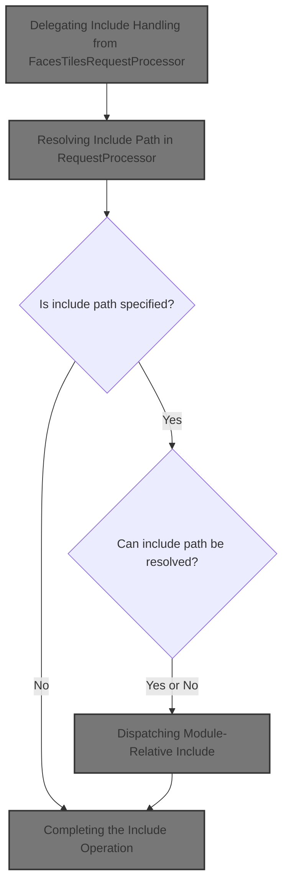
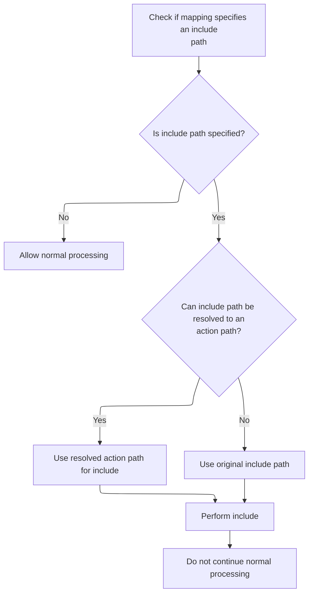

This document describes how the web application dynamically includes resources in the HTTP response based on the include path specified in the action mapping. If an include path is provided, the system resolves it and merges the output of the target resource into the response. If no include path is specified, normal processing continues.



# Delegating Include Handling from <SwmToken path="faces/src/main/java/org/apache/struts/faces/application/FacesTilesRequestProcessor.java" pos="64:4:4" line-data="public class FacesTilesRequestProcessor extends TilesRequestProcessor {">`FacesTilesRequestProcessor`</SwmToken>

<SwmSnippet path="/faces/src/main/java/org/apache/struts/faces/application/FacesTilesRequestProcessor.java" line="305">

---

<SwmToken path="faces/src/main/java/org/apache/struts/faces/application/FacesTilesRequestProcessor.java" pos="305:5:5" line-data="    protected boolean processInclude(HttpServletRequest request,">`processInclude`</SwmToken> in <SwmToken path="faces/src/main/java/org/apache/struts/faces/application/FacesTilesRequestProcessor.java" pos="64:4:4" line-data="public class FacesTilesRequestProcessor extends TilesRequestProcessor {">`FacesTilesRequestProcessor`</SwmToken> just hands off the include handling to the base <SwmToken path="faces/src/main/java/org/apache/struts/faces/application/FacesTilesRequestProcessor.java" pos="54:15:15" line-data=" * &lt;p&gt;Concrete implementation of &lt;code&gt;RequestProcessor&lt;/code&gt; that">`RequestProcessor`</SwmToken>, adding some logging. We need to call <SwmToken path="faces/src/main/java/org/apache/struts/faces/application/FacesTilesRequestProcessor.java" pos="54:15:15" line-data=" * &lt;p&gt;Concrete implementation of &lt;code&gt;RequestProcessor&lt;/code&gt; that">`RequestProcessor`</SwmToken> next because that's where the actual include logic lives.

```java
    protected boolean processInclude(HttpServletRequest request,
                                     HttpServletResponse response,
                                     ActionMapping mapping)
        throws IOException, ServletException {

        if (log.isTraceEnabled()) {
            log.trace("Performing standard include handling");
        }
        boolean result = super.processInclude
            (request, response, mapping);
        if (log.isDebugEnabled()) {
            log.debug("Standard include handling returned " + result);
        }
        return (result);

    }
```

---

</SwmSnippet>

# Resolving Include Path in <SwmToken path="faces/src/main/java/org/apache/struts/faces/application/FacesTilesRequestProcessor.java" pos="54:15:15" line-data=" * &lt;p&gt;Concrete implementation of &lt;code&gt;RequestProcessor&lt;/code&gt; that">`RequestProcessor`</SwmToken>



<SwmSnippet path="/core/src/main/java/org/apache/struts/action/RequestProcessor.java" line="584">

---

In <SwmToken path="core/src/main/java/org/apache/struts/action/RequestProcessor.java" pos="584:5:5" line-data="    protected boolean processInclude(HttpServletRequest request,">`processInclude`</SwmToken> (<SwmToken path="faces/src/main/java/org/apache/struts/faces/application/FacesTilesRequestProcessor.java" pos="54:15:15" line-data=" * &lt;p&gt;Concrete implementation of &lt;code&gt;RequestProcessor&lt;/code&gt; that">`RequestProcessor`</SwmToken>), we check if there's an include path and, if so, resolve it using <SwmToken path="core/src/main/java/org/apache/struts/action/RequestProcessor.java" pos="595:7:9" line-data="        String actionIdPath = RequestUtils.actionIdURL(include, this.moduleConfig, this.servlet);">`RequestUtils.actionIdURL`</SwmToken>. Calling <SwmToken path="core/src/main/java/org/apache/struts/action/RequestProcessor.java" pos="595:7:7" line-data="        String actionIdPath = RequestUtils.actionIdURL(include, this.moduleConfig, this.servlet);">`RequestUtils`</SwmToken> next lets us convert logical action IDs into servlet-mapped <SwmToken path="core/src/main/java/org/apache/struts/util/RequestUtils.java" pos="677:9:9" line-data="     * the case for URLs that were originally created from relative or">`URLs`</SwmToken>.

```java
    protected boolean processInclude(HttpServletRequest request,
        HttpServletResponse response, ActionMapping mapping)
        throws IOException, ServletException {
        // Are we going to processing this request?
        String include = mapping.getInclude();

        if (include == null) {
            return (true);
        }

        // If the forward can be unaliased into an action, then use the path of the action
        String actionIdPath = RequestUtils.actionIdURL(include, this.moduleConfig, this.servlet);
```

---

</SwmSnippet>

<SwmSnippet path="/core/src/main/java/org/apache/struts/util/RequestUtils.java" line="1080">

---

<SwmToken path="core/src/main/java/org/apache/struts/util/RequestUtils.java" pos="1080:7:7" line-data="    public static String actionIdURL(String originalPath, ModuleConfig moduleConfig, ActionServlet servlet) {">`actionIdURL`</SwmToken> filters out absolute and <SwmToken path="faces/src/main/java/org/apache/struts/faces/application/FacesTilesRequestProcessor.java" pos="458:22:24" line-data="     * &lt;p&gt;Return &lt;code&gt;true&lt;/code&gt; if the specified context-relative URI">`context-relative`</SwmToken> paths, splits <SwmToken path="core/src/main/java/org/apache/struts/util/RequestUtils.java" pos="1087:3:3" line-data="        String actionId = null;">`actionId`</SwmToken> and query string, finds the <SwmToken path="core/src/main/java/org/apache/struts/util/RequestUtils.java" pos="1098:1:1" line-data="        ActionConfig actionConfig = moduleConfig.findActionConfigId(actionId);">`ActionConfig`</SwmToken>, and builds the URL based on servlet mapping patterns. Query parameters are appended if present. We need to call RequestProcessor.processInclude next to use this resolved path.

```java
    public static String actionIdURL(String originalPath, ModuleConfig moduleConfig, ActionServlet servlet) {
        if (originalPath.startsWith("http") || originalPath.startsWith("/")) {
            return null;
        }

        // Split the forward path into the resource and query string;
        // it is possible a forward (or redirect) has added parameters.
        String actionId = null;
        String qs = null;
        int qpos = originalPath.indexOf("?");
        if (qpos == -1) {
            actionId = originalPath;
        } else {
            actionId = originalPath.substring(0, qpos);
            qs = originalPath.substring(qpos);
        }

        // Find the action of the given actionId
        ActionConfig actionConfig = moduleConfig.findActionConfigId(actionId);
        if (actionConfig == null) {
            if (log.isDebugEnabled()) {
                log.debug("No actionId found for " + actionId);
            }
            return null;
        }

        String path = actionConfig.getPath();
        String mapping = RequestUtils.getServletMapping(servlet);
        StringBuffer actionIdPath = new StringBuffer();

        // Form the path based on the servlet mapping pattern
        if (mapping.startsWith("*")) {
            actionIdPath.append(path);
            actionIdPath.append(mapping.substring(1));
        } else if (mapping.startsWith("/")) {  // implied ends with a *
            mapping = mapping.substring(0, mapping.length() - 1);
            if (mapping.endsWith("/") && path.startsWith("/")) {
                actionIdPath.append(mapping);
                actionIdPath.append(path.substring(1));
            } else {
                actionIdPath.append(mapping);
                actionIdPath.append(path);
            }
        } else {
            log.warn("Unknown servlet mapping pattern");
            actionIdPath.append(path);
        }

        // Lastly add any query parameters (the ? is part of the query string)
        if (qs != null) {
            actionIdPath.append(qs);
        }

        // Return the path
        if (log.isDebugEnabled()) {
            log.debug(originalPath + " unaliased to " + actionIdPath.toString());
        }
        return actionIdPath.toString();
    }
```

---

</SwmSnippet>

<SwmSnippet path="/core/src/main/java/org/apache/struts/action/RequestProcessor.java" line="596">

---

We just got back from <SwmToken path="core/src/main/java/org/apache/struts/action/RequestProcessor.java" pos="595:7:9" line-data="        String actionIdPath = RequestUtils.actionIdURL(include, this.moduleConfig, this.servlet);">`RequestUtils.actionIdURL`</SwmToken> with the resolved path. Now, in RequestProcessor.processInclude, we use that path for <SwmToken path="core/src/main/java/org/apache/struts/action/RequestProcessor.java" pos="600:1:1" line-data="        internalModuleRelativeInclude(include, request, response);">`internalModuleRelativeInclude`</SwmToken> to dispatch the request inside the module.

```java
        if (actionIdPath != null) {
            include = actionIdPath;
        }

        internalModuleRelativeInclude(include, request, response);

        return (false);
    }
```

---

</SwmSnippet>

# Dispatching Module-Relative Include

<SwmSnippet path="/core/src/main/java/org/apache/struts/action/RequestProcessor.java" line="1044">

---

<SwmToken path="core/src/main/java/org/apache/struts/action/RequestProcessor.java" pos="1044:5:5" line-data="    protected void internalModuleRelativeInclude(String uri,">`internalModuleRelativeInclude`</SwmToken> adds the module prefix to the URI and hands off to <SwmToken path="core/src/main/java/org/apache/struts/action/RequestProcessor.java" pos="1056:1:1" line-data="        doInclude(uri, request, response);">`doInclude`</SwmToken> for the actual dispatch. We call <SwmToken path="core/src/main/java/org/apache/struts/action/RequestProcessor.java" pos="1056:1:1" line-data="        doInclude(uri, request, response);">`doInclude`</SwmToken> next to perform the include operation.

```java
    protected void internalModuleRelativeInclude(String uri,
        HttpServletRequest request, HttpServletResponse response)
        throws IOException, ServletException {
        // Construct a request dispatcher for the specified path
        uri = moduleConfig.getPrefix() + uri;

        // Delegate the processing of this request
        // FIXME - exception handling?
        if (log.isDebugEnabled()) {
            log.debug(" Delegating via include to '" + uri + "'");
        }

        doInclude(uri, request, response);
    }
```

---

</SwmSnippet>

# Performing the Include Dispatch

<SwmSnippet path="/core/src/main/java/org/apache/struts/action/RequestProcessor.java" line="1098">

---

In <SwmToken path="core/src/main/java/org/apache/struts/action/RequestProcessor.java" pos="1098:5:5" line-data="    protected void doInclude(String uri, HttpServletRequest request,">`doInclude`</SwmToken>, we get the dispatcher for the URI. If it's missing, we use PropertyMessageResources.getMessage to fetch a localized error message for the response.

```java
    protected void doInclude(String uri, HttpServletRequest request,
        HttpServletResponse response)
        throws IOException, ServletException {
        RequestDispatcher rd = getServletContext().getRequestDispatcher(uri);

        if (rd == null) {
            response.sendError(HttpServletResponse.SC_INTERNAL_SERVER_ERROR,
                getInternal().getMessage("requestDispatcher", uri));

            return;
        }

```

---

</SwmSnippet>

## Resolving Localized Error Message

```mermaid
%%{init: {"flowchart": {"defaultRenderer": "elk"}} }%%
flowchart TD
    node1["Request message for locale and key"] --> node2{"Message found for requested locale?"}
    click node1 openCode "core/src/main/java/org/apache/struts/util/PropertyMessageResources.java:227:241"
    click node2 openCode "core/src/main/java/org/apache/struts/util/PropertyMessageResources.java:238:241"
    node2 -->|"Yes"| node3["Return message"]
    click node3 openCode "core/src/main/java/org/apache/struts/util/PropertyMessageResources.java:239:241"
    node2 -->|"No"| node4{"Mode is JSTL?"}
    click node4 openCode "core/src/main/java/org/apache/struts/util/PropertyMessageResources.java:244:248"
    node4 -->|"Yes (JSTL)"| node10["Skip default locale fallback"]
    click node10 openCode "core/src/main/java/org/apache/struts/util/PropertyMessageResources.java:246:247"
    node10 --> node11{"Message found in default properties?"}
    node4 -->|"No (ResourceBundle/default)"| node5{"Locale != defaultLocale?"}
    click node5 openCode "core/src/main/java/org/apache/struts/util/PropertyMessageResources.java:252:263"
    node5 -->|"Yes"| node6{"Message found for default locale?"}
    click node6 openCode "core/src/main/java/org/apache/struts/util/PropertyMessageResources.java:253:263"
    node6 -->|"Yes"| node3
    node6 -->|"No"| node11
    node5 -->|"No"| node11
    node11{"Message found in default properties?"}
    click node11 openCode "core/src/main/java/org/apache/struts/util/PropertyMessageResources.java:271:273"
    node11 -->|"Yes"| node3
    node11 -->|"No"| node12{"returnNull?"}
    click node12 openCode "core/src/main/java/org/apache/struts/util/PropertyMessageResources.java:277:281"
    node12 -->|"Yes"| node13["Return null"]
    click node13 openCode "core/src/main/java/org/apache/struts/util/PropertyMessageResources.java:278:279"
    node12 -->|"No"| node14["Return placeholder with key"]
    click node14 openCode "core/src/main/java/org/apache/struts/util/PropertyMessageResources.java:280:281"

classDef HeadingStyle fill:#777777,stroke:#333,stroke-width:2px;

%% Swimm:
%% %%{init: {"flowchart": {"defaultRenderer": "elk"}} }%%
%% flowchart TD
%%     node1["Request message for locale and key"] --> node2{"Message found for requested locale?"}
%%     click node1 openCode "<SwmPath>[core/…/util/PropertyMessageResources.java](core/src/main/java/org/apache/struts/util/PropertyMessageResources.java)</SwmPath>:227:241"
%%     click node2 openCode "<SwmPath>[core/…/util/PropertyMessageResources.java](core/src/main/java/org/apache/struts/util/PropertyMessageResources.java)</SwmPath>:238:241"
%%     node2 -->|"Yes"| node3["Return message"]
%%     click node3 openCode "<SwmPath>[core/…/util/PropertyMessageResources.java](core/src/main/java/org/apache/struts/util/PropertyMessageResources.java)</SwmPath>:239:241"
%%     node2 -->|"No"| node4{"Mode is JSTL?"}
%%     click node4 openCode "<SwmPath>[core/…/util/PropertyMessageResources.java](core/src/main/java/org/apache/struts/util/PropertyMessageResources.java)</SwmPath>:244:248"
%%     node4 -->|"Yes (JSTL)"| node10["Skip default locale fallback"]
%%     click node10 openCode "<SwmPath>[core/…/util/PropertyMessageResources.java](core/src/main/java/org/apache/struts/util/PropertyMessageResources.java)</SwmPath>:246:247"
%%     node10 --> node11{"Message found in default properties?"}
%%     node4 -->|"No (ResourceBundle/default)"| node5{"Locale != <SwmToken path="core/src/main/java/org/apache/struts/util/PropertyMessageResources.java" pos="252:5:5" line-data="            if (!defaultLocale.equals(locale)) {">`defaultLocale`</SwmToken>?"}
%%     click node5 openCode "<SwmPath>[core/…/util/PropertyMessageResources.java](core/src/main/java/org/apache/struts/util/PropertyMessageResources.java)</SwmPath>:252:263"
%%     node5 -->|"Yes"| node6{"Message found for default locale?"}
%%     click node6 openCode "<SwmPath>[core/…/util/PropertyMessageResources.java](core/src/main/java/org/apache/struts/util/PropertyMessageResources.java)</SwmPath>:253:263"
%%     node6 -->|"Yes"| node3
%%     node6 -->|"No"| node11
%%     node5 -->|"No"| node11
%%     node11{"Message found in default properties?"}
%%     click node11 openCode "<SwmPath>[core/…/util/PropertyMessageResources.java](core/src/main/java/org/apache/struts/util/PropertyMessageResources.java)</SwmPath>:271:273"
%%     node11 -->|"Yes"| node3
%%     node11 -->|"No"| node12{"<SwmToken path="core/src/main/java/org/apache/struts/util/PropertyMessageResources.java" pos="277:4:4" line-data="        if (returnNull) {">`returnNull`</SwmToken>?"}
%%     click node12 openCode "<SwmPath>[core/…/util/PropertyMessageResources.java](core/src/main/java/org/apache/struts/util/PropertyMessageResources.java)</SwmPath>:277:281"
%%     node12 -->|"Yes"| node13["Return null"]
%%     click node13 openCode "<SwmPath>[core/…/util/PropertyMessageResources.java](core/src/main/java/org/apache/struts/util/PropertyMessageResources.java)</SwmPath>:278:279"
%%     node12 -->|"No"| node14["Return placeholder with key"]
%%     click node14 openCode "<SwmPath>[core/…/util/PropertyMessageResources.java](core/src/main/java/org/apache/struts/util/PropertyMessageResources.java)</SwmPath>:280:281"
%% 
%% classDef HeadingStyle fill:#777777,stroke:#333,stroke-width:2px;
```



<SwmSnippet path="/core/src/main/java/org/apache/struts/util/PropertyMessageResources.java" line="227">

---

<SwmToken path="core/src/main/java/org/apache/struts/util/PropertyMessageResources.java" pos="227:5:5" line-data="    public String getMessage(Locale locale, String key) {">`getMessage`</SwmToken> tries to find a localized message for the given key and locale, using different fallback strategies depending on mode. If not found, it checks the default locale and properties file, or returns a placeholder.

```java
    public String getMessage(Locale locale, String key) {
        if (log.isDebugEnabled()) {
            log.debug("getMessage(" + locale + "," + key + ")");
        }

        // Initialize variables we will require
        String localeKey = localeKey(locale);
        String originalKey = messageKey(localeKey, key);
        String message = null;

        // Search the specified Locale
        message = findMessage(locale, key, originalKey);
        if (message != null) {
            return message;
        }

        // JSTL Compatibility - JSTL doesn't use the default locale
        if (mode == MODE_JSTL) {

           // do nothing (i.e. don't use default Locale)

        // PropertyResourcesBundle - searches through the hierarchy
        // for the default Locale (e.g. first en_US then en)
        } else if (mode == MODE_RESOURCE_BUNDLE) {

            if (!defaultLocale.equals(locale)) {
                message = findMessage(defaultLocale, key, originalKey);
            }

        // Default (backwards) Compatibility - just searches the
        // specified Locale (e.g. just en_US)
        } else {

            if (!defaultLocale.equals(locale)) {
                localeKey = localeKey(defaultLocale);
                message = findMessage(localeKey, key, originalKey);
            }

        }
        if (message != null) {
            return message;
        }

        // Find the message in the default properties file
        message = findMessage("", key, originalKey);
        if (message != null) {
            return message;
        }

        // Return an appropriate error indication
        if (returnNull) {
            return (null);
        } else {
            return ("???" + messageKey(locale, key) + "???");
        }
    }
```

---

</SwmSnippet>

<SwmSnippet path="/core/src/main/java/org/apache/struts/util/PropertyMessageResources.java" line="393">

---

<SwmToken path="core/src/main/java/org/apache/struts/util/PropertyMessageResources.java" pos="393:5:5" line-data="    private String findMessage(Locale locale, String key, String originalKey) {">`findMessage`</SwmToken> takes the locale, tries to find a message for the most specific locale key, and if not found, strips modifiers to check more general keys. This lets us fall back from <SwmToken path="core/src/main/java/org/apache/struts/util/PropertyMessageResources.java" pos="249:19:19" line-data="        // for the default Locale (e.g. first en_US then en)">`en_US`</SwmToken> to 'en' if needed.

```java
    private String findMessage(Locale locale, String key, String originalKey) {

        // Initialize variables we will require
        String localeKey = localeKey(locale);
        String messageKey = null;
        String message = null;
        int underscore = 0;

        // Loop from specific to general Locales looking for this message
        while (true) {
            message = findMessage(localeKey, key, originalKey);
            if (message != null) {
                break;
            }

            // Strip trailing modifiers to try a more general locale key
            underscore = localeKey.lastIndexOf("_");

            if (underscore < 0) {
                break;
            }

            localeKey = localeKey.substring(0, underscore);
        }
```

---

</SwmSnippet>

## Completing the Include Operation

<SwmSnippet path="/core/src/main/java/org/apache/struts/action/RequestProcessor.java" line="1110">

---

We just got back from PropertyMessageResources.getMessage with the error message if needed. Now, in RequestProcessor.doInclude, <SwmToken path="core/src/main/java/org/apache/struts/action/RequestProcessor.java" pos="1110:1:3" line-data="        rd.include(request, response);">`rd.include`</SwmToken> merges the target resource's output into the response.

```java
        rd.include(request, response);
    }
```

---

</SwmSnippet>

&nbsp;

*This is an auto-generated document by Swimm 🌊 and has not yet been verified by a human*

<SwmMeta version="3.0.0" repo-id="Z2l0aHViJTNBJTNBc3RydXRzMSUzQSUzQVN3aW1tLURlbW8=" repo-name="struts1"><sup>Powered by [Swimm](https://app.swimm.io/)</sup></SwmMeta>
