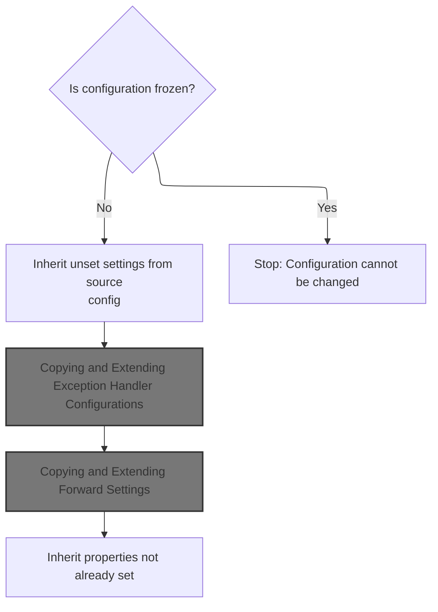
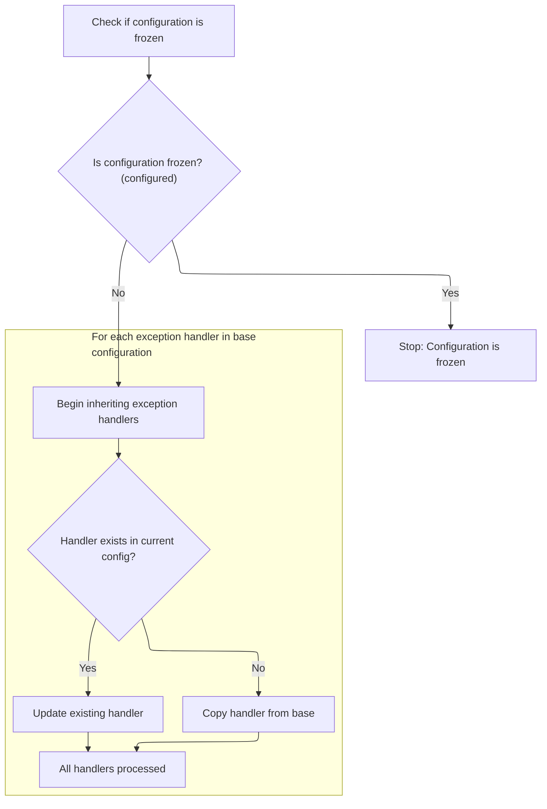
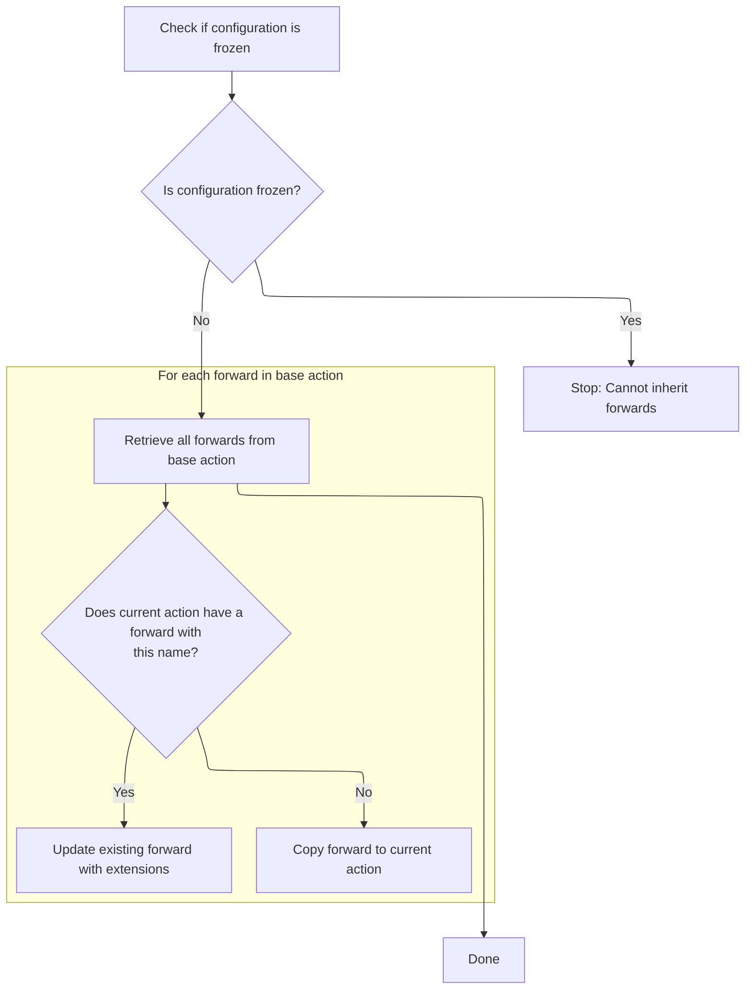
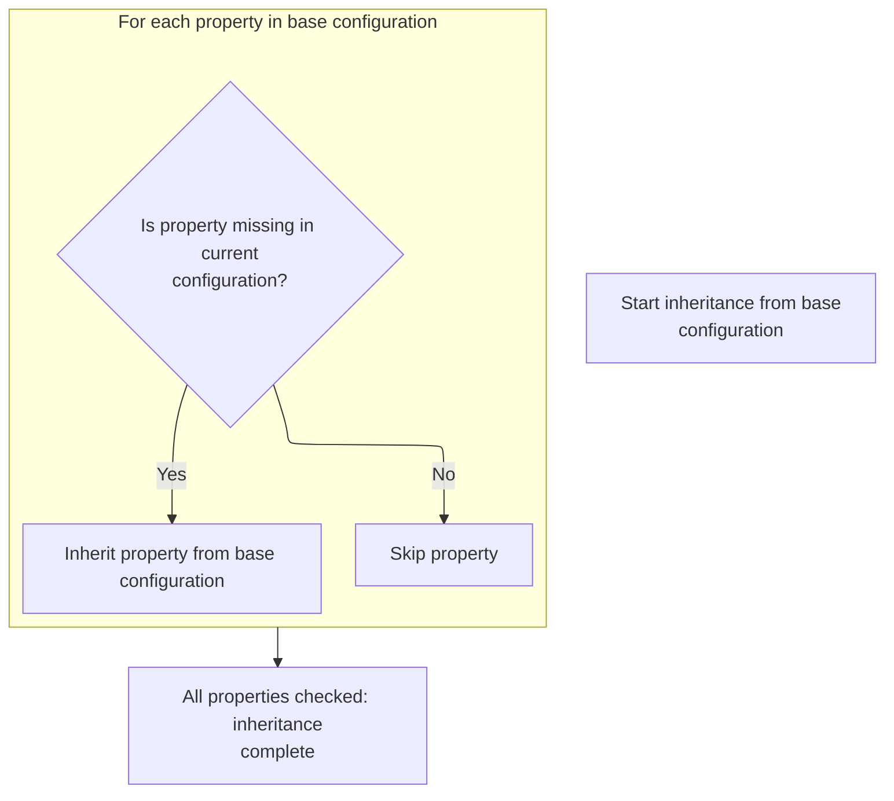

This document explains how action configurations inherit missing properties from a base configuration, enabling modular and reusable setup. When an action configuration lacks certain settings, these are automatically filled in from a base configuration unless explicitly overridden.

# Copying and Overriding <SwmToken path="core/src/main/java/org/apache/struts/config/ActionConfig.java" pos="961:7:7" line-data="    protected void inheritExceptionHandlers(ActionConfig baseConfig)">`ActionConfig`</SwmToken> Properties



<SwmSnippet path="/core/src/main/java/org/apache/struts/config/ActionConfig.java" line="1199">

---

In <SwmToken path="core/src/main/java/org/apache/struts/config/ActionConfig.java" pos="1199:5:5" line-data="    public void inheritFrom(ActionConfig config)">`inheritFrom`</SwmToken>, we check if the attribute is unset before pulling it from the base config. This ensures only missing values are inherited, so explicit settings aren't overridden. Next, we call <SwmToken path="core/src/main/java/org/apache/struts/config/ActionConfig.java" pos="1207:4:4" line-data="        if (getAttribute() == null) {">`getAttribute`</SwmToken> to decide if we need to copy the attribute from the base config.

```java
    public void inheritFrom(ActionConfig config)
        throws ClassNotFoundException, IllegalAccessException,
            InstantiationException, InvocationTargetException {
        if (configured) {
            throw new IllegalStateException("Configuration is frozen");
        }

        // Inherit values that have not been overridden
        if (getAttribute() == null) {
            setAttribute(config.getAttribute());
```

---

</SwmSnippet>

<SwmSnippet path="/core/src/main/java/org/apache/struts/config/ActionConfig.java" line="1208">

---

Back in ActionConfig.inheritFrom, after confirming the attribute is missing, we copy it from the base config using <SwmToken path="core/src/main/java/org/apache/struts/config/ActionConfig.java" pos="1208:1:1" line-data="            setAttribute(config.getAttribute());">`setAttribute`</SwmToken>. This fills in any gaps in the current config.

```java
            setAttribute(config.getAttribute());
        }

```

---

</SwmSnippet>

<SwmSnippet path="/core/src/main/java/org/apache/struts/config/ActionConfig.java" line="1211">

---

Next, ActionConfig.inheritFrom checks if cancellable was set. If not, it copies the cancellable flag from the base config, so the current config inherits cancellation behavior only when not explicitly defined.

```java
        if (!cancellableSet) {
            setCancellable(config.getCancellable());
        }

```

---

</SwmSnippet>

<SwmSnippet path="/core/src/main/java/org/apache/struts/config/ActionConfig.java" line="359">

---

SetCancellable checks if the config is frozen and throws if so, then sets the cancellable flag and marks it as explicitly set. This prevents changes after finalization and tracks explicit overrides.

```java
    public void setCancellable(boolean cancellable) {
        if (configured) {
            throw new IllegalStateException("Configuration is frozen");
        }

        this.cancellable = cancellable;
        this.cancellableSet = true;
    }
```

---

</SwmSnippet>

<SwmSnippet path="/core/src/main/java/org/apache/struts/config/ActionConfig.java" line="1215">

---

Next, ActionConfig.inheritFrom checks if catalog is missing. If so, it copies the catalog from the base config

```java
        if (getCatalog() == null) {
            setCatalog(config.getCatalog());
        }

```

---

</SwmSnippet>

<SwmSnippet path="/core/src/main/java/org/apache/struts/config/ActionConfig.java" line="1219">

---

Next, ActionConfig.inheritFrom checks if command is missing. If so, it copies the command from the base config, so the current config gets a command only if not explicitly set.

```java
        if (getCommand() == null) {
            setCommand(config.getCommand());
        }

```

---

</SwmSnippet>

<SwmSnippet path="/core/src/main/java/org/apache/struts/config/ActionConfig.java" line="1223">

---

Next, ActionConfig.inheritFrom checks if forward is missing. If so, it copies the forward from the base config, so navigation settings are inherited only when not explicitly set.

```java
        if (getForward() == null) {
            setForward(config.getForward());
        }

```

---

</SwmSnippet>

<SwmSnippet path="/core/src/main/java/org/apache/struts/config/ActionConfig.java" line="1227">

---

Next, ActionConfig.inheritFrom checks if include is missing. If so, it copies the include from the base config, so response composition settings are inherited only when not explicitly set.

```java
        if (getInclude() == null) {
            setInclude(config.getInclude());
        }

```

---

</SwmSnippet>

<SwmSnippet path="/core/src/main/java/org/apache/struts/config/ActionConfig.java" line="1231">

---

Next, ActionConfig.inheritFrom checks if input is missing. If so, it copies the input from the base config, so form handling settings are inherited only when not explicitly set.

```java
        if (getInput() == null) {
            setInput(config.getInput());
        }

```

---

</SwmSnippet>

<SwmSnippet path="/core/src/main/java/org/apache/struts/config/ActionConfig.java" line="1235">

---

Next, ActionConfig.inheritFrom checks if <SwmToken path="core/src/main/java/org/apache/struts/config/ActionConfig.java" pos="136:5:5" line-data="    protected String multipartClass = null;">`multipartClass`</SwmToken> is missing. If so, it copies the <SwmToken path="core/src/main/java/org/apache/struts/config/ActionConfig.java" pos="136:5:5" line-data="    protected String multipartClass = null;">`multipartClass`</SwmToken> from the base config, so file upload handling is inherited only when not explicitly set.

```java
        if (getMultipartClass() == null) {
            setMultipartClass(config.getMultipartClass());
        }

```

---

</SwmSnippet>

<SwmSnippet path="/core/src/main/java/org/apache/struts/config/ActionConfig.java" line="1239">

---

Next, ActionConfig.inheritFrom checks if name is missing. If so, it copies the name from the base config, so action identification is inherited only when not explicitly set.

```java
        if (getName() == null) {
            setName(config.getName());
        }

```

---

</SwmSnippet>

<SwmSnippet path="/core/src/main/java/org/apache/struts/config/ActionConfig.java" line="1243">

---

Next, ActionConfig.inheritFrom checks if parameter is missing. If so, it copies the parameter from the base config, so action execution settings are inherited only when not explicitly set.

```java
        if (getParameter() == null) {
            setParameter(config.getParameter());
        }

```

---

</SwmSnippet>

<SwmSnippet path="/core/src/main/java/org/apache/struts/config/ActionConfig.java" line="1247">

---

Next, ActionConfig.inheritFrom checks if path is missing. If so, it copies the path from the base config, so routing settings are inherited only when not explicitly set.

```java
        if (getPath() == null) {
            setPath(config.getPath());
        }

```

---

</SwmSnippet>

<SwmSnippet path="/core/src/main/java/org/apache/struts/config/ActionConfig.java" line="1251">

---

Next, ActionConfig.inheritFrom checks if prefix is missing. If so, it copies the prefix from the base config, so routing or naming settings are inherited only when not explicitly set.

```java
        if (getPrefix() == null) {
            setPrefix(config.getPrefix());
        }

```

---

</SwmSnippet>

<SwmSnippet path="/core/src/main/java/org/apache/struts/config/ActionConfig.java" line="1255">

---

Next, ActionConfig.inheritFrom checks if roles is missing. If so, it copies the roles from the base config, so security settings are inherited only when not explicitly set.

```java
        if (getRoles() == null) {
            setRoles(config.getRoles());
        }

```

---

</SwmSnippet>

<SwmSnippet path="/core/src/main/java/org/apache/struts/config/ActionConfig.java" line="1259">

---

Next, ActionConfig.inheritFrom checks if scope is set to 'session'. If so, it copies the scope from the base config, so session management settings are inherited only when not explicitly set.

```java
        if (getScope().equals("session")) {
            setScope(config.getScope());
        }

```

---

</SwmSnippet>

<SwmSnippet path="/core/src/main/java/org/apache/struts/config/ActionConfig.java" line="652">

---

SetScope checks if the config is frozen and throws if so, then sets the scope. This prevents changes after finalization and ensures immutability.

```java
    public void setScope(String scope) {
        if (configured) {
            throw new IllegalStateException("Configuration is frozen");
        }

        this.scope = scope;
    }
```

---

</SwmSnippet>

<SwmSnippet path="/core/src/main/java/org/apache/struts/config/ActionConfig.java" line="1263">

---

Next, ActionConfig.inheritFrom checks if suffix is missing. If so, it copies the suffix from the base config, so routing or naming settings are inherited only when not explicitly set.

```java
        if (getSuffix() == null) {
            setSuffix(config.getSuffix());
        }

```

---

</SwmSnippet>

<SwmSnippet path="/core/src/main/java/org/apache/struts/config/ActionConfig.java" line="1267">

---

Next, ActionConfig.inheritFrom checks if type is missing. If so, it copies the type from the base config, so action execution settings are inherited only when not explicitly set.

```java
        if (getType() == null) {
            setType(config.getType());
        }

```

---

</SwmSnippet>

<SwmSnippet path="/core/src/main/java/org/apache/struts/config/ActionConfig.java" line="1271">

---

Next, ActionConfig.inheritFrom checks if unknown is false. If so, it copies the unknown flag from the base config, so error handling settings are inherited only when not explicitly set.

```java
        if (!getUnknown()) {
            setUnknown(config.getUnknown());
        }

```

---

</SwmSnippet>

<SwmSnippet path="/core/src/main/java/org/apache/struts/config/ActionConfig.java" line="808">

---

SetUnknown checks if the config is frozen and throws if so, then sets the unknown flag. This prevents changes after finalization and ensures immutability.

```java
    public void setUnknown(boolean unknown) {
        if (configured) {
            throw new IllegalStateException("Configuration is frozen");
        }

        this.unknown = unknown;
    }
```

---

</SwmSnippet>

<SwmSnippet path="/core/src/main/java/org/apache/struts/config/ActionConfig.java" line="1275">

---

Next, ActionConfig.inheritFrom checks if validate was set. If not, it copies the validate flag from the base config, so form validation settings are inherited only when not explicitly set.

```java
        if (!validateSet) {
            setValidate(config.getValidate());
        }

```

---

</SwmSnippet>

<SwmSnippet path="/core/src/main/java/org/apache/struts/config/ActionConfig.java" line="820">

---

SetValidate checks if the config is frozen and throws if so, then sets the validate flag and marks it as explicitly set. This prevents changes after finalization and tracks explicit overrides.

```java
    public void setValidate(boolean validate) {
        if (configured) {
            throw new IllegalStateException("Configuration is frozen");
        }

        this.validate = validate;
        this.validateSet = true;
    }
```

---

</SwmSnippet>

<SwmSnippet path="/core/src/main/java/org/apache/struts/config/ActionConfig.java" line="1279">

---

Finally, ActionConfig.inheritFrom calls <SwmToken path="core/src/main/java/org/apache/struts/config/ActionConfig.java" pos="1279:1:1" line-data="        inheritExceptionHandlers(config);">`inheritExceptionHandlers`</SwmToken> to pull in error handling logic from the base config, so the current config inherits exception handling only when not explicitly set.

```java
        inheritExceptionHandlers(config);
```

---

</SwmSnippet>

## Copying and Extending Exception Handler Configurations



<SwmSnippet path="/core/src/main/java/org/apache/struts/config/ActionConfig.java" line="961">

---

In <SwmToken path="core/src/main/java/org/apache/struts/config/ActionConfig.java" pos="961:5:5" line-data="    protected void inheritExceptionHandlers(ActionConfig baseConfig)">`inheritExceptionHandlers`</SwmToken>, we check if the config is frozen, then loop through exception handlers from the base config. If a handler doesn't exist in the current config, we copy it using reflection and property copying. Otherwise, we handle extension logic. Next, we call <SwmToken path="core/src/main/java/org/apache/struts/config/BaseConfig.java" pos="132:7:7" line-data="    protected void inheritProperties(BaseConfig baseConfig) {">`BaseConfig`</SwmToken> methods to copy properties and add handlers.

```java
    protected void inheritExceptionHandlers(ActionConfig baseConfig)
        throws ClassNotFoundException, IllegalAccessException,
            InstantiationException, InvocationTargetException {
        if (configured) {
            throw new IllegalStateException("Configuration is frozen");
        }

        // Inherit exception handler configs
        ExceptionConfig[] baseHandlers = baseConfig.findExceptionConfigs();

        for (int i = 0; i < baseHandlers.length; i++) {
            ExceptionConfig baseHandler = baseHandlers[i];

            // Do we have this handler?
            ExceptionConfig copy =
                this.findExceptionConfig(baseHandler.getType());

            if (copy == null) {
                // We don't have this, so let's copy it
                copy =
                    (ExceptionConfig) RequestUtils.applicationInstance(baseHandler.getClass()
                                                                                  .getName());

                BeanUtils.copyProperties(copy, baseHandler);
                this.addExceptionConfig(copy);
                copy.setProperties(baseHandler.copyProperties());
            } else {
```

---

</SwmSnippet>

<SwmSnippet path="/core/src/main/java/org/apache/struts/config/ActionConfig.java" line="988">

---

Back in <SwmToken path="core/src/main/java/org/apache/struts/config/ActionConfig.java" pos="961:5:5" line-data="    protected void inheritExceptionHandlers(ActionConfig baseConfig)">`inheritExceptionHandlers`</SwmToken>, after copying or extending handlers, we call <SwmToken path="core/src/main/java/org/apache/struts/config/ActionConfig.java" pos="989:3:3" line-data="                copy.processExtends(getModuleConfig(), this);">`processExtends`</SwmToken> on existing handlers to handle any extension logic. This ensures inherited handlers are properly extended with module-specific settings.

```java
                // process any extension that this config might have
                copy.processExtends(getModuleConfig(), this);
            }
        }
    }
```

---

</SwmSnippet>

## Copying and Extending Forward Configurations

<SwmSnippet path="/core/src/main/java/org/apache/struts/config/ActionConfig.java" line="1280">

---

Next, ActionConfig.inheritFrom calls <SwmToken path="core/src/main/java/org/apache/struts/config/ActionConfig.java" pos="1280:1:1" line-data="        inheritForwards(config);">`inheritForwards`</SwmToken> to pull in navigation logic from the base config, so the current config inherits forward settings only when not explicitly set.

```java
        inheritForwards(config);
```

---

</SwmSnippet>

## Copying and Extending Forward Settings



<SwmSnippet path="/core/src/main/java/org/apache/struts/config/ActionConfig.java" line="1001">

---

In <SwmToken path="core/src/main/java/org/apache/struts/config/ActionConfig.java" pos="1001:5:5" line-data="    protected void inheritForwards(ActionConfig baseConfig)">`inheritForwards`</SwmToken>, we check if the config is frozen, then loop through forwards from the base config. If a forward doesn't exist in the current config, we copy it using reflection and property copying. Otherwise, we handle extension logic. Next, we call <SwmToken path="core/src/main/java/org/apache/struts/config/BaseConfig.java" pos="132:7:7" line-data="    protected void inheritProperties(BaseConfig baseConfig) {">`BaseConfig`</SwmToken> methods to copy properties and add forwards.

```java
    protected void inheritForwards(ActionConfig baseConfig)
        throws ClassNotFoundException, IllegalAccessException,
            InstantiationException, InvocationTargetException {
        if (configured) {
            throw new IllegalStateException("Configuration is frozen");
        }

        // Inherit forward configs
        ForwardConfig[] baseForwards = baseConfig.findForwardConfigs();

        for (int i = 0; i < baseForwards.length; i++) {
            ForwardConfig baseForward = baseForwards[i];

            // Do we have this forward?
            ForwardConfig copy = this.findForwardConfig(baseForward.getName());

            if (copy == null) {
                // We don't have this, so let's copy it
                copy =
                    (ForwardConfig) RequestUtils.applicationInstance(baseForward.getClass()
                                                                                .getName());
                BeanUtils.copyProperties(copy, baseForward);

                this.addForwardConfig(copy);
                copy.setProperties(baseForward.copyProperties());
            } else {
```

---

</SwmSnippet>

<SwmSnippet path="/core/src/main/java/org/apache/struts/config/ActionConfig.java" line="1027">

---

Back in <SwmToken path="core/src/main/java/org/apache/struts/config/ActionConfig.java" pos="1001:5:5" line-data="    protected void inheritForwards(ActionConfig baseConfig)">`inheritForwards`</SwmToken>, after copying or extending forwards, we call <SwmToken path="core/src/main/java/org/apache/struts/config/ActionConfig.java" pos="1028:3:3" line-data="                copy.processExtends(getModuleConfig(), this);">`processExtends`</SwmToken> on existing forwards to handle any extension logic. This ensures inherited forwards are properly extended with module-specific settings.

```java
                // process any extension for this forward
                copy.processExtends(getModuleConfig(), this);
            }
        }
    }
```

---

</SwmSnippet>

## Copying Additional Properties



<SwmSnippet path="/core/src/main/java/org/apache/struts/config/ActionConfig.java" line="1281">

---

Finally, ActionConfig.inheritFrom calls <SwmToken path="core/src/main/java/org/apache/struts/config/ActionConfig.java" pos="1281:1:1" line-data="        inheritProperties(config);">`inheritProperties`</SwmToken> to pull in custom settings from the base config, so the current config inherits additional properties only when not explicitly set.

```java
        inheritProperties(config);
    }
```

---

</SwmSnippet>

<SwmSnippet path="/core/src/main/java/org/apache/struts/config/BaseConfig.java" line="132">

---

InheritProperties loops through properties in the base config and copies any missing ones to the current config. This ensures all custom settings are inherited unless already set.

```java
    protected void inheritProperties(BaseConfig baseConfig) {
        throwIfConfigured();

        // Inherit forward properties
        Properties baseProperties = baseConfig.getProperties();
        Enumeration keys = baseProperties.propertyNames();

        while (keys.hasMoreElements()) {
            String key = (String) keys.nextElement();

            // Check if we have this property before copying it
            String value = this.getProperty(key);

            if (value == null) {
                value = baseProperties.getProperty(key);
                setProperty(key, value);
            }
        }
    }
```

---

</SwmSnippet>

&nbsp;

*This is an auto-generated document by Swimm 🌊 and has not yet been verified by a human*

<SwmMeta version="3.0.0" repo-id="Z2l0aHViJTNBJTNBc3RydXRzMSUzQSUzQVN3aW1tLURlbW8=" repo-name="struts1"><sup>Powered by [Swimm](https://app.swimm.io/)</sup></SwmMeta>
