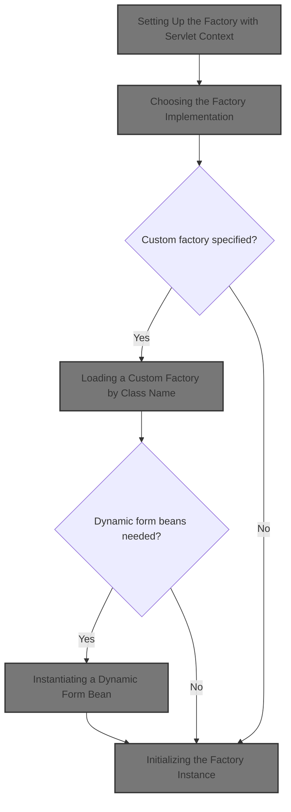
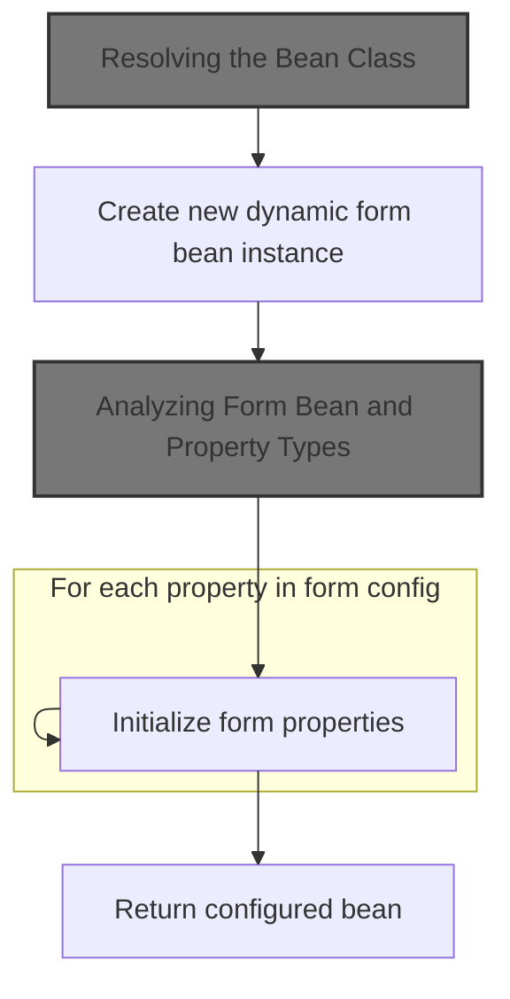
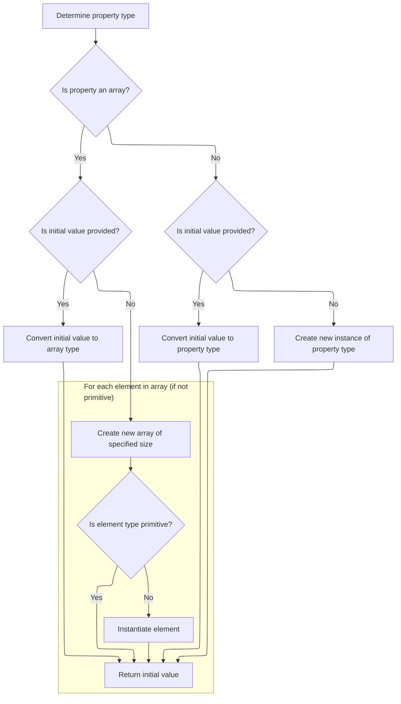
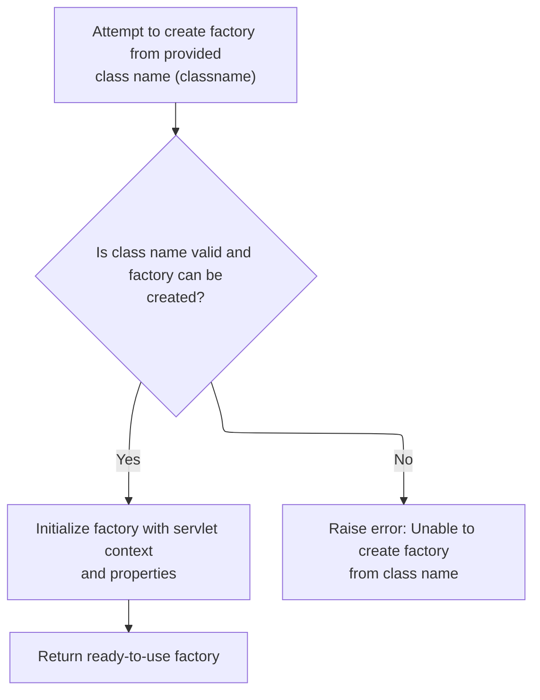

This document describes how the system initializes a customizable and reloadable definitions factory using servlet context and configuration. The process selects and prepares the appropriate factory implementation, and, if needed, resolves and initializes dynamic form beans. This enables flexible configuration of form bean definitions.



# Setting Up the Factory with Servlet Context

<SwmSnippet path="/tiles/src/main/java/org/apache/struts/tiles/definition/ReloadableDefinitionsFactory.java" line="74">

---

<SwmToken path="tiles/src/main/java/org/apache/struts/tiles/definition/ReloadableDefinitionsFactory.java" pos="74:3:3" line-data="    public ReloadableDefinitionsFactory(">`ReloadableDefinitionsFactory`</SwmToken> is just grabbing config properties and immediately creating the definitions factory using <SwmToken path="tiles/src/main/java/org/apache/struts/tiles/definition/ReloadableDefinitionsFactory.java" pos="80:5:5" line-data="        factory = createFactory(servletContext, properties);">`createFactory`</SwmToken>. This wires up the factory instance based on servlet context and config, so everything downstream can use the right implementation.

```java
    public ReloadableDefinitionsFactory(
        ServletContext servletContext,
        ServletConfig servletConfig)
        throws DefinitionsFactoryException {

        properties = new ServletPropertiesMap(servletConfig);
        factory = createFactory(servletContext, properties);
    }
```

---

</SwmSnippet>

# Choosing the Factory Implementation

<SwmSnippet path="/tiles/src/main/java/org/apache/struts/tiles/definition/ReloadableDefinitionsFactory.java" line="179">

---

<SwmToken path="tiles/src/main/java/org/apache/struts/tiles/definition/ReloadableDefinitionsFactory.java" pos="179:5:5" line-data="    public ComponentDefinitionsFactory createFactory(">`createFactory`</SwmToken> checks if a classname is specified in the properties. If so, it hands off to <SwmToken path="tiles/src/main/java/org/apache/struts/tiles/definition/ReloadableDefinitionsFactory.java" pos="187:3:3" line-data="            return createFactoryFromClassname(servletContext, properties, classname);">`createFactoryFromClassname`</SwmToken> to load that specific implementation. If not, it just uses the default factory.

```java
    public ComponentDefinitionsFactory createFactory(
        ServletContext servletContext,
        Map properties)
        throws DefinitionsFactoryException {

        String classname = (String) properties.get(DEFINITIONS_FACTORY_CLASSNAME);

        if (classname != null) {
            return createFactoryFromClassname(servletContext, properties, classname);
        }

        return new I18nFactorySet(servletContext, properties);
    }
```

---

</SwmSnippet>

# Loading a Custom Factory by Class Name

<SwmSnippet path="/tiles/src/main/java/org/apache/struts/tiles/definition/ReloadableDefinitionsFactory.java" line="110">

---

In <SwmToken path="tiles/src/main/java/org/apache/struts/tiles/definition/ReloadableDefinitionsFactory.java" pos="110:5:5" line-data="    public ComponentDefinitionsFactory createFactoryFromClassname(">`createFactoryFromClassname`</SwmToken>, we double-check if the classname is null. If it is, we just call back to <SwmToken path="tiles/src/main/java/org/apache/struts/tiles/definition/ReloadableDefinitionsFactory.java" pos="117:3:3" line-data="            return createFactory(servletContext, properties);">`createFactory`</SwmToken> to handle the default case.

```java
    public ComponentDefinitionsFactory createFactoryFromClassname(
        ServletContext servletContext,
        Map properties,
        String classname)
        throws DefinitionsFactoryException {

        if (classname == null) {
            return createFactory(servletContext, properties);
        }

```

---

</SwmSnippet>

<SwmSnippet path="/tiles/src/main/java/org/apache/struts/tiles/definition/ReloadableDefinitionsFactory.java" line="120">

---

Back in <SwmToken path="tiles/src/main/java/org/apache/struts/tiles/definition/ReloadableDefinitionsFactory.java" pos="110:5:5" line-data="    public ComponentDefinitionsFactory createFactoryFromClassname(">`createFactoryFromClassname`</SwmToken>, after handling the null check, we use reflection to load and instantiate the factory class. This is where we jump into the <SwmToken path="core/src/main/java/org/apache/struts/action/DynaActionFormClass.java" pos="45:4:4" line-data="public class DynaActionFormClass implements DynaClass, Serializable {">`DynaActionFormClass`</SwmToken> logic next, since the factory might need to create dynamic form beans as part of its setup.

```java
        // Try to create from classname
        try {
            Class factoryClass = RequestUtils.applicationClass(classname);
            ComponentDefinitionsFactory factory =
                (ComponentDefinitionsFactory) factoryClass.newInstance();
```

---

</SwmSnippet>

## Instantiating a Dynamic Form Bean



<SwmSnippet path="/core/src/main/java/org/apache/struts/action/DynaActionFormClass.java" line="158">

---

In <SwmToken path="core/src/main/java/org/apache/struts/action/DynaActionFormClass.java" pos="158:5:5" line-data="    public DynaBean newInstance()">`newInstance`</SwmToken>, we use reflection to create a new <SwmToken path="core/src/main/java/org/apache/struts/action/DynaActionFormClass.java" pos="160:1:1" line-data="        DynaActionForm dynaBean = (DynaActionForm) getBeanClass().newInstance();">`DynaActionForm`</SwmToken> (actually a subclass, depending on config). This sets up the bean for property initialization, which comes next.

```java
    public DynaBean newInstance()
        throws IllegalAccessException, InstantiationException {
        DynaActionForm dynaBean = (DynaActionForm) getBeanClass().newInstance();

```

---

</SwmSnippet>

### Resolving the Bean Class

<SwmSnippet path="/core/src/main/java/org/apache/struts/action/DynaActionFormClass.java" line="227">

---

<SwmToken path="core/src/main/java/org/apache/struts/action/DynaActionFormClass.java" pos="227:5:5" line-data="    protected Class getBeanClass() {">`getBeanClass`</SwmToken> just returns the bean class, but if it's not set yet, it calls <SwmToken path="core/src/main/java/org/apache/struts/action/DynaActionFormClass.java" pos="229:1:1" line-data="            introspect(config);">`introspect`</SwmToken> to figure it out from the config. This ensures we always have the right class before instantiating.

```java
    protected Class getBeanClass() {
        if (beanClass == null) {
            introspect(config);
        }

        return (beanClass);
    }
```

---

</SwmSnippet>

### Analyzing Form Bean and Property Types

```mermaid
%%{init: {"flowchart": {"defaultRenderer": "elk"}} }%%
flowchart TD
  node1["Receive form bean configuration (type,
properties)"] --> node2{"Is form bean class valid?"}
  click node1 openCode "core/src/main/java/org/apache/struts/action/DynaActionFormClass.java:246:247"
  node2 -->|"Yes"| node3{"Is form bean class a subclass of
dynamic form?"}
  click node2 openCode "core/src/main/java/org/apache/struts/action/DynaActionFormClass.java:250:258"
  node2 -->|"No"| node6["Raise error: Invalid form bean class"]
  click node6 openCode "core/src/main/java/org/apache/struts/action/DynaActionFormClass.java:253:258"
  node3 -->|"Yes"| node4["Get property descriptors from config"]
  click node3 openCode "core/src/main/java/org/apache/struts/action/DynaActionFormClass.java:260:264"
  node3 -->|"No"| node7["Raise error: Not a dynamic form"]
  click node7 openCode "core/src/main/java/org/apache/struts/action/DynaActionFormClass.java:261:264"
  node4 --> node5{"Are property descriptors present?"}
  click node4 openCode "core/src/main/java/org/apache/struts/action/DynaActionFormClass.java:270:274"
  node5 -->|"No"| node8["No properties to define"]
  click node5 openCode "core/src/main/java/org/apache/struts/action/DynaActionFormClass.java:272:274"
  node5 -->|"Yes"| loop1
  subgraph loop1["For each property descriptor in config"]
    node9["Create dynamic property definition"]
    click node9 openCode "core/src/main/java/org/apache/struts/action/DynaActionFormClass.java:279:282"
    node10["Add property to property map"]
    click node10 openCode "core/src/main/java/org/apache/struts/action/DynaActionFormClass.java:283:284"
    node9 --> node10
  end
  node8 --> node11["Dynamic form ready"]
  click node8 openCode "core/src/main/java/org/apache/struts/action/DynaActionFormClass.java:273:274"
  loop1 --> node11["Dynamic form ready"]
  click node11 openCode "core/src/main/java/org/apache/struts/action/DynaActionFormClass.java:285:285"

classDef HeadingStyle fill:#777777,stroke:#333,stroke-width:2px;

%% Swimm:
%% %%{init: {"flowchart": {"defaultRenderer": "elk"}} }%%
%% flowchart TD
%%   node1["Receive form bean configuration (type,
%% properties)"] --> node2{"Is form bean class valid?"}
%%   click node1 openCode "<SwmPath>[core/…/action/DynaActionFormClass.java](core/src/main/java/org/apache/struts/action/DynaActionFormClass.java)</SwmPath>:246:247"
%%   node2 -->|"Yes"| node3{"Is form bean class a subclass of
%% dynamic form?"}
%%   click node2 openCode "<SwmPath>[core/…/action/DynaActionFormClass.java](core/src/main/java/org/apache/struts/action/DynaActionFormClass.java)</SwmPath>:250:258"
%%   node2 -->|"No"| node6["Raise error: Invalid form bean class"]
%%   click node6 openCode "<SwmPath>[core/…/action/DynaActionFormClass.java](core/src/main/java/org/apache/struts/action/DynaActionFormClass.java)</SwmPath>:253:258"
%%   node3 -->|"Yes"| node4["Get property descriptors from config"]
%%   click node3 openCode "<SwmPath>[core/…/action/DynaActionFormClass.java](core/src/main/java/org/apache/struts/action/DynaActionFormClass.java)</SwmPath>:260:264"
%%   node3 -->|"No"| node7["Raise error: Not a dynamic form"]
%%   click node7 openCode "<SwmPath>[core/…/action/DynaActionFormClass.java](core/src/main/java/org/apache/struts/action/DynaActionFormClass.java)</SwmPath>:261:264"
%%   node4 --> node5{"Are property descriptors present?"}
%%   click node4 openCode "<SwmPath>[core/…/action/DynaActionFormClass.java](core/src/main/java/org/apache/struts/action/DynaActionFormClass.java)</SwmPath>:270:274"
%%   node5 -->|"No"| node8["No properties to define"]
%%   click node5 openCode "<SwmPath>[core/…/action/DynaActionFormClass.java](core/src/main/java/org/apache/struts/action/DynaActionFormClass.java)</SwmPath>:272:274"
%%   node5 -->|"Yes"| loop1
%%   subgraph loop1["For each property descriptor in config"]
%%     node9["Create dynamic property definition"]
%%     click node9 openCode "<SwmPath>[core/…/action/DynaActionFormClass.java](core/src/main/java/org/apache/struts/action/DynaActionFormClass.java)</SwmPath>:279:282"
%%     node10["Add property to property map"]
%%     click node10 openCode "<SwmPath>[core/…/action/DynaActionFormClass.java](core/src/main/java/org/apache/struts/action/DynaActionFormClass.java)</SwmPath>:283:284"
%%     node9 --> node10
%%   end
%%   node8 --> node11["Dynamic form ready"]
%%   click node8 openCode "<SwmPath>[core/…/action/DynaActionFormClass.java](core/src/main/java/org/apache/struts/action/DynaActionFormClass.java)</SwmPath>:273:274"
%%   loop1 --> node11["Dynamic form ready"]
%%   click node11 openCode "<SwmPath>[core/…/action/DynaActionFormClass.java](core/src/main/java/org/apache/struts/action/DynaActionFormClass.java)</SwmPath>:285:285"
%% 
%% classDef HeadingStyle fill:#777777,stroke:#333,stroke-width:2px;
```



<SwmSnippet path="/core/src/main/java/org/apache/struts/action/DynaActionFormClass.java" line="246">

---

<SwmToken path="core/src/main/java/org/apache/struts/action/DynaActionFormClass.java" pos="246:5:5" line-data="    protected void introspect(FormBeanConfig config) {">`introspect`</SwmToken> loads the bean class from config, checks it's a <SwmToken path="core/src/main/java/org/apache/struts/action/DynaActionFormClass.java" pos="260:5:5" line-data="        if (!DynaActionForm.class.isAssignableFrom(beanClass)) {">`DynaActionForm`</SwmToken> subclass, sets up the bean name, and builds the property definitions using each <SwmToken path="core/src/main/java/org/apache/struts/action/DynaActionFormClass.java" pos="270:1:1" line-data="        FormPropertyConfig[] descriptors = config.findFormPropertyConfigs();">`FormPropertyConfig`</SwmToken>'s type. We need to call into <SwmToken path="core/src/main/java/org/apache/struts/action/DynaActionFormClass.java" pos="270:1:1" line-data="        FormPropertyConfig[] descriptors = config.findFormPropertyConfigs();">`FormPropertyConfig`</SwmToken> next to resolve the actual property types.

```java
    protected void introspect(FormBeanConfig config) {
        this.config = config;

        // Validate the ActionFormBean implementation class
        try {
            beanClass = RequestUtils.applicationClass(config.getType());
        } catch (Throwable t) {
        	IllegalArgumentException t2 = new IllegalArgumentException(
                "Cannot instantiate ActionFormBean class '" + config.getType()
                + "'");
        	t2.initCause(t);
        	throw t2;
        }

        if (!DynaActionForm.class.isAssignableFrom(beanClass)) {
            throw new IllegalArgumentException("Class '" + config.getType()
                + "' is not a subclass of "
                + "'org.apache.struts.action.DynaActionForm'");
        }

        // Set the name we will know ourselves by from the form bean name
        this.name = config.getName();

        // Look up the property descriptors for this bean class
        FormPropertyConfig[] descriptors = config.findFormPropertyConfigs();

        if (descriptors == null) {
            descriptors = new FormPropertyConfig[0];
        }

        // Create corresponding dynamic property definitions
        properties = new DynaProperty[descriptors.length];

        for (int i = 0; i < descriptors.length; i++) {
            properties[i] =
                new DynaProperty(descriptors[i].getName(),
                    descriptors[i].getTypeClass());
            propertiesMap.put(properties[i].getName(), properties[i]);
        }
    }
```

---

</SwmSnippet>

<SwmSnippet path="/core/src/main/java/org/apache/struts/config/FormPropertyConfig.java" line="221">

---

<SwmToken path="core/src/main/java/org/apache/struts/config/FormPropertyConfig.java" pos="221:5:5" line-data="    public Class getTypeClass() {">`getTypeClass`</SwmToken> figures out the Java Class for each property, handling primitives, arrays, and regular types. This lets the form bean know exactly what type each property should be when we go back to <SwmToken path="core/src/main/java/org/apache/struts/action/DynaActionFormClass.java" pos="45:4:4" line-data="public class DynaActionFormClass implements DynaClass, Serializable {">`DynaActionFormClass`</SwmToken>.

```java
    public Class getTypeClass() {
        // Identify the base class (in case an array was specified)
        String baseType = getType();
        boolean indexed = false;

        if (baseType.endsWith("[]")) {
            baseType = baseType.substring(0, baseType.length() - 2);
            indexed = true;
        }

        // Construct an appropriate Class instance for the base class
        Class baseClass = null;

        if ("boolean".equals(baseType)) {
            baseClass = Boolean.TYPE;
        } else if ("byte".equals(baseType)) {
            baseClass = Byte.TYPE;
        } else if ("char".equals(baseType)) {
            baseClass = Character.TYPE;
        } else if ("double".equals(baseType)) {
            baseClass = Double.TYPE;
        } else if ("float".equals(baseType)) {
            baseClass = Float.TYPE;
        } else if ("int".equals(baseType)) {
            baseClass = Integer.TYPE;
        } else if ("long".equals(baseType)) {
            baseClass = Long.TYPE;
        } else if ("short".equals(baseType)) {
            baseClass = Short.TYPE;
        } else {
            ClassLoader classLoader =
                Thread.currentThread().getContextClassLoader();

            if (classLoader == null) {
                classLoader = this.getClass().getClassLoader();
            }

            try {
                baseClass = classLoader.loadClass(baseType);
            } catch (ClassNotFoundException ex) {
                log.error("Class '" + baseType +
                          "' not found for property '" + name + "'");
                baseClass = null;
            }
        }

        // Return the base class or an array appropriately
        if (indexed) {
            return (Array.newInstance(baseClass, 0).getClass());
        } else {
            return (baseClass);
        }
    }
```

---

</SwmSnippet>

### Initializing Form Bean Properties

<SwmSnippet path="/core/src/main/java/org/apache/struts/action/DynaActionFormClass.java" line="162">

---

After creating the <SwmToken path="core/src/main/java/org/apache/struts/action/DynaActionFormClass.java" pos="160:1:1" line-data="        DynaActionForm dynaBean = (DynaActionForm) getBeanClass().newInstance();">`DynaActionForm`</SwmToken> instance, we link it to its class metadata and loop through all property configs, setting each property to its initial value. This means we need to call into <SwmToken path="core/src/main/java/org/apache/struts/action/DynaActionFormClass.java" pos="164:1:1" line-data="        FormPropertyConfig[] props = config.findFormPropertyConfigs();">`FormPropertyConfig`</SwmToken> to get those initial values.

```java
        dynaBean.setDynaActionFormClass(this);

        FormPropertyConfig[] props = config.findFormPropertyConfigs();

        for (int i = 0; i < props.length; i++) {
            dynaBean.set(props[i].getName(), props[i].initial());
        }

        return (dynaBean);
    }
```

---

</SwmSnippet>

## Calculating Initial Property Values



<SwmSnippet path="/core/src/main/java/org/apache/struts/config/FormPropertyConfig.java" line="318">

---

In <SwmToken path="core/src/main/java/org/apache/struts/config/FormPropertyConfig.java" pos="318:5:5" line-data="    public Object initial() {">`initial`</SwmToken>, we figure out the starting value for a property by converting the config value to the right type, or by instantiating a new object if nothing is set. Next, we handle arrays if the property is an array type.

```java
    public Object initial() {
        Object initialValue = null;

        try {
            Class clazz = getTypeClass();

```

---

</SwmSnippet>

<SwmSnippet path="/core/src/main/java/org/apache/struts/config/FormPropertyConfig.java" line="324">

---

After getting the type class in <SwmToken path="core/src/main/java/org/apache/struts/config/FormPropertyConfig.java" pos="325:4:4" line-data="                if (initial != null) {">`initial`</SwmToken>, if it's an array, we either convert the value or create a new array and fill it with new objects for each slot if they're not primitives. This avoids nulls in the array properties.

```java
            if (clazz.isArray()) {
                if (initial != null) {
                    initialValue = ConvertUtils.convert(initial, clazz);
                } else {
                    initialValue =
                        Array.newInstance(clazz.getComponentType(), size);

                    if (!(clazz.getComponentType().isPrimitive())) {
                        for (int i = 0; i < size; i++) {
                            try {
                                Array.set(initialValue, i,
                                    clazz.getComponentType().newInstance());
                            } catch (Throwable t) {
                                log.error("Unable to create instance of "
                                    + clazz.getName() + " for property=" + name
                                    + ", type=" + type + ", initial=" + initial
                                    + ", size=" + size + ".");

                                //FIXME: Should we just dump the entire application/module ?
                            }
                        }
```

---

</SwmSnippet>

<SwmSnippet path="/core/src/main/java/org/apache/struts/config/FormPropertyConfig.java" line="348">

---

Finishing up <SwmToken path="core/src/main/java/org/apache/struts/config/FormPropertyConfig.java" pos="348:4:4" line-data="                if (initial != null) {">`initial`</SwmToken>, if the property isn't an array, we just convert or instantiate the value. Then we return to <SwmToken path="core/src/main/java/org/apache/struts/action/DynaActionFormClass.java" pos="45:4:4" line-data="public class DynaActionFormClass implements DynaClass, Serializable {">`DynaActionFormClass`</SwmToken> to finish setting up the bean.

```java
                if (initial != null) {
                    initialValue = ConvertUtils.convert(initial, clazz);
                } else {
                    initialValue = clazz.newInstance();
                }
            }
        } catch (Throwable t) {
            initialValue = null;
        }

        return (initialValue);
    }
```

---

</SwmSnippet>

## Initializing the Factory Instance



<SwmSnippet path="/tiles/src/main/java/org/apache/struts/tiles/definition/ReloadableDefinitionsFactory.java" line="125">

---

After coming back from <SwmToken path="core/src/main/java/org/apache/struts/action/DynaActionFormClass.java" pos="45:4:4" line-data="public class DynaActionFormClass implements DynaClass, Serializable {">`DynaActionFormClass`</SwmToken>, we call <SwmToken path="tiles/src/main/java/org/apache/struts/tiles/definition/ReloadableDefinitionsFactory.java" pos="125:3:3" line-data="            factory.initFactory(servletContext, properties);">`initFactory`</SwmToken> on the new factory instance to finish setup with the servlet context and properties. If anything goes wrong (wrong type, bad class, etc.), we throw a specific exception.

```java
            factory.initFactory(servletContext, properties);
            return factory;

        } catch (ClassCastException ex) { // Bad classname
            throw new DefinitionsFactoryException(
                "Error - createDefinitionsFactory : Factory class '"
                    + classname
                    + " must implements 'ComponentDefinitionsFactory'.",
                ex);

        } catch (ClassNotFoundException ex) { // Bad classname
            throw new DefinitionsFactoryException(
                "Error - createDefinitionsFactory : Bad class name '"
                    + classname
                    + "'.",
                ex);

        } catch (InstantiationException ex) { // Bad constructor or error
            throw new DefinitionsFactoryException(ex);

        } catch (IllegalAccessException ex) {
            throw new DefinitionsFactoryException(ex);
        }

    }
```

---

</SwmSnippet>

&nbsp;

*This is an auto-generated document by Swimm 🌊 and has not yet been verified by a human*

<SwmMeta version="3.0.0" repo-id="Z2l0aHViJTNBJTNBc3RydXRzMSUzQSUzQVN3aW1tLURlbW8=" repo-name="struts1"><sup>Powered by [Swimm](https://app.swimm.io/)</sup></SwmMeta>
