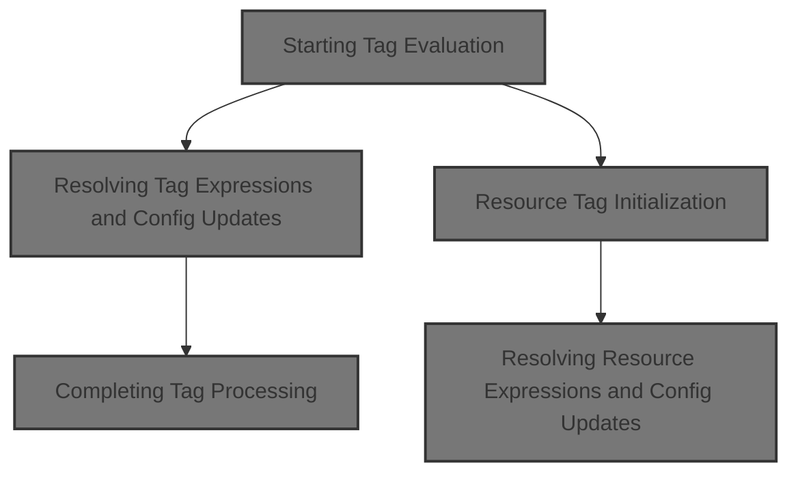

This document describes how tag attributes and expressions are resolved and applied at the start of tag processing. When a tag is used in a JSP page, its dynamic expressions are evaluated and the tag's state is updated with the resulting values. This prepares the tag for its main logic and ensures that all necessary data is available for subsequent processing.



# Starting Tag Evaluation

<SwmSnippet path="/el/src/main/java/org/apache/strutsel/taglib/logic/ELPresentTag.java" line="235">

---

In <SwmToken path="el/src/main/java/org/apache/strutsel/taglib/logic/ELPresentTag.java" pos="235:5:5" line-data="    public int doStartTag() throws JspException {">`doStartTag`</SwmToken>, we kick off the tag processing by resolving all dynamic expressions up front. Calling <SwmToken path="el/src/main/java/org/apache/strutsel/taglib/logic/ELPresentTag.java" pos="236:1:1" line-data="        evaluateExpressions();">`evaluateExpressions`</SwmToken> here ensures that any values needed for the tag's logic are set before moving forward.

```java
    public int doStartTag() throws JspException {
        evaluateExpressions();

```

---

</SwmSnippet>

## Resolving Tag Expressions and Config Updates

```mermaid
%%{init: {"flowchart": {"defaultRenderer": "elk"}} }%%
flowchart TD
    node1["Start evaluating expressions"]
    click node1 openCode "el/src/main/java/org/apache/strutsel/taglib/logic/ELPresentTag.java:247:294"
    node1 --> node2{"Is cookie expression present?"}
    click node2 openCode "el/src/main/java/org/apache/strutsel/taglib/logic/ELPresentTag.java:251:255"
    node2 -->|"Yes"| node3["Set cookie attribute"]
    click node3 openCode "el/src/main/java/org/apache/strutsel/taglib/logic/ELPresentTag.java:254:255"
    node2 -->|"No"| node4{"Is header expression present?"}
    click node4 openCode "el/src/main/java/org/apache/strutsel/taglib/logic/ELPresentTag.java:257:261"
    node3 --> node4
    node4 -->|"Yes"| node5["Set header attribute"]
    click node5 openCode "el/src/main/java/org/apache/strutsel/taglib/logic/ELPresentTag.java:260:261"
    node4 -->|"No"| node6{"Is name expression present?"}
    click node6 openCode "el/src/main/java/org/apache/strutsel/taglib/logic/ELPresentTag.java:263:266"
    node5 --> node6
    node6 -->|"Yes"| node7["Set name attribute"]
    click node7 openCode "el/src/main/java/org/apache/strutsel/taglib/logic/ELPresentTag.java:265:266"
    node6 -->|"No"| node8{"Is parameter expression present?"}
    click node8 openCode "el/src/main/java/org/apache/strutsel/taglib/logic/ELPresentTag.java:268:272"
    node7 --> node8
    node8 -->|"Yes"| node9["Set parameter attribute"]
    click node9 openCode "el/src/main/java/org/apache/strutsel/taglib/logic/ELPresentTag.java:271:272"
    node8 -->|"No"| node10{"Is property expression present?"}
    click node10 openCode "el/src/main/java/org/apache/strutsel/taglib/logic/ELPresentTag.java:274:278"
    node9 --> node10
    node10 -->|"Yes"| node11["Set property attribute"]
    click node11 openCode "el/src/main/java/org/apache/strutsel/taglib/logic/ELPresentTag.java:277:278"
    node10 -->|"No"| node12{"Is role expression present?"}
    click node12 openCode "el/src/main/java/org/apache/strutsel/taglib/logic/ELPresentTag.java:280:283"
    node11 --> node12
    node12 -->|"Yes"| node13["Set role attribute"]
    click node13 openCode "el/src/main/java/org/apache/strutsel/taglib/logic/ELPresentTag.java:282:283"
    node12 -->|"No"| node14{"Is scope expression present?"}
    click node14 openCode "el/src/main/java/org/apache/strutsel/taglib/logic/ELPresentTag.java:285:288"
    node13 --> node14
    node14 -->|"Yes"| node15["Set scope attribute"]
    click node15 openCode "el/src/main/java/org/apache/strutsel/taglib/logic/ELPresentTag.java:287:288"
    node14 -->|"No"| node16{"Is user expression present?"}
    click node16 openCode "el/src/main/java/org/apache/strutsel/taglib/logic/ELPresentTag.java:290:293"
    node15 --> node16
    node16 -->|"Yes"| node17["Set user attribute"]
    click node17 openCode "el/src/main/java/org/apache/strutsel/taglib/logic/ELPresentTag.java:292:293"
    node16 -->|"No"| node18["Done"]
    node17 --> node18
    click node18 openCode "el/src/main/java/org/apache/strutsel/taglib/logic/ELPresentTag.java:294:294"

classDef HeadingStyle fill:#777777,stroke:#333,stroke-width:2px;

%% Swimm:
%% %%{init: {"flowchart": {"defaultRenderer": "elk"}} }%%
%% flowchart TD
%%     node1["Start evaluating expressions"]
%%     click node1 openCode "<SwmPath>[el/…/logic/ELPresentTag.java](el/src/main/java/org/apache/strutsel/taglib/logic/ELPresentTag.java)</SwmPath>:247:294"
%%     node1 --> node2{"Is cookie expression present?"}
%%     click node2 openCode "<SwmPath>[el/…/logic/ELPresentTag.java](el/src/main/java/org/apache/strutsel/taglib/logic/ELPresentTag.java)</SwmPath>:251:255"
%%     node2 -->|"Yes"| node3["Set cookie attribute"]
%%     click node3 openCode "<SwmPath>[el/…/logic/ELPresentTag.java](el/src/main/java/org/apache/strutsel/taglib/logic/ELPresentTag.java)</SwmPath>:254:255"
%%     node2 -->|"No"| node4{"Is header expression present?"}
%%     click node4 openCode "<SwmPath>[el/…/logic/ELPresentTag.java](el/src/main/java/org/apache/strutsel/taglib/logic/ELPresentTag.java)</SwmPath>:257:261"
%%     node3 --> node4
%%     node4 -->|"Yes"| node5["Set header attribute"]
%%     click node5 openCode "<SwmPath>[el/…/logic/ELPresentTag.java](el/src/main/java/org/apache/strutsel/taglib/logic/ELPresentTag.java)</SwmPath>:260:261"
%%     node4 -->|"No"| node6{"Is name expression present?"}
%%     click node6 openCode "<SwmPath>[el/…/logic/ELPresentTag.java](el/src/main/java/org/apache/strutsel/taglib/logic/ELPresentTag.java)</SwmPath>:263:266"
%%     node5 --> node6
%%     node6 -->|"Yes"| node7["Set name attribute"]
%%     click node7 openCode "<SwmPath>[el/…/logic/ELPresentTag.java](el/src/main/java/org/apache/strutsel/taglib/logic/ELPresentTag.java)</SwmPath>:265:266"
%%     node6 -->|"No"| node8{"Is parameter expression present?"}
%%     click node8 openCode "<SwmPath>[el/…/logic/ELPresentTag.java](el/src/main/java/org/apache/strutsel/taglib/logic/ELPresentTag.java)</SwmPath>:268:272"
%%     node7 --> node8
%%     node8 -->|"Yes"| node9["Set parameter attribute"]
%%     click node9 openCode "<SwmPath>[el/…/logic/ELPresentTag.java](el/src/main/java/org/apache/strutsel/taglib/logic/ELPresentTag.java)</SwmPath>:271:272"
%%     node8 -->|"No"| node10{"Is property expression present?"}
%%     click node10 openCode "<SwmPath>[el/…/logic/ELPresentTag.java](el/src/main/java/org/apache/strutsel/taglib/logic/ELPresentTag.java)</SwmPath>:274:278"
%%     node9 --> node10
%%     node10 -->|"Yes"| node11["Set property attribute"]
%%     click node11 openCode "<SwmPath>[el/…/logic/ELPresentTag.java](el/src/main/java/org/apache/strutsel/taglib/logic/ELPresentTag.java)</SwmPath>:277:278"
%%     node10 -->|"No"| node12{"Is role expression present?"}
%%     click node12 openCode "<SwmPath>[el/…/logic/ELPresentTag.java](el/src/main/java/org/apache/strutsel/taglib/logic/ELPresentTag.java)</SwmPath>:280:283"
%%     node11 --> node12
%%     node12 -->|"Yes"| node13["Set role attribute"]
%%     click node13 openCode "<SwmPath>[el/…/logic/ELPresentTag.java](el/src/main/java/org/apache/strutsel/taglib/logic/ELPresentTag.java)</SwmPath>:282:283"
%%     node12 -->|"No"| node14{"Is scope expression present?"}
%%     click node14 openCode "<SwmPath>[el/…/logic/ELPresentTag.java](el/src/main/java/org/apache/strutsel/taglib/logic/ELPresentTag.java)</SwmPath>:285:288"
%%     node13 --> node14
%%     node14 -->|"Yes"| node15["Set scope attribute"]
%%     click node15 openCode "<SwmPath>[el/…/logic/ELPresentTag.java](el/src/main/java/org/apache/strutsel/taglib/logic/ELPresentTag.java)</SwmPath>:287:288"
%%     node14 -->|"No"| node16{"Is user expression present?"}
%%     click node16 openCode "<SwmPath>[el/…/logic/ELPresentTag.java](el/src/main/java/org/apache/strutsel/taglib/logic/ELPresentTag.java)</SwmPath>:290:293"
%%     node15 --> node16
%%     node16 -->|"Yes"| node17["Set user attribute"]
%%     click node17 openCode "<SwmPath>[el/…/logic/ELPresentTag.java](el/src/main/java/org/apache/strutsel/taglib/logic/ELPresentTag.java)</SwmPath>:292:293"
%%     node16 -->|"No"| node18["Done"]
%%     node17 --> node18
%%     click node18 openCode "<SwmPath>[el/…/logic/ELPresentTag.java](el/src/main/java/org/apache/strutsel/taglib/logic/ELPresentTag.java)</SwmPath>:294:294"
%% 
%% classDef HeadingStyle fill:#777777,stroke:#333,stroke-width:2px;
```



<SwmSnippet path="/el/src/main/java/org/apache/strutsel/taglib/logic/ELPresentTag.java" line="247">

---

In <SwmToken path="el/src/main/java/org/apache/strutsel/taglib/logic/ELPresentTag.java" pos="247:5:5" line-data="    private void evaluateExpressions()">`evaluateExpressions`</SwmToken>, we loop through each expression, and if the parameter expression resolves, we call <SwmToken path="el/src/main/java/org/apache/strutsel/taglib/logic/ELPresentTag.java" pos="271:1:1" line-data="            setParameter(string);">`setParameter`</SwmToken> to update the config. This sets up the tag's state for later use.

```java
    private void evaluateExpressions()
        throws JspException {
        String string = null;

        if ((string =
                EvalHelper.evalString("cookie", getCookieExpr(), this,
                    pageContext)) != null) {
            setCookie(string);
        }

        if ((string =
                EvalHelper.evalString("header", getHeaderExpr(), this,
                    pageContext)) != null) {
            setHeader(string);
        }

        if ((string =
                EvalHelper.evalString("name", getNameExpr(), this, pageContext)) != null) {
            setName(string);
        }

        if ((string =
                EvalHelper.evalString("parameter", getParameterExpr(), this,
                    pageContext)) != null) {
            setParameter(string);
        }

```

---

</SwmSnippet>

<SwmSnippet path="/core/src/main/java/org/apache/struts/config/MessageResourcesConfig.java" line="127">

---

<SwmToken path="core/src/main/java/org/apache/struts/config/MessageResourcesConfig.java" pos="127:5:5" line-data="    public void setParameter(String parameter) {">`setParameter`</SwmToken> checks if the config is frozen before updating the parameter. If it's locked, it throws an exception to stop any changes.

```java
    public void setParameter(String parameter) {
        if (configured) {
            throw new IllegalStateException("Configuration is frozen");
        }

        this.parameter = parameter;
    }
```

---

</SwmSnippet>

<SwmSnippet path="/el/src/main/java/org/apache/strutsel/taglib/logic/ELPresentTag.java" line="274">

---

After returning from <SwmToken path="el/src/main/java/org/apache/strutsel/taglib/logic/ELPresentTag.java" pos="271:1:1" line-data="            setParameter(string);">`setParameter`</SwmToken>, <SwmToken path="el/src/main/java/org/apache/strutsel/taglib/logic/ELPresentTag.java" pos="236:1:1" line-data="        evaluateExpressions();">`evaluateExpressions`</SwmToken> moves on to property and scope. We call <SwmToken path="el/src/main/java/org/apache/strutsel/taglib/logic/ELPresentTag.java" pos="287:1:1" line-data="            setScope(string);">`setScope`</SwmToken> next to update the config if the scope expression resolves.

```java
        if ((string =
                EvalHelper.evalString("property", getPropertyExpr(), this,
                    pageContext)) != null) {
            setProperty(string);
        }

        if ((string =
                EvalHelper.evalString("role", getRoleExpr(), this, pageContext)) != null) {
            setRole(string);
        }

        if ((string =
                EvalHelper.evalString("scope", getScopeExpr(), this, pageContext)) != null) {
            setScope(string);
        }

```

---

</SwmSnippet>

<SwmSnippet path="/core/src/main/java/org/apache/struts/config/ActionConfig.java" line="652">

---

<SwmToken path="core/src/main/java/org/apache/struts/config/ActionConfig.java" pos="652:5:5" line-data="    public void setScope(String scope) {">`setScope`</SwmToken> checks if the config is frozen before updating the scope. If locked, it throws to prevent changes.

```java
    public void setScope(String scope) {
        if (configured) {
            throw new IllegalStateException("Configuration is frozen");
        }

        this.scope = scope;
    }
```

---

</SwmSnippet>

<SwmSnippet path="/el/src/main/java/org/apache/strutsel/taglib/logic/ELPresentTag.java" line="290">

---

After returning from <SwmToken path="el/src/main/java/org/apache/strutsel/taglib/logic/ELPresentTag.java" pos="287:1:1" line-data="            setScope(string);">`setScope`</SwmToken>, <SwmToken path="el/src/main/java/org/apache/strutsel/taglib/logic/ELPresentTag.java" pos="236:1:1" line-data="        evaluateExpressions();">`evaluateExpressions`</SwmToken> finishes by checking the user expression and updating the tag state if needed.

```java
        if ((string =
                EvalHelper.evalString("user", getUserExpr(), this, pageContext)) != null) {
            setUser(string);
        }
    }
```

---

</SwmSnippet>

## Completing Tag Processing

<SwmSnippet path="/el/src/main/java/org/apache/strutsel/taglib/logic/ELPresentTag.java" line="238">

---

After finishing <SwmToken path="el/src/main/java/org/apache/strutsel/taglib/logic/ELPresentTag.java" pos="236:1:1" line-data="        evaluateExpressions();">`evaluateExpressions`</SwmToken>, <SwmToken path="el/src/main/java/org/apache/strutsel/taglib/logic/ELPresentTag.java" pos="238:6:6" line-data="        return (super.doStartTag());">`doStartTag`</SwmToken> hands off to the superclass for standard tag handling, then moves on to the next tag in the flow.

```java
        return (super.doStartTag());
    }
```

---

</SwmSnippet>

# Resource Tag Initialization

<SwmSnippet path="/el/src/main/java/org/apache/strutsel/taglib/bean/ELResourceTag.java" line="120">

---

<SwmToken path="el/src/main/java/org/apache/strutsel/taglib/bean/ELResourceTag.java" pos="120:5:5" line-data="    public int doStartTag() throws JspException {">`doStartTag`</SwmToken> in <SwmToken path="el/src/main/java/org/apache/strutsel/taglib/bean/ELResourceTag.java" pos="38:4:4" line-data="public class ELResourceTag extends ResourceTag {">`ELResourceTag`</SwmToken> starts by resolving its expressions, then passes control to the superclass for standard tag processing.

```java
    public int doStartTag() throws JspException {
        evaluateExpressions();

        return (super.doStartTag());
    }
```

---

</SwmSnippet>

# Resolving Resource Expressions and Config Updates

```mermaid
%%{init: {"flowchart": {"defaultRenderer": "elk"}} }%%
flowchart TD
    node1["Evaluate 'id' expression"]
    click node1 openCode "el/src/main/java/org/apache/strutsel/taglib/bean/ELResourceTag.java:136:139"
    node1 --> node2{"Is 'id' value non-null?"}
    click node2 openCode "el/src/main/java/org/apache/strutsel/taglib/bean/ELResourceTag.java:136:139"
    node2 -->|"Yes"| node3["Set 'id' property"]
    click node3 openCode "el/src/main/java/org/apache/strutsel/taglib/bean/ELResourceTag.java:138:139"
    node2 -->|"No"| node4["Evaluate 'input' expression"]
    click node4 openCode "el/src/main/java/org/apache/strutsel/taglib/bean/ELResourceTag.java:141:144"
    node3 --> node4
    node4 --> node5{"Is 'input' value non-null?"}
    click node5 openCode "el/src/main/java/org/apache/strutsel/taglib/bean/ELResourceTag.java:141:144"
    node5 -->|"Yes"| node6["Set 'input' property"]
    click node6 openCode "el/src/main/java/org/apache/strutsel/taglib/bean/ELResourceTag.java:143:144"
    node5 -->|"No"| node7["Evaluate 'name' expression"]
    click node7 openCode "el/src/main/java/org/apache/strutsel/taglib/bean/ELResourceTag.java:146:149"
    node6 --> node7
    node7 --> node8{"Is 'name' value non-null?"}
    click node8 openCode "el/src/main/java/org/apache/strutsel/taglib/bean/ELResourceTag.java:146:149"
    node8 -->|"Yes"| node9["Set 'name' property"]
    click node9 openCode "el/src/main/java/org/apache/strutsel/taglib/bean/ELResourceTag.java:148:149"
    node8 -->|"No"| node10["End"]
    node9 --> node10
    node7 --> node10

classDef HeadingStyle fill:#777777,stroke:#333,stroke-width:2px;

%% Swimm:
%% %%{init: {"flowchart": {"defaultRenderer": "elk"}} }%%
%% flowchart TD
%%     node1["Evaluate 'id' expression"]
%%     click node1 openCode "<SwmPath>[el/…/bean/ELResourceTag.java](el/src/main/java/org/apache/strutsel/taglib/bean/ELResourceTag.java)</SwmPath>:136:139"
%%     node1 --> node2{"Is 'id' value non-null?"}
%%     click node2 openCode "<SwmPath>[el/…/bean/ELResourceTag.java](el/src/main/java/org/apache/strutsel/taglib/bean/ELResourceTag.java)</SwmPath>:136:139"
%%     node2 -->|"Yes"| node3["Set 'id' property"]
%%     click node3 openCode "<SwmPath>[el/…/bean/ELResourceTag.java](el/src/main/java/org/apache/strutsel/taglib/bean/ELResourceTag.java)</SwmPath>:138:139"
%%     node2 -->|"No"| node4["Evaluate 'input' expression"]
%%     click node4 openCode "<SwmPath>[el/…/bean/ELResourceTag.java](el/src/main/java/org/apache/strutsel/taglib/bean/ELResourceTag.java)</SwmPath>:141:144"
%%     node3 --> node4
%%     node4 --> node5{"Is 'input' value non-null?"}
%%     click node5 openCode "<SwmPath>[el/…/bean/ELResourceTag.java](el/src/main/java/org/apache/strutsel/taglib/bean/ELResourceTag.java)</SwmPath>:141:144"
%%     node5 -->|"Yes"| node6["Set 'input' property"]
%%     click node6 openCode "<SwmPath>[el/…/bean/ELResourceTag.java](el/src/main/java/org/apache/strutsel/taglib/bean/ELResourceTag.java)</SwmPath>:143:144"
%%     node5 -->|"No"| node7["Evaluate 'name' expression"]
%%     click node7 openCode "<SwmPath>[el/…/bean/ELResourceTag.java](el/src/main/java/org/apache/strutsel/taglib/bean/ELResourceTag.java)</SwmPath>:146:149"
%%     node6 --> node7
%%     node7 --> node8{"Is 'name' value non-null?"}
%%     click node8 openCode "<SwmPath>[el/…/bean/ELResourceTag.java](el/src/main/java/org/apache/strutsel/taglib/bean/ELResourceTag.java)</SwmPath>:146:149"
%%     node8 -->|"Yes"| node9["Set 'name' property"]
%%     click node9 openCode "<SwmPath>[el/…/bean/ELResourceTag.java](el/src/main/java/org/apache/strutsel/taglib/bean/ELResourceTag.java)</SwmPath>:148:149"
%%     node8 -->|"No"| node10["End"]
%%     node9 --> node10
%%     node7 --> node10
%% 
%% classDef HeadingStyle fill:#777777,stroke:#333,stroke-width:2px;
```



<SwmSnippet path="/el/src/main/java/org/apache/strutsel/taglib/bean/ELResourceTag.java" line="132">

---

In <SwmToken path="el/src/main/java/org/apache/strutsel/taglib/bean/ELResourceTag.java" pos="132:5:5" line-data="    private void evaluateExpressions()">`evaluateExpressions`</SwmToken>, we check the id and input expressions, and if input resolves, we call <SwmToken path="el/src/main/java/org/apache/strutsel/taglib/bean/ELResourceTag.java" pos="143:1:1" line-data="            setInput(string);">`setInput`</SwmToken> to update the config.

```java
    private void evaluateExpressions()
        throws JspException {
        String string = null;

        if ((string =
                EvalHelper.evalString("id", getIdExpr(), this, pageContext)) != null) {
            setId(string);
        }

        if ((string =
                EvalHelper.evalString("input", getInputExpr(), this, pageContext)) != null) {
            setInput(string);
        }

```

---

</SwmSnippet>

<SwmSnippet path="/core/src/main/java/org/apache/struts/config/ActionConfig.java" line="473">

---

<SwmToken path="core/src/main/java/org/apache/struts/config/ActionConfig.java" pos="473:5:5" line-data="    public void setInput(String input) {">`setInput`</SwmToken> checks if the config is frozen before updating the input. If locked, it throws to block changes.

```java
    public void setInput(String input) {
        if (configured) {
            throw new IllegalStateException("Configuration is frozen");
        }

        this.input = input;
    }
```

---

</SwmSnippet>

<SwmSnippet path="/el/src/main/java/org/apache/strutsel/taglib/bean/ELResourceTag.java" line="146">

---

After returning from <SwmToken path="core/src/main/java/org/apache/struts/config/ActionConfig.java" pos="473:5:5" line-data="    public void setInput(String input) {">`setInput`</SwmToken>, <SwmToken path="el/src/main/java/org/apache/strutsel/taglib/logic/ELPresentTag.java" pos="236:1:1" line-data="        evaluateExpressions();">`evaluateExpressions`</SwmToken> wraps up by checking the name expression and updating the tag state if needed.

```java
        if ((string =
                EvalHelper.evalString("name", getNameExpr(), this, pageContext)) != null) {
            setName(string);
        }
    }
```

---

</SwmSnippet>

&nbsp;

*This is an auto-generated document by Swimm 🌊 and has not yet been verified by a human*

<SwmMeta version="3.0.0" repo-id="Z2l0aHViJTNBJTNBc3RydXRzMSUzQSUzQVN3aW1tLURlbW8=" repo-name="struts1"><sup>Powered by [Swimm](https://app.swimm.io/)</sup></SwmMeta>
