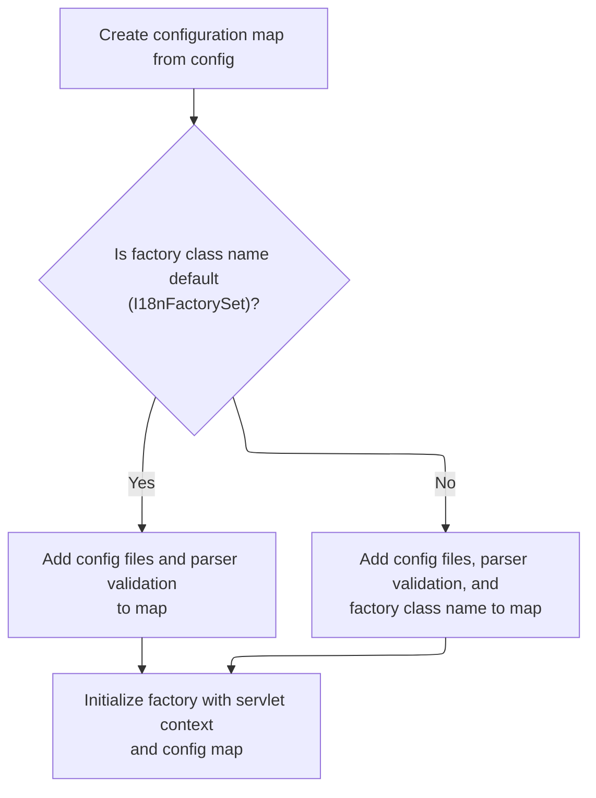

This document explains how the component definitions factory is initialized using configuration settings and the servlet context. The flow ensures the factory is ready to manage component definitions for the application.

# Initializing the Factory Wrapper

<SwmSnippet path="/tiles/src/main/java/org/apache/struts/tiles/definition/ComponentDefinitionsFactoryWrapper.java" line="95">

---

In <SwmToken path="tiles/src/main/java/org/apache/struts/tiles/definition/ComponentDefinitionsFactoryWrapper.java" pos="95:5:5" line-data="    public void init(DefinitionsFactoryConfig config, ServletContext servletContext)">`init`</SwmToken>, we check if the factory is missing and, if so, create it using the classname from the config. This sets up the factory for later steps

```java
    public void init(DefinitionsFactoryConfig config, ServletContext servletContext)
        throws DefinitionsFactoryException {

        this.config = config;

        // create factory and initialize it
        if (factory == null) {
            factory = createFactoryInstance(config.getFactoryClassname());
        }

```

---

</SwmSnippet>

## Creating the Factory Instance

<SwmSnippet path="/tiles/src/main/java/org/apache/struts/tiles/definition/ComponentDefinitionsFactoryWrapper.java" line="156">

---

In <SwmToken path="tiles/src/main/java/org/apache/struts/tiles/definition/ComponentDefinitionsFactoryWrapper.java" pos="156:5:5" line-data="    protected ComponentDefinitionsFactory createFactoryInstance(String classname)">`createFactoryInstance`</SwmToken>, we load and instantiate the factory class using its name from the config. This lets us support different factory implementations, and sets up the object for use in the wrapper. The next step involves dynamic instantiation logic similar to what's used in DynaActionFormClass.

```java
    protected ComponentDefinitionsFactory createFactoryInstance(String classname)
        throws DefinitionsFactoryException {

        try {
            Class factoryClass = RequestUtils.applicationClass(classname);
            Object factory = factoryClass.newInstance();
            return (ComponentDefinitionsFactory) factory;

        } catch (ClassCastException ex) { // Bad classname
            throw new DefinitionsFactoryException(
                "Error - createDefinitionsFactory : Factory class '"
                    + classname
                    + " must implement 'DefinitionsFactory'.",
                ex);

        } catch (ClassNotFoundException ex) { // Bad classname
            throw new DefinitionsFactoryException(
                "Error - createDefinitionsFactory : Bad class name '"
                    + classname
                    + "'.",
                ex);

```

---

</SwmSnippet>

### Dynamic Instantiation Logic

See <SwmLink doc-title="Creating and Initializing a Dynamic Form Instance">[Creating and Initializing a Dynamic Form Instance](/.swm/creating-and-initializing-a-dynamic-form-instance.q4i5gsu0.sw.md)</SwmLink>

### Handling Instantiation Errors

<SwmSnippet path="/tiles/src/main/java/org/apache/struts/tiles/definition/ComponentDefinitionsFactoryWrapper.java" line="178">

---

Back in <SwmToken path="tiles/src/main/java/org/apache/struts/tiles/definition/ComponentDefinitionsFactoryWrapper.java" pos="102:5:5" line-data="            factory = createFactoryInstance(config.getFactoryClassname());">`createFactoryInstance`</SwmToken>, we handle any instantiation errors by wrapping them in <SwmToken path="tiles/src/main/java/org/apache/struts/tiles/definition/ComponentDefinitionsFactoryWrapper.java" pos="179:5:5" line-data="            throw new DefinitionsFactoryException(ex);">`DefinitionsFactoryException`</SwmToken>. This ensures that failures from dynamic instantiation (like those from DynaActionFormClass) are surfaced clearly to the caller.

```java
        } catch (InstantiationException ex) { // Bad constructor or error
            throw new DefinitionsFactoryException(ex);

        } catch (IllegalAccessException ex) {
            throw new DefinitionsFactoryException(ex);
        }

    }
```

---

</SwmSnippet>

## Finalizing Factory Initialization



<SwmSnippet path="/tiles/src/main/java/org/apache/struts/tiles/definition/ComponentDefinitionsFactoryWrapper.java" line="105">

---

Finally, after getting the factory from <SwmToken path="tiles/src/main/java/org/apache/struts/tiles/definition/ComponentDefinitionsFactoryWrapper.java" pos="102:5:5" line-data="            factory = createFactoryInstance(config.getFactoryClassname());">`createFactoryInstance`</SwmToken>, <SwmToken path="tiles/src/main/java/org/apache/struts/tiles/definition/ComponentDefinitionsFactoryWrapper.java" pos="95:5:5" line-data="    public void init(DefinitionsFactoryConfig config, ServletContext servletContext)">`init`</SwmToken> calls <SwmToken path="tiles/src/main/java/org/apache/struts/tiles/definition/ComponentDefinitionsFactoryWrapper.java" pos="105:1:3" line-data="        factory.initFactory(servletContext, createConfigMap(config));">`factory.initFactory`</SwmToken> with the servlet context and a config map. The config map is built to include all necessary parameters for factory setup.

```java
        factory.initFactory(servletContext, createConfigMap(config));
    }
```

---

</SwmSnippet>

<SwmSnippet path="/tiles/src/main/java/org/apache/struts/tiles/definition/ComponentDefinitionsFactoryWrapper.java" line="202">

---

<SwmToken path="tiles/src/main/java/org/apache/struts/tiles/definition/ComponentDefinitionsFactoryWrapper.java" pos="202:7:7" line-data="    public static Map createConfigMap(DefinitionsFactoryConfig config) {">`createConfigMap`</SwmToken> builds a map from config attributes, adds entries for definition files and parser validation using constants, and skips adding the factory classname if it's the legacy value. This ensures the factory gets all relevant settings, including handling legacy config.

```java
    public static Map createConfigMap(DefinitionsFactoryConfig config) {
        Map map = new HashMap(config.getAttributes());
        // Add property attributes using old names
        map.put(
            DefinitionsFactoryConfig.DEFINITIONS_CONFIG_PARAMETER_NAME,
            config.getDefinitionConfigFiles());

        map.put(
            DefinitionsFactoryConfig.PARSER_VALIDATE_PARAMETER_NAME,
            (config.getParserValidate() ? Boolean.TRUE.toString() : Boolean.FALSE.toString()));

        if (!"org.apache.struts.tiles.xmlDefinition.I18nFactorySet"
            .equals(config.getFactoryClassname())) {

            map.put(
                DefinitionsFactoryConfig.FACTORY_CLASSNAME_PARAMETER_NAME,
                config.getFactoryClassname());
        }

        return map;
    }
```

---

</SwmSnippet>

&nbsp;

*This is an auto-generated document by Swimm 🌊 and has not yet been verified by a human*

<SwmMeta version="3.0.0" repo-id="Z2l0aHViJTNBJTNBc3RydXRzMSUzQSUzQVN3aW1tLURlbW8=" repo-name="struts1"><sup>Powered by [Swimm](https://app.swimm.io/)</sup></SwmMeta>
