This document describes how the system initializes and builds a definitions factory from XML configuration files. The process loads and processes each file, resolves inheritance and internationalization, and produces a definitions factory for managing reusable UI templates.

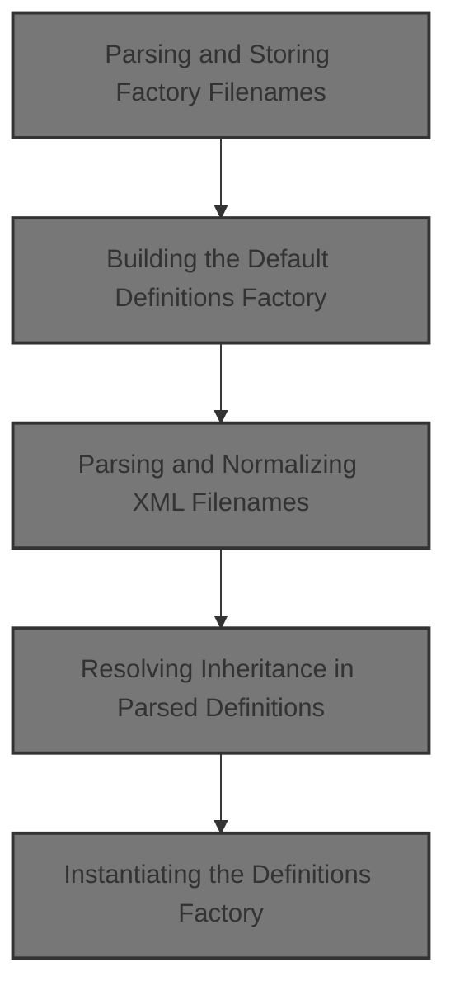
```mermaid
flowchart TD
  node1["Parsing and Storing Factory Filenames"]:::HeadingStyle
  click node1 goToHeading "Parsing and Storing Factory Filenames"
  node1 --> node2["Building the Default Definitions Factory"]:::HeadingStyle
  click node2 goToHeading "Building the Default Definitions Factory"
  node2 --> node3["Parsing and Normalizing XML Filenames"]:::HeadingStyle
  click node3 goToHeading "Parsing and Normalizing XML Filenames"
  node3 --> node4["Resolving Inheritance in Parsed Definitions"]:::HeadingStyle
  click node4 goToHeading "Resolving Inheritance in Parsed Definitions"
  node4 --> node5["Instantiating the Definitions Factory"]:::HeadingStyle
  click node5 goToHeading "Instantiating the Definitions Factory"
classDef HeadingStyle fill:#777777,stroke:#333,stroke-width:2px;
```

# Parsing and Storing Factory Filenames

<SwmSnippet path="/tiles/src/main/java/org/apache/struts/tiles/xmlDefinition/I18nFactorySet.java" line="228">

---

In <SwmToken path="tiles/src/main/java/org/apache/struts/tiles/xmlDefinition/I18nFactorySet.java" pos="228:5:5" line-data="    protected void initFactory(">`initFactory`</SwmToken>, we're splitting the input string of filenames (comma-separated) and storing each filename in a list for later processing. Next, we need to call the lexer (<SwmToken path="core/src/main/java/org/apache/struts/validator/validwhen/ValidWhenLexer.java" pos="1:25:25" line-data="// $ANTLR 2.7.7 (20060906): &quot;ValidWhenParser.g&quot; -&gt; &quot;ValidWhenLexer.java&quot;$">`ValidWhenLexer`</SwmToken>) to start parsing the contents of these files, since each file may contain expressions or rules that need to be tokenized.

```java
    protected void initFactory(
        ServletContext servletContext,
        String proposedFilename)
        throws DefinitionsFactoryException, FileNotFoundException {

        // Init list of filenames
        StringTokenizer tokenizer = new StringTokenizer(proposedFilename, ",");
        this.filenames = new ArrayList(tokenizer.countTokens());
        while (tokenizer.hasMoreTokens()) {
            this.filenames.add(tokenizer.nextToken().trim());
        }

```

---

</SwmSnippet>

## Tokenizing Input for Validation Rules

```mermaid
%%{init: {"flowchart": {"defaultRenderer": "elk"}} }%%
flowchart TD
    node1["Start scanning for next token"]
    click node1 openCode "core/src/main/java/org/apache/struts/validator/validwhen/ValidWhenLexer.java:75:78"
    subgraph loop1["Scan input until valid token found"]
        node1 --> node2{"What is the next character?"}
        click node2 openCode "core/src/main/java/org/apache/struts/validator/validwhen/ValidWhenLexer.java:84:159"
        node2 -->|"Whitespace"| node3["Recognize whitespace"]
        click node3 openCode "core/src/main/java/org/apache/struts/validator/validwhen/ValidWhenLexer.java:85:90"
        node3 --> node4["Skipping Whitespace in Input"]
        
        node4 --> node5["Set token"]
        click node5 openCode "core/src/main/java/org/apache/struts/validator/validwhen/ValidWhenLexer.java:88:89"
        node2 -->|"Digit or '-'"| node6["Recognize number"]
        click node6 openCode "core/src/main/java/org/apache/struts/validator/validwhen/ValidWhenLexer.java:91:98"
        node6 --> node7["Parsing Numeric Literals (Decimal, Hex, Octal)"]
        
        node7 --> node8["Set token"]
        click node8 openCode "core/src/main/java/org/apache/struts/validator/validwhen/ValidWhenLexer.java:96:97"
        node2 -->|"Quote"| node9["Recognize string"]
        click node9 openCode "core/src/main/java/org/apache/struts/validator/validwhen/ValidWhenLexer.java:99:104"
        node9 --> node10["Parsing String Literals"]
        
        node10 --> node11["Set token"]
        click node11 openCode "core/src/main/java/org/apache/struts/validator/validwhen/ValidWhenLexer.java:102:103"
        node2 -->|"["| node12["Recognize left bracket"]
        click node12 openCode "core/src/main/java/org/apache/struts/validator/validwhen/ValidWhenLexer.java:105:110"
        node12 --> node13["Parsing Left Bracket"]
        
        node13 --> node14["Set token"]
        click node14 openCode "core/src/main/java/org/apache/struts/validator/validwhen/ValidWhenLexer.java:107:108"
        node2 -->|"]"| node15["Recognize right bracket"]
        click node15 openCode "core/src/main/java/org/apache/struts/validator/validwhen/ValidWhenLexer.java:111:116"
        node15 --> node16["Parsing Right Bracket"]
        
        node16 --> node17["Set token"]
        click node17 openCode "core/src/main/java/org/apache/struts/validator/validwhen/ValidWhenLexer.java:113:114"
        node2 -->|"("| node18["Recognize left parenthesis"]
        click node18 openCode "core/src/main/java/org/apache/struts/validator/validwhen/ValidWhenLexer.java:117:122"
        node18 --> node19["Parsing Left Parenthesis"]
        
        node19 --> node20["Set token"]
        click node20 openCode "core/src/main/java/org/apache/struts/validator/validwhen/ValidWhenLexer.java:119:120"
        node2 -->|")"| node21["Recognize right parenthesis"]
        click node21 openCode "core/src/main/java/org/apache/struts/validator/validwhen/ValidWhenLexer.java:123:128"
        node21 --> node22["Parsing Right Parenthesis"]
        
        node22 --> node23["Set token"]
        click node23 openCode "core/src/main/java/org/apache/struts/validator/validwhen/ValidWhenLexer.java:125:126"
        node2 -->|"*"| node24["Recognize special token"]
        click node24 openCode "core/src/main/java/org/apache/struts/validator/validwhen/ValidWhenLexer.java:129:134"
        node24 --> node25["Parsing the '*this*' Identifier"]
        
        node25 --> node26["Set token"]
        click node26 openCode "core/src/main/java/org/apache/struts/validator/validwhen/ValidWhenLexer.java:131:132"
        node2 -->|"Identifier"| node27["Recognize identifier"]
        click node27 openCode "core/src/main/java/org/apache/struts/validator/validwhen/ValidWhenLexer.java:141:146"
        node27 --> node28["Parsing Identifiers"]
        
        node28 --> node29["Set token"]
        click node29 openCode "core/src/main/java/org/apache/struts/validator/validwhen/ValidWhenLexer.java:143:144"
        node2 -->|"="| node30["Recognize equals"]
        click node30 openCode "core/src/main/java/org/apache/struts/validator/validwhen/ValidWhenLexer.java:147:152"
        node30 --> node31["Parsing Equality Operator"]
        
        node31 --> node32["Set token"]
        click node32 openCode "core/src/main/java/org/apache/struts/validator/validwhen/ValidWhenLexer.java:149:150"
        node2 -->|"!"| node33["Recognize not equals"]
        click node33 openCode "core/src/main/java/org/apache/struts/validator/validwhen/ValidWhenLexer.java:153:158"
        node33 --> node34["Parsing Inequality Operator"]
        
        node34 --> node35["Set token"]
        click node35 openCode "core/src/main/java/org/apache/struts/validator/validwhen/ValidWhenLexer.java:155:156"
        node2 -->|"#lt;="| node36["Recognize less or equal"]
        click node36 openCode "core/src/main/java/org/apache/struts/validator/validwhen/ValidWhenLexer.java:159:163"
        node36 --> node37["Parsing Less-Than-Or-Equal Operator"]
        
        node37 --> node38["Set token"]
        click node38 openCode "core/src/main/java/org/apache/struts/validator/validwhen/ValidWhenLexer.java:161:162"
        node2 -->|"#gt;="| node39["Recognize greater or equal"]
        click node39 openCode "core/src/main/java/org/apache/struts/validator/validwhen/ValidWhenLexer.java:164:167"
        node39 --> node40["Parsing Greater-Than-Or-Equal Operator"]
        
        node40 --> node41["Set token"]
        click node41 openCode "core/src/main/java/org/apache/struts/validator/validwhen/ValidWhenLexer.java:165:166"
        node2 -->|"#lt;"| node42["Recognize less than"]
        click node42 openCode "core/src/main/java/org/apache/struts/validator/validwhen/ValidWhenLexer.java:168:171"
        node42 --> node43["Parsing Less-Than Operator"]
        
        node43 --> node44["Set token"]
        click node44 openCode "core/src/main/java/org/apache/struts/validator/validwhen/ValidWhenLexer.java:169:170"
        node2 -->|"#gt;"| node45["Recognize greater than"]
        click node45 openCode "core/src/main/java/org/apache/struts/validator/validwhen/ValidWhenLexer.java:172:175"
        node45 --> node46["Parsing Greater-Than Operator"]
        
        node46 --> node47["Set token"]
        click node47 openCode "core/src/main/java/org/apache/struts/validator/validwhen/ValidWhenLexer.java:173:174"
        node2 -->|"Other"| node48{"Is end of input?"}
        click node48 openCode "core/src/main/java/org/apache/struts/validator/validwhen/ValidWhenLexer.java:176:177"
        node48 -->|"Yes"| node49["Return end-of-input token"]
        click node49 openCode "core/src/main/java/org/apache/struts/validator/validwhen/ValidWhenLexer.java:177:178"
        node48 -->|"No"| node50["Unknown character - error"]
        click node50 openCode "core/src/main/java/org/apache/struts/validator/validwhen/ValidWhenLexer.java:178:179"
        node5 --> node51["Finalize token"]
        node8 --> node51
        node11 --> node51
        node14 --> node51
        node17 --> node51
        node20 --> node51
        node23 --> node51
        node26 --> node51
        node29 --> node51
        node32 --> node51
        node35 --> node51
        node38 --> node51
        node41 --> node51
        node44 --> node51
        node47 --> node51
        node49 --> node51
        node51["Check if token should be skipped, test
literals, set type, return token"]
        click node51 openCode "core/src/main/java/org/apache/struts/validator/validwhen/ValidWhenLexer.java:181:185"
    end
classDef HeadingStyle fill:#777777,stroke:#333,stroke-width:2px;
click node4 goToHeading "Skipping Whitespace in Input"
node4:::HeadingStyle
click node7 goToHeading "Parsing Numeric Literals (Decimal, Hex, Octal)"
node7:::HeadingStyle
click node10 goToHeading "Parsing String Literals"
node10:::HeadingStyle
click node13 goToHeading "Parsing Left Bracket"
node13:::HeadingStyle
click node16 goToHeading "Parsing Right Bracket"
node16:::HeadingStyle
click node19 goToHeading "Parsing Left Parenthesis"
node19:::HeadingStyle
click node22 goToHeading "Parsing Right Parenthesis"
node22:::HeadingStyle
click node25 goToHeading "Parsing the '*this*' Identifier"
node25:::HeadingStyle
click node28 goToHeading "Parsing Identifiers"
node28:::HeadingStyle
click node31 goToHeading "Parsing Equality Operator"
node31:::HeadingStyle
click node34 goToHeading "Parsing Inequality Operator"
node34:::HeadingStyle
click node37 goToHeading "Parsing Less-Than-Or-Equal Operator"
node37:::HeadingStyle
click node40 goToHeading "Parsing Greater-Than-Or-Equal Operator"
node40:::HeadingStyle
click node43 goToHeading "Parsing Less-Than Operator"
node43:::HeadingStyle
click node46 goToHeading "Parsing Greater-Than Operator"
node46:::HeadingStyle

%% Swimm:
%% %%{init: {"flowchart": {"defaultRenderer": "elk"}} }%%
%% flowchart TD
%%     node1["Start scanning for next token"]
%%     click node1 openCode "<SwmPath>[core/…/validwhen/ValidWhenLexer.java](core/src/main/java/org/apache/struts/validator/validwhen/ValidWhenLexer.java)</SwmPath>:75:78"
%%     subgraph loop1["Scan input until valid token found"]
%%         node1 --> node2{"What is the next character?"}
%%         click node2 openCode "<SwmPath>[core/…/validwhen/ValidWhenLexer.java](core/src/main/java/org/apache/struts/validator/validwhen/ValidWhenLexer.java)</SwmPath>:84:159"
%%         node2 -->|"Whitespace"| node3["Recognize whitespace"]
%%         click node3 openCode "<SwmPath>[core/…/validwhen/ValidWhenLexer.java](core/src/main/java/org/apache/struts/validator/validwhen/ValidWhenLexer.java)</SwmPath>:85:90"
%%         node3 --> node4["Skipping Whitespace in Input"]
%%         
%%         node4 --> node5["Set token"]
%%         click node5 openCode "<SwmPath>[core/…/validwhen/ValidWhenLexer.java](core/src/main/java/org/apache/struts/validator/validwhen/ValidWhenLexer.java)</SwmPath>:88:89"
%%         node2 -->|"Digit or '-'"| node6["Recognize number"]
%%         click node6 openCode "<SwmPath>[core/…/validwhen/ValidWhenLexer.java](core/src/main/java/org/apache/struts/validator/validwhen/ValidWhenLexer.java)</SwmPath>:91:98"
%%         node6 --> node7["Parsing Numeric Literals (Decimal, Hex, Octal)"]
%%         
%%         node7 --> node8["Set token"]
%%         click node8 openCode "<SwmPath>[core/…/validwhen/ValidWhenLexer.java](core/src/main/java/org/apache/struts/validator/validwhen/ValidWhenLexer.java)</SwmPath>:96:97"
%%         node2 -->|"Quote"| node9["Recognize string"]
%%         click node9 openCode "<SwmPath>[core/…/validwhen/ValidWhenLexer.java](core/src/main/java/org/apache/struts/validator/validwhen/ValidWhenLexer.java)</SwmPath>:99:104"
%%         node9 --> node10["Parsing String Literals"]
%%         
%%         node10 --> node11["Set token"]
%%         click node11 openCode "<SwmPath>[core/…/validwhen/ValidWhenLexer.java](core/src/main/java/org/apache/struts/validator/validwhen/ValidWhenLexer.java)</SwmPath>:102:103"
%%         node2 -->|"["| node12["Recognize left bracket"]
%%         click node12 openCode "<SwmPath>[core/…/validwhen/ValidWhenLexer.java](core/src/main/java/org/apache/struts/validator/validwhen/ValidWhenLexer.java)</SwmPath>:105:110"
%%         node12 --> node13["Parsing Left Bracket"]
%%         
%%         node13 --> node14["Set token"]
%%         click node14 openCode "<SwmPath>[core/…/validwhen/ValidWhenLexer.java](core/src/main/java/org/apache/struts/validator/validwhen/ValidWhenLexer.java)</SwmPath>:107:108"
%%         node2 -->|"]"| node15["Recognize right bracket"]
%%         click node15 openCode "<SwmPath>[core/…/validwhen/ValidWhenLexer.java](core/src/main/java/org/apache/struts/validator/validwhen/ValidWhenLexer.java)</SwmPath>:111:116"
%%         node15 --> node16["Parsing Right Bracket"]
%%         
%%         node16 --> node17["Set token"]
%%         click node17 openCode "<SwmPath>[core/…/validwhen/ValidWhenLexer.java](core/src/main/java/org/apache/struts/validator/validwhen/ValidWhenLexer.java)</SwmPath>:113:114"
%%         node2 -->|"("| node18["Recognize left parenthesis"]
%%         click node18 openCode "<SwmPath>[core/…/validwhen/ValidWhenLexer.java](core/src/main/java/org/apache/struts/validator/validwhen/ValidWhenLexer.java)</SwmPath>:117:122"
%%         node18 --> node19["Parsing Left Parenthesis"]
%%         
%%         node19 --> node20["Set token"]
%%         click node20 openCode "<SwmPath>[core/…/validwhen/ValidWhenLexer.java](core/src/main/java/org/apache/struts/validator/validwhen/ValidWhenLexer.java)</SwmPath>:119:120"
%%         node2 -->|")"| node21["Recognize right parenthesis"]
%%         click node21 openCode "<SwmPath>[core/…/validwhen/ValidWhenLexer.java](core/src/main/java/org/apache/struts/validator/validwhen/ValidWhenLexer.java)</SwmPath>:123:128"
%%         node21 --> node22["Parsing Right Parenthesis"]
%%         
%%         node22 --> node23["Set token"]
%%         click node23 openCode "<SwmPath>[core/…/validwhen/ValidWhenLexer.java](core/src/main/java/org/apache/struts/validator/validwhen/ValidWhenLexer.java)</SwmPath>:125:126"
%%         node2 -->|"*"| node24["Recognize special token"]
%%         click node24 openCode "<SwmPath>[core/…/validwhen/ValidWhenLexer.java](core/src/main/java/org/apache/struts/validator/validwhen/ValidWhenLexer.java)</SwmPath>:129:134"
%%         node24 --> node25["Parsing the '*this*' Identifier"]
%%         
%%         node25 --> node26["Set token"]
%%         click node26 openCode "<SwmPath>[core/…/validwhen/ValidWhenLexer.java](core/src/main/java/org/apache/struts/validator/validwhen/ValidWhenLexer.java)</SwmPath>:131:132"
%%         node2 -->|"Identifier"| node27["Recognize identifier"]
%%         click node27 openCode "<SwmPath>[core/…/validwhen/ValidWhenLexer.java](core/src/main/java/org/apache/struts/validator/validwhen/ValidWhenLexer.java)</SwmPath>:141:146"
%%         node27 --> node28["Parsing Identifiers"]
%%         
%%         node28 --> node29["Set token"]
%%         click node29 openCode "<SwmPath>[core/…/validwhen/ValidWhenLexer.java](core/src/main/java/org/apache/struts/validator/validwhen/ValidWhenLexer.java)</SwmPath>:143:144"
%%         node2 -->|"="| node30["Recognize equals"]
%%         click node30 openCode "<SwmPath>[core/…/validwhen/ValidWhenLexer.java](core/src/main/java/org/apache/struts/validator/validwhen/ValidWhenLexer.java)</SwmPath>:147:152"
%%         node30 --> node31["Parsing Equality Operator"]
%%         
%%         node31 --> node32["Set token"]
%%         click node32 openCode "<SwmPath>[core/…/validwhen/ValidWhenLexer.java](core/src/main/java/org/apache/struts/validator/validwhen/ValidWhenLexer.java)</SwmPath>:149:150"
%%         node2 -->|"!"| node33["Recognize not equals"]
%%         click node33 openCode "<SwmPath>[core/…/validwhen/ValidWhenLexer.java](core/src/main/java/org/apache/struts/validator/validwhen/ValidWhenLexer.java)</SwmPath>:153:158"
%%         node33 --> node34["Parsing Inequality Operator"]
%%         
%%         node34 --> node35["Set token"]
%%         click node35 openCode "<SwmPath>[core/…/validwhen/ValidWhenLexer.java](core/src/main/java/org/apache/struts/validator/validwhen/ValidWhenLexer.java)</SwmPath>:155:156"
%%         node2 -->|"#lt;="| node36["Recognize less or equal"]
%%         click node36 openCode "<SwmPath>[core/…/validwhen/ValidWhenLexer.java](core/src/main/java/org/apache/struts/validator/validwhen/ValidWhenLexer.java)</SwmPath>:159:163"
%%         node36 --> node37["Parsing Less-Than-Or-Equal Operator"]
%%         
%%         node37 --> node38["Set token"]
%%         click node38 openCode "<SwmPath>[core/…/validwhen/ValidWhenLexer.java](core/src/main/java/org/apache/struts/validator/validwhen/ValidWhenLexer.java)</SwmPath>:161:162"
%%         node2 -->|"#gt;="| node39["Recognize greater or equal"]
%%         click node39 openCode "<SwmPath>[core/…/validwhen/ValidWhenLexer.java](core/src/main/java/org/apache/struts/validator/validwhen/ValidWhenLexer.java)</SwmPath>:164:167"
%%         node39 --> node40["Parsing Greater-Than-Or-Equal Operator"]
%%         
%%         node40 --> node41["Set token"]
%%         click node41 openCode "<SwmPath>[core/…/validwhen/ValidWhenLexer.java](core/src/main/java/org/apache/struts/validator/validwhen/ValidWhenLexer.java)</SwmPath>:165:166"
%%         node2 -->|"#lt;"| node42["Recognize less than"]
%%         click node42 openCode "<SwmPath>[core/…/validwhen/ValidWhenLexer.java](core/src/main/java/org/apache/struts/validator/validwhen/ValidWhenLexer.java)</SwmPath>:168:171"
%%         node42 --> node43["Parsing Less-Than Operator"]
%%         
%%         node43 --> node44["Set token"]
%%         click node44 openCode "<SwmPath>[core/…/validwhen/ValidWhenLexer.java](core/src/main/java/org/apache/struts/validator/validwhen/ValidWhenLexer.java)</SwmPath>:169:170"
%%         node2 -->|"#gt;"| node45["Recognize greater than"]
%%         click node45 openCode "<SwmPath>[core/…/validwhen/ValidWhenLexer.java](core/src/main/java/org/apache/struts/validator/validwhen/ValidWhenLexer.java)</SwmPath>:172:175"
%%         node45 --> node46["Parsing Greater-Than Operator"]
%%         
%%         node46 --> node47["Set token"]
%%         click node47 openCode "<SwmPath>[core/…/validwhen/ValidWhenLexer.java](core/src/main/java/org/apache/struts/validator/validwhen/ValidWhenLexer.java)</SwmPath>:173:174"
%%         node2 -->|"Other"| node48{"Is end of input?"}
%%         click node48 openCode "<SwmPath>[core/…/validwhen/ValidWhenLexer.java](core/src/main/java/org/apache/struts/validator/validwhen/ValidWhenLexer.java)</SwmPath>:176:177"
%%         node48 -->|"Yes"| node49["Return end-of-input token"]
%%         click node49 openCode "<SwmPath>[core/…/validwhen/ValidWhenLexer.java](core/src/main/java/org/apache/struts/validator/validwhen/ValidWhenLexer.java)</SwmPath>:177:178"
%%         node48 -->|"No"| node50["Unknown character - error"]
%%         click node50 openCode "<SwmPath>[core/…/validwhen/ValidWhenLexer.java](core/src/main/java/org/apache/struts/validator/validwhen/ValidWhenLexer.java)</SwmPath>:178:179"
%%         node5 --> node51["Finalize token"]
%%         node8 --> node51
%%         node11 --> node51
%%         node14 --> node51
%%         node17 --> node51
%%         node20 --> node51
%%         node23 --> node51
%%         node26 --> node51
%%         node29 --> node51
%%         node32 --> node51
%%         node35 --> node51
%%         node38 --> node51
%%         node41 --> node51
%%         node44 --> node51
%%         node47 --> node51
%%         node49 --> node51
%%         node51["Check if token should be skipped, test
%% literals, set type, return token"]
%%         click node51 openCode "<SwmPath>[core/…/validwhen/ValidWhenLexer.java](core/src/main/java/org/apache/struts/validator/validwhen/ValidWhenLexer.java)</SwmPath>:181:185"
%%     end
%% classDef HeadingStyle fill:#777777,stroke:#333,stroke-width:2px;
%% click node4 goToHeading "Skipping Whitespace in Input"
%% node4:::HeadingStyle
%% click node7 goToHeading "Parsing Numeric Literals (Decimal, Hex, Octal)"
%% node7:::HeadingStyle
%% click node10 goToHeading "Parsing String Literals"
%% node10:::HeadingStyle
%% click node13 goToHeading "Parsing Left Bracket"
%% node13:::HeadingStyle
%% click node16 goToHeading "Parsing Right Bracket"
%% node16:::HeadingStyle
%% click node19 goToHeading "Parsing Left Parenthesis"
%% node19:::HeadingStyle
%% click node22 goToHeading "Parsing Right Parenthesis"
%% node22:::HeadingStyle
%% click node25 goToHeading "Parsing the '*this*' Identifier"
%% node25:::HeadingStyle
%% click node28 goToHeading "Parsing Identifiers"
%% node28:::HeadingStyle
%% click node31 goToHeading "Parsing Equality Operator"
%% node31:::HeadingStyle
%% click node34 goToHeading "Parsing Inequality Operator"
%% node34:::HeadingStyle
%% click node37 goToHeading "Parsing Less-Than-Or-Equal Operator"
%% node37:::HeadingStyle
%% click node40 goToHeading "Parsing Greater-Than-Or-Equal Operator"
%% node40:::HeadingStyle
%% click node43 goToHeading "Parsing Less-Than Operator"
%% node43:::HeadingStyle
%% click node46 goToHeading "Parsing Greater-Than Operator"
%% node46:::HeadingStyle
```

<SwmSnippet path="/core/src/main/java/org/apache/struts/validator/validwhen/ValidWhenLexer.java" line="75">

---

In <SwmToken path="core/src/main/java/org/apache/struts/validator/validwhen/ValidWhenLexer.java" pos="75:4:4" line-data="public Token nextToken() throws TokenStreamException {">`nextToken`</SwmToken>, the lexer loops through the input, checking the next character and dispatching to the appropriate matcher (like whitespace, numbers, or strings). We call <SwmToken path="core/src/main/java/org/apache/struts/validator/validwhen/ValidWhenLexer.java" pos="87:1:1" line-data="					mWS(true);">`mWS`</SwmToken> first to skip whitespace and get to the next meaningful token. After handling whitespace, the lexer moves on to check for numeric literals, which is why the next step is to call <SwmToken path="core/src/main/java/org/apache/struts/validator/validwhen/ValidWhenLexer.java" pos="95:1:1" line-data="					mDECIMAL_LITERAL(true);">`mDECIMAL_LITERAL`</SwmToken>.

```java
public Token nextToken() throws TokenStreamException {
	Token theRetToken=null;
tryAgain:
	for (;;) {
		Token _token = null;
		int _ttype = Token.INVALID_TYPE;
		resetText();
		try {   // for char stream error handling
			try {   // for lexical error handling
				switch ( LA(1)) {
				case '\t':  case '\n':  case '\r':  case ' ':
				{
					mWS(true);
					theRetToken=_returnToken;
					break;
				}
				case '-':  case '0':  case '1':  case '2':
				case '3':  case '4':  case '5':  case '6':
```

---

</SwmSnippet>

### Skipping Whitespace in Input

See <SwmLink doc-title="Finalizing Action Configuration">[Finalizing Action Configuration](/.swm/finalizing-action-configuration.g3k6e19u.sw.md)</SwmLink>

### Detecting Numeric Literals

<SwmSnippet path="/core/src/main/java/org/apache/struts/validator/validwhen/ValidWhenLexer.java" line="93">

---

Back in <SwmToken path="tiles/src/main/java/org/apache/struts/tiles/xmlDefinition/I18nFactorySet.java" pos="237:9:9" line-data="            this.filenames.add(tokenizer.nextToken().trim());">`nextToken`</SwmToken>, after skipping whitespace, if the next character is a digit, we call <SwmToken path="core/src/main/java/org/apache/struts/validator/validwhen/ValidWhenLexer.java" pos="95:1:1" line-data="					mDECIMAL_LITERAL(true);">`mDECIMAL_LITERAL`</SwmToken> to handle all possible numeric literal formats. This lets the lexer handle numbers in one place before moving on to other token types.

```java
				case '7':  case '8':  case '9':
				{
					mDECIMAL_LITERAL(true);
					theRetToken=_returnToken;
					break;
				}
```

---

</SwmSnippet>

### Parsing Numeric Literals (Decimal, Hex, Octal)


```mermaid
%%{init: {"flowchart": {"defaultRenderer": "elk"}} }%%
flowchart TD
    node1["Start: Receive input for numeric literal"]
    click node1 openCode "core/src/main/java/org/apache/struts/validator/validwhen/ValidWhenLexer.java:250:251"
    node1 --> node2{"Is input decimal with fraction?"}
    click node2 openCode "core/src/main/java/org/apache/struts/validator/validwhen/ValidWhenLexer.java:255:306"
    subgraph loop1["Loop: Consume digits for decimal with
fraction"]
      node2 -->|"Yes"| node3["Classify as DECIMAL_LITERAL"]
      click node3 openCode "core/src/main/java/org/apache/struts/validator/validwhen/ValidWhenLexer.java:307:356"
    end
    node2 -->|"No"| node4{"Is input hexadecimal?"}
    click node4 openCode "core/src/main/java/org/apache/struts/validator/validwhen/ValidWhenLexer.java:361:378"
    subgraph loop2["Loop: Consume digits for hexadecimal"]
      node4 -->|"Yes"| node5["Classify as HEX_INT_LITERAL"]
      click node5 openCode "core/src/main/java/org/apache/struts/validator/validwhen/ValidWhenLexer.java:379:412"
    end
    node4 -->|"No"| node6{"Is input octal?"}
    click node6 openCode "core/src/main/java/org/apache/struts/validator/validwhen/ValidWhenLexer.java:413:449"
    subgraph loop3["Loop: Consume digits for octal"]
      node6 -->|"Yes"| node7["Classify as OCTAL_INT_LITERAL"]
      click node7 openCode "core/src/main/java/org/apache/struts/validator/validwhen/ValidWhenLexer.java:431:448"
    end
    node6 -->|"No"| node8{"Is input decimal integer?"}
    click node8 openCode "core/src/main/java/org/apache/struts/validator/validwhen/ValidWhenLexer.java:450:489"
    subgraph loop4["Loop: Consume digits for decimal integer"]
      node8 -->|"Yes"| node9["Classify as DEC_INT_LITERAL"]
      click node9 openCode "core/src/main/java/org/apache/struts/validator/validwhen/ValidWhenLexer.java:451:489"
    end
    node8 -->|"No"| node11["Reject input: Not a valid numeric
literal"]
    click node11 openCode "core/src/main/java/org/apache/struts/validator/validwhen/ValidWhenLexer.java:492:493"
    node3 --> node10["Return token"]
    node5 --> node10
    node7 --> node10
    node9 --> node10
    click node10 openCode "core/src/main/java/org/apache/struts/validator/validwhen/ValidWhenLexer.java:495:500"
classDef HeadingStyle fill:#777777,stroke:#333,stroke-width:2px;

%% Swimm:
%% %%{init: {"flowchart": {"defaultRenderer": "elk"}} }%%
%% flowchart TD
%%     node1["Start: Receive input for numeric literal"]
%%     click node1 openCode "<SwmPath>[core/…/validwhen/ValidWhenLexer.java](core/src/main/java/org/apache/struts/validator/validwhen/ValidWhenLexer.java)</SwmPath>:250:251"
%%     node1 --> node2{"Is input decimal with fraction?"}
%%     click node2 openCode "<SwmPath>[core/…/validwhen/ValidWhenLexer.java](core/src/main/java/org/apache/struts/validator/validwhen/ValidWhenLexer.java)</SwmPath>:255:306"
%%     subgraph loop1["Loop: Consume digits for decimal with
%% fraction"]
%%       node2 -->|"Yes"| node3["Classify as <SwmToken path="core/src/main/java/org/apache/struts/validator/validwhen/ValidWhenLexer.java" pos="252:5:5" line-data="		_ttype = DECIMAL_LITERAL;">`DECIMAL_LITERAL`</SwmToken>"]
%%       click node3 openCode "<SwmPath>[core/…/validwhen/ValidWhenLexer.java](core/src/main/java/org/apache/struts/validator/validwhen/ValidWhenLexer.java)</SwmPath>:307:356"
%%     end
%%     node2 -->|"No"| node4{"Is input hexadecimal?"}
%%     click node4 openCode "<SwmPath>[core/…/validwhen/ValidWhenLexer.java](core/src/main/java/org/apache/struts/validator/validwhen/ValidWhenLexer.java)</SwmPath>:361:378"
%%     subgraph loop2["Loop: Consume digits for hexadecimal"]
%%       node4 -->|"Yes"| node5["Classify as <SwmToken path="core/src/main/java/org/apache/struts/validator/validwhen/ValidWhenLexer.java" pos="410:5:5" line-data="					_ttype = HEX_INT_LITERAL;">`HEX_INT_LITERAL`</SwmToken>"]
%%       click node5 openCode "<SwmPath>[core/…/validwhen/ValidWhenLexer.java](core/src/main/java/org/apache/struts/validator/validwhen/ValidWhenLexer.java)</SwmPath>:379:412"
%%     end
%%     node4 -->|"No"| node6{"Is input octal?"}
%%     click node6 openCode "<SwmPath>[core/…/validwhen/ValidWhenLexer.java](core/src/main/java/org/apache/struts/validator/validwhen/ValidWhenLexer.java)</SwmPath>:413:449"
%%     subgraph loop3["Loop: Consume digits for octal"]
%%       node6 -->|"Yes"| node7["Classify as <SwmToken path="core/src/main/java/org/apache/struts/validator/validwhen/ValidWhenLexer.java" pos="447:5:5" line-data="						_ttype = OCTAL_INT_LITERAL;">`OCTAL_INT_LITERAL`</SwmToken>"]
%%       click node7 openCode "<SwmPath>[core/…/validwhen/ValidWhenLexer.java](core/src/main/java/org/apache/struts/validator/validwhen/ValidWhenLexer.java)</SwmPath>:431:448"
%%     end
%%     node6 -->|"No"| node8{"Is input decimal integer?"}
%%     click node8 openCode "<SwmPath>[core/…/validwhen/ValidWhenLexer.java](core/src/main/java/org/apache/struts/validator/validwhen/ValidWhenLexer.java)</SwmPath>:450:489"
%%     subgraph loop4["Loop: Consume digits for decimal integer"]
%%       node8 -->|"Yes"| node9["Classify as <SwmToken path="core/src/main/java/org/apache/struts/validator/validwhen/ValidWhenLexer.java" pos="488:5:5" line-data="						_ttype = DEC_INT_LITERAL;">`DEC_INT_LITERAL`</SwmToken>"]
%%       click node9 openCode "<SwmPath>[core/…/validwhen/ValidWhenLexer.java](core/src/main/java/org/apache/struts/validator/validwhen/ValidWhenLexer.java)</SwmPath>:451:489"
%%     end
%%     node8 -->|"No"| node11["Reject input: Not a valid numeric
%% literal"]
%%     click node11 openCode "<SwmPath>[core/…/validwhen/ValidWhenLexer.java](core/src/main/java/org/apache/struts/validator/validwhen/ValidWhenLexer.java)</SwmPath>:492:493"
%%     node3 --> node10["Return token"]
%%     node5 --> node10
%%     node7 --> node10
%%     node9 --> node10
%%     click node10 openCode "<SwmPath>[core/…/validwhen/ValidWhenLexer.java](core/src/main/java/org/apache/struts/validator/validwhen/ValidWhenLexer.java)</SwmPath>:495:500"
%% classDef HeadingStyle fill:#777777,stroke:#333,stroke-width:2px;
```

<SwmSnippet path="/core/src/main/java/org/apache/struts/validator/validwhen/ValidWhenLexer.java" line="250">

---

In <SwmToken path="core/src/main/java/org/apache/struts/validator/validwhen/ValidWhenLexer.java" pos="250:7:7" line-data="	public final void mDECIMAL_LITERAL(boolean _createToken) throws RecognitionException, CharStreamException, TokenStreamException {">`mDECIMAL_LITERAL`</SwmToken>, the lexer uses lookahead and syntactic predicates to figure out if the input is a decimal with a fractional part, a hex literal (0x...), an octal (0...), or a plain decimal integer. It matches the right pattern and sets the token type accordingly, all in one place.

```java
	public final void mDECIMAL_LITERAL(boolean _createToken) throws RecognitionException, CharStreamException, TokenStreamException {
		int _ttype; Token _token=null; int _begin=text.length();
		_ttype = DECIMAL_LITERAL;
		int _saveIndex;
		
		boolean synPredMatched24 = false;
		if (((_tokenSet_0.member(LA(1))) && (_tokenSet_1.member(LA(2))))) {
			int _m24 = mark();
			synPredMatched24 = true;
			inputState.guessing++;
			try {
				{
				{
				switch ( LA(1)) {
				case '-':
				{
					match('-');
					break;
				}
				case '0':  case '1':  case '2':  case '3':
				case '4':  case '5':  case '6':  case '7':
				case '8':  case '9':
				{
					break;
				}
				default:
				{
					throw new NoViableAltForCharException((char)LA(1), getFilename(), getLine(), getColumn());
				}
				}
				}
				{
				int _cnt22=0;
				_loop22:
				do {
					if (((LA(1) >= '0' && LA(1) <= '9'))) {
						matchRange('0','9');
					}
					else {
						if ( _cnt22>=1 ) { break _loop22; } else {throw new NoViableAltForCharException((char)LA(1), getFilename(), getLine(), getColumn());}
					}
					
					_cnt22++;
				} while (true);
```

---

</SwmSnippet>

<SwmSnippet path="/core/src/main/java/org/apache/struts/validator/validwhen/ValidWhenLexer.java" line="296">

---

Next, after confirming the input matches a decimal with a fractional part, the lexer rewinds and consumes the digits and decimal point for real, making sure the token is built only if the pattern is valid.

```java
				match('.');
				}
				}
			}
			catch (RecognitionException pe) {
				synPredMatched24 = false;
			}
			rewind(_m24);
inputState.guessing--;
		}
		if ( synPredMatched24 ) {
			{
			{
			switch ( LA(1)) {
			case '-':
			{
				match('-');
				break;
			}
			case '0':  case '1':  case '2':  case '3':
			case '4':  case '5':  case '6':  case '7':
			case '8':  case '9':
			{
				break;
			}
			default:
			{
				throw new NoViableAltForCharException((char)LA(1), getFilename(), getLine(), getColumn());
			}
			}
			}
			{
			int _cnt28=0;
			_loop28:
			do {
				if (((LA(1) >= '0' && LA(1) <= '9'))) {
					matchRange('0','9');
				}
				else {
					if ( _cnt28>=1 ) { break _loop28; } else {throw new NoViableAltForCharException((char)LA(1), getFilename(), getLine(), getColumn());}
				}
				
				_cnt28++;
			} while (true);
```

---

</SwmSnippet>

<SwmSnippet path="/core/src/main/java/org/apache/struts/validator/validwhen/ValidWhenLexer.java" line="342">

---

Here, the lexer matches the decimal point and then requires at least one digit after it

```java
			match('.');
			}
			{
			int _cnt31=0;
			_loop31:
			do {
				if (((LA(1) >= '0' && LA(1) <= '9'))) {
					matchRange('0','9');
				}
				else {
					if ( _cnt31>=1 ) { break _loop31; } else {throw new NoViableAltForCharException((char)LA(1), getFilename(), getLine(), getColumn());}
				}
				
				_cnt31++;
			} while (true);
```

---

</SwmSnippet>

<SwmSnippet path="/core/src/main/java/org/apache/struts/validator/validwhen/ValidWhenLexer.java" line="361">

---

Now, the lexer uses lookahead to check if the next input is a hexadecimal literal (0x...). If so, it matches the prefix and consumes all valid hex digits, otherwise it checks for octal or decimal integer formats.

```java
			boolean synPredMatched38 = false;
			if (((LA(1)=='0') && (LA(2)=='x'))) {
				int _m38 = mark();
				synPredMatched38 = true;
				inputState.guessing++;
				try {
					{
					match('0');
					match('x');
					}
				}
				catch (RecognitionException pe) {
					synPredMatched38 = false;
				}
				rewind(_m38);
inputState.guessing--;
			}
			if ( synPredMatched38 ) {
				{
				match('0');
				match('x');
				{
				int _cnt41=0;
				_loop41:
				do {
					switch ( LA(1)) {
					case '0':  case '1':  case '2':  case '3':
					case '4':  case '5':  case '6':  case '7':
					case '8':  case '9':
					{
						matchRange('0','9');
						break;
					}
					case 'a':  case 'b':  case 'c':  case 'd':
					case 'e':  case 'f':
					{
						matchRange('a','f');
						break;
					}
					default:
					{
						if ( _cnt41>=1 ) { break _loop41; } else {throw new NoViableAltForCharException((char)LA(1), getFilename(), getLine(), getColumn());}
					}
					}
					_cnt41++;
				} while (true);
```

---

</SwmSnippet>

<SwmSnippet path="/core/src/main/java/org/apache/struts/validator/validwhen/ValidWhenLexer.java" line="409">

---

Here, after handling hex, the lexer checks for octal (leading '0') and decimal (digits 1-9) formats, setting the token type only after confirming the match.

```java
				if ( inputState.guessing==0 ) {
					_ttype = HEX_INT_LITERAL;
				}
			}
			else {
				boolean synPredMatched33 = false;
				if (((LA(1)=='0') && (true))) {
					int _m33 = mark();
					synPredMatched33 = true;
					inputState.guessing++;
					try {
						{
						match('0');
						}
					}
					catch (RecognitionException pe) {
						synPredMatched33 = false;
					}
					rewind(_m33);
inputState.guessing--;
				}
				if ( synPredMatched33 ) {
					{
					match('0');
					{
					_loop36:
					do {
						if (((LA(1) >= '0' && LA(1) <= '7'))) {
							matchRange('0','7');
						}
						else {
							break _loop36;
						}
						
					} while (true);
```

---

</SwmSnippet>

<SwmSnippet path="/core/src/main/java/org/apache/struts/validator/validwhen/ValidWhenLexer.java" line="446">

---

Finally, after handling all numeric literal formats, the lexer sets the token type for decimal integers or throws an error if the input doesn't match any known format. Next, the flow moves to ActionConfigMatcher to use these tokens for matching configuration patterns.

```java
					if ( inputState.guessing==0 ) {
						_ttype = OCTAL_INT_LITERAL;
					}
				}
				else if ((_tokenSet_2.member(LA(1))) && (true)) {
					{
					{
					switch ( LA(1)) {
					case '-':
					{
						match('-');
						break;
					}
					case '1':  case '2':  case '3':  case '4':
					case '5':  case '6':  case '7':  case '8':
					case '9':
					{
						break;
					}
```

---

</SwmSnippet>

<SwmSnippet path="/core/src/main/java/org/apache/struts/validator/validwhen/ValidWhenLexer.java" line="465">

---

Back in <SwmToken path="core/src/main/java/org/apache/struts/validator/validwhen/ValidWhenLexer.java" pos="95:1:1" line-data="					mDECIMAL_LITERAL(true);">`mDECIMAL_LITERAL`</SwmToken>, after returning from ActionConfigMatcher, the lexer creates and returns the token for the matched numeric literal if token creation is enabled.

```java
					default:
					{
						throw new NoViableAltForCharException((char)LA(1), getFilename(), getLine(), getColumn());
					}
					}
					}
					{
					matchRange('1','9');
					}
					{
					_loop46:
					do {
						if (((LA(1) >= '0' && LA(1) <= '9'))) {
							matchRange('0','9');
						}
						else {
							break _loop46;
						}
						
					} while (true);
```

---

</SwmSnippet>

<SwmSnippet path="/core/src/main/java/org/apache/struts/validator/validwhen/ValidWhenLexer.java" line="487">

---

Finally, <SwmToken path="core/src/main/java/org/apache/struts/validator/validwhen/ValidWhenLexer.java" pos="95:1:1" line-data="					mDECIMAL_LITERAL(true);">`mDECIMAL_LITERAL`</SwmToken> returns a token for the matched numeric literal (decimal, hex, octal, or integer) if token creation is enabled, or throws an error if the input doesn't match any format.

```java
					if ( inputState.guessing==0 ) {
						_ttype = DEC_INT_LITERAL;
					}
				}
				else {
					throw new NoViableAltForCharException((char)LA(1), getFilename(), getLine(), getColumn());
				}
				}}
				if ( _createToken && _token==null && _ttype!=Token.SKIP ) {
					_token = makeToken(_ttype);
					_token.setText(new String(text.getBuffer(), _begin, text.length()-_begin));
				}
				_returnToken = _token;
			}
```

---

</SwmSnippet>

### Detecting String Literals

<SwmSnippet path="/core/src/main/java/org/apache/struts/validator/validwhen/ValidWhenLexer.java" line="99">

---

Back in <SwmToken path="tiles/src/main/java/org/apache/struts/tiles/xmlDefinition/I18nFactorySet.java" pos="237:9:9" line-data="            this.filenames.add(tokenizer.nextToken().trim());">`nextToken`</SwmToken>, after handling numbers, if the next character is a quote, we call <SwmToken path="core/src/main/java/org/apache/struts/validator/validwhen/ValidWhenLexer.java" pos="101:1:1" line-data="					mSTRING_LITERAL(true);">`mSTRING_LITERAL`</SwmToken> to process string literals, supporting both single and double quotes.

```java
				case '"':  case '\'':
				{
					mSTRING_LITERAL(true);
					theRetToken=_returnToken;
					break;
				}
```

---

</SwmSnippet>

### Parsing String Literals

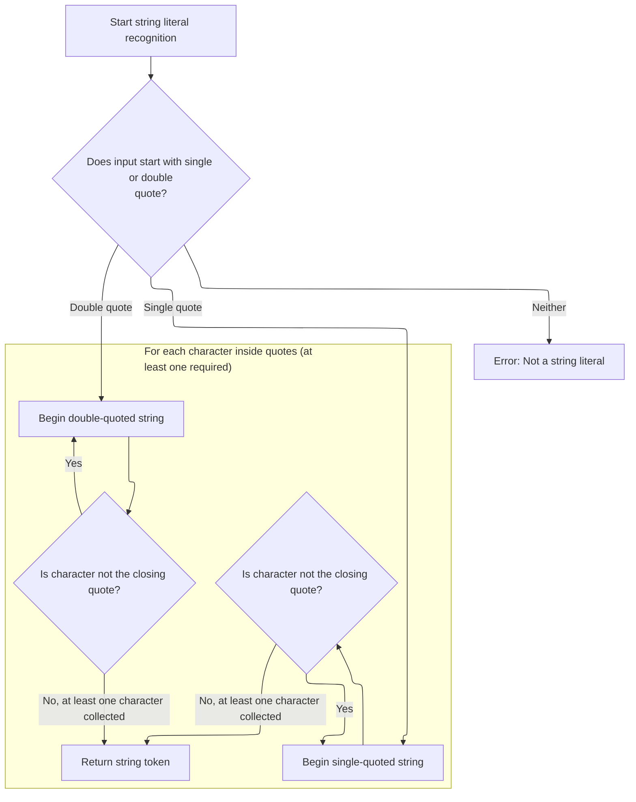
```mermaid
%%{init: {"flowchart": {"defaultRenderer": "elk"}} }%%
flowchart TD
  node1["Start string literal recognition"]
  click node1 openCode "core/src/main/java/org/apache/struts/validator/validwhen/ValidWhenLexer.java:502:507"
  node1 --> node2{"Does input start with single or double
quote?"}
  click node2 openCode "core/src/main/java/org/apache/struts/validator/validwhen/ValidWhenLexer.java:507:507"
  node2 -->|"Single quote"| node3["Begin single-quoted string"]
  click node3 openCode "core/src/main/java/org/apache/struts/validator/validwhen/ValidWhenLexer.java:508:528"
  node2 -->|"Double quote"| node4["Begin double-quoted string"]
  click node4 openCode "core/src/main/java/org/apache/struts/validator/validwhen/ValidWhenLexer.java:530:550"
  node2 -->|"Neither"| node8["Error: Not a string literal"]
  click node8 openCode "core/src/main/java/org/apache/struts/validator/validwhen/ValidWhenLexer.java:552:555"

  subgraph loop1["For each character inside quotes (at
least one required)"]
    node3 --> node5{"Is character not the closing quote?"}
    click node5 openCode "core/src/main/java/org/apache/struts/validator/validwhen/ValidWhenLexer.java:513:524"
    node4 --> node6{"Is character not the closing quote?"}
    click node6 openCode "core/src/main/java/org/apache/struts/validator/validwhen/ValidWhenLexer.java:535:546"
    node5 -->|"Yes"| node3
    node6 -->|"Yes"| node4
    node5 -->|"No, at least one character collected"| node7["Create string token"]
    node6 -->|"No, at least one character collected"| node7
  end
  node7["Return string token"]
  click node7 openCode "core/src/main/java/org/apache/struts/validator/validwhen/ValidWhenLexer.java:557:562"
classDef HeadingStyle fill:#777777,stroke:#333,stroke-width:2px;

%% Swimm:
%% %%{init: {"flowchart": {"defaultRenderer": "elk"}} }%%
%% flowchart TD
%%   node1["Start string literal recognition"]
%%   click node1 openCode "<SwmPath>[core/…/validwhen/ValidWhenLexer.java](core/src/main/java/org/apache/struts/validator/validwhen/ValidWhenLexer.java)</SwmPath>:502:507"
%%   node1 --> node2{"Does input start with single or double
%% quote?"}
%%   click node2 openCode "<SwmPath>[core/…/validwhen/ValidWhenLexer.java](core/src/main/java/org/apache/struts/validator/validwhen/ValidWhenLexer.java)</SwmPath>:507:507"
%%   node2 -->|"Single quote"| node3["Begin single-quoted string"]
%%   click node3 openCode "<SwmPath>[core/…/validwhen/ValidWhenLexer.java](core/src/main/java/org/apache/struts/validator/validwhen/ValidWhenLexer.java)</SwmPath>:508:528"
%%   node2 -->|"Double quote"| node4["Begin double-quoted string"]
%%   click node4 openCode "<SwmPath>[core/…/validwhen/ValidWhenLexer.java](core/src/main/java/org/apache/struts/validator/validwhen/ValidWhenLexer.java)</SwmPath>:530:550"
%%   node2 -->|"Neither"| node8["Error: Not a string literal"]
%%   click node8 openCode "<SwmPath>[core/…/validwhen/ValidWhenLexer.java](core/src/main/java/org/apache/struts/validator/validwhen/ValidWhenLexer.java)</SwmPath>:552:555"
%% 
%%   subgraph loop1["For each character inside quotes (at
%% least one required)"]
%%     node3 --> node5{"Is character not the closing quote?"}
%%     click node5 openCode "<SwmPath>[core/…/validwhen/ValidWhenLexer.java](core/src/main/java/org/apache/struts/validator/validwhen/ValidWhenLexer.java)</SwmPath>:513:524"
%%     node4 --> node6{"Is character not the closing quote?"}
%%     click node6 openCode "<SwmPath>[core/…/validwhen/ValidWhenLexer.java](core/src/main/java/org/apache/struts/validator/validwhen/ValidWhenLexer.java)</SwmPath>:535:546"
%%     node5 -->|"Yes"| node3
%%     node6 -->|"Yes"| node4
%%     node5 -->|"No, at least one character collected"| node7["Create string token"]
%%     node6 -->|"No, at least one character collected"| node7
%%   end
%%   node7["Return string token"]
%%   click node7 openCode "<SwmPath>[core/…/validwhen/ValidWhenLexer.java](core/src/main/java/org/apache/struts/validator/validwhen/ValidWhenLexer.java)</SwmPath>:557:562"
%% classDef HeadingStyle fill:#777777,stroke:#333,stroke-width:2px;
```

<SwmSnippet path="/core/src/main/java/org/apache/struts/validator/validwhen/ValidWhenLexer.java" line="502">

---

In <SwmToken path="core/src/main/java/org/apache/struts/validator/validwhen/ValidWhenLexer.java" pos="502:7:7" line-data="	public final void mSTRING_LITERAL(boolean _createToken) throws RecognitionException, CharStreamException, TokenStreamException {">`mSTRING_LITERAL`</SwmToken>, the lexer checks if the string starts with a single or double quote, then matches all valid characters inside (using <SwmToken path="core/src/main/java/org/apache/struts/validator/validwhen/ValidWhenLexer.java" pos="516:5:5" line-data="				if ((_tokenSet_3.member(LA(1)))) {">`_tokenSet_3`</SwmToken> or <SwmToken path="core/src/main/java/org/apache/struts/validator/validwhen/ValidWhenLexer.java" pos="538:5:5" line-data="				if ((_tokenSet_4.member(LA(1)))) {">`_tokenSet_4`</SwmToken>), and finally matches the closing quote. If the input doesn't match, it throws an error.

```java
	public final void mSTRING_LITERAL(boolean _createToken) throws RecognitionException, CharStreamException, TokenStreamException {
		int _ttype; Token _token=null; int _begin=text.length();
		_ttype = STRING_LITERAL;
		int _saveIndex;
		
		switch ( LA(1)) {
		case '\'':
		{
			{
			match('\'');
			{
			int _cnt50=0;
			_loop50:
			do {
				if ((_tokenSet_3.member(LA(1)))) {
					matchNot('\'');
				}
				else {
					if ( _cnt50>=1 ) { break _loop50; } else {throw new NoViableAltForCharException((char)LA(1), getFilename(), getLine(), getColumn());}
				}
				
				_cnt50++;
			} while (true);
```

---

</SwmSnippet>

<SwmSnippet path="/core/src/main/java/org/apache/struts/validator/validwhen/ValidWhenLexer.java" line="526">

---

Next, the lexer matches the closing quote for single-quoted strings, or switches to handling double-quoted strings with a separate loop and token set, enforcing different rules for each string type.

```java
			match('\'');
			}
			break;
		}
		case '"':
		{
			{
			match('\"');
			{
			int _cnt53=0;
			_loop53:
			do {
				if ((_tokenSet_4.member(LA(1)))) {
					matchNot('\"');
				}
				else {
					if ( _cnt53>=1 ) { break _loop53; } else {throw new NoViableAltForCharException((char)LA(1), getFilename(), getLine(), getColumn());}
				}
				
				_cnt53++;
			} while (true);
```

---

</SwmSnippet>

<SwmSnippet path="/core/src/main/java/org/apache/struts/validator/validwhen/ValidWhenLexer.java" line="548">

---

Finally, if the input doesn't start with a valid quote, the lexer throws an error. After matching a string literal, the flow moves to ActionConfigMatcher to use the token for configuration matching.

```java
			match('\"');
			}
			break;
		}
		default:
		{
			throw new NoViableAltForCharException((char)LA(1), getFilename(), getLine(), getColumn());
		}
		}
```

---

</SwmSnippet>

<SwmSnippet path="/core/src/main/java/org/apache/struts/validator/validwhen/ValidWhenLexer.java" line="557">

---

Back in <SwmToken path="core/src/main/java/org/apache/struts/validator/validwhen/ValidWhenLexer.java" pos="101:1:1" line-data="					mSTRING_LITERAL(true);">`mSTRING_LITERAL`</SwmToken>, after returning from ActionConfigMatcher, the lexer creates and returns the token for the matched string literal if token creation is enabled.

```java
		if ( _createToken && _token==null && _ttype!=Token.SKIP ) {
			_token = makeToken(_ttype);
			_token.setText(new String(text.getBuffer(), _begin, text.length()-_begin));
		}
		_returnToken = _token;
	}
```

---

</SwmSnippet>

### Detecting Left Bracket

<SwmSnippet path="/core/src/main/java/org/apache/struts/validator/validwhen/ValidWhenLexer.java" line="105">

---

Back in <SwmToken path="tiles/src/main/java/org/apache/struts/tiles/xmlDefinition/I18nFactorySet.java" pos="237:9:9" line-data="            this.filenames.add(tokenizer.nextToken().trim());">`nextToken`</SwmToken>, after handling string literals, if the next character is '\[', we call <SwmToken path="core/src/main/java/org/apache/struts/validator/validwhen/ValidWhenLexer.java" pos="107:1:1" line-data="					mLBRACKET(true);">`mLBRACKET`</SwmToken> to process left bracket tokens for the parser.

```java
				case '[':
				{
					mLBRACKET(true);
					theRetToken=_returnToken;
					break;
				}
```

---

</SwmSnippet>

### Parsing Left Bracket

<SwmSnippet path="/core/src/main/java/org/apache/struts/validator/validwhen/ValidWhenLexer.java" line="564">

---

In <SwmToken path="core/src/main/java/org/apache/struts/validator/validwhen/ValidWhenLexer.java" pos="564:7:7" line-data="	public final void mLBRACKET(boolean _createToken) throws RecognitionException, CharStreamException, TokenStreamException {">`mLBRACKET`</SwmToken>, the lexer matches the '\[' character and prepares the token. After this, the flow moves to ActionConfigMatcher to use the bracket token in configuration matching.

```java
	public final void mLBRACKET(boolean _createToken) throws RecognitionException, CharStreamException, TokenStreamException {
		int _ttype; Token _token=null; int _begin=text.length();
		_ttype = LBRACKET;
		int _saveIndex;
		
		match('[');
```

---

</SwmSnippet>

<SwmSnippet path="/core/src/main/java/org/apache/struts/validator/validwhen/ValidWhenLexer.java" line="570">

---

Back in <SwmToken path="core/src/main/java/org/apache/struts/validator/validwhen/ValidWhenLexer.java" pos="107:1:1" line-data="					mLBRACKET(true);">`mLBRACKET`</SwmToken>, after returning from ActionConfigMatcher, the lexer creates and returns the token for the left bracket if token creation is enabled.

```java
		if ( _createToken && _token==null && _ttype!=Token.SKIP ) {
			_token = makeToken(_ttype);
			_token.setText(new String(text.getBuffer(), _begin, text.length()-_begin));
		}
		_returnToken = _token;
	}
```

---

</SwmSnippet>

### Detecting Right Bracket

<SwmSnippet path="/core/src/main/java/org/apache/struts/validator/validwhen/ValidWhenLexer.java" line="111">

---

Back in <SwmToken path="tiles/src/main/java/org/apache/struts/tiles/xmlDefinition/I18nFactorySet.java" pos="237:9:9" line-data="            this.filenames.add(tokenizer.nextToken().trim());">`nextToken`</SwmToken>, after handling left brackets, if the next character is '\]', we call <SwmToken path="core/src/main/java/org/apache/struts/validator/validwhen/ValidWhenLexer.java" pos="113:1:1" line-data="					mRBRACKET(true);">`mRBRACKET`</SwmToken> to process right bracket tokens for the parser.

```java
				case ']':
				{
					mRBRACKET(true);
					theRetToken=_returnToken;
					break;
				}
```

---

</SwmSnippet>

### Parsing Right Bracket

```mermaid
%%{init: {"flowchart": {"defaultRenderer": "elk"}} }%%
flowchart TD
    node1["Recognize right bracket '"]'] --> node2{"Create token? (_createToken && no token
exists && not SKIP)"}
    click node1 openCode "core/src/main/java/org/apache/struts/validator/validwhen/ValidWhenLexer.java:582:582"
    node2 -->|"Yes"| node3["Create token for right bracket"]
    click node2 openCode "core/src/main/java/org/apache/struts/validator/validwhen/ValidWhenLexer.java:583:586"
    node3 --> node4["Return token (created)"]
    click node3 openCode "core/src/main/java/org/apache/struts/validator/validwhen/ValidWhenLexer.java:584:586"
    node2 -->|"No"| node5["Return token (null)"]
    click node5 openCode "core/src/main/java/org/apache/struts/validator/validwhen/ValidWhenLexer.java:587:588"
    node4 --> node6["End"]
    click node4 openCode "core/src/main/java/org/apache/struts/validator/validwhen/ValidWhenLexer.java:587:588"
    node5 --> node6
    click node6 openCode "core/src/main/java/org/apache/struts/validator/validwhen/ValidWhenLexer.java:588:588"

classDef HeadingStyle fill:#777777,stroke:#333,stroke-width:2px;

%% Swimm:
%% %%{init: {"flowchart": {"defaultRenderer": "elk"}} }%%
%% flowchart TD
%%     node1["Recognize right bracket '"]'] --> node2{"Create token? (<SwmToken path="core/src/main/java/org/apache/struts/validator/validwhen/ValidWhenLexer.java" pos="250:11:11" line-data="	public final void mDECIMAL_LITERAL(boolean _createToken) throws RecognitionException, CharStreamException, TokenStreamException {">`_createToken`</SwmToken> && no token
%% exists && not SKIP)"}
%%     click node1 openCode "<SwmPath>[core/…/validwhen/ValidWhenLexer.java](core/src/main/java/org/apache/struts/validator/validwhen/ValidWhenLexer.java)</SwmPath>:582:582"
%%     node2 -->|"Yes"| node3["Create token for right bracket"]
%%     click node2 openCode "<SwmPath>[core/…/validwhen/ValidWhenLexer.java](core/src/main/java/org/apache/struts/validator/validwhen/ValidWhenLexer.java)</SwmPath>:583:586"
%%     node3 --> node4["Return token (created)"]
%%     click node3 openCode "<SwmPath>[core/…/validwhen/ValidWhenLexer.java](core/src/main/java/org/apache/struts/validator/validwhen/ValidWhenLexer.java)</SwmPath>:584:586"
%%     node2 -->|"No"| node5["Return token (null)"]
%%     click node5 openCode "<SwmPath>[core/…/validwhen/ValidWhenLexer.java](core/src/main/java/org/apache/struts/validator/validwhen/ValidWhenLexer.java)</SwmPath>:587:588"
%%     node4 --> node6["End"]
%%     click node4 openCode "<SwmPath>[core/…/validwhen/ValidWhenLexer.java](core/src/main/java/org/apache/struts/validator/validwhen/ValidWhenLexer.java)</SwmPath>:587:588"
%%     node5 --> node6
%%     click node6 openCode "<SwmPath>[core/…/validwhen/ValidWhenLexer.java](core/src/main/java/org/apache/struts/validator/validwhen/ValidWhenLexer.java)</SwmPath>:588:588"
%% 
%% classDef HeadingStyle fill:#777777,stroke:#333,stroke-width:2px;
```

<SwmSnippet path="/core/src/main/java/org/apache/struts/validator/validwhen/ValidWhenLexer.java" line="577">

---

In <SwmToken path="core/src/main/java/org/apache/struts/validator/validwhen/ValidWhenLexer.java" pos="577:7:7" line-data="	public final void mRBRACKET(boolean _createToken) throws RecognitionException, CharStreamException, TokenStreamException {">`mRBRACKET`</SwmToken>, the lexer matches the '\]' character and prepares the token. After this, the flow moves to ActionConfigMatcher to use the bracket token in configuration matching.

```java
	public final void mRBRACKET(boolean _createToken) throws RecognitionException, CharStreamException, TokenStreamException {
		int _ttype; Token _token=null; int _begin=text.length();
		_ttype = RBRACKET;
		int _saveIndex;
		
		match(']');
```

---

</SwmSnippet>

<SwmSnippet path="/core/src/main/java/org/apache/struts/validator/validwhen/ValidWhenLexer.java" line="583">

---

Back in <SwmToken path="core/src/main/java/org/apache/struts/validator/validwhen/ValidWhenLexer.java" pos="113:1:1" line-data="					mRBRACKET(true);">`mRBRACKET`</SwmToken>, after returning from ActionConfigMatcher, the lexer creates and returns the token for the right bracket if token creation is enabled.

```java
		if ( _createToken && _token==null && _ttype!=Token.SKIP ) {
			_token = makeToken(_ttype);
			_token.setText(new String(text.getBuffer(), _begin, text.length()-_begin));
		}
		_returnToken = _token;
	}
```

---

</SwmSnippet>

### Detecting Left Parenthesis

<SwmSnippet path="/core/src/main/java/org/apache/struts/validator/validwhen/ValidWhenLexer.java" line="117">

---

Back in <SwmToken path="tiles/src/main/java/org/apache/struts/tiles/xmlDefinition/I18nFactorySet.java" pos="237:9:9" line-data="            this.filenames.add(tokenizer.nextToken().trim());">`nextToken`</SwmToken>, after handling brackets, if the next character is '(', we call <SwmToken path="core/src/main/java/org/apache/struts/validator/validwhen/ValidWhenLexer.java" pos="119:1:1" line-data="					mLPAREN(true);">`mLPAREN`</SwmToken> to process left parenthesis tokens for the parser.

```java
				case '(':
				{
					mLPAREN(true);
					theRetToken=_returnToken;
					break;
				}
```

---

</SwmSnippet>

### Parsing Left Parenthesis

<SwmSnippet path="/core/src/main/java/org/apache/struts/validator/validwhen/ValidWhenLexer.java" line="590">

---

In <SwmToken path="core/src/main/java/org/apache/struts/validator/validwhen/ValidWhenLexer.java" pos="590:7:7" line-data="	public final void mLPAREN(boolean _createToken) throws RecognitionException, CharStreamException, TokenStreamException {">`mLPAREN`</SwmToken>, the lexer matches the '(' character and prepares the token. After this, the flow moves to ActionConfigMatcher to use the parenthesis token in configuration matching.

```java
	public final void mLPAREN(boolean _createToken) throws RecognitionException, CharStreamException, TokenStreamException {
		int _ttype; Token _token=null; int _begin=text.length();
		_ttype = LPAREN;
		int _saveIndex;
		
		match('(');
```

---

</SwmSnippet>

<SwmSnippet path="/core/src/main/java/org/apache/struts/validator/validwhen/ValidWhenLexer.java" line="596">

---

Back in <SwmToken path="core/src/main/java/org/apache/struts/validator/validwhen/ValidWhenLexer.java" pos="119:1:1" line-data="					mLPAREN(true);">`mLPAREN`</SwmToken>, after returning from ActionConfigMatcher, the lexer creates and returns the token for the left parenthesis if token creation is enabled.

```java
		if ( _createToken && _token==null && _ttype!=Token.SKIP ) {
			_token = makeToken(_ttype);
			_token.setText(new String(text.getBuffer(), _begin, text.length()-_begin));
		}
		_returnToken = _token;
	}
```

---

</SwmSnippet>

### Detecting Right Parenthesis

<SwmSnippet path="/core/src/main/java/org/apache/struts/validator/validwhen/ValidWhenLexer.java" line="123">

---

Back in <SwmToken path="tiles/src/main/java/org/apache/struts/tiles/xmlDefinition/I18nFactorySet.java" pos="237:9:9" line-data="            this.filenames.add(tokenizer.nextToken().trim());">`nextToken`</SwmToken>, after handling left parentheses, if the next character is ')', we call <SwmToken path="core/src/main/java/org/apache/struts/validator/validwhen/ValidWhenLexer.java" pos="125:1:1" line-data="					mRPAREN(true);">`mRPAREN`</SwmToken> to process right parenthesis tokens for the parser.

```java
				case ')':
				{
					mRPAREN(true);
					theRetToken=_returnToken;
					break;
				}
```

---

</SwmSnippet>

### Parsing Right Parenthesis

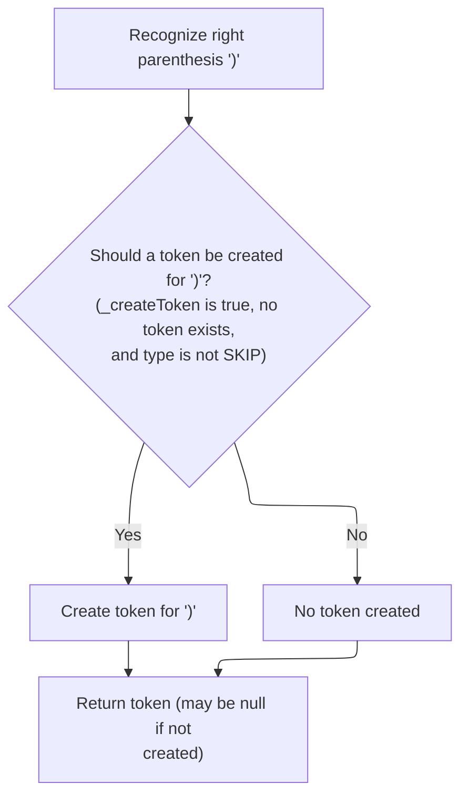
```mermaid
%%{init: {"flowchart": {"defaultRenderer": "elk"}} }%%
flowchart TD
    node1["Recognize right parenthesis ')'"] --> node2{"Should a token be created for ')'?
(_createToken is true, no token exists,
and type is not SKIP)"}
    click node1 openCode "core/src/main/java/org/apache/struts/validator/validwhen/ValidWhenLexer.java:608:608"
    node2 -->|"Yes"| node3["Create token for ')'"]
    click node2 openCode "core/src/main/java/org/apache/struts/validator/validwhen/ValidWhenLexer.java:609:612"
    node2 -->|"No"| node4["No token created"]
    click node4 openCode "core/src/main/java/org/apache/struts/validator/validwhen/ValidWhenLexer.java:609:612"
    node3 --> node5["Return token (may be null if not
created)"]
    click node3 openCode "core/src/main/java/org/apache/struts/validator/validwhen/ValidWhenLexer.java:610:612"
    node4 --> node5
    click node5 openCode "core/src/main/java/org/apache/struts/validator/validwhen/ValidWhenLexer.java:613:614"

classDef HeadingStyle fill:#777777,stroke:#333,stroke-width:2px;

%% Swimm:
%% %%{init: {"flowchart": {"defaultRenderer": "elk"}} }%%
%% flowchart TD
%%     node1["Recognize right parenthesis ')'"] --> node2{"Should a token be created for ')'?
%% (<SwmToken path="core/src/main/java/org/apache/struts/validator/validwhen/ValidWhenLexer.java" pos="250:11:11" line-data="	public final void mDECIMAL_LITERAL(boolean _createToken) throws RecognitionException, CharStreamException, TokenStreamException {">`_createToken`</SwmToken> is true, no token exists,
%% and type is not SKIP)"}
%%     click node1 openCode "<SwmPath>[core/…/validwhen/ValidWhenLexer.java](core/src/main/java/org/apache/struts/validator/validwhen/ValidWhenLexer.java)</SwmPath>:608:608"
%%     node2 -->|"Yes"| node3["Create token for ')'"]
%%     click node2 openCode "<SwmPath>[core/…/validwhen/ValidWhenLexer.java](core/src/main/java/org/apache/struts/validator/validwhen/ValidWhenLexer.java)</SwmPath>:609:612"
%%     node2 -->|"No"| node4["No token created"]
%%     click node4 openCode "<SwmPath>[core/…/validwhen/ValidWhenLexer.java](core/src/main/java/org/apache/struts/validator/validwhen/ValidWhenLexer.java)</SwmPath>:609:612"
%%     node3 --> node5["Return token (may be null if not
%% created)"]
%%     click node3 openCode "<SwmPath>[core/…/validwhen/ValidWhenLexer.java](core/src/main/java/org/apache/struts/validator/validwhen/ValidWhenLexer.java)</SwmPath>:610:612"
%%     node4 --> node5
%%     click node5 openCode "<SwmPath>[core/…/validwhen/ValidWhenLexer.java](core/src/main/java/org/apache/struts/validator/validwhen/ValidWhenLexer.java)</SwmPath>:613:614"
%% 
%% classDef HeadingStyle fill:#777777,stroke:#333,stroke-width:2px;
```

<SwmSnippet path="/core/src/main/java/org/apache/struts/validator/validwhen/ValidWhenLexer.java" line="603">

---

In <SwmToken path="core/src/main/java/org/apache/struts/validator/validwhen/ValidWhenLexer.java" pos="603:7:7" line-data="	public final void mRPAREN(boolean _createToken) throws RecognitionException, CharStreamException, TokenStreamException {">`mRPAREN`</SwmToken>, the lexer matches the ')' character and sets up the token type. After this, we need to call ActionConfigMatcher so it can use the right parenthesis token for parsing configuration expressions.

```java
	public final void mRPAREN(boolean _createToken) throws RecognitionException, CharStreamException, TokenStreamException {
		int _ttype; Token _token=null; int _begin=text.length();
		_ttype = RPAREN;
		int _saveIndex;
		
		match(')');
```

---

</SwmSnippet>

<SwmSnippet path="/core/src/main/java/org/apache/struts/validator/validwhen/ValidWhenLexer.java" line="609">

---

Back in <SwmToken path="core/src/main/java/org/apache/struts/validator/validwhen/ValidWhenLexer.java" pos="125:1:1" line-data="					mRPAREN(true);">`mRPAREN`</SwmToken>, after returning from ActionConfigMatcher, the lexer creates and returns the token for the right parenthesis if token creation is enabled.

```java
		if ( _createToken && _token==null && _ttype!=Token.SKIP ) {
			_token = makeToken(_ttype);
			_token.setText(new String(text.getBuffer(), _begin, text.length()-_begin));
		}
		_returnToken = _token;
	}
```

---

</SwmSnippet>

### Detecting Special Identifiers

<SwmSnippet path="/core/src/main/java/org/apache/struts/validator/validwhen/ValidWhenLexer.java" line="129">

---

Back in <SwmToken path="tiles/src/main/java/org/apache/struts/tiles/xmlDefinition/I18nFactorySet.java" pos="237:9:9" line-data="            this.filenames.add(tokenizer.nextToken().trim());">`nextToken`</SwmToken>, after handling right parentheses, the lexer checks if the next character is '\*', and if so, calls <SwmToken path="core/src/main/java/org/apache/struts/validator/validwhen/ValidWhenLexer.java" pos="131:1:1" line-data="					mTHIS(true);">`mTHIS`</SwmToken> to handle the special '*this*' identifier before moving on.

```java
				case '*':
				{
					mTHIS(true);
					theRetToken=_returnToken;
					break;
				}
				case '.':  case '_':  case 'a':  case 'b':
				case 'c':  case 'd':  case 'e':  case 'f':
				case 'g':  case 'h':  case 'i':  case 'j':
				case 'k':  case 'l':  case 'm':  case 'n':
				case 'o':  case 'p':  case 'q':  case 'r':
				case 's':  case 't':  case 'u':  case 'v':
```

---

</SwmSnippet>

### Parsing the '*this*' Identifier

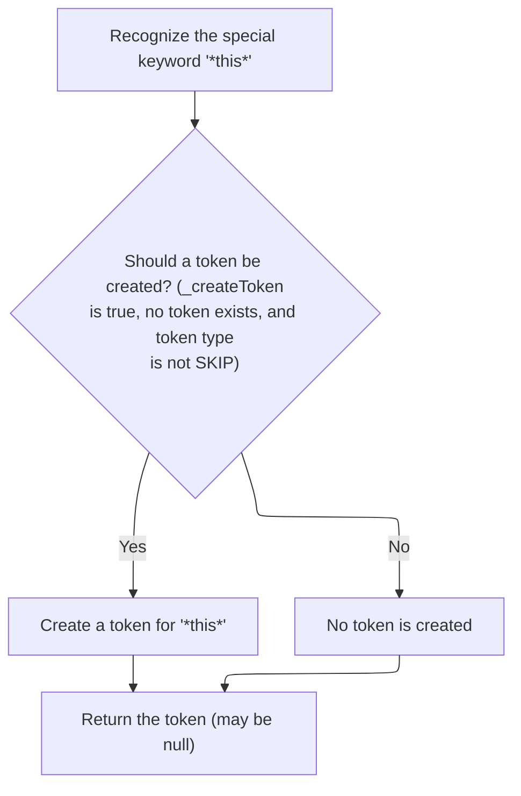
```mermaid
%%{init: {"flowchart": {"defaultRenderer": "elk"}} }%%
flowchart TD
  node1["Recognize the special keyword '*this*'"] --> node2{"Should a token be created? (_createToken
is true, no token exists, and token type
is not SKIP)"}
  click node1 openCode "core/src/main/java/org/apache/struts/validator/validwhen/ValidWhenLexer.java:621:621"
  node2 -->|"Yes"| node3["Create a token for '*this*'"]
  click node2 openCode "core/src/main/java/org/apache/struts/validator/validwhen/ValidWhenLexer.java:622:625"
  node2 -->|"No"| node4["No token is created"]
  click node3 openCode "core/src/main/java/org/apache/struts/validator/validwhen/ValidWhenLexer.java:623:624"
  click node4 openCode "core/src/main/java/org/apache/struts/validator/validwhen/ValidWhenLexer.java:622:625"
  node3 --> node5["Return the token (may be null)"]
  node4 --> node5["Return the token (may be null)"]
  click node5 openCode "core/src/main/java/org/apache/struts/validator/validwhen/ValidWhenLexer.java:626:627"
classDef HeadingStyle fill:#777777,stroke:#333,stroke-width:2px;

%% Swimm:
%% %%{init: {"flowchart": {"defaultRenderer": "elk"}} }%%
%% flowchart TD
%%   node1["Recognize the special keyword '*this*'"] --> node2{"Should a token be created? (<SwmToken path="core/src/main/java/org/apache/struts/validator/validwhen/ValidWhenLexer.java" pos="250:11:11" line-data="	public final void mDECIMAL_LITERAL(boolean _createToken) throws RecognitionException, CharStreamException, TokenStreamException {">`_createToken`</SwmToken>
%% is true, no token exists, and token type
%% is not SKIP)"}
%%   click node1 openCode "<SwmPath>[core/…/validwhen/ValidWhenLexer.java](core/src/main/java/org/apache/struts/validator/validwhen/ValidWhenLexer.java)</SwmPath>:621:621"
%%   node2 -->|"Yes"| node3["Create a token for '*this*'"]
%%   click node2 openCode "<SwmPath>[core/…/validwhen/ValidWhenLexer.java](core/src/main/java/org/apache/struts/validator/validwhen/ValidWhenLexer.java)</SwmPath>:622:625"
%%   node2 -->|"No"| node4["No token is created"]
%%   click node3 openCode "<SwmPath>[core/…/validwhen/ValidWhenLexer.java](core/src/main/java/org/apache/struts/validator/validwhen/ValidWhenLexer.java)</SwmPath>:623:624"
%%   click node4 openCode "<SwmPath>[core/…/validwhen/ValidWhenLexer.java](core/src/main/java/org/apache/struts/validator/validwhen/ValidWhenLexer.java)</SwmPath>:622:625"
%%   node3 --> node5["Return the token (may be null)"]
%%   node4 --> node5["Return the token (may be null)"]
%%   click node5 openCode "<SwmPath>[core/…/validwhen/ValidWhenLexer.java](core/src/main/java/org/apache/struts/validator/validwhen/ValidWhenLexer.java)</SwmPath>:626:627"
%% classDef HeadingStyle fill:#777777,stroke:#333,stroke-width:2px;
```

<SwmSnippet path="/core/src/main/java/org/apache/struts/validator/validwhen/ValidWhenLexer.java" line="616">

---

In <SwmToken path="core/src/main/java/org/apache/struts/validator/validwhen/ValidWhenLexer.java" pos="616:7:7" line-data="	public final void mTHIS(boolean _createToken) throws RecognitionException, CharStreamException, TokenStreamException {">`mTHIS`</SwmToken>, the lexer matches the exact string '*this*' and sets up the THIS token. After this, we call ActionConfigMatcher so it can use this special identifier in configuration matching.

```java
	public final void mTHIS(boolean _createToken) throws RecognitionException, CharStreamException, TokenStreamException {
		int _ttype; Token _token=null; int _begin=text.length();
		_ttype = THIS;
		int _saveIndex;
		
		match("*this*");
```

---

</SwmSnippet>

<SwmSnippet path="/core/src/main/java/org/apache/struts/validator/validwhen/ValidWhenLexer.java" line="622">

---

Back in <SwmToken path="core/src/main/java/org/apache/struts/validator/validwhen/ValidWhenLexer.java" pos="131:1:1" line-data="					mTHIS(true);">`mTHIS`</SwmToken>, after returning from ActionConfigMatcher, the lexer creates and returns the token for '*this*' if token creation is enabled.

```java
		if ( _createToken && _token==null && _ttype!=Token.SKIP ) {
			_token = makeToken(_ttype);
			_token.setText(new String(text.getBuffer(), _begin, text.length()-_begin));
		}
		_returnToken = _token;
	}
```

---

</SwmSnippet>

### Detecting Identifiers

<SwmSnippet path="/core/src/main/java/org/apache/struts/validator/validwhen/ValidWhenLexer.java" line="141">

---

Back in <SwmToken path="tiles/src/main/java/org/apache/struts/tiles/xmlDefinition/I18nFactorySet.java" pos="237:9:9" line-data="            this.filenames.add(tokenizer.nextToken().trim());">`nextToken`</SwmToken>, after handling '*this*', the lexer checks for alphabetic characters and calls <SwmToken path="core/src/main/java/org/apache/struts/validator/validwhen/ValidWhenLexer.java" pos="143:1:1" line-data="					mIDENTIFIER(true);">`mIDENTIFIER`</SwmToken> to process variable names or keywords.

```java
				case 'w':  case 'x':  case 'y':  case 'z':
				{
					mIDENTIFIER(true);
					theRetToken=_returnToken;
					break;
				}
```

---

</SwmSnippet>

### Parsing Identifiers

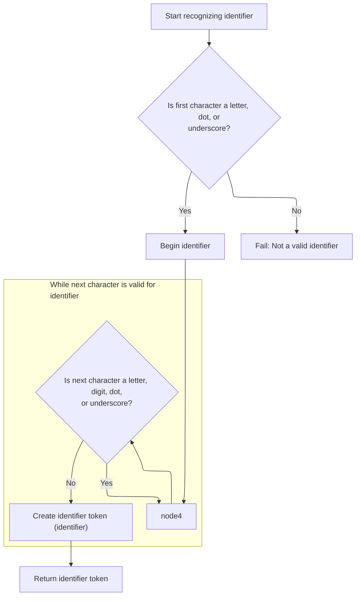
```mermaid
%%{init: {"flowchart": {"defaultRenderer": "elk"}} }%%
flowchart TD
  node1["Start recognizing identifier"] --> node2{"Is first character a letter, dot, or
underscore?"}
  click node1 openCode "core/src/main/java/org/apache/struts/validator/validwhen/ValidWhenLexer.java:629:634"
  node2 -->|"Yes"| node3["Begin identifier"]
  click node2 openCode "core/src/main/java/org/apache/struts/validator/validwhen/ValidWhenLexer.java:635:646"
  node2 -->|"No"| node6["Fail: Not a valid identifier"]
  click node6 openCode "core/src/main/java/org/apache/struts/validator/validwhen/ValidWhenLexer.java:657:660"
  node3 --> node4
  subgraph loop1["While next character is valid for
identifier"]
    node4 --> node5{"Is next character a letter, digit, dot,
or underscore?"}
    click node5 openCode "core/src/main/java/org/apache/struts/validator/validwhen/ValidWhenLexer.java:667:695"
    node5 -->|"Yes"| node4
    node5 -->|"No"| node7["Create identifier token (identifier)"]
    click node7 openCode "core/src/main/java/org/apache/struts/validator/validwhen/ValidWhenLexer.java:704:707"
  end
  node7 --> node8["Return identifier token"]
  click node8 openCode "core/src/main/java/org/apache/struts/validator/validwhen/ValidWhenLexer.java:708:709"
classDef HeadingStyle fill:#777777,stroke:#333,stroke-width:2px;

%% Swimm:
%% %%{init: {"flowchart": {"defaultRenderer": "elk"}} }%%
%% flowchart TD
%%   node1["Start recognizing identifier"] --> node2{"Is first character a letter, dot, or
%% underscore?"}
%%   click node1 openCode "<SwmPath>[core/…/validwhen/ValidWhenLexer.java](core/src/main/java/org/apache/struts/validator/validwhen/ValidWhenLexer.java)</SwmPath>:629:634"
%%   node2 -->|"Yes"| node3["Begin identifier"]
%%   click node2 openCode "<SwmPath>[core/…/validwhen/ValidWhenLexer.java](core/src/main/java/org/apache/struts/validator/validwhen/ValidWhenLexer.java)</SwmPath>:635:646"
%%   node2 -->|"No"| node6["Fail: Not a valid identifier"]
%%   click node6 openCode "<SwmPath>[core/…/validwhen/ValidWhenLexer.java](core/src/main/java/org/apache/struts/validator/validwhen/ValidWhenLexer.java)</SwmPath>:657:660"
%%   node3 --> node4
%%   subgraph loop1["While next character is valid for
%% identifier"]
%%     node4 --> node5{"Is next character a letter, digit, dot,
%% or underscore?"}
%%     click node5 openCode "<SwmPath>[core/…/validwhen/ValidWhenLexer.java](core/src/main/java/org/apache/struts/validator/validwhen/ValidWhenLexer.java)</SwmPath>:667:695"
%%     node5 -->|"Yes"| node4
%%     node5 -->|"No"| node7["Create identifier token (identifier)"]
%%     click node7 openCode "<SwmPath>[core/…/validwhen/ValidWhenLexer.java](core/src/main/java/org/apache/struts/validator/validwhen/ValidWhenLexer.java)</SwmPath>:704:707"
%%   end
%%   node7 --> node8["Return identifier token"]
%%   click node8 openCode "<SwmPath>[core/…/validwhen/ValidWhenLexer.java](core/src/main/java/org/apache/struts/validator/validwhen/ValidWhenLexer.java)</SwmPath>:708:709"
%% classDef HeadingStyle fill:#777777,stroke:#333,stroke-width:2px;
```

<SwmSnippet path="/core/src/main/java/org/apache/struts/validator/validwhen/ValidWhenLexer.java" line="629">

---

In <SwmToken path="core/src/main/java/org/apache/struts/validator/validwhen/ValidWhenLexer.java" pos="629:7:7" line-data="	public final void mIDENTIFIER(boolean _createToken) throws RecognitionException, CharStreamException, TokenStreamException {">`mIDENTIFIER`</SwmToken>, the lexer matches variable names, keywords, or field references, allowing letters, digits, underscores, and dots. After matching, we call ActionConfigMatcher to use the identifier token in parsing expressions.

```java
	public final void mIDENTIFIER(boolean _createToken) throws RecognitionException, CharStreamException, TokenStreamException {
		int _ttype; Token _token=null; int _begin=text.length();
		_ttype = IDENTIFIER;
		int _saveIndex;
		
		{
		switch ( LA(1)) {
		case 'a':  case 'b':  case 'c':  case 'd':
		case 'e':  case 'f':  case 'g':  case 'h':
		case 'i':  case 'j':  case 'k':  case 'l':
		case 'm':  case 'n':  case 'o':  case 'p':
		case 'q':  case 'r':  case 's':  case 't':
		case 'u':  case 'v':  case 'w':  case 'x':
		case 'y':  case 'z':
		{
			matchRange('a','z');
			break;
		}
		case '.':
		{
			match('.');
			break;
		}
		case '_':
		{
			match('_');
			break;
		}
		default:
		{
			throw new NoViableAltForCharException((char)LA(1), getFilename(), getLine(), getColumn());
		}
		}
		}
		{
		int _cnt62=0;
		_loop62:
		do {
			switch ( LA(1)) {
			case 'a':  case 'b':  case 'c':  case 'd':
			case 'e':  case 'f':  case 'g':  case 'h':
			case 'i':  case 'j':  case 'k':  case 'l':
			case 'm':  case 'n':  case 'o':  case 'p':
			case 'q':  case 'r':  case 's':  case 't':
			case 'u':  case 'v':  case 'w':  case 'x':
			case 'y':  case 'z':
			{
				matchRange('a','z');
				break;
			}
			case '0':  case '1':  case '2':  case '3':
			case '4':  case '5':  case '6':  case '7':
			case '8':  case '9':
			{
				matchRange('0','9');
				break;
			}
			case '.':
			{
				match('.');
				break;
			}
			case '_':
			{
				match('_');
				break;
			}
			default:
			{
				if ( _cnt62>=1 ) { break _loop62; } else {throw new NoViableAltForCharException((char)LA(1), getFilename(), getLine(), getColumn());}
			}
			}
			_cnt62++;
		} while (true);
		}
```

---

</SwmSnippet>

<SwmSnippet path="/core/src/main/java/org/apache/struts/validator/validwhen/ValidWhenLexer.java" line="704">

---

Back in <SwmToken path="core/src/main/java/org/apache/struts/validator/validwhen/ValidWhenLexer.java" pos="143:1:1" line-data="					mIDENTIFIER(true);">`mIDENTIFIER`</SwmToken>, after returning from ActionConfigMatcher, the lexer creates and returns the token for the matched identifier if token creation is enabled.

```java
		if ( _createToken && _token==null && _ttype!=Token.SKIP ) {
			_token = makeToken(_ttype);
			_token.setText(new String(text.getBuffer(), _begin, text.length()-_begin));
		}
		_returnToken = _token;
	}
```

---

</SwmSnippet>

### Detecting Equality Operators

<SwmSnippet path="/core/src/main/java/org/apache/struts/validator/validwhen/ValidWhenLexer.java" line="147">

---

Back in <SwmToken path="tiles/src/main/java/org/apache/struts/tiles/xmlDefinition/I18nFactorySet.java" pos="237:9:9" line-data="            this.filenames.add(tokenizer.nextToken().trim());">`nextToken`</SwmToken>, after handling identifiers, the lexer checks for '=' and calls <SwmToken path="core/src/main/java/org/apache/struts/validator/validwhen/ValidWhenLexer.java" pos="149:1:1" line-data="					mEQUALSIGN(true);">`mEQUALSIGN`</SwmToken> to process the equality operator.

```java
				case '=':
				{
					mEQUALSIGN(true);
					theRetToken=_returnToken;
					break;
				}
```

---

</SwmSnippet>

### Parsing Equality Operator

<SwmSnippet path="/core/src/main/java/org/apache/struts/validator/validwhen/ValidWhenLexer.java" line="711">

---

In <SwmToken path="core/src/main/java/org/apache/struts/validator/validwhen/ValidWhenLexer.java" pos="711:7:7" line-data="	public final void mEQUALSIGN(boolean _createToken) throws RecognitionException, CharStreamException, TokenStreamException {">`mEQUALSIGN`</SwmToken>, the lexer matches two '=' characters to recognize the equality operator. After matching, we call ActionConfigMatcher to use this token in parsing validation rules.

```java
	public final void mEQUALSIGN(boolean _createToken) throws RecognitionException, CharStreamException, TokenStreamException {
		int _ttype; Token _token=null; int _begin=text.length();
		_ttype = EQUALSIGN;
		int _saveIndex;
		
		match('=');
		match('=');
```

---

</SwmSnippet>

<SwmSnippet path="/core/src/main/java/org/apache/struts/validator/validwhen/ValidWhenLexer.java" line="718">

---

Back in <SwmToken path="core/src/main/java/org/apache/struts/validator/validwhen/ValidWhenLexer.java" pos="149:1:1" line-data="					mEQUALSIGN(true);">`mEQUALSIGN`</SwmToken>, after returning from ActionConfigMatcher, the lexer creates and returns the token for '==' if token creation is enabled.

```java
		if ( _createToken && _token==null && _ttype!=Token.SKIP ) {
			_token = makeToken(_ttype);
			_token.setText(new String(text.getBuffer(), _begin, text.length()-_begin));
		}
		_returnToken = _token;
	}
```

---

</SwmSnippet>

### Detecting Inequality Operators

<SwmSnippet path="/core/src/main/java/org/apache/struts/validator/validwhen/ValidWhenLexer.java" line="153">

---

Back in <SwmToken path="tiles/src/main/java/org/apache/struts/tiles/xmlDefinition/I18nFactorySet.java" pos="237:9:9" line-data="            this.filenames.add(tokenizer.nextToken().trim());">`nextToken`</SwmToken>, after handling equality operators, the lexer checks for '!' and calls <SwmToken path="core/src/main/java/org/apache/struts/validator/validwhen/ValidWhenLexer.java" pos="155:1:1" line-data="					mNOTEQUALSIGN(true);">`mNOTEQUALSIGN`</SwmToken> to process the inequality operator.

```java
				case '!':
				{
					mNOTEQUALSIGN(true);
					theRetToken=_returnToken;
					break;
				}
```

---

</SwmSnippet>

### Parsing Inequality Operator

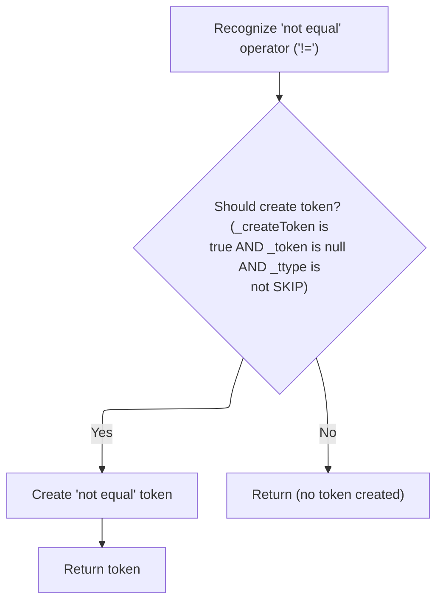
```mermaid
%%{init: {"flowchart": {"defaultRenderer": "elk"}} }%%
flowchart TD
    node1["Recognize 'not equal' operator ('!=')"] --> node2{"Should create token? (_createToken is
true AND _token is null AND _ttype is
not SKIP)"}
    click node1 openCode "core/src/main/java/org/apache/struts/validator/validwhen/ValidWhenLexer.java:730:731"
    click node2 openCode "core/src/main/java/org/apache/struts/validator/validwhen/ValidWhenLexer.java:732:732"
    node2 -->|"Yes"| node3["Create 'not equal' token"]
    click node3 openCode "core/src/main/java/org/apache/struts/validator/validwhen/ValidWhenLexer.java:733:734"
    node2 -->|"No"| node4["Return (no token created)"]
    click node4 openCode "core/src/main/java/org/apache/struts/validator/validwhen/ValidWhenLexer.java:736:737"
    node3 --> node5["Return token"]
    click node5 openCode "core/src/main/java/org/apache/struts/validator/validwhen/ValidWhenLexer.java:736:737"

classDef HeadingStyle fill:#777777,stroke:#333,stroke-width:2px;

%% Swimm:
%% %%{init: {"flowchart": {"defaultRenderer": "elk"}} }%%
%% flowchart TD
%%     node1["Recognize 'not equal' operator ('!=')"] --> node2{"Should create token? (<SwmToken path="core/src/main/java/org/apache/struts/validator/validwhen/ValidWhenLexer.java" pos="250:11:11" line-data="	public final void mDECIMAL_LITERAL(boolean _createToken) throws RecognitionException, CharStreamException, TokenStreamException {">`_createToken`</SwmToken> is
%% true AND _token is null AND _ttype is
%% not SKIP)"}
%%     click node1 openCode "<SwmPath>[core/…/validwhen/ValidWhenLexer.java](core/src/main/java/org/apache/struts/validator/validwhen/ValidWhenLexer.java)</SwmPath>:730:731"
%%     click node2 openCode "<SwmPath>[core/…/validwhen/ValidWhenLexer.java](core/src/main/java/org/apache/struts/validator/validwhen/ValidWhenLexer.java)</SwmPath>:732:732"
%%     node2 -->|"Yes"| node3["Create 'not equal' token"]
%%     click node3 openCode "<SwmPath>[core/…/validwhen/ValidWhenLexer.java](core/src/main/java/org/apache/struts/validator/validwhen/ValidWhenLexer.java)</SwmPath>:733:734"
%%     node2 -->|"No"| node4["Return (no token created)"]
%%     click node4 openCode "<SwmPath>[core/…/validwhen/ValidWhenLexer.java](core/src/main/java/org/apache/struts/validator/validwhen/ValidWhenLexer.java)</SwmPath>:736:737"
%%     node3 --> node5["Return token"]
%%     click node5 openCode "<SwmPath>[core/…/validwhen/ValidWhenLexer.java](core/src/main/java/org/apache/struts/validator/validwhen/ValidWhenLexer.java)</SwmPath>:736:737"
%% 
%% classDef HeadingStyle fill:#777777,stroke:#333,stroke-width:2px;
```

<SwmSnippet path="/core/src/main/java/org/apache/struts/validator/validwhen/ValidWhenLexer.java" line="725">

---

In <SwmToken path="core/src/main/java/org/apache/struts/validator/validwhen/ValidWhenLexer.java" pos="725:7:7" line-data="	public final void mNOTEQUALSIGN(boolean _createToken) throws RecognitionException, CharStreamException, TokenStreamException {">`mNOTEQUALSIGN`</SwmToken>, the lexer matches '!' followed by '=' to recognize the inequality operator. After matching, we call ActionConfigMatcher to use this token in parsing expressions.

```java
	public final void mNOTEQUALSIGN(boolean _createToken) throws RecognitionException, CharStreamException, TokenStreamException {
		int _ttype; Token _token=null; int _begin=text.length();
		_ttype = NOTEQUALSIGN;
		int _saveIndex;
		
		match('!');
		match('=');
```

---

</SwmSnippet>

<SwmSnippet path="/core/src/main/java/org/apache/struts/validator/validwhen/ValidWhenLexer.java" line="732">

---

Back in <SwmToken path="core/src/main/java/org/apache/struts/validator/validwhen/ValidWhenLexer.java" pos="155:1:1" line-data="					mNOTEQUALSIGN(true);">`mNOTEQUALSIGN`</SwmToken>, after returning from ActionConfigMatcher, the lexer creates and returns the token for '!=' if token creation is enabled.

```java
		if ( _createToken && _token==null && _ttype!=Token.SKIP ) {
			_token = makeToken(_ttype);
			_token.setText(new String(text.getBuffer(), _begin, text.length()-_begin));
		}
		_returnToken = _token;
	}
```

---

</SwmSnippet>

### Detecting Comparison Operators

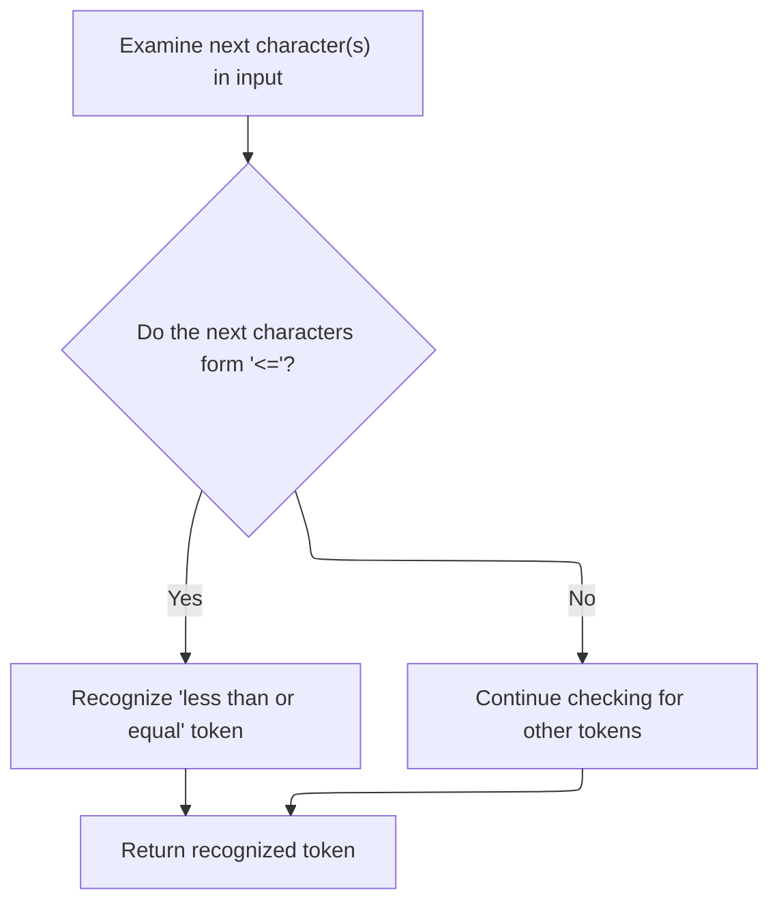
```mermaid
%%{init: {"flowchart": {"defaultRenderer": "elk"}} }%%
flowchart TD
    node1["Examine next character(s) in input"]
    click node1 openCode "core/src/main/java/org/apache/struts/validator/validwhen/ValidWhenLexer.java:159:161"
    node1 --> node2{"Do the next characters form '<='?"}
    click node2 openCode "core/src/main/java/org/apache/struts/validator/validwhen/ValidWhenLexer.java:160:161"
    node2 -->|"Yes"| node3["Recognize 'less than or equal' token"]
    click node3 openCode "core/src/main/java/org/apache/struts/validator/validwhen/ValidWhenLexer.java:161:161"
    node2 -->|"No"| node4["Continue checking for other tokens"]
    click node4 openCode "core/src/main/java/org/apache/struts/validator/validwhen/ValidWhenLexer.java:159:161"
    node3 --> node5["Return recognized token"]
    click node5 openCode "core/src/main/java/org/apache/struts/validator/validwhen/ValidWhenLexer.java:161:161"
    node4 --> node5
classDef HeadingStyle fill:#777777,stroke:#333,stroke-width:2px;

%% Swimm:
%% %%{init: {"flowchart": {"defaultRenderer": "elk"}} }%%
%% flowchart TD
%%     node1["Examine next character(s) in input"]
%%     click node1 openCode "<SwmPath>[core/…/validwhen/ValidWhenLexer.java](core/src/main/java/org/apache/struts/validator/validwhen/ValidWhenLexer.java)</SwmPath>:159:161"
%%     node1 --> node2{"Do the next characters form '<='?"}
%%     click node2 openCode "<SwmPath>[core/…/validwhen/ValidWhenLexer.java](core/src/main/java/org/apache/struts/validator/validwhen/ValidWhenLexer.java)</SwmPath>:160:161"
%%     node2 -->|"Yes"| node3["Recognize 'less than or equal' token"]
%%     click node3 openCode "<SwmPath>[core/…/validwhen/ValidWhenLexer.java](core/src/main/java/org/apache/struts/validator/validwhen/ValidWhenLexer.java)</SwmPath>:161:161"
%%     node2 -->|"No"| node4["Continue checking for other tokens"]
%%     click node4 openCode "<SwmPath>[core/…/validwhen/ValidWhenLexer.java](core/src/main/java/org/apache/struts/validator/validwhen/ValidWhenLexer.java)</SwmPath>:159:161"
%%     node3 --> node5["Return recognized token"]
%%     click node5 openCode "<SwmPath>[core/…/validwhen/ValidWhenLexer.java](core/src/main/java/org/apache/struts/validator/validwhen/ValidWhenLexer.java)</SwmPath>:161:161"
%%     node4 --> node5
%% classDef HeadingStyle fill:#777777,stroke:#333,stroke-width:2px;
```

<SwmSnippet path="/core/src/main/java/org/apache/struts/validator/validwhen/ValidWhenLexer.java" line="159">

---

Back in <SwmToken path="tiles/src/main/java/org/apache/struts/tiles/xmlDefinition/I18nFactorySet.java" pos="237:9:9" line-data="            this.filenames.add(tokenizer.nextToken().trim());">`nextToken`</SwmToken>, after handling '!=', the lexer checks for '<=' and '>=' to process comparison operators, calling the appropriate matcher for each.

```java
				default:
					if ((LA(1)=='<') && (LA(2)=='=')) {
						mLESSEQUALSIGN(true);
```

---

</SwmSnippet>

### Parsing Less-Than-Or-Equal Operator

<SwmSnippet path="/core/src/main/java/org/apache/struts/validator/validwhen/ValidWhenLexer.java" line="765">

---

In <SwmToken path="core/src/main/java/org/apache/struts/validator/validwhen/ValidWhenLexer.java" pos="765:7:7" line-data="	public final void mLESSEQUALSIGN(boolean _createToken) throws RecognitionException, CharStreamException, TokenStreamException {">`mLESSEQUALSIGN`</SwmToken>, the lexer matches '<' followed by '=' to recognize the less-than-or-equal operator. After matching, we call ActionConfigMatcher to use this token in parsing expressions.

```java
	public final void mLESSEQUALSIGN(boolean _createToken) throws RecognitionException, CharStreamException, TokenStreamException {
		int _ttype; Token _token=null; int _begin=text.length();
		_ttype = LESSEQUALSIGN;
		int _saveIndex;
		
		match('<');
		match('=');
```

---

</SwmSnippet>

<SwmSnippet path="/core/src/main/java/org/apache/struts/validator/validwhen/ValidWhenLexer.java" line="772">

---

Back in <SwmToken path="core/src/main/java/org/apache/struts/validator/validwhen/ValidWhenLexer.java" pos="161:1:1" line-data="						mLESSEQUALSIGN(true);">`mLESSEQUALSIGN`</SwmToken>, after returning from ActionConfigMatcher, the lexer creates and returns the token for '<=' if token creation is enabled.

```java
		if ( _createToken && _token==null && _ttype!=Token.SKIP ) {
			_token = makeToken(_ttype);
			_token.setText(new String(text.getBuffer(), _begin, text.length()-_begin));
		}
		_returnToken = _token;
	}
```

---

</SwmSnippet>

### Detecting More Comparison Operators

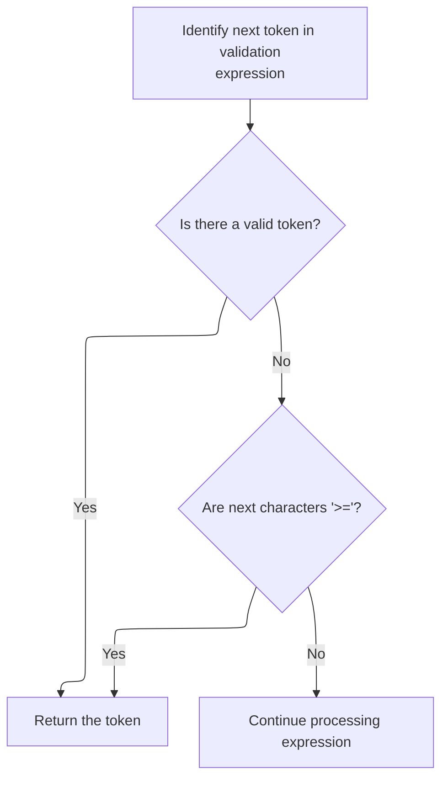
```mermaid
%%{init: {"flowchart": {"defaultRenderer": "elk"}} }%%
flowchart TD
    node1["Identify next token in validation
expression"]
    click node1 openCode "core/src/main/java/org/apache/struts/validator/validwhen/ValidWhenLexer.java:162:165"
    node1 --> node2{"Is there a valid token?"}
    click node2 openCode "core/src/main/java/org/apache/struts/validator/validwhen/ValidWhenLexer.java:162:163"
    node2 -->|"Yes"| node3["Return the token"]
    click node3 openCode "core/src/main/java/org/apache/struts/validator/validwhen/ValidWhenLexer.java:162:163"
    node2 -->|"No"| node4{"Are next characters '>='?"}
    click node4 openCode "core/src/main/java/org/apache/struts/validator/validwhen/ValidWhenLexer.java:164:165"
    node4 -->|"Yes"| node3
    node4 -->|"No"| node5["Continue processing expression"]
    click node5 openCode "core/src/main/java/org/apache/struts/validator/validwhen/ValidWhenLexer.java:165:165"

classDef HeadingStyle fill:#777777,stroke:#333,stroke-width:2px;

%% Swimm:
%% %%{init: {"flowchart": {"defaultRenderer": "elk"}} }%%
%% flowchart TD
%%     node1["Identify next token in validation
%% expression"]
%%     click node1 openCode "<SwmPath>[core/…/validwhen/ValidWhenLexer.java](core/src/main/java/org/apache/struts/validator/validwhen/ValidWhenLexer.java)</SwmPath>:162:165"
%%     node1 --> node2{"Is there a valid token?"}
%%     click node2 openCode "<SwmPath>[core/…/validwhen/ValidWhenLexer.java](core/src/main/java/org/apache/struts/validator/validwhen/ValidWhenLexer.java)</SwmPath>:162:163"
%%     node2 -->|"Yes"| node3["Return the token"]
%%     click node3 openCode "<SwmPath>[core/…/validwhen/ValidWhenLexer.java](core/src/main/java/org/apache/struts/validator/validwhen/ValidWhenLexer.java)</SwmPath>:162:163"
%%     node2 -->|"No"| node4{"Are next characters '>='?"}
%%     click node4 openCode "<SwmPath>[core/…/validwhen/ValidWhenLexer.java](core/src/main/java/org/apache/struts/validator/validwhen/ValidWhenLexer.java)</SwmPath>:164:165"
%%     node4 -->|"Yes"| node3
%%     node4 -->|"No"| node5["Continue processing expression"]
%%     click node5 openCode "<SwmPath>[core/…/validwhen/ValidWhenLexer.java](core/src/main/java/org/apache/struts/validator/validwhen/ValidWhenLexer.java)</SwmPath>:165:165"
%% 
%% classDef HeadingStyle fill:#777777,stroke:#333,stroke-width:2px;
```

<SwmSnippet path="/core/src/main/java/org/apache/struts/validator/validwhen/ValidWhenLexer.java" line="162">

---

Back in <SwmToken path="tiles/src/main/java/org/apache/struts/tiles/xmlDefinition/I18nFactorySet.java" pos="237:9:9" line-data="            this.filenames.add(tokenizer.nextToken().trim());">`nextToken`</SwmToken>, after handling '<=', the lexer checks for '>=' and calls <SwmToken path="core/src/main/java/org/apache/struts/validator/validwhen/ValidWhenLexer.java" pos="165:1:1" line-data="						mGREATEREQUALSIGN(true);">`mGREATEREQUALSIGN`</SwmToken> to process the operator.

```java
						theRetToken=_returnToken;
					}
					else if ((LA(1)=='>') && (LA(2)=='=')) {
						mGREATEREQUALSIGN(true);
```

---

</SwmSnippet>

### Parsing Greater-Than-Or-Equal Operator

<SwmSnippet path="/core/src/main/java/org/apache/struts/validator/validwhen/ValidWhenLexer.java" line="779">

---

In <SwmToken path="core/src/main/java/org/apache/struts/validator/validwhen/ValidWhenLexer.java" pos="779:7:7" line-data="	public final void mGREATEREQUALSIGN(boolean _createToken) throws RecognitionException, CharStreamException, TokenStreamException {">`mGREATEREQUALSIGN`</SwmToken>, the lexer matches '>' followed by '=' to recognize the greater-than-or-equal operator. After matching, we call ActionConfigMatcher to use this token in parsing expressions.

```java
	public final void mGREATEREQUALSIGN(boolean _createToken) throws RecognitionException, CharStreamException, TokenStreamException {
		int _ttype; Token _token=null; int _begin=text.length();
		_ttype = GREATEREQUALSIGN;
		int _saveIndex;
		
		match('>');
		match('=');
```

---

</SwmSnippet>

<SwmSnippet path="/core/src/main/java/org/apache/struts/validator/validwhen/ValidWhenLexer.java" line="786">

---

Back in <SwmToken path="core/src/main/java/org/apache/struts/validator/validwhen/ValidWhenLexer.java" pos="165:1:1" line-data="						mGREATEREQUALSIGN(true);">`mGREATEREQUALSIGN`</SwmToken>, after returning from ActionConfigMatcher, the lexer creates and returns the token for '>=' if token creation is enabled.

```java
		if ( _createToken && _token==null && _ttype!=Token.SKIP ) {
			_token = makeToken(_ttype);
			_token.setText(new String(text.getBuffer(), _begin, text.length()-_begin));
		}
		_returnToken = _token;
	}
```

---

</SwmSnippet>

### Detecting Less-Than and Greater-Than Operators

<SwmSnippet path="/core/src/main/java/org/apache/struts/validator/validwhen/ValidWhenLexer.java" line="166">

---

Back in <SwmToken path="tiles/src/main/java/org/apache/struts/tiles/xmlDefinition/I18nFactorySet.java" pos="237:9:9" line-data="            this.filenames.add(tokenizer.nextToken().trim());">`nextToken`</SwmToken>, after handling '<=' and '>=', the lexer checks for single '<' and '>' characters, calling the appropriate matcher for each to process the remaining comparison operators.

```java
						theRetToken=_returnToken;
					}
					else if ((LA(1)=='<') && (true)) {
						mLESSTHANSIGN(true);
```

---

</SwmSnippet>

### Parsing Less-Than Operator

<SwmSnippet path="/core/src/main/java/org/apache/struts/validator/validwhen/ValidWhenLexer.java" line="739">

---

In <SwmToken path="core/src/main/java/org/apache/struts/validator/validwhen/ValidWhenLexer.java" pos="739:7:7" line-data="	public final void mLESSTHANSIGN(boolean _createToken) throws RecognitionException, CharStreamException, TokenStreamException {">`mLESSTHANSIGN`</SwmToken>, the lexer matches a single '<' character to recognize the less-than operator. After matching, we call ActionConfigMatcher to use this token in parsing expressions.

```java
	public final void mLESSTHANSIGN(boolean _createToken) throws RecognitionException, CharStreamException, TokenStreamException {
		int _ttype; Token _token=null; int _begin=text.length();
		_ttype = LESSTHANSIGN;
		int _saveIndex;
		
		match('<');
```

---

</SwmSnippet>

<SwmSnippet path="/core/src/main/java/org/apache/struts/validator/validwhen/ValidWhenLexer.java" line="745">

---

Back in <SwmToken path="core/src/main/java/org/apache/struts/validator/validwhen/ValidWhenLexer.java" pos="169:1:1" line-data="						mLESSTHANSIGN(true);">`mLESSTHANSIGN`</SwmToken>, after returning from ActionConfigMatcher, the lexer creates and returns the token for '<' if token creation is enabled.

```java
		if ( _createToken && _token==null && _ttype!=Token.SKIP ) {
			_token = makeToken(_ttype);
			_token.setText(new String(text.getBuffer(), _begin, text.length()-_begin));
		}
		_returnToken = _token;
	}
```

---

</SwmSnippet>

### Detecting Greater-Than Operator and End of Input

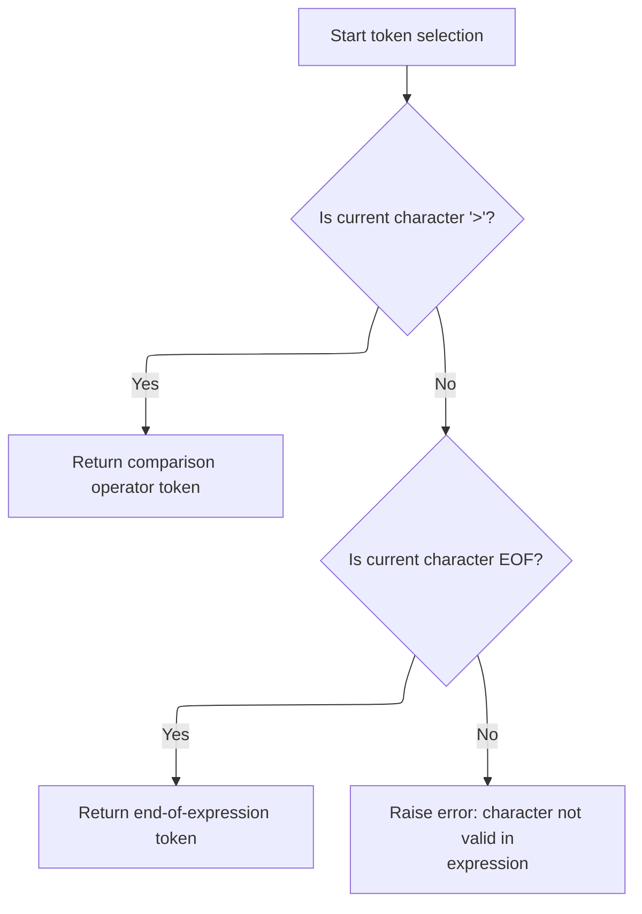
```mermaid
%%{init: {"flowchart": {"defaultRenderer": "elk"}} }%%
flowchart TD
    node1["Start token selection"] --> node2{"Is current character '>'?"}
    click node1 openCode "core/src/main/java/org/apache/struts/validator/validwhen/ValidWhenLexer.java:170:171"
    node2 -->|"Yes"| node3["Return comparison operator token"]
    click node2 openCode "core/src/main/java/org/apache/struts/validator/validwhen/ValidWhenLexer.java:172:174"
    click node3 openCode "core/src/main/java/org/apache/struts/validator/validwhen/ValidWhenLexer.java:173:174"
    node2 -->|"No"| node4{"Is current character EOF?"}
    click node4 openCode "core/src/main/java/org/apache/struts/validator/validwhen/ValidWhenLexer.java:176:177"
    node4 -->|"Yes"| node5["Return end-of-expression token"]
    click node5 openCode "core/src/main/java/org/apache/struts/validator/validwhen/ValidWhenLexer.java:177:177"
    node4 -->|"No"| node6["Raise error: character not valid in
expression"]
    click node6 openCode "core/src/main/java/org/apache/struts/validator/validwhen/ValidWhenLexer.java:178:178"

classDef HeadingStyle fill:#777777,stroke:#333,stroke-width:2px;

%% Swimm:
%% %%{init: {"flowchart": {"defaultRenderer": "elk"}} }%%
%% flowchart TD
%%     node1["Start token selection"] --> node2{"Is current character '>'?"}
%%     click node1 openCode "<SwmPath>[core/…/validwhen/ValidWhenLexer.java](core/src/main/java/org/apache/struts/validator/validwhen/ValidWhenLexer.java)</SwmPath>:170:171"
%%     node2 -->|"Yes"| node3["Return comparison operator token"]
%%     click node2 openCode "<SwmPath>[core/…/validwhen/ValidWhenLexer.java](core/src/main/java/org/apache/struts/validator/validwhen/ValidWhenLexer.java)</SwmPath>:172:174"
%%     click node3 openCode "<SwmPath>[core/…/validwhen/ValidWhenLexer.java](core/src/main/java/org/apache/struts/validator/validwhen/ValidWhenLexer.java)</SwmPath>:173:174"
%%     node2 -->|"No"| node4{"Is current character EOF?"}
%%     click node4 openCode "<SwmPath>[core/…/validwhen/ValidWhenLexer.java](core/src/main/java/org/apache/struts/validator/validwhen/ValidWhenLexer.java)</SwmPath>:176:177"
%%     node4 -->|"Yes"| node5["Return end-of-expression token"]
%%     click node5 openCode "<SwmPath>[core/…/validwhen/ValidWhenLexer.java](core/src/main/java/org/apache/struts/validator/validwhen/ValidWhenLexer.java)</SwmPath>:177:177"
%%     node4 -->|"No"| node6["Raise error: character not valid in
%% expression"]
%%     click node6 openCode "<SwmPath>[core/…/validwhen/ValidWhenLexer.java](core/src/main/java/org/apache/struts/validator/validwhen/ValidWhenLexer.java)</SwmPath>:178:178"
%% 
%% classDef HeadingStyle fill:#777777,stroke:#333,stroke-width:2px;
```

<SwmSnippet path="/core/src/main/java/org/apache/struts/validator/validwhen/ValidWhenLexer.java" line="170">

---

Back in <SwmToken path="tiles/src/main/java/org/apache/struts/tiles/xmlDefinition/I18nFactorySet.java" pos="237:9:9" line-data="            this.filenames.add(tokenizer.nextToken().trim());">`nextToken`</SwmToken>, after handling '<', the lexer checks for '>' to process the greater-than operator, and also handles end-of-input by returning an EOF token or throwing an error if the input doesn't match any known token.

```java
						theRetToken=_returnToken;
					}
					else if ((LA(1)=='>') && (true)) {
						mGREATERTHANSIGN(true);
						theRetToken=_returnToken;
					}
				else {
					if (LA(1)==EOF_CHAR) {uponEOF(); _returnToken = makeToken(Token.EOF_TYPE);}
				else {throw new NoViableAltForCharException((char)LA(1), getFilename(), getLine(), getColumn());}
				}
				}
```

---

</SwmSnippet>

### Parsing Greater-Than Operator

<SwmSnippet path="/core/src/main/java/org/apache/struts/validator/validwhen/ValidWhenLexer.java" line="752">

---

In <SwmToken path="core/src/main/java/org/apache/struts/validator/validwhen/ValidWhenLexer.java" pos="752:7:7" line-data="	public final void mGREATERTHANSIGN(boolean _createToken) throws RecognitionException, CharStreamException, TokenStreamException {">`mGREATERTHANSIGN`</SwmToken>, we match the '>' character and set up the token type for the greater-than operator. After this, we need to call ActionConfigMatcher so it can use this token for parsing configuration expressions.

```java
	public final void mGREATERTHANSIGN(boolean _createToken) throws RecognitionException, CharStreamException, TokenStreamException {
		int _ttype; Token _token=null; int _begin=text.length();
		_ttype = GREATERTHANSIGN;
		int _saveIndex;
		
		match('>');
```

---

</SwmSnippet>

<SwmSnippet path="/core/src/main/java/org/apache/struts/validator/validwhen/ValidWhenLexer.java" line="758">

---

Back in <SwmToken path="core/src/main/java/org/apache/struts/validator/validwhen/ValidWhenLexer.java" pos="173:1:1" line-data="						mGREATERTHANSIGN(true);">`mGREATERTHANSIGN`</SwmToken>, after returning from ActionConfigMatcher, we create and return the token for the greater-than operator if token creation is enabled.

```java
		if ( _createToken && _token==null && _ttype!=Token.SKIP ) {
			_token = makeToken(_ttype);
			_token.setText(new String(text.getBuffer(), _begin, text.length()-_begin));
		}
		_returnToken = _token;
	}
```

---

</SwmSnippet>

### Finalizing Token Recognition and Return

<SwmSnippet path="/core/src/main/java/org/apache/struts/validator/validwhen/ValidWhenLexer.java" line="181">

---

Back in <SwmToken path="tiles/src/main/java/org/apache/struts/tiles/xmlDefinition/I18nFactorySet.java" pos="237:9:9" line-data="            this.filenames.add(tokenizer.nextToken().trim());">`nextToken`</SwmToken>, after handling the greater-than operator, we finalize the token type, check for literal replacements, and return the token. The next step is to call <SwmToken path="faces/src/main/java/org/apache/struts/faces/component/CommandLinkComponent.java" pos="37:4:4" line-data="public class CommandLinkComponent extends UICommand {">`CommandLinkComponent`</SwmToken>, which can use this token for JSF property binding or action logic.

```java
				if ( _returnToken==null ) continue tryAgain; // found SKIP token
				_ttype = _returnToken.getType();
				_ttype = testLiteralsTable(_ttype);
				_returnToken.setType(_ttype);
				return _returnToken;
			}
			catch (RecognitionException e) {
				throw new TokenStreamRecognitionException(e);
			}
		}
```

---

</SwmSnippet>

<SwmSnippet path="/faces/src/main/java/org/apache/struts/faces/component/CommandLinkComponent.java" line="434">

---

<SwmToken path="faces/src/main/java/org/apache/struts/faces/component/CommandLinkComponent.java" pos="434:5:5" line-data="    public String getType() {">`getType`</SwmToken> checks for a JSF value binding for the 'type' property and returns its value if present, otherwise it falls back to the local 'type' variable. This lets the property be set dynamically or statically.

```java
    public String getType() {
        ValueBinding vb = getValueBinding("type");
        if (vb != null) {
            return (String) vb.getValue(getFacesContext());
        } else {
            return type;
        }
    }
```

---

</SwmSnippet>

<SwmSnippet path="/core/src/main/java/org/apache/struts/validator/validwhen/ValidWhenLexer.java" line="191">

---

Back in <SwmToken path="tiles/src/main/java/org/apache/struts/tiles/xmlDefinition/I18nFactorySet.java" pos="237:9:9" line-data="            this.filenames.add(tokenizer.nextToken().trim());">`nextToken`</SwmToken>, after returning from <SwmToken path="faces/src/main/java/org/apache/struts/faces/component/CommandLinkComponent.java" pos="37:4:4" line-data="public class CommandLinkComponent extends UICommand {">`CommandLinkComponent`</SwmToken>, any CharStream or Recognition exceptions are caught and rethrown as token stream exceptions, so the caller can handle errors from the tokenization process.

```java
		catch (CharStreamException cse) {
			if ( cse instanceof CharStreamIOException ) {
				throw new TokenStreamIOException(((CharStreamIOException)cse).io);
			}
			else {
				throw new TokenStreamException(cse.getMessage());
			}
		}
	}
}
```

---

</SwmSnippet>

## Completing Factory Initialization

<SwmSnippet path="/tiles/src/main/java/org/apache/struts/tiles/xmlDefinition/I18nFactorySet.java" line="240">

---

Back in <SwmToken path="tiles/src/main/java/org/apache/struts/tiles/xmlDefinition/I18nFactorySet.java" pos="228:5:5" line-data="    protected void initFactory(">`initFactory`</SwmToken>, after parsing tokens, we set up the 'loaded' map and create the <SwmToken path="tiles/src/main/java/org/apache/struts/tiles/xmlDefinition/I18nFactorySet.java" pos="241:1:1" line-data="        defaultFactory = createDefaultFactory(servletContext);">`defaultFactory`</SwmToken>. This sets up the baseline definitions for the app, and the debug log outputs info about the factory.

```java
        loaded = new HashMap();
        defaultFactory = createDefaultFactory(servletContext);
        if (log.isDebugEnabled())
            log.debug("default factory:" + defaultFactory);
    }
```

---

</SwmSnippet>

# Building the Default Definitions Factory

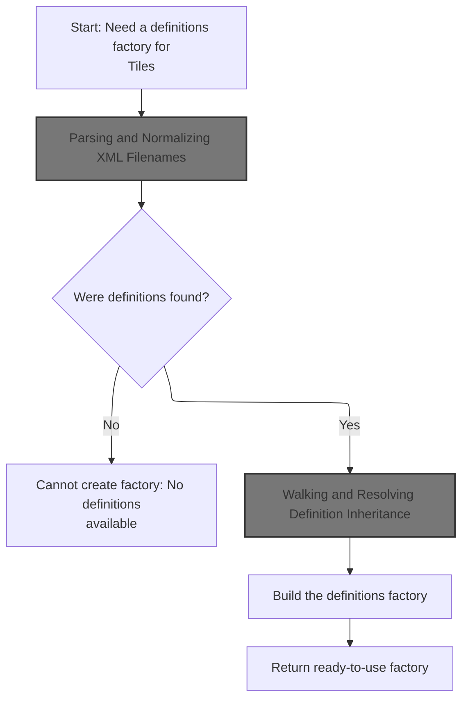
```mermaid
%%{init: {"flowchart": {"defaultRenderer": "elk"}} }%%
flowchart TD
    node1["Start: Need a definitions factory for
Tiles"]
    click node1 openCode "tiles/src/main/java/org/apache/struts/tiles/xmlDefinition/I18nFactorySet.java:263:264"
    node1 --> node2["Parsing and Normalizing XML Filenames"]
    
    node2 --> node3{"Were definitions found?"}
    click node3 openCode "tiles/src/main/java/org/apache/struts/tiles/xmlDefinition/I18nFactorySet.java:267:269"
    node3 -->|"No"| node4["Cannot create factory: No definitions
available"]
    click node4 openCode "tiles/src/main/java/org/apache/struts/tiles/xmlDefinition/I18nFactorySet.java:268:269"
    node3 -->|"Yes"| node5["Walking and Resolving Definition Inheritance"]
    
    node5 --> node6["Build the definitions factory"]
    click node6 openCode "tiles/src/main/java/org/apache/struts/tiles/xmlDefinition/I18nFactorySet.java:277:277"
    node6 --> node7["Return ready-to-use factory"]
    click node7 openCode "tiles/src/main/java/org/apache/struts/tiles/xmlDefinition/I18nFactorySet.java:282:283"

classDef HeadingStyle fill:#777777,stroke:#333,stroke-width:2px;
click node2 goToHeading "Parsing and Normalizing XML Filenames"
node2:::HeadingStyle
click node5 goToHeading "Walking and Resolving Definition Inheritance"
node5:::HeadingStyle

%% Swimm:
%% %%{init: {"flowchart": {"defaultRenderer": "elk"}} }%%
%% flowchart TD
%%     node1["Start: Need a definitions factory for
%% Tiles"]
%%     click node1 openCode "<SwmPath>[tiles/…/xmlDefinition/I18nFactorySet.java](tiles/src/main/java/org/apache/struts/tiles/xmlDefinition/I18nFactorySet.java)</SwmPath>:263:264"
%%     node1 --> node2["Parsing and Normalizing XML Filenames"]
%%     
%%     node2 --> node3{"Were definitions found?"}
%%     click node3 openCode "<SwmPath>[tiles/…/xmlDefinition/I18nFactorySet.java](tiles/src/main/java/org/apache/struts/tiles/xmlDefinition/I18nFactorySet.java)</SwmPath>:267:269"
%%     node3 -->|"No"| node4["Cannot create factory: No definitions
%% available"]
%%     click node4 openCode "<SwmPath>[tiles/…/xmlDefinition/I18nFactorySet.java](tiles/src/main/java/org/apache/struts/tiles/xmlDefinition/I18nFactorySet.java)</SwmPath>:268:269"
%%     node3 -->|"Yes"| node5["Walking and Resolving Definition Inheritance"]
%%     
%%     node5 --> node6["Build the definitions factory"]
%%     click node6 openCode "<SwmPath>[tiles/…/xmlDefinition/I18nFactorySet.java](tiles/src/main/java/org/apache/struts/tiles/xmlDefinition/I18nFactorySet.java)</SwmPath>:277:277"
%%     node6 --> node7["Return ready-to-use factory"]
%%     click node7 openCode "<SwmPath>[tiles/…/xmlDefinition/I18nFactorySet.java](tiles/src/main/java/org/apache/struts/tiles/xmlDefinition/I18nFactorySet.java)</SwmPath>:282:283"
%% 
%% classDef HeadingStyle fill:#777777,stroke:#333,stroke-width:2px;
%% click node2 goToHeading "Parsing and Normalizing XML Filenames"
%% node2:::HeadingStyle
%% click node5 goToHeading "Walking and Resolving Definition Inheritance"
%% node5:::HeadingStyle
```

<SwmSnippet path="/tiles/src/main/java/org/apache/struts/tiles/xmlDefinition/I18nFactorySet.java" line="263">

---

In <SwmToken path="tiles/src/main/java/org/apache/struts/tiles/xmlDefinition/I18nFactorySet.java" pos="263:5:5" line-data="    protected DefinitionsFactory createDefaultFactory(ServletContext servletContext)">`createDefaultFactory`</SwmToken>, we start by parsing XML files to load configuration definitions. This is needed before we can build the factory, so we call <SwmToken path="tiles/src/main/java/org/apache/struts/tiles/xmlDefinition/I18nFactorySet.java" pos="266:7:7" line-data="        XmlDefinitionsSet rootXmlConfig = parseXmlFiles(servletContext, &quot;&quot;, null);">`parseXmlFiles`</SwmToken> next.

```java
    protected DefinitionsFactory createDefaultFactory(ServletContext servletContext)
        throws DefinitionsFactoryException, FileNotFoundException {

        XmlDefinitionsSet rootXmlConfig = parseXmlFiles(servletContext, "", null);
```

---

</SwmSnippet>

## Parsing and Normalizing XML Filenames

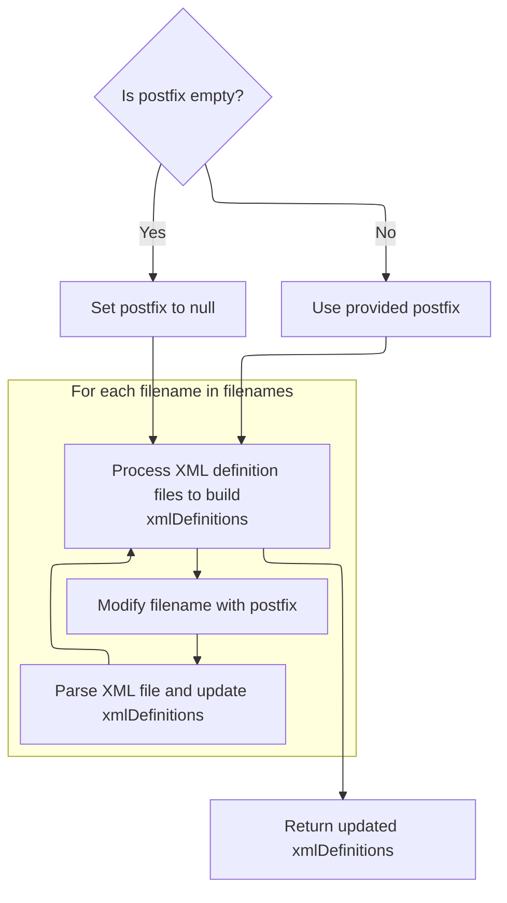
```mermaid
%%{init: {"flowchart": {"defaultRenderer": "elk"}} }%%
flowchart TD
    node1{"Is postfix empty?"}
    click node1 openCode "tiles/src/main/java/org/apache/struts/tiles/xmlDefinition/I18nFactorySet.java:441:443"
    node1 -->|"Yes"| node2["Set postfix to null"]
    click node2 openCode "tiles/src/main/java/org/apache/struts/tiles/xmlDefinition/I18nFactorySet.java:442:443"
    node1 -->|"No"| node3["Use provided postfix"]
    click node3 openCode "tiles/src/main/java/org/apache/struts/tiles/xmlDefinition/I18nFactorySet.java:441:441"

    node2 --> node4["Process XML definition files to build
xmlDefinitions"]
    node3 --> node4

    subgraph loop1["For each filename in filenames"]
        node4 --> node5["Modify filename with postfix"]
        click node5 openCode "tiles/src/main/java/org/apache/struts/tiles/xmlDefinition/I18nFactorySet.java:448:448"
        node5 --> node6["Parse XML file and update xmlDefinitions"]
        click node6 openCode "tiles/src/main/java/org/apache/struts/tiles/xmlDefinition/I18nFactorySet.java:449:449"
        node6 --> node4
    end

    node4 --> node7["Return updated xmlDefinitions"]
    click node7 openCode "tiles/src/main/java/org/apache/struts/tiles/xmlDefinition/I18nFactorySet.java:452:452"

classDef HeadingStyle fill:#777777,stroke:#333,stroke-width:2px;

%% Swimm:
%% %%{init: {"flowchart": {"defaultRenderer": "elk"}} }%%
%% flowchart TD
%%     node1{"Is postfix empty?"}
%%     click node1 openCode "<SwmPath>[tiles/…/xmlDefinition/I18nFactorySet.java](tiles/src/main/java/org/apache/struts/tiles/xmlDefinition/I18nFactorySet.java)</SwmPath>:441:443"
%%     node1 -->|"Yes"| node2["Set postfix to null"]
%%     click node2 openCode "<SwmPath>[tiles/…/xmlDefinition/I18nFactorySet.java](tiles/src/main/java/org/apache/struts/tiles/xmlDefinition/I18nFactorySet.java)</SwmPath>:442:443"
%%     node1 -->|"No"| node3["Use provided postfix"]
%%     click node3 openCode "<SwmPath>[tiles/…/xmlDefinition/I18nFactorySet.java](tiles/src/main/java/org/apache/struts/tiles/xmlDefinition/I18nFactorySet.java)</SwmPath>:441:441"
%% 
%%     node2 --> node4["Process XML definition files to build
%% <SwmToken path="tiles/src/main/java/org/apache/struts/tiles/xmlDefinition/I18nFactorySet.java" pos="438:3:3" line-data="        XmlDefinitionsSet xmlDefinitions)">`xmlDefinitions`</SwmToken>"]
%%     node3 --> node4
%% 
%%     subgraph loop1["For each filename in filenames"]
%%         node4 --> node5["Modify filename with postfix"]
%%         click node5 openCode "<SwmPath>[tiles/…/xmlDefinition/I18nFactorySet.java](tiles/src/main/java/org/apache/struts/tiles/xmlDefinition/I18nFactorySet.java)</SwmPath>:448:448"
%%         node5 --> node6["Parse XML file and update <SwmToken path="tiles/src/main/java/org/apache/struts/tiles/xmlDefinition/I18nFactorySet.java" pos="438:3:3" line-data="        XmlDefinitionsSet xmlDefinitions)">`xmlDefinitions`</SwmToken>"]
%%         click node6 openCode "<SwmPath>[tiles/…/xmlDefinition/I18nFactorySet.java](tiles/src/main/java/org/apache/struts/tiles/xmlDefinition/I18nFactorySet.java)</SwmPath>:449:449"
%%         node6 --> node4
%%     end
%% 
%%     node4 --> node7["Return updated <SwmToken path="tiles/src/main/java/org/apache/struts/tiles/xmlDefinition/I18nFactorySet.java" pos="438:3:3" line-data="        XmlDefinitionsSet xmlDefinitions)">`xmlDefinitions`</SwmToken>"]
%%     click node7 openCode "<SwmPath>[tiles/…/xmlDefinition/I18nFactorySet.java](tiles/src/main/java/org/apache/struts/tiles/xmlDefinition/I18nFactorySet.java)</SwmPath>:452:452"
%% 
%% classDef HeadingStyle fill:#777777,stroke:#333,stroke-width:2px;
```

<SwmSnippet path="/tiles/src/main/java/org/apache/struts/tiles/xmlDefinition/I18nFactorySet.java" line="435">

---

In <SwmToken path="tiles/src/main/java/org/apache/struts/tiles/xmlDefinition/I18nFactorySet.java" pos="435:5:5" line-data="    protected XmlDefinitionsSet parseXmlFiles(">`parseXmlFiles`</SwmToken>, we normalize the postfix, iterate over the class member 'filenames', and for each, call <SwmToken path="tiles/src/main/java/org/apache/struts/tiles/xmlDefinition/I18nFactorySet.java" pos="448:7:7" line-data="            String filename = concatPostfix((String) i.next(), postfix);">`concatPostfix`</SwmToken> to build the actual filename. This lets us handle multiple XML files and combine their definitions.

```java
    protected XmlDefinitionsSet parseXmlFiles(
        ServletContext servletContext,
        String postfix,
        XmlDefinitionsSet xmlDefinitions)
        throws DefinitionsFactoryException {

        if (postfix != null && postfix.length() == 0) {
            postfix = null;
        }

        // Iterate throw each file name in list
        Iterator i = filenames.iterator();
        while (i.hasNext()) {
            String filename = concatPostfix((String) i.next(), postfix);
```

---

</SwmSnippet>

<SwmSnippet path="/tiles/src/main/java/org/apache/struts/tiles/xmlDefinition/I18nFactorySet.java" line="542">

---

<SwmToken path="tiles/src/main/java/org/apache/struts/tiles/xmlDefinition/I18nFactorySet.java" pos="542:5:5" line-data="    private String concatPostfix(String name, String postfix) {">`concatPostfix`</SwmToken> checks for a postfix and inserts it before the file extension if present, or just appends it if not. It handles Unix hidden files and paths so filenames stay valid.

```java
    private String concatPostfix(String name, String postfix) {
        if (postfix == null) {
            return name;
        }

        // Search file name extension.
        // take care of Unix files starting with .
        int dotIndex = name.lastIndexOf(".");
        int lastNameStart = name.lastIndexOf(java.io.File.pathSeparator);
        if (dotIndex < 1 || dotIndex < lastNameStart) {
            return name + postfix;
        }

        String ext = name.substring(dotIndex);
        name = name.substring(0, dotIndex);
        return name + postfix + ext;
    }
```

---

</SwmSnippet>

<SwmSnippet path="/tiles/src/main/java/org/apache/struts/tiles/xmlDefinition/I18nFactorySet.java" line="449">

---

Back in <SwmToken path="tiles/src/main/java/org/apache/struts/tiles/xmlDefinition/I18nFactorySet.java" pos="266:7:7" line-data="        XmlDefinitionsSet rootXmlConfig = parseXmlFiles(servletContext, &quot;&quot;, null);">`parseXmlFiles`</SwmToken>, after building the filename with <SwmToken path="tiles/src/main/java/org/apache/struts/tiles/xmlDefinition/I18nFactorySet.java" pos="448:7:7" line-data="            String filename = concatPostfix((String) i.next(), postfix);">`concatPostfix`</SwmToken>, we parse each XML file and merge its definitions. This way, we combine all definitions from multiple files into one set.

```java
            xmlDefinitions = parseXmlFile(servletContext, filename, xmlDefinitions);
        }

        return xmlDefinitions;
    }
```

---

</SwmSnippet>

## Loading and Parsing XML File Resources

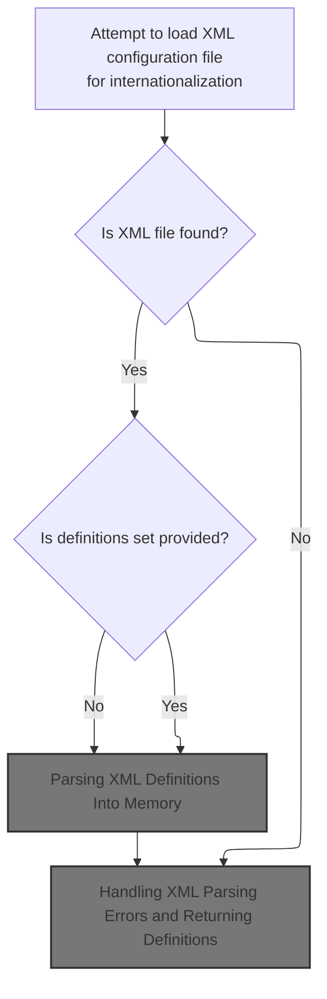
```mermaid
%%{init: {"flowchart": {"defaultRenderer": "elk"}} }%%
flowchart TD
    node1["Attempt to load XML configuration file
for internationalization"] --> node2{"Is XML file found?"}
    click node1 openCode "tiles/src/main/java/org/apache/struts/tiles/xmlDefinition/I18nFactorySet.java:467:514"
    node2 -->|"Yes"| node3{"Is definitions set provided?"}
    click node2 openCode "tiles/src/main/java/org/apache/struts/tiles/xmlDefinition/I18nFactorySet.java:478:494"
    node2 -->|"No"| node5["Handling XML Parsing Errors and Returning Definitions"]
    
    node3 -->|"Yes"| node4["Parsing XML Definitions Into Memory"]
    node3 -->|"No"| node4["Parsing XML Definitions Into Memory"]
    click node3 openCode "tiles/src/main/java/org/apache/struts/tiles/xmlDefinition/I18nFactorySet.java:510:514"
    
    node4 --> node5["Handling XML Parsing Errors and Returning Definitions"]
    
classDef HeadingStyle fill:#777777,stroke:#333,stroke-width:2px;
click node4 goToHeading "Parsing XML Definitions Into Memory"
node4:::HeadingStyle
click node5 goToHeading "Handling XML Parsing Errors and Returning Definitions"
node5:::HeadingStyle

%% Swimm:
%% %%{init: {"flowchart": {"defaultRenderer": "elk"}} }%%
%% flowchart TD
%%     node1["Attempt to load XML configuration file
%% for internationalization"] --> node2{"Is XML file found?"}
%%     click node1 openCode "<SwmPath>[tiles/…/xmlDefinition/I18nFactorySet.java](tiles/src/main/java/org/apache/struts/tiles/xmlDefinition/I18nFactorySet.java)</SwmPath>:467:514"
%%     node2 -->|"Yes"| node3{"Is definitions set provided?"}
%%     click node2 openCode "<SwmPath>[tiles/…/xmlDefinition/I18nFactorySet.java](tiles/src/main/java/org/apache/struts/tiles/xmlDefinition/I18nFactorySet.java)</SwmPath>:478:494"
%%     node2 -->|"No"| node5["Handling XML Parsing Errors and Returning Definitions"]
%%     
%%     node3 -->|"Yes"| node4["Parsing XML Definitions Into Memory"]
%%     node3 -->|"No"| node4["Parsing XML Definitions Into Memory"]
%%     click node3 openCode "<SwmPath>[tiles/…/xmlDefinition/I18nFactorySet.java](tiles/src/main/java/org/apache/struts/tiles/xmlDefinition/I18nFactorySet.java)</SwmPath>:510:514"
%%     
%%     node4 --> node5["Handling XML Parsing Errors and Returning Definitions"]
%%     
%% classDef HeadingStyle fill:#777777,stroke:#333,stroke-width:2px;
%% click node4 goToHeading "Parsing XML Definitions Into Memory"
%% node4:::HeadingStyle
%% click node5 goToHeading "Handling XML Parsing Errors and Returning Definitions"
%% node5:::HeadingStyle
```

<SwmSnippet path="/tiles/src/main/java/org/apache/struts/tiles/xmlDefinition/I18nFactorySet.java" line="467">

---

In <SwmToken path="tiles/src/main/java/org/apache/struts/tiles/xmlDefinition/I18nFactorySet.java" pos="467:5:5" line-data="    protected XmlDefinitionsSet parseXmlFile(">`parseXmlFile`</SwmToken>, we try several ways to load the XML file (servlet context, real path, class loader) for compatibility. Then we use a custom <SwmToken path="tiles/src/main/java/org/apache/struts/tiles/xmlDefinition/I18nFactorySet.java" pos="505:7:7" line-data="                xmlParser = new XmlParser();">`XmlParser`</SwmToken> to parse the stream into <SwmToken path="tiles/src/main/java/org/apache/struts/tiles/xmlDefinition/I18nFactorySet.java" pos="467:3:3" line-data="    protected XmlDefinitionsSet parseXmlFile(">`XmlDefinitionsSet`</SwmToken>.

```java
    protected XmlDefinitionsSet parseXmlFile(
        ServletContext servletContext,
        String filename,
        XmlDefinitionsSet xmlDefinitions)
        throws DefinitionsFactoryException {

        try {
            InputStream input = servletContext.getResourceAsStream(filename);
            // Try to load using real path.
            // This allow to load config file under websphere 3.5.x
            // Patch proposed Houston, Stephen (LIT) on 5 Apr 2002
            if (null == input) {
                try {
                    input =
                        new java.io.FileInputStream(
                            servletContext.getRealPath(filename));
                } catch (Exception e) {
                }
            }

            // If the config isn't in the servlet context, try the class loader
            // which allows the config files to be stored in a jar
            if (input == null) {
                input = getClass().getResourceAsStream(filename);
            }

            // If still nothing found, this mean no config file is associated
            if (input == null) {
                if (log.isDebugEnabled()) {
                    log.debug("Can't open file '" + filename + "'");
                }
                return xmlDefinitions;
            }

            // Check if parser already exist.
            // Doesn't seem to work yet.
            //if( xmlParser == null )
            if (true) {
                xmlParser = new XmlParser();
                xmlParser.setValidating(isValidatingParser);
            }

            // Check if definition set already exist.
            if (xmlDefinitions == null) {
                xmlDefinitions = new XmlDefinitionsSet();
            }

            xmlParser.parse(input, xmlDefinitions);

```

---

</SwmSnippet>

### Parsing XML Definitions Into Memory

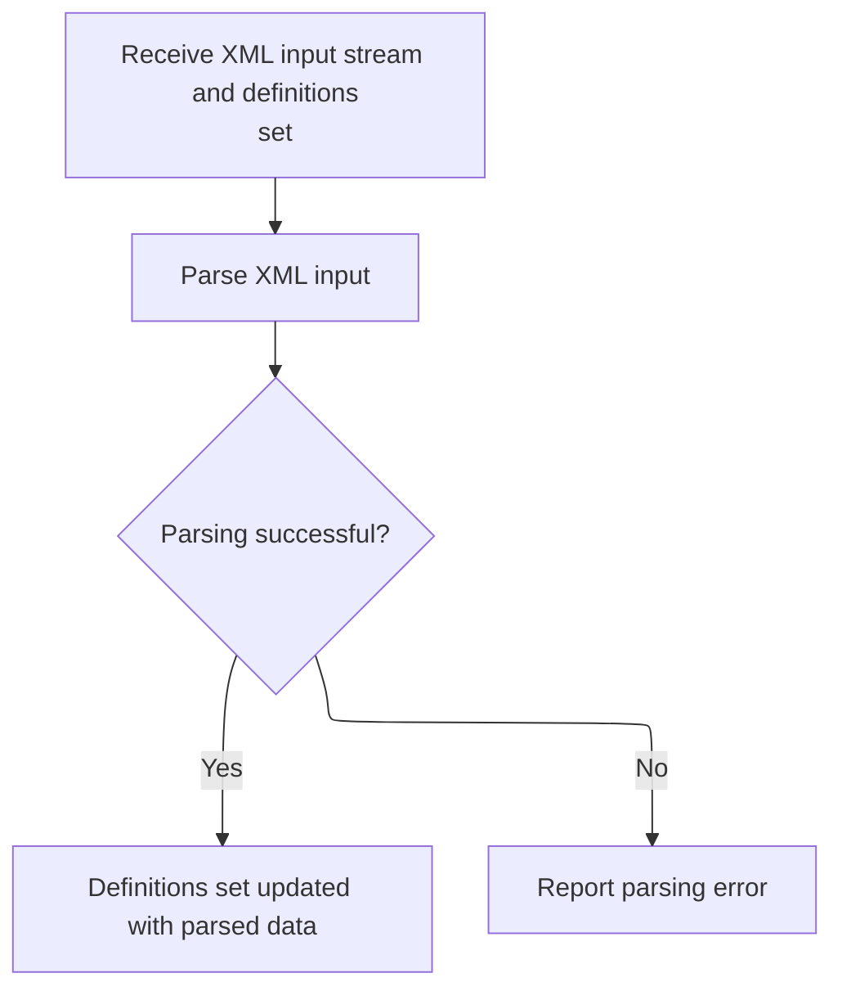
```mermaid
%%{init: {"flowchart": {"defaultRenderer": "elk"}} }%%
flowchart TD
    node1["Receive XML input stream and definitions
set"]
    click node1 openCode "tiles/src/main/java/org/apache/struts/tiles/xmlDefinition/XmlParser.java:275:281"
    node1 --> node2["Parse XML input"]
    click node2 openCode "tiles/src/main/java/org/apache/struts/tiles/xmlDefinition/XmlParser.java:282:283"
    node2 --> node3{"Parsing successful?"}
    click node3 openCode "tiles/src/main/java/org/apache/struts/tiles/xmlDefinition/XmlParser.java:286:290"
    node3 -->|"Yes"| node4["Definitions set updated with parsed data"]
    click node4 openCode "tiles/src/main/java/org/apache/struts/tiles/xmlDefinition/XmlParser.java:281:283"
    node3 -->|"No"| node5["Report parsing error"]
    click node5 openCode "tiles/src/main/java/org/apache/struts/tiles/xmlDefinition/XmlParser.java:286:290"
classDef HeadingStyle fill:#777777,stroke:#333,stroke-width:2px;

%% Swimm:
%% %%{init: {"flowchart": {"defaultRenderer": "elk"}} }%%
%% flowchart TD
%%     node1["Receive XML input stream and definitions
%% set"]
%%     click node1 openCode "<SwmPath>[tiles/…/xmlDefinition/XmlParser.java](tiles/src/main/java/org/apache/struts/tiles/xmlDefinition/XmlParser.java)</SwmPath>:275:281"
%%     node1 --> node2["Parse XML input"]
%%     click node2 openCode "<SwmPath>[tiles/…/xmlDefinition/XmlParser.java](tiles/src/main/java/org/apache/struts/tiles/xmlDefinition/XmlParser.java)</SwmPath>:282:283"
%%     node2 --> node3{"Parsing successful?"}
%%     click node3 openCode "<SwmPath>[tiles/…/xmlDefinition/XmlParser.java](tiles/src/main/java/org/apache/struts/tiles/xmlDefinition/XmlParser.java)</SwmPath>:286:290"
%%     node3 -->|"Yes"| node4["Definitions set updated with parsed data"]
%%     click node4 openCode "<SwmPath>[tiles/…/xmlDefinition/XmlParser.java](tiles/src/main/java/org/apache/struts/tiles/xmlDefinition/XmlParser.java)</SwmPath>:281:283"
%%     node3 -->|"No"| node5["Report parsing error"]
%%     click node5 openCode "<SwmPath>[tiles/…/xmlDefinition/XmlParser.java](tiles/src/main/java/org/apache/struts/tiles/xmlDefinition/XmlParser.java)</SwmPath>:286:290"
%% classDef HeadingStyle fill:#777777,stroke:#333,stroke-width:2px;
```

<SwmSnippet path="/tiles/src/main/java/org/apache/struts/tiles/xmlDefinition/XmlParser.java" line="275">

---

<SwmToken path="tiles/src/main/java/org/apache/struts/tiles/xmlDefinition/XmlParser.java" pos="275:5:5" line-data="  public void parse( InputStream in, XmlDefinitionsSet definitions ) throws IOException, SAXException">`parse`</SwmToken> pushes the definitions set onto the digester stack and parses the XML stream, so the digester fills the definitions object directly. The input stream is closed after parsing.

```java
  public void parse( InputStream in, XmlDefinitionsSet definitions ) throws IOException, SAXException
  {
    try
    {
      // set first object in stack
    //digester.clear();
    digester.push(definitions);
      // parse
      digester.parse(in);
      in.close();
      }
  catch (SAXException e)
    {
      //throw new ServletException( "Error while parsing " + mappingConfig, e);
    throw e;
      }

  }
```

---

</SwmSnippet>

### Closing and Saving User Database

<SwmSnippet path="/apps/faces-example1/src/main/java/org/apache/struts/webapp/example/memory/MemoryUserDatabase.java" line="106">

---

<SwmToken path="apps/faces-example1/src/main/java/org/apache/struts/webapp/example/memory/MemoryUserDatabase.java" pos="106:5:5" line-data="    public void close() throws Exception {">`close`</SwmToken> just calls <SwmToken path="apps/faces-example1/src/main/java/org/apache/struts/webapp/example/memory/MemoryUserDatabase.java" pos="108:1:1" line-data="        save();">`save`</SwmToken> to persist any changes before shutting down. Nothing else happens in this method.

```java
    public void close() throws Exception {

        save();

    }
```

---

</SwmSnippet>

### Persisting User Data to Storage

See <SwmLink doc-title="Saving Users and Subscriptions Atomically">[Saving Users and Subscriptions Atomically](/.swm/saving-users-and-subscriptions-atomically.k0kx6ibw.sw.md)</SwmLink>

### Handling XML Parsing Errors and Returning Definitions

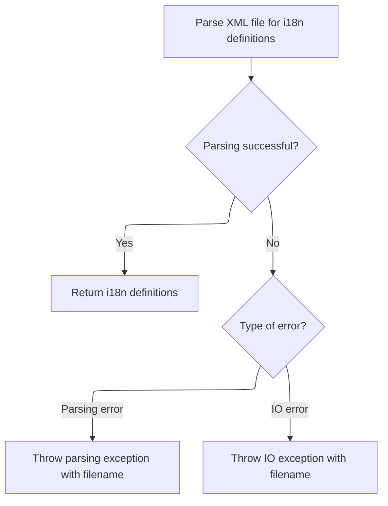
```mermaid
%%{init: {"flowchart": {"defaultRenderer": "elk"}} }%%
flowchart TD
    node1["Parse XML file for i18n definitions"]
    click node1 openCode "tiles/src/main/java/org/apache/struts/tiles/xmlDefinition/I18nFactorySet.java:516:531"
    node1 --> node2{"Parsing successful?"}
    node2 -->|"Yes"| node3["Return i18n definitions"]
    click node3 openCode "tiles/src/main/java/org/apache/struts/tiles/xmlDefinition/I18nFactorySet.java:531:531"
    node2 -->|"No"| node4{"Type of error?"}
    node4 -->|"Parsing error"| node5["Throw parsing exception with filename"]
    click node5 openCode "tiles/src/main/java/org/apache/struts/tiles/xmlDefinition/I18nFactorySet.java:516:523"
    node4 -->|"IO error"| node6["Throw IO exception with filename"]
    click node6 openCode "tiles/src/main/java/org/apache/struts/tiles/xmlDefinition/I18nFactorySet.java:525:528"

classDef HeadingStyle fill:#777777,stroke:#333,stroke-width:2px;

%% Swimm:
%% %%{init: {"flowchart": {"defaultRenderer": "elk"}} }%%
%% flowchart TD
%%     node1["Parse XML file for i18n definitions"]
%%     click node1 openCode "<SwmPath>[tiles/…/xmlDefinition/I18nFactorySet.java](tiles/src/main/java/org/apache/struts/tiles/xmlDefinition/I18nFactorySet.java)</SwmPath>:516:531"
%%     node1 --> node2{"Parsing successful?"}
%%     node2 -->|"Yes"| node3["Return i18n definitions"]
%%     click node3 openCode "<SwmPath>[tiles/…/xmlDefinition/I18nFactorySet.java](tiles/src/main/java/org/apache/struts/tiles/xmlDefinition/I18nFactorySet.java)</SwmPath>:531:531"
%%     node2 -->|"No"| node4{"Type of error?"}
%%     node4 -->|"Parsing error"| node5["Throw parsing exception with filename"]
%%     click node5 openCode "<SwmPath>[tiles/…/xmlDefinition/I18nFactorySet.java](tiles/src/main/java/org/apache/struts/tiles/xmlDefinition/I18nFactorySet.java)</SwmPath>:516:523"
%%     node4 -->|"IO error"| node6["Throw IO exception with filename"]
%%     click node6 openCode "<SwmPath>[tiles/…/xmlDefinition/I18nFactorySet.java](tiles/src/main/java/org/apache/struts/tiles/xmlDefinition/I18nFactorySet.java)</SwmPath>:525:528"
%% 
%% classDef HeadingStyle fill:#777777,stroke:#333,stroke-width:2px;
```

<SwmSnippet path="/tiles/src/main/java/org/apache/struts/tiles/xmlDefinition/I18nFactorySet.java" line="516">

---

Back in <SwmToken path="tiles/src/main/java/org/apache/struts/tiles/xmlDefinition/I18nFactorySet.java" pos="449:5:5" line-data="            xmlDefinitions = parseXmlFile(servletContext, filename, xmlDefinitions);">`parseXmlFile`</SwmToken>, after parsing with <SwmToken path="tiles/src/main/java/org/apache/struts/tiles/xmlDefinition/I18nFactorySet.java" pos="505:7:7" line-data="                xmlParser = new XmlParser();">`XmlParser`</SwmToken>, we catch SAX and IO exceptions, log them, and throw a <SwmToken path="tiles/src/main/java/org/apache/struts/tiles/xmlDefinition/I18nFactorySet.java" pos="521:5:5" line-data="            throw new DefinitionsFactoryException(">`DefinitionsFactoryException`</SwmToken> if parsing fails. Otherwise, we return the parsed definitions.

```java
        } catch (SAXException ex) {
            if (log.isDebugEnabled()) {
                log.debug("Error while parsing file '" + filename + "'.");
                ex.printStackTrace();
            }
            throw new DefinitionsFactoryException(
                "Error while parsing file '" + filename + "'. " + ex.getMessage(),
                ex);

        } catch (IOException ex) {
            throw new DefinitionsFactoryException(
                "IO Error while parsing file '" + filename + "'. " + ex.getMessage(),
                ex);
        }

        return xmlDefinitions;
    }
```

---

</SwmSnippet>

## Resolving Inheritance in Parsed Definitions

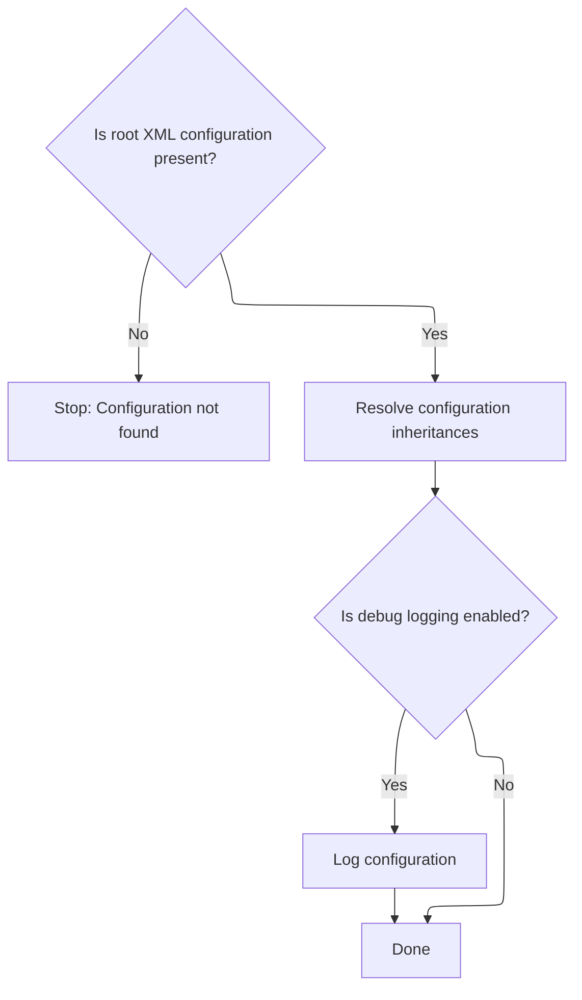
```mermaid
%%{init: {"flowchart": {"defaultRenderer": "elk"}} }%%
flowchart TD
  node1{"Is root XML configuration present?"}
  click node1 openCode "tiles/src/main/java/org/apache/struts/tiles/xmlDefinition/I18nFactorySet.java:267:268"
  node1 -->|"No"| node2["Stop: Configuration not found"]
  click node2 openCode "tiles/src/main/java/org/apache/struts/tiles/xmlDefinition/I18nFactorySet.java:268:269"
  node1 -->|"Yes"| node3["Resolve configuration inheritances"]
  click node3 openCode "tiles/src/main/java/org/apache/struts/tiles/xmlDefinition/I18nFactorySet.java:271:271"
  node3 --> node4{"Is debug logging enabled?"}
  click node4 openCode "tiles/src/main/java/org/apache/struts/tiles/xmlDefinition/I18nFactorySet.java:273:273"
  node4 -->|"Yes"| node5["Log configuration"]
  click node5 openCode "tiles/src/main/java/org/apache/struts/tiles/xmlDefinition/I18nFactorySet.java:274:275"
  node4 -->|"No"| node6["Done"]
  click node6 openCode "tiles/src/main/java/org/apache/struts/tiles/xmlDefinition/I18nFactorySet.java:275:275"
  node5 --> node6
classDef HeadingStyle fill:#777777,stroke:#333,stroke-width:2px;

%% Swimm:
%% %%{init: {"flowchart": {"defaultRenderer": "elk"}} }%%
%% flowchart TD
%%   node1{"Is root XML configuration present?"}
%%   click node1 openCode "<SwmPath>[tiles/…/xmlDefinition/I18nFactorySet.java](tiles/src/main/java/org/apache/struts/tiles/xmlDefinition/I18nFactorySet.java)</SwmPath>:267:268"
%%   node1 -->|"No"| node2["Stop: Configuration not found"]
%%   click node2 openCode "<SwmPath>[tiles/…/xmlDefinition/I18nFactorySet.java](tiles/src/main/java/org/apache/struts/tiles/xmlDefinition/I18nFactorySet.java)</SwmPath>:268:269"
%%   node1 -->|"Yes"| node3["Resolve configuration inheritances"]
%%   click node3 openCode "<SwmPath>[tiles/…/xmlDefinition/I18nFactorySet.java](tiles/src/main/java/org/apache/struts/tiles/xmlDefinition/I18nFactorySet.java)</SwmPath>:271:271"
%%   node3 --> node4{"Is debug logging enabled?"}
%%   click node4 openCode "<SwmPath>[tiles/…/xmlDefinition/I18nFactorySet.java](tiles/src/main/java/org/apache/struts/tiles/xmlDefinition/I18nFactorySet.java)</SwmPath>:273:273"
%%   node4 -->|"Yes"| node5["Log configuration"]
%%   click node5 openCode "<SwmPath>[tiles/…/xmlDefinition/I18nFactorySet.java](tiles/src/main/java/org/apache/struts/tiles/xmlDefinition/I18nFactorySet.java)</SwmPath>:274:275"
%%   node4 -->|"No"| node6["Done"]
%%   click node6 openCode "<SwmPath>[tiles/…/xmlDefinition/I18nFactorySet.java](tiles/src/main/java/org/apache/struts/tiles/xmlDefinition/I18nFactorySet.java)</SwmPath>:275:275"
%%   node5 --> node6
%% classDef HeadingStyle fill:#777777,stroke:#333,stroke-width:2px;
```

<SwmSnippet path="/tiles/src/main/java/org/apache/struts/tiles/xmlDefinition/I18nFactorySet.java" line="267">

---

Back in <SwmToken path="tiles/src/main/java/org/apache/struts/tiles/xmlDefinition/I18nFactorySet.java" pos="241:5:5" line-data="        defaultFactory = createDefaultFactory(servletContext);">`createDefaultFactory`</SwmToken>, after parsing XML files, we check for null, resolve inheritances in the definitions, and log the result. This sets up parent-child relationships for the definitions.

```java
        if (rootXmlConfig == null) {
            throw new FileNotFoundException();
        }

        rootXmlConfig.resolveInheritances();

        if (log.isDebugEnabled()) {
            log.debug(rootXmlConfig);
        }

```

---

</SwmSnippet>

## Walking and Resolving Definition Inheritance

<SwmSnippet path="/tiles/src/main/java/org/apache/struts/tiles/xmlDefinition/XmlDefinitionsSet.java" line="75">

---

<SwmToken path="tiles/src/main/java/org/apache/struts/tiles/xmlDefinition/XmlDefinitionsSet.java" pos="75:5:5" line-data="  public void resolveInheritances() throws NoSuchDefinitionException">`resolveInheritances`</SwmToken> loops through all definitions and calls <SwmToken path="tiles/src/main/java/org/apache/struts/tiles/xmlDefinition/XmlDefinitionsSet.java" pos="82:3:3" line-data="      definition.resolveInheritance( this );">`resolveInheritance`</SwmToken> on each. This makes sure parent-child relationships are set up, and avoids recursion by marking visited definitions.

```java
  public void resolveInheritances() throws NoSuchDefinitionException
    {
      // Walk through all definitions and resolve individual inheritance
    Iterator i = definitions.values().iterator();
    while( i.hasNext() )
      {
      XmlDefinition definition = (XmlDefinition)i.next();
      definition.resolveInheritance( this );
      }  // end loop
    }
```

---

</SwmSnippet>

## Resolving Parent Attributes for Definitions

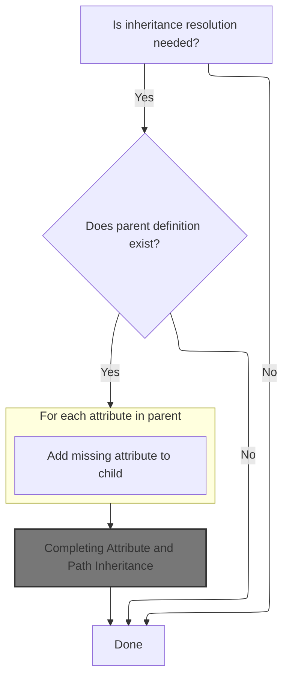
```mermaid
%%{init: {"flowchart": {"defaultRenderer": "elk"}} }%%
flowchart TD
  node1["Is inheritance resolution needed?"]
  click node1 openCode "tiles/src/main/java/org/apache/struts/tiles/xmlDefinition/XmlDefinition.java:119:120"
  node1 -->|"Yes"| node2{"Does parent definition exist?"}
  click node2 openCode "tiles/src/main/java/org/apache/struts/tiles/xmlDefinition/XmlDefinition.java:130:140"
  node1 -->|"No"| node5["Done"]
  click node5 openCode "tiles/src/main/java/org/apache/struts/tiles/xmlDefinition/XmlDefinition.java:120:120"
  node2 -->|"Yes"| loop1
  node2 -->|"No"| node5
  subgraph loop1["For each attribute in parent"]
    node3["Add missing attribute to child"]
    click node3 openCode "tiles/src/main/java/org/apache/struts/tiles/xmlDefinition/XmlDefinition.java:146:151"
  end
  loop1 --> node4["Completing Attribute and Path Inheritance"]
  
  node4 --> node5
classDef HeadingStyle fill:#777777,stroke:#333,stroke-width:2px;
click node4 goToHeading "Completing Attribute and Path Inheritance"
node4:::HeadingStyle

%% Swimm:
%% %%{init: {"flowchart": {"defaultRenderer": "elk"}} }%%
%% flowchart TD
%%   node1["Is inheritance resolution needed?"]
%%   click node1 openCode "<SwmPath>[tiles/…/xmlDefinition/XmlDefinition.java](tiles/src/main/java/org/apache/struts/tiles/xmlDefinition/XmlDefinition.java)</SwmPath>:119:120"
%%   node1 -->|"Yes"| node2{"Does parent definition exist?"}
%%   click node2 openCode "<SwmPath>[tiles/…/xmlDefinition/XmlDefinition.java](tiles/src/main/java/org/apache/struts/tiles/xmlDefinition/XmlDefinition.java)</SwmPath>:130:140"
%%   node1 -->|"No"| node5["Done"]
%%   click node5 openCode "<SwmPath>[tiles/…/xmlDefinition/XmlDefinition.java](tiles/src/main/java/org/apache/struts/tiles/xmlDefinition/XmlDefinition.java)</SwmPath>:120:120"
%%   node2 -->|"Yes"| loop1
%%   node2 -->|"No"| node5
%%   subgraph loop1["For each attribute in parent"]
%%     node3["Add missing attribute to child"]
%%     click node3 openCode "<SwmPath>[tiles/…/xmlDefinition/XmlDefinition.java](tiles/src/main/java/org/apache/struts/tiles/xmlDefinition/XmlDefinition.java)</SwmPath>:146:151"
%%   end
%%   loop1 --> node4["Completing Attribute and Path Inheritance"]
%%   
%%   node4 --> node5
%% classDef HeadingStyle fill:#777777,stroke:#333,stroke-width:2px;
%% click node4 goToHeading "Completing Attribute and Path Inheritance"
%% node4:::HeadingStyle
```

<SwmSnippet path="/tiles/src/main/java/org/apache/struts/tiles/xmlDefinition/XmlDefinition.java" line="115">

---

In <SwmToken path="tiles/src/main/java/org/apache/struts/tiles/xmlDefinition/XmlDefinition.java" pos="115:5:5" line-data="  public void resolveInheritance( XmlDefinitionsSet definitionsSet )">`resolveInheritance`</SwmToken>, we check if the definition needs extending, mark it as visited, resolve the parent first, and then iterate over parent attributes. We call MessagesMap.keySet to get the attribute keys for merging.

```java
  public void resolveInheritance( XmlDefinitionsSet definitionsSet )
    throws NoSuchDefinitionException
    {
      // Already done, or not needed ?
    if( isVisited || !isExtending() )
      return;

    if(log.isDebugEnabled())
      log.debug( "Resolve definition for child name='" + getName()
              + "' extends='" + getExtends() + "'.");

      // Set as visited to avoid endless recurisvity.
    setIsVisited( true );

      // Resolve parent before itself.
    XmlDefinition parent = definitionsSet.getDefinition( getExtends() );
    if( parent == null )
      { // error
      String msg = "Error while resolving definition inheritance: child '"
                           + getName() +    "' can't find its ancestor '"
                           + getExtends() +
                           "'. Please check your description file.";
      log.error( msg );
        // to do : find better exception
      throw new NoSuchDefinitionException( msg );
      }

    parent.resolveInheritance( definitionsSet );

      // Iterate on each parent's attribute and add it if not defined in child.
    Iterator parentAttributes = parent.getAttributes().keySet().iterator();
```

---

</SwmSnippet>

<SwmSnippet path="/faces/src/main/java/org/apache/struts/faces/util/MessagesMap.java" line="211">

---

<SwmToken path="faces/src/main/java/org/apache/struts/faces/util/MessagesMap.java" pos="211:5:5" line-data="    public Set keySet() {">`keySet`</SwmToken> in <SwmToken path="faces/src/main/java/org/apache/struts/faces/util/MessagesMap.java" pos="41:4:4" line-data="public class MessagesMap implements Map {">`MessagesMap`</SwmToken> just throws <SwmToken path="faces/src/main/java/org/apache/struts/faces/util/MessagesMap.java" pos="213:5:5" line-data="        throw new UnsupportedOperationException();">`UnsupportedOperationException`</SwmToken>, so you can't get the keys from this map. It's a stub for unsupported operations.

```java
    public Set keySet() {

        throw new UnsupportedOperationException();

    }
```

---

</SwmSnippet>

<SwmSnippet path="/tiles/src/main/java/org/apache/struts/tiles/xmlDefinition/XmlDefinition.java" line="146">

---

Back in <SwmToken path="tiles/src/main/java/org/apache/struts/tiles/xmlDefinition/XmlDefinitionsSet.java" pos="82:3:3" line-data="      definition.resolveInheritance( this );">`resolveInheritance`</SwmToken>, after calling MessagesMap.keySet, we loop through parent attribute keys and add any missing ones to the child definition. If <SwmToken path="tiles/src/main/java/org/apache/struts/tiles/xmlDefinition/XmlDefinition.java" pos="145:13:13" line-data="    Iterator parentAttributes = parent.getAttributes().keySet().iterator();">`keySet`</SwmToken> isn't supported, merging won't happen for that map.

```java
    while( parentAttributes.hasNext() )
      {
      String name = (String)parentAttributes.next();
      if( !getAttributes().containsKey(name) )
        putAttribute( name, parent.getAttribute(name) );
      }
```

---

</SwmSnippet>

### Checking for Message Presence in Resources

<SwmSnippet path="/faces/src/main/java/org/apache/struts/faces/util/MessagesMap.java" line="107">

---

<SwmToken path="faces/src/main/java/org/apache/struts/faces/util/MessagesMap.java" pos="107:5:5" line-data="    public boolean containsKey(Object key) {">`containsKey`</SwmToken> checks if the key is null, then calls <SwmToken path="faces/src/main/java/org/apache/struts/faces/util/MessagesMap.java" pos="112:6:6" line-data="            return (messages.isPresent(locale, key.toString()));">`isPresent`</SwmToken> on the message resources to see if the message exists for the locale and key.

```java
    public boolean containsKey(Object key) {

        if (key == null) {
            return (false);
        } else {
            return (messages.isPresent(locale, key.toString()));
        }

    }
```

---

</SwmSnippet>

<SwmSnippet path="/core/src/main/java/org/apache/struts/util/MessageResources.java" line="397">

---

<SwmToken path="core/src/main/java/org/apache/struts/util/MessageResources.java" pos="397:5:5" line-data="    public boolean isPresent(Locale locale, String key) {">`isPresent`</SwmToken> gets the message for the locale and key, returns false if it's null or marked with '???', otherwise true. This lets us spot missing messages using a repository-specific marker.

```java
    public boolean isPresent(Locale locale, String key) {
        String message = getMessage(locale, key);

        if (message == null) {
            return false;
        } else if (message.startsWith("???") && message.endsWith("???")) {
            return false; // FIXME - Only valid for default implementation
        } else {
            return true;
        }
    }
```

---

</SwmSnippet>

### Completing Attribute and Path Inheritance

<SwmSnippet path="/tiles/src/main/java/org/apache/struts/tiles/xmlDefinition/XmlDefinition.java" line="152">

---

Back in <SwmToken path="tiles/src/main/java/org/apache/struts/tiles/xmlDefinition/XmlDefinitionsSet.java" pos="82:3:3" line-data="      definition.resolveInheritance( this );">`resolveInheritance`</SwmToken>, after checking for attribute presence, we set path and role from the parent if they're missing in the child. Next, we call ActionRedirect to handle path logic.

```java
      // Set path and role if not setted
    if( path == null )
      setPath( parent.getPath() );
```

---

</SwmSnippet>

### Resolving Redirect Paths for Actions

See <SwmLink doc-title="Constructing Redirect URLs">[Constructing Redirect URLs](/.swm/constructing-redirect-urls.1njd11af.sw.md)</SwmLink>

### Finalizing Controller and Role Inheritance

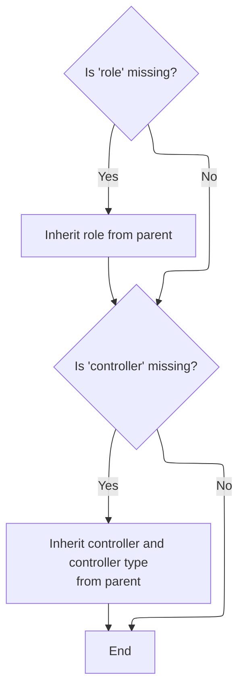
```mermaid
%%{init: {"flowchart": {"defaultRenderer": "elk"}} }%%
flowchart TD
  node1{"Is 'role' missing?"}
  click node1 openCode "tiles/src/main/java/org/apache/struts/tiles/xmlDefinition/XmlDefinition.java:155:156"
  node1 -->|"Yes"| node2["Inherit role from parent"]
  click node2 openCode "tiles/src/main/java/org/apache/struts/tiles/xmlDefinition/XmlDefinition.java:156:156"
  node1 -->|"No"| node3
  node2 --> node3
  node3{"Is 'controller' missing?"}
  click node3 openCode "tiles/src/main/java/org/apache/struts/tiles/xmlDefinition/XmlDefinition.java:157:161"
  node3 -->|"Yes"| node4["Inherit controller and controller type
from parent"]
  click node4 openCode "tiles/src/main/java/org/apache/struts/tiles/xmlDefinition/XmlDefinition.java:159:160"
  node3 -->|"No"| node5["End"]
  click node5 openCode "tiles/src/main/java/org/apache/struts/tiles/xmlDefinition/XmlDefinition.java:162:162"
  node4 --> node5
classDef HeadingStyle fill:#777777,stroke:#333,stroke-width:2px;

%% Swimm:
%% %%{init: {"flowchart": {"defaultRenderer": "elk"}} }%%
%% flowchart TD
%%   node1{"Is 'role' missing?"}
%%   click node1 openCode "<SwmPath>[tiles/…/xmlDefinition/XmlDefinition.java](tiles/src/main/java/org/apache/struts/tiles/xmlDefinition/XmlDefinition.java)</SwmPath>:155:156"
%%   node1 -->|"Yes"| node2["Inherit role from parent"]
%%   click node2 openCode "<SwmPath>[tiles/…/xmlDefinition/XmlDefinition.java](tiles/src/main/java/org/apache/struts/tiles/xmlDefinition/XmlDefinition.java)</SwmPath>:156:156"
%%   node1 -->|"No"| node3
%%   node2 --> node3
%%   node3{"Is 'controller' missing?"}
%%   click node3 openCode "<SwmPath>[tiles/…/xmlDefinition/XmlDefinition.java](tiles/src/main/java/org/apache/struts/tiles/xmlDefinition/XmlDefinition.java)</SwmPath>:157:161"
%%   node3 -->|"Yes"| node4["Inherit controller and controller type
%% from parent"]
%%   click node4 openCode "<SwmPath>[tiles/…/xmlDefinition/XmlDefinition.java](tiles/src/main/java/org/apache/struts/tiles/xmlDefinition/XmlDefinition.java)</SwmPath>:159:160"
%%   node3 -->|"No"| node5["End"]
%%   click node5 openCode "<SwmPath>[tiles/…/xmlDefinition/XmlDefinition.java](tiles/src/main/java/org/apache/struts/tiles/xmlDefinition/XmlDefinition.java)</SwmPath>:162:162"
%%   node4 --> node5
%% classDef HeadingStyle fill:#777777,stroke:#333,stroke-width:2px;
```

<SwmSnippet path="/tiles/src/main/java/org/apache/struts/tiles/xmlDefinition/XmlDefinition.java" line="155">

---

Back in <SwmToken path="tiles/src/main/java/org/apache/struts/tiles/xmlDefinition/XmlDefinitionsSet.java" pos="82:3:3" line-data="      definition.resolveInheritance( this );">`resolveInheritance`</SwmToken>, after handling path and role, we set controller and <SwmToken path="tiles/src/main/java/org/apache/struts/tiles/xmlDefinition/XmlDefinition.java" pos="189:1:1" line-data="      controllerType =  child.getControllerType();">`controllerType`</SwmToken> from the parent if they're missing in the child. This wraps up the inheritance setup for the definition.

```java
    if( role == null )
      setRole( parent.getRole() );
    if( controller==null )
      {
      setController( parent.getController());
      setControllerType( parent.getControllerType());
      }
    }
```

---

</SwmSnippet>

## Instantiating the Definitions Factory

<SwmSnippet path="/tiles/src/main/java/org/apache/struts/tiles/xmlDefinition/I18nFactorySet.java" line="277">

---

Finally, after returning from XmlDefinitionsSet.resolveInheritances, we instantiate the <SwmToken path="tiles/src/main/java/org/apache/struts/tiles/xmlDefinition/I18nFactorySet.java" pos="277:1:1" line-data="        DefinitionsFactory factory = new DefinitionsFactory(rootXmlConfig);">`DefinitionsFactory`</SwmToken> using the fully resolved configuration. The debug log outputs the factory for inspection, and then we return it so other parts of the app can use the completed definitions.

```java
        DefinitionsFactory factory = new DefinitionsFactory(rootXmlConfig);
        if (log.isDebugEnabled()) {
            log.debug("factory loaded : " + factory);
        }

        return factory;
    }
```

---

</SwmSnippet>

&nbsp;

*This is an auto-generated document by Swimm 🌊 and has not yet been verified by a human*

<SwmMeta version="3.0.0" repo-id="Z2l0aHViJTNBJTNBc3RydXRzMSUzQSUzQVN3aW1tLURlbW8=" repo-name="struts1"><sup>Powered by [Swimm](https://app.swimm.io/)</sup></SwmMeta>
