```mermaid
%%{init: {"flowchart": {"defaultRenderer": "elk"}} }%%
flowchart TD
    node1["Start JavaScript generation"] --> node2{"Are validator resources available?"}
    click node1 openCode "taglib/src/main/java/org/apache/struts/taglib/html/JavascriptValidatorTag.java:364:367"
    node2 -->|"No"| node3["Show error: Validation resources missing"]
    click node2 openCode "taglib/src/main/java/org/apache/struts/taglib/html/JavascriptValidatorTag.java:373:377"
    click node3 openCode "taglib/src/main/java/org/apache/struts/taglib/html/JavascriptValidatorTag.java:373:377"
    node2 -->|"Yes"| node4{"dynamicJavascript = true?"}
    click node4 openCode "taglib/src/main/java/org/apache/struts/taglib/html/JavascriptValidatorTag.java:383:392"
    node4 -->|"Yes"| node5{"Is form definition found?"}
    click node5 openCode "taglib/src/main/java/org/apache/struts/taglib/html/JavascriptValidatorTag.java:384:391"
    node5 -->|"No"| node6["Show error: Form definition missing"]
    click node6 openCode "taglib/src/main/java/org/apache/struts/taglib/html/JavascriptValidatorTag.java:385:391"
    node5 -->|"Yes"| node7["Generate dynamic JavaScript for form"]
    click node7 openCode "taglib/src/main/java/org/apache/struts/taglib/html/JavascriptValidatorTag.java:396:397"
    node4 -->|"No"| node8{"staticJavascript = true?"}
    click node8 openCode "taglib/src/main/java/org/apache/struts/taglib/html/JavascriptValidatorTag.java:398:404"
    node8 -->|"Yes"| node9["Start static JavaScript block"]
    click node9 openCode "taglib/src/main/java/org/apache/struts/taglib/html/JavascriptValidatorTag.java:399:400"
    node9 --> node10{"htmlComment = true?"}
    click node10 openCode "taglib/src/main/java/org/apache/struts/taglib/html/JavascriptValidatorTag.java:401:403"
    node10 -->|"Yes"| node11["Add HTML comment"]
    click node11 openCode "taglib/src/main/java/org/apache/struts/taglib/html/JavascriptValidatorTag.java:402:403"
    node10 -->|"No"| node12["Skip HTML comment"]
    click node12 openCode "taglib/src/main/java/org/apache/struts/taglib/html/JavascriptValidatorTag.java:404:404"
    node7 --> node13["Append JavaScript end block"]
    click node13 openCode "taglib/src/main/java/org/apache/struts/taglib/html/JavascriptValidatorTag.java:414:415"
    node11 --> node13
    node12 --> node13
    node13 --> node14["Return generated JavaScript"]
    click node14 openCode "taglib/src/main/java/org/apache/struts/taglib/html/JavascriptValidatorTag.java:417:418"

classDef HeadingStyle fill:#777777,stroke:#333,stroke-width:2px;

%% Swimm:
%% %%{init: {"flowchart": {"defaultRenderer": "elk"}} }%%
%% flowchart TD
%%     node1["Start <SwmToken path="taglib/src/main/java/org/apache/struts/taglib/html/JavascriptValidatorTag.java" pos="55:11:11" line-data=" * Custom tag that generates JavaScript for client side validation based on">`JavaScript`</SwmToken> generation"] --> node2{"Are validator resources available?"}
%%     click node1 openCode "<SwmPath>[taglib/…/html/JavascriptValidatorTag.java](taglib/src/main/java/org/apache/struts/taglib/html/JavascriptValidatorTag.java)</SwmPath>:364:367"
%%     node2 -->|"No"| node3["Show error: Validation resources missing"]
%%     click node2 openCode "<SwmPath>[taglib/…/html/JavascriptValidatorTag.java](taglib/src/main/java/org/apache/struts/taglib/html/JavascriptValidatorTag.java)</SwmPath>:373:377"
%%     click node3 openCode "<SwmPath>[taglib/…/html/JavascriptValidatorTag.java](taglib/src/main/java/org/apache/struts/taglib/html/JavascriptValidatorTag.java)</SwmPath>:373:377"
%%     node2 -->|"Yes"| node4{"<SwmToken path="taglib/src/main/java/org/apache/struts/taglib/html/JavascriptValidatorTag.java" pos="383:10:10" line-data="        if (&quot;true&quot;.equalsIgnoreCase(dynamicJavascript)) {">`dynamicJavascript`</SwmToken> = true?"}
%%     click node4 openCode "<SwmPath>[taglib/…/html/JavascriptValidatorTag.java](taglib/src/main/java/org/apache/struts/taglib/html/JavascriptValidatorTag.java)</SwmPath>:383:392"
%%     node4 -->|"Yes"| node5{"Is form definition found?"}
%%     click node5 openCode "<SwmPath>[taglib/…/html/JavascriptValidatorTag.java](taglib/src/main/java/org/apache/struts/taglib/html/JavascriptValidatorTag.java)</SwmPath>:384:391"
%%     node5 -->|"No"| node6["Show error: Form definition missing"]
%%     click node6 openCode "<SwmPath>[taglib/…/html/JavascriptValidatorTag.java](taglib/src/main/java/org/apache/struts/taglib/html/JavascriptValidatorTag.java)</SwmPath>:385:391"
%%     node5 -->|"Yes"| node7["Generate dynamic <SwmToken path="taglib/src/main/java/org/apache/struts/taglib/html/JavascriptValidatorTag.java" pos="55:11:11" line-data=" * Custom tag that generates JavaScript for client side validation based on">`JavaScript`</SwmToken> for form"]
%%     click node7 openCode "<SwmPath>[taglib/…/html/JavascriptValidatorTag.java](taglib/src/main/java/org/apache/struts/taglib/html/JavascriptValidatorTag.java)</SwmPath>:396:397"
%%     node4 -->|"No"| node8{"<SwmToken path="taglib/src/main/java/org/apache/struts/taglib/html/JavascriptValidatorTag.java" pos="398:14:14" line-data="            } else if (&quot;true&quot;.equalsIgnoreCase(staticJavascript)) {">`staticJavascript`</SwmToken> = true?"}
%%     click node8 openCode "<SwmPath>[taglib/…/html/JavascriptValidatorTag.java](taglib/src/main/java/org/apache/struts/taglib/html/JavascriptValidatorTag.java)</SwmPath>:398:404"
%%     node8 -->|"Yes"| node9["Start static <SwmToken path="taglib/src/main/java/org/apache/struts/taglib/html/JavascriptValidatorTag.java" pos="55:11:11" line-data=" * Custom tag that generates JavaScript for client side validation based on">`JavaScript`</SwmToken> block"]
%%     click node9 openCode "<SwmPath>[taglib/…/html/JavascriptValidatorTag.java](taglib/src/main/java/org/apache/struts/taglib/html/JavascriptValidatorTag.java)</SwmPath>:399:400"
%%     node9 --> node10{"<SwmToken path="taglib/src/main/java/org/apache/struts/taglib/html/JavascriptValidatorTag.java" pos="401:10:10" line-data="                if (&quot;true&quot;.equalsIgnoreCase(htmlComment)) {">`htmlComment`</SwmToken> = true?"}
%%     click node10 openCode "<SwmPath>[taglib/…/html/JavascriptValidatorTag.java](taglib/src/main/java/org/apache/struts/taglib/html/JavascriptValidatorTag.java)</SwmPath>:401:403"
%%     node10 -->|"Yes"| node11["Add HTML comment"]
%%     click node11 openCode "<SwmPath>[taglib/…/html/JavascriptValidatorTag.java](taglib/src/main/java/org/apache/struts/taglib/html/JavascriptValidatorTag.java)</SwmPath>:402:403"
%%     node10 -->|"No"| node12["Skip HTML comment"]
%%     click node12 openCode "<SwmPath>[taglib/…/html/JavascriptValidatorTag.java](taglib/src/main/java/org/apache/struts/taglib/html/JavascriptValidatorTag.java)</SwmPath>:404:404"
%%     node7 --> node13["Append <SwmToken path="taglib/src/main/java/org/apache/struts/taglib/html/JavascriptValidatorTag.java" pos="55:11:11" line-data=" * Custom tag that generates JavaScript for client side validation based on">`JavaScript`</SwmToken> end block"]
%%     click node13 openCode "<SwmPath>[taglib/…/html/JavascriptValidatorTag.java](taglib/src/main/java/org/apache/struts/taglib/html/JavascriptValidatorTag.java)</SwmPath>:414:415"
%%     node11 --> node13
%%     node12 --> node13
%%     node13 --> node14["Return generated <SwmToken path="taglib/src/main/java/org/apache/struts/taglib/html/JavascriptValidatorTag.java" pos="55:11:11" line-data=" * Custom tag that generates JavaScript for client side validation based on">`JavaScript`</SwmToken>"]
%%     click node14 openCode "<SwmPath>[taglib/…/html/JavascriptValidatorTag.java](taglib/src/main/java/org/apache/struts/taglib/html/JavascriptValidatorTag.java)</SwmPath>:417:418"
%% 
%% classDef HeadingStyle fill:#777777,stroke:#333,stroke-width:2px;
```

This document outlines the process of generating and injecting <SwmToken path="taglib/src/main/java/org/apache/struts/taglib/html/JavascriptValidatorTag.java" pos="55:11:11" line-data=" * Custom tag that generates JavaScript for client side validation based on">`JavaScript`</SwmToken> validation code into the HTML page to enable client-side form validation. The flow uses the current validation configuration to build the scripts and ensures they are included in the page output.

# Triggering <SwmToken path="taglib/src/main/java/org/apache/struts/taglib/html/JavascriptValidatorTag.java" pos="55:11:11" line-data=" * Custom tag that generates JavaScript for client side validation based on">`JavaScript`</SwmToken> Validation Output

<SwmSnippet path="/taglib/src/main/java/org/apache/struts/taglib/html/JavascriptValidatorTag.java" line="345">

---

DoStartTag kicks off the flow by writing the generated <SwmToken path="taglib/src/main/java/org/apache/struts/taglib/html/JavascriptValidatorTag.java" pos="55:11:11" line-data=" * Custom tag that generates JavaScript for client side validation based on">`JavaScript`</SwmToken> to the page output. It does this by calling <SwmToken path="taglib/src/main/java/org/apache/struts/taglib/html/JavascriptValidatorTag.java" pos="349:7:7" line-data="            writer.print(this.renderJavascript());">`renderJavascript`</SwmToken>, which builds the script based on the current validation setup. This is where the actual injection of validation code into the HTML happens, so <SwmToken path="taglib/src/main/java/org/apache/struts/taglib/html/JavascriptValidatorTag.java" pos="349:7:7" line-data="            writer.print(this.renderJavascript());">`renderJavascript`</SwmToken> needs to run here to make sure the page gets the right scripts.

```java
    public int doStartTag() throws JspException {
        JspWriter writer = pageContext.getOut();

        try {
            writer.print(this.renderJavascript());
        } catch (IOException e) {
            throw new JspException(e.getMessage(), e);
        }

        return EVAL_BODY_TAG;
    }
```

---

</SwmSnippet>

# Building the <SwmToken path="taglib/src/main/java/org/apache/struts/taglib/html/JavascriptValidatorTag.java" pos="55:11:11" line-data=" * Custom tag that generates JavaScript for client side validation based on">`JavaScript`</SwmToken> Validation Block



<SwmSnippet path="/taglib/src/main/java/org/apache/struts/taglib/html/JavascriptValidatorTag.java" line="362">

---

In <SwmToken path="taglib/src/main/java/org/apache/struts/taglib/html/JavascriptValidatorTag.java" pos="362:5:5" line-data="    protected String renderJavascript()">`renderJavascript`</SwmToken>, we grab the <SwmToken path="taglib/src/main/java/org/apache/struts/taglib/html/JavascriptValidatorTag.java" pos="368:1:1" line-data="        ValidatorResources resources =">`ValidatorResources`</SwmToken> for the current module and locale, then check if we need to generate dynamic or static <SwmToken path="taglib/src/main/java/org/apache/struts/taglib/html/JavascriptValidatorTag.java" pos="55:11:11" line-data=" * Custom tag that generates JavaScript for client side validation based on">`JavaScript`</SwmToken> based on the flags. If <SwmToken path="taglib/src/main/java/org/apache/struts/taglib/html/JavascriptValidatorTag.java" pos="383:10:10" line-data="        if (&quot;true&quot;.equalsIgnoreCase(dynamicJavascript)) {">`dynamicJavascript`</SwmToken> is enabled, we fetch the Form definition and, if found, call <SwmToken path="taglib/src/main/java/org/apache/struts/taglib/html/JavascriptValidatorTag.java" pos="396:7:7" line-data="                results.append(this.createDynamicJavascript(config, resources,">`createDynamicJavascript`</SwmToken> to build the validation functions for the form. This step is what actually wires up the client-side validation logic to the form fields.

```java
    protected String renderJavascript()
        throws JspException {
        StringBuffer results = new StringBuffer();

        ModuleConfig config =
            TagUtils.getInstance().getModuleConfig(pageContext);
        ValidatorResources resources =
            (ValidatorResources) pageContext.getAttribute(
              ValidatorPlugIn.VALIDATOR_KEY
                + config.getPrefix(), PageContext.APPLICATION_SCOPE);

        if (resources == null) {
            throw new JspException(
                "ValidatorResources not found in application scope under key \""
                + ValidatorPlugIn.VALIDATOR_KEY + config.getPrefix() + "\"");
        }

        Locale locale =
            TagUtils.getInstance().getUserLocale(this.pageContext, null);

        Form form = null;
        if ("true".equalsIgnoreCase(dynamicJavascript)) {
            form = resources.getForm(locale, formName);
            if (form == null) {
                throw new JspException("No form found under '" + formName
                    + "' in locale '" + locale
                    + "'.  A form must be defined in the "
                    + "Commons Validator configuration when "
                    + "dynamicJavascript=\"true\" is set.");
            }
        }

        if (form != null) {
            if ("true".equalsIgnoreCase(dynamicJavascript)) {
                results.append(this.createDynamicJavascript(config, resources,
                        locale, form));
            } else if ("true".equalsIgnoreCase(staticJavascript)) {
                results.append(this.renderStartElement());

                if ("true".equalsIgnoreCase(htmlComment)) {
                    results.append(HTML_BEGIN_COMMENT);
                }
            }
        }

```

---

</SwmSnippet>

<SwmSnippet path="/taglib/src/main/java/org/apache/struts/taglib/html/JavascriptValidatorTag.java" line="428">

---

CreateDynamicJavascript builds the <SwmToken path="taglib/src/main/java/org/apache/struts/taglib/html/JavascriptValidatorTag.java" pos="55:11:11" line-data=" * Custom tag that generates JavaScript for client side validation based on">`JavaScript`</SwmToken> validation functions for each <SwmToken path="taglib/src/main/java/org/apache/struts/taglib/html/JavascriptValidatorTag.java" pos="472:1:1" line-data="            ValidatorAction va = (ValidatorAction) i.next();">`ValidatorAction`</SwmToken> tied to the form. If the form name starts with '/', it resolves it to the actual form bean name using the action mapping. Then, for each action, it generates a JS function that loops through the form's fields, skips indexed fields and those not relevant for the action, and creates arrays and variable assignments for validation. It handles variable types (int, regexp, string, mask) so the JS matches the server-side config.

```java
    private String createDynamicJavascript(ModuleConfig config,
        ValidatorResources resources, Locale locale, Form form)
        throws JspException {
        StringBuffer results = new StringBuffer();

        MessageResources messages =
            TagUtils.getInstance().retrieveMessageResources(pageContext,
                bundle, true);

        HttpServletRequest request =
            (HttpServletRequest) pageContext.getRequest();
        ServletContext application = pageContext.getServletContext();

        List actions = this.createActionList(resources, form);

        final String methods =
            this.createMethods(actions, this.stopOnError(config));

        String formName = form.getName();

        jsFormName = formName;

        if (jsFormName.charAt(0) == '/') {
            String mappingName =
                TagUtils.getInstance().getActionMappingName(jsFormName);
            ActionMapping mapping =
                (ActionMapping) config.findActionConfig(mappingName);

            if (mapping == null) {
                JspException e =
                    new JspException(messages.getMessage("formTag.mapping",
                            mappingName));

                pageContext.setAttribute(Globals.EXCEPTION_KEY, e,
                    PageContext.REQUEST_SCOPE);
                throw e;
            }

            jsFormName = mapping.getAttribute();
        }

        results.append(this.getJavascriptBegin(methods));

        for (Iterator i = actions.iterator(); i.hasNext();) {
            ValidatorAction va = (ValidatorAction) i.next();
            int jscriptVar = 0;
            String functionName = null;

            if ((va.getJsFunctionName() != null)
                && (va.getJsFunctionName().length() > 0)) {
                functionName = va.getJsFunctionName();
            } else {
                functionName = va.getName();
            }

            results.append("    function " + jsFormName + "_" + functionName
                + " () { \n");

            for (Iterator x = form.getFields().iterator(); x.hasNext();) {
                Field field = (Field) x.next();

                // Skip indexed fields for now until there is a good way to
                // handle error messages (and the length of the list (could
                // retrieve from scope?))
                if (field.isIndexed() || (field.getPage() != page)
                    || !field.isDependency(va.getName())) {
                    continue;
                }

                String message =
                    Resources.getMessage(application, request, messages,
                        locale, va, field);

                message = (message != null) ? message : "";

                // prefix variable with 'a' to make it a legal identifier
                results.append("     this.a" + jscriptVar++ + " = new Array(\""
                    + field.getKey() + "\", \"" + escapeQuotes(message)
                    + "\", ");

                results.append("new Function (\"varName\", \"");

                Map vars = field.getVars();

                // Loop through the field's variables.
                Iterator varsIterator = vars.keySet().iterator();

                while (varsIterator.hasNext()) {
                    String varName = (String) varsIterator.next();
                    Var var = (Var) vars.get(varName);
                    String varValue =
                        Resources.getVarValue(var, application, request, false);
                    String jsType = var.getJsType();

                    // skip requiredif variables field, fieldIndexed, fieldTest,
                    // fieldValue
                    if (varName.startsWith("field")) {
                        continue;
                    }

                    String varValueEscaped = escapeJavascript(varValue);

                    if (Var.JSTYPE_INT.equalsIgnoreCase(jsType)) {
                        results.append("this." + varName + "="
                            + varValueEscaped + "; ");
                    } else if (Var.JSTYPE_REGEXP.equalsIgnoreCase(jsType)) {
                        results.append("this." + varName + "=/"
                            + varValueEscaped + "/; ");
                    } else if (Var.JSTYPE_STRING.equalsIgnoreCase(jsType)) {
                        results.append("this." + varName + "='"
                            + varValueEscaped + "'; ");

                        // So everyone using the latest format doesn't need to
                        // change their xml files immediately.
                    } else if ("mask".equalsIgnoreCase(varName)) {
                        results.append("this." + varName + "=/"
                            + varValueEscaped + "/; ");
                    } else {
                        results.append("this." + varName + "='"
                            + varValueEscaped + "'; ");
                    }
                }

                results.append(" return this[varName];\"));\n");
            }

            results.append("    } \n\n");
        }
```

---

</SwmSnippet>

<SwmSnippet path="/taglib/src/main/java/org/apache/struts/taglib/html/JavascriptValidatorTag.java" line="407">

---

Back in <SwmToken path="taglib/src/main/java/org/apache/struts/taglib/html/JavascriptValidatorTag.java" pos="349:7:7" line-data="            writer.print(this.renderJavascript());">`renderJavascript`</SwmToken>, after returning from <SwmToken path="taglib/src/main/java/org/apache/struts/taglib/html/JavascriptValidatorTag.java" pos="396:7:7" line-data="                results.append(this.createDynamicJavascript(config, resources,">`createDynamicJavascript`</SwmToken>, the function checks if <SwmToken path="taglib/src/main/java/org/apache/struts/taglib/html/JavascriptValidatorTag.java" pos="407:10:10" line-data="        if (&quot;true&quot;.equalsIgnoreCase(staticJavascript)) {">`staticJavascript`</SwmToken> is enabled and appends the static validation methods. If either dynamic or static <SwmToken path="taglib/src/main/java/org/apache/struts/taglib/html/JavascriptValidatorTag.java" pos="55:11:11" line-data=" * Custom tag that generates JavaScript for client side validation based on">`JavaScript`</SwmToken> was generated and a form exists, it adds the closing script tag. The final output depends on the combination of these flags, so the tag can output dynamic, static, or both types of validation code.

```java
        if ("true".equalsIgnoreCase(staticJavascript)) {
            results.append(getJavascriptStaticMethods(resources));
        }

        if ((form != null)
            && ("true".equalsIgnoreCase(dynamicJavascript)
            || "true".equalsIgnoreCase(staticJavascript))) {
            results.append(getJavascriptEnd());
        }

        return results.toString();
    }
```

---

</SwmSnippet>

&nbsp;

*This is an* <SwmToken path="taglib/src/main/java/org/apache/struts/taglib/html/JavascriptValidatorTag.java" pos="239:24:26" line-data="     * method name if it has a value.  This overrides the auto-generated">`auto-generated`</SwmToken> *document by Swimm 🌊 and has not yet been verified by a human*

<SwmMeta version="3.0.0" repo-id="Z2l0aHViJTNBJTNBc3RydXRzMSUzQSUzQVN3aW1tLURlbW8=" repo-name="struts1"><sup>Powered by [Swimm](https://app.swimm.io/)</sup></SwmMeta>
