This document explains how a collection is prepared and resolved for iteration in a web page. The flow enables dynamic iteration over collections, exposing elements one by one for processing within a tag body. Offset and length parameters allow for flexible selection of elements to render.

# Preparing and Resolving the Collection for Iteration

```mermaid
%%{init: {"flowchart": {"defaultRenderer": "elk"}} }%%
flowchart TD
    node1["Acquire collection to iterate (direct or lookup)"]
    click node1 openCode "taglib/src/main/java/org/apache/struts/taglib/logic/IterateTag.java:232:239"
    node1 --> node2{"Is collection found?"}
    click node2 openCode "taglib/src/main/java/org/apache/struts/taglib/logic/IterateTag.java:241:248"
    node2 -->|"No"| node3["Throw error: No collection found"]
    click node3 openCode "taglib/src/main/java/org/apache/struts/taglib/logic/IterateTag.java:242:248"
    node2 -->|"Yes"| node4{"Is collection type supported?"}
    click node4 openCode "taglib/src/main/java/org/apache/struts/taglib/logic/IterateTag.java:251:282"
    node4 -->|"Yes"| node5["Enable iteration over collection"]
    click node5 openCode "taglib/src/main/java/org/apache/struts/taglib/logic/IterateTag.java:251:282"
    node4 -->|"No"| node6["Throw error: Collection type not supported"]
    click node6 openCode "taglib/src/main/java/org/apache/struts/taglib/logic/IterateTag.java:276:282"
    node5 --> node7["Calculate offset and length (business variables: offset, length)"]
    click node7 openCode "taglib/src/main/java/org/apache/struts/taglib/logic/IterateTag.java:285:328"
    
    subgraph loop1["Skip elements up to offset (offset business variable)"]
      node7 --> node8{"More elements to skip?"}
      click node8 openCode "taglib/src/main/java/org/apache/struts/taglib/logic/IterateTag.java:333:337"
      node8 -->|"Yes"| node9["Skip element"]
      click node9 openCode "taglib/src/main/java/org/apache/struts/taglib/logic/IterateTag.java:334:336"
      node9 --> node8
      node8 -->|"No more elements to skip"| node10["Ready to expose first element"]
      click node10 openCode "taglib/src/main/java/org/apache/struts/taglib/logic/IterateTag.java:339:340"
    end
    node10 --> node11{"Are there elements left?"}
    click node11 openCode "taglib/src/main/java/org/apache/struts/taglib/logic/IterateTag.java:340:359"
    node11 -->|"Elements available"| node12{"Is element null?"}
    click node12 openCode "taglib/src/main/java/org/apache/struts/taglib/logic/IterateTag.java:343:347"
    node12 -->|"Element is null"| node13["Remove attribute (id)"]
    click node13 openCode "taglib/src/main/java/org/apache/struts/taglib/logic/IterateTag.java:344:345"
    node12 -->|"Element is not null"| node14["Expose element and index (id, indexId)"]
    click node14 openCode "taglib/src/main/java/org/apache/struts/taglib/logic/IterateTag.java:346:353"
    node13 --> node15["Return: Start iteration (EVAL_BODY_TAG)"]
    click node15 openCode "taglib/src/main/java/org/apache/struts/taglib/logic/IterateTag.java:356:357"
    node14 --> node15
    node11 -->|"No elements left"| node16["Return: Skip body (SKIP_BODY)"]
    click node16 openCode "taglib/src/main/java/org/apache/struts/taglib/logic/IterateTag.java:358:359"

classDef HeadingStyle fill:#777777,stroke:#333,stroke-width:2px;

%% Swimm:
%% %%{init: {"flowchart": {"defaultRenderer": "elk"}} }%%
%% flowchart TD
%%     node1["Acquire collection to iterate (direct or lookup)"]
%%     click node1 openCode "<SwmPath>[taglib/…/logic/IterateTag.java](taglib/src/main/java/org/apache/struts/taglib/logic/IterateTag.java)</SwmPath>:232:239"
%%     node1 --> node2{"Is collection found?"}
%%     click node2 openCode "<SwmPath>[taglib/…/logic/IterateTag.java](taglib/src/main/java/org/apache/struts/taglib/logic/IterateTag.java)</SwmPath>:241:248"
%%     node2 -->|"No"| node3["Throw error: No collection found"]
%%     click node3 openCode "<SwmPath>[taglib/…/logic/IterateTag.java](taglib/src/main/java/org/apache/struts/taglib/logic/IterateTag.java)</SwmPath>:242:248"
%%     node2 -->|"Yes"| node4{"Is collection type supported?"}
%%     click node4 openCode "<SwmPath>[taglib/…/logic/IterateTag.java](taglib/src/main/java/org/apache/struts/taglib/logic/IterateTag.java)</SwmPath>:251:282"
%%     node4 -->|"Yes"| node5["Enable iteration over collection"]
%%     click node5 openCode "<SwmPath>[taglib/…/logic/IterateTag.java](taglib/src/main/java/org/apache/struts/taglib/logic/IterateTag.java)</SwmPath>:251:282"
%%     node4 -->|"No"| node6["Throw error: Collection type not supported"]
%%     click node6 openCode "<SwmPath>[taglib/…/logic/IterateTag.java](taglib/src/main/java/org/apache/struts/taglib/logic/IterateTag.java)</SwmPath>:276:282"
%%     node5 --> node7["Calculate offset and length (business variables: offset, length)"]
%%     click node7 openCode "<SwmPath>[taglib/…/logic/IterateTag.java](taglib/src/main/java/org/apache/struts/taglib/logic/IterateTag.java)</SwmPath>:285:328"
%%     
%%     subgraph loop1["Skip elements up to offset (offset business variable)"]
%%       node7 --> node8{"More elements to skip?"}
%%       click node8 openCode "<SwmPath>[taglib/…/logic/IterateTag.java](taglib/src/main/java/org/apache/struts/taglib/logic/IterateTag.java)</SwmPath>:333:337"
%%       node8 -->|"Yes"| node9["Skip element"]
%%       click node9 openCode "<SwmPath>[taglib/…/logic/IterateTag.java](taglib/src/main/java/org/apache/struts/taglib/logic/IterateTag.java)</SwmPath>:334:336"
%%       node9 --> node8
%%       node8 -->|"No more elements to skip"| node10["Ready to expose first element"]
%%       click node10 openCode "<SwmPath>[taglib/…/logic/IterateTag.java](taglib/src/main/java/org/apache/struts/taglib/logic/IterateTag.java)</SwmPath>:339:340"
%%     end
%%     node10 --> node11{"Are there elements left?"}
%%     click node11 openCode "<SwmPath>[taglib/…/logic/IterateTag.java](taglib/src/main/java/org/apache/struts/taglib/logic/IterateTag.java)</SwmPath>:340:359"
%%     node11 -->|"Elements available"| node12{"Is element null?"}
%%     click node12 openCode "<SwmPath>[taglib/…/logic/IterateTag.java](taglib/src/main/java/org/apache/struts/taglib/logic/IterateTag.java)</SwmPath>:343:347"
%%     node12 -->|"Element is null"| node13["Remove attribute (id)"]
%%     click node13 openCode "<SwmPath>[taglib/…/logic/IterateTag.java](taglib/src/main/java/org/apache/struts/taglib/logic/IterateTag.java)</SwmPath>:344:345"
%%     node12 -->|"Element is not null"| node14["Expose element and index (id, <SwmToken path="taglib/src/main/java/org/apache/struts/taglib/logic/IterateTag.java" pos="352:4:4" line-data="            if (indexId != null) {">`indexId`</SwmToken>)"]
%%     click node14 openCode "<SwmPath>[taglib/…/logic/IterateTag.java](taglib/src/main/java/org/apache/struts/taglib/logic/IterateTag.java)</SwmPath>:346:353"
%%     node13 --> node15["Return: Start iteration (<SwmToken path="taglib/src/main/java/org/apache/struts/taglib/logic/IterateTag.java" pos="356:4:4" line-data="            return (EVAL_BODY_TAG);">`EVAL_BODY_TAG`</SwmToken>)"]
%%     click node15 openCode "<SwmPath>[taglib/…/logic/IterateTag.java](taglib/src/main/java/org/apache/struts/taglib/logic/IterateTag.java)</SwmPath>:356:357"
%%     node14 --> node15
%%     node11 -->|"No elements left"| node16["Return: Skip body (<SwmToken path="taglib/src/main/java/org/apache/struts/taglib/logic/IterateTag.java" pos="358:4:4" line-data="            return (SKIP_BODY);">`SKIP_BODY`</SwmToken>)"]
%%     click node16 openCode "<SwmPath>[taglib/…/logic/IterateTag.java](taglib/src/main/java/org/apache/struts/taglib/logic/IterateTag.java)</SwmPath>:358:359"
%% 
%% classDef HeadingStyle fill:#777777,stroke:#333,stroke-width:2px;
```



<SwmSnippet path="/taglib/src/main/java/org/apache/struts/taglib/logic/IterateTag.java" line="231">

---

In <SwmToken path="taglib/src/main/java/org/apache/struts/taglib/logic/IterateTag.java" pos="231:5:5" line-data="    public int doStartTag() throws JspException {">`doStartTag`</SwmToken>, we check if the collection is already set. If not, we call TagUtils.lookup to resolve it from the page context using the provided name, property, and scope. This lets the tag work with collections defined elsewhere, not just those passed directly.

```java
    public int doStartTag() throws JspException {
        // Acquire the collection we are going to iterate over
        Object collection = this.collection;

        if (collection == null) {
            collection =
                TagUtils.getInstance().lookup(pageContext, name, property,
                    scope);
        }

```

---

</SwmSnippet>

<SwmSnippet path="/taglib/src/main/java/org/apache/struts/taglib/TagUtils.java" line="897">

---

<SwmToken path="taglib/src/main/java/org/apache/struts/taglib/TagUtils.java" pos="897:5:5" line-data="    public Object lookup(PageContext pageContext, String name, String property,">`lookup`</SwmToken> handles resolving beans from the page context, optionally fetching a property if specified. It throws detailed exceptions if the bean or property can't be found, and uses <SwmToken path="taglib/src/main/java/org/apache/struts/taglib/TagUtils.java" pos="949:4:6" line-data="            if (Constants.BEAN_KEY.equals(name)) {">`Constants.BEAN_KEY`</SwmToken> to improve error messages when beans are referenced indirectly. The function assumes scope and property are valid, and wraps property access errors for clarity.

```java
    public Object lookup(PageContext pageContext, String name, String property,
        String scope) throws JspException {
        // Look up the requested bean, and return if requested
        Object bean = lookup(pageContext, name, scope);

        if (bean == null) {
            JspException e = null;

            if (scope == null) {
                e = new JspException(messages.getMessage("lookup.bean.any", name));
            } else {
                e = new JspException(messages.getMessage("lookup.bean", name,
                            scope));
            }

            saveException(pageContext, e);
            throw e;
        }

        if (property == null) {
            return bean;
        }

        // Locate and return the specified property
        try {
            return PropertyUtils.getProperty(bean, property);
        } catch (IllegalAccessException e) {
            saveException(pageContext, e);
            throw new JspException(messages.getMessage("lookup.access",
                    property, name), e);
        } catch (IllegalArgumentException e) {
            saveException(pageContext, e);
            throw new JspException(messages.getMessage("lookup.argument",
                    property, name), e);
        } catch (InvocationTargetException e) {
            Throwable t = e.getTargetException();

            if (t == null) {
                t = e;
            }

            saveException(pageContext, t);
            throw new JspException(messages.getMessage("lookup.target",
                    property, name), e);
        } catch (NoSuchMethodException e) {
            saveException(pageContext, e);

            String beanName = name;

            // Name defaults to Contants.BEAN_KEY if no name is specified by
            // an input tag. Thus lookup the bean under the key and use
            // its class name for the exception message.
            if (Constants.BEAN_KEY.equals(name)) {
                Object obj = pageContext.findAttribute(Constants.BEAN_KEY);

                if (obj != null) {
                    beanName = obj.getClass().getName();
                }
            }

            throw new JspException(messages.getMessage("lookup.method",
                    property, beanName), e);
        }
    }
```

---

</SwmSnippet>

<SwmSnippet path="/taglib/src/main/java/org/apache/struts/taglib/logic/IterateTag.java" line="241">

---

Back in `IterateTag.doStartTag`, after getting the collection (either directly or via <SwmToken path="taglib/src/main/java/org/apache/struts/taglib/logic/IterateTag.java" pos="246:1:1" line-data="            TagUtils.getInstance().saveException(pageContext, e);">`TagUtils`</SwmToken>), we check its type and create an iterator for it. The tag handles arrays (object and primitive), Collections, Iterators, Maps, and Enumerations, so it can work with pretty much any collection type you throw at it. If the collection is missing, we throw an exception.

```java
        if (collection == null) {
            JspException e =
                new JspException(messages.getMessage("iterate.collection", 
                		name, property));

            TagUtils.getInstance().saveException(pageContext, e);
            throw e;
        }

        // Construct an iterator for this collection
        if (collection.getClass().isArray()) {
            try {
                // If we're lucky, it is an array of objects
                // that we can iterate over with no copying
                iterator = Arrays.asList((Object[]) collection).iterator();
            } catch (ClassCastException e) {
                // Rats -- it is an array of primitives
                int length = Array.getLength(collection);
                ArrayList c = new ArrayList(length);

                for (int i = 0; i < length; i++) {
                    c.add(Array.get(collection, i));
                }
```

---

</SwmSnippet>

<SwmSnippet path="/taglib/src/main/java/org/apache/struts/taglib/logic/IterateTag.java" line="265">

---

After setting up the iterator for whatever collection type we got, we parse offset and length values (from strings or context attributes), defaulting to 0 if invalid. Then we skip elements up to the offset, so iteration starts where the user wants. This sets up the tag to only process the relevant slice of the collection.

```java
                iterator = c.iterator();
            }
        } else if (collection instanceof Collection) {
            iterator = ((Collection) collection).iterator();
        } else if (collection instanceof Iterator) {
            iterator = (Iterator) collection;
        } else if (collection instanceof Map) {
            iterator = ((Map) collection).entrySet().iterator();
        } else if (collection instanceof Enumeration) {
            iterator = new IteratorAdapter((Enumeration) collection);
        } else {
            JspException e =
                new JspException(messages.getMessage("iterate.iterator", name, 
                		property, collection.getClass().getName()));

            TagUtils.getInstance().saveException(pageContext, e);
            throw e;
        }

        // Calculate the starting offset
        if (offset == null) {
            offsetValue = 0;
        } else {
            try {
                offsetValue = Integer.parseInt(offset);
            } catch (NumberFormatException e) {
                Integer offsetObject =
                    (Integer) TagUtils.getInstance().lookup(pageContext,
                        offset, null);

                if (offsetObject == null) {
                    offsetValue = 0;
                } else {
                    offsetValue = offsetObject.intValue();
                }
            }
        }

        if (offsetValue < 0) {
            offsetValue = 0;
        }

        // Calculate the rendering length
        if (length == null) {
            lengthValue = 0;
        } else {
            try {
                lengthValue = Integer.parseInt(length);
            } catch (NumberFormatException e) {
                Integer lengthObject =
                    (Integer) TagUtils.getInstance().lookup(pageContext,
                        length, null);

                if (lengthObject == null) {
                    lengthValue = 0;
                } else {
                    lengthValue = lengthObject.intValue();
                }
            }
        }

        if (lengthValue < 0) {
            lengthValue = 0;
        }

        lengthCount = 0;

        // Skip the leading elements up to the starting offset
        for (int i = 0; i < offsetValue; i++) {
            if (iterator.hasNext()) {
                iterator.next();
            }
        }
```

---

</SwmSnippet>

<SwmSnippet path="/taglib/src/main/java/org/apache/struts/taglib/logic/IterateTag.java" line="339">

---

Finally, if there's another element after skipping the offset, we set it in the page context under 'id' (or remove it if null), set the index if needed, and return <SwmToken path="taglib/src/main/java/org/apache/struts/taglib/logic/IterateTag.java" pos="356:4:4" line-data="            return (EVAL_BODY_TAG);">`EVAL_BODY_TAG`</SwmToken> so the JSP processes the tag body. If there's nothing left to iterate, we return <SwmToken path="taglib/src/main/java/org/apache/struts/taglib/logic/IterateTag.java" pos="358:4:4" line-data="            return (SKIP_BODY);">`SKIP_BODY`</SwmToken> and skip rendering.

```java
        // Store the first value and evaluate, or skip the body if none
        if (iterator.hasNext()) {
            Object element = iterator.next();

            if (element == null) {
                pageContext.removeAttribute(id);
            } else {
                pageContext.setAttribute(id, element);
            }

            lengthCount++;
            started = true;

            if (indexId != null) {
                pageContext.setAttribute(indexId, new Integer(getIndex()));
            }

            return (EVAL_BODY_TAG);
        } else {
            return (SKIP_BODY);
        }
    }
```

---

</SwmSnippet>

&nbsp;

*This is an auto-generated document by Swimm 🌊 and has not yet been verified by a human*

<SwmMeta version="3.0.0" repo-id="Z2l0aHViJTNBJTNBc3RydXRzMSUzQSUzQVN3aW1tLURlbW8=" repo-name="struts1"><sup>Powered by [Swimm](https://app.swimm.io/)</sup></SwmMeta>
