This document describes how a collection is prepared for iteration in a web page. The flow supports different collection types, dynamic offset and length values, and ensures the correct element is made available for processing. This enables features like pagination and flexible data binding in templates.

# Iterating and Resolving the Collection

<SwmSnippet path="/taglib/src/main/java/org/apache/struts/taglib/logic/IterateTag.java" line="231">

---

In <SwmToken path="taglib/src/main/java/org/apache/struts/taglib/logic/IterateTag.java" pos="231:5:5" line-data="    public int doStartTag() throws JspException {">`doStartTag`</SwmToken>, we check if the collection is already set; if not, we resolve it using TagUtils.lookup. This lets us support both direct assignment and dynamic resolution from the page context, making the tag flexible for different use cases.

```java
    public int doStartTag() throws JspException {
        // Acquire the collection we are going to iterate over
        Object collection = this.collection;

        if (collection == null) {
            collection =
                TagUtils.getInstance().lookup(pageContext, name, property,
                    scope);
        }

```

---

</SwmSnippet>

<SwmSnippet path="/taglib/src/main/java/org/apache/struts/taglib/TagUtils.java" line="897">

---

<SwmToken path="taglib/src/main/java/org/apache/struts/taglib/TagUtils.java" pos="897:5:5" line-data="    public Object lookup(PageContext pageContext, String name, String property,">`lookup`</SwmToken> resolves a bean (and optionally a property) from the page context, handling scope, property access, and error reporting. It uses framework-specific conventions for bean keys and error messages, and wraps all failures in localized exceptions.

```java
    public Object lookup(PageContext pageContext, String name, String property,
        String scope) throws JspException {
        // Look up the requested bean, and return if requested
        Object bean = lookup(pageContext, name, scope);

        if (bean == null) {
            JspException e = null;

            if (scope == null) {
                e = new JspException(messages.getMessage("lookup.bean.any", name));
            } else {
                e = new JspException(messages.getMessage("lookup.bean", name,
                            scope));
            }

            saveException(pageContext, e);
            throw e;
        }

        if (property == null) {
            return bean;
        }

        // Locate and return the specified property
        try {
            return PropertyUtils.getProperty(bean, property);
        } catch (IllegalAccessException e) {
            saveException(pageContext, e);
            throw new JspException(messages.getMessage("lookup.access",
                    property, name), e);
        } catch (IllegalArgumentException e) {
            saveException(pageContext, e);
            throw new JspException(messages.getMessage("lookup.argument",
                    property, name), e);
        } catch (InvocationTargetException e) {
            Throwable t = e.getTargetException();

            if (t == null) {
                t = e;
            }

            saveException(pageContext, t);
            throw new JspException(messages.getMessage("lookup.target",
                    property, name), e);
        } catch (NoSuchMethodException e) {
            saveException(pageContext, e);

            String beanName = name;

            // Name defaults to Contants.BEAN_KEY if no name is specified by
            // an input tag. Thus lookup the bean under the key and use
            // its class name for the exception message.
            if (Constants.BEAN_KEY.equals(name)) {
                Object obj = pageContext.findAttribute(Constants.BEAN_KEY);

                if (obj != null) {
                    beanName = obj.getClass().getName();
                }
            }

            throw new JspException(messages.getMessage("lookup.method",
                    property, beanName), e);
        }
    }
```

---

</SwmSnippet>

<SwmSnippet path="/taglib/src/main/java/org/apache/struts/taglib/logic/IterateTag.java" line="241">

---

Back in IterateTag.doStartTag, if the collection is still null after trying TagUtils.lookup, we throw an exception and stop processing. If it's found, we move on to creating an iterator for the collection, handling arrays and collections differently.

```java
        if (collection == null) {
            JspException e =
                new JspException(messages.getMessage("iterate.collection", 
                		name, property));

            TagUtils.getInstance().saveException(pageContext, e);
            throw e;
        }

        // Construct an iterator for this collection
        if (collection.getClass().isArray()) {
            try {
                // If we're lucky, it is an array of objects
                // that we can iterate over with no copying
                iterator = Arrays.asList((Object[]) collection).iterator();
            } catch (ClassCastException e) {
                // Rats -- it is an array of primitives
                int length = Array.getLength(collection);
                ArrayList c = new ArrayList(length);

                for (int i = 0; i < length; i++) {
                    c.add(Array.get(collection, i));
                }
```

---

</SwmSnippet>

<SwmSnippet path="/taglib/src/main/java/org/apache/struts/taglib/logic/IterateTag.java" line="265">

---

Here, we handle different collection types, including Map. For Map, we try to iterate over its <SwmToken path="taglib/src/main/java/org/apache/struts/taglib/logic/IterateTag.java" pos="272:13:13" line-data="            iterator = ((Map) collection).entrySet().iterator();">`entrySet`</SwmToken>, which means we expect the collection to support <SwmToken path="taglib/src/main/java/org/apache/struts/taglib/logic/IterateTag.java" pos="272:13:15" line-data="            iterator = ((Map) collection).entrySet().iterator();">`entrySet()`</SwmToken>. If it's a <SwmToken path="faces/src/main/java/org/apache/struts/faces/util/MessagesMap.java" pos="41:4:4" line-data="public class MessagesMap implements Map {">`MessagesMap`</SwmToken>, this will throw, signaling that this type isn't supported for iteration.

```java
                iterator = c.iterator();
            }
        } else if (collection instanceof Collection) {
            iterator = ((Collection) collection).iterator();
        } else if (collection instanceof Iterator) {
            iterator = (Iterator) collection;
        } else if (collection instanceof Map) {
            iterator = ((Map) collection).entrySet().iterator();
```

---

</SwmSnippet>

<SwmSnippet path="/faces/src/main/java/org/apache/struts/faces/util/MessagesMap.java" line="133">

---

<SwmToken path="faces/src/main/java/org/apache/struts/faces/util/MessagesMap.java" pos="133:5:5" line-data="    public Set entrySet() {">`entrySet`</SwmToken> in <SwmToken path="faces/src/main/java/org/apache/struts/faces/util/MessagesMap.java" pos="41:4:4" line-data="public class MessagesMap implements Map {">`MessagesMap`</SwmToken> always throws <SwmToken path="faces/src/main/java/org/apache/struts/faces/util/MessagesMap.java" pos="135:5:5" line-data="        throw new UnsupportedOperationException();">`UnsupportedOperationException`</SwmToken>. This means you can't iterate over its entries, and any tag or code expecting to do so will fail here.

```java
    public Set entrySet() {

        throw new UnsupportedOperationException();

    }
```

---

</SwmSnippet>

<SwmSnippet path="/taglib/src/main/java/org/apache/struts/taglib/logic/IterateTag.java" line="273">

---

Back in IterateTag.doStartTag, after handling collection types, we resolve offset and length. If parsing fails, we use TagUtils.lookup to fetch them from the page context, so these values can be set dynamically, not just as literals.

```java
        } else if (collection instanceof Enumeration) {
            iterator = new IteratorAdapter((Enumeration) collection);
        } else {
            JspException e =
                new JspException(messages.getMessage("iterate.iterator", name, 
                		property, collection.getClass().getName()));

            TagUtils.getInstance().saveException(pageContext, e);
            throw e;
        }

        // Calculate the starting offset
        if (offset == null) {
            offsetValue = 0;
        } else {
            try {
                offsetValue = Integer.parseInt(offset);
            } catch (NumberFormatException e) {
                Integer offsetObject =
                    (Integer) TagUtils.getInstance().lookup(pageContext,
                        offset, null);

                if (offsetObject == null) {
                    offsetValue = 0;
                } else {
                    offsetValue = offsetObject.intValue();
                }
            }
        }

        if (offsetValue < 0) {
            offsetValue = 0;
        }

        // Calculate the rendering length
        if (length == null) {
            lengthValue = 0;
        } else {
            try {
                lengthValue = Integer.parseInt(length);
            } catch (NumberFormatException e) {
                Integer lengthObject =
                    (Integer) TagUtils.getInstance().lookup(pageContext,
                        length, null);

                if (lengthObject == null) {
                    lengthValue = 0;
                } else {
                    lengthValue = lengthObject.intValue();
                }
            }
        }

```

---

</SwmSnippet>

## Resolving Beans and Scope Handling

<SwmSnippet path="/taglib/src/main/java/org/apache/struts/taglib/TagUtils.java" line="863">

---

<SwmToken path="taglib/src/main/java/org/apache/struts/taglib/TagUtils.java" pos="863:5:5" line-data="    public Object lookup(PageContext pageContext, String name, String scopeName)">`lookup`</SwmToken> fetches an attribute from the page context, searching all scopes if <SwmToken path="taglib/src/main/java/org/apache/struts/taglib/TagUtils.java" pos="863:19:19" line-data="    public Object lookup(PageContext pageContext, String name, String scopeName)">`scopeName`</SwmToken> is null, or a specific scope if provided. If a scope is specified, we call <SwmToken path="taglib/src/main/java/org/apache/struts/taglib/TagUtils.java" pos="870:12:12" line-data="            return pageContext.getAttribute(name, instance.getScope(scopeName));">`getScope`</SwmToken> to resolve it to the right constant.

```java
    public Object lookup(PageContext pageContext, String name, String scopeName)
        throws JspException {
        if (scopeName == null) {
            return pageContext.findAttribute(name);
        }

        try {
            return pageContext.getAttribute(name, instance.getScope(scopeName));
        } catch (JspException e) {
            saveException(pageContext, e);
            throw e;
        }
    }
```

---

</SwmSnippet>

<SwmSnippet path="/taglib/src/main/java/org/apache/struts/taglib/TagUtils.java" line="809">

---

<SwmToken path="taglib/src/main/java/org/apache/struts/taglib/TagUtils.java" pos="809:5:5" line-data="    public int getScope(String scopeName)">`getScope`</SwmToken> converts the scope name to lowercase and looks it up in a map of scope constants. If not found, it throws a <SwmToken path="taglib/src/main/java/org/apache/struts/taglib/TagUtils.java" pos="810:3:3" line-data="        throws JspException {">`JspException`</SwmToken>. This enforces valid, case-insensitive scope names.

```java
    public int getScope(String scopeName)
        throws JspException {
        Integer scope = (Integer) scopes.get(scopeName.toLowerCase());

        if (scope == null) {
            throw new JspException(messages.getMessage("lookup.scope", scope));
        }

        return scope.intValue();
    }
```

---

</SwmSnippet>

## Offset, Length, and Iteration Start

```mermaid
%%{init: {"flowchart": {"defaultRenderer": "elk"}} }%%
flowchart TD
    node1["Start iteration setup"] --> node2{"Is lengthValue negative?"}
    click node1 openCode "taglib/src/main/java/org/apache/struts/taglib/logic/IterateTag.java:326:326"
    node2 -->|"Yes"| node3["Set lengthValue to 0"]
    click node2 openCode "taglib/src/main/java/org/apache/struts/taglib/logic/IterateTag.java:326:328"
    node2 -->|"No"| node4["Proceed"]
    click node3 openCode "taglib/src/main/java/org/apache/struts/taglib/logic/IterateTag.java:327:328"
    node3 --> node4
    node4 --> node5["Initialize lengthCount"]
    click node4 openCode "taglib/src/main/java/org/apache/struts/taglib/logic/IterateTag.java:330:331"
    click node5 openCode "taglib/src/main/java/org/apache/struts/taglib/logic/IterateTag.java:330:331"
    node5 --> node6["Skip elements up to offsetValue"]
    click node6 openCode "taglib/src/main/java/org/apache/struts/taglib/logic/IterateTag.java:333:337"
    subgraph loop1["For each element to skip (offsetValue)"]
        node6 --> node6
    end
    node6 --> node7{"Is there a next element after
skipping?"}
    click node7 openCode "taglib/src/main/java/org/apache/struts/taglib/logic/IterateTag.java:340:340"
    node7 -->|"Yes"| node8{"Is element null?"}
    click node8 openCode "taglib/src/main/java/org/apache/struts/taglib/logic/IterateTag.java:343:343"
    node8 -->|"Yes"| node9["Remove id from page context"]
    click node9 openCode "taglib/src/main/java/org/apache/struts/taglib/logic/IterateTag.java:344:344"
    node8 -->|"No"| node10["Store element in id"]
    click node10 openCode "taglib/src/main/java/org/apache/struts/taglib/logic/IterateTag.java:346:347"
    node10 --> node11{"Is indexId set?"}
    click node11 openCode "taglib/src/main/java/org/apache/struts/taglib/logic/IterateTag.java:352:352"
    node11 -->|"Yes"| node12["Store index in indexId"]
    click node12 openCode "taglib/src/main/java/org/apache/struts/taglib/logic/IterateTag.java:353:353"
    node11 -->|"No"| node13["Continue"]
    click node13 openCode "taglib/src/main/java/org/apache/struts/taglib/logic/IterateTag.java:354:354"
    node9 --> node14["Return: Process body"]
    click node14 openCode "taglib/src/main/java/org/apache/struts/taglib/logic/IterateTag.java:356:356"
    node12 --> node14
    node13 --> node14
    node7 -->|"No"| node15["Return: Skip body"]
    click node15 openCode "taglib/src/main/java/org/apache/struts/taglib/logic/IterateTag.java:358:359"

classDef HeadingStyle fill:#777777,stroke:#333,stroke-width:2px;

%% Swimm:
%% %%{init: {"flowchart": {"defaultRenderer": "elk"}} }%%
%% flowchart TD
%%     node1["Start iteration setup"] --> node2{"Is <SwmToken path="taglib/src/main/java/org/apache/struts/taglib/logic/IterateTag.java" pos="309:1:1" line-data="            lengthValue = 0;">`lengthValue`</SwmToken> negative?"}
%%     click node1 openCode "<SwmPath>[taglib/…/logic/IterateTag.java](taglib/src/main/java/org/apache/struts/taglib/logic/IterateTag.java)</SwmPath>:326:326"
%%     node2 -->|"Yes"| node3["Set <SwmToken path="taglib/src/main/java/org/apache/struts/taglib/logic/IterateTag.java" pos="309:1:1" line-data="            lengthValue = 0;">`lengthValue`</SwmToken> to 0"]
%%     click node2 openCode "<SwmPath>[taglib/…/logic/IterateTag.java](taglib/src/main/java/org/apache/struts/taglib/logic/IterateTag.java)</SwmPath>:326:328"
%%     node2 -->|"No"| node4["Proceed"]
%%     click node3 openCode "<SwmPath>[taglib/…/logic/IterateTag.java](taglib/src/main/java/org/apache/struts/taglib/logic/IterateTag.java)</SwmPath>:327:328"
%%     node3 --> node4
%%     node4 --> node5["Initialize <SwmToken path="taglib/src/main/java/org/apache/struts/taglib/logic/IterateTag.java" pos="330:1:1" line-data="        lengthCount = 0;">`lengthCount`</SwmToken>"]
%%     click node4 openCode "<SwmPath>[taglib/…/logic/IterateTag.java](taglib/src/main/java/org/apache/struts/taglib/logic/IterateTag.java)</SwmPath>:330:331"
%%     click node5 openCode "<SwmPath>[taglib/…/logic/IterateTag.java](taglib/src/main/java/org/apache/struts/taglib/logic/IterateTag.java)</SwmPath>:330:331"
%%     node5 --> node6["Skip elements up to <SwmToken path="taglib/src/main/java/org/apache/struts/taglib/logic/IterateTag.java" pos="286:1:1" line-data="            offsetValue = 0;">`offsetValue`</SwmToken>"]
%%     click node6 openCode "<SwmPath>[taglib/…/logic/IterateTag.java](taglib/src/main/java/org/apache/struts/taglib/logic/IterateTag.java)</SwmPath>:333:337"
%%     subgraph loop1["For each element to skip (<SwmToken path="taglib/src/main/java/org/apache/struts/taglib/logic/IterateTag.java" pos="286:1:1" line-data="            offsetValue = 0;">`offsetValue`</SwmToken>)"]
%%         node6 --> node6
%%     end
%%     node6 --> node7{"Is there a next element after
%% skipping?"}
%%     click node7 openCode "<SwmPath>[taglib/…/logic/IterateTag.java](taglib/src/main/java/org/apache/struts/taglib/logic/IterateTag.java)</SwmPath>:340:340"
%%     node7 -->|"Yes"| node8{"Is element null?"}
%%     click node8 openCode "<SwmPath>[taglib/…/logic/IterateTag.java](taglib/src/main/java/org/apache/struts/taglib/logic/IterateTag.java)</SwmPath>:343:343"
%%     node8 -->|"Yes"| node9["Remove id from page context"]
%%     click node9 openCode "<SwmPath>[taglib/…/logic/IterateTag.java](taglib/src/main/java/org/apache/struts/taglib/logic/IterateTag.java)</SwmPath>:344:344"
%%     node8 -->|"No"| node10["Store element in id"]
%%     click node10 openCode "<SwmPath>[taglib/…/logic/IterateTag.java](taglib/src/main/java/org/apache/struts/taglib/logic/IterateTag.java)</SwmPath>:346:347"
%%     node10 --> node11{"Is <SwmToken path="taglib/src/main/java/org/apache/struts/taglib/logic/IterateTag.java" pos="352:4:4" line-data="            if (indexId != null) {">`indexId`</SwmToken> set?"}
%%     click node11 openCode "<SwmPath>[taglib/…/logic/IterateTag.java](taglib/src/main/java/org/apache/struts/taglib/logic/IterateTag.java)</SwmPath>:352:352"
%%     node11 -->|"Yes"| node12["Store index in <SwmToken path="taglib/src/main/java/org/apache/struts/taglib/logic/IterateTag.java" pos="352:4:4" line-data="            if (indexId != null) {">`indexId`</SwmToken>"]
%%     click node12 openCode "<SwmPath>[taglib/…/logic/IterateTag.java](taglib/src/main/java/org/apache/struts/taglib/logic/IterateTag.java)</SwmPath>:353:353"
%%     node11 -->|"No"| node13["Continue"]
%%     click node13 openCode "<SwmPath>[taglib/…/logic/IterateTag.java](taglib/src/main/java/org/apache/struts/taglib/logic/IterateTag.java)</SwmPath>:354:354"
%%     node9 --> node14["Return: Process body"]
%%     click node14 openCode "<SwmPath>[taglib/…/logic/IterateTag.java](taglib/src/main/java/org/apache/struts/taglib/logic/IterateTag.java)</SwmPath>:356:356"
%%     node12 --> node14
%%     node13 --> node14
%%     node7 -->|"No"| node15["Return: Skip body"]
%%     click node15 openCode "<SwmPath>[taglib/…/logic/IterateTag.java](taglib/src/main/java/org/apache/struts/taglib/logic/IterateTag.java)</SwmPath>:358:359"
%% 
%% classDef HeadingStyle fill:#777777,stroke:#333,stroke-width:2px;
```



<SwmSnippet path="/taglib/src/main/java/org/apache/struts/taglib/logic/IterateTag.java" line="326">

---

Back in IterateTag.doStartTag, after resolving offset and length, we skip the first 'offset' elements in the iterator. This lets us start iteration at the right position, supporting things like pagination.

```java
        if (lengthValue < 0) {
            lengthValue = 0;
        }

        lengthCount = 0;

        // Skip the leading elements up to the starting offset
        for (int i = 0; i < offsetValue; i++) {
            if (iterator.hasNext()) {
                iterator.next();
            }
        }
```

---

</SwmSnippet>

<SwmSnippet path="/taglib/src/main/java/org/apache/struts/taglib/logic/IterateTag.java" line="339">

---

Finally, IterateTag.doStartTag checks if there's an element to process. If so, it stores it in the page context, sets up the index if needed, and signals to evaluate the tag body. If not, it skips the body.

```java
        // Store the first value and evaluate, or skip the body if none
        if (iterator.hasNext()) {
            Object element = iterator.next();

            if (element == null) {
                pageContext.removeAttribute(id);
            } else {
                pageContext.setAttribute(id, element);
            }

            lengthCount++;
            started = true;

            if (indexId != null) {
                pageContext.setAttribute(indexId, new Integer(getIndex()));
            }

            return (EVAL_BODY_TAG);
        } else {
            return (SKIP_BODY);
        }
    }
```

---

</SwmSnippet>

&nbsp;

*This is an auto-generated document by Swimm 🌊 and has not yet been verified by a human*

<SwmMeta version="3.0.0" repo-id="Z2l0aHViJTNBJTNBc3RydXRzMSUzQSUzQVN3aW1tLURlbW8=" repo-name="struts1"><sup>Powered by [Swimm](https://app.swimm.io/)</sup></SwmMeta>
