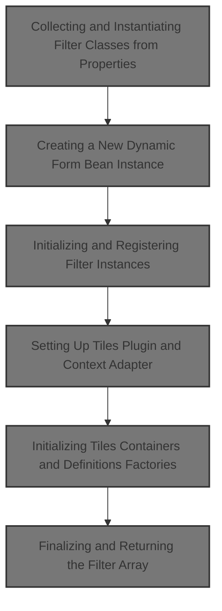
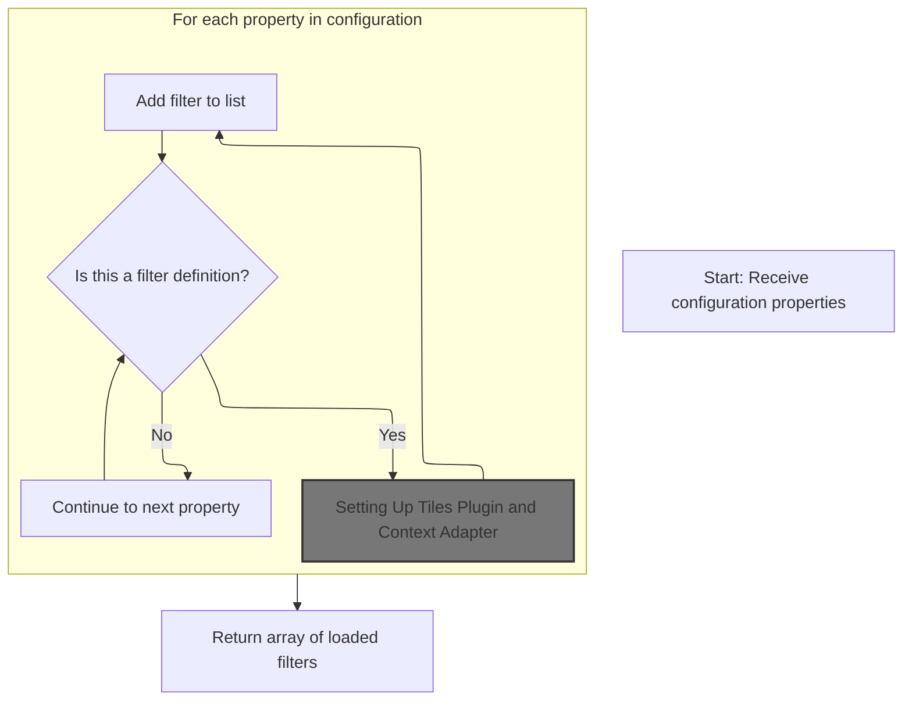
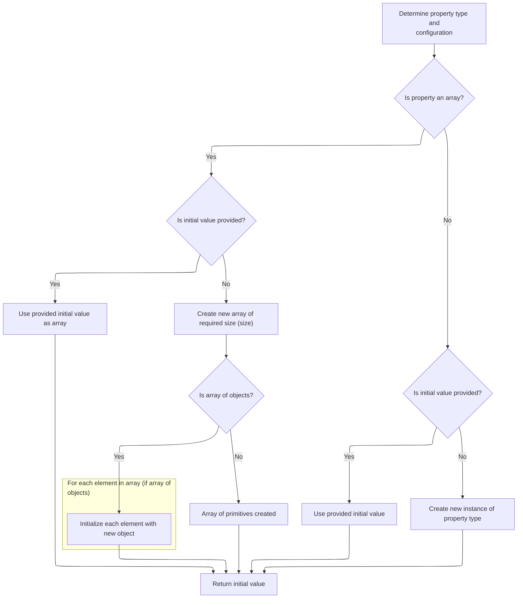
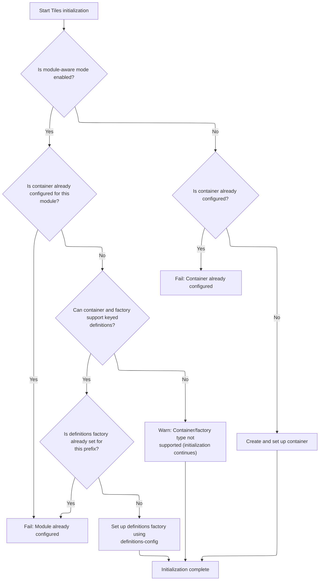

This document describes how filter instances are loaded and initialized using configuration properties. Filters are set up with dynamic form beans and Tiles plugin context, allowing them to process requests as needed. The flow receives configuration properties as input and returns an array of initialized filters.



# Collecting and Instantiating Filter Classes from Properties



<SwmSnippet path="/scripting/src/main/java/org/apache/struts/scripting/ScriptAction.java" line="363">

---

In <SwmToken path="scripting/src/main/java/org/apache/struts/scripting/ScriptAction.java" pos="363:9:9" line-data="    protected static BSFManagerFilter[] loadFilters(Properties props) {">`loadFilters`</SwmToken>, we're scanning all property names for ones that match the <SwmToken path="scripting/src/main/java/org/apache/struts/scripting/ScriptAction.java" pos="367:8:8" line-data="            if (prop.startsWith(FILTERS_BASE) &amp;&amp; prop.endsWith(&quot;class&quot;)) {">`FILTERS_BASE`</SwmToken> prefix and 'class' suffix. For each match, we extract the filter type, grab the class name from the property value, load and instantiate the class, and prep it for initialization. We need to call into <SwmToken path="core/src/main/java/org/apache/struts/action/DynaActionFormClass.java" pos="45:4:4" line-data="public class DynaActionFormClass implements DynaClass, Serializable {">`DynaActionFormClass`</SwmToken> next because the filter instantiation process may depend on dynamic form bean creation, which is handled there.

```java
    protected static BSFManagerFilter[] loadFilters(Properties props) {
        ArrayList list = new ArrayList();
        for (Enumeration e = props.propertyNames(); e.hasMoreElements();) {
            String prop = (String) e.nextElement();
            if (prop.startsWith(FILTERS_BASE) && prop.endsWith("class")) {
                String type = prop.substring(FILTERS_BASE.length(),
                        prop.indexOf(".", FILTERS_BASE.length()));
                String claz = props.getProperty(prop);
                try {
                    Class cls = Class.forName(claz);
                    BSFManagerFilter f = (BSFManagerFilter) cls.newInstance();
```

---

</SwmSnippet>

## Creating a New Dynamic Form Bean Instance

<SwmSnippet path="/core/src/main/java/org/apache/struts/action/DynaActionFormClass.java" line="158">

---

In <SwmToken path="core/src/main/java/org/apache/struts/action/DynaActionFormClass.java" pos="158:5:5" line-data="    public DynaBean newInstance()">`newInstance`</SwmToken>, we're creating a new <SwmToken path="core/src/main/java/org/apache/struts/action/DynaActionFormClass.java" pos="160:1:1" line-data="        DynaActionForm dynaBean = (DynaActionForm) getBeanClass().newInstance();">`DynaActionForm`</SwmToken> by instantiating the class returned from <SwmToken path="core/src/main/java/org/apache/struts/action/DynaActionFormClass.java" pos="160:11:13" line-data="        DynaActionForm dynaBean = (DynaActionForm) getBeanClass().newInstance();">`getBeanClass()`</SwmToken>. This is where the actual dynamic form bean gets created, and we need to call <SwmToken path="core/src/main/java/org/apache/struts/action/DynaActionFormClass.java" pos="160:11:13" line-data="        DynaActionForm dynaBean = (DynaActionForm) getBeanClass().newInstance();">`getBeanClass()`</SwmToken> to figure out which class to instantiate based on the config.

```java
    public DynaBean newInstance()
        throws IllegalAccessException, InstantiationException {
        DynaActionForm dynaBean = (DynaActionForm) getBeanClass().newInstance();

```

---

</SwmSnippet>

### Resolving the Bean Class for Dynamic Forms

<SwmSnippet path="/core/src/main/java/org/apache/struts/action/DynaActionFormClass.java" line="227">

---

<SwmToken path="core/src/main/java/org/apache/struts/action/DynaActionFormClass.java" pos="227:5:5" line-data="    protected Class getBeanClass() {">`getBeanClass`</SwmToken> checks if we've already resolved the bean class for this form. If not, it introspects the config to figure out which class to use. This step ensures we only do the expensive config parsing once.

```java
    protected Class getBeanClass() {
        if (beanClass == null) {
            introspect(config);
        }

        return (beanClass);
    }
```

---

</SwmSnippet>

### Introspecting Form Bean Configuration and Property Types

```mermaid
%%{init: {"flowchart": {"defaultRenderer": "elk"}} }%%
flowchart TD
    node1["Analyze form bean configuration (type
from config)"] --> node2{"Is form bean class valid?"}
    click node1 openCode "core/src/main/java/org/apache/struts/action/DynaActionFormClass.java:246:251"
    node2 -->|"Yes"| node3{"Is class a subclass of dynamic form?"}
    click node2 openCode "core/src/main/java/org/apache/struts/action/DynaActionFormClass.java:251:258"
    node2 -->|"No"| node8["Raise error: Invalid form bean class"]
    click node8 openCode "core/src/main/java/org/apache/struts/action/DynaActionFormClass.java:253:258"
    node3 -->|"Yes"| node4["Get property descriptors from config"]
    click node3 openCode "core/src/main/java/org/apache/struts/action/DynaActionFormClass.java:260:264"
    node3 -->|"No"| node9["Raise error: Not a dynamic form"]
    click node9 openCode "core/src/main/java/org/apache/struts/action/DynaActionFormClass.java:261:264"
    node4 --> node5{"Are property descriptors present?"}
    click node4 openCode "core/src/main/java/org/apache/struts/action/DynaActionFormClass.java:270:274"
    node5 -->|"No"| node6["Use empty property list"]
    click node6 openCode "core/src/main/java/org/apache/struts/action/DynaActionFormClass.java:273:274"
    node5 -->|"Yes"| node7["Proceed to define dynamic properties"]
    click node7 openCode "core/src/main/java/org/apache/struts/action/DynaActionFormClass.java:277:284"
    node6 --> node10
    node7 --> node10
    subgraph loop1["For each property descriptor in list"]
      node10["Define dynamic property and add to
property map"]
      click node10 openCode "core/src/main/java/org/apache/struts/action/DynaActionFormClass.java:279:284"
    end
classDef HeadingStyle fill:#777777,stroke:#333,stroke-width:2px;

%% Swimm:
%% %%{init: {"flowchart": {"defaultRenderer": "elk"}} }%%
%% flowchart TD
%%     node1["Analyze form bean configuration (type
%% from config)"] --> node2{"Is form bean class valid?"}
%%     click node1 openCode "<SwmPath>[core/…/action/DynaActionFormClass.java](core/src/main/java/org/apache/struts/action/DynaActionFormClass.java)</SwmPath>:246:251"
%%     node2 -->|"Yes"| node3{"Is class a subclass of dynamic form?"}
%%     click node2 openCode "<SwmPath>[core/…/action/DynaActionFormClass.java](core/src/main/java/org/apache/struts/action/DynaActionFormClass.java)</SwmPath>:251:258"
%%     node2 -->|"No"| node8["Raise error: Invalid form bean class"]
%%     click node8 openCode "<SwmPath>[core/…/action/DynaActionFormClass.java](core/src/main/java/org/apache/struts/action/DynaActionFormClass.java)</SwmPath>:253:258"
%%     node3 -->|"Yes"| node4["Get property descriptors from config"]
%%     click node3 openCode "<SwmPath>[core/…/action/DynaActionFormClass.java](core/src/main/java/org/apache/struts/action/DynaActionFormClass.java)</SwmPath>:260:264"
%%     node3 -->|"No"| node9["Raise error: Not a dynamic form"]
%%     click node9 openCode "<SwmPath>[core/…/action/DynaActionFormClass.java](core/src/main/java/org/apache/struts/action/DynaActionFormClass.java)</SwmPath>:261:264"
%%     node4 --> node5{"Are property descriptors present?"}
%%     click node4 openCode "<SwmPath>[core/…/action/DynaActionFormClass.java](core/src/main/java/org/apache/struts/action/DynaActionFormClass.java)</SwmPath>:270:274"
%%     node5 -->|"No"| node6["Use empty property list"]
%%     click node6 openCode "<SwmPath>[core/…/action/DynaActionFormClass.java](core/src/main/java/org/apache/struts/action/DynaActionFormClass.java)</SwmPath>:273:274"
%%     node5 -->|"Yes"| node7["Proceed to define dynamic properties"]
%%     click node7 openCode "<SwmPath>[core/…/action/DynaActionFormClass.java](core/src/main/java/org/apache/struts/action/DynaActionFormClass.java)</SwmPath>:277:284"
%%     node6 --> node10
%%     node7 --> node10
%%     subgraph loop1["For each property descriptor in list"]
%%       node10["Define dynamic property and add to
%% property map"]
%%       click node10 openCode "<SwmPath>[core/…/action/DynaActionFormClass.java](core/src/main/java/org/apache/struts/action/DynaActionFormClass.java)</SwmPath>:279:284"
%%     end
%% classDef HeadingStyle fill:#777777,stroke:#333,stroke-width:2px;
```



<SwmSnippet path="/core/src/main/java/org/apache/struts/action/DynaActionFormClass.java" line="246">

---

<SwmToken path="core/src/main/java/org/apache/struts/action/DynaActionFormClass.java" pos="246:5:5" line-data="    protected void introspect(FormBeanConfig config) {">`introspect`</SwmToken> loads the bean class from config, checks it's a <SwmToken path="core/src/main/java/org/apache/struts/action/DynaActionFormClass.java" pos="260:5:5" line-data="        if (!DynaActionForm.class.isAssignableFrom(beanClass)) {">`DynaActionForm`</SwmToken> subclass, grabs all property configs, and builds up the <SwmToken path="core/src/main/java/org/apache/struts/action/DynaActionFormClass.java" pos="277:7:7" line-data="        properties = new DynaProperty[descriptors.length];">`DynaProperty`</SwmToken> definitions. We call into <SwmToken path="core/src/main/java/org/apache/struts/action/DynaActionFormClass.java" pos="270:1:1" line-data="        FormPropertyConfig[] descriptors = config.findFormPropertyConfigs();">`FormPropertyConfig`</SwmToken> next to resolve the actual Java types for each property.

```java
    protected void introspect(FormBeanConfig config) {
        this.config = config;

        // Validate the ActionFormBean implementation class
        try {
            beanClass = RequestUtils.applicationClass(config.getType());
        } catch (Throwable t) {
        	IllegalArgumentException t2 = new IllegalArgumentException(
                "Cannot instantiate ActionFormBean class '" + config.getType()
                + "'");
        	t2.initCause(t);
        	throw t2;
        }

        if (!DynaActionForm.class.isAssignableFrom(beanClass)) {
            throw new IllegalArgumentException("Class '" + config.getType()
                + "' is not a subclass of "
                + "'org.apache.struts.action.DynaActionForm'");
        }

        // Set the name we will know ourselves by from the form bean name
        this.name = config.getName();

        // Look up the property descriptors for this bean class
        FormPropertyConfig[] descriptors = config.findFormPropertyConfigs();

        if (descriptors == null) {
            descriptors = new FormPropertyConfig[0];
        }

        // Create corresponding dynamic property definitions
        properties = new DynaProperty[descriptors.length];

        for (int i = 0; i < descriptors.length; i++) {
            properties[i] =
                new DynaProperty(descriptors[i].getName(),
                    descriptors[i].getTypeClass());
            propertiesMap.put(properties[i].getName(), properties[i]);
        }
    }
```

---

</SwmSnippet>

<SwmSnippet path="/core/src/main/java/org/apache/struts/config/FormPropertyConfig.java" line="221">

---

<SwmToken path="core/src/main/java/org/apache/struts/config/FormPropertyConfig.java" pos="221:5:5" line-data="    public Class getTypeClass() {">`getTypeClass`</SwmToken> figures out the Java Class for each property type, handling primitives, arrays, and regular classes. If it's an array type, it builds the right array Class. We go back to <SwmToken path="core/src/main/java/org/apache/struts/action/DynaActionFormClass.java" pos="45:4:4" line-data="public class DynaActionFormClass implements DynaClass, Serializable {">`DynaActionFormClass`</SwmToken> to use these types for property definitions.

```java
    public Class getTypeClass() {
        // Identify the base class (in case an array was specified)
        String baseType = getType();
        boolean indexed = false;

        if (baseType.endsWith("[]")) {
            baseType = baseType.substring(0, baseType.length() - 2);
            indexed = true;
        }

        // Construct an appropriate Class instance for the base class
        Class baseClass = null;

        if ("boolean".equals(baseType)) {
            baseClass = Boolean.TYPE;
        } else if ("byte".equals(baseType)) {
            baseClass = Byte.TYPE;
        } else if ("char".equals(baseType)) {
            baseClass = Character.TYPE;
        } else if ("double".equals(baseType)) {
            baseClass = Double.TYPE;
        } else if ("float".equals(baseType)) {
            baseClass = Float.TYPE;
        } else if ("int".equals(baseType)) {
            baseClass = Integer.TYPE;
        } else if ("long".equals(baseType)) {
            baseClass = Long.TYPE;
        } else if ("short".equals(baseType)) {
            baseClass = Short.TYPE;
        } else {
            ClassLoader classLoader =
                Thread.currentThread().getContextClassLoader();

            if (classLoader == null) {
                classLoader = this.getClass().getClassLoader();
            }

            try {
                baseClass = classLoader.loadClass(baseType);
            } catch (ClassNotFoundException ex) {
                log.error("Class '" + baseType +
                          "' not found for property '" + name + "'");
                baseClass = null;
            }
        }

        // Return the base class or an array appropriately
        if (indexed) {
            return (Array.newInstance(baseClass, 0).getClass());
        } else {
            return (baseClass);
        }
    }
```

---

</SwmSnippet>

### Initializing Dynamic Form Bean Properties

<SwmSnippet path="/core/src/main/java/org/apache/struts/action/DynaActionFormClass.java" line="162">

---

Back in `DynaActionFormClass.newInstance`, after getting the bean class, we set up all the properties on the new bean using the config's property definitions. For each property, we call its initial() method to get the starting value. We need to call into <SwmToken path="core/src/main/java/org/apache/struts/action/DynaActionFormClass.java" pos="164:1:1" line-data="        FormPropertyConfig[] props = config.findFormPropertyConfigs();">`FormPropertyConfig`</SwmToken> to handle the logic for property initialization.

```java
        dynaBean.setDynaActionFormClass(this);

        FormPropertyConfig[] props = config.findFormPropertyConfigs();

        for (int i = 0; i < props.length; i++) {
            dynaBean.set(props[i].getName(), props[i].initial());
        }

        return (dynaBean);
    }
```

---

</SwmSnippet>

## Determining Initial Values for Form Properties



<SwmSnippet path="/core/src/main/java/org/apache/struts/config/FormPropertyConfig.java" line="318">

---

In <SwmToken path="core/src/main/java/org/apache/struts/config/FormPropertyConfig.java" pos="318:5:5" line-data="    public Object initial() {">`initial`</SwmToken>, we figure out the starting value for a property. We check the type, and if it's an array, we prep an array of the right size. Otherwise, we handle single values. This relies on <SwmToken path="core/src/main/java/org/apache/struts/config/FormPropertyConfig.java" pos="322:7:7" line-data="            Class clazz = getTypeClass();">`getTypeClass`</SwmToken> and size being set up correctly.

```java
    public Object initial() {
        Object initialValue = null;

        try {
            Class clazz = getTypeClass();

```

---

</SwmSnippet>

<SwmSnippet path="/core/src/main/java/org/apache/struts/config/FormPropertyConfig.java" line="324">

---

Just returned from `FormPropertyConfig.initial`, if the property is an array and no initial value is set, we build the array and fill it with new instances for each slot (if not primitive). This guarantees the array is ready to use and not full of nulls.

```java
            if (clazz.isArray()) {
                if (initial != null) {
                    initialValue = ConvertUtils.convert(initial, clazz);
                } else {
                    initialValue =
                        Array.newInstance(clazz.getComponentType(), size);

                    if (!(clazz.getComponentType().isPrimitive())) {
                        for (int i = 0; i < size; i++) {
                            try {
                                Array.set(initialValue, i,
                                    clazz.getComponentType().newInstance());
                            } catch (Throwable t) {
                                log.error("Unable to create instance of "
                                    + clazz.getName() + " for property=" + name
                                    + ", type=" + type + ", initial=" + initial
                                    + ", size=" + size + ".");

                                //FIXME: Should we just dump the entire application/module ?
                            }
                        }
```

---

</SwmSnippet>

<SwmSnippet path="/core/src/main/java/org/apache/struts/config/FormPropertyConfig.java" line="348">

---

Finishing up in `FormPropertyConfig.initial`, for non-array types, if there's no initial value, we just create a new instance of the type. Now we go back to <SwmToken path="core/src/main/java/org/apache/struts/action/DynaActionFormClass.java" pos="45:4:4" line-data="public class DynaActionFormClass implements DynaClass, Serializable {">`DynaActionFormClass`</SwmToken> to finish setting up the bean.

```java
                if (initial != null) {
                    initialValue = ConvertUtils.convert(initial, clazz);
                } else {
                    initialValue = clazz.newInstance();
                }
            }
        } catch (Throwable t) {
            initialValue = null;
        }

        return (initialValue);
    }
```

---

</SwmSnippet>

## Initializing and Registering Filter Instances

<SwmSnippet path="/scripting/src/main/java/org/apache/struts/scripting/ScriptAction.java" line="374">

---

Just returned from `DynaActionFormClass.newInstance`, now in `ScriptAction.loadFilters` we call init on each filter, passing the type and all properties. This lets each filter set itself up with whatever config it needs. Next, we move to <SwmToken path="tiles2/src/main/java/org/apache/struts/tiles2/TilesPlugin.java" pos="319:2:2" line-data="                &quot;TilesPlugin : Specified RequestProcessor not compatible with TilesRequestProcessor&quot;;">`TilesPlugin`</SwmToken> for further setup.

```java
                    f.init(type, props);
                    list.add(f);
                    if (LOG.isInfoEnabled()) {
                        LOG.info("Loaded " + type + " filter: " + claz);
                    }
                } catch (Exception ex) {
                    LOG.error("Unable to load " + type + " filter: " + claz);
                }
            }
        }
```

---

</SwmSnippet>

## Setting Up Tiles Plugin and Context Adapter

<SwmSnippet path="/tiles2/src/main/java/org/apache/struts/tiles2/TilesPlugin.java" line="174">

---

In <SwmToken path="tiles2/src/main/java/org/apache/struts/tiles2/TilesPlugin.java" pos="174:5:5" line-data="    public void init(ActionServlet servlet, ModuleConfig moduleConfig)">`init`</SwmToken>, we set up a <SwmToken path="tiles2/src/main/java/org/apache/struts/tiles2/TilesPlugin.java" pos="177:7:7" line-data="        currentPlugInConfigContextAdapter = new PlugInConfigContextAdapter(">`PlugInConfigContextAdapter`</SwmToken> to bridge plugin config and servlet context. This adapter is used for all Tiles factory and container lookups, so everything is context-aware.

```java
    public void init(ActionServlet servlet, ModuleConfig moduleConfig)
        throws ServletException {

        currentPlugInConfigContextAdapter = new PlugInConfigContextAdapter(
                this.currentPlugInConfigObject, servlet.getServletContext());

        // Set RequestProcessor class
        this.initRequestProcessorClass(moduleConfig);

```

---

</SwmSnippet>

### Configuring the Request Processor for Tiles

```mermaid
%%{init: {"flowchart": {"defaultRenderer": "elk"}} }%%
flowchart TD
  node1["Start: Initialize request processor
class"] --> node2{"Does the specified processor class
exist?"}
  click node1 openCode "tiles2/src/main/java/org/apache/struts/tiles2/TilesPlugin.java:278:281"
  node2 -->|"No"| node3["Fail: Invalid processor class name"]
  click node2 openCode "tiles2/src/main/java/org/apache/struts/tiles2/TilesPlugin.java:285:297"
  click node3 openCode "tiles2/src/main/java/org/apache/struts/tiles2/TilesPlugin.java:292:297"
  node2 -->|"Yes"| node4{"Is the processor a struts-chain
processor?"}
  click node4 openCode "tiles2/src/main/java/org/apache/struts/tiles2/TilesPlugin.java:301:303"
  node4 -->|"Yes"| node8["Success: Processor configured
(struts-chain)"]
  click node8 openCode "tiles2/src/main/java/org/apache/struts/tiles2/TilesPlugin.java:302:303"
  node4 -->|"No"| node5{"Is the processor the default or a Tiles
processor?"}
  click node5 openCode "tiles2/src/main/java/org/apache/struts/tiles2/TilesPlugin.java:307:308"
  node5 -->|"Yes"| node6["Replace with Tiles processor"]
  click node6 openCode "tiles2/src/main/java/org/apache/struts/tiles2/TilesPlugin.java:310:311"
  node6 --> node8
  node5 -->|"No"| node7{"Is the processor compatible with Tiles?"}
  click node7 openCode "tiles2/src/main/java/org/apache/struts/tiles2/TilesPlugin.java:316:324"
  node7 -->|"No"| node9["Fail: Not compatible with Tiles"]
  click node9 openCode "tiles2/src/main/java/org/apache/struts/tiles2/TilesPlugin.java:318:324"
  node7 -->|"Yes"| node8
classDef HeadingStyle fill:#777777,stroke:#333,stroke-width:2px;

%% Swimm:
%% %%{init: {"flowchart": {"defaultRenderer": "elk"}} }%%
%% flowchart TD
%%   node1["Start: Initialize request processor
%% class"] --> node2{"Does the specified processor class
%% exist?"}
%%   click node1 openCode "<SwmPath>[tiles2/…/tiles2/TilesPlugin.java](tiles2/src/main/java/org/apache/struts/tiles2/TilesPlugin.java)</SwmPath>:278:281"
%%   node2 -->|"No"| node3["Fail: Invalid processor class name"]
%%   click node2 openCode "<SwmPath>[tiles2/…/tiles2/TilesPlugin.java](tiles2/src/main/java/org/apache/struts/tiles2/TilesPlugin.java)</SwmPath>:285:297"
%%   click node3 openCode "<SwmPath>[tiles2/…/tiles2/TilesPlugin.java](tiles2/src/main/java/org/apache/struts/tiles2/TilesPlugin.java)</SwmPath>:292:297"
%%   node2 -->|"Yes"| node4{"Is the processor a <SwmToken path="tiles2/src/main/java/org/apache/struts/tiles2/TilesPlugin.java" pos="299:17:19" line-data="        // Check to see if request processor uses struts-chain.  If so,">`struts-chain`</SwmToken>
%% processor?"}
%%   click node4 openCode "<SwmPath>[tiles2/…/tiles2/TilesPlugin.java](tiles2/src/main/java/org/apache/struts/tiles2/TilesPlugin.java)</SwmPath>:301:303"
%%   node4 -->|"Yes"| node8["Success: Processor configured
%% (<SwmToken path="tiles2/src/main/java/org/apache/struts/tiles2/TilesPlugin.java" pos="299:17:19" line-data="        // Check to see if request processor uses struts-chain.  If so,">`struts-chain`</SwmToken>)"]
%%   click node8 openCode "<SwmPath>[tiles2/…/tiles2/TilesPlugin.java](tiles2/src/main/java/org/apache/struts/tiles2/TilesPlugin.java)</SwmPath>:302:303"
%%   node4 -->|"No"| node5{"Is the processor the default or a Tiles
%% processor?"}
%%   click node5 openCode "<SwmPath>[tiles2/…/tiles2/TilesPlugin.java](tiles2/src/main/java/org/apache/struts/tiles2/TilesPlugin.java)</SwmPath>:307:308"
%%   node5 -->|"Yes"| node6["Replace with Tiles processor"]
%%   click node6 openCode "<SwmPath>[tiles2/…/tiles2/TilesPlugin.java](tiles2/src/main/java/org/apache/struts/tiles2/TilesPlugin.java)</SwmPath>:310:311"
%%   node6 --> node8
%%   node5 -->|"No"| node7{"Is the processor compatible with Tiles?"}
%%   click node7 openCode "<SwmPath>[tiles2/…/tiles2/TilesPlugin.java](tiles2/src/main/java/org/apache/struts/tiles2/TilesPlugin.java)</SwmPath>:316:324"
%%   node7 -->|"No"| node9["Fail: Not compatible with Tiles"]
%%   click node9 openCode "<SwmPath>[tiles2/…/tiles2/TilesPlugin.java](tiles2/src/main/java/org/apache/struts/tiles2/TilesPlugin.java)</SwmPath>:318:324"
%%   node7 -->|"Yes"| node8
%% classDef HeadingStyle fill:#777777,stroke:#333,stroke-width:2px;
```



<SwmSnippet path="/tiles2/src/main/java/org/apache/struts/tiles2/TilesPlugin.java" line="278">

---

In <SwmToken path="tiles2/src/main/java/org/apache/struts/tiles2/TilesPlugin.java" pos="278:5:5" line-data="    protected void initRequestProcessorClass(ModuleConfig config)">`initRequestProcessorClass`</SwmToken>, we check what processor class is set, make sure it exists, and only swap it for <SwmToken path="tiles2/src/main/java/org/apache/struts/tiles2/TilesPlugin.java" pos="281:7:7" line-data="        String tilesProcessorClassname = TilesRequestProcessor.class.getName();">`TilesRequestProcessor`</SwmToken> if it's the default or already Tiles. If it's a chain-based processor, we leave it alone. We call <SwmToken path="tiles2/src/main/java/org/apache/struts/tiles2/TilesPlugin.java" pos="282:1:1" line-data="        ControllerConfig ctrlConfig = config.getControllerConfig();">`ControllerConfig`</SwmToken> next to actually set the processor class.

```java
    protected void initRequestProcessorClass(ModuleConfig config)
        throws ServletException {

        String tilesProcessorClassname = TilesRequestProcessor.class.getName();
        ControllerConfig ctrlConfig = config.getControllerConfig();
        String configProcessorClassname = ctrlConfig.getProcessorClass();

        // Check if specified classname exist
        Class configProcessorClass;
        try {
            configProcessorClass =
                RequestUtils.applicationClass(configProcessorClassname);

        } catch (ClassNotFoundException ex) {
            log.fatal(
                "Can't set TilesRequestProcessor: bad class name '"
                    + configProcessorClassname
                    + "'.");
            throw new ServletException(ex);
        }

        // Check to see if request processor uses struts-chain.  If so,
        // no need to replace the request processor.
        if (ComposableRequestProcessor.class.isAssignableFrom(configProcessorClass)) {
            return;
        }

        // Check if it is the default request processor or Tiles one.
        // If true, replace by Tiles' one.
        if (configProcessorClassname.equals(RequestProcessor.class.getName())
            || configProcessorClassname.endsWith(tilesProcessorClassname)) {

            ctrlConfig.setProcessorClass(tilesProcessorClassname);
            return;
        }

```

---

</SwmSnippet>

<SwmSnippet path="/core/src/main/java/org/apache/struts/config/ControllerConfig.java" line="305">

---

<SwmToken path="core/src/main/java/org/apache/struts/config/ControllerConfig.java" pos="305:5:5" line-data="    public void setProcessorClass(String processorClass) {">`setProcessorClass`</SwmToken> only lets you change the processor class if the config isn't frozen. If it's already locked down, you get an exception. This keeps runtime behavior stable.

```java
    public void setProcessorClass(String processorClass) {
        if (configured) {
            throw new IllegalStateException("Configuration is frozen");
        }

        this.processorClass = processorClass;
    }
```

---

</SwmSnippet>

<SwmSnippet path="/tiles2/src/main/java/org/apache/struts/tiles2/TilesPlugin.java" line="314">

---

Just returned from `ControllerConfig.setProcessorClass`, now in `TilesPlugin.initRequestProcessorClass` we check if the processor class is compatible with <SwmToken path="tiles2/src/main/java/org/apache/struts/tiles2/TilesPlugin.java" pos="315:7:7" line-data="        Class tilesProcessorClass = TilesRequestProcessor.class;">`TilesRequestProcessor`</SwmToken>. If not, we log a fatal error and throw, so you can't misconfigure Tiles.

```java
        // Check if specified request processor is compatible with Tiles.
        Class tilesProcessorClass = TilesRequestProcessor.class;
        if (!tilesProcessorClass.isAssignableFrom(configProcessorClass)) {
            // Not compatible
            String msg =
                "TilesPlugin : Specified RequestProcessor not compatible with TilesRequestProcessor";
            if (log.isFatalEnabled()) {
                log.fatal(msg);
            }
            throw new ServletException(msg);
        }
    }
```

---

</SwmSnippet>

### Initializing Tiles Containers and Definitions Factories



<SwmSnippet path="/tiles2/src/main/java/org/apache/struts/tiles2/TilesPlugin.java" line="183">

---

Just returned from `TilesPlugin.initRequestProcessorClass`, now in `TilesPlugin.init` we set up Tiles containers and definitions factories. If <SwmToken path="tiles2/src/main/java/org/apache/struts/tiles2/TilesPlugin.java" pos="82:14:16" line-data="// TODO Complete the plugin to be module-aware.">`module-aware`</SwmToken>, we make sure each module gets its own factory and config, and block duplicate setups. Otherwise, we do a global setup. Definitions config is pulled from plugin properties for customization.

```java
        // Initialize Tiles
        try {
            TilesContainerFactory factory;
            TilesContainer container;
            if (moduleAware) {
                factory = TilesContainerFactory.getFactory(
                        currentPlugInConfigContextAdapter,
                        MODULE_AWARE_DEFAULTS);
                container = TilesAccess.getContainer(
                        currentPlugInConfigContextAdapter);
                if (container == null) {
                    container = factory.createContainer(
                            currentPlugInConfigContextAdapter);
                    TilesAccess.setContainer(currentPlugInConfigContextAdapter,
                            container);
                }
                if (container instanceof KeyedDefinitionsFactoryTilesContainer) {
                    KeyedDefinitionsFactoryTilesContainer keyedContainer =
                        (KeyedDefinitionsFactoryTilesContainer) container;
                    // If we have a definition factory for the current module
                    // prefix then we are trying to re-initialize the same module,
                    // and it is wrong!
                    if (keyedContainer.getProperDefinitionsFactory(moduleConfig
                            .getPrefix()) != null) {
                        throw new ServletException("Tiles definitions factory for module '"
                                        + moduleConfig.getPrefix()
                                        + "' has already been configured");
                    }
                    if (factory instanceof KeyedDefinitionsFactoryTilesContainerFactory) {
                        DefinitionsFactory defsFactory =
                            ((KeyedDefinitionsFactoryTilesContainerFactory) factory)
                            .createDefinitionsFactory(currentPlugInConfigContextAdapter);
                        Map initParameters = new HashMap();
                        String param = (String) currentPlugInConfigObject
                                .getProperties().get(BasicTilesContainer
                                        .DEFINITIONS_CONFIG);
                        if (param == null) {
                            param = (String) currentPlugInConfigObject
                                .getProperties().get("definitions-config");
                        }
                        if (param != null) {
                            initParameters.put(BasicTilesContainer
                                    .DEFINITIONS_CONFIG, param);
                        }
                        keyedContainer.setDefinitionsFactory(moduleConfig.getPrefix(),
                                        defsFactory, initParameters);
                    } else {
                        log.warn("The created factory is not instance of "
                                + "KeyedDefinitionsFactoryTilesContainerFactory"
                                + " and cannot be configured correctly");
                    }
                } else {
                    log.warn("The created container is not instance of "
                            + "KeyedDefinitionsFactoryTilesContainer"
                            + " and cannot be configured correctly");
                }
            } else {
                factory = TilesContainerFactory
                        .getFactory(currentPlugInConfigContextAdapter);
                if (TilesAccess.getContainer(currentPlugInConfigContextAdapter) != null) {
                    throw new ServletException(
                            "Tiles container has already been configured");
                }
                container = factory.createContainer(
                        currentPlugInConfigContextAdapter);
                TilesAccess.setContainer(currentPlugInConfigContextAdapter,
                        container);
            }
        } catch (TilesException e) {
            log.fatal("Unable to retrieve tiles factory.", e);
            throw new IllegalStateException("Unable to instantiate container.");
        }
    }
```

---

</SwmSnippet>

## Finalizing and Returning the Filter Array

<SwmSnippet path="/scripting/src/main/java/org/apache/struts/scripting/ScriptAction.java" line="384">

---

Just returned from `TilesPlugin.init`, now in `ScriptAction.loadFilters` we wrap up by converting the filter list to an array and returning it. This gives the rest of the code a ready-to-use array of all loaded filters.

```java
        BSFManagerFilter[] filters = new BSFManagerFilter[list.size()];
        filters = (BSFManagerFilter[]) list.toArray(filters);
        return filters;
    }
```

---

</SwmSnippet>

&nbsp;

*This is an auto-generated document by Swimm 🌊 and has not yet been verified by a human*

<SwmMeta version="3.0.0" repo-id="Z2l0aHViJTNBJTNBc3RydXRzMSUzQSUzQVN3aW1tLURlbW8=" repo-name="struts1"><sup>Powered by [Swimm](https://app.swimm.io/)</sup></SwmMeta>
