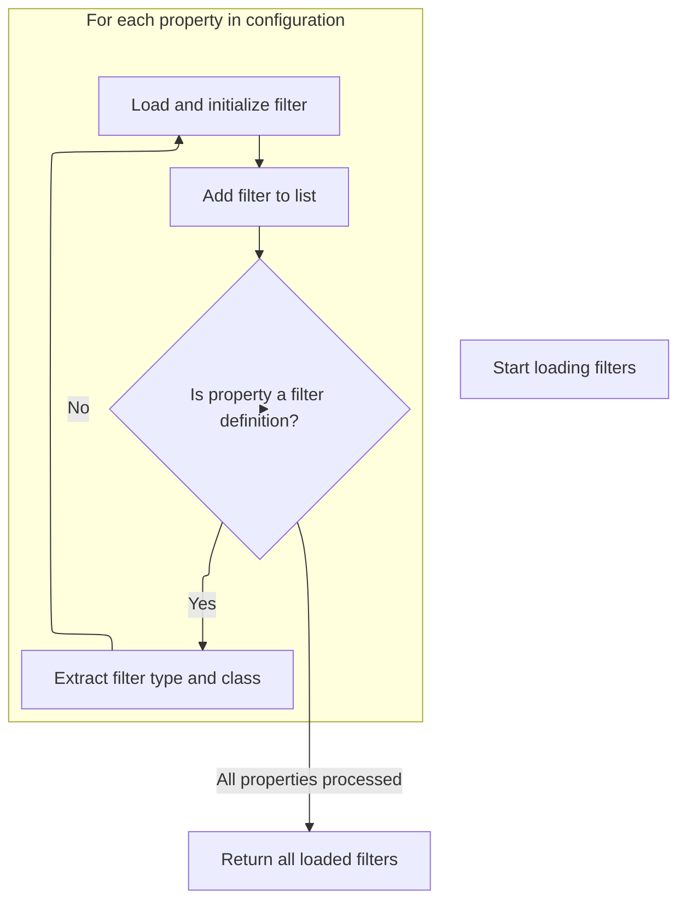

This document describes how script filters are loaded and initialized based on configuration properties. Script filters enable dynamic modification or processing of actions in the application. The flow takes configuration properties as input and returns an array of initialized filters, ready for use.

# Loading and Initializing Script Filters



<SwmSnippet path="/scripting/src/main/java/org/apache/struts/scripting/ScriptAction.java" line="363">

---

In <SwmToken path="scripting/src/main/java/org/apache/struts/scripting/ScriptAction.java" pos="363:9:9" line-data="    protected static BSFManagerFilter[] loadFilters(Properties props) {">`loadFilters`</SwmToken>, we loop through all property keys, looking for ones that match a specific pattern (start with <SwmToken path="scripting/src/main/java/org/apache/struts/scripting/ScriptAction.java" pos="367:8:8" line-data="            if (prop.startsWith(FILTERS_BASE) &amp;&amp; prop.endsWith(&quot;class&quot;)) {">`FILTERS_BASE`</SwmToken> and end with 'class'). For each match, we extract the filter type, load the class by name, instantiate it, and call its init method with the type and all properties. Each filter gets added to a list. We need to call ValidatorPlugIn.init next because it sets up shared resources and ensures only one plugin instance per module

```java
    protected static BSFManagerFilter[] loadFilters(Properties props) {
        ArrayList list = new ArrayList();
        for (Enumeration e = props.propertyNames(); e.hasMoreElements();) {
            String prop = (String) e.nextElement();
            if (prop.startsWith(FILTERS_BASE) && prop.endsWith("class")) {
                String type = prop.substring(FILTERS_BASE.length(),
                        prop.indexOf(".", FILTERS_BASE.length()));
                String claz = props.getProperty(prop);
                try {
                    Class cls = Class.forName(claz);
                    BSFManagerFilter f = (BSFManagerFilter) cls.newInstance();
                    f.init(type, props);
                    list.add(f);
                    if (LOG.isInfoEnabled()) {
                        LOG.info("Loaded " + type + " filter: " + claz);
                    }
                } catch (Exception ex) {
                    LOG.error("Unable to load " + type + " filter: " + claz);
                }
            }
        }
```

---

</SwmSnippet>

<SwmSnippet path="/core/src/main/java/org/apache/struts/validator/ValidatorPlugIn.java" line="157">

---

<SwmToken path="core/src/main/java/org/apache/struts/validator/ValidatorPlugIn.java" pos="157:5:5" line-data="    public void init(ActionServlet servlet, ModuleConfig config)">`init`</SwmToken> in <SwmToken path="core/src/main/java/org/apache/struts/validator/ValidatorPlugIn.java" pos="168:8:8" line-data="            throw new UnavailableException(&quot;ValidatorPlugIn cannot be &quot; +">`ValidatorPlugIn`</SwmToken> checks if a plugin instance already exists for the module by looking for a specific key in the servlet context. If it finds one, it throws an exception to stop duplicate plugins. Then it loads validator resources and puts them, along with a stop-on-error flag, into the servlet context for other parts of the app to use.

```java
    public void init(ActionServlet servlet, ModuleConfig config)
        throws ServletException {

        // Remember our associated configuration and servlet
        this.config = config;
        this.servlet = servlet;
        
        // Verify only one instance of the plugin is loaded per module
        String validatorModuleKey = VALIDATOR_KEY + config.getPrefix();
        ServletContext servletContext = servlet.getServletContext();
        if (servletContext.getAttribute(validatorModuleKey) != null) {
            throw new UnavailableException("ValidatorPlugIn cannot be " +
                    "redefined for module '" + config.getPrefix() + "'");
        }

        // Load our database from persistent storage
        try {
            this.initResources();
            servletContext.setAttribute(validatorModuleKey, resources);
            servletContext.setAttribute(STOP_ON_ERROR_KEY + '.'
                + config.getPrefix(),
                (this.stopOnFirstError ? Boolean.TRUE : Boolean.FALSE));
        } catch (Exception e) {
            log.error(e.getMessage(), e);
            throw new UnavailableException(
                "Cannot load a validator resource from '" + pathnames + "'");
        }
    }
```

---

</SwmSnippet>

<SwmSnippet path="/scripting/src/main/java/org/apache/struts/scripting/ScriptAction.java" line="384">

---

Now that ValidatorPlugIn.init has set up the shared resources, we finish up in ScriptAction.loadFilters by converting the list of filters into an array and returning it. This gives the caller all the configured and initialized filters, ready to use with the context already set up.

```java
        BSFManagerFilter[] filters = new BSFManagerFilter[list.size()];
        filters = (BSFManagerFilter[]) list.toArray(filters);
        return filters;
    }
```

---

</SwmSnippet>

&nbsp;

*This is an auto-generated document by Swimm 🌊 and has not yet been verified by a human*

<SwmMeta version="3.0.0" repo-id="Z2l0aHViJTNBJTNBc3RydXRzMSUzQSUzQVN3aW1tLURlbW8=" repo-name="struts1"><sup>Powered by [Swimm](https://app.swimm.io/)</sup></SwmMeta>
