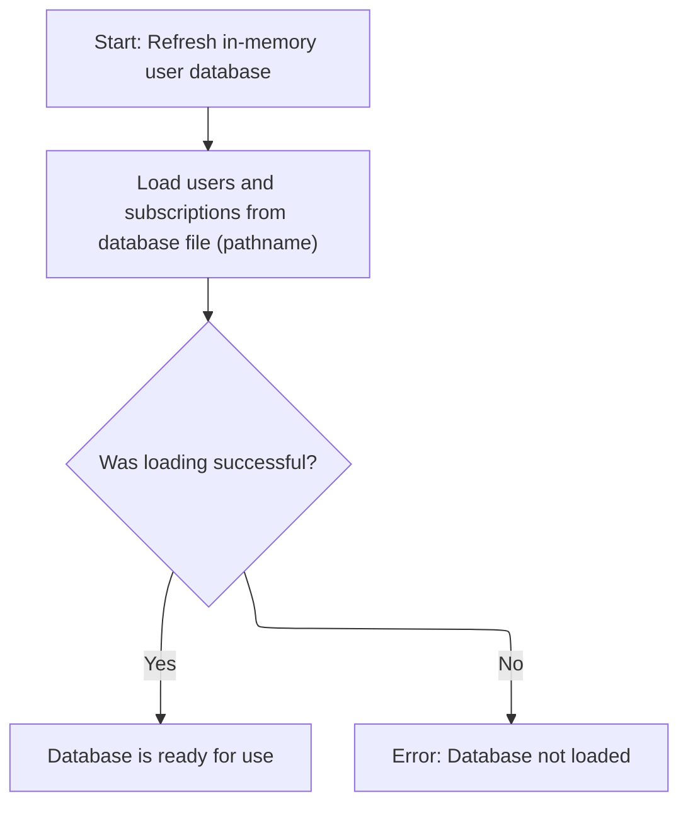

This document describes how user and subscription data is loaded from an XML file into an <SwmToken path="apps/faces-example2/src/main/java/org/apache/struts/webapp/example2/memory/MemoryUserDatabase.java" pos="45:23:25" line-data=" * &lt;p&gt;Concrete implementation of {@link UserDatabase} for an in-memory">`in-memory`</SwmToken> database. The process ensures that data is available for use and that any changes are saved back to the XML file before shutdown.

# Loading users and subscriptions from XML



<SwmSnippet path="/apps/faces-example2/src/main/java/org/apache/struts/webapp/example2/memory/MemoryUserDatabase.java" line="175">

---

<SwmToken path="apps/faces-example2/src/main/java/org/apache/struts/webapp/example2/memory/MemoryUserDatabase.java" pos="175:5:5" line-data="    public void open() throws Exception {">`open`</SwmToken> kicks off the flow by loading users and subscriptions from an XML file using Digester. It relies on specific XML paths and custom factories to map XML elements to <SwmToken path="apps/faces-example2/src/main/java/org/apache/struts/webapp/example2/memory/MemoryUserDatabase.java" pos="45:23:25" line-data=" * &lt;p&gt;Concrete implementation of {@link UserDatabase} for an in-memory">`in-memory`</SwmToken> objects. After parsing, we need to call <SwmToken path="apps/faces-example2/src/main/java/org/apache/struts/webapp/example2/memory/MemoryUserDatabase.java" pos="202:3:3" line-data="            bis.close();">`close`</SwmToken> to ensure resources are released and changes are persisted if needed.

```java
    public void open() throws Exception {

        FileInputStream fis = null;
        BufferedInputStream bis = null;

        try {

            // Acquire an input stream to our database file
            if (log.isDebugEnabled()) {
                log.debug("Loading database from '" + pathname + "'");
            }
            fis = new FileInputStream(pathname);
            bis = new BufferedInputStream(fis);

            // Construct a digester to use for parsing
            Digester digester = new Digester();
            digester.push(this);
            digester.setValidating(false);
            digester.addFactoryCreate
                ("database/user",
                 new MemoryUserCreationFactory(this));
            digester.addFactoryCreate
                ("database/user/subscription",
                 new MemorySubscriptionCreationFactory(this));

            // Parse the input stream to initialize our database
            digester.parse(bis);
            bis.close();
            bis = null;
            fis = null;

        } catch (Exception e) {

            log.error("Loading database from '" + pathname + "':", e);
            throw e;

        } finally {

            if (bis != null) {
                try {
                    bis.close();
                } catch (Throwable t) {
                    ;
                }
                bis = null;
                fis = null;
            }

        }

    }
```

---

</SwmSnippet>

# Persisting changes before shutdown

<SwmSnippet path="/apps/faces-example2/src/main/java/org/apache/struts/webapp/example2/memory/MemoryUserDatabase.java" line="106">

---

<SwmToken path="apps/faces-example2/src/main/java/org/apache/struts/webapp/example2/memory/MemoryUserDatabase.java" pos="106:5:5" line-data="    public void close() throws Exception {">`close`</SwmToken> just calls <SwmToken path="apps/faces-example2/src/main/java/org/apache/struts/webapp/example2/memory/MemoryUserDatabase.java" pos="108:1:1" line-data="        save();">`save`</SwmToken> to write out any changes. Next, we call <SwmToken path="apps/faces-example2/src/main/java/org/apache/struts/webapp/example2/memory/MemoryUserDatabase.java" pos="108:1:1" line-data="        save();">`save`</SwmToken> to actually serialize the <SwmToken path="apps/faces-example2/src/main/java/org/apache/struts/webapp/example2/memory/MemoryUserDatabase.java" pos="45:23:25" line-data=" * &lt;p&gt;Concrete implementation of {@link UserDatabase} for an in-memory">`in-memory`</SwmToken> data to disk.

```java
    public void close() throws Exception {

        save();

    }
```

---

</SwmSnippet>

# Writing updated user data and handling deletions

```mermaid
%%{init: {"flowchart": {"defaultRenderer": "elk"}} }%%
flowchart TD
    node1["Start saving user database"] --> node2["Write XML prolog"]
    click node1 openCode "apps/faces-example2/src/main/java/org/apache/struts/webapp/example2/memory/MemoryUserDatabase.java:257:258"
    click node2 openCode "apps/faces-example2/src/main/java/org/apache/struts/webapp/example2/memory/MemoryUserDatabase.java:273:274"
    node2 --> node3["Write user and subscription data"]
    click node3 openCode "apps/faces-example2/src/main/java/org/apache/struts/webapp/example2/memory/MemoryUserDatabase.java:277:291"
    subgraph loop1["For each user in database"]
        node3 --> node4["Write user entry"]
        click node4 openCode "apps/faces-example2/src/main/java/org/apache/struts/webapp/example2/memory/MemoryUserDatabase.java:279:280"
        node4 --> node5["Write subscriptions for user"]
        click node5 openCode "apps/faces-example2/src/main/java/org/apache/struts/webapp/example2/memory/MemoryUserDatabase.java:282:288"
        node5 --> node6["Close user entry"]
        click node6 openCode "apps/faces-example2/src/main/java/org/apache/struts/webapp/example2/memory/MemoryUserDatabase.java:290:290"
        node6 --> node3
    end
    node3 --> node7["Write XML epilog"]
    click node7 openCode "apps/faces-example2/src/main/java/org/apache/struts/webapp/example2/memory/MemoryUserDatabase.java:294:294"
    node7 --> node8{"Any errors during writing?"}
    click node8 openCode "apps/faces-example2/src/main/java/org/apache/struts/webapp/example2/memory/MemoryUserDatabase.java:297:302"
    node8 -->|"Yes"| node9["Delete new file and throw error"]
    click node9 openCode "apps/faces-example2/src/main/java/org/apache/struts/webapp/example2/memory/MemoryUserDatabase.java:299:301"
    node8 -->|"No"| node10{"Does original file (pathname) exist?"}
    click node10 openCode "apps/faces-example2/src/main/java/org/apache/struts/webapp/example2/memory/MemoryUserDatabase.java:320:326"
    node10 -->|"Yes"| node11["Rename original file to backup (pathnameOld)"]
    click node11 openCode "apps/faces-example2/src/main/java/org/apache/struts/webapp/example2/memory/MemoryUserDatabase.java:321:325"
    node10 -->|"No"| node12["Skip backup"]
    click node12 openCode "apps/faces-example2/src/main/java/org/apache/struts/webapp/example2/memory/MemoryUserDatabase.java:327:327"
    node11 --> node13{"Can new file (pathnameNew) be renamed to original (pathname)?"}
    node12 --> node13
    click node13 openCode "apps/faces-example2/src/main/java/org/apache/struts/webapp/example2/memory/MemoryUserDatabase.java:327:333"
    node13 -->|"Yes"| node14["Delete backup file (pathnameOld)"]
    click node14 openCode "apps/faces-example2/src/main/java/org/apache/struts/webapp/example2/memory/MemoryUserDatabase.java:334:334"
    node13 -->|"No"| node15["Restore from backup and throw error"]
    click node15 openCode "apps/faces-example2/src/main/java/org/apache/struts/webapp/example2/memory/MemoryUserDatabase.java:329:332"
    node14 --> node16["Finish"]
    node15 --> node16["Finish"]
    click node16 openCode "apps/faces-example2/src/main/java/org/apache/struts/webapp/example2/memory/MemoryUserDatabase.java:336:336"
classDef HeadingStyle fill:#777777,stroke:#333,stroke-width:2px;

%% Swimm:
%% %%{init: {"flowchart": {"defaultRenderer": "elk"}} }%%
%% flowchart TD
%%     node1["Start saving user database"] --> node2["Write XML prolog"]
%%     click node1 openCode "<SwmPath>[apps/…/memory/MemoryUserDatabase.java](apps/faces-example2/src/main/java/org/apache/struts/webapp/example2/memory/MemoryUserDatabase.java)</SwmPath>:257:258"
%%     click node2 openCode "<SwmPath>[apps/…/memory/MemoryUserDatabase.java](apps/faces-example2/src/main/java/org/apache/struts/webapp/example2/memory/MemoryUserDatabase.java)</SwmPath>:273:274"
%%     node2 --> node3["Write user and subscription data"]
%%     click node3 openCode "<SwmPath>[apps/…/memory/MemoryUserDatabase.java](apps/faces-example2/src/main/java/org/apache/struts/webapp/example2/memory/MemoryUserDatabase.java)</SwmPath>:277:291"
%%     subgraph loop1["For each user in database"]
%%         node3 --> node4["Write user entry"]
%%         click node4 openCode "<SwmPath>[apps/…/memory/MemoryUserDatabase.java](apps/faces-example2/src/main/java/org/apache/struts/webapp/example2/memory/MemoryUserDatabase.java)</SwmPath>:279:280"
%%         node4 --> node5["Write subscriptions for user"]
%%         click node5 openCode "<SwmPath>[apps/…/memory/MemoryUserDatabase.java](apps/faces-example2/src/main/java/org/apache/struts/webapp/example2/memory/MemoryUserDatabase.java)</SwmPath>:282:288"
%%         node5 --> node6["Close user entry"]
%%         click node6 openCode "<SwmPath>[apps/…/memory/MemoryUserDatabase.java](apps/faces-example2/src/main/java/org/apache/struts/webapp/example2/memory/MemoryUserDatabase.java)</SwmPath>:290:290"
%%         node6 --> node3
%%     end
%%     node3 --> node7["Write XML epilog"]
%%     click node7 openCode "<SwmPath>[apps/…/memory/MemoryUserDatabase.java](apps/faces-example2/src/main/java/org/apache/struts/webapp/example2/memory/MemoryUserDatabase.java)</SwmPath>:294:294"
%%     node7 --> node8{"Any errors during writing?"}
%%     click node8 openCode "<SwmPath>[apps/…/memory/MemoryUserDatabase.java](apps/faces-example2/src/main/java/org/apache/struts/webapp/example2/memory/MemoryUserDatabase.java)</SwmPath>:297:302"
%%     node8 -->|"Yes"| node9["Delete new file and throw error"]
%%     click node9 openCode "<SwmPath>[apps/…/memory/MemoryUserDatabase.java](apps/faces-example2/src/main/java/org/apache/struts/webapp/example2/memory/MemoryUserDatabase.java)</SwmPath>:299:301"
%%     node8 -->|"No"| node10{"Does original file (pathname) exist?"}
%%     click node10 openCode "<SwmPath>[apps/…/memory/MemoryUserDatabase.java](apps/faces-example2/src/main/java/org/apache/struts/webapp/example2/memory/MemoryUserDatabase.java)</SwmPath>:320:326"
%%     node10 -->|"Yes"| node11["Rename original file to backup (<SwmToken path="apps/faces-example2/src/main/java/org/apache/struts/webapp/example2/memory/MemoryUserDatabase.java" pos="319:11:11" line-data="        File fileOld = new File(pathnameOld);">`pathnameOld`</SwmToken>)"]
%%     click node11 openCode "<SwmPath>[apps/…/memory/MemoryUserDatabase.java](apps/faces-example2/src/main/java/org/apache/struts/webapp/example2/memory/MemoryUserDatabase.java)</SwmPath>:321:325"
%%     node10 -->|"No"| node12["Skip backup"]
%%     click node12 openCode "<SwmPath>[apps/…/memory/MemoryUserDatabase.java](apps/faces-example2/src/main/java/org/apache/struts/webapp/example2/memory/MemoryUserDatabase.java)</SwmPath>:327:327"
%%     node11 --> node13{"Can new file (<SwmToken path="apps/faces-example2/src/main/java/org/apache/struts/webapp/example2/memory/MemoryUserDatabase.java" pos="262:11:11" line-data="        File fileNew = new File(pathnameNew);">`pathnameNew`</SwmToken>) be renamed to original (pathname)?"}
%%     node12 --> node13
%%     click node13 openCode "<SwmPath>[apps/…/memory/MemoryUserDatabase.java](apps/faces-example2/src/main/java/org/apache/struts/webapp/example2/memory/MemoryUserDatabase.java)</SwmPath>:327:333"
%%     node13 -->|"Yes"| node14["Delete backup file (<SwmToken path="apps/faces-example2/src/main/java/org/apache/struts/webapp/example2/memory/MemoryUserDatabase.java" pos="319:11:11" line-data="        File fileOld = new File(pathnameOld);">`pathnameOld`</SwmToken>)"]
%%     click node14 openCode "<SwmPath>[apps/…/memory/MemoryUserDatabase.java](apps/faces-example2/src/main/java/org/apache/struts/webapp/example2/memory/MemoryUserDatabase.java)</SwmPath>:334:334"
%%     node13 -->|"No"| node15["Restore from backup and throw error"]
%%     click node15 openCode "<SwmPath>[apps/…/memory/MemoryUserDatabase.java](apps/faces-example2/src/main/java/org/apache/struts/webapp/example2/memory/MemoryUserDatabase.java)</SwmPath>:329:332"
%%     node14 --> node16["Finish"]
%%     node15 --> node16["Finish"]
%%     click node16 openCode "<SwmPath>[apps/…/memory/MemoryUserDatabase.java](apps/faces-example2/src/main/java/org/apache/struts/webapp/example2/memory/MemoryUserDatabase.java)</SwmPath>:336:336"
%% classDef HeadingStyle fill:#777777,stroke:#333,stroke-width:2px;
```



<SwmSnippet path="/apps/faces-example2/src/main/java/org/apache/struts/webapp/example2/memory/MemoryUserDatabase.java" line="257">

---

In <SwmToken path="apps/faces-example2/src/main/java/org/apache/struts/webapp/example2/memory/MemoryUserDatabase.java" pos="257:5:5" line-data="    public void save() throws Exception {">`save`</SwmToken>, we start writing the XML output for all users and their subscriptions. This sets up the file for the updated database state.

```java
    public void save() throws Exception {

        if (log.isDebugEnabled()) {
            log.debug("Saving database to '" + pathname + "'");
        }
        File fileNew = new File(pathnameNew);
        PrintWriter writer = null;

        try {

            // Configure our PrintWriter
            FileOutputStream fos = new FileOutputStream(fileNew);
            OutputStreamWriter osw = new OutputStreamWriter(fos);
            writer = new PrintWriter(osw);

            // Print the file prolog
            writer.println("<?xml version='1.0'?>");
            writer.println("<database>");

            // Print entries for each defined user and associated subscriptions
            User users[] = findUsers();
            for (int i = 0; i < users.length; i++) {
                writer.print("  ");
                writer.println(users[i]);
                Subscription subscriptions[] =
                    users[i].getSubscriptions();
                for (int j = 0; j < subscriptions.length; j++) {
                    writer.print("    ");
                    writer.println(subscriptions[j]);
                    writer.print("    ");
                    writer.println("</subscription>");
                }
                writer.print("  ");
                writer.println("</user>");
            }
```

---

</SwmSnippet>

<SwmSnippet path="/apps/faces-example2/src/main/java/org/apache/struts/webapp/example2/memory/MemoryUserDatabase.java" line="293">

---

After writing the XML, we check for errors and clean up if something went wrong. Next, we call <SwmToken path="apps/faces-example2/src/main/java/org/apache/struts/webapp/example2/memory/MemoryUserDatabase.java" pos="298:3:3" line-data="                writer.close();">`close`</SwmToken> to finalize and ensure everything is properly saved.

```java
            // Print the file epilog
            writer.println("</database>");

            // Check for errors that occurred while printing
            if (writer.checkError()) {
                writer.close();
```

---

</SwmSnippet>

<SwmSnippet path="/apps/faces-example2/src/main/java/org/apache/struts/webapp/example2/memory/MemoryUserDatabase.java" line="299">

---

We just returned from <SwmToken path="apps/faces-example2/src/main/java/org/apache/struts/webapp/example2/memory/MemoryUserDatabase.java" pos="106:5:5" line-data="    public void close() throws Exception {">`close`</SwmToken> after saving. If writing failed, we clean up and throw an error. Next, we jump to `RegistrationBacking.delete` to handle user deletion logic tied to the database update.

```java
                fileNew.delete();
                throw new IOException
                    ("Saving database to '" + pathname + "'");
            }
```

---

</SwmSnippet>

<SwmSnippet path="/apps/faces-example1/src/main/java/org/apache/struts/webapp/example/RegistrationBacking.java" line="101">

---

<SwmToken path="apps/faces-example1/src/main/java/org/apache/struts/webapp/example/RegistrationBacking.java" pos="101:5:5" line-data="    public String delete() {">`delete`</SwmToken> builds a delete URL using session and request map objects, then forwards the request. It assumes those objects exist and returns null to keep the user on the same page.

```java
    public String delete() {

        if (log.isDebugEnabled()) {
            log.debug("delete()");
        }
        FacesContext context = FacesContext.getCurrentInstance();
        StringBuffer url = subscription(context);
        url.append("?action=Delete");
        url.append("&username=");
        User user = (User)
            context.getExternalContext().getSessionMap().get("user");
        url.append(user.getUsername());
        url.append("&host=");
        Subscription subscription = (Subscription)
            context.getExternalContext().getRequestMap().get("subscription");
        url.append(subscription.getHost());
        forward(context, url.toString());
        return (null);

    }
```

---

</SwmSnippet>

<SwmSnippet path="/apps/faces-example2/src/main/java/org/apache/struts/webapp/example2/memory/MemoryUserDatabase.java" line="303">

---

We just returned from `RegistrationBacking.delete`. Now, we close the writer to wrap up the save operation and make sure everything is written out cleanly.

```java
            writer.close();
            writer = null;

        } catch (IOException e) {

            if (writer != null) {
                writer.close();
            }
```

---

</SwmSnippet>

<SwmSnippet path="/apps/faces-example2/src/main/java/org/apache/struts/webapp/example2/memory/MemoryUserDatabase.java" line="311">

---

After returning from MemoryUserDatabase.close, here we finish up MemoryUserDatabase.save by atomically replacing the old XML file with the new one. We rename files to avoid corrupting the original if something fails. Once the new data is safely in place, we need to call <SwmToken path="apps/faces-example1/src/main/java/org/apache/struts/webapp/example/RegistrationBacking.java" pos="36:4:4" line-data="public class RegistrationBacking extends AbstractBacking {">`RegistrationBacking`</SwmToken> to trigger any user-facing updates or navigation that depend on the updated database state.

```java
            fileNew.delete();
            throw e;

        }


        // Perform the required renames to permanently save this file
        File fileOrig = new File(pathname);
        File fileOld = new File(pathnameOld);
        if (fileOrig.exists()) {
            fileOld.delete();
            if (!fileOrig.renameTo(fileOld)) {
                throw new IOException
                    ("Renaming '" + pathname + "' to '" + pathnameOld + "'");
            }
        }
        if (!fileNew.renameTo(fileOrig)) {
            if (fileOld.exists()) {
                fileOld.renameTo(fileOrig);
            }
            throw new IOException
                ("Renaming '" + pathnameNew + "' to '" + pathname + "'");
        }
        fileOld.delete();

    }
```

---

</SwmSnippet>

&nbsp;

*This is an auto-generated document by Swimm 🌊 and has not yet been verified by a human*

<SwmMeta version="3.0.0" repo-id="Z2l0aHViJTNBJTNBc3RydXRzMSUzQSUzQVN3aW1tLURlbW8=" repo-name="struts1"><sup>Powered by [Swimm](https://app.swimm.io/)</sup></SwmMeta>
