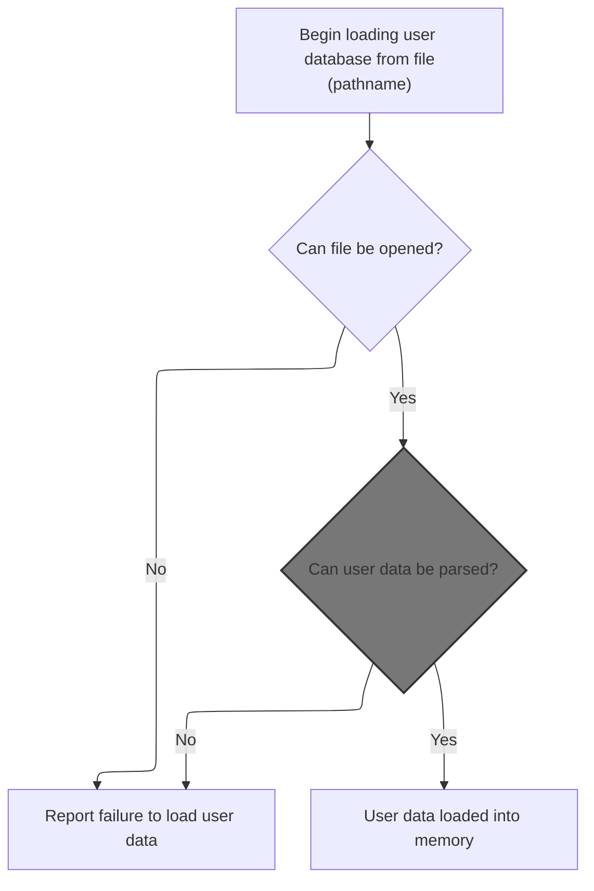
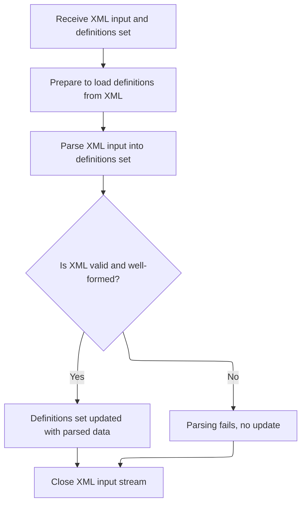

This document outlines how user and subscription data is loaded from XML into memory, enabling management and updates. Changes are saved back to XML to ensure data persistence and consistency.

# Loading and Parsing the User Database



<SwmSnippet path="/apps/faces-example2/src/main/java/org/apache/struts/webapp/example2/memory/MemoryUserDatabase.java" line="175">

---

In <SwmToken path="apps/faces-example2/src/main/java/org/apache/struts/webapp/example2/memory/MemoryUserDatabase.java" pos="175:5:5" line-data="    public void open() throws Exception {">`open`</SwmToken>, we're setting up the digester to parse the XML database file and register factories for user and subscription creation. This lets us build the <SwmToken path="apps/faces-example2/src/main/java/org/apache/struts/webapp/example2/memory/MemoryUserDatabase.java" pos="45:23:25" line-data=" * &lt;p&gt;Concrete implementation of {@link UserDatabase} for an in-memory">`in-memory`</SwmToken> database from XML. Next, we call the XML parser to actually process the file and populate the objects.

```java
    public void open() throws Exception {

        FileInputStream fis = null;
        BufferedInputStream bis = null;

        try {

            // Acquire an input stream to our database file
            if (log.isDebugEnabled()) {
                log.debug("Loading database from '" + pathname + "'");
            }
            fis = new FileInputStream(pathname);
            bis = new BufferedInputStream(fis);

            // Construct a digester to use for parsing
            Digester digester = new Digester();
            digester.push(this);
            digester.setValidating(false);
            digester.addFactoryCreate
                ("database/user",
                 new MemoryUserCreationFactory(this));
            digester.addFactoryCreate
                ("database/user/subscription",
                 new MemorySubscriptionCreationFactory(this));

            // Parse the input stream to initialize our database
            digester.parse(bis);
```

---

</SwmSnippet>

## Parsing XML Definitions



<SwmSnippet path="/tiles/src/main/java/org/apache/struts/tiles/xmlDefinition/XmlParser.java" line="275">

---

<SwmToken path="tiles/src/main/java/org/apache/struts/tiles/xmlDefinition/XmlParser.java" pos="275:5:5" line-data="  public void parse( InputStream in, XmlDefinitionsSet definitions ) throws IOException, SAXException">`parse`</SwmToken> pushes the definitions object onto the digester stack and parses the XML stream, populating the definitions. After this, we move on to the user database logic to handle the parsed data.

```java
  public void parse( InputStream in, XmlDefinitionsSet definitions ) throws IOException, SAXException
  {
    try
    {
      // set first object in stack
    //digester.clear();
    digester.push(definitions);
      // parse
      digester.parse(in);
      in.close();
      }
  catch (SAXException e)
    {
      //throw new ServletException( "Error while parsing " + mappingConfig, e);
    throw e;
      }

  }
```

---

</SwmSnippet>

## Finalizing Database Changes

<SwmSnippet path="/apps/faces-example1/src/main/java/org/apache/struts/webapp/example/memory/MemoryUserDatabase.java" line="106">

---

<SwmToken path="apps/faces-example1/src/main/java/org/apache/struts/webapp/example/memory/MemoryUserDatabase.java" pos="106:5:5" line-data="    public void close() throws Exception {">`close`</SwmToken> just triggers <SwmToken path="apps/faces-example1/src/main/java/org/apache/struts/webapp/example/memory/MemoryUserDatabase.java" pos="108:1:1" line-data="        save();">`save`</SwmToken> to persist any changes. We call save next to write the updated database to disk.

```java
    public void close() throws Exception {

        save();

    }
```

---

</SwmSnippet>

## Writing Database to XML

<SwmSnippet path="/apps/faces-example1/src/main/java/org/apache/struts/webapp/example/memory/MemoryUserDatabase.java" line="257">

---

In <SwmToken path="apps/faces-example1/src/main/java/org/apache/struts/webapp/example/memory/MemoryUserDatabase.java" pos="257:5:5" line-data="    public void save() throws Exception {">`save`</SwmToken>, we're writing users and their subscriptions to an XML file using their <SwmToken path="tiles/src/main/java/org/apache/struts/tiles/xmlDefinition/XmlParser.java" pos="75:13:15" line-data="          digester.register(registrations[i], url.toString());">`toString()`</SwmToken> methods. This section handles the main loop for outputting all user and subscription data.

```java
    public void save() throws Exception {

        if (log.isDebugEnabled()) {
            log.debug("Saving database to '" + pathname + "'");
        }
        File fileNew = new File(pathnameNew);
        PrintWriter writer = null;

        try {

            // Configure our PrintWriter
            FileOutputStream fos = new FileOutputStream(fileNew);
            OutputStreamWriter osw = new OutputStreamWriter(fos);
            writer = new PrintWriter(osw);

            // Print the file prolog
            writer.println("<?xml version='1.0'?>");
            writer.println("<database>");

            // Print entries for each defined user and associated subscriptions
            User users[] = findUsers();
            for (int i = 0; i < users.length; i++) {
                writer.print("  ");
                writer.println(users[i]);
                Subscription subscriptions[] =
                    users[i].getSubscriptions();
                for (int j = 0; j < subscriptions.length; j++) {
                    writer.print("    ");
                    writer.println(subscriptions[j]);
                    writer.print("    ");
                    writer.println("</subscription>");
                }
                writer.print("  ");
                writer.println("</user>");
            }
```

---

</SwmSnippet>

<SwmSnippet path="/apps/faces-example1/src/main/java/org/apache/struts/webapp/example/memory/MemoryUserDatabase.java" line="293">

---

After writing the XML, we check for errors from the writer. If there's a problem, we clean up and throw an exception before moving on.

```java
            // Print the file epilog
            writer.println("</database>");

            // Check for errors that occurred while printing
            if (writer.checkError()) {
                writer.close();
```

---

</SwmSnippet>

<SwmSnippet path="/apps/faces-example1/src/main/java/org/apache/struts/webapp/example/memory/MemoryUserDatabase.java" line="299">

---

Back in `MemoryUserDatabase.save`, if saving fails, we delete the new file and throw an exception. Next, we move to RegistrationBacking to handle user registration logic.

```java
                fileNew.delete();
                throw new IOException
                    ("Saving database to '" + pathname + "'");
            }
```

---

</SwmSnippet>

### Removing User Registration

See <SwmLink doc-title="Deleting a Subscription">[Deleting a Subscription](/.swm/deleting-a-subscription.0ywpr398.sw.md)</SwmLink>

### Completing Save After Registration Deletion

```mermaid
%%{init: {"flowchart": {"defaultRenderer": "elk"}} }%%
flowchart TD
    node1["Begin saving user database changes"] --> node2{"Is original database file present?"}
    click node1 openCode "apps/faces-example1/src/main/java/org/apache/struts/webapp/example/memory/MemoryUserDatabase.java:303:305"
    node2 -->|"Yes"| node3["Remove previous backup"]
    click node2 openCode "apps/faces-example1/src/main/java/org/apache/struts/webapp/example/memory/MemoryUserDatabase.java:320:326"
    node3 --> node4{"Backup original database file?"}
    click node3 openCode "apps/faces-example1/src/main/java/org/apache/struts/webapp/example/memory/MemoryUserDatabase.java:321:325"
    node4 -->|"Success"| node5{"Replace database with new version?"}
    click node4 openCode "apps/faces-example1/src/main/java/org/apache/struts/webapp/example/memory/MemoryUserDatabase.java:327:333"
    node4 -->|"Fail"| node6["Abort: Could not backup original
database"]
    click node6 openCode "apps/faces-example1/src/main/java/org/apache/struts/webapp/example/memory/MemoryUserDatabase.java:323:324"
    node2 -->|"No"| node5
    node5 -->|"Success"| node7["Remove backup and finish"]
    click node5 openCode "apps/faces-example1/src/main/java/org/apache/struts/webapp/example/memory/MemoryUserDatabase.java:334:336"
    node5 -->|"Fail"| node8{"Is backup present?"}
    click node8 openCode "apps/faces-example1/src/main/java/org/apache/struts/webapp/example/memory/MemoryUserDatabase.java:328:330"
    node8 -->|"Yes"| node9["Restore backup as database"]
    click node9 openCode "apps/faces-example1/src/main/java/org/apache/struts/webapp/example/memory/MemoryUserDatabase.java:329:330"
    node8 -->|"No"| node10["Abort: Could not save new database"]
    click node10 openCode "apps/faces-example1/src/main/java/org/apache/struts/webapp/example/memory/MemoryUserDatabase.java:331:332"
    node9 --> node10
    node7 --> node11["Database changes saved"]
    click node11 openCode "apps/faces-example1/src/main/java/org/apache/struts/webapp/example/memory/MemoryUserDatabase.java:336:336"
classDef HeadingStyle fill:#777777,stroke:#333,stroke-width:2px;

%% Swimm:
%% %%{init: {"flowchart": {"defaultRenderer": "elk"}} }%%
%% flowchart TD
%%     node1["Begin saving user database changes"] --> node2{"Is original database file present?"}
%%     click node1 openCode "<SwmPath>[apps/…/memory/MemoryUserDatabase.java](apps/faces-example1/src/main/java/org/apache/struts/webapp/example/memory/MemoryUserDatabase.java)</SwmPath>:303:305"
%%     node2 -->|"Yes"| node3["Remove previous backup"]
%%     click node2 openCode "<SwmPath>[apps/…/memory/MemoryUserDatabase.java](apps/faces-example1/src/main/java/org/apache/struts/webapp/example/memory/MemoryUserDatabase.java)</SwmPath>:320:326"
%%     node3 --> node4{"Backup original database file?"}
%%     click node3 openCode "<SwmPath>[apps/…/memory/MemoryUserDatabase.java](apps/faces-example1/src/main/java/org/apache/struts/webapp/example/memory/MemoryUserDatabase.java)</SwmPath>:321:325"
%%     node4 -->|"Success"| node5{"Replace database with new version?"}
%%     click node4 openCode "<SwmPath>[apps/…/memory/MemoryUserDatabase.java](apps/faces-example1/src/main/java/org/apache/struts/webapp/example/memory/MemoryUserDatabase.java)</SwmPath>:327:333"
%%     node4 -->|"Fail"| node6["Abort: Could not backup original
%% database"]
%%     click node6 openCode "<SwmPath>[apps/…/memory/MemoryUserDatabase.java](apps/faces-example1/src/main/java/org/apache/struts/webapp/example/memory/MemoryUserDatabase.java)</SwmPath>:323:324"
%%     node2 -->|"No"| node5
%%     node5 -->|"Success"| node7["Remove backup and finish"]
%%     click node5 openCode "<SwmPath>[apps/…/memory/MemoryUserDatabase.java](apps/faces-example1/src/main/java/org/apache/struts/webapp/example/memory/MemoryUserDatabase.java)</SwmPath>:334:336"
%%     node5 -->|"Fail"| node8{"Is backup present?"}
%%     click node8 openCode "<SwmPath>[apps/…/memory/MemoryUserDatabase.java](apps/faces-example1/src/main/java/org/apache/struts/webapp/example/memory/MemoryUserDatabase.java)</SwmPath>:328:330"
%%     node8 -->|"Yes"| node9["Restore backup as database"]
%%     click node9 openCode "<SwmPath>[apps/…/memory/MemoryUserDatabase.java](apps/faces-example1/src/main/java/org/apache/struts/webapp/example/memory/MemoryUserDatabase.java)</SwmPath>:329:330"
%%     node8 -->|"No"| node10["Abort: Could not save new database"]
%%     click node10 openCode "<SwmPath>[apps/…/memory/MemoryUserDatabase.java](apps/faces-example1/src/main/java/org/apache/struts/webapp/example/memory/MemoryUserDatabase.java)</SwmPath>:331:332"
%%     node9 --> node10
%%     node7 --> node11["Database changes saved"]
%%     click node11 openCode "<SwmPath>[apps/…/memory/MemoryUserDatabase.java](apps/faces-example1/src/main/java/org/apache/struts/webapp/example/memory/MemoryUserDatabase.java)</SwmPath>:336:336"
%% classDef HeadingStyle fill:#777777,stroke:#333,stroke-width:2px;
```



<SwmSnippet path="/apps/faces-example1/src/main/java/org/apache/struts/webapp/example/memory/MemoryUserDatabase.java" line="303">

---

After returning from RegistrationBacking, we close the writer in `MemoryUserDatabase.save` to finalize the file output. Then we continue with the rest of the save logic.

```java
            writer.close();
            writer = null;

        } catch (IOException e) {

            if (writer != null) {
                writer.close();
            }
```

---

</SwmSnippet>

<SwmSnippet path="/apps/faces-example1/src/main/java/org/apache/struts/webapp/example/memory/MemoryUserDatabase.java" line="311">

---

After finishing the file output in `MemoryUserDatabase.save`, we handle renaming files to make the update atomic. If anything fails, we restore from backup. Next, we move to RegistrationBacking to handle user registration updates.

```java
            fileNew.delete();
            throw e;

        }


        // Perform the required renames to permanently save this file
        File fileOrig = new File(pathname);
        File fileOld = new File(pathnameOld);
        if (fileOrig.exists()) {
            fileOld.delete();
            if (!fileOrig.renameTo(fileOld)) {
                throw new IOException
                    ("Renaming '" + pathname + "' to '" + pathnameOld + "'");
            }
        }
        if (!fileNew.renameTo(fileOrig)) {
            if (fileOld.exists()) {
                fileOld.renameTo(fileOrig);
            }
            throw new IOException
                ("Renaming '" + pathnameNew + "' to '" + pathname + "'");
        }
        fileOld.delete();

    }
```

---

</SwmSnippet>

## Cleanup After Database Load

<SwmSnippet path="/apps/faces-example2/src/main/java/org/apache/struts/webapp/example2/memory/MemoryUserDatabase.java" line="202">

---

After parsing in `MemoryUserDatabase.open`, we clean up streams and handle errors. Next, we call close to persist any changes and finalize the database state.

```java
            bis.close();
            bis = null;
            fis = null;

        } catch (Exception e) {

            log.error("Loading database from '" + pathname + "':", e);
            throw e;

        } finally {

            if (bis != null) {
                try {
                    bis.close();
                } catch (Throwable t) {
                    ;
                }
                bis = null;
                fis = null;
            }

        }

    }
```

---

</SwmSnippet>

# Persisting Database State

<SwmSnippet path="/apps/faces-example2/src/main/java/org/apache/struts/webapp/example2/memory/MemoryUserDatabase.java" line="106">

---

<SwmToken path="apps/faces-example2/src/main/java/org/apache/struts/webapp/example2/memory/MemoryUserDatabase.java" pos="106:5:5" line-data="    public void close() throws Exception {">`close`</SwmToken> just triggers <SwmToken path="apps/faces-example2/src/main/java/org/apache/struts/webapp/example2/memory/MemoryUserDatabase.java" pos="108:1:1" line-data="        save();">`save`</SwmToken> to write out any changes. We call save next to handle the actual file output.

```java
    public void close() throws Exception {

        save();

    }
```

---

</SwmSnippet>

# Serializing Database to XML

```mermaid
%%{init: {"flowchart": {"defaultRenderer": "elk"}} }%%
flowchart TD
  node1["Start saving user database"]
  click node1 openCode "apps/faces-example2/src/main/java/org/apache/struts/webapp/example2/memory/MemoryUserDatabase.java:257:258"
  node1 --> node2["Write XML prolog"]
  click node2 openCode "apps/faces-example2/src/main/java/org/apache/struts/webapp/example2/memory/MemoryUserDatabase.java:273:274"
  node2 --> node3

  subgraph loop1["For each user"]
    node3["Write user entry"]
    click node3 openCode "apps/faces-example2/src/main/java/org/apache/struts/webapp/example2/memory/MemoryUserDatabase.java:279:290"
    subgraph loop2["For each subscription of user"]
      node4["Write subscription entry"]
      click node4 openCode "apps/faces-example2/src/main/java/org/apache/struts/webapp/example2/memory/MemoryUserDatabase.java:284:287"
    end
  end

  node3 --> node5["Write XML epilog"]
  click node5 openCode "apps/faces-example2/src/main/java/org/apache/struts/webapp/example2/memory/MemoryUserDatabase.java:294:294"
  node5 --> node6{"Error during writing?"}
  click node6 openCode "apps/faces-example2/src/main/java/org/apache/struts/webapp/example2/memory/MemoryUserDatabase.java:297:302"
  node6 -->|"Yes"| node7["Delete new file and report error"]
  click node7 openCode "apps/faces-example2/src/main/java/org/apache/struts/webapp/example2/memory/MemoryUserDatabase.java:299:301"
  node6 -->|"No"| node8{"Original file exists?"}
  click node8 openCode "apps/faces-example2/src/main/java/org/apache/struts/webapp/example2/memory/MemoryUserDatabase.java:320:326"
  node8 -->|"Yes"| node9["Backup original file"]
  click node9 openCode "apps/faces-example2/src/main/java/org/apache/struts/webapp/example2/memory/MemoryUserDatabase.java:321:325"
  node8 -->|"No"| node10["Proceed to rename"]
  node9 --> node11["Rename new file to original"]
  click node11 openCode "apps/faces-example2/src/main/java/org/apache/struts/webapp/example2/memory/MemoryUserDatabase.java:327:333"
  node10 --> node11
  node11 -->|"Yes"| node12["Delete backup"]
  click node12 openCode "apps/faces-example2/src/main/java/org/apache/struts/webapp/example2/memory/MemoryUserDatabase.java:334:334"
  node11 -->|"No"| node13["Restore backup and report error"]
  click node13 openCode "apps/faces-example2/src/main/java/org/apache/struts/webapp/example2/memory/MemoryUserDatabase.java:328:332"

classDef HeadingStyle fill:#777777,stroke:#333,stroke-width:2px;

%% Swimm:
%% %%{init: {"flowchart": {"defaultRenderer": "elk"}} }%%
%% flowchart TD
%%   node1["Start saving user database"]
%%   click node1 openCode "<SwmPath>[apps/…/memory/MemoryUserDatabase.java](apps/faces-example2/src/main/java/org/apache/struts/webapp/example2/memory/MemoryUserDatabase.java)</SwmPath>:257:258"
%%   node1 --> node2["Write XML prolog"]
%%   click node2 openCode "<SwmPath>[apps/…/memory/MemoryUserDatabase.java](apps/faces-example2/src/main/java/org/apache/struts/webapp/example2/memory/MemoryUserDatabase.java)</SwmPath>:273:274"
%%   node2 --> node3
%% 
%%   subgraph loop1["For each user"]
%%     node3["Write user entry"]
%%     click node3 openCode "<SwmPath>[apps/…/memory/MemoryUserDatabase.java](apps/faces-example2/src/main/java/org/apache/struts/webapp/example2/memory/MemoryUserDatabase.java)</SwmPath>:279:290"
%%     subgraph loop2["For each subscription of user"]
%%       node4["Write subscription entry"]
%%       click node4 openCode "<SwmPath>[apps/…/memory/MemoryUserDatabase.java](apps/faces-example2/src/main/java/org/apache/struts/webapp/example2/memory/MemoryUserDatabase.java)</SwmPath>:284:287"
%%     end
%%   end
%% 
%%   node3 --> node5["Write XML epilog"]
%%   click node5 openCode "<SwmPath>[apps/…/memory/MemoryUserDatabase.java](apps/faces-example2/src/main/java/org/apache/struts/webapp/example2/memory/MemoryUserDatabase.java)</SwmPath>:294:294"
%%   node5 --> node6{"Error during writing?"}
%%   click node6 openCode "<SwmPath>[apps/…/memory/MemoryUserDatabase.java](apps/faces-example2/src/main/java/org/apache/struts/webapp/example2/memory/MemoryUserDatabase.java)</SwmPath>:297:302"
%%   node6 -->|"Yes"| node7["Delete new file and report error"]
%%   click node7 openCode "<SwmPath>[apps/…/memory/MemoryUserDatabase.java](apps/faces-example2/src/main/java/org/apache/struts/webapp/example2/memory/MemoryUserDatabase.java)</SwmPath>:299:301"
%%   node6 -->|"No"| node8{"Original file exists?"}
%%   click node8 openCode "<SwmPath>[apps/…/memory/MemoryUserDatabase.java](apps/faces-example2/src/main/java/org/apache/struts/webapp/example2/memory/MemoryUserDatabase.java)</SwmPath>:320:326"
%%   node8 -->|"Yes"| node9["Backup original file"]
%%   click node9 openCode "<SwmPath>[apps/…/memory/MemoryUserDatabase.java](apps/faces-example2/src/main/java/org/apache/struts/webapp/example2/memory/MemoryUserDatabase.java)</SwmPath>:321:325"
%%   node8 -->|"No"| node10["Proceed to rename"]
%%   node9 --> node11["Rename new file to original"]
%%   click node11 openCode "<SwmPath>[apps/…/memory/MemoryUserDatabase.java](apps/faces-example2/src/main/java/org/apache/struts/webapp/example2/memory/MemoryUserDatabase.java)</SwmPath>:327:333"
%%   node10 --> node11
%%   node11 -->|"Yes"| node12["Delete backup"]
%%   click node12 openCode "<SwmPath>[apps/…/memory/MemoryUserDatabase.java](apps/faces-example2/src/main/java/org/apache/struts/webapp/example2/memory/MemoryUserDatabase.java)</SwmPath>:334:334"
%%   node11 -->|"No"| node13["Restore backup and report error"]
%%   click node13 openCode "<SwmPath>[apps/…/memory/MemoryUserDatabase.java](apps/faces-example2/src/main/java/org/apache/struts/webapp/example2/memory/MemoryUserDatabase.java)</SwmPath>:328:332"
%% 
%% classDef HeadingStyle fill:#777777,stroke:#333,stroke-width:2px;
```



<SwmSnippet path="/apps/faces-example2/src/main/java/org/apache/struts/webapp/example2/memory/MemoryUserDatabase.java" line="257">

---

In <SwmToken path="apps/faces-example2/src/main/java/org/apache/struts/webapp/example2/memory/MemoryUserDatabase.java" pos="257:5:5" line-data="    public void save() throws Exception {">`save`</SwmToken>, we're writing users and their subscriptions to an XML file using their <SwmToken path="tiles/src/main/java/org/apache/struts/tiles/xmlDefinition/XmlParser.java" pos="75:13:15" line-data="          digester.register(registrations[i], url.toString());">`toString()`</SwmToken> methods. This section handles the main loop for outputting all user and subscription data.

```java
    public void save() throws Exception {

        if (log.isDebugEnabled()) {
            log.debug("Saving database to '" + pathname + "'");
        }
        File fileNew = new File(pathnameNew);
        PrintWriter writer = null;

        try {

            // Configure our PrintWriter
            FileOutputStream fos = new FileOutputStream(fileNew);
            OutputStreamWriter osw = new OutputStreamWriter(fos);
            writer = new PrintWriter(osw);

            // Print the file prolog
            writer.println("<?xml version='1.0'?>");
            writer.println("<database>");

            // Print entries for each defined user and associated subscriptions
            User users[] = findUsers();
            for (int i = 0; i < users.length; i++) {
                writer.print("  ");
                writer.println(users[i]);
                Subscription subscriptions[] =
                    users[i].getSubscriptions();
                for (int j = 0; j < subscriptions.length; j++) {
                    writer.print("    ");
                    writer.println(subscriptions[j]);
                    writer.print("    ");
                    writer.println("</subscription>");
                }
                writer.print("  ");
                writer.println("</user>");
            }
```

---

</SwmSnippet>

<SwmSnippet path="/apps/faces-example2/src/main/java/org/apache/struts/webapp/example2/memory/MemoryUserDatabase.java" line="293">

---

After writing the XML, we check for errors from the writer. If there's a problem, we clean up and throw an exception before moving on.

```java
            // Print the file epilog
            writer.println("</database>");

            // Check for errors that occurred while printing
            if (writer.checkError()) {
                writer.close();
```

---

</SwmSnippet>

<SwmSnippet path="/apps/faces-example2/src/main/java/org/apache/struts/webapp/example2/memory/MemoryUserDatabase.java" line="299">

---

Back in `MemoryUserDatabase.save`, if saving fails, we delete the new file and throw an exception. Next, we move to RegistrationBacking to handle user registration logic.

```java
                fileNew.delete();
                throw new IOException
                    ("Saving database to '" + pathname + "'");
            }
```

---

</SwmSnippet>

<SwmSnippet path="/apps/faces-example2/src/main/java/org/apache/struts/webapp/example2/memory/MemoryUserDatabase.java" line="303">

---

After returning from RegistrationBacking, we close the writer in `MemoryUserDatabase.save` to finalize the file output. Then we continue with the rest of the save logic.

```java
            writer.close();
            writer = null;

        } catch (IOException e) {

            if (writer != null) {
                writer.close();
            }
```

---

</SwmSnippet>

<SwmSnippet path="/apps/faces-example2/src/main/java/org/apache/struts/webapp/example2/memory/MemoryUserDatabase.java" line="311">

---

After finishing the file output in `MemoryUserDatabase.save`, we handle renaming files to make the update atomic. If anything fails, we restore from backup. Next, we move to RegistrationBacking to handle user registration updates.

```java
            fileNew.delete();
            throw e;

        }


        // Perform the required renames to permanently save this file
        File fileOrig = new File(pathname);
        File fileOld = new File(pathnameOld);
        if (fileOrig.exists()) {
            fileOld.delete();
            if (!fileOrig.renameTo(fileOld)) {
                throw new IOException
                    ("Renaming '" + pathname + "' to '" + pathnameOld + "'");
            }
        }
        if (!fileNew.renameTo(fileOrig)) {
            if (fileOld.exists()) {
                fileOld.renameTo(fileOrig);
            }
            throw new IOException
                ("Renaming '" + pathnameNew + "' to '" + pathname + "'");
        }
        fileOld.delete();

    }
```

---

</SwmSnippet>

&nbsp;

*This is an auto-generated document by Swimm 🌊 and has not yet been verified by a human*

<SwmMeta version="3.0.0" repo-id="Z2l0aHViJTNBJTNBc3RydXRzMSUzQSUzQVN3aW1tLURlbW8=" repo-name="struts1"><sup>Powered by [Swimm](https://app.swimm.io/)</sup></SwmMeta>
