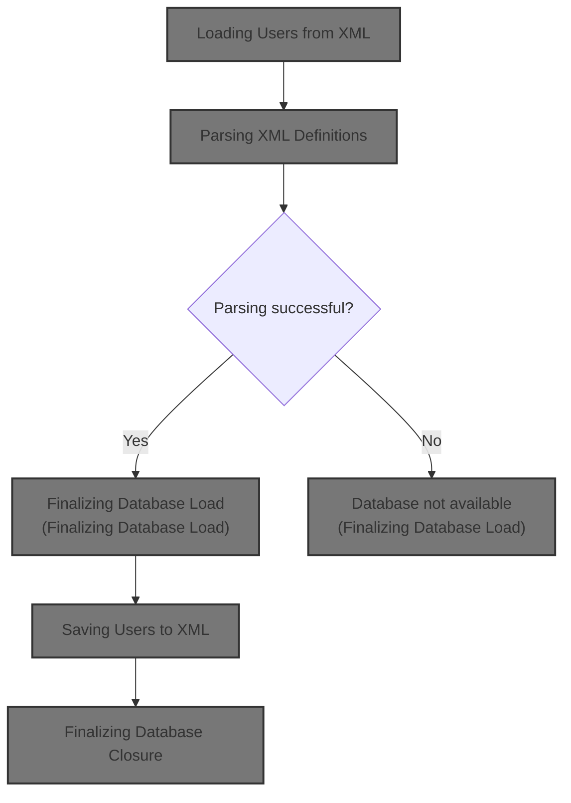
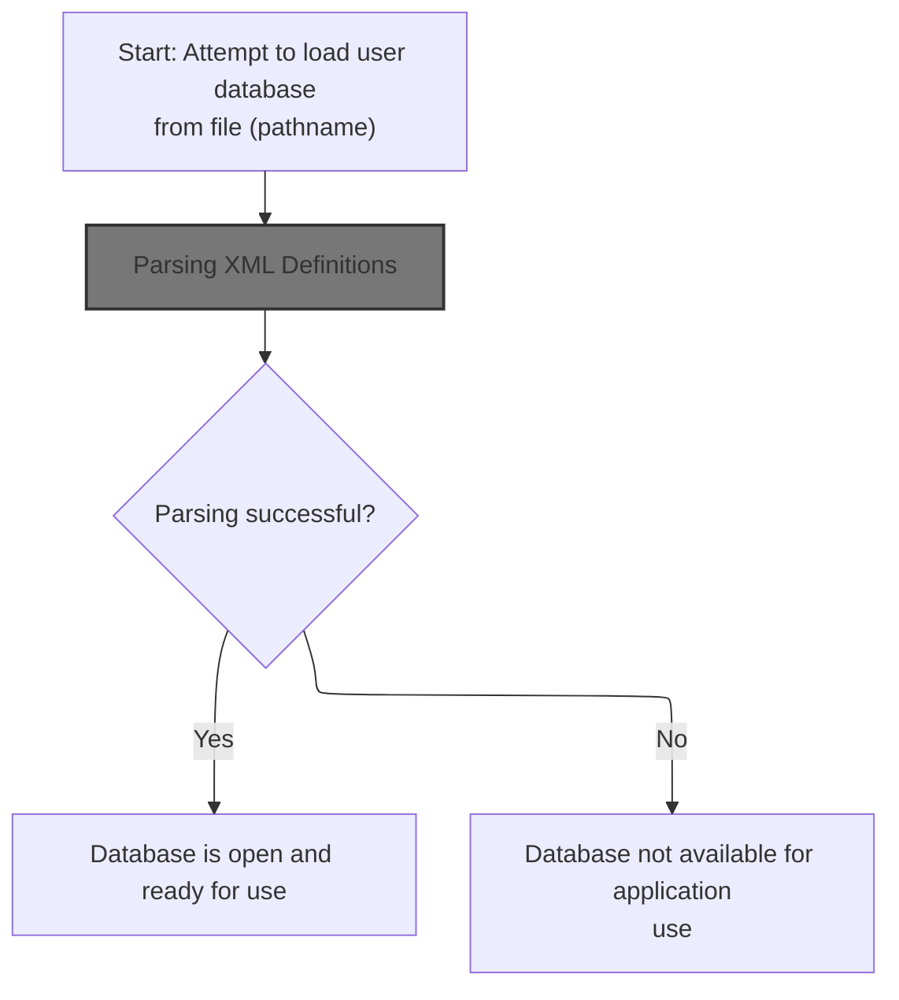
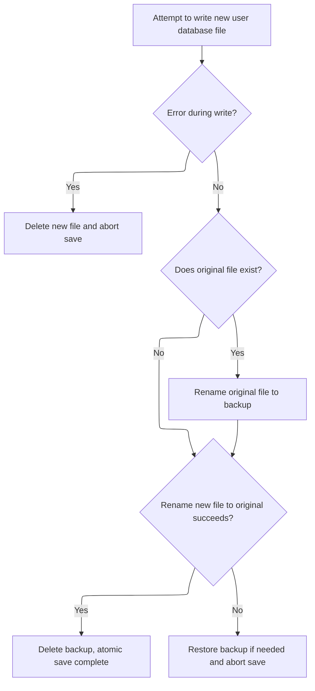
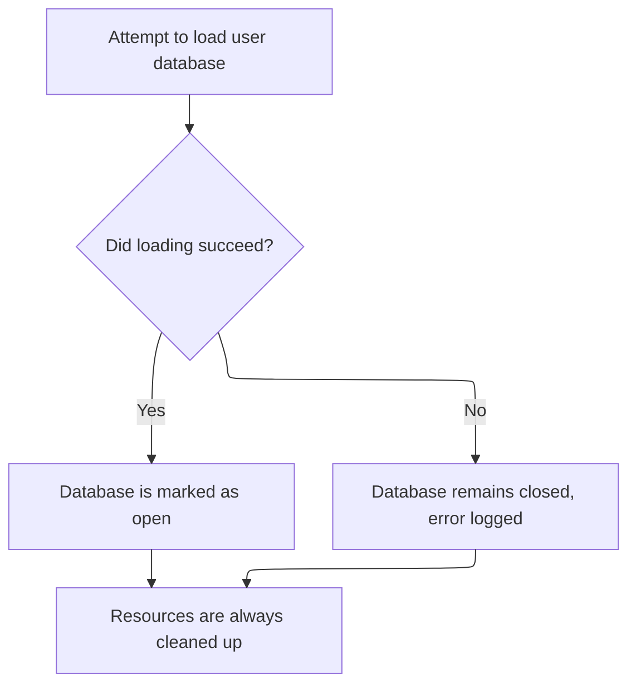

This document describes how user and subscription data is loaded from XML files into an <SwmToken path="mailreader-dao/src/main/java/org/apache/struts/apps/mailreader/dao/impl/memory/MemoryUserDatabase.java" pos="44:23:25" line-data=" * &lt;p&gt;Concrete implementation of {@link UserDatabase} for an in-memory">`in-memory`</SwmToken> database, and how changes are saved back to XML. The flow ensures the database is ready for use after loading, and updates are written atomically to prevent data corruption.



# Loading Users from XML



<SwmSnippet path="/mailreader-dao/src/main/java/org/apache/struts/apps/mailreader/dao/impl/memory/MemoryUserDatabase.java" line="153">

---

In <SwmToken path="mailreader-dao/src/main/java/org/apache/struts/apps/mailreader/dao/impl/memory/MemoryUserDatabase.java" pos="153:5:5" line-data="    public void open() throws Exception {">`open`</SwmToken>, we set up the input stream and configure the Digester to map <SwmToken path="mailreader-dao/src/main/java/org/apache/struts/apps/mailreader/dao/impl/memory/MemoryUserDatabase.java" pos="172:3:5" line-data="                (&quot;database/user&quot;,">`database/user`</SwmToken> and <SwmToken path="mailreader-dao/src/main/java/org/apache/struts/apps/mailreader/dao/impl/memory/MemoryUserDatabase.java" pos="175:3:7" line-data="                (&quot;database/user/subscription&quot;,">`database/user/subscription`</SwmToken> XML elements to <SwmToken path="mailreader-dao/src/main/java/org/apache/struts/apps/mailreader/dao/impl/memory/MemoryUserDatabase.java" pos="44:23:25" line-data=" * &lt;p&gt;Concrete implementation of {@link UserDatabase} for an in-memory">`in-memory`</SwmToken> user and subscription objects using custom factories. We need to call the XML parser next to actually process the XML and populate the database objects.

```java
    public void open() throws Exception {

        FileInputStream fis = null;
        BufferedInputStream bis = null;

        try {

            // Acquire an input stream to our database file
            if (log.isDebugEnabled()) {
                log.debug("Loading database from '" + pathname + "'");
            }
            fis = new FileInputStream(pathname);
            bis = new BufferedInputStream(fis);

            // Construct a digester to use for parsing
            Digester digester = new Digester();
            digester.push(this);
            digester.setValidating(false);
            digester.addFactoryCreate
                ("database/user",
                 new MemoryUserCreationFactory(this));
            digester.addFactoryCreate
                ("database/user/subscription",
                 new MemorySubscriptionCreationFactory());

            // Parse the input stream to initialize our database
            digester.parse(bis);
```

---

</SwmSnippet>

## Parsing XML Definitions

<SwmSnippet path="/tiles/src/main/java/org/apache/struts/tiles/xmlDefinition/XmlParser.java" line="275">

---

<SwmToken path="tiles/src/main/java/org/apache/struts/tiles/xmlDefinition/XmlParser.java" pos="275:5:5" line-data="  public void parse( InputStream in, XmlDefinitionsSet definitions ) throws IOException, SAXException">`parse`</SwmToken> pushes the definitions set onto the digester stack and parses the input stream, mapping XML elements to objects. After parsing, we need to move back to the user database logic to handle the results and finalize the database state.

```java
  public void parse( InputStream in, XmlDefinitionsSet definitions ) throws IOException, SAXException
  {
    try
    {
      // set first object in stack
    //digester.clear();
    digester.push(definitions);
      // parse
      digester.parse(in);
      in.close();
      }
  catch (SAXException e)
    {
      //throw new ServletException( "Error while parsing " + mappingConfig, e);
    throw e;
      }

  }
```

---

</SwmSnippet>

## Saving Users to XML

<SwmSnippet path="/apps/faces-example1/src/main/java/org/apache/struts/webapp/example/memory/MemoryUserDatabase.java" line="106">

---

<SwmToken path="apps/faces-example1/src/main/java/org/apache/struts/webapp/example/memory/MemoryUserDatabase.java" pos="106:5:5" line-data="    public void close() throws Exception {">`close`</SwmToken> just calls <SwmToken path="apps/faces-example1/src/main/java/org/apache/struts/webapp/example/memory/MemoryUserDatabase.java" pos="108:1:1" line-data="        save();">`save`</SwmToken> to write the current <SwmToken path="mailreader-dao/src/main/java/org/apache/struts/apps/mailreader/dao/impl/memory/MemoryUserDatabase.java" pos="44:23:25" line-data=" * &lt;p&gt;Concrete implementation of {@link UserDatabase} for an in-memory">`in-memory`</SwmToken> user and subscription data back to disk. We need to call <SwmToken path="apps/faces-example1/src/main/java/org/apache/struts/webapp/example/memory/MemoryUserDatabase.java" pos="108:1:1" line-data="        save();">`save`</SwmToken> next to actually perform the file write.

```java
    public void close() throws Exception {

        save();

    }
```

---

</SwmSnippet>

## Writing XML and Error Checking

<SwmSnippet path="/apps/faces-example1/src/main/java/org/apache/struts/webapp/example/memory/MemoryUserDatabase.java" line="257">

---

In <SwmToken path="apps/faces-example1/src/main/java/org/apache/struts/webapp/example/memory/MemoryUserDatabase.java" pos="257:5:5" line-data="    public void save() throws Exception {">`save`</SwmToken>, we write the XML prolog, open the <database> tag, and iterate through all users and their subscriptions, writing each as XML. The function assumes <SwmToken path="tiles/src/main/java/org/apache/struts/tiles/xmlDefinition/XmlParser.java" pos="75:13:15" line-data="          digester.register(registrations[i], url.toString());">`toString()`</SwmToken> on these objects outputs valid XML. After writing, we need to check for print errors before finalizing the file.

```java
    public void save() throws Exception {

        if (log.isDebugEnabled()) {
            log.debug("Saving database to '" + pathname + "'");
        }
        File fileNew = new File(pathnameNew);
        PrintWriter writer = null;

        try {

            // Configure our PrintWriter
            FileOutputStream fos = new FileOutputStream(fileNew);
            OutputStreamWriter osw = new OutputStreamWriter(fos);
            writer = new PrintWriter(osw);

            // Print the file prolog
            writer.println("<?xml version='1.0'?>");
            writer.println("<database>");

            // Print entries for each defined user and associated subscriptions
            User users[] = findUsers();
            for (int i = 0; i < users.length; i++) {
                writer.print("  ");
                writer.println(users[i]);
                Subscription subscriptions[] =
                    users[i].getSubscriptions();
                for (int j = 0; j < subscriptions.length; j++) {
                    writer.print("    ");
                    writer.println(subscriptions[j]);
                    writer.print("    ");
                    writer.println("</subscription>");
                }
                writer.print("  ");
                writer.println("</user>");
            }
```

---

</SwmSnippet>

<SwmSnippet path="/apps/faces-example1/src/main/java/org/apache/struts/webapp/example/memory/MemoryUserDatabase.java" line="293">

---

Here, we close the <database> tag and call <SwmToken path="apps/faces-example1/src/main/java/org/apache/struts/webapp/example/memory/MemoryUserDatabase.java" pos="297:6:8" line-data="            if (writer.checkError()) {">`checkError()`</SwmToken> on the writer to catch any print errors before moving on. Next, we need to check the writer's error state to decide if the file write was successful.

```java
            // Print the file epilog
            writer.println("</database>");

            // Check for errors that occurred while printing
            if (writer.checkError()) {
```

---

</SwmSnippet>

<SwmSnippet path="/core/src/main/java/org/apache/struts/util/ServletContextWriter.java" line="77">

---

<SwmToken path="core/src/main/java/org/apache/struts/util/ServletContextWriter.java" pos="77:5:5" line-data="    public boolean checkError() {">`checkError`</SwmToken> flushes the writer before returning the error state, so we get an up-to-date status on whether any print errors occurred during XML writing.

```java
    public boolean checkError() {
        flush();

        return (error);
    }
```

---

</SwmSnippet>

<SwmSnippet path="/apps/faces-example1/src/main/java/org/apache/struts/webapp/example/memory/MemoryUserDatabase.java" line="298">

---

Back from `ServletContextWriter.checkError`, if an error was detected, we close the writer and delete the temporary file. Next, we throw an exception to signal the failure, so the calling code in `MemoryUserDatabase.save` can handle it.

```java
                writer.close();
```

---

</SwmSnippet>

<SwmSnippet path="/apps/faces-example1/src/main/java/org/apache/struts/webapp/example/memory/MemoryUserDatabase.java" line="299">

---

Back from `MemoryUserDatabase.save`, if an error occurred, we delete the temporary file and throw an <SwmToken path="apps/faces-example1/src/main/java/org/apache/struts/webapp/example/memory/MemoryUserDatabase.java" pos="300:5:5" line-data="                throw new IOException">`IOException`</SwmToken>. Next, control moves to the registration logic (`RegistrationBacking`) to handle the error or notify the user.

```java
                fileNew.delete();
                throw new IOException
                    ("Saving database to '" + pathname + "'");
            }
```

---

</SwmSnippet>

### Handling Registration Deletion

See <SwmLink doc-title="Deleting a Subscription">[Deleting a Subscription](/.swm/deleting-a-subscription.jz3i35xd.sw.md)</SwmLink>

### Finalizing Save and Cleanup



<SwmSnippet path="/apps/faces-example1/src/main/java/org/apache/struts/webapp/example/memory/MemoryUserDatabase.java" line="303">

---

Back from `RegistrationBacking`, we close the writer and clear the reference to avoid resource leaks. Next, we handle any IOExceptions and continue with the file renaming and cleanup in `MemoryUserDatabase.save`.

```java
            writer.close();
            writer = null;

        } catch (IOException e) {

            if (writer != null) {
                writer.close();
            }
```

---

</SwmSnippet>

<SwmSnippet path="/apps/faces-example1/src/main/java/org/apache/struts/webapp/example/memory/MemoryUserDatabase.java" line="311">

---

Back from `MemoryUserDatabase.save`, we perform the file renaming steps to atomically replace the old database file with the new one, and clean up the backup. If anything fails, we try to restore the original. Next, control can return to registration or higher-level logic for further actions.

```java
            fileNew.delete();
            throw e;

        }


        // Perform the required renames to permanently save this file
        File fileOrig = new File(pathname);
        File fileOld = new File(pathnameOld);
        if (fileOrig.exists()) {
            fileOld.delete();
            if (!fileOrig.renameTo(fileOld)) {
                throw new IOException
                    ("Renaming '" + pathname + "' to '" + pathnameOld + "'");
            }
        }
        if (!fileNew.renameTo(fileOrig)) {
            if (fileOld.exists()) {
                fileOld.renameTo(fileOrig);
            }
            throw new IOException
                ("Renaming '" + pathnameNew + "' to '" + pathname + "'");
        }
        fileOld.delete();

    }
```

---

</SwmSnippet>

## Finalizing Database Load



<SwmSnippet path="/mailreader-dao/src/main/java/org/apache/struts/apps/mailreader/dao/impl/memory/MemoryUserDatabase.java" line="180">

---

Back from `XmlParser.parse`, we close the input streams, set the database as open, and handle any exceptions. Next, we can move on to closing or saving the database as needed.

```java
            bis.close();
            bis = null;
            fis = null;
            this.open = true;

        } catch (Exception e) {

            log.error("Loading database from '" + pathname + "':", e);
            throw e;

        } finally {

            if (bis != null) {
                try {
                    bis.close();
                } catch (Throwable t) {
                    // do nothing
                }
                bis = null;
                fis = null;
            }

        }

    }
```

---

</SwmSnippet>

# Closing the Database

<SwmSnippet path="/mailreader-dao/src/main/java/org/apache/struts/apps/mailreader/dao/impl/memory/MemoryUserDatabase.java" line="102">

---

In <SwmToken path="mailreader-dao/src/main/java/org/apache/struts/apps/mailreader/dao/impl/memory/MemoryUserDatabase.java" pos="102:5:5" line-data="    public void close() throws Exception {">`close`</SwmToken>, we trigger <SwmToken path="mailreader-dao/src/main/java/org/apache/struts/apps/mailreader/dao/impl/memory/MemoryUserDatabase.java" pos="104:1:1" line-data="        save();">`save`</SwmToken> to persist all <SwmToken path="mailreader-dao/src/main/java/org/apache/struts/apps/mailreader/dao/impl/memory/MemoryUserDatabase.java" pos="44:23:25" line-data=" * &lt;p&gt;Concrete implementation of {@link UserDatabase} for an in-memory">`in-memory`</SwmToken> changes to disk before marking the database as closed. Next, we need to call <SwmToken path="mailreader-dao/src/main/java/org/apache/struts/apps/mailreader/dao/impl/memory/MemoryUserDatabase.java" pos="104:1:1" line-data="        save();">`save`</SwmToken> to handle the actual file write.

```java
    public void close() throws Exception {

        save();
```

---

</SwmSnippet>

## Persisting User Data

```mermaid
%%{init: {"flowchart": {"defaultRenderer": "elk"}} }%%
flowchart TD
    node1["Start saving user database"] --> node2["Write XML prolog"]
    click node1 openCode "mailreader-dao/src/main/java/org/apache/struts/apps/mailreader/dao/impl/memory/MemoryUserDatabase.java:225:241"
    click node2 openCode "mailreader-dao/src/main/java/org/apache/struts/apps/mailreader/dao/impl/memory/MemoryUserDatabase.java:241:243"
    node2 --> node3["Write users and subscriptions"]
    click node3 openCode "mailreader-dao/src/main/java/org/apache/struts/apps/mailreader/dao/impl/memory/MemoryUserDatabase.java:244:259"
    subgraph loop1["For each user in user list"]
      node3 --> node4["Write user data"]
      click node4 openCode "mailreader-dao/src/main/java/org/apache/struts/apps/mailreader/dao/impl/memory/MemoryUserDatabase.java:247:249"
      subgraph loop2["For each subscription in subscription
list"]
        node4 --> node5["Write subscription data"]
        click node5 openCode "mailreader-dao/src/main/java/org/apache/struts/apps/mailreader/dao/impl/memory/MemoryUserDatabase.java:250:256"
      end
      node5 --> node6["Finish user"]
      click node6 openCode "mailreader-dao/src/main/java/org/apache/struts/apps/mailreader/dao/impl/memory/MemoryUserDatabase.java:257:258"
      node6 --> node3
    end
    node3 --> node7["Write XML epilog"]
    click node7 openCode "mailreader-dao/src/main/java/org/apache/struts/apps/mailreader/dao/impl/memory/MemoryUserDatabase.java:261:262"
    node7 --> node8{"Does original file exist?"}
    click node8 openCode "mailreader-dao/src/main/java/org/apache/struts/apps/mailreader/dao/impl/memory/MemoryUserDatabase.java:288:294"
    node8 -->|"Yes"| node9["Rename original file to backup"]
    click node9 openCode "mailreader-dao/src/main/java/org/apache/struts/apps/mailreader/dao/impl/memory/MemoryUserDatabase.java:289:293"
    node8 -->|"No"| node10["Proceed without backup"]
    click node10 openCode "mailreader-dao/src/main/java/org/apache/struts/apps/mailreader/dao/impl/memory/MemoryUserDatabase.java:294:295"
    node9 --> node11["Rename new file to original"]
    node10 --> node11
    click node11 openCode "mailreader-dao/src/main/java/org/apache/struts/apps/mailreader/dao/impl/memory/MemoryUserDatabase.java:295:301"
    node11 --> node12["Delete backup file"]
    click node12 openCode "mailreader-dao/src/main/java/org/apache/struts/apps/mailreader/dao/impl/memory/MemoryUserDatabase.java:302:302"
    node12 --> node13["Database saved successfully"]
    click node13 openCode "mailreader-dao/src/main/java/org/apache/struts/apps/mailreader/dao/impl/memory/MemoryUserDatabase.java:303:304"

classDef HeadingStyle fill:#777777,stroke:#333,stroke-width:2px;

%% Swimm:
%% %%{init: {"flowchart": {"defaultRenderer": "elk"}} }%%
%% flowchart TD
%%     node1["Start saving user database"] --> node2["Write XML prolog"]
%%     click node1 openCode "<SwmPath>[mailreader-dao/…/memory/MemoryUserDatabase.java](mailreader-dao/src/main/java/org/apache/struts/apps/mailreader/dao/impl/memory/MemoryUserDatabase.java)</SwmPath>:225:241"
%%     click node2 openCode "<SwmPath>[mailreader-dao/…/memory/MemoryUserDatabase.java](mailreader-dao/src/main/java/org/apache/struts/apps/mailreader/dao/impl/memory/MemoryUserDatabase.java)</SwmPath>:241:243"
%%     node2 --> node3["Write users and subscriptions"]
%%     click node3 openCode "<SwmPath>[mailreader-dao/…/memory/MemoryUserDatabase.java](mailreader-dao/src/main/java/org/apache/struts/apps/mailreader/dao/impl/memory/MemoryUserDatabase.java)</SwmPath>:244:259"
%%     subgraph loop1["For each user in user list"]
%%       node3 --> node4["Write user data"]
%%       click node4 openCode "<SwmPath>[mailreader-dao/…/memory/MemoryUserDatabase.java](mailreader-dao/src/main/java/org/apache/struts/apps/mailreader/dao/impl/memory/MemoryUserDatabase.java)</SwmPath>:247:249"
%%       subgraph loop2["For each subscription in subscription
%% list"]
%%         node4 --> node5["Write subscription data"]
%%         click node5 openCode "<SwmPath>[mailreader-dao/…/memory/MemoryUserDatabase.java](mailreader-dao/src/main/java/org/apache/struts/apps/mailreader/dao/impl/memory/MemoryUserDatabase.java)</SwmPath>:250:256"
%%       end
%%       node5 --> node6["Finish user"]
%%       click node6 openCode "<SwmPath>[mailreader-dao/…/memory/MemoryUserDatabase.java](mailreader-dao/src/main/java/org/apache/struts/apps/mailreader/dao/impl/memory/MemoryUserDatabase.java)</SwmPath>:257:258"
%%       node6 --> node3
%%     end
%%     node3 --> node7["Write XML epilog"]
%%     click node7 openCode "<SwmPath>[mailreader-dao/…/memory/MemoryUserDatabase.java](mailreader-dao/src/main/java/org/apache/struts/apps/mailreader/dao/impl/memory/MemoryUserDatabase.java)</SwmPath>:261:262"
%%     node7 --> node8{"Does original file exist?"}
%%     click node8 openCode "<SwmPath>[mailreader-dao/…/memory/MemoryUserDatabase.java](mailreader-dao/src/main/java/org/apache/struts/apps/mailreader/dao/impl/memory/MemoryUserDatabase.java)</SwmPath>:288:294"
%%     node8 -->|"Yes"| node9["Rename original file to backup"]
%%     click node9 openCode "<SwmPath>[mailreader-dao/…/memory/MemoryUserDatabase.java](mailreader-dao/src/main/java/org/apache/struts/apps/mailreader/dao/impl/memory/MemoryUserDatabase.java)</SwmPath>:289:293"
%%     node8 -->|"No"| node10["Proceed without backup"]
%%     click node10 openCode "<SwmPath>[mailreader-dao/…/memory/MemoryUserDatabase.java](mailreader-dao/src/main/java/org/apache/struts/apps/mailreader/dao/impl/memory/MemoryUserDatabase.java)</SwmPath>:294:295"
%%     node9 --> node11["Rename new file to original"]
%%     node10 --> node11
%%     click node11 openCode "<SwmPath>[mailreader-dao/…/memory/MemoryUserDatabase.java](mailreader-dao/src/main/java/org/apache/struts/apps/mailreader/dao/impl/memory/MemoryUserDatabase.java)</SwmPath>:295:301"
%%     node11 --> node12["Delete backup file"]
%%     click node12 openCode "<SwmPath>[mailreader-dao/…/memory/MemoryUserDatabase.java](mailreader-dao/src/main/java/org/apache/struts/apps/mailreader/dao/impl/memory/MemoryUserDatabase.java)</SwmPath>:302:302"
%%     node12 --> node13["Database saved successfully"]
%%     click node13 openCode "<SwmPath>[mailreader-dao/…/memory/MemoryUserDatabase.java](mailreader-dao/src/main/java/org/apache/struts/apps/mailreader/dao/impl/memory/MemoryUserDatabase.java)</SwmPath>:303:304"
%% 
%% classDef HeadingStyle fill:#777777,stroke:#333,stroke-width:2px;
```



<SwmSnippet path="/mailreader-dao/src/main/java/org/apache/struts/apps/mailreader/dao/impl/memory/MemoryUserDatabase.java" line="225">

---

In <SwmToken path="mailreader-dao/src/main/java/org/apache/struts/apps/mailreader/dao/impl/memory/MemoryUserDatabase.java" pos="225:5:5" line-data="    public void save() throws Exception {">`save`</SwmToken>, we write all user and subscription data as XML to a temporary file, relying on <SwmToken path="tiles/src/main/java/org/apache/struts/tiles/xmlDefinition/XmlParser.java" pos="75:13:15" line-data="          digester.register(registrations[i], url.toString());">`toString()`</SwmToken> for XML output. After writing, we check for errors and then handle file renaming to make the update atomic.

```java
    public void save() throws Exception {

        if (log.isDebugEnabled()) {
            log.debug("Saving database to '" + pathname + "'");
        }
        File fileNew = new File(pathnameNew);
        PrintWriter writer = null;

        try {

            // Configure our PrintWriter
            FileOutputStream fos = new FileOutputStream(fileNew);
            OutputStreamWriter osw = new OutputStreamWriter(fos);
            writer = new PrintWriter(osw);

            // Print the file prolog
            writer.println("<?xml version='1.0'?>");
            writer.println("<database>");

            // Print entries for each defined user and associated subscriptions
            User yusers[] = findUsers();
            for (int i = 0; i < yusers.length; i++) {
                writer.print("  ");
                writer.println(yusers[i]);
                Subscription subscriptions[] =
                    yusers[i].getSubscriptions();
                for (int j = 0; j < subscriptions.length; j++) {
                    writer.print("    ");
                    writer.println(subscriptions[j]);
                    writer.print("    ");
                    writer.println("</subscription>");
                }
                writer.print("  ");
                writer.println("</user>");
            }
```

---

</SwmSnippet>

<SwmSnippet path="/mailreader-dao/src/main/java/org/apache/struts/apps/mailreader/dao/impl/memory/MemoryUserDatabase.java" line="261">

---

Here, we close the <database> tag and call <SwmToken path="mailreader-dao/src/main/java/org/apache/struts/apps/mailreader/dao/impl/memory/MemoryUserDatabase.java" pos="265:6:8" line-data="            if (writer.checkError()) {">`checkError()`</SwmToken> to catch any print errors before moving on. Next, we need to check the writer's error state to decide if the file write was successful.

```java
            // Print the file epilog
            writer.println("</database>");

            // Check for errors that occurred while printing
            if (writer.checkError()) {
```

---

</SwmSnippet>

<SwmSnippet path="/mailreader-dao/src/main/java/org/apache/struts/apps/mailreader/dao/impl/memory/MemoryUserDatabase.java" line="266">

---

Back from `ServletContextWriter.checkError`, if an error was detected, we close the writer and delete the temporary file. Next, we throw an exception to signal the failure, so the calling code in `MemoryUserDatabase.save` can handle it.

```java
                writer.close();
```

---

</SwmSnippet>

<SwmSnippet path="/mailreader-dao/src/main/java/org/apache/struts/apps/mailreader/dao/impl/memory/MemoryUserDatabase.java" line="267">

---

Back from `MemoryUserDatabase.save`, if an error occurred, we delete the temporary file and throw an <SwmToken path="mailreader-dao/src/main/java/org/apache/struts/apps/mailreader/dao/impl/memory/MemoryUserDatabase.java" pos="268:5:5" line-data="                throw new IOException">`IOException`</SwmToken>. Next, control moves to the registration logic to handle the error or notify the user.

```java
                fileNew.delete();
                throw new IOException
                    ("Saving database to '" + pathname + "'");
            }
```

---

</SwmSnippet>

<SwmSnippet path="/mailreader-dao/src/main/java/org/apache/struts/apps/mailreader/dao/impl/memory/MemoryUserDatabase.java" line="271">

---

Back from `RegistrationBacking`, we close the writer and clear the reference to avoid resource leaks. Next, we handle any IOExceptions and continue with the file renaming and cleanup in `MemoryUserDatabase.save`.

```java
            writer.close();
            writer = null;

        } catch (IOException e) {

            if (writer != null) {
                writer.close();
            }
```

---

</SwmSnippet>

<SwmSnippet path="/mailreader-dao/src/main/java/org/apache/struts/apps/mailreader/dao/impl/memory/MemoryUserDatabase.java" line="279">

---

Back from `MemoryUserDatabase.save`, we perform the file renaming steps to atomically replace the old database file with the new one, and clean up the backup. If anything fails, we try to restore the original. Next, control can return to registration or higher-level logic for further actions.

```java
            fileNew.delete();
            throw e;

        }


        // Perform the required renames to permanently save this file
        File fileOrig = new File(pathname);
        File fileOld = new File(pathnameOld);
        if (fileOrig.exists()) {
            fileOld.delete();
            if (!fileOrig.renameTo(fileOld)) {
                throw new IOException
                    ("Renaming '" + pathname + "' to '" + pathnameOld + "'");
            }
        }
        if (!fileNew.renameTo(fileOrig)) {
            if (fileOld.exists()) {
                fileOld.renameTo(fileOrig);
            }
            throw new IOException
                ("Renaming '" + pathnameNew + "' to '" + pathname + "'");
        }
        fileOld.delete();

    }
```

---

</SwmSnippet>

## Finalizing Database Closure

<SwmSnippet path="/mailreader-dao/src/main/java/org/apache/struts/apps/mailreader/dao/impl/memory/MemoryUserDatabase.java" line="105">

---

Back from `MemoryUserDatabase.save`, we mark the database as closed by setting the open flag to false. No further operations should be performed until it's reopened.

```java
        this.open = false;

    }
```

---

</SwmSnippet>

&nbsp;

*This is an auto-generated document by Swimm 🌊 and has not yet been verified by a human*

<SwmMeta version="3.0.0" repo-id="Z2l0aHViJTNBJTNBc3RydXRzMSUzQSUzQVN3aW1tLURlbW8=" repo-name="struts1"><sup>Powered by [Swimm](https://app.swimm.io/)</sup></SwmMeta>
