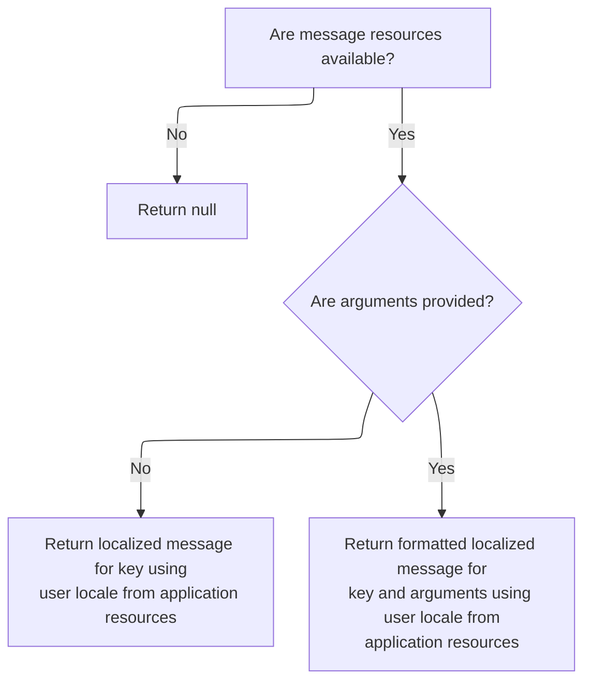
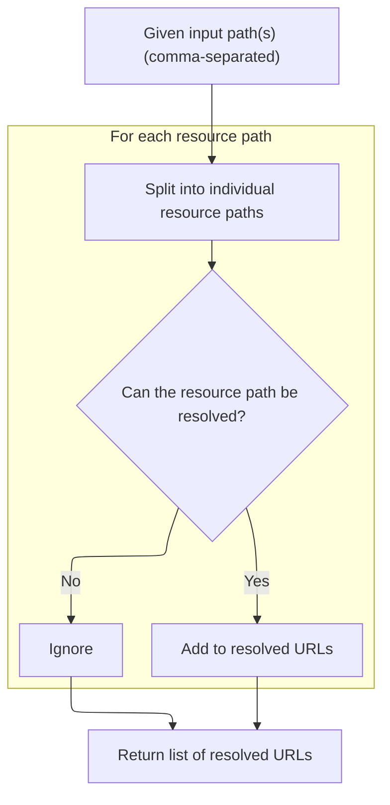

This document explains how the application loads and prepares chain catalog configurations at startup. The system receives configuration paths, resolves and loads each chain catalog, ensuring all processing chains are available for request handling.

# Parsing and Preparing Chain Configurations

<SwmSnippet path="/core/src/main/java/org/apache/struts/action/ActionServlet.java" line="1720">

---

In <SwmToken path="core/src/main/java/org/apache/struts/action/ActionServlet.java" pos="1720:5:5" line-data="    protected void initChain()">`initChain`</SwmToken>, we grab the <SwmToken path="core/src/main/java/org/apache/struts/action/ActionServlet.java" pos="1726:12:12" line-data="            value = getServletConfig().getInitParameter(&quot;chainConfig&quot;);">`chainConfig`</SwmToken> parameter, set up the config parser, and immediately call <SwmToken path="core/src/main/java/org/apache/struts/action/ActionServlet.java" pos="1733:7:7" line-data="            List urls = splitAndResolvePaths(chainConfig);">`splitAndResolvePaths`</SwmToken> to break down and resolve all resource paths we need to process next.

```java
    protected void initChain()
        throws ServletException {
        // Parse the configuration file specified by path or resource
        try {
            String value;

            value = getServletConfig().getInitParameter("chainConfig");

            if (value != null) {
                chainConfig = value;
            }

            ConfigParser parser = new ConfigParser();
            List urls = splitAndResolvePaths(chainConfig);
```

---

</SwmSnippet>

## Resolving Resource Paths for Chain Configs

<SwmSnippet path="/core/src/main/java/org/apache/struts/action/ActionServlet.java" line="1875">

---

In <SwmToken path="core/src/main/java/org/apache/struts/action/ActionServlet.java" pos="1875:5:5" line-data="    protected List splitAndResolvePaths(String paths)">`splitAndResolvePaths`</SwmToken>, we break up the comma-separated paths, try to resolve each as a servlet resource or via the class loader, and if we can't find one, we fetch an error message from <SwmToken path="core/src/main/java/org/apache/struts/config/ConfigHelper.java" pos="56:4:4" line-data="public class ConfigHelper implements ConfigHelperInterface {">`ConfigHelper`</SwmToken> before throwing an exception.

```java
    protected List splitAndResolvePaths(String paths)
        throws ServletException {
        ClassLoader loader = Thread.currentThread().getContextClassLoader();

        if (loader == null) {
            loader = this.getClass().getClassLoader();
        }

        ArrayList resolvedUrls = new ArrayList();

        URL resource;
        String path = null;

        try {
            // Process each specified resource path
            while (paths.length() > 0) {
                resource = null;

                int comma = paths.indexOf(',');

                if (comma >= 0) {
                    path = paths.substring(0, comma).trim();
                    paths = paths.substring(comma + 1);
                } else {
                    path = paths.trim();
                    paths = "";
                }

                if (path.length() < 1) {
                    break;
                }

                if (path.charAt(0) == '/') {
                    resource = getServletContext().getResource(path);
                }

                if (resource == null) {
                    if (log.isDebugEnabled()) {
                        log.debug("Unable to locate " + path
                            + " in the servlet context, "
                            + "trying classloader.");
                    }

                    Enumeration e = loader.getResources(path);

                    if (!e.hasMoreElements()) {
                        String msg = internal.getMessage("configMissing", path);

                        log.error(msg);
                        throw new UnavailableException(msg);
                    } else {
                        while (e.hasMoreElements()) {
                            resolvedUrls.add(e.nextElement());
                        }
                    }
                } else {
```

---

</SwmSnippet>

### Fetching Localized Error Messages



<SwmSnippet path="/core/src/main/java/org/apache/struts/config/ConfigHelper.java" line="514">

---

<SwmToken path="core/src/main/java/org/apache/struts/config/ConfigHelper.java" pos="514:5:5" line-data="    public String getMessage(String key, Object[] args) {">`getMessage`</SwmToken> grabs the message resources, figures out the user's locale, and delegates to Resources.getMessage to actually fetch the localized string.

```java
    public String getMessage(String key, Object[] args) {
        MessageResources resources = getMessageResources();

        if (resources == null) {
            return null;
        }

        // Return the requested message
        if (args == null) {
            return resources.getMessage(RequestUtils.getUserLocale(request, null),
                key);
        } else {
            return resources.getMessage(RequestUtils.getUserLocale(request, null),
                key, args);
        }
    }
```

---

</SwmSnippet>

<SwmSnippet path="/core/src/main/java/org/apache/struts/validator/Resources.java" line="231">

---

<SwmToken path="core/src/main/java/org/apache/struts/validator/Resources.java" pos="231:7:7" line-data="    public static String getMessage(MessageResources messages, Locale locale,">`getMessage`</SwmToken> checks if message resources exist, then calls MessageResources.getMessage to actually retrieve the string for the given locale and key.

```java
    public static String getMessage(MessageResources messages, Locale locale,
        String key) {
        String message = null;

        if (messages != null) {
            message = messages.getMessage(locale, key);
        }

        return (message == null) ? "" : message;
    }
```

---

</SwmSnippet>

### Finalizing Resource Resolution and Exception Handling



<SwmSnippet path="/core/src/main/java/org/apache/struts/action/ActionServlet.java" line="1931">

---

Back in <SwmToken path="core/src/main/java/org/apache/struts/action/ActionServlet.java" pos="1733:7:7" line-data="            List urls = splitAndResolvePaths(chainConfig);">`splitAndResolvePaths`</SwmToken>, after trying to resolve all paths, we catch any URL or IO exceptions, call <SwmToken path="core/src/main/java/org/apache/struts/action/ActionServlet.java" pos="1935:1:1" line-data="            handleConfigException(path, e);">`handleConfigException`</SwmToken> to log and wrap the error, and then return the list of resolved <SwmToken path="core/src/main/java/org/apache/struts/action/ActionServlet.java" pos="1793:13:13" line-data="     * tag to generate correct destination URLs for form submissions.&lt;/p&gt;">`URLs`</SwmToken> if all went well.

```java
                    resolvedUrls.add(resource);
                }
            }
        } catch (MalformedURLException e) {
            handleConfigException(path, e);
        } catch (IOException e) {
            handleConfigException(path, e);
        }

        return resolvedUrls;
    }
```

---

</SwmSnippet>

## Logging and Throwing Config Exceptions

<SwmSnippet path="/core/src/main/java/org/apache/struts/action/ActionServlet.java" line="770">

---

In <SwmToken path="core/src/main/java/org/apache/struts/action/ActionServlet.java" pos="770:5:5" line-data="    private void handleConfigException(String path, Exception e)">`handleConfigException`</SwmToken>, we get a formatted error message from <SwmToken path="core/src/main/java/org/apache/struts/config/ConfigHelper.java" pos="56:4:4" line-data="public class ConfigHelper implements ConfigHelperInterface {">`ConfigHelper`</SwmToken>, log it with the exception, and prep to throw an <SwmToken path="core/src/main/java/org/apache/struts/action/ActionServlet.java" pos="771:3:3" line-data="        throws UnavailableException {">`UnavailableException`</SwmToken>.

```java
    private void handleConfigException(String path, Exception e)
        throws UnavailableException {
        String msg = internal.getMessage("configParse", path);

        log.error(msg, e);
```

---

</SwmSnippet>

<SwmSnippet path="/core/src/main/java/org/apache/struts/action/ActionServlet.java" line="775">

---

Back in <SwmToken path="core/src/main/java/org/apache/struts/action/ActionServlet.java" pos="770:5:5" line-data="    private void handleConfigException(String path, Exception e)">`handleConfigException`</SwmToken>, after getting the message from <SwmToken path="core/src/main/java/org/apache/struts/config/ConfigHelper.java" pos="56:4:4" line-data="public class ConfigHelper implements ConfigHelperInterface {">`ConfigHelper`</SwmToken>, we wrap the original exception as the cause and throw <SwmToken path="core/src/main/java/org/apache/struts/action/ActionServlet.java" pos="775:1:1" line-data="        UnavailableException e2 = new UnavailableException(msg);">`UnavailableException`</SwmToken> to stop servlet startup.

```java
        UnavailableException e2 = new UnavailableException(msg);
        e2.initCause(e);
        throw e2;
    }
```

---

</SwmSnippet>

## Parsing Chain Catalogs from <SwmToken path="core/src/main/java/org/apache/struts/action/ActionServlet.java" pos="1793:13:13" line-data="     * tag to generate correct destination URLs for form submissions.&lt;/p&gt;">`URLs`</SwmToken>

<SwmSnippet path="/core/src/main/java/org/apache/struts/action/ActionServlet.java" line="1734">

---

Back in <SwmToken path="core/src/main/java/org/apache/struts/action/ActionServlet.java" pos="1720:5:5" line-data="    protected void initChain()">`initChain`</SwmToken>, after resolving all config <SwmToken path="core/src/main/java/org/apache/struts/action/ActionServlet.java" pos="1793:13:13" line-data="     * tag to generate correct destination URLs for form submissions.&lt;/p&gt;">`URLs`</SwmToken>, we loop through each one, log it, and call <SwmToken path="core/src/main/java/org/apache/struts/action/ActionServlet.java" pos="1739:1:3" line-data="                parser.parse(resource);">`parser.parse`</SwmToken> to load the chain catalog from each resource.

```java
            URL resource;

            for (Iterator i = urls.iterator(); i.hasNext();) {
                resource = (URL) i.next();
                log.info("Loading chain catalog from " + resource);
                parser.parse(resource);
            }
```

---

</SwmSnippet>

<SwmSnippet path="/core/src/main/java/org/apache/struts/action/ActionServlet.java" line="1741">

---

Finally, in <SwmToken path="core/src/main/java/org/apache/struts/action/ActionServlet.java" pos="1720:5:5" line-data="    protected void initChain()">`initChain`</SwmToken>, if any exception was thrown during parsing, we log the error and throw a <SwmToken path="core/src/main/java/org/apache/struts/action/ActionServlet.java" pos="1743:5:5" line-data="            throw new ServletException(e);">`ServletException`</SwmToken> to abort startup.

```java
        } catch (Exception e) {
            log.error("Exception loading resources", e);
            throw new ServletException(e);
        }
    }
```

---

</SwmSnippet>

&nbsp;

*This is an auto-generated document by Swimm 🌊 and has not yet been verified by a human*

<SwmMeta version="3.0.0" repo-id="Z2l0aHViJTNBJTNBc3RydXRzMSUzQSUzQVN3aW1tLURlbW8=" repo-name="struts1"><sup>Powered by [Swimm](https://app.swimm.io/)</sup></SwmMeta>
