This document describes how user and subscription data is loaded from disk into memory. The application reads the XML database file and constructs <SwmToken path="apps/faces-example1/src/main/java/org/apache/struts/webapp/example/memory/MemoryUserDatabase.java" pos="45:23:25" line-data=" * &lt;p&gt;Concrete implementation of {@link UserDatabase} for an in-memory">`in-memory`</SwmToken> objects for users and their subscriptions, making this data available for further operations.

# Loading the user database from disk

<SwmSnippet path="/apps/faces-example1/src/main/java/org/apache/struts/webapp/example/memory/MemoryUserDatabase.java" line="175">

---

<SwmToken path="apps/faces-example1/src/main/java/org/apache/struts/webapp/example/memory/MemoryUserDatabase.java" pos="175:5:5" line-data="    public void open() throws Exception {">`open`</SwmToken> starts the flow by reading the XML database file, parsing it with Digester, and building the <SwmToken path="apps/faces-example1/src/main/java/org/apache/struts/webapp/example/memory/MemoryUserDatabase.java" pos="45:23:25" line-data=" * &lt;p&gt;Concrete implementation of {@link UserDatabase} for an in-memory">`in-memory`</SwmToken> user and subscription objects. We need to call <SwmToken path="apps/faces-example1/src/main/java/org/apache/struts/webapp/example/memory/MemoryUserDatabase.java" pos="202:3:3" line-data="            bis.close();">`close`</SwmToken> next to make sure any changes made in memory are saved back to disk, keeping the file and memory in sync.

```java
    public void open() throws Exception {

        FileInputStream fis = null;
        BufferedInputStream bis = null;

        try {

            // Acquire an input stream to our database file
            if (log.isDebugEnabled()) {
                log.debug("Loading database from '" + pathname + "'");
            }
            fis = new FileInputStream(pathname);
            bis = new BufferedInputStream(fis);

            // Construct a digester to use for parsing
            Digester digester = new Digester();
            digester.push(this);
            digester.setValidating(false);
            digester.addFactoryCreate
                ("database/user",
                 new MemoryUserCreationFactory(this));
            digester.addFactoryCreate
                ("database/user/subscription",
                 new MemorySubscriptionCreationFactory(this));

            // Parse the input stream to initialize our database
            digester.parse(bis);
            bis.close();
            bis = null;
            fis = null;

        } catch (Exception e) {

            log.error("Loading database from '" + pathname + "':", e);
            throw e;

        } finally {

            if (bis != null) {
                try {
                    bis.close();
                } catch (Throwable t) {
                    ;
                }
                bis = null;
                fis = null;
            }

        }

    }
```

---

</SwmSnippet>

# Persisting <SwmToken path="apps/faces-example1/src/main/java/org/apache/struts/webapp/example/memory/MemoryUserDatabase.java" pos="45:23:25" line-data=" * &lt;p&gt;Concrete implementation of {@link UserDatabase} for an in-memory">`in-memory`</SwmToken> changes to disk

<SwmSnippet path="/apps/faces-example1/src/main/java/org/apache/struts/webapp/example/memory/MemoryUserDatabase.java" line="106">

---

<SwmToken path="apps/faces-example1/src/main/java/org/apache/struts/webapp/example/memory/MemoryUserDatabase.java" pos="106:5:5" line-data="    public void close() throws Exception {">`close`</SwmToken> just triggers <SwmToken path="apps/faces-example1/src/main/java/org/apache/struts/webapp/example/memory/MemoryUserDatabase.java" pos="108:1:1" line-data="        save();">`save`</SwmToken> to write any <SwmToken path="apps/faces-example1/src/main/java/org/apache/struts/webapp/example/memory/MemoryUserDatabase.java" pos="45:23:25" line-data=" * &lt;p&gt;Concrete implementation of {@link UserDatabase} for an in-memory">`in-memory`</SwmToken> changes to disk. We call <SwmToken path="apps/faces-example1/src/main/java/org/apache/struts/webapp/example/memory/MemoryUserDatabase.java" pos="108:1:1" line-data="        save();">`save`</SwmToken> next to actually perform the file write and make sure updates aren't lost.

```java
    public void close() throws Exception {

        save();

    }
```

---

</SwmSnippet>

# Serializing users and subscriptions to XML

```mermaid
%%{init: {"flowchart": {"defaultRenderer": "elk"}} }%%
flowchart TD
  node1["Start saving all users and subscriptions to XML file"]
  click node1 openCode "apps/faces-example1/src/main/java/org/apache/struts/webapp/example/memory/MemoryUserDatabase.java:257:258"
  node1 --> node2["Write XML prolog"]
  click node2 openCode "apps/faces-example1/src/main/java/org/apache/struts/webapp/example/memory/MemoryUserDatabase.java:273:274"
  
  subgraph loop1["For each user"]
    node2 --> node3["Write user entry"]
    click node3 openCode "apps/faces-example1/src/main/java/org/apache/struts/webapp/example/memory/MemoryUserDatabase.java:279:280"
    subgraph loop2["For each subscription of user"]
      node3 --> node4["Write subscription entry"]
      click node4 openCode "apps/faces-example1/src/main/java/org/apache/struts/webapp/example/memory/MemoryUserDatabase.java:284:285"
      node4 --> node5["Close subscription entry"]
      click node5 openCode "apps/faces-example1/src/main/java/org/apache/struts/webapp/example/memory/MemoryUserDatabase.java:286:287"
    end
    node5 --> node6["Close user entry"]
    click node6 openCode "apps/faces-example1/src/main/java/org/apache/struts/webapp/example/memory/MemoryUserDatabase.java:290:290"
  end
  node6 --> node7["Write XML epilog"]
  click node7 openCode "apps/faces-example1/src/main/java/org/apache/struts/webapp/example/memory/MemoryUserDatabase.java:294:294"
  node7 --> node8{"Any error while writing?"}
  click node8 openCode "apps/faces-example1/src/main/java/org/apache/struts/webapp/example/memory/MemoryUserDatabase.java:297:297"
  node8 -->|"Yes"| node9["Abort save, database unchanged"]
  click node9 openCode "apps/faces-example1/src/main/java/org/apache/struts/webapp/example/memory/MemoryUserDatabase.java:299:301"
  node8 -->|"No"| node10{"Does original file exist?"}
  click node10 openCode "apps/faces-example1/src/main/java/org/apache/struts/webapp/example/memory/MemoryUserDatabase.java:320:320"
  node10 -->|"Yes"| node11["Backup original file"]
  click node11 openCode "apps/faces-example1/src/main/java/org/apache/struts/webapp/example/memory/MemoryUserDatabase.java:321:325"
  node10 -->|"No"| node12["Skip backup"]
  click node12 openCode "apps/faces-example1/src/main/java/org/apache/struts/webapp/example/memory/MemoryUserDatabase.java:326:326"
  node11 --> node13["Replace original file with new file"]
  click node13 openCode "apps/faces-example1/src/main/java/org/apache/struts/webapp/example/memory/MemoryUserDatabase.java:327:333"
  node12 --> node13
  node13 --> node14{"Did replace succeed?"}
  click node14 openCode "apps/faces-example1/src/main/java/org/apache/struts/webapp/example/memory/MemoryUserDatabase.java:327:333"
  node14 -->|"No"| node15["Restore backup and abort"]
  click node15 openCode "apps/faces-example1/src/main/java/org/apache/struts/webapp/example/memory/MemoryUserDatabase.java:328:332"
  node14 -->|"Yes"| node16["Database saved successfully"]
  click node16 openCode "apps/faces-example1/src/main/java/org/apache/struts/webapp/example/memory/MemoryUserDatabase.java:334:336"

classDef HeadingStyle fill:#777777,stroke:#333,stroke-width:2px;

%% Swimm:
%% %%{init: {"flowchart": {"defaultRenderer": "elk"}} }%%
%% flowchart TD
%%   node1["Start saving all users and subscriptions to XML file"]
%%   click node1 openCode "<SwmPath>[apps/…/memory/MemoryUserDatabase.java](apps/faces-example1/src/main/java/org/apache/struts/webapp/example/memory/MemoryUserDatabase.java)</SwmPath>:257:258"
%%   node1 --> node2["Write XML prolog"]
%%   click node2 openCode "<SwmPath>[apps/…/memory/MemoryUserDatabase.java](apps/faces-example1/src/main/java/org/apache/struts/webapp/example/memory/MemoryUserDatabase.java)</SwmPath>:273:274"
%%   
%%   subgraph loop1["For each user"]
%%     node2 --> node3["Write user entry"]
%%     click node3 openCode "<SwmPath>[apps/…/memory/MemoryUserDatabase.java](apps/faces-example1/src/main/java/org/apache/struts/webapp/example/memory/MemoryUserDatabase.java)</SwmPath>:279:280"
%%     subgraph loop2["For each subscription of user"]
%%       node3 --> node4["Write subscription entry"]
%%       click node4 openCode "<SwmPath>[apps/…/memory/MemoryUserDatabase.java](apps/faces-example1/src/main/java/org/apache/struts/webapp/example/memory/MemoryUserDatabase.java)</SwmPath>:284:285"
%%       node4 --> node5["Close subscription entry"]
%%       click node5 openCode "<SwmPath>[apps/…/memory/MemoryUserDatabase.java](apps/faces-example1/src/main/java/org/apache/struts/webapp/example/memory/MemoryUserDatabase.java)</SwmPath>:286:287"
%%     end
%%     node5 --> node6["Close user entry"]
%%     click node6 openCode "<SwmPath>[apps/…/memory/MemoryUserDatabase.java](apps/faces-example1/src/main/java/org/apache/struts/webapp/example/memory/MemoryUserDatabase.java)</SwmPath>:290:290"
%%   end
%%   node6 --> node7["Write XML epilog"]
%%   click node7 openCode "<SwmPath>[apps/…/memory/MemoryUserDatabase.java](apps/faces-example1/src/main/java/org/apache/struts/webapp/example/memory/MemoryUserDatabase.java)</SwmPath>:294:294"
%%   node7 --> node8{"Any error while writing?"}
%%   click node8 openCode "<SwmPath>[apps/…/memory/MemoryUserDatabase.java](apps/faces-example1/src/main/java/org/apache/struts/webapp/example/memory/MemoryUserDatabase.java)</SwmPath>:297:297"
%%   node8 -->|"Yes"| node9["Abort save, database unchanged"]
%%   click node9 openCode "<SwmPath>[apps/…/memory/MemoryUserDatabase.java](apps/faces-example1/src/main/java/org/apache/struts/webapp/example/memory/MemoryUserDatabase.java)</SwmPath>:299:301"
%%   node8 -->|"No"| node10{"Does original file exist?"}
%%   click node10 openCode "<SwmPath>[apps/…/memory/MemoryUserDatabase.java](apps/faces-example1/src/main/java/org/apache/struts/webapp/example/memory/MemoryUserDatabase.java)</SwmPath>:320:320"
%%   node10 -->|"Yes"| node11["Backup original file"]
%%   click node11 openCode "<SwmPath>[apps/…/memory/MemoryUserDatabase.java](apps/faces-example1/src/main/java/org/apache/struts/webapp/example/memory/MemoryUserDatabase.java)</SwmPath>:321:325"
%%   node10 -->|"No"| node12["Skip backup"]
%%   click node12 openCode "<SwmPath>[apps/…/memory/MemoryUserDatabase.java](apps/faces-example1/src/main/java/org/apache/struts/webapp/example/memory/MemoryUserDatabase.java)</SwmPath>:326:326"
%%   node11 --> node13["Replace original file with new file"]
%%   click node13 openCode "<SwmPath>[apps/…/memory/MemoryUserDatabase.java](apps/faces-example1/src/main/java/org/apache/struts/webapp/example/memory/MemoryUserDatabase.java)</SwmPath>:327:333"
%%   node12 --> node13
%%   node13 --> node14{"Did replace succeed?"}
%%   click node14 openCode "<SwmPath>[apps/…/memory/MemoryUserDatabase.java](apps/faces-example1/src/main/java/org/apache/struts/webapp/example/memory/MemoryUserDatabase.java)</SwmPath>:327:333"
%%   node14 -->|"No"| node15["Restore backup and abort"]
%%   click node15 openCode "<SwmPath>[apps/…/memory/MemoryUserDatabase.java](apps/faces-example1/src/main/java/org/apache/struts/webapp/example/memory/MemoryUserDatabase.java)</SwmPath>:328:332"
%%   node14 -->|"Yes"| node16["Database saved successfully"]
%%   click node16 openCode "<SwmPath>[apps/…/memory/MemoryUserDatabase.java](apps/faces-example1/src/main/java/org/apache/struts/webapp/example/memory/MemoryUserDatabase.java)</SwmPath>:334:336"
%% 
%% classDef HeadingStyle fill:#777777,stroke:#333,stroke-width:2px;
```



<SwmSnippet path="/apps/faces-example1/src/main/java/org/apache/struts/webapp/example/memory/MemoryUserDatabase.java" line="257">

---

In <SwmToken path="apps/faces-example1/src/main/java/org/apache/struts/webapp/example/memory/MemoryUserDatabase.java" pos="257:5:5" line-data="    public void save() throws Exception {">`save`</SwmToken>, we start by opening a new file and writing the XML prolog and root element. Then, we grab all users with <SwmToken path="apps/faces-example1/src/main/java/org/apache/struts/webapp/example/memory/MemoryUserDatabase.java" pos="277:9:11" line-data="            User users[] = findUsers();">`findUsers()`</SwmToken>, and for each user and their subscriptions, we dump their XML using their <SwmToken path="apps/faces-example1/src/main/java/org/apache/struts/webapp/example/RegistrationBacking.java" pos="117:8:10" line-data="        forward(context, url.toString());">`toString()`</SwmToken> methods. This only works because those classes are set up to output XML.

```java
    public void save() throws Exception {

        if (log.isDebugEnabled()) {
            log.debug("Saving database to '" + pathname + "'");
        }
        File fileNew = new File(pathnameNew);
        PrintWriter writer = null;

        try {

            // Configure our PrintWriter
            FileOutputStream fos = new FileOutputStream(fileNew);
            OutputStreamWriter osw = new OutputStreamWriter(fos);
            writer = new PrintWriter(osw);

            // Print the file prolog
            writer.println("<?xml version='1.0'?>");
            writer.println("<database>");

            // Print entries for each defined user and associated subscriptions
            User users[] = findUsers();
            for (int i = 0; i < users.length; i++) {
                writer.print("  ");
                writer.println(users[i]);
                Subscription subscriptions[] =
                    users[i].getSubscriptions();
                for (int j = 0; j < subscriptions.length; j++) {
                    writer.print("    ");
                    writer.println(subscriptions[j]);
                    writer.print("    ");
                    writer.println("</subscription>");
                }
                writer.print("  ");
                writer.println("</user>");
            }
```

---

</SwmSnippet>

<SwmSnippet path="/apps/faces-example1/src/main/java/org/apache/struts/webapp/example/memory/MemoryUserDatabase.java" line="293">

---

After writing all the user and subscription XML, we check for write errors. If something went wrong, we delete the new file to avoid leaving junk on disk. Next, we call <SwmToken path="apps/faces-example1/src/main/java/org/apache/struts/webapp/example/memory/MemoryUserDatabase.java" pos="298:3:3" line-data="                writer.close();">`close`</SwmToken> to wrap up and trigger the file renaming and cleanup.

```java
            // Print the file epilog
            writer.println("</database>");

            // Check for errors that occurred while printing
            if (writer.checkError()) {
                writer.close();
```

---

</SwmSnippet>

<SwmSnippet path="/apps/faces-example1/src/main/java/org/apache/struts/webapp/example/memory/MemoryUserDatabase.java" line="299">

---

Back from <SwmToken path="apps/faces-example1/src/main/java/org/apache/struts/webapp/example/memory/MemoryUserDatabase.java" pos="106:5:5" line-data="    public void close() throws Exception {">`close`</SwmToken>, if saving failed, we clean up the temp file and throw an exception. Next, we call `RegistrationBacking.delete` to handle the user-facing delete action that triggered this save.

```java
                fileNew.delete();
                throw new IOException
                    ("Saving database to '" + pathname + "'");
            }
```

---

</SwmSnippet>

<SwmSnippet path="/apps/faces-example1/src/main/java/org/apache/struts/webapp/example/RegistrationBacking.java" line="101">

---

<SwmToken path="apps/faces-example1/src/main/java/org/apache/struts/webapp/example/RegistrationBacking.java" pos="101:5:5" line-data="    public String delete() {">`delete`</SwmToken> in <SwmToken path="apps/faces-example1/src/main/java/org/apache/struts/webapp/example/RegistrationBacking.java" pos="36:4:4" line-data="public class RegistrationBacking extends AbstractBacking {">`RegistrationBacking`</SwmToken> builds a URL with delete action and <SwmToken path="apps/faces-example1/src/main/java/org/apache/struts/webapp/example/memory/MemoryUserDatabase.java" pos="197:5:7" line-data="                (&quot;database/user/subscription&quot;,">`user/subscription`</SwmToken> info, then forwards the request. It returns null because the navigation is handled by the forward, not by JSF navigation rules.

```java
    public String delete() {

        if (log.isDebugEnabled()) {
            log.debug("delete()");
        }
        FacesContext context = FacesContext.getCurrentInstance();
        StringBuffer url = subscription(context);
        url.append("?action=Delete");
        url.append("&username=");
        User user = (User)
            context.getExternalContext().getSessionMap().get("user");
        url.append(user.getUsername());
        url.append("&host=");
        Subscription subscription = (Subscription)
            context.getExternalContext().getRequestMap().get("subscription");
        url.append(subscription.getHost());
        forward(context, url.toString());
        return (null);

    }
```

---

</SwmSnippet>

<SwmSnippet path="/apps/faces-example1/src/main/java/org/apache/struts/webapp/example/memory/MemoryUserDatabase.java" line="303">

---

Back from `RegistrationBacking.delete`, we close the writer and clean up. We call `MemoryUserDatabase.close` again to make sure the delete operation is actually written to disk via <SwmToken path="apps/faces-example1/src/main/java/org/apache/struts/webapp/example/memory/MemoryUserDatabase.java" pos="108:1:1" line-data="        save();">`save`</SwmToken>.

```java
            writer.close();
            writer = null;

        } catch (IOException e) {

            if (writer != null) {
                writer.close();
            }
```

---

</SwmSnippet>

<SwmSnippet path="/apps/faces-example1/src/main/java/org/apache/struts/webapp/example/memory/MemoryUserDatabase.java" line="311">

---

Back from <SwmToken path="apps/faces-example1/src/main/java/org/apache/struts/webapp/example/memory/MemoryUserDatabase.java" pos="106:5:5" line-data="    public void close() throws Exception {">`close`</SwmToken>, the final part of <SwmToken path="apps/faces-example1/src/main/java/org/apache/struts/webapp/example/memory/MemoryUserDatabase.java" pos="317:15:15" line-data="        // Perform the required renames to permanently save this file">`save`</SwmToken> does the file renaming: it backs up the old file, swaps in the new one, and cleans up. This atomic swap means users don't see a half-written file if something fails. After this, we go back to <SwmToken path="apps/faces-example1/src/main/java/org/apache/struts/webapp/example/RegistrationBacking.java" pos="36:4:4" line-data="public class RegistrationBacking extends AbstractBacking {">`RegistrationBacking`</SwmToken> to handle the next user action.

```java
            fileNew.delete();
            throw e;

        }


        // Perform the required renames to permanently save this file
        File fileOrig = new File(pathname);
        File fileOld = new File(pathnameOld);
        if (fileOrig.exists()) {
            fileOld.delete();
            if (!fileOrig.renameTo(fileOld)) {
                throw new IOException
                    ("Renaming '" + pathname + "' to '" + pathnameOld + "'");
            }
        }
        if (!fileNew.renameTo(fileOrig)) {
            if (fileOld.exists()) {
                fileOld.renameTo(fileOrig);
            }
            throw new IOException
                ("Renaming '" + pathnameNew + "' to '" + pathname + "'");
        }
        fileOld.delete();

    }
```

---

</SwmSnippet>

&nbsp;

*This is an auto-generated document by Swimm 🌊 and has not yet been verified by a human*

<SwmMeta version="3.0.0" repo-id="Z2l0aHViJTNBJTNBc3RydXRzMSUzQSUzQVN3aW1tLURlbW8=" repo-name="struts1"><sup>Powered by [Swimm](https://app.swimm.io/)</sup></SwmMeta>
