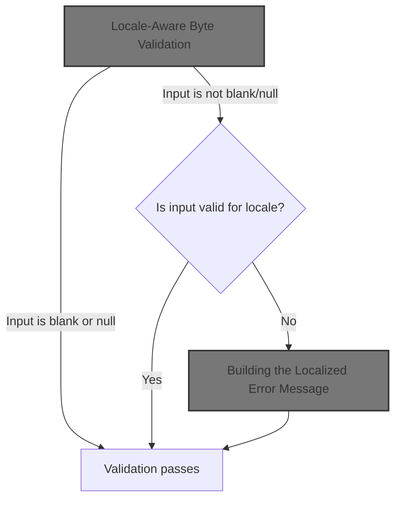
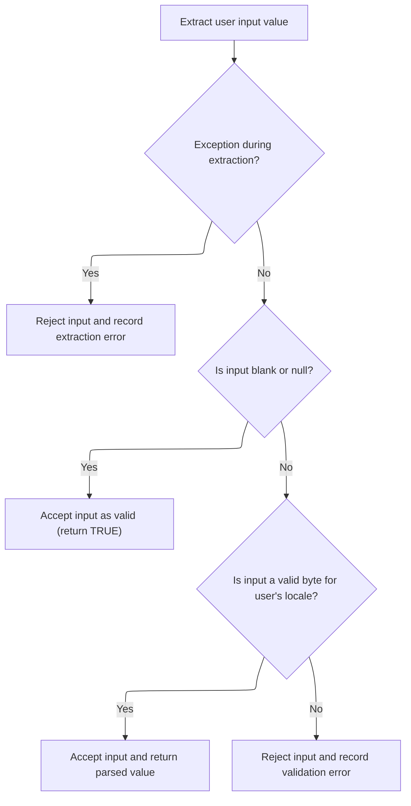

This document describes how user input from a web form is validated as a byte, considering the user's locale. If the value is invalid, a localized error message is generated and shown to the user, with support for custom message templates and bundles.



# Locale-Aware Byte Validation



<SwmSnippet path="/core/src/main/java/org/apache/struts/validator/FieldChecks.java" line="354">

---

In <SwmToken path="core/src/main/java/org/apache/struts/validator/FieldChecks.java" pos="354:7:7" line-data="    public static Object validateByteLocale(Object bean, ValidatorAction va,">`validateByteLocale`</SwmToken>, we grab the value to validate, skip processing if it's blank, and then fetch the user's locale. We need the locale because the next step (parsing the byte) depends on locale-specific number formats. That's why we call into <SwmToken path="core/src/main/java/org/apache/struts/validator/FieldChecks.java" pos="371:7:7" line-data="        Locale locale = RequestUtils.getUserLocale(request, null);">`RequestUtils`</SwmToken> to get the locale before moving on.

```java
    public static Object validateByteLocale(Object bean, ValidatorAction va,
        Field field, ActionMessages errors, Validator validator,
        HttpServletRequest request) {
        Object result = null;
        String value = null;

        try {
            value = evaluateBean(bean, field);
        } catch (Exception e) {
            processFailure(errors, field, validator.getFormName(), "byteLocale", e);
            return Boolean.FALSE;
        }

        if (GenericValidator.isBlankOrNull(value)) {
            return Boolean.TRUE;
        }

        Locale locale = RequestUtils.getUserLocale(request, null);

```

---

</SwmSnippet>

<SwmSnippet path="/core/src/main/java/org/apache/struts/util/RequestUtils.java" line="299">

---

<SwmToken path="core/src/main/java/org/apache/struts/util/RequestUtils.java" pos="299:7:7" line-data="    public static Locale getUserLocale(HttpServletRequest request, String locale) {">`getUserLocale`</SwmToken> figures out which locale to use by first looking in the session (using a key, defaulting to <SwmToken path="core/src/main/java/org/apache/struts/util/RequestUtils.java" pos="304:5:7" line-data="            locale = Globals.LOCALE_KEY;">`Globals.LOCALE_KEY`</SwmToken>), and if nothing is found, it falls back to the request's locale. This way, it always returns something, even if the user hasn't set a preference.

```java
    public static Locale getUserLocale(HttpServletRequest request, String locale) {
        Locale userLocale = null;
        HttpSession session = request.getSession(false);

        if (locale == null) {
            locale = Globals.LOCALE_KEY;
        }

        // Only check session if sessions are enabled
        if (session != null) {
            userLocale = (Locale) session.getAttribute(locale);
        }

        if (userLocale == null) {
            // Returns Locale based on Accept-Language header or the server default
            userLocale = request.getLocale();
        }

        return userLocale;
    }
```

---

</SwmSnippet>

<SwmSnippet path="/core/src/main/java/org/apache/struts/validator/FieldChecks.java" line="373">

---

Back in `FieldChecks.validateByteLocale`, after parsing the value with the locale, if parsing fails, we add a localized error message using <SwmToken path="core/src/main/java/org/apache/struts/validator/FieldChecks.java" pos="377:1:3" line-data="                Resources.getActionMessage(validator, request, va, field));">`Resources.getActionMessage`</SwmToken>. This is where we switch from validation to error reporting.

```java
        result = GenericTypeValidator.formatByte(value, locale);

        if (result == null) {
            errors.add(field.getKey(),
                Resources.getActionMessage(validator, request, va, field));
        }

        return (result == null) ? Boolean.FALSE : result;
    }
```

---

</SwmSnippet>

# Building the Localized Error Message

<SwmSnippet path="/core/src/main/java/org/apache/struts/validator/Resources.java" line="365">

---

In <SwmToken path="core/src/main/java/org/apache/struts/validator/Resources.java" pos="365:7:7" line-data="    public static ActionMessage getActionMessage(Validator validator,">`getActionMessage`</SwmToken>, we check if the field's message is a resource or a literal string. If it's a resource, we need to resolve it (possibly localized), so we call into <SwmToken path="core/src/main/java/org/apache/struts/config/ConfigHelper.java" pos="56:4:4" line-data="public class ConfigHelper implements ConfigHelperInterface {">`ConfigHelper`</SwmToken> to fetch the actual message text.

```java
    public static ActionMessage getActionMessage(Validator validator,
        HttpServletRequest request, ValidatorAction va, Field field) {
        Msg msg = field.getMessage(va.getName());

        if ((msg != null) && !msg.isResource()) {
            return new ActionMessage(msg.getKey(), false);
        }

```

---

</SwmSnippet>

## Resolving the Message Text

<SwmSnippet path="/core/src/main/java/org/apache/struts/config/ConfigHelper.java" line="496">

---

In <SwmToken path="core/src/main/java/org/apache/struts/config/ConfigHelper.java" pos="496:5:5" line-data="    public String getMessage(String key) {">`getMessage`</SwmToken>, we grab the <SwmToken path="core/src/main/java/org/apache/struts/config/ConfigHelper.java" pos="497:1:1" line-data="        MessageResources resources = getMessageResources();">`MessageResources`</SwmToken> and then fetch the message for the user's locale (using <SwmToken path="core/src/main/java/org/apache/struts/config/ConfigHelper.java" pos="503:7:9" line-data="        return resources.getMessage(RequestUtils.getUserLocale(request, null),">`RequestUtils.getUserLocale`</SwmToken> again). This ensures the message is in the right language before returning it.

```java
    public String getMessage(String key) {
        MessageResources resources = getMessageResources();

        if (resources == null) {
            return null;
        }

        return resources.getMessage(RequestUtils.getUserLocale(request, null),
```

---

</SwmSnippet>

<SwmSnippet path="/core/src/main/java/org/apache/struts/config/ConfigHelper.java" line="503">

---

Just returned from <SwmToken path="core/src/main/java/org/apache/struts/config/ConfigHelper.java" pos="503:7:9" line-data="        return resources.getMessage(RequestUtils.getUserLocale(request, null),">`RequestUtils.getUserLocale`</SwmToken>, now `ConfigHelper.getMessage` finishes by fetching the localized message string. After this, we go back to Resources to continue building the error message.

```java
        return resources.getMessage(RequestUtils.getUserLocale(request, null),
            key);
    }
```

---

</SwmSnippet>

<SwmSnippet path="/core/src/main/java/org/apache/struts/validator/Resources.java" line="249">

---

<SwmToken path="core/src/main/java/org/apache/struts/validator/Resources.java" pos="249:7:7" line-data="    public static String getMessage(HttpServletRequest request, String key) {">`getMessage`</SwmToken> in Resources fetches the <SwmToken path="core/src/main/java/org/apache/struts/validator/Resources.java" pos="250:1:1" line-data="        MessageResources messages = getMessageResources(request);">`MessageResources`</SwmToken> for the request, then grabs the message for the user's locale and the given key. We call <SwmToken path="core/src/main/java/org/apache/struts/validator/Resources.java" pos="252:8:10" line-data="        return getMessage(messages, RequestUtils.getUserLocale(request, null),">`RequestUtils.getUserLocale`</SwmToken> again to make sure we're using the latest locale.

```java
    public static String getMessage(HttpServletRequest request, String key) {
        MessageResources messages = getMessageResources(request);

        return getMessage(messages, RequestUtils.getUserLocale(request, null),
            key);
    }
```

---

</SwmSnippet>

## Finalizing the Action Message

```mermaid
%%{init: {"flowchart": {"defaultRenderer": "elk"}} }%%
flowchart TD
    node1{"Is a custom message provided?"}
    click node1 openCode "core/src/main/java/org/apache/struts/validator/Resources.java:376:381"
    node1 -->|"No"| node2["Use default message template for this
validation"]
    click node2 openCode "core/src/main/java/org/apache/struts/validator/Resources.java:377:377"
    node1 -->|"Yes"| node3["Use custom message template and bundle"]
    click node3 openCode "core/src/main/java/org/apache/struts/validator/Resources.java:379:381"
    node2 --> node4{"Is the message template key missing or
empty?"}
    node3 --> node4
    click node4 openCode "core/src/main/java/org/apache/struts/validator/Resources.java:383:386"
    node4 -->|"Yes"| node5["Return a generic error message for this
field"]
    click node5 openCode "core/src/main/java/org/apache/struts/validator/Resources.java:384:386"
    node4 -->|"No"| node6["Select message resources and user locale"]
    click node6 openCode "core/src/main/java/org/apache/struts/validator/Resources.java:388:392"
    node6 --> node7["Fill in message with field/context
values"]
    click node7 openCode "core/src/main/java/org/apache/struts/validator/Resources.java:394:396"
    node7 --> node8{"Is a custom message bundle specified?"}
    click node8 openCode "core/src/main/java/org/apache/struts/validator/Resources.java:400:406"
    node8 -->|"No"| node9["Create user-facing message using default
bundle and locale"]
    click node9 openCode "core/src/main/java/org/apache/struts/validator/Resources.java:401:401"
    node8 -->|"Yes"| node10["Create user-facing message using custom
bundle and locale"]
    click node10 openCode "core/src/main/java/org/apache/struts/validator/Resources.java:403:405"
    node9 --> node11["Return the constructed message"]
    click node11 openCode "core/src/main/java/org/apache/struts/validator/Resources.java:408:409"
    node10 --> node11
classDef HeadingStyle fill:#777777,stroke:#333,stroke-width:2px;

%% Swimm:
%% %%{init: {"flowchart": {"defaultRenderer": "elk"}} }%%
%% flowchart TD
%%     node1{"Is a custom message provided?"}
%%     click node1 openCode "<SwmPath>[core/…/validator/Resources.java](core/src/main/java/org/apache/struts/validator/Resources.java)</SwmPath>:376:381"
%%     node1 -->|"No"| node2["Use default message template for this
%% validation"]
%%     click node2 openCode "<SwmPath>[core/…/validator/Resources.java](core/src/main/java/org/apache/struts/validator/Resources.java)</SwmPath>:377:377"
%%     node1 -->|"Yes"| node3["Use custom message template and bundle"]
%%     click node3 openCode "<SwmPath>[core/…/validator/Resources.java](core/src/main/java/org/apache/struts/validator/Resources.java)</SwmPath>:379:381"
%%     node2 --> node4{"Is the message template key missing or
%% empty?"}
%%     node3 --> node4
%%     click node4 openCode "<SwmPath>[core/…/validator/Resources.java](core/src/main/java/org/apache/struts/validator/Resources.java)</SwmPath>:383:386"
%%     node4 -->|"Yes"| node5["Return a generic error message for this
%% field"]
%%     click node5 openCode "<SwmPath>[core/…/validator/Resources.java](core/src/main/java/org/apache/struts/validator/Resources.java)</SwmPath>:384:386"
%%     node4 -->|"No"| node6["Select message resources and user locale"]
%%     click node6 openCode "<SwmPath>[core/…/validator/Resources.java](core/src/main/java/org/apache/struts/validator/Resources.java)</SwmPath>:388:392"
%%     node6 --> node7["Fill in message with field/context
%% values"]
%%     click node7 openCode "<SwmPath>[core/…/validator/Resources.java](core/src/main/java/org/apache/struts/validator/Resources.java)</SwmPath>:394:396"
%%     node7 --> node8{"Is a custom message bundle specified?"}
%%     click node8 openCode "<SwmPath>[core/…/validator/Resources.java](core/src/main/java/org/apache/struts/validator/Resources.java)</SwmPath>:400:406"
%%     node8 -->|"No"| node9["Create user-facing message using default
%% bundle and locale"]
%%     click node9 openCode "<SwmPath>[core/…/validator/Resources.java](core/src/main/java/org/apache/struts/validator/Resources.java)</SwmPath>:401:401"
%%     node8 -->|"Yes"| node10["Create user-facing message using custom
%% bundle and locale"]
%%     click node10 openCode "<SwmPath>[core/…/validator/Resources.java](core/src/main/java/org/apache/struts/validator/Resources.java)</SwmPath>:403:405"
%%     node9 --> node11["Return the constructed message"]
%%     click node11 openCode "<SwmPath>[core/…/validator/Resources.java](core/src/main/java/org/apache/struts/validator/Resources.java)</SwmPath>:408:409"
%%     node10 --> node11
%% classDef HeadingStyle fill:#777777,stroke:#333,stroke-width:2px;
```



<SwmSnippet path="/core/src/main/java/org/apache/struts/validator/Resources.java" line="373">

---

Just returned from `ConfigHelper.getMessage`, now in Resources, we figure out which message key and bundle to use, and fetch the right <SwmToken path="core/src/main/java/org/apache/struts/validator/Resources.java" pos="390:1:1" line-data="        MessageResources messages =">`MessageResources`</SwmToken> (possibly module-specific) for the next step.

```java
        String msgKey = null;
        String msgBundle = null;

        if (msg == null) {
            msgKey = va.getMsg();
        } else {
            msgKey = msg.getKey();
            msgBundle = msg.getBundle();
        }

        if ((msgKey == null) || (msgKey.length() == 0)) {
            return new ActionMessage("??? " + va.getName() + "."
                + field.getProperty() + " ???", false);
        }

        ServletContext application =
            (ServletContext) validator.getParameterValue(SERVLET_CONTEXT_PARAM);
        MessageResources messages =
            getMessageResources(application, request, msgBundle);
```

---

</SwmSnippet>

<SwmSnippet path="/core/src/main/java/org/apache/struts/validator/Resources.java" line="117">

---

<SwmToken path="core/src/main/java/org/apache/struts/validator/Resources.java" pos="117:7:7" line-data="    public static MessageResources getMessageResources(">`getMessageResources`</SwmToken> tries to find the right <SwmToken path="core/src/main/java/org/apache/struts/validator/Resources.java" pos="117:5:5" line-data="    public static MessageResources getMessageResources(">`MessageResources`</SwmToken> by checking the request, then the application with a module prefix, and finally just the bundle name. If nothing is found, it throws. This covers different deployment setups.

```java
    public static MessageResources getMessageResources(
        ServletContext application, HttpServletRequest request, String bundle) {
        if (bundle == null) {
            bundle = Globals.MESSAGES_KEY;
        }

        MessageResources resources =
            (MessageResources) request.getAttribute(bundle);

        if (resources == null) {
            ModuleConfig moduleConfig =
                ModuleUtils.getInstance().getModuleConfig(request, application);

            resources =
                (MessageResources) application.getAttribute(bundle
                    + moduleConfig.getPrefix());
        }

        if (resources == null) {
            resources = (MessageResources) application.getAttribute(bundle);
        }

        if (resources == null) {
            throw new NullPointerException(
                "No message resources found for bundle: " + bundle);
        }

        return resources;
    }
```

---

</SwmSnippet>

<SwmSnippet path="/core/src/main/java/org/apache/struts/validator/Resources.java" line="392">

---

Just returned from <SwmToken path="core/src/main/java/org/apache/struts/validator/Resources.java" pos="117:7:7" line-data="    public static MessageResources getMessageResources(">`getMessageResources`</SwmToken>, now we grab the locale again (with <SwmToken path="core/src/main/java/org/apache/struts/validator/Resources.java" pos="392:7:7" line-data="        Locale locale = RequestUtils.getUserLocale(request, null);">`RequestUtils`</SwmToken>) to make sure the arguments for the error message are localized too.

```java
        Locale locale = RequestUtils.getUserLocale(request, null);

```

---

</SwmSnippet>

<SwmSnippet path="/core/src/main/java/org/apache/struts/validator/Resources.java" line="394">

---

Just returned from <SwmToken path="core/src/main/java/org/apache/struts/validator/FieldChecks.java" pos="371:7:9" line-data="        Locale locale = RequestUtils.getUserLocale(request, null);">`RequestUtils.getUserLocale`</SwmToken>, now we fetch the arguments for the error message using <SwmToken path="core/src/main/java/org/apache/struts/validator/Resources.java" pos="394:11:11" line-data="        Arg[] args = field.getArgs(va.getName());">`getArgs`</SwmToken>. These will be used to fill in any placeholders in the message.

```java
        Arg[] args = field.getArgs(va.getName());
```

---

</SwmSnippet>

<SwmSnippet path="/core/src/main/java/org/apache/struts/validator/Resources.java" line="420">

---

<SwmToken path="core/src/main/java/org/apache/struts/validator/Resources.java" pos="420:9:9" line-data="    public static String[] getArgs(String actionName,">`getArgs`</SwmToken> grabs up to 4 arguments for the message, localizing each one if it's marked as a resource. Anything beyond 4 is ignored—it's a fixed limit.

```java
    public static String[] getArgs(String actionName,
        MessageResources messages, Locale locale, Field field) {
        String[] argMessages = new String[4];

        Arg[] args =
            new Arg[] {
                field.getArg(actionName, 0), field.getArg(actionName, 1),
                field.getArg(actionName, 2), field.getArg(actionName, 3)
            };

        for (int i = 0; i < args.length; i++) {
            if (args[i] == null) {
                continue;
            }

            if (args[i].isResource()) {
                argMessages[i] = getMessage(messages, locale, args[i].getKey());
            } else {
                argMessages[i] = args[i].getKey();
            }
        }
```

---

</SwmSnippet>

<SwmSnippet path="/core/src/main/java/org/apache/struts/validator/Resources.java" line="395">

---

Just returned from <SwmToken path="core/src/main/java/org/apache/struts/validator/Resources.java" pos="394:11:11" line-data="        Arg[] args = field.getArgs(va.getName());">`getArgs`</SwmToken>, now we call <SwmToken path="core/src/main/java/org/apache/struts/validator/Resources.java" pos="396:1:1" line-data="            getArgValues(application, request, messages, locale, args);">`getArgValues`</SwmToken> to resolve the actual values (possibly from different bundles) for each argument before building the <SwmToken path="core/src/main/java/org/apache/struts/validator/Resources.java" pos="365:5:5" line-data="    public static ActionMessage getActionMessage(Validator validator,">`ActionMessage`</SwmToken>.

```java
        String[] argValues =
            getArgValues(application, request, messages, locale, args);

```

---

</SwmSnippet>

<SwmSnippet path="/core/src/main/java/org/apache/struts/validator/Resources.java" line="455">

---

<SwmToken path="core/src/main/java/org/apache/struts/validator/Resources.java" pos="455:9:9" line-data="    private static String[] getArgValues(ServletContext application,">`getArgValues`</SwmToken> resolves each argument's value, possibly looking up a different resource bundle for each one if specified. This lets arguments come from different bundles if needed.

```java
    private static String[] getArgValues(ServletContext application,
        HttpServletRequest request, MessageResources defaultMessages,
        Locale locale, Arg[] args) {
        if ((args == null) || (args.length == 0)) {
            return null;
        }

        String[] values = new String[args.length];

        for (int i = 0; i < args.length; i++) {
            if (args[i] != null) {
                if (args[i].isResource()) {
                    MessageResources messages = defaultMessages;

                    if (args[i].getBundle() != null) {
                        messages =
                            getMessageResources(application, request,
                                args[i].getBundle());
                    }

                    values[i] = messages.getMessage(locale, args[i].getKey());
                } else {
                    values[i] = args[i].getKey();
                }
            }
        }

        return values;
    }
```

---

</SwmSnippet>

<SwmSnippet path="/core/src/main/java/org/apache/struts/validator/Resources.java" line="398">

---

Just returned from <SwmToken path="core/src/main/java/org/apache/struts/validator/Resources.java" pos="396:1:1" line-data="            getArgValues(application, request, messages, locale, args);">`getArgValues`</SwmToken>, now we build the <SwmToken path="core/src/main/java/org/apache/struts/validator/Resources.java" pos="398:1:1" line-data="        ActionMessage actionMessage = null;">`ActionMessage`</SwmToken>. If a bundle is set, we resolve the message string first; otherwise, we pass the key and arguments for later formatting. This wraps up the error message construction.

```java
        ActionMessage actionMessage = null;

        if (msgBundle == null) {
            actionMessage = new ActionMessage(msgKey, argValues);
        } else {
            String message = messages.getMessage(locale, msgKey, argValues);

            actionMessage = new ActionMessage(message, false);
        }

        return actionMessage;
    }
```

---

</SwmSnippet>

&nbsp;

*This is an auto-generated document by Swimm 🌊 and has not yet been verified by a human*

<SwmMeta version="3.0.0" repo-id="Z2l0aHViJTNBJTNBc3RydXRzMSUzQSUzQVN3aW1tLURlbW8=" repo-name="struts1"><sup>Powered by [Swimm](https://app.swimm.io/)</sup></SwmMeta>
