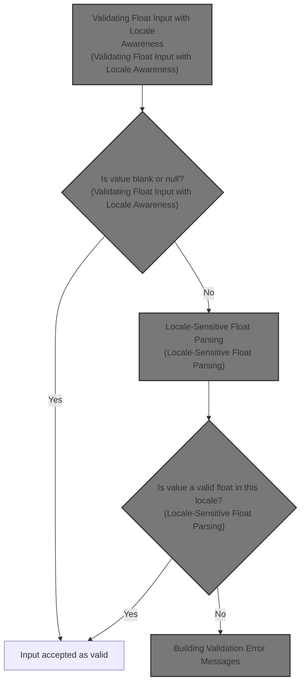
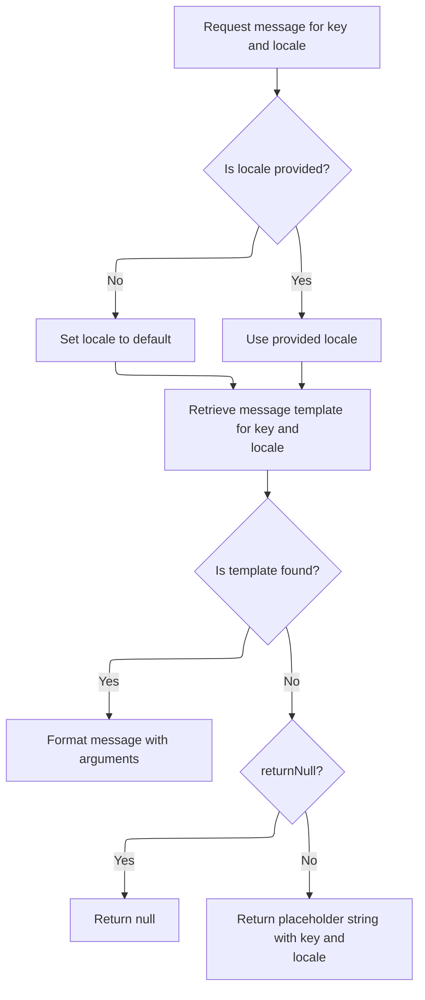
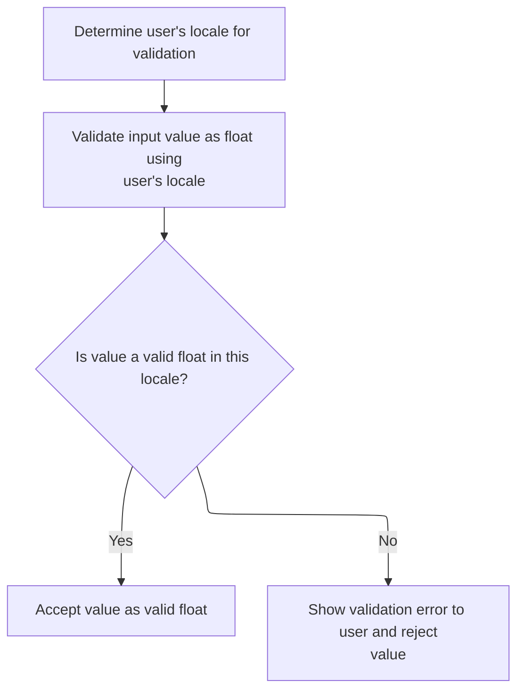
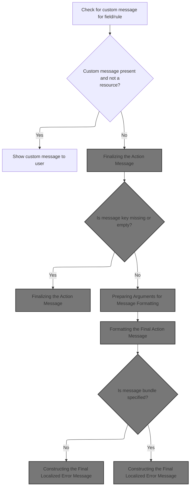
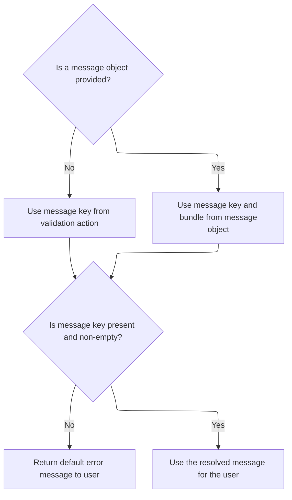
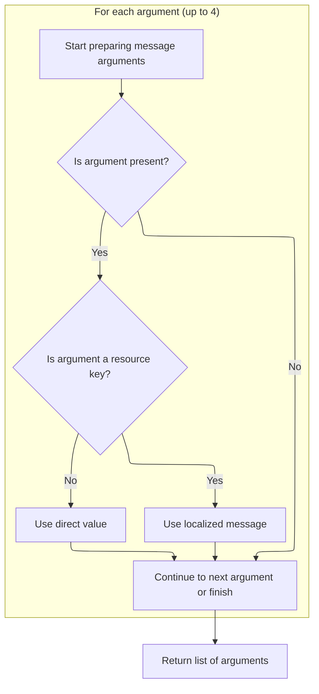
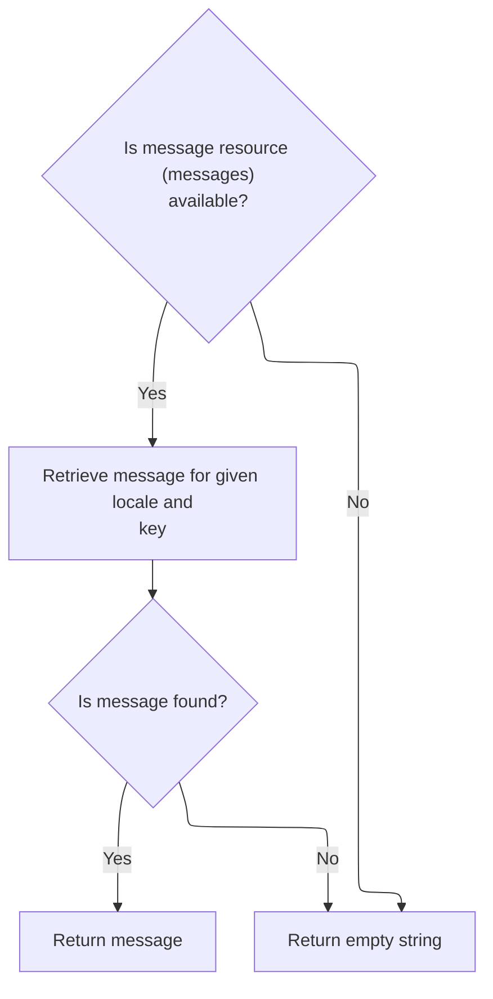
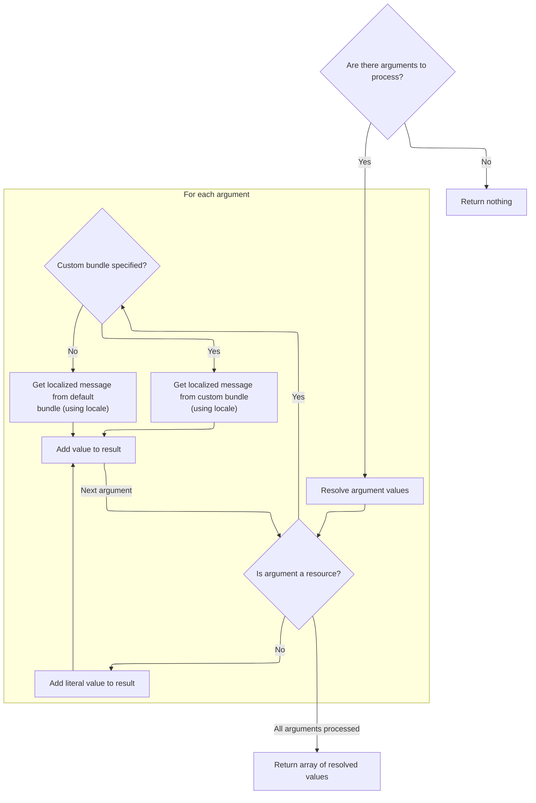

```mermaid
%%{init: {"flowchart": {"defaultRenderer": "elk"}} }%%
flowchart TD
    node1["Start: Retrieve message resources for
request"] --> node2{"Is bundle specified?"}
    click node1 openCode "core/src/main/java/org/apache/struts/validator/Resources.java:117:145"
    node2 -->|"No"| node3["Set bundle to default"]
    click node2 openCode "core/src/main/java/org/apache/struts/validator/Resources.java:119:121"
    node2 -->|"Yes"| node4["Use provided bundle"]
    click node3 openCode "core/src/main/java/org/apache/struts/validator/Resources.java:119:121"
    node3 --> node5{"Resources in request?"}
    node4 --> node5
    click node4 openCode "core/src/main/java/org/apache/struts/validator/Resources.java:119:121"
    node5 -->|"Yes"| node10["Return resources"]
    click node5 openCode "core/src/main/java/org/apache/struts/validator/Resources.java:123:124"
    node5 -->|"No"| node6{"Resources in application for module?"}
    click node6 openCode "core/src/main/java/org/apache/struts/validator/Resources.java:126:133"
    node6 -->|"Yes"| node10
    node6 -->|"No"| node7{"Resources in application for default
bundle?"}
    click node7 openCode "core/src/main/java/org/apache/struts/validator/Resources.java:135:137"
    node7 -->|"Yes"| node10
    node7 -->|"No"| node8["Raise error: No resources found"]
    click node8 openCode "core/src/main/java/org/apache/struts/validator/Resources.java:139:142"
    click node10 openCode "core/src/main/java/org/apache/struts/validator/Resources.java:144:145"
classDef HeadingStyle fill:#777777,stroke:#333,stroke-width:2px;

%% Swimm:
%% %%{init: {"flowchart": {"defaultRenderer": "elk"}} }%%
%% flowchart TD
%%     node1["Start: Retrieve message resources for
%% request"] --> node2{"Is bundle specified?"}
%%     click node1 openCode "<SwmPath>[core/…/validator/Resources.java](core/src/main/java/org/apache/struts/validator/Resources.java)</SwmPath>:117:145"
%%     node2 -->|"No"| node3["Set bundle to default"]
%%     click node2 openCode "<SwmPath>[core/…/validator/Resources.java](core/src/main/java/org/apache/struts/validator/Resources.java)</SwmPath>:119:121"
%%     node2 -->|"Yes"| node4["Use provided bundle"]
%%     click node3 openCode "<SwmPath>[core/…/validator/Resources.java](core/src/main/java/org/apache/struts/validator/Resources.java)</SwmPath>:119:121"
%%     node3 --> node5{"Resources in request?"}
%%     node4 --> node5
%%     click node4 openCode "<SwmPath>[core/…/validator/Resources.java](core/src/main/java/org/apache/struts/validator/Resources.java)</SwmPath>:119:121"
%%     node5 -->|"Yes"| node10["Return resources"]
%%     click node5 openCode "<SwmPath>[core/…/validator/Resources.java](core/src/main/java/org/apache/struts/validator/Resources.java)</SwmPath>:123:124"
%%     node5 -->|"No"| node6{"Resources in application for module?"}
%%     click node6 openCode "<SwmPath>[core/…/validator/Resources.java](core/src/main/java/org/apache/struts/validator/Resources.java)</SwmPath>:126:133"
%%     node6 -->|"Yes"| node10
%%     node6 -->|"No"| node7{"Resources in application for default
%% bundle?"}
%%     click node7 openCode "<SwmPath>[core/…/validator/Resources.java](core/src/main/java/org/apache/struts/validator/Resources.java)</SwmPath>:135:137"
%%     node7 -->|"Yes"| node10
%%     node7 -->|"No"| node8["Raise error: No resources found"]
%%     click node8 openCode "<SwmPath>[core/…/validator/Resources.java](core/src/main/java/org/apache/struts/validator/Resources.java)</SwmPath>:139:142"
%%     click node10 openCode "<SwmPath>[core/…/validator/Resources.java](core/src/main/java/org/apache/struts/validator/Resources.java)</SwmPath>:144:145"
%% classDef HeadingStyle fill:#777777,stroke:#333,stroke-width:2px;
```

This document describes how user input is validated as a floating-point number using the user's locale. The process accepts blank values, checks the value against locale-specific float rules, and provides a localized error message if validation fails.



# Validating Float Input with Locale Awareness

<SwmSnippet path="/core/src/main/java/org/apache/struts/validator/FieldChecks.java" line="716">

---

In <SwmToken path="core/src/main/java/org/apache/struts/validator/FieldChecks.java" pos="716:7:7" line-data="    public static Object validateFloatLocale(Object bean, ValidatorAction va,">`validateFloatLocale`</SwmToken>, we try to extract the value from the bean using <SwmToken path="core/src/main/java/org/apache/struts/validator/FieldChecks.java" pos="723:5:5" line-data="            value = evaluateBean(bean, field);">`evaluateBean`</SwmToken>. If that fails, we immediately call <SwmToken path="core/src/main/java/org/apache/struts/validator/FieldChecks.java" pos="725:1:1" line-data="            processFailure(errors, field, validator.getFormName(), &quot;floatLocale&quot;, e);">`processFailure`</SwmToken> to log the error and add a user error message, then bail out with <SwmToken path="core/src/main/java/org/apache/struts/validator/FieldChecks.java" pos="726:3:5" line-data="            return Boolean.FALSE;">`Boolean.FALSE`</SwmToken>. This ensures that both developers and users are notified about the failure before stopping further validation.

```java
    public static Object validateFloatLocale(Object bean, ValidatorAction va,
        Field field, ActionMessages errors, Validator validator,
        HttpServletRequest request) {
        Object result = null;
        String value = null;

        try {
            value = evaluateBean(bean, field);
        } catch (Exception e) {
            processFailure(errors, field, validator.getFormName(), "floatLocale", e);
            return Boolean.FALSE;
        }

        if (GenericValidator.isBlankOrNull(value)) {
            return Boolean.TRUE;
        }

```

---

</SwmSnippet>

## Logging and Reporting Validation Failures

<SwmSnippet path="/core/src/main/java/org/apache/struts/validator/FieldChecks.java" line="1434">

---

In <SwmToken path="core/src/main/java/org/apache/struts/validator/FieldChecks.java" pos="1434:7:7" line-data="    private static void processFailure(ActionMessages errors, Field field,">`processFailure`</SwmToken>, we build a formatted error message using <SwmToken path="core/src/main/java/org/apache/struts/validator/FieldChecks.java" pos="1438:1:3" line-data="            sysmsgs.getMessage(&quot;validation.failed&quot;, validatorName,">`sysmsgs.getMessage`</SwmToken>, then log it with the exception. This step ensures that all relevant details about the validation failure are captured in the logs. Next, we need to fetch the actual message string from <SwmToken path="core/src/main/java/org/apache/struts/validator/Resources.java" pos="117:5:5" line-data="    public static MessageResources getMessageResources(">`MessageResources`</SwmToken>.

```java
    private static void processFailure(ActionMessages errors, Field field,
        String formName, String validatorName, Throwable t) {
        // Log the error
        String logErrorMsg =
            sysmsgs.getMessage("validation.failed", validatorName,
                field.getProperty(), formName, t.toString());

        log.error(logErrorMsg, t);

```

---

</SwmSnippet>

### Formatting Log/Error Messages

<SwmSnippet path="/core/src/main/java/org/apache/struts/util/MessageResources.java" line="355">

---

<SwmToken path="core/src/main/java/org/apache/struts/util/MessageResources.java" pos="355:5:5" line-data="    public String getMessage(Locale locale, String key, Object arg0,">`getMessage`</SwmToken> with three arguments just wraps them into an Object array and delegates to the main <SwmToken path="core/src/main/java/org/apache/struts/util/MessageResources.java" pos="355:5:5" line-data="    public String getMessage(Locale locale, String key, Object arg0,">`getMessage`</SwmToken> method. This lets us handle messages with variable argument counts without duplicating logic.

```java
    public String getMessage(Locale locale, String key, Object arg0,
        Object arg1, Object arg2) {
        return this.getMessage(locale, key, new Object[] { arg0, arg1, arg2 });
    }
```

---

</SwmSnippet>

### Retrieving and Formatting Localized Messages



<SwmSnippet path="/core/src/main/java/org/apache/struts/util/MessageResources.java" line="324">

---

<SwmToken path="core/src/main/java/org/apache/struts/util/MessageResources.java" pos="324:5:5" line-data="    public String getMessage(Locale locale, String key, Object arg0) {">`getMessage`</SwmToken> with one argument just wraps the argument in an array and calls the main <SwmToken path="core/src/main/java/org/apache/struts/util/MessageResources.java" pos="324:5:5" line-data="    public String getMessage(Locale locale, String key, Object arg0) {">`getMessage`</SwmToken> method. This keeps the API simple for callers who only need to format messages with one parameter.

```java
    public String getMessage(Locale locale, String key, Object arg0) {
        return this.getMessage(locale, key, new Object[] { arg0 });
    }
```

---

</SwmSnippet>

<SwmSnippet path="/core/src/main/java/org/apache/struts/util/MessageResources.java" line="286">

---

<SwmToken path="core/src/main/java/org/apache/struts/util/MessageResources.java" pos="286:5:5" line-data="    public String getMessage(Locale locale, String key, Object[] args) {">`getMessage`</SwmToken> (with Object\[\] args) handles the actual retrieval and formatting of localized messages. It uses a cache for <SwmToken path="core/src/main/java/org/apache/struts/util/MessageResources.java" pos="287:5:5" line-data="        // Cache MessageFormat instances as they are accessed">`MessageFormat`</SwmToken> objects keyed by locale and message key, escapes the format string, and falls back to a placeholder if the message is missing. This keeps message formatting fast and consistent, and ensures missing messages are obvious.

```java
    public String getMessage(Locale locale, String key, Object[] args) {
        // Cache MessageFormat instances as they are accessed
        if (locale == null) {
            locale = defaultLocale;
        }

        MessageFormat format = null;
        String formatKey = messageKey(locale, key);

        synchronized (formats) {
            format = (MessageFormat) formats.get(formatKey);

            if (format == null) {
                String formatString = getMessage(locale, key);

                if (formatString == null) {
                    return returnNull ? null : ("???" + formatKey + "???");
                }

                format = new MessageFormat(escape(formatString));
                format.setLocale(locale);
                formats.put(formatKey, format);
            }
        }

        return format.format(args);
    }
```

---

</SwmSnippet>

### Adding User-Facing Error Messages

<SwmSnippet path="/core/src/main/java/org/apache/struts/validator/FieldChecks.java" line="1443">

---

Back in <SwmToken path="core/src/main/java/org/apache/struts/validator/FieldChecks.java" pos="725:1:1" line-data="            processFailure(errors, field, validator.getFormName(), &quot;floatLocale&quot;, e);">`processFailure`</SwmToken>, after logging, we fetch a general system error message (localized) from sysmsgs and add it to the errors collection for the user. This step ensures the user sees a generic error instead of technical details. We need to call <SwmToken path="core/src/main/java/org/apache/struts/validator/Resources.java" pos="117:5:5" line-data="    public static MessageResources getMessageResources(">`MessageResources`</SwmToken> again to get the actual message string.

```java
        // Add general "system error" message to show to the user
        String userErrorMsg = sysmsgs.getMessage("system.error");

        errors.add(field.getKey(), new ActionMessage(userErrorMsg, false));
    }
```

---

</SwmSnippet>

<SwmSnippet path="/core/src/main/java/org/apache/struts/util/MessageResources.java" line="196">

---

<SwmToken path="core/src/main/java/org/apache/struts/util/MessageResources.java" pos="196:5:5" line-data="    public String getMessage(String key) {">`getMessage`</SwmToken> with just a key delegates to the main <SwmToken path="core/src/main/java/org/apache/struts/util/MessageResources.java" pos="196:5:5" line-data="    public String getMessage(String key) {">`getMessage`</SwmToken> method, passing null for locale and arguments. This is for simple messages that don't need formatting.

```java
    public String getMessage(String key) {
        return this.getMessage((Locale) null, key, null);
    }
```

---

</SwmSnippet>

## Locale-Sensitive Float Parsing



<SwmSnippet path="/core/src/main/java/org/apache/struts/validator/FieldChecks.java" line="733">

---

Back in <SwmToken path="core/src/main/java/org/apache/struts/validator/FieldChecks.java" pos="716:7:7" line-data="    public static Object validateFloatLocale(Object bean, ValidatorAction va,">`validateFloatLocale`</SwmToken>, after handling any errors, we grab the user's locale using <SwmToken path="core/src/main/java/org/apache/struts/validator/FieldChecks.java" pos="733:7:7" line-data="        Locale locale = RequestUtils.getUserLocale(request, null);">`RequestUtils`</SwmToken>. This is needed to parse the float value according to the user's regional settings.

```java
        Locale locale = RequestUtils.getUserLocale(request, null);

```

---

</SwmSnippet>

<SwmSnippet path="/core/src/main/java/org/apache/struts/util/RequestUtils.java" line="299">

---

<SwmToken path="core/src/main/java/org/apache/struts/util/RequestUtils.java" pos="299:7:7" line-data="    public static Locale getUserLocale(HttpServletRequest request, String locale) {">`getUserLocale`</SwmToken> checks the session for a stored Locale using a default key if none is provided. If not found, it falls back to the request's locale (from <SwmToken path="core/src/main/java/org/apache/struts/util/RequestUtils.java" pos="313:11:13" line-data="            // Returns Locale based on Accept-Language header or the server default">`Accept-Language`</SwmToken> or server default). This ensures we always have a locale for parsing or formatting.

```java
    public static Locale getUserLocale(HttpServletRequest request, String locale) {
        Locale userLocale = null;
        HttpSession session = request.getSession(false);

        if (locale == null) {
            locale = Globals.LOCALE_KEY;
        }

        // Only check session if sessions are enabled
        if (session != null) {
            userLocale = (Locale) session.getAttribute(locale);
        }

        if (userLocale == null) {
            // Returns Locale based on Accept-Language header or the server default
            userLocale = request.getLocale();
        }

        return userLocale;
    }
```

---

</SwmSnippet>

<SwmSnippet path="/core/src/main/java/org/apache/struts/validator/FieldChecks.java" line="735">

---

Back in <SwmToken path="core/src/main/java/org/apache/struts/validator/FieldChecks.java" pos="716:7:7" line-data="    public static Object validateFloatLocale(Object bean, ValidatorAction va,">`validateFloatLocale`</SwmToken>, after getting the locale, we try to parse the float. If parsing fails (result is null), we add a localized error message using <SwmToken path="core/src/main/java/org/apache/struts/validator/FieldChecks.java" pos="739:1:3" line-data="                Resources.getActionMessage(validator, request, va, field));">`Resources.getActionMessage`</SwmToken>, then return the result.

```java
        result = GenericTypeValidator.formatFloat(value, locale);

        if (result == null) {
            errors.add(field.getKey(),
                Resources.getActionMessage(validator, request, va, field));
        }

        return (result == null) ? Boolean.FALSE : result;
    }
```

---

</SwmSnippet>

# Building Validation Error Messages



<SwmSnippet path="/core/src/main/java/org/apache/struts/validator/Resources.java" line="365">

---

In <SwmToken path="core/src/main/java/org/apache/struts/validator/Resources.java" pos="365:7:7" line-data="    public static ActionMessage getActionMessage(Validator validator,">`getActionMessage`</SwmToken>, we check if the field has a custom message for this validator. If it's a direct string, we use it. If it's a resource reference, we need to look up the actual message using <SwmToken path="core/src/main/java/org/apache/struts/config/ConfigHelper.java" pos="56:4:4" line-data="public class ConfigHelper implements ConfigHelperInterface {">`ConfigHelper`</SwmToken>.

```java
    public static ActionMessage getActionMessage(Validator validator,
        HttpServletRequest request, ValidatorAction va, Field field) {
        Msg msg = field.getMessage(va.getName());

        if ((msg != null) && !msg.isResource()) {
            return new ActionMessage(msg.getKey(), false);
        }

```

---

</SwmSnippet>

## Resolving Message Keys from Configuration

<SwmSnippet path="/core/src/main/java/org/apache/struts/config/ConfigHelper.java" line="496">

---

In <SwmToken path="core/src/main/java/org/apache/struts/config/ConfigHelper.java" pos="496:5:5" line-data="    public String getMessage(String key) {">`getMessage`</SwmToken>, we grab the <SwmToken path="core/src/main/java/org/apache/struts/config/ConfigHelper.java" pos="497:1:1" line-data="        MessageResources resources = getMessageResources();">`MessageResources`</SwmToken> instance and then fetch the user's locale using <SwmToken path="core/src/main/java/org/apache/struts/config/ConfigHelper.java" pos="503:7:7" line-data="        return resources.getMessage(RequestUtils.getUserLocale(request, null),">`RequestUtils`</SwmToken>. This is needed to look up the localized message string for the given key.

```java
    public String getMessage(String key) {
        MessageResources resources = getMessageResources();

        if (resources == null) {
            return null;
        }

        return resources.getMessage(RequestUtils.getUserLocale(request, null),
```

---

</SwmSnippet>

<SwmSnippet path="/core/src/main/java/org/apache/struts/config/ConfigHelper.java" line="503">

---

Back in `ConfigHelper.getMessage`, after getting the locale, we fetch the localized message string from resources using the key. This gives us the final message to display or use.

```java
        return resources.getMessage(RequestUtils.getUserLocale(request, null),
            key);
    }
```

---

</SwmSnippet>

<SwmSnippet path="/core/src/main/java/org/apache/struts/validator/Resources.java" line="249">

---

<SwmToken path="core/src/main/java/org/apache/struts/validator/Resources.java" pos="249:7:7" line-data="    public static String getMessage(HttpServletRequest request, String key) {">`getMessage`</SwmToken> fetches the <SwmToken path="core/src/main/java/org/apache/struts/validator/Resources.java" pos="250:1:1" line-data="        MessageResources messages = getMessageResources(request);">`MessageResources`</SwmToken> for the request, then gets the user's locale using <SwmToken path="core/src/main/java/org/apache/struts/validator/Resources.java" pos="252:8:8" line-data="        return getMessage(messages, RequestUtils.getUserLocale(request, null),">`RequestUtils`</SwmToken>. This ensures we always use the right locale for message lookup.

```java
    public static String getMessage(HttpServletRequest request, String key) {
        MessageResources messages = getMessageResources(request);

        return getMessage(messages, RequestUtils.getUserLocale(request, null),
            key);
    }
```

---

</SwmSnippet>

## Finalizing the Action Message



<SwmSnippet path="/core/src/main/java/org/apache/struts/validator/Resources.java" line="373">

---

Back in <SwmToken path="core/src/main/java/org/apache/struts/validator/FieldChecks.java" pos="739:1:3" line-data="                Resources.getActionMessage(validator, request, va, field));">`Resources.getActionMessage`</SwmToken>, after resolving the message key and bundle, we check if we have a valid key. If not, we return a placeholder <SwmToken path="core/src/main/java/org/apache/struts/validator/Resources.java" pos="384:5:5" line-data="            return new ActionMessage(&quot;??? &quot; + va.getName() + &quot;.&quot;">`ActionMessage`</SwmToken>. Otherwise, we fetch the <SwmToken path="core/src/main/java/org/apache/struts/validator/Resources.java" pos="390:1:1" line-data="        MessageResources messages =">`MessageResources`</SwmToken> using the application, request, and bundle.

```java
        String msgKey = null;
        String msgBundle = null;

        if (msg == null) {
            msgKey = va.getMsg();
        } else {
            msgKey = msg.getKey();
            msgBundle = msg.getBundle();
        }

        if ((msgKey == null) || (msgKey.length() == 0)) {
            return new ActionMessage("??? " + va.getName() + "."
                + field.getProperty() + " ???", false);
        }

        ServletContext application =
            (ServletContext) validator.getParameterValue(SERVLET_CONTEXT_PARAM);
        MessageResources messages =
            getMessageResources(application, request, msgBundle);
```

---

</SwmSnippet>

## Locating the Correct <SwmToken path="core/src/main/java/org/apache/struts/validator/Resources.java" pos="117:5:5" line-data="    public static MessageResources getMessageResources(">`MessageResources`</SwmToken>



<SwmSnippet path="/core/src/main/java/org/apache/struts/validator/Resources.java" line="117">

---

In <SwmToken path="core/src/main/java/org/apache/struts/validator/Resources.java" pos="117:7:7" line-data="    public static MessageResources getMessageResources(">`getMessageResources`</SwmToken>, we try to get the <SwmToken path="core/src/main/java/org/apache/struts/validator/Resources.java" pos="117:5:5" line-data="    public static MessageResources getMessageResources(">`MessageResources`</SwmToken> from the request attribute first. If not found, we get the <SwmToken path="core/src/main/java/org/apache/struts/validator/Resources.java" pos="127:1:1" line-data="            ModuleConfig moduleConfig =">`ModuleConfig`</SwmToken> for the current module (using <SwmToken path="core/src/main/java/org/apache/struts/validator/Resources.java" pos="128:1:1" line-data="                ModuleUtils.getInstance().getModuleConfig(request, application);">`ModuleUtils`</SwmToken>) and try again with a module-prefixed key in the application scope. If still not found, we fall back to just the bundle key. This fallback logic ensures we get the right resources for the current module context.

```java
    public static MessageResources getMessageResources(
        ServletContext application, HttpServletRequest request, String bundle) {
        if (bundle == null) {
            bundle = Globals.MESSAGES_KEY;
        }

        MessageResources resources =
            (MessageResources) request.getAttribute(bundle);

        if (resources == null) {
            ModuleConfig moduleConfig =
                ModuleUtils.getInstance().getModuleConfig(request, application);

            resources =
                (MessageResources) application.getAttribute(bundle
                    + moduleConfig.getPrefix());
        }

```

---

</SwmSnippet>

<SwmSnippet path="/core/src/main/java/org/apache/struts/util/ModuleUtils.java" line="130">

---

<SwmToken path="core/src/main/java/org/apache/struts/util/ModuleUtils.java" pos="130:5:5" line-data="    public ModuleConfig getModuleConfig(HttpServletRequest request,">`getModuleConfig`</SwmToken> first tries to get the <SwmToken path="core/src/main/java/org/apache/struts/util/ModuleUtils.java" pos="130:3:3" line-data="    public ModuleConfig getModuleConfig(HttpServletRequest request,">`ModuleConfig`</SwmToken> from the request. If it's missing, it falls back to the context (using an empty string for the default module), and then stores it back in the request for later use. This ensures we always have a module config, even if the request didn't have one initially.

```java
    public ModuleConfig getModuleConfig(HttpServletRequest request,
        ServletContext context) {
        ModuleConfig moduleConfig = this.getModuleConfig(request);

        if (moduleConfig == null) {
            moduleConfig = this.getModuleConfig("", context);
            request.setAttribute(Globals.MODULE_KEY, moduleConfig);
        }

        return moduleConfig;
    }
```

---

</SwmSnippet>

<SwmSnippet path="/core/src/main/java/org/apache/struts/validator/Resources.java" line="135">

---

Back in <SwmToken path="core/src/main/java/org/apache/struts/validator/Resources.java" pos="117:7:7" line-data="    public static MessageResources getMessageResources(">`getMessageResources`</SwmToken>, after getting the <SwmToken path="core/src/main/java/org/apache/struts/validator/Resources.java" pos="127:1:1" line-data="            ModuleConfig moduleConfig =">`ModuleConfig`</SwmToken>, we try to fetch the <SwmToken path="core/src/main/java/org/apache/struts/validator/Resources.java" pos="136:6:6" line-data="            resources = (MessageResources) application.getAttribute(bundle);">`MessageResources`</SwmToken> using the module-prefixed key. If that fails, we try again with just the bundle key. If nothing is found, we throw an exception. This fallback ensures we always try all possible locations for resources.

```java
        if (resources == null) {
            resources = (MessageResources) application.getAttribute(bundle);
        }

        if (resources == null) {
            throw new NullPointerException(
                "No message resources found for bundle: " + bundle);
        }

        return resources;
    }
```

---

</SwmSnippet>

## Preparing Arguments for Message Formatting

<SwmSnippet path="/core/src/main/java/org/apache/struts/validator/Resources.java" line="392">

---

Back in <SwmToken path="core/src/main/java/org/apache/struts/validator/FieldChecks.java" pos="739:1:3" line-data="                Resources.getActionMessage(validator, request, va, field));">`Resources.getActionMessage`</SwmToken>, after getting the resources, we fetch the user's locale again. This is needed to format any arguments in the message according to the user's settings.

```java
        Locale locale = RequestUtils.getUserLocale(request, null);

```

---

</SwmSnippet>

<SwmSnippet path="/core/src/main/java/org/apache/struts/validator/Resources.java" line="394">

---

Back in <SwmToken path="core/src/main/java/org/apache/struts/validator/FieldChecks.java" pos="739:1:3" line-data="                Resources.getActionMessage(validator, request, va, field));">`Resources.getActionMessage`</SwmToken>, after getting the locale, we fetch the argument list for the message using <SwmToken path="core/src/main/java/org/apache/struts/validator/Resources.java" pos="394:11:11" line-data="        Arg[] args = field.getArgs(va.getName());">`getArgs`</SwmToken>. This step resolves any dynamic values or localized arguments needed for the message.

```java
        Arg[] args = field.getArgs(va.getName());
```

---

</SwmSnippet>

## Resolving Message Arguments



<SwmSnippet path="/core/src/main/java/org/apache/struts/validator/Resources.java" line="420">

---

<SwmToken path="core/src/main/java/org/apache/struts/validator/Resources.java" pos="420:9:9" line-data="    public static String[] getArgs(String actionName,">`getArgs`</SwmToken> pulls up to four Arg objects from the field for the given action, resolving each to either a localized message or a direct key. This means only four arguments are ever processed, and localization is handled per argument if needed.

```java
    public static String[] getArgs(String actionName,
        MessageResources messages, Locale locale, Field field) {
        String[] argMessages = new String[4];

        Arg[] args =
            new Arg[] {
                field.getArg(actionName, 0), field.getArg(actionName, 1),
                field.getArg(actionName, 2), field.getArg(actionName, 3)
            };

        for (int i = 0; i < args.length; i++) {
            if (args[i] == null) {
                continue;
            }

            if (args[i].isResource()) {
                argMessages[i] = getMessage(messages, locale, args[i].getKey());
            } else {
                argMessages[i] = args[i].getKey();
            }
        }

        return argMessages;
    }
```

---

</SwmSnippet>

## Fetching Localized Argument Messages



<SwmSnippet path="/core/src/main/java/org/apache/struts/validator/Resources.java" line="231">

---

<SwmToken path="core/src/main/java/org/apache/struts/validator/Resources.java" pos="231:7:7" line-data="    public static String getMessage(MessageResources messages, Locale locale,">`getMessage`</SwmToken> checks if the messages object is present, then fetches the localized string for the given key and locale. If nothing is found, it returns an empty string.

```java
    public static String getMessage(MessageResources messages, Locale locale,
        String key) {
        String message = null;

        if (messages != null) {
            message = messages.getMessage(locale, key);
        }

        return (message == null) ? "" : message;
    }
```

---

</SwmSnippet>

<SwmSnippet path="/core/src/main/java/org/apache/struts/util/MessageResources.java" line="218">

---

<SwmToken path="core/src/main/java/org/apache/struts/util/MessageResources.java" pos="218:5:5" line-data="    public String getMessage(String key, Object arg0) {">`getMessage`</SwmToken> with key and one argument just calls the main <SwmToken path="core/src/main/java/org/apache/struts/util/MessageResources.java" pos="218:5:5" line-data="    public String getMessage(String key, Object arg0) {">`getMessage`</SwmToken> method, passing null for locale. This is for convenience when formatting messages with one argument.

```java
    public String getMessage(String key, Object arg0) {
        return this.getMessage((Locale) null, key, arg0);
    }
```

---

</SwmSnippet>

## Formatting the Final Action Message

<SwmSnippet path="/core/src/main/java/org/apache/struts/validator/Resources.java" line="395">

---

Back in <SwmToken path="core/src/main/java/org/apache/struts/validator/FieldChecks.java" pos="739:1:3" line-data="                Resources.getActionMessage(validator, request, va, field));">`Resources.getActionMessage`</SwmToken>, after getting the Arg objects, we resolve them to actual strings using <SwmToken path="core/src/main/java/org/apache/struts/validator/Resources.java" pos="396:1:1" line-data="            getArgValues(application, request, messages, locale, args);">`getArgValues`</SwmToken>. This step ensures all arguments are ready for message formatting.

```java
        String[] argValues =
            getArgValues(application, request, messages, locale, args);

```

---

</SwmSnippet>

## Resolving Argument Values for Messages



<SwmSnippet path="/core/src/main/java/org/apache/struts/validator/Resources.java" line="455">

---

In <SwmToken path="core/src/main/java/org/apache/struts/validator/Resources.java" pos="455:9:9" line-data="    private static String[] getArgValues(ServletContext application,">`getArgValues`</SwmToken>, we loop through the Arg objects, resolving each to a string. If an argument specifies a bundle, we fetch the right <SwmToken path="core/src/main/java/org/apache/struts/validator/Resources.java" pos="456:6:6" line-data="        HttpServletRequest request, MessageResources defaultMessages,">`MessageResources`</SwmToken> before looking up the value. This ensures each argument is localized and bundled correctly.

```java
    private static String[] getArgValues(ServletContext application,
        HttpServletRequest request, MessageResources defaultMessages,
        Locale locale, Arg[] args) {
        if ((args == null) || (args.length == 0)) {
            return null;
        }

        String[] values = new String[args.length];

        for (int i = 0; i < args.length; i++) {
            if (args[i] != null) {
                if (args[i].isResource()) {
                    MessageResources messages = defaultMessages;

                    if (args[i].getBundle() != null) {
                        messages =
                            getMessageResources(application, request,
                                args[i].getBundle());
                    }

```

---

</SwmSnippet>

<SwmSnippet path="/core/src/main/java/org/apache/struts/validator/Resources.java" line="475">

---

Here, after resolving all argument values in Resources.getArgValues, we need to format the final message string using the localized template and those arguments. That's why we call MessageResources.getMessage again—this step ensures the <SwmToken path="core/src/main/java/org/apache/struts/validator/FieldChecks.java" pos="1446:14:14" line-data="        errors.add(field.getKey(), new ActionMessage(userErrorMsg, false));">`ActionMessage`</SwmToken> contains the fully formatted, localized message for the user.

```java
                    values[i] = messages.getMessage(locale, args[i].getKey());
                } else {
                    values[i] = args[i].getKey();
                }
            }
        }

        return values;
    }
```

---

</SwmSnippet>

## Constructing the Final Localized Error Message

<SwmSnippet path="/core/src/main/java/org/apache/struts/validator/Resources.java" line="398">

---

Next, in <SwmToken path="core/src/main/java/org/apache/struts/validator/FieldChecks.java" pos="739:1:3" line-data="                Resources.getActionMessage(validator, request, va, field));">`Resources.getActionMessage`</SwmToken>, we check if <SwmToken path="core/src/main/java/org/apache/struts/validator/Resources.java" pos="400:4:4" line-data="        if (msgBundle == null) {">`msgBundle`</SwmToken> is present. If not, we create an <SwmToken path="core/src/main/java/org/apache/struts/validator/Resources.java" pos="398:1:1" line-data="        ActionMessage actionMessage = null;">`ActionMessage`</SwmToken> with the key and arguments, deferring formatting. If <SwmToken path="core/src/main/java/org/apache/struts/validator/Resources.java" pos="400:4:4" line-data="        if (msgBundle == null) {">`msgBundle`</SwmToken> is set, we call MessageResources.getMessage to format the message immediately, then wrap it in <SwmToken path="core/src/main/java/org/apache/struts/validator/Resources.java" pos="398:1:1" line-data="        ActionMessage actionMessage = null;">`ActionMessage`</SwmToken>. This determines when and how the message gets localized and formatted for the user.

```java
        ActionMessage actionMessage = null;

        if (msgBundle == null) {
            actionMessage = new ActionMessage(msgKey, argValues);
        } else {
            String message = messages.getMessage(locale, msgKey, argValues);

            actionMessage = new ActionMessage(message, false);
        }

        return actionMessage;
    }
```

---

</SwmSnippet>

&nbsp;

*This is an auto-generated document by Swimm 🌊 and has not yet been verified by a human*

<SwmMeta version="3.0.0" repo-id="Z2l0aHViJTNBJTNBc3RydXRzMSUzQSUzQVN3aW1tLURlbW8=" repo-name="struts1"><sup>Powered by [Swimm](https://app.swimm.io/)</sup></SwmMeta>
