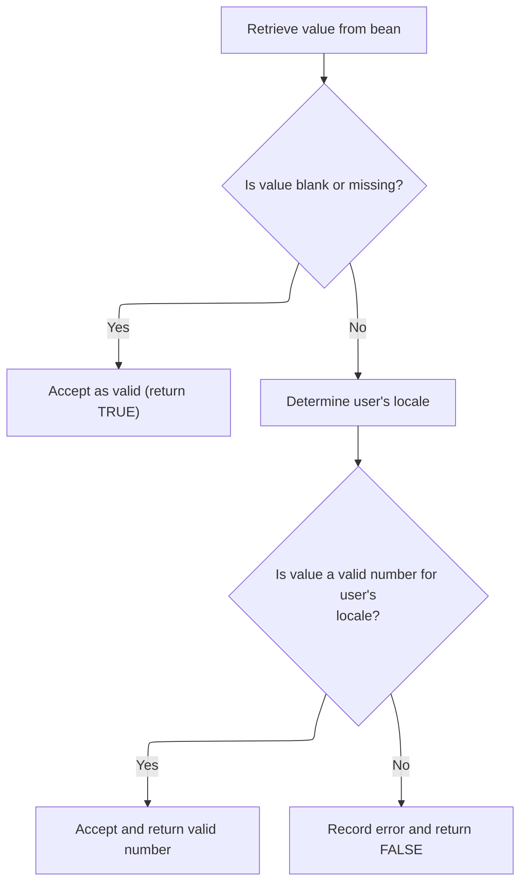
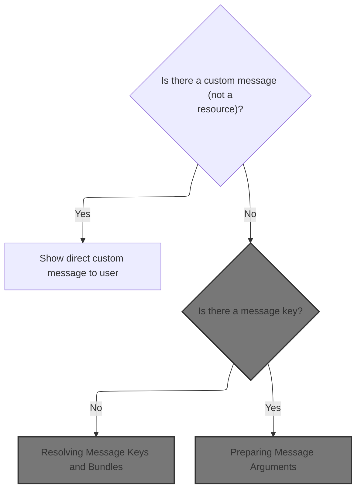
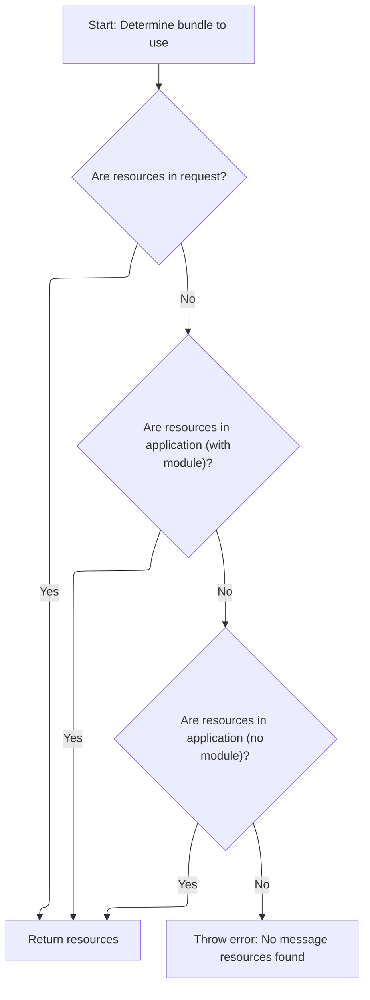
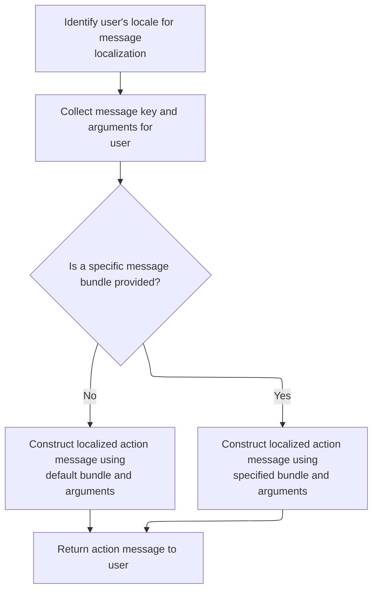

This document explains how user input is validated as a number, using the user's locale to interpret the value and provide feedback. The flow accepts a value and field information, determines if the value is valid for the user's locale, and, if not, generates a localized error message.

# Locale-Aware Double Validation



<SwmSnippet path="/core/src/main/java/org/apache/struts/validator/FieldChecks.java" line="802">

---

In <SwmToken path="core/src/main/java/org/apache/struts/validator/FieldChecks.java" pos="802:7:7" line-data="    public static Object validateDoubleLocale(Object bean, ValidatorAction va,">`validateDoubleLocale`</SwmToken>, we grab the value to validate and skip blank/nulls. Next, we fetch the user's locale using <SwmToken path="core/src/main/java/org/apache/struts/validator/FieldChecks.java" pos="819:7:7" line-data="        Locale locale = RequestUtils.getUserLocale(request, null);">`RequestUtils`</SwmToken> so we can parse the number string according to their regional format.

```java
    public static Object validateDoubleLocale(Object bean, ValidatorAction va,
        Field field, ActionMessages errors, Validator validator,
        HttpServletRequest request) {
        Object result = null;
        String value = null;

        try {
            value = evaluateBean(bean, field);
        } catch (Exception e) {
            processFailure(errors, field, validator.getFormName(), "doubleLocale", e);
            return Boolean.FALSE;
        }

        if (GenericValidator.isBlankOrNull(value)) {
            return Boolean.TRUE;
        }

        Locale locale = RequestUtils.getUserLocale(request, null);

```

---

</SwmSnippet>

<SwmSnippet path="/core/src/main/java/org/apache/struts/util/RequestUtils.java" line="299">

---

<SwmToken path="core/src/main/java/org/apache/struts/util/RequestUtils.java" pos="299:7:7" line-data="    public static Locale getUserLocale(HttpServletRequest request, String locale) {">`getUserLocale`</SwmToken> checks for a user-specific Locale in the session using a key (defaulting to <SwmToken path="core/src/main/java/org/apache/struts/util/RequestUtils.java" pos="304:5:7" line-data="            locale = Globals.LOCALE_KEY;">`Globals.LOCALE_KEY`</SwmToken>). If not found, it falls back to the request's locale. This lets us respect user preferences if set, otherwise we use browser or server defaults.

```java
    public static Locale getUserLocale(HttpServletRequest request, String locale) {
        Locale userLocale = null;
        HttpSession session = request.getSession(false);

        if (locale == null) {
            locale = Globals.LOCALE_KEY;
        }

        // Only check session if sessions are enabled
        if (session != null) {
            userLocale = (Locale) session.getAttribute(locale);
        }

        if (userLocale == null) {
            // Returns Locale based on Accept-Language header or the server default
            userLocale = request.getLocale();
        }

        return userLocale;
    }
```

---

</SwmSnippet>

<SwmSnippet path="/core/src/main/java/org/apache/struts/validator/FieldChecks.java" line="821">

---

Back in <SwmToken path="core/src/main/java/org/apache/struts/validator/FieldChecks.java" pos="802:7:7" line-data="    public static Object validateDoubleLocale(Object bean, ValidatorAction va,">`validateDoubleLocale`</SwmToken>, after parsing the value with the locale, if parsing fails, we add a localized error message using Resources. This is where we hook in user feedback for invalid input.

```java
        result = GenericTypeValidator.formatDouble(value, locale);

        if (result == null) {
            errors.add(field.getKey(),
                Resources.getActionMessage(validator, request, va, field));
        }

        return (result == null) ? Boolean.FALSE : result;
    }
```

---

</SwmSnippet>

# Building the Validation Error Message



<SwmSnippet path="/core/src/main/java/org/apache/struts/validator/Resources.java" line="365">

---

In <SwmToken path="core/src/main/java/org/apache/struts/validator/Resources.java" pos="365:7:7" line-data="    public static ActionMessage getActionMessage(Validator validator,">`getActionMessage`</SwmToken>, we check if the field's message is a resource or a literal. If it's a resource, we need to fetch the localized string, so we move on to <SwmToken path="core/src/main/java/org/apache/struts/config/ConfigHelper.java" pos="56:4:4" line-data="public class ConfigHelper implements ConfigHelperInterface {">`ConfigHelper`</SwmToken> for that lookup.

```java
    public static ActionMessage getActionMessage(Validator validator,
        HttpServletRequest request, ValidatorAction va, Field field) {
        Msg msg = field.getMessage(va.getName());

        if ((msg != null) && !msg.isResource()) {
            return new ActionMessage(msg.getKey(), false);
        }

```

---

</SwmSnippet>

## Fetching the Localized Message String

<SwmSnippet path="/core/src/main/java/org/apache/struts/config/ConfigHelper.java" line="496">

---

In <SwmToken path="core/src/main/java/org/apache/struts/config/ConfigHelper.java" pos="496:5:5" line-data="    public String getMessage(String key) {">`getMessage`</SwmToken>, we grab the message resources and use the user's locale (from <SwmToken path="core/src/main/java/org/apache/struts/config/ConfigHelper.java" pos="503:7:7" line-data="        return resources.getMessage(RequestUtils.getUserLocale(request, null),">`RequestUtils`</SwmToken>) to fetch the localized string for the given key. This ensures the message matches the user's language settings.

```java
    public String getMessage(String key) {
        MessageResources resources = getMessageResources();

        if (resources == null) {
            return null;
        }

        return resources.getMessage(RequestUtils.getUserLocale(request, null),
```

---

</SwmSnippet>

<SwmSnippet path="/core/src/main/java/org/apache/struts/config/ConfigHelper.java" line="503">

---

Back from <SwmToken path="core/src/main/java/org/apache/struts/config/ConfigHelper.java" pos="503:7:7" line-data="        return resources.getMessage(RequestUtils.getUserLocale(request, null),">`RequestUtils`</SwmToken>, <SwmToken path="core/src/main/java/org/apache/struts/config/ConfigHelper.java" pos="503:5:5" line-data="        return resources.getMessage(RequestUtils.getUserLocale(request, null),">`getMessage`</SwmToken> finishes by returning the localized message string. Now, Resources needs to assemble the final message object, possibly with arguments.

```java
        return resources.getMessage(RequestUtils.getUserLocale(request, null),
            key);
    }
```

---

</SwmSnippet>

<SwmSnippet path="/core/src/main/java/org/apache/struts/validator/Resources.java" line="249">

---

<SwmToken path="core/src/main/java/org/apache/struts/validator/Resources.java" pos="249:7:7" line-data="    public static String getMessage(HttpServletRequest request, String key) {">`getMessage`</SwmToken> in Resources fetches the message resources and then calls <SwmToken path="core/src/main/java/org/apache/struts/validator/Resources.java" pos="252:8:8" line-data="        return getMessage(messages, RequestUtils.getUserLocale(request, null),">`RequestUtils`</SwmToken> to get the user's locale, so it can retrieve the localized message string for the given key.

```java
    public static String getMessage(HttpServletRequest request, String key) {
        MessageResources messages = getMessageResources(request);

        return getMessage(messages, RequestUtils.getUserLocale(request, null),
            key);
    }
```

---

</SwmSnippet>

## Resolving Message Keys and Bundles

<SwmSnippet path="/core/src/main/java/org/apache/struts/validator/Resources.java" line="373">

---

Back from <SwmToken path="core/src/main/java/org/apache/struts/config/ConfigHelper.java" pos="56:4:4" line-data="public class ConfigHelper implements ConfigHelperInterface {">`ConfigHelper`</SwmToken>, we resolve the message key and bundle, then fetch the <SwmToken path="core/src/main/java/org/apache/struts/validator/Resources.java" pos="390:1:1" line-data="        MessageResources messages =">`MessageResources`</SwmToken> using both application and request. This sets up for argument substitution in the message.

```java
        String msgKey = null;
        String msgBundle = null;

        if (msg == null) {
            msgKey = va.getMsg();
        } else {
            msgKey = msg.getKey();
            msgBundle = msg.getBundle();
        }

        if ((msgKey == null) || (msgKey.length() == 0)) {
            return new ActionMessage("??? " + va.getName() + "."
                + field.getProperty() + " ???", false);
        }

        ServletContext application =
            (ServletContext) validator.getParameterValue(SERVLET_CONTEXT_PARAM);
        MessageResources messages =
            getMessageResources(application, request, msgBundle);
```

---

</SwmSnippet>

## Locating the Correct <SwmToken path="core/src/main/java/org/apache/struts/validator/Resources.java" pos="117:5:5" line-data="    public static MessageResources getMessageResources(">`MessageResources`</SwmToken>



<SwmSnippet path="/core/src/main/java/org/apache/struts/validator/Resources.java" line="117">

---

In <SwmToken path="core/src/main/java/org/apache/struts/validator/Resources.java" pos="117:7:7" line-data="    public static MessageResources getMessageResources(">`getMessageResources`</SwmToken>, we try to find the message resources in the request, then in the application using the module prefix, and finally globally. If not found, we need <SwmToken path="core/src/main/java/org/apache/struts/validator/Resources.java" pos="128:1:1" line-data="                ModuleUtils.getInstance().getModuleConfig(request, application);">`ModuleUtils`</SwmToken> to get the current module's config and prefix.

```java
    public static MessageResources getMessageResources(
        ServletContext application, HttpServletRequest request, String bundle) {
        if (bundle == null) {
            bundle = Globals.MESSAGES_KEY;
        }

        MessageResources resources =
            (MessageResources) request.getAttribute(bundle);

        if (resources == null) {
            ModuleConfig moduleConfig =
                ModuleUtils.getInstance().getModuleConfig(request, application);

            resources =
                (MessageResources) application.getAttribute(bundle
                    + moduleConfig.getPrefix());
        }

```

---

</SwmSnippet>

<SwmSnippet path="/core/src/main/java/org/apache/struts/util/ModuleUtils.java" line="130">

---

<SwmToken path="core/src/main/java/org/apache/struts/util/ModuleUtils.java" pos="130:5:5" line-data="    public ModuleConfig getModuleConfig(HttpServletRequest request,">`getModuleConfig`</SwmToken> tries to get the module config from the request. If it's missing, it falls back to the context (using an empty string as the module name), and sets it in the request for downstream code.

```java
    public ModuleConfig getModuleConfig(HttpServletRequest request,
        ServletContext context) {
        ModuleConfig moduleConfig = this.getModuleConfig(request);

        if (moduleConfig == null) {
            moduleConfig = this.getModuleConfig("", context);
            request.setAttribute(Globals.MODULE_KEY, moduleConfig);
        }

        return moduleConfig;
    }
```

---

</SwmSnippet>

<SwmSnippet path="/core/src/main/java/org/apache/struts/validator/Resources.java" line="135">

---

Back from <SwmToken path="core/src/main/java/org/apache/struts/validator/Resources.java" pos="128:1:1" line-data="                ModuleUtils.getInstance().getModuleConfig(request, application);">`ModuleUtils`</SwmToken>, if we still can't find <SwmToken path="core/src/main/java/org/apache/struts/validator/Resources.java" pos="136:6:6" line-data="            resources = (MessageResources) application.getAttribute(bundle);">`MessageResources`</SwmToken>, <SwmToken path="core/src/main/java/org/apache/struts/validator/Resources.java" pos="117:7:7" line-data="    public static MessageResources getMessageResources(">`getMessageResources`</SwmToken> throws a <SwmToken path="core/src/main/java/org/apache/struts/validator/Resources.java" pos="140:5:5" line-data="            throw new NullPointerException(">`NullPointerException`</SwmToken>. This makes sure missing resources are caught as config errors, not silent failures.

```java
        if (resources == null) {
            resources = (MessageResources) application.getAttribute(bundle);
        }

        if (resources == null) {
            throw new NullPointerException(
                "No message resources found for bundle: " + bundle);
        }

        return resources;
    }
```

---

</SwmSnippet>

## Preparing Message Arguments



<SwmSnippet path="/core/src/main/java/org/apache/struts/validator/Resources.java" line="392">

---

Back from <SwmToken path="core/src/main/java/org/apache/struts/validator/Resources.java" pos="117:7:7" line-data="    public static MessageResources getMessageResources(">`getMessageResources`</SwmToken>, we fetch the user's locale again with <SwmToken path="core/src/main/java/org/apache/struts/validator/Resources.java" pos="392:7:7" line-data="        Locale locale = RequestUtils.getUserLocale(request, null);">`RequestUtils`</SwmToken>, so we can localize any arguments in the message.

```java
        Locale locale = RequestUtils.getUserLocale(request, null);

```

---

</SwmSnippet>

<SwmSnippet path="/core/src/main/java/org/apache/struts/validator/Resources.java" line="394">

---

Back from <SwmToken path="core/src/main/java/org/apache/struts/validator/FieldChecks.java" pos="819:7:7" line-data="        Locale locale = RequestUtils.getUserLocale(request, null);">`RequestUtils`</SwmToken>, we grab up to four arguments from the field for the action, so we can substitute them into the message template.

```java
        Arg[] args = field.getArgs(va.getName());
```

---

</SwmSnippet>

<SwmSnippet path="/core/src/main/java/org/apache/struts/validator/Resources.java" line="420">

---

<SwmToken path="core/src/main/java/org/apache/struts/validator/Resources.java" pos="420:9:9" line-data="    public static String[] getArgs(String actionName,">`getArgs`</SwmToken> builds an array of up to four argument messages, localizing each if it's a resource. This is used for substituting dynamic values into the message template.

```java
    public static String[] getArgs(String actionName,
        MessageResources messages, Locale locale, Field field) {
        String[] argMessages = new String[4];

        Arg[] args =
            new Arg[] {
                field.getArg(actionName, 0), field.getArg(actionName, 1),
                field.getArg(actionName, 2), field.getArg(actionName, 3)
            };

        for (int i = 0; i < args.length; i++) {
            if (args[i] == null) {
                continue;
            }

            if (args[i].isResource()) {
                argMessages[i] = getMessage(messages, locale, args[i].getKey());
            } else {
                argMessages[i] = args[i].getKey();
            }
        }
```

---

</SwmSnippet>

<SwmSnippet path="/core/src/main/java/org/apache/struts/validator/Resources.java" line="395">

---

Back from <SwmToken path="core/src/main/java/org/apache/struts/validator/Resources.java" pos="394:11:11" line-data="        Arg[] args = field.getArgs(va.getName());">`getArgs`</SwmToken>, we resolve the actual argument values, checking if any need to be fetched from a different resource bundle. This ensures all placeholders are filled with the right localized values.

```java
        String[] argValues =
            getArgValues(application, request, messages, locale, args);

```

---

</SwmSnippet>

<SwmSnippet path="/core/src/main/java/org/apache/struts/validator/Resources.java" line="455">

---

<SwmToken path="core/src/main/java/org/apache/struts/validator/Resources.java" pos="455:9:9" line-data="    private static String[] getArgValues(ServletContext application,">`getArgValues`</SwmToken> loops through the arguments, resolving each one from the correct resource bundle if specified, or using the default otherwise. This handles cases where arguments are localized separately.

```java
    private static String[] getArgValues(ServletContext application,
        HttpServletRequest request, MessageResources defaultMessages,
        Locale locale, Arg[] args) {
        if ((args == null) || (args.length == 0)) {
            return null;
        }

        String[] values = new String[args.length];

        for (int i = 0; i < args.length; i++) {
            if (args[i] != null) {
                if (args[i].isResource()) {
                    MessageResources messages = defaultMessages;

                    if (args[i].getBundle() != null) {
                        messages =
                            getMessageResources(application, request,
                                args[i].getBundle());
                    }

                    values[i] = messages.getMessage(locale, args[i].getKey());
                } else {
                    values[i] = args[i].getKey();
                }
            }
        }

        return values;
    }
```

---

</SwmSnippet>

<SwmSnippet path="/core/src/main/java/org/apache/struts/validator/Resources.java" line="398">

---

Back from <SwmToken path="core/src/main/java/org/apache/struts/validator/Resources.java" pos="396:1:1" line-data="            getArgValues(application, request, messages, locale, args);">`getArgValues`</SwmToken>, we create the <SwmToken path="core/src/main/java/org/apache/struts/validator/Resources.java" pos="398:1:1" line-data="        ActionMessage actionMessage = null;">`ActionMessage`</SwmToken>. If there's a bundle, we fetch and format the message string first; otherwise, we pass the key and arguments to <SwmToken path="core/src/main/java/org/apache/struts/validator/Resources.java" pos="398:1:1" line-data="        ActionMessage actionMessage = null;">`ActionMessage`</SwmToken> directly.

```java
        ActionMessage actionMessage = null;

        if (msgBundle == null) {
            actionMessage = new ActionMessage(msgKey, argValues);
        } else {
            String message = messages.getMessage(locale, msgKey, argValues);

            actionMessage = new ActionMessage(message, false);
        }

        return actionMessage;
    }
```

---

</SwmSnippet>

&nbsp;

*This is an auto-generated document by Swimm 🌊 and has not yet been verified by a human*

<SwmMeta version="3.0.0" repo-id="Z2l0aHViJTNBJTNBc3RydXRzMSUzQSUzQVN3aW1tLURlbW8=" repo-name="struts1"><sup>Powered by [Swimm](https://app.swimm.io/)</sup></SwmMeta>
