This document describes how configuration factories are selected and loaded based on locale. The flow receives a locale key and servlet context, builds a list of possible locale postfixes, checks for loaded factories, and attempts to load XML configuration files for each. When a config is found, base and intermediate files are merged, inheritance is resolved, and a new factory instance is created and cached. If no locale-specific config is found, the default factory is used. This process enables internationalization and layered configuration overrides for tile definitions.

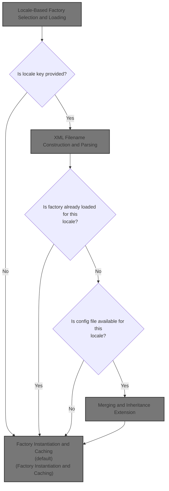

# Locale-Based Factory Selection and Loading

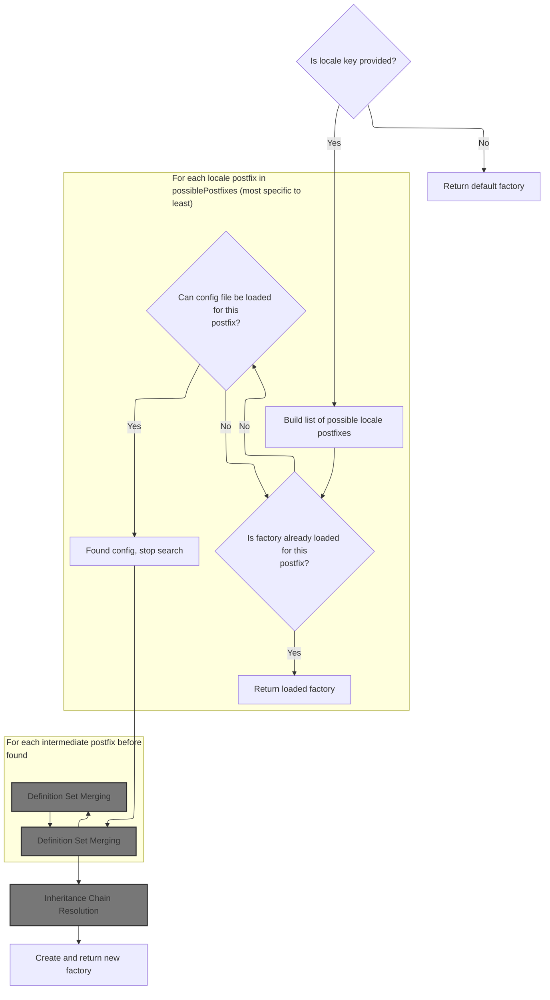

<SwmSnippet path="/tiles/src/main/java/org/apache/struts/tiles/xmlDefinition/I18nFactorySet.java" line="321">

---

In <SwmToken path="tiles/src/main/java/org/apache/struts/tiles/xmlDefinition/I18nFactorySet.java" pos="321:5:5" line-data="    protected DefinitionsFactory createFactory(">`createFactory`</SwmToken>, the code expects the key to be a Locale (even though it's typed as Object), and immediately casts it. It then builds a list of locale suffixes, checks for already-loaded factories for each suffix (from most specific to least), and tries to load XML config files for each. If nothing is found, it falls back to the default factory. If a config is found, it loads the base and intermediate configs, merges them, resolves inheritance, creates a new <SwmToken path="tiles/src/main/java/org/apache/struts/tiles/xmlDefinition/I18nFactorySet.java" pos="321:3:3" line-data="    protected DefinitionsFactory createFactory(">`DefinitionsFactory`</SwmToken>, caches it, and returns it. This is how it supports layered, locale-specific configuration.

```java
    protected DefinitionsFactory createFactory(
        Object key,
        ServletRequest request,
        ServletContext servletContext)
        throws DefinitionsFactoryException {

        if (key == null) {
            return getDefaultFactory();
        }

        // Build possible postfixes
        List possiblePostfixes = calculateSuffixes((Locale) key);

        // Search last postix corresponding to a config file to load.
        // First check if something is loaded for this postfix.
        // If not, try to load its config.
        XmlDefinitionsSet lastXmlFile = null;
        DefinitionsFactory factory = null;
        String curPostfix = null;
        int i = 0;

        for (i = possiblePostfixes.size() - 1; i >= 0; i--) {
            curPostfix = (String) possiblePostfixes.get(i);

            // Already loaded ?
            factory = (DefinitionsFactory) loaded.get(curPostfix);
            if (factory != null) { // yes, stop search
                return factory;
            }

            // Try to load it. If success, stop search
            lastXmlFile = parseXmlFiles(servletContext, curPostfix, null);
            if (lastXmlFile != null) {
                break;
            }
        }
```

---

</SwmSnippet>

<SwmSnippet path="/tiles/src/main/java/org/apache/struts/tiles/xmlDefinition/I18nFactorySet.java" line="364">

---

After finding the most specific locale config, we load the base and all intermediate XML files, merging them into the root config. This is where we call <SwmToken path="tiles/src/main/java/org/apache/struts/tiles/xmlDefinition/I18nFactorySet.java" pos="366:7:7" line-data="        XmlDefinitionsSet rootXmlConfig = parseXmlFiles(servletContext, &quot;&quot;, null);">`parseXmlFiles`</SwmToken> for each suffix, so that all relevant settings and inheritance chains are included before building the final factory.

```java
        // We found something. Need to load base and intermediate files
        String lastPostfix = curPostfix;
        XmlDefinitionsSet rootXmlConfig = parseXmlFiles(servletContext, "", null);
        for (int j = 0; j < i; j++) {
            curPostfix = (String) possiblePostfixes.get(j);
            parseXmlFiles(servletContext, curPostfix, rootXmlConfig);
        }

```

---

</SwmSnippet>

## XML Filename Construction and Parsing

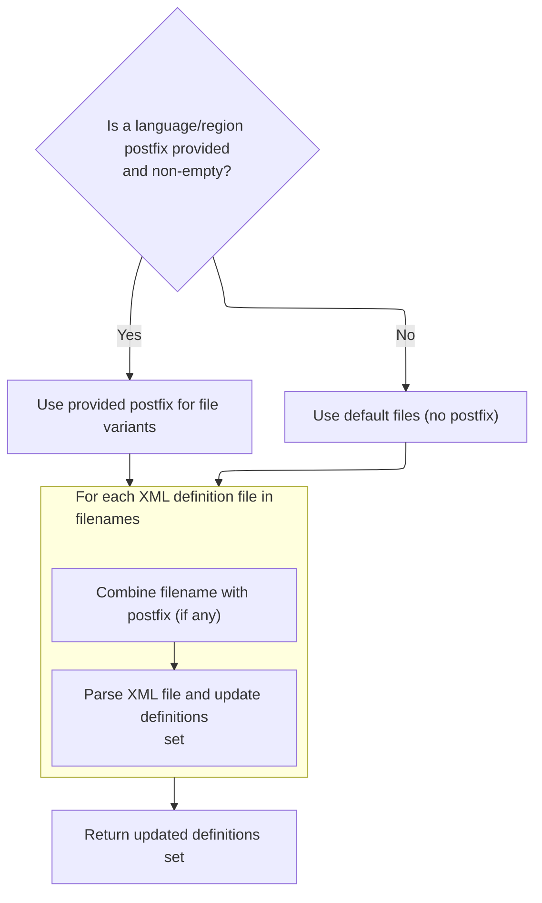

<SwmSnippet path="/tiles/src/main/java/org/apache/struts/tiles/xmlDefinition/I18nFactorySet.java" line="435">

---

In <SwmToken path="tiles/src/main/java/org/apache/struts/tiles/xmlDefinition/I18nFactorySet.java" pos="435:5:5" line-data="    protected XmlDefinitionsSet parseXmlFiles(">`parseXmlFiles`</SwmToken>, we loop through all configured filenames and use <SwmToken path="tiles/src/main/java/org/apache/struts/tiles/xmlDefinition/I18nFactorySet.java" pos="448:7:7" line-data="            String filename = concatPostfix((String) i.next(), postfix);">`concatPostfix`</SwmToken> to add the locale or config postfix to each one. This is how we generate the actual filenames to look for, so we can parse the right XML files for the current context.

```java
    protected XmlDefinitionsSet parseXmlFiles(
        ServletContext servletContext,
        String postfix,
        XmlDefinitionsSet xmlDefinitions)
        throws DefinitionsFactoryException {

        if (postfix != null && postfix.length() == 0) {
            postfix = null;
        }

        // Iterate throw each file name in list
        Iterator i = filenames.iterator();
        while (i.hasNext()) {
            String filename = concatPostfix((String) i.next(), postfix);
```

---

</SwmSnippet>

<SwmSnippet path="/tiles/src/main/java/org/apache/struts/tiles/xmlDefinition/I18nFactorySet.java" line="542">

---

<SwmToken path="tiles/src/main/java/org/apache/struts/tiles/xmlDefinition/I18nFactorySet.java" pos="542:5:5" line-data="    private String concatPostfix(String name, String postfix) {">`concatPostfix`</SwmToken> figures out where to insert the postfix—right before the file extension, unless the dot is part of a directory name. It uses the path separator to avoid messing up directory structures. This way, the generated filename is always valid for the intended config file.

```java
    private String concatPostfix(String name, String postfix) {
        if (postfix == null) {
            return name;
        }

        // Search file name extension.
        // take care of Unix files starting with .
        int dotIndex = name.lastIndexOf(".");
        int lastNameStart = name.lastIndexOf(java.io.File.pathSeparator);
        if (dotIndex < 1 || dotIndex < lastNameStart) {
            return name + postfix;
        }

        String ext = name.substring(dotIndex);
        name = name.substring(0, dotIndex);
        return name + postfix + ext;
    }
```

---

</SwmSnippet>

<SwmSnippet path="/tiles/src/main/java/org/apache/struts/tiles/xmlDefinition/I18nFactorySet.java" line="449">

---

Back in <SwmToken path="tiles/src/main/java/org/apache/struts/tiles/xmlDefinition/I18nFactorySet.java" pos="352:5:5" line-data="            lastXmlFile = parseXmlFiles(servletContext, curPostfix, null);">`parseXmlFiles`</SwmToken>, after building the right filename with <SwmToken path="tiles/src/main/java/org/apache/struts/tiles/xmlDefinition/I18nFactorySet.java" pos="448:7:7" line-data="            String filename = concatPostfix((String) i.next(), postfix);">`concatPostfix`</SwmToken>, we call <SwmToken path="tiles/src/main/java/org/apache/struts/tiles/xmlDefinition/I18nFactorySet.java" pos="449:5:5" line-data="            xmlDefinitions = parseXmlFile(servletContext, filename, xmlDefinitions);">`parseXmlFile`</SwmToken> to actually read and load the XML definitions from that file into our config set.

```java
            xmlDefinitions = parseXmlFile(servletContext, filename, xmlDefinitions);
        }

        return xmlDefinitions;
    }
```

---

</SwmSnippet>

## XML File Parsing and Definition Loading

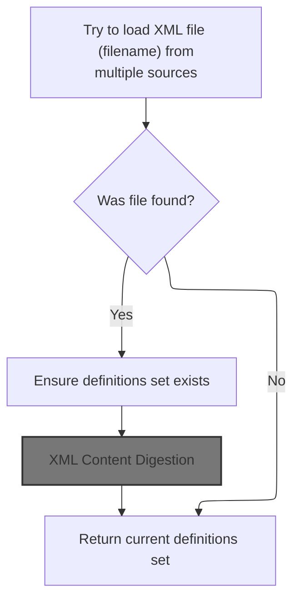

<SwmSnippet path="/tiles/src/main/java/org/apache/struts/tiles/xmlDefinition/I18nFactorySet.java" line="467">

---

In <SwmToken path="tiles/src/main/java/org/apache/struts/tiles/xmlDefinition/I18nFactorySet.java" pos="467:5:5" line-data="    protected XmlDefinitionsSet parseXmlFile(">`parseXmlFile`</SwmToken>, we try to open the XML config file from the servlet context, filesystem, or class loader. If we find it, we set up the parser and parse the file into the definitions set. This is where the actual XML content gets loaded, so we call `XmlParser.parse` next.

```java
    protected XmlDefinitionsSet parseXmlFile(
        ServletContext servletContext,
        String filename,
        XmlDefinitionsSet xmlDefinitions)
        throws DefinitionsFactoryException {

        try {
            InputStream input = servletContext.getResourceAsStream(filename);
            // Try to load using real path.
            // This allow to load config file under websphere 3.5.x
            // Patch proposed Houston, Stephen (LIT) on 5 Apr 2002
            if (null == input) {
                try {
                    input =
                        new java.io.FileInputStream(
                            servletContext.getRealPath(filename));
                } catch (Exception e) {
                }
            }

            // If the config isn't in the servlet context, try the class loader
            // which allows the config files to be stored in a jar
            if (input == null) {
                input = getClass().getResourceAsStream(filename);
            }

            // If still nothing found, this mean no config file is associated
            if (input == null) {
                if (log.isDebugEnabled()) {
                    log.debug("Can't open file '" + filename + "'");
                }
                return xmlDefinitions;
            }

            // Check if parser already exist.
            // Doesn't seem to work yet.
            //if( xmlParser == null )
            if (true) {
                xmlParser = new XmlParser();
                xmlParser.setValidating(isValidatingParser);
            }

            // Check if definition set already exist.
            if (xmlDefinitions == null) {
                xmlDefinitions = new XmlDefinitionsSet();
            }

            xmlParser.parse(input, xmlDefinitions);

```

---

</SwmSnippet>

### XML Content Digestion

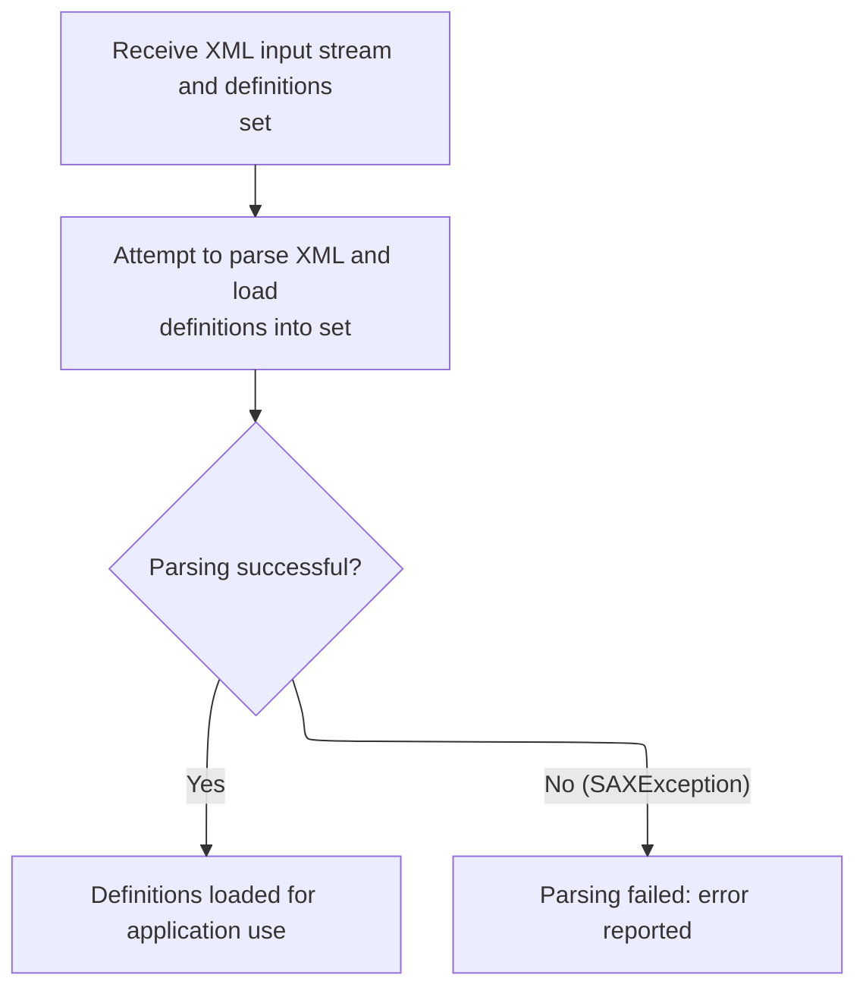

<SwmSnippet path="/tiles/src/main/java/org/apache/struts/tiles/xmlDefinition/XmlParser.java" line="275">

---

<SwmToken path="tiles/src/main/java/org/apache/struts/tiles/xmlDefinition/XmlParser.java" pos="275:5:5" line-data="  public void parse( InputStream in, XmlDefinitionsSet definitions ) throws IOException, SAXException">`parse`</SwmToken> pushes the definitions set onto the digester stack and parses the XML input stream, filling the set with definitions. If parsing fails, it throws an exception. This is where the XML is actually turned into usable config data.

```java
  public void parse( InputStream in, XmlDefinitionsSet definitions ) throws IOException, SAXException
  {
    try
    {
      // set first object in stack
    //digester.clear();
    digester.push(definitions);
      // parse
      digester.parse(in);
      in.close();
      }
  catch (SAXException e)
    {
      //throw new ServletException( "Error while parsing " + mappingConfig, e);
    throw e;
      }

  }
```

---

</SwmSnippet>

### User Database Finalization

<SwmSnippet path="/apps/faces-example1/src/main/java/org/apache/struts/webapp/example/memory/MemoryUserDatabase.java" line="106">

---

<SwmToken path="apps/faces-example1/src/main/java/org/apache/struts/webapp/example/memory/MemoryUserDatabase.java" pos="106:5:5" line-data="    public void close() throws Exception {">`close`</SwmToken> just calls <SwmToken path="apps/faces-example1/src/main/java/org/apache/struts/webapp/example/memory/MemoryUserDatabase.java" pos="108:1:1" line-data="        save();">`save`</SwmToken> to persist any changes before shutting down the <SwmToken path="apps/faces-example1/src/main/java/org/apache/struts/webapp/example/memory/MemoryUserDatabase.java" pos="45:23:25" line-data=" * &lt;p&gt;Concrete implementation of {@link UserDatabase} for an in-memory">`in-memory`</SwmToken> user database. This ensures nothing is lost when the database is closed.

```java
    public void close() throws Exception {

        save();

    }
```

---

</SwmSnippet>

### User Data Persistence

See <SwmLink doc-title="Saving user and subscription data">[Saving user and subscription data](/.swm/saving-user-and-subscription-data.vwkqw5ia.sw.md)</SwmLink>

### XML Parse Completion and Error Handling

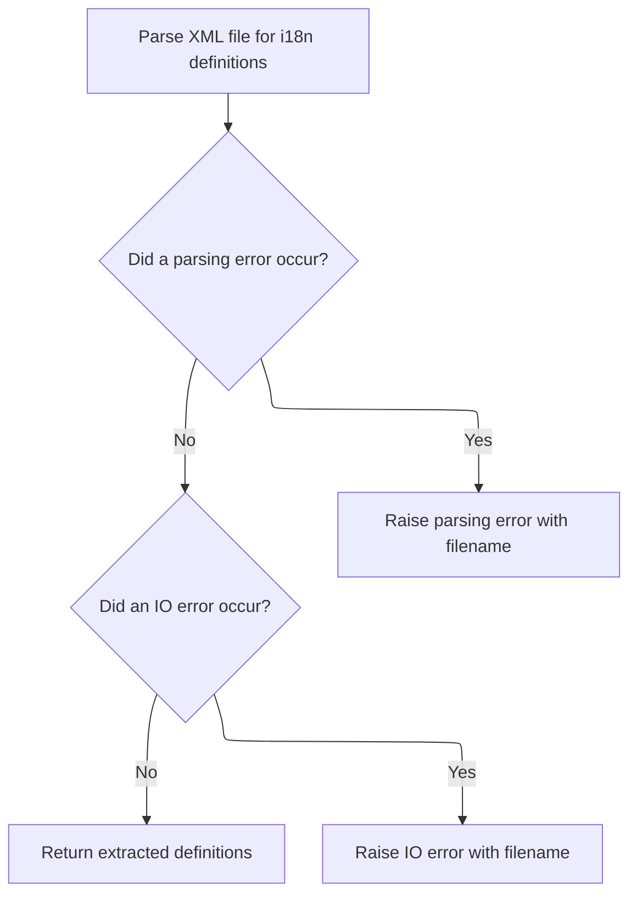

<SwmSnippet path="/tiles/src/main/java/org/apache/struts/tiles/xmlDefinition/I18nFactorySet.java" line="516">

---

Back in <SwmToken path="tiles/src/main/java/org/apache/struts/tiles/xmlDefinition/I18nFactorySet.java" pos="449:5:5" line-data="            xmlDefinitions = parseXmlFile(servletContext, filename, xmlDefinitions);">`parseXmlFile`</SwmToken>, after parsing, we handle any SAX or IO exceptions by logging and throwing a <SwmToken path="tiles/src/main/java/org/apache/struts/tiles/xmlDefinition/I18nFactorySet.java" pos="521:5:5" line-data="            throw new DefinitionsFactoryException(">`DefinitionsFactoryException`</SwmToken>. If parsing succeeds, we return the updated definitions set.

```java
        } catch (SAXException ex) {
            if (log.isDebugEnabled()) {
                log.debug("Error while parsing file '" + filename + "'.");
                ex.printStackTrace();
            }
            throw new DefinitionsFactoryException(
                "Error while parsing file '" + filename + "'. " + ex.getMessage(),
                ex);

        } catch (IOException ex) {
            throw new DefinitionsFactoryException(
                "IO Error while parsing file '" + filename + "'. " + ex.getMessage(),
                ex);
        }

        return xmlDefinitions;
    }
```

---

</SwmSnippet>

## Merging and Inheritance Extension

<SwmSnippet path="/tiles/src/main/java/org/apache/struts/tiles/xmlDefinition/I18nFactorySet.java" line="372">

---

Back in <SwmToken path="tiles/src/main/java/org/apache/struts/tiles/xmlDefinition/I18nFactorySet.java" pos="321:5:5" line-data="    protected DefinitionsFactory createFactory(">`createFactory`</SwmToken>, after loading all the XML files, we call <SwmToken path="tiles/src/main/java/org/apache/struts/tiles/xmlDefinition/I18nFactorySet.java" pos="372:3:3" line-data="        rootXmlConfig.extend(lastXmlFile);">`extend`</SwmToken> on the root config with the last found locale-specific config. This merges the definitions, so everything is in one place before resolving inheritance.

```java
        rootXmlConfig.extend(lastXmlFile);
```

---

</SwmSnippet>

## Definition Set Merging

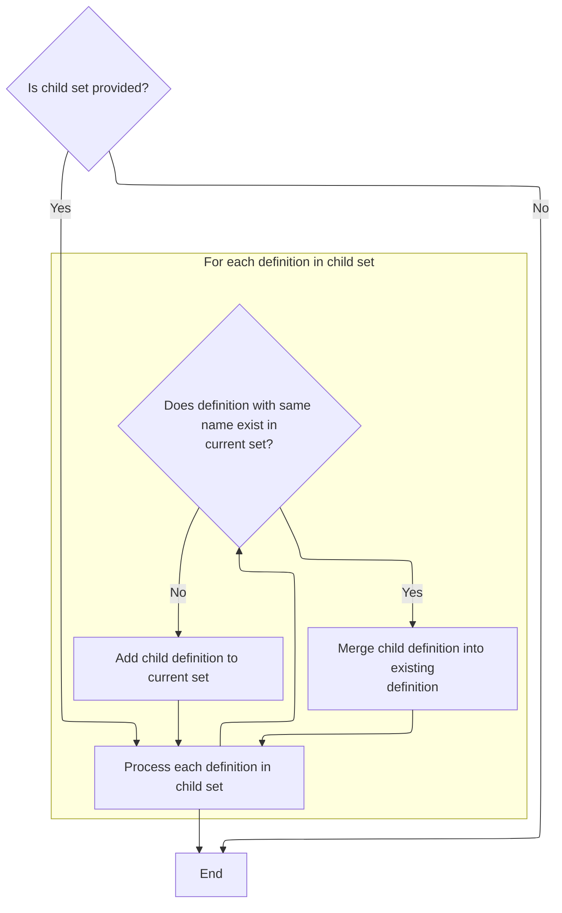

<SwmSnippet path="/tiles/src/main/java/org/apache/struts/tiles/xmlDefinition/XmlDefinitionsSet.java" line="92">

---

<SwmToken path="tiles/src/main/java/org/apache/struts/tiles/xmlDefinition/XmlDefinitionsSet.java" pos="92:5:5" line-data="  public void extend( XmlDefinitionsSet child )">`extend`</SwmToken> merges all definitions from the child set into the current set. If a definition already exists, it calls <SwmToken path="tiles/src/main/java/org/apache/struts/tiles/xmlDefinition/XmlDefinitionsSet.java" pos="103:3:3" line-data="        parentInstance.overload( childInstance );">`overload`</SwmToken> to update it with the child's values. Otherwise, it just adds the new definition.

```java
  public void extend( XmlDefinitionsSet child )
    {
    if(child==null)
      return;
    Iterator i = child.getDefinitions().values().iterator();
    while( i.hasNext() )
      {
      XmlDefinition childInstance = (XmlDefinition)i.next();
      XmlDefinition parentInstance = getDefinition(childInstance.getName() );
      if( parentInstance != null )
        {
        parentInstance.overload( childInstance );
        }
       else
        putDefinition( childInstance );
      } // end loop
    }
```

---

</SwmSnippet>

## Definition Attribute Overriding

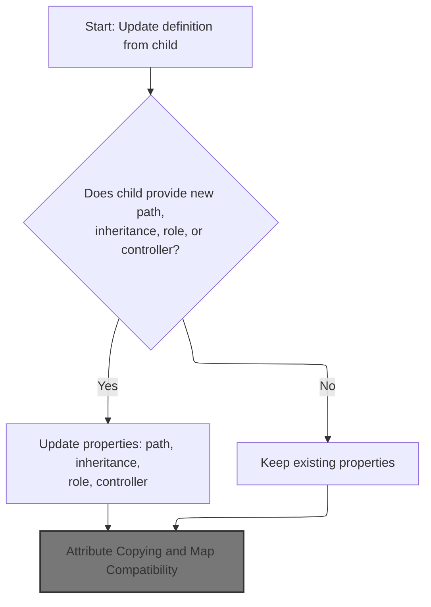

<SwmSnippet path="/tiles/src/main/java/org/apache/struts/tiles/xmlDefinition/XmlDefinition.java" line="172">

---

In <SwmToken path="tiles/src/main/java/org/apache/struts/tiles/xmlDefinition/XmlDefinition.java" pos="172:5:5" line-data="  public void overload( XmlDefinition child )">`overload`</SwmToken>, we update the parent definition with any non-null fields from the child, like path, role, and controller. This ensures the parent reflects any overrides from the child. Next, we need to handle controller instantiation, so we call `InsertTag.getController`.

```java
  public void overload( XmlDefinition child )
    {
    if( child.getPath() != null )
      {
      path = child.getPath();
      }
    if( child.getExtends() != null )
      {
      inherit = child.getExtends();
      }
    if( child.getRole() != null )
      {
      role = child.getRole();
      }
    if( child.getController()!=null )
      {
      controller = child.getController();
      controllerType =  child.getControllerType();
      }
```

---

</SwmSnippet>

### Controller Instantiation Logic

<SwmSnippet path="/tiles/src/main/java/org/apache/struts/tiles/taglib/InsertTag.java" line="400">

---

<SwmToken path="tiles/src/main/java/org/apache/struts/tiles/taglib/InsertTag.java" pos="400:5:5" line-data="    private Controller getController() throws JspException {">`getController`</SwmToken> checks if a <SwmToken path="tiles/src/main/java/org/apache/struts/tiles/taglib/InsertTag.java" pos="401:4:4" line-data="        if (controllerType == null) {">`controllerType`</SwmToken> is set and then calls <SwmToken path="tiles/src/main/java/org/apache/struts/tiles/taglib/InsertTag.java" pos="406:3:5" line-data="            return ComponentDefinition.createController(">`ComponentDefinition.createController`</SwmToken> to actually create the controller instance. This abstracts the instantiation logic and handles different controller types.

```java
    private Controller getController() throws JspException {
        if (controllerType == null) {
            return null;
        }

        try {
            return ComponentDefinition.createController(
                controllerName,
                controllerType);

        } catch (InstantiationException ex) {
            throw new JspException(ex);
        }
    }
```

---

</SwmSnippet>

### Controller Creation and Fallbacks

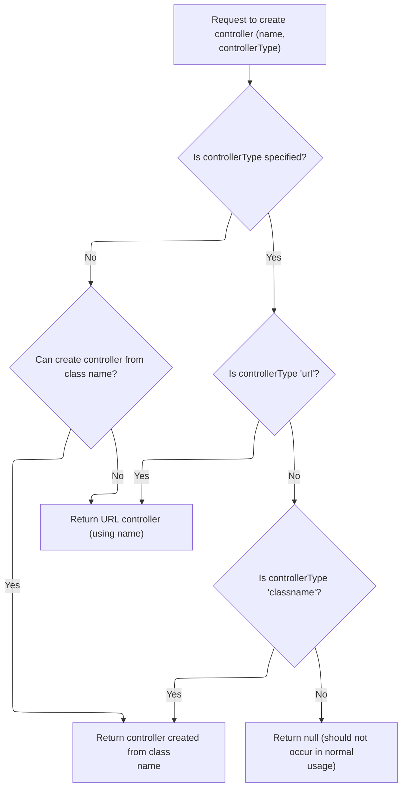

<SwmSnippet path="/tiles/src/main/java/org/apache/struts/tiles/ComponentDefinition.java" line="481">

---

<SwmToken path="tiles/src/main/java/org/apache/struts/tiles/ComponentDefinition.java" pos="481:7:7" line-data="    public static Controller createController(String name, String controllerType)">`createController`</SwmToken> checks the <SwmToken path="tiles/src/main/java/org/apache/struts/tiles/ComponentDefinition.java" pos="481:16:16" line-data="    public static Controller createController(String name, String controllerType)">`controllerType`</SwmToken> and either instantiates a controller by classname, creates a <SwmToken path="tiles/src/main/java/org/apache/struts/tiles/ComponentDefinition.java" pos="495:7:7" line-data="                controller = new UrlController(name);">`UrlController`</SwmToken>, or falls back if the type is unknown. If <SwmToken path="tiles/src/main/java/org/apache/struts/tiles/ComponentDefinition.java" pos="481:16:16" line-data="    public static Controller createController(String name, String controllerType)">`controllerType`</SwmToken> is null, it tries classname first, then falls back to <SwmToken path="tiles/src/main/java/org/apache/struts/tiles/ComponentDefinition.java" pos="495:7:7" line-data="                controller = new UrlController(name);">`UrlController`</SwmToken> if that fails.

```java
    public static Controller createController(String name, String controllerType)
        throws InstantiationException {

        if (log.isDebugEnabled()) {
            log.debug("Create controller name=" + name + ", type=" + controllerType);
        }

        Controller controller = null;

        if (controllerType == null) { // first try as a classname
            try {
                return createControllerFromClassname(name);

            } catch (InstantiationException ex) { // ok, try something else
                controller = new UrlController(name);
            }

        } else if ("url".equalsIgnoreCase(controllerType)) {
            controller = new UrlController(name);

        } else if ("classname".equalsIgnoreCase(controllerType)) {
            controller = createControllerFromClassname(name);
        }

        return controller;
    }
```

---

</SwmSnippet>

### Class-Based Controller Instantiation

See <SwmLink doc-title="Creating Controllers and Dynamic Form Beans">[Creating Controllers and Dynamic Form Beans](/.swm/creating-controllers-and-dynamic-form-beans.6s9vsfer.sw.md)</SwmLink>

### Attribute Copying and Map Compatibility

<SwmSnippet path="/tiles/src/main/java/org/apache/struts/tiles/xmlDefinition/XmlDefinition.java" line="191">

---

Back in <SwmToken path="tiles/src/main/java/org/apache/struts/tiles/xmlDefinition/XmlDefinitionsSet.java" pos="81:1:1" line-data="      XmlDefinition definition = (XmlDefinition)i.next();">`XmlDefinition`</SwmToken>, after handling controller logic, we call <SwmToken path="tiles/src/main/java/org/apache/struts/tiles/xmlDefinition/XmlDefinition.java" pos="192:3:3" line-data="    attributes.putAll( child.getAttributes());">`putAll`</SwmToken> to copy all child attributes into the parent. If the attributes map doesn't support this, it throws an exception, which means not all map implementations are compatible here.

```java
      // put all child attributes in parent.
    attributes.putAll( child.getAttributes());
    }
```

---

</SwmSnippet>

<SwmSnippet path="/faces/src/main/java/org/apache/struts/faces/util/MessagesMap.java" line="236">

---

<SwmToken path="faces/src/main/java/org/apache/struts/faces/util/MessagesMap.java" pos="236:5:5" line-data="    public void putAll(Map map) {">`putAll`</SwmToken> just throws <SwmToken path="faces/src/main/java/org/apache/struts/faces/util/MessagesMap.java" pos="238:5:5" line-data="        throw new UnsupportedOperationException();">`UnsupportedOperationException`</SwmToken>. This means the map can't be modified, and any attempt to copy entries into it will fail. It's a read-only or unsupported operation by design.

```java
    public void putAll(Map map) {

        throw new UnsupportedOperationException();

    }
```

---

</SwmSnippet>

## Inheritance Resolution and Factory Creation

<SwmSnippet path="/tiles/src/main/java/org/apache/struts/tiles/xmlDefinition/I18nFactorySet.java" line="373">

---

Back in <SwmToken path="tiles/src/main/java/org/apache/struts/tiles/xmlDefinition/I18nFactorySet.java" pos="321:5:5" line-data="    protected DefinitionsFactory createFactory(">`createFactory`</SwmToken>, after merging all the configs, we call <SwmToken path="tiles/src/main/java/org/apache/struts/tiles/xmlDefinition/I18nFactorySet.java" pos="373:3:3" line-data="        rootXmlConfig.resolveInheritances();">`resolveInheritances`</SwmToken> on the root config. This walks through all definitions and resolves any parent-child relationships, so the final config is ready for use.

```java
        rootXmlConfig.resolveInheritances();

```

---

</SwmSnippet>

## Inheritance Chain Resolution

<SwmSnippet path="/tiles/src/main/java/org/apache/struts/tiles/xmlDefinition/XmlDefinitionsSet.java" line="75">

---

<SwmToken path="tiles/src/main/java/org/apache/struts/tiles/xmlDefinition/XmlDefinitionsSet.java" pos="75:5:5" line-data="  public void resolveInheritances() throws NoSuchDefinitionException">`resolveInheritances`</SwmToken> loops through all definitions and calls <SwmToken path="tiles/src/main/java/org/apache/struts/tiles/xmlDefinition/XmlDefinitionsSet.java" pos="82:3:3" line-data="      definition.resolveInheritance( this );">`resolveInheritance`</SwmToken> on each one. This makes sure every definition gets its inherited attributes from its parent, if any.

```java
  public void resolveInheritances() throws NoSuchDefinitionException
    {
      // Walk through all definitions and resolve individual inheritance
    Iterator i = definitions.values().iterator();
    while( i.hasNext() )
      {
      XmlDefinition definition = (XmlDefinition)i.next();
      definition.resolveInheritance( this );
      }  // end loop
    }
```

---

</SwmSnippet>

## Parent Attribute Inheritance

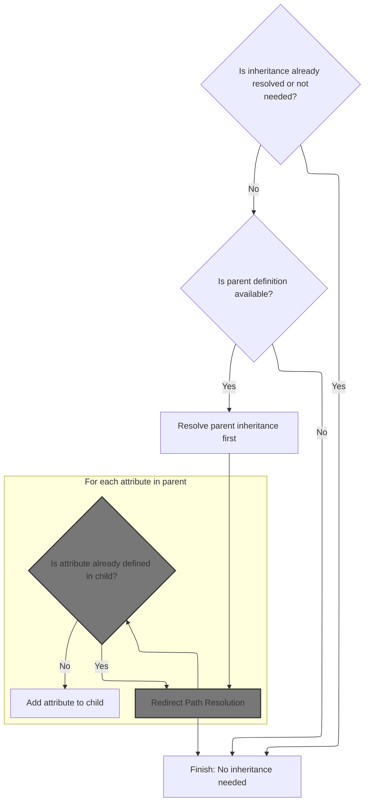

<SwmSnippet path="/tiles/src/main/java/org/apache/struts/tiles/xmlDefinition/XmlDefinition.java" line="115">

---

In <SwmToken path="tiles/src/main/java/org/apache/struts/tiles/xmlDefinition/XmlDefinition.java" pos="115:5:5" line-data="  public void resolveInheritance( XmlDefinitionsSet definitionsSet )">`resolveInheritance`</SwmToken>, after making sure the parent is resolved, we loop over the parent's attribute keys to copy any missing attributes into the child. This means we need to call <SwmToken path="tiles/src/main/java/org/apache/struts/tiles/xmlDefinition/XmlDefinition.java" pos="145:13:13" line-data="    Iterator parentAttributes = parent.getAttributes().keySet().iterator();">`keySet`</SwmToken> on the parent's attributes map, which could throw if not supported.

```java
  public void resolveInheritance( XmlDefinitionsSet definitionsSet )
    throws NoSuchDefinitionException
    {
      // Already done, or not needed ?
    if( isVisited || !isExtending() )
      return;

    if(log.isDebugEnabled())
      log.debug( "Resolve definition for child name='" + getName()
              + "' extends='" + getExtends() + "'.");

      // Set as visited to avoid endless recurisvity.
    setIsVisited( true );

      // Resolve parent before itself.
    XmlDefinition parent = definitionsSet.getDefinition( getExtends() );
    if( parent == null )
      { // error
      String msg = "Error while resolving definition inheritance: child '"
                           + getName() +    "' can't find its ancestor '"
                           + getExtends() +
                           "'. Please check your description file.";
      log.error( msg );
        // to do : find better exception
      throw new NoSuchDefinitionException( msg );
      }

    parent.resolveInheritance( definitionsSet );

      // Iterate on each parent's attribute and add it if not defined in child.
    Iterator parentAttributes = parent.getAttributes().keySet().iterator();
```

---

</SwmSnippet>

<SwmSnippet path="/faces/src/main/java/org/apache/struts/faces/util/MessagesMap.java" line="211">

---

<SwmToken path="faces/src/main/java/org/apache/struts/faces/util/MessagesMap.java" pos="211:5:5" line-data="    public Set keySet() {">`keySet`</SwmToken> just throws <SwmToken path="faces/src/main/java/org/apache/struts/faces/util/MessagesMap.java" pos="213:5:5" line-data="        throw new UnsupportedOperationException();">`UnsupportedOperationException`</SwmToken>. So if code tries to iterate over the keys, it'll fail. This map isn't meant to be used like a normal map.

```java
    public Set keySet() {

        throw new UnsupportedOperationException();

    }
```

---

</SwmSnippet>

<SwmSnippet path="/tiles/src/main/java/org/apache/struts/tiles/xmlDefinition/XmlDefinition.java" line="146">

---

Back in <SwmToken path="tiles/src/main/java/org/apache/struts/tiles/xmlDefinition/XmlDefinitionsSet.java" pos="81:1:1" line-data="      XmlDefinition definition = (XmlDefinition)i.next();">`XmlDefinition`</SwmToken>, after getting the parent's attribute keys, we check if each key is already present in the child before copying it. If the map doesn't support <SwmToken path="tiles/src/main/java/org/apache/struts/tiles/xmlDefinition/XmlDefinition.java" pos="149:9:9" line-data="      if( !getAttributes().containsKey(name) )">`containsKey`</SwmToken>, this will throw, so not all map types are compatible here.

```java
    while( parentAttributes.hasNext() )
      {
      String name = (String)parentAttributes.next();
      if( !getAttributes().containsKey(name) )
        putAttribute( name, parent.getAttribute(name) );
      }
```

---

</SwmSnippet>

### Attribute Presence Check

<SwmSnippet path="/faces/src/main/java/org/apache/struts/faces/util/MessagesMap.java" line="107">

---

<SwmToken path="faces/src/main/java/org/apache/struts/faces/util/MessagesMap.java" pos="107:5:5" line-data="    public boolean containsKey(Object key) {">`containsKey`</SwmToken> checks if the key is present by calling <SwmToken path="faces/src/main/java/org/apache/struts/faces/util/MessagesMap.java" pos="112:4:6" line-data="            return (messages.isPresent(locale, key.toString()));">`messages.isPresent`</SwmToken> with the current locale and key. If the key is null, it just returns false.

```java
    public boolean containsKey(Object key) {

        if (key == null) {
            return (false);
        } else {
            return (messages.isPresent(locale, key.toString()));
        }

    }
```

---

</SwmSnippet>

<SwmSnippet path="/core/src/main/java/org/apache/struts/util/MessageResources.java" line="397">

---

<SwmToken path="core/src/main/java/org/apache/struts/util/MessageResources.java" pos="397:5:5" line-data="    public boolean isPresent(Locale locale, String key) {">`isPresent`</SwmToken> checks if a message exists for a locale and key by calling <SwmToken path="core/src/main/java/org/apache/struts/util/MessageResources.java" pos="398:7:7" line-data="        String message = getMessage(locale, key);">`getMessage`</SwmToken>. If the result is null or wrapped in '???', it treats the message as missing. This '???' marker is a local convention, not standard, and directly affects how presence is determined.

```java
    public boolean isPresent(Locale locale, String key) {
        String message = getMessage(locale, key);

        if (message == null) {
            return false;
        } else if (message.startsWith("???") && message.endsWith("???")) {
            return false; // FIXME - Only valid for default implementation
        } else {
            return true;
        }
    }
```

---

</SwmSnippet>

### Parent Path and Role Assignment

<SwmSnippet path="/tiles/src/main/java/org/apache/struts/tiles/xmlDefinition/XmlDefinition.java" line="152">

---

After checking attribute presence in <SwmToken path="faces/src/main/java/org/apache/struts/faces/util/MessagesMap.java" pos="41:4:4" line-data="public class MessagesMap implements Map {">`MessagesMap`</SwmToken>, `XmlDefinition.resolveInheritance` assigns path and role from the parent if they're not set in the child. This ensures the child inherits routing and access control info. Next, we need to call ActionRedirect.getPath to resolve any redirects or original paths for the definition.

```java
      // Set path and role if not setted
    if( path == null )
      setPath( parent.getPath() );
```

---

</SwmSnippet>

### Redirect Path Resolution

See <SwmLink doc-title="Redirect URL Construction">[Redirect URL Construction](/.swm/redirect-url-construction.dg7qb612.sw.md)</SwmLink>

### Parent Controller and Role Inheritance

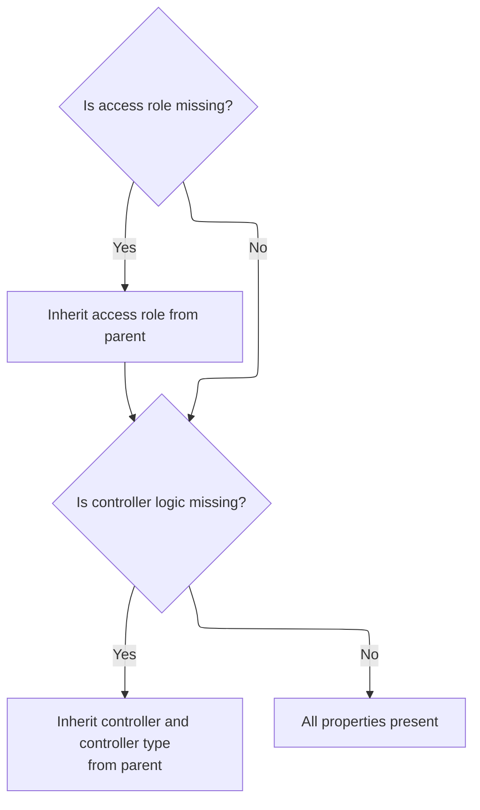

<SwmSnippet path="/tiles/src/main/java/org/apache/struts/tiles/xmlDefinition/XmlDefinition.java" line="155">

---

Back from ActionRedirect, `XmlDefinition.resolveInheritance` copies controller and <SwmToken path="tiles/src/main/java/org/apache/struts/tiles/xmlDefinition/XmlDefinition.java" pos="189:1:1" line-data="      controllerType =  child.getControllerType();">`controllerType`</SwmToken> from the parent if they're missing in the child. Role is also inherited if not set. This ensures the child definition has all necessary action handling and access control info.

```java
    if( role == null )
      setRole( parent.getRole() );
    if( controller==null )
      {
      setController( parent.getController());
      setControllerType( parent.getControllerType());
      }
    }
```

---

</SwmSnippet>

## Factory Instantiation and Caching

<SwmSnippet path="/tiles/src/main/java/org/apache/struts/tiles/xmlDefinition/I18nFactorySet.java" line="375">

---

After resolving inheritances in <SwmToken path="tiles/src/main/java/org/apache/struts/tiles/xmlDefinition/I18nFactorySet.java" pos="337:1:1" line-data="        XmlDefinitionsSet lastXmlFile = null;">`XmlDefinitionsSet`</SwmToken>, `I18nFactorySet.createFactory` creates a new <SwmToken path="tiles/src/main/java/org/apache/struts/tiles/xmlDefinition/I18nFactorySet.java" pos="375:7:7" line-data="        factory = new DefinitionsFactory(rootXmlConfig);">`DefinitionsFactory`</SwmToken> with the merged config, caches it for the locale suffix, and returns it. The factory selection algorithm supports layered fallback and locale-specific loading by iterating suffixes, merging configs, and resolving inheritance before instantiation.

```java
        factory = new DefinitionsFactory(rootXmlConfig);
        loaded.put(lastPostfix, factory);

        if (log.isDebugEnabled()) {
            log.debug("factory loaded : " + factory);
        }

        // return last available found !
        return factory;
    }
```

---

</SwmSnippet>

&nbsp;

*This is an auto-generated document by Swimm 🌊 and has not yet been verified by a human*

<SwmMeta version="3.0.0" repo-id="Z2l0aHViJTNBJTNBc3RydXRzMSUzQSUzQVN3aW1tLURlbW8=" repo-name="struts1"><sup>Powered by [Swimm](https://app.swimm.io/)</sup></SwmMeta>
