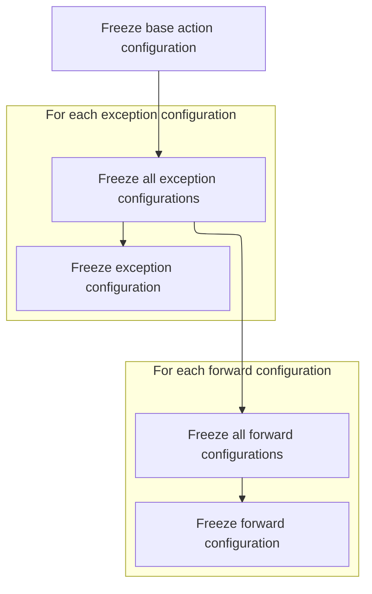

This document outlines how module configuration is locked to ensure application stability. After setup, all configuration elements are finalized so that no further changes can be made, guaranteeing consistency and protection from modification during runtime.

# Locking Down Module Configuration

<SwmSnippet path="/core/src/main/java/org/apache/struts/config/impl/ModuleConfigImpl.java" line="612">

---

In <SwmToken path="core/src/main/java/org/apache/struts/config/impl/ModuleConfigImpl.java" pos="612:5:5" line-data="    public void freeze() {">`freeze`</SwmToken>, we start by locking the parent config, then collect all action configs and freeze each one to make sure no further changes can be made to them.

```java
    public void freeze() {
        super.freeze();

        ActionConfig[] aconfigs = findActionConfigs();

        for (int i = 0; i < aconfigs.length; i++) {
            aconfigs[i].freeze();
        }
```

---

</SwmSnippet>

<SwmSnippet path="/core/src/main/java/org/apache/struts/config/impl/ModuleConfigImpl.java" line="621">

---

Next, after all action configs are frozen, we set up the matcher and lock the controller config, relying on the fact that action configs can't change anymore.

```java
        matcher = new ActionConfigMatcher(aconfigs);

        getControllerConfig().freeze();

```

---

</SwmSnippet>

## Finalizing Action Configuration



<SwmSnippet path="/core/src/main/java/org/apache/struts/config/ActionConfig.java" line="1158">

---

In <SwmToken path="core/src/main/java/org/apache/struts/config/ActionConfig.java" pos="1158:5:5" line-data="    public void freeze() {">`freeze`</SwmToken>, we lock the action config's parent, then move on to freezing exception configs before returning to the module-level freeze to continue the process.

```java
    public void freeze() {
        super.freeze();

```

---

</SwmSnippet>

<SwmSnippet path="/core/src/main/java/org/apache/struts/config/ActionConfig.java" line="1161">

---

Back in `ActionConfig.freeze`, after returning from the module freeze, we lock down all exception configs tied to this action to prevent further changes.

```java
        ExceptionConfig[] econfigs = findExceptionConfigs();

        for (int i = 0; i < econfigs.length; i++) {
            econfigs[i].freeze();
        }
```

---

</SwmSnippet>

<SwmSnippet path="/core/src/main/java/org/apache/struts/config/ActionConfig.java" line="1167">

---

Finally, we freeze all forward configs for the action, making sure navigation rules are set and can't be changed.

```java
        ForwardConfig[] fconfigs = findForwardConfigs();

        for (int i = 0; i < fconfigs.length; i++) {
            fconfigs[i].freeze();
        }
```

---

</SwmSnippet>

## Locking Remaining Module Elements

```mermaid
%%{init: {"flowchart": {"defaultRenderer": "elk"}} }%%
flowchart TD
    node1["Begin locking module configuration"]
    click node1 openCode "core/src/main/java/org/apache/struts/config/impl/ModuleConfigImpl.java:625:653"
    node1 --> loop1
    subgraph loop1["For each exception config (if any)"]
      node2["Lock exception config"]
      click node2 openCode "core/src/main/java/org/apache/struts/config/impl/ModuleConfigImpl.java:627:629"
    end
    loop1 --> loop2
    subgraph loop2["For each form bean config (if any)"]
      node3["Lock form bean config"]
      click node3 openCode "core/src/main/java/org/apache/struts/config/impl/ModuleConfigImpl.java:633:635"
    end
    loop2 --> loop3
    subgraph loop3["For each forward config (if any)"]
      node4["Lock forward config"]
      click node4 openCode "core/src/main/java/org/apache/struts/config/impl/ModuleConfigImpl.java:639:641"
    end
    loop3 --> loop4
    subgraph loop4["For each message resources config (if
any)"]
      node5["Lock message resources config"]
      click node5 openCode "core/src/main/java/org/apache/struts/config/impl/ModuleConfigImpl.java:645:647"
    end
    loop4 --> loop5
    subgraph loop5["For each plugin config (if any)"]
      node6["Lock plugin config"]
      click node6 openCode "core/src/main/java/org/apache/struts/config/impl/ModuleConfigImpl.java:651:653"
    end
    loop5 --> node7["Module configuration is locked and
cannot be changed"]
    click node7 openCode "core/src/main/java/org/apache/struts/config/impl/ModuleConfigImpl.java:625:653"

classDef HeadingStyle fill:#777777,stroke:#333,stroke-width:2px;

%% Swimm:
%% %%{init: {"flowchart": {"defaultRenderer": "elk"}} }%%
%% flowchart TD
%%     node1["Begin locking module configuration"]
%%     click node1 openCode "<SwmPath>[core/…/impl/ModuleConfigImpl.java](core/src/main/java/org/apache/struts/config/impl/ModuleConfigImpl.java)</SwmPath>:625:653"
%%     node1 --> loop1
%%     subgraph loop1["For each exception config (if any)"]
%%       node2["Lock exception config"]
%%       click node2 openCode "<SwmPath>[core/…/impl/ModuleConfigImpl.java](core/src/main/java/org/apache/struts/config/impl/ModuleConfigImpl.java)</SwmPath>:627:629"
%%     end
%%     loop1 --> loop2
%%     subgraph loop2["For each form bean config (if any)"]
%%       node3["Lock form bean config"]
%%       click node3 openCode "<SwmPath>[core/…/impl/ModuleConfigImpl.java](core/src/main/java/org/apache/struts/config/impl/ModuleConfigImpl.java)</SwmPath>:633:635"
%%     end
%%     loop2 --> loop3
%%     subgraph loop3["For each forward config (if any)"]
%%       node4["Lock forward config"]
%%       click node4 openCode "<SwmPath>[core/…/impl/ModuleConfigImpl.java](core/src/main/java/org/apache/struts/config/impl/ModuleConfigImpl.java)</SwmPath>:639:641"
%%     end
%%     loop3 --> loop4
%%     subgraph loop4["For each message resources config (if
%% any)"]
%%       node5["Lock message resources config"]
%%       click node5 openCode "<SwmPath>[core/…/impl/ModuleConfigImpl.java](core/src/main/java/org/apache/struts/config/impl/ModuleConfigImpl.java)</SwmPath>:645:647"
%%     end
%%     loop4 --> loop5
%%     subgraph loop5["For each plugin config (if any)"]
%%       node6["Lock plugin config"]
%%       click node6 openCode "<SwmPath>[core/…/impl/ModuleConfigImpl.java](core/src/main/java/org/apache/struts/config/impl/ModuleConfigImpl.java)</SwmPath>:651:653"
%%     end
%%     loop5 --> node7["Module configuration is locked and
%% cannot be changed"]
%%     click node7 openCode "<SwmPath>[core/…/impl/ModuleConfigImpl.java](core/src/main/java/org/apache/struts/config/impl/ModuleConfigImpl.java)</SwmPath>:625:653"
%% 
%% classDef HeadingStyle fill:#777777,stroke:#333,stroke-width:2px;
```



<SwmSnippet path="/core/src/main/java/org/apache/struts/config/impl/ModuleConfigImpl.java" line="625">

---

Back in `ModuleConfigImpl.freeze`, after all actions are locked, we freeze module-level exception configs to ensure global error handling is fixed.

```java
        ExceptionConfig[] econfigs = findExceptionConfigs();

        for (int i = 0; i < econfigs.length; i++) {
            econfigs[i].freeze();
        }
```

---

</SwmSnippet>

<SwmSnippet path="/core/src/main/java/org/apache/struts/config/impl/ModuleConfigImpl.java" line="631">

---

Next, we freeze all form bean configs, locking down form definitions right after exception handling is finalized.

```java
        FormBeanConfig[] fbconfigs = findFormBeanConfigs();

        for (int i = 0; i < fbconfigs.length; i++) {
            fbconfigs[i].freeze();
        }
```

---

</SwmSnippet>

<SwmSnippet path="/core/src/main/java/org/apache/struts/config/impl/ModuleConfigImpl.java" line="637">

---

Then, we freeze all forward configs at the module level, making sure navigation rules are locked after forms are finalized.

```java
        ForwardConfig[] fconfigs = findForwardConfigs();

        for (int i = 0; i < fconfigs.length; i++) {
            fconfigs[i].freeze();
        }
```

---

</SwmSnippet>

<SwmSnippet path="/core/src/main/java/org/apache/struts/config/impl/ModuleConfigImpl.java" line="643">

---

After that, we freeze all message resources configs, making sure any text or messages used by forms or forwards can't be changed.

```java
        MessageResourcesConfig[] mrconfigs = findMessageResourcesConfigs();

        for (int i = 0; i < mrconfigs.length; i++) {
            mrconfigs[i].freeze();
        }
```

---

</SwmSnippet>

<SwmSnippet path="/core/src/main/java/org/apache/struts/config/impl/ModuleConfigImpl.java" line="649">

---

Finally, we freeze all plugin configs, making sure any extensions see the fully locked module state before they're used.

```java
        PlugInConfig[] piconfigs = findPlugInConfigs();

        for (int i = 0; i < piconfigs.length; i++) {
            piconfigs[i].freeze();
        }
```

---

</SwmSnippet>

&nbsp;

*This is an auto-generated document by Swimm 🌊 and has not yet been verified by a human*

<SwmMeta version="3.0.0" repo-id="Z2l0aHViJTNBJTNBc3RydXRzMSUzQSUzQVN3aW1tLURlbW8=" repo-name="struts1"><sup>Powered by [Swimm](https://app.swimm.io/)</sup></SwmMeta>
