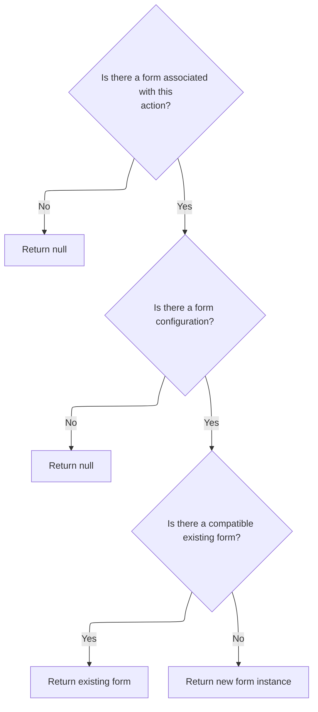

This document describes how the system manages form beans as part of processing a web request. The flow ensures that the correct form bean is available for each action, supporting user input handling and data persistence across requests.

# Form Bean Attribute Resolution in Faces Request

```mermaid
%%{init: {"flowchart": {"defaultRenderer": "elk"}} }%%
flowchart TD
    node1["Start action form processing"] --> node2{"Form bean attribute present?"}
    click node1 openCode "faces/src/main/java/org/apache/struts/faces/application/FacesRequestProcessor.java:194:197"
    node2 -->|"No"| node5["Delegate to standard action form
processing"]
    click node2 openCode "faces/src/main/java/org/apache/struts/faces/application/FacesRequestProcessor.java:199:216"
    node2 -->|"Yes"| node3{"FormBeanConfig exists for name?"}
    click node3 openCode "faces/src/main/java/org/apache/struts/faces/application/FacesRequestProcessor.java:201:213"
    node3 -->|"No"| node5
    node3 -->|"Yes"| node4{"Scope: request or session?"}
    click node4 openCode "faces/src/main/java/org/apache/struts/faces/application/FacesRequestProcessor.java:204:210"
    node4 -->|"Request"| node5
    node4 -->|"Session"| node5
    node5["Delegate to standard action form
processing"] --> node6["Return result"]
    click node5 openCode "faces/src/main/java/org/apache/struts/faces/application/FacesRequestProcessor.java:218:224"
    click node6 openCode "faces/src/main/java/org/apache/struts/faces/application/FacesRequestProcessor.java:224:224"
classDef HeadingStyle fill:#777777,stroke:#333,stroke-width:2px;

%% Swimm:
%% %%{init: {"flowchart": {"defaultRenderer": "elk"}} }%%
%% flowchart TD
%%     node1["Start action form processing"] --> node2{"Form bean attribute present?"}
%%     click node1 openCode "<SwmPath>[faces/…/application/FacesRequestProcessor.java](faces/src/main/java/org/apache/struts/faces/application/FacesRequestProcessor.java)</SwmPath>:194:197"
%%     node2 -->|"No"| node5["Delegate to standard action form
%% processing"]
%%     click node2 openCode "<SwmPath>[faces/…/application/FacesRequestProcessor.java](faces/src/main/java/org/apache/struts/faces/application/FacesRequestProcessor.java)</SwmPath>:199:216"
%%     node2 -->|"Yes"| node3{"<SwmToken path="faces/src/main/java/org/apache/struts/faces/application/FacesRequestProcessor.java" pos="202:1:1" line-data="                FormBeanConfig fbc = moduleConfig.findFormBeanConfig(name);">`FormBeanConfig`</SwmToken> exists for name?"}
%%     click node3 openCode "<SwmPath>[faces/…/application/FacesRequestProcessor.java](faces/src/main/java/org/apache/struts/faces/application/FacesRequestProcessor.java)</SwmPath>:201:213"
%%     node3 -->|"No"| node5
%%     node3 -->|"Yes"| node4{"Scope: request or session?"}
%%     click node4 openCode "<SwmPath>[faces/…/application/FacesRequestProcessor.java](faces/src/main/java/org/apache/struts/faces/application/FacesRequestProcessor.java)</SwmPath>:204:210"
%%     node4 -->|"Request"| node5
%%     node4 -->|"Session"| node5
%%     node5["Delegate to standard action form
%% processing"] --> node6["Return result"]
%%     click node5 openCode "<SwmPath>[faces/…/application/FacesRequestProcessor.java](faces/src/main/java/org/apache/struts/faces/application/FacesRequestProcessor.java)</SwmPath>:218:224"
%%     click node6 openCode "<SwmPath>[faces/…/application/FacesRequestProcessor.java](faces/src/main/java/org/apache/struts/faces/application/FacesRequestProcessor.java)</SwmPath>:224:224"
%% classDef HeadingStyle fill:#777777,stroke:#333,stroke-width:2px;
```



<SwmSnippet path="/faces/src/main/java/org/apache/struts/faces/application/FacesRequestProcessor.java" line="194">

---

In <SwmToken path="faces/src/main/java/org/apache/struts/faces/application/FacesRequestProcessor.java" pos="194:5:5" line-data="    protected ActionForm processActionForm(HttpServletRequest request,">`processActionForm`</SwmToken>, we're figuring out which attribute key to use for the form bean by checking the mapping. We grab the attribute (or fall back to the name), then look up the <SwmToken path="faces/src/main/java/org/apache/struts/faces/application/FacesRequestProcessor.java" pos="202:1:1" line-data="                FormBeanConfig fbc = moduleConfig.findFormBeanConfig(name);">`FormBeanConfig`</SwmToken> to see if there's a form bean defined. The scope check tells us if the bean should be in the request or session. We need to call <SwmToken path="core/src/main/java/org/apache/struts/config/ActionConfig.java" pos="41:4:4" line-data="public class ActionConfig extends BaseConfig {">`ActionConfig`</SwmToken> to get the right attribute key, since that's not always set directly in the mapping.

```java
    protected ActionForm processActionForm(HttpServletRequest request,
                                           HttpServletResponse response,
                                           ActionMapping mapping) {
        if (log.isTraceEnabled()) {
            log.trace("Performing standard action form processing");
            String attribute = mapping.getAttribute();
```

---

</SwmSnippet>

<SwmSnippet path="/core/src/main/java/org/apache/struts/config/ActionConfig.java" line="321">

---

<SwmToken path="core/src/main/java/org/apache/struts/config/ActionConfig.java" pos="321:5:7" line-data="    public String getAttribute() {">`getAttribute()`</SwmToken> just returns the attribute if it's set, otherwise it falls back to the name. This lets the rest of the code always get a usable key for storing or retrieving the form bean, even if the config is incomplete.

```java
    public String getAttribute() {
        if (this.attribute == null) {
            return (this.name);
        } else {
            return (this.attribute);
        }
    }
```

---

</SwmSnippet>

<SwmSnippet path="/faces/src/main/java/org/apache/struts/faces/application/FacesRequestProcessor.java" line="200">

---

We just got the attribute key from <SwmToken path="core/src/main/java/org/apache/struts/config/ActionConfig.java" pos="41:4:4" line-data="public class ActionConfig extends BaseConfig {">`ActionConfig`</SwmToken>, logged the bean's presence and scope, and now FacesRequestProcessor.processActionForm hands off to the superclass (<SwmToken path="faces/src/main/java/org/apache/struts/faces/application/FacesRequestProcessor.java" pos="45:10:10" line-data="import org.apache.struts.action.RequestProcessor;">`RequestProcessor`</SwmToken>) to actually create or fetch the form bean. The next step is to call <SwmToken path="faces/src/main/java/org/apache/struts/faces/application/FacesRequestProcessor.java" pos="45:10:10" line-data="import org.apache.struts.action.RequestProcessor;">`RequestProcessor`</SwmToken>, since that's where the main form bean logic lives.

```java
            if (attribute != null) {
                String name = mapping.getName();
                FormBeanConfig fbc = moduleConfig.findFormBeanConfig(name);
                if (fbc != null) {
                    if ("request".equals(mapping.getScope())) {
                        log.trace("  Bean in request scope = " +
                                  request.getAttribute(attribute));
                    } else {
                        log.trace("  Bean in session scope = " +
                                  request.getSession().getAttribute(attribute));
                    }
                } else {
                    log.trace("  No FormBeanConfig for '" + name + "'");
                }
            } else {
                log.trace("  No form bean for this action");
            }
        }
        ActionForm result =
            super.processActionForm(request, response, mapping);
        if (log.isDebugEnabled()) {
            log.debug("Standard action form returned " +
                      result);
        }
        return (result);


    }
```

---

</SwmSnippet>

# Form Bean Creation and Storage

<SwmSnippet path="/core/src/main/java/org/apache/struts/action/RequestProcessor.java" line="316">

---

In <SwmToken path="core/src/main/java/org/apache/struts/action/RequestProcessor.java" pos="316:5:5" line-data="    protected ActionForm processActionForm(HttpServletRequest request,">`processActionForm`</SwmToken>, we delegate to <SwmToken path="core/src/main/java/org/apache/struts/action/RequestProcessor.java" pos="320:1:3" line-data="            RequestUtils.createActionForm(request, mapping, moduleConfig,">`RequestUtils.createActionForm`</SwmToken> to handle the details of finding or creating the form bean. This keeps the logic out of the processor and lets us handle all the bean instantiation rules in one place.

```java
    protected ActionForm processActionForm(HttpServletRequest request,
        HttpServletResponse response, ActionMapping mapping) {
        // Create (if necessary) a form bean to use
        ActionForm instance =
            RequestUtils.createActionForm(request, mapping, moduleConfig,
                servlet);

        if (instance == null) {
            return (null);
        }

        // Store the new instance in the appropriate scope
        if (log.isDebugEnabled()) {
            log.debug(" Storing ActionForm bean instance in scope '"
                + mapping.getScope() + "' under attribute key '"
                + mapping.getAttribute() + "'");
        }

```

---

</SwmSnippet>

## Form Bean Lookup and Reuse Decision



<SwmSnippet path="/core/src/main/java/org/apache/struts/util/RequestUtils.java" line="187">

---

In <SwmToken path="core/src/main/java/org/apache/struts/util/RequestUtils.java" pos="187:7:7" line-data="    public static ActionForm createActionForm(HttpServletRequest request,">`createActionForm`</SwmToken>, we first check if there's an attribute key to use for the form bean. If not, we bail out early. Next, we need to look up the <SwmToken path="faces/src/main/java/org/apache/struts/faces/application/FacesRequestProcessor.java" pos="202:1:1" line-data="                FormBeanConfig fbc = moduleConfig.findFormBeanConfig(name);">`FormBeanConfig`</SwmToken> using the mapping's name, so we call into <SwmToken path="core/src/main/java/org/apache/struts/config/ActionConfig.java" pos="41:4:4" line-data="public class ActionConfig extends BaseConfig {">`ActionConfig`</SwmToken> to get the details.

```java
    public static ActionForm createActionForm(HttpServletRequest request,
        ActionMapping mapping, ModuleConfig moduleConfig, ActionServlet servlet) {
        // Is there a form bean associated with this mapping?
        String attribute = mapping.getAttribute();

        if (attribute == null) {
            return (null);
        }

```

---

</SwmSnippet>

<SwmSnippet path="/core/src/main/java/org/apache/struts/util/RequestUtils.java" line="196">

---

We just got the <SwmToken path="core/src/main/java/org/apache/struts/util/RequestUtils.java" pos="198:1:1" line-data="        FormBeanConfig config = moduleConfig.findFormBeanConfig(name);">`FormBeanConfig`</SwmToken> from <SwmToken path="core/src/main/java/org/apache/struts/config/ActionConfig.java" pos="41:4:4" line-data="public class ActionConfig extends BaseConfig {">`ActionConfig`</SwmToken>, and now <SwmToken path="core/src/main/java/org/apache/struts/action/RequestProcessor.java" pos="320:1:3" line-data="            RequestUtils.createActionForm(request, mapping, moduleConfig,">`RequestUtils.createActionForm`</SwmToken> checks if there's already a form bean instance we can reuse. To do that, we call FormBeanConfig.canReuse, which handles all the compatibility checks for dynamic and regular forms.

```java
        // Look up the form bean configuration information to use
        String name = mapping.getName();
        FormBeanConfig config = moduleConfig.findFormBeanConfig(name);

        if (config == null) {
            log.warn("No FormBeanConfig found under '" + name + "'");

            return (null);
        }

        ActionForm instance =
            lookupActionForm(request, attribute, mapping.getScope());

        // Can we recycle the existing form bean instance (if there is one)?
        if ((instance != null) && config.canReuse(instance)) {
            return (instance);
        }

        return createActionForm(config, servlet);
    }
```

---

</SwmSnippet>

<SwmSnippet path="/core/src/main/java/org/apache/struts/config/FormBeanConfig.java" line="369">

---

<SwmToken path="core/src/main/java/org/apache/struts/config/FormBeanConfig.java" pos="369:5:5" line-data="    public boolean canReuse(ActionForm form) {">`canReuse`</SwmToken> checks if the given form bean matches the config. For dynamic forms, it compares the <SwmToken path="core/src/main/java/org/apache/struts/config/FormBeanConfig.java" pos="106:7:7" line-data="     * Is this DynaClass currently restricted (for DynaBeans with a">`DynaClass`</SwmToken> name. For <SwmToken path="core/src/main/java/org/apache/struts/config/FormBeanConfig.java" pos="385:8:8" line-data="                    if (form instanceof BeanValidatorForm) {">`BeanValidatorForm`</SwmToken>, it digs into the underlying instance and checks either the config form name or class compatibility. If everything matches, we can reuse the bean; otherwise, we need a new one.

```java
    public boolean canReuse(ActionForm form) {
        if (form != null) {
            if (this.getDynamic()) {
                String className = ((DynaBean) form).getDynaClass().getName();

                if (className.equals(this.getName())) {
                    log.debug("Can reuse existing instance (dynamic)");

                    return (true);
                }
            } else {
                try {
                    // check if the form's class is compatible with the class
                    //      we're configured for
                    Class formClass = form.getClass();

                    if (form instanceof BeanValidatorForm) {
                        BeanValidatorForm beanValidatorForm =
                            (BeanValidatorForm) form;

                        if (beanValidatorForm.getInstance() instanceof DynaBean) {
                            String formName = beanValidatorForm.getStrutsConfigFormName();
                            if (getName().equals(formName)) {
                                log.debug("Can reuse existing instance (BeanValidatorForm)");
                                return true;
                            } else {
                                return false;
                            }
                        }
                        formClass = beanValidatorForm.getInstance().getClass();
                    }

                    Class configClass =
                        ClassUtils.getApplicationClass(this.getType());

                    if (configClass.isAssignableFrom(formClass)) {
                        log.debug("Can reuse existing instance (non-dynamic)");

                        return (true);
                    }
                } catch (Exception e) {
                    log.debug("Error testing existing instance for reusability; just create a new instance",
                        e);
                }
            }
        }

        return false;
    }
```

---

</SwmSnippet>

## Storing the Form Bean in the Correct Scope

<SwmSnippet path="/core/src/main/java/org/apache/struts/action/RequestProcessor.java" line="334">

---

We just got the form bean from <SwmToken path="core/src/main/java/org/apache/struts/action/RequestProcessor.java" pos="320:1:1" line-data="            RequestUtils.createActionForm(request, mapping, moduleConfig,">`RequestUtils`</SwmToken>, and now <SwmToken path="faces/src/main/java/org/apache/struts/faces/application/FacesRequestProcessor.java" pos="194:5:5" line-data="    protected ActionForm processActionForm(HttpServletRequest request,">`processActionForm`</SwmToken> puts it in either the request or session, depending on the mapping's scope. We call <SwmToken path="core/src/main/java/org/apache/struts/action/RequestProcessor.java" pos="335:5:9" line-data="            request.setAttribute(mapping.getAttribute(), instance);">`mapping.getAttribute()`</SwmToken> again to get the key for storage, making sure the bean is accessible where the rest of the framework expects it.

```java
        if ("request".equals(mapping.getScope())) {
            request.setAttribute(mapping.getAttribute(), instance);
        } else {
            HttpSession session = request.getSession();

            session.setAttribute(mapping.getAttribute(), instance);
        }

        return (instance);
    }
```

---

</SwmSnippet>

&nbsp;

*This is an auto-generated document by Swimm 🌊 and has not yet been verified by a human*

<SwmMeta version="3.0.0" repo-id="Z2l0aHViJTNBJTNBc3RydXRzMSUzQSUzQVN3aW1tLURlbW8=" repo-name="struts1"><sup>Powered by [Swimm](https://app.swimm.io/)</sup></SwmMeta>
