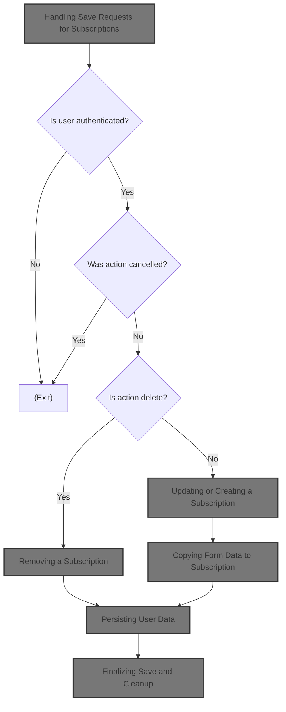
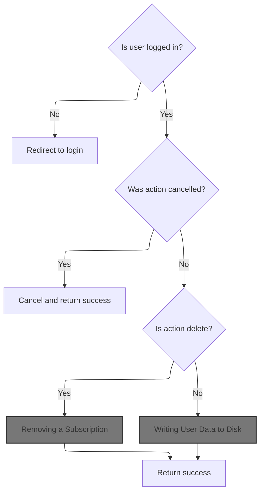
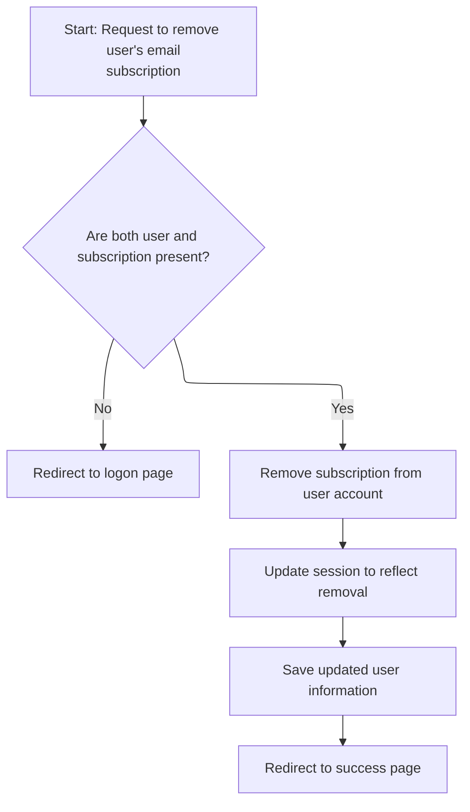
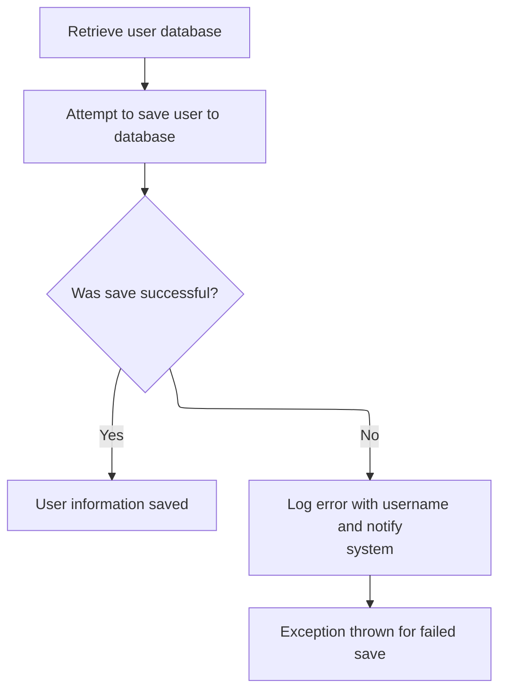

This document describes how user requests to manage subscriptions are processed. When a user submits a request to save, update, or delete a subscription, the system determines the requested action, updates the user's subscription data, and ensures all changes are safely persisted.



# Handling Save Requests for Subscriptions



<SwmSnippet path="/apps/mailreader/src/main/java/org/apache/struts/apps/mailreader/actions/SubscriptionAction.java" line="302">

---

In <SwmToken path="apps/mailreader/src/main/java/org/apache/struts/apps/mailreader/actions/SubscriptionAction.java" pos="302:5:5" line-data="    public ActionForward Save(">`Save`</SwmToken>, we check if the user is authenticated, handle cancellation, and determine the requested action. If the action is DELETE, we call <SwmToken path="apps/mailreader/src/main/java/org/apache/struts/apps/mailreader/actions/SubscriptionAction.java" pos="327:3:3" line-data="            return doRemoveSubscription(mapping, session, user, subscription);">`doRemoveSubscription`</SwmToken> to handle the removal and exit early, since nothing else should happen for a delete.

```java
    public ActionForward Save(
            ActionMapping mapping,
            ActionForm form,
            HttpServletRequest request,
            HttpServletResponse response)
            throws Exception {

        final String method = Constants.SAVE;
        doLogProcess(mapping, method);

        User user = doGetUser(request);
        if (user == null) {
            return doFindLogon(mapping);
        }

        HttpSession session = request.getSession();
        if (isCancelled(request)) {
            doCancel(session, method, Constants.SUBSCRIPTION_KEY);
            return doFindSuccess(mapping);
        }

        String action = doGet(form, TASK);
        Subscription subscription = doGetSubscription(request);
        boolean isDelete = action.equals(Constants.DELETE);
        if (isDelete) {
            return doRemoveSubscription(mapping, session, user, subscription);
        }

```

---

</SwmSnippet>

## Removing a Subscription



<SwmSnippet path="/apps/mailreader/src/main/java/org/apache/struts/apps/mailreader/actions/SubscriptionAction.java" line="178">

---

<SwmToken path="apps/mailreader/src/main/java/org/apache/struts/apps/mailreader/actions/SubscriptionAction.java" pos="178:5:5" line-data="    private ActionForward doRemoveSubscription(">`doRemoveSubscription`</SwmToken> handles the actual removal of the subscription from the user, cleans up the session, and then calls <SwmToken path="apps/mailreader/src/main/java/org/apache/struts/apps/mailreader/actions/SubscriptionAction.java" pos="204:1:1" line-data="        doSaveUser(user);">`doSaveUser`</SwmToken> to persist the updated user data before returning success.

```java
    private ActionForward doRemoveSubscription(
            ActionMapping mapping,
            HttpSession session,
            User user,
            Subscription subscription)
            throws ServletException {

        final String method = Constants.DELETE;
        doLogProcess(mapping, method);

        if (log.isTraceEnabled()) {
            log.trace(
                    " Deleting subscription to mail server '"
                            + subscription.getHost()
                            + "' for user '"
                            + user.getUsername()
                            + "'");
        }

        boolean missingAttributes = ((user == null) || (subscription == null));
        if (missingAttributes) {
            return doFindLogon(mapping);
        }

        user.removeSubscription(subscription);
        session.removeAttribute(Constants.SUBSCRIPTION_KEY);
        doSaveUser(user);

        return doFindSuccess(mapping);
    }
```

---

</SwmSnippet>

## Persisting User Data



<SwmSnippet path="/apps/mailreader/src/main/java/org/apache/struts/apps/mailreader/actions/BaseAction.java" line="405">

---

<SwmToken path="apps/mailreader/src/main/java/org/apache/struts/apps/mailreader/actions/BaseAction.java" pos="405:5:5" line-data="    protected void doSaveUser(User user) throws ServletException {">`doSaveUser`</SwmToken> triggers a save on the whole <SwmToken path="apps/mailreader/src/main/java/org/apache/struts/apps/mailreader/actions/BaseAction.java" pos="411:1:1" line-data="            UserDatabase database = doGetUserDatabase();">`UserDatabase`</SwmToken>, not just the provided user. It logs errors with the username if saving fails, assuming the User object is valid for logging.

```java
    protected void doSaveUser(User user) throws ServletException {

        final String LOG_DATABASE_SAVE_ERROR =
                " Unexpected error when saving User: ";

        try {
            UserDatabase database = doGetUserDatabase();
            database.save();
        } catch (Exception e) {
            String message = LOG_DATABASE_SAVE_ERROR + user.getUsername();
            log.error(message, e);
            throw new ServletException(message, e);
        }
    }
```

---

</SwmSnippet>

## Writing User Data to Disk

<SwmSnippet path="/apps/faces-example1/src/main/java/org/apache/struts/webapp/example/memory/MemoryUserDatabase.java" line="257">

---

In <SwmToken path="apps/faces-example1/src/main/java/org/apache/struts/webapp/example/memory/MemoryUserDatabase.java" pos="257:5:5" line-data="    public void save() throws Exception {">`save`</SwmToken>, we serialize all users and their subscriptions to a temporary XML file, prepping for a safe update of the user database on disk.

```java
    public void save() throws Exception {

        if (log.isDebugEnabled()) {
            log.debug("Saving database to '" + pathname + "'");
        }
        File fileNew = new File(pathnameNew);
        PrintWriter writer = null;

        try {

            // Configure our PrintWriter
            FileOutputStream fos = new FileOutputStream(fileNew);
            OutputStreamWriter osw = new OutputStreamWriter(fos);
            writer = new PrintWriter(osw);

            // Print the file prolog
            writer.println("<?xml version='1.0'?>");
            writer.println("<database>");

            // Print entries for each defined user and associated subscriptions
            User users[] = findUsers();
            for (int i = 0; i < users.length; i++) {
                writer.print("  ");
                writer.println(users[i]);
                Subscription subscriptions[] =
                    users[i].getSubscriptions();
                for (int j = 0; j < subscriptions.length; j++) {
                    writer.print("    ");
                    writer.println(subscriptions[j]);
                    writer.print("    ");
                    writer.println("</subscription>");
                }
                writer.print("  ");
                writer.println("</user>");
            }
```

---

</SwmSnippet>

<SwmSnippet path="/apps/faces-example1/src/main/java/org/apache/struts/webapp/example/memory/MemoryUserDatabase.java" line="293">

---

Here, after finishing the XML output, we call <SwmToken path="apps/faces-example1/src/main/java/org/apache/struts/webapp/example/memory/MemoryUserDatabase.java" pos="297:4:8" line-data="            if (writer.checkError()) {">`writer.checkError()`</SwmToken> to verify the write succeeded before closing and renaming files.

```java
            // Print the file epilog
            writer.println("</database>");

            // Check for errors that occurred while printing
            if (writer.checkError()) {
```

---

</SwmSnippet>

<SwmSnippet path="/core/src/main/java/org/apache/struts/util/ServletContextWriter.java" line="77">

---

<SwmToken path="core/src/main/java/org/apache/struts/util/ServletContextWriter.java" pos="77:5:5" line-data="    public boolean checkError() {">`checkError`</SwmToken> flushes the stream before returning the error state, so it always reports the latest write status, not just the buffered state.

```java
    public boolean checkError() {
        flush();

        return (error);
    }
```

---

</SwmSnippet>

<SwmSnippet path="/apps/faces-example1/src/main/java/org/apache/struts/webapp/example/memory/MemoryUserDatabase.java" line="298">

---

Back from `ServletContextWriter.checkError`, we close the writer to finalize the file and clean up resources before moving on in `MemoryUserDatabase.save`.

```java
                writer.close();
```

---

</SwmSnippet>

<SwmSnippet path="/apps/faces-example1/src/main/java/org/apache/struts/webapp/example/memory/MemoryUserDatabase.java" line="106">

---

<SwmToken path="apps/faces-example1/src/main/java/org/apache/struts/webapp/example/memory/MemoryUserDatabase.java" pos="106:5:5" line-data="    public void close() throws Exception {">`close`</SwmToken> in <SwmToken path="apps/faces-example1/src/main/java/org/apache/struts/webapp/example/memory/MemoryUserDatabase.java" pos="53:6:6" line-data="public final class MemoryUserDatabase implements UserDatabase {">`MemoryUserDatabase`</SwmToken> just calls save(), so invoking close() here means we're re-saving the user data, not just closing resources.

```java
    public void close() throws Exception {

        save();

    }
```

---

</SwmSnippet>

<SwmSnippet path="/apps/faces-example1/src/main/java/org/apache/struts/webapp/example/memory/MemoryUserDatabase.java" line="299">

---

Back from `MemoryUserDatabase.close`, if <SwmToken path="apps/faces-example1/src/main/java/org/apache/struts/webapp/example/memory/MemoryUserDatabase.java" pos="297:6:6" line-data="            if (writer.checkError()) {">`checkError`</SwmToken> failed, we delete the temp file and throw an <SwmToken path="apps/faces-example1/src/main/java/org/apache/struts/webapp/example/memory/MemoryUserDatabase.java" pos="300:5:5" line-data="                throw new IOException">`IOException`</SwmToken> to indicate the save didn't complete cleanly.

```java
                fileNew.delete();
                throw new IOException
                    ("Saving database to '" + pathname + "'");
            }
```

---

</SwmSnippet>

### Cleaning Up Registration Data

See <SwmLink doc-title="Deleting a subscription">[Deleting a subscription](/.swm/deleting-a-subscription.a0731eoa.sw.md)</SwmLink>

### Finalizing Save and Cleanup

```mermaid
%%{init: {"flowchart": {"defaultRenderer": "elk"}} }%%
flowchart TD
  node1["Attempt to write new user data to a
temporary file"]
  click node1 openCode "apps/faces-example1/src/main/java/org/apache/struts/webapp/example/memory/MemoryUserDatabase.java:303:304"
  node1 --> node2{"Did an error occur during writing?"}
  click node2 openCode "apps/faces-example1/src/main/java/org/apache/struts/webapp/example/memory/MemoryUserDatabase.java:306:312"
  node2 -->|"Yes"| node3["Delete temporary file and abort save
(error thrown)"]
  click node3 openCode "apps/faces-example1/src/main/java/org/apache/struts/webapp/example/memory/MemoryUserDatabase.java:311:312"
  node2 -->|"No"| node4{"Does the original file exist?"}
  click node4 openCode "apps/faces-example1/src/main/java/org/apache/struts/webapp/example/memory/MemoryUserDatabase.java:320:326"
  node4 -->|"Yes"| node5["Delete old backup, rename original file
to backup"]
  click node5 openCode "apps/faces-example1/src/main/java/org/apache/struts/webapp/example/memory/MemoryUserDatabase.java:321:325"
  node4 -->|"No"| node6["Proceed to replace original file"]
  click node6 openCode "apps/faces-example1/src/main/java/org/apache/struts/webapp/example/memory/MemoryUserDatabase.java:327:334"
  node5 --> node7{"Rename new file to original"}
  node6 --> node7
  click node7 openCode "apps/faces-example1/src/main/java/org/apache/struts/webapp/example/memory/MemoryUserDatabase.java:327:333"
  node7 -->|"Success"| node8["Delete backup if it exists, save
complete"]
  click node8 openCode "apps/faces-example1/src/main/java/org/apache/struts/webapp/example/memory/MemoryUserDatabase.java:334:335"
  node7 -->|"Fail"| node9["Restore backup if needed, abort save
(error thrown)"]
  click node9 openCode "apps/faces-example1/src/main/java/org/apache/struts/webapp/example/memory/MemoryUserDatabase.java:328:332"

classDef HeadingStyle fill:#777777,stroke:#333,stroke-width:2px;

%% Swimm:
%% %%{init: {"flowchart": {"defaultRenderer": "elk"}} }%%
%% flowchart TD
%%   node1["Attempt to write new user data to a
%% temporary file"]
%%   click node1 openCode "<SwmPath>[apps/…/memory/MemoryUserDatabase.java](apps/faces-example1/src/main/java/org/apache/struts/webapp/example/memory/MemoryUserDatabase.java)</SwmPath>:303:304"
%%   node1 --> node2{"Did an error occur during writing?"}
%%   click node2 openCode "<SwmPath>[apps/…/memory/MemoryUserDatabase.java](apps/faces-example1/src/main/java/org/apache/struts/webapp/example/memory/MemoryUserDatabase.java)</SwmPath>:306:312"
%%   node2 -->|"Yes"| node3["Delete temporary file and abort save
%% (error thrown)"]
%%   click node3 openCode "<SwmPath>[apps/…/memory/MemoryUserDatabase.java](apps/faces-example1/src/main/java/org/apache/struts/webapp/example/memory/MemoryUserDatabase.java)</SwmPath>:311:312"
%%   node2 -->|"No"| node4{"Does the original file exist?"}
%%   click node4 openCode "<SwmPath>[apps/…/memory/MemoryUserDatabase.java](apps/faces-example1/src/main/java/org/apache/struts/webapp/example/memory/MemoryUserDatabase.java)</SwmPath>:320:326"
%%   node4 -->|"Yes"| node5["Delete old backup, rename original file
%% to backup"]
%%   click node5 openCode "<SwmPath>[apps/…/memory/MemoryUserDatabase.java](apps/faces-example1/src/main/java/org/apache/struts/webapp/example/memory/MemoryUserDatabase.java)</SwmPath>:321:325"
%%   node4 -->|"No"| node6["Proceed to replace original file"]
%%   click node6 openCode "<SwmPath>[apps/…/memory/MemoryUserDatabase.java](apps/faces-example1/src/main/java/org/apache/struts/webapp/example/memory/MemoryUserDatabase.java)</SwmPath>:327:334"
%%   node5 --> node7{"Rename new file to original"}
%%   node6 --> node7
%%   click node7 openCode "<SwmPath>[apps/…/memory/MemoryUserDatabase.java](apps/faces-example1/src/main/java/org/apache/struts/webapp/example/memory/MemoryUserDatabase.java)</SwmPath>:327:333"
%%   node7 -->|"Success"| node8["Delete backup if it exists, save
%% complete"]
%%   click node8 openCode "<SwmPath>[apps/…/memory/MemoryUserDatabase.java](apps/faces-example1/src/main/java/org/apache/struts/webapp/example/memory/MemoryUserDatabase.java)</SwmPath>:334:335"
%%   node7 -->|"Fail"| node9["Restore backup if needed, abort save
%% (error thrown)"]
%%   click node9 openCode "<SwmPath>[apps/…/memory/MemoryUserDatabase.java](apps/faces-example1/src/main/java/org/apache/struts/webapp/example/memory/MemoryUserDatabase.java)</SwmPath>:328:332"
%% 
%% classDef HeadingStyle fill:#777777,stroke:#333,stroke-width:2px;
```



<SwmSnippet path="/apps/faces-example1/src/main/java/org/apache/struts/webapp/example/memory/MemoryUserDatabase.java" line="303">

---

Back from `RegistrationBacking.delete`, if an <SwmToken path="apps/faces-example1/src/main/java/org/apache/struts/webapp/example/memory/MemoryUserDatabase.java" pos="306:6:6" line-data="        } catch (IOException e) {">`IOException`</SwmToken> was caught, we close the writer (if open) and clean up before rethrowing, keeping resource management tight in `MemoryUserDatabase.save`.

```java
            writer.close();
            writer = null;

        } catch (IOException e) {

            if (writer != null) {
                writer.close();
            }
```

---

</SwmSnippet>

<SwmSnippet path="/apps/faces-example1/src/main/java/org/apache/struts/webapp/example/memory/MemoryUserDatabase.java" line="311">

---

Back from `MemoryUserDatabase.save`, we handle file renames to swap in the new database and clean up the old one, making the update atomic.

```java
            fileNew.delete();
            throw e;

        }


        // Perform the required renames to permanently save this file
        File fileOrig = new File(pathname);
        File fileOld = new File(pathnameOld);
        if (fileOrig.exists()) {
            fileOld.delete();
            if (!fileOrig.renameTo(fileOld)) {
                throw new IOException
                    ("Renaming '" + pathname + "' to '" + pathnameOld + "'");
            }
        }
        if (!fileNew.renameTo(fileOrig)) {
            if (fileOld.exists()) {
                fileOld.renameTo(fileOrig);
            }
            throw new IOException
                ("Renaming '" + pathnameNew + "' to '" + pathname + "'");
        }
        fileOld.delete();

    }
```

---

</SwmSnippet>

## Updating or Creating a Subscription

<SwmSnippet path="/apps/mailreader/src/main/java/org/apache/struts/apps/mailreader/actions/SubscriptionAction.java" line="330">

---

Back in <SwmToken path="apps/mailreader/src/main/java/org/apache/struts/apps/mailreader/actions/SubscriptionAction.java" pos="302:5:5" line-data="    public ActionForward Save(">`Save`</SwmToken>, if there's no existing subscription, we create one and set it in the session, then call <SwmToken path="apps/mailreader/src/main/java/org/apache/struts/apps/mailreader/actions/SubscriptionAction.java" pos="335:1:1" line-data="        doPopulate(subscription, form);">`doPopulate`</SwmToken> to copy form data into the subscription.

```java
        if (subscription == null) {
            subscription = user.createSubscription(doGet(form, HOST));
            session.setAttribute(Constants.SUBSCRIPTION_KEY, subscription);
        }

        doPopulate(subscription, form);
```

---

</SwmSnippet>

## Copying Form Data to Subscription

<SwmSnippet path="/apps/mailreader/src/main/java/org/apache/struts/apps/mailreader/actions/SubscriptionAction.java" line="109">

---

In <SwmToken path="apps/mailreader/src/main/java/org/apache/struts/apps/mailreader/actions/SubscriptionAction.java" pos="109:5:5" line-data="    private void doPopulate(Subscription subscription, ActionForm form)">`doPopulate`</SwmToken>, we use <SwmToken path="apps/mailreader/src/main/java/org/apache/struts/apps/mailreader/actions/SubscriptionAction.java" pos="117:1:3" line-data="            PropertyUtils.copyProperties(subscription, form);">`PropertyUtils.copyProperties`</SwmToken> to transfer all matching fields from the form to the subscription, prepping for persistence.

```java
    private void doPopulate(Subscription subscription, ActionForm form)
            throws ServletException {

        if (log.isTraceEnabled()) {
            log.trace(Constants.LOG_POPULATE_SUBSCRIPTION + subscription);
        }

        try {
            PropertyUtils.copyProperties(subscription, form);
```

---

</SwmSnippet>

### Duplicating Configuration Properties

<SwmSnippet path="/core/src/main/java/org/apache/struts/config/BaseConfig.java" line="155">

---

<SwmToken path="core/src/main/java/org/apache/struts/config/BaseConfig.java" pos="155:5:5" line-data="    protected Properties copyProperties() {">`copyProperties`</SwmToken> creates a new Properties object and copies all key-value pairs from the original, isolating the copy from future changes.

```java
    protected Properties copyProperties() {
        Properties copy = new Properties();

        Enumeration keys = properties.propertyNames();

        while (keys.hasMoreElements()) {
            String key = (String) keys.nextElement();

            copy.setProperty(key, properties.getProperty(key));
        }

        return copy;
    }
```

---

</SwmSnippet>

<SwmSnippet path="/core/src/main/java/org/apache/struts/config/BaseConfig.java" line="88">

---

<SwmToken path="core/src/main/java/org/apache/struts/config/BaseConfig.java" pos="88:5:5" line-data="    public void setProperty(String key, String value) {">`setProperty`</SwmToken> checks if the object is already configured before allowing property changes, enforcing immutability after setup.

```java
    public void setProperty(String key, String value) {
        throwIfConfigured();
        properties.setProperty(key, value);
    }
```

---

</SwmSnippet>

### Handling Property Copy Errors

<SwmSnippet path="/apps/mailreader/src/main/java/org/apache/struts/apps/mailreader/actions/SubscriptionAction.java" line="118">

---

Back from `BaseConfig.copyProperties`, if copying properties throws, we log the error and throw a <SwmToken path="apps/mailreader/src/main/java/org/apache/struts/apps/mailreader/actions/SubscriptionAction.java" pos="124:5:5" line-data="            throw new ServletException(LOG_SUBSCRIPTION_POPULATE, t);">`ServletException`</SwmToken>, halting further processing in <SwmToken path="apps/mailreader/src/main/java/org/apache/struts/apps/mailreader/actions/SubscriptionAction.java" pos="109:5:5" line-data="    private void doPopulate(Subscription subscription, ActionForm form)">`doPopulate`</SwmToken>.

```java
        } catch (InvocationTargetException e) {
            Throwable t = e.getTargetException();
            if (t == null) {
                t = e;
            }
            log.error(LOG_SUBSCRIPTION_POPULATE, t);
            throw new ServletException(LOG_SUBSCRIPTION_POPULATE, t);
        } catch (Throwable t) {
            log.error(LOG_SUBSCRIPTION_POPULATE, t);
            throw new ServletException(LOG_SUBSCRIPTION_POPULATE, t);
        }
    }
```

---

</SwmSnippet>

## Saving Updated Subscription Data

<SwmSnippet path="/apps/mailreader/src/main/java/org/apache/struts/apps/mailreader/actions/SubscriptionAction.java" line="336">

---

Back in <SwmToken path="apps/mailreader/src/main/java/org/apache/struts/apps/mailreader/actions/SubscriptionAction.java" pos="302:5:5" line-data="    public ActionForward Save(">`Save`</SwmToken>, after updating the subscription, we call <SwmToken path="apps/mailreader/src/main/java/org/apache/struts/apps/mailreader/actions/SubscriptionAction.java" pos="336:1:1" line-data="        doSaveUser(user);">`doSaveUser`</SwmToken> to persist the user's new subscription data.

```java
        doSaveUser(user);
```

---

</SwmSnippet>

<SwmSnippet path="/apps/mailreader/src/main/java/org/apache/struts/apps/mailreader/actions/SubscriptionAction.java" line="337">

---

Back from <SwmToken path="apps/mailreader/src/main/java/org/apache/struts/apps/mailreader/actions/SubscriptionAction.java" pos="204:1:1" line-data="        doSaveUser(user);">`doSaveUser`</SwmToken>, we remove the subscription from the session and return success, wrapping up the <SwmToken path="apps/mailreader/src/main/java/org/apache/struts/apps/mailreader/actions/SubscriptionAction.java" pos="302:5:5" line-data="    public ActionForward Save(">`Save`</SwmToken> flow.

```java
        session.removeAttribute(Constants.SUBSCRIPTION_KEY);

        return doFindSuccess(mapping);
    }
```

---

</SwmSnippet>

&nbsp;

*This is an auto-generated document by Swimm 🌊 and has not yet been verified by a human*

<SwmMeta version="3.0.0" repo-id="Z2l0aHViJTNBJTNBc3RydXRzMSUzQSUzQVN3aW1tLURlbW8=" repo-name="struts1"><sup>Powered by [Swimm](https://app.swimm.io/)</sup></SwmMeta>
