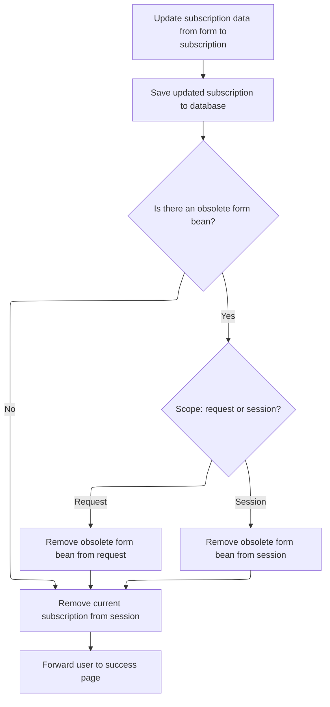

This document explains the flow for managing user subscriptions as part of the user account management system. Users can create, update, or delete subscriptions, and the flow ensures these actions are processed and changes are saved to the database. The main steps are:

- Check if the user is logged in and handle transaction cancellation
- Create or delete subscriptions
- Save updated user and subscription data
- Navigate the user to the appropriate page.

# Handling Subscription Save/Delete and Navigation

<SwmSnippet path="/apps/faces-example2/src/main/java/org/apache/struts/webapp/example2/SaveSubscriptionAction.java" line="80">

---

In `SaveSubscriptionAction.execute`, we check for a logged-in user and handle transaction cancellation. If either condition is met, we use <SwmToken path="apps/faces-example2/src/main/java/org/apache/struts/webapp/example2/SaveSubscriptionAction.java" pos="106:4:6" line-data="        return (mapping.findForward(&quot;logon&quot;));">`mapping.findForward`</SwmToken> to decide where to send the user next, which requires calling <SwmToken path="apps/faces-example2/src/main/java/org/apache/struts/webapp/example2/SaveSubscriptionAction.java" pos="80:7:7" line-data="    public ActionForward execute(ActionMapping mapping,">`ActionMapping`</SwmToken> to resolve the correct navigation target.

```java
    public ActionForward execute(ActionMapping mapping,
                 ActionForm form,
                 HttpServletRequest request,
                 HttpServletResponse response)
    throws Exception {

    // Extract attributes and parameters we will need
    MessageResources messages = getResources(request);
    HttpSession session = request.getSession();
    SubscriptionForm subform = (SubscriptionForm) form;
    String action = subform.getAction();
    if (action == null) {
        action = "?";
        }
        if (log.isDebugEnabled()) {
            log.debug("SaveSubscriptionAction:  Processing " + action +
                      " action");
        }

    // Is there a currently logged on user?
    User user = (User) session.getAttribute(Constants.USER_KEY);
    if (user == null) {
            if (log.isTraceEnabled()) {
                log.trace(" User is not logged on in session "
                          + session.getId());
            }
        return (mapping.findForward("logon"));
        }

    // Was this transaction cancelled?
    if (isCancelled(request)) {
            if (log.isTraceEnabled()) {
                log.trace(" Transaction '" + action +
                          "' was cancelled");
            }
            session.removeAttribute(Constants.SUBSCRIPTION_KEY);
        return (mapping.findForward("success"));
    }

```

---

</SwmSnippet>

<SwmSnippet path="/core/src/main/java/org/apache/struts/action/ActionMapping.java" line="70">

---

<SwmToken path="core/src/main/java/org/apache/struts/action/ActionMapping.java" pos="70:5:5" line-data="    public ActionForward findForward(String forwardName) {">`findForward`</SwmToken> looks up the navigation target first locally, then in the module config, and returns it as an <SwmToken path="core/src/main/java/org/apache/struts/action/ActionMapping.java" pos="70:3:3" line-data="    public ActionForward findForward(String forwardName) {">`ActionForward`</SwmToken>. It assumes the config can always be cast, which isn't guaranteed, so that's a bit risky.

```java
    public ActionForward findForward(String forwardName) {
        ForwardConfig config = findForwardConfig(forwardName);

        if (config == null) {
            config = getModuleConfig().findForwardConfig(forwardName);
        }

        // TODO: remove warning since findRequiredForward takes care of use case? 
        if (config == null) {
            if (log.isWarnEnabled()) {
                log.warn("Unable to find '" + forwardName + "' forward.");
            }
        }

        return ((ActionForward) config);
    }
```

---

</SwmSnippet>

<SwmSnippet path="/apps/faces-example2/src/main/java/org/apache/struts/webapp/example2/SaveSubscriptionAction.java" line="119">

---

Back in SaveSubscriptionAction.execute, after handling navigation, we check for a subscription and handle creation or deletion. For deletion, we call <SwmToken path="apps/faces-example2/src/main/java/org/apache/struts/webapp/example2/SaveSubscriptionAction.java" pos="147:1:3" line-data="            user.removeSubscription(subscription);">`user.removeSubscription`</SwmToken> to update the user's subscriptions, so we need to jump to <SwmToken path="apps/faces-example1/src/main/java/org/apache/struts/webapp/example/memory/MemoryUser.java" pos="41:6:6" line-data="public final class MemoryUser implements User {">`MemoryUser`</SwmToken> next.

```java
    // Is there a related Subscription object?
    Subscription subscription =
      (Subscription) session.getAttribute(Constants.SUBSCRIPTION_KEY);
        if ("Create".equals(action)) {
            if (log.isTraceEnabled()) {
                log.trace(" Creating subscription for mail server '" +
                          subform.getHost() + "'");
            }
            subscription =
                user.createSubscription(subform.getHost());
        }
    if (subscription == null) {
            if (log.isTraceEnabled()) {
                log.trace(" Missing subscription for user '" +
                          user.getUsername() + "'");
            }
        response.sendError(HttpServletResponse.SC_BAD_REQUEST,
                           messages.getMessage("error.noSubscription"));
        return (null);
    }

    // Was this transaction a Delete?
    if (action.equals("Delete")) {
            if (log.isTraceEnabled()) {
                log.trace(" Deleting mail server '" +
                          subscription.getHost() + "' for user '" +
                          user.getUsername() + "'");
            }
            user.removeSubscription(subscription);
```

---

</SwmSnippet>

<SwmSnippet path="/apps/faces-example1/src/main/java/org/apache/struts/webapp/example/memory/MemoryUser.java" line="228">

---

<SwmToken path="apps/faces-example1/src/main/java/org/apache/struts/webapp/example/memory/MemoryUser.java" pos="228:5:5" line-data="    public void removeSubscription(Subscription subscription) {">`removeSubscription`</SwmToken> checks if the subscription belongs to the user, synchronizes on the collection for thread safety, and removes it by host. This keeps the user's subscription list accurate and prevents unauthorized removal.

```java
    public void removeSubscription(Subscription subscription) {

        if (!(this == subscription.getUser())) {
            throw new IllegalArgumentException
                ("Subscription not associated with this user");
        }
        synchronized (subscriptions) {
            subscriptions.remove(subscription.getHost());
        }

    }
```

---

</SwmSnippet>

<SwmSnippet path="/apps/faces-example2/src/main/java/org/apache/struts/webapp/example2/SaveSubscriptionAction.java" line="148">

---

After returning from <SwmToken path="apps/faces-example1/src/main/java/org/apache/struts/webapp/example/memory/MemoryUser.java" pos="41:6:6" line-data="public final class MemoryUser implements User {">`MemoryUser`</SwmToken>, SaveSubscriptionAction.execute removes the session's <SwmToken path="apps/faces-example2/src/main/java/org/apache/struts/webapp/example2/SaveSubscriptionAction.java" pos="148:7:7" line-data="        session.removeAttribute(Constants.SUBSCRIPTION_KEY);">`SUBSCRIPTION_KEY`</SwmToken> and calls <SwmToken path="apps/faces-example2/src/main/java/org/apache/struts/webapp/example2/SaveSubscriptionAction.java" pos="153:1:3" line-data="                database.save();">`database.save`</SwmToken> to persist the updated user data. This step ensures the changes are stored.

```java
        session.removeAttribute(Constants.SUBSCRIPTION_KEY);
            try {
                UserDatabase database = (UserDatabase)
                    servlet.getServletContext().
                    getAttribute(Constants.DATABASE_KEY);
                database.save();
            } catch (Exception e) {
                log.error("Database save", e);
            }
```

---

</SwmSnippet>

## Persisting User and Subscription Data

<SwmSnippet path="/apps/faces-example1/src/main/java/org/apache/struts/webapp/example/memory/MemoryUserDatabase.java" line="257">

---

In MemoryUserDatabase.save, we loop through users and their subscriptions, writing XML fragments using their <SwmToken path="apps/faces-example1/src/main/java/org/apache/struts/webapp/example/memory/MemoryUser.java" pos="244:5:7" line-data="    public String toString() {">`toString()`</SwmToken> methods. This dumps the current state to a new XML file, assuming all objects output valid XML.

```java
    public void save() throws Exception {

        if (log.isDebugEnabled()) {
            log.debug("Saving database to '" + pathname + "'");
        }
        File fileNew = new File(pathnameNew);
        PrintWriter writer = null;

        try {

            // Configure our PrintWriter
            FileOutputStream fos = new FileOutputStream(fileNew);
            OutputStreamWriter osw = new OutputStreamWriter(fos);
            writer = new PrintWriter(osw);

            // Print the file prolog
            writer.println("<?xml version='1.0'?>");
            writer.println("<database>");

            // Print entries for each defined user and associated subscriptions
            User users[] = findUsers();
            for (int i = 0; i < users.length; i++) {
                writer.print("  ");
                writer.println(users[i]);
                Subscription subscriptions[] =
                    users[i].getSubscriptions();
                for (int j = 0; j < subscriptions.length; j++) {
                    writer.print("    ");
                    writer.println(subscriptions[j]);
                    writer.print("    ");
                    writer.println("</subscription>");
                }
                writer.print("  ");
                writer.println("</user>");
            }
```

---

</SwmSnippet>

<SwmSnippet path="/apps/faces-example1/src/main/java/org/apache/struts/webapp/example/memory/MemoryUserDatabase.java" line="293">

---

After writing the XML, we check for errors and delete the file if anything went wrong. This avoids leaving a broken database file, so we need to handle cleanup next.

```java
            // Print the file epilog
            writer.println("</database>");

            // Check for errors that occurred while printing
            if (writer.checkError()) {
                writer.close();
```

---

</SwmSnippet>

<SwmSnippet path="/apps/faces-example1/src/main/java/org/apache/struts/webapp/example/memory/MemoryUserDatabase.java" line="106">

---

MemoryUserDatabase.close just calls save to make sure all changes are persisted before shutting down. This guarantees the latest state is stored.

```java
    public void close() throws Exception {

        save();

    }
```

---

</SwmSnippet>

<SwmSnippet path="/apps/faces-example1/src/main/java/org/apache/struts/webapp/example/memory/MemoryUserDatabase.java" line="299">

---

After MemoryUserDatabase.save, if saving fails, we throw an exception and delete the file. Next, we need to call RegistrationBacking to handle any user registration or cleanup that depends on the database state.

```java
                fileNew.delete();
                throw new IOException
                    ("Saving database to '" + pathname + "'");
            }
```

---

</SwmSnippet>

### User Deletion and Cleanup

See <SwmLink doc-title="Deleting a subscription">[Deleting a subscription](/.swm/deleting-a-subscription.wytybkg1.sw.md)</SwmLink>

### Finalizing Database Save After User Deletion

```mermaid
%%{init: {"flowchart": {"defaultRenderer": "elk"}} }%%
flowchart TD
    node1["Save new user database file"]
    click node1 openCode "apps/faces-example1/src/main/java/org/apache/struts/webapp/example/memory/MemoryUserDatabase.java:303:305"
    node1 --> node2{"Was there an error during saving?"}
    click node2 openCode "apps/faces-example1/src/main/java/org/apache/struts/webapp/example/memory/MemoryUserDatabase.java:306:312"
    node2 -->|"Yes"| node3["Delete temporary file and report failure"]
    click node3 openCode "apps/faces-example1/src/main/java/org/apache/struts/webapp/example/memory/MemoryUserDatabase.java:311:312"
    node2 -->|"No"| node4{"Does the original file exist?"}
    click node4 openCode "apps/faces-example1/src/main/java/org/apache/struts/webapp/example/memory/MemoryUserDatabase.java:320:326"
    node4 -->|"Yes"| node5["Delete backup file"]
    click node5 openCode "apps/faces-example1/src/main/java/org/apache/struts/webapp/example/memory/MemoryUserDatabase.java:321:321"
    node5 --> node6["Rename original file to backup"]
    click node6 openCode "apps/faces-example1/src/main/java/org/apache/struts/webapp/example/memory/MemoryUserDatabase.java:322:325"
    node6 --> node7{"Rename new file to original
successful?"}
    click node7 openCode "apps/faces-example1/src/main/java/org/apache/struts/webapp/example/memory/MemoryUserDatabase.java:327:333"
    node7 -->|"Yes"| node8["Delete backup file"]
    click node8 openCode "apps/faces-example1/src/main/java/org/apache/struts/webapp/example/memory/MemoryUserDatabase.java:334:334"
    node7 -->|"No"| node9{"Backup exists?"}
    click node9 openCode "apps/faces-example1/src/main/java/org/apache/struts/webapp/example/memory/MemoryUserDatabase.java:328:330"
    node9 -->|"Yes"| node10["Restore backup"]
    click node10 openCode "apps/faces-example1/src/main/java/org/apache/struts/webapp/example/memory/MemoryUserDatabase.java:329:329"
    node10 --> node11["Report failure"]
    click node11 openCode "apps/faces-example1/src/main/java/org/apache/struts/webapp/example/memory/MemoryUserDatabase.java:331:332"
    node9 -->|"No"| node11
    node4 -->|"No"| node7
classDef HeadingStyle fill:#777777,stroke:#333,stroke-width:2px;

%% Swimm:
%% %%{init: {"flowchart": {"defaultRenderer": "elk"}} }%%
%% flowchart TD
%%     node1["Save new user database file"]
%%     click node1 openCode "<SwmPath>[apps/…/memory/MemoryUserDatabase.java](apps/faces-example1/src/main/java/org/apache/struts/webapp/example/memory/MemoryUserDatabase.java)</SwmPath>:303:305"
%%     node1 --> node2{"Was there an error during saving?"}
%%     click node2 openCode "<SwmPath>[apps/…/memory/MemoryUserDatabase.java](apps/faces-example1/src/main/java/org/apache/struts/webapp/example/memory/MemoryUserDatabase.java)</SwmPath>:306:312"
%%     node2 -->|"Yes"| node3["Delete temporary file and report failure"]
%%     click node3 openCode "<SwmPath>[apps/…/memory/MemoryUserDatabase.java](apps/faces-example1/src/main/java/org/apache/struts/webapp/example/memory/MemoryUserDatabase.java)</SwmPath>:311:312"
%%     node2 -->|"No"| node4{"Does the original file exist?"}
%%     click node4 openCode "<SwmPath>[apps/…/memory/MemoryUserDatabase.java](apps/faces-example1/src/main/java/org/apache/struts/webapp/example/memory/MemoryUserDatabase.java)</SwmPath>:320:326"
%%     node4 -->|"Yes"| node5["Delete backup file"]
%%     click node5 openCode "<SwmPath>[apps/…/memory/MemoryUserDatabase.java](apps/faces-example1/src/main/java/org/apache/struts/webapp/example/memory/MemoryUserDatabase.java)</SwmPath>:321:321"
%%     node5 --> node6["Rename original file to backup"]
%%     click node6 openCode "<SwmPath>[apps/…/memory/MemoryUserDatabase.java](apps/faces-example1/src/main/java/org/apache/struts/webapp/example/memory/MemoryUserDatabase.java)</SwmPath>:322:325"
%%     node6 --> node7{"Rename new file to original
%% successful?"}
%%     click node7 openCode "<SwmPath>[apps/…/memory/MemoryUserDatabase.java](apps/faces-example1/src/main/java/org/apache/struts/webapp/example/memory/MemoryUserDatabase.java)</SwmPath>:327:333"
%%     node7 -->|"Yes"| node8["Delete backup file"]
%%     click node8 openCode "<SwmPath>[apps/…/memory/MemoryUserDatabase.java](apps/faces-example1/src/main/java/org/apache/struts/webapp/example/memory/MemoryUserDatabase.java)</SwmPath>:334:334"
%%     node7 -->|"No"| node9{"Backup exists?"}
%%     click node9 openCode "<SwmPath>[apps/…/memory/MemoryUserDatabase.java](apps/faces-example1/src/main/java/org/apache/struts/webapp/example/memory/MemoryUserDatabase.java)</SwmPath>:328:330"
%%     node9 -->|"Yes"| node10["Restore backup"]
%%     click node10 openCode "<SwmPath>[apps/…/memory/MemoryUserDatabase.java](apps/faces-example1/src/main/java/org/apache/struts/webapp/example/memory/MemoryUserDatabase.java)</SwmPath>:329:329"
%%     node10 --> node11["Report failure"]
%%     click node11 openCode "<SwmPath>[apps/…/memory/MemoryUserDatabase.java](apps/faces-example1/src/main/java/org/apache/struts/webapp/example/memory/MemoryUserDatabase.java)</SwmPath>:331:332"
%%     node9 -->|"No"| node11
%%     node4 -->|"No"| node7
%% classDef HeadingStyle fill:#777777,stroke:#333,stroke-width:2px;
```



<SwmSnippet path="/apps/faces-example1/src/main/java/org/apache/struts/webapp/example/memory/MemoryUserDatabase.java" line="303">

---

After RegistrationBacking, we return to MemoryUserDatabase.save to close the writer and clean up resources. This step is needed to finish the save operation and avoid file issues.

```java
            writer.close();
            writer = null;

        } catch (IOException e) {

            if (writer != null) {
                writer.close();
            }
```

---

</SwmSnippet>

<SwmSnippet path="/apps/faces-example1/src/main/java/org/apache/struts/webapp/example/memory/MemoryUserDatabase.java" line="311">

---

After MemoryUserDatabase.save finishes writing, it renames files to make the save atomic. If anything fails, it restores from backup. Next, RegistrationBacking can safely proceed, knowing the database is consistent.

```java
            fileNew.delete();
            throw e;

        }


        // Perform the required renames to permanently save this file
        File fileOrig = new File(pathname);
        File fileOld = new File(pathnameOld);
        if (fileOrig.exists()) {
            fileOld.delete();
            if (!fileOrig.renameTo(fileOld)) {
                throw new IOException
                    ("Renaming '" + pathname + "' to '" + pathnameOld + "'");
            }
        }
        if (!fileNew.renameTo(fileOrig)) {
            if (fileOld.exists()) {
                fileOld.renameTo(fileOrig);
            }
            throw new IOException
                ("Renaming '" + pathnameNew + "' to '" + pathname + "'");
        }
        fileOld.delete();

    }
```

---

</SwmSnippet>

## Post-Save Cleanup and Navigation



<SwmSnippet path="/apps/faces-example2/src/main/java/org/apache/struts/webapp/example2/SaveSubscriptionAction.java" line="157">

---

After returning from <SwmToken path="apps/faces-example1/src/main/java/org/apache/struts/webapp/example/memory/MemoryUser.java" pos="54:5:5" line-data="    public MemoryUser(MemoryUserDatabase database, String username) {">`MemoryUserDatabase`</SwmToken>, SaveSubscriptionAction.execute forwards to 'success' using <SwmToken path="apps/faces-example2/src/main/java/org/apache/struts/webapp/example2/SaveSubscriptionAction.java" pos="80:7:7" line-data="    public ActionForward execute(ActionMapping mapping,">`ActionMapping`</SwmToken>. This wraps up the flow and sends the user to the final page.

```java
        return (mapping.findForward("success"));
    }

    // All required validations were done by the form itself

    // Update the persistent subscription information
        if (log.isTraceEnabled()) {
            log.trace(" Populating database from form bean");
        }
```

---

</SwmSnippet>

<SwmSnippet path="/apps/faces-example2/src/main/java/org/apache/struts/webapp/example2/SaveSubscriptionAction.java" line="166">

---

After forwarding, SaveSubscriptionAction.execute copies form properties to the subscription and saves the database again. This step ensures all updates are persisted before finishing.

```java
        try {
            PropertyUtils.copyProperties(subscription, subform);
        } catch (InvocationTargetException e) {
            Throwable t = e.getTargetException();
            if (t == null)
                t = e;
            log.error("Subscription.populate", t);
            throw new ServletException("Subscription.populate", t);
        } catch (Throwable t) {
            log.error("Subscription.populate", t);
            throw new ServletException("Subscription.populate", t);
        }

        try {
            UserDatabase database = (UserDatabase)
                servlet.getServletContext().
                getAttribute(Constants.DATABASE_KEY);
            database.save();
        } catch (Exception e) {
            log.error("Database save", e);
        }

```

---

</SwmSnippet>

<SwmSnippet path="/apps/faces-example2/src/main/java/org/apache/struts/webapp/example2/SaveSubscriptionAction.java" line="188">

---

After <SwmToken path="apps/faces-example1/src/main/java/org/apache/struts/webapp/example/memory/MemoryUser.java" pos="54:5:5" line-data="    public MemoryUser(MemoryUserDatabase database, String username) {">`MemoryUserDatabase`</SwmToken>, SaveSubscriptionAction.execute removes any leftover form beans and subscriptions from session/request, then forwards to 'success' using <SwmToken path="apps/faces-example2/src/main/java/org/apache/struts/webapp/example2/SaveSubscriptionAction.java" pos="80:7:7" line-data="    public ActionForward execute(ActionMapping mapping,">`ActionMapping`</SwmToken>. This keeps the session clean and finishes the flow.

```java
    // Remove the obsolete form bean and current subscription
    if (mapping.getAttribute() != null) {
            if ("request".equals(mapping.getScope()))
                request.removeAttribute(mapping.getAttribute());
            else
                session.removeAttribute(mapping.getAttribute());
        }
    session.removeAttribute(Constants.SUBSCRIPTION_KEY);

    // Forward control to the specified success URI
        if (log.isTraceEnabled()) {
            log.trace(" Forwarding to success page");
        }
    return (mapping.findForward("success"));

    }
```

---

</SwmSnippet>

&nbsp;

*This is an auto-generated document by Swimm 🌊 and has not yet been verified by a human*

<SwmMeta version="3.0.0" repo-id="Z2l0aHViJTNBJTNBc3RydXRzMSUzQSUzQVN3aW1tLURlbW8=" repo-name="struts1"><sup>Powered by [Swimm](https://app.swimm.io/)</sup></SwmMeta>
