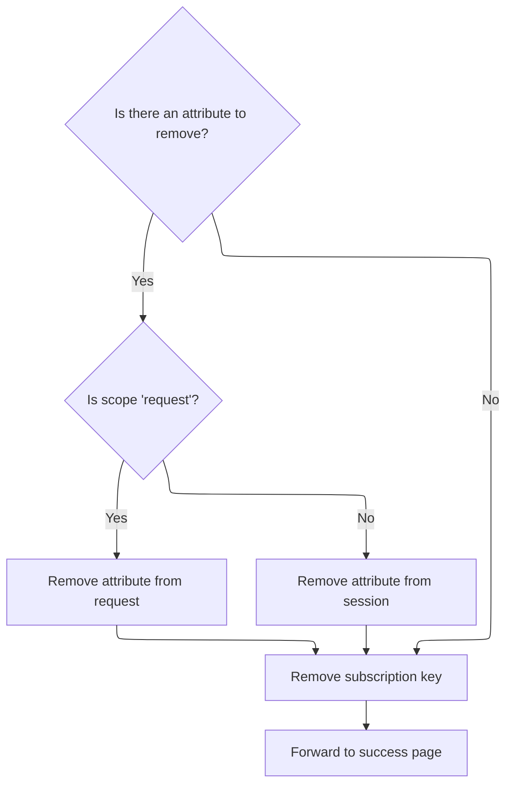

This document describes how user subscription actions—such as creating, updating, or deleting a subscription—are managed. When a user performs a subscription-related action, the system updates the user's subscription data, saves these changes to persistent XML storage, and ensures the user's session state is cleaned up. The user is then forwarded to the appropriate page based on the result.

# Handling Subscription Actions and User State

<SwmSnippet path="/apps/faces-example2/src/main/java/org/apache/struts/webapp/example2/SaveSubscriptionAction.java" line="80">

---

In `SaveSubscriptionAction.execute`, we start by checking user session, handling cancellation, and processing create/delete actions for subscriptions. The next step is to call MemoryUserDatabase.save to persist any changes made to the user's subscriptions, so the updated state is stored.

```java
    public ActionForward execute(ActionMapping mapping,
                 ActionForm form,
                 HttpServletRequest request,
                 HttpServletResponse response)
    throws Exception {

    // Extract attributes and parameters we will need
    MessageResources messages = getResources(request);
    HttpSession session = request.getSession();
    SubscriptionForm subform = (SubscriptionForm) form;
    String action = subform.getAction();
    if (action == null) {
        action = "?";
        }
        if (log.isDebugEnabled()) {
            log.debug("SaveSubscriptionAction:  Processing " + action +
                      " action");
        }

    // Is there a currently logged on user?
    User user = (User) session.getAttribute(Constants.USER_KEY);
    if (user == null) {
            if (log.isTraceEnabled()) {
                log.trace(" User is not logged on in session "
                          + session.getId());
            }
        return (mapping.findForward("logon"));
        }

    // Was this transaction cancelled?
    if (isCancelled(request)) {
            if (log.isTraceEnabled()) {
                log.trace(" Transaction '" + action +
                          "' was cancelled");
            }
            session.removeAttribute(Constants.SUBSCRIPTION_KEY);
        return (mapping.findForward("success"));
    }

    // Is there a related Subscription object?
    Subscription subscription =
      (Subscription) session.getAttribute(Constants.SUBSCRIPTION_KEY);
        if ("Create".equals(action)) {
            if (log.isTraceEnabled()) {
                log.trace(" Creating subscription for mail server '" +
                          subform.getHost() + "'");
            }
            subscription =
                user.createSubscription(subform.getHost());
        }
    if (subscription == null) {
            if (log.isTraceEnabled()) {
                log.trace(" Missing subscription for user '" +
                          user.getUsername() + "'");
            }
        response.sendError(HttpServletResponse.SC_BAD_REQUEST,
                           messages.getMessage("error.noSubscription"));
        return (null);
    }

    // Was this transaction a Delete?
    if (action.equals("Delete")) {
            if (log.isTraceEnabled()) {
                log.trace(" Deleting mail server '" +
                          subscription.getHost() + "' for user '" +
                          user.getUsername() + "'");
            }
            user.removeSubscription(subscription);
        session.removeAttribute(Constants.SUBSCRIPTION_KEY);
            try {
                UserDatabase database = (UserDatabase)
                    servlet.getServletContext().
                    getAttribute(Constants.DATABASE_KEY);
                database.save();
            } catch (Exception e) {
                log.error("Database save", e);
            }
        return (mapping.findForward("success"));
    }

    // All required validations were done by the form itself

    // Update the persistent subscription information
        if (log.isTraceEnabled()) {
            log.trace(" Populating database from form bean");
        }
        try {
            PropertyUtils.copyProperties(subscription, subform);
        } catch (InvocationTargetException e) {
            Throwable t = e.getTargetException();
            if (t == null)
                t = e;
            log.error("Subscription.populate", t);
            throw new ServletException("Subscription.populate", t);
        } catch (Throwable t) {
            log.error("Subscription.populate", t);
            throw new ServletException("Subscription.populate", t);
        }

        try {
            UserDatabase database = (UserDatabase)
                servlet.getServletContext().
                getAttribute(Constants.DATABASE_KEY);
            database.save();
        } catch (Exception e) {
            log.error("Database save", e);
        }

```

---

</SwmSnippet>

## Persisting User and Subscription Data to XML

<SwmSnippet path="/mailreader-dao/src/main/java/org/apache/struts/apps/mailreader/dao/impl/memory/MemoryUserDatabase.java" line="225">

---

In `MemoryUserDatabase.save`, we grab all users, serialize them and their subscriptions to XML using their <SwmToken path="apps/faces-example1/src/main/java/org/apache/struts/webapp/example/RegistrationBacking.java" pos="117:8:10" line-data="        forward(context, url.toString());">`toString()`</SwmToken> methods, and write everything to a temp file. This sets up for an atomic file swap, so the database isn't left half-written if something goes wrong.

```java
    public void save() throws Exception {

        if (log.isDebugEnabled()) {
            log.debug("Saving database to '" + pathname + "'");
        }
        File fileNew = new File(pathnameNew);
        PrintWriter writer = null;

        try {

            // Configure our PrintWriter
            FileOutputStream fos = new FileOutputStream(fileNew);
            OutputStreamWriter osw = new OutputStreamWriter(fos);
            writer = new PrintWriter(osw);

            // Print the file prolog
            writer.println("<?xml version='1.0'?>");
            writer.println("<database>");

            // Print entries for each defined user and associated subscriptions
            User yusers[] = findUsers();
            for (int i = 0; i < yusers.length; i++) {
                writer.print("  ");
                writer.println(yusers[i]);
                Subscription subscriptions[] =
                    yusers[i].getSubscriptions();
                for (int j = 0; j < subscriptions.length; j++) {
                    writer.print("    ");
                    writer.println(subscriptions[j]);
                    writer.print("    ");
                    writer.println("</subscription>");
                }
                writer.print("  ");
                writer.println("</user>");
            }
```

---

</SwmSnippet>

<SwmSnippet path="/mailreader-dao/src/main/java/org/apache/struts/apps/mailreader/dao/impl/memory/MemoryUserDatabase.java" line="261">

---

Here we finish the XML output by closing the database tag and check for write errors. If something failed, we bail out and clean up the temp file before moving on.

```java
            // Print the file epilog
            writer.println("</database>");

            // Check for errors that occurred while printing
            if (writer.checkError()) {
                writer.close();
```

---

</SwmSnippet>

### Finalizing Database State

<SwmSnippet path="/mailreader-dao/src/main/java/org/apache/struts/apps/mailreader/dao/impl/memory/MemoryUserDatabase.java" line="102">

---

In <SwmToken path="mailreader-dao/src/main/java/org/apache/struts/apps/mailreader/dao/impl/memory/MemoryUserDatabase.java" pos="102:5:5" line-data="    public void close() throws Exception {">`close`</SwmToken>, we just call save to persist everything, then mark the database as closed. No extra cleanup, just making sure changes are written.

```java
    public void close() throws Exception {

        save();
```

---

</SwmSnippet>

<SwmSnippet path="/mailreader-dao/src/main/java/org/apache/struts/apps/mailreader/dao/impl/memory/MemoryUserDatabase.java" line="105">

---

Back in `MemoryUserDatabase.close`, after save finishes, we flip open to false so no more operations can happen until it's reopened.

```java
        this.open = false;

    }
```

---

</SwmSnippet>

### Error Handling During Database Save

```mermaid
%%{init: {"flowchart": {"defaultRenderer": "elk"}} }%%
flowchart TD
    node1["Start: Prepare to save user database"] --> node2{"Does original database file exist?"}
    click node1 openCode "mailreader-dao/src/main/java/org/apache/struts/apps/mailreader/dao/impl/memory/MemoryUserDatabase.java:285:288"
    node2 -->|"Yes"| node3["Delete old backup file"]
    click node2 openCode "mailreader-dao/src/main/java/org/apache/struts/apps/mailreader/dao/impl/memory/MemoryUserDatabase.java:288:289"
    node3 --> node4["Rename original file to backup"]
    click node3 openCode "mailreader-dao/src/main/java/org/apache/struts/apps/mailreader/dao/impl/memory/MemoryUserDatabase.java:290:292"
    node2 -->|"No"| node4
    node4 --> node5{"Rename new file to original database?"}
    click node4 openCode "mailreader-dao/src/main/java/org/apache/struts/apps/mailreader/dao/impl/memory/MemoryUserDatabase.java:295:296"
    node5 -->|"Yes"| node6["Delete backup file"]
    click node5 openCode "mailreader-dao/src/main/java/org/apache/struts/apps/mailreader/dao/impl/memory/MemoryUserDatabase.java:302:304"
    node5 -->|"No"| node7["Restore backup as original database"]
    click node7 openCode "mailreader-dao/src/main/java/org/apache/struts/apps/mailreader/dao/impl/memory/MemoryUserDatabase.java:296:298"
    node7 --> node8["Report failure to save database"]
    click node8 openCode "mailreader-dao/src/main/java/org/apache/struts/apps/mailreader/dao/impl/memory/MemoryUserDatabase.java:299:301"
    node6 --> node9["Database saved successfully"]
    click node6 openCode "mailreader-dao/src/main/java/org/apache/struts/apps/mailreader/dao/impl/memory/MemoryUserDatabase.java:302:304"
    node8 --> node9
classDef HeadingStyle fill:#777777,stroke:#333,stroke-width:2px;

%% Swimm:
%% %%{init: {"flowchart": {"defaultRenderer": "elk"}} }%%
%% flowchart TD
%%     node1["Start: Prepare to save user database"] --> node2{"Does original database file exist?"}
%%     click node1 openCode "<SwmPath>[mailreader-dao/…/memory/MemoryUserDatabase.java](mailreader-dao/src/main/java/org/apache/struts/apps/mailreader/dao/impl/memory/MemoryUserDatabase.java)</SwmPath>:285:288"
%%     node2 -->|"Yes"| node3["Delete old backup file"]
%%     click node2 openCode "<SwmPath>[mailreader-dao/…/memory/MemoryUserDatabase.java](mailreader-dao/src/main/java/org/apache/struts/apps/mailreader/dao/impl/memory/MemoryUserDatabase.java)</SwmPath>:288:289"
%%     node3 --> node4["Rename original file to backup"]
%%     click node3 openCode "<SwmPath>[mailreader-dao/…/memory/MemoryUserDatabase.java](mailreader-dao/src/main/java/org/apache/struts/apps/mailreader/dao/impl/memory/MemoryUserDatabase.java)</SwmPath>:290:292"
%%     node2 -->|"No"| node4
%%     node4 --> node5{"Rename new file to original database?"}
%%     click node4 openCode "<SwmPath>[mailreader-dao/…/memory/MemoryUserDatabase.java](mailreader-dao/src/main/java/org/apache/struts/apps/mailreader/dao/impl/memory/MemoryUserDatabase.java)</SwmPath>:295:296"
%%     node5 -->|"Yes"| node6["Delete backup file"]
%%     click node5 openCode "<SwmPath>[mailreader-dao/…/memory/MemoryUserDatabase.java](mailreader-dao/src/main/java/org/apache/struts/apps/mailreader/dao/impl/memory/MemoryUserDatabase.java)</SwmPath>:302:304"
%%     node5 -->|"No"| node7["Restore backup as original database"]
%%     click node7 openCode "<SwmPath>[mailreader-dao/…/memory/MemoryUserDatabase.java](mailreader-dao/src/main/java/org/apache/struts/apps/mailreader/dao/impl/memory/MemoryUserDatabase.java)</SwmPath>:296:298"
%%     node7 --> node8["Report failure to save database"]
%%     click node8 openCode "<SwmPath>[mailreader-dao/…/memory/MemoryUserDatabase.java](mailreader-dao/src/main/java/org/apache/struts/apps/mailreader/dao/impl/memory/MemoryUserDatabase.java)</SwmPath>:299:301"
%%     node6 --> node9["Database saved successfully"]
%%     click node6 openCode "<SwmPath>[mailreader-dao/…/memory/MemoryUserDatabase.java](mailreader-dao/src/main/java/org/apache/struts/apps/mailreader/dao/impl/memory/MemoryUserDatabase.java)</SwmPath>:302:304"
%%     node8 --> node9
%% classDef HeadingStyle fill:#777777,stroke:#333,stroke-width:2px;
```



<SwmSnippet path="/mailreader-dao/src/main/java/org/apache/struts/apps/mailreader/dao/impl/memory/MemoryUserDatabase.java" line="267">

---

After returning from `MemoryUserDatabase.save`, if there's a write error, we clean up the temp file and throw an exception. Next up is <SwmToken path="apps/faces-example1/src/main/java/org/apache/struts/webapp/example/RegistrationBacking.java" pos="36:4:4" line-data="public class RegistrationBacking extends AbstractBacking {">`RegistrationBacking`</SwmToken>, which handles user-facing actions like delete requests.

```java
                fileNew.delete();
                throw new IOException
                    ("Saving database to '" + pathname + "'");
            }
```

---

</SwmSnippet>

<SwmSnippet path="/apps/faces-example1/src/main/java/org/apache/struts/webapp/example/RegistrationBacking.java" line="101">

---

<SwmToken path="apps/faces-example1/src/main/java/org/apache/struts/webapp/example/RegistrationBacking.java" pos="101:5:5" line-data="    public String delete() {">`delete`</SwmToken> builds a URL for the delete action using session/request objects, forwards it, and returns null so JSF stays on the same page. This sets up the backend to handle the delete request.

```java
    public String delete() {

        if (log.isDebugEnabled()) {
            log.debug("delete()");
        }
        FacesContext context = FacesContext.getCurrentInstance();
        StringBuffer url = subscription(context);
        url.append("?action=Delete");
        url.append("&username=");
        User user = (User)
            context.getExternalContext().getSessionMap().get("user");
        url.append(user.getUsername());
        url.append("&host=");
        Subscription subscription = (Subscription)
            context.getExternalContext().getRequestMap().get("subscription");
        url.append(subscription.getHost());
        forward(context, url.toString());
        return (null);

    }
```

---

</SwmSnippet>

<SwmSnippet path="/mailreader-dao/src/main/java/org/apache/struts/apps/mailreader/dao/impl/memory/MemoryUserDatabase.java" line="271">

---

After returning from `RegistrationBacking.delete`, we close the writer in `MemoryUserDatabase.save` to wrap up the database write. This ensures everything's persisted after the user action.

```java
            writer.close();
            writer = null;

        } catch (IOException e) {

            if (writer != null) {
                writer.close();
            }
```

---

</SwmSnippet>

<SwmSnippet path="/mailreader-dao/src/main/java/org/apache/struts/apps/mailreader/dao/impl/memory/MemoryUserDatabase.java" line="279">

---

After returning from `MemoryUserDatabase.save`, we do the file renames to swap in the new database and clean up the backup. This keeps the database consistent and ready for the next user action, which <SwmToken path="apps/faces-example1/src/main/java/org/apache/struts/webapp/example/RegistrationBacking.java" pos="36:4:4" line-data="public class RegistrationBacking extends AbstractBacking {">`RegistrationBacking`</SwmToken> handles.

```java
            fileNew.delete();
            throw e;

        }


        // Perform the required renames to permanently save this file
        File fileOrig = new File(pathname);
        File fileOld = new File(pathnameOld);
        if (fileOrig.exists()) {
            fileOld.delete();
            if (!fileOrig.renameTo(fileOld)) {
                throw new IOException
                    ("Renaming '" + pathname + "' to '" + pathnameOld + "'");
            }
        }
        if (!fileNew.renameTo(fileOrig)) {
            if (fileOld.exists()) {
                fileOld.renameTo(fileOrig);
            }
            throw new IOException
                ("Renaming '" + pathnameNew + "' to '" + pathname + "'");
        }
        fileOld.delete();

    }
```

---

</SwmSnippet>

## Cleaning Up Session and Forwarding



<SwmSnippet path="/apps/faces-example2/src/main/java/org/apache/struts/webapp/example2/SaveSubscriptionAction.java" line="188">

---

Back in `SaveSubscriptionAction.execute`, after saving the database, we clean up session/request attributes and forward to the success page. This wraps up the flow and avoids leftover state.

```java
    // Remove the obsolete form bean and current subscription
    if (mapping.getAttribute() != null) {
            if ("request".equals(mapping.getScope()))
                request.removeAttribute(mapping.getAttribute());
            else
                session.removeAttribute(mapping.getAttribute());
        }
    session.removeAttribute(Constants.SUBSCRIPTION_KEY);

    // Forward control to the specified success URI
        if (log.isTraceEnabled()) {
            log.trace(" Forwarding to success page");
        }
    return (mapping.findForward("success"));

    }
```

---

</SwmSnippet>

&nbsp;

*This is an auto-generated document by Swimm 🌊 and has not yet been verified by a human*

<SwmMeta version="3.0.0" repo-id="Z2l0aHViJTNBJTNBc3RydXRzMSUzQSUzQVN3aW1tLURlbW8=" repo-name="struts1"><sup>Powered by [Swimm](https://app.swimm.io/)</sup></SwmMeta>
