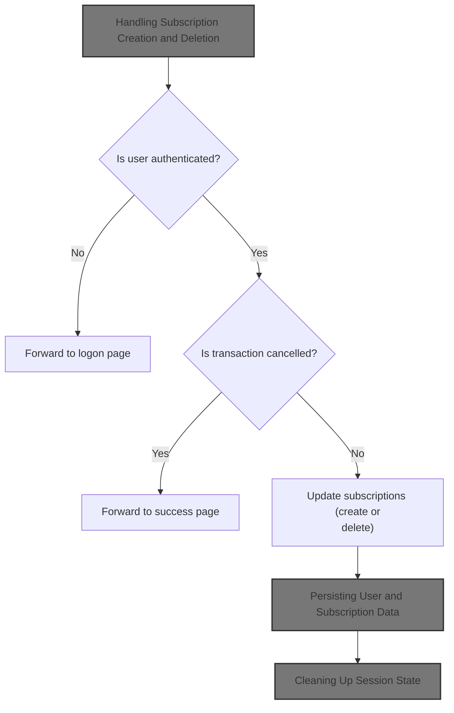
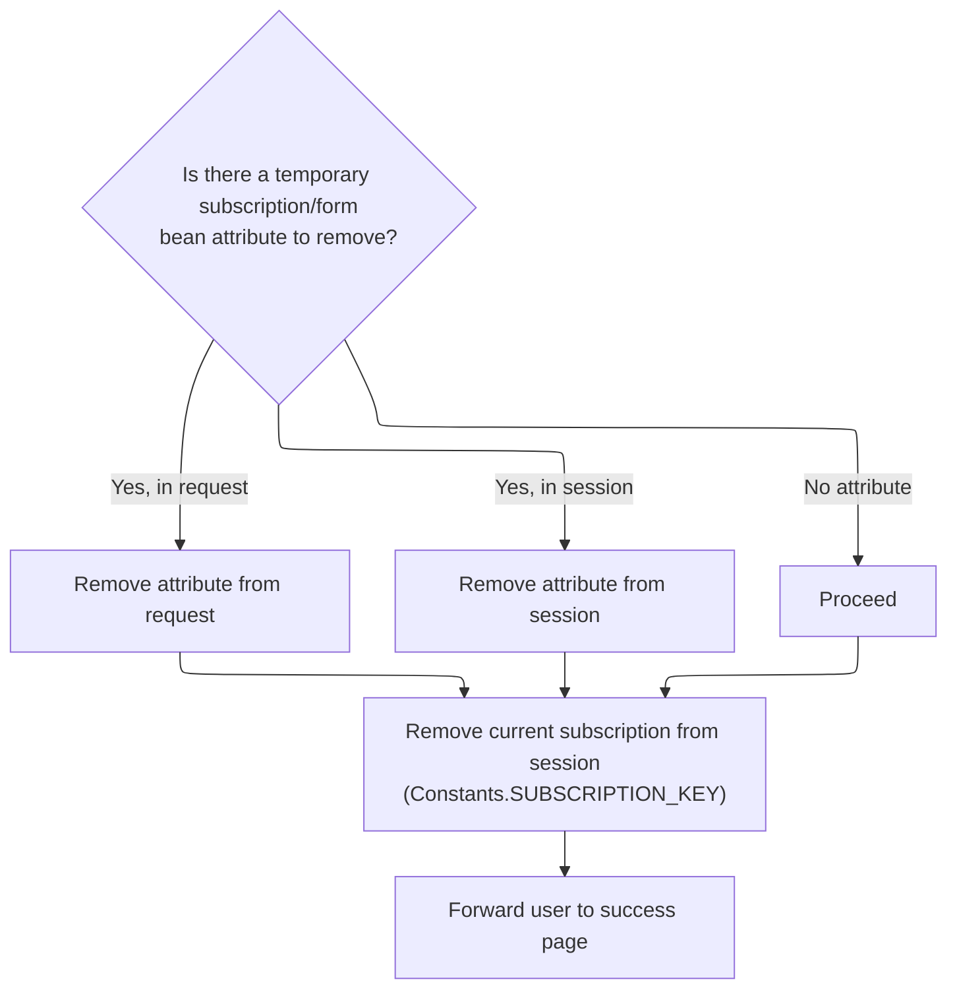

This document describes how user requests to create or delete subscriptions are processed. When a user submits a request, the system updates the user's subscriptions, saves the changes, removes any temporary session data, and forwards the user to a success page.



# Handling Subscription Creation and Deletion

<SwmSnippet path="/apps/faces-example1/src/main/java/org/apache/struts/webapp/example/SaveSubscriptionAction.java" line="82">

---

In `SaveSubscriptionAction.execute`, we're figuring out what the user wants to do (create or delete a subscription), making sure they're logged in, and handling cancellation. If the action is 'Create', we call into the user object to actually create the subscription, which is why we need to jump into <SwmToken path="apps/faces-example1/src/main/java/org/apache/struts/webapp/example/memory/MemoryUser.java" pos="41:6:6" line-data="public final class MemoryUser implements User {">`MemoryUser`</SwmToken> next—the user object owns the subscriptions and handles the logic for adding one.

```java
    public ActionForward execute(ActionMapping mapping,
                 ActionForm form,
                 HttpServletRequest request,
                 HttpServletResponse response)
    throws Exception {

    // Extract attributes and parameters we will need
    MessageResources messages = getResources(request);
    HttpSession session = request.getSession();
    SubscriptionForm subform = (SubscriptionForm) form;
    String action = subform.getAction();
    if (action == null) {
        action = "?";
        }
        if (log.isDebugEnabled()) {
            log.debug("SaveSubscriptionAction:  Processing " + action +
                      " action");
        }

    // Is there a currently logged on user?
    User user = (User) session.getAttribute(Constants.USER_KEY);
    if (user == null) {
            if (log.isTraceEnabled()) {
                log.trace(" User is not logged on in session "
                          + session.getId());
            }
        return (mapping.findForward("logon"));
        }

    // Was this transaction cancelled?
    if (isCancelled(request)) {
            if (log.isTraceEnabled()) {
                log.trace(" Transaction '" + action +
                          "' was cancelled");
            }
            session.removeAttribute(Constants.SUBSCRIPTION_KEY);
        return (mapping.findForward("success"));
    }

    // Is there a related Subscription object?
    Subscription subscription =
      (Subscription) session.getAttribute(Constants.SUBSCRIPTION_KEY);
        if ("Create".equals(action)) {
            if (log.isTraceEnabled()) {
                log.trace(" Creating subscription for mail server '" +
                          subform.getHost() + "'");
            }
            subscription =
                user.createSubscription(subform.getHost());
        }
    if (subscription == null) {
            if (log.isTraceEnabled()) {
                log.trace(" Missing subscription for user '" +
                          user.getUsername() + "'");
            }
        response.sendError(HttpServletResponse.SC_BAD_REQUEST,
                           messages.getMessage("error.noSubscription"));
        return (null);
    }

```

---

</SwmSnippet>

<SwmSnippet path="/apps/faces-example1/src/main/java/org/apache/struts/webapp/example/memory/MemoryUser.java" line="185">

---

<SwmToken path="apps/faces-example1/src/main/java/org/apache/struts/webapp/example/memory/MemoryUser.java" pos="185:5:5" line-data="    public Subscription createSubscription(String host) {">`createSubscription`</SwmToken> checks if the user already has a subscription for the given host and throws if it finds one, so you can't have duplicates. It also synchronizes on the subscriptions map to avoid race conditions, then creates and adds a new <SwmToken path="apps/faces-example1/src/main/java/org/apache/struts/webapp/example/memory/MemoryUser.java" pos="193:1:1" line-data="            MemorySubscription subscription =">`MemorySubscription`</SwmToken>. The nested sync block is a bit odd but doesn't change the locking behavior.

```java
    public Subscription createSubscription(String host) {

        synchronized (subscriptions) {
            if (subscriptions.get(host) != null) {
                throw new IllegalArgumentException("Duplicate host '" + host
                                                   + "' for user '" +
                                                   username + "'");
            }
            MemorySubscription subscription =
                new MemorySubscription(this, host);
            synchronized (subscriptions) {
                subscriptions.put(host, subscription);
            }
            return (subscription);
        }

    }
```

---

</SwmSnippet>

<SwmSnippet path="/apps/faces-example1/src/main/java/org/apache/struts/webapp/example/SaveSubscriptionAction.java" line="142">

---

Back in `SaveSubscriptionAction.execute`, after handling creation, if the action is 'Delete', we call into the user object again to remove the subscription. This step is needed to actually drop the subscription from the user's list, so we jump into <SwmToken path="apps/faces-example1/src/main/java/org/apache/struts/webapp/example/memory/MemoryUser.java" pos="41:6:6" line-data="public final class MemoryUser implements User {">`MemoryUser`</SwmToken> for the removal logic.

```java
    // Was this transaction a Delete?
    if (action.equals("Delete")) {
            if (log.isTraceEnabled()) {
                log.trace(" Deleting mail server '" +
                          subscription.getHost() + "' for user '" +
                          user.getUsername() + "'");
            }
            user.removeSubscription(subscription);
```

---

</SwmSnippet>

<SwmSnippet path="/apps/faces-example1/src/main/java/org/apache/struts/webapp/example/memory/MemoryUser.java" line="228">

---

<SwmToken path="apps/faces-example1/src/main/java/org/apache/struts/webapp/example/memory/MemoryUser.java" pos="228:5:5" line-data="    public void removeSubscription(Subscription subscription) {">`removeSubscription`</SwmToken> first checks that the subscription really belongs to this user, then synchronizes on the subscriptions map and removes it by host. This keeps things thread-safe and ensures only the right user's subscriptions are touched.

```java
    public void removeSubscription(Subscription subscription) {

        if (!(this == subscription.getUser())) {
            throw new IllegalArgumentException
                ("Subscription not associated with this user");
        }
        synchronized (subscriptions) {
            subscriptions.remove(subscription.getHost());
        }

    }
```

---

</SwmSnippet>

<SwmSnippet path="/apps/faces-example1/src/main/java/org/apache/struts/webapp/example/SaveSubscriptionAction.java" line="150">

---

Back in `SaveSubscriptionAction.execute`, after updating the user's subscriptions, we clear the session's subscription reference and call <SwmToken path="apps/faces-example1/src/main/java/org/apache/struts/webapp/example/SaveSubscriptionAction.java" pos="155:1:5" line-data="                database.save();">`database.save()`</SwmToken> to persist the changes. This step ensures the new state is written out, so we need to jump into <SwmToken path="apps/faces-example1/src/main/java/org/apache/struts/webapp/example/memory/MemoryUser.java" pos="54:5:5" line-data="    public MemoryUser(MemoryUserDatabase database, String username) {">`MemoryUserDatabase`</SwmToken> next.

```java
        session.removeAttribute(Constants.SUBSCRIPTION_KEY);
            try {
                UserDatabase database = (UserDatabase)
                    servlet.getServletContext().
                    getAttribute(Constants.DATABASE_KEY);
                database.save();
            } catch (Exception e) {
                log.error("Database save", e);
            }
        return (mapping.findForward("success"));
    }

    // All required validations were done by the form itself

    // Update the persistent subscription information
        if (log.isTraceEnabled()) {
            log.trace(" Populating database from form bean");
        }
        try {
            PropertyUtils.copyProperties(subscription, subform);
        } catch (InvocationTargetException e) {
            Throwable t = e.getTargetException();
            if (t == null)
                t = e;
            log.error("Subscription.populate", t);
            throw new ServletException("Subscription.populate", t);
        } catch (Throwable t) {
            log.error("Subscription.populate", t);
            throw new ServletException("Subscription.populate", t);
        }

        try {
            UserDatabase database = (UserDatabase)
                servlet.getServletContext().
                getAttribute(Constants.DATABASE_KEY);
            database.save();
        } catch (Exception e) {
            log.error("Database save", e);
        }

```

---

</SwmSnippet>

## Persisting User and Subscription Data

<SwmSnippet path="/apps/faces-example1/src/main/java/org/apache/struts/webapp/example/memory/MemoryUserDatabase.java" line="257">

---

In <SwmToken path="apps/faces-example1/src/main/java/org/apache/struts/webapp/example/memory/MemoryUserDatabase.java" pos="257:5:5" line-data="    public void save() throws Exception {">`save`</SwmToken>, the database writes all users and their subscriptions to a temporary XML file, then renames files to make the change atomic. This avoids corrupting the main file if something fails during the write. The XML output relies on the <SwmToken path="apps/faces-example1/src/main/java/org/apache/struts/webapp/example/memory/MemoryUser.java" pos="244:5:7" line-data="    public String toString() {">`toString()`</SwmToken> methods of User and Subscription.

```java
    public void save() throws Exception {

        if (log.isDebugEnabled()) {
            log.debug("Saving database to '" + pathname + "'");
        }
        File fileNew = new File(pathnameNew);
        PrintWriter writer = null;

        try {

            // Configure our PrintWriter
            FileOutputStream fos = new FileOutputStream(fileNew);
            OutputStreamWriter osw = new OutputStreamWriter(fos);
            writer = new PrintWriter(osw);

            // Print the file prolog
            writer.println("<?xml version='1.0'?>");
            writer.println("<database>");

            // Print entries for each defined user and associated subscriptions
            User users[] = findUsers();
            for (int i = 0; i < users.length; i++) {
                writer.print("  ");
                writer.println(users[i]);
                Subscription subscriptions[] =
                    users[i].getSubscriptions();
                for (int j = 0; j < subscriptions.length; j++) {
                    writer.print("    ");
                    writer.println(subscriptions[j]);
                    writer.print("    ");
                    writer.println("</subscription>");
                }
                writer.print("  ");
                writer.println("</user>");
            }
```

---

</SwmSnippet>

<SwmSnippet path="/apps/faces-example1/src/main/java/org/apache/struts/webapp/example/memory/MemoryUserDatabase.java" line="293">

---

After writing the XML, we check for write errors. If something went wrong, we clean up the temp file and bail out before touching the main database file. Next, we need to handle closing and renaming files.

```java
            // Print the file epilog
            writer.println("</database>");

            // Check for errors that occurred while printing
            if (writer.checkError()) {
                writer.close();
```

---

</SwmSnippet>

<SwmSnippet path="/apps/faces-example1/src/main/java/org/apache/struts/webapp/example/memory/MemoryUserDatabase.java" line="106">

---

<SwmToken path="apps/faces-example1/src/main/java/org/apache/struts/webapp/example/memory/MemoryUserDatabase.java" pos="106:5:5" line-data="    public void close() throws Exception {">`close`</SwmToken> just calls <SwmToken path="apps/faces-example1/src/main/java/org/apache/struts/webapp/example/memory/MemoryUserDatabase.java" pos="108:1:1" line-data="        save();">`save`</SwmToken> to make sure all changes are written out. This keeps the database consistent when it's closed.

```java
    public void close() throws Exception {

        save();

    }
```

---

</SwmSnippet>

<SwmSnippet path="/apps/faces-example1/src/main/java/org/apache/struts/webapp/example/memory/MemoryUserDatabase.java" line="299">

---

After returning from `MemoryUserDatabase.save`, if there was a write error, we delete the temp file and throw an exception. Next, we need to handle any cleanup or further error handling, which leads us into RegistrationBacking.

```java
                fileNew.delete();
                throw new IOException
                    ("Saving database to '" + pathname + "'");
            }
```

---

</SwmSnippet>

### User Deletion Logic

See <SwmLink doc-title="Deleting a subscription">[Deleting a subscription](/.swm/deleting-a-subscription.2hzpk5kk.sw.md)</SwmLink>

### Finalizing Database Persistence

```mermaid
%%{init: {"flowchart": {"defaultRenderer": "elk"}} }%%
flowchart TD
    node1["Attempt to write user database to a new
file"]
    click node1 openCode "apps/faces-example1/src/main/java/org/apache/struts/webapp/example/memory/MemoryUserDatabase.java:303:305"
    node1 --> node2{"Did an error occur during writing?"}
    click node2 openCode "apps/faces-example1/src/main/java/org/apache/struts/webapp/example/memory/MemoryUserDatabase.java:306:312"
    node2 -->|"Yes"| node3["Delete temporary file and report error"]
    click node3 openCode "apps/faces-example1/src/main/java/org/apache/struts/webapp/example/memory/MemoryUserDatabase.java:311:312"
    node2 -->|"No"| node4{"Does the original file exist?"}
    click node4 openCode "apps/faces-example1/src/main/java/org/apache/struts/webapp/example/memory/MemoryUserDatabase.java:320:326"
    node4 -->|"Yes"| node5["Rename original file to backup"]
    click node5 openCode "apps/faces-example1/src/main/java/org/apache/struts/webapp/example/memory/MemoryUserDatabase.java:321:325"
    node5 --> node6{"Did renaming succeed?"}
    click node6 openCode "apps/faces-example1/src/main/java/org/apache/struts/webapp/example/memory/MemoryUserDatabase.java:322:325"
    node6 -->|"No"| node7["Report error and stop"]
    click node7 openCode "apps/faces-example1/src/main/java/org/apache/struts/webapp/example/memory/MemoryUserDatabase.java:323:325"
    node6 -->|"Yes"| node8["Rename new file to original"]
    click node8 openCode "apps/faces-example1/src/main/java/org/apache/struts/webapp/example/memory/MemoryUserDatabase.java:327:333"
    node4 -->|"No"| node8
    node8 --> node9{"Did renaming succeed?"}
    click node9 openCode "apps/faces-example1/src/main/java/org/apache/struts/webapp/example/memory/MemoryUserDatabase.java:327:333"
    node9 -->|"No"| node10["Restore backup as original and report
error"]
    click node10 openCode "apps/faces-example1/src/main/java/org/apache/struts/webapp/example/memory/MemoryUserDatabase.java:328:332"
    node9 -->|"Yes"| node11["Delete backup file"]
    click node11 openCode "apps/faces-example1/src/main/java/org/apache/struts/webapp/example/memory/MemoryUserDatabase.java:334:334"
    node3 --> node12["End"]
    node7 --> node12
    node10 --> node12
    node11 --> node12
    node12["End"]
classDef HeadingStyle fill:#777777,stroke:#333,stroke-width:2px;

%% Swimm:
%% %%{init: {"flowchart": {"defaultRenderer": "elk"}} }%%
%% flowchart TD
%%     node1["Attempt to write user database to a new
%% file"]
%%     click node1 openCode "<SwmPath>[apps/…/memory/MemoryUserDatabase.java](apps/faces-example1/src/main/java/org/apache/struts/webapp/example/memory/MemoryUserDatabase.java)</SwmPath>:303:305"
%%     node1 --> node2{"Did an error occur during writing?"}
%%     click node2 openCode "<SwmPath>[apps/…/memory/MemoryUserDatabase.java](apps/faces-example1/src/main/java/org/apache/struts/webapp/example/memory/MemoryUserDatabase.java)</SwmPath>:306:312"
%%     node2 -->|"Yes"| node3["Delete temporary file and report error"]
%%     click node3 openCode "<SwmPath>[apps/…/memory/MemoryUserDatabase.java](apps/faces-example1/src/main/java/org/apache/struts/webapp/example/memory/MemoryUserDatabase.java)</SwmPath>:311:312"
%%     node2 -->|"No"| node4{"Does the original file exist?"}
%%     click node4 openCode "<SwmPath>[apps/…/memory/MemoryUserDatabase.java](apps/faces-example1/src/main/java/org/apache/struts/webapp/example/memory/MemoryUserDatabase.java)</SwmPath>:320:326"
%%     node4 -->|"Yes"| node5["Rename original file to backup"]
%%     click node5 openCode "<SwmPath>[apps/…/memory/MemoryUserDatabase.java](apps/faces-example1/src/main/java/org/apache/struts/webapp/example/memory/MemoryUserDatabase.java)</SwmPath>:321:325"
%%     node5 --> node6{"Did renaming succeed?"}
%%     click node6 openCode "<SwmPath>[apps/…/memory/MemoryUserDatabase.java](apps/faces-example1/src/main/java/org/apache/struts/webapp/example/memory/MemoryUserDatabase.java)</SwmPath>:322:325"
%%     node6 -->|"No"| node7["Report error and stop"]
%%     click node7 openCode "<SwmPath>[apps/…/memory/MemoryUserDatabase.java](apps/faces-example1/src/main/java/org/apache/struts/webapp/example/memory/MemoryUserDatabase.java)</SwmPath>:323:325"
%%     node6 -->|"Yes"| node8["Rename new file to original"]
%%     click node8 openCode "<SwmPath>[apps/…/memory/MemoryUserDatabase.java](apps/faces-example1/src/main/java/org/apache/struts/webapp/example/memory/MemoryUserDatabase.java)</SwmPath>:327:333"
%%     node4 -->|"No"| node8
%%     node8 --> node9{"Did renaming succeed?"}
%%     click node9 openCode "<SwmPath>[apps/…/memory/MemoryUserDatabase.java](apps/faces-example1/src/main/java/org/apache/struts/webapp/example/memory/MemoryUserDatabase.java)</SwmPath>:327:333"
%%     node9 -->|"No"| node10["Restore backup as original and report
%% error"]
%%     click node10 openCode "<SwmPath>[apps/…/memory/MemoryUserDatabase.java](apps/faces-example1/src/main/java/org/apache/struts/webapp/example/memory/MemoryUserDatabase.java)</SwmPath>:328:332"
%%     node9 -->|"Yes"| node11["Delete backup file"]
%%     click node11 openCode "<SwmPath>[apps/…/memory/MemoryUserDatabase.java](apps/faces-example1/src/main/java/org/apache/struts/webapp/example/memory/MemoryUserDatabase.java)</SwmPath>:334:334"
%%     node3 --> node12["End"]
%%     node7 --> node12
%%     node10 --> node12
%%     node11 --> node12
%%     node12["End"]
%% classDef HeadingStyle fill:#777777,stroke:#333,stroke-width:2px;
```



<SwmSnippet path="/apps/faces-example1/src/main/java/org/apache/struts/webapp/example/memory/MemoryUserDatabase.java" line="303">

---

After returning from `RegistrationBacking`, we close the writer to flush everything to disk and clean up resources. If there was an error, we handle it here before moving on to the final file renaming in <SwmToken path="apps/faces-example1/src/main/java/org/apache/struts/webapp/example/memory/MemoryUser.java" pos="54:5:5" line-data="    public MemoryUser(MemoryUserDatabase database, String username) {">`MemoryUserDatabase`</SwmToken>.

```java
            writer.close();
            writer = null;

        } catch (IOException e) {

            if (writer != null) {
                writer.close();
            }
```

---

</SwmSnippet>

<SwmSnippet path="/apps/faces-example1/src/main/java/org/apache/struts/webapp/example/memory/MemoryUserDatabase.java" line="311">

---

After returning from <SwmToken path="apps/faces-example1/src/main/java/org/apache/struts/webapp/example/memory/MemoryUser.java" pos="54:5:5" line-data="    public MemoryUser(MemoryUserDatabase database, String username) {">`MemoryUserDatabase`</SwmToken>, we do the final file renames: the old file becomes a backup, the new file replaces the original, and the backup is deleted. This makes the save atomic and avoids corrupting the database. If anything fails, we try to roll back to the previous state. Next, we might need to update other app state, which could involve RegistrationBacking.

```java
            fileNew.delete();
            throw e;

        }


        // Perform the required renames to permanently save this file
        File fileOrig = new File(pathname);
        File fileOld = new File(pathnameOld);
        if (fileOrig.exists()) {
            fileOld.delete();
            if (!fileOrig.renameTo(fileOld)) {
                throw new IOException
                    ("Renaming '" + pathname + "' to '" + pathnameOld + "'");
            }
        }
        if (!fileNew.renameTo(fileOrig)) {
            if (fileOld.exists()) {
                fileOld.renameTo(fileOrig);
            }
            throw new IOException
                ("Renaming '" + pathnameNew + "' to '" + pathname + "'");
        }
        fileOld.delete();

    }
```

---

</SwmSnippet>

## Cleaning Up Session State



<SwmSnippet path="/apps/faces-example1/src/main/java/org/apache/struts/webapp/example/SaveSubscriptionAction.java" line="190">

---

After returning from `MemoryUserDatabase.save`, `SaveSubscriptionAction.execute` removes the form bean and subscription from the session or request, depending on the mapping's scope. To know which attribute to remove, we need to check <SwmToken path="core/src/main/java/org/apache/struts/config/ActionConfig.java" pos="41:4:4" line-data="public class ActionConfig extends BaseConfig {">`ActionConfig`</SwmToken> next.

```java
    // Remove the obsolete form bean and current subscription
    if (mapping.getAttribute() != null) {
            if ("request".equals(mapping.getScope()))
                request.removeAttribute(mapping.getAttribute());
            else
                session.removeAttribute(mapping.getAttribute());
        }
```

---

</SwmSnippet>

<SwmSnippet path="/core/src/main/java/org/apache/struts/config/ActionConfig.java" line="321">

---

<SwmToken path="core/src/main/java/org/apache/struts/config/ActionConfig.java" pos="321:5:5" line-data="    public String getAttribute() {">`getAttribute`</SwmToken> returns the attribute name if set, otherwise falls back to the action's name. This guarantees we always have a key to remove from the session or request during cleanup.

```java
    public String getAttribute() {
        if (this.attribute == null) {
            return (this.name);
        } else {
            return (this.attribute);
        }
    }
```

---

</SwmSnippet>

<SwmSnippet path="/apps/faces-example1/src/main/java/org/apache/struts/webapp/example/SaveSubscriptionAction.java" line="197">

---

After checking the attribute name, `SaveSubscriptionAction.execute` does a final cleanup by removing <SwmToken path="apps/faces-example1/src/main/java/org/apache/struts/webapp/example/SaveSubscriptionAction.java" pos="197:7:7" line-data="    session.removeAttribute(Constants.SUBSCRIPTION_KEY);">`SUBSCRIPTION_KEY`</SwmToken> from the session and then forwards to the success page. This wraps up the flow and avoids stale session data.

```java
    session.removeAttribute(Constants.SUBSCRIPTION_KEY);

    // Forward control to the specified success URI
        if (log.isTraceEnabled()) {
            log.trace(" Forwarding to success page");
        }
    return (mapping.findForward("success"));

    }
```

---

</SwmSnippet>

&nbsp;

*This is an auto-generated document by Swimm 🌊 and has not yet been verified by a human*

<SwmMeta version="3.0.0" repo-id="Z2l0aHViJTNBJTNBc3RydXRzMSUzQSUzQVN3aW1tLURlbW8=" repo-name="struts1"><sup>Powered by [Swimm](https://app.swimm.io/)</sup></SwmMeta>
