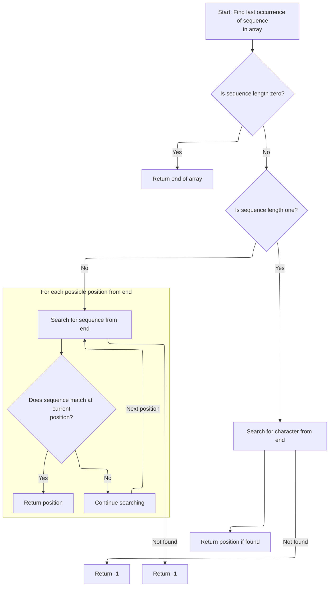
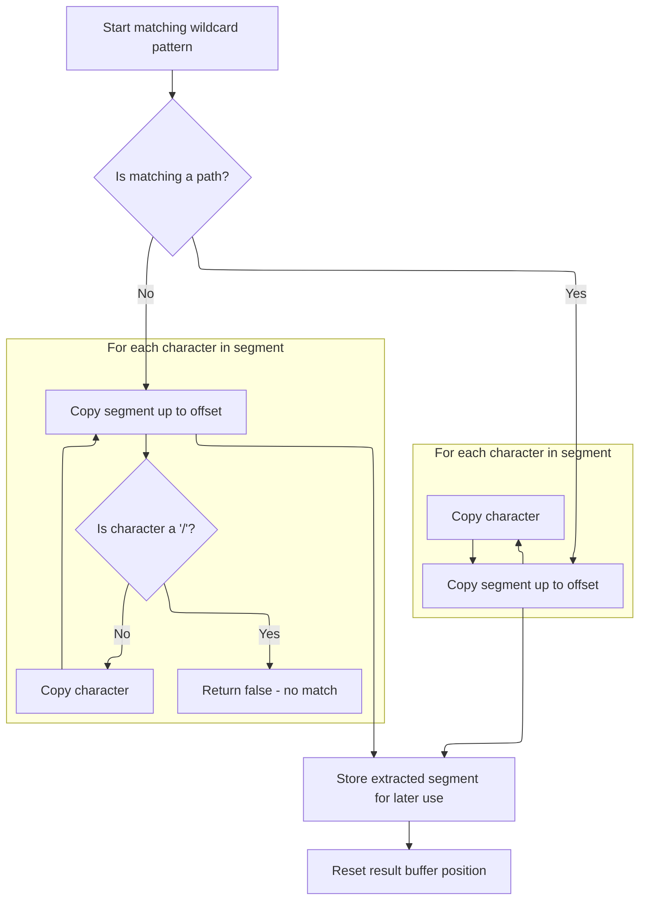

This document describes how the system matches an incoming path to a configured action using wildcard patterns. The flow supports dynamic routing by extracting variables from the path and building the corresponding action configuration when a match is found.

# Finding a Matching <SwmToken path="core/src/main/java/org/apache/struts/config/ActionConfigMatcher.java" pos="101:3:3" line-data="    public ActionConfig match(String path) {">`ActionConfig`</SwmToken>

<SwmSnippet path="/core/src/main/java/org/apache/struts/config/ActionConfigMatcher.java" line="101">

---

In <SwmToken path="core/src/main/java/org/apache/struts/config/ActionConfigMatcher.java" pos="101:5:5" line-data="    public ActionConfig match(String path) {">`match`</SwmToken>, we're looping through all compiled path patterns and trying to match the incoming path against each one. Before we can decide if a pattern fits, we need to actually perform the wildcard matching, which is why we call into <SwmToken path="core/src/main/java/org/apache/struts/config/ActionConfigMatcher.java" pos="27:10:10" line-data="import org.apache.struts.util.WildcardHelper;">`WildcardHelper`</SwmToken>. That call checks if the path fits the wildcard pattern and extracts any variables if it does.

```java
    public ActionConfig match(String path) {
        ActionConfig config = null;

        if (compiledPaths.size() > 0) {
            if (log.isDebugEnabled()) {
                log.debug("Attempting to match '" + path
                    + "' to a wildcard pattern");
            }

            if ((path.length() > 0) && (path.charAt(0) == '/')) {
                path = path.substring(1);
            }

            Mapping m;
            HashMap vars = new HashMap();

            for (Iterator i = compiledPaths.iterator(); i.hasNext();) {
                m = (Mapping) i.next();

                if (wildcard.match(vars, path, m.getPattern())) {
                    if (log.isDebugEnabled()) {
                        log.debug("Path matches pattern '"
                            + m.getActionConfig().getPath() + "'");
                    }

```

---

</SwmSnippet>

## Wildcard Pattern Matching

<SwmSnippet path="/core/src/main/java/org/apache/struts/util/WildcardHelper.java" line="159">

---

In <SwmToken path="core/src/main/java/org/apache/struts/util/WildcardHelper.java" pos="159:5:5" line-data="    public boolean match(Map map, String data, int[] expr) {">`match`</SwmToken>, we're setting up the buffers and positions for the matching process. The code checks for nulls, converts the input string to a char array, and prepares to walk through the pattern expression. It also checks if the pattern starts with a <SwmToken path="core/src/main/java/org/apache/struts/util/WildcardHelper.java" pos="193:9:9" line-data="        // First check for MATCH_BEGIN">`MATCH_BEGIN`</SwmToken> constant, which means the match must start at the beginning of the input. The function assumes the expr array is well-formed and uses MATCH\_\* constants to control the matching logic.

```java
    public boolean match(Map map, String data, int[] expr) {
        if (map == null) {
            throw new NullPointerException("No map provided");
        }

        if (data == null) {
            throw new NullPointerException("No data provided");
        }

        if (expr == null) {
            throw new NullPointerException("No pattern expression provided");
        }

        char[] buff = data.toCharArray();

        // Allocate the result buffer
        char[] rslt = new char[expr.length + buff.length];

        // The previous and current position of the expression character
        // (MATCH_*)
        int charpos = 0;

        // The position in the expression, input, translation and result arrays
        int exprpos = 0;
        int buffpos = 0;
        int rsltpos = 0;
        int offset = -1;

        // The matching count
        int mcount = 0;

        // We want the complete data be in {0}
        map.put(Integer.toString(mcount), data);

        // First check for MATCH_BEGIN
        boolean matchBegin = false;

        if (expr[charpos] == MATCH_BEGIN) {
            matchBegin = true;
            exprpos = ++charpos;
        }

        // Search the fist expression character (except MATCH_BEGIN - already
        // skipped)
        while (expr[charpos] >= 0) {
            charpos++;
        }
```

---

</SwmSnippet>

<SwmSnippet path="/core/src/main/java/org/apache/struts/util/WildcardHelper.java" line="207">

---

Here we're starting the main matching loop. The code figures out which special MATCH\_\* constant is next in the pattern and then checks if the current segment of the input matches the pattern segment. The logic depends on the expr array being well-formed, with negative values marking the end of segments.

```java
        // The expression charater (MATCH_*)
        int exprchr = expr[charpos];

        while (true) {
            // Check if the data in the expression array before the current
            // expression character matches the data in the input buffer
            if (matchBegin) {
                if (!matchArray(expr, exprpos, charpos, buff, buffpos)) {
                    return (false);
                }

                matchBegin = false;
            } else {
                offset = indexOfArray(expr, exprpos, charpos, buff, buffpos);

                if (offset < 0) {
                    return (false);
                }
            }

            // Check for MATCH_BEGIN
            if (matchBegin) {
                if (offset != 0) {
                    return (false);
                }

                matchBegin = false;
            }

            // Advance buffpos
            buffpos += (charpos - exprpos);

            // Check for END's
            if (exprchr == MATCH_END) {
                if (rsltpos > 0) {
                    map.put(Integer.toString(++mcount),
                        new String(rslt, 0, rsltpos));
                }

                // Don't care about rest of input buffer
                return (true);
            } else if (exprchr == MATCH_THEEND) {
                if (rsltpos > 0) {
                    map.put(Integer.toString(++mcount),
                        new String(rslt, 0, rsltpos));
                }

                // Check that we reach buffer's end
                return (buffpos == buff.length);
            }

            // Search the next expression character
            exprpos = ++charpos;

            while (expr[charpos] >= 0) {
                charpos++;
            }
```

---

</SwmSnippet>

<SwmSnippet path="/core/src/main/java/org/apache/struts/util/WildcardHelper.java" line="265">

---

This part decides how to search for the next matching segment in the input, using either <SwmToken path="core/src/main/java/org/apache/struts/util/WildcardHelper.java" pos="272:3:3" line-data="                ? indexOfArray(expr, exprpos, charpos, buff, buffpos)">`indexOfArray`</SwmToken> or <SwmToken path="core/src/main/java/org/apache/struts/util/WildcardHelper.java" pos="273:3:3" line-data="                : lastIndexOfArray(expr, exprpos, charpos, buff, buffpos);">`lastIndexOfArray`</SwmToken> depending on the wildcard type. This is where we need to call <SwmToken path="core/src/main/java/org/apache/struts/util/WildcardHelper.java" pos="273:3:3" line-data="                : lastIndexOfArray(expr, exprpos, charpos, buff, buffpos);">`lastIndexOfArray`</SwmToken> to handle patterns that can match multiple segments, like '\*\*'.

```java
            int prevchr = exprchr;

            exprchr = expr[charpos];

            // We have here prevchr == * or **.
            offset =
                (prevchr == MATCH_FILE)
                ? indexOfArray(expr, exprpos, charpos, buff, buffpos)
                : lastIndexOfArray(expr, exprpos, charpos, buff, buffpos);

            if (offset < 0) {
                return (false);
            }

```

---

</SwmSnippet>

### Finding the Last Pattern Match



<SwmSnippet path="/core/src/main/java/org/apache/struts/util/WildcardHelper.java" line="380">

---

In <SwmToken path="core/src/main/java/org/apache/struts/util/WildcardHelper.java" pos="380:5:5" line-data="    protected int lastIndexOfArray(int[] r, int rpos, int rend, char[] d,">`lastIndexOfArray`</SwmToken>, we're handling the search for the last occurrence of a pattern segment in the input. If the segment is zero-length, we treat it as matching at the end of the input. For single characters, we scan backwards for a match. For longer segments, we brute-force search from the end towards the start. The function assumes the input arrays and positions are valid.

```java
    protected int lastIndexOfArray(int[] r, int rpos, int rend, char[] d,
        int dpos) {
        // Check if pos and len are legal
        if (rend < rpos) {
            throw new IllegalArgumentException("rend < rpos");
        }

        // If we need to match a zero length string return current dpos
        if (rend == rpos) {
            return (d.length); //?? dpos?
        }

        // If we need to match a 1 char length string do it simply
        if ((rend - rpos) == 1) {
            // Search for the specified character
            for (int x = d.length - 1; x > dpos; x--) {
                if (r[rpos] == d[x]) {
                    return (x);
                }
            }
```

---

</SwmSnippet>

<SwmSnippet path="/core/src/main/java/org/apache/struts/util/WildcardHelper.java" line="402">

---

Here we're running the main loop that actually checks for the last occurrence of the pattern segment in the input. If it finds a match, it returns the position; otherwise, it keeps searching backward until it runs out of input.

```java
        // Main string matching loop. It gets executed if the characters to
        // match are less then the characters left in the d buffer
        int l = d.length - (rend - rpos);

        while (l >= dpos) {
            // Set current startpoint in d
            int y = l;

            // Check every character in d for equity. If the string is matched
            // return dpos
            for (int x = rpos; x <= rend; x++) {
                if (x == rend) {
                    return (l);
                }

                if (r[x] != d[y++]) {
                    break;
                }
            }

            // Decrease l to search for the same string at next offset
            l--;
        }
```

---

</SwmSnippet>

### Capturing Matched Segments



<SwmSnippet path="/core/src/main/java/org/apache/struts/util/WildcardHelper.java" line="279">

---

We just got back from <SwmToken path="core/src/main/java/org/apache/struts/util/WildcardHelper.java" pos="273:3:3" line-data="                : lastIndexOfArray(expr, exprpos, charpos, buff, buffpos);">`lastIndexOfArray`</SwmToken> in <SwmToken path="core/src/main/java/org/apache/struts/config/ActionConfigMatcher.java" pos="27:10:10" line-data="import org.apache.struts.util.WildcardHelper;">`WildcardHelper`</SwmToken>, so now we're copying the matched segment from the input buffer into the result buffer. This is how we capture the part of the input that matched the wildcard segment.

```java
            // Copy the data from the source buffer into the result buffer
            // to substitute the expression character
            if (prevchr == MATCH_PATH) {
                while (buffpos < offset) {
                    rslt[rsltpos++] = buff[buffpos++];
                }
```

---

</SwmSnippet>

<SwmSnippet path="/core/src/main/java/org/apache/struts/util/WildcardHelper.java" line="286">

---

Here we're handling the case where the wildcard is a file match. We copy the matched segment unless we hit a '/', which would break the file match. This keeps the matching logic strict for file segments.

```java
                // Matching file, don't copy '/'
                while (buffpos < offset) {
                    if (buff[buffpos] == '/') {
                        return (false);
                    }

                    rslt[rsltpos++] = buff[buffpos++];
                }
```

---

</SwmSnippet>

<SwmSnippet path="/core/src/main/java/org/apache/struts/util/WildcardHelper.java" line="296">

---

Finally, after each segment is matched and copied, we store the captured substring in the map for later use. The function returns true if all pattern segments match according to the rules defined by the MATCH\_\* constants.

```java
            map.put(Integer.toString(++mcount), new String(rslt, 0, rsltpos));
            rsltpos = 0;
        }
    }
```

---

</SwmSnippet>

## Building the Final <SwmToken path="core/src/main/java/org/apache/struts/config/ActionConfigMatcher.java" pos="101:3:3" line-data="    public ActionConfig match(String path) {">`ActionConfig`</SwmToken>

<SwmSnippet path="/core/src/main/java/org/apache/struts/config/ActionConfigMatcher.java" line="126">

---

Back in `ActionConfigMatcher.match`, we just got a successful match from WildcardHelper.match. Now we call <SwmToken path="core/src/main/java/org/apache/struts/config/ActionConfigMatcher.java" pos="128:1:1" line-data="                	    convertActionConfig(path,">`convertActionConfig`</SwmToken> to build a new <SwmToken path="core/src/main/java/org/apache/struts/config/ActionConfigMatcher.java" pos="129:2:2" line-data="                		    (ActionConfig) m.getActionConfig(), vars);">`ActionConfig`</SwmToken> using the captured variables. This step applies the extracted values to create a config that's ready for use.

```java
                    try {
                	config =
                	    convertActionConfig(path,
                		    (ActionConfig) m.getActionConfig(), vars);
                    } catch (IllegalStateException e) {
                	log.warn("Path matches pattern '"
                		+ m.getActionConfig().getPath() + "' but is "
                		+ "incompatible with the matching config due "
                		+ "to recursive substitution: "
                		+ path);
                	config = null;
                    }
                }
            }
        }

        return config;
    }
```

---

</SwmSnippet>

&nbsp;

*This is an auto-generated document by Swimm 🌊 and has not yet been verified by a human*

<SwmMeta version="3.0.0" repo-id="Z2l0aHViJTNBJTNBc3RydXRzMSUzQSUzQVN3aW1tLURlbW8=" repo-name="struts1"><sup>Powered by [Swimm](https://app.swimm.io/)</sup></SwmMeta>
