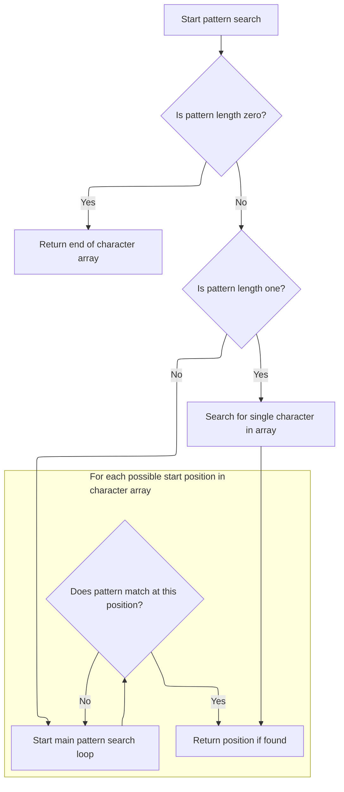
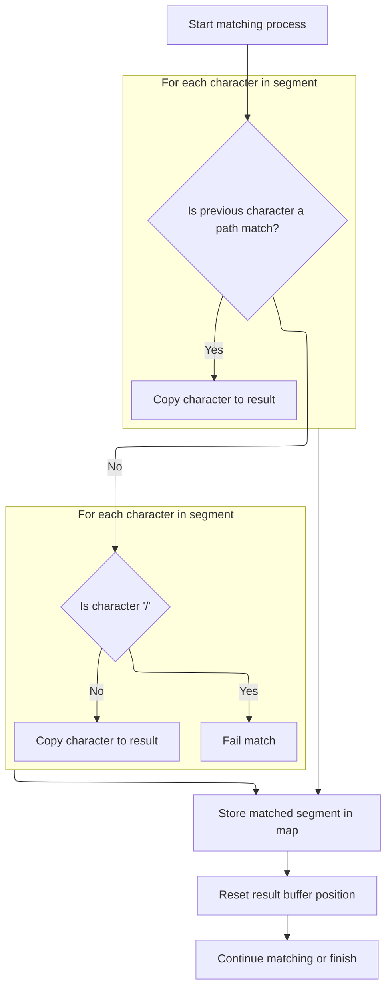

```mermaid
%%{init: {"flowchart": {"defaultRenderer": "elk"}} }%%
flowchart TD
    node1["Start: Prepare new action configuration"] --> node2["Substitute variables in main fields
using vars"]
    click node1 openCode "core/src/main/java/org/apache/struts/config/ActionConfigMatcher.java:179:188"
    click node2 openCode "core/src/main/java/org/apache/struts/config/ActionConfigMatcher.java:179:188"
    node2 --> node3["Process forward configurations"]
    click node3 openCode "core/src/main/java/org/apache/struts/config/ActionConfigMatcher.java:190:213"

    subgraph loop1["For each forward configuration"]
        node3 --> node4["Clone forward config"]
        click node4 openCode "core/src/main/java/org/apache/struts/config/ActionConfigMatcher.java:195:195"
        node4 --> node5{"Clone successful?"}
        click node5 openCode "core/src/main/java/org/apache/struts/config/ActionConfigMatcher.java:196:200"
        node5 -->|"No"| node10["Abort and return null"]
        click node10 openCode "core/src/main/java/org/apache/struts/config/ActionConfigMatcher.java:199:200"
        node5 -->|"Yes"| node6["Substitute variables in forward config
fields using vars"]
        click node6 openCode "core/src/main/java/org/apache/struts/config/ActionConfigMatcher.java:201:207"
        node6 --> node7["Substitute variables in forward config
properties using vars"]
        click node7 openCode "core/src/main/java/org/apache/struts/config/ActionConfigMatcher.java:208:209"
        node7 --> node8["Add transformed forward config"]
        click node8 openCode "core/src/main/java/org/apache/struts/config/ActionConfigMatcher.java:211:212"
        node8 --> node3
    end

    node3 --> node9["Process exception configurations"]
    click node9 openCode "core/src/main/java/org/apache/struts/config/ActionConfigMatcher.java:217:221"

    subgraph loop2["For each exception configuration"]
        node9 --> node11["Add exception config"]
        click node11 openCode "core/src/main/java/org/apache/struts/config/ActionConfigMatcher.java:220:220"
        node11 --> node9
    end

    node9 --> node12["Finalize (freeze) and return
configuration"]
    click node12 openCode "core/src/main/java/org/apache/struts/config/ActionConfigMatcher.java:223:225"

classDef HeadingStyle fill:#777777,stroke:#333,stroke-width:2px;

%% Swimm:
%% %%{init: {"flowchart": {"defaultRenderer": "elk"}} }%%
%% flowchart TD
%%     node1["Start: Prepare new action configuration"] --> node2["Substitute variables in main fields
%% using vars"]
%%     click node1 openCode "<SwmPath>[core/…/config/ActionConfigMatcher.java](core/src/main/java/org/apache/struts/config/ActionConfigMatcher.java)</SwmPath>:179:188"
%%     click node2 openCode "<SwmPath>[core/…/config/ActionConfigMatcher.java](core/src/main/java/org/apache/struts/config/ActionConfigMatcher.java)</SwmPath>:179:188"
%%     node2 --> node3["Process forward configurations"]
%%     click node3 openCode "<SwmPath>[core/…/config/ActionConfigMatcher.java](core/src/main/java/org/apache/struts/config/ActionConfigMatcher.java)</SwmPath>:190:213"
%% 
%%     subgraph loop1["For each forward configuration"]
%%         node3 --> node4["Clone forward config"]
%%         click node4 openCode "<SwmPath>[core/…/config/ActionConfigMatcher.java](core/src/main/java/org/apache/struts/config/ActionConfigMatcher.java)</SwmPath>:195:195"
%%         node4 --> node5{"Clone successful?"}
%%         click node5 openCode "<SwmPath>[core/…/config/ActionConfigMatcher.java](core/src/main/java/org/apache/struts/config/ActionConfigMatcher.java)</SwmPath>:196:200"
%%         node5 -->|"No"| node10["Abort and return null"]
%%         click node10 openCode "<SwmPath>[core/…/config/ActionConfigMatcher.java](core/src/main/java/org/apache/struts/config/ActionConfigMatcher.java)</SwmPath>:199:200"
%%         node5 -->|"Yes"| node6["Substitute variables in forward config
%% fields using vars"]
%%         click node6 openCode "<SwmPath>[core/…/config/ActionConfigMatcher.java](core/src/main/java/org/apache/struts/config/ActionConfigMatcher.java)</SwmPath>:201:207"
%%         node6 --> node7["Substitute variables in forward config
%% properties using vars"]
%%         click node7 openCode "<SwmPath>[core/…/config/ActionConfigMatcher.java](core/src/main/java/org/apache/struts/config/ActionConfigMatcher.java)</SwmPath>:208:209"
%%         node7 --> node8["Add transformed forward config"]
%%         click node8 openCode "<SwmPath>[core/…/config/ActionConfigMatcher.java](core/src/main/java/org/apache/struts/config/ActionConfigMatcher.java)</SwmPath>:211:212"
%%         node8 --> node3
%%     end
%% 
%%     node3 --> node9["Process exception configurations"]
%%     click node9 openCode "<SwmPath>[core/…/config/ActionConfigMatcher.java](core/src/main/java/org/apache/struts/config/ActionConfigMatcher.java)</SwmPath>:217:221"
%% 
%%     subgraph loop2["For each exception configuration"]
%%         node9 --> node11["Add exception config"]
%%         click node11 openCode "<SwmPath>[core/…/config/ActionConfigMatcher.java](core/src/main/java/org/apache/struts/config/ActionConfigMatcher.java)</SwmPath>:220:220"
%%         node11 --> node9
%%     end
%% 
%%     node9 --> node12["Finalize (freeze) and return
%% configuration"]
%%     click node12 openCode "<SwmPath>[core/…/config/ActionConfigMatcher.java](core/src/main/java/org/apache/struts/config/ActionConfigMatcher.java)</SwmPath>:223:225"
%% 
%% classDef HeadingStyle fill:#777777,stroke:#333,stroke-width:2px;
```

This document describes how input paths are matched against configured patterns to enable dynamic routing and flexible configuration. When a match is found, variables are extracted from the path and used to build a customized configuration object for further processing.

# Matching the input path against configured patterns

<SwmSnippet path="/core/src/main/java/org/apache/struts/config/ActionConfigMatcher.java" line="101">

---

In <SwmToken path="core/src/main/java/org/apache/struts/config/ActionConfigMatcher.java" pos="101:5:5" line-data="    public ActionConfig match(String path) {">`match`</SwmToken>, we strip the leading slash from the input path and loop through all compiled wildcard patterns. For each pattern, we call WildcardHelper.match to check if the path fits. If it matches, we use the variables from the match to customize the <SwmToken path="core/src/main/java/org/apache/struts/config/ActionConfigMatcher.java" pos="101:3:3" line-data="    public ActionConfig match(String path) {">`ActionConfig`</SwmToken>. Calling <SwmToken path="core/src/main/java/org/apache/struts/config/ActionConfigMatcher.java" pos="27:10:10" line-data="import org.apache.struts.util.WildcardHelper;">`WildcardHelper`</SwmToken> here is necessary because it handles the actual pattern matching and variable extraction.

```java
    public ActionConfig match(String path) {
        ActionConfig config = null;

        if (compiledPaths.size() > 0) {
            if (log.isDebugEnabled()) {
                log.debug("Attempting to match '" + path
                    + "' to a wildcard pattern");
            }

            if ((path.length() > 0) && (path.charAt(0) == '/')) {
                path = path.substring(1);
            }

            Mapping m;
            HashMap vars = new HashMap();

            for (Iterator i = compiledPaths.iterator(); i.hasNext();) {
                m = (Mapping) i.next();

                if (wildcard.match(vars, path, m.getPattern())) {
                    if (log.isDebugEnabled()) {
                        log.debug("Path matches pattern '"
                            + m.getActionConfig().getPath() + "'");
                    }

```

---

</SwmSnippet>

## Pattern matching and variable extraction

<SwmSnippet path="/core/src/main/java/org/apache/struts/util/WildcardHelper.java" line="159">

---

In <SwmToken path="core/src/main/java/org/apache/struts/util/WildcardHelper.java" pos="159:5:5" line-data="    public boolean match(Map map, String data, int[] expr) {">`match`</SwmToken>, we set up buffers and check for <SwmToken path="core/src/main/java/org/apache/struts/util/WildcardHelper.java" pos="193:9:9" line-data="        // First check for MATCH_BEGIN">`MATCH_BEGIN`</SwmToken> in the pattern. We loop through the expr array, using MATCH\_\* constants to control how we match segments of the input string. Matched substrings are stored in the map for later use. This setup is needed so the matcher can handle wildcards and segment boundaries properly.

```java
    public boolean match(Map map, String data, int[] expr) {
        if (map == null) {
            throw new NullPointerException("No map provided");
        }

        if (data == null) {
            throw new NullPointerException("No data provided");
        }

        if (expr == null) {
            throw new NullPointerException("No pattern expression provided");
        }

        char[] buff = data.toCharArray();

        // Allocate the result buffer
        char[] rslt = new char[expr.length + buff.length];

        // The previous and current position of the expression character
        // (MATCH_*)
        int charpos = 0;

        // The position in the expression, input, translation and result arrays
        int exprpos = 0;
        int buffpos = 0;
        int rsltpos = 0;
        int offset = -1;

        // The matching count
        int mcount = 0;

        // We want the complete data be in {0}
        map.put(Integer.toString(mcount), data);

        // First check for MATCH_BEGIN
        boolean matchBegin = false;

        if (expr[charpos] == MATCH_BEGIN) {
            matchBegin = true;
            exprpos = ++charpos;
        }

        // Search the fist expression character (except MATCH_BEGIN - already
        // skipped)
        while (expr[charpos] >= 0) {
            charpos++;
        }
```

---

</SwmSnippet>

<SwmSnippet path="/core/src/main/java/org/apache/struts/util/WildcardHelper.java" line="207">

---

Here we grab the next MATCH\_\* constant from the expr array and start the main matching loop. This connects the earlier setup (buffer initialization and <SwmToken path="core/src/main/java/org/apache/struts/util/WildcardHelper.java" pos="227:7:7" line-data="            // Check for MATCH_BEGIN">`MATCH_BEGIN`</SwmToken> check) to the actual segment matching logic that follows.

```java
        // The expression charater (MATCH_*)
        int exprchr = expr[charpos];

        while (true) {
            // Check if the data in the expression array before the current
            // expression character matches the data in the input buffer
            if (matchBegin) {
                if (!matchArray(expr, exprpos, charpos, buff, buffpos)) {
                    return (false);
                }

                matchBegin = false;
            } else {
                offset = indexOfArray(expr, exprpos, charpos, buff, buffpos);

                if (offset < 0) {
                    return (false);
                }
            }

            // Check for MATCH_BEGIN
            if (matchBegin) {
                if (offset != 0) {
                    return (false);
                }

                matchBegin = false;
            }

            // Advance buffpos
            buffpos += (charpos - exprpos);

            // Check for END's
            if (exprchr == MATCH_END) {
                if (rsltpos > 0) {
                    map.put(Integer.toString(++mcount),
                        new String(rslt, 0, rsltpos));
                }

                // Don't care about rest of input buffer
                return (true);
            } else if (exprchr == MATCH_THEEND) {
                if (rsltpos > 0) {
                    map.put(Integer.toString(++mcount),
                        new String(rslt, 0, rsltpos));
                }

                // Check that we reach buffer's end
                return (buffpos == buff.length);
            }

            // Search the next expression character
            exprpos = ++charpos;

            while (expr[charpos] >= 0) {
                charpos++;
            }
```

---

</SwmSnippet>

<SwmSnippet path="/core/src/main/java/org/apache/struts/util/WildcardHelper.java" line="265">

---

This section checks which MATCH\_\* constant we're dealing with and decides how to search for the next segment in the input string. Depending on the constant, we either look for the next occurrence or the last occurrence of the segment. This is needed so the matcher can handle different wildcard types and segment boundaries.

```java
            int prevchr = exprchr;

            exprchr = expr[charpos];

            // We have here prevchr == * or **.
            offset =
                (prevchr == MATCH_FILE)
                ? indexOfArray(expr, exprpos, charpos, buff, buffpos)
                : lastIndexOfArray(expr, exprpos, charpos, buff, buffpos);

            if (offset < 0) {
                return (false);
            }

```

---

</SwmSnippet>

### Finding segment positions in the input string



<SwmSnippet path="/core/src/main/java/org/apache/struts/util/WildcardHelper.java" line="316">

---

In <SwmToken path="core/src/main/java/org/apache/struts/util/WildcardHelper.java" pos="316:5:5" line-data="    protected int indexOfArray(int[] r, int rpos, int rend, char[] d,">`indexOfArray`</SwmToken>, we handle <SwmToken path="core/src/main/java/org/apache/struts/config/ActionConfig.java" pos="1079:8:10" line-data="     * none, a zero-length array is returned. &lt;/p&gt;">`zero-length`</SwmToken> matches by returning <SwmToken path="core/src/main/java/org/apache/struts/util/WildcardHelper.java" pos="325:4:6" line-data="            return (d.length); //?? dpos?">`d.length`</SwmToken>, and single-character matches with a quick linear search. This lets the matcher efficiently find segment positions in the input string, which is needed for the main matching loop.

```java
    protected int indexOfArray(int[] r, int rpos, int rend, char[] d,
        int dpos) {
        // Check if pos and len are legal
        if (rend < rpos) {
            throw new IllegalArgumentException("rend < rpos");
        }

        // If we need to match a zero length string return current dpos
        if (rend == rpos) {
            return (d.length); //?? dpos?
        }

        // If we need to match a 1 char length string do it simply
        if ((rend - rpos) == 1) {
            // Search for the specified character
            for (int x = dpos; x < d.length; x++) {
                if (r[rpos] == d[x]) {
                    return (x);
                }
            }
```

---

</SwmSnippet>

<SwmSnippet path="/core/src/main/java/org/apache/struts/util/WildcardHelper.java" line="338">

---

Here we run the main matching loop for longer segments. We scan through the input buffer, checking for the segment. If we find it, we return the position; otherwise, we return -1. This result feeds back into the main matcher to decide if the segment matches.

```java
        // Main string matching loop. It gets executed if the characters to
        // match are less then the characters left in the d buffer
        while (((dpos + rend) - rpos) <= d.length) {
            // Set current startpoint in d
            int y = dpos;

            // Check every character in d for equity. If the string is matched
            // return dpos
            for (int x = rpos; x <= rend; x++) {
                if (x == rend) {
                    return (dpos);
                }

                if (r[x] != d[y++]) {
                    break;
                }
            }

            // Increase dpos to search for the same string at next offset
            dpos++;
        }
```

---

</SwmSnippet>

### Copying matched segments and handling wildcards



<SwmSnippet path="/core/src/main/java/org/apache/struts/util/WildcardHelper.java" line="279">

---

We just got the segment position from WildcardHelper.indexOfArray. Now, if the previous MATCH\_\* constant was <SwmToken path="core/src/main/java/org/apache/struts/util/WildcardHelper.java" pos="281:8:8" line-data="            if (prevchr == MATCH_PATH) {">`MATCH_PATH`</SwmToken>, we copy the matched segment from the input buffer into the result buffer. This step is needed to store the matched substring for later use.

```java
            // Copy the data from the source buffer into the result buffer
            // to substitute the expression character
            if (prevchr == MATCH_PATH) {
                while (buffpos < offset) {
                    rslt[rsltpos++] = buff[buffpos++];
                }
```

---

</SwmSnippet>

<SwmSnippet path="/core/src/main/java/org/apache/struts/util/WildcardHelper.java" line="286">

---

After copying for <SwmToken path="core/src/main/java/org/apache/struts/util/WildcardHelper.java" pos="281:8:8" line-data="            if (prevchr == MATCH_PATH) {">`MATCH_PATH`</SwmToken>, we handle <SwmToken path="core/src/main/java/org/apache/struts/util/WildcardHelper.java" pos="271:6:6" line-data="                (prevchr == MATCH_FILE)">`MATCH_FILE`</SwmToken> by copying the segment but skipping any '/' characters. If we hit a '/', we bail out. This connects the segment copying logic to the next step, which is storing the result in the map.

```java
                // Matching file, don't copy '/'
                while (buffpos < offset) {
                    if (buff[buffpos] == '/') {
                        return (false);
                    }

                    rslt[rsltpos++] = buff[buffpos++];
                }
```

---

</SwmSnippet>

<SwmSnippet path="/core/src/main/java/org/apache/struts/util/WildcardHelper.java" line="296">

---

After copying the segment, we store the matched substring in the map with an incremented match count. This lets the caller access all matched variables for later substitution.

```java
            map.put(Integer.toString(++mcount), new String(rslt, 0, rsltpos));
            rsltpos = 0;
        }
    }
```

---

</SwmSnippet>

## Converting matched variables into <SwmToken path="core/src/main/java/org/apache/struts/config/ActionConfigMatcher.java" pos="101:3:3" line-data="    public ActionConfig match(String path) {">`ActionConfig`</SwmToken>

<SwmSnippet path="/core/src/main/java/org/apache/struts/config/ActionConfigMatcher.java" line="126">

---

We just got a match from WildcardHelper.match. Now, in ActionConfigMatcher.match, we use the matched variables to call <SwmToken path="core/src/main/java/org/apache/struts/config/ActionConfigMatcher.java" pos="128:1:1" line-data="                	    convertActionConfig(path,">`convertActionConfig`</SwmToken>, which builds a new <SwmToken path="core/src/main/java/org/apache/struts/config/ActionConfigMatcher.java" pos="129:2:2" line-data="                		    (ActionConfig) m.getActionConfig(), vars);">`ActionConfig`</SwmToken> with those substitutions. This step is needed to turn the matched pattern and variables into a usable config object.

```java
                    try {
                	config =
                	    convertActionConfig(path,
                		    (ActionConfig) m.getActionConfig(), vars);
                    } catch (IllegalStateException e) {
                	log.warn("Path matches pattern '"
                		+ m.getActionConfig().getPath() + "' but is "
                		+ "incompatible with the matching config due "
                		+ "to recursive substitution: "
                		+ path);
                	config = null;
                    }
                }
            }
        }

        return config;
    }
```

---

</SwmSnippet>

# Building a customized <SwmToken path="core/src/main/java/org/apache/struts/config/ActionConfigMatcher.java" pos="101:3:3" line-data="    public ActionConfig match(String path) {">`ActionConfig`</SwmToken> from matched variables

<SwmSnippet path="/core/src/main/java/org/apache/struts/config/ActionConfigMatcher.java" line="157">

---

In <SwmToken path="core/src/main/java/org/apache/struts/config/ActionConfigMatcher.java" pos="157:5:5" line-data="    protected ActionConfig convertActionConfig(String path, ActionConfig orig,">`convertActionConfig`</SwmToken>, we clone the original <SwmToken path="core/src/main/java/org/apache/struts/config/ActionConfigMatcher.java" pos="157:3:3" line-data="    protected ActionConfig convertActionConfig(String path, ActionConfig orig,">`ActionConfig`</SwmToken> and start substituting variables in its fields using <SwmToken path="core/src/main/java/org/apache/struts/config/ActionConfigMatcher.java" pos="170:5:5" line-data="        config.setName(convertParam(orig.getName(), vars));">`convertParam`</SwmToken>. This lets us build a config that's tailored to the matched path and variables. Calling <SwmToken path="core/src/main/java/org/apache/struts/config/ActionConfigMatcher.java" pos="170:5:5" line-data="        config.setName(convertParam(orig.getName(), vars));">`convertParam`</SwmToken> here is needed to handle all the variable substitutions.

```java
    protected ActionConfig convertActionConfig(String path, ActionConfig orig,
        Map vars) {
        ActionConfig config = null;

        try {
            config = (ActionConfig) BeanUtils.cloneBean(orig);
        } catch (Exception ex) {
            log.warn("Unable to clone action config, recommend not using "
                + "wildcards", ex);

            return null;
        }

        config.setName(convertParam(orig.getName(), vars));
```

---

</SwmSnippet>

<SwmSnippet path="/core/src/main/java/org/apache/struts/config/ActionConfigMatcher.java" line="258">

---

<SwmToken path="core/src/main/java/org/apache/struts/config/ActionConfigMatcher.java" pos="258:5:5" line-data="    protected String convertParam(String val, Map vars) {">`convertParam`</SwmToken> replaces placeholders like '{x}' in the input string with values from the vars map. It checks for infinite loops by making sure the value doesn't contain its own placeholder. This is how we get all the variable substitutions done for the config fields.

```java
    protected String convertParam(String val, Map vars) {
        if (val == null) {
            return null;
        } else if (val.indexOf("{") == -1) {
            return val;
        }

        Map.Entry entry;
        StringBuffer key = new StringBuffer("{0}");
        StringBuffer ret = new StringBuffer(val);
        String keyStr;
        int x;

        for (Iterator i = vars.entrySet().iterator(); i.hasNext();) {
            entry = (Map.Entry) i.next();
            key.setCharAt(1, ((String) entry.getKey()).charAt(0));
            keyStr = key.toString();
            
            // STR-3169
            // Prevent an infinite loop by retaining the placeholders
            // that contain itself in the substitution value
            if (((String) entry.getValue()).contains(keyStr)) {
        	throw new IllegalStateException();
            }
            
            // Replace all instances of the placeholder
            while ((x = ret.toString().indexOf(keyStr)) > -1) {
                ret.replace(x, x + 3, (String) entry.getValue());
            }
        }
```

---

</SwmSnippet>

<SwmSnippet path="/core/src/main/java/org/apache/struts/config/ActionConfigMatcher.java" line="170">

---

We just finished substituting variables in the name field using <SwmToken path="core/src/main/java/org/apache/struts/config/ActionConfigMatcher.java" pos="170:5:5" line-data="        config.setName(convertParam(orig.getName(), vars));">`convertParam`</SwmToken>. Now, in <SwmToken path="core/src/main/java/org/apache/struts/config/ActionConfigMatcher.java" pos="128:1:1" line-data="                	    convertActionConfig(path,">`convertActionConfig`</SwmToken>, we call ActionConfig.setName to update the cloned config. This step is needed to actually set the customized name in the config object.

```java
        config.setName(convertParam(orig.getName(), vars));

```

---

</SwmSnippet>

<SwmSnippet path="/core/src/main/java/org/apache/struts/config/ActionConfig.java" line="517">

---

<SwmToken path="core/src/main/java/org/apache/struts/config/ActionConfig.java" pos="517:5:5" line-data="    public void setName(String name) {">`setName`</SwmToken> updates the name field unless the config is frozen. If it's frozen, it throws an exception. This keeps the config immutable after it's finalized.

```java
    public void setName(String name) {
        if (configured) {
            throw new IllegalStateException("Configuration is frozen");
        }

        this.name = name;
    }
```

---

</SwmSnippet>

<SwmSnippet path="/core/src/main/java/org/apache/struts/config/ActionConfigMatcher.java" line="172">

---

After setting the name, <SwmToken path="core/src/main/java/org/apache/struts/config/ActionConfigMatcher.java" pos="128:1:1" line-data="                	    convertActionConfig(path,">`convertActionConfig`</SwmToken> checks if the path starts with '/'. If not, it prepends one. Then it calls <SwmToken path="core/src/main/java/org/apache/struts/config/ActionConfigMatcher.java" pos="176:3:3" line-data="        config.setPath(path);">`setPath`</SwmToken> to update the config. This keeps the path format consistent for the framework.

```java
        if ((path.length() == 0) || (path.charAt(0) != '/')) {
            path = "/" + path;
        }

        config.setPath(path);
```

---

</SwmSnippet>

<SwmSnippet path="/core/src/main/java/org/apache/struts/config/ActionConfig.java" line="565">

---

<SwmToken path="core/src/main/java/org/apache/struts/config/ActionConfig.java" pos="565:5:5" line-data="    public void setPath(String path) {">`setPath`</SwmToken> updates the path field unless the config is frozen. It throws if the config is finalized. This keeps the path immutable after configuration and ensures it's always in the right format.

```java
    public void setPath(String path) {
        if (configured) {
            throw new IllegalStateException("Configuration is frozen");
        }

        this.path = path;
    }
```

---

</SwmSnippet>

<SwmSnippet path="/core/src/main/java/org/apache/struts/config/ActionConfigMatcher.java" line="177">

---

After setting the path, <SwmToken path="core/src/main/java/org/apache/struts/config/ActionConfigMatcher.java" pos="128:1:1" line-data="                	    convertActionConfig(path,">`convertActionConfig`</SwmToken> moves on to substitute variables in the type field using <SwmToken path="core/src/main/java/org/apache/struts/config/ActionConfigMatcher.java" pos="177:5:5" line-data="        config.setType(convertParam(orig.getType(), vars));">`convertParam`</SwmToken>. This step is needed to customize the type for the matched config.

```java
        config.setType(convertParam(orig.getType(), vars));
```

---

</SwmSnippet>

<SwmSnippet path="/core/src/main/java/org/apache/struts/config/ActionConfigMatcher.java" line="177">

---

After substituting variables in the type field, <SwmToken path="core/src/main/java/org/apache/struts/config/ActionConfigMatcher.java" pos="128:1:1" line-data="                	    convertActionConfig(path,">`convertActionConfig`</SwmToken> calls <SwmToken path="core/src/main/java/org/apache/struts/config/ActionConfigMatcher.java" pos="177:3:3" line-data="        config.setType(convertParam(orig.getType(), vars));">`setType`</SwmToken> to update the config. This step is needed to actually set the customized type in the config object.

```java
        config.setType(convertParam(orig.getType(), vars));
```

---

</SwmSnippet>

<SwmSnippet path="/core/src/main/java/org/apache/struts/config/ActionConfig.java" line="788">

---

<SwmToken path="core/src/main/java/org/apache/struts/config/ActionConfig.java" pos="788:5:5" line-data="    public void setType(String type) {">`setType`</SwmToken> updates the type field unless the config is frozen. If it's finalized, it throws an exception. This keeps the config immutable after setup.

```java
    public void setType(String type) {
        if (configured) {
            throw new IllegalStateException("Configuration is frozen");
        }

        this.type = type;
    }
```

---

</SwmSnippet>

<SwmSnippet path="/core/src/main/java/org/apache/struts/config/ActionConfigMatcher.java" line="178">

---

After setting the type, <SwmToken path="core/src/main/java/org/apache/struts/config/ActionConfigMatcher.java" pos="128:1:1" line-data="                	    convertActionConfig(path,">`convertActionConfig`</SwmToken> moves on to substitute variables in the roles field using <SwmToken path="core/src/main/java/org/apache/struts/config/ActionConfigMatcher.java" pos="178:5:5" line-data="        config.setRoles(convertParam(orig.getRoles(), vars));">`convertParam`</SwmToken>. This step is needed to customize the roles for the matched config.

```java
        config.setRoles(convertParam(orig.getRoles(), vars));
```

---

</SwmSnippet>

<SwmSnippet path="/core/src/main/java/org/apache/struts/config/ActionConfigMatcher.java" line="178">

---

After substituting variables in the roles field, <SwmToken path="core/src/main/java/org/apache/struts/config/ActionConfigMatcher.java" pos="128:1:1" line-data="                	    convertActionConfig(path,">`convertActionConfig`</SwmToken> calls <SwmToken path="core/src/main/java/org/apache/struts/config/ActionConfigMatcher.java" pos="178:3:3" line-data="        config.setRoles(convertParam(orig.getRoles(), vars));">`setRoles`</SwmToken> to update the config. This step is needed to actually set the customized roles in the config object.

```java
        config.setRoles(convertParam(orig.getRoles(), vars));
```

---

</SwmSnippet>

## Parsing and storing role names

```mermaid
%%{init: {"flowchart": {"defaultRenderer": "elk"}} }%%
flowchart TD
    node1{"Is configuration frozen?"}
    click node1 openCode "core/src/main/java/org/apache/struts/config/ActionConfig.java:598:600"
    node1 -->|"Yes"| node2["Prevent changes (throw error)"]
    click node2 openCode "core/src/main/java/org/apache/struts/config/ActionConfig.java:599:599"
    node1 -->|"No"| node3{"Is roles null?"}
    click node3 openCode "core/src/main/java/org/apache/struts/config/ActionConfig.java:604:608"
    node3 -->|"Yes"| node4["Clear roles list"]
    click node4 openCode "core/src/main/java/org/apache/struts/config/ActionConfig.java:605:607"
    node3 -->|"No"| node5["Initialize empty roles list"]
    click node5 openCode "core/src/main/java/org/apache/struts/config/ActionConfig.java:610:610"
    node5 --> node6["Set roles string for processing"]
    click node6 openCode "core/src/main/java/org/apache/struts/config/ActionConfig.java:602:602"
    
    subgraph loop1["While roles contains a comma"]
        node6 --> node7{"Does roles contain a comma?"}
        click node7 openCode "core/src/main/java/org/apache/struts/config/ActionConfig.java:613:617"
        node7 -->|"Yes"| node8["Extract role before comma and add to
list"]
        click node8 openCode "core/src/main/java/org/apache/struts/config/ActionConfig.java:619:620"
        node8 --> node6
        node7 -->|"No"| node9["Proceed to final role check"]
    end
    node9 --> node10{"Is remaining roles non-empty?"}
    click node10 openCode "core/src/main/java/org/apache/struts/config/ActionConfig.java:625:627"
    node10 -->|"Yes"| node11["Add remaining role to list"]
    click node11 openCode "core/src/main/java/org/apache/struts/config/ActionConfig.java:626:626"
    node10 -->|"No"| node12["Skip adding"]
    node11 --> node13["Store roles list"]
    node12 --> node13
    click node13 openCode "core/src/main/java/org/apache/struts/config/ActionConfig.java:629:629"
    node4 --> node14["End"]
    node2 --> node14
    node13 --> node14["End"]
    click node14 openCode "core/src/main/java/org/apache/struts/config/ActionConfig.java:630:630"

classDef HeadingStyle fill:#777777,stroke:#333,stroke-width:2px;

%% Swimm:
%% %%{init: {"flowchart": {"defaultRenderer": "elk"}} }%%
%% flowchart TD
%%     node1{"Is configuration frozen?"}
%%     click node1 openCode "<SwmPath>[core/…/config/ActionConfig.java](core/src/main/java/org/apache/struts/config/ActionConfig.java)</SwmPath>:598:600"
%%     node1 -->|"Yes"| node2["Prevent changes (throw error)"]
%%     click node2 openCode "<SwmPath>[core/…/config/ActionConfig.java](core/src/main/java/org/apache/struts/config/ActionConfig.java)</SwmPath>:599:599"
%%     node1 -->|"No"| node3{"Is roles null?"}
%%     click node3 openCode "<SwmPath>[core/…/config/ActionConfig.java](core/src/main/java/org/apache/struts/config/ActionConfig.java)</SwmPath>:604:608"
%%     node3 -->|"Yes"| node4["Clear roles list"]
%%     click node4 openCode "<SwmPath>[core/…/config/ActionConfig.java](core/src/main/java/org/apache/struts/config/ActionConfig.java)</SwmPath>:605:607"
%%     node3 -->|"No"| node5["Initialize empty roles list"]
%%     click node5 openCode "<SwmPath>[core/…/config/ActionConfig.java](core/src/main/java/org/apache/struts/config/ActionConfig.java)</SwmPath>:610:610"
%%     node5 --> node6["Set roles string for processing"]
%%     click node6 openCode "<SwmPath>[core/…/config/ActionConfig.java](core/src/main/java/org/apache/struts/config/ActionConfig.java)</SwmPath>:602:602"
%%     
%%     subgraph loop1["While roles contains a comma"]
%%         node6 --> node7{"Does roles contain a comma?"}
%%         click node7 openCode "<SwmPath>[core/…/config/ActionConfig.java](core/src/main/java/org/apache/struts/config/ActionConfig.java)</SwmPath>:613:617"
%%         node7 -->|"Yes"| node8["Extract role before comma and add to
%% list"]
%%         click node8 openCode "<SwmPath>[core/…/config/ActionConfig.java](core/src/main/java/org/apache/struts/config/ActionConfig.java)</SwmPath>:619:620"
%%         node8 --> node6
%%         node7 -->|"No"| node9["Proceed to final role check"]
%%     end
%%     node9 --> node10{"Is remaining roles non-empty?"}
%%     click node10 openCode "<SwmPath>[core/…/config/ActionConfig.java](core/src/main/java/org/apache/struts/config/ActionConfig.java)</SwmPath>:625:627"
%%     node10 -->|"Yes"| node11["Add remaining role to list"]
%%     click node11 openCode "<SwmPath>[core/…/config/ActionConfig.java](core/src/main/java/org/apache/struts/config/ActionConfig.java)</SwmPath>:626:626"
%%     node10 -->|"No"| node12["Skip adding"]
%%     node11 --> node13["Store roles list"]
%%     node12 --> node13
%%     click node13 openCode "<SwmPath>[core/…/config/ActionConfig.java](core/src/main/java/org/apache/struts/config/ActionConfig.java)</SwmPath>:629:629"
%%     node4 --> node14["End"]
%%     node2 --> node14
%%     node13 --> node14["End"]
%%     click node14 openCode "<SwmPath>[core/…/config/ActionConfig.java](core/src/main/java/org/apache/struts/config/ActionConfig.java)</SwmPath>:630:630"
%% 
%% classDef HeadingStyle fill:#777777,stroke:#333,stroke-width:2px;
```



<SwmSnippet path="/core/src/main/java/org/apache/struts/config/ActionConfig.java" line="597">

---

In <SwmToken path="core/src/main/java/org/apache/struts/config/ActionConfig.java" pos="597:5:5" line-data="    public void setRoles(String roles) {">`setRoles`</SwmToken>, we check if the config is frozen, then parse the roles string into an array by splitting on commas and trimming whitespace. If roles is null, we set <SwmToken path="core/src/main/java/org/apache/struts/config/ActionConfig.java" pos="605:1:1" line-data="            roleNames = new String[0];">`roleNames`</SwmToken> to an empty array.

```java
    public void setRoles(String roles) {
        if (configured) {
            throw new IllegalStateException("Configuration is frozen");
        }

        this.roles = roles;

        if (roles == null) {
            roleNames = new String[0];

            return;
        }

        ArrayList list = new ArrayList();

        while (true) {
            int comma = roles.indexOf(',');

            if (comma < 0) {
                break;
            }

            list.add(roles.substring(0, comma).trim());
            roles = roles.substring(comma + 1);
        }
```

---

</SwmSnippet>

<SwmSnippet path="/core/src/main/java/org/apache/struts/config/ActionConfig.java" line="623">

---

After parsing, we trim the last role and add it if it's not empty. Then we convert the list to an array and assign it to <SwmToken path="core/src/main/java/org/apache/struts/config/ActionConfig.java" pos="629:1:1" line-data="        roleNames = (String[]) list.toArray(new String[list.size()]);">`roleNames`</SwmToken>. This gives us a clean array of role names for the config.

```java
        roles = roles.trim();

        if (roles.length() > 0) {
            list.add(roles);
        }

        roleNames = (String[]) list.toArray(new String[list.size()]);
    }
```

---

</SwmSnippet>

## Setting additional <SwmToken path="core/src/main/java/org/apache/struts/config/ActionConfigMatcher.java" pos="101:3:3" line-data="    public ActionConfig match(String path) {">`ActionConfig`</SwmToken> fields



<SwmSnippet path="/core/src/main/java/org/apache/struts/config/ActionConfigMatcher.java" line="179">

---

After setting roles, <SwmToken path="core/src/main/java/org/apache/struts/config/ActionConfigMatcher.java" pos="128:1:1" line-data="                	    convertActionConfig(path,">`convertActionConfig`</SwmToken> moves on to substitute variables in the parameter field using <SwmToken path="core/src/main/java/org/apache/struts/config/ActionConfigMatcher.java" pos="179:5:5" line-data="        config.setParameter(convertParam(orig.getParameter(), vars));">`convertParam`</SwmToken>. This step is needed to customize the parameter for the matched config.

```java
        config.setParameter(convertParam(orig.getParameter(), vars));
```

---

</SwmSnippet>

<SwmSnippet path="/core/src/main/java/org/apache/struts/config/ActionConfigMatcher.java" line="179">

---

After substituting variables in the parameter field, <SwmToken path="core/src/main/java/org/apache/struts/config/ActionConfigMatcher.java" pos="128:1:1" line-data="                	    convertActionConfig(path,">`convertActionConfig`</SwmToken> calls <SwmToken path="core/src/main/java/org/apache/struts/config/ActionConfigMatcher.java" pos="179:3:3" line-data="        config.setParameter(convertParam(orig.getParameter(), vars));">`setParameter`</SwmToken> to update the config. This step is needed to actually set the customized parameter in the config object.

```java
        config.setParameter(convertParam(orig.getParameter(), vars));
```

---

</SwmSnippet>

<SwmSnippet path="/core/src/main/java/org/apache/struts/config/ActionConfig.java" line="541">

---

<SwmToken path="core/src/main/java/org/apache/struts/config/ActionConfig.java" pos="541:5:5" line-data="    public void setParameter(String parameter) {">`setParameter`</SwmToken> updates the parameter field unless the config is frozen. If it's finalized, it throws an exception. This keeps the config immutable after setup.

```java
    public void setParameter(String parameter) {
        if (configured) {
            throw new IllegalStateException("Configuration is frozen");
        }

        this.parameter = parameter;
    }
```

---

</SwmSnippet>

<SwmSnippet path="/core/src/main/java/org/apache/struts/config/ActionConfigMatcher.java" line="180">

---

After setting the parameter, <SwmToken path="core/src/main/java/org/apache/struts/config/ActionConfigMatcher.java" pos="128:1:1" line-data="                	    convertActionConfig(path,">`convertActionConfig`</SwmToken> moves on to substitute variables in the attribute field using <SwmToken path="core/src/main/java/org/apache/struts/config/ActionConfigMatcher.java" pos="180:5:5" line-data="        config.setAttribute(convertParam(orig.getAttribute(), vars));">`convertParam`</SwmToken>. This step is needed to customize the attribute for the matched config.

```java
        config.setAttribute(convertParam(orig.getAttribute(), vars));
```

---

</SwmSnippet>

<SwmSnippet path="/core/src/main/java/org/apache/struts/config/ActionConfig.java" line="321">

---

<SwmToken path="core/src/main/java/org/apache/struts/config/ActionConfig.java" pos="321:5:5" line-data="    public String getAttribute() {">`getAttribute`</SwmToken> returns the attribute field if it's set, otherwise it falls back to the name field. This gives a default value if attribute isn't specified.

```java
    public String getAttribute() {
        if (this.attribute == null) {
            return (this.name);
        } else {
            return (this.attribute);
        }
    }
```

---

</SwmSnippet>

<SwmSnippet path="/core/src/main/java/org/apache/struts/config/ActionConfigMatcher.java" line="180">

---

After getting the attribute value, <SwmToken path="core/src/main/java/org/apache/struts/config/ActionConfigMatcher.java" pos="128:1:1" line-data="                	    convertActionConfig(path,">`convertActionConfig`</SwmToken> moves on to substitute variables in the attribute field using <SwmToken path="core/src/main/java/org/apache/struts/config/ActionConfigMatcher.java" pos="180:5:5" line-data="        config.setAttribute(convertParam(orig.getAttribute(), vars));">`convertParam`</SwmToken>. This step is needed to customize the attribute for the matched config.

```java
        config.setAttribute(convertParam(orig.getAttribute(), vars));
```

---

</SwmSnippet>

<SwmSnippet path="/core/src/main/java/org/apache/struts/config/ActionConfigMatcher.java" line="180">

---

After substituting variables in the attribute field, <SwmToken path="core/src/main/java/org/apache/struts/config/ActionConfigMatcher.java" pos="128:1:1" line-data="                	    convertActionConfig(path,">`convertActionConfig`</SwmToken> calls <SwmToken path="core/src/main/java/org/apache/struts/config/ActionConfigMatcher.java" pos="180:3:3" line-data="        config.setAttribute(convertParam(orig.getAttribute(), vars));">`setAttribute`</SwmToken> to update the config. This step is needed to actually set the customized attribute in the config object.

```java
        config.setAttribute(convertParam(orig.getAttribute(), vars));
```

---

</SwmSnippet>

<SwmSnippet path="/core/src/main/java/org/apache/struts/config/ActionConfig.java" line="337">

---

<SwmToken path="core/src/main/java/org/apache/struts/config/ActionConfig.java" pos="337:5:5" line-data="    public void setAttribute(String attribute) {">`setAttribute`</SwmToken> updates the attribute field unless the config is frozen. If it's finalized, it throws an exception. This keeps the config immutable after setup.

```java
    public void setAttribute(String attribute) {
        if (configured) {
            throw new IllegalStateException("Configuration is frozen");
        }

        this.attribute = attribute;
    }
```

---

</SwmSnippet>

<SwmSnippet path="/core/src/main/java/org/apache/struts/config/ActionConfigMatcher.java" line="181">

---

After setting the attribute, <SwmToken path="core/src/main/java/org/apache/struts/config/ActionConfigMatcher.java" pos="128:1:1" line-data="                	    convertActionConfig(path,">`convertActionConfig`</SwmToken> moves on to substitute variables in the forward field using <SwmToken path="core/src/main/java/org/apache/struts/config/ActionConfigMatcher.java" pos="181:5:5" line-data="        config.setForward(convertParam(orig.getForward(), vars));">`convertParam`</SwmToken>. This step is needed to customize the forward for the matched config.

```java
        config.setForward(convertParam(orig.getForward(), vars));
```

---

</SwmSnippet>

<SwmSnippet path="/core/src/main/java/org/apache/struts/config/ActionConfigMatcher.java" line="181">

---

We just got the customized forward value from <SwmToken path="core/src/main/java/org/apache/struts/config/ActionConfigMatcher.java" pos="181:5:5" line-data="        config.setForward(convertParam(orig.getForward(), vars));">`convertParam`</SwmToken>. Now, in ActionConfigMatcher.convertActionConfig, we call <SwmToken path="core/src/main/java/org/apache/struts/config/ActionConfigMatcher.java" pos="181:3:3" line-data="        config.setForward(convertParam(orig.getForward(), vars));">`setForward`</SwmToken> to update the cloned <SwmToken path="core/src/main/java/org/apache/struts/config/ActionConfigMatcher.java" pos="101:3:3" line-data="    public ActionConfig match(String path) {">`ActionConfig`</SwmToken> with this value. This step connects the variable substitution logic to the actual config object, so the routing info is correct.

```java
        config.setForward(convertParam(orig.getForward(), vars));
```

---

</SwmSnippet>

<SwmSnippet path="/core/src/main/java/org/apache/struts/config/ActionConfig.java" line="419">

---

SetForward checks if the config is frozen using the 'configured' flag. If it's true, it throws an exception to block changes. This is how the repo enforces immutability after setup.

```java
    public void setForward(String forward) {
        if (configured) {
            throw new IllegalStateException("Configuration is frozen");
        }

        this.forward = forward;
    }
```

---

</SwmSnippet>

<SwmSnippet path="/core/src/main/java/org/apache/struts/config/ActionConfigMatcher.java" line="182">

---

After updating forward, ActionConfigMatcher.convertActionConfig moves on to convert and set the include field. This keeps all relevant config fields in sync with the matched variables.

```java
        config.setInclude(convertParam(orig.getInclude(), vars));
```

---

</SwmSnippet>

<SwmSnippet path="/core/src/main/java/org/apache/struts/config/ActionConfigMatcher.java" line="182">

---

We just got the include value from <SwmToken path="core/src/main/java/org/apache/struts/config/ActionConfigMatcher.java" pos="182:5:5" line-data="        config.setInclude(convertParam(orig.getInclude(), vars));">`convertParam`</SwmToken>. Now, in ActionConfigMatcher.convertActionConfig, we call <SwmToken path="core/src/main/java/org/apache/struts/config/ActionConfigMatcher.java" pos="182:3:3" line-data="        config.setInclude(convertParam(orig.getInclude(), vars));">`setInclude`</SwmToken> to update the config with this value, so all substitutions are applied.

```java
        config.setInclude(convertParam(orig.getInclude(), vars));
```

---

</SwmSnippet>

<SwmSnippet path="/core/src/main/java/org/apache/struts/config/ActionConfig.java" line="446">

---

SetInclude checks the 'configured' flag and throws if the config is frozen. This keeps the include field locked after setup, so no changes sneak in.

```java
    public void setInclude(String include) {
        if (configured) {
            throw new IllegalStateException("Configuration is frozen");
        }

        this.include = include;
    }
```

---

</SwmSnippet>

<SwmSnippet path="/core/src/main/java/org/apache/struts/config/ActionConfigMatcher.java" line="183">

---

After setting include, ActionConfigMatcher.convertActionConfig moves on to convert and set the input field. This keeps all config fields updated with the matched variables.

```java
        config.setInput(convertParam(orig.getInput(), vars));
```

---

</SwmSnippet>

<SwmSnippet path="/core/src/main/java/org/apache/struts/config/ActionConfigMatcher.java" line="183">

---

We just got the input value from <SwmToken path="core/src/main/java/org/apache/struts/config/ActionConfigMatcher.java" pos="183:5:5" line-data="        config.setInput(convertParam(orig.getInput(), vars));">`convertParam`</SwmToken>. Now, in ActionConfigMatcher.convertActionConfig, we call <SwmToken path="core/src/main/java/org/apache/struts/config/ActionConfigMatcher.java" pos="183:3:3" line-data="        config.setInput(convertParam(orig.getInput(), vars));">`setInput`</SwmToken> to update the config with this value, so all substitutions are applied.

```java
        config.setInput(convertParam(orig.getInput(), vars));
```

---

</SwmSnippet>

<SwmSnippet path="/core/src/main/java/org/apache/struts/config/ActionConfig.java" line="473">

---

SetInput checks the 'configured' flag and throws if the config is frozen. This keeps the input field locked after setup, so no changes sneak in.

```java
    public void setInput(String input) {
        if (configured) {
            throw new IllegalStateException("Configuration is frozen");
        }

        this.input = input;
    }
```

---

</SwmSnippet>

<SwmSnippet path="/core/src/main/java/org/apache/struts/config/ActionConfigMatcher.java" line="184">

---

After setting input, ActionConfigMatcher.convertActionConfig moves on to convert and set the catalog field. This keeps all config fields updated with the matched variables.

```java
        config.setCatalog(convertParam(orig.getCatalog(), vars));
```

---

</SwmSnippet>

<SwmSnippet path="/core/src/main/java/org/apache/struts/config/ActionConfigMatcher.java" line="184">

---

We just got the catalog value from <SwmToken path="core/src/main/java/org/apache/struts/config/ActionConfigMatcher.java" pos="184:5:5" line-data="        config.setCatalog(convertParam(orig.getCatalog(), vars));">`convertParam`</SwmToken>. Now, in ActionConfigMatcher.convertActionConfig, we call <SwmToken path="core/src/main/java/org/apache/struts/config/ActionConfigMatcher.java" pos="184:3:3" line-data="        config.setCatalog(convertParam(orig.getCatalog(), vars));">`setCatalog`</SwmToken> to update the config with this value, so all substitutions are applied.

```java
        config.setCatalog(convertParam(orig.getCatalog(), vars));
```

---

</SwmSnippet>

<SwmSnippet path="/core/src/main/java/org/apache/struts/config/ActionConfig.java" line="882">

---

SetCatalog checks the 'configured' flag and throws if the config is frozen. This keeps the catalog field locked after setup, so no changes sneak in.

```java
    public void setCatalog(String catalog) {
        if (configured) {
            throw new IllegalStateException("Configuration is frozen");
        }

        this.catalog = catalog;
    }
```

---

</SwmSnippet>

<SwmSnippet path="/core/src/main/java/org/apache/struts/config/ActionConfigMatcher.java" line="185">

---

After setting catalog, ActionConfigMatcher.convertActionConfig moves on to convert and set the command field. This keeps all config fields updated with the matched variables.

```java
        config.setCommand(convertParam(orig.getCommand(), vars));
```

---

</SwmSnippet>

<SwmSnippet path="/core/src/main/java/org/apache/struts/config/ActionConfigMatcher.java" line="185">

---

We just got the command value from <SwmToken path="core/src/main/java/org/apache/struts/config/ActionConfigMatcher.java" pos="185:5:5" line-data="        config.setCommand(convertParam(orig.getCommand(), vars));">`convertParam`</SwmToken>. Now, in ActionConfigMatcher.convertActionConfig, we call <SwmToken path="core/src/main/java/org/apache/struts/config/ActionConfigMatcher.java" pos="185:3:3" line-data="        config.setCommand(convertParam(orig.getCommand(), vars));">`setCommand`</SwmToken> to update the config with this value, so all substitutions are applied.

```java
        config.setCommand(convertParam(orig.getCommand(), vars));
```

---

</SwmSnippet>

<SwmSnippet path="/core/src/main/java/org/apache/struts/config/ActionConfig.java" line="864">

---

SetCommand checks the 'configured' flag and throws if the config is frozen. This keeps the command field locked after setup, so no changes sneak in.

```java
    public void setCommand(String command) {
        if (configured) {
            throw new IllegalStateException("Configuration is frozen");
        }

        this.command = command;
    }
```

---

</SwmSnippet>

<SwmSnippet path="/core/src/main/java/org/apache/struts/config/ActionConfigMatcher.java" line="186">

---

After setting command, ActionConfigMatcher.convertActionConfig moves on to convert and set the <SwmToken path="core/src/main/java/org/apache/struts/config/ActionConfig.java" pos="499:9:9" line-data="    public void setMultipartClass(String multipartClass) {">`multipartClass`</SwmToken> field. This keeps all config fields updated with the matched variables.

```java
        config.setMultipartClass(convertParam(orig.getMultipartClass(), vars));
```

---

</SwmSnippet>

<SwmSnippet path="/core/src/main/java/org/apache/struts/config/ActionConfigMatcher.java" line="186">

---

We just got the <SwmToken path="core/src/main/java/org/apache/struts/config/ActionConfig.java" pos="499:9:9" line-data="    public void setMultipartClass(String multipartClass) {">`multipartClass`</SwmToken> value from <SwmToken path="core/src/main/java/org/apache/struts/config/ActionConfigMatcher.java" pos="186:5:5" line-data="        config.setMultipartClass(convertParam(orig.getMultipartClass(), vars));">`convertParam`</SwmToken>. Now, in ActionConfigMatcher.convertActionConfig, we call <SwmToken path="core/src/main/java/org/apache/struts/config/ActionConfigMatcher.java" pos="186:3:3" line-data="        config.setMultipartClass(convertParam(orig.getMultipartClass(), vars));">`setMultipartClass`</SwmToken> to update the config with this value, so all substitutions are applied.

```java
        config.setMultipartClass(convertParam(orig.getMultipartClass(), vars));
```

---

</SwmSnippet>

<SwmSnippet path="/core/src/main/java/org/apache/struts/config/ActionConfig.java" line="499">

---

SetMultipartClass checks the 'configured' flag and throws if the config is frozen. This keeps the <SwmToken path="core/src/main/java/org/apache/struts/config/ActionConfig.java" pos="499:9:9" line-data="    public void setMultipartClass(String multipartClass) {">`multipartClass`</SwmToken> field locked after setup, so no changes sneak in.

```java
    public void setMultipartClass(String multipartClass) {
        if (configured) {
            throw new IllegalStateException("Configuration is frozen");
        }

        this.multipartClass = multipartClass;
    }
```

---

</SwmSnippet>

<SwmSnippet path="/core/src/main/java/org/apache/struts/config/ActionConfigMatcher.java" line="187">

---

After setting <SwmToken path="core/src/main/java/org/apache/struts/config/ActionConfig.java" pos="499:9:9" line-data="    public void setMultipartClass(String multipartClass) {">`multipartClass`</SwmToken>, ActionConfigMatcher.convertActionConfig moves on to convert and set the prefix field. This keeps all config fields updated with the matched variables.

```java
        config.setPrefix(convertParam(orig.getPrefix(), vars));
```

---

</SwmSnippet>

<SwmSnippet path="/core/src/main/java/org/apache/struts/config/ActionConfigMatcher.java" line="187">

---

We just got the prefix value from <SwmToken path="core/src/main/java/org/apache/struts/config/ActionConfigMatcher.java" pos="187:5:5" line-data="        config.setPrefix(convertParam(orig.getPrefix(), vars));">`convertParam`</SwmToken>. Now, in ActionConfigMatcher.convertActionConfig, we call <SwmToken path="core/src/main/java/org/apache/struts/config/ActionConfigMatcher.java" pos="187:3:3" line-data="        config.setPrefix(convertParam(orig.getPrefix(), vars));">`setPrefix`</SwmToken> to update the config with this value, so all substitutions are applied.

```java
        config.setPrefix(convertParam(orig.getPrefix(), vars));
```

---

</SwmSnippet>

<SwmSnippet path="/core/src/main/java/org/apache/struts/config/ActionConfig.java" line="585">

---

SetPrefix checks the 'configured' flag and throws if the config is frozen. This keeps the prefix field locked after setup, so no changes sneak in.

```java
    public void setPrefix(String prefix) {
        if (configured) {
            throw new IllegalStateException("Configuration is frozen");
        }

        this.prefix = prefix;
    }
```

---

</SwmSnippet>

<SwmSnippet path="/core/src/main/java/org/apache/struts/config/ActionConfigMatcher.java" line="188">

---

After setting prefix, ActionConfigMatcher.convertActionConfig moves on to convert and set the suffix field. This keeps all config fields updated with the matched variables.

```java
        config.setSuffix(convertParam(orig.getSuffix(), vars));
```

---

</SwmSnippet>

<SwmSnippet path="/core/src/main/java/org/apache/struts/config/ActionConfigMatcher.java" line="188">

---

We just got the suffix value from <SwmToken path="core/src/main/java/org/apache/struts/config/ActionConfigMatcher.java" pos="188:5:5" line-data="        config.setSuffix(convertParam(orig.getSuffix(), vars));">`convertParam`</SwmToken>. Now, in ActionConfigMatcher.convertActionConfig, we call <SwmToken path="core/src/main/java/org/apache/struts/config/ActionConfigMatcher.java" pos="188:3:3" line-data="        config.setSuffix(convertParam(orig.getSuffix(), vars));">`setSuffix`</SwmToken> to update the config with this value, so all substitutions are applied.

```java
        config.setSuffix(convertParam(orig.getSuffix(), vars));

```

---

</SwmSnippet>

<SwmSnippet path="/core/src/main/java/org/apache/struts/config/ActionConfig.java" line="776">

---

SetSuffix checks the 'configured' flag and throws if the config is frozen. This keeps the suffix field locked after setup, so no changes sneak in.

```java
    public void setSuffix(String suffix) {
        if (configured) {
            throw new IllegalStateException("Configuration is frozen");
        }

        this.suffix = suffix;
    }
```

---

</SwmSnippet>

<SwmSnippet path="/core/src/main/java/org/apache/struts/config/ActionConfigMatcher.java" line="190">

---

After setting suffix, ActionConfigMatcher.convertActionConfig loops through <SwmToken path="core/src/main/java/org/apache/struts/config/ActionConfigMatcher.java" pos="190:1:1" line-data="        ForwardConfig[] fConfigs = orig.findForwardConfigs();">`ForwardConfig`</SwmToken> objects, clones each one, and updates its fields using <SwmToken path="core/src/main/java/org/apache/struts/config/ActionConfigMatcher.java" pos="202:5:5" line-data="            cfg.setPath(convertParam(fConfigs[x].getPath(), vars));">`convertParam`</SwmToken>. The original <SwmToken path="core/src/main/java/org/apache/struts/config/ActionConfigMatcher.java" pos="190:1:1" line-data="        ForwardConfig[] fConfigs = orig.findForwardConfigs();">`ForwardConfig`</SwmToken> is swapped out for the customized clone, so all nested configs match the variables.

```java
        ForwardConfig[] fConfigs = orig.findForwardConfigs();
        ForwardConfig cfg;

        for (int x = 0; x < fConfigs.length; x++) {
            try {
                cfg = (ActionForward) BeanUtils.cloneBean(fConfigs[x]);
            } catch (Exception ex) {
                log.warn("Unable to clone action config, recommend not using "
                        + "wildcards", ex);
                return null;
            }
            cfg.setName(fConfigs[x].getName());
            cfg.setPath(convertParam(fConfigs[x].getPath(), vars));
```

---

</SwmSnippet>

<SwmSnippet path="/core/src/main/java/org/apache/struts/config/ActionConfigMatcher.java" line="203">

---

After updating path and name, ActionConfigMatcher.convertActionConfig sets redirect on the cloned <SwmToken path="core/src/main/java/org/apache/struts/config/ActionConfigMatcher.java" pos="190:1:1" line-data="        ForwardConfig[] fConfigs = orig.findForwardConfigs();">`ForwardConfig`</SwmToken>. This keeps the navigation behavior consistent with the original config.

```java
            cfg.setRedirect(fConfigs[x].getRedirect());
```

---

</SwmSnippet>

<SwmSnippet path="/core/src/main/java/org/apache/struts/config/ForwardConfig.java" line="222">

---

SetRedirect checks the 'configured' flag and throws if the config is frozen. This keeps the redirect property locked after setup, so no changes sneak in.

```java
    public void setRedirect(boolean redirect) {
        if (configured) {
            throw new IllegalStateException("Configuration is frozen");
        }

        this.redirect = redirect;
    }
```

---

</SwmSnippet>

<SwmSnippet path="/core/src/main/java/org/apache/struts/config/ActionConfigMatcher.java" line="204">

---

After setting redirect, ActionConfigMatcher.convertActionConfig converts and sets the command field in the cloned <SwmToken path="core/src/main/java/org/apache/struts/config/ActionConfigMatcher.java" pos="190:1:1" line-data="        ForwardConfig[] fConfigs = orig.findForwardConfigs();">`ForwardConfig`</SwmToken>. This keeps all nested config fields updated with the matched variables.

```java
            cfg.setCommand(convertParam(fConfigs[x].getCommand(), vars));
```

---

</SwmSnippet>

<SwmSnippet path="/core/src/main/java/org/apache/struts/config/ActionConfigMatcher.java" line="204">

---

We just got the command value from <SwmToken path="core/src/main/java/org/apache/struts/config/ActionConfigMatcher.java" pos="204:5:5" line-data="            cfg.setCommand(convertParam(fConfigs[x].getCommand(), vars));">`convertParam`</SwmToken>. Now, in ActionConfigMatcher.convertActionConfig, we call <SwmToken path="core/src/main/java/org/apache/struts/config/ActionConfigMatcher.java" pos="204:3:3" line-data="            cfg.setCommand(convertParam(fConfigs[x].getCommand(), vars));">`setCommand`</SwmToken> on the cloned <SwmToken path="core/src/main/java/org/apache/struts/config/ActionConfigMatcher.java" pos="190:1:1" line-data="        ForwardConfig[] fConfigs = orig.findForwardConfigs();">`ForwardConfig`</SwmToken> to update it with this value.

```java
            cfg.setCommand(convertParam(fConfigs[x].getCommand(), vars));
```

---

</SwmSnippet>

<SwmSnippet path="/core/src/main/java/org/apache/struts/config/ActionConfigMatcher.java" line="205">

---

After setting command, ActionConfigMatcher.convertActionConfig converts and sets the catalog field in the cloned <SwmToken path="core/src/main/java/org/apache/struts/config/ActionConfigMatcher.java" pos="190:1:1" line-data="        ForwardConfig[] fConfigs = orig.findForwardConfigs();">`ForwardConfig`</SwmToken>. This keeps all nested config fields updated with the matched variables.

```java
            cfg.setCatalog(convertParam(fConfigs[x].getCatalog(), vars));
```

---

</SwmSnippet>

<SwmSnippet path="/core/src/main/java/org/apache/struts/config/ActionConfigMatcher.java" line="205">

---

We just got the catalog value from <SwmToken path="core/src/main/java/org/apache/struts/config/ActionConfigMatcher.java" pos="205:5:5" line-data="            cfg.setCatalog(convertParam(fConfigs[x].getCatalog(), vars));">`convertParam`</SwmToken>. Now, in ActionConfigMatcher.convertActionConfig, we call <SwmToken path="core/src/main/java/org/apache/struts/config/ActionConfigMatcher.java" pos="205:3:3" line-data="            cfg.setCatalog(convertParam(fConfigs[x].getCatalog(), vars));">`setCatalog`</SwmToken> on the cloned <SwmToken path="core/src/main/java/org/apache/struts/config/ActionConfigMatcher.java" pos="190:1:1" line-data="        ForwardConfig[] fConfigs = orig.findForwardConfigs();">`ForwardConfig`</SwmToken> to update it with this value.

```java
            cfg.setCatalog(convertParam(fConfigs[x].getCatalog(), vars));
```

---

</SwmSnippet>

<SwmSnippet path="/core/src/main/java/org/apache/struts/config/ActionConfigMatcher.java" line="206">

---

After setting catalog, ActionConfigMatcher.convertActionConfig converts and sets the module field in the cloned <SwmToken path="core/src/main/java/org/apache/struts/config/ActionConfigMatcher.java" pos="190:1:1" line-data="        ForwardConfig[] fConfigs = orig.findForwardConfigs();">`ForwardConfig`</SwmToken>. This keeps all nested config fields updated with the matched variables.

```java
            cfg.setModule(convertParam(fConfigs[x].getModule(), vars));
```

---

</SwmSnippet>

<SwmSnippet path="/core/src/main/java/org/apache/struts/config/ActionConfigMatcher.java" line="206">

---

We just got the module value from <SwmToken path="core/src/main/java/org/apache/struts/config/ActionConfigMatcher.java" pos="206:5:5" line-data="            cfg.setModule(convertParam(fConfigs[x].getModule(), vars));">`convertParam`</SwmToken>. Now, in ActionConfigMatcher.convertActionConfig, we call <SwmToken path="core/src/main/java/org/apache/struts/config/ActionConfigMatcher.java" pos="206:3:3" line-data="            cfg.setModule(convertParam(fConfigs[x].getModule(), vars));">`setModule`</SwmToken> on the cloned <SwmToken path="core/src/main/java/org/apache/struts/config/ActionConfigMatcher.java" pos="190:1:1" line-data="        ForwardConfig[] fConfigs = orig.findForwardConfigs();">`ForwardConfig`</SwmToken> to update it with this value.

```java
            cfg.setModule(convertParam(fConfigs[x].getModule(), vars));

```

---

</SwmSnippet>

<SwmSnippet path="/core/src/main/java/org/apache/struts/config/ForwardConfig.java" line="210">

---

SetModule checks the 'configured' flag and throws if the config is frozen. This keeps the module property locked after setup, so no changes sneak in.

```java
    public void setModule(String module) {
        if (configured) {
            throw new IllegalStateException("Configuration is frozen");
        }

        this.module = module;
    }
```

---

</SwmSnippet>

<SwmSnippet path="/core/src/main/java/org/apache/struts/config/ActionConfigMatcher.java" line="208">

---

After updating module, ActionConfigMatcher.convertActionConfig calls <SwmToken path="core/src/main/java/org/apache/struts/config/ActionConfigMatcher.java" pos="208:1:1" line-data="            replaceProperties(fConfigs[x].getProperties(), cfg.getProperties(),">`replaceProperties`</SwmToken> to update the properties collections for the cloned <SwmToken path="core/src/main/java/org/apache/struts/config/ActionConfigMatcher.java" pos="190:1:1" line-data="        ForwardConfig[] fConfigs = orig.findForwardConfigs();">`ForwardConfig`</SwmToken> and <SwmToken path="core/src/main/java/org/apache/struts/config/ActionConfigMatcher.java" pos="101:3:3" line-data="    public ActionConfig match(String path) {">`ActionConfig`</SwmToken>. This makes sure all property values match the variables.

```java
            replaceProperties(fConfigs[x].getProperties(), cfg.getProperties(),
                vars);

            config.removeForwardConfig(fConfigs[x]);
            config.addForwardConfig(cfg);
        }

        replaceProperties(orig.getProperties(), config.getProperties(), vars);

```

---

</SwmSnippet>

<SwmSnippet path="/core/src/main/java/org/apache/struts/config/ActionConfigMatcher.java" line="238">

---

ReplaceProperties loops through the original properties, converts each value using <SwmToken path="core/src/main/java/org/apache/struts/config/ActionConfigMatcher.java" pos="244:1:1" line-data="                convertParam((String) entry.getValue(), vars));">`convertParam`</SwmToken>, and updates the target properties collection. This keeps all property values in sync with the matched variables.

```java
    protected void replaceProperties(Properties orig, Properties props, Map vars) {
        Map.Entry entry = null;

        for (Iterator i = orig.entrySet().iterator(); i.hasNext();) {
            entry = (Map.Entry) i.next();
            props.setProperty((String) entry.getKey(),
                convertParam((String) entry.getValue(), vars));
        }
    }
```

---

</SwmSnippet>

<SwmSnippet path="/core/src/main/java/org/apache/struts/config/ActionConfigMatcher.java" line="217">

---

After updating properties, ActionConfigMatcher.convertActionConfig adds <SwmToken path="core/src/main/java/org/apache/struts/config/ActionConfigMatcher.java" pos="217:1:1" line-data="        ExceptionConfig[] exConfigs = orig.findExceptionConfigs();">`ExceptionConfig`</SwmToken> objects from the original config to the clone without conversion. This assumes they're immutable or don't need variable substitution.

```java
        ExceptionConfig[] exConfigs = orig.findExceptionConfigs();

        for (int x = 0; x < exConfigs.length; x++) {
            config.addExceptionConfig(exConfigs[x]);
        }

```

---

</SwmSnippet>

<SwmSnippet path="/core/src/main/java/org/apache/struts/config/ActionConfig.java" line="1043">

---

AddExceptionConfig checks the 'configured' flag and throws if the config is frozen. If not, it adds the <SwmToken path="core/src/main/java/org/apache/struts/config/ActionConfig.java" pos="1043:7:7" line-data="    public void addExceptionConfig(ExceptionConfig config) {">`ExceptionConfig`</SwmToken> to the exceptions map keyed by its type.

```java
    public void addExceptionConfig(ExceptionConfig config) {
        if (configured) {
            throw new IllegalStateException("Configuration is frozen");
        }

        exceptions.put(config.getType(), config);
    }
```

---

</SwmSnippet>

<SwmSnippet path="/core/src/main/java/org/apache/struts/config/ActionConfigMatcher.java" line="223">

---

After adding exception configs, ActionConfigMatcher.convertActionConfig calls freeze() on the cloned <SwmToken path="core/src/main/java/org/apache/struts/config/ActionConfigMatcher.java" pos="101:3:3" line-data="    public ActionConfig match(String path) {">`ActionConfig`</SwmToken>. This locks the config, so no more changes can be made, and it's ready for use.

```java
        config.freeze();

        return config;
    }
```

---

</SwmSnippet>

&nbsp;

*This is an auto-generated document by Swimm 🌊 and has not yet been verified by a human*

<SwmMeta version="3.0.0" repo-id="Z2l0aHViJTNBJTNBc3RydXRzMSUzQSUzQVN3aW1tLURlbW8=" repo-name="struts1"><sup>Powered by [Swimm](https://app.swimm.io/)</sup></SwmMeta>
