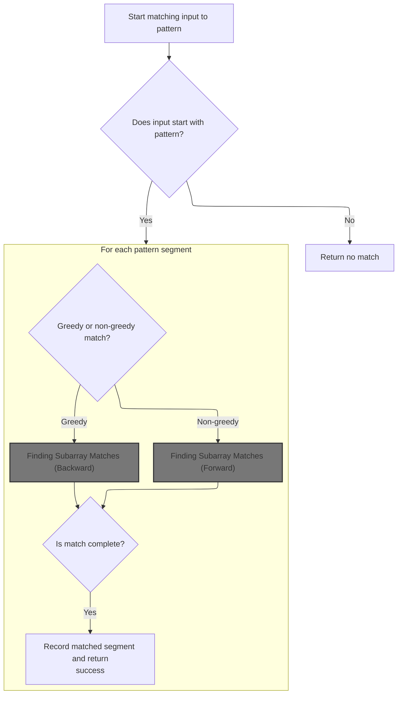
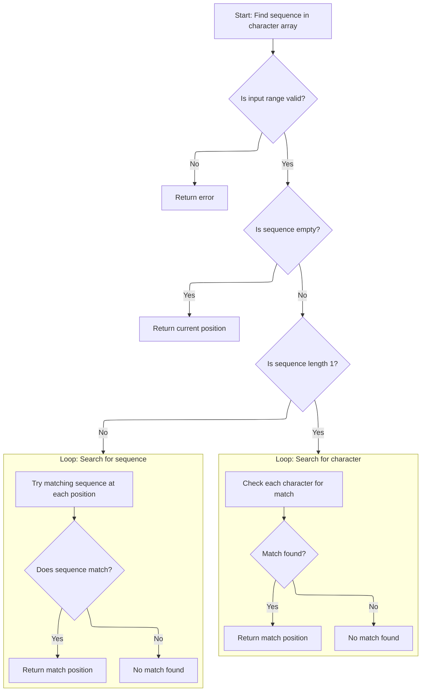
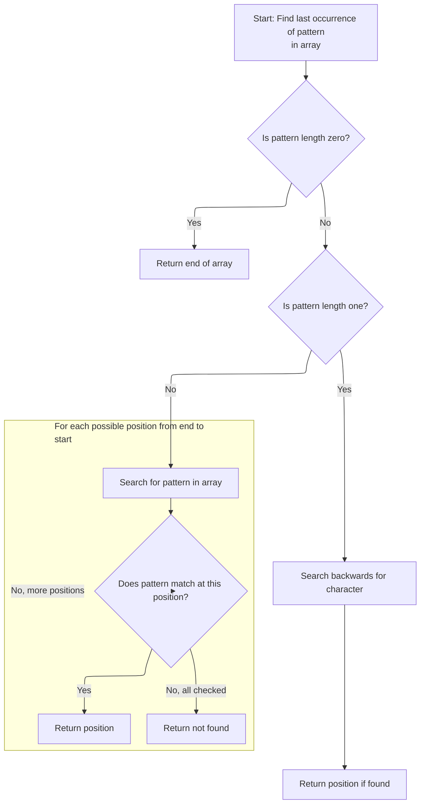

This document explains how the system determines the appropriate action configuration for a given path by matching it against a set of wildcard patterns. This enables dynamic routing of requests based on flexible path definitions. The flow receives a normalized path as input, attempts to match it to a pattern, extracts any variables, and returns the corresponding action configuration.

# Matching Paths to Action Configurations

<SwmSnippet path="/core/src/main/java/org/apache/struts/config/ActionConfigMatcher.java" line="101">

---

In <SwmToken path="core/src/main/java/org/apache/struts/config/ActionConfigMatcher.java" pos="101:5:5" line-data="    public ActionConfig match(String path) {">`match`</SwmToken>, we loop through all precompiled wildcard patterns and try to match the normalized path (without leading '/') against each one. For each pattern, we call <SwmToken path="core/src/main/java/org/apache/struts/config/ActionConfigMatcher.java" pos="120:4:6" line-data="                if (wildcard.match(vars, path, m.getPattern())) {">`wildcard.match`</SwmToken> to see if the path fits, and if so, we extract variables for later use. We need to call into <SwmToken path="core/src/main/java/org/apache/struts/config/ActionConfigMatcher.java" pos="27:10:10" line-data="import org.apache.struts.util.WildcardHelper;">`WildcardHelper`</SwmToken> here because that's where the actual pattern matching logic lives—it's what tells us if the path fits the pattern and gives us the variable values to substitute.

```java
    public ActionConfig match(String path) {
        ActionConfig config = null;

        if (compiledPaths.size() > 0) {
            if (log.isDebugEnabled()) {
                log.debug("Attempting to match '" + path
                    + "' to a wildcard pattern");
            }

            if ((path.length() > 0) && (path.charAt(0) == '/')) {
                path = path.substring(1);
            }

            Mapping m;
            HashMap vars = new HashMap();

            for (Iterator i = compiledPaths.iterator(); i.hasNext();) {
                m = (Mapping) i.next();

                if (wildcard.match(vars, path, m.getPattern())) {
                    if (log.isDebugEnabled()) {
                        log.debug("Path matches pattern '"
                            + m.getActionConfig().getPath() + "'");
                    }

```

---

</SwmSnippet>

## Wildcard Pattern Matching Logic



<SwmSnippet path="/core/src/main/java/org/apache/struts/util/WildcardHelper.java" line="159">

---

In <SwmToken path="core/src/main/java/org/apache/struts/util/WildcardHelper.java" pos="159:5:5" line-data="    public boolean match(Map map, String data, int[] expr) {">`match`</SwmToken>, we set up the buffers and check for nulls, then start processing the pattern expression. We look for special MATCH\_\* tokens to control how we match the input string, and we use helper methods to find matching segments. The map gets filled with matched groups as we go. This is where the core wildcard matching happens before we return to the caller.

```java
    public boolean match(Map map, String data, int[] expr) {
        if (map == null) {
            throw new NullPointerException("No map provided");
        }

        if (data == null) {
            throw new NullPointerException("No data provided");
        }

        if (expr == null) {
            throw new NullPointerException("No pattern expression provided");
        }

        char[] buff = data.toCharArray();

        // Allocate the result buffer
        char[] rslt = new char[expr.length + buff.length];

        // The previous and current position of the expression character
        // (MATCH_*)
        int charpos = 0;

        // The position in the expression, input, translation and result arrays
        int exprpos = 0;
        int buffpos = 0;
        int rsltpos = 0;
        int offset = -1;

        // The matching count
        int mcount = 0;

        // We want the complete data be in {0}
        map.put(Integer.toString(mcount), data);

        // First check for MATCH_BEGIN
        boolean matchBegin = false;

        if (expr[charpos] == MATCH_BEGIN) {
            matchBegin = true;
            exprpos = ++charpos;
        }

        // Search the fist expression character (except MATCH_BEGIN - already
        // skipped)
        while (expr[charpos] >= 0) {
            charpos++;
        }
```

---

</SwmSnippet>

<SwmSnippet path="/core/src/main/java/org/apache/struts/util/WildcardHelper.java" line="207">

---

Here we figure out which special token (like <SwmToken path="core/src/main/java/org/apache/struts/util/WildcardHelper.java" pos="271:6:6" line-data="                (prevchr == MATCH_FILE)">`MATCH_FILE`</SwmToken> or <SwmToken path="core/src/main/java/org/apache/struts/util/WildcardHelper.java" pos="281:8:8" line-data="            if (prevchr == MATCH_PATH) {">`MATCH_PATH`</SwmToken>) comes next in the pattern, and set up for the main matching loop. This sets up the context for the next chunk, which actually does the matching and handles the results.

```java
        // The expression charater (MATCH_*)
        int exprchr = expr[charpos];

        while (true) {
            // Check if the data in the expression array before the current
            // expression character matches the data in the input buffer
            if (matchBegin) {
                if (!matchArray(expr, exprpos, charpos, buff, buffpos)) {
                    return (false);
                }

                matchBegin = false;
            } else {
                offset = indexOfArray(expr, exprpos, charpos, buff, buffpos);

                if (offset < 0) {
                    return (false);
                }
            }

            // Check for MATCH_BEGIN
            if (matchBegin) {
                if (offset != 0) {
                    return (false);
                }

                matchBegin = false;
            }

            // Advance buffpos
            buffpos += (charpos - exprpos);

            // Check for END's
            if (exprchr == MATCH_END) {
                if (rsltpos > 0) {
                    map.put(Integer.toString(++mcount),
                        new String(rslt, 0, rsltpos));
                }

                // Don't care about rest of input buffer
                return (true);
            } else if (exprchr == MATCH_THEEND) {
                if (rsltpos > 0) {
                    map.put(Integer.toString(++mcount),
                        new String(rslt, 0, rsltpos));
                }

                // Check that we reach buffer's end
                return (buffpos == buff.length);
            }

            // Search the next expression character
            exprpos = ++charpos;

            while (expr[charpos] >= 0) {
                charpos++;
            }
```

---

</SwmSnippet>

<SwmSnippet path="/core/src/main/java/org/apache/struts/util/WildcardHelper.java" line="265">

---

Here we decide which matching strategy to use based on the previous token—either a forward search with <SwmToken path="core/src/main/java/org/apache/struts/util/WildcardHelper.java" pos="272:3:3" line-data="                ? indexOfArray(expr, exprpos, charpos, buff, buffpos)">`indexOfArray`</SwmToken> for single-segment wildcards or a backward search with <SwmToken path="core/src/main/java/org/apache/struts/util/WildcardHelper.java" pos="273:3:3" line-data="                : lastIndexOfArray(expr, exprpos, charpos, buff, buffpos);">`lastIndexOfArray`</SwmToken> for multi-segment wildcards. We need to call these helpers to actually locate the matching substring in the input

```java
            int prevchr = exprchr;

            exprchr = expr[charpos];

            // We have here prevchr == * or **.
            offset =
                (prevchr == MATCH_FILE)
                ? indexOfArray(expr, exprpos, charpos, buff, buffpos)
```

---

</SwmSnippet>

### Finding Subarray Matches (Forward)



<SwmSnippet path="/core/src/main/java/org/apache/struts/util/WildcardHelper.java" line="316">

---

In <SwmToken path="core/src/main/java/org/apache/struts/util/WildcardHelper.java" pos="316:5:5" line-data="    protected int indexOfArray(int[] r, int rpos, int rend, char[] d,">`indexOfArray`</SwmToken>, we do a brute-force search for a subarray (from the pattern) inside the input buffer, starting at a given position. Special handling for zero-length and one-length matches is included, but otherwise it's just a loop looking for the first occurrence.

```java
    protected int indexOfArray(int[] r, int rpos, int rend, char[] d,
        int dpos) {
        // Check if pos and len are legal
        if (rend < rpos) {
            throw new IllegalArgumentException("rend < rpos");
        }

        // If we need to match a zero length string return current dpos
        if (rend == rpos) {
            return (d.length); //?? dpos?
        }

        // If we need to match a 1 char length string do it simply
        if ((rend - rpos) == 1) {
            // Search for the specified character
            for (int x = dpos; x < d.length; x++) {
                if (r[rpos] == d[x]) {
                    return (x);
                }
            }
```

---

</SwmSnippet>

<SwmSnippet path="/core/src/main/java/org/apache/struts/util/WildcardHelper.java" line="338">

---

Here we loop through the input buffer, trying to match the pattern subarray at each position. If we find a match, we return the starting index; if not, we return -1. This is the core of the forward search logic.

```java
        // Main string matching loop. It gets executed if the characters to
        // match are less then the characters left in the d buffer
        while (((dpos + rend) - rpos) <= d.length) {
            // Set current startpoint in d
            int y = dpos;

            // Check every character in d for equity. If the string is matched
            // return dpos
            for (int x = rpos; x <= rend; x++) {
                if (x == rend) {
                    return (dpos);
                }

                if (r[x] != d[y++]) {
                    break;
                }
            }

            // Increase dpos to search for the same string at next offset
            dpos++;
        }
```

---

</SwmSnippet>

### Handling Forward/Backward Match Results

<SwmSnippet path="/core/src/main/java/org/apache/struts/util/WildcardHelper.java" line="273">

---

We just got back from either <SwmToken path="core/src/main/java/org/apache/struts/util/WildcardHelper.java" pos="220:5:5" line-data="                offset = indexOfArray(expr, exprpos, charpos, buff, buffpos);">`indexOfArray`</SwmToken> or <SwmToken path="core/src/main/java/org/apache/struts/util/WildcardHelper.java" pos="273:3:3" line-data="                : lastIndexOfArray(expr, exprpos, charpos, buff, buffpos);">`lastIndexOfArray`</SwmToken> (depending on the wildcard type). If the offset is negative, the match failed and we bail out. Otherwise, we keep processing the pattern. We need to call these helpers to know exactly where the next segment matches in the input.

```java
                : lastIndexOfArray(expr, exprpos, charpos, buff, buffpos);

            if (offset < 0) {
                return (false);
            }

```

---

</SwmSnippet>

### Finding Subarray Matches (Backward)



<SwmSnippet path="/core/src/main/java/org/apache/struts/util/WildcardHelper.java" line="380">

---

In <SwmToken path="core/src/main/java/org/apache/struts/util/WildcardHelper.java" pos="380:5:5" line-data="    protected int lastIndexOfArray(int[] r, int rpos, int rend, char[] d,">`lastIndexOfArray`</SwmToken>, we do a reverse search for the last occurrence of a pattern subarray in the input buffer, starting from the end. Special handling for zero-length and one-length matches is included, but otherwise it's just a backward loop looking for the last match.

```java
    protected int lastIndexOfArray(int[] r, int rpos, int rend, char[] d,
        int dpos) {
        // Check if pos and len are legal
        if (rend < rpos) {
            throw new IllegalArgumentException("rend < rpos");
        }

        // If we need to match a zero length string return current dpos
        if (rend == rpos) {
            return (d.length); //?? dpos?
        }

        // If we need to match a 1 char length string do it simply
        if ((rend - rpos) == 1) {
            // Search for the specified character
            for (int x = d.length - 1; x > dpos; x--) {
                if (r[rpos] == d[x]) {
                    return (x);
                }
            }
```

---

</SwmSnippet>

<SwmSnippet path="/core/src/main/java/org/apache/struts/util/WildcardHelper.java" line="402">

---

Here we loop backwards through the input buffer, trying to match the pattern subarray at each position. If we find a match, we return the starting index; if not, we return -1. This is the core of the backward search logic.

```java
        // Main string matching loop. It gets executed if the characters to
        // match are less then the characters left in the d buffer
        int l = d.length - (rend - rpos);

        while (l >= dpos) {
            // Set current startpoint in d
            int y = l;

            // Check every character in d for equity. If the string is matched
            // return dpos
            for (int x = rpos; x <= rend; x++) {
                if (x == rend) {
                    return (l);
                }

                if (r[x] != d[y++]) {
                    break;
                }
            }

            // Decrease l to search for the same string at next offset
            l--;
        }
```

---

</SwmSnippet>

### Storing Matched Segments

<SwmSnippet path="/core/src/main/java/org/apache/struts/util/WildcardHelper.java" line="279">

---

We just got back from <SwmToken path="core/src/main/java/org/apache/struts/util/WildcardHelper.java" pos="273:3:3" line-data="                : lastIndexOfArray(expr, exprpos, charpos, buff, buffpos);">`lastIndexOfArray`</SwmToken> or <SwmToken path="core/src/main/java/org/apache/struts/util/WildcardHelper.java" pos="220:5:5" line-data="                offset = indexOfArray(expr, exprpos, charpos, buff, buffpos);">`indexOfArray`</SwmToken>, and now we copy the matched segment from the input buffer into the result buffer for storage. For <SwmToken path="core/src/main/java/org/apache/struts/util/WildcardHelper.java" pos="281:8:8" line-data="            if (prevchr == MATCH_PATH) {">`MATCH_PATH`</SwmToken>, we just copy everything up to the offset.

```java
            // Copy the data from the source buffer into the result buffer
            // to substitute the expression character
            if (prevchr == MATCH_PATH) {
                while (buffpos < offset) {
                    rslt[rsltpos++] = buff[buffpos++];
                }
```

---

</SwmSnippet>

<SwmSnippet path="/core/src/main/java/org/apache/struts/util/WildcardHelper.java" line="286">

---

For <SwmToken path="core/src/main/java/org/apache/struts/util/WildcardHelper.java" pos="271:6:6" line-data="                (prevchr == MATCH_FILE)">`MATCH_FILE`</SwmToken>, we copy the matched segment but bail if we hit a '/'. This ensures that file wildcards don't cross path boundaries. After copying, we keep processing the rest of the pattern.

```java
                // Matching file, don't copy '/'
                while (buffpos < offset) {
                    if (buff[buffpos] == '/') {
                        return (false);
                    }

                    rslt[rsltpos++] = buff[buffpos++];
                }
```

---

</SwmSnippet>

<SwmSnippet path="/core/src/main/java/org/apache/struts/util/WildcardHelper.java" line="296">

---

After processing all pattern segments, we store the matched result in the map and reset the result buffer. The function returns true if the pattern matches the input according to all the rules, otherwise false. The map now contains all the matched groups for later use.

```java
            map.put(Integer.toString(++mcount), new String(rslt, 0, rsltpos));
            rsltpos = 0;
        }
    }
```

---

</SwmSnippet>

## Converting Matches to <SwmToken path="core/src/main/java/org/apache/struts/config/ActionConfigMatcher.java" pos="101:3:3" line-data="    public ActionConfig match(String path) {">`ActionConfig`</SwmToken>

<SwmSnippet path="/core/src/main/java/org/apache/struts/config/ActionConfigMatcher.java" line="126">

---

Back in `ActionConfigMatcher.match`, after a successful wildcard match, we call <SwmToken path="core/src/main/java/org/apache/struts/config/ActionConfigMatcher.java" pos="128:1:1" line-data="                	    convertActionConfig(path,">`convertActionConfig`</SwmToken> to turn the matched path and extracted variables into a concrete <SwmToken path="core/src/main/java/org/apache/struts/config/ActionConfigMatcher.java" pos="129:2:2" line-data="                		    (ActionConfig) m.getActionConfig(), vars);">`ActionConfig`</SwmToken>. If there's a recursive substitution problem, we log a warning and skip that match. Finally, we return the last valid <SwmToken path="core/src/main/java/org/apache/struts/config/ActionConfigMatcher.java" pos="129:2:2" line-data="                		    (ActionConfig) m.getActionConfig(), vars);">`ActionConfig`</SwmToken> found, or null if nothing matched.

```java
                    try {
                	config =
                	    convertActionConfig(path,
                		    (ActionConfig) m.getActionConfig(), vars);
                    } catch (IllegalStateException e) {
                	log.warn("Path matches pattern '"
                		+ m.getActionConfig().getPath() + "' but is "
                		+ "incompatible with the matching config due "
                		+ "to recursive substitution: "
                		+ path);
                	config = null;
                    }
                }
            }
        }

        return config;
    }
```

---

</SwmSnippet>

&nbsp;

*This is an auto-generated document by Swimm 🌊 and has not yet been verified by a human*

<SwmMeta version="3.0.0" repo-id="Z2l0aHViJTNBJTNBc3RydXRzMSUzQSUzQVN3aW1tLURlbW8=" repo-name="struts1"><sup>Powered by [Swimm](https://app.swimm.io/)</sup></SwmMeta>
