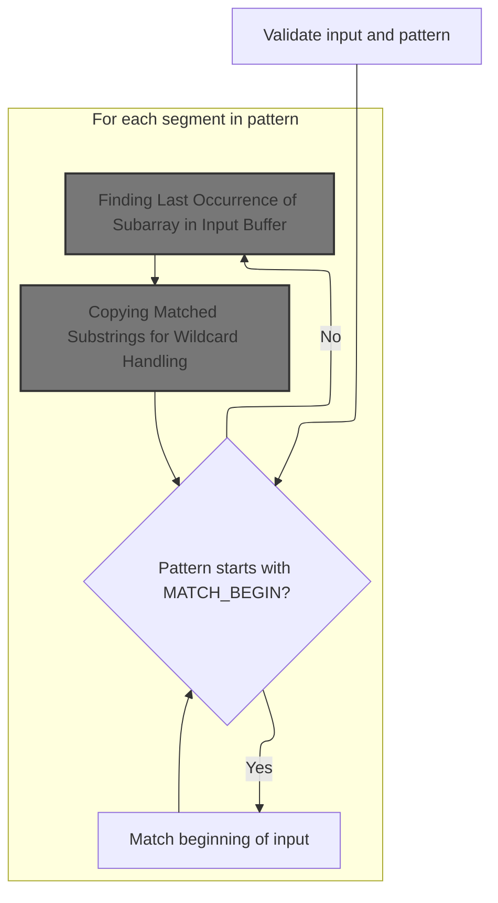
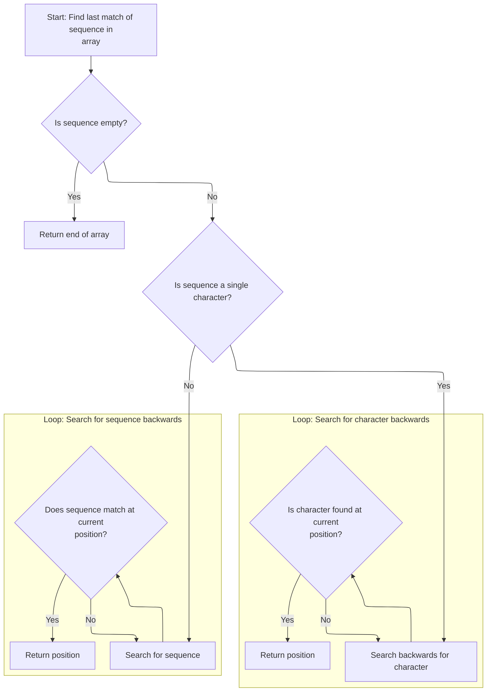
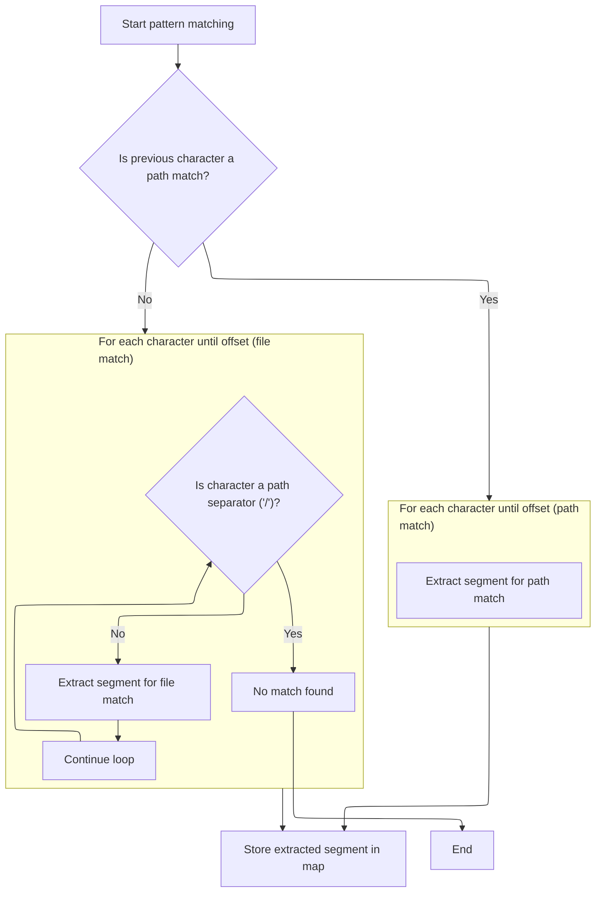

This document explains how the system matches incoming paths against configured patterns, including wildcards, to determine and build the appropriate action configuration. This allows for flexible and dynamic routing based on the path structure.

# Matching Paths Against Configured Patterns

<SwmSnippet path="/core/src/main/java/org/apache/struts/config/ActionConfigMatcher.java" line="101">

---

In <SwmToken path="core/src/main/java/org/apache/struts/config/ActionConfigMatcher.java" pos="101:5:5" line-data="    public ActionConfig match(String path) {">`match`</SwmToken>, we're looping through all compiled wildcard patterns to check if any match the incoming path. We use IteratorAdapter to abstract the iteration, so we can handle different collection types uniformly. This sets up the matching logic for each pattern.

```java
    public ActionConfig match(String path) {
        ActionConfig config = null;

        if (compiledPaths.size() > 0) {
            if (log.isDebugEnabled()) {
                log.debug("Attempting to match '" + path
                    + "' to a wildcard pattern");
            }

            if ((path.length() > 0) && (path.charAt(0) == '/')) {
                path = path.substring(1);
            }

            Mapping m;
            HashMap vars = new HashMap();

            for (Iterator i = compiledPaths.iterator(); i.hasNext();) {
                m = (Mapping) i.next();

```

---

</SwmSnippet>

<SwmSnippet path="/core/src/main/java/org/apache/struts/config/ActionConfigMatcher.java" line="120">

---

After iterating, we call WildcardHelper.match to check if the path fits the current pattern and to extract any wildcard values. This is where the actual pattern matching happens, and the vars map gets populated for later use.

```java
                if (wildcard.match(vars, path, m.getPattern())) {
                    if (log.isDebugEnabled()) {
                        log.debug("Path matches pattern '"
                            + m.getActionConfig().getPath() + "'");
                    }

```

---

</SwmSnippet>

## Pattern Matching and Wildcard Extraction



<SwmSnippet path="/core/src/main/java/org/apache/struts/util/WildcardHelper.java" line="159">

---

In <SwmToken path="core/src/main/java/org/apache/struts/util/WildcardHelper.java" pos="159:5:5" line-data="    public boolean match(Map map, String data, int[] expr) {">`match`</SwmToken>, we're validating inputs and prepping buffers, then parsing the expr array using MATCH\_\* constants to drive the matching logic. The map gets filled with substrings from the input that correspond to wildcard segments, which are later used for substitution.

```java
    public boolean match(Map map, String data, int[] expr) {
        if (map == null) {
            throw new NullPointerException("No map provided");
        }

        if (data == null) {
            throw new NullPointerException("No data provided");
        }

        if (expr == null) {
            throw new NullPointerException("No pattern expression provided");
        }

        char[] buff = data.toCharArray();

        // Allocate the result buffer
        char[] rslt = new char[expr.length + buff.length];

        // The previous and current position of the expression character
        // (MATCH_*)
        int charpos = 0;

        // The position in the expression, input, translation and result arrays
        int exprpos = 0;
        int buffpos = 0;
        int rsltpos = 0;
        int offset = -1;

        // The matching count
        int mcount = 0;

        // We want the complete data be in {0}
        map.put(Integer.toString(mcount), data);

        // First check for MATCH_BEGIN
        boolean matchBegin = false;

        if (expr[charpos] == MATCH_BEGIN) {
            matchBegin = true;
            exprpos = ++charpos;
        }

        // Search the fist expression character (except MATCH_BEGIN - already
        // skipped)
        while (expr[charpos] >= 0) {
            charpos++;
        }
```

---

</SwmSnippet>

<SwmSnippet path="/core/src/main/java/org/apache/struts/util/WildcardHelper.java" line="207">

---

Here we're scanning the expr array for the next MATCH\_\* constant, then matching the corresponding segment in the input buffer. If the segment doesn't match, we bail out; otherwise, we advance and keep processing.

```java
        // The expression charater (MATCH_*)
        int exprchr = expr[charpos];

        while (true) {
            // Check if the data in the expression array before the current
            // expression character matches the data in the input buffer
            if (matchBegin) {
                if (!matchArray(expr, exprpos, charpos, buff, buffpos)) {
                    return (false);
                }

                matchBegin = false;
            } else {
                offset = indexOfArray(expr, exprpos, charpos, buff, buffpos);

                if (offset < 0) {
                    return (false);
                }
            }

            // Check for MATCH_BEGIN
            if (matchBegin) {
                if (offset != 0) {
                    return (false);
                }

                matchBegin = false;
            }

            // Advance buffpos
            buffpos += (charpos - exprpos);

            // Check for END's
            if (exprchr == MATCH_END) {
                if (rsltpos > 0) {
                    map.put(Integer.toString(++mcount),
                        new String(rslt, 0, rsltpos));
                }

                // Don't care about rest of input buffer
                return (true);
            } else if (exprchr == MATCH_THEEND) {
                if (rsltpos > 0) {
                    map.put(Integer.toString(++mcount),
                        new String(rslt, 0, rsltpos));
                }

                // Check that we reach buffer's end
                return (buffpos == buff.length);
            }

            // Search the next expression character
            exprpos = ++charpos;

            while (expr[charpos] >= 0) {
                charpos++;
            }
```

---

</SwmSnippet>

<SwmSnippet path="/core/src/main/java/org/apache/struts/util/WildcardHelper.java" line="265">

---

Now we're deciding how to extract the next substring based on the previous MATCH\_\* constant. We call <SwmToken path="core/src/main/java/org/apache/struts/util/WildcardHelper.java" pos="272:3:3" line-data="                ? indexOfArray(expr, exprpos, charpos, buff, buffpos)">`indexOfArray`</SwmToken> or <SwmToken path="core/src/main/java/org/apache/struts/util/WildcardHelper.java" pos="273:3:3" line-data="                : lastIndexOfArray(expr, exprpos, charpos, buff, buffpos);">`lastIndexOfArray`</SwmToken> to find where the next segment starts, so we can grab the right chunk from the input.

```java
            int prevchr = exprchr;

            exprchr = expr[charpos];

            // We have here prevchr == * or **.
            offset =
                (prevchr == MATCH_FILE)
                ? indexOfArray(expr, exprpos, charpos, buff, buffpos)
```

---

</SwmSnippet>

### Finding Subarray Matches in Input Buffer

```mermaid
%%{init: {"flowchart": {"defaultRenderer": "elk"}} }%%
flowchart TD
    node1["Start: Find sequence in character array"] --> node2{"Is search range valid? (rend < rpos)"}
    click node1 openCode "core/src/main/java/org/apache/struts/util/WildcardHelper.java:316:318"
    node2 -->|"No"| node3["Error: Invalid range"]
    click node2 openCode "core/src/main/java/org/apache/struts/util/WildcardHelper.java:319:321"
    node2 -->|"Yes"| node4{"Is sequence to match empty? (rend ==
rpos)"}
    click node3 openCode "core/src/main/java/org/apache/struts/util/WildcardHelper.java:319:321"
    node4 -->|"Yes"| node5["Return end of character array"]
    click node4 openCode "core/src/main/java/org/apache/struts/util/WildcardHelper.java:324:325"
    node4 -->|"No"| node6{"Is sequence length 1? (rend - rpos == 1)"}
    click node5 openCode "core/src/main/java/org/apache/struts/util/WildcardHelper.java:324:325"
    subgraph loop1["Single character search"]
        node6 -->|"Yes"| node7["Search for character in array"]
        click node6 openCode "core/src/main/java/org/apache/struts/util/WildcardHelper.java:329:335"
        node7 -->|"Found"| node8["Return position"]
        click node7 openCode "core/src/main/java/org/apache/struts/util/WildcardHelper.java:333:334"
        node7 -->|"Not found"| node13["No match found"]
        click node13 openCode "core/src/main/java/org/apache/struts/util/WildcardHelper.java:335:335"
    end
    node6 -->|"No"| node9["Start sequence matching"]
    click node9 openCode "core/src/main/java/org/apache/struts/util/WildcardHelper.java:338:358"
    subgraph loop2["Sequence matching loop"]
        node9 --> node10{"Does sequence match at current position?"}
        click node10 openCode "core/src/main/java/org/apache/struts/util/WildcardHelper.java:344:353"
        node10 -->|"Yes"| node11["Return current position"]
        click node11 openCode "core/src/main/java/org/apache/struts/util/WildcardHelper.java:348:349"
        node10 -->|"No"| node12{"End of array reached?"}
        click node12 openCode "core/src/main/java/org/apache/struts/util/WildcardHelper.java:357:358"
        node12 -->|"No"| node10
        node12 -->|"Yes"| node14["No match found"]
        click node14 openCode "core/src/main/java/org/apache/struts/util/WildcardHelper.java:358:358"
    end
classDef HeadingStyle fill:#777777,stroke:#333,stroke-width:2px;

%% Swimm:
%% %%{init: {"flowchart": {"defaultRenderer": "elk"}} }%%
%% flowchart TD
%%     node1["Start: Find sequence in character array"] --> node2{"Is search range valid? (rend < rpos)"}
%%     click node1 openCode "<SwmPath>[core/…/util/WildcardHelper.java](core/src/main/java/org/apache/struts/util/WildcardHelper.java)</SwmPath>:316:318"
%%     node2 -->|"No"| node3["Error: Invalid range"]
%%     click node2 openCode "<SwmPath>[core/…/util/WildcardHelper.java](core/src/main/java/org/apache/struts/util/WildcardHelper.java)</SwmPath>:319:321"
%%     node2 -->|"Yes"| node4{"Is sequence to match empty? (rend ==
%% rpos)"}
%%     click node3 openCode "<SwmPath>[core/…/util/WildcardHelper.java](core/src/main/java/org/apache/struts/util/WildcardHelper.java)</SwmPath>:319:321"
%%     node4 -->|"Yes"| node5["Return end of character array"]
%%     click node4 openCode "<SwmPath>[core/…/util/WildcardHelper.java](core/src/main/java/org/apache/struts/util/WildcardHelper.java)</SwmPath>:324:325"
%%     node4 -->|"No"| node6{"Is sequence length 1? (rend - rpos == 1)"}
%%     click node5 openCode "<SwmPath>[core/…/util/WildcardHelper.java](core/src/main/java/org/apache/struts/util/WildcardHelper.java)</SwmPath>:324:325"
%%     subgraph loop1["Single character search"]
%%         node6 -->|"Yes"| node7["Search for character in array"]
%%         click node6 openCode "<SwmPath>[core/…/util/WildcardHelper.java](core/src/main/java/org/apache/struts/util/WildcardHelper.java)</SwmPath>:329:335"
%%         node7 -->|"Found"| node8["Return position"]
%%         click node7 openCode "<SwmPath>[core/…/util/WildcardHelper.java](core/src/main/java/org/apache/struts/util/WildcardHelper.java)</SwmPath>:333:334"
%%         node7 -->|"Not found"| node13["No match found"]
%%         click node13 openCode "<SwmPath>[core/…/util/WildcardHelper.java](core/src/main/java/org/apache/struts/util/WildcardHelper.java)</SwmPath>:335:335"
%%     end
%%     node6 -->|"No"| node9["Start sequence matching"]
%%     click node9 openCode "<SwmPath>[core/…/util/WildcardHelper.java](core/src/main/java/org/apache/struts/util/WildcardHelper.java)</SwmPath>:338:358"
%%     subgraph loop2["Sequence matching loop"]
%%         node9 --> node10{"Does sequence match at current position?"}
%%         click node10 openCode "<SwmPath>[core/…/util/WildcardHelper.java](core/src/main/java/org/apache/struts/util/WildcardHelper.java)</SwmPath>:344:353"
%%         node10 -->|"Yes"| node11["Return current position"]
%%         click node11 openCode "<SwmPath>[core/…/util/WildcardHelper.java](core/src/main/java/org/apache/struts/util/WildcardHelper.java)</SwmPath>:348:349"
%%         node10 -->|"No"| node12{"End of array reached?"}
%%         click node12 openCode "<SwmPath>[core/…/util/WildcardHelper.java](core/src/main/java/org/apache/struts/util/WildcardHelper.java)</SwmPath>:357:358"
%%         node12 -->|"No"| node10
%%         node12 -->|"Yes"| node14["No match found"]
%%         click node14 openCode "<SwmPath>[core/…/util/WildcardHelper.java](core/src/main/java/org/apache/struts/util/WildcardHelper.java)</SwmPath>:358:358"
%%     end
%% classDef HeadingStyle fill:#777777,stroke:#333,stroke-width:2px;
```



<SwmSnippet path="/core/src/main/java/org/apache/struts/util/WildcardHelper.java" line="316">

---

In <SwmToken path="core/src/main/java/org/apache/struts/util/WildcardHelper.java" pos="316:5:5" line-data="    protected int indexOfArray(int[] r, int rpos, int rend, char[] d,">`indexOfArray`</SwmToken>, we're searching for a subarray in the input buffer, handling zero-length and single-character cases separately. If the match is zero-length, we return <SwmToken path="core/src/main/java/org/apache/struts/util/WildcardHelper.java" pos="325:4:6" line-data="            return (d.length); //?? dpos?">`d.length`</SwmToken>, which is a quirky design choice.

```java
    protected int indexOfArray(int[] r, int rpos, int rend, char[] d,
        int dpos) {
        // Check if pos and len are legal
        if (rend < rpos) {
            throw new IllegalArgumentException("rend < rpos");
        }

        // If we need to match a zero length string return current dpos
        if (rend == rpos) {
            return (d.length); //?? dpos?
        }

        // If we need to match a 1 char length string do it simply
        if ((rend - rpos) == 1) {
            // Search for the specified character
            for (int x = dpos; x < d.length; x++) {
                if (r[rpos] == d[x]) {
                    return (x);
                }
            }
```

---

</SwmSnippet>

<SwmSnippet path="/core/src/main/java/org/apache/struts/util/WildcardHelper.java" line="338">

---

After searching, we return the start index of the match if found, or -1 if not. The rend index is inclusive, so the match includes the last character in the segment.

```java
        // Main string matching loop. It gets executed if the characters to
        // match are less then the characters left in the d buffer
        while (((dpos + rend) - rpos) <= d.length) {
            // Set current startpoint in d
            int y = dpos;

            // Check every character in d for equity. If the string is matched
            // return dpos
            for (int x = rpos; x <= rend; x++) {
                if (x == rend) {
                    return (dpos);
                }

                if (r[x] != d[y++]) {
                    break;
                }
            }

            // Increase dpos to search for the same string at next offset
            dpos++;
        }
```

---

</SwmSnippet>

### Handling Substring Extraction After Match

<SwmSnippet path="/core/src/main/java/org/apache/struts/util/WildcardHelper.java" line="273">

---

After calling <SwmToken path="core/src/main/java/org/apache/struts/util/WildcardHelper.java" pos="220:5:5" line-data="                offset = indexOfArray(expr, exprpos, charpos, buff, buffpos);">`indexOfArray`</SwmToken> or <SwmToken path="core/src/main/java/org/apache/struts/util/WildcardHelper.java" pos="273:3:3" line-data="                : lastIndexOfArray(expr, exprpos, charpos, buff, buffpos);">`lastIndexOfArray`</SwmToken>, we check if a match was found. If not, we return false and exit; otherwise, we keep extracting substrings for wildcard handling.

```java
                : lastIndexOfArray(expr, exprpos, charpos, buff, buffpos);

            if (offset < 0) {
                return (false);
            }

```

---

</SwmSnippet>

### Finding Last Occurrence of Subarray in Input Buffer



<SwmSnippet path="/core/src/main/java/org/apache/struts/util/WildcardHelper.java" line="380">

---

In <SwmToken path="core/src/main/java/org/apache/struts/util/WildcardHelper.java" pos="380:5:5" line-data="    protected int lastIndexOfArray(int[] r, int rpos, int rend, char[] d,">`lastIndexOfArray`</SwmToken>, we're searching backwards for the last occurrence of a subarray in the input buffer. Zero-length matches return <SwmToken path="core/src/main/java/org/apache/struts/util/WildcardHelper.java" pos="389:4:6" line-data="            return (d.length); //?? dpos?">`d.length`</SwmToken>, which is a weird edge case.

```java
    protected int lastIndexOfArray(int[] r, int rpos, int rend, char[] d,
        int dpos) {
        // Check if pos and len are legal
        if (rend < rpos) {
            throw new IllegalArgumentException("rend < rpos");
        }

        // If we need to match a zero length string return current dpos
        if (rend == rpos) {
            return (d.length); //?? dpos?
        }

        // If we need to match a 1 char length string do it simply
        if ((rend - rpos) == 1) {
            // Search for the specified character
            for (int x = d.length - 1; x > dpos; x--) {
                if (r[rpos] == d[x]) {
                    return (x);
                }
            }
```

---

</SwmSnippet>

<SwmSnippet path="/core/src/main/java/org/apache/struts/util/WildcardHelper.java" line="402">

---

After searching, we return the start index of the last match if found, or -1 if not. The rend index is inclusive, so the match includes the last character in the segment.

```java
        // Main string matching loop. It gets executed if the characters to
        // match are less then the characters left in the d buffer
        int l = d.length - (rend - rpos);

        while (l >= dpos) {
            // Set current startpoint in d
            int y = l;

            // Check every character in d for equity. If the string is matched
            // return dpos
            for (int x = rpos; x <= rend; x++) {
                if (x == rend) {
                    return (l);
                }

                if (r[x] != d[y++]) {
                    break;
                }
            }

            // Decrease l to search for the same string at next offset
            l--;
        }
```

---

</SwmSnippet>

### Copying Matched Substrings for Wildcard Handling



<SwmSnippet path="/core/src/main/java/org/apache/struts/util/WildcardHelper.java" line="279">

---

After getting the offset from <SwmToken path="core/src/main/java/org/apache/struts/config/ActionConfigMatcher.java" pos="27:10:10" line-data="import org.apache.struts.util.WildcardHelper;">`WildcardHelper`</SwmToken>, we copy the matched substring into the result buffer. For <SwmToken path="core/src/main/java/org/apache/struts/util/WildcardHelper.java" pos="281:8:8" line-data="            if (prevchr == MATCH_PATH) {">`MATCH_PATH`</SwmToken>, we copy everything; for <SwmToken path="core/src/main/java/org/apache/struts/util/WildcardHelper.java" pos="271:6:6" line-data="                (prevchr == MATCH_FILE)">`MATCH_FILE`</SwmToken>, we skip '/' and return false if we hit one.

```java
            // Copy the data from the source buffer into the result buffer
            // to substitute the expression character
            if (prevchr == MATCH_PATH) {
                while (buffpos < offset) {
                    rslt[rsltpos++] = buff[buffpos++];
                }
```

---

</SwmSnippet>

<SwmSnippet path="/core/src/main/java/org/apache/struts/util/WildcardHelper.java" line="286">

---

Here we're copying the substring for <SwmToken path="core/src/main/java/org/apache/struts/util/WildcardHelper.java" pos="271:6:6" line-data="                (prevchr == MATCH_FILE)">`MATCH_FILE`</SwmToken>, but if we hit a '/', we bail out since file wildcards shouldn't span directories. Otherwise, we keep copying and prep for storing the result.

```java
                // Matching file, don't copy '/'
                while (buffpos < offset) {
                    if (buff[buffpos] == '/') {
                        return (false);
                    }

                    rslt[rsltpos++] = buff[buffpos++];
                }
```

---

</SwmSnippet>

<SwmSnippet path="/core/src/main/java/org/apache/struts/util/WildcardHelper.java" line="296">

---

After copying, we store the matched substring in the map with an incrementing key, then reset the result buffer for the next segment. This sets up the values for later substitution.

```java
            map.put(Integer.toString(++mcount), new String(rslt, 0, rsltpos));
            rsltpos = 0;
        }
    }
```

---

</SwmSnippet>

## Converting Matched Patterns to Action Config

<SwmSnippet path="/core/src/main/java/org/apache/struts/config/ActionConfigMatcher.java" line="126">

---

After matching and extracting wildcards, we call <SwmToken path="core/src/main/java/org/apache/struts/config/ActionConfigMatcher.java" pos="128:1:1" line-data="                	    convertActionConfig(path,">`convertActionConfig`</SwmToken> to build the final <SwmToken path="core/src/main/java/org/apache/struts/config/ActionConfigMatcher.java" pos="129:2:2" line-data="                		    (ActionConfig) m.getActionConfig(), vars);">`ActionConfig`</SwmToken> using the values from the vars map. If substitution fails, we log a warning and skip the config.

```java
                    try {
                	config =
                	    convertActionConfig(path,
                		    (ActionConfig) m.getActionConfig(), vars);
                    } catch (IllegalStateException e) {
                	log.warn("Path matches pattern '"
                		+ m.getActionConfig().getPath() + "' but is "
                		+ "incompatible with the matching config due "
                		+ "to recursive substitution: "
                		+ path);
                	config = null;
                    }
                }
            }
        }

        return config;
    }
```

---

</SwmSnippet>

&nbsp;

*This is an auto-generated document by Swimm 🌊 and has not yet been verified by a human*

<SwmMeta version="3.0.0" repo-id="Z2l0aHViJTNBJTNBc3RydXRzMSUzQSUzQVN3aW1tLURlbW8=" repo-name="struts1"><sup>Powered by [Swimm](https://app.swimm.io/)</sup></SwmMeta>
