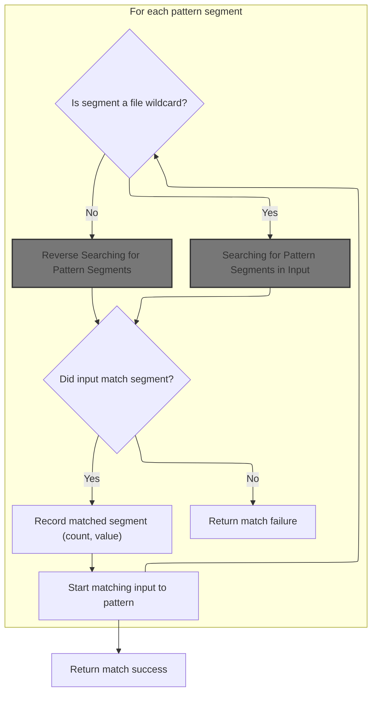
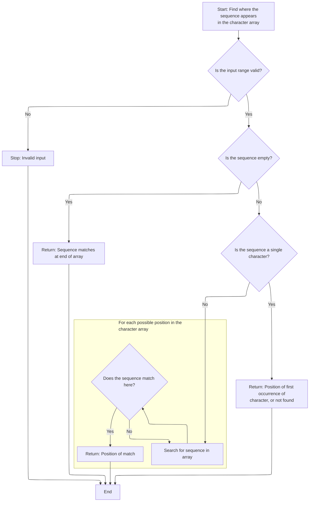
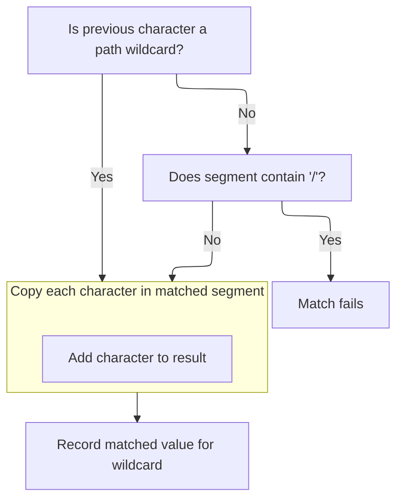

This document explains how the system matches an input path to a set of wildcard patterns, enabling flexible routing and extraction of variables. When a path matches a pattern, the extracted variables are used to create a configuration for further processing.

# Matching Paths Against Wildcard Patterns

<SwmSnippet path="/core/src/main/java/org/apache/struts/config/ActionConfigMatcher.java" line="101">

---

In <SwmToken path="core/src/main/java/org/apache/struts/config/ActionConfigMatcher.java" pos="101:5:5" line-data="    public ActionConfig match(String path) {">`match`</SwmToken>, we normalize the input path by removing a leading slash if present, then iterate over all compiled wildcard patterns. For each pattern, we use the wildcard matcher utility to check if the path fits. If a match is found, we prepare to convert the matched pattern and extracted variables into an <SwmToken path="core/src/main/java/org/apache/struts/config/ActionConfigMatcher.java" pos="101:3:3" line-data="    public ActionConfig match(String path) {">`ActionConfig`</SwmToken>. Calling <SwmToken path="core/src/main/java/org/apache/struts/config/ActionConfigMatcher.java" pos="27:10:10" line-data="import org.apache.struts.util.WildcardHelper;">`WildcardHelper`</SwmToken> here is what actually checks if the path fits the pattern and extracts variables for later substitution.

```java
    public ActionConfig match(String path) {
        ActionConfig config = null;

        if (compiledPaths.size() > 0) {
            if (log.isDebugEnabled()) {
                log.debug("Attempting to match '" + path
                    + "' to a wildcard pattern");
            }

            if ((path.length() > 0) && (path.charAt(0) == '/')) {
                path = path.substring(1);
            }

            Mapping m;
            HashMap vars = new HashMap();

            for (Iterator i = compiledPaths.iterator(); i.hasNext();) {
                m = (Mapping) i.next();

                if (wildcard.match(vars, path, m.getPattern())) {
                    if (log.isDebugEnabled()) {
                        log.debug("Path matches pattern '"
                            + m.getActionConfig().getPath() + "'");
                    }

```

---

</SwmSnippet>

## Evaluating Pattern Tokens and Anchors



<SwmSnippet path="/core/src/main/java/org/apache/struts/util/WildcardHelper.java" line="159">

---

In <SwmToken path="core/src/main/java/org/apache/struts/util/WildcardHelper.java" pos="159:5:5" line-data="    public boolean match(Map map, String data, int[] expr) {">`match`</SwmToken>, we check for nulls, convert the input string to a char array, and set up pointers for matching. We look for special MATCH\_\* tokens in the pattern array to decide how to process each segment. The function uses these tokens to anchor matches or handle wildcards, and negative values in the expr array mark the end of each pattern segment.

```java
    public boolean match(Map map, String data, int[] expr) {
        if (map == null) {
            throw new NullPointerException("No map provided");
        }

        if (data == null) {
            throw new NullPointerException("No data provided");
        }

        if (expr == null) {
            throw new NullPointerException("No pattern expression provided");
        }

        char[] buff = data.toCharArray();

        // Allocate the result buffer
        char[] rslt = new char[expr.length + buff.length];

        // The previous and current position of the expression character
        // (MATCH_*)
        int charpos = 0;

        // The position in the expression, input, translation and result arrays
        int exprpos = 0;
        int buffpos = 0;
        int rsltpos = 0;
        int offset = -1;

        // The matching count
        int mcount = 0;

        // We want the complete data be in {0}
        map.put(Integer.toString(mcount), data);

        // First check for MATCH_BEGIN
        boolean matchBegin = false;

        if (expr[charpos] == MATCH_BEGIN) {
            matchBegin = true;
            exprpos = ++charpos;
        }

        // Search the fist expression character (except MATCH_BEGIN - already
        // skipped)
        while (expr[charpos] >= 0) {
            charpos++;
        }
```

---

</SwmSnippet>

<SwmSnippet path="/core/src/main/java/org/apache/struts/util/WildcardHelper.java" line="207">

---

Here we loop through the pattern array to find the next MATCH\_\* token, then either check for a match at the current position (if anchored) or search for the segment in the input. If we hit an end token, we store the matched substring and return. Otherwise, we keep matching the next segment. This is where the actual segment-by-segment matching happens.

```java
        // The expression charater (MATCH_*)
        int exprchr = expr[charpos];

        while (true) {
            // Check if the data in the expression array before the current
            // expression character matches the data in the input buffer
            if (matchBegin) {
                if (!matchArray(expr, exprpos, charpos, buff, buffpos)) {
                    return (false);
                }

                matchBegin = false;
            } else {
                offset = indexOfArray(expr, exprpos, charpos, buff, buffpos);

                if (offset < 0) {
                    return (false);
                }
            }

            // Check for MATCH_BEGIN
            if (matchBegin) {
                if (offset != 0) {
                    return (false);
                }

                matchBegin = false;
            }

            // Advance buffpos
            buffpos += (charpos - exprpos);

            // Check for END's
            if (exprchr == MATCH_END) {
                if (rsltpos > 0) {
                    map.put(Integer.toString(++mcount),
                        new String(rslt, 0, rsltpos));
                }

                // Don't care about rest of input buffer
                return (true);
            } else if (exprchr == MATCH_THEEND) {
                if (rsltpos > 0) {
                    map.put(Integer.toString(++mcount),
                        new String(rslt, 0, rsltpos));
                }

                // Check that we reach buffer's end
                return (buffpos == buff.length);
            }

            // Search the next expression character
            exprpos = ++charpos;

            while (expr[charpos] >= 0) {
                charpos++;
            }
```

---

</SwmSnippet>

<SwmSnippet path="/core/src/main/java/org/apache/struts/util/WildcardHelper.java" line="265">

---

At this point, we decide whether to use <SwmToken path="core/src/main/java/org/apache/struts/util/WildcardHelper.java" pos="272:3:3" line-data="                ? indexOfArray(expr, exprpos, charpos, buff, buffpos)">`indexOfArray`</SwmToken> or <SwmToken path="core/src/main/java/org/apache/struts/util/WildcardHelper.java" pos="273:3:3" line-data="                : lastIndexOfArray(expr, exprpos, charpos, buff, buffpos);">`lastIndexOfArray`</SwmToken> to find where the next pattern segment fits in the input. Which one we call depends on the previous MATCH\_\* token. This is how we locate the next chunk to match, before copying or validating it.

```java
            int prevchr = exprchr;

            exprchr = expr[charpos];

            // We have here prevchr == * or **.
            offset =
                (prevchr == MATCH_FILE)
                ? indexOfArray(expr, exprpos, charpos, buff, buffpos)
```

---

</SwmSnippet>

### Searching for Pattern Segments in Input



<SwmSnippet path="/core/src/main/java/org/apache/struts/util/WildcardHelper.java" line="316">

---

In <SwmToken path="core/src/main/java/org/apache/struts/util/WildcardHelper.java" pos="316:5:5" line-data="    protected int indexOfArray(int[] r, int rpos, int rend, char[] d,">`indexOfArray`</SwmToken>, we look for the first occurrence of a pattern segment (from the int array) in the input char array, starting at a given position. If the segment is empty, we treat it as matching at the end. If it's a single character, we do a simple search. Otherwise, we scan for the full segment. This is how we locate where the next pattern chunk appears in the input.

```java
    protected int indexOfArray(int[] r, int rpos, int rend, char[] d,
        int dpos) {
        // Check if pos and len are legal
        if (rend < rpos) {
            throw new IllegalArgumentException("rend < rpos");
        }

        // If we need to match a zero length string return current dpos
        if (rend == rpos) {
            return (d.length); //?? dpos?
        }

        // If we need to match a 1 char length string do it simply
        if ((rend - rpos) == 1) {
            // Search for the specified character
            for (int x = dpos; x < d.length; x++) {
                if (r[rpos] == d[x]) {
                    return (x);
                }
            }
```

---

</SwmSnippet>

<SwmSnippet path="/core/src/main/java/org/apache/struts/util/WildcardHelper.java" line="338">

---

Here we run the main substring search loop. For each possible position, we check if the pattern segment matches the input. If it does, we return the position; if not, we keep searching. If nothing matches, we return -1.

```java
        // Main string matching loop. It gets executed if the characters to
        // match are less then the characters left in the d buffer
        while (((dpos + rend) - rpos) <= d.length) {
            // Set current startpoint in d
            int y = dpos;

            // Check every character in d for equity. If the string is matched
            // return dpos
            for (int x = rpos; x <= rend; x++) {
                if (x == rend) {
                    return (dpos);
                }

                if (r[x] != d[y++]) {
                    break;
                }
            }

            // Increase dpos to search for the same string at next offset
            dpos++;
        }
```

---

</SwmSnippet>

### Handling Segment Offsets and Fallbacks

<SwmSnippet path="/core/src/main/java/org/apache/struts/util/WildcardHelper.java" line="273">

---

After getting the offset from either <SwmToken path="core/src/main/java/org/apache/struts/util/WildcardHelper.java" pos="220:5:5" line-data="                offset = indexOfArray(expr, exprpos, charpos, buff, buffpos);">`indexOfArray`</SwmToken> or <SwmToken path="core/src/main/java/org/apache/struts/util/WildcardHelper.java" pos="273:3:3" line-data="                : lastIndexOfArray(expr, exprpos, charpos, buff, buffpos);">`lastIndexOfArray`</SwmToken> in <SwmToken path="core/src/main/java/org/apache/struts/config/ActionConfigMatcher.java" pos="27:10:10" line-data="import org.apache.struts.util.WildcardHelper;">`WildcardHelper`</SwmToken>, we check if a match was found. If not, we bail out early. This step decides if the current pattern segment fits, and if not, we stop matching.

```java
                : lastIndexOfArray(expr, exprpos, charpos, buff, buffpos);

            if (offset < 0) {
                return (false);
            }

```

---

</SwmSnippet>

### Reverse Searching for Pattern Segments

```mermaid
%%{init: {"flowchart": {"defaultRenderer": "elk"}} }%%
flowchart TD
  node1["Validate input range for sequence and
array"] --> node2{"Is input range valid?"}
  click node1 openCode "core/src/main/java/org/apache/struts/util/WildcardHelper.java:383:384"
  node2 -->|"No"| node3["Throw error: invalid range"]
  click node2 openCode "core/src/main/java/org/apache/struts/util/WildcardHelper.java:384:385"
  node2 -->|"Yes"| node4{"Is sequence to match empty?"}
  click node3 openCode "core/src/main/java/org/apache/struts/util/WildcardHelper.java:384:385"
  node4 -->|"Yes"| node5["Return end of array"]
  click node4 openCode "core/src/main/java/org/apache/struts/util/WildcardHelper.java:388:389"
  node4 -->|"No"| node6{"Is sequence length 1?"}
  click node5 openCode "core/src/main/java/org/apache/struts/util/WildcardHelper.java:389:390"
  node6 -->|"Yes"| node7["Search for last occurrence of character
in array"]
  click node6 openCode "core/src/main/java/org/apache/struts/util/WildcardHelper.java:393:399"
  node7 --> node9["Return position"]
  click node7 openCode "core/src/main/java/org/apache/struts/util/WildcardHelper.java:397:398"
  node6 -->|"No"| node8["Search for last occurrence of sequence
in array"]
  click node8 openCode "core/src/main/java/org/apache/struts/util/WildcardHelper.java:402:424"
  subgraph loop1["For each possible position in array,
starting from the end"]
    node8 --> node10{"Does sequence match at current
position?"}
    click node10 openCode "core/src/main/java/org/apache/struts/util/WildcardHelper.java:410:419"
    node10 -->|"Yes"| node9
    node10 -->|"No"| node11["Decrement search position"]
    click node11 openCode "core/src/main/java/org/apache/struts/util/WildcardHelper.java:423:424"
    node11 --> node10
  end
  click node9 openCode "core/src/main/java/org/apache/struts/util/WildcardHelper.java:414:415"

classDef HeadingStyle fill:#777777,stroke:#333,stroke-width:2px;

%% Swimm:
%% %%{init: {"flowchart": {"defaultRenderer": "elk"}} }%%
%% flowchart TD
%%   node1["Validate input range for sequence and
%% array"] --> node2{"Is input range valid?"}
%%   click node1 openCode "<SwmPath>[core/…/util/WildcardHelper.java](core/src/main/java/org/apache/struts/util/WildcardHelper.java)</SwmPath>:383:384"
%%   node2 -->|"No"| node3["Throw error: invalid range"]
%%   click node2 openCode "<SwmPath>[core/…/util/WildcardHelper.java](core/src/main/java/org/apache/struts/util/WildcardHelper.java)</SwmPath>:384:385"
%%   node2 -->|"Yes"| node4{"Is sequence to match empty?"}
%%   click node3 openCode "<SwmPath>[core/…/util/WildcardHelper.java](core/src/main/java/org/apache/struts/util/WildcardHelper.java)</SwmPath>:384:385"
%%   node4 -->|"Yes"| node5["Return end of array"]
%%   click node4 openCode "<SwmPath>[core/…/util/WildcardHelper.java](core/src/main/java/org/apache/struts/util/WildcardHelper.java)</SwmPath>:388:389"
%%   node4 -->|"No"| node6{"Is sequence length 1?"}
%%   click node5 openCode "<SwmPath>[core/…/util/WildcardHelper.java](core/src/main/java/org/apache/struts/util/WildcardHelper.java)</SwmPath>:389:390"
%%   node6 -->|"Yes"| node7["Search for last occurrence of character
%% in array"]
%%   click node6 openCode "<SwmPath>[core/…/util/WildcardHelper.java](core/src/main/java/org/apache/struts/util/WildcardHelper.java)</SwmPath>:393:399"
%%   node7 --> node9["Return position"]
%%   click node7 openCode "<SwmPath>[core/…/util/WildcardHelper.java](core/src/main/java/org/apache/struts/util/WildcardHelper.java)</SwmPath>:397:398"
%%   node6 -->|"No"| node8["Search for last occurrence of sequence
%% in array"]
%%   click node8 openCode "<SwmPath>[core/…/util/WildcardHelper.java](core/src/main/java/org/apache/struts/util/WildcardHelper.java)</SwmPath>:402:424"
%%   subgraph loop1["For each possible position in array,
%% starting from the end"]
%%     node8 --> node10{"Does sequence match at current
%% position?"}
%%     click node10 openCode "<SwmPath>[core/…/util/WildcardHelper.java](core/src/main/java/org/apache/struts/util/WildcardHelper.java)</SwmPath>:410:419"
%%     node10 -->|"Yes"| node9
%%     node10 -->|"No"| node11["Decrement search position"]
%%     click node11 openCode "<SwmPath>[core/…/util/WildcardHelper.java](core/src/main/java/org/apache/struts/util/WildcardHelper.java)</SwmPath>:423:424"
%%     node11 --> node10
%%   end
%%   click node9 openCode "<SwmPath>[core/…/util/WildcardHelper.java](core/src/main/java/org/apache/struts/util/WildcardHelper.java)</SwmPath>:414:415"
%% 
%% classDef HeadingStyle fill:#777777,stroke:#333,stroke-width:2px;
```



<SwmSnippet path="/core/src/main/java/org/apache/struts/util/WildcardHelper.java" line="380">

---

In <SwmToken path="core/src/main/java/org/apache/struts/util/WildcardHelper.java" pos="380:5:5" line-data="    protected int lastIndexOfArray(int[] r, int rpos, int rend, char[] d,">`lastIndexOfArray`</SwmToken>, we look for the last occurrence of a pattern segment in the input, starting from a given position and moving backwards. Special cases handle zero-length and single-character segments. This is used for patterns that need to match the last possible spot.

```java
    protected int lastIndexOfArray(int[] r, int rpos, int rend, char[] d,
        int dpos) {
        // Check if pos and len are legal
        if (rend < rpos) {
            throw new IllegalArgumentException("rend < rpos");
        }

        // If we need to match a zero length string return current dpos
        if (rend == rpos) {
            return (d.length); //?? dpos?
        }

        // If we need to match a 1 char length string do it simply
        if ((rend - rpos) == 1) {
            // Search for the specified character
            for (int x = d.length - 1; x > dpos; x--) {
                if (r[rpos] == d[x]) {
                    return (x);
                }
            }
```

---

</SwmSnippet>

<SwmSnippet path="/core/src/main/java/org/apache/struts/util/WildcardHelper.java" line="402">

---

Here we run the main backward search loop. For each possible position, we check if the pattern segment matches the input. If it does, we return the position; if not, we keep searching backwards. If nothing matches, we return -1.

```java
        // Main string matching loop. It gets executed if the characters to
        // match are less then the characters left in the d buffer
        int l = d.length - (rend - rpos);

        while (l >= dpos) {
            // Set current startpoint in d
            int y = l;

            // Check every character in d for equity. If the string is matched
            // return dpos
            for (int x = rpos; x <= rend; x++) {
                if (x == rend) {
                    return (l);
                }

                if (r[x] != d[y++]) {
                    break;
                }
            }

            // Decrease l to search for the same string at next offset
            l--;
        }
```

---

</SwmSnippet>

### Copying Matched Segments and Storing Results



<SwmSnippet path="/core/src/main/java/org/apache/struts/util/WildcardHelper.java" line="279">

---

After getting the offset from <SwmToken path="core/src/main/java/org/apache/struts/util/WildcardHelper.java" pos="273:3:3" line-data="                : lastIndexOfArray(expr, exprpos, charpos, buff, buffpos);">`lastIndexOfArray`</SwmToken> or <SwmToken path="core/src/main/java/org/apache/struts/util/WildcardHelper.java" pos="220:5:5" line-data="                offset = indexOfArray(expr, exprpos, charpos, buff, buffpos);">`indexOfArray`</SwmToken>, we copy the matched segment from the input buffer into the result buffer, depending on the previous MATCH\_\* token. This is where we actually collect the matched data for later use.

```java
            // Copy the data from the source buffer into the result buffer
            // to substitute the expression character
            if (prevchr == MATCH_PATH) {
                while (buffpos < offset) {
                    rslt[rsltpos++] = buff[buffpos++];
                }
```

---

</SwmSnippet>

<SwmSnippet path="/core/src/main/java/org/apache/struts/util/WildcardHelper.java" line="286">

---

When matching a file segment, we copy characters up to the offset, but if we hit a '/', we bail out. This ensures file matches don't cross directory boundaries. Otherwise, we keep copying to the result buffer.

```java
                // Matching file, don't copy '/'
                while (buffpos < offset) {
                    if (buff[buffpos] == '/') {
                        return (false);
                    }

                    rslt[rsltpos++] = buff[buffpos++];
                }
```

---

</SwmSnippet>

<SwmSnippet path="/core/src/main/java/org/apache/struts/util/WildcardHelper.java" line="296">

---

After copying the matched segment, we store it in the map for variable substitution and reset the result buffer. This lets us keep track of all matched parts for later use in config conversion.

```java
            map.put(Integer.toString(++mcount), new String(rslt, 0, rsltpos));
            rsltpos = 0;
        }
    }
```

---

</SwmSnippet>

## Converting Matches to <SwmToken path="core/src/main/java/org/apache/struts/config/ActionConfigMatcher.java" pos="101:3:3" line-data="    public ActionConfig match(String path) {">`ActionConfig`</SwmToken> Instances

<SwmSnippet path="/core/src/main/java/org/apache/struts/config/ActionConfigMatcher.java" line="126">

---

Back in `ActionConfigMatcher.match`, after a successful match from <SwmToken path="core/src/main/java/org/apache/struts/config/ActionConfigMatcher.java" pos="27:10:10" line-data="import org.apache.struts.util.WildcardHelper;">`WildcardHelper`</SwmToken>, we try to convert the matched pattern and variables into a new <SwmToken path="core/src/main/java/org/apache/struts/config/ActionConfigMatcher.java" pos="129:2:2" line-data="                		    (ActionConfig) m.getActionConfig(), vars);">`ActionConfig`</SwmToken> using <SwmToken path="core/src/main/java/org/apache/struts/config/ActionConfigMatcher.java" pos="128:1:1" line-data="                	    convertActionConfig(path,">`convertActionConfig`</SwmToken>. If there's a recursive substitution problem, we log a warning and skip this config. This is where the actual <SwmToken path="core/src/main/java/org/apache/struts/config/ActionConfigMatcher.java" pos="129:2:2" line-data="                		    (ActionConfig) m.getActionConfig(), vars);">`ActionConfig`</SwmToken> gets built from the matched path and extracted variables.

```java
                    try {
                	config =
                	    convertActionConfig(path,
                		    (ActionConfig) m.getActionConfig(), vars);
                    } catch (IllegalStateException e) {
                	log.warn("Path matches pattern '"
                		+ m.getActionConfig().getPath() + "' but is "
                		+ "incompatible with the matching config due "
                		+ "to recursive substitution: "
                		+ path);
                	config = null;
                    }
                }
            }
        }

        return config;
    }
```

---

</SwmSnippet>

&nbsp;

*This is an auto-generated document by Swimm 🌊 and has not yet been verified by a human*

<SwmMeta version="3.0.0" repo-id="Z2l0aHViJTNBJTNBc3RydXRzMSUzQSUzQVN3aW1tLURlbW8=" repo-name="struts1"><sup>Powered by [Swimm](https://app.swimm.io/)</sup></SwmMeta>
