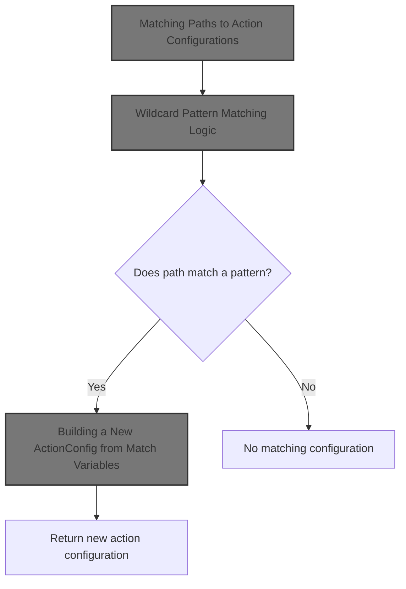
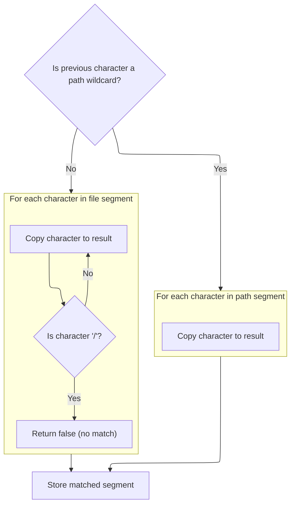
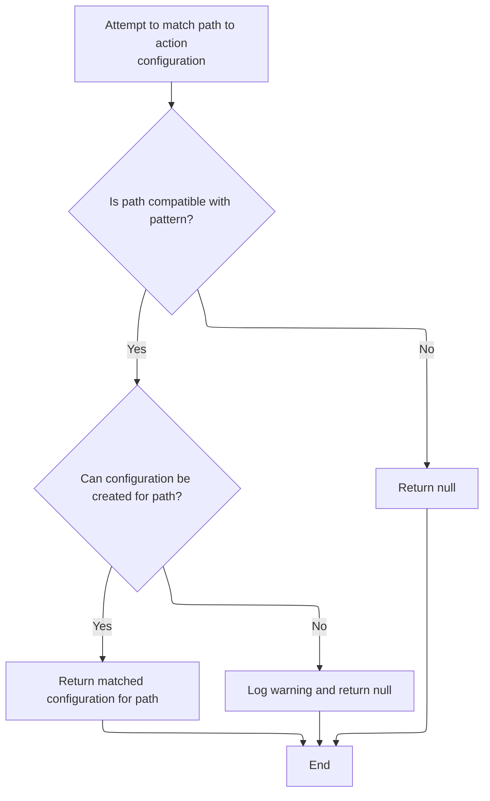
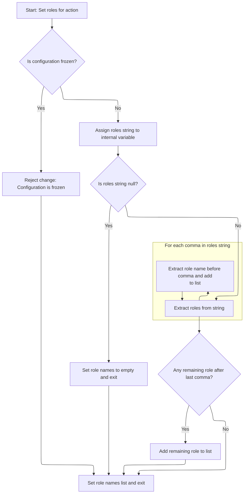

```mermaid
%%{init: {"flowchart": {"defaultRenderer": "elk"}} }%%
flowchart TD
  node1["Start: Prepare new action configuration"]
  click node1 openCode "core/src/main/java/org/apache/struts/config/ActionConfigMatcher.java:179:179"
  node1 --> node2["Apply variable substitution to all main
fields (parameter, attribute, forward,
include, input, catalog, command,
multipartClass, prefix, suffix) using
variables map"]
  click node2 openCode "core/src/main/java/org/apache/struts/config/ActionConfigMatcher.java:179:188"
  node2 --> node3["Process forward configurations"]
  click node3 openCode "core/src/main/java/org/apache/struts/config/ActionConfigMatcher.java:190:215"
  subgraph loop1["For each forward configuration"]
    node3 --> node4["Clone forward config and apply variable
substitution to its fields"]
    click node4 openCode "core/src/main/java/org/apache/struts/config/ActionConfigMatcher.java:194:206"
    node4 --> node5["Replace forward config properties with
variable substitution"]
    click node5 openCode "core/src/main/java/org/apache/struts/config/ActionConfigMatcher.java:208:209"
    node5 --> node6["Add updated forward config to new
configuration"]
    click node6 openCode "core/src/main/java/org/apache/struts/config/ActionConfigMatcher.java:212:212"
    node6 -->|"Next forward config"| node3
  end
  node3 --> node7["Replace main properties with variable
substitution"]
  click node7 openCode "core/src/main/java/org/apache/struts/config/ActionConfigMatcher.java:215:215"
  node7 --> node8["Process exception configurations"]
  click node8 openCode "core/src/main/java/org/apache/struts/config/ActionConfigMatcher.java:217:221"
  subgraph loop2["For each exception configuration"]
    node8 --> node9["Add exception config to new
configuration"]
    click node9 openCode "core/src/main/java/org/apache/struts/config/ActionConfigMatcher.java:220:220"
    node9 -->|"Next exception config"| node8
  end
  node8 --> node10["Freeze and return new configuration"]
  click node10 openCode "core/src/main/java/org/apache/struts/config/ActionConfigMatcher.java:223:225"

classDef HeadingStyle fill:#777777,stroke:#333,stroke-width:2px;

%% Swimm:
%% %%{init: {"flowchart": {"defaultRenderer": "elk"}} }%%
%% flowchart TD
%%   node1["Start: Prepare new action configuration"]
%%   click node1 openCode "<SwmPath>[core/…/config/ActionConfigMatcher.java](core/src/main/java/org/apache/struts/config/ActionConfigMatcher.java)</SwmPath>:179:179"
%%   node1 --> node2["Apply variable substitution to all main
%% fields (parameter, attribute, forward,
%% include, input, catalog, command,
%% <SwmToken path="core/src/main/java/org/apache/struts/config/ActionConfig.java" pos="499:9:9" line-data="    public void setMultipartClass(String multipartClass) {">`multipartClass`</SwmToken>, prefix, suffix) using
%% variables map"]
%%   click node2 openCode "<SwmPath>[core/…/config/ActionConfigMatcher.java](core/src/main/java/org/apache/struts/config/ActionConfigMatcher.java)</SwmPath>:179:188"
%%   node2 --> node3["Process forward configurations"]
%%   click node3 openCode "<SwmPath>[core/…/config/ActionConfigMatcher.java](core/src/main/java/org/apache/struts/config/ActionConfigMatcher.java)</SwmPath>:190:215"
%%   subgraph loop1["For each forward configuration"]
%%     node3 --> node4["Clone forward config and apply variable
%% substitution to its fields"]
%%     click node4 openCode "<SwmPath>[core/…/config/ActionConfigMatcher.java](core/src/main/java/org/apache/struts/config/ActionConfigMatcher.java)</SwmPath>:194:206"
%%     node4 --> node5["Replace forward config properties with
%% variable substitution"]
%%     click node5 openCode "<SwmPath>[core/…/config/ActionConfigMatcher.java](core/src/main/java/org/apache/struts/config/ActionConfigMatcher.java)</SwmPath>:208:209"
%%     node5 --> node6["Add updated forward config to new
%% configuration"]
%%     click node6 openCode "<SwmPath>[core/…/config/ActionConfigMatcher.java](core/src/main/java/org/apache/struts/config/ActionConfigMatcher.java)</SwmPath>:212:212"
%%     node6 -->|"Next forward config"| node3
%%   end
%%   node3 --> node7["Replace main properties with variable
%% substitution"]
%%   click node7 openCode "<SwmPath>[core/…/config/ActionConfigMatcher.java](core/src/main/java/org/apache/struts/config/ActionConfigMatcher.java)</SwmPath>:215:215"
%%   node7 --> node8["Process exception configurations"]
%%   click node8 openCode "<SwmPath>[core/…/config/ActionConfigMatcher.java](core/src/main/java/org/apache/struts/config/ActionConfigMatcher.java)</SwmPath>:217:221"
%%   subgraph loop2["For each exception configuration"]
%%     node8 --> node9["Add exception config to new
%% configuration"]
%%     click node9 openCode "<SwmPath>[core/…/config/ActionConfigMatcher.java](core/src/main/java/org/apache/struts/config/ActionConfigMatcher.java)</SwmPath>:220:220"
%%     node9 -->|"Next exception config"| node8
%%   end
%%   node8 --> node10["Freeze and return new configuration"]
%%   click node10 openCode "<SwmPath>[core/…/config/ActionConfigMatcher.java](core/src/main/java/org/apache/struts/config/ActionConfigMatcher.java)</SwmPath>:223:225"
%% 
%% classDef HeadingStyle fill:#777777,stroke:#333,stroke-width:2px;
```

This document describes how request paths are matched to action configurations using wildcard patterns. When a request path matches a pattern, variables are extracted and substituted into a template configuration, resulting in a new action configuration specific to the request. This enables dynamic and parameterized routing for flexible URL handling.



# Matching Paths to Action Configurations

<SwmSnippet path="/core/src/main/java/org/apache/struts/config/ActionConfigMatcher.java" line="101">

---

In <SwmToken path="core/src/main/java/org/apache/struts/config/ActionConfigMatcher.java" pos="101:5:5" line-data="    public ActionConfig match(String path) {">`match`</SwmToken>, we're looping through all compiled wildcard patterns and trying to match the input path (after stripping a leading slash if present) against each one. For each pattern, we call <SwmToken path="core/src/main/java/org/apache/struts/config/ActionConfigMatcher.java" pos="120:4:6" line-data="                if (wildcard.match(vars, path, m.getPattern())) {">`wildcard.match`</SwmToken> to see if the path fits. If it does, we try to convert the match into an <SwmToken path="core/src/main/java/org/apache/struts/config/ActionConfigMatcher.java" pos="101:3:3" line-data="    public ActionConfig match(String path) {">`ActionConfig`</SwmToken>. If any conversion fails due to recursive substitution, we just null out the config and keep going. We need to call into <SwmToken path="core/src/main/java/org/apache/struts/config/ActionConfigMatcher.java" pos="27:10:10" line-data="import org.apache.struts.util.WildcardHelper;">`WildcardHelper`</SwmToken> next because that's where the actual pattern matching happens—without it, we can't tell if the path fits any of the patterns.

```java
    public ActionConfig match(String path) {
        ActionConfig config = null;

        if (compiledPaths.size() > 0) {
            if (log.isDebugEnabled()) {
                log.debug("Attempting to match '" + path
                    + "' to a wildcard pattern");
            }

            if ((path.length() > 0) && (path.charAt(0) == '/')) {
                path = path.substring(1);
            }

            Mapping m;
            HashMap vars = new HashMap();

            for (Iterator i = compiledPaths.iterator(); i.hasNext();) {
                m = (Mapping) i.next();

                if (wildcard.match(vars, path, m.getPattern())) {
                    if (log.isDebugEnabled()) {
                        log.debug("Path matches pattern '"
                            + m.getActionConfig().getPath() + "'");
                    }

```

---

</SwmSnippet>

## Wildcard Pattern Matching Logic

```mermaid
%%{init: {"flowchart": {"defaultRenderer": "elk"}} }%%
flowchart TD
  node1["Start: Attempt to match input string to
pattern"] --> node2{"Is match required at start or end of
input?"}
  click node1 openCode "core/src/main/java/org/apache/struts/util/WildcardHelper.java:159:203"
  node2 -->|"Yes"| node3["Check match at required position"]
  click node2 openCode "core/src/main/java/org/apache/struts/util/WildcardHelper.java:194:200"
  node2 -->|"No"| node4["Begin matching process"]
  click node3 openCode "core/src/main/java/org/apache/struts/util/WildcardHelper.java:210:235"
  click node4 openCode "core/src/main/java/org/apache/struts/util/WildcardHelper.java:210:235"
  
  subgraph loop1["For each pattern segment"]
    node3 --> node5{"Does pattern segment match input?"}
    node4 --> node5
    
    node5 -->|"Yes"| node6["Finding Last Subarray Match in Input"]
    node5 -->|"No"| node7["Return no match"]
    
    click node7 openCode "core/src/main/java/org/apache/struts/util/WildcardHelper.java:275:277"
    node6 --> node8{"More segments to match?"}
    click node8 openCode "core/src/main/java/org/apache/struts/util/WildcardHelper.java:259:263"
    node8 -->|"Yes"| node5
    node8 -->|"No"| node9["Return match result"]
    click node9 openCode "core/src/main/java/org/apache/struts/util/WildcardHelper.java:240:256"
  end

classDef HeadingStyle fill:#777777,stroke:#333,stroke-width:2px;
click node5 goToHeading "Finding Subarray Matches in Input"
node5:::HeadingStyle
click node6 goToHeading "Finding Last Subarray Match in Input"
node6:::HeadingStyle

%% Swimm:
%% %%{init: {"flowchart": {"defaultRenderer": "elk"}} }%%
%% flowchart TD
%%   node1["Start: Attempt to match input string to
%% pattern"] --> node2{"Is match required at start or end of
%% input?"}
%%   click node1 openCode "<SwmPath>[core/…/util/WildcardHelper.java](core/src/main/java/org/apache/struts/util/WildcardHelper.java)</SwmPath>:159:203"
%%   node2 -->|"Yes"| node3["Check match at required position"]
%%   click node2 openCode "<SwmPath>[core/…/util/WildcardHelper.java](core/src/main/java/org/apache/struts/util/WildcardHelper.java)</SwmPath>:194:200"
%%   node2 -->|"No"| node4["Begin matching process"]
%%   click node3 openCode "<SwmPath>[core/…/util/WildcardHelper.java](core/src/main/java/org/apache/struts/util/WildcardHelper.java)</SwmPath>:210:235"
%%   click node4 openCode "<SwmPath>[core/…/util/WildcardHelper.java](core/src/main/java/org/apache/struts/util/WildcardHelper.java)</SwmPath>:210:235"
%%   
%%   subgraph loop1["For each pattern segment"]
%%     node3 --> node5{"Does pattern segment match input?"}
%%     node4 --> node5
%%     
%%     node5 -->|"Yes"| node6["Finding Last Subarray Match in Input"]
%%     node5 -->|"No"| node7["Return no match"]
%%     
%%     click node7 openCode "<SwmPath>[core/…/util/WildcardHelper.java](core/src/main/java/org/apache/struts/util/WildcardHelper.java)</SwmPath>:275:277"
%%     node6 --> node8{"More segments to match?"}
%%     click node8 openCode "<SwmPath>[core/…/util/WildcardHelper.java](core/src/main/java/org/apache/struts/util/WildcardHelper.java)</SwmPath>:259:263"
%%     node8 -->|"Yes"| node5
%%     node8 -->|"No"| node9["Return match result"]
%%     click node9 openCode "<SwmPath>[core/…/util/WildcardHelper.java](core/src/main/java/org/apache/struts/util/WildcardHelper.java)</SwmPath>:240:256"
%%   end
%% 
%% classDef HeadingStyle fill:#777777,stroke:#333,stroke-width:2px;
%% click node5 goToHeading "Finding Subarray Matches in Input"
%% node5:::HeadingStyle
%% click node6 goToHeading "Finding Last Subarray Match in Input"
%% node6:::HeadingStyle
```



<SwmSnippet path="/core/src/main/java/org/apache/struts/util/WildcardHelper.java" line="159">

---

In <SwmToken path="core/src/main/java/org/apache/struts/util/WildcardHelper.java" pos="159:5:5" line-data="    public boolean match(Map map, String data, int[] expr) {">`match`</SwmToken>, we're setting up to walk through the pattern (expr array) and the input data, using special MATCH\_\* constants to control how we match each segment. We store matched pieces in the map for later use. The function expects expr to be built with these tokens in the right spots, which isn't obvious unless you look at how patterns are compiled elsewhere.

```java
    public boolean match(Map map, String data, int[] expr) {
        if (map == null) {
            throw new NullPointerException("No map provided");
        }

        if (data == null) {
            throw new NullPointerException("No data provided");
        }

        if (expr == null) {
            throw new NullPointerException("No pattern expression provided");
        }

        char[] buff = data.toCharArray();

        // Allocate the result buffer
        char[] rslt = new char[expr.length + buff.length];

        // The previous and current position of the expression character
        // (MATCH_*)
        int charpos = 0;

        // The position in the expression, input, translation and result arrays
        int exprpos = 0;
        int buffpos = 0;
        int rsltpos = 0;
        int offset = -1;

        // The matching count
        int mcount = 0;

        // We want the complete data be in {0}
        map.put(Integer.toString(mcount), data);

        // First check for MATCH_BEGIN
        boolean matchBegin = false;

        if (expr[charpos] == MATCH_BEGIN) {
            matchBegin = true;
            exprpos = ++charpos;
        }

        // Search the fist expression character (except MATCH_BEGIN - already
        // skipped)
        while (expr[charpos] >= 0) {
            charpos++;
        }
```

---

</SwmSnippet>

<SwmSnippet path="/core/src/main/java/org/apache/struts/util/WildcardHelper.java" line="207">

---

Here we're picking up after the initial setup, grabbing the next MATCH\_\* token from expr and starting the main matching loop. The code checks if the segment before the current token matches the input buffer, either by direct comparison or by searching for the subarray. The structure of expr (with tokens at specific spots) is assumed, and the loop keeps advancing through expr and the input buffer based on matches.

```java
        // The expression charater (MATCH_*)
        int exprchr = expr[charpos];

        while (true) {
            // Check if the data in the expression array before the current
            // expression character matches the data in the input buffer
            if (matchBegin) {
                if (!matchArray(expr, exprpos, charpos, buff, buffpos)) {
                    return (false);
                }

                matchBegin = false;
            } else {
                offset = indexOfArray(expr, exprpos, charpos, buff, buffpos);

                if (offset < 0) {
                    return (false);
                }
            }

            // Check for MATCH_BEGIN
            if (matchBegin) {
                if (offset != 0) {
                    return (false);
                }

                matchBegin = false;
            }

            // Advance buffpos
            buffpos += (charpos - exprpos);

            // Check for END's
            if (exprchr == MATCH_END) {
                if (rsltpos > 0) {
                    map.put(Integer.toString(++mcount),
                        new String(rslt, 0, rsltpos));
                }

                // Don't care about rest of input buffer
                return (true);
            } else if (exprchr == MATCH_THEEND) {
                if (rsltpos > 0) {
                    map.put(Integer.toString(++mcount),
                        new String(rslt, 0, rsltpos));
                }

                // Check that we reach buffer's end
                return (buffpos == buff.length);
            }

            // Search the next expression character
            exprpos = ++charpos;

            while (expr[charpos] >= 0) {
                charpos++;
            }
```

---

</SwmSnippet>

<SwmSnippet path="/core/src/main/java/org/apache/struts/util/WildcardHelper.java" line="265">

---

This part decides which search method to use based on the previous MATCH\_\* token—either a forward or backward search for the next segment in the input buffer. We need to call <SwmToken path="core/src/main/java/org/apache/struts/util/WildcardHelper.java" pos="272:3:3" line-data="                ? indexOfArray(expr, exprpos, charpos, buff, buffpos)">`indexOfArray`</SwmToken> (or <SwmToken path="core/src/main/java/org/apache/struts/util/WildcardHelper.java" pos="273:3:3" line-data="                : lastIndexOfArray(expr, exprpos, charpos, buff, buffpos);">`lastIndexOfArray`</SwmToken>) next to find where the next pattern chunk appears in the input, which is key for handling wildcards and matching variable-length segments.

```java
            int prevchr = exprchr;

            exprchr = expr[charpos];

            // We have here prevchr == * or **.
            offset =
                (prevchr == MATCH_FILE)
                ? indexOfArray(expr, exprpos, charpos, buff, buffpos)
```

---

</SwmSnippet>

### Finding Subarray Matches in Input

```mermaid
%%{init: {"flowchart": {"defaultRenderer": "elk"}} }%%
flowchart TD
    node1{"Is search range valid? (rend < rpos)"}
    click node1 openCode "core/src/main/java/org/apache/struts/util/WildcardHelper.java:319:321"
    node2{"Is sequence empty? (rend == rpos)"}
    click node2 openCode "core/src/main/java/org/apache/struts/util/WildcardHelper.java:324:325"
    node3{"Is sequence a single character? (rend -
rpos == 1)"}
    click node3 openCode "core/src/main/java/org/apache/struts/util/WildcardHelper.java:329:335"
    node4["Return not found (invalid range or no
match)"]
    click node4 openCode "core/src/main/java/org/apache/struts/util/WildcardHelper.java:320:321"
    node5["Return position (empty sequence)"]
    click node5 openCode "core/src/main/java/org/apache/struts/util/WildcardHelper.java:325:325"
    node6["Return position of match"]
    click node6 openCode "core/src/main/java/org/apache/struts/util/WildcardHelper.java:333:348"

    node1 -->|"No (invalid)"| node4
    node1 -->|"Yes"| node2
    node2 -->|"Yes (empty)"| node5
    node2 -->|"No"| node3
    node3 -->|"Yes (single char)"| loop1
    node3 -->|"No (sequence)"| loop2

    subgraph loop1["For each character in array (single
character search)"]
      node7["Does character match?"]
      click node7 openCode "core/src/main/java/org/apache/struts/util/WildcardHelper.java:331:333"
      node7 -->|"Yes"| node6
      node7 -->|"No"| node8["Continue searching"]
      click node8 openCode "core/src/main/java/org/apache/struts/util/WildcardHelper.java:335:335"
      node8 --> node7
    end
    loop1 -->|"No match found"| node4

    subgraph loop2["For each position in array (sequence
search)"]
      node9["Does sequence match at this position?"]
      click node9 openCode "core/src/main/java/org/apache/struts/util/WildcardHelper.java:346:348"
      node9 -->|"Yes"| node6
      node9 -->|"No"| node10["Continue searching"]
      click node10 openCode "core/src/main/java/org/apache/struts/util/WildcardHelper.java:357:358"
      node10 --> node9
    end
    loop2 -->|"No match found"| node4

classDef HeadingStyle fill:#777777,stroke:#333,stroke-width:2px;

%% Swimm:
%% %%{init: {"flowchart": {"defaultRenderer": "elk"}} }%%
%% flowchart TD
%%     node1{"Is search range valid? (rend < rpos)"}
%%     click node1 openCode "<SwmPath>[core/…/util/WildcardHelper.java](core/src/main/java/org/apache/struts/util/WildcardHelper.java)</SwmPath>:319:321"
%%     node2{"Is sequence empty? (rend == rpos)"}
%%     click node2 openCode "<SwmPath>[core/…/util/WildcardHelper.java](core/src/main/java/org/apache/struts/util/WildcardHelper.java)</SwmPath>:324:325"
%%     node3{"Is sequence a single character? (rend -
%% rpos == 1)"}
%%     click node3 openCode "<SwmPath>[core/…/util/WildcardHelper.java](core/src/main/java/org/apache/struts/util/WildcardHelper.java)</SwmPath>:329:335"
%%     node4["Return not found (invalid range or no
%% match)"]
%%     click node4 openCode "<SwmPath>[core/…/util/WildcardHelper.java](core/src/main/java/org/apache/struts/util/WildcardHelper.java)</SwmPath>:320:321"
%%     node5["Return position (empty sequence)"]
%%     click node5 openCode "<SwmPath>[core/…/util/WildcardHelper.java](core/src/main/java/org/apache/struts/util/WildcardHelper.java)</SwmPath>:325:325"
%%     node6["Return position of match"]
%%     click node6 openCode "<SwmPath>[core/…/util/WildcardHelper.java](core/src/main/java/org/apache/struts/util/WildcardHelper.java)</SwmPath>:333:348"
%% 
%%     node1 -->|"No (invalid)"| node4
%%     node1 -->|"Yes"| node2
%%     node2 -->|"Yes (empty)"| node5
%%     node2 -->|"No"| node3
%%     node3 -->|"Yes (single char)"| loop1
%%     node3 -->|"No (sequence)"| loop2
%% 
%%     subgraph loop1["For each character in array (single
%% character search)"]
%%       node7["Does character match?"]
%%       click node7 openCode "<SwmPath>[core/…/util/WildcardHelper.java](core/src/main/java/org/apache/struts/util/WildcardHelper.java)</SwmPath>:331:333"
%%       node7 -->|"Yes"| node6
%%       node7 -->|"No"| node8["Continue searching"]
%%       click node8 openCode "<SwmPath>[core/…/util/WildcardHelper.java](core/src/main/java/org/apache/struts/util/WildcardHelper.java)</SwmPath>:335:335"
%%       node8 --> node7
%%     end
%%     loop1 -->|"No match found"| node4
%% 
%%     subgraph loop2["For each position in array (sequence
%% search)"]
%%       node9["Does sequence match at this position?"]
%%       click node9 openCode "<SwmPath>[core/…/util/WildcardHelper.java](core/src/main/java/org/apache/struts/util/WildcardHelper.java)</SwmPath>:346:348"
%%       node9 -->|"Yes"| node6
%%       node9 -->|"No"| node10["Continue searching"]
%%       click node10 openCode "<SwmPath>[core/…/util/WildcardHelper.java](core/src/main/java/org/apache/struts/util/WildcardHelper.java)</SwmPath>:357:358"
%%       node10 --> node9
%%     end
%%     loop2 -->|"No match found"| node4
%% 
%% classDef HeadingStyle fill:#777777,stroke:#333,stroke-width:2px;
```



<SwmSnippet path="/core/src/main/java/org/apache/struts/util/WildcardHelper.java" line="316">

---

In <SwmToken path="core/src/main/java/org/apache/struts/util/WildcardHelper.java" pos="316:5:5" line-data="    protected int indexOfArray(int[] r, int rpos, int rend, char[] d,">`indexOfArray`</SwmToken>, we're searching for a subarray (pattern chunk) inside the input buffer. The pattern is int\[\] so we can mix in special MATCH\_\* tokens, while the input is just chars. The function handles <SwmToken path="core/src/main/java/org/apache/struts/config/ActionConfig.java" pos="1079:8:10" line-data="     * none, a zero-length array is returned. &lt;/p&gt;">`zero-length`</SwmToken>, single-char, and longer patterns, returning the position of the match or -1 if not found.

```java
    protected int indexOfArray(int[] r, int rpos, int rend, char[] d,
        int dpos) {
        // Check if pos and len are legal
        if (rend < rpos) {
            throw new IllegalArgumentException("rend < rpos");
        }

        // If we need to match a zero length string return current dpos
        if (rend == rpos) {
            return (d.length); //?? dpos?
        }

        // If we need to match a 1 char length string do it simply
        if ((rend - rpos) == 1) {
            // Search for the specified character
            for (int x = dpos; x < d.length; x++) {
                if (r[rpos] == d[x]) {
                    return (x);
                }
            }
```

---

</SwmSnippet>

<SwmSnippet path="/core/src/main/java/org/apache/struts/util/WildcardHelper.java" line="338">

---

After the main matching loop, we either return the position in the input buffer where the pattern chunk was found, or -1 if no match. This result tells the caller where to continue matching or if the pattern can't be found at all.

```java
        // Main string matching loop. It gets executed if the characters to
        // match are less then the characters left in the d buffer
        while (((dpos + rend) - rpos) <= d.length) {
            // Set current startpoint in d
            int y = dpos;

            // Check every character in d for equity. If the string is matched
            // return dpos
            for (int x = rpos; x <= rend; x++) {
                if (x == rend) {
                    return (dpos);
                }

                if (r[x] != d[y++]) {
                    break;
                }
            }

            // Increase dpos to search for the same string at next offset
            dpos++;
        }
```

---

</SwmSnippet>

### Handling Forward and Backward Pattern Searches

<SwmSnippet path="/core/src/main/java/org/apache/struts/util/WildcardHelper.java" line="273">

---

We just got back from <SwmToken path="core/src/main/java/org/apache/struts/util/WildcardHelper.java" pos="220:5:5" line-data="                offset = indexOfArray(expr, exprpos, charpos, buff, buffpos);">`indexOfArray`</SwmToken> or <SwmToken path="core/src/main/java/org/apache/struts/util/WildcardHelper.java" pos="273:3:3" line-data="                : lastIndexOfArray(expr, exprpos, charpos, buff, buffpos);">`lastIndexOfArray`</SwmToken> in <SwmToken path="core/src/main/java/org/apache/struts/config/ActionConfigMatcher.java" pos="27:10:10" line-data="import org.apache.struts.util.WildcardHelper;">`WildcardHelper`</SwmToken>, and now we're checking if a match was found. If not, we bail out. If we did find a match, we move on to copy the matched segment or handle the next MATCH\_\* token, so we need to keep calling into <SwmToken path="core/src/main/java/org/apache/struts/config/ActionConfigMatcher.java" pos="27:10:10" line-data="import org.apache.struts.util.WildcardHelper;">`WildcardHelper`</SwmToken> to process the rest of the pattern and input.

```java
                : lastIndexOfArray(expr, exprpos, charpos, buff, buffpos);

            if (offset < 0) {
                return (false);
            }

```

---

</SwmSnippet>

### Finding Last Subarray Match in Input

```mermaid
%%{init: {"flowchart": {"defaultRenderer": "elk"}} }%%
flowchart TD
    node1{"Is search range valid? (rend < rpos)"}
    click node1 openCode "core/src/main/java/org/apache/struts/util/WildcardHelper.java:383:385"
    node1 -->|"No"| node2["Return error (invalid range)"]
    click node2 openCode "core/src/main/java/org/apache/struts/util/WildcardHelper.java:384:385"
    node1 -->|"Yes"| node3{"Is sequence empty? (rend == rpos)"}
    click node3 openCode "core/src/main/java/org/apache/struts/util/WildcardHelper.java:388:389"
    node3 -->|"Yes"| node4["Return end of main array (d.length)"]
    click node4 openCode "core/src/main/java/org/apache/struts/util/WildcardHelper.java:389:390"
    node3 -->|"No"| node5{"Is sequence a single character? (rend -
rpos == 1)"}
    click node5 openCode "core/src/main/java/org/apache/struts/util/WildcardHelper.java:393:394"
    node5 -->|"Yes"| node6["Search for last occurrence of character
in main array"]
    click node6 openCode "core/src/main/java/org/apache/struts/util/WildcardHelper.java:395:399"
    node5 -->|"No"| node7["Search for last occurrence of sequence
in main array"]
    click node7 openCode "core/src/main/java/org/apache/struts/util/WildcardHelper.java:406:424"

    subgraph loop1["For each possible position from end to
start"]
      node7 --> node8{"Does sequence match at this position?"}
      click node8 openCode "core/src/main/java/org/apache/struts/util/WildcardHelper.java:412:419"
      node8 -->|"Yes"| node9["Return current position (last match)"]
      click node9 openCode "core/src/main/java/org/apache/struts/util/WildcardHelper.java:414:415"
      node8 -->|"No"| node10{"More positions to check?"}
      click node10 openCode "core/src/main/java/org/apache/struts/util/WildcardHelper.java:406:424"
      node10 -->|"Yes"| node8
      node10 -->|"No"| node11["Return -1 (not found)"]
      click node11 openCode "core/src/main/java/org/apache/struts/util/WildcardHelper.java:424:424"
    end

    subgraph loop2["For each position from end to start
(single character)"]
      node6 --> node12{"Is character found at this position?"}
      click node12 openCode "core/src/main/java/org/apache/struts/util/WildcardHelper.java:396:397"
      node12 -->|"Yes"| node9
      node12 -->|"No"| node13{"More positions to check?"}
      click node13 openCode "core/src/main/java/org/apache/struts/util/WildcardHelper.java:395:399"
      node13 -->|"Yes"| node12
      node13 -->|"No"| node11
    end

classDef HeadingStyle fill:#777777,stroke:#333,stroke-width:2px;

%% Swimm:
%% %%{init: {"flowchart": {"defaultRenderer": "elk"}} }%%
%% flowchart TD
%%     node1{"Is search range valid? (rend < rpos)"}
%%     click node1 openCode "<SwmPath>[core/…/util/WildcardHelper.java](core/src/main/java/org/apache/struts/util/WildcardHelper.java)</SwmPath>:383:385"
%%     node1 -->|"No"| node2["Return error (invalid range)"]
%%     click node2 openCode "<SwmPath>[core/…/util/WildcardHelper.java](core/src/main/java/org/apache/struts/util/WildcardHelper.java)</SwmPath>:384:385"
%%     node1 -->|"Yes"| node3{"Is sequence empty? (rend == rpos)"}
%%     click node3 openCode "<SwmPath>[core/…/util/WildcardHelper.java](core/src/main/java/org/apache/struts/util/WildcardHelper.java)</SwmPath>:388:389"
%%     node3 -->|"Yes"| node4["Return end of main array (<SwmToken path="core/src/main/java/org/apache/struts/util/WildcardHelper.java" pos="325:4:6" line-data="            return (d.length); //?? dpos?">`d.length`</SwmToken>)"]
%%     click node4 openCode "<SwmPath>[core/…/util/WildcardHelper.java](core/src/main/java/org/apache/struts/util/WildcardHelper.java)</SwmPath>:389:390"
%%     node3 -->|"No"| node5{"Is sequence a single character? (rend -
%% rpos == 1)"}
%%     click node5 openCode "<SwmPath>[core/…/util/WildcardHelper.java](core/src/main/java/org/apache/struts/util/WildcardHelper.java)</SwmPath>:393:394"
%%     node5 -->|"Yes"| node6["Search for last occurrence of character
%% in main array"]
%%     click node6 openCode "<SwmPath>[core/…/util/WildcardHelper.java](core/src/main/java/org/apache/struts/util/WildcardHelper.java)</SwmPath>:395:399"
%%     node5 -->|"No"| node7["Search for last occurrence of sequence
%% in main array"]
%%     click node7 openCode "<SwmPath>[core/…/util/WildcardHelper.java](core/src/main/java/org/apache/struts/util/WildcardHelper.java)</SwmPath>:406:424"
%% 
%%     subgraph loop1["For each possible position from end to
%% start"]
%%       node7 --> node8{"Does sequence match at this position?"}
%%       click node8 openCode "<SwmPath>[core/…/util/WildcardHelper.java](core/src/main/java/org/apache/struts/util/WildcardHelper.java)</SwmPath>:412:419"
%%       node8 -->|"Yes"| node9["Return current position (last match)"]
%%       click node9 openCode "<SwmPath>[core/…/util/WildcardHelper.java](core/src/main/java/org/apache/struts/util/WildcardHelper.java)</SwmPath>:414:415"
%%       node8 -->|"No"| node10{"More positions to check?"}
%%       click node10 openCode "<SwmPath>[core/…/util/WildcardHelper.java](core/src/main/java/org/apache/struts/util/WildcardHelper.java)</SwmPath>:406:424"
%%       node10 -->|"Yes"| node8
%%       node10 -->|"No"| node11["Return -1 (not found)"]
%%       click node11 openCode "<SwmPath>[core/…/util/WildcardHelper.java](core/src/main/java/org/apache/struts/util/WildcardHelper.java)</SwmPath>:424:424"
%%     end
%% 
%%     subgraph loop2["For each position from end to start
%% (single character)"]
%%       node6 --> node12{"Is character found at this position?"}
%%       click node12 openCode "<SwmPath>[core/…/util/WildcardHelper.java](core/src/main/java/org/apache/struts/util/WildcardHelper.java)</SwmPath>:396:397"
%%       node12 -->|"Yes"| node9
%%       node12 -->|"No"| node13{"More positions to check?"}
%%       click node13 openCode "<SwmPath>[core/…/util/WildcardHelper.java](core/src/main/java/org/apache/struts/util/WildcardHelper.java)</SwmPath>:395:399"
%%       node13 -->|"Yes"| node12
%%       node13 -->|"No"| node11
%%     end
%% 
%% classDef HeadingStyle fill:#777777,stroke:#333,stroke-width:2px;
```



<SwmSnippet path="/core/src/main/java/org/apache/struts/util/WildcardHelper.java" line="380">

---

In <SwmToken path="core/src/main/java/org/apache/struts/util/WildcardHelper.java" pos="380:5:5" line-data="    protected int lastIndexOfArray(int[] r, int rpos, int rend, char[] d,">`lastIndexOfArray`</SwmToken>, we're searching backwards for the last occurrence of a pattern chunk in the input buffer. Zero-length matches return <SwmToken path="core/src/main/java/org/apache/struts/util/WildcardHelper.java" pos="389:4:6" line-data="            return (d.length); //?? dpos?">`d.length`</SwmToken>, single-char matches scan from the end, and longer patterns are checked in a loop. If we find a match, we return its position; otherwise, -1.

```java
    protected int lastIndexOfArray(int[] r, int rpos, int rend, char[] d,
        int dpos) {
        // Check if pos and len are legal
        if (rend < rpos) {
            throw new IllegalArgumentException("rend < rpos");
        }

        // If we need to match a zero length string return current dpos
        if (rend == rpos) {
            return (d.length); //?? dpos?
        }

        // If we need to match a 1 char length string do it simply
        if ((rend - rpos) == 1) {
            // Search for the specified character
            for (int x = d.length - 1; x > dpos; x--) {
                if (r[rpos] == d[x]) {
                    return (x);
                }
            }
```

---

</SwmSnippet>

<SwmSnippet path="/core/src/main/java/org/apache/struts/util/WildcardHelper.java" line="402">

---

After the main loop, we return the starting index of the last match found, or -1 if nothing matches. The function treats the end index as inclusive, which isn't obvious from the signature.

```java
        // Main string matching loop. It gets executed if the characters to
        // match are less then the characters left in the d buffer
        int l = d.length - (rend - rpos);

        while (l >= dpos) {
            // Set current startpoint in d
            int y = l;

            // Check every character in d for equity. If the string is matched
            // return dpos
            for (int x = rpos; x <= rend; x++) {
                if (x == rend) {
                    return (l);
                }

                if (r[x] != d[y++]) {
                    break;
                }
            }

            // Decrease l to search for the same string at next offset
            l--;
        }
```

---

</SwmSnippet>

### Copying and Storing Matched Segments



<SwmSnippet path="/core/src/main/java/org/apache/struts/util/WildcardHelper.java" line="279">

---

We just got back from <SwmToken path="core/src/main/java/org/apache/struts/util/WildcardHelper.java" pos="273:3:3" line-data="                : lastIndexOfArray(expr, exprpos, charpos, buff, buffpos);">`lastIndexOfArray`</SwmToken> or <SwmToken path="core/src/main/java/org/apache/struts/util/WildcardHelper.java" pos="220:5:5" line-data="                offset = indexOfArray(expr, exprpos, charpos, buff, buffpos);">`indexOfArray`</SwmToken> in <SwmToken path="core/src/main/java/org/apache/struts/config/ActionConfigMatcher.java" pos="27:10:10" line-data="import org.apache.struts.util.WildcardHelper;">`WildcardHelper`</SwmToken>, and now we're copying the matched segment from the input buffer into the result buffer if the previous token was <SwmToken path="core/src/main/java/org/apache/struts/util/WildcardHelper.java" pos="281:8:8" line-data="            if (prevchr == MATCH_PATH) {">`MATCH_PATH`</SwmToken>. This is how we collect the variable parts of the input for later substitution.

```java
            // Copy the data from the source buffer into the result buffer
            // to substitute the expression character
            if (prevchr == MATCH_PATH) {
                while (buffpos < offset) {
                    rslt[rsltpos++] = buff[buffpos++];
                }
```

---

</SwmSnippet>

<SwmSnippet path="/core/src/main/java/org/apache/struts/util/WildcardHelper.java" line="286">

---

If the previous token was <SwmToken path="core/src/main/java/org/apache/struts/util/WildcardHelper.java" pos="271:6:6" line-data="                (prevchr == MATCH_FILE)">`MATCH_FILE`</SwmToken>, we copy the matched segment but bail if we hit a slash. This keeps file matches from spanning path separators

```java
                // Matching file, don't copy '/'
                while (buffpos < offset) {
                    if (buff[buffpos] == '/') {
                        return (false);
                    }

                    rslt[rsltpos++] = buff[buffpos++];
                }
```

---

</SwmSnippet>

<SwmSnippet path="/core/src/main/java/org/apache/struts/util/WildcardHelper.java" line="296">

---

After copying the matched segment, we store it in the map with an incremented key. This lets us substitute these values back into the <SwmToken path="core/src/main/java/org/apache/struts/config/ActionConfigMatcher.java" pos="101:3:3" line-data="    public ActionConfig match(String path) {">`ActionConfig`</SwmToken> later. The function keeps looping through the pattern and input until everything is matched or a mismatch is found.

```java
            map.put(Integer.toString(++mcount), new String(rslt, 0, rsltpos));
            rsltpos = 0;
        }
    }
```

---

</SwmSnippet>

## Converting Matches to <SwmToken path="core/src/main/java/org/apache/struts/config/ActionConfigMatcher.java" pos="101:3:3" line-data="    public ActionConfig match(String path) {">`ActionConfig`</SwmToken> Objects



<SwmSnippet path="/core/src/main/java/org/apache/struts/config/ActionConfigMatcher.java" line="126">

---

We just got back from WildcardHelper.match in ActionConfigMatcher.match. If we found a match, we try to build a new <SwmToken path="core/src/main/java/org/apache/struts/config/ActionConfigMatcher.java" pos="129:2:2" line-data="                		    (ActionConfig) m.getActionConfig(), vars);">`ActionConfig`</SwmToken> using the matched variables. If the conversion fails due to recursive substitution, we log a warning and skip this config. We need to call <SwmToken path="core/src/main/java/org/apache/struts/config/ActionConfigMatcher.java" pos="128:1:1" line-data="                	    convertActionConfig(path,">`convertActionConfig`</SwmToken> next to actually build the <SwmToken path="core/src/main/java/org/apache/struts/config/ActionConfigMatcher.java" pos="129:2:2" line-data="                		    (ActionConfig) m.getActionConfig(), vars);">`ActionConfig`</SwmToken> with the right values.

```java
                    try {
                	config =
                	    convertActionConfig(path,
                		    (ActionConfig) m.getActionConfig(), vars);
                    } catch (IllegalStateException e) {
                	log.warn("Path matches pattern '"
                		+ m.getActionConfig().getPath() + "' but is "
                		+ "incompatible with the matching config due "
                		+ "to recursive substitution: "
                		+ path);
                	config = null;
                    }
                }
            }
        }

        return config;
    }
```

---

</SwmSnippet>

# Building a New <SwmToken path="core/src/main/java/org/apache/struts/config/ActionConfigMatcher.java" pos="101:3:3" line-data="    public ActionConfig match(String path) {">`ActionConfig`</SwmToken> from Match Variables

<SwmSnippet path="/core/src/main/java/org/apache/struts/config/ActionConfigMatcher.java" line="157">

---

In <SwmToken path="core/src/main/java/org/apache/struts/config/ActionConfigMatcher.java" pos="157:5:5" line-data="    protected ActionConfig convertActionConfig(String path, ActionConfig orig,">`convertActionConfig`</SwmToken>, we're cloning the original <SwmToken path="core/src/main/java/org/apache/struts/config/ActionConfigMatcher.java" pos="157:3:3" line-data="    protected ActionConfig convertActionConfig(String path, ActionConfig orig,">`ActionConfig`</SwmToken> and then updating its fields with values from the match variables. We call <SwmToken path="core/src/main/java/org/apache/struts/config/ActionConfigMatcher.java" pos="170:5:5" line-data="        config.setName(convertParam(orig.getName(), vars));">`convertParam`</SwmToken> next to substitute any placeholders in the name, path, or type with the actual matched values.

```java
    protected ActionConfig convertActionConfig(String path, ActionConfig orig,
        Map vars) {
        ActionConfig config = null;

        try {
            config = (ActionConfig) BeanUtils.cloneBean(orig);
        } catch (Exception ex) {
            log.warn("Unable to clone action config, recommend not using "
                + "wildcards", ex);

            return null;
        }

        config.setName(convertParam(orig.getName(), vars));
```

---

</SwmSnippet>

<SwmSnippet path="/core/src/main/java/org/apache/struts/config/ActionConfigMatcher.java" line="258">

---

<SwmToken path="core/src/main/java/org/apache/struts/config/ActionConfigMatcher.java" pos="258:5:5" line-data="    protected String convertParam(String val, Map vars) {">`convertParam`</SwmToken> replaces placeholders like {0}, {1}, etc. in the input string with values from the vars map. It checks for recursive substitutions to avoid infinite loops, and expects the keys to be single characters.

```java
    protected String convertParam(String val, Map vars) {
        if (val == null) {
            return null;
        } else if (val.indexOf("{") == -1) {
            return val;
        }

        Map.Entry entry;
        StringBuffer key = new StringBuffer("{0}");
        StringBuffer ret = new StringBuffer(val);
        String keyStr;
        int x;

        for (Iterator i = vars.entrySet().iterator(); i.hasNext();) {
            entry = (Map.Entry) i.next();
            key.setCharAt(1, ((String) entry.getKey()).charAt(0));
            keyStr = key.toString();
            
            // STR-3169
            // Prevent an infinite loop by retaining the placeholders
            // that contain itself in the substitution value
            if (((String) entry.getValue()).contains(keyStr)) {
        	throw new IllegalStateException();
            }
            
            // Replace all instances of the placeholder
            while ((x = ret.toString().indexOf(keyStr)) > -1) {
                ret.replace(x, x + 3, (String) entry.getValue());
            }
        }
```

---

</SwmSnippet>

<SwmSnippet path="/core/src/main/java/org/apache/struts/config/ActionConfigMatcher.java" line="170">

---

We just got back from <SwmToken path="core/src/main/java/org/apache/struts/config/ActionConfigMatcher.java" pos="170:5:5" line-data="        config.setName(convertParam(orig.getName(), vars));">`convertParam`</SwmToken> in <SwmToken path="core/src/main/java/org/apache/struts/config/ActionConfigMatcher.java" pos="128:1:1" line-data="                	    convertActionConfig(path,">`convertActionConfig`</SwmToken>, and now we're setting the name on the cloned <SwmToken path="core/src/main/java/org/apache/struts/config/ActionConfigMatcher.java" pos="101:3:3" line-data="    public ActionConfig match(String path) {">`ActionConfig`</SwmToken>. We need to call <SwmToken path="core/src/main/java/org/apache/struts/config/ActionConfigMatcher.java" pos="170:3:3" line-data="        config.setName(convertParam(orig.getName(), vars));">`setName`</SwmToken> next to actually update the config with the substituted value.

```java
        config.setName(convertParam(orig.getName(), vars));

```

---

</SwmSnippet>

<SwmSnippet path="/core/src/main/java/org/apache/struts/config/ActionConfig.java" line="517">

---

<SwmToken path="core/src/main/java/org/apache/struts/config/ActionConfig.java" pos="517:5:5" line-data="    public void setName(String name) {">`setName`</SwmToken> updates the <SwmToken path="core/src/main/java/org/apache/struts/config/ActionConfigMatcher.java" pos="101:3:3" line-data="    public ActionConfig match(String path) {">`ActionConfig`</SwmToken>'s name unless the config is frozen (configured == true). If it's frozen, it throws an exception to prevent changes.

```java
    public void setName(String name) {
        if (configured) {
            throw new IllegalStateException("Configuration is frozen");
        }

        this.name = name;
    }
```

---

</SwmSnippet>

<SwmSnippet path="/core/src/main/java/org/apache/struts/config/ActionConfigMatcher.java" line="172">

---

We just set the name in <SwmToken path="core/src/main/java/org/apache/struts/config/ActionConfigMatcher.java" pos="128:1:1" line-data="                	    convertActionConfig(path,">`convertActionConfig`</SwmToken>, and now we're making sure the path starts with a slash before setting it. We need to call <SwmToken path="core/src/main/java/org/apache/struts/config/ActionConfigMatcher.java" pos="176:3:3" line-data="        config.setPath(path);">`setPath`</SwmToken> next to update the <SwmToken path="core/src/main/java/org/apache/struts/config/ActionConfigMatcher.java" pos="101:3:3" line-data="    public ActionConfig match(String path) {">`ActionConfig`</SwmToken> with the correct path.

```java
        if ((path.length() == 0) || (path.charAt(0) != '/')) {
            path = "/" + path;
        }

        config.setPath(path);
```

---

</SwmSnippet>

<SwmSnippet path="/core/src/main/java/org/apache/struts/config/ActionConfig.java" line="565">

---

<SwmToken path="core/src/main/java/org/apache/struts/config/ActionConfig.java" pos="565:5:5" line-data="    public void setPath(String path) {">`setPath`</SwmToken> updates the <SwmToken path="core/src/main/java/org/apache/struts/config/ActionConfigMatcher.java" pos="101:3:3" line-data="    public ActionConfig match(String path) {">`ActionConfig`</SwmToken>'s path unless the config is frozen. If it's frozen, it throws an exception. No extra checks on the path value itself.

```java
    public void setPath(String path) {
        if (configured) {
            throw new IllegalStateException("Configuration is frozen");
        }

        this.path = path;
    }
```

---

</SwmSnippet>

<SwmSnippet path="/core/src/main/java/org/apache/struts/config/ActionConfigMatcher.java" line="177">

---

We just set the path in <SwmToken path="core/src/main/java/org/apache/struts/config/ActionConfigMatcher.java" pos="128:1:1" line-data="                	    convertActionConfig(path,">`convertActionConfig`</SwmToken>, and now we're updating the type field. We need to call <SwmToken path="core/src/main/java/org/apache/struts/config/ActionConfigMatcher.java" pos="177:5:5" line-data="        config.setType(convertParam(orig.getType(), vars));">`convertParam`</SwmToken> again to substitute any placeholders in the type string.

```java
        config.setType(convertParam(orig.getType(), vars));
```

---

</SwmSnippet>

<SwmSnippet path="/core/src/main/java/org/apache/struts/config/ActionConfigMatcher.java" line="177">

---

We just got the substituted type string from <SwmToken path="core/src/main/java/org/apache/struts/config/ActionConfigMatcher.java" pos="177:5:5" line-data="        config.setType(convertParam(orig.getType(), vars));">`convertParam`</SwmToken>, and now we're setting it on the <SwmToken path="core/src/main/java/org/apache/struts/config/ActionConfigMatcher.java" pos="101:3:3" line-data="    public ActionConfig match(String path) {">`ActionConfig`</SwmToken>. We need to call <SwmToken path="core/src/main/java/org/apache/struts/config/ActionConfigMatcher.java" pos="177:3:3" line-data="        config.setType(convertParam(orig.getType(), vars));">`setType`</SwmToken> next to actually update the config.

```java
        config.setType(convertParam(orig.getType(), vars));
```

---

</SwmSnippet>

<SwmSnippet path="/core/src/main/java/org/apache/struts/config/ActionConfig.java" line="788">

---

<SwmToken path="core/src/main/java/org/apache/struts/config/ActionConfig.java" pos="788:5:5" line-data="    public void setType(String type) {">`setType`</SwmToken> updates the <SwmToken path="core/src/main/java/org/apache/struts/config/ActionConfigMatcher.java" pos="101:3:3" line-data="    public ActionConfig match(String path) {">`ActionConfig`</SwmToken>'s type unless the config is frozen. If it's frozen, it throws an exception. This keeps the config immutable after it's finalized.

```java
    public void setType(String type) {
        if (configured) {
            throw new IllegalStateException("Configuration is frozen");
        }

        this.type = type;
    }
```

---

</SwmSnippet>

<SwmSnippet path="/core/src/main/java/org/apache/struts/config/ActionConfigMatcher.java" line="178">

---

We just set the type in <SwmToken path="core/src/main/java/org/apache/struts/config/ActionConfigMatcher.java" pos="128:1:1" line-data="                	    convertActionConfig(path,">`convertActionConfig`</SwmToken>, and now we're updating the roles field. We need to call <SwmToken path="core/src/main/java/org/apache/struts/config/ActionConfigMatcher.java" pos="178:5:5" line-data="        config.setRoles(convertParam(orig.getRoles(), vars));">`convertParam`</SwmToken> again to substitute any placeholders in the roles string.

```java
        config.setRoles(convertParam(orig.getRoles(), vars));
```

---

</SwmSnippet>

<SwmSnippet path="/core/src/main/java/org/apache/struts/config/ActionConfigMatcher.java" line="178">

---

We just got the substituted roles string from <SwmToken path="core/src/main/java/org/apache/struts/config/ActionConfigMatcher.java" pos="178:5:5" line-data="        config.setRoles(convertParam(orig.getRoles(), vars));">`convertParam`</SwmToken>, and now we're setting it on the <SwmToken path="core/src/main/java/org/apache/struts/config/ActionConfigMatcher.java" pos="101:3:3" line-data="    public ActionConfig match(String path) {">`ActionConfig`</SwmToken>. We need to call <SwmToken path="core/src/main/java/org/apache/struts/config/ActionConfigMatcher.java" pos="178:3:3" line-data="        config.setRoles(convertParam(orig.getRoles(), vars));">`setRoles`</SwmToken> next to update the config and parse the roles into the internal array.

```java
        config.setRoles(convertParam(orig.getRoles(), vars));
```

---

</SwmSnippet>

## Parsing and Setting Roles in <SwmToken path="core/src/main/java/org/apache/struts/config/ActionConfigMatcher.java" pos="101:3:3" line-data="    public ActionConfig match(String path) {">`ActionConfig`</SwmToken>



<SwmSnippet path="/core/src/main/java/org/apache/struts/config/ActionConfig.java" line="597">

---

In <SwmToken path="core/src/main/java/org/apache/struts/config/ActionConfig.java" pos="597:5:5" line-data="    public void setRoles(String roles) {">`setRoles`</SwmToken>, we're splitting the roles string by commas, trimming each part, and storing the result in an internal array. If the config is frozen, we throw an exception. This lets us handle multiple roles cleanly for each <SwmToken path="core/src/main/java/org/apache/struts/config/ActionConfigMatcher.java" pos="101:3:3" line-data="    public ActionConfig match(String path) {">`ActionConfig`</SwmToken>.

```java
    public void setRoles(String roles) {
        if (configured) {
            throw new IllegalStateException("Configuration is frozen");
        }

        this.roles = roles;

        if (roles == null) {
            roleNames = new String[0];

            return;
        }

        ArrayList list = new ArrayList();

        while (true) {
            int comma = roles.indexOf(',');

            if (comma < 0) {
                break;
            }

            list.add(roles.substring(0, comma).trim());
            roles = roles.substring(comma + 1);
        }
```

---

</SwmSnippet>

<SwmSnippet path="/core/src/main/java/org/apache/struts/config/ActionConfig.java" line="623">

---

After splitting and trimming, we store the roles in an array. This gives us a clean list of role names for later checks or access control.

```java
        roles = roles.trim();

        if (roles.length() > 0) {
            list.add(roles);
        }

        roleNames = (String[]) list.toArray(new String[list.size()]);
    }
```

---

</SwmSnippet>

## Setting Additional <SwmToken path="core/src/main/java/org/apache/struts/config/ActionConfigMatcher.java" pos="101:3:3" line-data="    public ActionConfig match(String path) {">`ActionConfig`</SwmToken> Fields



<SwmSnippet path="/core/src/main/java/org/apache/struts/config/ActionConfigMatcher.java" line="179">

---

We just set the roles in <SwmToken path="core/src/main/java/org/apache/struts/config/ActionConfigMatcher.java" pos="128:1:1" line-data="                	    convertActionConfig(path,">`convertActionConfig`</SwmToken>, and now we're updating the parameter field. We need to call <SwmToken path="core/src/main/java/org/apache/struts/config/ActionConfigMatcher.java" pos="179:5:5" line-data="        config.setParameter(convertParam(orig.getParameter(), vars));">`convertParam`</SwmToken> again to substitute any placeholders in the parameter string.

```java
        config.setParameter(convertParam(orig.getParameter(), vars));
```

---

</SwmSnippet>

<SwmSnippet path="/core/src/main/java/org/apache/struts/config/ActionConfigMatcher.java" line="179">

---

We just got the substituted parameter string from <SwmToken path="core/src/main/java/org/apache/struts/config/ActionConfigMatcher.java" pos="179:5:5" line-data="        config.setParameter(convertParam(orig.getParameter(), vars));">`convertParam`</SwmToken>, and now we're setting it on the <SwmToken path="core/src/main/java/org/apache/struts/config/ActionConfigMatcher.java" pos="101:3:3" line-data="    public ActionConfig match(String path) {">`ActionConfig`</SwmToken>. We need to call <SwmToken path="core/src/main/java/org/apache/struts/config/ActionConfigMatcher.java" pos="179:3:3" line-data="        config.setParameter(convertParam(orig.getParameter(), vars));">`setParameter`</SwmToken> next to update the config.

```java
        config.setParameter(convertParam(orig.getParameter(), vars));
```

---

</SwmSnippet>

<SwmSnippet path="/core/src/main/java/org/apache/struts/config/ActionConfig.java" line="541">

---

<SwmToken path="core/src/main/java/org/apache/struts/config/ActionConfig.java" pos="541:5:5" line-data="    public void setParameter(String parameter) {">`setParameter`</SwmToken> updates the <SwmToken path="core/src/main/java/org/apache/struts/config/ActionConfigMatcher.java" pos="101:3:3" line-data="    public ActionConfig match(String path) {">`ActionConfig`</SwmToken>'s parameter unless the config is frozen. If it's frozen, it throws an exception. This keeps the config from being changed after it's finalized.

```java
    public void setParameter(String parameter) {
        if (configured) {
            throw new IllegalStateException("Configuration is frozen");
        }

        this.parameter = parameter;
    }
```

---

</SwmSnippet>

<SwmSnippet path="/core/src/main/java/org/apache/struts/config/ActionConfigMatcher.java" line="180">

---

We just set the parameter in <SwmToken path="core/src/main/java/org/apache/struts/config/ActionConfigMatcher.java" pos="128:1:1" line-data="                	    convertActionConfig(path,">`convertActionConfig`</SwmToken>, and now we're updating the attribute field. We need to call <SwmToken path="core/src/main/java/org/apache/struts/config/ActionConfigMatcher.java" pos="180:5:5" line-data="        config.setAttribute(convertParam(orig.getAttribute(), vars));">`convertParam`</SwmToken> again to substitute any placeholders in the attribute string.

```java
        config.setAttribute(convertParam(orig.getAttribute(), vars));
```

---

</SwmSnippet>

<SwmSnippet path="/core/src/main/java/org/apache/struts/config/ActionConfig.java" line="321">

---

GetAttribute() returns the attribute field if it's set, but if it's null, it falls back to returning name. This fallback isn't obvious from the method name and is a hidden assumption in the code.

```java
    public String getAttribute() {
        if (this.attribute == null) {
            return (this.name);
        } else {
            return (this.attribute);
        }
    }
```

---

</SwmSnippet>

<SwmSnippet path="/core/src/main/java/org/apache/struts/config/ActionConfigMatcher.java" line="180">

---

We just got the attribute value (with fallback to name if needed), and now we call <SwmToken path="core/src/main/java/org/apache/struts/config/ActionConfigMatcher.java" pos="180:5:5" line-data="        config.setAttribute(convertParam(orig.getAttribute(), vars));">`convertParam`</SwmToken> to swap out any placeholders in the attribute string using the matched variables. This is how ActionConfigMatcher.convertActionConfig wires up the config with the right values.

```java
        config.setAttribute(convertParam(orig.getAttribute(), vars));
```

---

</SwmSnippet>

<SwmSnippet path="/core/src/main/java/org/apache/struts/config/ActionConfigMatcher.java" line="180">

---

After converting placeholders in the attribute, we call <SwmToken path="core/src/main/java/org/apache/struts/config/ActionConfigMatcher.java" pos="180:3:3" line-data="        config.setAttribute(convertParam(orig.getAttribute(), vars));">`setAttribute`</SwmToken> to actually update the <SwmToken path="core/src/main/java/org/apache/struts/config/ActionConfigMatcher.java" pos="101:3:3" line-data="    public ActionConfig match(String path) {">`ActionConfig`</SwmToken> with the new value. This step is needed so the config has the right data for the matched request.

```java
        config.setAttribute(convertParam(orig.getAttribute(), vars));
```

---

</SwmSnippet>

<SwmSnippet path="/core/src/main/java/org/apache/struts/config/ActionConfig.java" line="337">

---

SetAttribute updates the attribute field unless the config is frozen (configured == true). If it's frozen, it throws, so you can't change the config after it's finalized.

```java
    public void setAttribute(String attribute) {
        if (configured) {
            throw new IllegalStateException("Configuration is frozen");
        }

        this.attribute = attribute;
    }
```

---

</SwmSnippet>

<SwmSnippet path="/core/src/main/java/org/apache/struts/config/ActionConfigMatcher.java" line="181">

---

After setting the attribute, we move on to the forward field and call <SwmToken path="core/src/main/java/org/apache/struts/config/ActionConfigMatcher.java" pos="181:5:5" line-data="        config.setForward(convertParam(orig.getForward(), vars));">`convertParam`</SwmToken> to swap out any placeholders with the matched values. This keeps the ActionConfigMatcher.convertActionConfig flow consistent for all fields that might have variables.

```java
        config.setForward(convertParam(orig.getForward(), vars));
```

---

</SwmSnippet>

<SwmSnippet path="/core/src/main/java/org/apache/struts/config/ActionConfigMatcher.java" line="181">

---

After converting the forward value, we call <SwmToken path="core/src/main/java/org/apache/struts/config/ActionConfigMatcher.java" pos="181:3:3" line-data="        config.setForward(convertParam(orig.getForward(), vars));">`setForward`</SwmToken> to update the <SwmToken path="core/src/main/java/org/apache/struts/config/ActionConfigMatcher.java" pos="101:3:3" line-data="    public ActionConfig match(String path) {">`ActionConfig`</SwmToken>. This step is needed so the config has the right forward path for the request.

```java
        config.setForward(convertParam(orig.getForward(), vars));
```

---

</SwmSnippet>

<SwmSnippet path="/core/src/main/java/org/apache/struts/config/ActionConfig.java" line="419">

---

SetForward updates the forward field unless the config is frozen. If it's frozen, it throws, so you can't change the forward after the config is finalized.

```java
    public void setForward(String forward) {
        if (configured) {
            throw new IllegalStateException("Configuration is frozen");
        }

        this.forward = forward;
    }
```

---

</SwmSnippet>

<SwmSnippet path="/core/src/main/java/org/apache/struts/config/ActionConfigMatcher.java" line="182">

---

After setting the forward, we move on to the include field and call <SwmToken path="core/src/main/java/org/apache/struts/config/ActionConfigMatcher.java" pos="182:5:5" line-data="        config.setInclude(convertParam(orig.getInclude(), vars));">`convertParam`</SwmToken> to swap out any placeholders with the matched values. This keeps the config consistent for all fields that might have variables.

```java
        config.setInclude(convertParam(orig.getInclude(), vars));
```

---

</SwmSnippet>

<SwmSnippet path="/core/src/main/java/org/apache/struts/config/ActionConfigMatcher.java" line="182">

---

After converting the include value, we call <SwmToken path="core/src/main/java/org/apache/struts/config/ActionConfigMatcher.java" pos="182:3:3" line-data="        config.setInclude(convertParam(orig.getInclude(), vars));">`setInclude`</SwmToken> to update the <SwmToken path="core/src/main/java/org/apache/struts/config/ActionConfigMatcher.java" pos="101:3:3" line-data="    public ActionConfig match(String path) {">`ActionConfig`</SwmToken>. This step is needed so the config has the right include value for the request.

```java
        config.setInclude(convertParam(orig.getInclude(), vars));
```

---

</SwmSnippet>

<SwmSnippet path="/core/src/main/java/org/apache/struts/config/ActionConfig.java" line="446">

---

SetInclude updates the include field unless the config is frozen. If it's frozen, it throws, so you can't change the include after the config is finalized.

```java
    public void setInclude(String include) {
        if (configured) {
            throw new IllegalStateException("Configuration is frozen");
        }

        this.include = include;
    }
```

---

</SwmSnippet>

<SwmSnippet path="/core/src/main/java/org/apache/struts/config/ActionConfigMatcher.java" line="183">

---

After setting the include, we move on to the input field and call <SwmToken path="core/src/main/java/org/apache/struts/config/ActionConfigMatcher.java" pos="183:5:5" line-data="        config.setInput(convertParam(orig.getInput(), vars));">`convertParam`</SwmToken> to swap out any placeholders with the matched values. This keeps the config consistent for all fields that might have variables.

```java
        config.setInput(convertParam(orig.getInput(), vars));
```

---

</SwmSnippet>

<SwmSnippet path="/core/src/main/java/org/apache/struts/config/ActionConfigMatcher.java" line="183">

---

After converting the input value, we call <SwmToken path="core/src/main/java/org/apache/struts/config/ActionConfigMatcher.java" pos="183:3:3" line-data="        config.setInput(convertParam(orig.getInput(), vars));">`setInput`</SwmToken> to update the <SwmToken path="core/src/main/java/org/apache/struts/config/ActionConfigMatcher.java" pos="101:3:3" line-data="    public ActionConfig match(String path) {">`ActionConfig`</SwmToken>. This step is needed so the config has the right input value for the request.

```java
        config.setInput(convertParam(orig.getInput(), vars));
```

---

</SwmSnippet>

<SwmSnippet path="/core/src/main/java/org/apache/struts/config/ActionConfig.java" line="473">

---

SetInput updates the input field unless the config is frozen. If it's frozen, it throws, so you can't change the input after the config is finalized.

```java
    public void setInput(String input) {
        if (configured) {
            throw new IllegalStateException("Configuration is frozen");
        }

        this.input = input;
    }
```

---

</SwmSnippet>

<SwmSnippet path="/core/src/main/java/org/apache/struts/config/ActionConfigMatcher.java" line="184">

---

After setting the input, we move on to the catalog field and call <SwmToken path="core/src/main/java/org/apache/struts/config/ActionConfigMatcher.java" pos="184:5:5" line-data="        config.setCatalog(convertParam(orig.getCatalog(), vars));">`convertParam`</SwmToken> to swap out any placeholders with the matched values. This keeps the config consistent for all fields that might have variables.

```java
        config.setCatalog(convertParam(orig.getCatalog(), vars));
```

---

</SwmSnippet>

<SwmSnippet path="/core/src/main/java/org/apache/struts/config/ActionConfigMatcher.java" line="184">

---

After converting the catalog value, we call <SwmToken path="core/src/main/java/org/apache/struts/config/ActionConfigMatcher.java" pos="184:3:3" line-data="        config.setCatalog(convertParam(orig.getCatalog(), vars));">`setCatalog`</SwmToken> to update the <SwmToken path="core/src/main/java/org/apache/struts/config/ActionConfigMatcher.java" pos="101:3:3" line-data="    public ActionConfig match(String path) {">`ActionConfig`</SwmToken>. This step is needed so the config has the right catalog value for the request.

```java
        config.setCatalog(convertParam(orig.getCatalog(), vars));
```

---

</SwmSnippet>

<SwmSnippet path="/core/src/main/java/org/apache/struts/config/ActionConfig.java" line="882">

---

SetCatalog updates the catalog field unless the config is frozen. If it's frozen, it throws, so you can't change the catalog after the config is finalized.

```java
    public void setCatalog(String catalog) {
        if (configured) {
            throw new IllegalStateException("Configuration is frozen");
        }

        this.catalog = catalog;
    }
```

---

</SwmSnippet>

<SwmSnippet path="/core/src/main/java/org/apache/struts/config/ActionConfigMatcher.java" line="185">

---

After setting the catalog, we move on to the command field and call <SwmToken path="core/src/main/java/org/apache/struts/config/ActionConfigMatcher.java" pos="185:5:5" line-data="        config.setCommand(convertParam(orig.getCommand(), vars));">`convertParam`</SwmToken> to swap out any placeholders with the matched values. This keeps the config consistent for all fields that might have variables.

```java
        config.setCommand(convertParam(orig.getCommand(), vars));
```

---

</SwmSnippet>

<SwmSnippet path="/core/src/main/java/org/apache/struts/config/ActionConfigMatcher.java" line="185">

---

After converting the command value, we call <SwmToken path="core/src/main/java/org/apache/struts/config/ActionConfigMatcher.java" pos="185:3:3" line-data="        config.setCommand(convertParam(orig.getCommand(), vars));">`setCommand`</SwmToken> to update the <SwmToken path="core/src/main/java/org/apache/struts/config/ActionConfigMatcher.java" pos="101:3:3" line-data="    public ActionConfig match(String path) {">`ActionConfig`</SwmToken>. This step is needed so the config has the right command value for the request.

```java
        config.setCommand(convertParam(orig.getCommand(), vars));
```

---

</SwmSnippet>

<SwmSnippet path="/core/src/main/java/org/apache/struts/config/ActionConfig.java" line="864">

---

SetCommand updates the command field unless the config is frozen. If it's frozen, it throws, so you can't change the command after the config is finalized.

```java
    public void setCommand(String command) {
        if (configured) {
            throw new IllegalStateException("Configuration is frozen");
        }

        this.command = command;
    }
```

---

</SwmSnippet>

<SwmSnippet path="/core/src/main/java/org/apache/struts/config/ActionConfigMatcher.java" line="186">

---

After setting the command, we move on to the <SwmToken path="core/src/main/java/org/apache/struts/config/ActionConfig.java" pos="499:9:9" line-data="    public void setMultipartClass(String multipartClass) {">`multipartClass`</SwmToken> field and call <SwmToken path="core/src/main/java/org/apache/struts/config/ActionConfigMatcher.java" pos="186:5:5" line-data="        config.setMultipartClass(convertParam(orig.getMultipartClass(), vars));">`convertParam`</SwmToken> to swap out any placeholders with the matched values. This keeps the config consistent for all fields that might have variables.

```java
        config.setMultipartClass(convertParam(orig.getMultipartClass(), vars));
```

---

</SwmSnippet>

<SwmSnippet path="/core/src/main/java/org/apache/struts/config/ActionConfigMatcher.java" line="186">

---

After converting the <SwmToken path="core/src/main/java/org/apache/struts/config/ActionConfig.java" pos="499:9:9" line-data="    public void setMultipartClass(String multipartClass) {">`multipartClass`</SwmToken> value, we call <SwmToken path="core/src/main/java/org/apache/struts/config/ActionConfigMatcher.java" pos="186:3:3" line-data="        config.setMultipartClass(convertParam(orig.getMultipartClass(), vars));">`setMultipartClass`</SwmToken> to update the <SwmToken path="core/src/main/java/org/apache/struts/config/ActionConfigMatcher.java" pos="101:3:3" line-data="    public ActionConfig match(String path) {">`ActionConfig`</SwmToken>. This step is needed so the config has the right <SwmToken path="core/src/main/java/org/apache/struts/config/ActionConfig.java" pos="499:9:9" line-data="    public void setMultipartClass(String multipartClass) {">`multipartClass`</SwmToken> value for the request.

```java
        config.setMultipartClass(convertParam(orig.getMultipartClass(), vars));
```

---

</SwmSnippet>

<SwmSnippet path="/core/src/main/java/org/apache/struts/config/ActionConfig.java" line="499">

---

SetMultipartClass updates the <SwmToken path="core/src/main/java/org/apache/struts/config/ActionConfig.java" pos="499:9:9" line-data="    public void setMultipartClass(String multipartClass) {">`multipartClass`</SwmToken> field unless the config is frozen. If it's frozen, it throws, so you can't change the <SwmToken path="core/src/main/java/org/apache/struts/config/ActionConfig.java" pos="499:9:9" line-data="    public void setMultipartClass(String multipartClass) {">`multipartClass`</SwmToken> after the config is finalized.

```java
    public void setMultipartClass(String multipartClass) {
        if (configured) {
            throw new IllegalStateException("Configuration is frozen");
        }

        this.multipartClass = multipartClass;
    }
```

---

</SwmSnippet>

<SwmSnippet path="/core/src/main/java/org/apache/struts/config/ActionConfigMatcher.java" line="187">

---

After setting the <SwmToken path="core/src/main/java/org/apache/struts/config/ActionConfig.java" pos="499:9:9" line-data="    public void setMultipartClass(String multipartClass) {">`multipartClass`</SwmToken>, we move on to the prefix field and call <SwmToken path="core/src/main/java/org/apache/struts/config/ActionConfigMatcher.java" pos="187:5:5" line-data="        config.setPrefix(convertParam(orig.getPrefix(), vars));">`convertParam`</SwmToken> to swap out any placeholders with the matched values. This keeps the config consistent for all fields that might have variables.

```java
        config.setPrefix(convertParam(orig.getPrefix(), vars));
```

---

</SwmSnippet>

<SwmSnippet path="/core/src/main/java/org/apache/struts/config/ActionConfigMatcher.java" line="187">

---

After converting the prefix value, we call <SwmToken path="core/src/main/java/org/apache/struts/config/ActionConfigMatcher.java" pos="187:3:3" line-data="        config.setPrefix(convertParam(orig.getPrefix(), vars));">`setPrefix`</SwmToken> to update the <SwmToken path="core/src/main/java/org/apache/struts/config/ActionConfigMatcher.java" pos="101:3:3" line-data="    public ActionConfig match(String path) {">`ActionConfig`</SwmToken>. This step is needed so the config has the right prefix value for the request.

```java
        config.setPrefix(convertParam(orig.getPrefix(), vars));
```

---

</SwmSnippet>

<SwmSnippet path="/core/src/main/java/org/apache/struts/config/ActionConfig.java" line="585">

---

SetPrefix updates the prefix field unless the config is frozen. If it's frozen, it throws, so you can't change the prefix after the config is finalized.

```java
    public void setPrefix(String prefix) {
        if (configured) {
            throw new IllegalStateException("Configuration is frozen");
        }

        this.prefix = prefix;
    }
```

---

</SwmSnippet>

<SwmSnippet path="/core/src/main/java/org/apache/struts/config/ActionConfigMatcher.java" line="188">

---

After setting the prefix, we move on to the suffix field and call <SwmToken path="core/src/main/java/org/apache/struts/config/ActionConfigMatcher.java" pos="188:5:5" line-data="        config.setSuffix(convertParam(orig.getSuffix(), vars));">`convertParam`</SwmToken> to swap out any placeholders with the matched values. This keeps the config consistent for all fields that might have variables.

```java
        config.setSuffix(convertParam(orig.getSuffix(), vars));
```

---

</SwmSnippet>

<SwmSnippet path="/core/src/main/java/org/apache/struts/config/ActionConfigMatcher.java" line="188">

---

After converting the suffix value, we call <SwmToken path="core/src/main/java/org/apache/struts/config/ActionConfigMatcher.java" pos="188:3:3" line-data="        config.setSuffix(convertParam(orig.getSuffix(), vars));">`setSuffix`</SwmToken> to update the <SwmToken path="core/src/main/java/org/apache/struts/config/ActionConfigMatcher.java" pos="101:3:3" line-data="    public ActionConfig match(String path) {">`ActionConfig`</SwmToken>. This step is needed so the config has the right suffix value for the request.

```java
        config.setSuffix(convertParam(orig.getSuffix(), vars));

```

---

</SwmSnippet>

<SwmSnippet path="/core/src/main/java/org/apache/struts/config/ActionConfig.java" line="776">

---

SetSuffix updates the suffix field unless the config is frozen. If it's frozen, it throws, so you can't change the suffix after the config is finalized.

```java
    public void setSuffix(String suffix) {
        if (configured) {
            throw new IllegalStateException("Configuration is frozen");
        }

        this.suffix = suffix;
    }
```

---

</SwmSnippet>

<SwmSnippet path="/core/src/main/java/org/apache/struts/config/ActionConfigMatcher.java" line="190">

---

After setting the suffix, we move on to the <SwmToken path="core/src/main/java/org/apache/struts/config/ActionConfigMatcher.java" pos="190:1:1" line-data="        ForwardConfig[] fConfigs = orig.findForwardConfigs();">`ForwardConfig`</SwmToken> fields and call <SwmToken path="core/src/main/java/org/apache/struts/config/ActionConfigMatcher.java" pos="202:5:5" line-data="            cfg.setPath(convertParam(fConfigs[x].getPath(), vars));">`convertParam`</SwmToken> for each one to swap out any placeholders with the matched values. This keeps the config consistent for all fields that might have variables.

```java
        ForwardConfig[] fConfigs = orig.findForwardConfigs();
        ForwardConfig cfg;

        for (int x = 0; x < fConfigs.length; x++) {
            try {
                cfg = (ActionForward) BeanUtils.cloneBean(fConfigs[x]);
            } catch (Exception ex) {
                log.warn("Unable to clone action config, recommend not using "
                        + "wildcards", ex);
                return null;
            }
            cfg.setName(fConfigs[x].getName());
            cfg.setPath(convertParam(fConfigs[x].getPath(), vars));
```

---

</SwmSnippet>

<SwmSnippet path="/core/src/main/java/org/apache/struts/config/ActionConfigMatcher.java" line="202">

---

After converting the path value for the <SwmToken path="core/src/main/java/org/apache/struts/config/ActionConfigMatcher.java" pos="190:1:1" line-data="        ForwardConfig[] fConfigs = orig.findForwardConfigs();">`ForwardConfig`</SwmToken>, we call <SwmToken path="core/src/main/java/org/apache/struts/config/ActionConfigMatcher.java" pos="202:3:3" line-data="            cfg.setPath(convertParam(fConfigs[x].getPath(), vars));">`setPath`</SwmToken> to update it. This step is needed so the <SwmToken path="core/src/main/java/org/apache/struts/config/ActionConfigMatcher.java" pos="190:1:1" line-data="        ForwardConfig[] fConfigs = orig.findForwardConfigs();">`ForwardConfig`</SwmToken> has the right path for the request.

```java
            cfg.setPath(convertParam(fConfigs[x].getPath(), vars));
```

---

</SwmSnippet>

<SwmSnippet path="/core/src/main/java/org/apache/struts/config/ExceptionConfig.java" line="141">

---

SetPath updates the path field on <SwmToken path="core/src/main/java/org/apache/struts/config/ActionConfigMatcher.java" pos="190:1:1" line-data="        ForwardConfig[] fConfigs = orig.findForwardConfigs();">`ForwardConfig`</SwmToken> unless the config is frozen. If it's frozen, it throws, so you can't change the path after the config is finalized.

```java
    public void setPath(String path) {
        if (configured) {
            throw new IllegalStateException("Configuration is frozen");
        }

        this.path = path;
    }
```

---

</SwmSnippet>

<SwmSnippet path="/core/src/main/java/org/apache/struts/config/ActionConfigMatcher.java" line="203">

---

After setting the path, we call <SwmToken path="core/src/main/java/org/apache/struts/config/ActionConfigMatcher.java" pos="203:3:3" line-data="            cfg.setRedirect(fConfigs[x].getRedirect());">`setRedirect`</SwmToken> on the <SwmToken path="core/src/main/java/org/apache/struts/config/ActionConfigMatcher.java" pos="190:1:1" line-data="        ForwardConfig[] fConfigs = orig.findForwardConfigs();">`ForwardConfig`</SwmToken> to update the redirect property. This step is needed so the <SwmToken path="core/src/main/java/org/apache/struts/config/ActionConfigMatcher.java" pos="190:1:1" line-data="        ForwardConfig[] fConfigs = orig.findForwardConfigs();">`ForwardConfig`</SwmToken> has the right redirect behavior for the request.

```java
            cfg.setRedirect(fConfigs[x].getRedirect());
```

---

</SwmSnippet>

<SwmSnippet path="/core/src/main/java/org/apache/struts/config/ForwardConfig.java" line="222">

---

SetRedirect updates the redirect property on <SwmToken path="core/src/main/java/org/apache/struts/config/ActionConfigMatcher.java" pos="190:1:1" line-data="        ForwardConfig[] fConfigs = orig.findForwardConfigs();">`ForwardConfig`</SwmToken> unless the config is frozen. If it's frozen, it throws, so you can't change the redirect after the config is finalized.

```java
    public void setRedirect(boolean redirect) {
        if (configured) {
            throw new IllegalStateException("Configuration is frozen");
        }

        this.redirect = redirect;
    }
```

---

</SwmSnippet>

<SwmSnippet path="/core/src/main/java/org/apache/struts/config/ActionConfigMatcher.java" line="204">

---

After setting the redirect, we call <SwmToken path="core/src/main/java/org/apache/struts/config/ActionConfigMatcher.java" pos="204:5:5" line-data="            cfg.setCommand(convertParam(fConfigs[x].getCommand(), vars));">`convertParam`</SwmToken> for the <SwmToken path="core/src/main/java/org/apache/struts/config/ActionConfigMatcher.java" pos="190:1:1" line-data="        ForwardConfig[] fConfigs = orig.findForwardConfigs();">`ForwardConfig`</SwmToken> command field to swap out any placeholders with the matched values. This keeps the <SwmToken path="core/src/main/java/org/apache/struts/config/ActionConfigMatcher.java" pos="190:1:1" line-data="        ForwardConfig[] fConfigs = orig.findForwardConfigs();">`ForwardConfig`</SwmToken> consistent for all fields that might have variables.

```java
            cfg.setCommand(convertParam(fConfigs[x].getCommand(), vars));
```

---

</SwmSnippet>

<SwmSnippet path="/core/src/main/java/org/apache/struts/config/ActionConfigMatcher.java" line="204">

---

After converting the command value for the <SwmToken path="core/src/main/java/org/apache/struts/config/ActionConfigMatcher.java" pos="190:1:1" line-data="        ForwardConfig[] fConfigs = orig.findForwardConfigs();">`ForwardConfig`</SwmToken>, we call <SwmToken path="core/src/main/java/org/apache/struts/config/ActionConfigMatcher.java" pos="204:3:3" line-data="            cfg.setCommand(convertParam(fConfigs[x].getCommand(), vars));">`setCommand`</SwmToken> to update it. This step is needed so the <SwmToken path="core/src/main/java/org/apache/struts/config/ActionConfigMatcher.java" pos="190:1:1" line-data="        ForwardConfig[] fConfigs = orig.findForwardConfigs();">`ForwardConfig`</SwmToken> has the right command value for the request.

```java
            cfg.setCommand(convertParam(fConfigs[x].getCommand(), vars));
```

---

</SwmSnippet>

<SwmSnippet path="/core/src/main/java/org/apache/struts/config/ActionConfigMatcher.java" line="205">

---

After setting the command, we call <SwmToken path="core/src/main/java/org/apache/struts/config/ActionConfigMatcher.java" pos="205:5:5" line-data="            cfg.setCatalog(convertParam(fConfigs[x].getCatalog(), vars));">`convertParam`</SwmToken> for the <SwmToken path="core/src/main/java/org/apache/struts/config/ActionConfigMatcher.java" pos="190:1:1" line-data="        ForwardConfig[] fConfigs = orig.findForwardConfigs();">`ForwardConfig`</SwmToken> catalog field to swap out any placeholders with the matched values. This keeps the <SwmToken path="core/src/main/java/org/apache/struts/config/ActionConfigMatcher.java" pos="190:1:1" line-data="        ForwardConfig[] fConfigs = orig.findForwardConfigs();">`ForwardConfig`</SwmToken> consistent for all fields that might have variables.

```java
            cfg.setCatalog(convertParam(fConfigs[x].getCatalog(), vars));
```

---

</SwmSnippet>

<SwmSnippet path="/core/src/main/java/org/apache/struts/config/ActionConfigMatcher.java" line="205">

---

After converting the catalog value for the <SwmToken path="core/src/main/java/org/apache/struts/config/ActionConfigMatcher.java" pos="190:1:1" line-data="        ForwardConfig[] fConfigs = orig.findForwardConfigs();">`ForwardConfig`</SwmToken>, we call <SwmToken path="core/src/main/java/org/apache/struts/config/ActionConfigMatcher.java" pos="205:3:3" line-data="            cfg.setCatalog(convertParam(fConfigs[x].getCatalog(), vars));">`setCatalog`</SwmToken> to update it. This step is needed so the <SwmToken path="core/src/main/java/org/apache/struts/config/ActionConfigMatcher.java" pos="190:1:1" line-data="        ForwardConfig[] fConfigs = orig.findForwardConfigs();">`ForwardConfig`</SwmToken> has the right catalog value for the request.

```java
            cfg.setCatalog(convertParam(fConfigs[x].getCatalog(), vars));
```

---

</SwmSnippet>

<SwmSnippet path="/core/src/main/java/org/apache/struts/config/ActionConfigMatcher.java" line="206">

---

After setting the catalog, we call <SwmToken path="core/src/main/java/org/apache/struts/config/ActionConfigMatcher.java" pos="206:5:5" line-data="            cfg.setModule(convertParam(fConfigs[x].getModule(), vars));">`convertParam`</SwmToken> for the <SwmToken path="core/src/main/java/org/apache/struts/config/ActionConfigMatcher.java" pos="190:1:1" line-data="        ForwardConfig[] fConfigs = orig.findForwardConfigs();">`ForwardConfig`</SwmToken> module field to swap out any placeholders with the matched values. This keeps the <SwmToken path="core/src/main/java/org/apache/struts/config/ActionConfigMatcher.java" pos="190:1:1" line-data="        ForwardConfig[] fConfigs = orig.findForwardConfigs();">`ForwardConfig`</SwmToken> consistent for all fields that might have variables.

```java
            cfg.setModule(convertParam(fConfigs[x].getModule(), vars));
```

---

</SwmSnippet>

<SwmSnippet path="/core/src/main/java/org/apache/struts/config/ActionConfigMatcher.java" line="206">

---

After converting the module value for the <SwmToken path="core/src/main/java/org/apache/struts/config/ActionConfigMatcher.java" pos="190:1:1" line-data="        ForwardConfig[] fConfigs = orig.findForwardConfigs();">`ForwardConfig`</SwmToken>, we call <SwmToken path="core/src/main/java/org/apache/struts/config/ActionConfigMatcher.java" pos="206:3:3" line-data="            cfg.setModule(convertParam(fConfigs[x].getModule(), vars));">`setModule`</SwmToken> to update it. This step is needed so the <SwmToken path="core/src/main/java/org/apache/struts/config/ActionConfigMatcher.java" pos="190:1:1" line-data="        ForwardConfig[] fConfigs = orig.findForwardConfigs();">`ForwardConfig`</SwmToken> has the right module value for the request.

```java
            cfg.setModule(convertParam(fConfigs[x].getModule(), vars));

```

---

</SwmSnippet>

<SwmSnippet path="/core/src/main/java/org/apache/struts/config/ForwardConfig.java" line="210">

---

SetModule updates the module field on <SwmToken path="core/src/main/java/org/apache/struts/config/ActionConfigMatcher.java" pos="190:1:1" line-data="        ForwardConfig[] fConfigs = orig.findForwardConfigs();">`ForwardConfig`</SwmToken> unless the config is frozen. If it's frozen, it throws, so you can't change the module after the config is finalized.

```java
    public void setModule(String module) {
        if (configured) {
            throw new IllegalStateException("Configuration is frozen");
        }

        this.module = module;
    }
```

---

</SwmSnippet>

<SwmSnippet path="/core/src/main/java/org/apache/struts/config/ActionConfigMatcher.java" line="208">

---

We just returned from updating the <SwmToken path="core/src/main/java/org/apache/struts/config/ActionConfigMatcher.java" pos="190:1:1" line-data="        ForwardConfig[] fConfigs = orig.findForwardConfigs();">`ForwardConfig`</SwmToken> fields in <SwmPath>[core/…/config/ForwardConfig.java](core/src/main/java/org/apache/struts/config/ForwardConfig.java)</SwmPath>. Now, back in ActionConfigMatcher.convertActionConfig, we call <SwmToken path="core/src/main/java/org/apache/struts/config/ActionConfigMatcher.java" pos="208:1:1" line-data="            replaceProperties(fConfigs[x].getProperties(), cfg.getProperties(),">`replaceProperties`</SwmToken> to update the <SwmToken path="core/src/main/java/org/apache/struts/config/ActionConfigMatcher.java" pos="190:1:1" line-data="        ForwardConfig[] fConfigs = orig.findForwardConfigs();">`ForwardConfig`</SwmToken>'s properties with any variable substitutions. This step ensures all property values reflect the matched variables, not just the static config. We need to call ActionConfigMatcher.replaceProperties next to apply these substitutions, so the config is ready for use with the current request.

```java
            replaceProperties(fConfigs[x].getProperties(), cfg.getProperties(),
                vars);

            config.removeForwardConfig(fConfigs[x]);
            config.addForwardConfig(cfg);
        }

        replaceProperties(orig.getProperties(), config.getProperties(), vars);

```

---

</SwmSnippet>

<SwmSnippet path="/core/src/main/java/org/apache/struts/config/ActionConfigMatcher.java" line="238">

---

ReplaceProperties walks through all the properties in orig, and for each one, it sets the value in props after running it through <SwmToken path="core/src/main/java/org/apache/struts/config/ActionConfigMatcher.java" pos="244:1:1" line-data="                convertParam((String) entry.getValue(), vars));">`convertParam`</SwmToken>. This means every property value gets placeholders swapped out for the actual matched variables. We call <SwmToken path="core/src/main/java/org/apache/struts/config/ActionConfigMatcher.java" pos="244:1:1" line-data="                convertParam((String) entry.getValue(), vars));">`convertParam`</SwmToken> next to handle this substitution, so the config properties are always up-to-date with the current request.

```java
    protected void replaceProperties(Properties orig, Properties props, Map vars) {
        Map.Entry entry = null;

        for (Iterator i = orig.entrySet().iterator(); i.hasNext();) {
            entry = (Map.Entry) i.next();
            props.setProperty((String) entry.getKey(),
                convertParam((String) entry.getValue(), vars));
        }
    }
```

---

</SwmSnippet>

<SwmSnippet path="/core/src/main/java/org/apache/struts/config/ActionConfigMatcher.java" line="217">

---

We just returned from <SwmToken path="core/src/main/java/org/apache/struts/config/ActionConfigMatcher.java" pos="208:1:1" line-data="            replaceProperties(fConfigs[x].getProperties(), cfg.getProperties(),">`replaceProperties`</SwmToken>, so all the properties in the config are now updated with the right variable substitutions. Now, back in ActionConfigMatcher.convertActionConfig, we add the exception configs from the original config. These are just copied over without any changes, so the new config has the same exception handling as the original.

```java
        ExceptionConfig[] exConfigs = orig.findExceptionConfigs();

        for (int x = 0; x < exConfigs.length; x++) {
            config.addExceptionConfig(exConfigs[x]);
        }
```

---

</SwmSnippet>

<SwmSnippet path="/core/src/main/java/org/apache/struts/config/ActionConfigMatcher.java" line="223">

---

Finally, <SwmToken path="core/src/main/java/org/apache/struts/config/ActionConfigMatcher.java" pos="128:1:1" line-data="                	    convertActionConfig(path,">`convertActionConfig`</SwmToken> freezes the config to lock in all the values and returns it. After this, the config can't be changed, so it's safe to use for handling the request.

```java
        config.freeze();

        return config;
    }
```

---

</SwmSnippet>

&nbsp;

*This is an auto-generated document by Swimm 🌊 and has not yet been verified by a human*

<SwmMeta version="3.0.0" repo-id="Z2l0aHViJTNBJTNBc3RydXRzMSUzQSUzQVN3aW1tLURlbW8=" repo-name="struts1"><sup>Powered by [Swimm](https://app.swimm.io/)</sup></SwmMeta>
