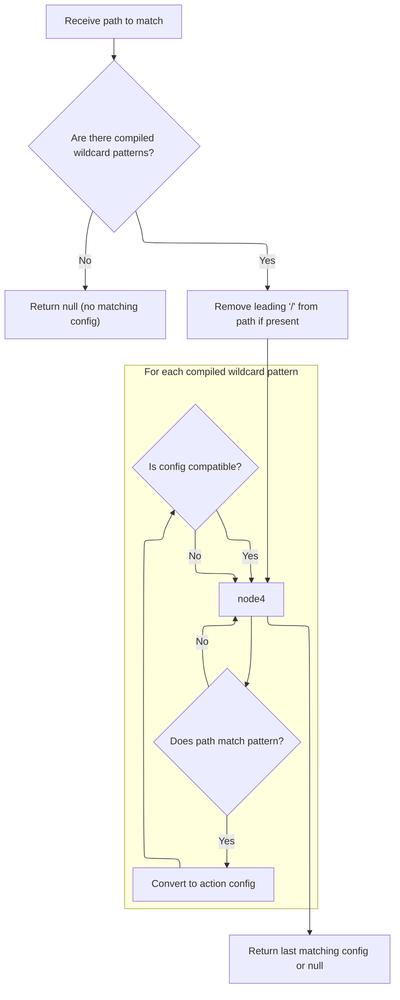

This document describes how the application matches incoming request paths to action configurations, enabling dynamic routing and flexible handling of user requests. The flow receives a path as input, checks for matching wildcard patterns, and, if a match is found, generates a customized action configuration using variables from the path.

# Where is this flow used?

This flow is used multiple times in the codebase as represented in the following diagram:

(Note - these are only some of the entry points of this flow)

```mermaid
graph TD;
      dde35d78060f1afca84b5e9dedc002fc37669b07142e9d5a1f656107cc900aa0(core/…/action/ActionServlet.java::ActionServlet.doGet) --> 294cd284fa406b4fe4f160157c73b79eaa7835613a545efd883ce1f14dd1ca7e(core/…/action/ActionServlet.java::ActionServlet.process)

294cd284fa406b4fe4f160157c73b79eaa7835613a545efd883ce1f14dd1ca7e(core/…/action/ActionServlet.java::ActionServlet.process) --> 8021481ad2e61cbffbd4896e05edd9e89db84071d125277e9a801c0e7ae658c3(core/…/action/ActionServlet.java::ActionServlet.getRequestProcessor)

294cd284fa406b4fe4f160157c73b79eaa7835613a545efd883ce1f14dd1ca7e(core/…/action/ActionServlet.java::ActionServlet.process) --> 1f3af44bfff9bae4b8af237be5302e37d202c99867273a09e77b9f6144dee63a(core/…/action/RequestProcessor.java::RequestProcessor.process)

8021481ad2e61cbffbd4896e05edd9e89db84071d125277e9a801c0e7ae658c3(core/…/action/ActionServlet.java::ActionServlet.getRequestProcessor) --> b2f59f4493e68c30a2337ffecc4fad8d1689fba0a6112201541d9b6d2026e962(core/…/action/ActionServlet.java::ActionServlet.init)

b2f59f4493e68c30a2337ffecc4fad8d1689fba0a6112201541d9b6d2026e962(core/…/action/ActionServlet.java::ActionServlet.init) --> cfcf3460ab594a484429c06cefc93c0462d46ff715ba3343ca651bd4c0411fea(core/…/action/ActionServlet.java::ActionServlet.initModuleActions)

b2f59f4493e68c30a2337ffecc4fad8d1689fba0a6112201541d9b6d2026e962(core/…/action/ActionServlet.java::ActionServlet.init) --> 65beff19e283dcc9f10a2d5b921efb59af07ff7f298d2ae532cae422039f99ba(core/…/action/ActionServlet.java::ActionServlet.initModulePlugIns)

b2f59f4493e68c30a2337ffecc4fad8d1689fba0a6112201541d9b6d2026e962(core/…/action/ActionServlet.java::ActionServlet.init) --> ea102a57045624818ae6d3884269c35a739052b363683a643b89d72d74ac6979(core/…/action/ActionServlet.java::ActionServlet.initModuleFormBeans)

cfcf3460ab594a484429c06cefc93c0462d46ff715ba3343ca651bd4c0411fea(core/…/action/ActionServlet.java::ActionServlet.initModuleActions) --> beebc7012d8bac444c7c390e03e63a2de7a18c2d6f2a62c60738f0e5add65a82(core/…/action/ActionServlet.java::ActionServlet.processActionConfigExtension)

beebc7012d8bac444c7c390e03e63a2de7a18c2d6f2a62c60738f0e5add65a82(core/…/action/ActionServlet.java::ActionServlet.processActionConfigExtension) --> 02127436f839446eebf4a672a4b943b4d1f112ae65ccf86b7dc4bc6a96e51cc9(core/…/action/ActionServlet.java::ActionServlet.processActionConfigClass)

beebc7012d8bac444c7c390e03e63a2de7a18c2d6f2a62c60738f0e5add65a82(core/…/action/ActionServlet.java::ActionServlet.processActionConfigExtension) --> e65d7274df6c676abd8caea3833f06a0cf7c56d9ae1f25d936e0b45f327d8ea8(core/…/config/ActionConfig.java::ActionConfig.processExtends)

02127436f839446eebf4a672a4b943b4d1f112ae65ccf86b7dc4bc6a96e51cc9(core/…/action/ActionServlet.java::ActionServlet.processActionConfigClass) --> fa78b50162eda7e9128ab5ab88c15d66232dbc66a0d2e6a80ae36433dfae3aa3(core/…/impl/ModuleConfigImpl.java::ModuleConfigImpl.findActionConfig)

fa78b50162eda7e9128ab5ab88c15d66232dbc66a0d2e6a80ae36433dfae3aa3(core/…/impl/ModuleConfigImpl.java::ModuleConfigImpl.findActionConfig) --> d78ceed0aaabdc0c62a1b715cc4813e2d01bf58432647d03afde6bce74ecfe4b(core/…/config/ActionConfigMatcher.java::ActionConfigMatcher.match)

e65d7274df6c676abd8caea3833f06a0cf7c56d9ae1f25d936e0b45f327d8ea8(core/…/config/ActionConfig.java::ActionConfig.processExtends) --> fa78b50162eda7e9128ab5ab88c15d66232dbc66a0d2e6a80ae36433dfae3aa3(core/…/impl/ModuleConfigImpl.java::ModuleConfigImpl.findActionConfig)

e65d7274df6c676abd8caea3833f06a0cf7c56d9ae1f25d936e0b45f327d8ea8(core/…/config/ActionConfig.java::ActionConfig.processExtends) --> 4371df41897571b238630b3feb297f9fa5bca4ab4d8a0ea463a699180282e94b(core/…/config/ActionConfig.java::ActionConfig.inheritFrom)

e65d7274df6c676abd8caea3833f06a0cf7c56d9ae1f25d936e0b45f327d8ea8(core/…/config/ActionConfig.java::ActionConfig.processExtends) --> e65d7274df6c676abd8caea3833f06a0cf7c56d9ae1f25d936e0b45f327d8ea8(core/…/config/ActionConfig.java::ActionConfig.processExtends)

e65d7274df6c676abd8caea3833f06a0cf7c56d9ae1f25d936e0b45f327d8ea8(core/…/config/ActionConfig.java::ActionConfig.processExtends) --> f669f02376a4d95250878ad41ca350bb2fda151b9e46d06d8995fee59357585c(core/…/config/ActionConfig.java::ActionConfig.checkCircularInheritance)

4371df41897571b238630b3feb297f9fa5bca4ab4d8a0ea463a699180282e94b(core/…/config/ActionConfig.java::ActionConfig.inheritFrom) --> 293db98b4b79a198cf4c7aa11d34e58ccdc48c490f500a7a12e560f033a66cee(core/…/config/ActionConfig.java::ActionConfig.inheritForwards)

4371df41897571b238630b3feb297f9fa5bca4ab4d8a0ea463a699180282e94b(core/…/config/ActionConfig.java::ActionConfig.inheritFrom) --> a24eff67b32fc35842310f0beb8ff0d9d3f92987eb8e18346754b1ec2cc6dd1a(core/…/config/ActionConfig.java::ActionConfig.inheritExceptionHandlers)

293db98b4b79a198cf4c7aa11d34e58ccdc48c490f500a7a12e560f033a66cee(core/…/config/ActionConfig.java::ActionConfig.inheritForwards) --> e65d7274df6c676abd8caea3833f06a0cf7c56d9ae1f25d936e0b45f327d8ea8(core/…/config/ActionConfig.java::ActionConfig.processExtends)

a24eff67b32fc35842310f0beb8ff0d9d3f92987eb8e18346754b1ec2cc6dd1a(core/…/config/ActionConfig.java::ActionConfig.inheritExceptionHandlers) --> e65d7274df6c676abd8caea3833f06a0cf7c56d9ae1f25d936e0b45f327d8ea8(core/…/config/ActionConfig.java::ActionConfig.processExtends)

f669f02376a4d95250878ad41ca350bb2fda151b9e46d06d8995fee59357585c(core/…/config/ActionConfig.java::ActionConfig.checkCircularInheritance) --> fa78b50162eda7e9128ab5ab88c15d66232dbc66a0d2e6a80ae36433dfae3aa3(core/…/impl/ModuleConfigImpl.java::ModuleConfigImpl.findActionConfig)

65beff19e283dcc9f10a2d5b921efb59af07ff7f298d2ae532cae422039f99ba(core/…/action/ActionServlet.java::ActionServlet.initModulePlugIns) --> b2f59f4493e68c30a2337ffecc4fad8d1689fba0a6112201541d9b6d2026e962(core/…/action/ActionServlet.java::ActionServlet.init)

ea102a57045624818ae6d3884269c35a739052b363683a643b89d72d74ac6979(core/…/action/ActionServlet.java::ActionServlet.initModuleFormBeans) --> 9e0380d4f7afb0671936f74d25617a1bb415c1ae1caf68c78f12f70e5206bcb6(core/…/action/ActionServlet.java::ActionServlet.processFormBeanExtension)

9e0380d4f7afb0671936f74d25617a1bb415c1ae1caf68c78f12f70e5206bcb6(core/…/action/ActionServlet.java::ActionServlet.processFormBeanExtension) --> 990a49a237f841175c6402951d282586d1ded787da3a7042301491030f002d5c(core/…/config/FormBeanConfig.java::FormBeanConfig.processExtends)

990a49a237f841175c6402951d282586d1ded787da3a7042301491030f002d5c(core/…/config/FormBeanConfig.java::FormBeanConfig.processExtends) --> e65d7274df6c676abd8caea3833f06a0cf7c56d9ae1f25d936e0b45f327d8ea8(core/…/config/ActionConfig.java::ActionConfig.processExtends)

1f3af44bfff9bae4b8af237be5302e37d202c99867273a09e77b9f6144dee63a(core/…/action/RequestProcessor.java::RequestProcessor.process) --> 0c9cb49bdb040eed76901f56d000ab5c3effd22be46871f3be143581c6349085(core/…/action/RequestProcessor.java::RequestProcessor.processMapping)

0c9cb49bdb040eed76901f56d000ab5c3effd22be46871f3be143581c6349085(core/…/action/RequestProcessor.java::RequestProcessor.processMapping) --> fa78b50162eda7e9128ab5ab88c15d66232dbc66a0d2e6a80ae36433dfae3aa3(core/…/impl/ModuleConfigImpl.java::ModuleConfigImpl.findActionConfig)

ec52fb7c28a6afaae4fd5937965ca776c6c12441d8a10e0b92b387b05c5c5cf5(core/…/action/ActionServlet.java::ActionServlet.doPost) --> 294cd284fa406b4fe4f160157c73b79eaa7835613a545efd883ce1f14dd1ca7e(core/…/action/ActionServlet.java::ActionServlet.process)

2a2f9513cbb02a07a418db6710bfd4000d7fe6d6588bf97ea3d57de50a8872e6(taglib/…/logic/NestedIterateTag.java::NestedIterateTag.doStartTag) --> b19d992fdd880149cdcce47b903a13c2e50663f2dd3b95cd63794022ff0cd409(taglib/…/nested/NestedPropertyHelper.java::NestedPropertyHelper.setNestedProperties)

2a2f9513cbb02a07a418db6710bfd4000d7fe6d6588bf97ea3d57de50a8872e6(taglib/…/logic/NestedIterateTag.java::NestedIterateTag.doStartTag) --> 577cd8d0b4648ce702b6e860ceb39ce500241d645348e12c9c3535d95c2b9a7b(taglib/…/nested/NestedPropertyHelper.java::NestedPropertyHelper.getAdjustedProperty)

b19d992fdd880149cdcce47b903a13c2e50663f2dd3b95cd63794022ff0cd409(taglib/…/nested/NestedPropertyHelper.java::NestedPropertyHelper.setNestedProperties) --> 577cd8d0b4648ce702b6e860ceb39ce500241d645348e12c9c3535d95c2b9a7b(taglib/…/nested/NestedPropertyHelper.java::NestedPropertyHelper.getAdjustedProperty)

577cd8d0b4648ce702b6e860ceb39ce500241d645348e12c9c3535d95c2b9a7b(taglib/…/nested/NestedPropertyHelper.java::NestedPropertyHelper.getAdjustedProperty) --> fbb7afed920e3a830ac08c7049b5c862bb260de328a35d7e793438ce064353ca(taglib/…/nested/NestedPropertyHelper.java::NestedPropertyHelper.calculateRelativeProperty)

fbb7afed920e3a830ac08c7049b5c862bb260de328a35d7e793438ce064353ca(taglib/…/nested/NestedPropertyHelper.java::NestedPropertyHelper.calculateRelativeProperty) --> 3f30bf537d7dc73652c0d273e504564165f608062343362feb8f138175431c8c(core/…/validwhen/ValidWhenLexer.java::ValidWhenLexer.nextToken)

3f30bf537d7dc73652c0d273e504564165f608062343362feb8f138175431c8c(core/…/validwhen/ValidWhenLexer.java::ValidWhenLexer.nextToken) --> ef91a1a19b4659b6b735b95470b22e4f8f9dd8e13f89df2f1a804b7dfea70dd0(core/…/validwhen/ValidWhenLexer.java::ValidWhenLexer.mWS)

3f30bf537d7dc73652c0d273e504564165f608062343362feb8f138175431c8c(core/…/validwhen/ValidWhenLexer.java::ValidWhenLexer.nextToken) --> 7da170a3504cb2e433260f293fdbbf304c499c9c20ede71811463723eb282dd1(core/…/validwhen/ValidWhenLexer.java::ValidWhenLexer.mDECIMAL_LITERAL)

3f30bf537d7dc73652c0d273e504564165f608062343362feb8f138175431c8c(core/…/validwhen/ValidWhenLexer.java::ValidWhenLexer.nextToken) --> 3d1de05461d9471adcd4882b8c3d3cb7a0c73135d698d9f446a2814524b6dcf7(core/…/validwhen/ValidWhenLexer.java::ValidWhenLexer.mSTRING_LITERAL)

3f30bf537d7dc73652c0d273e504564165f608062343362feb8f138175431c8c(core/…/validwhen/ValidWhenLexer.java::ValidWhenLexer.nextToken) --> d4df5a893bb7031adff645dda84b8ce98273d791652222eec4f01f8efca860b5(core/…/validwhen/ValidWhenLexer.java::ValidWhenLexer.mLBRACKET)

3f30bf537d7dc73652c0d273e504564165f608062343362feb8f138175431c8c(core/…/validwhen/ValidWhenLexer.java::ValidWhenLexer.nextToken) --> 6904ac578dabda8b1cbd44e8cf22d3270850f15e4eb358067158ed321bd8b284(core/…/validwhen/ValidWhenLexer.java::ValidWhenLexer.mRBRACKET)

3f30bf537d7dc73652c0d273e504564165f608062343362feb8f138175431c8c(core/…/validwhen/ValidWhenLexer.java::ValidWhenLexer.nextToken) --> 3e8bb29d4670c543bf499e26c878de2411299fa48924dfc659c6fa9263b86de3(core/…/validwhen/ValidWhenLexer.java::ValidWhenLexer.mLPAREN)

3f30bf537d7dc73652c0d273e504564165f608062343362feb8f138175431c8c(core/…/validwhen/ValidWhenLexer.java::ValidWhenLexer.nextToken) --> e8e004624b74d273975f8c1b8174c76046d4ab04aa21fb01ed33d4442c517e0c(core/…/validwhen/ValidWhenLexer.java::ValidWhenLexer.mRPAREN)

3f30bf537d7dc73652c0d273e504564165f608062343362feb8f138175431c8c(core/…/validwhen/ValidWhenLexer.java::ValidWhenLexer.nextToken) --> 90d8102908e0b10ff3d8bcd2187a0b18c46ce4edce2aff30662098e58df6c829(core/…/validwhen/ValidWhenLexer.java::ValidWhenLexer.mTHIS)

3f30bf537d7dc73652c0d273e504564165f608062343362feb8f138175431c8c(core/…/validwhen/ValidWhenLexer.java::ValidWhenLexer.nextToken) --> 09ec7835b8e03b9c915616803d9c18c6389de06037b5f72950a1e45ccd9b33a7(core/…/validwhen/ValidWhenLexer.java::ValidWhenLexer.mIDENTIFIER)

3f30bf537d7dc73652c0d273e504564165f608062343362feb8f138175431c8c(core/…/validwhen/ValidWhenLexer.java::ValidWhenLexer.nextToken) --> 64731b4cb6b9d56960b0a4f6aa84c780906858f4f1b67692c734c3aed4e17697(core/…/validwhen/ValidWhenLexer.java::ValidWhenLexer.mEQUALSIGN)

3f30bf537d7dc73652c0d273e504564165f608062343362feb8f138175431c8c(core/…/validwhen/ValidWhenLexer.java::ValidWhenLexer.nextToken) --> 1fe56c9e2b26da4b0f1b8da9b134b8fa0c2cee44c5a97ed30484d8e784782f13(core/…/validwhen/ValidWhenLexer.java::ValidWhenLexer.mNOTEQUALSIGN)

3f30bf537d7dc73652c0d273e504564165f608062343362feb8f138175431c8c(core/…/validwhen/ValidWhenLexer.java::ValidWhenLexer.nextToken) --> 7cf68d3bda6bd78003f9d7b757182a445092432fab26a2b35346cfe39b919366(core/…/validwhen/ValidWhenLexer.java::ValidWhenLexer.mLESSTHANSIGN)

3f30bf537d7dc73652c0d273e504564165f608062343362feb8f138175431c8c(core/…/validwhen/ValidWhenLexer.java::ValidWhenLexer.nextToken) --> a56cd4e8d0f961c7d4bf7c2cb6f3ca9fd43325edd9820d258b1154345ca11523(core/…/validwhen/ValidWhenLexer.java::ValidWhenLexer.mGREATERTHANSIGN)

3f30bf537d7dc73652c0d273e504564165f608062343362feb8f138175431c8c(core/…/validwhen/ValidWhenLexer.java::ValidWhenLexer.nextToken) --> 4af7ecf29172e27c31a81a93b1bba0f6cb9a31a135689b1dde371ccb8d1bde80(core/…/validwhen/ValidWhenLexer.java::ValidWhenLexer.mLESSEQUALSIGN)

3f30bf537d7dc73652c0d273e504564165f608062343362feb8f138175431c8c(core/…/validwhen/ValidWhenLexer.java::ValidWhenLexer.nextToken) --> 7b1f7b65d7fda31a4db5ec84c28032426d6e575dc6d24ff4e9042ad60087d86d(core/…/validwhen/ValidWhenLexer.java::ValidWhenLexer.mGREATEREQUALSIGN)

ef91a1a19b4659b6b735b95470b22e4f8f9dd8e13f89df2f1a804b7dfea70dd0(core/…/validwhen/ValidWhenLexer.java::ValidWhenLexer.mWS) --> d78ceed0aaabdc0c62a1b715cc4813e2d01bf58432647d03afde6bce74ecfe4b(core/…/config/ActionConfigMatcher.java::ActionConfigMatcher.match)

7da170a3504cb2e433260f293fdbbf304c499c9c20ede71811463723eb282dd1(core/…/validwhen/ValidWhenLexer.java::ValidWhenLexer.mDECIMAL_LITERAL) --> d78ceed0aaabdc0c62a1b715cc4813e2d01bf58432647d03afde6bce74ecfe4b(core/…/config/ActionConfigMatcher.java::ActionConfigMatcher.match)

3d1de05461d9471adcd4882b8c3d3cb7a0c73135d698d9f446a2814524b6dcf7(core/…/validwhen/ValidWhenLexer.java::ValidWhenLexer.mSTRING_LITERAL) --> d78ceed0aaabdc0c62a1b715cc4813e2d01bf58432647d03afde6bce74ecfe4b(core/…/config/ActionConfigMatcher.java::ActionConfigMatcher.match)

d4df5a893bb7031adff645dda84b8ce98273d791652222eec4f01f8efca860b5(core/…/validwhen/ValidWhenLexer.java::ValidWhenLexer.mLBRACKET) --> d78ceed0aaabdc0c62a1b715cc4813e2d01bf58432647d03afde6bce74ecfe4b(core/…/config/ActionConfigMatcher.java::ActionConfigMatcher.match)

6904ac578dabda8b1cbd44e8cf22d3270850f15e4eb358067158ed321bd8b284(core/…/validwhen/ValidWhenLexer.java::ValidWhenLexer.mRBRACKET) --> d78ceed0aaabdc0c62a1b715cc4813e2d01bf58432647d03afde6bce74ecfe4b(core/…/config/ActionConfigMatcher.java::ActionConfigMatcher.match)

3e8bb29d4670c543bf499e26c878de2411299fa48924dfc659c6fa9263b86de3(core/…/validwhen/ValidWhenLexer.java::ValidWhenLexer.mLPAREN) --> d78ceed0aaabdc0c62a1b715cc4813e2d01bf58432647d03afde6bce74ecfe4b(core/…/config/ActionConfigMatcher.java::ActionConfigMatcher.match)

e8e004624b74d273975f8c1b8174c76046d4ab04aa21fb01ed33d4442c517e0c(core/…/validwhen/ValidWhenLexer.java::ValidWhenLexer.mRPAREN) --> d78ceed0aaabdc0c62a1b715cc4813e2d01bf58432647d03afde6bce74ecfe4b(core/…/config/ActionConfigMatcher.java::ActionConfigMatcher.match)

90d8102908e0b10ff3d8bcd2187a0b18c46ce4edce2aff30662098e58df6c829(core/…/validwhen/ValidWhenLexer.java::ValidWhenLexer.mTHIS) --> d78ceed0aaabdc0c62a1b715cc4813e2d01bf58432647d03afde6bce74ecfe4b(core/…/config/ActionConfigMatcher.java::ActionConfigMatcher.match)

09ec7835b8e03b9c915616803d9c18c6389de06037b5f72950a1e45ccd9b33a7(core/…/validwhen/ValidWhenLexer.java::ValidWhenLexer.mIDENTIFIER) --> d78ceed0aaabdc0c62a1b715cc4813e2d01bf58432647d03afde6bce74ecfe4b(core/…/config/ActionConfigMatcher.java::ActionConfigMatcher.match)

64731b4cb6b9d56960b0a4f6aa84c780906858f4f1b67692c734c3aed4e17697(core/…/validwhen/ValidWhenLexer.java::ValidWhenLexer.mEQUALSIGN) --> d78ceed0aaabdc0c62a1b715cc4813e2d01bf58432647d03afde6bce74ecfe4b(core/…/config/ActionConfigMatcher.java::ActionConfigMatcher.match)

1fe56c9e2b26da4b0f1b8da9b134b8fa0c2cee44c5a97ed30484d8e784782f13(core/…/validwhen/ValidWhenLexer.java::ValidWhenLexer.mNOTEQUALSIGN) --> d78ceed0aaabdc0c62a1b715cc4813e2d01bf58432647d03afde6bce74ecfe4b(core/…/config/ActionConfigMatcher.java::ActionConfigMatcher.match)

7cf68d3bda6bd78003f9d7b757182a445092432fab26a2b35346cfe39b919366(core/…/validwhen/ValidWhenLexer.java::ValidWhenLexer.mLESSTHANSIGN) --> d78ceed0aaabdc0c62a1b715cc4813e2d01bf58432647d03afde6bce74ecfe4b(core/…/config/ActionConfigMatcher.java::ActionConfigMatcher.match)

a56cd4e8d0f961c7d4bf7c2cb6f3ca9fd43325edd9820d258b1154345ca11523(core/…/validwhen/ValidWhenLexer.java::ValidWhenLexer.mGREATERTHANSIGN) --> d78ceed0aaabdc0c62a1b715cc4813e2d01bf58432647d03afde6bce74ecfe4b(core/…/config/ActionConfigMatcher.java::ActionConfigMatcher.match)

4af7ecf29172e27c31a81a93b1bba0f6cb9a31a135689b1dde371ccb8d1bde80(core/…/validwhen/ValidWhenLexer.java::ValidWhenLexer.mLESSEQUALSIGN) --> d78ceed0aaabdc0c62a1b715cc4813e2d01bf58432647d03afde6bce74ecfe4b(core/…/config/ActionConfigMatcher.java::ActionConfigMatcher.match)

7b1f7b65d7fda31a4db5ec84c28032426d6e575dc6d24ff4e9042ad60087d86d(core/…/validwhen/ValidWhenLexer.java::ValidWhenLexer.mGREATEREQUALSIGN) --> d78ceed0aaabdc0c62a1b715cc4813e2d01bf58432647d03afde6bce74ecfe4b(core/…/config/ActionConfigMatcher.java::ActionConfigMatcher.match)

2b2b21443b50fff2d167e05f9a396a8acffed93630620f6578e0d575ee4d457c(taglib/…/html/NestedOptionsTag.java::NestedOptionsTag.doStartTag) --> b19d992fdd880149cdcce47b903a13c2e50663f2dd3b95cd63794022ff0cd409(taglib/…/nested/NestedPropertyHelper.java::NestedPropertyHelper.setNestedProperties)

2b2b21443b50fff2d167e05f9a396a8acffed93630620f6578e0d575ee4d457c(taglib/…/html/NestedOptionsTag.java::NestedOptionsTag.doStartTag) --> 577cd8d0b4648ce702b6e860ceb39ce500241d645348e12c9c3535d95c2b9a7b(taglib/…/nested/NestedPropertyHelper.java::NestedPropertyHelper.getAdjustedProperty)

f42b5fa1bea56d8ff671c6affb9d85867c0cd9c866b2e87d4e79e1160c4ffca1(tiles/…/tiles/RedeployableActionServlet.java::RedeployableActionServlet.getRequestProcessor) --> 8021481ad2e61cbffbd4896e05edd9e89db84071d125277e9a801c0e7ae658c3(core/…/action/ActionServlet.java::ActionServlet.getRequestProcessor)


classDef mainFlowStyle color:#000000,fill:#7CB9F4
classDef rootsStyle color:#000000,fill:#00FFF4
classDef Style1 color:#000000,fill:#00FFAA
classDef Style2 color:#000000,fill:#FFFF00
classDef Style3 color:#000000,fill:#AA7CB9

%% Swimm:
%% graph TD;
%%       dde35d78060f1afca84b5e9dedc002fc37669b07142e9d5a1f656107cc900aa0(<SwmPath>[core/…/action/ActionServlet.java](core/src/main/java/org/apache/struts/action/ActionServlet.java)</SwmPath>::ActionServlet.doGet) --> 294cd284fa406b4fe4f160157c73b79eaa7835613a545efd883ce1f14dd1ca7e(<SwmPath>[core/…/action/ActionServlet.java](core/src/main/java/org/apache/struts/action/ActionServlet.java)</SwmPath>::ActionServlet.process)
%% 
%% 294cd284fa406b4fe4f160157c73b79eaa7835613a545efd883ce1f14dd1ca7e(<SwmPath>[core/…/action/ActionServlet.java](core/src/main/java/org/apache/struts/action/ActionServlet.java)</SwmPath>::ActionServlet.process) --> 8021481ad2e61cbffbd4896e05edd9e89db84071d125277e9a801c0e7ae658c3(<SwmPath>[core/…/action/ActionServlet.java](core/src/main/java/org/apache/struts/action/ActionServlet.java)</SwmPath>::ActionServlet.getRequestProcessor)
%% 
%% 294cd284fa406b4fe4f160157c73b79eaa7835613a545efd883ce1f14dd1ca7e(<SwmPath>[core/…/action/ActionServlet.java](core/src/main/java/org/apache/struts/action/ActionServlet.java)</SwmPath>::ActionServlet.process) --> 1f3af44bfff9bae4b8af237be5302e37d202c99867273a09e77b9f6144dee63a(<SwmPath>[core/…/action/RequestProcessor.java](core/src/main/java/org/apache/struts/action/RequestProcessor.java)</SwmPath>::RequestProcessor.process)
%% 
%% 8021481ad2e61cbffbd4896e05edd9e89db84071d125277e9a801c0e7ae658c3(<SwmPath>[core/…/action/ActionServlet.java](core/src/main/java/org/apache/struts/action/ActionServlet.java)</SwmPath>::ActionServlet.getRequestProcessor) --> b2f59f4493e68c30a2337ffecc4fad8d1689fba0a6112201541d9b6d2026e962(<SwmPath>[core/…/action/ActionServlet.java](core/src/main/java/org/apache/struts/action/ActionServlet.java)</SwmPath>::ActionServlet.init)
%% 
%% b2f59f4493e68c30a2337ffecc4fad8d1689fba0a6112201541d9b6d2026e962(<SwmPath>[core/…/action/ActionServlet.java](core/src/main/java/org/apache/struts/action/ActionServlet.java)</SwmPath>::ActionServlet.init) --> cfcf3460ab594a484429c06cefc93c0462d46ff715ba3343ca651bd4c0411fea(<SwmPath>[core/…/action/ActionServlet.java](core/src/main/java/org/apache/struts/action/ActionServlet.java)</SwmPath>::ActionServlet.initModuleActions)
%% 
%% b2f59f4493e68c30a2337ffecc4fad8d1689fba0a6112201541d9b6d2026e962(<SwmPath>[core/…/action/ActionServlet.java](core/src/main/java/org/apache/struts/action/ActionServlet.java)</SwmPath>::ActionServlet.init) --> 65beff19e283dcc9f10a2d5b921efb59af07ff7f298d2ae532cae422039f99ba(<SwmPath>[core/…/action/ActionServlet.java](core/src/main/java/org/apache/struts/action/ActionServlet.java)</SwmPath>::ActionServlet.initModulePlugIns)
%% 
%% b2f59f4493e68c30a2337ffecc4fad8d1689fba0a6112201541d9b6d2026e962(<SwmPath>[core/…/action/ActionServlet.java](core/src/main/java/org/apache/struts/action/ActionServlet.java)</SwmPath>::ActionServlet.init) --> ea102a57045624818ae6d3884269c35a739052b363683a643b89d72d74ac6979(<SwmPath>[core/…/action/ActionServlet.java](core/src/main/java/org/apache/struts/action/ActionServlet.java)</SwmPath>::ActionServlet.initModuleFormBeans)
%% 
%% cfcf3460ab594a484429c06cefc93c0462d46ff715ba3343ca651bd4c0411fea(<SwmPath>[core/…/action/ActionServlet.java](core/src/main/java/org/apache/struts/action/ActionServlet.java)</SwmPath>::ActionServlet.initModuleActions) --> beebc7012d8bac444c7c390e03e63a2de7a18c2d6f2a62c60738f0e5add65a82(<SwmPath>[core/…/action/ActionServlet.java](core/src/main/java/org/apache/struts/action/ActionServlet.java)</SwmPath>::ActionServlet.processActionConfigExtension)
%% 
%% beebc7012d8bac444c7c390e03e63a2de7a18c2d6f2a62c60738f0e5add65a82(<SwmPath>[core/…/action/ActionServlet.java](core/src/main/java/org/apache/struts/action/ActionServlet.java)</SwmPath>::ActionServlet.processActionConfigExtension) --> 02127436f839446eebf4a672a4b943b4d1f112ae65ccf86b7dc4bc6a96e51cc9(<SwmPath>[core/…/action/ActionServlet.java](core/src/main/java/org/apache/struts/action/ActionServlet.java)</SwmPath>::ActionServlet.processActionConfigClass)
%% 
%% beebc7012d8bac444c7c390e03e63a2de7a18c2d6f2a62c60738f0e5add65a82(<SwmPath>[core/…/action/ActionServlet.java](core/src/main/java/org/apache/struts/action/ActionServlet.java)</SwmPath>::ActionServlet.processActionConfigExtension) --> e65d7274df6c676abd8caea3833f06a0cf7c56d9ae1f25d936e0b45f327d8ea8(<SwmPath>[core/…/config/ActionConfig.java](core/src/main/java/org/apache/struts/config/ActionConfig.java)</SwmPath>::ActionConfig.processExtends)
%% 
%% 02127436f839446eebf4a672a4b943b4d1f112ae65ccf86b7dc4bc6a96e51cc9(<SwmPath>[core/…/action/ActionServlet.java](core/src/main/java/org/apache/struts/action/ActionServlet.java)</SwmPath>::ActionServlet.processActionConfigClass) --> fa78b50162eda7e9128ab5ab88c15d66232dbc66a0d2e6a80ae36433dfae3aa3(<SwmPath>[core/…/impl/ModuleConfigImpl.java](core/src/main/java/org/apache/struts/config/impl/ModuleConfigImpl.java)</SwmPath>::ModuleConfigImpl.findActionConfig)
%% 
%% fa78b50162eda7e9128ab5ab88c15d66232dbc66a0d2e6a80ae36433dfae3aa3(<SwmPath>[core/…/impl/ModuleConfigImpl.java](core/src/main/java/org/apache/struts/config/impl/ModuleConfigImpl.java)</SwmPath>::ModuleConfigImpl.findActionConfig) --> d78ceed0aaabdc0c62a1b715cc4813e2d01bf58432647d03afde6bce74ecfe4b(<SwmPath>[core/…/config/ActionConfigMatcher.java](core/src/main/java/org/apache/struts/config/ActionConfigMatcher.java)</SwmPath>::ActionConfigMatcher.match)
%% 
%% e65d7274df6c676abd8caea3833f06a0cf7c56d9ae1f25d936e0b45f327d8ea8(<SwmPath>[core/…/config/ActionConfig.java](core/src/main/java/org/apache/struts/config/ActionConfig.java)</SwmPath>::ActionConfig.processExtends) --> fa78b50162eda7e9128ab5ab88c15d66232dbc66a0d2e6a80ae36433dfae3aa3(<SwmPath>[core/…/impl/ModuleConfigImpl.java](core/src/main/java/org/apache/struts/config/impl/ModuleConfigImpl.java)</SwmPath>::ModuleConfigImpl.findActionConfig)
%% 
%% e65d7274df6c676abd8caea3833f06a0cf7c56d9ae1f25d936e0b45f327d8ea8(<SwmPath>[core/…/config/ActionConfig.java](core/src/main/java/org/apache/struts/config/ActionConfig.java)</SwmPath>::ActionConfig.processExtends) --> 4371df41897571b238630b3feb297f9fa5bca4ab4d8a0ea463a699180282e94b(<SwmPath>[core/…/config/ActionConfig.java](core/src/main/java/org/apache/struts/config/ActionConfig.java)</SwmPath>::ActionConfig.inheritFrom)
%% 
%% e65d7274df6c676abd8caea3833f06a0cf7c56d9ae1f25d936e0b45f327d8ea8(<SwmPath>[core/…/config/ActionConfig.java](core/src/main/java/org/apache/struts/config/ActionConfig.java)</SwmPath>::ActionConfig.processExtends) --> e65d7274df6c676abd8caea3833f06a0cf7c56d9ae1f25d936e0b45f327d8ea8(<SwmPath>[core/…/config/ActionConfig.java](core/src/main/java/org/apache/struts/config/ActionConfig.java)</SwmPath>::ActionConfig.processExtends)
%% 
%% e65d7274df6c676abd8caea3833f06a0cf7c56d9ae1f25d936e0b45f327d8ea8(<SwmPath>[core/…/config/ActionConfig.java](core/src/main/java/org/apache/struts/config/ActionConfig.java)</SwmPath>::ActionConfig.processExtends) --> f669f02376a4d95250878ad41ca350bb2fda151b9e46d06d8995fee59357585c(<SwmPath>[core/…/config/ActionConfig.java](core/src/main/java/org/apache/struts/config/ActionConfig.java)</SwmPath>::ActionConfig.checkCircularInheritance)
%% 
%% 4371df41897571b238630b3feb297f9fa5bca4ab4d8a0ea463a699180282e94b(<SwmPath>[core/…/config/ActionConfig.java](core/src/main/java/org/apache/struts/config/ActionConfig.java)</SwmPath>::ActionConfig.inheritFrom) --> 293db98b4b79a198cf4c7aa11d34e58ccdc48c490f500a7a12e560f033a66cee(<SwmPath>[core/…/config/ActionConfig.java](core/src/main/java/org/apache/struts/config/ActionConfig.java)</SwmPath>::ActionConfig.inheritForwards)
%% 
%% 4371df41897571b238630b3feb297f9fa5bca4ab4d8a0ea463a699180282e94b(<SwmPath>[core/…/config/ActionConfig.java](core/src/main/java/org/apache/struts/config/ActionConfig.java)</SwmPath>::ActionConfig.inheritFrom) --> a24eff67b32fc35842310f0beb8ff0d9d3f92987eb8e18346754b1ec2cc6dd1a(<SwmPath>[core/…/config/ActionConfig.java](core/src/main/java/org/apache/struts/config/ActionConfig.java)</SwmPath>::ActionConfig.inheritExceptionHandlers)
%% 
%% 293db98b4b79a198cf4c7aa11d34e58ccdc48c490f500a7a12e560f033a66cee(<SwmPath>[core/…/config/ActionConfig.java](core/src/main/java/org/apache/struts/config/ActionConfig.java)</SwmPath>::ActionConfig.inheritForwards) --> e65d7274df6c676abd8caea3833f06a0cf7c56d9ae1f25d936e0b45f327d8ea8(<SwmPath>[core/…/config/ActionConfig.java](core/src/main/java/org/apache/struts/config/ActionConfig.java)</SwmPath>::ActionConfig.processExtends)
%% 
%% a24eff67b32fc35842310f0beb8ff0d9d3f92987eb8e18346754b1ec2cc6dd1a(<SwmPath>[core/…/config/ActionConfig.java](core/src/main/java/org/apache/struts/config/ActionConfig.java)</SwmPath>::ActionConfig.inheritExceptionHandlers) --> e65d7274df6c676abd8caea3833f06a0cf7c56d9ae1f25d936e0b45f327d8ea8(<SwmPath>[core/…/config/ActionConfig.java](core/src/main/java/org/apache/struts/config/ActionConfig.java)</SwmPath>::ActionConfig.processExtends)
%% 
%% f669f02376a4d95250878ad41ca350bb2fda151b9e46d06d8995fee59357585c(<SwmPath>[core/…/config/ActionConfig.java](core/src/main/java/org/apache/struts/config/ActionConfig.java)</SwmPath>::ActionConfig.checkCircularInheritance) --> fa78b50162eda7e9128ab5ab88c15d66232dbc66a0d2e6a80ae36433dfae3aa3(<SwmPath>[core/…/impl/ModuleConfigImpl.java](core/src/main/java/org/apache/struts/config/impl/ModuleConfigImpl.java)</SwmPath>::ModuleConfigImpl.findActionConfig)
%% 
%% 65beff19e283dcc9f10a2d5b921efb59af07ff7f298d2ae532cae422039f99ba(<SwmPath>[core/…/action/ActionServlet.java](core/src/main/java/org/apache/struts/action/ActionServlet.java)</SwmPath>::ActionServlet.initModulePlugIns) --> b2f59f4493e68c30a2337ffecc4fad8d1689fba0a6112201541d9b6d2026e962(<SwmPath>[core/…/action/ActionServlet.java](core/src/main/java/org/apache/struts/action/ActionServlet.java)</SwmPath>::ActionServlet.init)
%% 
%% ea102a57045624818ae6d3884269c35a739052b363683a643b89d72d74ac6979(<SwmPath>[core/…/action/ActionServlet.java](core/src/main/java/org/apache/struts/action/ActionServlet.java)</SwmPath>::ActionServlet.initModuleFormBeans) --> 9e0380d4f7afb0671936f74d25617a1bb415c1ae1caf68c78f12f70e5206bcb6(<SwmPath>[core/…/action/ActionServlet.java](core/src/main/java/org/apache/struts/action/ActionServlet.java)</SwmPath>::ActionServlet.processFormBeanExtension)
%% 
%% 9e0380d4f7afb0671936f74d25617a1bb415c1ae1caf68c78f12f70e5206bcb6(<SwmPath>[core/…/action/ActionServlet.java](core/src/main/java/org/apache/struts/action/ActionServlet.java)</SwmPath>::ActionServlet.processFormBeanExtension) --> 990a49a237f841175c6402951d282586d1ded787da3a7042301491030f002d5c(<SwmPath>[core/…/config/FormBeanConfig.java](core/src/main/java/org/apache/struts/config/FormBeanConfig.java)</SwmPath>::FormBeanConfig.processExtends)
%% 
%% 990a49a237f841175c6402951d282586d1ded787da3a7042301491030f002d5c(<SwmPath>[core/…/config/FormBeanConfig.java](core/src/main/java/org/apache/struts/config/FormBeanConfig.java)</SwmPath>::FormBeanConfig.processExtends) --> e65d7274df6c676abd8caea3833f06a0cf7c56d9ae1f25d936e0b45f327d8ea8(<SwmPath>[core/…/config/ActionConfig.java](core/src/main/java/org/apache/struts/config/ActionConfig.java)</SwmPath>::ActionConfig.processExtends)
%% 
%% 1f3af44bfff9bae4b8af237be5302e37d202c99867273a09e77b9f6144dee63a(<SwmPath>[core/…/action/RequestProcessor.java](core/src/main/java/org/apache/struts/action/RequestProcessor.java)</SwmPath>::RequestProcessor.process) --> 0c9cb49bdb040eed76901f56d000ab5c3effd22be46871f3be143581c6349085(<SwmPath>[core/…/action/RequestProcessor.java](core/src/main/java/org/apache/struts/action/RequestProcessor.java)</SwmPath>::RequestProcessor.processMapping)
%% 
%% 0c9cb49bdb040eed76901f56d000ab5c3effd22be46871f3be143581c6349085(<SwmPath>[core/…/action/RequestProcessor.java](core/src/main/java/org/apache/struts/action/RequestProcessor.java)</SwmPath>::RequestProcessor.processMapping) --> fa78b50162eda7e9128ab5ab88c15d66232dbc66a0d2e6a80ae36433dfae3aa3(<SwmPath>[core/…/impl/ModuleConfigImpl.java](core/src/main/java/org/apache/struts/config/impl/ModuleConfigImpl.java)</SwmPath>::ModuleConfigImpl.findActionConfig)
%% 
%% ec52fb7c28a6afaae4fd5937965ca776c6c12441d8a10e0b92b387b05c5c5cf5(<SwmPath>[core/…/action/ActionServlet.java](core/src/main/java/org/apache/struts/action/ActionServlet.java)</SwmPath>::ActionServlet.doPost) --> 294cd284fa406b4fe4f160157c73b79eaa7835613a545efd883ce1f14dd1ca7e(<SwmPath>[core/…/action/ActionServlet.java](core/src/main/java/org/apache/struts/action/ActionServlet.java)</SwmPath>::ActionServlet.process)
%% 
%% 2a2f9513cbb02a07a418db6710bfd4000d7fe6d6588bf97ea3d57de50a8872e6(<SwmPath>[taglib/…/logic/NestedIterateTag.java](taglib/src/main/java/org/apache/struts/taglib/nested/logic/NestedIterateTag.java)</SwmPath>::NestedIterateTag.doStartTag) --> b19d992fdd880149cdcce47b903a13c2e50663f2dd3b95cd63794022ff0cd409(<SwmPath>[taglib/…/nested/NestedPropertyHelper.java](taglib/src/main/java/org/apache/struts/taglib/nested/NestedPropertyHelper.java)</SwmPath>::NestedPropertyHelper.setNestedProperties)
%% 
%% 2a2f9513cbb02a07a418db6710bfd4000d7fe6d6588bf97ea3d57de50a8872e6(<SwmPath>[taglib/…/logic/NestedIterateTag.java](taglib/src/main/java/org/apache/struts/taglib/nested/logic/NestedIterateTag.java)</SwmPath>::NestedIterateTag.doStartTag) --> 577cd8d0b4648ce702b6e860ceb39ce500241d645348e12c9c3535d95c2b9a7b(<SwmPath>[taglib/…/nested/NestedPropertyHelper.java](taglib/src/main/java/org/apache/struts/taglib/nested/NestedPropertyHelper.java)</SwmPath>::NestedPropertyHelper.getAdjustedProperty)
%% 
%% b19d992fdd880149cdcce47b903a13c2e50663f2dd3b95cd63794022ff0cd409(<SwmPath>[taglib/…/nested/NestedPropertyHelper.java](taglib/src/main/java/org/apache/struts/taglib/nested/NestedPropertyHelper.java)</SwmPath>::NestedPropertyHelper.setNestedProperties) --> 577cd8d0b4648ce702b6e860ceb39ce500241d645348e12c9c3535d95c2b9a7b(<SwmPath>[taglib/…/nested/NestedPropertyHelper.java](taglib/src/main/java/org/apache/struts/taglib/nested/NestedPropertyHelper.java)</SwmPath>::NestedPropertyHelper.getAdjustedProperty)
%% 
%% 577cd8d0b4648ce702b6e860ceb39ce500241d645348e12c9c3535d95c2b9a7b(<SwmPath>[taglib/…/nested/NestedPropertyHelper.java](taglib/src/main/java/org/apache/struts/taglib/nested/NestedPropertyHelper.java)</SwmPath>::NestedPropertyHelper.getAdjustedProperty) --> fbb7afed920e3a830ac08c7049b5c862bb260de328a35d7e793438ce064353ca(<SwmPath>[taglib/…/nested/NestedPropertyHelper.java](taglib/src/main/java/org/apache/struts/taglib/nested/NestedPropertyHelper.java)</SwmPath>::NestedPropertyHelper.calculateRelativeProperty)
%% 
%% fbb7afed920e3a830ac08c7049b5c862bb260de328a35d7e793438ce064353ca(<SwmPath>[taglib/…/nested/NestedPropertyHelper.java](taglib/src/main/java/org/apache/struts/taglib/nested/NestedPropertyHelper.java)</SwmPath>::NestedPropertyHelper.calculateRelativeProperty) --> 3f30bf537d7dc73652c0d273e504564165f608062343362feb8f138175431c8c(<SwmPath>[core/…/validwhen/ValidWhenLexer.java](core/src/main/java/org/apache/struts/validator/validwhen/ValidWhenLexer.java)</SwmPath>::ValidWhenLexer.nextToken)
%% 
%% 3f30bf537d7dc73652c0d273e504564165f608062343362feb8f138175431c8c(<SwmPath>[core/…/validwhen/ValidWhenLexer.java](core/src/main/java/org/apache/struts/validator/validwhen/ValidWhenLexer.java)</SwmPath>::ValidWhenLexer.nextToken) --> ef91a1a19b4659b6b735b95470b22e4f8f9dd8e13f89df2f1a804b7dfea70dd0(<SwmPath>[core/…/validwhen/ValidWhenLexer.java](core/src/main/java/org/apache/struts/validator/validwhen/ValidWhenLexer.java)</SwmPath>::ValidWhenLexer.mWS)
%% 
%% 3f30bf537d7dc73652c0d273e504564165f608062343362feb8f138175431c8c(<SwmPath>[core/…/validwhen/ValidWhenLexer.java](core/src/main/java/org/apache/struts/validator/validwhen/ValidWhenLexer.java)</SwmPath>::ValidWhenLexer.nextToken) --> 7da170a3504cb2e433260f293fdbbf304c499c9c20ede71811463723eb282dd1(<SwmPath>[core/…/validwhen/ValidWhenLexer.java](core/src/main/java/org/apache/struts/validator/validwhen/ValidWhenLexer.java)</SwmPath>::ValidWhenLexer.mDECIMAL_LITERAL)
%% 
%% 3f30bf537d7dc73652c0d273e504564165f608062343362feb8f138175431c8c(<SwmPath>[core/…/validwhen/ValidWhenLexer.java](core/src/main/java/org/apache/struts/validator/validwhen/ValidWhenLexer.java)</SwmPath>::ValidWhenLexer.nextToken) --> 3d1de05461d9471adcd4882b8c3d3cb7a0c73135d698d9f446a2814524b6dcf7(<SwmPath>[core/…/validwhen/ValidWhenLexer.java](core/src/main/java/org/apache/struts/validator/validwhen/ValidWhenLexer.java)</SwmPath>::ValidWhenLexer.mSTRING_LITERAL)
%% 
%% 3f30bf537d7dc73652c0d273e504564165f608062343362feb8f138175431c8c(<SwmPath>[core/…/validwhen/ValidWhenLexer.java](core/src/main/java/org/apache/struts/validator/validwhen/ValidWhenLexer.java)</SwmPath>::ValidWhenLexer.nextToken) --> d4df5a893bb7031adff645dda84b8ce98273d791652222eec4f01f8efca860b5(<SwmPath>[core/…/validwhen/ValidWhenLexer.java](core/src/main/java/org/apache/struts/validator/validwhen/ValidWhenLexer.java)</SwmPath>::ValidWhenLexer.mLBRACKET)
%% 
%% 3f30bf537d7dc73652c0d273e504564165f608062343362feb8f138175431c8c(<SwmPath>[core/…/validwhen/ValidWhenLexer.java](core/src/main/java/org/apache/struts/validator/validwhen/ValidWhenLexer.java)</SwmPath>::ValidWhenLexer.nextToken) --> 6904ac578dabda8b1cbd44e8cf22d3270850f15e4eb358067158ed321bd8b284(<SwmPath>[core/…/validwhen/ValidWhenLexer.java](core/src/main/java/org/apache/struts/validator/validwhen/ValidWhenLexer.java)</SwmPath>::ValidWhenLexer.mRBRACKET)
%% 
%% 3f30bf537d7dc73652c0d273e504564165f608062343362feb8f138175431c8c(<SwmPath>[core/…/validwhen/ValidWhenLexer.java](core/src/main/java/org/apache/struts/validator/validwhen/ValidWhenLexer.java)</SwmPath>::ValidWhenLexer.nextToken) --> 3e8bb29d4670c543bf499e26c878de2411299fa48924dfc659c6fa9263b86de3(<SwmPath>[core/…/validwhen/ValidWhenLexer.java](core/src/main/java/org/apache/struts/validator/validwhen/ValidWhenLexer.java)</SwmPath>::ValidWhenLexer.mLPAREN)
%% 
%% 3f30bf537d7dc73652c0d273e504564165f608062343362feb8f138175431c8c(<SwmPath>[core/…/validwhen/ValidWhenLexer.java](core/src/main/java/org/apache/struts/validator/validwhen/ValidWhenLexer.java)</SwmPath>::ValidWhenLexer.nextToken) --> e8e004624b74d273975f8c1b8174c76046d4ab04aa21fb01ed33d4442c517e0c(<SwmPath>[core/…/validwhen/ValidWhenLexer.java](core/src/main/java/org/apache/struts/validator/validwhen/ValidWhenLexer.java)</SwmPath>::ValidWhenLexer.mRPAREN)
%% 
%% 3f30bf537d7dc73652c0d273e504564165f608062343362feb8f138175431c8c(<SwmPath>[core/…/validwhen/ValidWhenLexer.java](core/src/main/java/org/apache/struts/validator/validwhen/ValidWhenLexer.java)</SwmPath>::ValidWhenLexer.nextToken) --> 90d8102908e0b10ff3d8bcd2187a0b18c46ce4edce2aff30662098e58df6c829(<SwmPath>[core/…/validwhen/ValidWhenLexer.java](core/src/main/java/org/apache/struts/validator/validwhen/ValidWhenLexer.java)</SwmPath>::ValidWhenLexer.mTHIS)
%% 
%% 3f30bf537d7dc73652c0d273e504564165f608062343362feb8f138175431c8c(<SwmPath>[core/…/validwhen/ValidWhenLexer.java](core/src/main/java/org/apache/struts/validator/validwhen/ValidWhenLexer.java)</SwmPath>::ValidWhenLexer.nextToken) --> 09ec7835b8e03b9c915616803d9c18c6389de06037b5f72950a1e45ccd9b33a7(<SwmPath>[core/…/validwhen/ValidWhenLexer.java](core/src/main/java/org/apache/struts/validator/validwhen/ValidWhenLexer.java)</SwmPath>::ValidWhenLexer.mIDENTIFIER)
%% 
%% 3f30bf537d7dc73652c0d273e504564165f608062343362feb8f138175431c8c(<SwmPath>[core/…/validwhen/ValidWhenLexer.java](core/src/main/java/org/apache/struts/validator/validwhen/ValidWhenLexer.java)</SwmPath>::ValidWhenLexer.nextToken) --> 64731b4cb6b9d56960b0a4f6aa84c780906858f4f1b67692c734c3aed4e17697(<SwmPath>[core/…/validwhen/ValidWhenLexer.java](core/src/main/java/org/apache/struts/validator/validwhen/ValidWhenLexer.java)</SwmPath>::ValidWhenLexer.mEQUALSIGN)
%% 
%% 3f30bf537d7dc73652c0d273e504564165f608062343362feb8f138175431c8c(<SwmPath>[core/…/validwhen/ValidWhenLexer.java](core/src/main/java/org/apache/struts/validator/validwhen/ValidWhenLexer.java)</SwmPath>::ValidWhenLexer.nextToken) --> 1fe56c9e2b26da4b0f1b8da9b134b8fa0c2cee44c5a97ed30484d8e784782f13(<SwmPath>[core/…/validwhen/ValidWhenLexer.java](core/src/main/java/org/apache/struts/validator/validwhen/ValidWhenLexer.java)</SwmPath>::ValidWhenLexer.mNOTEQUALSIGN)
%% 
%% 3f30bf537d7dc73652c0d273e504564165f608062343362feb8f138175431c8c(<SwmPath>[core/…/validwhen/ValidWhenLexer.java](core/src/main/java/org/apache/struts/validator/validwhen/ValidWhenLexer.java)</SwmPath>::ValidWhenLexer.nextToken) --> 7cf68d3bda6bd78003f9d7b757182a445092432fab26a2b35346cfe39b919366(<SwmPath>[core/…/validwhen/ValidWhenLexer.java](core/src/main/java/org/apache/struts/validator/validwhen/ValidWhenLexer.java)</SwmPath>::ValidWhenLexer.mLESSTHANSIGN)
%% 
%% 3f30bf537d7dc73652c0d273e504564165f608062343362feb8f138175431c8c(<SwmPath>[core/…/validwhen/ValidWhenLexer.java](core/src/main/java/org/apache/struts/validator/validwhen/ValidWhenLexer.java)</SwmPath>::ValidWhenLexer.nextToken) --> a56cd4e8d0f961c7d4bf7c2cb6f3ca9fd43325edd9820d258b1154345ca11523(<SwmPath>[core/…/validwhen/ValidWhenLexer.java](core/src/main/java/org/apache/struts/validator/validwhen/ValidWhenLexer.java)</SwmPath>::ValidWhenLexer.mGREATERTHANSIGN)
%% 
%% 3f30bf537d7dc73652c0d273e504564165f608062343362feb8f138175431c8c(<SwmPath>[core/…/validwhen/ValidWhenLexer.java](core/src/main/java/org/apache/struts/validator/validwhen/ValidWhenLexer.java)</SwmPath>::ValidWhenLexer.nextToken) --> 4af7ecf29172e27c31a81a93b1bba0f6cb9a31a135689b1dde371ccb8d1bde80(<SwmPath>[core/…/validwhen/ValidWhenLexer.java](core/src/main/java/org/apache/struts/validator/validwhen/ValidWhenLexer.java)</SwmPath>::ValidWhenLexer.mLESSEQUALSIGN)
%% 
%% 3f30bf537d7dc73652c0d273e504564165f608062343362feb8f138175431c8c(<SwmPath>[core/…/validwhen/ValidWhenLexer.java](core/src/main/java/org/apache/struts/validator/validwhen/ValidWhenLexer.java)</SwmPath>::ValidWhenLexer.nextToken) --> 7b1f7b65d7fda31a4db5ec84c28032426d6e575dc6d24ff4e9042ad60087d86d(<SwmPath>[core/…/validwhen/ValidWhenLexer.java](core/src/main/java/org/apache/struts/validator/validwhen/ValidWhenLexer.java)</SwmPath>::ValidWhenLexer.mGREATEREQUALSIGN)
%% 
%% ef91a1a19b4659b6b735b95470b22e4f8f9dd8e13f89df2f1a804b7dfea70dd0(<SwmPath>[core/…/validwhen/ValidWhenLexer.java](core/src/main/java/org/apache/struts/validator/validwhen/ValidWhenLexer.java)</SwmPath>::ValidWhenLexer.mWS) --> d78ceed0aaabdc0c62a1b715cc4813e2d01bf58432647d03afde6bce74ecfe4b(<SwmPath>[core/…/config/ActionConfigMatcher.java](core/src/main/java/org/apache/struts/config/ActionConfigMatcher.java)</SwmPath>::ActionConfigMatcher.match)
%% 
%% 7da170a3504cb2e433260f293fdbbf304c499c9c20ede71811463723eb282dd1(<SwmPath>[core/…/validwhen/ValidWhenLexer.java](core/src/main/java/org/apache/struts/validator/validwhen/ValidWhenLexer.java)</SwmPath>::ValidWhenLexer.mDECIMAL_LITERAL) --> d78ceed0aaabdc0c62a1b715cc4813e2d01bf58432647d03afde6bce74ecfe4b(<SwmPath>[core/…/config/ActionConfigMatcher.java](core/src/main/java/org/apache/struts/config/ActionConfigMatcher.java)</SwmPath>::ActionConfigMatcher.match)
%% 
%% 3d1de05461d9471adcd4882b8c3d3cb7a0c73135d698d9f446a2814524b6dcf7(<SwmPath>[core/…/validwhen/ValidWhenLexer.java](core/src/main/java/org/apache/struts/validator/validwhen/ValidWhenLexer.java)</SwmPath>::ValidWhenLexer.mSTRING_LITERAL) --> d78ceed0aaabdc0c62a1b715cc4813e2d01bf58432647d03afde6bce74ecfe4b(<SwmPath>[core/…/config/ActionConfigMatcher.java](core/src/main/java/org/apache/struts/config/ActionConfigMatcher.java)</SwmPath>::ActionConfigMatcher.match)
%% 
%% d4df5a893bb7031adff645dda84b8ce98273d791652222eec4f01f8efca860b5(<SwmPath>[core/…/validwhen/ValidWhenLexer.java](core/src/main/java/org/apache/struts/validator/validwhen/ValidWhenLexer.java)</SwmPath>::ValidWhenLexer.mLBRACKET) --> d78ceed0aaabdc0c62a1b715cc4813e2d01bf58432647d03afde6bce74ecfe4b(<SwmPath>[core/…/config/ActionConfigMatcher.java](core/src/main/java/org/apache/struts/config/ActionConfigMatcher.java)</SwmPath>::ActionConfigMatcher.match)
%% 
%% 6904ac578dabda8b1cbd44e8cf22d3270850f15e4eb358067158ed321bd8b284(<SwmPath>[core/…/validwhen/ValidWhenLexer.java](core/src/main/java/org/apache/struts/validator/validwhen/ValidWhenLexer.java)</SwmPath>::ValidWhenLexer.mRBRACKET) --> d78ceed0aaabdc0c62a1b715cc4813e2d01bf58432647d03afde6bce74ecfe4b(<SwmPath>[core/…/config/ActionConfigMatcher.java](core/src/main/java/org/apache/struts/config/ActionConfigMatcher.java)</SwmPath>::ActionConfigMatcher.match)
%% 
%% 3e8bb29d4670c543bf499e26c878de2411299fa48924dfc659c6fa9263b86de3(<SwmPath>[core/…/validwhen/ValidWhenLexer.java](core/src/main/java/org/apache/struts/validator/validwhen/ValidWhenLexer.java)</SwmPath>::ValidWhenLexer.mLPAREN) --> d78ceed0aaabdc0c62a1b715cc4813e2d01bf58432647d03afde6bce74ecfe4b(<SwmPath>[core/…/config/ActionConfigMatcher.java](core/src/main/java/org/apache/struts/config/ActionConfigMatcher.java)</SwmPath>::ActionConfigMatcher.match)
%% 
%% e8e004624b74d273975f8c1b8174c76046d4ab04aa21fb01ed33d4442c517e0c(<SwmPath>[core/…/validwhen/ValidWhenLexer.java](core/src/main/java/org/apache/struts/validator/validwhen/ValidWhenLexer.java)</SwmPath>::ValidWhenLexer.mRPAREN) --> d78ceed0aaabdc0c62a1b715cc4813e2d01bf58432647d03afde6bce74ecfe4b(<SwmPath>[core/…/config/ActionConfigMatcher.java](core/src/main/java/org/apache/struts/config/ActionConfigMatcher.java)</SwmPath>::ActionConfigMatcher.match)
%% 
%% 90d8102908e0b10ff3d8bcd2187a0b18c46ce4edce2aff30662098e58df6c829(<SwmPath>[core/…/validwhen/ValidWhenLexer.java](core/src/main/java/org/apache/struts/validator/validwhen/ValidWhenLexer.java)</SwmPath>::ValidWhenLexer.mTHIS) --> d78ceed0aaabdc0c62a1b715cc4813e2d01bf58432647d03afde6bce74ecfe4b(<SwmPath>[core/…/config/ActionConfigMatcher.java](core/src/main/java/org/apache/struts/config/ActionConfigMatcher.java)</SwmPath>::ActionConfigMatcher.match)
%% 
%% 09ec7835b8e03b9c915616803d9c18c6389de06037b5f72950a1e45ccd9b33a7(<SwmPath>[core/…/validwhen/ValidWhenLexer.java](core/src/main/java/org/apache/struts/validator/validwhen/ValidWhenLexer.java)</SwmPath>::ValidWhenLexer.mIDENTIFIER) --> d78ceed0aaabdc0c62a1b715cc4813e2d01bf58432647d03afde6bce74ecfe4b(<SwmPath>[core/…/config/ActionConfigMatcher.java](core/src/main/java/org/apache/struts/config/ActionConfigMatcher.java)</SwmPath>::ActionConfigMatcher.match)
%% 
%% 64731b4cb6b9d56960b0a4f6aa84c780906858f4f1b67692c734c3aed4e17697(<SwmPath>[core/…/validwhen/ValidWhenLexer.java](core/src/main/java/org/apache/struts/validator/validwhen/ValidWhenLexer.java)</SwmPath>::ValidWhenLexer.mEQUALSIGN) --> d78ceed0aaabdc0c62a1b715cc4813e2d01bf58432647d03afde6bce74ecfe4b(<SwmPath>[core/…/config/ActionConfigMatcher.java](core/src/main/java/org/apache/struts/config/ActionConfigMatcher.java)</SwmPath>::ActionConfigMatcher.match)
%% 
%% 1fe56c9e2b26da4b0f1b8da9b134b8fa0c2cee44c5a97ed30484d8e784782f13(<SwmPath>[core/…/validwhen/ValidWhenLexer.java](core/src/main/java/org/apache/struts/validator/validwhen/ValidWhenLexer.java)</SwmPath>::ValidWhenLexer.mNOTEQUALSIGN) --> d78ceed0aaabdc0c62a1b715cc4813e2d01bf58432647d03afde6bce74ecfe4b(<SwmPath>[core/…/config/ActionConfigMatcher.java](core/src/main/java/org/apache/struts/config/ActionConfigMatcher.java)</SwmPath>::ActionConfigMatcher.match)
%% 
%% 7cf68d3bda6bd78003f9d7b757182a445092432fab26a2b35346cfe39b919366(<SwmPath>[core/…/validwhen/ValidWhenLexer.java](core/src/main/java/org/apache/struts/validator/validwhen/ValidWhenLexer.java)</SwmPath>::ValidWhenLexer.mLESSTHANSIGN) --> d78ceed0aaabdc0c62a1b715cc4813e2d01bf58432647d03afde6bce74ecfe4b(<SwmPath>[core/…/config/ActionConfigMatcher.java](core/src/main/java/org/apache/struts/config/ActionConfigMatcher.java)</SwmPath>::ActionConfigMatcher.match)
%% 
%% a56cd4e8d0f961c7d4bf7c2cb6f3ca9fd43325edd9820d258b1154345ca11523(<SwmPath>[core/…/validwhen/ValidWhenLexer.java](core/src/main/java/org/apache/struts/validator/validwhen/ValidWhenLexer.java)</SwmPath>::ValidWhenLexer.mGREATERTHANSIGN) --> d78ceed0aaabdc0c62a1b715cc4813e2d01bf58432647d03afde6bce74ecfe4b(<SwmPath>[core/…/config/ActionConfigMatcher.java](core/src/main/java/org/apache/struts/config/ActionConfigMatcher.java)</SwmPath>::ActionConfigMatcher.match)
%% 
%% 4af7ecf29172e27c31a81a93b1bba0f6cb9a31a135689b1dde371ccb8d1bde80(<SwmPath>[core/…/validwhen/ValidWhenLexer.java](core/src/main/java/org/apache/struts/validator/validwhen/ValidWhenLexer.java)</SwmPath>::ValidWhenLexer.mLESSEQUALSIGN) --> d78ceed0aaabdc0c62a1b715cc4813e2d01bf58432647d03afde6bce74ecfe4b(<SwmPath>[core/…/config/ActionConfigMatcher.java](core/src/main/java/org/apache/struts/config/ActionConfigMatcher.java)</SwmPath>::ActionConfigMatcher.match)
%% 
%% 7b1f7b65d7fda31a4db5ec84c28032426d6e575dc6d24ff4e9042ad60087d86d(<SwmPath>[core/…/validwhen/ValidWhenLexer.java](core/src/main/java/org/apache/struts/validator/validwhen/ValidWhenLexer.java)</SwmPath>::ValidWhenLexer.mGREATEREQUALSIGN) --> d78ceed0aaabdc0c62a1b715cc4813e2d01bf58432647d03afde6bce74ecfe4b(<SwmPath>[core/…/config/ActionConfigMatcher.java](core/src/main/java/org/apache/struts/config/ActionConfigMatcher.java)</SwmPath>::ActionConfigMatcher.match)
%% 
%% 2b2b21443b50fff2d167e05f9a396a8acffed93630620f6578e0d575ee4d457c(<SwmPath>[taglib/…/html/NestedOptionsTag.java](taglib/src/main/java/org/apache/struts/taglib/nested/html/NestedOptionsTag.java)</SwmPath>::NestedOptionsTag.doStartTag) --> b19d992fdd880149cdcce47b903a13c2e50663f2dd3b95cd63794022ff0cd409(<SwmPath>[taglib/…/nested/NestedPropertyHelper.java](taglib/src/main/java/org/apache/struts/taglib/nested/NestedPropertyHelper.java)</SwmPath>::NestedPropertyHelper.setNestedProperties)
%% 
%% 2b2b21443b50fff2d167e05f9a396a8acffed93630620f6578e0d575ee4d457c(<SwmPath>[taglib/…/html/NestedOptionsTag.java](taglib/src/main/java/org/apache/struts/taglib/nested/html/NestedOptionsTag.java)</SwmPath>::NestedOptionsTag.doStartTag) --> 577cd8d0b4648ce702b6e860ceb39ce500241d645348e12c9c3535d95c2b9a7b(<SwmPath>[taglib/…/nested/NestedPropertyHelper.java](taglib/src/main/java/org/apache/struts/taglib/nested/NestedPropertyHelper.java)</SwmPath>::NestedPropertyHelper.getAdjustedProperty)
%% 
%% f42b5fa1bea56d8ff671c6affb9d85867c0cd9c866b2e87d4e79e1160c4ffca1(<SwmPath>[tiles/…/tiles/RedeployableActionServlet.java](tiles/src/main/java/org/apache/struts/tiles/RedeployableActionServlet.java)</SwmPath>::RedeployableActionServlet.getRequestProcessor) --> 8021481ad2e61cbffbd4896e05edd9e89db84071d125277e9a801c0e7ae658c3(<SwmPath>[core/…/action/ActionServlet.java](core/src/main/java/org/apache/struts/action/ActionServlet.java)</SwmPath>::ActionServlet.getRequestProcessor)
%% 
%% 
%% classDef mainFlowStyle color:#000000,fill:#7CB9F4
%% classDef rootsStyle color:#000000,fill:#00FFF4
%% classDef Style1 color:#000000,fill:#00FFAA
%% classDef Style2 color:#000000,fill:#FFFF00
%% classDef Style3 color:#000000,fill:#AA7CB9
```

# Matching Paths to Action Configurations



<SwmSnippet path="/core/src/main/java/org/apache/struts/config/ActionConfigMatcher.java" line="101">

---

<SwmToken path="core/src/main/java/org/apache/struts/config/ActionConfigMatcher.java" pos="101:5:5" line-data="    public ActionConfig match(String path) {">`match`</SwmToken> kicks off the flow by normalizing the input path (removes a leading slash), then loops through all compiled wildcard patterns to see if any match the path. If a match is found, it grabs variables from the path and immediately calls <SwmToken path="core/src/main/java/org/apache/struts/config/ActionConfigMatcher.java" pos="128:1:1" line-data="                	    convertActionConfig(path,">`convertActionConfig`</SwmToken> to generate a config tailored to those variables. This is how we get a config that fits the actual request, not just a static template.

```java
    public ActionConfig match(String path) {
        ActionConfig config = null;

        if (compiledPaths.size() > 0) {
            if (log.isDebugEnabled()) {
                log.debug("Attempting to match '" + path
                    + "' to a wildcard pattern");
            }

            if ((path.length() > 0) && (path.charAt(0) == '/')) {
                path = path.substring(1);
            }

            Mapping m;
            HashMap vars = new HashMap();

            for (Iterator i = compiledPaths.iterator(); i.hasNext();) {
                m = (Mapping) i.next();

                if (wildcard.match(vars, path, m.getPattern())) {
                    if (log.isDebugEnabled()) {
                        log.debug("Path matches pattern '"
                            + m.getActionConfig().getPath() + "'");
                    }

                    try {
                	config =
                	    convertActionConfig(path,
                		    (ActionConfig) m.getActionConfig(), vars);
                    } catch (IllegalStateException e) {
                	log.warn("Path matches pattern '"
                		+ m.getActionConfig().getPath() + "' but is "
                		+ "incompatible with the matching config due "
                		+ "to recursive substitution: "
                		+ path);
                	config = null;
                    }
                }
            }
        }

        return config;
    }
```

---

</SwmSnippet>

# Cloning and Customizing Action Configs

```mermaid
%%{init: {"flowchart": {"defaultRenderer": "elk"}} }%%
flowchart TD
    node1["Clone the original action config"]
    click node1 openCode "core/src/main/java/org/apache/struts/config/ActionConfigMatcher.java:161:163"
    node1 --> node2{"Was cloning successful?"}
    click node2 openCode "core/src/main/java/org/apache/struts/config/ActionConfigMatcher.java:163:168"
    node2 -->|"No"| node3["Return null"]
    click node3 openCode "core/src/main/java/org/apache/struts/config/ActionConfigMatcher.java:167:168"
    node2 -->|"Yes"| node4["Substitute variables in config fields (including path)"]
    click node4 openCode "core/src/main/java/org/apache/struts/config/ActionConfigMatcher.java:170:189"
    node4 --> node5{"Does path start with '/'"}
    click node5 openCode "core/src/main/java/org/apache/struts/config/ActionConfigMatcher.java:172:174"
    node5 -->|"No"| node6["Add '/' to path"]
    click node6 openCode "core/src/main/java/org/apache/struts/config/ActionConfigMatcher.java:173:174"
    node5 -->|"Yes"| node7["Keep path as is"]
    click node7 openCode "core/src/main/java/org/apache/struts/config/ActionConfigMatcher.java:172:174"
    node6 --> node8["Replace properties in config"]
    node7 --> node8
    click node8 openCode "core/src/main/java/org/apache/struts/config/ActionConfigMatcher.java:215:215"
    node8 --> node9["Process forward configs"]
    click node9 openCode "core/src/main/java/org/apache/struts/config/ActionConfigMatcher.java:190:213"
    subgraph loop1["For each forward configuration"]
      node9 --> node10["Clone and update forward config with substitutions"]
      click node10 openCode "core/src/main/java/org/apache/struts/config/ActionConfigMatcher.java:194:212"
      node10 --> node11["Replace properties in forward config"]
      click node11 openCode "core/src/main/java/org/apache/struts/config/ActionConfigMatcher.java:208:209"
      node11 --> node12["Add updated forward config"]
      click node12 openCode "core/src/main/java/org/apache/struts/config/ActionConfigMatcher.java:211:212"
    end
    node9 --> node13["Process exception configs"]
    click node13 openCode "core/src/main/java/org/apache/struts/config/ActionConfigMatcher.java:217:221"
    subgraph loop2["For each exception configuration"]
      node13 --> node14["Add exception config"]
      click node14 openCode "core/src/main/java/org/apache/struts/config/ActionConfigMatcher.java:220:220"
    end
    node13 --> node15["Freeze and return config"]
    click node15 openCode "core/src/main/java/org/apache/struts/config/ActionConfigMatcher.java:223:225"

classDef HeadingStyle fill:#777777,stroke:#333,stroke-width:2px;

%% Swimm:
%% %%{init: {"flowchart": {"defaultRenderer": "elk"}} }%%
%% flowchart TD
%%     node1["Clone the original action config"]
%%     click node1 openCode "<SwmPath>[core/…/config/ActionConfigMatcher.java](core/src/main/java/org/apache/struts/config/ActionConfigMatcher.java)</SwmPath>:161:163"
%%     node1 --> node2{"Was cloning successful?"}
%%     click node2 openCode "<SwmPath>[core/…/config/ActionConfigMatcher.java](core/src/main/java/org/apache/struts/config/ActionConfigMatcher.java)</SwmPath>:163:168"
%%     node2 -->|"No"| node3["Return null"]
%%     click node3 openCode "<SwmPath>[core/…/config/ActionConfigMatcher.java](core/src/main/java/org/apache/struts/config/ActionConfigMatcher.java)</SwmPath>:167:168"
%%     node2 -->|"Yes"| node4["Substitute variables in config fields (including path)"]
%%     click node4 openCode "<SwmPath>[core/…/config/ActionConfigMatcher.java](core/src/main/java/org/apache/struts/config/ActionConfigMatcher.java)</SwmPath>:170:189"
%%     node4 --> node5{"Does path start with '/'"}
%%     click node5 openCode "<SwmPath>[core/…/config/ActionConfigMatcher.java](core/src/main/java/org/apache/struts/config/ActionConfigMatcher.java)</SwmPath>:172:174"
%%     node5 -->|"No"| node6["Add '/' to path"]
%%     click node6 openCode "<SwmPath>[core/…/config/ActionConfigMatcher.java](core/src/main/java/org/apache/struts/config/ActionConfigMatcher.java)</SwmPath>:173:174"
%%     node5 -->|"Yes"| node7["Keep path as is"]
%%     click node7 openCode "<SwmPath>[core/…/config/ActionConfigMatcher.java](core/src/main/java/org/apache/struts/config/ActionConfigMatcher.java)</SwmPath>:172:174"
%%     node6 --> node8["Replace properties in config"]
%%     node7 --> node8
%%     click node8 openCode "<SwmPath>[core/…/config/ActionConfigMatcher.java](core/src/main/java/org/apache/struts/config/ActionConfigMatcher.java)</SwmPath>:215:215"
%%     node8 --> node9["Process forward configs"]
%%     click node9 openCode "<SwmPath>[core/…/config/ActionConfigMatcher.java](core/src/main/java/org/apache/struts/config/ActionConfigMatcher.java)</SwmPath>:190:213"
%%     subgraph loop1["For each forward configuration"]
%%       node9 --> node10["Clone and update forward config with substitutions"]
%%       click node10 openCode "<SwmPath>[core/…/config/ActionConfigMatcher.java](core/src/main/java/org/apache/struts/config/ActionConfigMatcher.java)</SwmPath>:194:212"
%%       node10 --> node11["Replace properties in forward config"]
%%       click node11 openCode "<SwmPath>[core/…/config/ActionConfigMatcher.java](core/src/main/java/org/apache/struts/config/ActionConfigMatcher.java)</SwmPath>:208:209"
%%       node11 --> node12["Add updated forward config"]
%%       click node12 openCode "<SwmPath>[core/…/config/ActionConfigMatcher.java](core/src/main/java/org/apache/struts/config/ActionConfigMatcher.java)</SwmPath>:211:212"
%%     end
%%     node9 --> node13["Process exception configs"]
%%     click node13 openCode "<SwmPath>[core/…/config/ActionConfigMatcher.java](core/src/main/java/org/apache/struts/config/ActionConfigMatcher.java)</SwmPath>:217:221"
%%     subgraph loop2["For each exception configuration"]
%%       node13 --> node14["Add exception config"]
%%       click node14 openCode "<SwmPath>[core/…/config/ActionConfigMatcher.java](core/src/main/java/org/apache/struts/config/ActionConfigMatcher.java)</SwmPath>:220:220"
%%     end
%%     node13 --> node15["Freeze and return config"]
%%     click node15 openCode "<SwmPath>[core/…/config/ActionConfigMatcher.java](core/src/main/java/org/apache/struts/config/ActionConfigMatcher.java)</SwmPath>:223:225"
%% 
%% classDef HeadingStyle fill:#777777,stroke:#333,stroke-width:2px;
```



<SwmSnippet path="/core/src/main/java/org/apache/struts/config/ActionConfigMatcher.java" line="157">

---

In <SwmToken path="core/src/main/java/org/apache/struts/config/ActionConfigMatcher.java" pos="157:5:5" line-data="    protected ActionConfig convertActionConfig(String path, ActionConfig orig,">`convertActionConfig`</SwmToken>, we clone the original <SwmToken path="core/src/main/java/org/apache/struts/config/ActionConfigMatcher.java" pos="157:3:3" line-data="    protected ActionConfig convertActionConfig(String path, ActionConfig orig,">`ActionConfig`</SwmToken> so we don't mess with the shared config. Then, we update all the string properties (like name, path, type, etc.) using the variables from the path match. For each <SwmToken path="core/src/main/java/org/apache/struts/config/ActionConfigMatcher.java" pos="190:1:1" line-data="        ForwardConfig[] fConfigs = orig.findForwardConfigs();">`ForwardConfig`</SwmToken>, we clone and update those too, so everything is specific to this request. We call <SwmToken path="core/src/main/java/org/apache/struts/config/ActionConfigMatcher.java" pos="208:1:1" line-data="            replaceProperties(fConfigs[x].getProperties(), cfg.getProperties(),">`replaceProperties`</SwmToken> to handle any extra properties that need variable substitution.

```java
    protected ActionConfig convertActionConfig(String path, ActionConfig orig,
        Map vars) {
        ActionConfig config = null;

        try {
            config = (ActionConfig) BeanUtils.cloneBean(orig);
        } catch (Exception ex) {
            log.warn("Unable to clone action config, recommend not using "
                + "wildcards", ex);

            return null;
        }

        config.setName(convertParam(orig.getName(), vars));

        if ((path.length() == 0) || (path.charAt(0) != '/')) {
            path = "/" + path;
        }

        config.setPath(path);
        config.setType(convertParam(orig.getType(), vars));
        config.setRoles(convertParam(orig.getRoles(), vars));
        config.setParameter(convertParam(orig.getParameter(), vars));
        config.setAttribute(convertParam(orig.getAttribute(), vars));
        config.setForward(convertParam(orig.getForward(), vars));
        config.setInclude(convertParam(orig.getInclude(), vars));
        config.setInput(convertParam(orig.getInput(), vars));
        config.setCatalog(convertParam(orig.getCatalog(), vars));
        config.setCommand(convertParam(orig.getCommand(), vars));
        config.setMultipartClass(convertParam(orig.getMultipartClass(), vars));
        config.setPrefix(convertParam(orig.getPrefix(), vars));
        config.setSuffix(convertParam(orig.getSuffix(), vars));

        ForwardConfig[] fConfigs = orig.findForwardConfigs();
        ForwardConfig cfg;

        for (int x = 0; x < fConfigs.length; x++) {
            try {
                cfg = (ActionForward) BeanUtils.cloneBean(fConfigs[x]);
            } catch (Exception ex) {
                log.warn("Unable to clone action config, recommend not using "
                        + "wildcards", ex);
                return null;
            }
            cfg.setName(fConfigs[x].getName());
            cfg.setPath(convertParam(fConfigs[x].getPath(), vars));
            cfg.setRedirect(fConfigs[x].getRedirect());
            cfg.setCommand(convertParam(fConfigs[x].getCommand(), vars));
            cfg.setCatalog(convertParam(fConfigs[x].getCatalog(), vars));
            cfg.setModule(convertParam(fConfigs[x].getModule(), vars));

            replaceProperties(fConfigs[x].getProperties(), cfg.getProperties(),
                vars);

            config.removeForwardConfig(fConfigs[x]);
            config.addForwardConfig(cfg);
        }
```

---

</SwmSnippet>

<SwmSnippet path="/core/src/main/java/org/apache/struts/config/ActionConfigMatcher.java" line="215">

---

After cloning and updating the main fields, we call <SwmToken path="core/src/main/java/org/apache/struts/config/ActionConfigMatcher.java" pos="215:1:1" line-data="        replaceProperties(orig.getProperties(), config.getProperties(), vars);">`replaceProperties`</SwmToken> to make sure all the extra properties (the ones in the Properties map) are also updated with the right variable values. This covers any custom or extension properties that aren't handled by the main setters.

```java
        replaceProperties(orig.getProperties(), config.getProperties(), vars);

```

---

</SwmSnippet>

<SwmSnippet path="/core/src/main/java/org/apache/struts/config/ActionConfigMatcher.java" line="238">

---

<SwmToken path="core/src/main/java/org/apache/struts/config/ActionConfigMatcher.java" pos="238:5:5" line-data="    protected void replaceProperties(Properties orig, Properties props, Map vars) {">`replaceProperties`</SwmToken> loops through all entries in the original Properties, copies each key, and updates the value by running it through variable substitution. This way, any placeholders in the properties get replaced with actual values from the path match.

```java
    protected void replaceProperties(Properties orig, Properties props, Map vars) {
        Map.Entry entry = null;

        for (Iterator i = orig.entrySet().iterator(); i.hasNext();) {
            entry = (Map.Entry) i.next();
            props.setProperty((String) entry.getKey(),
                convertParam((String) entry.getValue(), vars));
        }
```

---

</SwmSnippet>

<SwmSnippet path="/core/src/main/java/org/apache/struts/config/ActionConfigMatcher.java" line="217">

---

Back in <SwmToken path="core/src/main/java/org/apache/struts/config/ActionConfigMatcher.java" pos="128:1:1" line-data="                	    convertActionConfig(path,">`convertActionConfig`</SwmToken>, after updating all properties, we just add the <SwmToken path="core/src/main/java/org/apache/struts/config/ActionConfigMatcher.java" pos="217:1:1" line-data="        ExceptionConfig[] exConfigs = orig.findExceptionConfigs();">`ExceptionConfig`</SwmToken> objects from the original config straight into the clone. No cloning or variable substitution here—these are assumed safe to share as-is.

```java
        ExceptionConfig[] exConfigs = orig.findExceptionConfigs();

        for (int x = 0; x < exConfigs.length; x++) {
            config.addExceptionConfig(exConfigs[x]);
        }
```

---

</SwmSnippet>

<SwmSnippet path="/core/src/main/java/org/apache/struts/config/ActionConfigMatcher.java" line="223">

---

Finally, <SwmToken path="core/src/main/java/org/apache/struts/config/ActionConfigMatcher.java" pos="128:1:1" line-data="                	    convertActionConfig(path,">`convertActionConfig`</SwmToken> locks the config to prevent further changes and returns it. At this point, the config is fully customized for the matched path and safe to use anywhere without worrying about accidental modifications.

```java
        config.freeze();

        return config;
    }
```

---

</SwmSnippet>

&nbsp;

*This is an auto-generated document by Swimm 🌊 and has not yet been verified by a human*

<SwmMeta version="3.0.0" repo-id="Z2l0aHViJTNBJTNBc3RydXRzMSUzQSUzQVN3aW1tLURlbW8=" repo-name="struts1"><sup>Powered by [Swimm](https://app.swimm.io/)</sup></SwmMeta>
