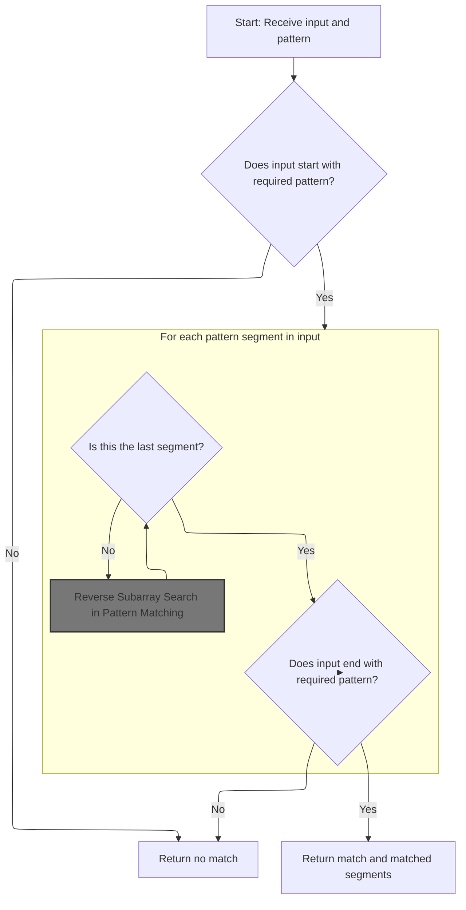
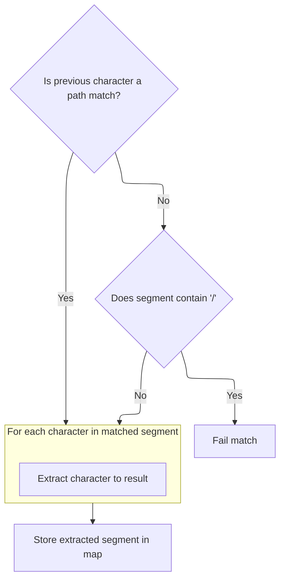

```mermaid
%%{init: {"flowchart": {"defaultRenderer": "elk"}} }%%
flowchart TD
    node1["Substitute variables in all main
configuration fields (parameter,
attribute, forward, include, input,
catalog, command, multipartClass,
prefix, suffix)"]
    click node1 openCode "core/src/main/java/org/apache/struts/config/ActionConfigMatcher.java:179:188"
    
    subgraph loop1["For each forward configuration"]
      node2["Clone and substitute variables in
forward config fields (name, path,
redirect, command, catalog, module)"]
      click node2 openCode "core/src/main/java/org/apache/struts/config/ActionConfigMatcher.java:190:213"
    end
    node1 --> loop1
    loop1 --> node3["Substitute variables in all property
fields"]
    click node3 openCode "core/src/main/java/org/apache/struts/config/ActionConfigMatcher.java:215:216"
    
    subgraph loop2["For each exception configuration"]
      node4["Add exception configuration to new
config"]
      click node4 openCode "core/src/main/java/org/apache/struts/config/ActionConfigMatcher.java:219:221"
    end
    node3 --> loop2
    loop2 --> node5["Finalize and return the new
configuration"]
    click node5 openCode "core/src/main/java/org/apache/struts/config/ActionConfigMatcher.java:223:226"
classDef HeadingStyle fill:#777777,stroke:#333,stroke-width:2px;

%% Swimm:
%% %%{init: {"flowchart": {"defaultRenderer": "elk"}} }%%
%% flowchart TD
%%     node1["Substitute variables in all main
%% configuration fields (parameter,
%% attribute, forward, include, input,
%% catalog, command, <SwmToken path="core/src/main/java/org/apache/struts/config/ActionConfig.java" pos="499:9:9" line-data="    public void setMultipartClass(String multipartClass) {">`multipartClass`</SwmToken>,
%% prefix, suffix)"]
%%     click node1 openCode "<SwmPath>[core/…/config/ActionConfigMatcher.java](core/src/main/java/org/apache/struts/config/ActionConfigMatcher.java)</SwmPath>:179:188"
%%     
%%     subgraph loop1["For each forward configuration"]
%%       node2["Clone and substitute variables in
%% forward config fields (name, path,
%% redirect, command, catalog, module)"]
%%       click node2 openCode "<SwmPath>[core/…/config/ActionConfigMatcher.java](core/src/main/java/org/apache/struts/config/ActionConfigMatcher.java)</SwmPath>:190:213"
%%     end
%%     node1 --> loop1
%%     loop1 --> node3["Substitute variables in all property
%% fields"]
%%     click node3 openCode "<SwmPath>[core/…/config/ActionConfigMatcher.java](core/src/main/java/org/apache/struts/config/ActionConfigMatcher.java)</SwmPath>:215:216"
%%     
%%     subgraph loop2["For each exception configuration"]
%%       node4["Add exception configuration to new
%% config"]
%%       click node4 openCode "<SwmPath>[core/…/config/ActionConfigMatcher.java](core/src/main/java/org/apache/struts/config/ActionConfigMatcher.java)</SwmPath>:219:221"
%%     end
%%     node3 --> loop2
%%     loop2 --> node5["Finalize and return the new
%% configuration"]
%%     click node5 openCode "<SwmPath>[core/…/config/ActionConfigMatcher.java](core/src/main/java/org/apache/struts/config/ActionConfigMatcher.java)</SwmPath>:223:226"
%% classDef HeadingStyle fill:#777777,stroke:#333,stroke-width:2px;
```

This document explains how incoming request paths are matched to configuration templates using wildcard patterns. When a match is found, variables from the path are substituted into the template to produce a resolved configuration. This enables dynamic routing and flexible configuration based on path patterns.

# Matching Paths to Config Patterns

<SwmSnippet path="/core/src/main/java/org/apache/struts/config/ActionConfigMatcher.java" line="101">

---

In <SwmToken path="core/src/main/java/org/apache/struts/config/ActionConfigMatcher.java" pos="101:5:5" line-data="    public ActionConfig match(String path) {">`match`</SwmToken>, we normalize the path by removing a leading slash if it's there, then loop through all compiled patterns. For each, we use <SwmToken path="core/src/main/java/org/apache/struts/config/ActionConfigMatcher.java" pos="27:10:10" line-data="import org.apache.struts.util.WildcardHelper;">`WildcardHelper`</SwmToken> to check if the path fits the pattern. If it matches, we grab the variables and move on to building the <SwmToken path="core/src/main/java/org/apache/struts/config/ActionConfigMatcher.java" pos="101:3:3" line-data="    public ActionConfig match(String path) {">`ActionConfig`</SwmToken>. <SwmToken path="core/src/main/java/org/apache/struts/config/ActionConfigMatcher.java" pos="27:10:10" line-data="import org.apache.struts.util.WildcardHelper;">`WildcardHelper`</SwmToken> is what actually checks the pattern, so that's why we call it next.

```java
    public ActionConfig match(String path) {
        ActionConfig config = null;

        if (compiledPaths.size() > 0) {
            if (log.isDebugEnabled()) {
                log.debug("Attempting to match '" + path
                    + "' to a wildcard pattern");
            }

            if ((path.length() > 0) && (path.charAt(0) == '/')) {
                path = path.substring(1);
            }

            Mapping m;
            HashMap vars = new HashMap();

            for (Iterator i = compiledPaths.iterator(); i.hasNext();) {
                m = (Mapping) i.next();

                if (wildcard.match(vars, path, m.getPattern())) {
                    if (log.isDebugEnabled()) {
                        log.debug("Path matches pattern '"
                            + m.getActionConfig().getPath() + "'");
                    }

```

---

</SwmSnippet>

## Wildcard Pattern Matching Logic



<SwmSnippet path="/core/src/main/java/org/apache/struts/util/WildcardHelper.java" line="159">

---

In <SwmToken path="core/src/main/java/org/apache/struts/util/WildcardHelper.java" pos="159:5:5" line-data="    public boolean match(Map map, String data, int[] expr) {">`match`</SwmToken>, we set up buffers and indices, check for <SwmToken path="core/src/main/java/org/apache/struts/util/WildcardHelper.java" pos="193:9:9" line-data="        // First check for MATCH_BEGIN">`MATCH_BEGIN`</SwmToken> at the start, and loop through the pattern to find special markers. Each segment before a marker is checked against the input, and matched substrings are stored in the map. This is the setup for handling complex wildcard patterns.

```java
    public boolean match(Map map, String data, int[] expr) {
        if (map == null) {
            throw new NullPointerException("No map provided");
        }

        if (data == null) {
            throw new NullPointerException("No data provided");
        }

        if (expr == null) {
            throw new NullPointerException("No pattern expression provided");
        }

        char[] buff = data.toCharArray();

        // Allocate the result buffer
        char[] rslt = new char[expr.length + buff.length];

        // The previous and current position of the expression character
        // (MATCH_*)
        int charpos = 0;

        // The position in the expression, input, translation and result arrays
        int exprpos = 0;
        int buffpos = 0;
        int rsltpos = 0;
        int offset = -1;

        // The matching count
        int mcount = 0;

        // We want the complete data be in {0}
        map.put(Integer.toString(mcount), data);

        // First check for MATCH_BEGIN
        boolean matchBegin = false;

        if (expr[charpos] == MATCH_BEGIN) {
            matchBegin = true;
            exprpos = ++charpos;
        }

        // Search the fist expression character (except MATCH_BEGIN - already
        // skipped)
        while (expr[charpos] >= 0) {
            charpos++;
        }
```

---

</SwmSnippet>

<SwmSnippet path="/core/src/main/java/org/apache/struts/util/WildcardHelper.java" line="207">

---

Here we hit the main matching loop. For each segment, if <SwmToken path="core/src/main/java/org/apache/struts/util/WildcardHelper.java" pos="193:9:9" line-data="        // First check for MATCH_BEGIN">`MATCH_BEGIN`</SwmToken> is set, we call <SwmToken path="core/src/main/java/org/apache/struts/util/WildcardHelper.java" pos="214:5:5" line-data="                if (!matchArray(expr, exprpos, charpos, buff, buffpos)) {">`matchArray`</SwmToken> to check if the input matches the pattern up to the next special marker. If it doesn't match, we bail out early. This is where we actually check the fixed part of the pattern before handling wildcards.

```java
        // The expression charater (MATCH_*)
        int exprchr = expr[charpos];

        while (true) {
            // Check if the data in the expression array before the current
            // expression character matches the data in the input buffer
            if (matchBegin) {
                if (!matchArray(expr, exprpos, charpos, buff, buffpos)) {
                    return (false);
                }

```

---

</SwmSnippet>

<SwmSnippet path="/core/src/main/java/org/apache/struts/util/WildcardHelper.java" line="445">

---

<SwmToken path="core/src/main/java/org/apache/struts/util/WildcardHelper.java" pos="445:5:5" line-data="    protected boolean matchArray(int[] r, int rpos, int rend, char[] d,">`matchArray`</SwmToken> just checks if a chunk of the pattern matches a chunk of the input, one character at a time. If anything doesn't line up, it returns false right away. This is the basic check before we deal with any wildcards.

```java
    protected boolean matchArray(int[] r, int rpos, int rend, char[] d,
        int dpos) {
        if ((d.length - dpos) < (rend - rpos)) {
            return (false);
        }

        for (int i = rpos; i < rend; i++) {
            if (r[i] != d[dpos++]) {
                return (false);
            }
        }
```

---

</SwmSnippet>

<SwmSnippet path="/core/src/main/java/org/apache/struts/util/WildcardHelper.java" line="218">

---

We just got back from <SwmToken path="core/src/main/java/org/apache/struts/util/WildcardHelper.java" pos="214:5:5" line-data="                if (!matchArray(expr, exprpos, charpos, buff, buffpos)) {">`matchArray`</SwmToken>. If it returned true, we keep going; otherwise, we exit early. If <SwmToken path="core/src/main/java/org/apache/struts/util/WildcardHelper.java" pos="227:7:7" line-data="            // Check for MATCH_BEGIN">`MATCH_BEGIN`</SwmToken> was set, we clear it now. If not, we use <SwmToken path="core/src/main/java/org/apache/struts/util/WildcardHelper.java" pos="220:5:5" line-data="                offset = indexOfArray(expr, exprpos, charpos, buff, buffpos);">`indexOfArray`</SwmToken> to find the next matching segment in the input. This is how we move forward in the pattern matching process.

```java
                matchBegin = false;
            } else {
                offset = indexOfArray(expr, exprpos, charpos, buff, buffpos);

                if (offset < 0) {
                    return (false);
                }
            }

            // Check for MATCH_BEGIN
            if (matchBegin) {
                if (offset != 0) {
                    return (false);
                }

                matchBegin = false;
            }

            // Advance buffpos
            buffpos += (charpos - exprpos);

            // Check for END's
            if (exprchr == MATCH_END) {
                if (rsltpos > 0) {
                    map.put(Integer.toString(++mcount),
                        new String(rslt, 0, rsltpos));
                }

                // Don't care about rest of input buffer
                return (true);
            } else if (exprchr == MATCH_THEEND) {
                if (rsltpos > 0) {
                    map.put(Integer.toString(++mcount),
                        new String(rslt, 0, rsltpos));
                }

                // Check that we reach buffer's end
                return (buffpos == buff.length);
            }

            // Search the next expression character
            exprpos = ++charpos;

            while (expr[charpos] >= 0) {
                charpos++;
            }
```

---

</SwmSnippet>

<SwmSnippet path="/core/src/main/java/org/apache/struts/util/WildcardHelper.java" line="265">

---

Here we decide which search function to use based on the previous MATCH\_\* marker. If it's a file match, we use <SwmToken path="core/src/main/java/org/apache/struts/util/WildcardHelper.java" pos="272:3:3" line-data="                ? indexOfArray(expr, exprpos, charpos, buff, buffpos)">`indexOfArray`</SwmToken> to find the next segment; otherwise, we use <SwmToken path="core/src/main/java/org/apache/struts/util/WildcardHelper.java" pos="273:3:3" line-data="                : lastIndexOfArray(expr, exprpos, charpos, buff, buffpos);">`lastIndexOfArray`</SwmToken> for a path match. This lets us handle different wildcard types in the pattern.

```java
            int prevchr = exprchr;

            exprchr = expr[charpos];

            // We have here prevchr == * or **.
            offset =
                (prevchr == MATCH_FILE)
                ? indexOfArray(expr, exprpos, charpos, buff, buffpos)
```

---

</SwmSnippet>

### Forward Subarray Search in Pattern Matching

```mermaid
%%{init: {"flowchart": {"defaultRenderer": "elk"}} }%%
flowchart TD
  node1["Start: Search for sequence in character
array (from current position)"] --> node2{"Is search range valid?"}
  click node1 openCode "core/src/main/java/org/apache/struts/util/WildcardHelper.java:316:319"
  node2 -->|"No"| node3["Error: Invalid search range"]
  click node2 openCode "core/src/main/java/org/apache/struts/util/WildcardHelper.java:319:321"
  click node3 openCode "core/src/main/java/org/apache/struts/util/WildcardHelper.java:320:321"
  node2 -->|"Yes"| node4{"Is sequence empty?"}
  click node4 openCode "core/src/main/java/org/apache/struts/util/WildcardHelper.java:324:325"
  node4 -->|"Yes"| node5["Return current position"]
  click node5 openCode "core/src/main/java/org/apache/struts/util/WildcardHelper.java:325:326"
  node4 -->|"No"| node6{"Is sequence a single character?"}
  click node6 openCode "core/src/main/java/org/apache/struts/util/WildcardHelper.java:329:335"
  node6 -->|"Yes"| node7["Search for character in array"]
  click node7 openCode "core/src/main/java/org/apache/struts/util/WildcardHelper.java:331:334"
  node7 --> node8["Return position if found"]
  click node8 openCode "core/src/main/java/org/apache/struts/util/WildcardHelper.java:333:334"
  node7 --> node13["Return not found"]
  click node13 openCode "core/src/main/java/org/apache/struts/util/WildcardHelper.java:335:335"
  node6 -->|"No"| node9["Main matching loop"]
  click node9 openCode "core/src/main/java/org/apache/struts/util/WildcardHelper.java:340:358"
  
  subgraph loop1["Repeat for each possible position in
character array"]
    node9 --> node10{"Does sequence match at current position?"}
    click node10 openCode "core/src/main/java/org/apache/struts/util/WildcardHelper.java:346:353"
    node10 -->|"Yes"| node11["Return position"]
    click node11 openCode "core/src/main/java/org/apache/struts/util/WildcardHelper.java:348:349"
    node10 -->|"No"| node12["Move to next position"]
    click node12 openCode "core/src/main/java/org/apache/struts/util/WildcardHelper.java:357:358"
    node12 --> node9
  end
  node9 --> node14["Return not found"]
  click node14 openCode "core/src/main/java/org/apache/struts/util/WildcardHelper.java:358:358"

classDef HeadingStyle fill:#777777,stroke:#333,stroke-width:2px;

%% Swimm:
%% %%{init: {"flowchart": {"defaultRenderer": "elk"}} }%%
%% flowchart TD
%%   node1["Start: Search for sequence in character
%% array (from current position)"] --> node2{"Is search range valid?"}
%%   click node1 openCode "<SwmPath>[core/…/util/WildcardHelper.java](core/src/main/java/org/apache/struts/util/WildcardHelper.java)</SwmPath>:316:319"
%%   node2 -->|"No"| node3["Error: Invalid search range"]
%%   click node2 openCode "<SwmPath>[core/…/util/WildcardHelper.java](core/src/main/java/org/apache/struts/util/WildcardHelper.java)</SwmPath>:319:321"
%%   click node3 openCode "<SwmPath>[core/…/util/WildcardHelper.java](core/src/main/java/org/apache/struts/util/WildcardHelper.java)</SwmPath>:320:321"
%%   node2 -->|"Yes"| node4{"Is sequence empty?"}
%%   click node4 openCode "<SwmPath>[core/…/util/WildcardHelper.java](core/src/main/java/org/apache/struts/util/WildcardHelper.java)</SwmPath>:324:325"
%%   node4 -->|"Yes"| node5["Return current position"]
%%   click node5 openCode "<SwmPath>[core/…/util/WildcardHelper.java](core/src/main/java/org/apache/struts/util/WildcardHelper.java)</SwmPath>:325:326"
%%   node4 -->|"No"| node6{"Is sequence a single character?"}
%%   click node6 openCode "<SwmPath>[core/…/util/WildcardHelper.java](core/src/main/java/org/apache/struts/util/WildcardHelper.java)</SwmPath>:329:335"
%%   node6 -->|"Yes"| node7["Search for character in array"]
%%   click node7 openCode "<SwmPath>[core/…/util/WildcardHelper.java](core/src/main/java/org/apache/struts/util/WildcardHelper.java)</SwmPath>:331:334"
%%   node7 --> node8["Return position if found"]
%%   click node8 openCode "<SwmPath>[core/…/util/WildcardHelper.java](core/src/main/java/org/apache/struts/util/WildcardHelper.java)</SwmPath>:333:334"
%%   node7 --> node13["Return not found"]
%%   click node13 openCode "<SwmPath>[core/…/util/WildcardHelper.java](core/src/main/java/org/apache/struts/util/WildcardHelper.java)</SwmPath>:335:335"
%%   node6 -->|"No"| node9["Main matching loop"]
%%   click node9 openCode "<SwmPath>[core/…/util/WildcardHelper.java](core/src/main/java/org/apache/struts/util/WildcardHelper.java)</SwmPath>:340:358"
%%   
%%   subgraph loop1["Repeat for each possible position in
%% character array"]
%%     node9 --> node10{"Does sequence match at current position?"}
%%     click node10 openCode "<SwmPath>[core/…/util/WildcardHelper.java](core/src/main/java/org/apache/struts/util/WildcardHelper.java)</SwmPath>:346:353"
%%     node10 -->|"Yes"| node11["Return position"]
%%     click node11 openCode "<SwmPath>[core/…/util/WildcardHelper.java](core/src/main/java/org/apache/struts/util/WildcardHelper.java)</SwmPath>:348:349"
%%     node10 -->|"No"| node12["Move to next position"]
%%     click node12 openCode "<SwmPath>[core/…/util/WildcardHelper.java](core/src/main/java/org/apache/struts/util/WildcardHelper.java)</SwmPath>:357:358"
%%     node12 --> node9
%%   end
%%   node9 --> node14["Return not found"]
%%   click node14 openCode "<SwmPath>[core/…/util/WildcardHelper.java](core/src/main/java/org/apache/struts/util/WildcardHelper.java)</SwmPath>:358:358"
%% 
%% classDef HeadingStyle fill:#777777,stroke:#333,stroke-width:2px;
```



<SwmSnippet path="/core/src/main/java/org/apache/struts/util/WildcardHelper.java" line="316">

---

In <SwmToken path="core/src/main/java/org/apache/struts/util/WildcardHelper.java" pos="316:5:5" line-data="    protected int indexOfArray(int[] r, int rpos, int rend, char[] d,">`indexOfArray`</SwmToken>, we look for a sequence from the pattern (as ints) inside the input buffer (as chars), starting at a given position. If the segment is empty, we return the end of the buffer. Otherwise, we search forward for the first match.

```java
    protected int indexOfArray(int[] r, int rpos, int rend, char[] d,
        int dpos) {
        // Check if pos and len are legal
        if (rend < rpos) {
            throw new IllegalArgumentException("rend < rpos");
        }

        // If we need to match a zero length string return current dpos
        if (rend == rpos) {
            return (d.length); //?? dpos?
        }

        // If we need to match a 1 char length string do it simply
        if ((rend - rpos) == 1) {
            // Search for the specified character
            for (int x = dpos; x < d.length; x++) {
                if (r[rpos] == d[x]) {
                    return (x);
                }
            }
```

---

</SwmSnippet>

<SwmSnippet path="/core/src/main/java/org/apache/struts/util/WildcardHelper.java" line="338">

---

After searching, we either return the position where the pattern segment matches the input, or -1 if there's no match. It's just a brute-force search, nothing fancy.

```java
        // Main string matching loop. It gets executed if the characters to
        // match are less then the characters left in the d buffer
        while (((dpos + rend) - rpos) <= d.length) {
            // Set current startpoint in d
            int y = dpos;

            // Check every character in d for equity. If the string is matched
            // return dpos
            for (int x = rpos; x <= rend; x++) {
                if (x == rend) {
                    return (dpos);
                }

                if (r[x] != d[y++]) {
                    break;
                }
            }

            // Increase dpos to search for the same string at next offset
            dpos++;
        }
```

---

</SwmSnippet>

### Handling Path and File Wildcards

<SwmSnippet path="/core/src/main/java/org/apache/struts/util/WildcardHelper.java" line="273">

---

We just got back from <SwmToken path="core/src/main/java/org/apache/struts/util/WildcardHelper.java" pos="220:5:5" line-data="                offset = indexOfArray(expr, exprpos, charpos, buff, buffpos);">`indexOfArray`</SwmToken> or <SwmToken path="core/src/main/java/org/apache/struts/util/WildcardHelper.java" pos="273:3:3" line-data="                : lastIndexOfArray(expr, exprpos, charpos, buff, buffpos);">`lastIndexOfArray`</SwmToken>. If the offset is negative, the match failed and we return false. Otherwise, we keep processing the pattern, copying matched segments as needed. This is how we handle the actual wildcard expansion.

```java
                : lastIndexOfArray(expr, exprpos, charpos, buff, buffpos);

            if (offset < 0) {
                return (false);
            }

```

---

</SwmSnippet>

### Reverse Subarray Search in Pattern Matching

```mermaid
%%{init: {"flowchart": {"defaultRenderer": "elk"}} }%%
flowchart TD
  node1["Validate search range"] --> node2{"Is range invalid?"}
  click node1 openCode "core/src/main/java/org/apache/struts/util/WildcardHelper.java:383:385"
  node2 -->|"Yes"| node3["Stop: invalid search range"]
  click node2 openCode "core/src/main/java/org/apache/struts/util/WildcardHelper.java:383:385"
  click node3 openCode "core/src/main/java/org/apache/struts/util/WildcardHelper.java:384:385"
  node2 -->|"No"| node4{"Is sequence empty?"}
  click node4 openCode "core/src/main/java/org/apache/struts/util/WildcardHelper.java:388:390"
  node4 -->|"Yes"| node5["Return end of array"]
  click node5 openCode "core/src/main/java/org/apache/struts/util/WildcardHelper.java:389:390"
  node4 -->|"No"| node6{"Is sequence length 1?"}
  click node6 openCode "core/src/main/java/org/apache/struts/util/WildcardHelper.java:393:399"
  node6 -->|"Yes"| node7["Search for last occurrence of character"]
  click node7 openCode "core/src/main/java/org/apache/struts/util/WildcardHelper.java:395:398"
  node7 --> node8["Return position if found, else -1"]
  click node8 openCode "core/src/main/java/org/apache/struts/util/WildcardHelper.java:397:399"
  node6 -->|"No"| node9["Search for last occurrence of sequence"]
  click node9 openCode "core/src/main/java/org/apache/struts/util/WildcardHelper.java:406:424"
  subgraph loop1["For each possible position in array,
from end to start"]
    node9 --> node10{"Does sequence match here?"}
    click node10 openCode "core/src/main/java/org/apache/struts/util/WildcardHelper.java:412:419"
    node10 -->|"Yes"| node11["Return current position"]
    click node11 openCode "core/src/main/java/org/apache/struts/util/WildcardHelper.java:414:415"
    node10 -->|"No"| node12["Check previous position"]
    click node12 openCode "core/src/main/java/org/apache/struts/util/WildcardHelper.java:423:424"
    node12 --> node10
  end
  node9 --> node13["Return -1 if sequence not found"]
  click node13 openCode "core/src/main/java/org/apache/struts/util/WildcardHelper.java:424:424"

classDef HeadingStyle fill:#777777,stroke:#333,stroke-width:2px;

%% Swimm:
%% %%{init: {"flowchart": {"defaultRenderer": "elk"}} }%%
%% flowchart TD
%%   node1["Validate search range"] --> node2{"Is range invalid?"}
%%   click node1 openCode "<SwmPath>[core/…/util/WildcardHelper.java](core/src/main/java/org/apache/struts/util/WildcardHelper.java)</SwmPath>:383:385"
%%   node2 -->|"Yes"| node3["Stop: invalid search range"]
%%   click node2 openCode "<SwmPath>[core/…/util/WildcardHelper.java](core/src/main/java/org/apache/struts/util/WildcardHelper.java)</SwmPath>:383:385"
%%   click node3 openCode "<SwmPath>[core/…/util/WildcardHelper.java](core/src/main/java/org/apache/struts/util/WildcardHelper.java)</SwmPath>:384:385"
%%   node2 -->|"No"| node4{"Is sequence empty?"}
%%   click node4 openCode "<SwmPath>[core/…/util/WildcardHelper.java](core/src/main/java/org/apache/struts/util/WildcardHelper.java)</SwmPath>:388:390"
%%   node4 -->|"Yes"| node5["Return end of array"]
%%   click node5 openCode "<SwmPath>[core/…/util/WildcardHelper.java](core/src/main/java/org/apache/struts/util/WildcardHelper.java)</SwmPath>:389:390"
%%   node4 -->|"No"| node6{"Is sequence length 1?"}
%%   click node6 openCode "<SwmPath>[core/…/util/WildcardHelper.java](core/src/main/java/org/apache/struts/util/WildcardHelper.java)</SwmPath>:393:399"
%%   node6 -->|"Yes"| node7["Search for last occurrence of character"]
%%   click node7 openCode "<SwmPath>[core/…/util/WildcardHelper.java](core/src/main/java/org/apache/struts/util/WildcardHelper.java)</SwmPath>:395:398"
%%   node7 --> node8["Return position if found, else -1"]
%%   click node8 openCode "<SwmPath>[core/…/util/WildcardHelper.java](core/src/main/java/org/apache/struts/util/WildcardHelper.java)</SwmPath>:397:399"
%%   node6 -->|"No"| node9["Search for last occurrence of sequence"]
%%   click node9 openCode "<SwmPath>[core/…/util/WildcardHelper.java](core/src/main/java/org/apache/struts/util/WildcardHelper.java)</SwmPath>:406:424"
%%   subgraph loop1["For each possible position in array,
%% from end to start"]
%%     node9 --> node10{"Does sequence match here?"}
%%     click node10 openCode "<SwmPath>[core/…/util/WildcardHelper.java](core/src/main/java/org/apache/struts/util/WildcardHelper.java)</SwmPath>:412:419"
%%     node10 -->|"Yes"| node11["Return current position"]
%%     click node11 openCode "<SwmPath>[core/…/util/WildcardHelper.java](core/src/main/java/org/apache/struts/util/WildcardHelper.java)</SwmPath>:414:415"
%%     node10 -->|"No"| node12["Check previous position"]
%%     click node12 openCode "<SwmPath>[core/…/util/WildcardHelper.java](core/src/main/java/org/apache/struts/util/WildcardHelper.java)</SwmPath>:423:424"
%%     node12 --> node10
%%   end
%%   node9 --> node13["Return -1 if sequence not found"]
%%   click node13 openCode "<SwmPath>[core/…/util/WildcardHelper.java](core/src/main/java/org/apache/struts/util/WildcardHelper.java)</SwmPath>:424:424"
%% 
%% classDef HeadingStyle fill:#777777,stroke:#333,stroke-width:2px;
```



<SwmSnippet path="/core/src/main/java/org/apache/struts/util/WildcardHelper.java" line="380">

---

In <SwmToken path="core/src/main/java/org/apache/struts/util/WildcardHelper.java" pos="380:5:5" line-data="    protected int lastIndexOfArray(int[] r, int rpos, int rend, char[] d,">`lastIndexOfArray`</SwmToken>, we search backwards for a pattern segment in the input buffer. If the segment is empty, we return the end of the buffer. Otherwise, we look for the last occurrence of the segment before a given position.

```java
    protected int lastIndexOfArray(int[] r, int rpos, int rend, char[] d,
        int dpos) {
        // Check if pos and len are legal
        if (rend < rpos) {
            throw new IllegalArgumentException("rend < rpos");
        }

        // If we need to match a zero length string return current dpos
        if (rend == rpos) {
            return (d.length); //?? dpos?
        }

        // If we need to match a 1 char length string do it simply
        if ((rend - rpos) == 1) {
            // Search for the specified character
            for (int x = d.length - 1; x > dpos; x--) {
                if (r[rpos] == d[x]) {
                    return (x);
                }
            }
```

---

</SwmSnippet>

<SwmSnippet path="/core/src/main/java/org/apache/struts/util/WildcardHelper.java" line="402">

---

After searching backwards, we either return the last position where the pattern segment matches the input, or -1 if there's no match. It's just a brute-force reverse search.

```java
        // Main string matching loop. It gets executed if the characters to
        // match are less then the characters left in the d buffer
        int l = d.length - (rend - rpos);

        while (l >= dpos) {
            // Set current startpoint in d
            int y = l;

            // Check every character in d for equity. If the string is matched
            // return dpos
            for (int x = rpos; x <= rend; x++) {
                if (x == rend) {
                    return (l);
                }

                if (r[x] != d[y++]) {
                    break;
                }
            }

            // Decrease l to search for the same string at next offset
            l--;
        }
```

---

</SwmSnippet>

### Storing Wildcard Matches and Advancing



<SwmSnippet path="/core/src/main/java/org/apache/struts/util/WildcardHelper.java" line="279">

---

We just got back from <SwmToken path="core/src/main/java/org/apache/struts/util/WildcardHelper.java" pos="273:3:3" line-data="                : lastIndexOfArray(expr, exprpos, charpos, buff, buffpos);">`lastIndexOfArray`</SwmToken> (or <SwmToken path="core/src/main/java/org/apache/struts/util/WildcardHelper.java" pos="220:5:5" line-data="                offset = indexOfArray(expr, exprpos, charpos, buff, buffpos);">`indexOfArray`</SwmToken>). Now, if the previous marker was <SwmToken path="core/src/main/java/org/apache/struts/util/WildcardHelper.java" pos="281:8:8" line-data="            if (prevchr == MATCH_PATH) {">`MATCH_PATH`</SwmToken>, we copy everything up to the offset into the result buffer. This is how we extract the matched path segment for the wildcard.

```java
            // Copy the data from the source buffer into the result buffer
            // to substitute the expression character
            if (prevchr == MATCH_PATH) {
                while (buffpos < offset) {
                    rslt[rsltpos++] = buff[buffpos++];
                }
```

---

</SwmSnippet>

<SwmSnippet path="/core/src/main/java/org/apache/struts/util/WildcardHelper.java" line="286">

---

If the previous marker was <SwmToken path="core/src/main/java/org/apache/struts/util/WildcardHelper.java" pos="271:6:6" line-data="                (prevchr == MATCH_FILE)">`MATCH_FILE`</SwmToken>, we copy up to the offset but bail if we hit a '/'. This prevents slashes from being included in file wildcard matches, keeping the match logic strict.

```java
                // Matching file, don't copy '/'
                while (buffpos < offset) {
                    if (buff[buffpos] == '/') {
                        return (false);
                    }

                    rslt[rsltpos++] = buff[buffpos++];
                }
```

---

</SwmSnippet>

<SwmSnippet path="/core/src/main/java/org/apache/struts/util/WildcardHelper.java" line="296">

---

After handling each wildcard segment, we store the matched substring in the map and reset the result buffer. This is how we collect all the wildcard values for later use in config substitution.

```java
            map.put(Integer.toString(++mcount), new String(rslt, 0, rsltpos));
            rsltpos = 0;
        }
    }
```

---

</SwmSnippet>

## Converting Wildcard Matches to <SwmToken path="core/src/main/java/org/apache/struts/config/ActionConfigMatcher.java" pos="101:3:3" line-data="    public ActionConfig match(String path) {">`ActionConfig`</SwmToken>

<SwmSnippet path="/core/src/main/java/org/apache/struts/config/ActionConfigMatcher.java" line="126">

---

We just got back from `WildcardHelper.match`. If we got a match, we call <SwmToken path="core/src/main/java/org/apache/struts/config/ActionConfigMatcher.java" pos="128:1:1" line-data="                	    convertActionConfig(path,">`convertActionConfig`</SwmToken> to build a new <SwmToken path="core/src/main/java/org/apache/struts/config/ActionConfigMatcher.java" pos="129:2:2" line-data="                		    (ActionConfig) m.getActionConfig(), vars);">`ActionConfig`</SwmToken> using the matched variables. If there's a substitution loop, we log a warning and skip this config. This is where the wildcard match actually turns into a usable config.

```java
                    try {
                	config =
                	    convertActionConfig(path,
                		    (ActionConfig) m.getActionConfig(), vars);
                    } catch (IllegalStateException e) {
                	log.warn("Path matches pattern '"
                		+ m.getActionConfig().getPath() + "' but is "
                		+ "incompatible with the matching config due "
                		+ "to recursive substitution: "
                		+ path);
                	config = null;
                    }
                }
            }
        }

        return config;
    }
```

---

</SwmSnippet>

# Building a New <SwmToken path="core/src/main/java/org/apache/struts/config/ActionConfigMatcher.java" pos="101:3:3" line-data="    public ActionConfig match(String path) {">`ActionConfig`</SwmToken> from Wildcard Variables

<SwmSnippet path="/core/src/main/java/org/apache/struts/config/ActionConfigMatcher.java" line="157">

---

In <SwmToken path="core/src/main/java/org/apache/struts/config/ActionConfigMatcher.java" pos="157:5:5" line-data="    protected ActionConfig convertActionConfig(String path, ActionConfig orig,">`convertActionConfig`</SwmToken>, we clone the original <SwmToken path="core/src/main/java/org/apache/struts/config/ActionConfigMatcher.java" pos="157:3:3" line-data="    protected ActionConfig convertActionConfig(String path, ActionConfig orig,">`ActionConfig`</SwmToken> and start replacing placeholders in its fields using the matched variables. First up is the name, so we call <SwmToken path="core/src/main/java/org/apache/struts/config/ActionConfigMatcher.java" pos="170:5:5" line-data="        config.setName(convertParam(orig.getName(), vars));">`convertParam`</SwmToken> to swap out any placeholders with actual values from the match.

```java
    protected ActionConfig convertActionConfig(String path, ActionConfig orig,
        Map vars) {
        ActionConfig config = null;

        try {
            config = (ActionConfig) BeanUtils.cloneBean(orig);
        } catch (Exception ex) {
            log.warn("Unable to clone action config, recommend not using "
                + "wildcards", ex);

            return null;
        }

        config.setName(convertParam(orig.getName(), vars));
```

---

</SwmSnippet>

<SwmSnippet path="/core/src/main/java/org/apache/struts/config/ActionConfigMatcher.java" line="258">

---

<SwmToken path="core/src/main/java/org/apache/struts/config/ActionConfigMatcher.java" pos="258:5:5" line-data="    protected String convertParam(String val, Map vars) {">`convertParam`</SwmToken> replaces all single-character placeholders like '{x}' in the input string with values from the vars map. If a value contains its own placeholder, it throws to avoid infinite loops. This is how we inject matched values into the config fields.

```java
    protected String convertParam(String val, Map vars) {
        if (val == null) {
            return null;
        } else if (val.indexOf("{") == -1) {
            return val;
        }

        Map.Entry entry;
        StringBuffer key = new StringBuffer("{0}");
        StringBuffer ret = new StringBuffer(val);
        String keyStr;
        int x;

        for (Iterator i = vars.entrySet().iterator(); i.hasNext();) {
            entry = (Map.Entry) i.next();
            key.setCharAt(1, ((String) entry.getKey()).charAt(0));
            keyStr = key.toString();
            
            // STR-3169
            // Prevent an infinite loop by retaining the placeholders
            // that contain itself in the substitution value
            if (((String) entry.getValue()).contains(keyStr)) {
        	throw new IllegalStateException();
            }
            
            // Replace all instances of the placeholder
            while ((x = ret.toString().indexOf(keyStr)) > -1) {
                ret.replace(x, x + 3, (String) entry.getValue());
            }
        }
```

---

</SwmSnippet>

<SwmSnippet path="/core/src/main/java/org/apache/struts/config/ActionConfigMatcher.java" line="170">

---

We just got back from <SwmToken path="core/src/main/java/org/apache/struts/config/ActionConfigMatcher.java" pos="170:5:5" line-data="        config.setName(convertParam(orig.getName(), vars));">`convertParam`</SwmToken> with the new name. Now we call <SwmToken path="core/src/main/java/org/apache/struts/config/ActionConfigMatcher.java" pos="170:3:3" line-data="        config.setName(convertParam(orig.getName(), vars));">`setName`</SwmToken> on the config to update it. This is the first field we update in the cloned config.

```java
        config.setName(convertParam(orig.getName(), vars));

```

---

</SwmSnippet>

<SwmSnippet path="/core/src/main/java/org/apache/struts/config/ActionConfig.java" line="517">

---

<SwmToken path="core/src/main/java/org/apache/struts/config/ActionConfig.java" pos="517:5:5" line-data="    public void setName(String name) {">`setName`</SwmToken> updates the config name unless the config is frozen. If it's frozen, it throws. This keeps the config immutable after setup.

```java
    public void setName(String name) {
        if (configured) {
            throw new IllegalStateException("Configuration is frozen");
        }

        this.name = name;
    }
```

---

</SwmSnippet>

<SwmSnippet path="/core/src/main/java/org/apache/struts/config/ActionConfigMatcher.java" line="172">

---

We just got back from <SwmToken path="core/src/main/java/org/apache/struts/config/ActionConfigMatcher.java" pos="170:3:3" line-data="        config.setName(convertParam(orig.getName(), vars));">`setName`</SwmToken>. Now we make sure the path starts with a slash, then call <SwmToken path="core/src/main/java/org/apache/struts/config/ActionConfigMatcher.java" pos="176:3:3" line-data="        config.setPath(path);">`setPath`</SwmToken> to update the config. This is the next field we update in the cloned config.

```java
        if ((path.length() == 0) || (path.charAt(0) != '/')) {
            path = "/" + path;
        }

        config.setPath(path);
```

---

</SwmSnippet>

<SwmSnippet path="/core/src/main/java/org/apache/struts/config/ActionConfig.java" line="565">

---

<SwmToken path="core/src/main/java/org/apache/struts/config/ActionConfig.java" pos="565:5:5" line-data="    public void setPath(String path) {">`setPath`</SwmToken> updates the config path unless the config is frozen. If it's frozen, it throws. This keeps the config immutable after setup.

```java
    public void setPath(String path) {
        if (configured) {
            throw new IllegalStateException("Configuration is frozen");
        }

        this.path = path;
    }
```

---

</SwmSnippet>

<SwmSnippet path="/core/src/main/java/org/apache/struts/config/ActionConfigMatcher.java" line="177">

---

We just got back from <SwmToken path="core/src/main/java/org/apache/struts/config/ActionConfigMatcher.java" pos="176:3:3" line-data="        config.setPath(path);">`setPath`</SwmToken>. Now we call <SwmToken path="core/src/main/java/org/apache/struts/config/ActionConfigMatcher.java" pos="177:5:5" line-data="        config.setType(convertParam(orig.getType(), vars));">`convertParam`</SwmToken> to substitute any placeholders in the type field, so we can update the config type next.

```java
        config.setType(convertParam(orig.getType(), vars));
```

---

</SwmSnippet>

<SwmSnippet path="/core/src/main/java/org/apache/struts/config/ActionConfigMatcher.java" line="177">

---

We just got back from <SwmToken path="core/src/main/java/org/apache/struts/config/ActionConfigMatcher.java" pos="177:5:5" line-data="        config.setType(convertParam(orig.getType(), vars));">`convertParam`</SwmToken> with the new type. Now we call <SwmToken path="core/src/main/java/org/apache/struts/config/ActionConfigMatcher.java" pos="177:3:3" line-data="        config.setType(convertParam(orig.getType(), vars));">`setType`</SwmToken> to update the config. This is the next field we update in the cloned config.

```java
        config.setType(convertParam(orig.getType(), vars));
```

---

</SwmSnippet>

<SwmSnippet path="/core/src/main/java/org/apache/struts/config/ActionConfig.java" line="788">

---

<SwmToken path="core/src/main/java/org/apache/struts/config/ActionConfig.java" pos="788:5:5" line-data="    public void setType(String type) {">`setType`</SwmToken> updates the config type unless the config is frozen. If it's frozen, it throws. This keeps the config immutable after setup.

```java
    public void setType(String type) {
        if (configured) {
            throw new IllegalStateException("Configuration is frozen");
        }

        this.type = type;
    }
```

---

</SwmSnippet>

<SwmSnippet path="/core/src/main/java/org/apache/struts/config/ActionConfigMatcher.java" line="178">

---

We just got back from <SwmToken path="core/src/main/java/org/apache/struts/config/ActionConfigMatcher.java" pos="177:3:3" line-data="        config.setType(convertParam(orig.getType(), vars));">`setType`</SwmToken>. Now we call <SwmToken path="core/src/main/java/org/apache/struts/config/ActionConfigMatcher.java" pos="178:5:5" line-data="        config.setRoles(convertParam(orig.getRoles(), vars));">`convertParam`</SwmToken> to substitute any placeholders in the roles field, so we can update the config roles next.

```java
        config.setRoles(convertParam(orig.getRoles(), vars));
```

---

</SwmSnippet>

<SwmSnippet path="/core/src/main/java/org/apache/struts/config/ActionConfigMatcher.java" line="178">

---

We just got back from <SwmToken path="core/src/main/java/org/apache/struts/config/ActionConfigMatcher.java" pos="178:5:5" line-data="        config.setRoles(convertParam(orig.getRoles(), vars));">`convertParam`</SwmToken> with the new roles string. Now we call <SwmToken path="core/src/main/java/org/apache/struts/config/ActionConfigMatcher.java" pos="178:3:3" line-data="        config.setRoles(convertParam(orig.getRoles(), vars));">`setRoles`</SwmToken> to update the config. This is the next field we update in the cloned config.

```java
        config.setRoles(convertParam(orig.getRoles(), vars));
```

---

</SwmSnippet>

## Parsing and Setting Role Names

```mermaid
%%{init: {"flowchart": {"defaultRenderer": "elk"}} }%%
flowchart TD
    node1["Start: Set allowed roles"] --> node2{"Is configuration frozen?"}
    click node1 openCode "core/src/main/java/org/apache/struts/config/ActionConfig.java:597:598"
    click node2 openCode "core/src/main/java/org/apache/struts/config/ActionConfig.java:598:599"
    node2 -->|"Yes"| node3["Reject change: configuration is frozen"]
    click node3 openCode "core/src/main/java/org/apache/struts/config/ActionConfig.java:599:600"
    node2 -->|"No"| node4{"Is roles null?"}
    click node4 openCode "core/src/main/java/org/apache/struts/config/ActionConfig.java:604:605"
    node4 -->|"Yes"| node5["Set allowed roles to none and return"]
    click node5 openCode "core/src/main/java/org/apache/struts/config/ActionConfig.java:605:608"
    node4 -->|"No"| node6["Prepare to extract roles"]
    click node6 openCode "core/src/main/java/org/apache/struts/config/ActionConfig.java:610:611"
    
    subgraph loop1["For each comma in roles string"]
        node6 --> node7{"Is there a comma in roles?"}
        click node7 openCode "core/src/main/java/org/apache/struts/config/ActionConfig.java:612:617"
        node7 -->|"Yes"| node8["Extract role before comma and add to
list"]
        click node8 openCode "core/src/main/java/org/apache/struts/config/ActionConfig.java:619:620"
        node8 --> node9["Remove extracted role from string"]
        click node9 openCode "core/src/main/java/org/apache/struts/config/ActionConfig.java:620:621"
        node9 --> node7
        node7 -->|"No"| node10["Trim remaining string"]
        click node10 openCode "core/src/main/java/org/apache/struts/config/ActionConfig.java:623:624"
    end
    node10 --> node11{"Is remaining string non-empty?"}
    click node11 openCode "core/src/main/java/org/apache/struts/config/ActionConfig.java:625:626"
    node11 -->|"Yes"| node12["Add last role to list"]
    click node12 openCode "core/src/main/java/org/apache/struts/config/ActionConfig.java:626:627"
    node11 -->|"No"| node13["Skip adding last role"]
    click node13 openCode "core/src/main/java/org/apache/struts/config/ActionConfig.java:627:628"
    node12 --> node14["Set allowed roles to extracted list"]
    click node14 openCode "core/src/main/java/org/apache/struts/config/ActionConfig.java:629:630"
    node13 --> node14
    node5 --> node14

classDef HeadingStyle fill:#777777,stroke:#333,stroke-width:2px;

%% Swimm:
%% %%{init: {"flowchart": {"defaultRenderer": "elk"}} }%%
%% flowchart TD
%%     node1["Start: Set allowed roles"] --> node2{"Is configuration frozen?"}
%%     click node1 openCode "<SwmPath>[core/…/config/ActionConfig.java](core/src/main/java/org/apache/struts/config/ActionConfig.java)</SwmPath>:597:598"
%%     click node2 openCode "<SwmPath>[core/…/config/ActionConfig.java](core/src/main/java/org/apache/struts/config/ActionConfig.java)</SwmPath>:598:599"
%%     node2 -->|"Yes"| node3["Reject change: configuration is frozen"]
%%     click node3 openCode "<SwmPath>[core/…/config/ActionConfig.java](core/src/main/java/org/apache/struts/config/ActionConfig.java)</SwmPath>:599:600"
%%     node2 -->|"No"| node4{"Is roles null?"}
%%     click node4 openCode "<SwmPath>[core/…/config/ActionConfig.java](core/src/main/java/org/apache/struts/config/ActionConfig.java)</SwmPath>:604:605"
%%     node4 -->|"Yes"| node5["Set allowed roles to none and return"]
%%     click node5 openCode "<SwmPath>[core/…/config/ActionConfig.java](core/src/main/java/org/apache/struts/config/ActionConfig.java)</SwmPath>:605:608"
%%     node4 -->|"No"| node6["Prepare to extract roles"]
%%     click node6 openCode "<SwmPath>[core/…/config/ActionConfig.java](core/src/main/java/org/apache/struts/config/ActionConfig.java)</SwmPath>:610:611"
%%     
%%     subgraph loop1["For each comma in roles string"]
%%         node6 --> node7{"Is there a comma in roles?"}
%%         click node7 openCode "<SwmPath>[core/…/config/ActionConfig.java](core/src/main/java/org/apache/struts/config/ActionConfig.java)</SwmPath>:612:617"
%%         node7 -->|"Yes"| node8["Extract role before comma and add to
%% list"]
%%         click node8 openCode "<SwmPath>[core/…/config/ActionConfig.java](core/src/main/java/org/apache/struts/config/ActionConfig.java)</SwmPath>:619:620"
%%         node8 --> node9["Remove extracted role from string"]
%%         click node9 openCode "<SwmPath>[core/…/config/ActionConfig.java](core/src/main/java/org/apache/struts/config/ActionConfig.java)</SwmPath>:620:621"
%%         node9 --> node7
%%         node7 -->|"No"| node10["Trim remaining string"]
%%         click node10 openCode "<SwmPath>[core/…/config/ActionConfig.java](core/src/main/java/org/apache/struts/config/ActionConfig.java)</SwmPath>:623:624"
%%     end
%%     node10 --> node11{"Is remaining string non-empty?"}
%%     click node11 openCode "<SwmPath>[core/…/config/ActionConfig.java](core/src/main/java/org/apache/struts/config/ActionConfig.java)</SwmPath>:625:626"
%%     node11 -->|"Yes"| node12["Add last role to list"]
%%     click node12 openCode "<SwmPath>[core/…/config/ActionConfig.java](core/src/main/java/org/apache/struts/config/ActionConfig.java)</SwmPath>:626:627"
%%     node11 -->|"No"| node13["Skip adding last role"]
%%     click node13 openCode "<SwmPath>[core/…/config/ActionConfig.java](core/src/main/java/org/apache/struts/config/ActionConfig.java)</SwmPath>:627:628"
%%     node12 --> node14["Set allowed roles to extracted list"]
%%     click node14 openCode "<SwmPath>[core/…/config/ActionConfig.java](core/src/main/java/org/apache/struts/config/ActionConfig.java)</SwmPath>:629:630"
%%     node13 --> node14
%%     node5 --> node14
%% 
%% classDef HeadingStyle fill:#777777,stroke:#333,stroke-width:2px;
```



<SwmSnippet path="/core/src/main/java/org/apache/struts/config/ActionConfig.java" line="597">

---

<SwmToken path="core/src/main/java/org/apache/struts/config/ActionConfig.java" pos="597:5:5" line-data="    public void setRoles(String roles) {">`setRoles`</SwmToken> splits the roles string by commas, trims each part, and stores them in an array. If the config is frozen, it throws. This is how we prep the roles for later checks.

```java
    public void setRoles(String roles) {
        if (configured) {
            throw new IllegalStateException("Configuration is frozen");
        }

        this.roles = roles;

        if (roles == null) {
            roleNames = new String[0];

            return;
        }

        ArrayList list = new ArrayList();

        while (true) {
            int comma = roles.indexOf(',');

            if (comma < 0) {
                break;
            }

            list.add(roles.substring(0, comma).trim());
            roles = roles.substring(comma + 1);
        }
```

---

</SwmSnippet>

<SwmSnippet path="/core/src/main/java/org/apache/struts/config/ActionConfig.java" line="623">

---

After splitting and trimming, we store the role names in an array. If the roles string is empty, we just use an empty array. This is what gets used for role checks later.

```java
        roles = roles.trim();

        if (roles.length() > 0) {
            list.add(roles);
        }

        roleNames = (String[]) list.toArray(new String[list.size()]);
    }
```

---

</SwmSnippet>

## Setting Additional <SwmToken path="core/src/main/java/org/apache/struts/config/ActionConfigMatcher.java" pos="101:3:3" line-data="    public ActionConfig match(String path) {">`ActionConfig`</SwmToken> Fields



<SwmSnippet path="/core/src/main/java/org/apache/struts/config/ActionConfigMatcher.java" line="179">

---

We just got back from <SwmToken path="core/src/main/java/org/apache/struts/config/ActionConfigMatcher.java" pos="178:3:3" line-data="        config.setRoles(convertParam(orig.getRoles(), vars));">`setRoles`</SwmToken>. Now we call <SwmToken path="core/src/main/java/org/apache/struts/config/ActionConfigMatcher.java" pos="179:5:5" line-data="        config.setParameter(convertParam(orig.getParameter(), vars));">`convertParam`</SwmToken> to substitute any placeholders in the parameter field, so we can update the config parameter next.

```java
        config.setParameter(convertParam(orig.getParameter(), vars));
```

---

</SwmSnippet>

<SwmSnippet path="/core/src/main/java/org/apache/struts/config/ActionConfigMatcher.java" line="179">

---

We just got back from <SwmToken path="core/src/main/java/org/apache/struts/config/ActionConfigMatcher.java" pos="179:5:5" line-data="        config.setParameter(convertParam(orig.getParameter(), vars));">`convertParam`</SwmToken> with the new parameter value. Now we call <SwmToken path="core/src/main/java/org/apache/struts/config/ActionConfigMatcher.java" pos="179:3:3" line-data="        config.setParameter(convertParam(orig.getParameter(), vars));">`setParameter`</SwmToken> to update the config. This is the last field we update in the cloned config.

```java
        config.setParameter(convertParam(orig.getParameter(), vars));
```

---

</SwmSnippet>

<SwmSnippet path="/core/src/main/java/org/apache/struts/config/ActionConfig.java" line="541">

---

<SwmToken path="core/src/main/java/org/apache/struts/config/ActionConfig.java" pos="541:5:5" line-data="    public void setParameter(String parameter) {">`setParameter`</SwmToken> updates the parameter field, but only if the config isn't frozen. If <SwmToken path="core/src/main/java/org/apache/struts/config/ActionConfig.java" pos="542:4:4" line-data="        if (configured) {">`configured`</SwmToken> is true, it throws, so you can't change parameters after the config is locked down.

```java
    public void setParameter(String parameter) {
        if (configured) {
            throw new IllegalStateException("Configuration is frozen");
        }

        this.parameter = parameter;
    }
```

---

</SwmSnippet>

<SwmSnippet path="/core/src/main/java/org/apache/struts/config/ActionConfigMatcher.java" line="180">

---

We just finished updating the parameter field. Now, in ActionConfigMatcher.convertActionConfig, we move on to <SwmToken path="core/src/main/java/org/apache/struts/config/ActionConfigMatcher.java" pos="180:3:3" line-data="        config.setAttribute(convertParam(orig.getAttribute(), vars));">`setAttribute`</SwmToken>, so the attribute field also gets its placeholders swapped out with the matched values.

```java
        config.setAttribute(convertParam(orig.getAttribute(), vars));
```

---

</SwmSnippet>

<SwmSnippet path="/core/src/main/java/org/apache/struts/config/ActionConfig.java" line="321">

---

<SwmToken path="core/src/main/java/org/apache/struts/config/ActionConfig.java" pos="321:5:5" line-data="    public String getAttribute() {">`getAttribute`</SwmToken> returns the attribute field if it's set, but if not, it falls back to the config's name. This way, you always get something usable, even if attribute wasn't set directly.

```java
    public String getAttribute() {
        if (this.attribute == null) {
            return (this.name);
        } else {
            return (this.attribute);
        }
    }
```

---

</SwmSnippet>

<SwmSnippet path="/core/src/main/java/org/apache/struts/config/ActionConfigMatcher.java" line="180">

---

After grabbing the attribute value, we run it through <SwmToken path="core/src/main/java/org/apache/struts/config/ActionConfigMatcher.java" pos="180:5:5" line-data="        config.setAttribute(convertParam(orig.getAttribute(), vars));">`convertParam`</SwmToken> in ActionConfigMatcher.convertActionConfig. This swaps out any placeholders with the real values from the match.

```java
        config.setAttribute(convertParam(orig.getAttribute(), vars));
```

---

</SwmSnippet>

<SwmSnippet path="/core/src/main/java/org/apache/struts/config/ActionConfigMatcher.java" line="180">

---

After <SwmToken path="core/src/main/java/org/apache/struts/config/ActionConfigMatcher.java" pos="180:5:5" line-data="        config.setAttribute(convertParam(orig.getAttribute(), vars));">`convertParam`</SwmToken> gives us the updated attribute, we call <SwmToken path="core/src/main/java/org/apache/struts/config/ActionConfigMatcher.java" pos="180:3:3" line-data="        config.setAttribute(convertParam(orig.getAttribute(), vars));">`setAttribute`</SwmToken> to actually store it in the config. This keeps everything in sync with the matched variables.

```java
        config.setAttribute(convertParam(orig.getAttribute(), vars));
```

---

</SwmSnippet>

<SwmSnippet path="/core/src/main/java/org/apache/struts/config/ActionConfig.java" line="337">

---

<SwmToken path="core/src/main/java/org/apache/struts/config/ActionConfig.java" pos="337:5:5" line-data="    public void setAttribute(String attribute) {">`setAttribute`</SwmToken> updates the attribute field, but only if the config isn't frozen. If you try to change it after freezing, it throws, so you can't mess with finalized configs.

```java
    public void setAttribute(String attribute) {
        if (configured) {
            throw new IllegalStateException("Configuration is frozen");
        }

        this.attribute = attribute;
    }
```

---

</SwmSnippet>

<SwmSnippet path="/core/src/main/java/org/apache/struts/config/ActionConfigMatcher.java" line="181">

---

After updating the attribute, we run the forward value through <SwmToken path="core/src/main/java/org/apache/struts/config/ActionConfigMatcher.java" pos="181:5:5" line-data="        config.setForward(convertParam(orig.getForward(), vars));">`convertParam`</SwmToken> in ActionConfigMatcher.convertActionConfig. This swaps out any placeholders with the real values from the match.

```java
        config.setForward(convertParam(orig.getForward(), vars));
```

---

</SwmSnippet>

<SwmSnippet path="/core/src/main/java/org/apache/struts/config/ActionConfigMatcher.java" line="181">

---

After <SwmToken path="core/src/main/java/org/apache/struts/config/ActionConfigMatcher.java" pos="181:5:5" line-data="        config.setForward(convertParam(orig.getForward(), vars));">`convertParam`</SwmToken> gives us the updated forward value, we call <SwmToken path="core/src/main/java/org/apache/struts/config/ActionConfigMatcher.java" pos="181:3:3" line-data="        config.setForward(convertParam(orig.getForward(), vars));">`setForward`</SwmToken> to actually store it in the config. This keeps everything in sync with the matched variables.

```java
        config.setForward(convertParam(orig.getForward(), vars));
```

---

</SwmSnippet>

<SwmSnippet path="/core/src/main/java/org/apache/struts/config/ActionConfig.java" line="419">

---

<SwmToken path="core/src/main/java/org/apache/struts/config/ActionConfig.java" pos="419:5:5" line-data="    public void setForward(String forward) {">`setForward`</SwmToken> updates the forward field, but only if the config isn't frozen. If you try to change it after freezing, it throws, so you can't mess with finalized configs.

```java
    public void setForward(String forward) {
        if (configured) {
            throw new IllegalStateException("Configuration is frozen");
        }

        this.forward = forward;
    }
```

---

</SwmSnippet>

<SwmSnippet path="/core/src/main/java/org/apache/struts/config/ActionConfigMatcher.java" line="182">

---

After updating the forward field, we run the include value through <SwmToken path="core/src/main/java/org/apache/struts/config/ActionConfigMatcher.java" pos="182:5:5" line-data="        config.setInclude(convertParam(orig.getInclude(), vars));">`convertParam`</SwmToken> in ActionConfigMatcher.convertActionConfig. This swaps out any placeholders with the real values from the match.

```java
        config.setInclude(convertParam(orig.getInclude(), vars));
```

---

</SwmSnippet>

<SwmSnippet path="/core/src/main/java/org/apache/struts/config/ActionConfigMatcher.java" line="182">

---

After <SwmToken path="core/src/main/java/org/apache/struts/config/ActionConfigMatcher.java" pos="182:5:5" line-data="        config.setInclude(convertParam(orig.getInclude(), vars));">`convertParam`</SwmToken> gives us the updated include value, we call <SwmToken path="core/src/main/java/org/apache/struts/config/ActionConfigMatcher.java" pos="182:3:3" line-data="        config.setInclude(convertParam(orig.getInclude(), vars));">`setInclude`</SwmToken> to actually store it in the config. This keeps everything in sync with the matched variables.

```java
        config.setInclude(convertParam(orig.getInclude(), vars));
```

---

</SwmSnippet>

<SwmSnippet path="/core/src/main/java/org/apache/struts/config/ActionConfig.java" line="446">

---

<SwmToken path="core/src/main/java/org/apache/struts/config/ActionConfig.java" pos="446:5:5" line-data="    public void setInclude(String include) {">`setInclude`</SwmToken> updates the include field, but only if the config isn't frozen. If you try to change it after freezing, it throws, so you can't mess with finalized configs.

```java
    public void setInclude(String include) {
        if (configured) {
            throw new IllegalStateException("Configuration is frozen");
        }

        this.include = include;
    }
```

---

</SwmSnippet>

<SwmSnippet path="/core/src/main/java/org/apache/struts/config/ActionConfigMatcher.java" line="183">

---

After updating the include field, we run the input value through <SwmToken path="core/src/main/java/org/apache/struts/config/ActionConfigMatcher.java" pos="183:5:5" line-data="        config.setInput(convertParam(orig.getInput(), vars));">`convertParam`</SwmToken> in ActionConfigMatcher.convertActionConfig. This swaps out any placeholders with the real values from the match.

```java
        config.setInput(convertParam(orig.getInput(), vars));
```

---

</SwmSnippet>

<SwmSnippet path="/core/src/main/java/org/apache/struts/config/ActionConfigMatcher.java" line="183">

---

After <SwmToken path="core/src/main/java/org/apache/struts/config/ActionConfigMatcher.java" pos="183:5:5" line-data="        config.setInput(convertParam(orig.getInput(), vars));">`convertParam`</SwmToken> gives us the updated input value, we call <SwmToken path="core/src/main/java/org/apache/struts/config/ActionConfigMatcher.java" pos="183:3:3" line-data="        config.setInput(convertParam(orig.getInput(), vars));">`setInput`</SwmToken> to actually store it in the config. This keeps everything in sync with the matched variables.

```java
        config.setInput(convertParam(orig.getInput(), vars));
```

---

</SwmSnippet>

<SwmSnippet path="/core/src/main/java/org/apache/struts/config/ActionConfig.java" line="473">

---

<SwmToken path="core/src/main/java/org/apache/struts/config/ActionConfig.java" pos="473:5:5" line-data="    public void setInput(String input) {">`setInput`</SwmToken> updates the input field, but only if the config isn't frozen. If you try to change it after freezing, it throws, so you can't mess with finalized configs.

```java
    public void setInput(String input) {
        if (configured) {
            throw new IllegalStateException("Configuration is frozen");
        }

        this.input = input;
    }
```

---

</SwmSnippet>

<SwmSnippet path="/core/src/main/java/org/apache/struts/config/ActionConfigMatcher.java" line="184">

---

After updating the input field, we run the catalog value through <SwmToken path="core/src/main/java/org/apache/struts/config/ActionConfigMatcher.java" pos="184:5:5" line-data="        config.setCatalog(convertParam(orig.getCatalog(), vars));">`convertParam`</SwmToken> in ActionConfigMatcher.convertActionConfig. This swaps out any placeholders with the real values from the match.

```java
        config.setCatalog(convertParam(orig.getCatalog(), vars));
```

---

</SwmSnippet>

<SwmSnippet path="/core/src/main/java/org/apache/struts/config/ActionConfigMatcher.java" line="184">

---

After <SwmToken path="core/src/main/java/org/apache/struts/config/ActionConfigMatcher.java" pos="184:5:5" line-data="        config.setCatalog(convertParam(orig.getCatalog(), vars));">`convertParam`</SwmToken> gives us the updated catalog value, we call <SwmToken path="core/src/main/java/org/apache/struts/config/ActionConfigMatcher.java" pos="184:3:3" line-data="        config.setCatalog(convertParam(orig.getCatalog(), vars));">`setCatalog`</SwmToken> to actually store it in the config. This keeps everything in sync with the matched variables.

```java
        config.setCatalog(convertParam(orig.getCatalog(), vars));
```

---

</SwmSnippet>

<SwmSnippet path="/core/src/main/java/org/apache/struts/config/ActionConfig.java" line="882">

---

<SwmToken path="core/src/main/java/org/apache/struts/config/ActionConfig.java" pos="882:5:5" line-data="    public void setCatalog(String catalog) {">`setCatalog`</SwmToken> updates the catalog field, but only if the config isn't frozen. If you try to change it after freezing, it throws, so you can't mess with finalized configs.

```java
    public void setCatalog(String catalog) {
        if (configured) {
            throw new IllegalStateException("Configuration is frozen");
        }

        this.catalog = catalog;
    }
```

---

</SwmSnippet>

<SwmSnippet path="/core/src/main/java/org/apache/struts/config/ActionConfigMatcher.java" line="185">

---

After updating the catalog field, we run the command value through <SwmToken path="core/src/main/java/org/apache/struts/config/ActionConfigMatcher.java" pos="185:5:5" line-data="        config.setCommand(convertParam(orig.getCommand(), vars));">`convertParam`</SwmToken> in ActionConfigMatcher.convertActionConfig. This swaps out any placeholders with the real values from the match.

```java
        config.setCommand(convertParam(orig.getCommand(), vars));
```

---

</SwmSnippet>

<SwmSnippet path="/core/src/main/java/org/apache/struts/config/ActionConfigMatcher.java" line="185">

---

After <SwmToken path="core/src/main/java/org/apache/struts/config/ActionConfigMatcher.java" pos="185:5:5" line-data="        config.setCommand(convertParam(orig.getCommand(), vars));">`convertParam`</SwmToken> gives us the updated command value, we call <SwmToken path="core/src/main/java/org/apache/struts/config/ActionConfigMatcher.java" pos="185:3:3" line-data="        config.setCommand(convertParam(orig.getCommand(), vars));">`setCommand`</SwmToken> to actually store it in the config. This keeps everything in sync with the matched variables.

```java
        config.setCommand(convertParam(orig.getCommand(), vars));
```

---

</SwmSnippet>

<SwmSnippet path="/core/src/main/java/org/apache/struts/config/ActionConfig.java" line="864">

---

<SwmToken path="core/src/main/java/org/apache/struts/config/ActionConfig.java" pos="864:5:5" line-data="    public void setCommand(String command) {">`setCommand`</SwmToken> updates the command field, but only if the config isn't frozen. If you try to change it after freezing, it throws, so you can't mess with finalized configs.

```java
    public void setCommand(String command) {
        if (configured) {
            throw new IllegalStateException("Configuration is frozen");
        }

        this.command = command;
    }
```

---

</SwmSnippet>

<SwmSnippet path="/core/src/main/java/org/apache/struts/config/ActionConfigMatcher.java" line="186">

---

After updating the command field, we run the <SwmToken path="core/src/main/java/org/apache/struts/config/ActionConfig.java" pos="499:9:9" line-data="    public void setMultipartClass(String multipartClass) {">`multipartClass`</SwmToken> value through <SwmToken path="core/src/main/java/org/apache/struts/config/ActionConfigMatcher.java" pos="186:5:5" line-data="        config.setMultipartClass(convertParam(orig.getMultipartClass(), vars));">`convertParam`</SwmToken> in ActionConfigMatcher.convertActionConfig. This swaps out any placeholders with the real values from the match.

```java
        config.setMultipartClass(convertParam(orig.getMultipartClass(), vars));
```

---

</SwmSnippet>

<SwmSnippet path="/core/src/main/java/org/apache/struts/config/ActionConfigMatcher.java" line="186">

---

After <SwmToken path="core/src/main/java/org/apache/struts/config/ActionConfigMatcher.java" pos="186:5:5" line-data="        config.setMultipartClass(convertParam(orig.getMultipartClass(), vars));">`convertParam`</SwmToken> gives us the updated <SwmToken path="core/src/main/java/org/apache/struts/config/ActionConfig.java" pos="499:9:9" line-data="    public void setMultipartClass(String multipartClass) {">`multipartClass`</SwmToken> value, we call <SwmToken path="core/src/main/java/org/apache/struts/config/ActionConfigMatcher.java" pos="186:3:3" line-data="        config.setMultipartClass(convertParam(orig.getMultipartClass(), vars));">`setMultipartClass`</SwmToken> to actually store it in the config. This keeps everything in sync with the matched variables.

```java
        config.setMultipartClass(convertParam(orig.getMultipartClass(), vars));
```

---

</SwmSnippet>

<SwmSnippet path="/core/src/main/java/org/apache/struts/config/ActionConfig.java" line="499">

---

<SwmToken path="core/src/main/java/org/apache/struts/config/ActionConfig.java" pos="499:5:5" line-data="    public void setMultipartClass(String multipartClass) {">`setMultipartClass`</SwmToken> updates the <SwmToken path="core/src/main/java/org/apache/struts/config/ActionConfig.java" pos="499:9:9" line-data="    public void setMultipartClass(String multipartClass) {">`multipartClass`</SwmToken> field, but only if the config isn't frozen. If you try to change it after freezing, it throws, so you can't mess with finalized configs.

```java
    public void setMultipartClass(String multipartClass) {
        if (configured) {
            throw new IllegalStateException("Configuration is frozen");
        }

        this.multipartClass = multipartClass;
    }
```

---

</SwmSnippet>

<SwmSnippet path="/core/src/main/java/org/apache/struts/config/ActionConfigMatcher.java" line="187">

---

After updating the <SwmToken path="core/src/main/java/org/apache/struts/config/ActionConfig.java" pos="499:9:9" line-data="    public void setMultipartClass(String multipartClass) {">`multipartClass`</SwmToken> field, we run the prefix value through <SwmToken path="core/src/main/java/org/apache/struts/config/ActionConfigMatcher.java" pos="187:5:5" line-data="        config.setPrefix(convertParam(orig.getPrefix(), vars));">`convertParam`</SwmToken> in ActionConfigMatcher.convertActionConfig. This swaps out any placeholders with the real values from the match.

```java
        config.setPrefix(convertParam(orig.getPrefix(), vars));
```

---

</SwmSnippet>

<SwmSnippet path="/core/src/main/java/org/apache/struts/config/ActionConfigMatcher.java" line="187">

---

After <SwmToken path="core/src/main/java/org/apache/struts/config/ActionConfigMatcher.java" pos="187:5:5" line-data="        config.setPrefix(convertParam(orig.getPrefix(), vars));">`convertParam`</SwmToken> gives us the updated prefix value, we call <SwmToken path="core/src/main/java/org/apache/struts/config/ActionConfigMatcher.java" pos="187:3:3" line-data="        config.setPrefix(convertParam(orig.getPrefix(), vars));">`setPrefix`</SwmToken> to actually store it in the config. This keeps everything in sync with the matched variables.

```java
        config.setPrefix(convertParam(orig.getPrefix(), vars));
```

---

</SwmSnippet>

<SwmSnippet path="/core/src/main/java/org/apache/struts/config/ActionConfig.java" line="585">

---

<SwmToken path="core/src/main/java/org/apache/struts/config/ActionConfig.java" pos="585:5:5" line-data="    public void setPrefix(String prefix) {">`setPrefix`</SwmToken> updates the prefix field, but only if the config isn't frozen. If you try to change it after freezing, it throws, so you can't mess with finalized configs.

```java
    public void setPrefix(String prefix) {
        if (configured) {
            throw new IllegalStateException("Configuration is frozen");
        }

        this.prefix = prefix;
    }
```

---

</SwmSnippet>

<SwmSnippet path="/core/src/main/java/org/apache/struts/config/ActionConfigMatcher.java" line="188">

---

After updating the prefix field, we run the suffix value through <SwmToken path="core/src/main/java/org/apache/struts/config/ActionConfigMatcher.java" pos="188:5:5" line-data="        config.setSuffix(convertParam(orig.getSuffix(), vars));">`convertParam`</SwmToken> in ActionConfigMatcher.convertActionConfig. This swaps out any placeholders with the real values from the match.

```java
        config.setSuffix(convertParam(orig.getSuffix(), vars));
```

---

</SwmSnippet>

<SwmSnippet path="/core/src/main/java/org/apache/struts/config/ActionConfigMatcher.java" line="188">

---

After <SwmToken path="core/src/main/java/org/apache/struts/config/ActionConfigMatcher.java" pos="188:5:5" line-data="        config.setSuffix(convertParam(orig.getSuffix(), vars));">`convertParam`</SwmToken> gives us the updated suffix value, we call <SwmToken path="core/src/main/java/org/apache/struts/config/ActionConfigMatcher.java" pos="188:3:3" line-data="        config.setSuffix(convertParam(orig.getSuffix(), vars));">`setSuffix`</SwmToken> to actually store it in the config. This keeps everything in sync with the matched variables.

```java
        config.setSuffix(convertParam(orig.getSuffix(), vars));

```

---

</SwmSnippet>

<SwmSnippet path="/core/src/main/java/org/apache/struts/config/ActionConfig.java" line="776">

---

<SwmToken path="core/src/main/java/org/apache/struts/config/ActionConfig.java" pos="776:5:5" line-data="    public void setSuffix(String suffix) {">`setSuffix`</SwmToken> updates the suffix field, but only if the config isn't frozen. If you try to change it after freezing, it throws, so you can't mess with finalized configs.

```java
    public void setSuffix(String suffix) {
        if (configured) {
            throw new IllegalStateException("Configuration is frozen");
        }

        this.suffix = suffix;
    }
```

---

</SwmSnippet>

<SwmSnippet path="/core/src/main/java/org/apache/struts/config/ActionConfigMatcher.java" line="190">

---

After updating the suffix field, we run the path value for each <SwmToken path="core/src/main/java/org/apache/struts/config/ActionConfigMatcher.java" pos="190:1:1" line-data="        ForwardConfig[] fConfigs = orig.findForwardConfigs();">`ForwardConfig`</SwmToken> through <SwmToken path="core/src/main/java/org/apache/struts/config/ActionConfigMatcher.java" pos="202:5:5" line-data="            cfg.setPath(convertParam(fConfigs[x].getPath(), vars));">`convertParam`</SwmToken> in ActionConfigMatcher.convertActionConfig. This swaps out any placeholders with the real values from the match.

```java
        ForwardConfig[] fConfigs = orig.findForwardConfigs();
        ForwardConfig cfg;

        for (int x = 0; x < fConfigs.length; x++) {
            try {
                cfg = (ActionForward) BeanUtils.cloneBean(fConfigs[x]);
            } catch (Exception ex) {
                log.warn("Unable to clone action config, recommend not using "
                        + "wildcards", ex);
                return null;
            }
            cfg.setName(fConfigs[x].getName());
            cfg.setPath(convertParam(fConfigs[x].getPath(), vars));
```

---

</SwmSnippet>

<SwmSnippet path="/core/src/main/java/org/apache/struts/config/ActionConfigMatcher.java" line="202">

---

After <SwmToken path="core/src/main/java/org/apache/struts/config/ActionConfigMatcher.java" pos="202:5:5" line-data="            cfg.setPath(convertParam(fConfigs[x].getPath(), vars));">`convertParam`</SwmToken> gives us the updated path value, we call <SwmToken path="core/src/main/java/org/apache/struts/config/ActionConfigMatcher.java" pos="202:3:3" line-data="            cfg.setPath(convertParam(fConfigs[x].getPath(), vars));">`setPath`</SwmToken> in <SwmToken path="core/src/main/java/org/apache/struts/config/ActionConfigMatcher.java" pos="217:1:1" line-data="        ExceptionConfig[] exConfigs = orig.findExceptionConfigs();">`ExceptionConfig`</SwmToken> to actually store it in the config. This keeps everything in sync with the matched variables.

```java
            cfg.setPath(convertParam(fConfigs[x].getPath(), vars));
```

---

</SwmSnippet>

<SwmSnippet path="/core/src/main/java/org/apache/struts/config/ExceptionConfig.java" line="141">

---

<SwmToken path="core/src/main/java/org/apache/struts/config/ExceptionConfig.java" pos="141:5:5" line-data="    public void setPath(String path) {">`setPath`</SwmToken> in <SwmToken path="core/src/main/java/org/apache/struts/config/ActionConfigMatcher.java" pos="217:1:1" line-data="        ExceptionConfig[] exConfigs = orig.findExceptionConfigs();">`ExceptionConfig`</SwmToken> updates the path field, but only if the config isn't frozen. If you try to change it after freezing, it throws, so you can't mess with finalized configs.

```java
    public void setPath(String path) {
        if (configured) {
            throw new IllegalStateException("Configuration is frozen");
        }

        this.path = path;
    }
```

---

</SwmSnippet>

<SwmSnippet path="/core/src/main/java/org/apache/struts/config/ActionConfigMatcher.java" line="203">

---

After updating the path, we call <SwmToken path="core/src/main/java/org/apache/struts/config/ActionConfigMatcher.java" pos="203:3:3" line-data="            cfg.setRedirect(fConfigs[x].getRedirect());">`setRedirect`</SwmToken> in <SwmToken path="core/src/main/java/org/apache/struts/config/ActionConfigMatcher.java" pos="190:1:1" line-data="        ForwardConfig[] fConfigs = orig.findForwardConfigs();">`ForwardConfig`</SwmToken> to actually store the redirect flag in the config. This keeps everything in sync with the matched variables.

```java
            cfg.setRedirect(fConfigs[x].getRedirect());
```

---

</SwmSnippet>

<SwmSnippet path="/core/src/main/java/org/apache/struts/config/ForwardConfig.java" line="222">

---

<SwmToken path="core/src/main/java/org/apache/struts/config/ForwardConfig.java" pos="222:5:5" line-data="    public void setRedirect(boolean redirect) {">`setRedirect`</SwmToken> updates the redirect field, but only if the config isn't frozen. If you try to change it after freezing, it throws, so you can't mess with finalized configs.

```java
    public void setRedirect(boolean redirect) {
        if (configured) {
            throw new IllegalStateException("Configuration is frozen");
        }

        this.redirect = redirect;
    }
```

---

</SwmSnippet>

<SwmSnippet path="/core/src/main/java/org/apache/struts/config/ActionConfigMatcher.java" line="204">

---

After updating the redirect flag, we run the command value for each <SwmToken path="core/src/main/java/org/apache/struts/config/ActionConfigMatcher.java" pos="190:1:1" line-data="        ForwardConfig[] fConfigs = orig.findForwardConfigs();">`ForwardConfig`</SwmToken> through <SwmToken path="core/src/main/java/org/apache/struts/config/ActionConfigMatcher.java" pos="204:5:5" line-data="            cfg.setCommand(convertParam(fConfigs[x].getCommand(), vars));">`convertParam`</SwmToken> in ActionConfigMatcher.convertActionConfig. This swaps out any placeholders with the real values from the match.

```java
            cfg.setCommand(convertParam(fConfigs[x].getCommand(), vars));
```

---

</SwmSnippet>

<SwmSnippet path="/core/src/main/java/org/apache/struts/config/ActionConfigMatcher.java" line="204">

---

After <SwmToken path="core/src/main/java/org/apache/struts/config/ActionConfigMatcher.java" pos="204:5:5" line-data="            cfg.setCommand(convertParam(fConfigs[x].getCommand(), vars));">`convertParam`</SwmToken> gives us the updated command value, we call <SwmToken path="core/src/main/java/org/apache/struts/config/ActionConfigMatcher.java" pos="204:3:3" line-data="            cfg.setCommand(convertParam(fConfigs[x].getCommand(), vars));">`setCommand`</SwmToken> in <SwmToken path="core/src/main/java/org/apache/struts/config/ActionConfigMatcher.java" pos="190:1:1" line-data="        ForwardConfig[] fConfigs = orig.findForwardConfigs();">`ForwardConfig`</SwmToken> to actually store it in the config. This keeps everything in sync with the matched variables.

```java
            cfg.setCommand(convertParam(fConfigs[x].getCommand(), vars));
```

---

</SwmSnippet>

<SwmSnippet path="/core/src/main/java/org/apache/struts/config/ActionConfigMatcher.java" line="205">

---

After updating the command field, we run the catalog value for each <SwmToken path="core/src/main/java/org/apache/struts/config/ActionConfigMatcher.java" pos="190:1:1" line-data="        ForwardConfig[] fConfigs = orig.findForwardConfigs();">`ForwardConfig`</SwmToken> through <SwmToken path="core/src/main/java/org/apache/struts/config/ActionConfigMatcher.java" pos="205:5:5" line-data="            cfg.setCatalog(convertParam(fConfigs[x].getCatalog(), vars));">`convertParam`</SwmToken> in ActionConfigMatcher.convertActionConfig. This swaps out any placeholders with the real values from the match.

```java
            cfg.setCatalog(convertParam(fConfigs[x].getCatalog(), vars));
```

---

</SwmSnippet>

<SwmSnippet path="/core/src/main/java/org/apache/struts/config/ActionConfigMatcher.java" line="205">

---

After <SwmToken path="core/src/main/java/org/apache/struts/config/ActionConfigMatcher.java" pos="205:5:5" line-data="            cfg.setCatalog(convertParam(fConfigs[x].getCatalog(), vars));">`convertParam`</SwmToken> gives us the updated catalog value, we call <SwmToken path="core/src/main/java/org/apache/struts/config/ActionConfigMatcher.java" pos="205:3:3" line-data="            cfg.setCatalog(convertParam(fConfigs[x].getCatalog(), vars));">`setCatalog`</SwmToken> in <SwmToken path="core/src/main/java/org/apache/struts/config/ActionConfigMatcher.java" pos="190:1:1" line-data="        ForwardConfig[] fConfigs = orig.findForwardConfigs();">`ForwardConfig`</SwmToken> to actually store it in the config. This keeps everything in sync with the matched variables.

```java
            cfg.setCatalog(convertParam(fConfigs[x].getCatalog(), vars));
```

---

</SwmSnippet>

<SwmSnippet path="/core/src/main/java/org/apache/struts/config/ActionConfigMatcher.java" line="206">

---

After updating the catalog field, we run the module value for each <SwmToken path="core/src/main/java/org/apache/struts/config/ActionConfigMatcher.java" pos="190:1:1" line-data="        ForwardConfig[] fConfigs = orig.findForwardConfigs();">`ForwardConfig`</SwmToken> through <SwmToken path="core/src/main/java/org/apache/struts/config/ActionConfigMatcher.java" pos="206:5:5" line-data="            cfg.setModule(convertParam(fConfigs[x].getModule(), vars));">`convertParam`</SwmToken> in ActionConfigMatcher.convertActionConfig. This swaps out any placeholders with the real values from the match.

```java
            cfg.setModule(convertParam(fConfigs[x].getModule(), vars));
```

---

</SwmSnippet>

<SwmSnippet path="/core/src/main/java/org/apache/struts/config/ActionConfigMatcher.java" line="206">

---

We just got back from ActionConfigMatcher.convertParam, which swapped out any placeholders in the module value for this <SwmToken path="core/src/main/java/org/apache/struts/config/ActionConfigMatcher.java" pos="190:1:1" line-data="        ForwardConfig[] fConfigs = orig.findForwardConfigs();">`ForwardConfig`</SwmToken>. Now we call ForwardConfig.setModule to actually update the module field with the resolved value. This step is needed so each <SwmToken path="core/src/main/java/org/apache/struts/config/ActionConfigMatcher.java" pos="190:1:1" line-data="        ForwardConfig[] fConfigs = orig.findForwardConfigs();">`ForwardConfig`</SwmToken> reflects the matched variables, keeping the config consistent with the incoming request.

```java
            cfg.setModule(convertParam(fConfigs[x].getModule(), vars));

```

---

</SwmSnippet>

<SwmSnippet path="/core/src/main/java/org/apache/struts/config/ForwardConfig.java" line="210">

---

SetModule checks if the <SwmToken path="core/src/main/java/org/apache/struts/config/ActionConfigMatcher.java" pos="190:1:1" line-data="        ForwardConfig[] fConfigs = orig.findForwardConfigs();">`ForwardConfig`</SwmToken> is frozen using the 'configured' flag. If it's frozen, it throws an exception and blocks any changes. Otherwise, it updates the module field. This keeps the config locked down after setup.

```java
    public void setModule(String module) {
        if (configured) {
            throw new IllegalStateException("Configuration is frozen");
        }

        this.module = module;
    }
```

---

</SwmSnippet>

<SwmSnippet path="/core/src/main/java/org/apache/struts/config/ActionConfigMatcher.java" line="208">

---

We just returned from ForwardConfig.setModule. Now, in ActionConfigMatcher.convertActionConfig, we call <SwmToken path="core/src/main/java/org/apache/struts/config/ActionConfigMatcher.java" pos="208:1:1" line-data="            replaceProperties(fConfigs[x].getProperties(), cfg.getProperties(),">`replaceProperties`</SwmToken> to update all properties in the <SwmToken path="core/src/main/java/org/apache/struts/config/ActionConfigMatcher.java" pos="190:1:1" line-data="        ForwardConfig[] fConfigs = orig.findForwardConfigs();">`ForwardConfig`</SwmToken> with the matched variables. This step ensures that any placeholders in the properties are replaced, keeping everything in sync with the resolved config.

```java
            replaceProperties(fConfigs[x].getProperties(), cfg.getProperties(),
                vars);

            config.removeForwardConfig(fConfigs[x]);
            config.addForwardConfig(cfg);
        }

        replaceProperties(orig.getProperties(), config.getProperties(), vars);

```

---

</SwmSnippet>

<SwmSnippet path="/core/src/main/java/org/apache/struts/config/ActionConfigMatcher.java" line="238">

---

ReplaceProperties loops through all entries in the original Properties, runs each value through <SwmToken path="core/src/main/java/org/apache/struts/config/ActionConfigMatcher.java" pos="244:1:1" line-data="                convertParam((String) entry.getValue(), vars));">`convertParam`</SwmToken> with the matched variables, and sets the result in the target Properties. This way, every property gets updated with the right values before being used elsewhere.

```java
    protected void replaceProperties(Properties orig, Properties props, Map vars) {
        Map.Entry entry = null;

        for (Iterator i = orig.entrySet().iterator(); i.hasNext();) {
            entry = (Map.Entry) i.next();
            props.setProperty((String) entry.getKey(),
                convertParam((String) entry.getValue(), vars));
        }
    }
```

---

</SwmSnippet>

<SwmSnippet path="/core/src/main/java/org/apache/struts/config/ActionConfigMatcher.java" line="217">

---

We just returned from <SwmToken path="core/src/main/java/org/apache/struts/config/ActionConfigMatcher.java" pos="208:1:1" line-data="            replaceProperties(fConfigs[x].getProperties(), cfg.getProperties(),">`replaceProperties`</SwmToken>. Now, in ActionConfigMatcher.convertActionConfig, we copy all ExceptionConfigs from the original config to the new one. This keeps error handling intact for the matched <SwmToken path="core/src/main/java/org/apache/struts/config/ActionConfigMatcher.java" pos="101:3:3" line-data="    public ActionConfig match(String path) {">`ActionConfig`</SwmToken>.

```java
        ExceptionConfig[] exConfigs = orig.findExceptionConfigs();

        for (int x = 0; x < exConfigs.length; x++) {
            config.addExceptionConfig(exConfigs[x]);
        }
```

---

</SwmSnippet>

<SwmSnippet path="/core/src/main/java/org/apache/struts/config/ActionConfigMatcher.java" line="223">

---

Finally, <SwmToken path="core/src/main/java/org/apache/struts/config/ActionConfigMatcher.java" pos="128:1:1" line-data="                	    convertActionConfig(path,">`convertActionConfig`</SwmToken> freezes the config to lock it down, then returns the fully built and immutable <SwmToken path="core/src/main/java/org/apache/struts/config/ActionConfigMatcher.java" pos="101:3:3" line-data="    public ActionConfig match(String path) {">`ActionConfig`</SwmToken> ready for use.

```java
        config.freeze();

        return config;
    }
```

---

</SwmSnippet>

&nbsp;

*This is an auto-generated document by Swimm 🌊 and has not yet been verified by a human*

<SwmMeta version="3.0.0" repo-id="Z2l0aHViJTNBJTNBc3RydXRzMSUzQSUzQVN3aW1tLURlbW8=" repo-name="struts1"><sup>Powered by [Swimm](https://app.swimm.io/)</sup></SwmMeta>
