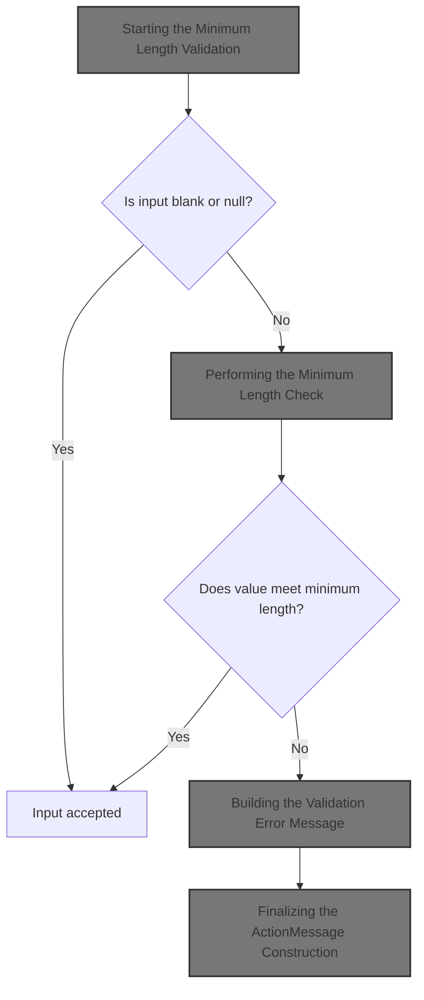
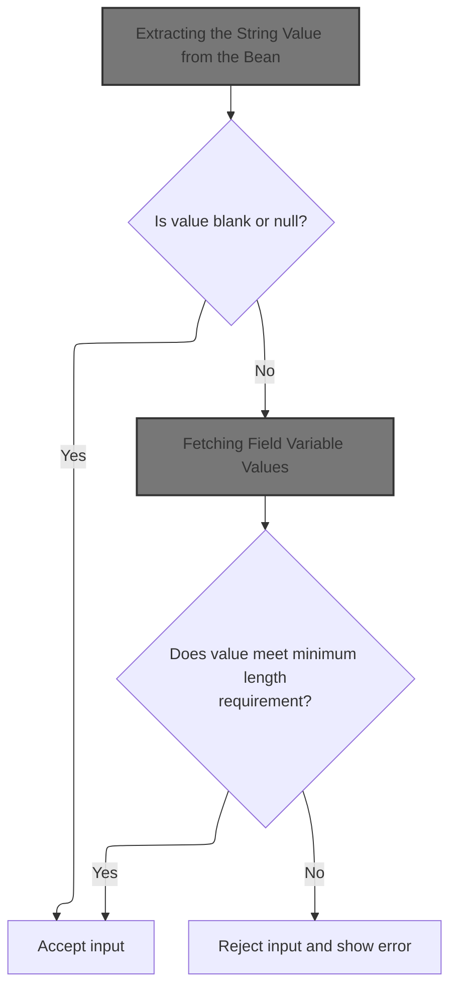
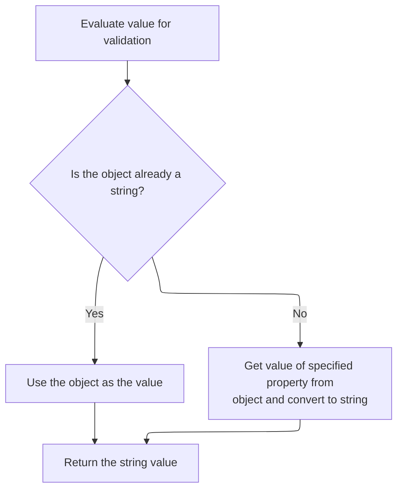
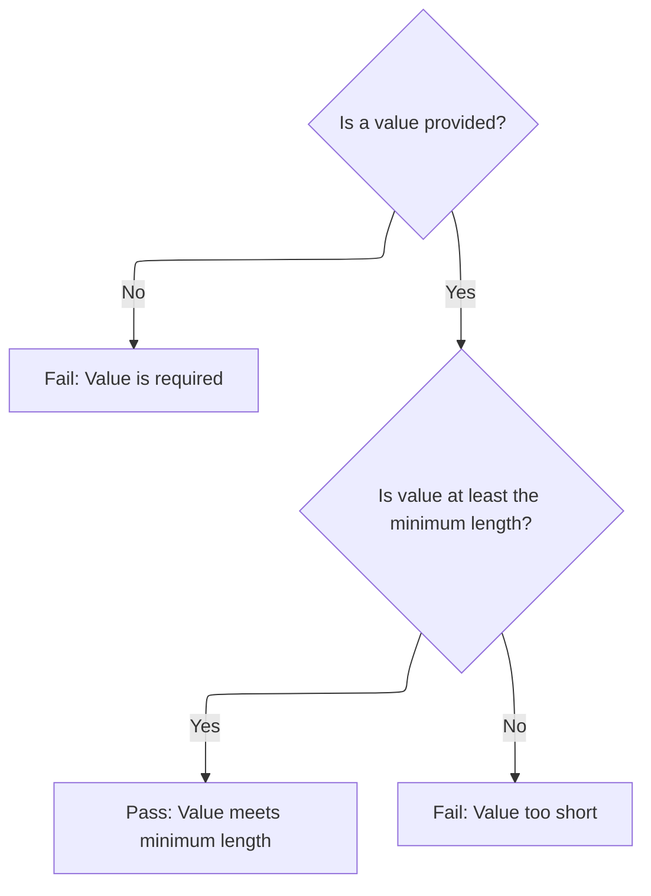
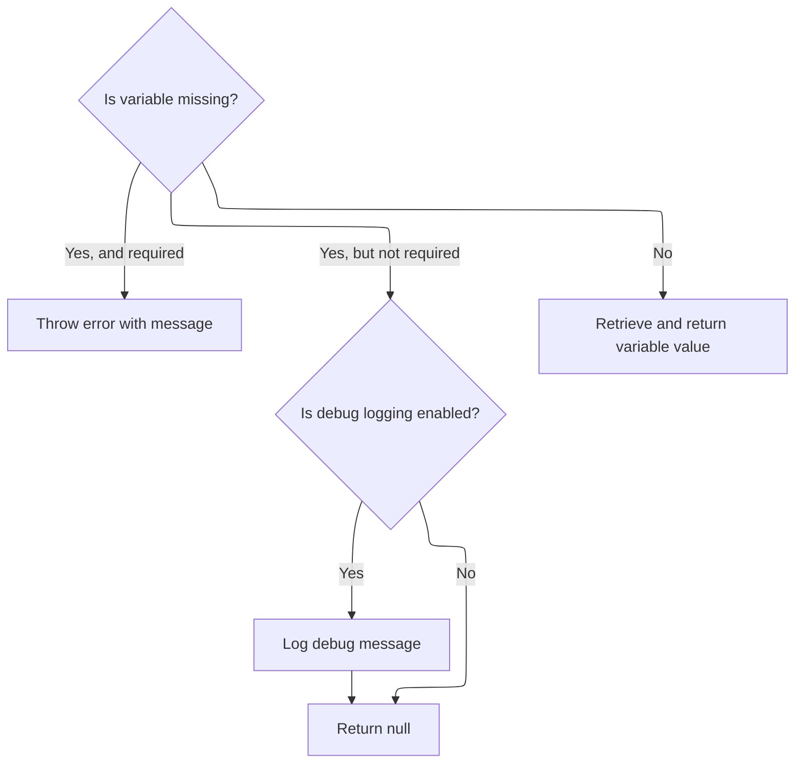
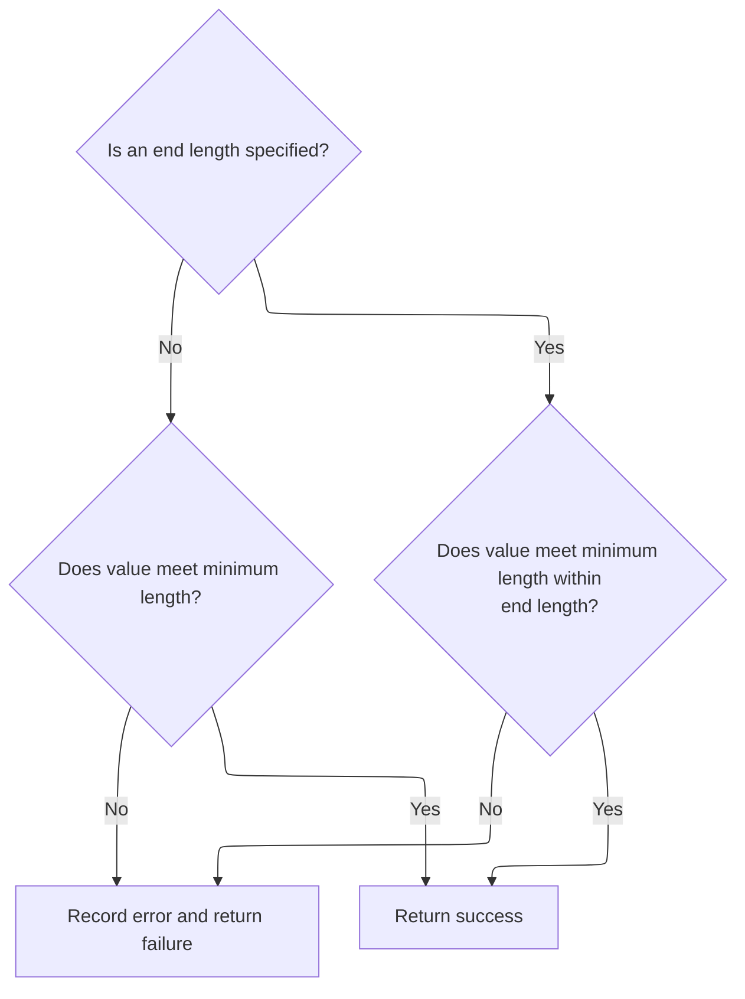

```mermaid
%%{init: {"flowchart": {"defaultRenderer": "elk"}} }%%
flowchart TD
    node1["Start: Prepare to generate action
message"]
    click node1 openCode "core/src/main/java/org/apache/struts/validator/Resources.java:373:376"
    node1 --> node2{"Custom message provided?"}
    click node2 openCode "core/src/main/java/org/apache/struts/validator/Resources.java:376:381"
    node2 -->|"No"| node3["Use default message key"]
    click node3 openCode "core/src/main/java/org/apache/struts/validator/Resources.java:377:377"
    node2 -->|"Yes"| node4["Use custom message key and bundle"]
    click node4 openCode "core/src/main/java/org/apache/struts/validator/Resources.java:379:381"
    node3 --> node5{"Is message key valid?"}
    node4 --> node5
    click node5 openCode "core/src/main/java/org/apache/struts/validator/Resources.java:383:386"
    node5 -->|"No"| node6["Return fallback message with field name
and property"]
    click node6 openCode "core/src/main/java/org/apache/struts/validator/Resources.java:384:386"
    node5 -->|"Yes"| node7["Retrieve arguments and locale"]
    click node7 openCode "core/src/main/java/org/apache/struts/validator/Resources.java:388:395"
    node7 --> node8{"Specific bundle specified?"}
    click node8 openCode "core/src/main/java/org/apache/struts/validator/Resources.java:400:406"
    node8 -->|"No"| node9["Create message using default bundle,
locale, and arguments"]
    click node9 openCode "core/src/main/java/org/apache/struts/validator/Resources.java:401:401"
    node8 -->|"Yes"| node10["Create message using specified bundle,
locale, and arguments"]
    click node10 openCode "core/src/main/java/org/apache/struts/validator/Resources.java:403:405"
    node9 --> node11["Return constructed action message"]
    click node11 openCode "core/src/main/java/org/apache/struts/validator/Resources.java:408:409"
    node10 --> node11
classDef HeadingStyle fill:#777777,stroke:#333,stroke-width:2px;

%% Swimm:
%% %%{init: {"flowchart": {"defaultRenderer": "elk"}} }%%
%% flowchart TD
%%     node1["Start: Prepare to generate action
%% message"]
%%     click node1 openCode "<SwmPath>[core/…/validator/Resources.java](core/src/main/java/org/apache/struts/validator/Resources.java)</SwmPath>:373:376"
%%     node1 --> node2{"Custom message provided?"}
%%     click node2 openCode "<SwmPath>[core/…/validator/Resources.java](core/src/main/java/org/apache/struts/validator/Resources.java)</SwmPath>:376:381"
%%     node2 -->|"No"| node3["Use default message key"]
%%     click node3 openCode "<SwmPath>[core/…/validator/Resources.java](core/src/main/java/org/apache/struts/validator/Resources.java)</SwmPath>:377:377"
%%     node2 -->|"Yes"| node4["Use custom message key and bundle"]
%%     click node4 openCode "<SwmPath>[core/…/validator/Resources.java](core/src/main/java/org/apache/struts/validator/Resources.java)</SwmPath>:379:381"
%%     node3 --> node5{"Is message key valid?"}
%%     node4 --> node5
%%     click node5 openCode "<SwmPath>[core/…/validator/Resources.java](core/src/main/java/org/apache/struts/validator/Resources.java)</SwmPath>:383:386"
%%     node5 -->|"No"| node6["Return fallback message with field name
%% and property"]
%%     click node6 openCode "<SwmPath>[core/…/validator/Resources.java](core/src/main/java/org/apache/struts/validator/Resources.java)</SwmPath>:384:386"
%%     node5 -->|"Yes"| node7["Retrieve arguments and locale"]
%%     click node7 openCode "<SwmPath>[core/…/validator/Resources.java](core/src/main/java/org/apache/struts/validator/Resources.java)</SwmPath>:388:395"
%%     node7 --> node8{"Specific bundle specified?"}
%%     click node8 openCode "<SwmPath>[core/…/validator/Resources.java](core/src/main/java/org/apache/struts/validator/Resources.java)</SwmPath>:400:406"
%%     node8 -->|"No"| node9["Create message using default bundle,
%% locale, and arguments"]
%%     click node9 openCode "<SwmPath>[core/…/validator/Resources.java](core/src/main/java/org/apache/struts/validator/Resources.java)</SwmPath>:401:401"
%%     node8 -->|"Yes"| node10["Create message using specified bundle,
%% locale, and arguments"]
%%     click node10 openCode "<SwmPath>[core/…/validator/Resources.java](core/src/main/java/org/apache/struts/validator/Resources.java)</SwmPath>:403:405"
%%     node9 --> node11["Return constructed action message"]
%%     click node11 openCode "<SwmPath>[core/…/validator/Resources.java](core/src/main/java/org/apache/struts/validator/Resources.java)</SwmPath>:408:409"
%%     node10 --> node11
%% classDef HeadingStyle fill:#777777,stroke:#333,stroke-width:2px;
```

This document describes how user input is validated to ensure it meets a configurable minimum length requirement. The process checks the value against the minimum length (and optional end length) specified in the field configuration, and provides a localized error message if the requirement is not met.



# Starting the Minimum Length Validation



<SwmSnippet path="/core/src/main/java/org/apache/struts/validator/FieldChecks.java" line="1270">

---

In <SwmToken path="core/src/main/java/org/apache/struts/validator/FieldChecks.java" pos="1270:7:7" line-data="    public static boolean validateMinLength(Object bean, ValidatorAction va,">`validateMinLength`</SwmToken>, we grab the value to validate from the bean, but since the bean could be a String or some other object, we call <SwmToken path="core/src/main/java/org/apache/struts/validator/FieldChecks.java" pos="1276:5:5" line-data="            value = evaluateBean(bean, field);">`evaluateBean`</SwmToken> to normalize it to a String before continuing. This keeps the validation logic generic and not tied to a specific bean structure.

```java
    public static boolean validateMinLength(Object bean, ValidatorAction va,
        Field field, ActionMessages errors, Validator validator,
        HttpServletRequest request) {
        String value = null;

        try {
            value = evaluateBean(bean, field);
```

---

</SwmSnippet>

## Extracting the String Value from the Bean



<SwmSnippet path="/core/src/main/java/org/apache/struts/validator/FieldChecks.java" line="389">

---

<SwmToken path="core/src/main/java/org/apache/struts/validator/FieldChecks.java" pos="389:7:7" line-data="    private static String evaluateBean(Object bean, Field field) throws Exception {">`evaluateBean`</SwmToken> checks if the bean is a String and returns it directly, otherwise it uses <SwmToken path="core/src/main/java/org/apache/struts/validator/FieldChecks.java" pos="395:5:5" line-data="            value = getValueAsString(bean, field.getProperty());">`getValueAsString`</SwmToken> to pull out the property value as a String. This lets us handle beans with properties, not just raw Strings.

```java
    private static String evaluateBean(Object bean, Field field) throws Exception {
        String value;

        if (isString(bean)) {
            value = (String) bean;
        } else {
            value = getValueAsString(bean, field.getProperty());
        }

        return value;
    }
```

---

</SwmSnippet>

<SwmSnippet path="/core/src/main/java/org/apache/struts/validator/FieldChecks.java" line="87">

---

<SwmToken path="core/src/main/java/org/apache/struts/validator/FieldChecks.java" pos="87:7:7" line-data="    private static String getValueAsString(Object bean, String property) ">`getValueAsString`</SwmToken> pulls the property value from the bean using reflection, then checks if it's a String array or Collection to handle empty cases cleanly. Everything else just gets its <SwmToken path="core/src/main/java/org/apache/struts/validator/FieldChecks.java" pos="96:23:25" line-data="            return ((String[]) value).length &gt; 0 ? value.toString() : &quot;&quot;;">`toString()`</SwmToken> called.

```java
    private static String getValueAsString(Object bean, String property) 
            throws Exception {
        
        Object value = PropertyUtils.getProperty(bean, property);
        if (value == null) {
            return null;
        }

        if (value instanceof String[]) {
            return ((String[]) value).length > 0 ? value.toString() : "";

        } else if (value instanceof Collection) {
            return ((Collection) value).isEmpty() ? "" : value.toString();

        } else {
            return value.toString();
        }
    }
```

---

</SwmSnippet>

## Retrieving Validation Parameters



<SwmSnippet path="/core/src/main/java/org/apache/struts/validator/FieldChecks.java" line="1277">

---

Back in <SwmToken path="core/src/main/java/org/apache/struts/validator/FieldChecks.java" pos="1270:7:7" line-data="    public static boolean validateMinLength(Object bean, ValidatorAction va,">`validateMinLength`</SwmToken>, after getting the value, we pull the 'minlength' and optional <SwmToken path="core/src/main/java/org/apache/struts/validator/FieldChecks.java" pos="1284:12:12" line-data="                String endLth = Resources.getVarValue(&quot;lineEndLength&quot;, field,">`lineEndLength`</SwmToken> parameters from resources. This lets us adjust validation rules per field and supports config-driven validation. We need to call <SwmToken path="core/src/main/java/org/apache/struts/validator/FieldChecks.java" pos="1279:1:3" line-data="                    Resources.getVarValue(&quot;minlength&quot;, field, validator,">`Resources.getVarValue`</SwmToken> to fetch these parameters dynamically.

```java
            if (!GenericValidator.isBlankOrNull(value)) {
                String minVar =
                    Resources.getVarValue("minlength", field, validator,
                        request, true);
                int min = Integer.parseInt(minVar);

                boolean isValid = false;
                String endLth = Resources.getVarValue("lineEndLength", field,
                    validator, request, false);
```

---

</SwmSnippet>

## Fetching Field Variable Values

<SwmSnippet path="/core/src/main/java/org/apache/struts/validator/Resources.java" line="157">

---

In <SwmToken path="core/src/main/java/org/apache/struts/validator/Resources.java" pos="157:7:7" line-data="    public static String getVarValue(String varName, Field field,">`getVarValue`</SwmToken>, we check if the field variable exists. If it's missing, we grab an error message using <SwmToken path="core/src/main/java/org/apache/struts/util/PropertyMessageResources.java" pos="82:8:8" line-data=" * Configure &lt;code&gt;PropertyMessageResources&lt;/code&gt; to operate in this mode by">`PropertyMessageResources`</SwmToken> to explain the problem, especially for required variables.

```java
    public static String getVarValue(String varName, Field field,
        Validator validator, HttpServletRequest request, boolean required) {
        Var var = field.getVar(varName);

        if (var == null) {
            String msg = sysmsgs.getMessage("variable.missing", varName);

```

---

</SwmSnippet>

### Looking Up Localized Messages with Fallback

```mermaid
%%{init: {"flowchart": {"defaultRenderer": "elk"}} }%%
flowchart TD
  node1["Search for message in requested locale"]
  click node1 openCode "core/src/main/java/org/apache/struts/util/PropertyMessageResources.java:238:239"
  node2{"Message found?"}
  click node2 openCode "core/src/main/java/org/apache/struts/util/PropertyMessageResources.java:239:241"
  node1 --> node2
  node2 -->|"Yes"| node13["Return message"]
  click node13 openCode "core/src/main/java/org/apache/struts/util/PropertyMessageResources.java:240:241"
  node2 -->|"No"| node3{"mode = JSTL?"}
  click node3 openCode "core/src/main/java/org/apache/struts/util/PropertyMessageResources.java:244:247"
  node3 -->|"Yes"| node8["Search for message in default
properties"]
  click node8 openCode "core/src/main/java/org/apache/struts/util/PropertyMessageResources.java:271:273"
  node3 -->|"No"| node4{"mode = ResourceBundle?"}
  click node4 openCode "core/src/main/java/org/apache/struts/util/PropertyMessageResources.java:250:256"
  node4 --> node5{"Requested locale = default locale?"}
  click node5 openCode "core/src/main/java/org/apache/struts/util/PropertyMessageResources.java:252:254"
  node5 -->|"No"| node6["Search for message in default locale"]
  click node6 openCode "core/src/main/java/org/apache/struts/util/PropertyMessageResources.java:253:254"
  node5 -->|"Yes"| node8
  node6 --> node7{"Message found?"}
  click node7 openCode "core/src/main/java/org/apache/struts/util/PropertyMessageResources.java:266:268"
  node7 -->|"Yes"| node13
  node7 -->|"No"| node8
  node8 --> node9{"Message found?"}
  click node9 openCode "core/src/main/java/org/apache/struts/util/PropertyMessageResources.java:272:274"
  node9 -->|"Yes"| node13
  node9 -->|"No"| node10{"returnNull?"}
  click node10 openCode "core/src/main/java/org/apache/struts/util/PropertyMessageResources.java:277:281"
  node10 -->|"Yes"| node11["Return null"]
  click node11 openCode "core/src/main/java/org/apache/struts/util/PropertyMessageResources.java:278:279"
  node10 -->|"No"| node12["Return placeholder (???key???)"]
  click node12 openCode "core/src/main/java/org/apache/struts/util/PropertyMessageResources.java:280:281"
classDef HeadingStyle fill:#777777,stroke:#333,stroke-width:2px;

%% Swimm:
%% %%{init: {"flowchart": {"defaultRenderer": "elk"}} }%%
%% flowchart TD
%%   node1["Search for message in requested locale"]
%%   click node1 openCode "<SwmPath>[core/…/util/PropertyMessageResources.java](core/src/main/java/org/apache/struts/util/PropertyMessageResources.java)</SwmPath>:238:239"
%%   node2{"Message found?"}
%%   click node2 openCode "<SwmPath>[core/…/util/PropertyMessageResources.java](core/src/main/java/org/apache/struts/util/PropertyMessageResources.java)</SwmPath>:239:241"
%%   node1 --> node2
%%   node2 -->|"Yes"| node13["Return message"]
%%   click node13 openCode "<SwmPath>[core/…/util/PropertyMessageResources.java](core/src/main/java/org/apache/struts/util/PropertyMessageResources.java)</SwmPath>:240:241"
%%   node2 -->|"No"| node3{"mode = JSTL?"}
%%   click node3 openCode "<SwmPath>[core/…/util/PropertyMessageResources.java](core/src/main/java/org/apache/struts/util/PropertyMessageResources.java)</SwmPath>:244:247"
%%   node3 -->|"Yes"| node8["Search for message in default
%% properties"]
%%   click node8 openCode "<SwmPath>[core/…/util/PropertyMessageResources.java](core/src/main/java/org/apache/struts/util/PropertyMessageResources.java)</SwmPath>:271:273"
%%   node3 -->|"No"| node4{"mode = ResourceBundle?"}
%%   click node4 openCode "<SwmPath>[core/…/util/PropertyMessageResources.java](core/src/main/java/org/apache/struts/util/PropertyMessageResources.java)</SwmPath>:250:256"
%%   node4 --> node5{"Requested locale = default locale?"}
%%   click node5 openCode "<SwmPath>[core/…/util/PropertyMessageResources.java](core/src/main/java/org/apache/struts/util/PropertyMessageResources.java)</SwmPath>:252:254"
%%   node5 -->|"No"| node6["Search for message in default locale"]
%%   click node6 openCode "<SwmPath>[core/…/util/PropertyMessageResources.java](core/src/main/java/org/apache/struts/util/PropertyMessageResources.java)</SwmPath>:253:254"
%%   node5 -->|"Yes"| node8
%%   node6 --> node7{"Message found?"}
%%   click node7 openCode "<SwmPath>[core/…/util/PropertyMessageResources.java](core/src/main/java/org/apache/struts/util/PropertyMessageResources.java)</SwmPath>:266:268"
%%   node7 -->|"Yes"| node13
%%   node7 -->|"No"| node8
%%   node8 --> node9{"Message found?"}
%%   click node9 openCode "<SwmPath>[core/…/util/PropertyMessageResources.java](core/src/main/java/org/apache/struts/util/PropertyMessageResources.java)</SwmPath>:272:274"
%%   node9 -->|"Yes"| node13
%%   node9 -->|"No"| node10{"<SwmToken path="core/src/main/java/org/apache/struts/util/PropertyMessageResources.java" pos="277:4:4" line-data="        if (returnNull) {">`returnNull`</SwmToken>?"}
%%   click node10 openCode "<SwmPath>[core/…/util/PropertyMessageResources.java](core/src/main/java/org/apache/struts/util/PropertyMessageResources.java)</SwmPath>:277:281"
%%   node10 -->|"Yes"| node11["Return null"]
%%   click node11 openCode "<SwmPath>[core/…/util/PropertyMessageResources.java](core/src/main/java/org/apache/struts/util/PropertyMessageResources.java)</SwmPath>:278:279"
%%   node10 -->|"No"| node12["Return placeholder (???key???)"]
%%   click node12 openCode "<SwmPath>[core/…/util/PropertyMessageResources.java](core/src/main/java/org/apache/struts/util/PropertyMessageResources.java)</SwmPath>:280:281"
%% classDef HeadingStyle fill:#777777,stroke:#333,stroke-width:2px;
```



<SwmSnippet path="/core/src/main/java/org/apache/struts/util/PropertyMessageResources.java" line="227">

---

<SwmToken path="core/src/main/java/org/apache/struts/util/PropertyMessageResources.java" pos="227:5:5" line-data="    public String getMessage(Locale locale, String key) {">`getMessage`</SwmToken> tries to find a localized message for the given key and locale, using different fallback strategies depending on the mode. If it can't find the message, it tries more general locales or the default bundle, and finally returns a placeholder if all else fails. The actual lookup is done by <SwmToken path="core/src/main/java/org/apache/struts/util/PropertyMessageResources.java" pos="238:5:5" line-data="        message = findMessage(locale, key, originalKey);">`findMessage`</SwmToken>.

```java
    public String getMessage(Locale locale, String key) {
        if (log.isDebugEnabled()) {
            log.debug("getMessage(" + locale + "," + key + ")");
        }

        // Initialize variables we will require
        String localeKey = localeKey(locale);
        String originalKey = messageKey(localeKey, key);
        String message = null;

        // Search the specified Locale
        message = findMessage(locale, key, originalKey);
        if (message != null) {
            return message;
        }

        // JSTL Compatibility - JSTL doesn't use the default locale
        if (mode == MODE_JSTL) {

           // do nothing (i.e. don't use default Locale)

        // PropertyResourcesBundle - searches through the hierarchy
        // for the default Locale (e.g. first en_US then en)
        } else if (mode == MODE_RESOURCE_BUNDLE) {

            if (!defaultLocale.equals(locale)) {
                message = findMessage(defaultLocale, key, originalKey);
            }

        // Default (backwards) Compatibility - just searches the
        // specified Locale (e.g. just en_US)
        } else {

            if (!defaultLocale.equals(locale)) {
                localeKey = localeKey(defaultLocale);
                message = findMessage(localeKey, key, originalKey);
            }

        }
        if (message != null) {
            return message;
        }

        // Find the message in the default properties file
        message = findMessage("", key, originalKey);
        if (message != null) {
            return message;
        }

        // Return an appropriate error indication
        if (returnNull) {
            return (null);
        } else {
            return ("???" + messageKey(locale, key) + "???");
        }
    }
```

---

</SwmSnippet>

<SwmSnippet path="/core/src/main/java/org/apache/struts/util/PropertyMessageResources.java" line="393">

---

<SwmToken path="core/src/main/java/org/apache/struts/util/PropertyMessageResources.java" pos="393:5:5" line-data="    private String findMessage(Locale locale, String key, String originalKey) {">`findMessage`</SwmToken> keeps stripping parts off the locale key (like going from <SwmToken path="core/src/main/java/org/apache/struts/util/PropertyMessageResources.java" pos="249:19:19" line-data="        // for the default Locale (e.g. first en_US then en)">`en_US`</SwmToken> to en) to find a message at the most specific level possible, then falls back to more general ones if needed.

```java
    private String findMessage(Locale locale, String key, String originalKey) {

        // Initialize variables we will require
        String localeKey = localeKey(locale);
        String messageKey = null;
        String message = null;
        int underscore = 0;

        // Loop from specific to general Locales looking for this message
        while (true) {
            message = findMessage(localeKey, key, originalKey);
            if (message != null) {
                break;
            }

            // Strip trailing modifiers to try a more general locale key
            underscore = localeKey.lastIndexOf("_");

            if (underscore < 0) {
                break;
            }

            localeKey = localeKey.substring(0, underscore);
        }
```

---

</SwmSnippet>

### Returning or Handling Missing Field Variables



<SwmSnippet path="/core/src/main/java/org/apache/struts/validator/Resources.java" line="164">

---

After getting the message from <SwmToken path="core/src/main/java/org/apache/struts/util/PropertyMessageResources.java" pos="82:8:8" line-data=" * Configure &lt;code&gt;PropertyMessageResources&lt;/code&gt; to operate in this mode by">`PropertyMessageResources`</SwmToken>, <SwmToken path="core/src/main/java/org/apache/struts/validator/Resources.java" pos="178:3:3" line-data="        return getVarValue(var, application, request, required);">`getVarValue`</SwmToken> either throws if the variable is required, logs and returns null if not, or fetches the actual value if the variable exists. This controls how missing config is handled.

```java
            if (required) {
                throw new IllegalArgumentException(msg);
            }

            if (log.isDebugEnabled()) {
                log.debug(field.getProperty() + ": " + msg);
            }

            return null;
        }

        ServletContext application =
            (ServletContext) validator.getParameterValue(SERVLET_CONTEXT_PARAM);

        return getVarValue(var, application, request, required);
    }
```

---

</SwmSnippet>

## Performing the Minimum Length Check



<SwmSnippet path="/core/src/main/java/org/apache/struts/validator/FieldChecks.java" line="1286">

---

After getting the parameters from Resources, <SwmToken path="core/src/main/java/org/apache/struts/validator/FieldChecks.java" pos="1270:7:7" line-data="    public static boolean validateMinLength(Object bean, ValidatorAction va,">`validateMinLength`</SwmToken> runs the actual min length check, optionally using the <SwmToken path="core/src/main/java/org/apache/struts/validator/FieldChecks.java" pos="1284:12:12" line-data="                String endLth = Resources.getVarValue(&quot;lineEndLength&quot;, field,">`lineEndLength`</SwmToken> parameter if it's set. If validation fails, it adds an error message using <SwmToken path="core/src/main/java/org/apache/struts/validator/FieldChecks.java" pos="1295:1:3" line-data="                        Resources.getActionMessage(validator, request, va, field));">`Resources.getActionMessage`</SwmToken>.

```java
                if (GenericValidator.isBlankOrNull(endLth)) {
                    isValid = GenericValidator.minLength(value, min);
                } else {
                    isValid = GenericValidator.minLength(value, min,
                        Integer.parseInt(endLth));
                }

                if (!isValid) {
                    errors.add(field.getKey(),
                        Resources.getActionMessage(validator, request, va, field));

                    return false;
                }
            }
        } catch (Exception e) {
            processFailure(errors, field, validator.getFormName(), "minlength", e);

            return false;
        }

        return true;
    }
```

---

</SwmSnippet>

# Building the Validation Error Message

<SwmSnippet path="/core/src/main/java/org/apache/struts/validator/Resources.java" line="365">

---

In <SwmToken path="core/src/main/java/org/apache/struts/validator/Resources.java" pos="365:7:7" line-data="    public static ActionMessage getActionMessage(Validator validator,">`getActionMessage`</SwmToken>, we check if the field has a direct message for the validator action. If not, we figure out the message key and bundle, then call <SwmToken path="core/src/main/java/org/apache/struts/config/ConfigHelper.java" pos="56:4:4" line-data="public class ConfigHelper implements ConfigHelperInterface {">`ConfigHelper`</SwmToken> to fetch the localized message if needed.

```java
    public static ActionMessage getActionMessage(Validator validator,
        HttpServletRequest request, ValidatorAction va, Field field) {
        Msg msg = field.getMessage(va.getName());

        if ((msg != null) && !msg.isResource()) {
            return new ActionMessage(msg.getKey(), false);
        }

```

---

</SwmSnippet>

## Resolving the Localized Message String

<SwmSnippet path="/core/src/main/java/org/apache/struts/config/ConfigHelper.java" line="496">

---

In <SwmToken path="core/src/main/java/org/apache/struts/config/ConfigHelper.java" pos="496:5:5" line-data="    public String getMessage(String key) {">`getMessage`</SwmToken>, we grab the message resources and then call <SwmToken path="core/src/main/java/org/apache/struts/config/ConfigHelper.java" pos="503:7:7" line-data="        return resources.getMessage(RequestUtils.getUserLocale(request, null),">`RequestUtils`</SwmToken> to get the user's locale, so we can fetch the right localized message string.

```java
    public String getMessage(String key) {
        MessageResources resources = getMessageResources();

        if (resources == null) {
            return null;
        }

        return resources.getMessage(RequestUtils.getUserLocale(request, null),
```

---

</SwmSnippet>

<SwmSnippet path="/core/src/main/java/org/apache/struts/util/RequestUtils.java" line="299">

---

<SwmToken path="core/src/main/java/org/apache/struts/util/RequestUtils.java" pos="299:7:7" line-data="    public static Locale getUserLocale(HttpServletRequest request, String locale) {">`getUserLocale`</SwmToken> first tries to get the user's locale from the session (using a standard key), and if that's not set, it falls back to the request's locale. This covers both user preferences and browser defaults.

```java
    public static Locale getUserLocale(HttpServletRequest request, String locale) {
        Locale userLocale = null;
        HttpSession session = request.getSession(false);

        if (locale == null) {
            locale = Globals.LOCALE_KEY;
        }

        // Only check session if sessions are enabled
        if (session != null) {
            userLocale = (Locale) session.getAttribute(locale);
        }

        if (userLocale == null) {
            // Returns Locale based on Accept-Language header or the server default
            userLocale = request.getLocale();
        }

        return userLocale;
    }
```

---

</SwmSnippet>

<SwmSnippet path="/core/src/main/java/org/apache/struts/config/ConfigHelper.java" line="503">

---

After getting the user's locale in <SwmToken path="core/src/main/java/org/apache/struts/config/ConfigHelper.java" pos="56:4:4" line-data="public class ConfigHelper implements ConfigHelperInterface {">`ConfigHelper`</SwmToken>, we call <SwmToken path="core/src/main/java/org/apache/struts/config/ConfigHelper.java" pos="503:3:5" line-data="        return resources.getMessage(RequestUtils.getUserLocale(request, null),">`resources.getMessage`</SwmToken> with that locale and the key, so we get the right localized string for the error message.

```java
        return resources.getMessage(RequestUtils.getUserLocale(request, null),
            key);
    }
```

---

</SwmSnippet>

<SwmSnippet path="/core/src/main/java/org/apache/struts/validator/Resources.java" line="249">

---

<SwmToken path="core/src/main/java/org/apache/struts/validator/Resources.java" pos="249:7:7" line-data="    public static String getMessage(HttpServletRequest request, String key) {">`getMessage`</SwmToken> in Resources grabs the message resources and then calls <SwmToken path="core/src/main/java/org/apache/struts/validator/Resources.java" pos="252:8:8" line-data="        return getMessage(messages, RequestUtils.getUserLocale(request, null),">`RequestUtils`</SwmToken> to get the user's locale, so the message is formatted for the right language.

```java
    public static String getMessage(HttpServletRequest request, String key) {
        MessageResources messages = getMessageResources(request);

        return getMessage(messages, RequestUtils.getUserLocale(request, null),
            key);
    }
```

---

</SwmSnippet>

## Finalizing the <SwmToken path="core/src/main/java/org/apache/struts/validator/Resources.java" pos="365:5:5" line-data="    public static ActionMessage getActionMessage(Validator validator,">`ActionMessage`</SwmToken> Construction



<SwmSnippet path="/core/src/main/java/org/apache/struts/validator/Resources.java" line="373">

---

After getting the message string from <SwmToken path="core/src/main/java/org/apache/struts/config/ConfigHelper.java" pos="56:4:4" line-data="public class ConfigHelper implements ConfigHelperInterface {">`ConfigHelper`</SwmToken>, <SwmToken path="core/src/main/java/org/apache/struts/validator/FieldChecks.java" pos="1295:3:3" line-data="                        Resources.getActionMessage(validator, request, va, field));">`getActionMessage`</SwmToken> checks if the key is missing and returns a placeholder if so. Otherwise, it grabs the <SwmToken path="core/src/main/java/org/apache/struts/validator/Resources.java" pos="388:1:1" line-data="        ServletContext application =">`ServletContext`</SwmToken> and <SwmToken path="core/src/main/java/org/apache/struts/validator/Resources.java" pos="390:1:1" line-data="        MessageResources messages =">`MessageResources`</SwmToken> to prep for localization.

```java
        String msgKey = null;
        String msgBundle = null;

        if (msg == null) {
            msgKey = va.getMsg();
        } else {
            msgKey = msg.getKey();
            msgBundle = msg.getBundle();
        }

        if ((msgKey == null) || (msgKey.length() == 0)) {
            return new ActionMessage("??? " + va.getName() + "."
                + field.getProperty() + " ???", false);
        }

        ServletContext application =
            (ServletContext) validator.getParameterValue(SERVLET_CONTEXT_PARAM);
        MessageResources messages =
            getMessageResources(application, request, msgBundle);
```

---

</SwmSnippet>

<SwmSnippet path="/core/src/main/java/org/apache/struts/validator/Resources.java" line="117">

---

<SwmToken path="core/src/main/java/org/apache/struts/validator/Resources.java" pos="117:7:7" line-data="    public static MessageResources getMessageResources(">`getMessageResources`</SwmToken> tries to find the message resources in the request, then in the application with a module prefix, and finally just by bundle name. If it can't find them anywhere, it throws. This supports modular resource organization.

```java
    public static MessageResources getMessageResources(
        ServletContext application, HttpServletRequest request, String bundle) {
        if (bundle == null) {
            bundle = Globals.MESSAGES_KEY;
        }

        MessageResources resources =
            (MessageResources) request.getAttribute(bundle);

        if (resources == null) {
            ModuleConfig moduleConfig =
                ModuleUtils.getInstance().getModuleConfig(request, application);

            resources =
                (MessageResources) application.getAttribute(bundle
                    + moduleConfig.getPrefix());
        }

        if (resources == null) {
            resources = (MessageResources) application.getAttribute(bundle);
        }

        if (resources == null) {
            throw new NullPointerException(
                "No message resources found for bundle: " + bundle);
        }

        return resources;
    }
```

---

</SwmSnippet>

<SwmSnippet path="/core/src/main/java/org/apache/struts/validator/Resources.java" line="392">

---

After finding the message resources, <SwmToken path="core/src/main/java/org/apache/struts/validator/FieldChecks.java" pos="1295:3:3" line-data="                        Resources.getActionMessage(validator, request, va, field));">`getActionMessage`</SwmToken> grabs the user's locale so the error message is localized properly.

```java
        Locale locale = RequestUtils.getUserLocale(request, null);

```

---

</SwmSnippet>

<SwmSnippet path="/core/src/main/java/org/apache/struts/validator/Resources.java" line="394">

---

After getting the locale, <SwmToken path="core/src/main/java/org/apache/struts/validator/FieldChecks.java" pos="1295:3:3" line-data="                        Resources.getActionMessage(validator, request, va, field));">`getActionMessage`</SwmToken> fetches the argument values for the message, so any placeholders in the error message get filled in with the right values.

```java
        Arg[] args = field.getArgs(va.getName());
```

---

</SwmSnippet>

<SwmSnippet path="/core/src/main/java/org/apache/struts/validator/Resources.java" line="420">

---

<SwmToken path="core/src/main/java/org/apache/struts/validator/Resources.java" pos="420:9:9" line-data="    public static String[] getArgs(String actionName,">`getArgs`</SwmToken> grabs up to 4 Arg objects from the Field, checks if each is a resource, and localizes them if needed. Only the first 4 arguments are supported.

```java
    public static String[] getArgs(String actionName,
        MessageResources messages, Locale locale, Field field) {
        String[] argMessages = new String[4];

        Arg[] args =
            new Arg[] {
                field.getArg(actionName, 0), field.getArg(actionName, 1),
                field.getArg(actionName, 2), field.getArg(actionName, 3)
            };

        for (int i = 0; i < args.length; i++) {
            if (args[i] == null) {
                continue;
            }

            if (args[i].isResource()) {
                argMessages[i] = getMessage(messages, locale, args[i].getKey());
            } else {
                argMessages[i] = args[i].getKey();
            }
        }
```

---

</SwmSnippet>

<SwmSnippet path="/core/src/main/java/org/apache/struts/validator/Resources.java" line="395">

---

After getting the Arg objects, <SwmToken path="core/src/main/java/org/apache/struts/validator/FieldChecks.java" pos="1295:3:3" line-data="                        Resources.getActionMessage(validator, request, va, field));">`getActionMessage`</SwmToken> calls <SwmToken path="core/src/main/java/org/apache/struts/validator/Resources.java" pos="396:1:1" line-data="            getArgValues(application, request, messages, locale, args);">`getArgValues`</SwmToken> to turn them into strings, resolving resource keys and bundles as needed for message formatting.

```java
        String[] argValues =
            getArgValues(application, request, messages, locale, args);

```

---

</SwmSnippet>

<SwmSnippet path="/core/src/main/java/org/apache/struts/validator/Resources.java" line="455">

---

<SwmToken path="core/src/main/java/org/apache/struts/validator/Resources.java" pos="455:9:9" line-data="    private static String[] getArgValues(ServletContext application,">`getArgValues`</SwmToken> loops through the Arg objects, and for each resource Arg, it fetches the localized string from the right bundle. <SwmToken path="core/src/main/java/org/apache/struts/validator/Resources.java" pos="195:3:5" line-data="        // Non-resource variable">`Non-resource`</SwmToken> Args just use their key as the value.

```java
    private static String[] getArgValues(ServletContext application,
        HttpServletRequest request, MessageResources defaultMessages,
        Locale locale, Arg[] args) {
        if ((args == null) || (args.length == 0)) {
            return null;
        }

        String[] values = new String[args.length];

        for (int i = 0; i < args.length; i++) {
            if (args[i] != null) {
                if (args[i].isResource()) {
                    MessageResources messages = defaultMessages;

                    if (args[i].getBundle() != null) {
                        messages =
                            getMessageResources(application, request,
                                args[i].getBundle());
                    }

                    values[i] = messages.getMessage(locale, args[i].getKey());
                } else {
                    values[i] = args[i].getKey();
                }
            }
        }

        return values;
    }
```

---

</SwmSnippet>

<SwmSnippet path="/core/src/main/java/org/apache/struts/validator/Resources.java" line="398">

---

After resolving the argument values, <SwmToken path="core/src/main/java/org/apache/struts/validator/FieldChecks.java" pos="1295:3:3" line-data="                        Resources.getActionMessage(validator, request, va, field));">`getActionMessage`</SwmToken> builds the <SwmToken path="core/src/main/java/org/apache/struts/validator/Resources.java" pos="398:1:1" line-data="        ActionMessage actionMessage = null;">`ActionMessage`</SwmToken>. If there's a bundle, it uses the localized string; if not, it just uses the key and arguments. This controls how the message is formatted and localized.

```java
        ActionMessage actionMessage = null;

        if (msgBundle == null) {
            actionMessage = new ActionMessage(msgKey, argValues);
        } else {
            String message = messages.getMessage(locale, msgKey, argValues);

            actionMessage = new ActionMessage(message, false);
        }

        return actionMessage;
    }
```

---

</SwmSnippet>

&nbsp;

*This is an auto-generated document by Swimm 🌊 and has not yet been verified by a human*

<SwmMeta version="3.0.0" repo-id="Z2l0aHViJTNBJTNBc3RydXRzMSUzQSUzQVN3aW1tLURlbW8=" repo-name="struts1"><sup>Powered by [Swimm](https://app.swimm.io/)</sup></SwmMeta>
