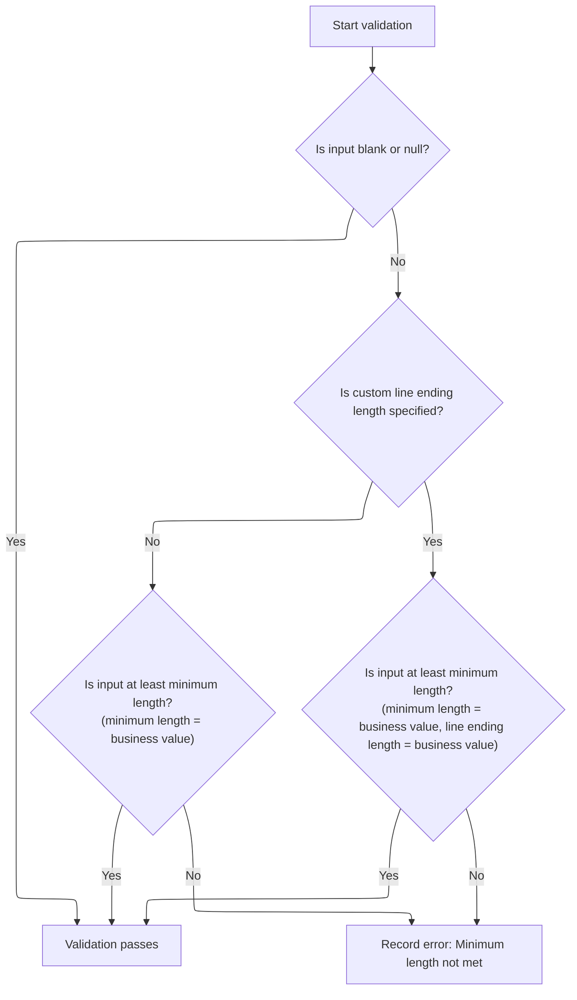
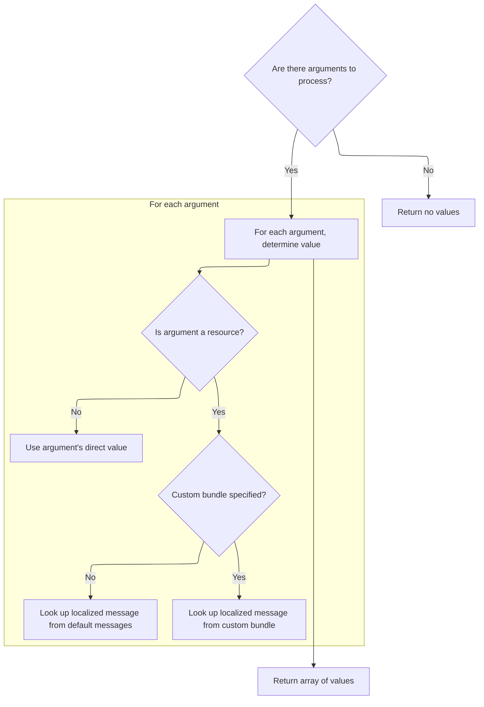

This document outlines how user input is validated to ensure it meets a minimum length requirement, with optional consideration for line endings. If the input does not meet the requirement, a localized error message is generated to inform the user.

# Validating minimum length with optional line end handling



<SwmSnippet path="/core/src/main/java/org/apache/struts/validator/FieldChecks.java" line="1270">

---

<SwmToken path="core/src/main/java/org/apache/struts/validator/FieldChecks.java" pos="1270:7:7" line-data="    public static boolean validateMinLength(Object bean, ValidatorAction va,">`validateMinLength`</SwmToken> starts by extracting the field value and checking if it's blank. It grabs 'minlength' and optionally <SwmToken path="core/src/main/java/org/apache/struts/validator/FieldChecks.java" pos="1284:12:12" line-data="                String endLth = Resources.getVarValue(&quot;lineEndLength&quot;, field,">`lineEndLength`</SwmToken> from resources, then runs the minimum length check using <SwmToken path="core/src/main/java/org/apache/struts/validator/FieldChecks.java" pos="1277:5:5" line-data="            if (!GenericValidator.isBlankOrNull(value)) {">`GenericValidator`</SwmToken>. If <SwmToken path="core/src/main/java/org/apache/struts/validator/FieldChecks.java" pos="1284:12:12" line-data="                String endLth = Resources.getVarValue(&quot;lineEndLength&quot;, field,">`lineEndLength`</SwmToken> is set, it uses a variant that counts line endings. If validation fails, it calls <SwmToken path="core/src/main/java/org/apache/struts/validator/FieldChecks.java" pos="1295:1:3" line-data="                        Resources.getActionMessage(validator, request, va, field));">`Resources.getActionMessage`</SwmToken> to build the error message. We need to call <SwmPath>[core/…/validator/Resources.java](core/src/main/java/org/apache/struts/validator/Resources.java)</SwmPath> next to fetch these resource values and error messages, since the validation logic depends on them.

```java
    public static boolean validateMinLength(Object bean, ValidatorAction va,
        Field field, ActionMessages errors, Validator validator,
        HttpServletRequest request) {
        String value = null;

        try {
            value = evaluateBean(bean, field);
            if (!GenericValidator.isBlankOrNull(value)) {
                String minVar =
                    Resources.getVarValue("minlength", field, validator,
                        request, true);
                int min = Integer.parseInt(minVar);

                boolean isValid = false;
                String endLth = Resources.getVarValue("lineEndLength", field,
                    validator, request, false);
                if (GenericValidator.isBlankOrNull(endLth)) {
                    isValid = GenericValidator.minLength(value, min);
                } else {
                    isValid = GenericValidator.minLength(value, min,
                        Integer.parseInt(endLth));
                }

                if (!isValid) {
                    errors.add(field.getKey(),
                        Resources.getActionMessage(validator, request, va, field));

                    return false;
                }
            }
        } catch (Exception e) {
            processFailure(errors, field, validator.getFormName(), "minlength", e);

            return false;
        }

        return true;
    }
```

---

</SwmSnippet>

# Building validation error messages

<SwmSnippet path="/core/src/main/java/org/apache/struts/validator/Resources.java" line="365">

---

In <SwmToken path="core/src/main/java/org/apache/struts/validator/Resources.java" pos="365:7:7" line-data="    public static ActionMessage getActionMessage(Validator validator,">`getActionMessage`</SwmToken>, we grab the Msg from the Field for the <SwmToken path="core/src/main/java/org/apache/struts/validator/Resources.java" pos="366:6:6" line-data="        HttpServletRequest request, ValidatorAction va, Field field) {">`ValidatorAction`</SwmToken>. If it's a direct message, we return it. Otherwise, we figure out the message key and bundle, get the <SwmToken path="core/src/main/java/org/apache/struts/validator/Resources.java" pos="388:1:1" line-data="        ServletContext application =">`ServletContext`</SwmToken>, and fetch the <SwmToken path="core/src/main/java/org/apache/struts/validator/Resources.java" pos="390:1:1" line-data="        MessageResources messages =">`MessageResources`</SwmToken> and Locale. We then call <SwmToken path="core/src/main/java/org/apache/struts/validator/Resources.java" pos="396:1:1" line-data="            getArgValues(application, request, messages, locale, args);">`getArgValues`</SwmToken> to prep arguments for the message. We need to call <SwmPath>[core/…/validator/Resources.java](core/src/main/java/org/apache/struts/validator/Resources.java)</SwmPath> next to resolve message resources and arguments, since error messages depend on them.

```java
    public static ActionMessage getActionMessage(Validator validator,
        HttpServletRequest request, ValidatorAction va, Field field) {
        Msg msg = field.getMessage(va.getName());

        if ((msg != null) && !msg.isResource()) {
            return new ActionMessage(msg.getKey(), false);
        }

        String msgKey = null;
        String msgBundle = null;

        if (msg == null) {
            msgKey = va.getMsg();
        } else {
            msgKey = msg.getKey();
            msgBundle = msg.getBundle();
        }

        if ((msgKey == null) || (msgKey.length() == 0)) {
            return new ActionMessage("??? " + va.getName() + "."
                + field.getProperty() + " ???", false);
        }

        ServletContext application =
            (ServletContext) validator.getParameterValue(SERVLET_CONTEXT_PARAM);
        MessageResources messages =
            getMessageResources(application, request, msgBundle);
        Locale locale = RequestUtils.getUserLocale(request, null);

        Arg[] args = field.getArgs(va.getName());
        String[] argValues =
            getArgValues(application, request, messages, locale, args);

```

---

</SwmSnippet>

## Resolving message arguments and resource bundles



<SwmSnippet path="/core/src/main/java/org/apache/struts/validator/Resources.java" line="455">

---

<SwmToken path="core/src/main/java/org/apache/struts/validator/Resources.java" pos="455:9:9" line-data="    private static String[] getArgValues(ServletContext application,">`getArgValues`</SwmToken> loops through the argument list, checks if each is a resource, and fetches the value from the right <SwmToken path="core/src/main/java/org/apache/struts/validator/Resources.java" pos="456:6:6" line-data="        HttpServletRequest request, MessageResources defaultMessages,">`MessageResources`</SwmToken> bundle. If not, it just uses the key. This step ensures message arguments are resolved and localized. We need to call <SwmToken path="core/src/main/java/org/apache/struts/validator/Resources.java" pos="471:1:1" line-data="                            getMessageResources(application, request,">`getMessageResources`</SwmToken> next to actually fetch the resource bundle, since argument values depend on it.

```java
    private static String[] getArgValues(ServletContext application,
        HttpServletRequest request, MessageResources defaultMessages,
        Locale locale, Arg[] args) {
        if ((args == null) || (args.length == 0)) {
            return null;
        }

        String[] values = new String[args.length];

        for (int i = 0; i < args.length; i++) {
            if (args[i] != null) {
                if (args[i].isResource()) {
                    MessageResources messages = defaultMessages;

                    if (args[i].getBundle() != null) {
                        messages =
                            getMessageResources(application, request,
                                args[i].getBundle());
                    }

                    values[i] = messages.getMessage(locale, args[i].getKey());
                } else {
                    values[i] = args[i].getKey();
                }
            }
        }

        return values;
    }
```

---

</SwmSnippet>

<SwmSnippet path="/core/src/main/java/org/apache/struts/validator/Resources.java" line="117">

---

<SwmToken path="core/src/main/java/org/apache/struts/validator/Resources.java" pos="117:7:7" line-data="    public static MessageResources getMessageResources(">`getMessageResources`</SwmToken> tries to fetch the bundle from the request, then from the application with a module prefix, then from the application without a prefix. If none are found, it throws. Using module prefixes lets the app support module-specific resource bundles, which is handy for modular setups.

```java
    public static MessageResources getMessageResources(
        ServletContext application, HttpServletRequest request, String bundle) {
        if (bundle == null) {
            bundle = Globals.MESSAGES_KEY;
        }

        MessageResources resources =
            (MessageResources) request.getAttribute(bundle);

        if (resources == null) {
            ModuleConfig moduleConfig =
                ModuleUtils.getInstance().getModuleConfig(request, application);

            resources =
                (MessageResources) application.getAttribute(bundle
                    + moduleConfig.getPrefix());
        }

        if (resources == null) {
            resources = (MessageResources) application.getAttribute(bundle);
        }

        if (resources == null) {
            throw new NullPointerException(
                "No message resources found for bundle: " + bundle);
        }

        return resources;
    }
```

---

</SwmSnippet>

## Formatting and returning the final error message

<SwmSnippet path="/core/src/main/java/org/apache/struts/validator/Resources.java" line="398">

---

Back in <SwmToken path="core/src/main/java/org/apache/struts/validator/FieldChecks.java" pos="1295:3:3" line-data="                        Resources.getActionMessage(validator, request, va, field));">`getActionMessage`</SwmToken>, after getting argument values from <SwmPath>[core/…/validator/Resources.java](core/src/main/java/org/apache/struts/validator/Resources.java)</SwmPath>, we either build the <SwmToken path="core/src/main/java/org/apache/struts/validator/Resources.java" pos="398:1:1" line-data="        ActionMessage actionMessage = null;">`ActionMessage`</SwmToken> with the key and args or fetch the formatted message from the bundle. This step finalizes the error message, ready to be shown to the user.

```java
        ActionMessage actionMessage = null;

        if (msgBundle == null) {
            actionMessage = new ActionMessage(msgKey, argValues);
        } else {
            String message = messages.getMessage(locale, msgKey, argValues);

            actionMessage = new ActionMessage(message, false);
        }

        return actionMessage;
    }
```

---

</SwmSnippet>

&nbsp;

*This is an auto-generated document by Swimm 🌊 and has not yet been verified by a human*

<SwmMeta version="3.0.0" repo-id="Z2l0aHViJTNBJTNBc3RydXRzMSUzQSUzQVN3aW1tLURlbW8=" repo-name="struts1"><sup>Powered by [Swimm](https://app.swimm.io/)</sup></SwmMeta>
