This document describes how modules and their plugins are cleaned up from the servlet context during application shutdown. The flow collects all attribute names, identifies modules, destroys their processors and plugins if present, and removes them from the context to ensure a clean shutdown.

# Collecting Servlet Context Attributes

<SwmSnippet path="/core/src/main/java/org/apache/struts/action/ActionServlet.java" line="513">

---

In <SwmToken path="core/src/main/java/org/apache/struts/action/ActionServlet.java" pos="513:5:5" line-data="    protected void destroyModules() {">`destroyModules`</SwmToken>, we're grabbing all attribute names from the servlet context so we can later process and clean up anything related to modules. We call `ComponentContext.getAttributeNames` next because it provides an iterator over the attribute names, which is needed for the cleanup loop.

```java
    protected void destroyModules() {
        ArrayList values = new ArrayList();
        Enumeration names = getServletContext().getAttributeNames();

```

---

</SwmSnippet>

## Enumerating Attribute Keys

<SwmSnippet path="/tiles/src/main/java/org/apache/struts/tiles/ComponentContext.java" line="124">

---

<SwmToken path="tiles/src/main/java/org/apache/struts/tiles/ComponentContext.java" pos="124:5:5" line-data="    public Iterator getAttributeNames() {">`getAttributeNames`</SwmToken> gives us an iterator over the attribute keys if any exist, or an empty iterator if not. We call `MessagesMap.keySet` next because, under the hood, attribute storage might use a <SwmToken path="faces/src/main/java/org/apache/struts/faces/util/MessagesMap.java" pos="41:4:4" line-data="public class MessagesMap implements Map {">`MessagesMap`</SwmToken>, and we need its keys for iteration.

```java
    public Iterator getAttributeNames() {
        if (attributes == null) {
            return Collections.EMPTY_LIST.iterator();
        }

        return attributes.keySet().iterator();
    }
```

---

</SwmSnippet>

<SwmSnippet path="/faces/src/main/java/org/apache/struts/faces/util/MessagesMap.java" line="211">

---

<SwmToken path="faces/src/main/java/org/apache/struts/faces/util/MessagesMap.java" pos="211:5:5" line-data="    public Set keySet() {">`keySet`</SwmToken> in <SwmToken path="faces/src/main/java/org/apache/struts/faces/util/MessagesMap.java" pos="41:4:4" line-data="public class MessagesMap implements Map {">`MessagesMap`</SwmToken> just throws <SwmToken path="faces/src/main/java/org/apache/struts/faces/util/MessagesMap.java" pos="213:5:5" line-data="        throw new UnsupportedOperationException();">`UnsupportedOperationException`</SwmToken>, so if any code tries to get the keys, it fails immediately. This is a standard way to block unsupported operations in Java.

```java
    public Set keySet() {

        throw new UnsupportedOperationException();

    }
```

---

</SwmSnippet>

## Storing Attribute Names for Cleanup

```mermaid
%%{init: {"flowchart": {"defaultRenderer": "elk"}} }%%
flowchart TD
    node1["Start module cleanup"]
    click node1 openCode "core/src/main/java/org/apache/struts/action/ActionServlet.java:517:554"
    subgraph loop1["For each attribute in servlet context"]
        node1 --> node2{"Is attribute a Module?"}
        click node2 openCode "core/src/main/java/org/apache/struts/action/ActionServlet.java:523:529"
        node2 -->|"Yes"| node3{"Does module have a processor?"}
        click node3 openCode "core/src/main/java/org/apache/struts/action/ActionServlet.java:533:535"
        node3 -->|"Yes"| node4["Destroy module processor"]
        click node4 openCode "core/src/main/java/org/apache/struts/action/ActionServlet.java:534:534"
        node3 -->|"No"| node5["Remove module attribute"]
        click node5 openCode "core/src/main/java/org/apache/struts/action/ActionServlet.java:537:537"
        node4 --> node5
        node5 --> node6{"Are plugins associated?"}
        click node6 openCode "core/src/main/java/org/apache/struts/action/ActionServlet.java:539:543"
        node6 -->|"Yes"| node7["Destroy plugins"]
        node6 -->|"No"| node10["Remove plugin attribute"]
        click node10 openCode "core/src/main/java/org/apache/struts/action/ActionServlet.java:550:551"
        subgraph loop2["For each plugin in module (reverse
order)"]
            node7 --> node8["Destroy plugin"]
            click node8 openCode "core/src/main/java/org/apache/struts/action/ActionServlet.java:547:547"
            node8 --> node7
        end
        node7 --> node10["Remove plugin attribute"]
        node2 -->|"No"| node1
    end

classDef HeadingStyle fill:#777777,stroke:#333,stroke-width:2px;

%% Swimm:
%% %%{init: {"flowchart": {"defaultRenderer": "elk"}} }%%
%% flowchart TD
%%     node1["Start module cleanup"]
%%     click node1 openCode "<SwmPath>[core/…/action/ActionServlet.java](core/src/main/java/org/apache/struts/action/ActionServlet.java)</SwmPath>:517:554"
%%     subgraph loop1["For each attribute in servlet context"]
%%         node1 --> node2{"Is attribute a Module?"}
%%         click node2 openCode "<SwmPath>[core/…/action/ActionServlet.java](core/src/main/java/org/apache/struts/action/ActionServlet.java)</SwmPath>:523:529"
%%         node2 -->|"Yes"| node3{"Does module have a processor?"}
%%         click node3 openCode "<SwmPath>[core/…/action/ActionServlet.java](core/src/main/java/org/apache/struts/action/ActionServlet.java)</SwmPath>:533:535"
%%         node3 -->|"Yes"| node4["Destroy module processor"]
%%         click node4 openCode "<SwmPath>[core/…/action/ActionServlet.java](core/src/main/java/org/apache/struts/action/ActionServlet.java)</SwmPath>:534:534"
%%         node3 -->|"No"| node5["Remove module attribute"]
%%         click node5 openCode "<SwmPath>[core/…/action/ActionServlet.java](core/src/main/java/org/apache/struts/action/ActionServlet.java)</SwmPath>:537:537"
%%         node4 --> node5
%%         node5 --> node6{"Are plugins associated?"}
%%         click node6 openCode "<SwmPath>[core/…/action/ActionServlet.java](core/src/main/java/org/apache/struts/action/ActionServlet.java)</SwmPath>:539:543"
%%         node6 -->|"Yes"| node7["Destroy plugins"]
%%         node6 -->|"No"| node10["Remove plugin attribute"]
%%         click node10 openCode "<SwmPath>[core/…/action/ActionServlet.java](core/src/main/java/org/apache/struts/action/ActionServlet.java)</SwmPath>:550:551"
%%         subgraph loop2["For each plugin in module (reverse
%% order)"]
%%             node7 --> node8["Destroy plugin"]
%%             click node8 openCode "<SwmPath>[core/…/action/ActionServlet.java](core/src/main/java/org/apache/struts/action/ActionServlet.java)</SwmPath>:547:547"
%%             node8 --> node7
%%         end
%%         node7 --> node10["Remove plugin attribute"]
%%         node2 -->|"No"| node1
%%     end
%% 
%% classDef HeadingStyle fill:#777777,stroke:#333,stroke-width:2px;
```



<SwmSnippet path="/core/src/main/java/org/apache/struts/action/ActionServlet.java" line="517">

---

Back in ActionServlet.destroyModules, after getting the attribute names from <SwmToken path="tiles/src/main/java/org/apache/struts/tiles/ComponentContext.java" pos="39:4:4" line-data="public class ComponentContext implements Serializable {">`ComponentContext`</SwmToken>, we copy them into a list. This avoids concurrent modification problems when we later remove attributes during cleanup.

```java
        while (names.hasMoreElements()) {
            values.add(names.nextElement());
        }
```

---

</SwmSnippet>

<SwmSnippet path="/core/src/main/java/org/apache/struts/action/ActionServlet.java" line="521">

---

Finally, in ActionServlet.destroyModules, we loop through the collected attribute names, clean up module processors and <SwmToken path="core/src/main/java/org/apache/struts/action/ActionServlet.java" pos="539:5:5" line-data="            PlugIn[] plugIns =">`plugIns`</SwmToken> (destroying <SwmToken path="core/src/main/java/org/apache/struts/action/ActionServlet.java" pos="539:5:5" line-data="            PlugIn[] plugIns =">`plugIns`</SwmToken> in reverse order), and remove everything from the context. After this, we call ActionServlet.destroy to finish the servlet's shutdown and release any remaining resources.

```java
        Iterator keys = values.iterator();

        while (keys.hasNext()) {
            String name = (String) keys.next();
            Object value = getServletContext().getAttribute(name);

            if (!(value instanceof ModuleConfig)) {
                continue;
            }

            ModuleConfig config = (ModuleConfig) value;

            if (this.getProcessorForModule(config) != null) {
                this.getProcessorForModule(config).destroy();
            }

            getServletContext().removeAttribute(name);

            PlugIn[] plugIns =
                (PlugIn[]) getServletContext().getAttribute(Globals.PLUG_INS_KEY
                    + config.getPrefix());

            if (plugIns != null) {
                for (int i = 0; i < plugIns.length; i++) {
                    int j = plugIns.length - (i + 1);

                    plugIns[j].destroy();
                }

                getServletContext().removeAttribute(Globals.PLUG_INS_KEY
                    + config.getPrefix());
            }
        }
    }
```

---

</SwmSnippet>

&nbsp;

*This is an auto-generated document by Swimm 🌊 and has not yet been verified by a human*

<SwmMeta version="3.0.0" repo-id="Z2l0aHViJTNBJTNBc3RydXRzMSUzQSUzQVN3aW1tLURlbW8=" repo-name="struts1"><sup>Powered by [Swimm](https://app.swimm.io/)</sup></SwmMeta>
