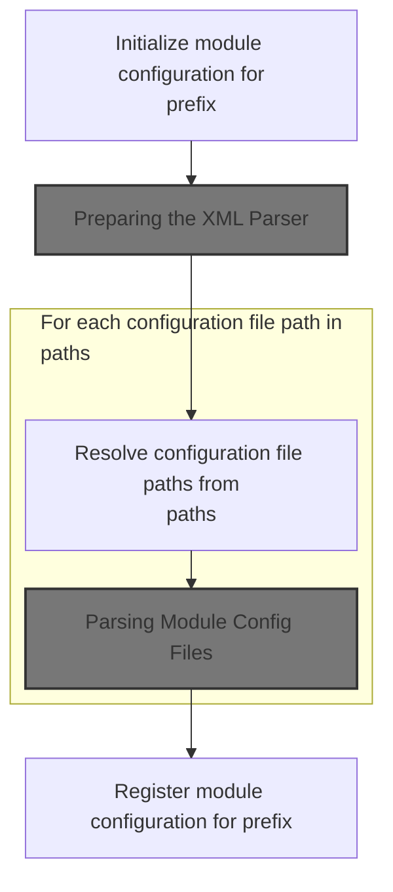
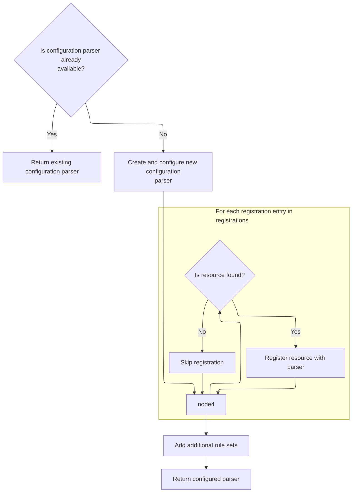

This document describes how a module's configuration is set up and registered for use throughout the application. The process takes a module prefix and configuration file paths, prepares and parses the configuration files, and registers the resulting configuration for application-wide access.

# Bootstrapping Module Configuration



<SwmSnippet path="/core/src/main/java/org/apache/struts/action/ActionServlet.java" line="683">

---

In <SwmToken path="core/src/main/java/org/apache/struts/action/ActionServlet.java" pos="683:5:5" line-data="    protected ModuleConfig initModuleConfig(String prefix, String paths)">`initModuleConfig`</SwmToken>, we kick off module configuration by logging the action and grabbing a <SwmToken path="core/src/main/java/org/apache/struts/action/ActionServlet.java" pos="691:1:1" line-data="        ModuleConfigFactory factoryObject = ModuleConfigFactory.createFactory();">`ModuleConfigFactory`</SwmToken> instance. We need to call <SwmToken path="core/src/main/java/org/apache/struts/action/ActionServlet.java" pos="691:1:1" line-data="        ModuleConfigFactory factoryObject = ModuleConfigFactory.createFactory();">`ModuleConfigFactory`</SwmToken> next because that's where the logic for creating the right <SwmToken path="core/src/main/java/org/apache/struts/action/ActionServlet.java" pos="683:3:3" line-data="    protected ModuleConfig initModuleConfig(String prefix, String paths)">`ModuleConfig`</SwmToken> implementation lives, letting us support custom config setups.

```java
    protected ModuleConfig initModuleConfig(String prefix, String paths)
        throws ServletException {
        if (log.isDebugEnabled()) {
            log.debug("Initializing module path '" + prefix
                + "' configuration from '" + paths + "'");
        }

        // Parse the configuration for this module
        ModuleConfigFactory factoryObject = ModuleConfigFactory.createFactory();
```

---

</SwmSnippet>

<SwmSnippet path="/core/src/main/java/org/apache/struts/config/ModuleConfigFactory.java" line="94">

---

<SwmToken path="core/src/main/java/org/apache/struts/config/ModuleConfigFactory.java" pos="94:7:7" line-data="    public static ModuleConfigFactory createFactory() {">`createFactory`</SwmToken> handles dynamic instantiation of the <SwmToken path="core/src/main/java/org/apache/struts/config/ModuleConfigFactory.java" pos="94:5:5" line-data="    public static ModuleConfigFactory createFactory() {">`ModuleConfigFactory`</SwmToken> using reflection, allowing for custom factories. After this, we need to move on to <SwmToken path="core/src/main/java/org/apache/struts/action/ActionServlet.java" pos="953:13:13" line-data="            // Force creation and registration of DynaActionFormClass instances">`DynaActionFormClass`</SwmToken> because the framework may need to handle dynamic form beans as part of the configuration process.

```java
    public static ModuleConfigFactory createFactory() {
        ModuleConfigFactory factory = null;

        try {
            if (clazz == null) {
                clazz = RequestUtils.applicationClass(factoryClass);
            }

            factory = (ModuleConfigFactory) clazz.newInstance();
        } catch (ClassNotFoundException e) {
            LOG.error("ModuleConfigFactory.createFactory()", e);
        } catch (InstantiationException e) {
            LOG.error("ModuleConfigFactory.createFactory()", e);
        } catch (IllegalAccessException e) {
            LOG.error("ModuleConfigFactory.createFactory()", e);
        }

        return factory;
    }
```

---

</SwmSnippet>

<SwmSnippet path="/core/src/main/java/org/apache/struts/action/ActionServlet.java" line="692">

---

Back in <SwmToken path="core/src/main/java/org/apache/struts/action/ActionServlet.java" pos="683:5:5" line-data="    protected ModuleConfig initModuleConfig(String prefix, String paths)">`initModuleConfig`</SwmToken>, after getting the factory and creating the <SwmToken path="core/src/main/java/org/apache/struts/action/ActionServlet.java" pos="692:1:1" line-data="        ModuleConfig config = factoryObject.createModuleConfig(prefix);">`ModuleConfig`</SwmToken>, we set up the Digester. The next step is calling <SwmToken path="core/src/main/java/org/apache/struts/action/ActionServlet.java" pos="695:7:7" line-data="        Digester digester = initConfigDigester();">`initConfigDigester`</SwmToken> to prepare the XML parser that will read and apply the configuration data.

```java
        ModuleConfig config = factoryObject.createModuleConfig(prefix);

        // Configure the Digester instance we will use
        Digester digester = initConfigDigester();

```

---

</SwmSnippet>

## Preparing the XML Parser



<SwmSnippet path="/core/src/main/java/org/apache/struts/action/ActionServlet.java" line="1599">

---

In <SwmToken path="core/src/main/java/org/apache/struts/action/ActionServlet.java" pos="1599:5:5" line-data="    protected Digester initConfigDigester()">`initConfigDigester`</SwmToken>, we check if a Digester instance already exists, and if not, we set one up with namespace awareness, validation, and rule sets for parsing config files. The loop processes the registrations array as key/path pairs, registering each resource for later parsing. Next, we need to look at how these registrations are used in the context of a real module, like in the LoggedOff example, to see how resource registration impacts config parsing.

```java
    protected Digester initConfigDigester()
        throws ServletException {
        // :FIXME: Where can ServletException be thrown?
        // Do we have an existing instance?
        if (configDigester != null) {
            return (configDigester);
        }

        // Create a new Digester instance with standard capabilities
        configDigester = new Digester();
        configDigester.setNamespaceAware(true);
        configDigester.setValidating(this.isValidating());
        configDigester.setUseContextClassLoader(true);
        configDigester.addRuleSet(new ConfigRuleSet());

        for (int i = 0; i < registrations.length; i += 2) {
            URL url = this.getClass().getResource(registrations[i + 1]);

            if (url != null) {
                configDigester.register(registrations[i], url.toString());
            }
        }

```

---

</SwmSnippet>

<SwmSnippet path="/core/src/main/java/org/apache/struts/action/ActionServlet.java" line="1622">

---

Back in <SwmToken path="core/src/main/java/org/apache/struts/action/ActionServlet.java" pos="695:7:7" line-data="        Digester digester = initConfigDigester();">`initConfigDigester`</SwmToken>, after registering resources, we add any extra rule sets needed for custom XML parsing. The function then returns the fully configured Digester, ready to process all registered config files.

```java
        this.addRuleSets();

        // Return the completely configured Digester instance
        return (configDigester);
    }
```

---

</SwmSnippet>

## Resolving and Preparing Config Paths

<SwmSnippet path="/core/src/main/java/org/apache/struts/action/ActionServlet.java" line="697">

---

Back in <SwmToken path="core/src/main/java/org/apache/struts/action/ActionServlet.java" pos="683:5:5" line-data="    protected ModuleConfig initModuleConfig(String prefix, String paths)">`initModuleConfig`</SwmToken>, after setting up the Digester, we break down the paths string into individual <SwmToken path="core/src/main/java/org/apache/struts/action/ActionServlet.java" pos="1793:13:13" line-data="     * tag to generate correct destination URLs for form submissions.&lt;/p&gt;">`URLs`</SwmToken> using <SwmToken path="core/src/main/java/org/apache/struts/action/ActionServlet.java" pos="697:7:7" line-data="        List urls = splitAndResolvePaths(paths);">`splitAndResolvePaths`</SwmToken>. This step ensures we have a list of actual config files to parse.

```java
        List urls = splitAndResolvePaths(paths);
```

---

</SwmSnippet>

<SwmSnippet path="/core/src/main/java/org/apache/struts/action/ActionServlet.java" line="698">

---

Back in <SwmToken path="core/src/main/java/org/apache/struts/action/ActionServlet.java" pos="683:5:5" line-data="    protected ModuleConfig initModuleConfig(String prefix, String paths)">`initModuleConfig`</SwmToken>, after resolving the config file <SwmToken path="core/src/main/java/org/apache/struts/action/ActionServlet.java" pos="1793:13:13" line-data="     * tag to generate correct destination URLs for form submissions.&lt;/p&gt;">`URLs`</SwmToken>, we iterate over each one, push the config onto the Digester stack, and call <SwmToken path="core/src/main/java/org/apache/struts/action/ActionServlet.java" pos="703:3:3" line-data="            this.parseModuleConfigFile(digester, url);">`parseModuleConfigFile`</SwmToken> to process each file. This lets us handle multiple config sources for a single module.

```java
        URL url;

        for (Iterator i = urls.iterator(); i.hasNext();) {
            url = (URL) i.next();
            digester.push(config);
            this.parseModuleConfigFile(digester, url);
        }

```

---

</SwmSnippet>

## Parsing Module Config Files

<SwmSnippet path="/core/src/main/java/org/apache/struts/action/ActionServlet.java" line="750">

---

In <SwmToken path="core/src/main/java/org/apache/struts/action/ActionServlet.java" pos="750:5:5" line-data="    protected void parseModuleConfigFile(Digester digester, URL url)">`parseModuleConfigFile`</SwmToken>, we hand off the config file URL to the Digester for parsing. If the config includes Tiles definitions, the Digester will use the Tiles XmlParser to handle those parts.

```java
    protected void parseModuleConfigFile(Digester digester, URL url)
        throws UnavailableException {

        try {
            digester.parse(url);
```

---

</SwmSnippet>

<SwmSnippet path="/core/src/main/java/org/apache/struts/action/ActionServlet.java" line="755">

---

Back in <SwmToken path="core/src/main/java/org/apache/struts/action/ActionServlet.java" pos="703:3:3" line-data="            this.parseModuleConfigFile(digester, url);">`parseModuleConfigFile`</SwmToken>, if parsing throws an <SwmToken path="core/src/main/java/org/apache/struts/action/ActionServlet.java" pos="755:6:6" line-data="        } catch (IOException e) {">`IOException`</SwmToken> or <SwmToken path="core/src/main/java/org/apache/struts/action/ActionServlet.java" pos="757:6:6" line-data="        } catch (SAXException e) {">`SAXException`</SwmToken>, we call <SwmToken path="core/src/main/java/org/apache/struts/action/ActionServlet.java" pos="756:1:1" line-data="            handleConfigException(url.toString(), e);">`handleConfigException`</SwmToken> to log the error and handle it appropriately, making sure issues are surfaced with enough context.

```java
        } catch (IOException e) {
            handleConfigException(url.toString(), e);
        } catch (SAXException e) {
            handleConfigException(url.toString(), e);
        }
    }
```

---

</SwmSnippet>

## Finalizing Module Registration

<SwmSnippet path="/core/src/main/java/org/apache/struts/action/ActionServlet.java" line="706">

---

Back in <SwmToken path="core/src/main/java/org/apache/struts/action/ActionServlet.java" pos="683:5:5" line-data="    protected ModuleConfig initModuleConfig(String prefix, String paths)">`initModuleConfig`</SwmToken>, after all config files are parsed, we stash the <SwmToken path="core/src/main/java/org/apache/struts/action/ActionServlet.java" pos="683:3:3" line-data="    protected ModuleConfig initModuleConfig(String prefix, String paths)">`ModuleConfig`</SwmToken> in the servlet context under a key based on the module prefix. This makes the config available app-wide, then we return it for immediate use.

```java
        getServletContext().setAttribute(Globals.MODULE_KEY
            + config.getPrefix(), config);

        return config;
    }
```

---

</SwmSnippet>

&nbsp;

*This is an auto-generated document by Swimm 🌊 and has not yet been verified by a human*

<SwmMeta version="3.0.0" repo-id="Z2l0aHViJTNBJTNBc3RydXRzMSUzQSUzQVN3aW1tLURlbW8=" repo-name="struts1"><sup>Powered by [Swimm](https://app.swimm.io/)</sup></SwmMeta>
