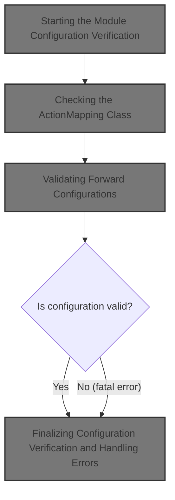
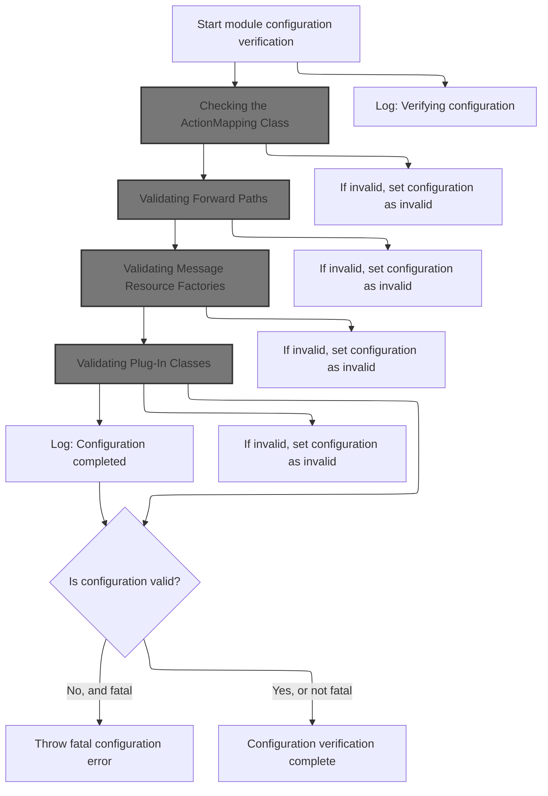
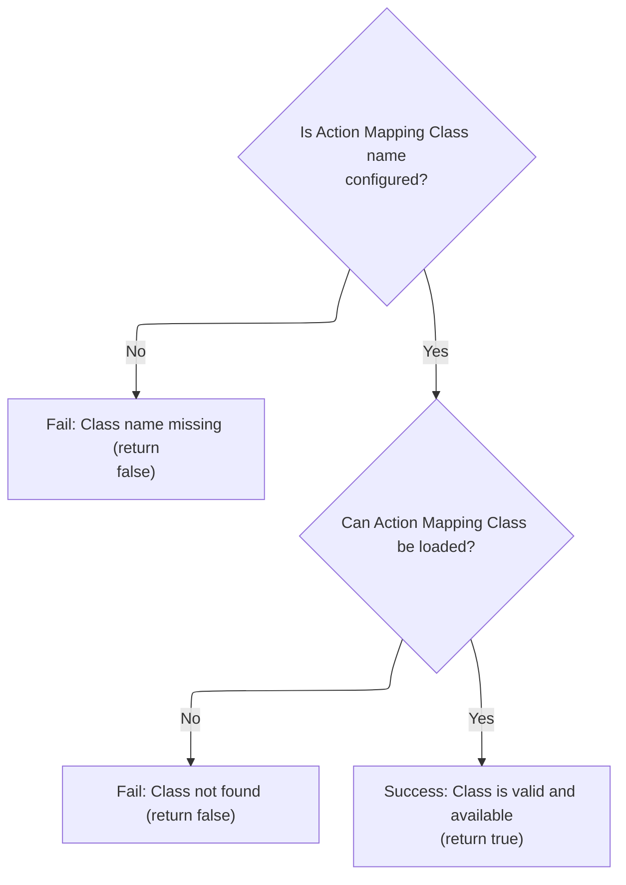
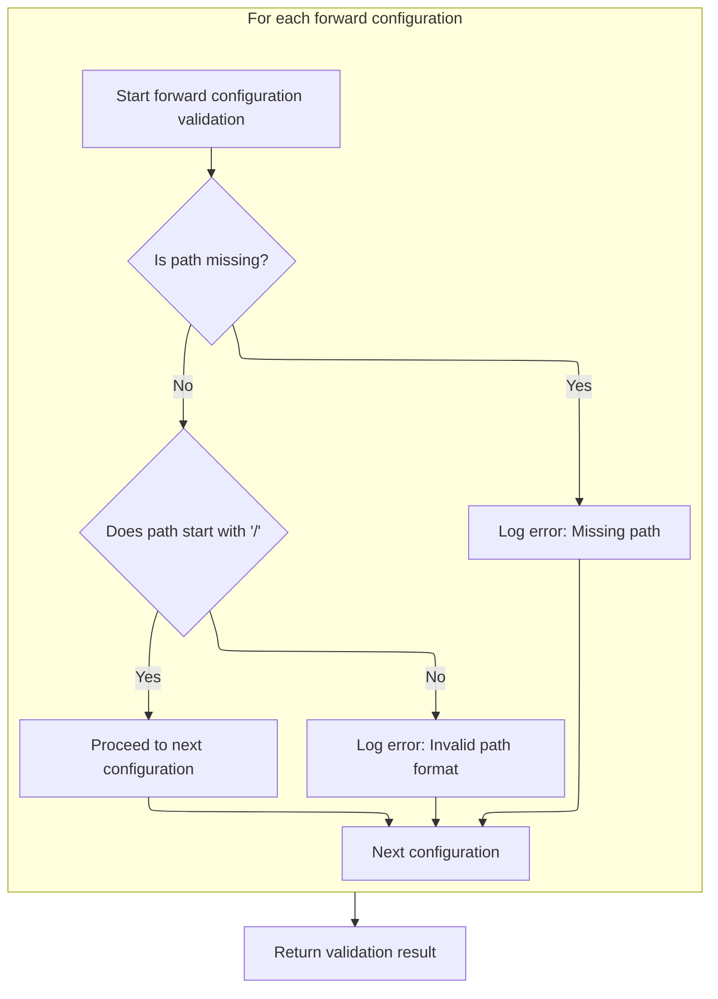
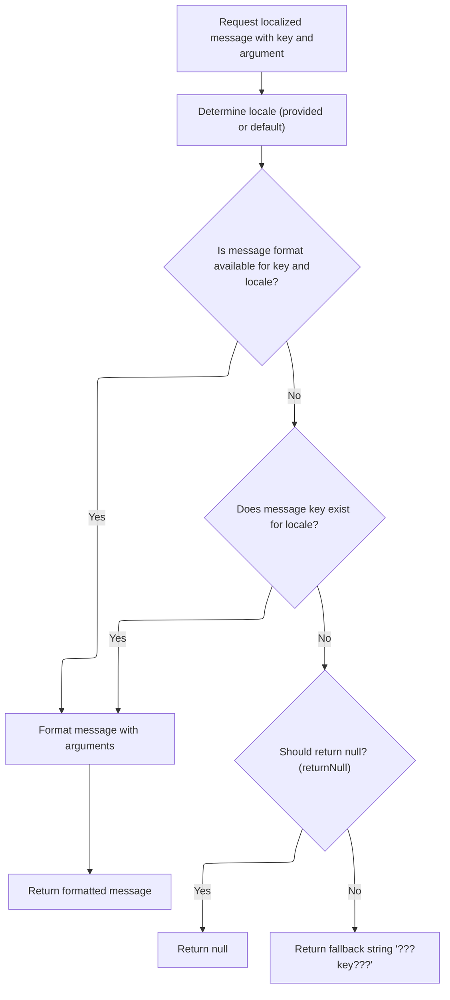
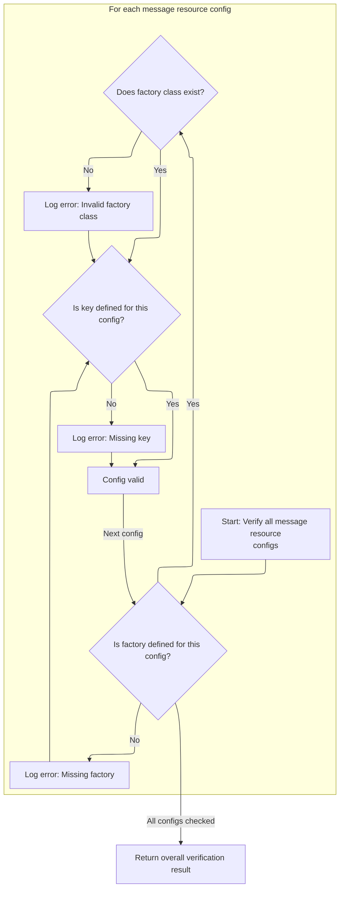
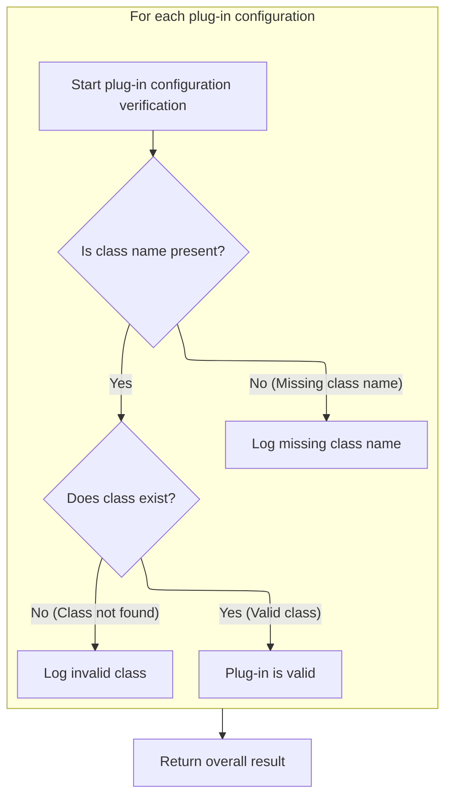

This document describes how the application verifies its module configuration at startup. The process checks that all required components, such as action mappings, forward paths, message resources, and plug-ins, are present and valid. If any fatal issues are found, the application startup is halted.



# Starting the Module Configuration Verification



<SwmSnippet path="/extras/src/main/java/org/apache/struts/plugins/ModuleConfigVerifier.java" line="99">

---

In <SwmToken path="extras/src/main/java/org/apache/struts/plugins/ModuleConfigVerifier.java" pos="99:5:5" line-data="    public void init(ActionServlet servlet, ModuleConfig config)">`init`</SwmToken>, we kick off the verification process and log that we're starting config verification. We call <SwmToken path="core/src/main/java/org/apache/struts/config/ConfigHelper.java" pos="56:4:4" line-data="public class ConfigHelper implements ConfigHelperInterface {">`ConfigHelper`</SwmToken> to get a localized message for the log, so the output isn't hardcoded and can be translated or changed without touching the code.

```java
    public void init(ActionServlet servlet, ModuleConfig config)
        throws ServletException {
        this.servlet = servlet;
        this.config = config;

        boolean ok = true;

        LOG.info(servlet.getInternal().getMessage("configVerifying"));

```

---

</SwmSnippet>

## Fetching a Localized Message for Logging

<SwmSnippet path="/core/src/main/java/org/apache/struts/config/ConfigHelper.java" line="496">

---

In <SwmToken path="core/src/main/java/org/apache/struts/config/ConfigHelper.java" pos="496:5:5" line-data="    public String getMessage(String key) {">`getMessage`</SwmToken>, we grab the <SwmToken path="core/src/main/java/org/apache/struts/config/ConfigHelper.java" pos="497:1:1" line-data="        MessageResources resources = getMessageResources();">`MessageResources`</SwmToken> for the current context. If none are set up, we bail out early with null, since there's nothing to fetch. Next, we need to actually get the resource bundle, which is handled by <SwmToken path="core/src/main/java/org/apache/struts/config/ConfigHelper.java" pos="497:7:7" line-data="        MessageResources resources = getMessageResources();">`getMessageResources`</SwmToken>.

```java
    public String getMessage(String key) {
        MessageResources resources = getMessageResources();

        if (resources == null) {
            return null;
        }

```

---

</SwmSnippet>

<SwmSnippet path="/core/src/main/java/org/apache/struts/config/ConfigHelper.java" line="169">

---

<SwmToken path="core/src/main/java/org/apache/struts/config/ConfigHelper.java" pos="169:5:5" line-data="    public MessageResources getMessageResources() {">`getMessageResources`</SwmToken> looks up the <SwmToken path="core/src/main/java/org/apache/struts/config/ConfigHelper.java" pos="169:3:3" line-data="    public MessageResources getMessageResources() {">`MessageResources`</SwmToken> object from the application context using a fixed key. If the context or the attribute is missing, we can't do any message lookups.

```java
    public MessageResources getMessageResources() {
        if (this.application == null) {
            return null;
        }

        return (MessageResources) this.application.getAttribute(Globals.MESSAGES_KEY);
    }
```

---

</SwmSnippet>

<SwmSnippet path="/core/src/main/java/org/apache/struts/config/ConfigHelper.java" line="503">

---

Back in `ConfigHelper.getMessage`, after grabbing the resources, we need to figure out the user's locale to fetch the right translation. That's why we call <SwmToken path="core/src/main/java/org/apache/struts/config/ConfigHelper.java" pos="503:7:9" line-data="        return resources.getMessage(RequestUtils.getUserLocale(request, null),">`RequestUtils.getUserLocale`</SwmToken> next.

```java
        return resources.getMessage(RequestUtils.getUserLocale(request, null),
```

---

</SwmSnippet>

<SwmSnippet path="/core/src/main/java/org/apache/struts/util/RequestUtils.java" line="299">

---

<SwmToken path="core/src/main/java/org/apache/struts/util/RequestUtils.java" pos="299:7:7" line-data="    public static Locale getUserLocale(HttpServletRequest request, String locale) {">`getUserLocale`</SwmToken> checks the session for a Locale under a known key, but doesn't create a session if there isn't one. If nothing's found, it falls back to the request's <SwmToken path="core/src/main/java/org/apache/struts/util/RequestUtils.java" pos="313:11:13" line-data="            // Returns Locale based on Accept-Language header or the server default">`Accept-Language`</SwmToken> header, so we always get a locale even if the user hasn't set one.

```java
    public static Locale getUserLocale(HttpServletRequest request, String locale) {
        Locale userLocale = null;
        HttpSession session = request.getSession(false);

        if (locale == null) {
            locale = Globals.LOCALE_KEY;
        }

        // Only check session if sessions are enabled
        if (session != null) {
            userLocale = (Locale) session.getAttribute(locale);
        }

        if (userLocale == null) {
            // Returns Locale based on Accept-Language header or the server default
            userLocale = request.getLocale();
        }

        return userLocale;
    }
```

---

</SwmSnippet>

<SwmSnippet path="/core/src/main/java/org/apache/struts/config/ConfigHelper.java" line="503">

---

Back from <SwmToken path="core/src/main/java/org/apache/struts/config/ConfigHelper.java" pos="503:7:9" line-data="        return resources.getMessage(RequestUtils.getUserLocale(request, null),">`RequestUtils.getUserLocale`</SwmToken>, `ConfigHelper.getMessage` now calls Resources to actually fetch the localized string using the resolved locale and key. This keeps message lookup consistent across the app.

```java
        return resources.getMessage(RequestUtils.getUserLocale(request, null),
            key);
    }
```

---

</SwmSnippet>

<SwmSnippet path="/core/src/main/java/org/apache/struts/validator/Resources.java" line="249">

---

<SwmToken path="core/src/main/java/org/apache/struts/validator/Resources.java" pos="249:7:7" line-data="    public static String getMessage(HttpServletRequest request, String key) {">`getMessage`</SwmToken> in Resources fetches the <SwmToken path="core/src/main/java/org/apache/struts/validator/Resources.java" pos="250:1:1" line-data="        MessageResources messages = getMessageResources(request);">`MessageResources`</SwmToken> for the request, then grabs the user's locale (again, to be sure it's current), and finally looks up the message by key. This ensures the right translation is used for the current request.

```java
    public static String getMessage(HttpServletRequest request, String key) {
        MessageResources messages = getMessageResources(request);

        return getMessage(messages, RequestUtils.getUserLocale(request, null),
            key);
    }
```

---

</SwmSnippet>

## Running Module Configuration Checks

<SwmSnippet path="/extras/src/main/java/org/apache/struts/plugins/ModuleConfigVerifier.java" line="108">

---

Back in `ModuleConfigVerifier.init`, after logging, we start the actual config checks. First up is verifying the <SwmToken path="core/src/main/java/org/apache/struts/config/ConfigHelper.java" pos="27:10:10" line-data="import org.apache.struts.action.ActionMapping;">`ActionMapping`</SwmToken> class, since if that's wrong, nothing else matters.

```java
        // Perform detailed validations of each portion of ModuleConfig
        // :TODO: Complete methods to verify Action, Controller, et al, configurations.

        /*
        if (!verifyActionConfigs()) {
            ok = false;
        }
        */
        if (!verifyActionMappingClass()) {
            ok = false;
        }

```

---

</SwmSnippet>

## Checking the <SwmToken path="core/src/main/java/org/apache/struts/config/ConfigHelper.java" pos="27:10:10" line-data="import org.apache.struts.action.ActionMapping;">`ActionMapping`</SwmToken> Class



<SwmSnippet path="/extras/src/main/java/org/apache/struts/plugins/ModuleConfigVerifier.java" line="158">

---

In <SwmToken path="extras/src/main/java/org/apache/struts/plugins/ModuleConfigVerifier.java" pos="158:5:5" line-data="    protected boolean verifyActionMappingClass() {">`verifyActionMappingClass`</SwmToken>, we check if the <SwmToken path="core/src/main/java/org/apache/struts/config/ConfigHelper.java" pos="27:10:10" line-data="import org.apache.struts.action.ActionMapping;">`ActionMapping`</SwmToken> class name is set. If not, we log a localized error using <SwmToken path="core/src/main/java/org/apache/struts/config/ConfigHelper.java" pos="56:4:4" line-data="public class ConfigHelper implements ConfigHelperInterface {">`ConfigHelper`</SwmToken>, so the admin knows exactly what's missing.

```java
    protected boolean verifyActionMappingClass() {
        String amcName = config.getActionMappingClass();

        if (amcName == null) {
            LOG.error(servlet.getInternal().getMessage("verifyActionMappingClass.missing"));

            return (false);
        }

```

---

</SwmSnippet>

<SwmSnippet path="/extras/src/main/java/org/apache/struts/plugins/ModuleConfigVerifier.java" line="167">

---

Back in <SwmToken path="extras/src/main/java/org/apache/struts/plugins/ModuleConfigVerifier.java" pos="170:14:14" line-data="            LOG.error(servlet.getInternal().getMessage(&quot;verifyActionMappingClass.invalid&quot;,">`verifyActionMappingClass`</SwmToken>, we try to load the class by name. If it fails, we log a localized error (using <SwmToken path="core/src/main/java/org/apache/struts/util/PropertyMessageResources.java" pos="82:8:8" line-data=" * Configure &lt;code&gt;PropertyMessageResources&lt;/code&gt; to operate in this mode by">`PropertyMessageResources`</SwmToken> under the hood), including the class name, so it's obvious what went wrong.

```java
        try {
            Class amcClass = RequestUtils.applicationClass(amcName);
        } catch (ClassNotFoundException e) {
            LOG.error(servlet.getInternal().getMessage("verifyActionMappingClass.invalid",
                    amcName));

            return (false);
        }

        return (true);
    }
```

---

</SwmSnippet>

## Resolving Localized Error Messages

```mermaid
%%{init: {"flowchart": {"defaultRenderer": "elk"}} }%%
flowchart TD
  node1["Request message for locale and key"]
  click node1 openCode "core/src/main/java/org/apache/struts/util/PropertyMessageResources.java:227:282"
  node2{"Message found for requested locale?"}
  click node2 openCode "core/src/main/java/org/apache/struts/util/PropertyMessageResources.java:238:241"
  node2 -- Yes --> node8
  node2 -- No --> node3
  node3{"mode = JSTL?"}
  click node3 openCode "core/src/main/java/org/apache/struts/util/PropertyMessageResources.java:244:247"
  node3 -- Yes --> node6
  node3 -- No --> node4
  node4{"mode = ResourceBundle?"}
  click node4 openCode "core/src/main/java/org/apache/struts/util/PropertyMessageResources.java:250:256"
  node4 -- Yes --> node5
  node4 -- No --> node11
  node5{"Message found for default locale?"}
  click node5 openCode "core/src/main/java/org/apache/struts/util/PropertyMessageResources.java:253:254"
  node5 -- Yes --> node8
  node5 -- No --> node6
  node6{"Message found in base properties?"}
  click node6 openCode "core/src/main/java/org/apache/struts/util/PropertyMessageResources.java:271:274"
  node6 -- Yes --> node8
  node6 -- No --> node7
  node7{"returnNull?"}
  click node7 openCode "core/src/main/java/org/apache/struts/util/PropertyMessageResources.java:277:281"
  node7 -- Yes --> node9
  node7 -- No --> node10
  node8["Return found message"]
  click node8 openCode "core/src/main/java/org/apache/struts/util/PropertyMessageResources.java:240:241"
  node9["Return null"]
  click node9 openCode "core/src/main/java/org/apache/struts/util/PropertyMessageResources.java:278:279"
  node10["Return placeholder (???key???)"]
  click node10 openCode "core/src/main/java/org/apache/struts/util/PropertyMessageResources.java:280:281"
  node11{"Message found for default locale
(recalculated key)?"}
  click node11 openCode "core/src/main/java/org/apache/struts/util/PropertyMessageResources.java:261:263"
  node11 -- Yes --> node8
  node11 -- No --> node6
classDef HeadingStyle fill:#777777,stroke:#333,stroke-width:2px;

%% Swimm:
%% %%{init: {"flowchart": {"defaultRenderer": "elk"}} }%%
%% flowchart TD
%%   node1["Request message for locale and key"]
%%   click node1 openCode "<SwmPath>[core/…/util/PropertyMessageResources.java](core/src/main/java/org/apache/struts/util/PropertyMessageResources.java)</SwmPath>:227:282"
%%   node2{"Message found for requested locale?"}
%%   click node2 openCode "<SwmPath>[core/…/util/PropertyMessageResources.java](core/src/main/java/org/apache/struts/util/PropertyMessageResources.java)</SwmPath>:238:241"
%%   node2 -- Yes --> node8
%%   node2 -- No --> node3
%%   node3{"mode = JSTL?"}
%%   click node3 openCode "<SwmPath>[core/…/util/PropertyMessageResources.java](core/src/main/java/org/apache/struts/util/PropertyMessageResources.java)</SwmPath>:244:247"
%%   node3 -- Yes --> node6
%%   node3 -- No --> node4
%%   node4{"mode = ResourceBundle?"}
%%   click node4 openCode "<SwmPath>[core/…/util/PropertyMessageResources.java](core/src/main/java/org/apache/struts/util/PropertyMessageResources.java)</SwmPath>:250:256"
%%   node4 -- Yes --> node5
%%   node4 -- No --> node11
%%   node5{"Message found for default locale?"}
%%   click node5 openCode "<SwmPath>[core/…/util/PropertyMessageResources.java](core/src/main/java/org/apache/struts/util/PropertyMessageResources.java)</SwmPath>:253:254"
%%   node5 -- Yes --> node8
%%   node5 -- No --> node6
%%   node6{"Message found in base properties?"}
%%   click node6 openCode "<SwmPath>[core/…/util/PropertyMessageResources.java](core/src/main/java/org/apache/struts/util/PropertyMessageResources.java)</SwmPath>:271:274"
%%   node6 -- Yes --> node8
%%   node6 -- No --> node7
%%   node7{"<SwmToken path="core/src/main/java/org/apache/struts/util/PropertyMessageResources.java" pos="277:4:4" line-data="        if (returnNull) {">`returnNull`</SwmToken>?"}
%%   click node7 openCode "<SwmPath>[core/…/util/PropertyMessageResources.java](core/src/main/java/org/apache/struts/util/PropertyMessageResources.java)</SwmPath>:277:281"
%%   node7 -- Yes --> node9
%%   node7 -- No --> node10
%%   node8["Return found message"]
%%   click node8 openCode "<SwmPath>[core/…/util/PropertyMessageResources.java](core/src/main/java/org/apache/struts/util/PropertyMessageResources.java)</SwmPath>:240:241"
%%   node9["Return null"]
%%   click node9 openCode "<SwmPath>[core/…/util/PropertyMessageResources.java](core/src/main/java/org/apache/struts/util/PropertyMessageResources.java)</SwmPath>:278:279"
%%   node10["Return placeholder (???key???)"]
%%   click node10 openCode "<SwmPath>[core/…/util/PropertyMessageResources.java](core/src/main/java/org/apache/struts/util/PropertyMessageResources.java)</SwmPath>:280:281"
%%   node11{"Message found for default locale
%% (recalculated key)?"}
%%   click node11 openCode "<SwmPath>[core/…/util/PropertyMessageResources.java](core/src/main/java/org/apache/struts/util/PropertyMessageResources.java)</SwmPath>:261:263"
%%   node11 -- Yes --> node8
%%   node11 -- No --> node6
%% classDef HeadingStyle fill:#777777,stroke:#333,stroke-width:2px;
```



<SwmSnippet path="/core/src/main/java/org/apache/struts/util/PropertyMessageResources.java" line="227">

---

<SwmToken path="core/src/main/java/org/apache/struts/util/PropertyMessageResources.java" pos="227:5:5" line-data="    public String getMessage(Locale locale, String key) {">`getMessage`</SwmToken> in <SwmToken path="core/src/main/java/org/apache/struts/util/PropertyMessageResources.java" pos="82:8:8" line-data=" * Configure &lt;code&gt;PropertyMessageResources&lt;/code&gt; to operate in this mode by">`PropertyMessageResources`</SwmToken> tries to find the message for the given locale and key, using different fallback rules depending on the mode. If nothing is found, it either returns null or a placeholder string, depending on config.

```java
    public String getMessage(Locale locale, String key) {
        if (log.isDebugEnabled()) {
            log.debug("getMessage(" + locale + "," + key + ")");
        }

        // Initialize variables we will require
        String localeKey = localeKey(locale);
        String originalKey = messageKey(localeKey, key);
        String message = null;

        // Search the specified Locale
        message = findMessage(locale, key, originalKey);
        if (message != null) {
            return message;
        }

        // JSTL Compatibility - JSTL doesn't use the default locale
        if (mode == MODE_JSTL) {

           // do nothing (i.e. don't use default Locale)

        // PropertyResourcesBundle - searches through the hierarchy
        // for the default Locale (e.g. first en_US then en)
        } else if (mode == MODE_RESOURCE_BUNDLE) {

            if (!defaultLocale.equals(locale)) {
                message = findMessage(defaultLocale, key, originalKey);
            }

        // Default (backwards) Compatibility - just searches the
        // specified Locale (e.g. just en_US)
        } else {

            if (!defaultLocale.equals(locale)) {
                localeKey = localeKey(defaultLocale);
                message = findMessage(localeKey, key, originalKey);
            }

        }
        if (message != null) {
            return message;
        }

        // Find the message in the default properties file
        message = findMessage("", key, originalKey);
        if (message != null) {
            return message;
        }

        // Return an appropriate error indication
        if (returnNull) {
            return (null);
        } else {
            return ("???" + messageKey(locale, key) + "???");
        }
    }
```

---

</SwmSnippet>

<SwmSnippet path="/core/src/main/java/org/apache/struts/util/PropertyMessageResources.java" line="393">

---

<SwmToken path="core/src/main/java/org/apache/struts/util/PropertyMessageResources.java" pos="393:5:5" line-data="    private String findMessage(Locale locale, String key, String originalKey) {">`findMessage`</SwmToken> walks up the locale hierarchy by chopping off parts of the locale key at underscores, so if a specific translation isn't found, we try more general ones until we run out of options.

```java
    private String findMessage(Locale locale, String key, String originalKey) {

        // Initialize variables we will require
        String localeKey = localeKey(locale);
        String messageKey = null;
        String message = null;
        int underscore = 0;

        // Loop from specific to general Locales looking for this message
        while (true) {
            message = findMessage(localeKey, key, originalKey);
            if (message != null) {
                break;
            }

            // Strip trailing modifiers to try a more general locale key
            underscore = localeKey.lastIndexOf("_");

            if (underscore < 0) {
                break;
            }

            localeKey = localeKey.substring(0, underscore);
        }
```

---

</SwmSnippet>

## Validating Forward Configurations

<SwmSnippet path="/extras/src/main/java/org/apache/struts/plugins/ModuleConfigVerifier.java" line="120">

---

Back in `ModuleConfigVerifier.init`, after confirming the <SwmToken path="core/src/main/java/org/apache/struts/config/ConfigHelper.java" pos="27:10:10" line-data="import org.apache.struts.action.ActionMapping;">`ActionMapping`</SwmToken> class, we move on to checking forward configs. These only make sense to validate if the main routing class is good.

```java
        /*
        if (!verifyControllerConfig()) {
            ok = false;
        }
        if (!verifyExceptionConfigs()) {
            ok = false;
        }
        if (!verifyFormBeanConfigs()) {
            ok = false;
        }
        */
        if (!verifyForwardConfigs()) {
            ok = false;
        }

```

---

</SwmSnippet>

## Validating Forward Paths



<SwmSnippet path="/extras/src/main/java/org/apache/struts/plugins/ModuleConfigVerifier.java" line="184">

---

In <SwmToken path="extras/src/main/java/org/apache/struts/plugins/ModuleConfigVerifier.java" pos="184:5:5" line-data="    protected boolean verifyForwardConfigs() {">`verifyForwardConfigs`</SwmToken>, we loop through all forward configs and check if each has a valid path. If a path is missing, we log an error using a localized message. Next, we need <SwmToken path="core/src/main/java/org/apache/struts/util/PropertyMessageResources.java" pos="82:8:8" line-data=" * Configure &lt;code&gt;PropertyMessageResources&lt;/code&gt; to operate in this mode by">`PropertyMessageResources`</SwmToken> to resolve the actual error message string, so the log output is readable and localized.

```java
    protected boolean verifyForwardConfigs() {
        boolean ok = true;
        ForwardConfig[] fcs = config.findForwardConfigs();

        for (int i = 0; i < fcs.length; i++) {
            String path = fcs[i].getPath();

            if (path == null) {
                LOG.error(servlet.getInternal().getMessage("verifyForwardConfigs.missing",
                        fcs[i].getName()));
```

---

</SwmSnippet>

<SwmSnippet path="/extras/src/main/java/org/apache/struts/plugins/ModuleConfigVerifier.java" line="194">

---

Back in <SwmToken path="extras/src/main/java/org/apache/struts/plugins/ModuleConfigVerifier.java" pos="196:14:14" line-data="                LOG.error(servlet.getInternal().getMessage(&quot;verifyForwardConfigs.invalid&quot;,">`verifyForwardConfigs`</SwmToken>, after checking for missing paths, we validate that each path starts with a slash. If not, we log another localized error. We call <SwmToken path="core/src/main/java/org/apache/struts/config/ConfigHelper.java" pos="169:3:3" line-data="    public MessageResources getMessageResources() {">`MessageResources`</SwmToken> to fetch the error message, making sure the log is clear and localized.

```java
                ok = false;
            } else if (!path.startsWith("/")) {
                LOG.error(servlet.getInternal().getMessage("verifyForwardConfigs.invalid",
                        path, fcs[i].getName()));
            }
        }

        return (ok);
    }
```

---

</SwmSnippet>

## Fetching and Formatting Localized Messages



<SwmSnippet path="/core/src/main/java/org/apache/struts/util/MessageResources.java" line="324">

---

<SwmToken path="core/src/main/java/org/apache/struts/util/MessageResources.java" pos="324:5:5" line-data="    public String getMessage(Locale locale, String key, Object arg0) {">`getMessage`</SwmToken> in <SwmToken path="core/src/main/java/org/apache/struts/config/ConfigHelper.java" pos="169:3:3" line-data="    public MessageResources getMessageResources() {">`MessageResources`</SwmToken> lets us fetch a localized message and format it with arguments. This is used for error logging, so the logs can include details like the forward name or path.

```java
    public String getMessage(Locale locale, String key, Object arg0) {
        return this.getMessage(locale, key, new Object[] { arg0 });
    }
```

---

</SwmSnippet>

<SwmSnippet path="/core/src/main/java/org/apache/struts/util/MessageResources.java" line="286">

---

<SwmToken path="core/src/main/java/org/apache/struts/util/MessageResources.java" pos="286:5:5" line-data="    public String getMessage(Locale locale, String key, Object[] args) {">`getMessage`</SwmToken> handles message formatting and caching. It checks for null locales, uses a synchronized cache for <SwmToken path="core/src/main/java/org/apache/struts/util/MessageResources.java" pos="287:5:5" line-data="        // Cache MessageFormat instances as they are accessed">`MessageFormat`</SwmToken> instances, and returns either a formatted message, null, or a placeholder if the message isn't found. This keeps error logs fast and consistent.

```java
    public String getMessage(Locale locale, String key, Object[] args) {
        // Cache MessageFormat instances as they are accessed
        if (locale == null) {
            locale = defaultLocale;
        }

        MessageFormat format = null;
        String formatKey = messageKey(locale, key);

        synchronized (formats) {
            format = (MessageFormat) formats.get(formatKey);

            if (format == null) {
                String formatString = getMessage(locale, key);

                if (formatString == null) {
                    return returnNull ? null : ("???" + formatKey + "???");
                }

                format = new MessageFormat(escape(formatString));
                format.setLocale(locale);
                formats.put(formatKey, format);
            }
        }

        return format.format(args);
    }
```

---

</SwmSnippet>

## Checking Message Resource Configurations

<SwmSnippet path="/extras/src/main/java/org/apache/struts/plugins/ModuleConfigVerifier.java" line="135">

---

Back in <SwmToken path="extras/src/main/java/org/apache/struts/plugins/ModuleConfigVerifier.java" pos="99:5:5" line-data="    public void init(ActionServlet servlet, ModuleConfig config)">`init`</SwmToken>, after verifying forward configs, we check message resource configs. This step ensures that all localization resources are set up, so error messages and UI text can be fetched reliably.

```java
        if (!verifyMessageResourcesConfigs()) {
            ok = false;
        }

```

---

</SwmSnippet>

## Validating Message Resource Factories



<SwmSnippet path="/extras/src/main/java/org/apache/struts/plugins/ModuleConfigVerifier.java" line="209">

---

In <SwmToken path="extras/src/main/java/org/apache/struts/plugins/ModuleConfigVerifier.java" pos="209:5:5" line-data="    protected boolean verifyMessageResourcesConfigs() {">`verifyMessageResourcesConfigs`</SwmToken>, we grab all message resource configs from the module config. Next, we call <SwmToken path="core/src/main/java/org/apache/struts/config/impl/ModuleConfigImpl.java" pos="58:4:4" line-data="public class ModuleConfigImpl extends BaseConfig implements Serializable,">`ModuleConfigImpl`</SwmToken> to get them as an array, so we can check each for missing factories or keys.

```java
    protected boolean verifyMessageResourcesConfigs() {
        boolean ok = true;
        MessageResourcesConfig[] mrcs = config.findMessageResourcesConfigs();

```

---

</SwmSnippet>

<SwmSnippet path="/core/src/main/java/org/apache/struts/config/impl/ModuleConfigImpl.java" line="590">

---

<SwmToken path="core/src/main/java/org/apache/struts/config/impl/ModuleConfigImpl.java" pos="590:7:7" line-data="    public MessageResourcesConfig[] findMessageResourcesConfigs() {">`findMessageResourcesConfigs`</SwmToken> converts the internal collection of message resource configs to an array. This lets us loop through them easily in the verifier, but assumes the collection only contains valid <SwmToken path="core/src/main/java/org/apache/struts/config/impl/ModuleConfigImpl.java" pos="590:3:3" line-data="    public MessageResourcesConfig[] findMessageResourcesConfigs() {">`MessageResourcesConfig`</SwmToken> objects.

```java
    public MessageResourcesConfig[] findMessageResourcesConfigs() {
        MessageResourcesConfig[] results =
            new MessageResourcesConfig[messageResources.size()];

        return ((MessageResourcesConfig[]) messageResources.values().toArray(results));
    }
```

---

</SwmSnippet>

<SwmSnippet path="/extras/src/main/java/org/apache/struts/plugins/ModuleConfigVerifier.java" line="213">

---

Back in <SwmToken path="extras/src/main/java/org/apache/struts/plugins/ModuleConfigVerifier.java" pos="217:14:14" line-data="                LOG.error(servlet.getInternal().getMessage(&quot;verifyMessageResourcesConfigs.missing&quot;));">`verifyMessageResourcesConfigs`</SwmToken>, after getting the configs array, we check each for a missing factory. If a factory is missing, we log a localized error using <SwmToken path="core/src/main/java/org/apache/struts/config/ConfigHelper.java" pos="56:4:4" line-data="public class ConfigHelper implements ConfigHelperInterface {">`ConfigHelper`</SwmToken>, so the log output is clear and translated.

```java
        for (int i = 0; i < mrcs.length; i++) {
            String factory = mrcs[i].getFactory();

            if (factory == null) {
                LOG.error(servlet.getInternal().getMessage("verifyMessageResourcesConfigs.missing"));
```

---

</SwmSnippet>

<SwmSnippet path="/extras/src/main/java/org/apache/struts/plugins/ModuleConfigVerifier.java" line="218">

---

Back in <SwmToken path="extras/src/main/java/org/apache/struts/plugins/ModuleConfigVerifier.java" pos="223:14:14" line-data="                    LOG.error(servlet.getInternal().getMessage(&quot;verifyMessageResourcesConfigs.invalid&quot;,">`verifyMessageResourcesConfigs`</SwmToken>, after checking for missing factories, we try to load each factory class. If it's not found, we log a localized error using <SwmToken path="core/src/main/java/org/apache/struts/util/PropertyMessageResources.java" pos="82:8:8" line-data=" * Configure &lt;code&gt;PropertyMessageResources&lt;/code&gt; to operate in this mode by">`PropertyMessageResources`</SwmToken>, so the log output is readable and translated.

```java
                ok = false;
            } else {
                try {
                    Class clazz = RequestUtils.applicationClass(factory);
                } catch (ClassNotFoundException e) {
                    LOG.error(servlet.getInternal().getMessage("verifyMessageResourcesConfigs.invalid",
                            factory));
                    ok = false;
                }
            }

```

---

</SwmSnippet>

<SwmSnippet path="/extras/src/main/java/org/apache/struts/plugins/ModuleConfigVerifier.java" line="229">

---

Back in <SwmToken path="extras/src/main/java/org/apache/struts/plugins/ModuleConfigVerifier.java" pos="232:14:14" line-data="                LOG.error(servlet.getInternal().getMessage(&quot;verifyMessageResourcesConfigs.key&quot;));">`verifyMessageResourcesConfigs`</SwmToken>, after checking factories, we check for missing keys in each config. If a key is missing, we log a localized error using <SwmToken path="core/src/main/java/org/apache/struts/config/ConfigHelper.java" pos="56:4:4" line-data="public class ConfigHelper implements ConfigHelperInterface {">`ConfigHelper`</SwmToken>, so the log output is clear and translated.

```java
            String key = mrcs[i].getKey();

            if (key == null) {
                LOG.error(servlet.getInternal().getMessage("verifyMessageResourcesConfigs.key"));
            }
        }

        return (ok);
    }
```

---

</SwmSnippet>

## Checking Plug-In Configurations

<SwmSnippet path="/extras/src/main/java/org/apache/struts/plugins/ModuleConfigVerifier.java" line="139">

---

Back in <SwmToken path="extras/src/main/java/org/apache/struts/plugins/ModuleConfigVerifier.java" pos="99:5:5" line-data="    public void init(ActionServlet servlet, ModuleConfig config)">`init`</SwmToken>, after verifying message resource configs, we check <SwmToken path="core/src/main/java/org/apache/struts/config/impl/ModuleConfigImpl.java" pos="111:14:16" line-data="     * &lt;p&gt;The set of configured plug-in Actions for this module, if any, in">`plug-in`</SwmToken> configs. This step ensures that all plug-ins are set up correctly, so extensions and integrations can work without issues.

```java
        if (!verifyPlugInConfigs()) {
            ok = false;
        }

```

---

</SwmSnippet>

## Validating Plug-In Classes



<SwmSnippet path="/extras/src/main/java/org/apache/struts/plugins/ModuleConfigVerifier.java" line="244">

---

In <SwmToken path="extras/src/main/java/org/apache/struts/plugins/ModuleConfigVerifier.java" pos="244:5:5" line-data="    protected boolean verifyPlugInConfigs() {">`verifyPlugInConfigs`</SwmToken>, we loop through all <SwmToken path="core/src/main/java/org/apache/struts/config/impl/ModuleConfigImpl.java" pos="111:14:16" line-data="     * &lt;p&gt;The set of configured plug-in Actions for this module, if any, in">`plug-in`</SwmToken> configs and check if each has a class name. If a class name is missing, we log a localized error using <SwmToken path="core/src/main/java/org/apache/struts/config/ConfigHelper.java" pos="56:4:4" line-data="public class ConfigHelper implements ConfigHelperInterface {">`ConfigHelper`</SwmToken>, so the log output is clear and translated.

```java
    protected boolean verifyPlugInConfigs() {
        boolean ok = true;
        PlugInConfig[] pics = config.findPlugInConfigs();

        for (int i = 0; i < pics.length; i++) {
            String className = pics[i].getClassName();

            if (className == null) {
                LOG.error(servlet.getInternal().getMessage("verifyPlugInConfigs.missing"));
```

---

</SwmSnippet>

<SwmSnippet path="/extras/src/main/java/org/apache/struts/plugins/ModuleConfigVerifier.java" line="253">

---

Back in <SwmToken path="extras/src/main/java/org/apache/struts/plugins/ModuleConfigVerifier.java" pos="258:14:14" line-data="                    LOG.error(servlet.getInternal().getMessage(&quot;verifyPlugInConfigs.invalid&quot;,">`verifyPlugInConfigs`</SwmToken>, after checking for missing class names, we try to load each <SwmToken path="core/src/main/java/org/apache/struts/config/impl/ModuleConfigImpl.java" pos="111:14:16" line-data="     * &lt;p&gt;The set of configured plug-in Actions for this module, if any, in">`plug-in`</SwmToken> class. If it's not found, we log a localized error using <SwmToken path="core/src/main/java/org/apache/struts/util/PropertyMessageResources.java" pos="82:8:8" line-data=" * Configure &lt;code&gt;PropertyMessageResources&lt;/code&gt; to operate in this mode by">`PropertyMessageResources`</SwmToken>, so the log output is readable and translated.

```java
                ok = false;
            } else {
                try {
                    Class clazz = RequestUtils.applicationClass(className);
                } catch (ClassNotFoundException e) {
                    LOG.error(servlet.getInternal().getMessage("verifyPlugInConfigs.invalid",
                            className));
                    ok = false;
                }
            }
        }

        return (ok);
    }
```

---

</SwmSnippet>

## Finalizing Configuration Verification and Handling Errors

<SwmSnippet path="/extras/src/main/java/org/apache/struts/plugins/ModuleConfigVerifier.java" line="143">

---

We just got back from <SwmToken path="extras/src/main/java/org/apache/struts/plugins/ModuleConfigVerifier.java" pos="139:5:5" line-data="        if (!verifyPlugInConfigs()) {">`verifyPlugInConfigs`</SwmToken>, which wraps up all the config checks in ModuleConfigVerifier.init. Here, we log that config verification is done using a localized message from <SwmToken path="core/src/main/java/org/apache/struts/config/ConfigHelper.java" pos="56:4:4" line-data="public class ConfigHelper implements ConfigHelperInterface {">`ConfigHelper`</SwmToken>, so the info is clear and translated. If any check failed and it's considered fatal, we throw a <SwmToken path="extras/src/main/java/org/apache/struts/plugins/ModuleConfigVerifier.java" pos="147:5:5" line-data="            throw new ServletException(servlet.getInternal().getMessage(&quot;configFatal&quot;));">`ServletException`</SwmToken> with another localized message, making sure errors are visible and handled cleanly at startup.

```java
        // Throw an exception on a fatal error
        LOG.info(servlet.getInternal().getMessage("configCompleted"));

        if (!ok && isFatal()) {
            throw new ServletException(servlet.getInternal().getMessage("configFatal"));
        }
    }
```

---

</SwmSnippet>

&nbsp;

*This is an auto-generated document by Swimm 🌊 and has not yet been verified by a human*

<SwmMeta version="3.0.0" repo-id="Z2l0aHViJTNBJTNBc3RydXRzMSUzQSUzQVN3aW1tLURlbW8=" repo-name="struts1"><sup>Powered by [Swimm](https://app.swimm.io/)</sup></SwmMeta>
