This document describes how validation resources are set up for each module, allowing modules to define their own validation rules. The process ensures only one validator setup per module, loads the specified rules files, and registers the resulting resources for use in validating user input.

# Plugin Registration and Resource Setup

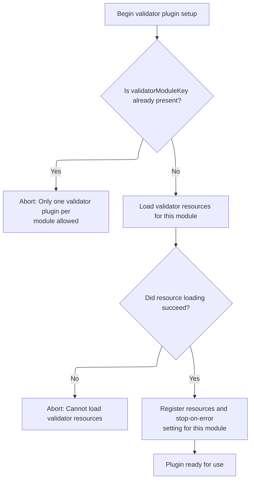
```mermaid
%%{init: {"flowchart": {"defaultRenderer": "elk"}} }%%
flowchart TD
  node1["Begin validator plugin setup"]
  click node1 openCode "core/src/main/java/org/apache/struts/validator/ValidatorPlugIn.java:157:164"
  node1 --> node2{"Is validatorModuleKey already present?"}
  click node2 openCode "core/src/main/java/org/apache/struts/validator/ValidatorPlugIn.java:165:170"
  node2 -->|"Yes"| node3["Abort: Only one validator plugin per
module allowed"]
  click node3 openCode "core/src/main/java/org/apache/struts/validator/ValidatorPlugIn.java:168:170"
  node2 -->|"No"| node4["Load validator resources for this module"]
  click node4 openCode "core/src/main/java/org/apache/struts/validator/ValidatorPlugIn.java:173:174"
  node4 --> node5{"Did resource loading succeed?"}
  click node5 openCode "core/src/main/java/org/apache/struts/validator/ValidatorPlugIn.java:173:183"
  node5 -->|"No"| node6["Abort: Cannot load validator resources"]
  click node6 openCode "core/src/main/java/org/apache/struts/validator/ValidatorPlugIn.java:180:183"
  node5 -->|"Yes"| node7["Register resources and stop-on-error
setting for this module"]
  click node7 openCode "core/src/main/java/org/apache/struts/validator/ValidatorPlugIn.java:175:178"
  node7 --> node8["Plugin ready for use"]
  click node8 openCode "core/src/main/java/org/apache/struts/validator/ValidatorPlugIn.java:184:184"

classDef HeadingStyle fill:#777777,stroke:#333,stroke-width:2px;

%% Swimm:
%% %%{init: {"flowchart": {"defaultRenderer": "elk"}} }%%
%% flowchart TD
%%   node1["Begin validator plugin setup"]
%%   click node1 openCode "<SwmPath>[core/…/validator/ValidatorPlugIn.java](core/src/main/java/org/apache/struts/validator/ValidatorPlugIn.java)</SwmPath>:157:164"
%%   node1 --> node2{"Is <SwmToken path="core/src/main/java/org/apache/struts/validator/ValidatorPlugIn.java" pos="165:3:3" line-data="        String validatorModuleKey = VALIDATOR_KEY + config.getPrefix();">`validatorModuleKey`</SwmToken> already present?"}
%%   click node2 openCode "<SwmPath>[core/…/validator/ValidatorPlugIn.java](core/src/main/java/org/apache/struts/validator/ValidatorPlugIn.java)</SwmPath>:165:170"
%%   node2 -->|"Yes"| node3["Abort: Only one validator plugin per
%% module allowed"]
%%   click node3 openCode "<SwmPath>[core/…/validator/ValidatorPlugIn.java](core/src/main/java/org/apache/struts/validator/ValidatorPlugIn.java)</SwmPath>:168:170"
%%   node2 -->|"No"| node4["Load validator resources for this module"]
%%   click node4 openCode "<SwmPath>[core/…/validator/ValidatorPlugIn.java](core/src/main/java/org/apache/struts/validator/ValidatorPlugIn.java)</SwmPath>:173:174"
%%   node4 --> node5{"Did resource loading succeed?"}
%%   click node5 openCode "<SwmPath>[core/…/validator/ValidatorPlugIn.java](core/src/main/java/org/apache/struts/validator/ValidatorPlugIn.java)</SwmPath>:173:183"
%%   node5 -->|"No"| node6["Abort: Cannot load validator resources"]
%%   click node6 openCode "<SwmPath>[core/…/validator/ValidatorPlugIn.java](core/src/main/java/org/apache/struts/validator/ValidatorPlugIn.java)</SwmPath>:180:183"
%%   node5 -->|"Yes"| node7["Register resources and stop-on-error
%% setting for this module"]
%%   click node7 openCode "<SwmPath>[core/…/validator/ValidatorPlugIn.java](core/src/main/java/org/apache/struts/validator/ValidatorPlugIn.java)</SwmPath>:175:178"
%%   node7 --> node8["Plugin ready for use"]
%%   click node8 openCode "<SwmPath>[core/…/validator/ValidatorPlugIn.java](core/src/main/java/org/apache/struts/validator/ValidatorPlugIn.java)</SwmPath>:184:184"
%% 
%% classDef HeadingStyle fill:#777777,stroke:#333,stroke-width:2px;
```

<SwmSnippet path="/core/src/main/java/org/apache/struts/validator/ValidatorPlugIn.java" line="157">

---

<SwmToken path="core/src/main/java/org/apache/struts/validator/ValidatorPlugIn.java" pos="157:5:5" line-data="    public void init(ActionServlet servlet, ModuleConfig config)">`init`</SwmToken> checks for an existing validator instance for the module using a context key, and throws if it finds one, so you don't get two plugins fighting over the same module. Then it calls <SwmToken path="core/src/main/java/org/apache/struts/validator/ValidatorPlugIn.java" pos="174:3:3" line-data="            this.initResources();">`initResources`</SwmToken> to actually load the validator rules, and stores both the resources and the stop-on-error flag in the servlet context, using keys that are unique per module. This keeps everything isolated and avoids cross-module interference.

```java
    public void init(ActionServlet servlet, ModuleConfig config)
        throws ServletException {

        // Remember our associated configuration and servlet
        this.config = config;
        this.servlet = servlet;
        
        // Verify only one instance of the plugin is loaded per module
        String validatorModuleKey = VALIDATOR_KEY + config.getPrefix();
        ServletContext servletContext = servlet.getServletContext();
        if (servletContext.getAttribute(validatorModuleKey) != null) {
            throw new UnavailableException("ValidatorPlugIn cannot be " +
                    "redefined for module '" + config.getPrefix() + "'");
        }

        // Load our database from persistent storage
        try {
            this.initResources();
            servletContext.setAttribute(validatorModuleKey, resources);
            servletContext.setAttribute(STOP_ON_ERROR_KEY + '.'
                + config.getPrefix(),
                (this.stopOnFirstError ? Boolean.TRUE : Boolean.FALSE));
        } catch (Exception e) {
            log.error(e.getMessage(), e);
            throw new UnavailableException(
                "Cannot load a validator resource from '" + pathnames + "'");
        }
    }
```

---

</SwmSnippet>

# Validator Rules File Discovery

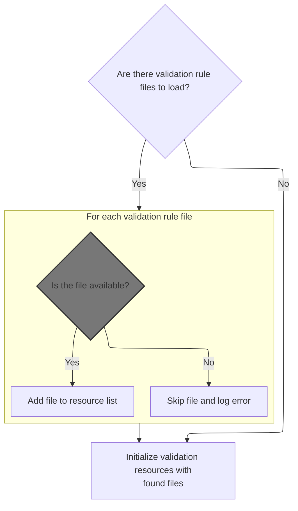
```mermaid
%%{init: {"flowchart": {"defaultRenderer": "elk"}} }%%
flowchart TD
  node1{"Are there validation rule files to load?"}
  click node1 openCode "core/src/main/java/org/apache/struts/validator/ValidatorPlugIn.java:209:211"
  node1 -->|"Yes"| loop1
  node1 -->|"No"| node3["Initialize validation resources with
found files"]
  click node3 openCode "core/src/main/java/org/apache/struts/validator/ValidatorPlugIn.java:251:252"

  subgraph loop1["For each validation rule file"]
    node2{"Is the file available?"}
    
    node2 -->|"Yes"| node4["Add file to resource list"]
    click node4 openCode "core/src/main/java/org/apache/struts/validator/ValidatorPlugIn.java:236:237"
    node2 -->|"No"| node5["Skip file and log error"]
    click node5 openCode "core/src/main/java/org/apache/struts/validator/ValidatorPlugIn.java:238:241"
  end
  loop1 --> node3
classDef HeadingStyle fill:#777777,stroke:#333,stroke-width:2px;
click node2 goToHeading "Tokenizing Validation Rule Input"
node2:::HeadingStyle

%% Swimm:
%% %%{init: {"flowchart": {"defaultRenderer": "elk"}} }%%
%% flowchart TD
%%   node1{"Are there validation rule files to load?"}
%%   click node1 openCode "<SwmPath>[core/…/validator/ValidatorPlugIn.java](core/src/main/java/org/apache/struts/validator/ValidatorPlugIn.java)</SwmPath>:209:211"
%%   node1 -->|"Yes"| loop1
%%   node1 -->|"No"| node3["Initialize validation resources with
%% found files"]
%%   click node3 openCode "<SwmPath>[core/…/validator/ValidatorPlugIn.java](core/src/main/java/org/apache/struts/validator/ValidatorPlugIn.java)</SwmPath>:251:252"
%% 
%%   subgraph loop1["For each validation rule file"]
%%     node2{"Is the file available?"}
%%     
%%     node2 -->|"Yes"| node4["Add file to resource list"]
%%     click node4 openCode "<SwmPath>[core/…/validator/ValidatorPlugIn.java](core/src/main/java/org/apache/struts/validator/ValidatorPlugIn.java)</SwmPath>:236:237"
%%     node2 -->|"No"| node5["Skip file and log error"]
%%     click node5 openCode "<SwmPath>[core/…/validator/ValidatorPlugIn.java](core/src/main/java/org/apache/struts/validator/ValidatorPlugIn.java)</SwmPath>:238:241"
%%   end
%%   loop1 --> node3
%% classDef HeadingStyle fill:#777777,stroke:#333,stroke-width:2px;
%% click node2 goToHeading "Tokenizing Validation Rule Input"
%% node2:::HeadingStyle
```

<SwmSnippet path="/core/src/main/java/org/apache/struts/validator/ValidatorPlugIn.java" line="207">

---

In <SwmToken path="core/src/main/java/org/apache/struts/validator/ValidatorPlugIn.java" pos="207:5:5" line-data="    protected void initResources()">`initResources`</SwmToken>, we bail out if there are no pathnames, then tokenize the pathnames string to handle multiple validator rules files. Each file is logged as it's about to be loaded. Next, we need to parse these files, which is where the lexer comes in.

```java
    protected void initResources()
        throws IOException, ServletException {
        if ((pathnames == null) || (pathnames.length() <= 0)) {
            return;
        }

        StringTokenizer st = new StringTokenizer(pathnames, RESOURCE_DELIM);

        List urlList = new ArrayList();

        try {
            while (st.hasMoreTokens()) {
                String validatorRules = st.nextToken().trim();

                if (log.isInfoEnabled()) {
                    log.info("Loading validation rules file from '"
                        + validatorRules + "'");
                }

```

---

</SwmSnippet>

## Tokenizing Validation Rule Input


```mermaid
%%{init: {"flowchart": {"defaultRenderer": "elk"}} }%%
flowchart TD
  node1["Start tokenization"]
  click node1 openCode "core/src/main/java/org/apache/struts/validator/validwhen/ValidWhenLexer.java:75:78"
  node1 --> loop1
  subgraph loop1["Repeat until a valid token is found or
end of input"]
    node2{"What is the next character?"}
    click node2 openCode "core/src/main/java/org/apache/struts/validator/validwhen/ValidWhenLexer.java:84:159"
    node2 -->|"Whitespace"| node3["Whitespace Handling"]
    
    node2 -->|"Number or '-'"| node4["Numeric Literal Recognition"]
    
    node2 -->|"Quote"| node5["String Literal Recognition"]
    
    node2 -->|"Left bracket"| node6["Left Bracket Recognition"]
    
    node2 -->|"Right bracket"| node7["Right Bracket Recognition"]
    
    node2 -->|"Left parenthesis"| node8["Left Parenthesis Recognition"]
    
    node2 -->|"Right parenthesis"| node9["Right Parenthesis Recognition"]
    
    node2 -->|"Asterisk"| node10["Special Keyword Recognition"]
    
    node2 -->|"Letter or '_'"| node11["Identifier Recognition"]
    
    node2 -->|"Equals"| node12["Equality Operator Recognition"]
    
    node2 -->|"Not equals"| node13["Not-Equal Operator Recognition"]
    
    node2 -->|"Less or equal"| node14["Less-Than-Or-Equal Operator Recognition"]
    
    node2 -->|"Greater or equal"| node15["Greater-Than-Or-Equal Operator Recognition"]
    
    node2 -->|"Less than"| node16["Less-Than Operator Recognition"]
    
    node2 -->|"Greater than"| node17["Recognizing Greater-Than Operator"]
    
    node2 -->|"End of input"| node18["Return end of input token"]
    click node18 openCode "core/src/main/java/org/apache/struts/validator/validwhen/ValidWhenLexer.java:177:177"
    node3 --> node19{"Is token to be skipped?"}
    node4 --> node20["Return token"]
    click node20 openCode "core/src/main/java/org/apache/struts/validator/validwhen/ValidWhenLexer.java:181:185"
    node5 --> node20
    node6 --> node20
    node7 --> node20
    node8 --> node20
    node9 --> node20
    node10 --> node20
    node11 --> node20
    node12 --> node20
    node13 --> node20
    node14 --> node20
    node15 --> node20
    node16 --> node20
    node17 --> node20
    node19 -->|"Yes"| node2
    node19 -->|"No"| node20
    node18 --> node21["End"]
    click node21 openCode "core/src/main/java/org/apache/struts/validator/validwhen/ValidWhenLexer.java:185:200"
  end

classDef HeadingStyle fill:#777777,stroke:#333,stroke-width:2px;
click node3 goToHeading "Whitespace Handling"
node3:::HeadingStyle
click node4 goToHeading "Numeric Literal Recognition"
node4:::HeadingStyle
click node5 goToHeading "String Literal Recognition"
node5:::HeadingStyle
click node6 goToHeading "Left Bracket Recognition"
node6:::HeadingStyle
click node7 goToHeading "Right Bracket Recognition"
node7:::HeadingStyle
click node8 goToHeading "Left Parenthesis Recognition"
node8:::HeadingStyle
click node9 goToHeading "Right Parenthesis Recognition"
node9:::HeadingStyle
click node10 goToHeading "Special Keyword Recognition"
node10:::HeadingStyle
click node11 goToHeading "Identifier Recognition"
node11:::HeadingStyle
click node12 goToHeading "Equality Operator Recognition"
node12:::HeadingStyle
click node13 goToHeading "Not-Equal Operator Recognition"
node13:::HeadingStyle
click node14 goToHeading "Less-Than-Or-Equal Operator Recognition"
node14:::HeadingStyle
click node15 goToHeading "Greater-Than-Or-Equal Operator Recognition"
node15:::HeadingStyle
click node16 goToHeading "Less-Than Operator Recognition"
node16:::HeadingStyle
click node17 goToHeading "Recognizing Greater-Than Operator"
node17:::HeadingStyle

%% Swimm:
%% %%{init: {"flowchart": {"defaultRenderer": "elk"}} }%%
%% flowchart TD
%%   node1["Start tokenization"]
%%   click node1 openCode "<SwmPath>[core/…/validwhen/ValidWhenLexer.java](core/src/main/java/org/apache/struts/validator/validwhen/ValidWhenLexer.java)</SwmPath>:75:78"
%%   node1 --> loop1
%%   subgraph loop1["Repeat until a valid token is found or
%% end of input"]
%%     node2{"What is the next character?"}
%%     click node2 openCode "<SwmPath>[core/…/validwhen/ValidWhenLexer.java](core/src/main/java/org/apache/struts/validator/validwhen/ValidWhenLexer.java)</SwmPath>:84:159"
%%     node2 -->|"Whitespace"| node3["Whitespace Handling"]
%%     
%%     node2 -->|"Number or '-'"| node4["Numeric Literal Recognition"]
%%     
%%     node2 -->|"Quote"| node5["String Literal Recognition"]
%%     
%%     node2 -->|"Left bracket"| node6["Left Bracket Recognition"]
%%     
%%     node2 -->|"Right bracket"| node7["Right Bracket Recognition"]
%%     
%%     node2 -->|"Left parenthesis"| node8["Left Parenthesis Recognition"]
%%     
%%     node2 -->|"Right parenthesis"| node9["Right Parenthesis Recognition"]
%%     
%%     node2 -->|"Asterisk"| node10["Special Keyword Recognition"]
%%     
%%     node2 -->|"Letter or '_'"| node11["Identifier Recognition"]
%%     
%%     node2 -->|"Equals"| node12["Equality Operator Recognition"]
%%     
%%     node2 -->|"Not equals"| node13["Not-Equal Operator Recognition"]
%%     
%%     node2 -->|"Less or equal"| node14["Less-Than-Or-Equal Operator Recognition"]
%%     
%%     node2 -->|"Greater or equal"| node15["Greater-Than-Or-Equal Operator Recognition"]
%%     
%%     node2 -->|"Less than"| node16["Less-Than Operator Recognition"]
%%     
%%     node2 -->|"Greater than"| node17["Recognizing Greater-Than Operator"]
%%     
%%     node2 -->|"End of input"| node18["Return end of input token"]
%%     click node18 openCode "<SwmPath>[core/…/validwhen/ValidWhenLexer.java](core/src/main/java/org/apache/struts/validator/validwhen/ValidWhenLexer.java)</SwmPath>:177:177"
%%     node3 --> node19{"Is token to be skipped?"}
%%     node4 --> node20["Return token"]
%%     click node20 openCode "<SwmPath>[core/…/validwhen/ValidWhenLexer.java](core/src/main/java/org/apache/struts/validator/validwhen/ValidWhenLexer.java)</SwmPath>:181:185"
%%     node5 --> node20
%%     node6 --> node20
%%     node7 --> node20
%%     node8 --> node20
%%     node9 --> node20
%%     node10 --> node20
%%     node11 --> node20
%%     node12 --> node20
%%     node13 --> node20
%%     node14 --> node20
%%     node15 --> node20
%%     node16 --> node20
%%     node17 --> node20
%%     node19 -->|"Yes"| node2
%%     node19 -->|"No"| node20
%%     node18 --> node21["End"]
%%     click node21 openCode "<SwmPath>[core/…/validwhen/ValidWhenLexer.java](core/src/main/java/org/apache/struts/validator/validwhen/ValidWhenLexer.java)</SwmPath>:185:200"
%%   end
%% 
%% classDef HeadingStyle fill:#777777,stroke:#333,stroke-width:2px;
%% click node3 goToHeading "Whitespace Handling"
%% node3:::HeadingStyle
%% click node4 goToHeading "Numeric Literal Recognition"
%% node4:::HeadingStyle
%% click node5 goToHeading "String Literal Recognition"
%% node5:::HeadingStyle
%% click node6 goToHeading "Left Bracket Recognition"
%% node6:::HeadingStyle
%% click node7 goToHeading "Right Bracket Recognition"
%% node7:::HeadingStyle
%% click node8 goToHeading "Left Parenthesis Recognition"
%% node8:::HeadingStyle
%% click node9 goToHeading "Right Parenthesis Recognition"
%% node9:::HeadingStyle
%% click node10 goToHeading "Special Keyword Recognition"
%% node10:::HeadingStyle
%% click node11 goToHeading "Identifier Recognition"
%% node11:::HeadingStyle
%% click node12 goToHeading "Equality Operator Recognition"
%% node12:::HeadingStyle
%% click node13 goToHeading "Not-Equal Operator Recognition"
%% node13:::HeadingStyle
%% click node14 goToHeading "Less-Than-Or-Equal Operator Recognition"
%% node14:::HeadingStyle
%% click node15 goToHeading "Greater-Than-Or-Equal Operator Recognition"
%% node15:::HeadingStyle
%% click node16 goToHeading "Less-Than Operator Recognition"
%% node16:::HeadingStyle
%% click node17 goToHeading "Recognizing Greater-Than Operator"
%% node17:::HeadingStyle
```

<SwmSnippet path="/core/src/main/java/org/apache/struts/validator/validwhen/ValidWhenLexer.java" line="75">

---

In <SwmToken path="core/src/main/java/org/apache/struts/validator/validwhen/ValidWhenLexer.java" pos="75:4:4" line-data="public Token nextToken() throws TokenStreamException {">`nextToken`</SwmToken>, the lexer loops through the input, checking the next character to decide what kind of token to process. It handles whitespace first by calling <SwmToken path="core/src/main/java/org/apache/struts/validator/validwhen/ValidWhenLexer.java" pos="87:1:1" line-data="					mWS(true);">`mWS`</SwmToken>, then moves on to other token types. This keeps the parsing logic clean and predictable.

```java
public Token nextToken() throws TokenStreamException {
	Token theRetToken=null;
tryAgain:
	for (;;) {
		Token _token = null;
		int _ttype = Token.INVALID_TYPE;
		resetText();
		try {   // for char stream error handling
			try {   // for lexical error handling
				switch ( LA(1)) {
				case '\t':  case '\n':  case '\r':  case ' ':
				{
					mWS(true);
					theRetToken=_returnToken;
					break;
				}
				case '-':  case '0':  case '1':  case '2':
				case '3':  case '4':  case '5':  case '6':
```

---

</SwmSnippet>

### Whitespace Handling

See <SwmLink doc-title="Customizing Action Configuration with Pattern Matching">[Customizing Action Configuration with Pattern Matching](/.swm/customizing-action-configuration-with-pattern-matching.dbd0zahm.sw.md)</SwmLink>

### Parsing Numeric Literals

<SwmSnippet path="/core/src/main/java/org/apache/struts/validator/validwhen/ValidWhenLexer.java" line="93">

---

Right after handling whitespace in <SwmToken path="core/src/main/java/org/apache/struts/validator/ValidatorPlugIn.java" pos="219:9:9" line-data="                String validatorRules = st.nextToken().trim();">`nextToken`</SwmToken>, we check for digits or '-' to see if we're starting a numeric literal. If so, we call <SwmToken path="core/src/main/java/org/apache/struts/validator/validwhen/ValidWhenLexer.java" pos="95:1:1" line-data="					mDECIMAL_LITERAL(true);">`mDECIMAL_LITERAL`</SwmToken> to parse it. This lets the lexer handle numbers in various formats, which is needed for flexible rule definitions.

```java
				case '7':  case '8':  case '9':
				{
					mDECIMAL_LITERAL(true);
					theRetToken=_returnToken;
					break;
				}
```

---

</SwmSnippet>

### Numeric Literal Recognition


```mermaid
%%{init: {"flowchart": {"defaultRenderer": "elk"}} }%%
flowchart TD
  node1["Analyze input for numeric literal"]
  click node1 openCode "core/src/main/java/org/apache/struts/validator/validwhen/ValidWhenLexer.java:250:256"
  node1 --> node2{"Decimal with fraction?"}
  click node2 openCode "core/src/main/java/org/apache/struts/validator/validwhen/ValidWhenLexer.java:256:306"
  node2 -->|"Yes"| node3["Recognize decimal with fraction"]
  click node3 openCode "core/src/main/java/org/apache/struts/validator/validwhen/ValidWhenLexer.java:306:361"
  subgraph loop1["Loop: Consume digits before and after
decimal point"]
    node3
  end
  node2 -->|"No"| node4{"Hexadecimal literal?"}
  click node4 openCode "core/src/main/java/org/apache/struts/validator/validwhen/ValidWhenLexer.java:361:413"
  node4 -->|"Yes"| node5["Recognize hexadecimal literal"]
  click node5 openCode "core/src/main/java/org/apache/struts/validator/validwhen/ValidWhenLexer.java:413:449"
  subgraph loop2["Loop: Consume hex digits"]
    node5
  end
  node4 -->|"No"| node6{"Octal literal?"}
  click node6 openCode "core/src/main/java/org/apache/struts/validator/validwhen/ValidWhenLexer.java:414:449"
  node6 -->|"Yes"| node7["Recognize octal literal"]
  click node7 openCode "core/src/main/java/org/apache/struts/validator/validwhen/ValidWhenLexer.java:449:450"
  subgraph loop3["Loop: Consume octal digits"]
    node7
  end
  node6 -->|"No"| node8{"Decimal integer?"}
  click node8 openCode "core/src/main/java/org/apache/struts/validator/validwhen/ValidWhenLexer.java:450:489"
  node8 -->|"Yes"| node9["Recognize decimal integer"]
  click node9 openCode "core/src/main/java/org/apache/struts/validator/validwhen/ValidWhenLexer.java:489:500"
  subgraph loop4["Loop: Consume decimal digits"]
    node9
  end
  node8 -->|"No"| node10["Input is not a valid numeric literal"]
  click node10 openCode "core/src/main/java/org/apache/struts/validator/validwhen/ValidWhenLexer.java:492:493"

classDef HeadingStyle fill:#777777,stroke:#333,stroke-width:2px;

%% Swimm:
%% %%{init: {"flowchart": {"defaultRenderer": "elk"}} }%%
%% flowchart TD
%%   node1["Analyze input for numeric literal"]
%%   click node1 openCode "<SwmPath>[core/…/validwhen/ValidWhenLexer.java](core/src/main/java/org/apache/struts/validator/validwhen/ValidWhenLexer.java)</SwmPath>:250:256"
%%   node1 --> node2{"Decimal with fraction?"}
%%   click node2 openCode "<SwmPath>[core/…/validwhen/ValidWhenLexer.java](core/src/main/java/org/apache/struts/validator/validwhen/ValidWhenLexer.java)</SwmPath>:256:306"
%%   node2 -->|"Yes"| node3["Recognize decimal with fraction"]
%%   click node3 openCode "<SwmPath>[core/…/validwhen/ValidWhenLexer.java](core/src/main/java/org/apache/struts/validator/validwhen/ValidWhenLexer.java)</SwmPath>:306:361"
%%   subgraph loop1["Loop: Consume digits before and after
%% decimal point"]
%%     node3
%%   end
%%   node2 -->|"No"| node4{"Hexadecimal literal?"}
%%   click node4 openCode "<SwmPath>[core/…/validwhen/ValidWhenLexer.java](core/src/main/java/org/apache/struts/validator/validwhen/ValidWhenLexer.java)</SwmPath>:361:413"
%%   node4 -->|"Yes"| node5["Recognize hexadecimal literal"]
%%   click node5 openCode "<SwmPath>[core/…/validwhen/ValidWhenLexer.java](core/src/main/java/org/apache/struts/validator/validwhen/ValidWhenLexer.java)</SwmPath>:413:449"
%%   subgraph loop2["Loop: Consume hex digits"]
%%     node5
%%   end
%%   node4 -->|"No"| node6{"Octal literal?"}
%%   click node6 openCode "<SwmPath>[core/…/validwhen/ValidWhenLexer.java](core/src/main/java/org/apache/struts/validator/validwhen/ValidWhenLexer.java)</SwmPath>:414:449"
%%   node6 -->|"Yes"| node7["Recognize octal literal"]
%%   click node7 openCode "<SwmPath>[core/…/validwhen/ValidWhenLexer.java](core/src/main/java/org/apache/struts/validator/validwhen/ValidWhenLexer.java)</SwmPath>:449:450"
%%   subgraph loop3["Loop: Consume octal digits"]
%%     node7
%%   end
%%   node6 -->|"No"| node8{"Decimal integer?"}
%%   click node8 openCode "<SwmPath>[core/…/validwhen/ValidWhenLexer.java](core/src/main/java/org/apache/struts/validator/validwhen/ValidWhenLexer.java)</SwmPath>:450:489"
%%   node8 -->|"Yes"| node9["Recognize decimal integer"]
%%   click node9 openCode "<SwmPath>[core/…/validwhen/ValidWhenLexer.java](core/src/main/java/org/apache/struts/validator/validwhen/ValidWhenLexer.java)</SwmPath>:489:500"
%%   subgraph loop4["Loop: Consume decimal digits"]
%%     node9
%%   end
%%   node8 -->|"No"| node10["Input is not a valid numeric literal"]
%%   click node10 openCode "<SwmPath>[core/…/validwhen/ValidWhenLexer.java](core/src/main/java/org/apache/struts/validator/validwhen/ValidWhenLexer.java)</SwmPath>:492:493"
%% 
%% classDef HeadingStyle fill:#777777,stroke:#333,stroke-width:2px;
```

<SwmSnippet path="/core/src/main/java/org/apache/struts/validator/validwhen/ValidWhenLexer.java" line="250">

---

In <SwmToken path="core/src/main/java/org/apache/struts/validator/validwhen/ValidWhenLexer.java" pos="250:7:7" line-data="	public final void mDECIMAL_LITERAL(boolean _createToken) throws RecognitionException, CharStreamException, TokenStreamException {">`mDECIMAL_LITERAL`</SwmToken>, the lexer uses lookahead and speculative parsing to figure out if the input is a decimal, hex, or octal literal. It marks the input, tries to match a pattern, and rewinds if it doesn't fit. This way, it doesn't eat characters it shouldn't, and can handle all the number formats used in rules.

```java
	public final void mDECIMAL_LITERAL(boolean _createToken) throws RecognitionException, CharStreamException, TokenStreamException {
		int _ttype; Token _token=null; int _begin=text.length();
		_ttype = DECIMAL_LITERAL;
		int _saveIndex;
		
		boolean synPredMatched24 = false;
		if (((_tokenSet_0.member(LA(1))) && (_tokenSet_1.member(LA(2))))) {
			int _m24 = mark();
			synPredMatched24 = true;
			inputState.guessing++;
			try {
				{
				{
				switch ( LA(1)) {
				case '-':
				{
					match('-');
					break;
				}
				case '0':  case '1':  case '2':  case '3':
				case '4':  case '5':  case '6':  case '7':
				case '8':  case '9':
				{
					break;
				}
				default:
				{
					throw new NoViableAltForCharException((char)LA(1), getFilename(), getLine(), getColumn());
				}
				}
				}
				{
				int _cnt22=0;
				_loop22:
				do {
					if (((LA(1) >= '0' && LA(1) <= '9'))) {
						matchRange('0','9');
					}
					else {
						if ( _cnt22>=1 ) { break _loop22; } else {throw new NoViableAltForCharException((char)LA(1), getFilename(), getLine(), getColumn());}
					}
					
					_cnt22++;
				} while (true);
```

---

</SwmSnippet>

<SwmSnippet path="/core/src/main/java/org/apache/struts/validator/validwhen/ValidWhenLexer.java" line="296">

---

After matching the digits, we look for a decimal point to confirm it's a floating-point literal. If it's there, we keep parsing as a float; otherwise, we move on to check for other formats.

```java
				match('.');
				}
				}
			}
			catch (RecognitionException pe) {
				synPredMatched24 = false;
			}
			rewind(_m24);
inputState.guessing--;
		}
		if ( synPredMatched24 ) {
			{
			{
			switch ( LA(1)) {
			case '-':
			{
				match('-');
				break;
			}
			case '0':  case '1':  case '2':  case '3':
			case '4':  case '5':  case '6':  case '7':
			case '8':  case '9':
			{
				break;
			}
			default:
			{
				throw new NoViableAltForCharException((char)LA(1), getFilename(), getLine(), getColumn());
			}
			}
			}
			{
			int _cnt28=0;
			_loop28:
			do {
				if (((LA(1) >= '0' && LA(1) <= '9'))) {
					matchRange('0','9');
				}
				else {
					if ( _cnt28>=1 ) { break _loop28; } else {throw new NoViableAltForCharException((char)LA(1), getFilename(), getLine(), getColumn());}
				}
				
				_cnt28++;
			} while (true);
```

---

</SwmSnippet>

<SwmSnippet path="/core/src/main/java/org/apache/struts/validator/validwhen/ValidWhenLexer.java" line="342">

---

Once we've matched the decimal point, we loop to match at least one digit after it. This ensures we only accept valid floating-point literals and don't misinterpret the input.

```java
			match('.');
			}
			{
			int _cnt31=0;
			_loop31:
			do {
				if (((LA(1) >= '0' && LA(1) <= '9'))) {
					matchRange('0','9');
				}
				else {
					if ( _cnt31>=1 ) { break _loop31; } else {throw new NoViableAltForCharException((char)LA(1), getFilename(), getLine(), getColumn());}
				}
				
				_cnt31++;
			} while (true);
```

---

</SwmSnippet>

<SwmSnippet path="/core/src/main/java/org/apache/struts/validator/validwhen/ValidWhenLexer.java" line="361">

---

After handling floats, the lexer uses lookahead and guessing to check if the next input is a hex literal (starts with '0x'). If so, it parses it as hex; otherwise, it checks for octal or decimal integer formats. The token sets and guessing logic make sure we don't consume the wrong characters.

```java
			boolean synPredMatched38 = false;
			if (((LA(1)=='0') && (LA(2)=='x'))) {
				int _m38 = mark();
				synPredMatched38 = true;
				inputState.guessing++;
				try {
					{
					match('0');
					match('x');
					}
				}
				catch (RecognitionException pe) {
					synPredMatched38 = false;
				}
				rewind(_m38);
inputState.guessing--;
			}
			if ( synPredMatched38 ) {
				{
				match('0');
				match('x');
				{
				int _cnt41=0;
				_loop41:
				do {
					switch ( LA(1)) {
					case '0':  case '1':  case '2':  case '3':
					case '4':  case '5':  case '6':  case '7':
					case '8':  case '9':
					{
						matchRange('0','9');
						break;
					}
					case 'a':  case 'b':  case 'c':  case 'd':
					case 'e':  case 'f':
					{
						matchRange('a','f');
						break;
					}
					default:
					{
						if ( _cnt41>=1 ) { break _loop41; } else {throw new NoViableAltForCharException((char)LA(1), getFilename(), getLine(), getColumn());}
					}
					}
					_cnt41++;
				} while (true);
```

---

</SwmSnippet>

<SwmSnippet path="/core/src/main/java/org/apache/struts/validator/validwhen/ValidWhenLexer.java" line="409">

---

If the lexer matched '0x', it sets the token type to <SwmToken path="core/src/main/java/org/apache/struts/validator/validwhen/ValidWhenLexer.java" pos="410:5:5" line-data="					_ttype = HEX_INT_LITERAL;">`HEX_INT_LITERAL`</SwmToken>. If not, it checks for octal (starting with '0') or falls back to decimal integer parsing. This keeps the number parsing logic tight and format-aware.

```java
				if ( inputState.guessing==0 ) {
					_ttype = HEX_INT_LITERAL;
				}
			}
			else {
				boolean synPredMatched33 = false;
				if (((LA(1)=='0') && (true))) {
					int _m33 = mark();
					synPredMatched33 = true;
					inputState.guessing++;
					try {
						{
						match('0');
						}
					}
					catch (RecognitionException pe) {
						synPredMatched33 = false;
					}
					rewind(_m33);
inputState.guessing--;
				}
				if ( synPredMatched33 ) {
					{
					match('0');
					{
					_loop36:
					do {
						if (((LA(1) >= '0' && LA(1) <= '7'))) {
							matchRange('0','7');
						}
						else {
							break _loop36;
						}
						
					} while (true);
```

---

</SwmSnippet>

<SwmSnippet path="/core/src/main/java/org/apache/struts/validator/validwhen/ValidWhenLexer.java" line="446">

---

After checking for hex, the lexer looks for octal literals (starting with '0' and followed by octal digits). If it's not octal, it checks for a regular decimal integer. After this, the flow continues to ActionConfigMatcher, which uses these tokens for further rule matching.

```java
					if ( inputState.guessing==0 ) {
						_ttype = OCTAL_INT_LITERAL;
					}
				}
				else if ((_tokenSet_2.member(LA(1))) && (true)) {
					{
					{
					switch ( LA(1)) {
					case '-':
					{
						match('-');
						break;
					}
					case '1':  case '2':  case '3':  case '4':
					case '5':  case '6':  case '7':  case '8':
					case '9':
					{
						break;
					}
```

---

</SwmSnippet>

<SwmSnippet path="/core/src/main/java/org/apache/struts/validator/validwhen/ValidWhenLexer.java" line="465">

---

Back in <SwmToken path="core/src/main/java/org/apache/struts/validator/validwhen/ValidWhenLexer.java" pos="95:1:1" line-data="					mDECIMAL_LITERAL(true);">`mDECIMAL_LITERAL`</SwmToken>, after ActionConfigMatcher uses the tokens, we set the token type to <SwmToken path="core/src/main/java/org/apache/struts/validator/validwhen/ValidWhenLexer.java" pos="488:5:5" line-data="						_ttype = DEC_INT_LITERAL;">`DEC_INT_LITERAL`</SwmToken> if the input matches a decimal integer. If not, we throw, since the input isn't valid for any known number format.

```java
					default:
					{
						throw new NoViableAltForCharException((char)LA(1), getFilename(), getLine(), getColumn());
					}
					}
					}
					{
					matchRange('1','9');
					}
					{
					_loop46:
					do {
						if (((LA(1) >= '0' && LA(1) <= '9'))) {
							matchRange('0','9');
						}
						else {
							break _loop46;
						}
						
					} while (true);
```

---

</SwmSnippet>

<SwmSnippet path="/core/src/main/java/org/apache/struts/validator/validwhen/ValidWhenLexer.java" line="487">

---

After parsing, the lexer creates and returns a token for the matched number format—float, hex, octal, or decimal integer. If nothing matches, it throws. This lets the rest of the parser handle numbers correctly in validation rules.

```java
					if ( inputState.guessing==0 ) {
						_ttype = DEC_INT_LITERAL;
					}
				}
				else {
					throw new NoViableAltForCharException((char)LA(1), getFilename(), getLine(), getColumn());
				}
				}}
				if ( _createToken && _token==null && _ttype!=Token.SKIP ) {
					_token = makeToken(_ttype);
					_token.setText(new String(text.getBuffer(), _begin, text.length()-_begin));
				}
				_returnToken = _token;
			}
```

---

</SwmSnippet>

### Parsing String Literals

<SwmSnippet path="/core/src/main/java/org/apache/struts/validator/validwhen/ValidWhenLexer.java" line="99">

---

After handling numbers in <SwmToken path="core/src/main/java/org/apache/struts/validator/ValidatorPlugIn.java" pos="219:9:9" line-data="                String validatorRules = st.nextToken().trim();">`nextToken`</SwmToken>, we check for quotes to see if we're starting a string literal. If so, we call <SwmToken path="core/src/main/java/org/apache/struts/validator/validwhen/ValidWhenLexer.java" pos="101:1:1" line-data="					mSTRING_LITERAL(true);">`mSTRING_LITERAL`</SwmToken> to parse it. This lets the lexer handle both single and double quoted strings in rule files.

```java
				case '"':  case '\'':
				{
					mSTRING_LITERAL(true);
					theRetToken=_returnToken;
					break;
				}
```

---

</SwmSnippet>

### String Literal Recognition

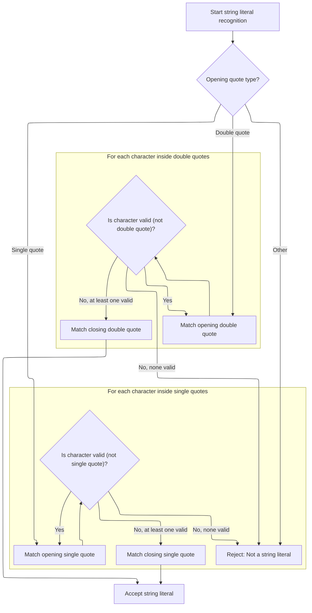
```mermaid
%%{init: {"flowchart": {"defaultRenderer": "elk"}} }%%
flowchart TD
  node1["Start string literal recognition"]
  click node1 openCode "core/src/main/java/org/apache/struts/validator/validwhen/ValidWhenLexer.java:502:507"
  node1 --> node2{"Opening quote type?"}
  click node2 openCode "core/src/main/java/org/apache/struts/validator/validwhen/ValidWhenLexer.java:507:507"
  node2 -->|"Single quote"| node3["Match opening single quote"]
  click node3 openCode "core/src/main/java/org/apache/struts/validator/validwhen/ValidWhenLexer.java:511:511"
  node2 -->|"Double quote"| node4["Match opening double quote"]
  click node4 openCode "core/src/main/java/org/apache/struts/validator/validwhen/ValidWhenLexer.java:533:533"
  node2 -->|"Other"| node9["Reject: Not a string literal"]
  click node9 openCode "core/src/main/java/org/apache/struts/validator/validwhen/ValidWhenLexer.java:554:555"

  subgraph loop1["For each character inside single quotes"]
    node3 --> node5{"Is character valid (not single quote)?"}
    click node5 openCode "core/src/main/java/org/apache/struts/validator/validwhen/ValidWhenLexer.java:516:517"
    node5 -->|"Yes"| node3
    node5 -->|"No, at least one valid"| node6["Match closing single quote"]
    click node6 openCode "core/src/main/java/org/apache/struts/validator/validwhen/ValidWhenLexer.java:526:526"
    node5 -->|"No, none valid"| node9
  end
  node6 --> node8["Accept string literal"]
  click node8 openCode "core/src/main/java/org/apache/struts/validator/validwhen/ValidWhenLexer.java:557:561"

  subgraph loop2["For each character inside double quotes"]
    node4 --> node7{"Is character valid (not double quote)?"}
    click node7 openCode "core/src/main/java/org/apache/struts/validator/validwhen/ValidWhenLexer.java:538:539"
    node7 -->|"Yes"| node4
    node7 -->|"No, at least one valid"| node10["Match closing double quote"]
    click node10 openCode "core/src/main/java/org/apache/struts/validator/validwhen/ValidWhenLexer.java:548:548"
    node7 -->|"No, none valid"| node9
  end
  node10 --> node8

classDef HeadingStyle fill:#777777,stroke:#333,stroke-width:2px;

%% Swimm:
%% %%{init: {"flowchart": {"defaultRenderer": "elk"}} }%%
%% flowchart TD
%%   node1["Start string literal recognition"]
%%   click node1 openCode "<SwmPath>[core/…/validwhen/ValidWhenLexer.java](core/src/main/java/org/apache/struts/validator/validwhen/ValidWhenLexer.java)</SwmPath>:502:507"
%%   node1 --> node2{"Opening quote type?"}
%%   click node2 openCode "<SwmPath>[core/…/validwhen/ValidWhenLexer.java](core/src/main/java/org/apache/struts/validator/validwhen/ValidWhenLexer.java)</SwmPath>:507:507"
%%   node2 -->|"Single quote"| node3["Match opening single quote"]
%%   click node3 openCode "<SwmPath>[core/…/validwhen/ValidWhenLexer.java](core/src/main/java/org/apache/struts/validator/validwhen/ValidWhenLexer.java)</SwmPath>:511:511"
%%   node2 -->|"Double quote"| node4["Match opening double quote"]
%%   click node4 openCode "<SwmPath>[core/…/validwhen/ValidWhenLexer.java](core/src/main/java/org/apache/struts/validator/validwhen/ValidWhenLexer.java)</SwmPath>:533:533"
%%   node2 -->|"Other"| node9["Reject: Not a string literal"]
%%   click node9 openCode "<SwmPath>[core/…/validwhen/ValidWhenLexer.java](core/src/main/java/org/apache/struts/validator/validwhen/ValidWhenLexer.java)</SwmPath>:554:555"
%% 
%%   subgraph loop1["For each character inside single quotes"]
%%     node3 --> node5{"Is character valid (not single quote)?"}
%%     click node5 openCode "<SwmPath>[core/…/validwhen/ValidWhenLexer.java](core/src/main/java/org/apache/struts/validator/validwhen/ValidWhenLexer.java)</SwmPath>:516:517"
%%     node5 -->|"Yes"| node3
%%     node5 -->|"No, at least one valid"| node6["Match closing single quote"]
%%     click node6 openCode "<SwmPath>[core/…/validwhen/ValidWhenLexer.java](core/src/main/java/org/apache/struts/validator/validwhen/ValidWhenLexer.java)</SwmPath>:526:526"
%%     node5 -->|"No, none valid"| node9
%%   end
%%   node6 --> node8["Accept string literal"]
%%   click node8 openCode "<SwmPath>[core/…/validwhen/ValidWhenLexer.java](core/src/main/java/org/apache/struts/validator/validwhen/ValidWhenLexer.java)</SwmPath>:557:561"
%% 
%%   subgraph loop2["For each character inside double quotes"]
%%     node4 --> node7{"Is character valid (not double quote)?"}
%%     click node7 openCode "<SwmPath>[core/…/validwhen/ValidWhenLexer.java](core/src/main/java/org/apache/struts/validator/validwhen/ValidWhenLexer.java)</SwmPath>:538:539"
%%     node7 -->|"Yes"| node4
%%     node7 -->|"No, at least one valid"| node10["Match closing double quote"]
%%     click node10 openCode "<SwmPath>[core/…/validwhen/ValidWhenLexer.java](core/src/main/java/org/apache/struts/validator/validwhen/ValidWhenLexer.java)</SwmPath>:548:548"
%%     node7 -->|"No, none valid"| node9
%%   end
%%   node10 --> node8
%% 
%% classDef HeadingStyle fill:#777777,stroke:#333,stroke-width:2px;
```

<SwmSnippet path="/core/src/main/java/org/apache/struts/validator/validwhen/ValidWhenLexer.java" line="502">

---

In <SwmToken path="core/src/main/java/org/apache/struts/validator/validwhen/ValidWhenLexer.java" pos="502:7:7" line-data="	public final void mSTRING_LITERAL(boolean _createToken) throws RecognitionException, CharStreamException, TokenStreamException {">`mSTRING_LITERAL`</SwmToken>, we check for a starting quote, then loop through the input, matching everything until we hit the closing quote. This way, the lexer grabs the whole string, no matter what's inside.

```java
	public final void mSTRING_LITERAL(boolean _createToken) throws RecognitionException, CharStreamException, TokenStreamException {
		int _ttype; Token _token=null; int _begin=text.length();
		_ttype = STRING_LITERAL;
		int _saveIndex;
		
		switch ( LA(1)) {
		case '\'':
		{
			{
			match('\'');
			{
			int _cnt50=0;
			_loop50:
			do {
				if ((_tokenSet_3.member(LA(1)))) {
					matchNot('\'');
				}
				else {
					if ( _cnt50>=1 ) { break _loop50; } else {throw new NoViableAltForCharException((char)LA(1), getFilename(), getLine(), getColumn());}
				}
				
				_cnt50++;
			} while (true);
```

---

</SwmSnippet>

<SwmSnippet path="/core/src/main/java/org/apache/struts/validator/validwhen/ValidWhenLexer.java" line="526">

---

After handling single-quoted strings, the lexer does the same for double-quoted ones—matching the opening quote, looping through the content, and stopping at the closing quote. This keeps string parsing consistent for both styles.

```java
			match('\'');
			}
			break;
		}
		case '"':
		{
			{
			match('\"');
			{
			int _cnt53=0;
			_loop53:
			do {
				if ((_tokenSet_4.member(LA(1)))) {
					matchNot('\"');
				}
				else {
					if ( _cnt53>=1 ) { break _loop53; } else {throw new NoViableAltForCharException((char)LA(1), getFilename(), getLine(), getColumn());}
				}
				
				_cnt53++;
			} while (true);
```

---

</SwmSnippet>

<SwmSnippet path="/core/src/main/java/org/apache/struts/validator/validwhen/ValidWhenLexer.java" line="548">

---

If the input doesn't start with a recognized quote, the lexer throws. After this, the flow continues to ActionConfigMatcher, which uses the parsed tokens for rule matching.

```java
			match('\"');
			}
			break;
		}
		default:
		{
			throw new NoViableAltForCharException((char)LA(1), getFilename(), getLine(), getColumn());
		}
		}
```

---

</SwmSnippet>

<SwmSnippet path="/core/src/main/java/org/apache/struts/validator/validwhen/ValidWhenLexer.java" line="557">

---

Back in <SwmToken path="core/src/main/java/org/apache/struts/validator/validwhen/ValidWhenLexer.java" pos="101:1:1" line-data="					mSTRING_LITERAL(true);">`mSTRING_LITERAL`</SwmToken>, after ActionConfigMatcher uses the string tokens, we create and return the token if needed. If the token type is SKIP, we don't return anything. This keeps the token stream clean for the parser.

```java
		if ( _createToken && _token==null && _ttype!=Token.SKIP ) {
			_token = makeToken(_ttype);
			_token.setText(new String(text.getBuffer(), _begin, text.length()-_begin));
		}
		_returnToken = _token;
	}
```

---

</SwmSnippet>

### Parsing Bracket Tokens

<SwmSnippet path="/core/src/main/java/org/apache/struts/validator/validwhen/ValidWhenLexer.java" line="105">

---

After handling string literals in <SwmToken path="core/src/main/java/org/apache/struts/validator/ValidatorPlugIn.java" pos="219:9:9" line-data="                String validatorRules = st.nextToken().trim();">`nextToken`</SwmToken>, we check for '\[' to see if we're starting a bracketed expression. If so, we call <SwmToken path="core/src/main/java/org/apache/struts/validator/validwhen/ValidWhenLexer.java" pos="107:1:1" line-data="					mLBRACKET(true);">`mLBRACKET`</SwmToken> to parse it. This lets the lexer handle grouping or array syntax in rules.

```java
				case '[':
				{
					mLBRACKET(true);
					theRetToken=_returnToken;
					break;
				}
```

---

</SwmSnippet>

### Left Bracket Recognition

<SwmSnippet path="/core/src/main/java/org/apache/struts/validator/validwhen/ValidWhenLexer.java" line="564">

---

In <SwmToken path="core/src/main/java/org/apache/struts/validator/validwhen/ValidWhenLexer.java" pos="564:7:7" line-data="	public final void mLBRACKET(boolean _createToken) throws RecognitionException, CharStreamException, TokenStreamException {">`mLBRACKET`</SwmToken>, we match the '\[' character and set up the token. After this, the flow continues to ActionConfigMatcher, which uses the bracket tokens for parsing rule expressions.

```java
	public final void mLBRACKET(boolean _createToken) throws RecognitionException, CharStreamException, TokenStreamException {
		int _ttype; Token _token=null; int _begin=text.length();
		_ttype = LBRACKET;
		int _saveIndex;
		
		match('[');
```

---

</SwmSnippet>

<SwmSnippet path="/core/src/main/java/org/apache/struts/validator/validwhen/ValidWhenLexer.java" line="570">

---

Back in <SwmToken path="core/src/main/java/org/apache/struts/validator/validwhen/ValidWhenLexer.java" pos="107:1:1" line-data="					mLBRACKET(true);">`mLBRACKET`</SwmToken>, after ActionConfigMatcher uses the bracket tokens, we create and return the token if needed. If the token type is SKIP, we don't return anything. This keeps the token stream clean for the parser.

```java
		if ( _createToken && _token==null && _ttype!=Token.SKIP ) {
			_token = makeToken(_ttype);
			_token.setText(new String(text.getBuffer(), _begin, text.length()-_begin));
		}
		_returnToken = _token;
	}
```

---

</SwmSnippet>

### Parsing Right Bracket Tokens

<SwmSnippet path="/core/src/main/java/org/apache/struts/validator/validwhen/ValidWhenLexer.java" line="111">

---

After handling left brackets in <SwmToken path="core/src/main/java/org/apache/struts/validator/ValidatorPlugIn.java" pos="219:9:9" line-data="                String validatorRules = st.nextToken().trim();">`nextToken`</SwmToken>, we check for '\]' to see if we're closing a bracketed expression. If so, we call <SwmToken path="core/src/main/java/org/apache/struts/validator/validwhen/ValidWhenLexer.java" pos="113:1:1" line-data="					mRBRACKET(true);">`mRBRACKET`</SwmToken> to parse it. This keeps the bracket pairs balanced in the token stream.

```java
				case ']':
				{
					mRBRACKET(true);
					theRetToken=_returnToken;
					break;
				}
```

---

</SwmSnippet>

### Right Bracket Recognition

<SwmSnippet path="/core/src/main/java/org/apache/struts/validator/validwhen/ValidWhenLexer.java" line="577">

---

In <SwmToken path="core/src/main/java/org/apache/struts/validator/validwhen/ValidWhenLexer.java" pos="577:7:7" line-data="	public final void mRBRACKET(boolean _createToken) throws RecognitionException, CharStreamException, TokenStreamException {">`mRBRACKET`</SwmToken>, we match the '\]' character and set up the token. After this, the flow continues to ActionConfigMatcher, which uses the bracket tokens for parsing rule expressions.

```java
	public final void mRBRACKET(boolean _createToken) throws RecognitionException, CharStreamException, TokenStreamException {
		int _ttype; Token _token=null; int _begin=text.length();
		_ttype = RBRACKET;
		int _saveIndex;
		
		match(']');
```

---

</SwmSnippet>

<SwmSnippet path="/core/src/main/java/org/apache/struts/validator/validwhen/ValidWhenLexer.java" line="583">

---

Back in <SwmToken path="core/src/main/java/org/apache/struts/validator/validwhen/ValidWhenLexer.java" pos="113:1:1" line-data="					mRBRACKET(true);">`mRBRACKET`</SwmToken>, after ActionConfigMatcher uses the bracket tokens, we create and return the token if needed. If the token type is SKIP, we don't return anything. This keeps the token stream clean for the parser.

```java
		if ( _createToken && _token==null && _ttype!=Token.SKIP ) {
			_token = makeToken(_ttype);
			_token.setText(new String(text.getBuffer(), _begin, text.length()-_begin));
		}
		_returnToken = _token;
	}
```

---

</SwmSnippet>

### Parsing Parenthesis Tokens

<SwmSnippet path="/core/src/main/java/org/apache/struts/validator/validwhen/ValidWhenLexer.java" line="117">

---

After handling right brackets in <SwmToken path="core/src/main/java/org/apache/struts/validator/ValidatorPlugIn.java" pos="219:9:9" line-data="                String validatorRules = st.nextToken().trim();">`nextToken`</SwmToken>, we check for '(' to see if we're starting a grouped expression. If so, we call <SwmToken path="core/src/main/java/org/apache/struts/validator/validwhen/ValidWhenLexer.java" pos="119:1:1" line-data="					mLPAREN(true);">`mLPAREN`</SwmToken> to parse it. This lets the lexer handle grouping in rule expressions.

```java
				case '(':
				{
					mLPAREN(true);
					theRetToken=_returnToken;
					break;
				}
```

---

</SwmSnippet>

### Left Parenthesis Recognition

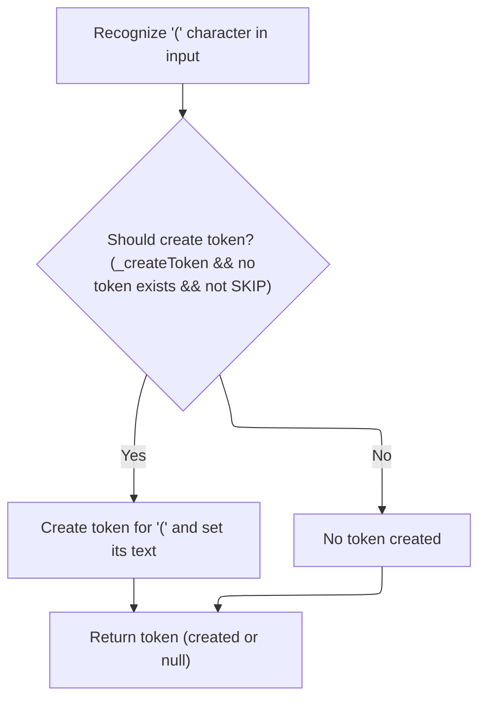
```mermaid
%%{init: {"flowchart": {"defaultRenderer": "elk"}} }%%
flowchart TD
  node1["Recognize '(' character in input"]
  click node1 openCode "core/src/main/java/org/apache/struts/validator/validwhen/ValidWhenLexer.java:595:595"
  node1 --> node2{"Should create token? (_createToken && no
token exists && not SKIP)"}
  click node2 openCode "core/src/main/java/org/apache/struts/validator/validwhen/ValidWhenLexer.java:596:599"
  node2 -->|"Yes"| node3["Create token for '(' and set its text"]
  click node3 openCode "core/src/main/java/org/apache/struts/validator/validwhen/ValidWhenLexer.java:597:598"
  node2 -->|"No"| node4["No token created"]
  click node4 openCode "core/src/main/java/org/apache/struts/validator/validwhen/ValidWhenLexer.java:599:599"
  node3 --> node5["Return token (created or null)"]
  click node5 openCode "core/src/main/java/org/apache/struts/validator/validwhen/ValidWhenLexer.java:600:601"
  node4 --> node5
  
classDef HeadingStyle fill:#777777,stroke:#333,stroke-width:2px;

%% Swimm:
%% %%{init: {"flowchart": {"defaultRenderer": "elk"}} }%%
%% flowchart TD
%%   node1["Recognize '(' character in input"]
%%   click node1 openCode "<SwmPath>[core/…/validwhen/ValidWhenLexer.java](core/src/main/java/org/apache/struts/validator/validwhen/ValidWhenLexer.java)</SwmPath>:595:595"
%%   node1 --> node2{"Should create token? (<SwmToken path="core/src/main/java/org/apache/struts/validator/validwhen/ValidWhenLexer.java" pos="250:11:11" line-data="	public final void mDECIMAL_LITERAL(boolean _createToken) throws RecognitionException, CharStreamException, TokenStreamException {">`_createToken`</SwmToken> && no
%% token exists && not SKIP)"}
%%   click node2 openCode "<SwmPath>[core/…/validwhen/ValidWhenLexer.java](core/src/main/java/org/apache/struts/validator/validwhen/ValidWhenLexer.java)</SwmPath>:596:599"
%%   node2 -->|"Yes"| node3["Create token for '(' and set its text"]
%%   click node3 openCode "<SwmPath>[core/…/validwhen/ValidWhenLexer.java](core/src/main/java/org/apache/struts/validator/validwhen/ValidWhenLexer.java)</SwmPath>:597:598"
%%   node2 -->|"No"| node4["No token created"]
%%   click node4 openCode "<SwmPath>[core/…/validwhen/ValidWhenLexer.java](core/src/main/java/org/apache/struts/validator/validwhen/ValidWhenLexer.java)</SwmPath>:599:599"
%%   node3 --> node5["Return token (created or null)"]
%%   click node5 openCode "<SwmPath>[core/…/validwhen/ValidWhenLexer.java](core/src/main/java/org/apache/struts/validator/validwhen/ValidWhenLexer.java)</SwmPath>:600:601"
%%   node4 --> node5
%%   
%% classDef HeadingStyle fill:#777777,stroke:#333,stroke-width:2px;
```

<SwmSnippet path="/core/src/main/java/org/apache/struts/validator/validwhen/ValidWhenLexer.java" line="590">

---

In <SwmToken path="core/src/main/java/org/apache/struts/validator/validwhen/ValidWhenLexer.java" pos="590:7:7" line-data="	public final void mLPAREN(boolean _createToken) throws RecognitionException, CharStreamException, TokenStreamException {">`mLPAREN`</SwmToken>, we match the '(' character and set up the token. After this, the flow continues to ActionConfigMatcher, which uses the parenthesis tokens for parsing grouped rule expressions.

```java
	public final void mLPAREN(boolean _createToken) throws RecognitionException, CharStreamException, TokenStreamException {
		int _ttype; Token _token=null; int _begin=text.length();
		_ttype = LPAREN;
		int _saveIndex;
		
		match('(');
```

---

</SwmSnippet>

<SwmSnippet path="/core/src/main/java/org/apache/struts/validator/validwhen/ValidWhenLexer.java" line="596">

---

Back in <SwmToken path="core/src/main/java/org/apache/struts/validator/validwhen/ValidWhenLexer.java" pos="119:1:1" line-data="					mLPAREN(true);">`mLPAREN`</SwmToken>, after ActionConfigMatcher uses the parenthesis tokens, we create and return the token if needed. If the token type is SKIP, we don't return anything. This keeps the token stream clean for the parser.

```java
		if ( _createToken && _token==null && _ttype!=Token.SKIP ) {
			_token = makeToken(_ttype);
			_token.setText(new String(text.getBuffer(), _begin, text.length()-_begin));
		}
		_returnToken = _token;
	}
```

---

</SwmSnippet>

### Handling Right Parenthesis Tokens

<SwmSnippet path="/core/src/main/java/org/apache/struts/validator/validwhen/ValidWhenLexer.java" line="123">

---

After handling left parentheses, here we check for ')' and call <SwmToken path="core/src/main/java/org/apache/struts/validator/validwhen/ValidWhenLexer.java" pos="125:1:1" line-data="					mRPAREN(true);">`mRPAREN`</SwmToken> to tokenize it. This keeps the token stream balanced for grouped expressions, so the parser can match pairs correctly. We break after setting the return token, then move on to the next possible token type.

```java
				case ')':
				{
					mRPAREN(true);
					theRetToken=_returnToken;
					break;
				}
```

---

</SwmSnippet>

### Right Parenthesis Recognition

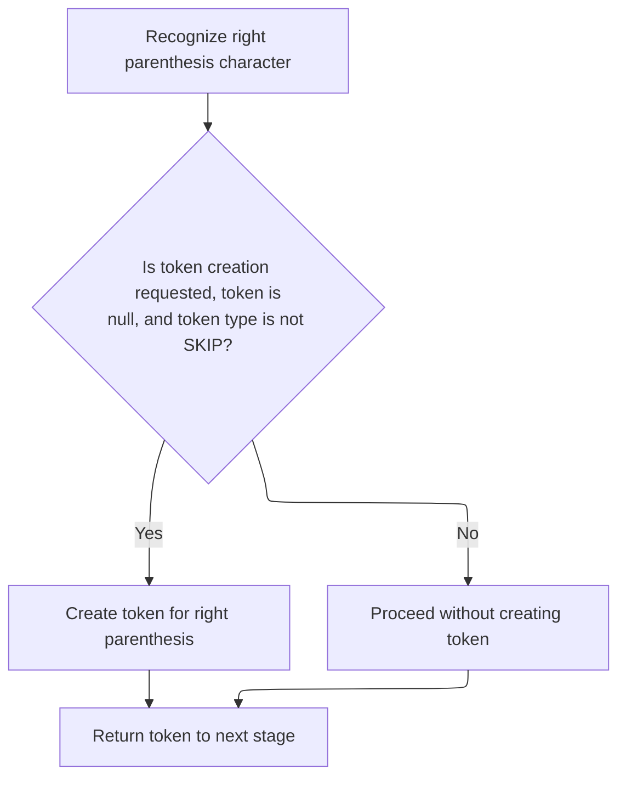
```mermaid
%%{init: {"flowchart": {"defaultRenderer": "elk"}} }%%
flowchart TD
    node1["Recognize right parenthesis character"]
    click node1 openCode "core/src/main/java/org/apache/struts/validator/validwhen/ValidWhenLexer.java:608:608"
    node1 --> node2{"Is token creation requested, token is
null, and token type is not SKIP?"}
    click node2 openCode "core/src/main/java/org/apache/struts/validator/validwhen/ValidWhenLexer.java:609:609"
    node2 -->|"Yes"| node3["Create token for right parenthesis"]
    click node3 openCode "core/src/main/java/org/apache/struts/validator/validwhen/ValidWhenLexer.java:610:611"
    node2 -->|"No"| node4["Proceed without creating token"]
    click node4 openCode "core/src/main/java/org/apache/struts/validator/validwhen/ValidWhenLexer.java:612:612"
    node3 --> node5["Return token to next stage"]
    click node5 openCode "core/src/main/java/org/apache/struts/validator/validwhen/ValidWhenLexer.java:613:614"
    node4 --> node5
classDef HeadingStyle fill:#777777,stroke:#333,stroke-width:2px;

%% Swimm:
%% %%{init: {"flowchart": {"defaultRenderer": "elk"}} }%%
%% flowchart TD
%%     node1["Recognize right parenthesis character"]
%%     click node1 openCode "<SwmPath>[core/…/validwhen/ValidWhenLexer.java](core/src/main/java/org/apache/struts/validator/validwhen/ValidWhenLexer.java)</SwmPath>:608:608"
%%     node1 --> node2{"Is token creation requested, token is
%% null, and token type is not SKIP?"}
%%     click node2 openCode "<SwmPath>[core/…/validwhen/ValidWhenLexer.java](core/src/main/java/org/apache/struts/validator/validwhen/ValidWhenLexer.java)</SwmPath>:609:609"
%%     node2 -->|"Yes"| node3["Create token for right parenthesis"]
%%     click node3 openCode "<SwmPath>[core/…/validwhen/ValidWhenLexer.java](core/src/main/java/org/apache/struts/validator/validwhen/ValidWhenLexer.java)</SwmPath>:610:611"
%%     node2 -->|"No"| node4["Proceed without creating token"]
%%     click node4 openCode "<SwmPath>[core/…/validwhen/ValidWhenLexer.java](core/src/main/java/org/apache/struts/validator/validwhen/ValidWhenLexer.java)</SwmPath>:612:612"
%%     node3 --> node5["Return token to next stage"]
%%     click node5 openCode "<SwmPath>[core/…/validwhen/ValidWhenLexer.java](core/src/main/java/org/apache/struts/validator/validwhen/ValidWhenLexer.java)</SwmPath>:613:614"
%%     node4 --> node5
%% classDef HeadingStyle fill:#777777,stroke:#333,stroke-width:2px;
```

<SwmSnippet path="/core/src/main/java/org/apache/struts/validator/validwhen/ValidWhenLexer.java" line="603">

---

In <SwmToken path="core/src/main/java/org/apache/struts/validator/validwhen/ValidWhenLexer.java" pos="603:7:7" line-data="	public final void mRPAREN(boolean _createToken) throws RecognitionException, CharStreamException, TokenStreamException {">`mRPAREN`</SwmToken>, we match the ')' character and set up the RPAREN token. This token is picked up by ActionConfigMatcher, which uses it to parse and process grouped rule expressions in the config.

```java
	public final void mRPAREN(boolean _createToken) throws RecognitionException, CharStreamException, TokenStreamException {
		int _ttype; Token _token=null; int _begin=text.length();
		_ttype = RPAREN;
		int _saveIndex;
		
		match(')');
```

---

</SwmSnippet>

<SwmSnippet path="/core/src/main/java/org/apache/struts/validator/validwhen/ValidWhenLexer.java" line="609">

---

After ActionConfigMatcher uses the RPAREN token, we create and return it if needed. If the token type is SKIP, nothing is returned, keeping the token stream clean for the parser.

```java
		if ( _createToken && _token==null && _ttype!=Token.SKIP ) {
			_token = makeToken(_ttype);
			_token.setText(new String(text.getBuffer(), _begin, text.length()-_begin));
		}
		_returnToken = _token;
	}
```

---

</SwmSnippet>

### Handling Special Keyword Tokens

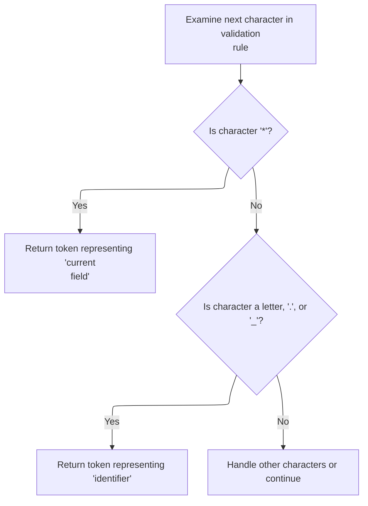
```mermaid
%%{init: {"flowchart": {"defaultRenderer": "elk"}} }%%
flowchart TD
  node1["Examine next character in validation
rule"]
  click node1 openCode "core/src/main/java/org/apache/struts/validator/validwhen/ValidWhenLexer.java:129:140"
  node1 --> node2{"Is character '*'?"}
  click node2 openCode "core/src/main/java/org/apache/struts/validator/validwhen/ValidWhenLexer.java:129:134"
  node2 -->|"Yes"| node3["Return token representing 'current
field'"]
  click node3 openCode "core/src/main/java/org/apache/struts/validator/validwhen/ValidWhenLexer.java:131:133"
  node2 -->|"No"| node4{"Is character a letter, '.', or '_'?"}
  click node4 openCode "core/src/main/java/org/apache/struts/validator/validwhen/ValidWhenLexer.java:135:140"
  node4 -->|"Yes"| node5["Return token representing 'identifier'"]
  click node5 openCode "core/src/main/java/org/apache/struts/validator/validwhen/ValidWhenLexer.java:135:140"
  node4 -->|"No"| node6["Handle other characters or continue"]
  click node6 openCode "core/src/main/java/org/apache/struts/validator/validwhen/ValidWhenLexer.java:140:140"

classDef HeadingStyle fill:#777777,stroke:#333,stroke-width:2px;

%% Swimm:
%% %%{init: {"flowchart": {"defaultRenderer": "elk"}} }%%
%% flowchart TD
%%   node1["Examine next character in validation
%% rule"]
%%   click node1 openCode "<SwmPath>[core/…/validwhen/ValidWhenLexer.java](core/src/main/java/org/apache/struts/validator/validwhen/ValidWhenLexer.java)</SwmPath>:129:140"
%%   node1 --> node2{"Is character '*'?"}
%%   click node2 openCode "<SwmPath>[core/…/validwhen/ValidWhenLexer.java](core/src/main/java/org/apache/struts/validator/validwhen/ValidWhenLexer.java)</SwmPath>:129:134"
%%   node2 -->|"Yes"| node3["Return token representing 'current
%% field'"]
%%   click node3 openCode "<SwmPath>[core/…/validwhen/ValidWhenLexer.java](core/src/main/java/org/apache/struts/validator/validwhen/ValidWhenLexer.java)</SwmPath>:131:133"
%%   node2 -->|"No"| node4{"Is character a letter, '.', or '_'?"}
%%   click node4 openCode "<SwmPath>[core/…/validwhen/ValidWhenLexer.java](core/src/main/java/org/apache/struts/validator/validwhen/ValidWhenLexer.java)</SwmPath>:135:140"
%%   node4 -->|"Yes"| node5["Return token representing 'identifier'"]
%%   click node5 openCode "<SwmPath>[core/…/validwhen/ValidWhenLexer.java](core/src/main/java/org/apache/struts/validator/validwhen/ValidWhenLexer.java)</SwmPath>:135:140"
%%   node4 -->|"No"| node6["Handle other characters or continue"]
%%   click node6 openCode "<SwmPath>[core/…/validwhen/ValidWhenLexer.java](core/src/main/java/org/apache/struts/validator/validwhen/ValidWhenLexer.java)</SwmPath>:140:140"
%% 
%% classDef HeadingStyle fill:#777777,stroke:#333,stroke-width:2px;
```

<SwmSnippet path="/core/src/main/java/org/apache/struts/validator/validwhen/ValidWhenLexer.java" line="129">

---

After handling right parentheses, we check for '\*' and call <SwmToken path="core/src/main/java/org/apache/struts/validator/validwhen/ValidWhenLexer.java" pos="131:1:1" line-data="					mTHIS(true);">`mTHIS`</SwmToken> to tokenize the '*this*' keyword. This is needed for rules that reference the current field, and we break after setting the return token.

```java
				case '*':
				{
					mTHIS(true);
					theRetToken=_returnToken;
					break;
				}
				case '.':  case '_':  case 'a':  case 'b':
				case 'c':  case 'd':  case 'e':  case 'f':
				case 'g':  case 'h':  case 'i':  case 'j':
				case 'k':  case 'l':  case 'm':  case 'n':
				case 'o':  case 'p':  case 'q':  case 'r':
				case 's':  case 't':  case 'u':  case 'v':
```

---

</SwmSnippet>

### Special Keyword Recognition

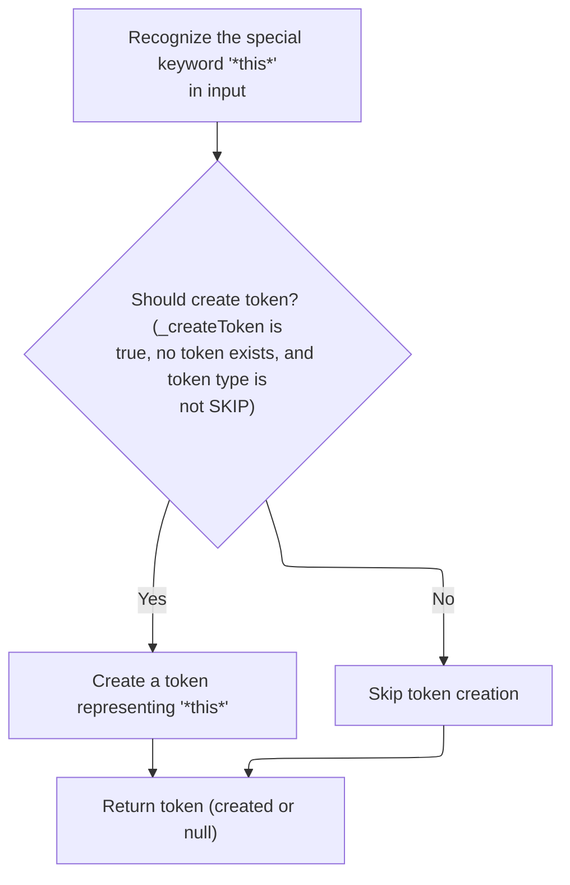
```mermaid
%%{init: {"flowchart": {"defaultRenderer": "elk"}} }%%
flowchart TD
    node1["Recognize the special keyword '*this*'
in input"]
    click node1 openCode "core/src/main/java/org/apache/struts/validator/validwhen/ValidWhenLexer.java:621:621"
    node1 --> node2{"Should create token? (_createToken is
true, no token exists, and token type is
not SKIP)"}
    click node2 openCode "core/src/main/java/org/apache/struts/validator/validwhen/ValidWhenLexer.java:622:625"
    node2 -->|"Yes"| node3["Create a token representing '*this*'"]
    click node3 openCode "core/src/main/java/org/apache/struts/validator/validwhen/ValidWhenLexer.java:623:624"
    node2 -->|"No"| node4["Skip token creation"]
    click node4 openCode "core/src/main/java/org/apache/struts/validator/validwhen/ValidWhenLexer.java:625:625"
    node3 --> node5["Return token (created or null)"]
    node4 --> node5["Return token (created or null)"]
    click node5 openCode "core/src/main/java/org/apache/struts/validator/validwhen/ValidWhenLexer.java:626:627"
classDef HeadingStyle fill:#777777,stroke:#333,stroke-width:2px;

%% Swimm:
%% %%{init: {"flowchart": {"defaultRenderer": "elk"}} }%%
%% flowchart TD
%%     node1["Recognize the special keyword '*this*'
%% in input"]
%%     click node1 openCode "<SwmPath>[core/…/validwhen/ValidWhenLexer.java](core/src/main/java/org/apache/struts/validator/validwhen/ValidWhenLexer.java)</SwmPath>:621:621"
%%     node1 --> node2{"Should create token? (<SwmToken path="core/src/main/java/org/apache/struts/validator/validwhen/ValidWhenLexer.java" pos="250:11:11" line-data="	public final void mDECIMAL_LITERAL(boolean _createToken) throws RecognitionException, CharStreamException, TokenStreamException {">`_createToken`</SwmToken> is
%% true, no token exists, and token type is
%% not SKIP)"}
%%     click node2 openCode "<SwmPath>[core/…/validwhen/ValidWhenLexer.java](core/src/main/java/org/apache/struts/validator/validwhen/ValidWhenLexer.java)</SwmPath>:622:625"
%%     node2 -->|"Yes"| node3["Create a token representing '*this*'"]
%%     click node3 openCode "<SwmPath>[core/…/validwhen/ValidWhenLexer.java](core/src/main/java/org/apache/struts/validator/validwhen/ValidWhenLexer.java)</SwmPath>:623:624"
%%     node2 -->|"No"| node4["Skip token creation"]
%%     click node4 openCode "<SwmPath>[core/…/validwhen/ValidWhenLexer.java](core/src/main/java/org/apache/struts/validator/validwhen/ValidWhenLexer.java)</SwmPath>:625:625"
%%     node3 --> node5["Return token (created or null)"]
%%     node4 --> node5["Return token (created or null)"]
%%     click node5 openCode "<SwmPath>[core/…/validwhen/ValidWhenLexer.java](core/src/main/java/org/apache/struts/validator/validwhen/ValidWhenLexer.java)</SwmPath>:626:627"
%% classDef HeadingStyle fill:#777777,stroke:#333,stroke-width:2px;
```

<SwmSnippet path="/core/src/main/java/org/apache/struts/validator/validwhen/ValidWhenLexer.java" line="616">

---

In <SwmToken path="core/src/main/java/org/apache/struts/validator/validwhen/ValidWhenLexer.java" pos="616:7:7" line-data="	public final void mTHIS(boolean _createToken) throws RecognitionException, CharStreamException, TokenStreamException {">`mTHIS`</SwmToken>, we match the literal '*this*' and set up the THIS token. ActionConfigMatcher uses this to recognize when a rule refers to the current field, so it can handle those cases differently.

```java
	public final void mTHIS(boolean _createToken) throws RecognitionException, CharStreamException, TokenStreamException {
		int _ttype; Token _token=null; int _begin=text.length();
		_ttype = THIS;
		int _saveIndex;
		
		match("*this*");
```

---

</SwmSnippet>

<SwmSnippet path="/core/src/main/java/org/apache/struts/validator/validwhen/ValidWhenLexer.java" line="622">

---

After ActionConfigMatcher uses the THIS token, we create and return it if needed. If the token type is SKIP, nothing is returned, keeping the token stream clean for the parser.

```java
		if ( _createToken && _token==null && _ttype!=Token.SKIP ) {
			_token = makeToken(_ttype);
			_token.setText(new String(text.getBuffer(), _begin, text.length()-_begin));
		}
		_returnToken = _token;
	}
```

---

</SwmSnippet>

### Handling Identifiers

<SwmSnippet path="/core/src/main/java/org/apache/struts/validator/validwhen/ValidWhenLexer.java" line="141">

---

After handling special keywords, we check for letters, '.', or '\_' and call <SwmToken path="core/src/main/java/org/apache/struts/validator/validwhen/ValidWhenLexer.java" pos="143:1:1" line-data="					mIDENTIFIER(true);">`mIDENTIFIER`</SwmToken> to tokenize variable or field names. This is needed for rules that reference fields or variables, and we break after setting the return token.

```java
				case 'w':  case 'x':  case 'y':  case 'z':
				{
					mIDENTIFIER(true);
					theRetToken=_returnToken;
					break;
				}
```

---

</SwmSnippet>

### Identifier Recognition

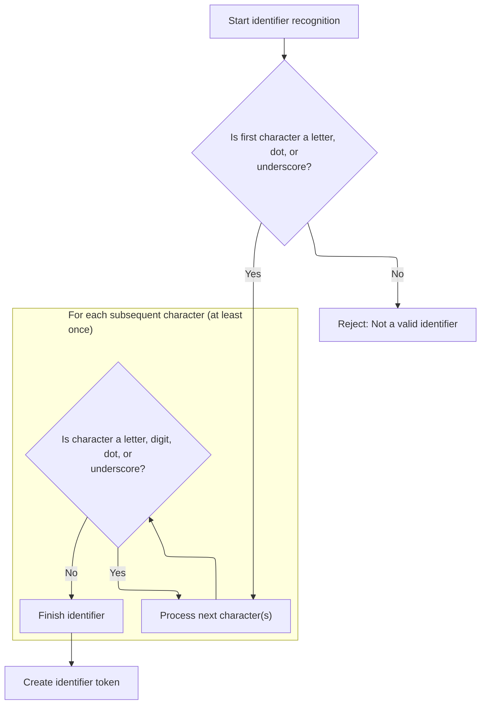
```mermaid
%%{init: {"flowchart": {"defaultRenderer": "elk"}} }%%
flowchart TD
    node1["Start identifier recognition"]
    click node1 openCode "core/src/main/java/org/apache/struts/validator/validwhen/ValidWhenLexer.java:629:630"
    node1 --> node2{"Is first character a letter, dot, or
underscore?"}
    click node2 openCode "core/src/main/java/org/apache/struts/validator/validwhen/ValidWhenLexer.java:635:662"
    node2 -->|"Yes"| node3["Process next character(s)"]
    node2 -->|"No"| node6["Reject: Not a valid identifier"]
    click node6 openCode "core/src/main/java/org/apache/struts/validator/validwhen/ValidWhenLexer.java:659:660"
    
    subgraph loop1["For each subsequent character (at least
once)"]
      node3 --> node4{"Is character a letter, digit, dot, or
underscore?"}
      click node4 openCode "core/src/main/java/org/apache/struts/validator/validwhen/ValidWhenLexer.java:667:695"
      node4 -->|"Yes"| node3
      node4 -->|"No"| node5["Finish identifier"]
      click node5 openCode "core/src/main/java/org/apache/struts/validator/validwhen/ValidWhenLexer.java:698:702"
    end
    node5 --> node7["Create identifier token"]
    click node7 openCode "core/src/main/java/org/apache/struts/validator/validwhen/ValidWhenLexer.java:704:709"
classDef HeadingStyle fill:#777777,stroke:#333,stroke-width:2px;

%% Swimm:
%% %%{init: {"flowchart": {"defaultRenderer": "elk"}} }%%
%% flowchart TD
%%     node1["Start identifier recognition"]
%%     click node1 openCode "<SwmPath>[core/…/validwhen/ValidWhenLexer.java](core/src/main/java/org/apache/struts/validator/validwhen/ValidWhenLexer.java)</SwmPath>:629:630"
%%     node1 --> node2{"Is first character a letter, dot, or
%% underscore?"}
%%     click node2 openCode "<SwmPath>[core/…/validwhen/ValidWhenLexer.java](core/src/main/java/org/apache/struts/validator/validwhen/ValidWhenLexer.java)</SwmPath>:635:662"
%%     node2 -->|"Yes"| node3["Process next character(s)"]
%%     node2 -->|"No"| node6["Reject: Not a valid identifier"]
%%     click node6 openCode "<SwmPath>[core/…/validwhen/ValidWhenLexer.java](core/src/main/java/org/apache/struts/validator/validwhen/ValidWhenLexer.java)</SwmPath>:659:660"
%%     
%%     subgraph loop1["For each subsequent character (at least
%% once)"]
%%       node3 --> node4{"Is character a letter, digit, dot, or
%% underscore?"}
%%       click node4 openCode "<SwmPath>[core/…/validwhen/ValidWhenLexer.java](core/src/main/java/org/apache/struts/validator/validwhen/ValidWhenLexer.java)</SwmPath>:667:695"
%%       node4 -->|"Yes"| node3
%%       node4 -->|"No"| node5["Finish identifier"]
%%       click node5 openCode "<SwmPath>[core/…/validwhen/ValidWhenLexer.java](core/src/main/java/org/apache/struts/validator/validwhen/ValidWhenLexer.java)</SwmPath>:698:702"
%%     end
%%     node5 --> node7["Create identifier token"]
%%     click node7 openCode "<SwmPath>[core/…/validwhen/ValidWhenLexer.java](core/src/main/java/org/apache/struts/validator/validwhen/ValidWhenLexer.java)</SwmPath>:704:709"
%% classDef HeadingStyle fill:#777777,stroke:#333,stroke-width:2px;
```

<SwmSnippet path="/core/src/main/java/org/apache/struts/validator/validwhen/ValidWhenLexer.java" line="629">

---

In <SwmToken path="core/src/main/java/org/apache/struts/validator/validwhen/ValidWhenLexer.java" pos="629:7:7" line-data="	public final void mIDENTIFIER(boolean _createToken) throws RecognitionException, CharStreamException, TokenStreamException {">`mIDENTIFIER`</SwmToken>, we match letters, digits, '.', and '\_' to build up variable or field names. ActionConfigMatcher uses this token to connect rule logic to the right fields in the config.

```java
	public final void mIDENTIFIER(boolean _createToken) throws RecognitionException, CharStreamException, TokenStreamException {
		int _ttype; Token _token=null; int _begin=text.length();
		_ttype = IDENTIFIER;
		int _saveIndex;
		
		{
		switch ( LA(1)) {
		case 'a':  case 'b':  case 'c':  case 'd':
		case 'e':  case 'f':  case 'g':  case 'h':
		case 'i':  case 'j':  case 'k':  case 'l':
		case 'm':  case 'n':  case 'o':  case 'p':
		case 'q':  case 'r':  case 's':  case 't':
		case 'u':  case 'v':  case 'w':  case 'x':
		case 'y':  case 'z':
		{
			matchRange('a','z');
			break;
		}
		case '.':
		{
			match('.');
			break;
		}
		case '_':
		{
			match('_');
			break;
		}
		default:
		{
			throw new NoViableAltForCharException((char)LA(1), getFilename(), getLine(), getColumn());
		}
		}
		}
		{
		int _cnt62=0;
		_loop62:
		do {
			switch ( LA(1)) {
			case 'a':  case 'b':  case 'c':  case 'd':
			case 'e':  case 'f':  case 'g':  case 'h':
			case 'i':  case 'j':  case 'k':  case 'l':
			case 'm':  case 'n':  case 'o':  case 'p':
			case 'q':  case 'r':  case 's':  case 't':
			case 'u':  case 'v':  case 'w':  case 'x':
			case 'y':  case 'z':
			{
				matchRange('a','z');
				break;
			}
			case '0':  case '1':  case '2':  case '3':
			case '4':  case '5':  case '6':  case '7':
			case '8':  case '9':
			{
				matchRange('0','9');
				break;
			}
			case '.':
			{
				match('.');
				break;
			}
			case '_':
			{
				match('_');
				break;
			}
			default:
			{
				if ( _cnt62>=1 ) { break _loop62; } else {throw new NoViableAltForCharException((char)LA(1), getFilename(), getLine(), getColumn());}
			}
			}
			_cnt62++;
		} while (true);
		}
```

---

</SwmSnippet>

<SwmSnippet path="/core/src/main/java/org/apache/struts/validator/validwhen/ValidWhenLexer.java" line="704">

---

After ActionConfigMatcher uses the IDENTIFIER token, we create and return it if needed. If the token type is SKIP, nothing is returned, keeping the token stream clean for the parser.

```java
		if ( _createToken && _token==null && _ttype!=Token.SKIP ) {
			_token = makeToken(_ttype);
			_token.setText(new String(text.getBuffer(), _begin, text.length()-_begin));
		}
		_returnToken = _token;
	}
```

---

</SwmSnippet>

### Handling Equality Operators

<SwmSnippet path="/core/src/main/java/org/apache/struts/validator/validwhen/ValidWhenLexer.java" line="147">

---

After handling identifiers, we check for '=' and call <SwmToken path="core/src/main/java/org/apache/struts/validator/validwhen/ValidWhenLexer.java" pos="149:1:1" line-data="					mEQUALSIGN(true);">`mEQUALSIGN`</SwmToken> to tokenize the '==' operator. This is needed for rules that compare values, and we break after setting the return token.

```java
				case '=':
				{
					mEQUALSIGN(true);
					theRetToken=_returnToken;
					break;
				}
```

---

</SwmSnippet>

### Equality Operator Recognition

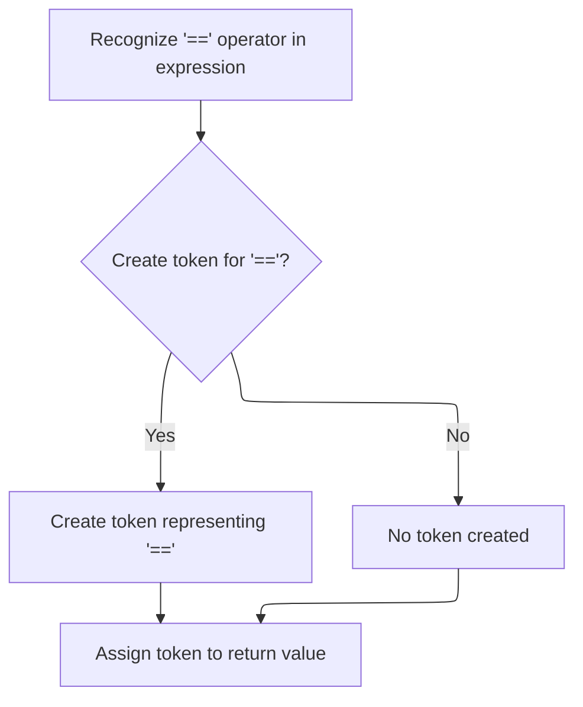
```mermaid
%%{init: {"flowchart": {"defaultRenderer": "elk"}} }%%
flowchart TD
    node1["Recognize '==' operator in expression"]
    click node1 openCode "core/src/main/java/org/apache/struts/validator/validwhen/ValidWhenLexer.java:711:717"
    node1 --> node2{"Create token for '=='?"}
    click node2 openCode "core/src/main/java/org/apache/struts/validator/validwhen/ValidWhenLexer.java:718:721"
    node2 -->|"Yes"| node3["Create token representing '=='"]
    click node3 openCode "core/src/main/java/org/apache/struts/validator/validwhen/ValidWhenLexer.java:719:720"
    node2 -->|"No"| node4["No token created"]
    click node4 openCode "core/src/main/java/org/apache/struts/validator/validwhen/ValidWhenLexer.java:721:723"
    node3 --> node5["Assign token to return value"]
    node4 --> node5
    click node5 openCode "core/src/main/java/org/apache/struts/validator/validwhen/ValidWhenLexer.java:722:723"

classDef HeadingStyle fill:#777777,stroke:#333,stroke-width:2px;

%% Swimm:
%% %%{init: {"flowchart": {"defaultRenderer": "elk"}} }%%
%% flowchart TD
%%     node1["Recognize '==' operator in expression"]
%%     click node1 openCode "<SwmPath>[core/…/validwhen/ValidWhenLexer.java](core/src/main/java/org/apache/struts/validator/validwhen/ValidWhenLexer.java)</SwmPath>:711:717"
%%     node1 --> node2{"Create token for '=='?"}
%%     click node2 openCode "<SwmPath>[core/…/validwhen/ValidWhenLexer.java](core/src/main/java/org/apache/struts/validator/validwhen/ValidWhenLexer.java)</SwmPath>:718:721"
%%     node2 -->|"Yes"| node3["Create token representing '=='"]
%%     click node3 openCode "<SwmPath>[core/…/validwhen/ValidWhenLexer.java](core/src/main/java/org/apache/struts/validator/validwhen/ValidWhenLexer.java)</SwmPath>:719:720"
%%     node2 -->|"No"| node4["No token created"]
%%     click node4 openCode "<SwmPath>[core/…/validwhen/ValidWhenLexer.java](core/src/main/java/org/apache/struts/validator/validwhen/ValidWhenLexer.java)</SwmPath>:721:723"
%%     node3 --> node5["Assign token to return value"]
%%     node4 --> node5
%%     click node5 openCode "<SwmPath>[core/…/validwhen/ValidWhenLexer.java](core/src/main/java/org/apache/struts/validator/validwhen/ValidWhenLexer.java)</SwmPath>:722:723"
%% 
%% classDef HeadingStyle fill:#777777,stroke:#333,stroke-width:2px;
```

<SwmSnippet path="/core/src/main/java/org/apache/struts/validator/validwhen/ValidWhenLexer.java" line="711">

---

In <SwmToken path="core/src/main/java/org/apache/struts/validator/validwhen/ValidWhenLexer.java" pos="711:7:7" line-data="	public final void mEQUALSIGN(boolean _createToken) throws RecognitionException, CharStreamException, TokenStreamException {">`mEQUALSIGN`</SwmToken>, we match '==' and set up the EQUALSIGN token. ActionConfigMatcher uses this to recognize equality checks in rule expressions.

```java
	public final void mEQUALSIGN(boolean _createToken) throws RecognitionException, CharStreamException, TokenStreamException {
		int _ttype; Token _token=null; int _begin=text.length();
		_ttype = EQUALSIGN;
		int _saveIndex;
		
		match('=');
		match('=');
```

---

</SwmSnippet>

<SwmSnippet path="/core/src/main/java/org/apache/struts/validator/validwhen/ValidWhenLexer.java" line="718">

---

After ActionConfigMatcher uses the EQUALSIGN token, we create and return it if needed. If the token type is SKIP, nothing is returned, keeping the token stream clean for the parser.

```java
		if ( _createToken && _token==null && _ttype!=Token.SKIP ) {
			_token = makeToken(_ttype);
			_token.setText(new String(text.getBuffer(), _begin, text.length()-_begin));
		}
		_returnToken = _token;
	}
```

---

</SwmSnippet>

### Handling Not-Equal Operators

<SwmSnippet path="/core/src/main/java/org/apache/struts/validator/validwhen/ValidWhenLexer.java" line="153">

---

After handling equality operators, we check for '!' and call <SwmToken path="core/src/main/java/org/apache/struts/validator/validwhen/ValidWhenLexer.java" pos="155:1:1" line-data="					mNOTEQUALSIGN(true);">`mNOTEQUALSIGN`</SwmToken> to tokenize the '!=' operator. This is needed for rules that check for inequality, and we break after setting the return token.

```java
				case '!':
				{
					mNOTEQUALSIGN(true);
					theRetToken=_returnToken;
					break;
				}
```

---

</SwmSnippet>

### Not-Equal Operator Recognition

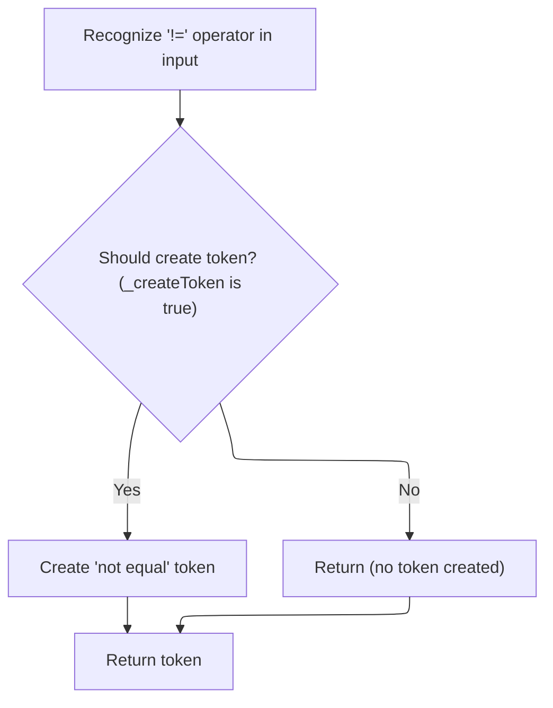
```mermaid
%%{init: {"flowchart": {"defaultRenderer": "elk"}} }%%
flowchart TD
  node1["Recognize '!=' operator in input"]
  click node1 openCode "core/src/main/java/org/apache/struts/validator/validwhen/ValidWhenLexer.java:730:731"
  node1 --> node2{"Should create token? (_createToken is
true)"}
  click node2 openCode "core/src/main/java/org/apache/struts/validator/validwhen/ValidWhenLexer.java:732:735"
  node2 -->|"Yes"| node3["Create 'not equal' token"]
  click node3 openCode "core/src/main/java/org/apache/struts/validator/validwhen/ValidWhenLexer.java:733:734"
  node2 -->|"No"| node4["Return (no token created)"]
  click node4 openCode "core/src/main/java/org/apache/struts/validator/validwhen/ValidWhenLexer.java:735:737"
  node3 --> node5["Return token"]
  node4 --> node5
  click node5 openCode "core/src/main/java/org/apache/struts/validator/validwhen/ValidWhenLexer.java:736:737"
classDef HeadingStyle fill:#777777,stroke:#333,stroke-width:2px;

%% Swimm:
%% %%{init: {"flowchart": {"defaultRenderer": "elk"}} }%%
%% flowchart TD
%%   node1["Recognize '!=' operator in input"]
%%   click node1 openCode "<SwmPath>[core/…/validwhen/ValidWhenLexer.java](core/src/main/java/org/apache/struts/validator/validwhen/ValidWhenLexer.java)</SwmPath>:730:731"
%%   node1 --> node2{"Should create token? (<SwmToken path="core/src/main/java/org/apache/struts/validator/validwhen/ValidWhenLexer.java" pos="250:11:11" line-data="	public final void mDECIMAL_LITERAL(boolean _createToken) throws RecognitionException, CharStreamException, TokenStreamException {">`_createToken`</SwmToken> is
%% true)"}
%%   click node2 openCode "<SwmPath>[core/…/validwhen/ValidWhenLexer.java](core/src/main/java/org/apache/struts/validator/validwhen/ValidWhenLexer.java)</SwmPath>:732:735"
%%   node2 -->|"Yes"| node3["Create 'not equal' token"]
%%   click node3 openCode "<SwmPath>[core/…/validwhen/ValidWhenLexer.java](core/src/main/java/org/apache/struts/validator/validwhen/ValidWhenLexer.java)</SwmPath>:733:734"
%%   node2 -->|"No"| node4["Return (no token created)"]
%%   click node4 openCode "<SwmPath>[core/…/validwhen/ValidWhenLexer.java](core/src/main/java/org/apache/struts/validator/validwhen/ValidWhenLexer.java)</SwmPath>:735:737"
%%   node3 --> node5["Return token"]
%%   node4 --> node5
%%   click node5 openCode "<SwmPath>[core/…/validwhen/ValidWhenLexer.java](core/src/main/java/org/apache/struts/validator/validwhen/ValidWhenLexer.java)</SwmPath>:736:737"
%% classDef HeadingStyle fill:#777777,stroke:#333,stroke-width:2px;
```

<SwmSnippet path="/core/src/main/java/org/apache/struts/validator/validwhen/ValidWhenLexer.java" line="725">

---

In <SwmToken path="core/src/main/java/org/apache/struts/validator/validwhen/ValidWhenLexer.java" pos="725:7:7" line-data="	public final void mNOTEQUALSIGN(boolean _createToken) throws RecognitionException, CharStreamException, TokenStreamException {">`mNOTEQUALSIGN`</SwmToken>, we match '!=' and set up the NOTEQUALSIGN token. ActionConfigMatcher uses this to recognize not-equal checks in rule expressions.

```java
	public final void mNOTEQUALSIGN(boolean _createToken) throws RecognitionException, CharStreamException, TokenStreamException {
		int _ttype; Token _token=null; int _begin=text.length();
		_ttype = NOTEQUALSIGN;
		int _saveIndex;
		
		match('!');
		match('=');
```

---

</SwmSnippet>

<SwmSnippet path="/core/src/main/java/org/apache/struts/validator/validwhen/ValidWhenLexer.java" line="732">

---

After ActionConfigMatcher uses the NOTEQUALSIGN token, we create and return it if needed. If the token type is SKIP, nothing is returned, keeping the token stream clean for the parser.

```java
		if ( _createToken && _token==null && _ttype!=Token.SKIP ) {
			_token = makeToken(_ttype);
			_token.setText(new String(text.getBuffer(), _begin, text.length()-_begin));
		}
		_returnToken = _token;
	}
```

---

</SwmSnippet>

### Handling Less-Than-Or-Equal Operators

<SwmSnippet path="/core/src/main/java/org/apache/struts/validator/validwhen/ValidWhenLexer.java" line="159">

---

After handling not-equal operators, we check for '<=' and call <SwmToken path="core/src/main/java/org/apache/struts/validator/validwhen/ValidWhenLexer.java" pos="161:1:1" line-data="						mLESSEQUALSIGN(true);">`mLESSEQUALSIGN`</SwmToken> to tokenize the less-than-or-equal operator. This is needed for rules that compare values, and we break after setting the return token.

```java
				default:
					if ((LA(1)=='<') && (LA(2)=='=')) {
						mLESSEQUALSIGN(true);
```

---

</SwmSnippet>

### Less-Than-Or-Equal Operator Recognition

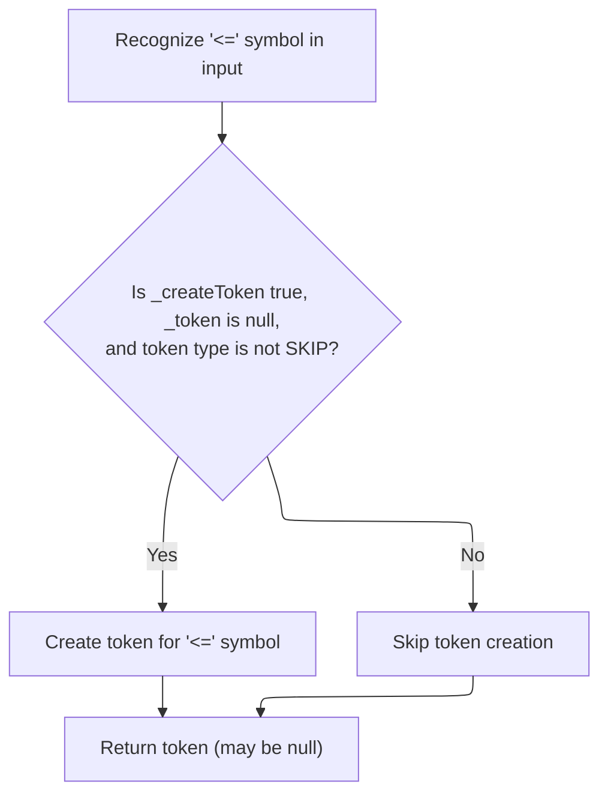
```mermaid
%%{init: {"flowchart": {"defaultRenderer": "elk"}} }%%
flowchart TD
  node1["Recognize '<=' symbol in input"]
  click node1 openCode "core/src/main/java/org/apache/struts/validator/validwhen/ValidWhenLexer.java:770:771"
  node1 --> node2{"Is _createToken true, _token is null,
and token type is not SKIP?"}
  click node2 openCode "core/src/main/java/org/apache/struts/validator/validwhen/ValidWhenLexer.java:772:775"
  node2 -->|"Yes"| node3["Create token for '<=' symbol"]
  click node3 openCode "core/src/main/java/org/apache/struts/validator/validwhen/ValidWhenLexer.java:773:774"
  node2 -->|"No"| node4["Skip token creation"]
  click node4 openCode "core/src/main/java/org/apache/struts/validator/validwhen/ValidWhenLexer.java:772:775"
  node3 --> node5["Return token (may be null)"]
  node4 --> node5
  click node5 openCode "core/src/main/java/org/apache/struts/validator/validwhen/ValidWhenLexer.java:776:777"
classDef HeadingStyle fill:#777777,stroke:#333,stroke-width:2px;

%% Swimm:
%% %%{init: {"flowchart": {"defaultRenderer": "elk"}} }%%
%% flowchart TD
%%   node1["Recognize '<=' symbol in input"]
%%   click node1 openCode "<SwmPath>[core/…/validwhen/ValidWhenLexer.java](core/src/main/java/org/apache/struts/validator/validwhen/ValidWhenLexer.java)</SwmPath>:770:771"
%%   node1 --> node2{"Is <SwmToken path="core/src/main/java/org/apache/struts/validator/validwhen/ValidWhenLexer.java" pos="250:11:11" line-data="	public final void mDECIMAL_LITERAL(boolean _createToken) throws RecognitionException, CharStreamException, TokenStreamException {">`_createToken`</SwmToken> true, _token is null,
%% and token type is not SKIP?"}
%%   click node2 openCode "<SwmPath>[core/…/validwhen/ValidWhenLexer.java](core/src/main/java/org/apache/struts/validator/validwhen/ValidWhenLexer.java)</SwmPath>:772:775"
%%   node2 -->|"Yes"| node3["Create token for '<=' symbol"]
%%   click node3 openCode "<SwmPath>[core/…/validwhen/ValidWhenLexer.java](core/src/main/java/org/apache/struts/validator/validwhen/ValidWhenLexer.java)</SwmPath>:773:774"
%%   node2 -->|"No"| node4["Skip token creation"]
%%   click node4 openCode "<SwmPath>[core/…/validwhen/ValidWhenLexer.java](core/src/main/java/org/apache/struts/validator/validwhen/ValidWhenLexer.java)</SwmPath>:772:775"
%%   node3 --> node5["Return token (may be null)"]
%%   node4 --> node5
%%   click node5 openCode "<SwmPath>[core/…/validwhen/ValidWhenLexer.java](core/src/main/java/org/apache/struts/validator/validwhen/ValidWhenLexer.java)</SwmPath>:776:777"
%% classDef HeadingStyle fill:#777777,stroke:#333,stroke-width:2px;
```

<SwmSnippet path="/core/src/main/java/org/apache/struts/validator/validwhen/ValidWhenLexer.java" line="765">

---

In <SwmToken path="core/src/main/java/org/apache/struts/validator/validwhen/ValidWhenLexer.java" pos="765:7:7" line-data="	public final void mLESSEQUALSIGN(boolean _createToken) throws RecognitionException, CharStreamException, TokenStreamException {">`mLESSEQUALSIGN`</SwmToken>, we match '<=' and set up the LESSEQUALSIGN token. ActionConfigMatcher uses this to recognize less-than-or-equal checks in rule expressions.

```java
	public final void mLESSEQUALSIGN(boolean _createToken) throws RecognitionException, CharStreamException, TokenStreamException {
		int _ttype; Token _token=null; int _begin=text.length();
		_ttype = LESSEQUALSIGN;
		int _saveIndex;
		
		match('<');
		match('=');
```

---

</SwmSnippet>

<SwmSnippet path="/core/src/main/java/org/apache/struts/validator/validwhen/ValidWhenLexer.java" line="772">

---

After ActionConfigMatcher uses the LESSEQUALSIGN token, we create and return it if needed. If the token type is SKIP, nothing is returned, keeping the token stream clean for the parser.

```java
		if ( _createToken && _token==null && _ttype!=Token.SKIP ) {
			_token = makeToken(_ttype);
			_token.setText(new String(text.getBuffer(), _begin, text.length()-_begin));
		}
		_returnToken = _token;
	}
```

---

</SwmSnippet>

### Handling Greater-Than-Or-Equal Operators

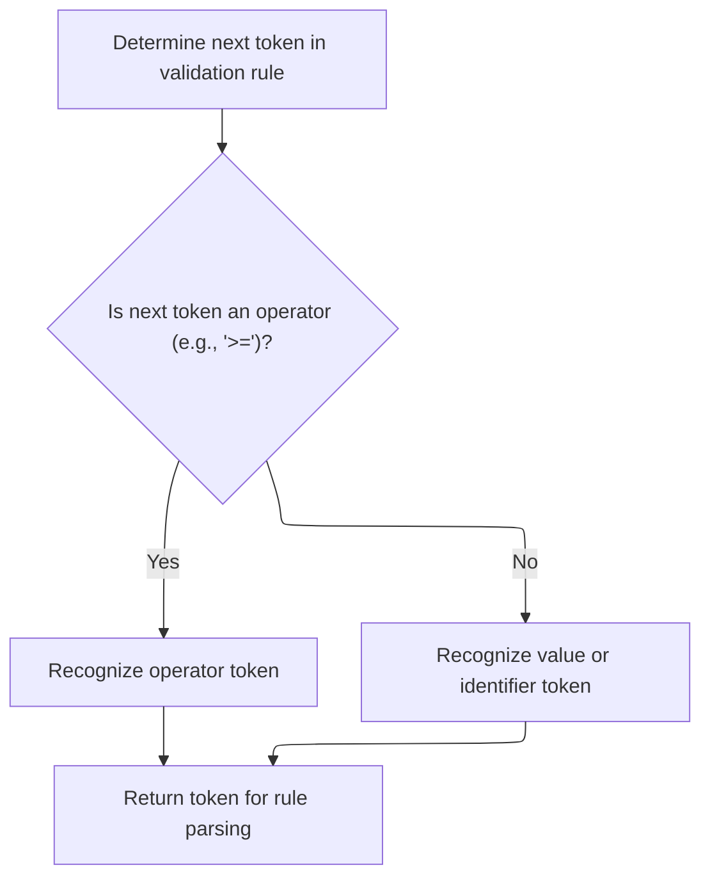
```mermaid
%%{init: {"flowchart": {"defaultRenderer": "elk"}} }%%
flowchart TD
  node1["Determine next token in validation rule"] --> node2{"Is next token an operator (e.g., '>=')?"}
  click node1 openCode "core/src/main/java/org/apache/struts/validator/validwhen/ValidWhenLexer.java:162:165"
  node2 -->|"Yes"| node3["Recognize operator token"]
  click node2 openCode "core/src/main/java/org/apache/struts/validator/validwhen/ValidWhenLexer.java:164:165"
  node2 -->|"No"| node4["Recognize value or identifier token"]
  click node3 openCode "core/src/main/java/org/apache/struts/validator/validwhen/ValidWhenLexer.java:164:165"
  click node4 openCode "core/src/main/java/org/apache/struts/validator/validwhen/ValidWhenLexer.java:162:163"
  node3 --> node5["Return token for rule parsing"]
  node4 --> node5
  click node5 openCode "core/src/main/java/org/apache/struts/validator/validwhen/ValidWhenLexer.java:162:165"

classDef HeadingStyle fill:#777777,stroke:#333,stroke-width:2px;

%% Swimm:
%% %%{init: {"flowchart": {"defaultRenderer": "elk"}} }%%
%% flowchart TD
%%   node1["Determine next token in validation rule"] --> node2{"Is next token an operator (e.g., '>=')?"}
%%   click node1 openCode "<SwmPath>[core/…/validwhen/ValidWhenLexer.java](core/src/main/java/org/apache/struts/validator/validwhen/ValidWhenLexer.java)</SwmPath>:162:165"
%%   node2 -->|"Yes"| node3["Recognize operator token"]
%%   click node2 openCode "<SwmPath>[core/…/validwhen/ValidWhenLexer.java](core/src/main/java/org/apache/struts/validator/validwhen/ValidWhenLexer.java)</SwmPath>:164:165"
%%   node2 -->|"No"| node4["Recognize value or identifier token"]
%%   click node3 openCode "<SwmPath>[core/…/validwhen/ValidWhenLexer.java](core/src/main/java/org/apache/struts/validator/validwhen/ValidWhenLexer.java)</SwmPath>:164:165"
%%   click node4 openCode "<SwmPath>[core/…/validwhen/ValidWhenLexer.java](core/src/main/java/org/apache/struts/validator/validwhen/ValidWhenLexer.java)</SwmPath>:162:163"
%%   node3 --> node5["Return token for rule parsing"]
%%   node4 --> node5
%%   click node5 openCode "<SwmPath>[core/…/validwhen/ValidWhenLexer.java](core/src/main/java/org/apache/struts/validator/validwhen/ValidWhenLexer.java)</SwmPath>:162:165"
%% 
%% classDef HeadingStyle fill:#777777,stroke:#333,stroke-width:2px;
```

<SwmSnippet path="/core/src/main/java/org/apache/struts/validator/validwhen/ValidWhenLexer.java" line="162">

---

After handling less-than-or-equal operators, we check for '>=' and call <SwmToken path="core/src/main/java/org/apache/struts/validator/validwhen/ValidWhenLexer.java" pos="165:1:1" line-data="						mGREATEREQUALSIGN(true);">`mGREATEREQUALSIGN`</SwmToken> to tokenize the greater-than-or-equal operator. This is needed for rules that compare values, and we break after setting the return token.

```java
						theRetToken=_returnToken;
					}
					else if ((LA(1)=='>') && (LA(2)=='=')) {
						mGREATEREQUALSIGN(true);
```

---

</SwmSnippet>

### Greater-Than-Or-Equal Operator Recognition

<SwmSnippet path="/core/src/main/java/org/apache/struts/validator/validwhen/ValidWhenLexer.java" line="779">

---

In <SwmToken path="core/src/main/java/org/apache/struts/validator/validwhen/ValidWhenLexer.java" pos="779:7:7" line-data="	public final void mGREATEREQUALSIGN(boolean _createToken) throws RecognitionException, CharStreamException, TokenStreamException {">`mGREATEREQUALSIGN`</SwmToken>, we match '>=' and set up the GREATEREQUALSIGN token. ActionConfigMatcher uses this to recognize greater-than-or-equal checks in rule expressions.

```java
	public final void mGREATEREQUALSIGN(boolean _createToken) throws RecognitionException, CharStreamException, TokenStreamException {
		int _ttype; Token _token=null; int _begin=text.length();
		_ttype = GREATEREQUALSIGN;
		int _saveIndex;
		
		match('>');
		match('=');
```

---

</SwmSnippet>

<SwmSnippet path="/core/src/main/java/org/apache/struts/validator/validwhen/ValidWhenLexer.java" line="786">

---

After ActionConfigMatcher uses the GREATEREQUALSIGN token, we create and return it if needed. If the token type is SKIP, nothing is returned, keeping the token stream clean for the parser.

```java
		if ( _createToken && _token==null && _ttype!=Token.SKIP ) {
			_token = makeToken(_ttype);
			_token.setText(new String(text.getBuffer(), _begin, text.length()-_begin));
		}
		_returnToken = _token;
	}
```

---

</SwmSnippet>

### Handling Less-Than Operators

<SwmSnippet path="/core/src/main/java/org/apache/struts/validator/validwhen/ValidWhenLexer.java" line="166">

---

After handling greater-than-or-equal operators, we check for '<' and call <SwmToken path="core/src/main/java/org/apache/struts/validator/validwhen/ValidWhenLexer.java" pos="169:1:1" line-data="						mLESSTHANSIGN(true);">`mLESSTHANSIGN`</SwmToken> to tokenize the less-than operator. This is needed for rules that compare values, and we break after setting the return token.

```java
						theRetToken=_returnToken;
					}
					else if ((LA(1)=='<') && (true)) {
						mLESSTHANSIGN(true);
```

---

</SwmSnippet>

### Less-Than Operator Recognition

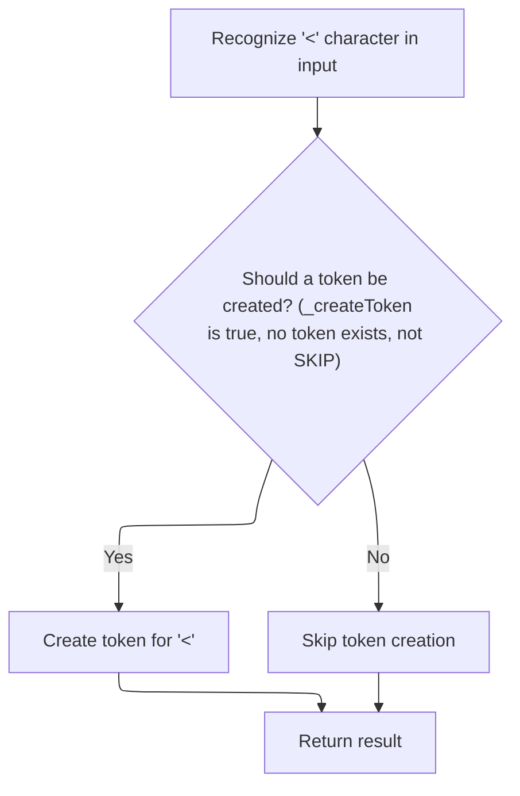
```mermaid
%%{init: {"flowchart": {"defaultRenderer": "elk"}} }%%
flowchart TD
    node1["Recognize '<' character in input"]
    click node1 openCode "core/src/main/java/org/apache/struts/validator/validwhen/ValidWhenLexer.java:744:744"
    node1 --> node2{"Should a token be created? (_createToken
is true, no token exists, not SKIP)"}
    click node2 openCode "core/src/main/java/org/apache/struts/validator/validwhen/ValidWhenLexer.java:745:748"
    node2 -->|"Yes"| node3["Create token for '<'"]
    click node3 openCode "core/src/main/java/org/apache/struts/validator/validwhen/ValidWhenLexer.java:746:747"
    node2 -->|"No"| node4["Skip token creation"]
    click node4 openCode "core/src/main/java/org/apache/struts/validator/validwhen/ValidWhenLexer.java:745:748"
    node3 --> node5["Return result"]
    node4 --> node5
    click node5 openCode "core/src/main/java/org/apache/struts/validator/validwhen/ValidWhenLexer.java:749:750"

classDef HeadingStyle fill:#777777,stroke:#333,stroke-width:2px;

%% Swimm:
%% %%{init: {"flowchart": {"defaultRenderer": "elk"}} }%%
%% flowchart TD
%%     node1["Recognize '<' character in input"]
%%     click node1 openCode "<SwmPath>[core/…/validwhen/ValidWhenLexer.java](core/src/main/java/org/apache/struts/validator/validwhen/ValidWhenLexer.java)</SwmPath>:744:744"
%%     node1 --> node2{"Should a token be created? (<SwmToken path="core/src/main/java/org/apache/struts/validator/validwhen/ValidWhenLexer.java" pos="250:11:11" line-data="	public final void mDECIMAL_LITERAL(boolean _createToken) throws RecognitionException, CharStreamException, TokenStreamException {">`_createToken`</SwmToken>
%% is true, no token exists, not SKIP)"}
%%     click node2 openCode "<SwmPath>[core/…/validwhen/ValidWhenLexer.java](core/src/main/java/org/apache/struts/validator/validwhen/ValidWhenLexer.java)</SwmPath>:745:748"
%%     node2 -->|"Yes"| node3["Create token for '<'"]
%%     click node3 openCode "<SwmPath>[core/…/validwhen/ValidWhenLexer.java](core/src/main/java/org/apache/struts/validator/validwhen/ValidWhenLexer.java)</SwmPath>:746:747"
%%     node2 -->|"No"| node4["Skip token creation"]
%%     click node4 openCode "<SwmPath>[core/…/validwhen/ValidWhenLexer.java](core/src/main/java/org/apache/struts/validator/validwhen/ValidWhenLexer.java)</SwmPath>:745:748"
%%     node3 --> node5["Return result"]
%%     node4 --> node5
%%     click node5 openCode "<SwmPath>[core/…/validwhen/ValidWhenLexer.java](core/src/main/java/org/apache/struts/validator/validwhen/ValidWhenLexer.java)</SwmPath>:749:750"
%% 
%% classDef HeadingStyle fill:#777777,stroke:#333,stroke-width:2px;
```

<SwmSnippet path="/core/src/main/java/org/apache/struts/validator/validwhen/ValidWhenLexer.java" line="739">

---

In <SwmToken path="core/src/main/java/org/apache/struts/validator/validwhen/ValidWhenLexer.java" pos="739:7:7" line-data="	public final void mLESSTHANSIGN(boolean _createToken) throws RecognitionException, CharStreamException, TokenStreamException {">`mLESSTHANSIGN`</SwmToken>, we match '<' and set up the LESSTHANSIGN token. ActionConfigMatcher uses this to recognize less-than checks in rule expressions.

```java
	public final void mLESSTHANSIGN(boolean _createToken) throws RecognitionException, CharStreamException, TokenStreamException {
		int _ttype; Token _token=null; int _begin=text.length();
		_ttype = LESSTHANSIGN;
		int _saveIndex;
		
		match('<');
```

---

</SwmSnippet>

<SwmSnippet path="/core/src/main/java/org/apache/struts/validator/validwhen/ValidWhenLexer.java" line="745">

---

After ActionConfigMatcher uses the LESSTHANSIGN token, we create and return it if needed. If the token type is SKIP, nothing is returned, keeping the token stream clean for the parser.

```java
		if ( _createToken && _token==null && _ttype!=Token.SKIP ) {
			_token = makeToken(_ttype);
			_token.setText(new String(text.getBuffer(), _begin, text.length()-_begin));
		}
		_returnToken = _token;
	}
```

---

</SwmSnippet>

### Handling Greater-Than Tokenization

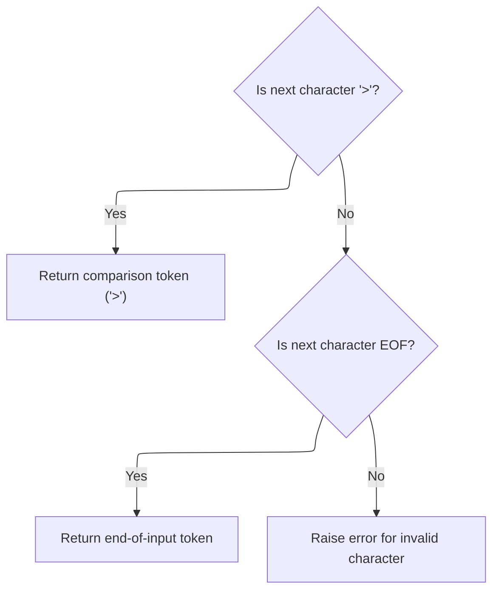
```mermaid
%%{init: {"flowchart": {"defaultRenderer": "elk"}} }%%
flowchart TD
    node1{"Is next character '>'?"}
    click node1 openCode "core/src/main/java/org/apache/struts/validator/validwhen/ValidWhenLexer.java:172:175"
    node1 -->|"Yes"| node2["Return comparison token ('>')"]
    click node2 openCode "core/src/main/java/org/apache/struts/validator/validwhen/ValidWhenLexer.java:173:174"
    node1 -->|"No"| node3{"Is next character EOF?"}
    click node3 openCode "core/src/main/java/org/apache/struts/validator/validwhen/ValidWhenLexer.java:176:180"
    node3 -->|"Yes"| node4["Return end-of-input token"]
    click node4 openCode "core/src/main/java/org/apache/struts/validator/validwhen/ValidWhenLexer.java:177:177"
    node3 -->|"No"| node5["Raise error for invalid character"]
    click node5 openCode "core/src/main/java/org/apache/struts/validator/validwhen/ValidWhenLexer.java:178:178"

classDef HeadingStyle fill:#777777,stroke:#333,stroke-width:2px;

%% Swimm:
%% %%{init: {"flowchart": {"defaultRenderer": "elk"}} }%%
%% flowchart TD
%%     node1{"Is next character '>'?"}
%%     click node1 openCode "<SwmPath>[core/…/validwhen/ValidWhenLexer.java](core/src/main/java/org/apache/struts/validator/validwhen/ValidWhenLexer.java)</SwmPath>:172:175"
%%     node1 -->|"Yes"| node2["Return comparison token ('>')"]
%%     click node2 openCode "<SwmPath>[core/…/validwhen/ValidWhenLexer.java](core/src/main/java/org/apache/struts/validator/validwhen/ValidWhenLexer.java)</SwmPath>:173:174"
%%     node1 -->|"No"| node3{"Is next character EOF?"}
%%     click node3 openCode "<SwmPath>[core/…/validwhen/ValidWhenLexer.java](core/src/main/java/org/apache/struts/validator/validwhen/ValidWhenLexer.java)</SwmPath>:176:180"
%%     node3 -->|"Yes"| node4["Return end-of-input token"]
%%     click node4 openCode "<SwmPath>[core/…/validwhen/ValidWhenLexer.java](core/src/main/java/org/apache/struts/validator/validwhen/ValidWhenLexer.java)</SwmPath>:177:177"
%%     node3 -->|"No"| node5["Raise error for invalid character"]
%%     click node5 openCode "<SwmPath>[core/…/validwhen/ValidWhenLexer.java](core/src/main/java/org/apache/struts/validator/validwhen/ValidWhenLexer.java)</SwmPath>:178:178"
%% 
%% classDef HeadingStyle fill:#777777,stroke:#333,stroke-width:2px;
```

<SwmSnippet path="/core/src/main/java/org/apache/struts/validator/validwhen/ValidWhenLexer.java" line="170">

---

After coming back from <SwmToken path="core/src/main/java/org/apache/struts/validator/validwhen/ValidWhenLexer.java" pos="169:1:1" line-data="						mLESSTHANSIGN(true);">`mLESSTHANSIGN`</SwmToken>, <SwmToken path="core/src/main/java/org/apache/struts/validator/ValidatorPlugIn.java" pos="219:9:9" line-data="                String validatorRules = st.nextToken().trim();">`nextToken`</SwmToken> checks for '>' and calls <SwmToken path="core/src/main/java/org/apache/struts/validator/validwhen/ValidWhenLexer.java" pos="173:1:1" line-data="						mGREATERTHANSIGN(true);">`mGREATERTHANSIGN`</SwmToken> if needed. If neither is found, we hit EOF or throw for unknown input, so only valid tokens get passed on for parsing.

```java
						theRetToken=_returnToken;
					}
					else if ((LA(1)=='>') && (true)) {
						mGREATERTHANSIGN(true);
						theRetToken=_returnToken;
					}
				else {
					if (LA(1)==EOF_CHAR) {uponEOF(); _returnToken = makeToken(Token.EOF_TYPE);}
				else {throw new NoViableAltForCharException((char)LA(1), getFilename(), getLine(), getColumn());}
				}
				}
```

---

</SwmSnippet>

### Recognizing Greater-Than Operator

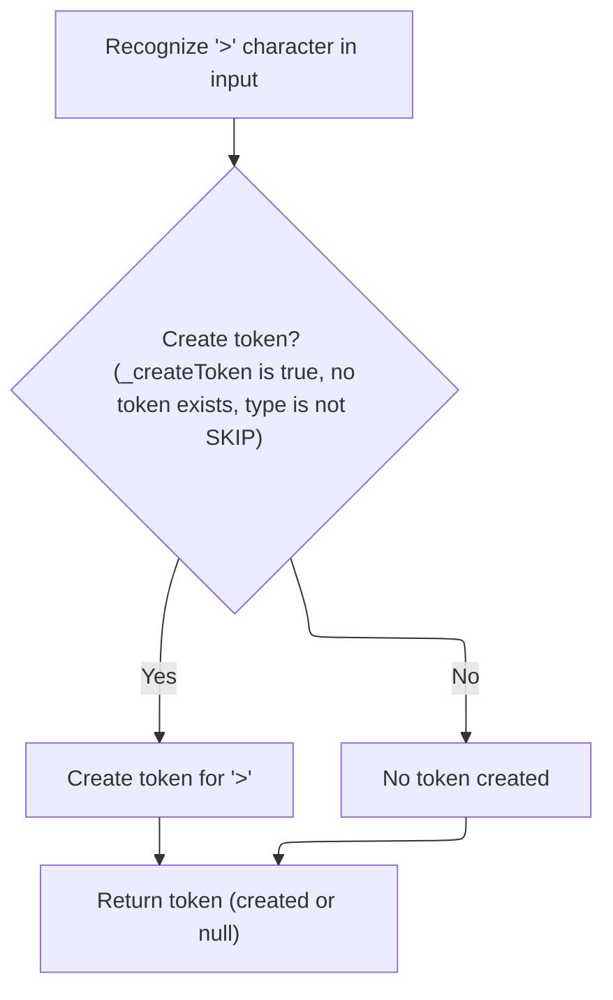
```mermaid
%%{init: {"flowchart": {"defaultRenderer": "elk"}} }%%
flowchart TD
  node1["Recognize '>' character in input"]
  click node1 openCode "core/src/main/java/org/apache/struts/validator/validwhen/ValidWhenLexer.java:757:757"
  node1 --> node2{"Create token? (_createToken is true, no
token exists, type is not SKIP)"}
  click node2 openCode "core/src/main/java/org/apache/struts/validator/validwhen/ValidWhenLexer.java:758:758"
  node2 -->|"Yes"| node3["Create token for '>'"]
  click node3 openCode "core/src/main/java/org/apache/struts/validator/validwhen/ValidWhenLexer.java:759:760"
  node2 -->|"No"| node4["No token created"]
  click node4 openCode "core/src/main/java/org/apache/struts/validator/validwhen/ValidWhenLexer.java:758:758"
  node3 --> node5["Return token (created or null)"]
  node4 --> node5
  click node5 openCode "core/src/main/java/org/apache/struts/validator/validwhen/ValidWhenLexer.java:762:763"
classDef HeadingStyle fill:#777777,stroke:#333,stroke-width:2px;

%% Swimm:
%% %%{init: {"flowchart": {"defaultRenderer": "elk"}} }%%
%% flowchart TD
%%   node1["Recognize '>' character in input"]
%%   click node1 openCode "<SwmPath>[core/…/validwhen/ValidWhenLexer.java](core/src/main/java/org/apache/struts/validator/validwhen/ValidWhenLexer.java)</SwmPath>:757:757"
%%   node1 --> node2{"Create token? (<SwmToken path="core/src/main/java/org/apache/struts/validator/validwhen/ValidWhenLexer.java" pos="250:11:11" line-data="	public final void mDECIMAL_LITERAL(boolean _createToken) throws RecognitionException, CharStreamException, TokenStreamException {">`_createToken`</SwmToken> is true, no
%% token exists, type is not SKIP)"}
%%   click node2 openCode "<SwmPath>[core/…/validwhen/ValidWhenLexer.java](core/src/main/java/org/apache/struts/validator/validwhen/ValidWhenLexer.java)</SwmPath>:758:758"
%%   node2 -->|"Yes"| node3["Create token for '>'"]
%%   click node3 openCode "<SwmPath>[core/…/validwhen/ValidWhenLexer.java](core/src/main/java/org/apache/struts/validator/validwhen/ValidWhenLexer.java)</SwmPath>:759:760"
%%   node2 -->|"No"| node4["No token created"]
%%   click node4 openCode "<SwmPath>[core/…/validwhen/ValidWhenLexer.java](core/src/main/java/org/apache/struts/validator/validwhen/ValidWhenLexer.java)</SwmPath>:758:758"
%%   node3 --> node5["Return token (created or null)"]
%%   node4 --> node5
%%   click node5 openCode "<SwmPath>[core/…/validwhen/ValidWhenLexer.java](core/src/main/java/org/apache/struts/validator/validwhen/ValidWhenLexer.java)</SwmPath>:762:763"
%% classDef HeadingStyle fill:#777777,stroke:#333,stroke-width:2px;
```

<SwmSnippet path="/core/src/main/java/org/apache/struts/validator/validwhen/ValidWhenLexer.java" line="752">

---

In <SwmToken path="core/src/main/java/org/apache/struts/validator/validwhen/ValidWhenLexer.java" pos="752:7:7" line-data="	public final void mGREATERTHANSIGN(boolean _createToken) throws RecognitionException, CharStreamException, TokenStreamException {">`mGREATERTHANSIGN`</SwmToken>, we match the '>' character and set up the GREATERTHANSIGN token. ActionConfigMatcher uses this token to spot greater-than checks in rule expressions, so it knows how to handle those comparisons.

```java
	public final void mGREATERTHANSIGN(boolean _createToken) throws RecognitionException, CharStreamException, TokenStreamException {
		int _ttype; Token _token=null; int _begin=text.length();
		_ttype = GREATERTHANSIGN;
		int _saveIndex;
		
		match('>');
```

---

</SwmSnippet>

<SwmSnippet path="/core/src/main/java/org/apache/struts/validator/validwhen/ValidWhenLexer.java" line="758">

---

After ActionConfigMatcher uses the GREATERTHANSIGN token, <SwmToken path="core/src/main/java/org/apache/struts/validator/validwhen/ValidWhenLexer.java" pos="173:1:1" line-data="						mGREATERTHANSIGN(true);">`mGREATERTHANSIGN`</SwmToken> creates and returns the token if it's not SKIP. This way, only relevant tokens are sent back to the parser, keeping things efficient.

```java
		if ( _createToken && _token==null && _ttype!=Token.SKIP ) {
			_token = makeToken(_ttype);
			_token.setText(new String(text.getBuffer(), _begin, text.length()-_begin));
		}
		_returnToken = _token;
	}
```

---

</SwmSnippet>

### Finalizing Token and Error Handling

<SwmSnippet path="/core/src/main/java/org/apache/struts/validator/validwhen/ValidWhenLexer.java" line="181">

---

Back in <SwmToken path="core/src/main/java/org/apache/struts/validator/ValidatorPlugIn.java" pos="219:9:9" line-data="                String validatorRules = st.nextToken().trim();">`nextToken`</SwmToken>, after <SwmToken path="core/src/main/java/org/apache/struts/validator/validwhen/ValidWhenLexer.java" pos="173:1:1" line-data="						mGREATERTHANSIGN(true);">`mGREATERTHANSIGN`</SwmToken>, we check if the token should be skipped, update its type using the literals table, and handle any exceptions. Only valid, non-skipped tokens are returned for parsing.

```java
				if ( _returnToken==null ) continue tryAgain; // found SKIP token
				_ttype = _returnToken.getType();
				_ttype = testLiteralsTable(_ttype);
				_returnToken.setType(_ttype);
				return _returnToken;
			}
			catch (RecognitionException e) {
				throw new TokenStreamRecognitionException(e);
			}
		}
		catch (CharStreamException cse) {
			if ( cse instanceof CharStreamIOException ) {
				throw new TokenStreamIOException(((CharStreamIOException)cse).io);
			}
			else {
				throw new TokenStreamException(cse.getMessage());
			}
		}
	}
}
```

---

</SwmSnippet>

## Locating Validation Rules Files

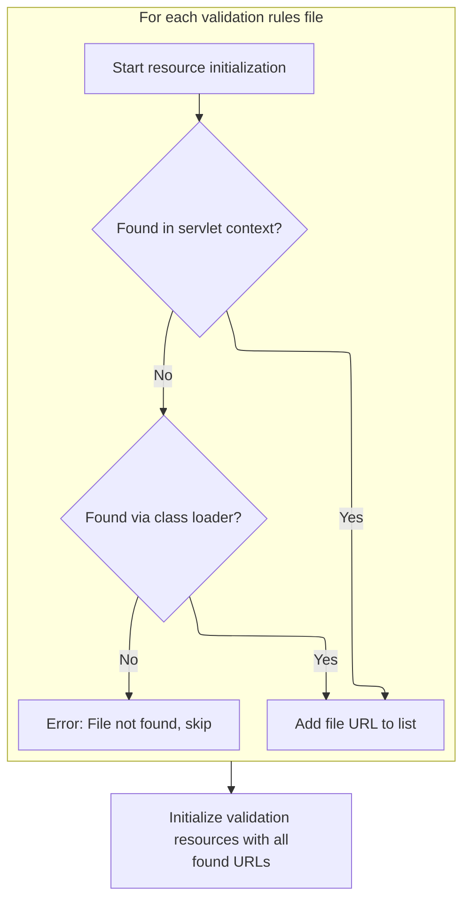
```mermaid
%%{init: {"flowchart": {"defaultRenderer": "elk"}} }%%
flowchart TD
    node1["Start resource initialization"]
    click node1 openCode "core/src/main/java/org/apache/struts/validator/ValidatorPlugIn.java:226:256"
    
    subgraph loop1["For each validation rules file"]
        node1 --> node2{"Found in servlet context?"}
        click node2 openCode "core/src/main/java/org/apache/struts/validator/ValidatorPlugIn.java:227:231"
        node2 -->|"Yes"| node3["Add file URL to list"]
        click node3 openCode "core/src/main/java/org/apache/struts/validator/ValidatorPlugIn.java:236:237"
        node2 -->|"No"| node4{"Found via class loader?"}
        click node4 openCode "core/src/main/java/org/apache/struts/validator/ValidatorPlugIn.java:232:233"
        node4 -->|"Yes"| node3
        node4 -->|"No"| node5["Error: File not found, skip"]
        click node5 openCode "core/src/main/java/org/apache/struts/validator/ValidatorPlugIn.java:238:241"
    end
    loop1 --> node6["Initialize validation resources with all
found URLs"]
    click node6 openCode "core/src/main/java/org/apache/struts/validator/ValidatorPlugIn.java:251:251"
classDef HeadingStyle fill:#777777,stroke:#333,stroke-width:2px;

%% Swimm:
%% %%{init: {"flowchart": {"defaultRenderer": "elk"}} }%%
%% flowchart TD
%%     node1["Start resource initialization"]
%%     click node1 openCode "<SwmPath>[core/…/validator/ValidatorPlugIn.java](core/src/main/java/org/apache/struts/validator/ValidatorPlugIn.java)</SwmPath>:226:256"
%%     
%%     subgraph loop1["For each validation rules file"]
%%         node1 --> node2{"Found in servlet context?"}
%%         click node2 openCode "<SwmPath>[core/…/validator/ValidatorPlugIn.java](core/src/main/java/org/apache/struts/validator/ValidatorPlugIn.java)</SwmPath>:227:231"
%%         node2 -->|"Yes"| node3["Add file URL to list"]
%%         click node3 openCode "<SwmPath>[core/…/validator/ValidatorPlugIn.java](core/src/main/java/org/apache/struts/validator/ValidatorPlugIn.java)</SwmPath>:236:237"
%%         node2 -->|"No"| node4{"Found via class loader?"}
%%         click node4 openCode "<SwmPath>[core/…/validator/ValidatorPlugIn.java](core/src/main/java/org/apache/struts/validator/ValidatorPlugIn.java)</SwmPath>:232:233"
%%         node4 -->|"Yes"| node3
%%         node4 -->|"No"| node5["Error: File not found, skip"]
%%         click node5 openCode "<SwmPath>[core/…/validator/ValidatorPlugIn.java](core/src/main/java/org/apache/struts/validator/ValidatorPlugIn.java)</SwmPath>:238:241"
%%     end
%%     loop1 --> node6["Initialize validation resources with all
%% found URLs"]
%%     click node6 openCode "<SwmPath>[core/…/validator/ValidatorPlugIn.java](core/src/main/java/org/apache/struts/validator/ValidatorPlugIn.java)</SwmPath>:251:251"
%% classDef HeadingStyle fill:#777777,stroke:#333,stroke-width:2px;
```

<SwmSnippet path="/core/src/main/java/org/apache/struts/validator/ValidatorPlugIn.java" line="226">

---

After <SwmToken path="core/src/main/java/org/apache/struts/validator/validwhen/ValidWhenLexer.java" pos="1:25:25" line-data="// $ANTLR 2.7.7 (20060906): &quot;ValidWhenParser.g&quot; -&gt; &quot;ValidWhenLexer.java&quot;$">`ValidWhenLexer`</SwmToken> finishes tokenizing, <SwmToken path="core/src/main/java/org/apache/struts/validator/ValidatorPlugIn.java" pos="174:3:3" line-data="            this.initResources();">`initResources`</SwmToken> tries to find each validator rules file in the servlet context, then falls back to the class loader if it's not there. Found files are added to the URL list for later parsing and validation setup.

```java
                URL input =
                    servlet.getServletContext().getResource(validatorRules);

                // If the config isn't in the servlet context, try the class
                // loader which allows the config files to be stored in a jar
                if (input == null) {
                    input = getClass().getResource(validatorRules);
                }

                if (input != null) {
                    urlList.add(input);
                } else {
                    throw new ServletException(
                        "Skipping validation rules file from '"
                        + validatorRules + "'.  No url could be located.");
                }
            }

            int urlSize = urlList.size();
            URL[] urlArray = new URL[urlSize];

            for (int urlIndex = 0; urlIndex < urlSize; urlIndex++) {
                urlArray[urlIndex] = (URL) urlList.get(urlIndex);
            }
```

---

</SwmSnippet>

<SwmSnippet path="/core/src/main/java/org/apache/struts/validator/ValidatorPlugIn.java" line="251">

---

InitResources returns a <SwmToken path="core/src/main/java/org/apache/struts/validator/ValidatorPlugIn.java" pos="251:9:9" line-data="            this.resources = new ValidatorResources(urlArray);">`ValidatorResources`</SwmToken> instance built from the URL array. If parsing fails, we log the error and throw, so broken configs don't get used and you know exactly what went wrong.

```java
            this.resources = new ValidatorResources(urlArray);
        } catch (SAXException sex) {
            log.error("Skipping all validation", sex);
            throw new ServletException(sex);
        }
    }
```

---

</SwmSnippet>

&nbsp;

*This is an auto-generated document by Swimm 🌊 and has not yet been verified by a human*

<SwmMeta version="3.0.0" repo-id="Z2l0aHViJTNBJTNBc3RydXRzMSUzQSUzQVN3aW1tLURlbW8=" repo-name="struts1"><sup>Powered by [Swimm](https://app.swimm.io/)</sup></SwmMeta>
