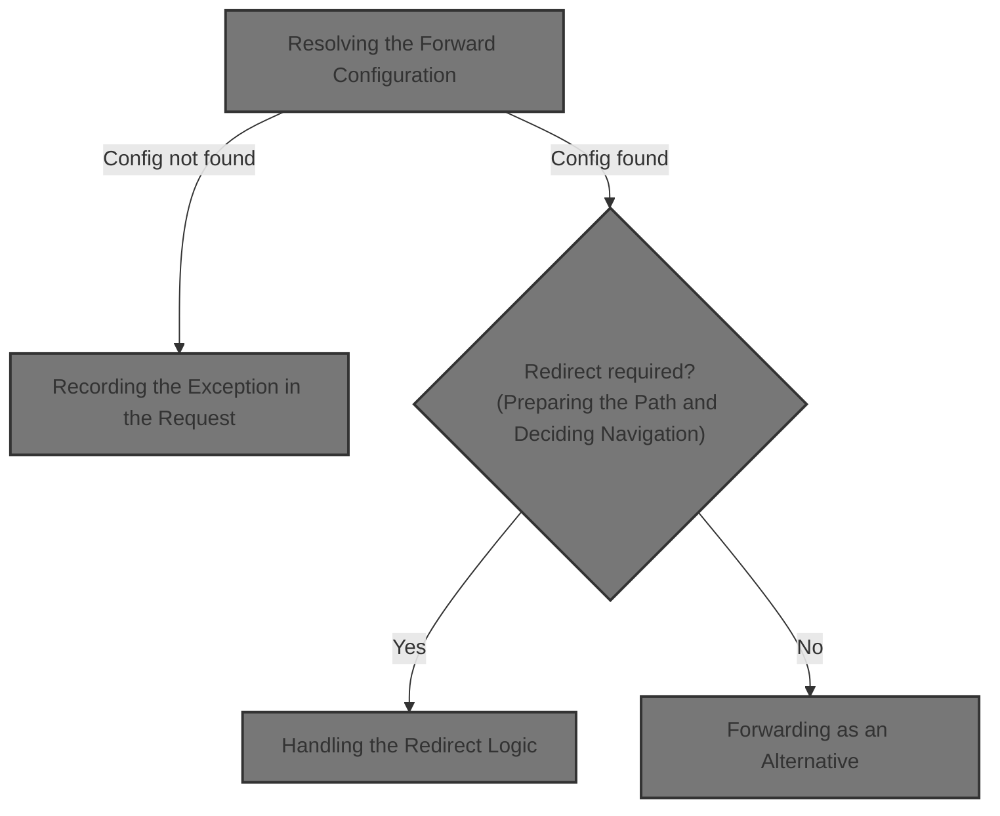
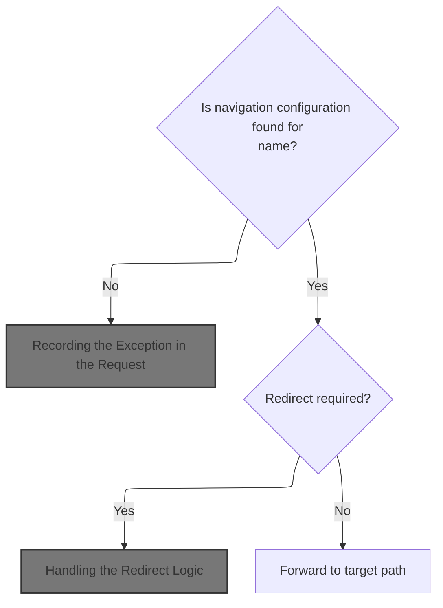
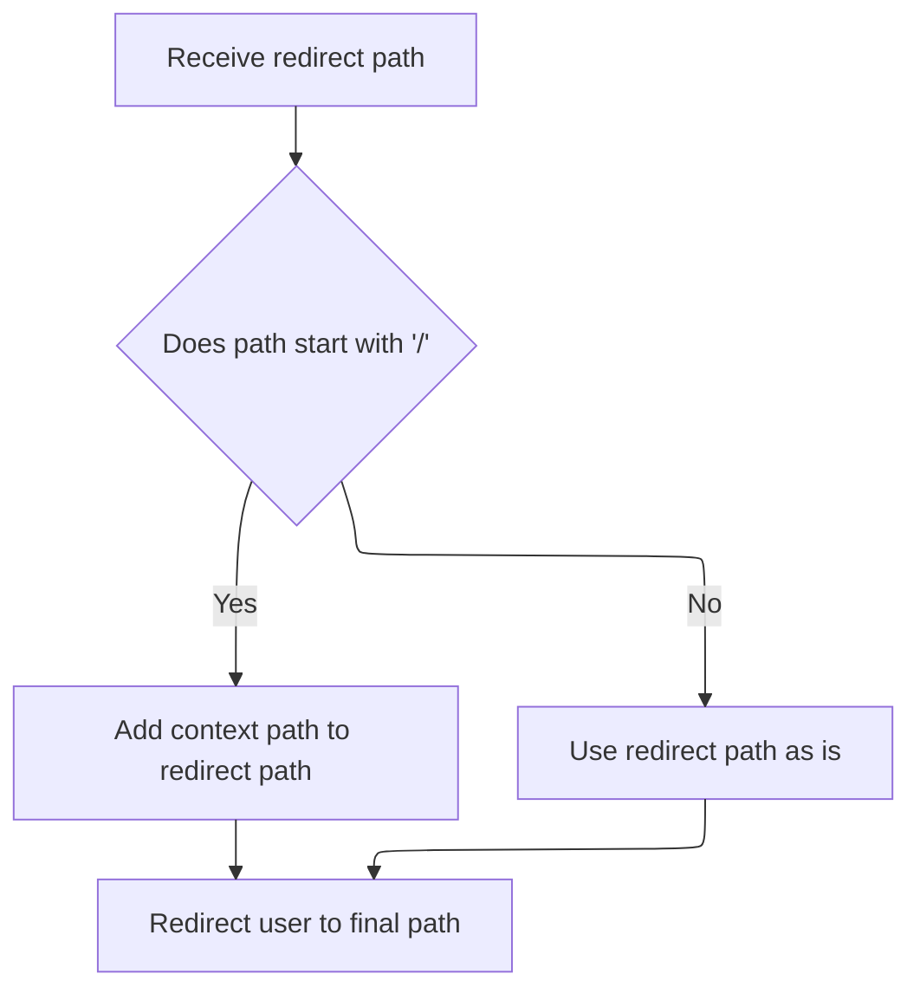
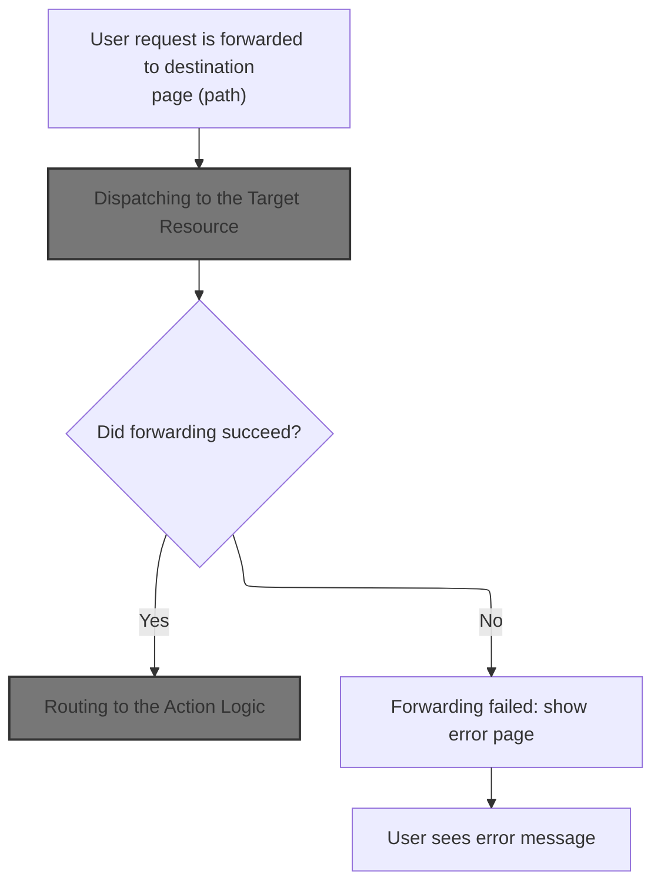
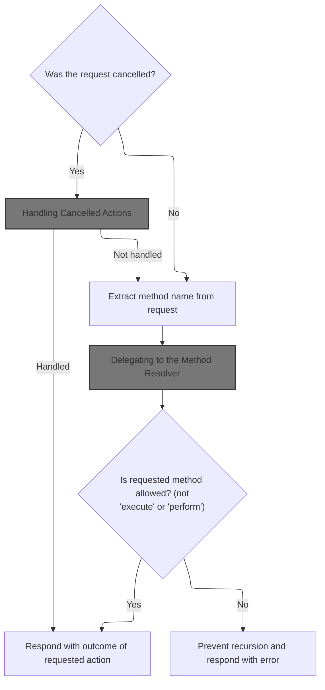
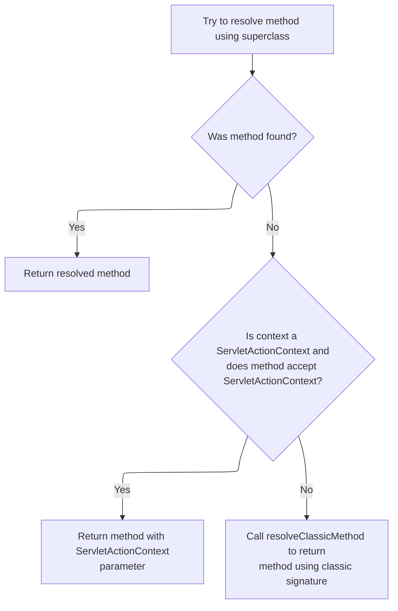
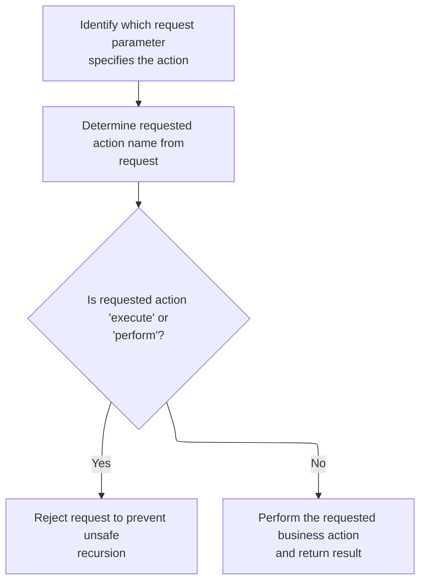

This document describes how navigation is managed in JSP pages using named configurations. When a navigation name is provided, the system looks up the configuration and either redirects or forwards the user to the appropriate resource. If the configuration is missing, an error is recorded for error handling. This enables dynamic navigation and routing to different actions or resources within the application.



# Resolving the Forward Configuration



<SwmSnippet path="/taglib/src/main/java/org/apache/struts/taglib/logic/ForwardTag.java" line="81">

---

In <SwmToken path="taglib/src/main/java/org/apache/struts/taglib/logic/ForwardTag.java" pos="81:5:5" line-data="    public int doEndTag() throws JspException {">`doEndTag`</SwmToken>, we look up the <SwmToken path="taglib/src/main/java/org/apache/struts/taglib/logic/ForwardTag.java" pos="82:11:11" line-data="        // Look up the desired ActionForward entry">`ActionForward`</SwmToken> using the 'name' from the module config. If it's missing, we throw a <SwmToken path="taglib/src/main/java/org/apache/struts/taglib/logic/ForwardTag.java" pos="81:11:11" line-data="    public int doEndTag() throws JspException {">`JspException`</SwmToken> and immediately save the exception using <SwmToken path="taglib/src/main/java/org/apache/struts/taglib/logic/ForwardTag.java" pos="85:1:1" line-data="            TagUtils.getInstance().getModuleConfig(pageContext);">`TagUtils`</SwmToken>. This is where we jump to <SwmToken path="taglib/src/main/java/org/apache/struts/taglib/logic/ForwardTag.java" pos="85:1:1" line-data="            TagUtils.getInstance().getModuleConfig(pageContext);">`TagUtils`</SwmToken> to handle the error reporting.

```java
    public int doEndTag() throws JspException {
        // Look up the desired ActionForward entry
        ActionForward forward = null;
        ModuleConfig config =
            TagUtils.getInstance().getModuleConfig(pageContext);

        if (config != null) {
            forward = (ActionForward) config.findForwardConfig(name);
        }

        if (forward == null) {
            JspException e =
                new JspException(messages.getMessage("forward.lookup", name));

            TagUtils.getInstance().saveException(pageContext, e);
            throw e;
        }

```

---

</SwmSnippet>

## Recording the Exception in the Request

<SwmSnippet path="/tiles/src/main/java/org/apache/struts/tiles/taglib/util/TagUtils.java" line="301">

---

<SwmToken path="tiles/src/main/java/org/apache/struts/tiles/taglib/util/TagUtils.java" pos="301:7:7" line-data="    public static void saveException(PageContext pageContext, Throwable exception) {">`saveException`</SwmToken> just puts the exception into the request scope so error handlers or error pages can pick it up for this request only.

```java
    public static void saveException(PageContext pageContext, Throwable exception) {
        pageContext.setAttribute(Globals.EXCEPTION_KEY, exception, PageContext.REQUEST_SCOPE);
    }
```

---

</SwmSnippet>

<SwmSnippet path="/tiles/src/main/java/org/apache/struts/tiles/taglib/util/TagUtils.java" line="290">

---

<SwmToken path="tiles/src/main/java/org/apache/struts/tiles/taglib/util/TagUtils.java" pos="290:7:7" line-data="    public static void setAttribute(PageContext pageContext, String name, Object beanValue)">`setAttribute`</SwmToken> just sets the given value in the request scope, assuming the inputs are valid. No scope flexibility here—it's always request.

```java
    public static void setAttribute(PageContext pageContext, String name, Object beanValue)
        throws JspException {
        pageContext.setAttribute(name, beanValue, PageContext.REQUEST_SCOPE);
    }
```

---

</SwmSnippet>

## Preparing the Path and Deciding Navigation

<SwmSnippet path="/taglib/src/main/java/org/apache/struts/taglib/logic/ForwardTag.java" line="99">

---

Back in <SwmToken path="taglib/src/main/java/org/apache/struts/taglib/logic/ForwardTag.java" pos="81:5:5" line-data="    public int doEndTag() throws JspException {">`doEndTag`</SwmToken>, after handling exceptions, we build the path by adding the module prefix. Then, based on the <SwmToken path="taglib/src/main/java/org/apache/struts/taglib/logic/ForwardTag.java" pos="82:11:11" line-data="        // Look up the desired ActionForward entry">`ActionForward`</SwmToken>'s redirect flag, we either call <SwmToken path="taglib/src/main/java/org/apache/struts/taglib/logic/ForwardTag.java" pos="105:3:3" line-data="            this.doRedirect(path);">`doRedirect`</SwmToken> or <SwmToken path="taglib/src/main/java/org/apache/struts/taglib/logic/ForwardTag.java" pos="107:3:3" line-data="            this.doForward(path);">`doForward`</SwmToken>. Redirect means we need to jump to <SwmToken path="taglib/src/main/java/org/apache/struts/taglib/logic/ForwardTag.java" pos="105:3:3" line-data="            this.doRedirect(path);">`doRedirect`</SwmToken> next.

```java
        // Forward or redirect to the corresponding actual path
        String path = forward.getPath();

        path = config.getPrefix() + path;

        if (forward.getRedirect()) {
            this.doRedirect(path);
        } else {
```

---

</SwmSnippet>

## Handling the Redirect Logic

<SwmSnippet path="/taglib/src/main/java/org/apache/struts/taglib/logic/ForwardTag.java" line="139">

---

In <SwmToken path="taglib/src/main/java/org/apache/struts/taglib/logic/ForwardTag.java" pos="139:5:5" line-data="    protected void doRedirect(String path)">`doRedirect`</SwmToken>, we grab the <SwmToken path="taglib/src/main/java/org/apache/struts/taglib/logic/ForwardTag.java" pos="141:1:1" line-data="        HttpServletRequest request =">`HttpServletRequest`</SwmToken> from the page context. Next, we need to use <SwmToken path="extras/src/main/java/org/apache/struts/actions/ActionDispatcher.java" pos="508:1:1" line-data="        ServletActionContext servletContext = (ServletActionContext) context;">`ServletActionContext`</SwmToken> to get the actual request object for building the redirect URL.

```java
    protected void doRedirect(String path)
        throws JspException {
        HttpServletRequest request =
            (HttpServletRequest) pageContext.getRequest();

```

---

</SwmSnippet>

### Accessing the Servlet Request

<SwmSnippet path="/core/src/main/java/org/apache/struts/chain/contexts/ServletActionContext.java" line="94">

---

<SwmToken path="core/src/main/java/org/apache/struts/chain/contexts/ServletActionContext.java" pos="94:5:5" line-data="    public HttpServletRequest getRequest() {">`getRequest`</SwmToken> just pulls the <SwmToken path="core/src/main/java/org/apache/struts/chain/contexts/ServletActionContext.java" pos="94:3:3" line-data="    public HttpServletRequest getRequest() {">`HttpServletRequest`</SwmToken> from the underlying <SwmToken path="core/src/main/java/org/apache/struts/chain/contexts/ServletActionContext.java" pos="67:3:3" line-data="    protected ServletWebContext servletWebContext() {">`ServletWebContext`</SwmToken>. We need this to interact with the servlet API for redirects.

```java
    public HttpServletRequest getRequest() {
        return servletWebContext().getRequest();
    }
```

---

</SwmSnippet>

<SwmSnippet path="/core/src/main/java/org/apache/struts/chain/contexts/ServletActionContext.java" line="67">

---

<SwmToken path="core/src/main/java/org/apache/struts/chain/contexts/ServletActionContext.java" pos="67:5:5" line-data="    protected ServletWebContext servletWebContext() {">`servletWebContext`</SwmToken> just casts the base context to <SwmToken path="core/src/main/java/org/apache/struts/chain/contexts/ServletActionContext.java" pos="67:3:3" line-data="    protected ServletWebContext servletWebContext() {">`ServletWebContext`</SwmToken>. If the type is wrong, things break—so the setup has to be right.

```java
    protected ServletWebContext servletWebContext() {
        return (ServletWebContext) this.getBaseContext();
    }
```

---

</SwmSnippet>

### Getting the Servlet Response



<SwmSnippet path="/taglib/src/main/java/org/apache/struts/taglib/logic/ForwardTag.java" line="144">

---

Back in <SwmToken path="taglib/src/main/java/org/apache/struts/taglib/logic/ForwardTag.java" pos="105:3:3" line-data="            this.doRedirect(path);">`doRedirect`</SwmToken>, after getting the request, we grab the <SwmToken path="taglib/src/main/java/org/apache/struts/taglib/logic/ForwardTag.java" pos="144:1:1" line-data="        HttpServletResponse response =">`HttpServletResponse`</SwmToken> from the page context. Next, we need to use <SwmToken path="extras/src/main/java/org/apache/struts/actions/ActionDispatcher.java" pos="508:1:1" line-data="        ServletActionContext servletContext = (ServletActionContext) context;">`ServletActionContext`</SwmToken> to get the actual response object for sending the redirect.

```java
        HttpServletResponse response =
            (HttpServletResponse) pageContext.getResponse();

```

---

</SwmSnippet>

<SwmSnippet path="/core/src/main/java/org/apache/struts/chain/contexts/ServletActionContext.java" line="103">

---

<SwmToken path="core/src/main/java/org/apache/struts/chain/contexts/ServletActionContext.java" pos="103:5:5" line-data="    public HttpServletResponse getResponse() {">`getResponse`</SwmToken> just pulls the <SwmToken path="core/src/main/java/org/apache/struts/chain/contexts/ServletActionContext.java" pos="103:3:3" line-data="    public HttpServletResponse getResponse() {">`HttpServletResponse`</SwmToken> from the <SwmToken path="core/src/main/java/org/apache/struts/chain/contexts/ServletActionContext.java" pos="67:3:3" line-data="    protected ServletWebContext servletWebContext() {">`ServletWebContext`</SwmToken>. We need this to actually send the redirect.

```java
    public HttpServletResponse getResponse() {
        return servletWebContext().getResponse();
    }
```

---

</SwmSnippet>

<SwmSnippet path="/taglib/src/main/java/org/apache/struts/taglib/logic/ForwardTag.java" line="147">

---

Back in <SwmToken path="taglib/src/main/java/org/apache/struts/taglib/logic/ForwardTag.java" pos="105:3:3" line-data="            this.doRedirect(path);">`doRedirect`</SwmToken>, after building and sending the redirect, if anything fails, we save the exception with <SwmToken path="taglib/src/main/java/org/apache/struts/taglib/logic/ForwardTag.java" pos="154:1:1" line-data="            TagUtils.getInstance().saveException(pageContext, e);">`TagUtils`</SwmToken> and throw a <SwmToken path="taglib/src/main/java/org/apache/struts/taglib/logic/ForwardTag.java" pos="155:5:5" line-data="            throw new JspException(messages.getMessage(&quot;forward.redirect&quot;,">`JspException`</SwmToken>. This keeps error handling consistent.

```java
        try {
            if (path.startsWith("/")) {
                path = request.getContextPath() + path;
            }

            response.sendRedirect(response.encodeRedirectURL(path));
        } catch (Exception e) {
            TagUtils.getInstance().saveException(pageContext, e);
            throw new JspException(messages.getMessage("forward.redirect",
                    name, e.toString()), e);
        }
    }
```

---

</SwmSnippet>

## Forwarding as an Alternative

<SwmSnippet path="/taglib/src/main/java/org/apache/struts/taglib/logic/ForwardTag.java" line="107">

---

Back in <SwmToken path="taglib/src/main/java/org/apache/struts/taglib/logic/ForwardTag.java" pos="81:5:5" line-data="    public int doEndTag() throws JspException {">`doEndTag`</SwmToken>, if we didn't redirect, we forward to the path instead. After that, we return <SwmToken path="taglib/src/main/java/org/apache/struts/taglib/logic/ForwardTag.java" pos="111:4:4" line-data="        return (SKIP_PAGE);">`SKIP_PAGE`</SwmToken> to stop any more JSP processing.

```java
            this.doForward(path);
        }

        // Skip the remainder of this page
        return (SKIP_PAGE);
    }
```

---

</SwmSnippet>

# Forwarding the Request



<SwmSnippet path="/taglib/src/main/java/org/apache/struts/taglib/logic/ForwardTag.java" line="121">

---

In <SwmToken path="taglib/src/main/java/org/apache/struts/taglib/logic/ForwardTag.java" pos="121:5:5" line-data="    protected void doForward(String path)">`doForward`</SwmToken>, we just call <SwmToken path="taglib/src/main/java/org/apache/struts/taglib/logic/ForwardTag.java" pos="124:1:3" line-data="            pageContext.forward(path);">`pageContext.forward`</SwmToken> with the path. This hands off processing to another resource on the server side.

```java
    protected void doForward(String path)
        throws JspException {
        try {
            pageContext.forward(path);
```

---

</SwmSnippet>

## Dispatching to the Target Resource

<SwmSnippet path="/apps/faces-example2/src/main/java/org/apache/struts/webapp/example2/LoggedOn.java" line="76">

---

<SwmToken path="apps/faces-example2/src/main/java/org/apache/struts/webapp/example2/LoggedOn.java" pos="76:5:5" line-data="    private void forward(FacesContext context, String url) {">`forward`</SwmToken> just hands off the request to another resource using <SwmToken path="apps/faces-example2/src/main/java/org/apache/struts/webapp/example2/LoggedOn.java" pos="76:7:7" line-data="    private void forward(FacesContext context, String url) {">`FacesContext`</SwmToken>'s dispatch. If dispatch fails, it wraps the exception and marks the response as complete. After this, we need to jump into the Struts action dispatcher to actually run the action logic.

```java
    private void forward(FacesContext context, String url) {

        try {
            context.getExternalContext().dispatch(url);
        } catch (IOException e) {
            throw new FacesException(e);
        } finally {
            context.responseComplete();
        }

    }
```

---

</SwmSnippet>

## Routing to the Action Logic

<SwmSnippet path="/extras/src/main/java/org/apache/struts/actions/ActionDispatcher.java" line="507">

---

In <SwmToken path="extras/src/main/java/org/apache/struts/actions/ActionDispatcher.java" pos="507:5:5" line-data="    public Object dispatch(ActionContext context) throws Exception {">`dispatch`</SwmToken>, we cast the context so we can grab the servlet request and response. Next, we need to use <SwmToken path="extras/src/main/java/org/apache/struts/actions/ActionDispatcher.java" pos="508:1:1" line-data="        ServletActionContext servletContext = (ServletActionContext) context;">`ServletActionContext`</SwmToken> to get those objects for the action execution.

```java
    public Object dispatch(ActionContext context) throws Exception {
        ServletActionContext servletContext = (ServletActionContext) context;
        return execute((ActionMapping) context.getActionConfig(), context.getActionForm(),
            servletContext.getRequest(), servletContext.getResponse());
```

---

</SwmSnippet>

<SwmSnippet path="/extras/src/main/java/org/apache/struts/actions/ActionDispatcher.java" line="509">

---

After getting the servlet request and response from <SwmToken path="extras/src/main/java/org/apache/struts/actions/ActionDispatcher.java" pos="508:1:1" line-data="        ServletActionContext servletContext = (ServletActionContext) context;">`ServletActionContext`</SwmToken>, <SwmToken path="apps/faces-example2/src/main/java/org/apache/struts/webapp/example2/LoggedOn.java" pos="79:7:7" line-data="            context.getExternalContext().dispatch(url);">`dispatch`</SwmToken> just passes everything to <SwmToken path="extras/src/main/java/org/apache/struts/actions/ActionDispatcher.java" pos="509:3:3" line-data="        return execute((ActionMapping) context.getActionConfig(), context.getActionForm(),">`execute`</SwmToken> to actually run the action. No extra checks—just straight to execution.

```java
        return execute((ActionMapping) context.getActionConfig(), context.getActionForm(),
            servletContext.getRequest(), servletContext.getResponse());
```

---

</SwmSnippet>

<SwmSnippet path="/extras/src/main/java/org/apache/struts/actions/ActionDispatcher.java" line="509">

---

After calling <SwmToken path="extras/src/main/java/org/apache/struts/actions/ActionDispatcher.java" pos="509:3:3" line-data="        return execute((ActionMapping) context.getActionConfig(), context.getActionForm(),">`execute`</SwmToken>, <SwmToken path="apps/faces-example2/src/main/java/org/apache/struts/webapp/example2/LoggedOn.java" pos="79:7:7" line-data="            context.getExternalContext().dispatch(url);">`dispatch`</SwmToken> just returns whatever <SwmToken path="taglib/src/main/java/org/apache/struts/taglib/logic/ForwardTag.java" pos="82:11:11" line-data="        // Look up the desired ActionForward entry">`ActionForward`</SwmToken> comes back. No post-processing—just hands it off to the next step.

```java
        return execute((ActionMapping) context.getActionConfig(), context.getActionForm(),
            servletContext.getRequest(), servletContext.getResponse());
    }
```

---

</SwmSnippet>

## Running the Action Method



<SwmSnippet path="/extras/src/main/java/org/apache/struts/actions/ActionDispatcher.java" line="197">

---

In <SwmToken path="extras/src/main/java/org/apache/struts/actions/ActionDispatcher.java" pos="197:5:5" line-data="    public ActionForward execute(ActionMapping mapping, ActionForm form,">`execute`</SwmToken>, we check if the request was cancelled and try to run a 'cancelled' handler if it exists. If not, we keep going with the normal action flow.

```java
    public ActionForward execute(ActionMapping mapping, ActionForm form,
        HttpServletRequest request, HttpServletResponse response)
        throws Exception {
        // Process "cancelled"
        if (isCancelled(request)) {
            ActionForward af = cancelled(mapping, form, request, response);

            if (af != null) {
                return af;
            }
        }

```

---

</SwmSnippet>

### Handling Cancelled Actions

<SwmSnippet path="/extras/src/main/java/org/apache/struts/actions/ActionDispatcher.java" line="282">

---

<SwmToken path="extras/src/main/java/org/apache/struts/actions/ActionDispatcher.java" pos="282:5:5" line-data="    protected ActionForward cancelled(ActionMapping mapping, ActionForm form,">`cancelled`</SwmToken> tries to find and call a method named 'cancelled' on the action. If it's not there, we bail out and return null. If it exists, we dispatch to it.

```java
    protected ActionForward cancelled(ActionMapping mapping, ActionForm form,
        HttpServletRequest request, HttpServletResponse response)
        throws Exception {
        // Identify if there is an "cancelled" method to be dispatched to
        String name = "cancelled";
        Method method = null;

        try {
            method = getMethod(name);
        } catch (NoSuchMethodException e) {
            return null;
        }

        return dispatchMethod(mapping, form, request, response, name, method);
    }
```

---

</SwmSnippet>

### Resolving the Handler Method

<SwmSnippet path="/extras/src/main/java/org/apache/struts/actions/ActionDispatcher.java" line="410">

---

<SwmToken path="extras/src/main/java/org/apache/struts/actions/ActionDispatcher.java" pos="410:5:5" line-data="    protected Method getMethod(String name)">`getMethod`</SwmToken> checks the cache for the handler method. If it's not cached, it looks it up with reflection (using a fixed parameter signature), stores it, and returns it. Next, we need to jump to the abstract dispatcher for more advanced method resolution.

```java
    protected Method getMethod(String name)
        throws NoSuchMethodException {
        synchronized (methods) {
            Method method = (Method) methods.get(name);

            if (method == null) {
                method = clazz.getMethod(name, types);
                methods.put(name, method);
            }

            return (method);
        }
    }
```

---

</SwmSnippet>

### Advanced Method Lookup and Caching

<SwmSnippet path="/core/src/main/java/org/apache/struts/dispatcher/AbstractDispatcher.java" line="203">

---

<SwmToken path="core/src/main/java/org/apache/struts/dispatcher/AbstractDispatcher.java" pos="203:7:7" line-data="    protected final Method getMethod(ActionContext context, String methodName) throws NoSuchMethodException {">`getMethod`</SwmToken> in <SwmToken path="core/src/main/java/org/apache/struts/dispatcher/AbstractDispatcher.java" pos="43:6:6" line-data="public abstract class AbstractDispatcher implements Dispatcher, Serializable {">`AbstractDispatcher`</SwmToken> builds a unique cache key from the action class and method name, checks the cache, and if missing, resolves and stores the method. This keeps lookups fast and thread-safe. Next, we call <SwmToken path="core/src/main/java/org/apache/struts/dispatcher/AbstractDispatcher.java" pos="215:5:5" line-data="                method = resolveMethod(context, methodName);">`resolveMethod`</SwmToken> for the actual method resolution.

```java
    protected final Method getMethod(ActionContext context, String methodName) throws NoSuchMethodException {
        synchronized (methods) {
            // Key the method based on the class-method combination
            StringBuffer keyBuf = new StringBuffer(100);
            keyBuf.append(context.getAction().getClass().getName());
            keyBuf.append(":");
            keyBuf.append(methodName);
            String key = keyBuf.toString();

            Method method = (Method) methods.get(key);

            if (method == null) {
                method = resolveMethod(context, methodName);
                methods.put(key, method);
            }

            return method;
        }
    }
```

---

</SwmSnippet>

### Delegating to the Method Resolver

<SwmSnippet path="/core/src/main/java/org/apache/struts/dispatcher/AbstractDispatcher.java" line="288">

---

<SwmToken path="core/src/main/java/org/apache/struts/dispatcher/AbstractDispatcher.java" pos="288:3:3" line-data="    Method resolveMethod(ActionContext context, String methodName) throws NoSuchMethodException {">`resolveMethod`</SwmToken> just hands off to the configured <SwmToken path="core/src/main/java/org/apache/struts/dispatcher/AbstractDispatcher.java" pos="289:3:3" line-data="        return methodResolver.resolveMethod(context, methodName);">`methodResolver`</SwmToken>. This lets us plug in different strategies for finding the handler method. Next, we jump into the servlet-specific resolver.

```java
    Method resolveMethod(ActionContext context, String methodName) throws NoSuchMethodException {
        return methodResolver.resolveMethod(context, methodName);
    }
```

---

</SwmSnippet>

### Layered Method Resolution



<SwmSnippet path="/core/src/main/java/org/apache/struts/dispatcher/servlet/ServletMethodResolver.java" line="110">

---

In <SwmToken path="core/src/main/java/org/apache/struts/dispatcher/servlet/ServletMethodResolver.java" pos="110:5:5" line-data="    public Method resolveMethod(ActionContext context, String methodName) throws NoSuchMethodException {">`resolveMethod`</SwmToken>, we first try the superclass's logic, then check for a method that takes a <SwmToken path="extras/src/main/java/org/apache/struts/actions/ActionDispatcher.java" pos="508:1:1" line-data="        ServletActionContext servletContext = (ServletActionContext) context;">`ServletActionContext`</SwmToken>, and finally fall back to the classic method signature. This covers all the ways an action might define its handler.

```java
    public Method resolveMethod(ActionContext context, String methodName) throws NoSuchMethodException {
        // First try to resolve anything the superclass supports
        try {
            return super.resolveMethod(context, methodName);
        } catch (NoSuchMethodException e) {
            // continue
        }

```

---

</SwmSnippet>

<SwmSnippet path="/core/src/main/java/org/apache/struts/dispatcher/servlet/ServletMethodResolver.java" line="118">

---

After the superclass check, <SwmToken path="core/src/main/java/org/apache/struts/dispatcher/AbstractDispatcher.java" pos="215:5:5" line-data="                method = resolveMethod(context, methodName);">`resolveMethod`</SwmToken> in <SwmToken path="core/src/main/java/org/apache/struts/dispatcher/servlet/ServletMethodResolver.java" pos="49:4:4" line-data="public class ServletMethodResolver extends AbstractMethodResolver {">`ServletMethodResolver`</SwmToken> looks for a handler that takes <SwmToken path="core/src/main/java/org/apache/struts/dispatcher/servlet/ServletMethodResolver.java" pos="119:8:8" line-data="        if (context instanceof ServletActionContext) {">`ServletActionContext`</SwmToken>. If it finds one, it returns it; otherwise, it keeps looking. This lets actions get the full context if they need it.

```java
        // Can the method accept the servlet action context?
        if (context instanceof ServletActionContext) {
            try {
                Class actionClass = context.getAction().getClass();
                return actionClass.getMethod(methodName, new Class[] { ServletActionContext.class });
            } catch (NoSuchMethodException e) {
                // continue
            }
        }

```

---

</SwmSnippet>

<SwmSnippet path="/core/src/main/java/org/apache/struts/dispatcher/servlet/ServletMethodResolver.java" line="128">

---

If neither the superclass nor the <SwmToken path="extras/src/main/java/org/apache/struts/actions/ActionDispatcher.java" pos="508:1:1" line-data="        ServletActionContext servletContext = (ServletActionContext) context;">`ServletActionContext`</SwmToken> handler is found, <SwmToken path="core/src/main/java/org/apache/struts/dispatcher/AbstractDispatcher.java" pos="215:5:5" line-data="                method = resolveMethod(context, methodName);">`resolveMethod`</SwmToken> just falls back to the classic method signature. This keeps things compatible with older action code.

```java
        // Lastly, try the classical argument listing
        return resolveClassicMethod(context, methodName);
    }
```

---

</SwmSnippet>

<SwmSnippet path="/core/src/main/java/org/apache/struts/dispatcher/servlet/ServletMethodResolver.java" line="105">

---

<SwmToken path="core/src/main/java/org/apache/struts/dispatcher/servlet/ServletMethodResolver.java" pos="105:7:7" line-data="    protected final Method resolveClassicMethod(ActionContext context, String methodName) throws NoSuchMethodException {">`resolveClassicMethod`</SwmToken> just looks up a method with the classic Struts signature on the action class. If it's not there, it throws. After this, we call <SwmToken path="core/src/main/java/org/apache/struts/dispatcher/AbstractDispatcher.java" pos="43:6:6" line-data="public abstract class AbstractDispatcher implements Dispatcher, Serializable {">`AbstractDispatcher`</SwmToken> to handle any other method resolution strategies that aren't covered here.

```java
    protected final Method resolveClassicMethod(ActionContext context, String methodName) throws NoSuchMethodException {
        Class actionClass = context.getAction().getClass();
        return actionClass.getMethod(methodName, CLASSIC_EXECUTE_SIGNATURE);
    }
```

---

</SwmSnippet>

### Figuring Out the Handler Name



<SwmSnippet path="/extras/src/main/java/org/apache/struts/actions/ActionDispatcher.java" line="209">

---

Back in ActionDispatcher.execute, after checking for cancellation, we grab the method parameter using <SwmToken path="extras/src/main/java/org/apache/struts/actions/ActionDispatcher.java" pos="210:7:7" line-data="        String parameter = getParameter(mapping, form, request, response);">`getParameter`</SwmToken>. This handles different dispatching strategies based on the flavor variable. Next, we call <SwmToken path="extras/src/main/java/org/apache/struts/actions/ActionDispatcher.java" pos="214:1:1" line-data="            getMethodName(mapping, form, request, response, parameter);">`getMethodName`</SwmToken> to actually resolve which handler to run.

```java
        // Identify the request parameter containing the method name
        String parameter = getParameter(mapping, form, request, response);

```

---

</SwmSnippet>

<SwmSnippet path="/extras/src/main/java/org/apache/struts/actions/ActionDispatcher.java" line="435">

---

GetParameter figures out which request parameter to use for dispatching. It handles missing or empty parameters differently depending on the dispatching flavor, either defaulting to 'method' or throwing if the setup is stricter.

```java
    protected String getParameter(ActionMapping mapping, ActionForm form,
        HttpServletRequest request, HttpServletResponse response)
        throws Exception {
        String parameter = mapping.getParameter();

        if ("".equals(parameter)) {
            parameter = null;
        }

        if ((parameter == null) && (flavor == DEFAULT_FLAVOR)) {
            // use "method" for DEFAULT_FLAVOR if no parameter was provided
            return "method";
        }

        if ((parameter == null)
            && ((flavor == MAPPING_FLAVOR) || (flavor == DISPATCH_FLAVOR))) {
            String message =
                messages.getMessage("dispatch.handler", mapping.getPath());

            log.error(message);

            throw new ServletException(message);
        }

        return parameter;
    }
```

---

</SwmSnippet>

<SwmSnippet path="/extras/src/main/java/org/apache/struts/actions/ActionDispatcher.java" line="212">

---

After getting the parameter, we call <SwmToken path="extras/src/main/java/org/apache/struts/actions/ActionDispatcher.java" pos="214:1:1" line-data="            getMethodName(mapping, form, request, response, parameter);">`getMethodName`</SwmToken> to actually resolve the handler name. This lets subclasses customize how the method name is picked, and handles different strategies for finding the handler.

```java
        // Get the method's name. This could be overridden in subclasses.
        String name =
            getMethodName(mapping, form, request, response, parameter);

```

---

</SwmSnippet>

<SwmSnippet path="/extras/src/main/java/org/apache/struts/actions/ActionDispatcher.java" line="474">

---

GetMethodName either returns the parameter directly (for <SwmToken path="extras/src/main/java/org/apache/struts/actions/ActionDispatcher.java" pos="478:8:8" line-data="        if (flavor == MAPPING_FLAVOR) {">`MAPPING_FLAVOR`</SwmToken>) or looks up the method name in the request parameters. After this, we check for recursion and then dispatch to the actual handler.

```java
    protected String getMethodName(ActionMapping mapping, ActionForm form,
        HttpServletRequest request, HttpServletResponse response,
        String parameter) throws Exception {
        // "Mapping" flavor, defaults to "method"
        if (flavor == MAPPING_FLAVOR) {
            return parameter;
        }

        // default behaviour
        return request.getParameter(parameter);
    }
```

---

</SwmSnippet>

<SwmSnippet path="/extras/src/main/java/org/apache/struts/actions/ActionDispatcher.java" line="216">

---

After resolving the method name, we block recursion by throwing if it's 'execute' or 'perform'. Then we call <SwmToken path="extras/src/main/java/org/apache/struts/actions/ActionDispatcher.java" pos="226:3:3" line-data="        return dispatchMethod(mapping, form, request, response, name);">`dispatchMethod`</SwmToken> to actually run the handler.

```java
        // Prevent recursive calls
        if ("execute".equals(name) || "perform".equals(name)) {
            String message =
                messages.getMessage("dispatch.recursive", mapping.getPath());

            log.error(message);
            throw new ServletException(message);
        }

        // Invoke the named method, and return the result
        return dispatchMethod(mapping, form, request, response, name);
    }
```

---

</SwmSnippet>

## Invoking the Handler Method

<SwmSnippet path="/extras/src/main/java/org/apache/struts/actions/ActionDispatcher.java" line="313">

---

In <SwmToken path="extras/src/main/java/org/apache/struts/actions/ActionDispatcher.java" pos="313:5:5" line-data="    protected ActionForward dispatchMethod(ActionMapping mapping,">`dispatchMethod`</SwmToken>, if the method name is missing, we call unspecified to see if there's a fallback handler. Otherwise, we keep going to method lookup and invocation.

```java
    protected ActionForward dispatchMethod(ActionMapping mapping,
        ActionForm form, HttpServletRequest request,
        HttpServletResponse response, String name)
        throws Exception {
        // Make sure we have a valid method name to call.
        // This may be null if the user hacks the query string.
        if (name == null) {
            return this.unspecified(mapping, form, request, response);
        }

```

---

</SwmSnippet>

### Fallback to the Unspecified Handler

<SwmSnippet path="/extras/src/main/java/org/apache/struts/actions/ActionDispatcher.java" line="245">

---

In unspecified, we try to find and call a method named 'unspecified' on the action. If it's not there, we throw; if it is, we dispatch to it.

```java
    protected ActionForward unspecified(ActionMapping mapping, ActionForm form,
        HttpServletRequest request, HttpServletResponse response)
        throws Exception {
        // Identify if there is an "unspecified" method to be dispatched to
        String name = "unspecified";
        Method method = null;

        try {
            method = getMethod(name);
```

---

</SwmSnippet>

<SwmSnippet path="/extras/src/main/java/org/apache/struts/actions/ActionDispatcher.java" line="254">

---

If 'unspecified' isn't found, we log the error and throw a <SwmToken path="extras/src/main/java/org/apache/struts/actions/ActionDispatcher.java" pos="261:5:5" line-data="            throw new ServletException(message, e);">`ServletException`</SwmToken> with a user-friendly message. If it is found, we call <SwmToken path="extras/src/main/java/org/apache/struts/actions/ActionDispatcher.java" pos="264:3:3" line-data="        return dispatchMethod(mapping, form, request, response, name, method);">`dispatchMethod`</SwmToken> with the method object.

```java
        } catch (NoSuchMethodException e) {
            String message =
                messages.getMessage("dispatch.parameter", mapping.getPath(),
                    mapping.getParameter());

            log.error(message);

            throw new ServletException(message, e);
        }

        return dispatchMethod(mapping, form, request, response, name, method);
    }
```

---

</SwmSnippet>

### Looking Up the Handler Method

<SwmSnippet path="/extras/src/main/java/org/apache/struts/actions/ActionDispatcher.java" line="323">

---

After handling unspecified, we look up the actual Method object for the handler name. If it's not found, we throw; if it is, we call <SwmToken path="extras/src/main/java/org/apache/struts/actions/ActionDispatcher.java" pos="226:3:3" line-data="        return dispatchMethod(mapping, form, request, response, name);">`dispatchMethod`</SwmToken> with the method.

```java
        // Identify the method object to be dispatched to
        Method method = null;

        try {
            method = getMethod(name);
```

---

</SwmSnippet>

<SwmSnippet path="/extras/src/main/java/org/apache/struts/actions/ActionDispatcher.java" line="328">

---

If the method isn't found, we log the technical error and throw a new exception with a user-friendly message. If it is found, we call <SwmToken path="extras/src/main/java/org/apache/struts/actions/ActionDispatcher.java" pos="341:3:3" line-data="        return dispatchMethod(mapping, form, request, response, name, method);">`dispatchMethod`</SwmToken> with the resolved method.

```java
        } catch (NoSuchMethodException e) {
            String message =
                messages.getMessage("dispatch.method", mapping.getPath(), name);

            log.error(message, e);

            String userMsg =
                messages.getMessage("dispatch.method.user", mapping.getPath());
            NoSuchMethodException e2 = new NoSuchMethodException(userMsg);
            e2.initCause(e);
            throw e2;
        }

        return dispatchMethod(mapping, form, request, response, name, method);
    }
```

---

</SwmSnippet>

## Catching Forward Errors

<SwmSnippet path="/taglib/src/main/java/org/apache/struts/taglib/logic/ForwardTag.java" line="125">

---

If forwarding fails in ForwardTag.doForward, we save the exception in the page context using <SwmToken path="taglib/src/main/java/org/apache/struts/taglib/logic/ForwardTag.java" pos="126:1:1" line-data="            TagUtils.getInstance().saveException(pageContext, e);">`TagUtils`</SwmToken>, then throw a <SwmToken path="taglib/src/main/java/org/apache/struts/taglib/logic/ForwardTag.java" pos="127:5:5" line-data="            throw new JspException(messages.getMessage(&quot;forward.forward&quot;, name,">`JspException`</SwmToken>. This lets error pages pick up the error and show something useful.

```java
        } catch (Exception e) {
            TagUtils.getInstance().saveException(pageContext, e);
            throw new JspException(messages.getMessage("forward.forward", name,
                    e.toString()), e);
        }
    }
```

---

</SwmSnippet>

&nbsp;

*This is an auto-generated document by Swimm 🌊 and has not yet been verified by a human*

<SwmMeta version="3.0.0" repo-id="Z2l0aHViJTNBJTNBc3RydXRzMSUzQSUzQVN3aW1tLURlbW8=" repo-name="struts1"><sup>Powered by [Swimm](https://app.swimm.io/)</sup></SwmMeta>
