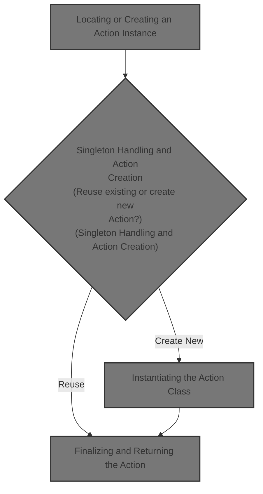
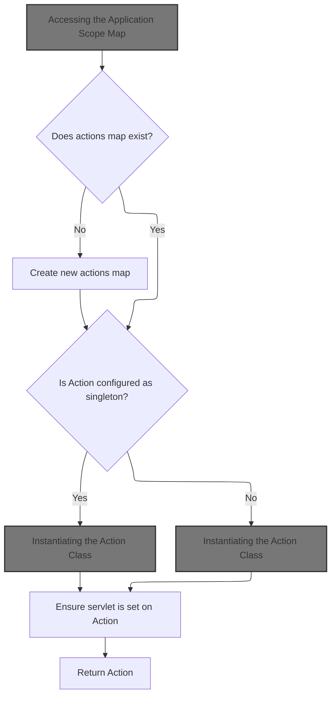
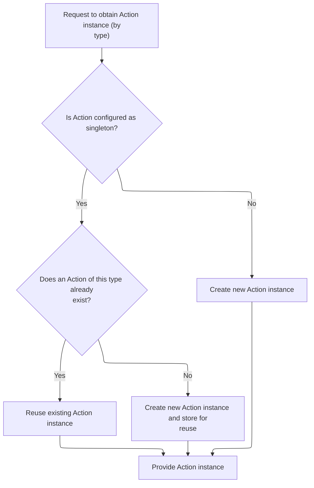
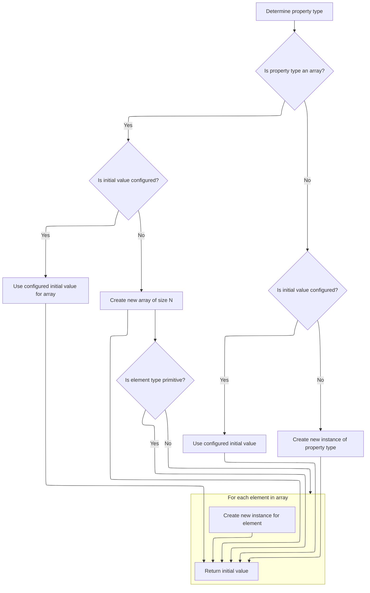

This document describes how the system provides an Action instance to handle a user request. Depending on configuration, the process either reuses an existing Action or creates a new one, ensuring the instance is fully initialized and ready for use. The flow also supports dynamic forms for flexible request handling.



# Locating or Creating an Action Instance



<SwmSnippet path="/core/src/main/java/org/apache/struts/chain/commands/servlet/CreateAction.java" line="50">

---

In <SwmToken path="core/src/main/java/org/apache/struts/chain/commands/servlet/CreateAction.java" pos="50:7:7" line-data="    protected synchronized Action getAction(ActionContext context, String type,">`getAction`</SwmToken>, we grab the module config and build a key for the actions map. We then try to fetch the map from the application scope. If it's missing, we create and store a new one. This is where we decide if we're reusing an Action instance or need to make a new one. Next, we call <SwmToken path="core/src/main/java/org/apache/struts/chain/commands/servlet/CreateAction.java" pos="59:13:15" line-data="        Map actions = (Map) context.getApplicationScope().get(actionsKey);">`getApplicationScope()`</SwmToken> from <SwmToken path="core/src/main/java/org/apache/struts/chain/contexts/WebActionContext.java" pos="34:4:4" line-data="public class WebActionContext extends ActionContextBase {">`WebActionContext`</SwmToken> to actually access the shared map.

```java
    protected synchronized Action getAction(ActionContext context, String type,
        ActionConfig actionConfig)
        throws Exception {

        ServletActionContext saContext = (ServletActionContext) context;
        ActionServlet actionServlet = saContext.getActionServlet();

        ModuleConfig moduleConfig = actionConfig.getModuleConfig();
        String actionsKey = Constants.ACTIONS_KEY + moduleConfig.getPrefix();
        Map actions = (Map) context.getApplicationScope().get(actionsKey);

        if (actions == null) {
            actions = new HashMap();
            context.getApplicationScope().put(actionsKey, actions);
        }

```

---

</SwmSnippet>

## Accessing the Application Scope Map

<SwmSnippet path="/core/src/main/java/org/apache/struts/chain/contexts/WebActionContext.java" line="116">

---

<SwmToken path="core/src/main/java/org/apache/struts/chain/contexts/WebActionContext.java" pos="116:5:5" line-data="    public Map getApplicationScope() {">`getApplicationScope`</SwmToken> just hands back the application-wide map from the underlying web context. This is how we access or store shared objects like the actions map.

```java
    public Map getApplicationScope() {
        return webContext().getApplicationScope();
    }
```

---

</SwmSnippet>

<SwmSnippet path="/core/src/main/java/org/apache/struts/chain/contexts/WebActionContext.java" line="49">

---

<SwmToken path="core/src/main/java/org/apache/struts/chain/contexts/WebActionContext.java" pos="49:5:5" line-data="    protected WebContext webContext() {">`webContext`</SwmToken> just casts the base context to <SwmToken path="core/src/main/java/org/apache/struts/chain/contexts/WebActionContext.java" pos="49:3:3" line-data="    protected WebContext webContext() {">`WebContext`</SwmToken>. The code assumes the context is always a <SwmToken path="core/src/main/java/org/apache/struts/chain/contexts/WebActionContext.java" pos="49:3:3" line-data="    protected WebContext webContext() {">`WebContext`</SwmToken>, which is typical for Struts1 web flows.

```java
    protected WebContext webContext() {
        return (WebContext) this.getBaseContext();
    }
```

---

</SwmSnippet>

## Singleton Handling and Action Creation



<SwmSnippet path="/core/src/main/java/org/apache/struts/chain/commands/servlet/CreateAction.java" line="66">

---

Back in <SwmToken path="core/src/main/java/org/apache/struts/chain/commands/servlet/CreateAction.java" pos="50:7:7" line-data="    protected synchronized Action getAction(ActionContext context, String type,">`getAction`</SwmToken>, after getting the application scope map, we check if the Action should be a singleton. If so, we synchronize on the map, look up the Action by type, and create/store it if missing. For non-singletons, we just call <SwmToken path="core/src/main/java/org/apache/struts/chain/commands/servlet/CreateAction.java" pos="73:5:5" line-data="                        action = createAction(context, type);">`createAction`</SwmToken> directly to get a new instance. Next, we call <SwmToken path="core/src/main/java/org/apache/struts/chain/commands/servlet/CreateAction.java" pos="73:5:5" line-data="                        action = createAction(context, type);">`createAction`</SwmToken> to actually instantiate the Action class.

```java
        Action action = null;

        try {
            if (actionConfig.isSingleton()) {
                synchronized (actions) {
                    action = (Action) actions.get(type);
                    if (action == null) {
                        action = createAction(context, type);
                        actions.put(type, action);
                    }
                }
            } else {
                action = createAction(context, type);
            }
        } catch (Exception e) {
            log.error(actionServlet.getInternal().getMessage(
                    "actionCreate", actionConfig.getPath(), 
                    actionConfig.toString()), e);
            throw e;
        }
        
```

---

</SwmSnippet>

## Instantiating the Action Class

<SwmSnippet path="/core/src/main/java/org/apache/struts/chain/commands/servlet/CreateAction.java" line="106">

---

<SwmToken path="core/src/main/java/org/apache/struts/chain/commands/servlet/CreateAction.java" pos="106:5:5" line-data="    protected Action createAction(ActionContext context, String type) throws Exception {">`createAction`</SwmToken> logs the type and uses <SwmToken path="core/src/main/java/org/apache/struts/chain/commands/servlet/CreateAction.java" pos="108:7:9" line-data="        return (Action) ClassUtils.getApplicationInstance(type);">`ClassUtils.getApplicationInstance`</SwmToken> to instantiate the Action class by name. This is where the actual Action object is created, assuming the type string is valid.

```java
    protected Action createAction(ActionContext context, String type) throws Exception {
        log.info("Initialize action of type: " + type);
        return (Action) ClassUtils.getApplicationInstance(type);
    }
```

---

</SwmSnippet>

## Reflective Instantiation of the Action

<SwmSnippet path="/core/src/main/java/org/apache/struts/chain/commands/util/ClassUtils.java" line="68">

---

<SwmToken path="core/src/main/java/org/apache/struts/chain/commands/util/ClassUtils.java" pos="68:7:7" line-data="    public static Object getApplicationInstance(String className)">`getApplicationInstance`</SwmToken> loads the class by name and calls <SwmToken path="core/src/main/java/org/apache/struts/chain/commands/util/ClassUtils.java" pos="71:9:9" line-data="        return (getApplicationClass(className).newInstance());">`newInstance`</SwmToken> to create it. If the class is a <SwmToken path="core/src/main/java/org/apache/struts/action/DynaActionFormClass.java" pos="160:1:1" line-data="        DynaActionForm dynaBean = (DynaActionForm) getBeanClass().newInstance();">`DynaActionForm`</SwmToken>, this leads to the <SwmToken path="core/src/main/java/org/apache/struts/action/DynaActionFormClass.java" pos="45:4:4" line-data="public class DynaActionFormClass implements DynaClass, Serializable {">`DynaActionFormClass`</SwmToken> instantiation logic.

```java
    public static Object getApplicationInstance(String className)
        throws ClassNotFoundException, IllegalAccessException,
            InstantiationException {
        return (getApplicationClass(className).newInstance());
    }
```

---

</SwmSnippet>

## Creating a <SwmToken path="core/src/main/java/org/apache/struts/action/DynaActionFormClass.java" pos="160:1:1" line-data="        DynaActionForm dynaBean = (DynaActionForm) getBeanClass().newInstance();">`DynaActionForm`</SwmToken> Instance

<SwmSnippet path="/core/src/main/java/org/apache/struts/action/DynaActionFormClass.java" line="158">

---

In <SwmToken path="core/src/main/java/org/apache/struts/action/DynaActionFormClass.java" pos="158:5:5" line-data="    public DynaBean newInstance()">`newInstance`</SwmToken>, we use reflection to create a new <SwmToken path="core/src/main/java/org/apache/struts/action/DynaActionFormClass.java" pos="160:1:1" line-data="        DynaActionForm dynaBean = (DynaActionForm) getBeanClass().newInstance();">`DynaActionForm`</SwmToken> (from the bean class). The instance is linked back to its <SwmToken path="core/src/main/java/org/apache/struts/action/DynaActionFormClass.java" pos="45:4:4" line-data="public class DynaActionFormClass implements DynaClass, Serializable {">`DynaActionFormClass`</SwmToken>, and property initialization comes next.

```java
    public DynaBean newInstance()
        throws IllegalAccessException, InstantiationException {
        DynaActionForm dynaBean = (DynaActionForm) getBeanClass().newInstance();

```

---

</SwmSnippet>

### Resolving the Bean Class for the Form

<SwmSnippet path="/core/src/main/java/org/apache/struts/action/DynaActionFormClass.java" line="227">

---

<SwmToken path="core/src/main/java/org/apache/struts/action/DynaActionFormClass.java" pos="227:5:5" line-data="    protected Class getBeanClass() {">`getBeanClass`</SwmToken> checks if the bean class is already loaded. If not, it calls <SwmToken path="core/src/main/java/org/apache/struts/action/DynaActionFormClass.java" pos="229:1:1" line-data="            introspect(config);">`introspect`</SwmToken> to resolve and validate the class and its properties.

```java
    protected Class getBeanClass() {
        if (beanClass == null) {
            introspect(config);
        }

        return (beanClass);
    }
```

---

</SwmSnippet>

### Analyzing Form Bean and Property Types

```mermaid
%%{init: {"flowchart": {"defaultRenderer": "elk"}} }%%
flowchart TD
  node1["Analyze form bean configuration"]
  click node1 openCode "core/src/main/java/org/apache/struts/action/DynaActionFormClass.java:246:247"
  node1 --> node2{"Can instantiate form bean class?"}
  click node2 openCode "core/src/main/java/org/apache/struts/action/DynaActionFormClass.java:250:258"
  node2 -->|"No"| node3["Fail: Cannot instantiate class"]
  click node3 openCode "core/src/main/java/org/apache/struts/action/DynaActionFormClass.java:253:258"
  node2 -->|"Yes"| node4{"Is class a subclass of required base?"}
  click node4 openCode "core/src/main/java/org/apache/struts/action/DynaActionFormClass.java:260:264"
  node4 -->|"No"| node5["Fail: Not a valid subclass"]
  click node5 openCode "core/src/main/java/org/apache/struts/action/DynaActionFormClass.java:261:264"
  node4 -->|"Yes"| node6["Assign form bean name"]
  click node6 openCode "core/src/main/java/org/apache/struts/action/DynaActionFormClass.java:267:267"
  node6 --> node7["Extract property descriptors"]
  click node7 openCode "core/src/main/java/org/apache/struts/action/DynaActionFormClass.java:270:274"
  node7 --> node8{"Are there property descriptors?"}
  click node8 openCode "core/src/main/java/org/apache/struts/action/DynaActionFormClass.java:272:274"
  node8 -->|"No"| node10["Form is ready for use"]
  node8 -->|"Yes"| node9["Create dynamic property definitions"]
  click node9 openCode "core/src/main/java/org/apache/struts/action/DynaActionFormClass.java:277:284"
  subgraph loop1["For each property in form configuration"]
    node9 --> node11["Create and map dynamic property"]
    click node11 openCode "core/src/main/java/org/apache/struts/action/DynaActionFormClass.java:280:283"
    node11 --> node9
  end
  node9 --> node10["Form is ready for use"]
  click node10 openCode "core/src/main/java/org/apache/struts/action/DynaActionFormClass.java:285:285"

classDef HeadingStyle fill:#777777,stroke:#333,stroke-width:2px;

%% Swimm:
%% %%{init: {"flowchart": {"defaultRenderer": "elk"}} }%%
%% flowchart TD
%%   node1["Analyze form bean configuration"]
%%   click node1 openCode "<SwmPath>[core/…/action/DynaActionFormClass.java](core/src/main/java/org/apache/struts/action/DynaActionFormClass.java)</SwmPath>:246:247"
%%   node1 --> node2{"Can instantiate form bean class?"}
%%   click node2 openCode "<SwmPath>[core/…/action/DynaActionFormClass.java](core/src/main/java/org/apache/struts/action/DynaActionFormClass.java)</SwmPath>:250:258"
%%   node2 -->|"No"| node3["Fail: Cannot instantiate class"]
%%   click node3 openCode "<SwmPath>[core/…/action/DynaActionFormClass.java](core/src/main/java/org/apache/struts/action/DynaActionFormClass.java)</SwmPath>:253:258"
%%   node2 -->|"Yes"| node4{"Is class a subclass of required base?"}
%%   click node4 openCode "<SwmPath>[core/…/action/DynaActionFormClass.java](core/src/main/java/org/apache/struts/action/DynaActionFormClass.java)</SwmPath>:260:264"
%%   node4 -->|"No"| node5["Fail: Not a valid subclass"]
%%   click node5 openCode "<SwmPath>[core/…/action/DynaActionFormClass.java](core/src/main/java/org/apache/struts/action/DynaActionFormClass.java)</SwmPath>:261:264"
%%   node4 -->|"Yes"| node6["Assign form bean name"]
%%   click node6 openCode "<SwmPath>[core/…/action/DynaActionFormClass.java](core/src/main/java/org/apache/struts/action/DynaActionFormClass.java)</SwmPath>:267:267"
%%   node6 --> node7["Extract property descriptors"]
%%   click node7 openCode "<SwmPath>[core/…/action/DynaActionFormClass.java](core/src/main/java/org/apache/struts/action/DynaActionFormClass.java)</SwmPath>:270:274"
%%   node7 --> node8{"Are there property descriptors?"}
%%   click node8 openCode "<SwmPath>[core/…/action/DynaActionFormClass.java](core/src/main/java/org/apache/struts/action/DynaActionFormClass.java)</SwmPath>:272:274"
%%   node8 -->|"No"| node10["Form is ready for use"]
%%   node8 -->|"Yes"| node9["Create dynamic property definitions"]
%%   click node9 openCode "<SwmPath>[core/…/action/DynaActionFormClass.java](core/src/main/java/org/apache/struts/action/DynaActionFormClass.java)</SwmPath>:277:284"
%%   subgraph loop1["For each property in form configuration"]
%%     node9 --> node11["Create and map dynamic property"]
%%     click node11 openCode "<SwmPath>[core/…/action/DynaActionFormClass.java](core/src/main/java/org/apache/struts/action/DynaActionFormClass.java)</SwmPath>:280:283"
%%     node11 --> node9
%%   end
%%   node9 --> node10["Form is ready for use"]
%%   click node10 openCode "<SwmPath>[core/…/action/DynaActionFormClass.java](core/src/main/java/org/apache/struts/action/DynaActionFormClass.java)</SwmPath>:285:285"
%% 
%% classDef HeadingStyle fill:#777777,stroke:#333,stroke-width:2px;
```



<SwmSnippet path="/core/src/main/java/org/apache/struts/action/DynaActionFormClass.java" line="246">

---

<SwmToken path="core/src/main/java/org/apache/struts/action/DynaActionFormClass.java" pos="282:6:6" line-data="                    descriptors[i].getTypeClass());">`getTypeClass`</SwmToken> figures out the Java Class for a property, handling primitives, arrays, and regular classes. If it's an array type, it returns the array class. This info is used back in <SwmToken path="core/src/main/java/org/apache/struts/action/DynaActionFormClass.java" pos="45:4:4" line-data="public class DynaActionFormClass implements DynaClass, Serializable {">`DynaActionFormClass`</SwmToken> to set up property metadata.

```java
    protected void introspect(FormBeanConfig config) {
        this.config = config;

        // Validate the ActionFormBean implementation class
        try {
            beanClass = RequestUtils.applicationClass(config.getType());
        } catch (Throwable t) {
        	IllegalArgumentException t2 = new IllegalArgumentException(
                "Cannot instantiate ActionFormBean class '" + config.getType()
                + "'");
        	t2.initCause(t);
        	throw t2;
        }

        if (!DynaActionForm.class.isAssignableFrom(beanClass)) {
            throw new IllegalArgumentException("Class '" + config.getType()
                + "' is not a subclass of "
                + "'org.apache.struts.action.DynaActionForm'");
        }

        // Set the name we will know ourselves by from the form bean name
        this.name = config.getName();

        // Look up the property descriptors for this bean class
        FormPropertyConfig[] descriptors = config.findFormPropertyConfigs();

        if (descriptors == null) {
            descriptors = new FormPropertyConfig[0];
        }

        // Create corresponding dynamic property definitions
        properties = new DynaProperty[descriptors.length];

        for (int i = 0; i < descriptors.length; i++) {
            properties[i] =
                new DynaProperty(descriptors[i].getName(),
                    descriptors[i].getTypeClass());
            propertiesMap.put(properties[i].getName(), properties[i]);
        }
    }
```

---

</SwmSnippet>

<SwmSnippet path="/core/src/main/java/org/apache/struts/config/FormPropertyConfig.java" line="221">

---

<SwmToken path="core/src/main/java/org/apache/struts/config/FormPropertyConfig.java" pos="221:5:5" line-data="    public Class getTypeClass() {">`getTypeClass`</SwmToken> figures out the Java Class for a property, handling primitives, arrays, and regular classes. If it's an array type, it returns the array class. This info is used back in <SwmToken path="core/src/main/java/org/apache/struts/action/DynaActionFormClass.java" pos="45:4:4" line-data="public class DynaActionFormClass implements DynaClass, Serializable {">`DynaActionFormClass`</SwmToken> to set up property metadata.

```java
    public Class getTypeClass() {
        // Identify the base class (in case an array was specified)
        String baseType = getType();
        boolean indexed = false;

        if (baseType.endsWith("[]")) {
            baseType = baseType.substring(0, baseType.length() - 2);
            indexed = true;
        }

        // Construct an appropriate Class instance for the base class
        Class baseClass = null;

        if ("boolean".equals(baseType)) {
            baseClass = Boolean.TYPE;
        } else if ("byte".equals(baseType)) {
            baseClass = Byte.TYPE;
        } else if ("char".equals(baseType)) {
            baseClass = Character.TYPE;
        } else if ("double".equals(baseType)) {
            baseClass = Double.TYPE;
        } else if ("float".equals(baseType)) {
            baseClass = Float.TYPE;
        } else if ("int".equals(baseType)) {
            baseClass = Integer.TYPE;
        } else if ("long".equals(baseType)) {
            baseClass = Long.TYPE;
        } else if ("short".equals(baseType)) {
            baseClass = Short.TYPE;
        } else {
            ClassLoader classLoader =
                Thread.currentThread().getContextClassLoader();

            if (classLoader == null) {
                classLoader = this.getClass().getClassLoader();
            }

            try {
                baseClass = classLoader.loadClass(baseType);
            } catch (ClassNotFoundException ex) {
                log.error("Class '" + baseType +
                          "' not found for property '" + name + "'");
                baseClass = null;
            }
        }

        // Return the base class or an array appropriately
        if (indexed) {
            return (Array.newInstance(baseClass, 0).getClass());
        } else {
            return (baseClass);
        }
    }
```

---

</SwmSnippet>

### Initializing <SwmToken path="core/src/main/java/org/apache/struts/action/DynaActionFormClass.java" pos="160:1:1" line-data="        DynaActionForm dynaBean = (DynaActionForm) getBeanClass().newInstance();">`DynaActionForm`</SwmToken> Properties

<SwmSnippet path="/core/src/main/java/org/apache/struts/action/DynaActionFormClass.java" line="162">

---

Back in <SwmToken path="core/src/main/java/org/apache/struts/chain/commands/util/ClassUtils.java" pos="71:9:9" line-data="        return (getApplicationClass(className).newInstance());">`newInstance`</SwmToken>, after creating the <SwmToken path="core/src/main/java/org/apache/struts/action/DynaActionFormClass.java" pos="160:1:1" line-data="        DynaActionForm dynaBean = (DynaActionForm) getBeanClass().newInstance();">`DynaActionForm`</SwmToken>, we set up its properties by looping through the <SwmToken path="core/src/main/java/org/apache/struts/action/DynaActionFormClass.java" pos="164:1:1" line-data="        FormPropertyConfig[] props = config.findFormPropertyConfigs();">`FormPropertyConfig`</SwmToken> array and calling <SwmToken path="core/src/main/java/org/apache/struts/action/DynaActionFormClass.java" pos="167:20:22" line-data="            dynaBean.set(props[i].getName(), props[i].initial());">`initial()`</SwmToken> for each property. This is where the default values get assigned, so we need to call <SwmToken path="core/src/main/java/org/apache/struts/action/DynaActionFormClass.java" pos="167:20:22" line-data="            dynaBean.set(props[i].getName(), props[i].initial());">`initial()`</SwmToken> next.

```java
        dynaBean.setDynaActionFormClass(this);

        FormPropertyConfig[] props = config.findFormPropertyConfigs();

        for (int i = 0; i < props.length; i++) {
            dynaBean.set(props[i].getName(), props[i].initial());
        }

        return (dynaBean);
    }
```

---

</SwmSnippet>

## Resolving Initial Property Values



<SwmSnippet path="/core/src/main/java/org/apache/struts/config/FormPropertyConfig.java" line="318">

---

In <SwmToken path="core/src/main/java/org/apache/struts/config/FormPropertyConfig.java" pos="318:5:5" line-data="    public Object initial() {">`initial`</SwmToken>, we figure out the property's type and start setting up its initial value. If it's an array, we handle that separately. Next, we need to check if the property is an array and set up the value accordingly.

```java
    public Object initial() {
        Object initialValue = null;

        try {
            Class clazz = getTypeClass();

```

---

</SwmSnippet>

<SwmSnippet path="/core/src/main/java/org/apache/struts/config/FormPropertyConfig.java" line="324">

---

Back in <SwmToken path="core/src/main/java/org/apache/struts/config/FormPropertyConfig.java" pos="325:4:4" line-data="                if (initial != null) {">`initial`</SwmToken>, if the property is an array, we either convert the initial value or create an empty array and fill it with new instances for non-primitives. This ensures the property is always initialized to something valid.

```java
            if (clazz.isArray()) {
                if (initial != null) {
                    initialValue = ConvertUtils.convert(initial, clazz);
                } else {
                    initialValue =
                        Array.newInstance(clazz.getComponentType(), size);

                    if (!(clazz.getComponentType().isPrimitive())) {
                        for (int i = 0; i < size; i++) {
                            try {
                                Array.set(initialValue, i,
                                    clazz.getComponentType().newInstance());
                            } catch (Throwable t) {
                                log.error("Unable to create instance of "
                                    + clazz.getName() + " for property=" + name
                                    + ", type=" + type + ", initial=" + initial
                                    + ", size=" + size + ".");

                                //FIXME: Should we just dump the entire application/module ?
                            }
                        }
```

---

</SwmSnippet>

<SwmSnippet path="/core/src/main/java/org/apache/struts/config/FormPropertyConfig.java" line="348">

---

Now that <SwmToken path="core/src/main/java/org/apache/struts/config/FormPropertyConfig.java" pos="348:4:4" line-data="                if (initial != null) {">`initial`</SwmToken> is done, we return the value to <SwmToken path="core/src/main/java/org/apache/struts/action/DynaActionFormClass.java" pos="45:4:4" line-data="public class DynaActionFormClass implements DynaClass, Serializable {">`DynaActionFormClass`</SwmToken>, which uses it to set up the property on the new form instance.

```java
                if (initial != null) {
                    initialValue = ConvertUtils.convert(initial, clazz);
                } else {
                    initialValue = clazz.newInstance();
                }
            }
        } catch (Throwable t) {
            initialValue = null;
        }

        return (initialValue);
    }
```

---

</SwmSnippet>

## Finalizing and Returning the Action

<SwmSnippet path="/core/src/main/java/org/apache/struts/chain/commands/servlet/CreateAction.java" line="87">

---

Back in <SwmToken path="core/src/main/java/org/apache/struts/chain/commands/servlet/CreateAction.java" pos="50:7:7" line-data="    protected synchronized Action getAction(ActionContext context, String type,">`getAction`</SwmToken>, after creating or retrieving the Action, we check if its servlet is set. If not, we assign the current <SwmToken path="core/src/main/java/org/apache/struts/chain/commands/servlet/CreateAction.java" pos="55:1:1" line-data="        ActionServlet actionServlet = saContext.getActionServlet();">`ActionServlet`</SwmToken>. Finally, we return the Action instance, ready for use.

```java
        if (action.getServlet() == null) {
            action.setServlet(actionServlet);
        }

        return (action);
    }
```

---

</SwmSnippet>

&nbsp;

*This is an auto-generated document by Swimm 🌊 and has not yet been verified by a human*

<SwmMeta version="3.0.0" repo-id="Z2l0aHViJTNBJTNBc3RydXRzMSUzQSUzQVN3aW1tLURlbW8=" repo-name="struts1"><sup>Powered by [Swimm](https://app.swimm.io/)</sup></SwmMeta>
