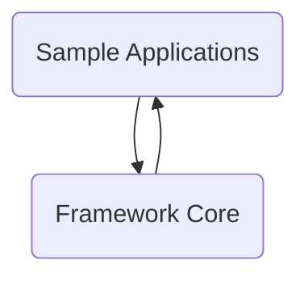

# Main Components

### Framework Core (<SwmPath>[core/](core/)</SwmPath>)

- **Upload**
  - **Flows**
    - <SwmLink doc-title="Processing multipart form submissions">[Processing multipart form submissions](/.swm/processing-multipart-form-submissions.oox7gdn5.sw.md)</SwmLink>
- **Action**
  - **Flows**
    - <SwmLink doc-title="Processing user actions and navigation outcomes">[Processing user actions and navigation outcomes](/.swm/processing-user-actions-and-navigation-outcomes.7n7r8d7r.sw.md)</SwmLink>
    - <SwmLink doc-title="Shutting down the request processor and servlet">[Shutting down the request processor and servlet](/.swm/shutting-down-the-request-processor-and-servlet.e30b8ptn.sw.md)</SwmLink>
    - <SwmLink doc-title="Processing form submissions">[Processing form submissions](/.swm/processing-form-submissions.5bhhqr6k.sw.md)</SwmLink>
- **Config**
  - **Flows**
    - <SwmLink doc-title="Wildcard path matching and configuration generation">[Wildcard path matching and configuration generation](/.swm/wildcard-path-matching-and-configuration-generation.7pdkhx2k.sw.md)</SwmLink>
    - <SwmLink doc-title="Generating and injecting javascript form validation">[Generating and injecting javascript form validation](/.swm/generating-and-injecting-javascript-form-validation.klm595og.sw.md)</SwmLink>
    - <SwmLink doc-title="Preparing and rendering forms">[Preparing and rendering forms](/.swm/preparing-and-rendering-forms.vmmtc6sa.sw.md)</SwmLink>
    - <SwmLink doc-title="Resetting form properties">[Resetting form properties](/.swm/resetting-form-properties.fb0u6cu1.sw.md)</SwmLink>
    - <SwmLink doc-title="Creating and initializing form beans">[Creating and initializing form beans](/.swm/creating-and-initializing-form-beans.zs8pw66r.sw.md)</SwmLink>
    - <SwmLink doc-title="Initializing the definitions factory">[Initializing the definitions factory](/.swm/initializing-the-definitions-factory.abx6k6om.sw.md)</SwmLink>
    - <SwmLink doc-title="Loading and initializing filters">[Loading and initializing filters](/.swm/loading-and-initializing-filters.jyd1tje0.sw.md)</SwmLink>
    - <SwmLink doc-title="Ensuring availability of tiles definitions factory">[Ensuring availability of tiles definitions factory](/.swm/ensuring-availability-of-tiles-definitions-factory.1luk99v2.sw.md)</SwmLink>
    - <SwmLink doc-title="Checking user roles with multiple role support">[Checking user roles with multiple role support](/.swm/checking-user-roles-with-multiple-role-support.et31z2tu.sw.md)</SwmLink>
    - <SwmLink doc-title="Creating and initializing form beans">[Creating and initializing form beans](/.swm/creating-and-initializing-form-beans.w5bfj08p.sw.md)</SwmLink>
    - <SwmLink doc-title="Creating and initializing action mappings">[Creating and initializing action mappings](/.swm/creating-and-initializing-action-mappings.of2m9rb0.sw.md)</SwmLink>
    - <SwmLink doc-title="Creating and initializing configured objects">[Creating and initializing configured objects](/.swm/creating-and-initializing-configured-objects.vh0ohzby.sw.md)</SwmLink>
    - <SwmLink doc-title="Dynamic object creation from configuration">[Dynamic object creation from configuration](/.swm/dynamic-object-creation-from-configuration.fggiq5ln.sw.md)</SwmLink>
    - <SwmLink doc-title="Reloading the definitions factory">[Reloading the definitions factory](/.swm/reloading-the-definitions-factory.71ttqnew.sw.md)</SwmLink>
    - <SwmLink doc-title="Initializing a customizable definitions factory">[Initializing a customizable definitions factory](/.swm/initializing-a-customizable-definitions-factory.hkxh1sgh.sw.md)</SwmLink>
    - <SwmLink doc-title="Definitions factory initialization and dynamic form handling">[Definitions factory initialization and dynamic form handling](/.swm/definitions-factory-initialization-and-dynamic-form-handling.q6ik7wxh.sw.md)</SwmLink>
    - <SwmLink doc-title="Preparing and providing action forms">[Preparing and providing action forms](/.swm/preparing-and-providing-action-forms.g6ecorrw.sw.md)</SwmLink>
    - <SwmLink doc-title="Managing form beans during request processing">[Managing form beans during request processing](/.swm/managing-form-beans-during-request-processing.oc1p2ncu.sw.md)</SwmLink>
    - <SwmLink doc-title="Exposing configuration objects in jsp pages">[Exposing configuration objects in jsp pages](/.swm/exposing-configuration-objects-in-jsp-pages.feftjrm8.sw.md)</SwmLink>
- **Util**
  - **Flows**
    - <SwmLink doc-title="Generating navigation urls">[Generating navigation urls](/.swm/generating-navigation-urls.1ndwnff5.sw.md)</SwmLink>
    - <SwmLink doc-title="Populating beans and redirects from http requests">[Populating beans and redirects from http requests](/.swm/populating-beans-and-redirects-from-http-requests.3vc3nx6p.sw.md)</SwmLink>
    - <SwmLink doc-title="Resolving definition inheritance">[Resolving definition inheritance](/.swm/resolving-definition-inheritance.ncpxiga0.sw.md)</SwmLink>
    - <SwmLink doc-title="Form validation and user redirection flow">[Form validation and user redirection flow](/.swm/form-validation-and-user-redirection-flow.orql4mvn.sw.md)</SwmLink>
    - <SwmLink doc-title="Rendering a tile with dynamic context">[Rendering a tile with dynamic context](/.swm/rendering-a-tile-with-dynamic-context.a50p57dg.sw.md)</SwmLink>
    - <SwmLink doc-title="Module configuration verification flow">[Module configuration verification flow](/.swm/module-configuration-verification-flow.7ix15j59.sw.md)</SwmLink>
    - <SwmLink doc-title="Rendering option elements for dropdowns">[Rendering option elements for dropdowns](/.swm/rendering-option-elements-for-dropdowns.z5bw1y3d.sw.md)</SwmLink>
    - <SwmLink doc-title="Routing user actions from web forms">[Routing user actions from web forms](/.swm/routing-user-actions-from-web-forms.9drnuwbl.sw.md)</SwmLink>
    - <SwmLink doc-title="Processing and dispatching user actions">[Processing and dispatching user actions](/.swm/processing-and-dispatching-user-actions.rk8ayoyt.sw.md)</SwmLink>
    - <SwmLink doc-title="Hybrid request routing and rendering">[Hybrid request routing and rendering](/.swm/hybrid-request-routing-and-rendering.bhobpk4d.sw.md)</SwmLink>
    - <SwmLink doc-title="Routing requests to struts or jsf views">[Routing requests to struts or jsf views](/.swm/routing-requests-to-struts-or-jsf-views.0thfggct.sw.md)</SwmLink>
    - <SwmLink doc-title="Displaying formatted error messages">[Displaying formatted error messages](/.swm/displaying-formatted-error-messages.9mkjh9x1.sw.md)</SwmLink>
    - <SwmLink doc-title="Forwarding requests and navigation flow">[Forwarding requests and navigation flow](/.swm/forwarding-requests-and-navigation-flow.2hyaf35f.sw.md)</SwmLink>
    - <SwmLink doc-title="Forwarding user requests and executing business actions">[Forwarding user requests and executing business actions](/.swm/forwarding-user-requests-and-executing-business-actions.oi4ywrcm.sw.md)</SwmLink>
    - <SwmLink doc-title="Routing users based on request parameters">[Routing users based on request parameters](/.swm/routing-users-based-on-request-parameters.838fstpn.sw.md)</SwmLink>
    - <SwmLink doc-title="Handling unspecified action requests">[Handling unspecified action requests](/.swm/handling-unspecified-action-requests.qszl0v2c.sw.md)</SwmLink>
    - <SwmLink doc-title="Processing iteration output in nested templates">[Processing iteration output in nested templates](/.swm/processing-iteration-output-in-nested-templates.tl91i1mr.sw.md)</SwmLink>
    - <SwmLink doc-title="Generating input tag names for forms">[Generating input tag names for forms](/.swm/generating-input-tag-names-for-forms.7n482zhw.sw.md)</SwmLink>
    - <SwmLink doc-title="Creating or retrieving an action instance">[Creating or retrieving an action instance](/.swm/creating-or-retrieving-an-action-instance.g3398er4.sw.md)</SwmLink>
    - <SwmLink doc-title="Creating and preparing action instances">[Creating and preparing action instances](/.swm/creating-and-preparing-action-instances.kv16ttf1.sw.md)</SwmLink>
    - <SwmLink doc-title="Including resources in http responses">[Including resources in http responses](/.swm/including-resources-in-http-responses.jvcp91fs.sw.md)</SwmLink>
    - <SwmLink doc-title="Including additional resources in request processing">[Including additional resources in request processing](/.swm/including-additional-resources-in-request-processing.bynun77d.sw.md)</SwmLink>
- **Validator**
  - **Flows**
    - <SwmLink doc-title="Conditional required field validation">[Conditional required field validation](/.swm/conditional-required-field-validation.utaslio4.sw.md)</SwmLink>
    - <SwmLink doc-title="Validating user form data">[Validating user form data](/.swm/validating-user-form-data.lhkxawug.sw.md)</SwmLink>
    - <SwmLink doc-title="Validating numeric range constraints">[Validating numeric range constraints](/.swm/validating-numeric-range-constraints.m6e93i5f.sw.md)</SwmLink>
    - <SwmLink doc-title="Validating integer range input">[Validating integer range input](/.swm/validating-integer-range-input.tmy6lihu.sw.md)</SwmLink>
    - <SwmLink doc-title="Validating numeric input within a double range">[Validating numeric input within a double range](/.swm/validating-numeric-input-within-a-double-range.rxgmrgvz.sw.md)</SwmLink>
    - <SwmLink doc-title="Validating floating point range inputs">[Validating floating point range inputs](/.swm/validating-floating-point-range-inputs.3901z3wi.sw.md)</SwmLink>
    - <SwmLink doc-title="Validating date input">[Validating date input](/.swm/validating-date-input.qaxvxoio.sw.md)</SwmLink>
    - <SwmLink doc-title="Validating maximum length for form input">[Validating maximum length for form input](/.swm/validating-maximum-length-for-form-input.r1kgxkie.sw.md)</SwmLink>
    - <SwmLink doc-title="Minimum length validation flow">[Minimum length validation flow](/.swm/minimum-length-validation-flow.yneooi4l.sw.md)</SwmLink>
    - <SwmLink doc-title="Validating input against a mask">[Validating input against a mask](/.swm/validating-input-against-a-mask.4p9tgihj.sw.md)</SwmLink>
    - <SwmLink doc-title="Locale aware byte validation flow">[Locale aware byte validation flow](/.swm/locale-aware-byte-validation-flow.n9ebozjh.sw.md)</SwmLink>
    - <SwmLink doc-title="Validating short integer input with localization">[Validating short integer input with localization](/.swm/validating-short-integer-input-with-localization.y3apttjv.sw.md)</SwmLink>
    - <SwmLink doc-title="Validating integer input with locale awareness">[Validating integer input with locale awareness](/.swm/validating-integer-input-with-locale-awareness.qx9yxa5j.sw.md)</SwmLink>
    - <SwmLink doc-title="Validating whole numbers with locale awareness">[Validating whole numbers with locale awareness](/.swm/validating-whole-numbers-with-locale-awareness.2ebjuksw.sw.md)</SwmLink>
    - <SwmLink doc-title="Locale aware float validation">[Locale aware float validation](/.swm/locale-aware-float-validation.tn93f9pm.sw.md)</SwmLink>
    - <SwmLink doc-title="Locale aware number validation">[Locale aware number validation](/.swm/locale-aware-number-validation.eak35fmg.sw.md)</SwmLink>
    - <SwmLink doc-title="Validating required fields in forms">[Validating required fields in forms](/.swm/validating-required-fields-in-forms.evkhumx5.sw.md)</SwmLink>
    - <SwmLink doc-title="Validating byte input and localized error messaging">[Validating byte input and localized error messaging](/.swm/validating-byte-input-and-localized-error-messaging.29xjjyyj.sw.md)</SwmLink>
    - <SwmLink doc-title="Validating short integer input">[Validating short integer input](/.swm/validating-short-integer-input.2zerj61y.sw.md)</SwmLink>
    - <SwmLink doc-title="Validating integer input">[Validating integer input](/.swm/validating-integer-input.9vezzplv.sw.md)</SwmLink>
    - <SwmLink doc-title="Validating whole number input and providing localized feedback">[Validating whole number input and providing localized feedback](/.swm/validating-whole-number-input-and-providing-localized-feedback.0prtooaf.sw.md)</SwmLink>
    - <SwmLink doc-title="Validating float input in forms">[Validating float input in forms](/.swm/validating-float-input-in-forms.j3uibnf0.sw.md)</SwmLink>
    - <SwmLink doc-title="Validating numeric input and providing localized feedback">[Validating numeric input and providing localized feedback](/.swm/validating-numeric-input-and-providing-localized-feedback.bm4zcrts.sw.md)</SwmLink>
    - <SwmLink doc-title="Credit card validation flow">[Credit card validation flow](/.swm/credit-card-validation-flow.us4oj93z.sw.md)</SwmLink>
    - <SwmLink doc-title="Email address validation flow">[Email address validation flow](/.swm/email-address-validation-flow.f5bww36x.sw.md)</SwmLink>
- **Flows**
  - <SwmLink doc-title="Configuring nested tag properties">[Configuring nested tag properties](/.swm/configuring-nested-tag-properties.nl4r9mc3.sw.md)</SwmLink>
  - <SwmLink doc-title="Generating localized validation messages">[Generating localized validation messages](/.swm/generating-localized-validation-messages.mcwq0p03.sw.md)</SwmLink>
  - <SwmLink doc-title="Resolving nested property paths">[Resolving nested property paths](/.swm/resolving-nested-property-paths.ckom1chy.sw.md)</SwmLink>
  - <SwmLink doc-title="Processing an http request">[Processing an http request](/.swm/processing-an-http-request.yuabiu4y.sw.md)</SwmLink>
  - <SwmLink doc-title="Providing a request processor for a module">[Providing a request processor for a module](/.swm/providing-a-request-processor-for-a-module.9uldwi6a.sw.md)</SwmLink>
  - <SwmLink doc-title="Generating localized field messages">[Generating localized field messages](/.swm/generating-localized-field-messages.rgce26il.sw.md)</SwmLink>
  - <SwmLink doc-title="Conditional presence checks in web requests">[Conditional presence checks in web requests](/.swm/conditional-presence-checks-in-web-requests.o0e7vw7v.sw.md)</SwmLink>
  - <SwmLink doc-title="Validating field values with configurable expressions">[Validating field values with configurable expressions](/.swm/validating-field-values-with-configurable-expressions.avlh47px.sw.md)</SwmLink>
  - <SwmLink doc-title="Rendering and preparing a form for user input">[Rendering and preparing a form for user input](/.swm/rendering-and-preparing-a-form-for-user-input.4u6aodqz.sw.md)</SwmLink>
  - <SwmLink doc-title="Generating and outputting the base tag">[Generating and outputting the base tag](/.swm/generating-and-outputting-the-base-tag.9qamgqfu.sw.md)</SwmLink>
  - <SwmLink doc-title="Url validation flow">[Url validation flow](/.swm/url-validation-flow.x47flkmq.sw.md)</SwmLink>
  - <SwmLink doc-title="Exception handling flow">[Exception handling flow](/.swm/exception-handling-flow.72et1wr7.sw.md)</SwmLink>
  - <SwmLink doc-title="Validating matching fields in forms">[Validating matching fields in forms](/.swm/validating-matching-fields-in-forms.yjsia5f4.sw.md)</SwmLink>
  - <SwmLink doc-title="Routing and dispatching business actions">[Routing and dispatching business actions](/.swm/routing-and-dispatching-business-actions.8osz6xma.sw.md)</SwmLink>
  - <SwmLink doc-title="Selecting the method to handle a user action">[Selecting the method to handle a user action](/.swm/selecting-the-method-to-handle-a-user-action.wiee5dzj.sw.md)</SwmLink>
  - <SwmLink doc-title="Module validation resource initialization">[Module validation resource initialization](/.swm/module-validation-resource-initialization.8bp3cx9s.sw.md)</SwmLink>
  - <SwmLink doc-title="Obtaining an action instance">[Obtaining an action instance](/.swm/obtaining-an-action-instance.qqbcugkg.sw.md)</SwmLink>
  - <SwmLink doc-title="Resolving the method to handle a request">[Resolving the method to handle a request](/.swm/resolving-the-method-to-handle-a-request.hhl30g7i.sw.md)</SwmLink>
  - <SwmLink doc-title="Resolving method names from user requests">[Resolving method names from user requests](/.swm/resolving-method-names-from-user-requests.njgya9cn.sw.md)</SwmLink>
  - <SwmLink doc-title="Initializing the component definitions factory">[Initializing the component definitions factory](/.swm/initializing-the-component-definitions-factory.cr600l3x.sw.md)</SwmLink>
  - <SwmLink doc-title="Configuring and initializing a factory for component definitions">[Configuring and initializing a factory for component definitions](/.swm/configuring-and-initializing-a-factory-for-component-definitions.mvken78m.sw.md)</SwmLink>
  - <SwmLink doc-title="Processing nested iteration tags">[Processing nested iteration tags](/.swm/processing-nested-iteration-tags.wcgjav8s.sw.md)</SwmLink>
  - <SwmLink doc-title="Constructing a redirect url">[Constructing a redirect url](/.swm/constructing-a-redirect-url.ly9huv3n.sw.md)</SwmLink>

### Expression Language (<SwmPath>[el/](el/)</SwmPath>)

- **Tiles**
  - **Flows**
    - <SwmLink doc-title="Evaluating and assigning tag attributes">[Evaluating and assigning tag attributes](/.swm/evaluating-and-assigning-tag-attributes.e0mwu8lq.sw.md)</SwmLink>
    - <SwmLink doc-title="Preparing tag attributes for processing">[Preparing tag attributes for processing](/.swm/preparing-tag-attributes-for-processing.shxrx2hc.sw.md)</SwmLink>
    - <SwmLink doc-title="Preparing tag attributes for processing">[Preparing tag attributes for processing](/.swm/preparing-tag-attributes-for-processing.o76l7cn5.sw.md)</SwmLink>
- **Html**
  - **El select tag**
    - **Flows**
      - <SwmLink doc-title="Preparing tag attributes for rendering">[Preparing tag attributes for rendering](/.swm/preparing-tag-attributes-for-rendering.apl86o38.sw.md)</SwmLink>
      - <SwmLink doc-title="Resetting select tag for reuse">[Resetting select tag for reuse](/.swm/resetting-select-tag-for-reuse.d541osmp.sw.md)</SwmLink>
  - **El radio tag**
    - **Flows**
      - <SwmLink doc-title="Preparing tag attributes for rendering">[Preparing tag attributes for rendering](/.swm/preparing-tag-attributes-for-rendering.wk8u2gnw.sw.md)</SwmLink>
      - <SwmLink doc-title="Resetting tag state for reuse">[Resetting tag state for reuse](/.swm/resetting-tag-state-for-reuse.4w1tfnou.sw.md)</SwmLink>
  - **El checkbox tag**
    - **Flows**
      - <SwmLink doc-title="Evaluating dynamic tag attributes">[Evaluating dynamic tag attributes](/.swm/evaluating-dynamic-tag-attributes.1pesfbu0.sw.md)</SwmLink>
      - <SwmLink doc-title="Resetting checkbox tag state">[Resetting checkbox tag state](/.swm/resetting-checkbox-tag-state.oqc4j99c.sw.md)</SwmLink>
  - **El button tag**
    - **Flows**
      - <SwmLink doc-title="Evaluating and applying tag expressions">[Evaluating and applying tag expressions](/.swm/evaluating-and-applying-tag-expressions.6hxzixqd.sw.md)</SwmLink>
      - <SwmLink doc-title="Resetting button tag state">[Resetting button tag state](/.swm/resetting-button-tag-state.9xetl1f6.sw.md)</SwmLink>
  - **El hidden tag**
    - **Flows**
      - <SwmLink doc-title="Processing tag attributes for rendering">[Processing tag attributes for rendering](/.swm/processing-tag-attributes-for-rendering.0fickivn.sw.md)</SwmLink>
      - <SwmLink doc-title="Resetting html hidden tag for reuse">[Resetting html hidden tag for reuse](/.swm/resetting-html-hidden-tag-for-reuse.kjy65hal.sw.md)</SwmLink>
  - **El submit tag**
    - **Flows**
      - <SwmLink doc-title="Evaluating dynamic tag attributes">[Evaluating dynamic tag attributes](/.swm/evaluating-dynamic-tag-attributes.mn3ux810.sw.md)</SwmLink>
      - <SwmLink doc-title="Resetting submit tag state">[Resetting submit tag state](/.swm/resetting-submit-tag-state.we90v654.sw.md)</SwmLink>
  - **El image tag**
    - **Flows**
      - <SwmLink doc-title="Preparing tag attributes for rendering">[Preparing tag attributes for rendering](/.swm/preparing-tag-attributes-for-rendering.t9xzt69i.sw.md)</SwmLink>
      - <SwmLink doc-title="Resetting html image tag state">[Resetting html image tag state](/.swm/resetting-html-image-tag-state.p703gxgs.sw.md)</SwmLink>
  - **El text tag**
    - **Flows**
      - <SwmLink doc-title="Processing and preparing tag attributes">[Processing and preparing tag attributes](/.swm/processing-and-preparing-tag-attributes.cgwqp8un.sw.md)</SwmLink>
      - <SwmLink doc-title="Resetting eltexttag for reuse">[Resetting eltexttag for reuse](/.swm/resetting-eltexttag-for-reuse.xhnydd5u.sw.md)</SwmLink>
  - **El password tag**
    - **Flows**
      - <SwmLink doc-title="Configuring password and resource fields in forms">[Configuring password and resource fields in forms](/.swm/configuring-password-and-resource-fields-in-forms.i4mwagkk.sw.md)</SwmLink>
      - <SwmLink doc-title="Resetting password tag state">[Resetting password tag state](/.swm/resetting-password-tag-state.4vpmkv14.sw.md)</SwmLink>
  - **El file tag**
    - **Flows**
      - <SwmLink doc-title="Preparing tag attributes for rendering">[Preparing tag attributes for rendering](/.swm/preparing-tag-attributes-for-rendering.8e0zmebt.sw.md)</SwmLink>
      - <SwmLink doc-title="Resetting html file tag state">[Resetting html file tag state](/.swm/resetting-html-file-tag-state.9lbwp1rc.sw.md)</SwmLink>
  - **El form tag**
    - **Flows**
      - <SwmLink doc-title="Evaluating expressions in tag attributes">[Evaluating expressions in tag attributes](/.swm/evaluating-expressions-in-tag-attributes.e94b5sbd.sw.md)</SwmLink>
  - **El img tag**
    - **Flows**
      - <SwmLink doc-title="Preparing tag attributes for rendering">[Preparing tag attributes for rendering](/.swm/preparing-tag-attributes-for-rendering.9pvn2rq2.sw.md)</SwmLink>
      - <SwmLink doc-title="Resetting image tag state">[Resetting image tag state](/.swm/resetting-image-tag-state.5jp4oi42.sw.md)</SwmLink>
  - **El frame tag**
    - **Flows**
      - <SwmLink doc-title="Evaluating dynamic tag attributes">[Evaluating dynamic tag attributes](/.swm/evaluating-dynamic-tag-attributes.5iqny4cb.sw.md)</SwmLink>
  - **El multibox tag**
    - **Flows**
      - <SwmLink doc-title="Evaluating tag attributes with expression language">[Evaluating tag attributes with expression language](/.swm/evaluating-tag-attributes-with-expression-language.zisp34t3.sw.md)</SwmLink>
      - <SwmLink doc-title="Resetting multibox tag state">[Resetting multibox tag state](/.swm/resetting-multibox-tag-state.90efmeki.sw.md)</SwmLink>
  - **El link tag**
    - **Flows**
      - <SwmLink doc-title="Rendering dynamic link and resource tags">[Rendering dynamic link and resource tags](/.swm/rendering-dynamic-link-and-resource-tags.j1rjbsri.sw.md)</SwmLink>
      - <SwmLink doc-title="Resetting tag state for reuse">[Resetting tag state for reuse](/.swm/resetting-tag-state-for-reuse.927ijrkj.sw.md)</SwmLink>
  - **El textarea tag**
    - **Flows**
      - <SwmLink doc-title="Dynamic tag attribute evaluation and validation">[Dynamic tag attribute evaluation and validation](/.swm/dynamic-tag-attribute-evaluation-and-validation.wn5q728m.sw.md)</SwmLink>
      - <SwmLink doc-title="Resetting html textarea tag state">[Resetting html textarea tag state](/.swm/resetting-html-textarea-tag-state.xkc6l4a0.sw.md)</SwmLink>
  - **El cancel tag**
    - **Flows**
      - <SwmLink doc-title="Preparing tag attributes for dynamic rendering">[Preparing tag attributes for dynamic rendering](/.swm/preparing-tag-attributes-for-dynamic-rendering.gnil7tj0.sw.md)</SwmLink>
  - **El reset tag**
    - **Flows**
      - <SwmLink doc-title="Preparing tags for rendering with dynamic attributes">[Preparing tags for rendering with dynamic attributes](/.swm/preparing-tags-for-rendering-with-dynamic-attributes.b7eev36m.sw.md)</SwmLink>
  - **Flows**
    - <SwmLink doc-title="Preparing tag attributes for processing">[Preparing tag attributes for processing](/.swm/preparing-tag-attributes-for-processing.fso7oq6z.sw.md)</SwmLink>
    - <SwmLink doc-title="Preparing option tags for rendering">[Preparing option tags for rendering](/.swm/preparing-option-tags-for-rendering.ic992jyv.sw.md)</SwmLink>
    - <SwmLink doc-title="Processing dynamic tag attributes">[Processing dynamic tag attributes](/.swm/processing-dynamic-tag-attributes.90xl6lhf.sw.md)</SwmLink>
    - <SwmLink doc-title="Preparing tag attributes for processing">[Preparing tag attributes for processing](/.swm/preparing-tag-attributes-for-processing.btndnyy3.sw.md)</SwmLink>
    - <SwmLink doc-title="Preparing tag attributes for rendering">[Preparing tag attributes for rendering](/.swm/preparing-tag-attributes-for-rendering.w2ulm6vn.sw.md)</SwmLink>
    - <SwmLink doc-title="Dynamic tag attribute evaluation and delegation">[Dynamic tag attribute evaluation and delegation](/.swm/dynamic-tag-attribute-evaluation-and-delegation.ug26t7cg.sw.md)</SwmLink>
    - <SwmLink doc-title="Preparing tag attributes for rendering">[Preparing tag attributes for rendering](/.swm/preparing-tag-attributes-for-rendering.s1lpvs5i.sw.md)</SwmLink>
- **Logic**
  - **Flows**
    - <SwmLink doc-title="Evaluating dynamic tag attributes">[Evaluating dynamic tag attributes](/.swm/evaluating-dynamic-tag-attributes.8kfcontg.sw.md)</SwmLink>
    - <SwmLink doc-title="Evaluating and setting tag attributes">[Evaluating and setting tag attributes](/.swm/evaluating-and-setting-tag-attributes.eydizu3g.sw.md)</SwmLink>
    - <SwmLink doc-title="Evaluating tag attributes before tag logic">[Evaluating tag attributes before tag logic](/.swm/evaluating-tag-attributes-before-tag-logic.noxtgn7p.sw.md)</SwmLink>
    - <SwmLink doc-title="Initializing tag state with dynamic expressions">[Initializing tag state with dynamic expressions](/.swm/initializing-tag-state-with-dynamic-expressions.0n205gjp.sw.md)</SwmLink>
    - <SwmLink doc-title="Dynamic tag attribute resolution">[Dynamic tag attribute resolution](/.swm/dynamic-tag-attribute-resolution.ehu4aff9.sw.md)</SwmLink>
- **Bean**
  - **Flows**
    - <SwmLink doc-title="Preparing tag attributes for processing">[Preparing tag attributes for processing](/.swm/preparing-tag-attributes-for-processing.sow2fctl.sw.md)</SwmLink>

### Tag Libraries (<SwmPath>[taglib/](taglib/)</SwmPath>)

- **Html**
  - **Flows**
    - <SwmLink doc-title="Generating style attributes for ui fields">[Generating style attributes for ui fields](/.swm/generating-style-attributes-for-ui-fields.z0ibru7z.sw.md)</SwmLink>
    - <SwmLink doc-title="Building event handler attributes for form elements">[Building event handler attributes for form elements](/.swm/building-event-handler-attributes-for-form-elements.18g9vny4.sw.md)</SwmLink>
    - <SwmLink doc-title="Rendering an image tag">[Rendering an image tag](/.swm/rendering-an-image-tag.ftqn4ya0.sw.md)</SwmLink>
    - <SwmLink doc-title="Rendering a radio button in a web form">[Rendering a radio button in a web form](/.swm/rendering-a-radio-button-in-a-web-form.n98xjuwg.sw.md)</SwmLink>
    - <SwmLink doc-title="Rendering a checkbox input">[Rendering a checkbox input](/.swm/rendering-a-checkbox-input.jrj1mmyf.sw.md)</SwmLink>
    - <SwmLink doc-title="Rendering an input field in a jsp page">[Rendering an input field in a jsp page](/.swm/rendering-an-input-field-in-a-jsp-page.jyfpuw0n.sw.md)</SwmLink>
    - <SwmLink doc-title="Rendering a checkbox input element">[Rendering a checkbox input element](/.swm/rendering-a-checkbox-input-element.w7ybjgal.sw.md)</SwmLink>
    - <SwmLink doc-title="Rendering the submit button">[Rendering the submit button](/.swm/rendering-the-submit-button.1n14fo4z.sw.md)</SwmLink>
    - <SwmLink doc-title="Rendering the opening of a dropdown element">[Rendering the opening of a dropdown element](/.swm/rendering-the-opening-of-a-dropdown-element.68ahgslw.sw.md)</SwmLink>
    - <SwmLink doc-title="Rendering dropdown options">[Rendering dropdown options](/.swm/rendering-dropdown-options.i9a1wetg.sw.md)</SwmLink>
    - <SwmLink doc-title="Rendering a textarea field">[Rendering a textarea field](/.swm/rendering-a-textarea-field.nb43uqnq.sw.md)</SwmLink>
    - <SwmLink doc-title="Rendering a dynamic label for form fields">[Rendering a dynamic label for form fields](/.swm/rendering-a-dynamic-label-for-form-fields.4w2ftyq8.sw.md)</SwmLink>
    - <SwmLink doc-title="Rendering a dynamic frame element">[Rendering a dynamic frame element](/.swm/rendering-a-dynamic-frame-element.ys1kc2tv.sw.md)</SwmLink>
    - <SwmLink doc-title="Rendering a dynamic hyperlink in jsp">[Rendering a dynamic hyperlink in jsp](/.swm/rendering-a-dynamic-hyperlink-in-jsp.qq2s1tsn.sw.md)</SwmLink>
- **Flows**
  - <SwmLink doc-title="Generating dynamic hyperlinks in jsp pages">[Generating dynamic hyperlinks in jsp pages](/.swm/generating-dynamic-hyperlinks-in-jsp-pages.6v4kk5hq.sw.md)</SwmLink>
  - <SwmLink doc-title="Displaying a localized message">[Displaying a localized message](/.swm/displaying-a-localized-message.mnr7tjx8.sw.md)</SwmLink>
  - <SwmLink doc-title="Redirecting users to a dynamic url">[Redirecting users to a dynamic url](/.swm/redirecting-users-to-a-dynamic-url.puj8v3ib.sw.md)</SwmLink>

### Sample Applications (<SwmPath>[apps/](apps/)</SwmPath>)

- **Mailreader**
  - **Java**
    - **Flows**
      - <SwmLink doc-title="Deleting a subscription">[Deleting a subscription](/.swm/deleting-a-subscription.2lcm8tio.sw.md)</SwmLink>
- **Flows**
  - <SwmLink doc-title="Testing beanwrite rendering in jsp">[Testing beanwrite rendering in jsp](/.swm/testing-beanwrite-rendering-in-jsp.jpr5ompr.sw.md)</SwmLink>
  - <SwmLink doc-title="Editing or creating a user registration">[Editing or creating a user registration](/.swm/editing-or-creating-a-user-registration.yrlzge8t.sw.md)</SwmLink>
  - <SwmLink doc-title="Editing user registration flow">[Editing user registration flow](/.swm/editing-user-registration-flow.et8l0g7r.sw.md)</SwmLink>
  - <SwmLink doc-title="Processing user login and session state">[Processing user login and session state](/.swm/processing-user-login-and-session-state.54ob0y0m.sw.md)</SwmLink>
  - <SwmLink doc-title="User authentication flow">[User authentication flow](/.swm/user-authentication-flow.9w1pluke.sw.md)</SwmLink>
  - <SwmLink doc-title="Demonstrating matching logic for request values">[Demonstrating matching logic for request values](/.swm/demonstrating-matching-logic-for-request-values.5lfujz4h.sw.md)</SwmLink>

### Flows

- <SwmLink doc-title="Formatting and displaying localized messages">[Formatting and displaying localized messages](/.swm/formatting-and-displaying-localized-messages.ucen8zx8.sw.md)</SwmLink>
- <SwmLink doc-title="Displaying localized messages">[Displaying localized messages](/.swm/displaying-localized-messages.7hxmaa8y.sw.md)</SwmLink>
- <SwmLink doc-title="Generating dynamic link urls">[Generating dynamic link urls](/.swm/generating-dynamic-link-urls.uwhhb75f.sw.md)</SwmLink>
- <SwmLink doc-title="Displaying a bean property value in jsp">[Displaying a bean property value in jsp](/.swm/displaying-a-bean-property-value-in-jsp.h4djycng.sw.md)</SwmLink>
- <SwmLink doc-title="Rendering dropdown options from data collections">[Rendering dropdown options from data collections](/.swm/rendering-dropdown-options-from-data-collections.4yp2lbm8.sw.md)</SwmLink>
- <SwmLink doc-title="Displaying localized error messages">[Displaying localized error messages](/.swm/displaying-localized-error-messages.6xhv02kf.sw.md)</SwmLink>
- <SwmLink doc-title="Iterating over collections in web pages">[Iterating over collections in web pages](/.swm/iterating-over-collections-in-web-pages.06cn7eup.sw.md)</SwmLink>
- <SwmLink doc-title="Executing an action and determining navigation">[Executing an action and determining navigation](/.swm/executing-an-action-and-determining-navigation.3nziok3y.sw.md)</SwmLink>
- <SwmLink doc-title="Processing registration and deletion requests">[Processing registration and deletion requests](/.swm/processing-registration-and-deletion-requests.0ird9ji6.sw.md)</SwmLink>
- <SwmLink doc-title="Processing user registration and profile updates">[Processing user registration and profile updates](/.swm/processing-user-registration-and-profile-updates.imrlr9mz.sw.md)</SwmLink>
- <SwmLink doc-title="Processing registration submission">[Processing registration submission](/.swm/processing-registration-submission.31z3d65b.sw.md)</SwmLink>
- <SwmLink doc-title="Conditional value comparison flow">[Conditional value comparison flow](/.swm/conditional-value-comparison-flow.qko8txh4.sw.md)</SwmLink>
- <SwmLink doc-title="Managing subscription save requests">[Managing subscription save requests](/.swm/managing-subscription-save-requests.0gh126m6.sw.md)</SwmLink>
- <SwmLink doc-title="Conditional value matching flow">[Conditional value matching flow](/.swm/conditional-value-matching-flow.cc4velrp.sw.md)</SwmLink>
- <SwmLink doc-title="Evaluating value emptiness">[Evaluating value emptiness](/.swm/evaluating-value-emptiness.o70h39h0.sw.md)</SwmLink>
- <SwmLink doc-title="Rendering a hidden input field">[Rendering a hidden input field](/.swm/rendering-a-hidden-input-field.ly4mai7i.sw.md)</SwmLink>
- <SwmLink doc-title="Building image button attributes">[Building image button attributes](/.swm/building-image-button-attributes.mgp4xzjm.sw.md)</SwmLink>
- <SwmLink doc-title="Exposing collection size for jsp pages">[Exposing collection size for jsp pages](/.swm/exposing-collection-size-for-jsp-pages.hmirnfxv.sw.md)</SwmLink>
- <SwmLink doc-title="Managing user subscriptions flow">[Managing user subscriptions flow](/.swm/managing-user-subscriptions-flow.lg96o0fc.sw.md)</SwmLink>
- <SwmLink doc-title="Managing user subscriptions">[Managing user subscriptions](/.swm/managing-user-subscriptions.zc7dm5j4.sw.md)</SwmLink>
- <SwmLink doc-title="Exposing values as scripting variables in jsp pages">[Exposing values as scripting variables in jsp pages](/.swm/exposing-values-as-scripting-variables-in-jsp-pages.hp95lj80.sw.md)</SwmLink>
- <SwmLink doc-title="Displaying user messages flow">[Displaying user messages flow](/.swm/displaying-user-messages-flow.saewwf4k.sw.md)</SwmLink>
- <SwmLink doc-title="Exposing http header values to jsp pages">[Exposing http header values to jsp pages](/.swm/exposing-http-header-values-to-jsp-pages.bpc5l4jd.sw.md)</SwmLink>
- <SwmLink doc-title="Preparing tag attributes for runtime evaluation">[Preparing tag attributes for runtime evaluation](/.swm/preparing-tag-attributes-for-runtime-evaluation.w5dsoqs1.sw.md)</SwmLink>
- <SwmLink doc-title="User registration creation and editing flow">[User registration creation and editing flow](/.swm/user-registration-creation-and-editing-flow.45cbs408.sw.md)</SwmLink>
- <SwmLink doc-title="Editing or creating a subscription">[Editing or creating a subscription](/.swm/editing-or-creating-a-subscription.74junsjd.sw.md)</SwmLink>
- <SwmLink doc-title="Editing or creating a subscription">[Editing or creating a subscription](/.swm/editing-or-creating-a-subscription.010k1lqb.sw.md)</SwmLink>
- <SwmLink doc-title="Finalizing web form interaction">[Finalizing web form interaction](/.swm/finalizing-web-form-interaction.pppgv34f.sw.md)</SwmLink>
- <SwmLink doc-title="Routing requests based on client type">[Routing requests based on client type](/.swm/routing-requests-based-on-client-type.gywoqvxu.sw.md)</SwmLink>
- <SwmLink doc-title="Routing requests based on faces context">[Routing requests based on faces context](/.swm/routing-requests-based-on-faces-context.0jqqwbm3.sw.md)</SwmLink>
- <SwmLink doc-title="Dynamic content inclusion with role based access">[Dynamic content inclusion with role based access](/.swm/dynamic-content-inclusion-with-role-based-access.a25a9d6g.sw.md)</SwmLink>
- <SwmLink doc-title="Loading and persisting user database">[Loading and persisting user database](/.swm/loading-and-persisting-user-database.exkjgvn7.sw.md)</SwmLink>
- <SwmLink doc-title="Loading and saving user database">[Loading and saving user database](/.swm/loading-and-saving-user-database.o2m483ds.sw.md)</SwmLink>
- <SwmLink doc-title="Locale based factory loading">[Locale based factory loading](/.swm/locale-based-factory-loading.s19adzio.sw.md)</SwmLink>
- <SwmLink doc-title="Processing and rendering navigation targets">[Processing and rendering navigation targets](/.swm/processing-and-rendering-navigation-targets.j1w23qal.sw.md)</SwmLink>
- <SwmLink doc-title="Including external content in a page">[Including external content in a page](/.swm/including-external-content-in-a-page.pzuqrg4v.sw.md)</SwmLink>
- <SwmLink doc-title="Plugin initialization and user data update">[Plugin initialization and user data update](/.swm/plugin-initialization-and-user-data-update.0g6c1b8m.sw.md)</SwmLink>
- <SwmLink doc-title="Navigation flow in jsp pages">[Navigation flow in jsp pages](/.swm/navigation-flow-in-jsp-pages.epma38yg.sw.md)</SwmLink>
- <SwmLink doc-title="Generating client side form validation">[Generating client side form validation](/.swm/generating-client-side-form-validation.r85jve0d.sw.md)</SwmLink>
- <SwmLink doc-title="Setting up tiles for a module">[Setting up tiles for a module](/.swm/setting-up-tiles-for-a-module.u4iufn2c.sw.md)</SwmLink>
- <SwmLink doc-title="Saving the user database">[Saving the user database](/.swm/saving-the-user-database.q0awoo60.sw.md)</SwmLink>
- <SwmLink doc-title="Dynamic request dispatch flow">[Dynamic request dispatch flow](/.swm/dynamic-request-dispatch-flow.ul0v4pj6.sw.md)</SwmLink>
- <SwmLink doc-title="Dispatching user actions">[Dispatching user actions](/.swm/dispatching-user-actions.yrrey4ay.sw.md)</SwmLink>
- <SwmLink doc-title="Processing nested tag with user role and attribute preparation">[Processing nested tag with user role and attribute preparation](/.swm/processing-nested-tag-with-user-role-and-attribute-preparation.rmu11rmz.sw.md)</SwmLink>
- <SwmLink doc-title="Processing nested attribute tags">[Processing nested attribute tags](/.swm/processing-nested-attribute-tags.gx5rpofq.sw.md)</SwmLink>
- <SwmLink doc-title="Processing nested tag values with role assignment">[Processing nested tag values with role assignment](/.swm/processing-nested-tag-values-with-role-assignment.1dsa3vsn.sw.md)</SwmLink>

&nbsp;

*This is an auto-generated document by Swimm 🌊 and has not yet been verified by a human*

<SwmMeta version="3.0.0" repo-id="Z2l0aHViJTNBJTNBc3RydXRzMSUzQSUzQVN3aW1tLURlbW8=" repo-name="struts1">Powered by [Swimm](https://app.swimm.io/)</SwmMeta>
