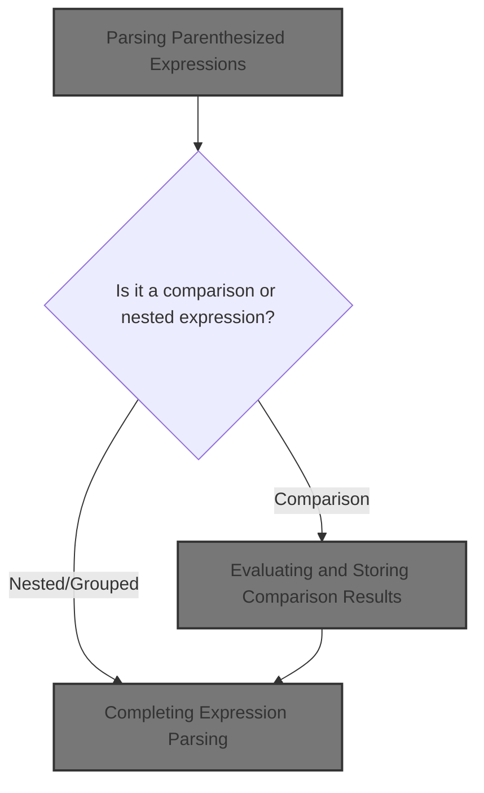
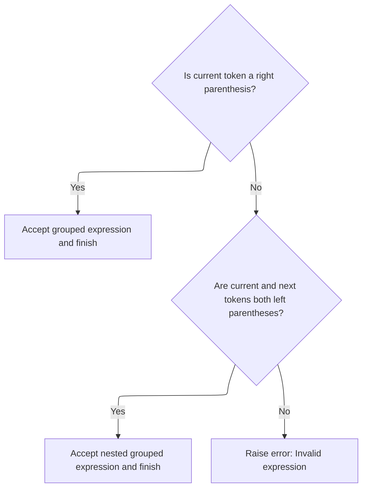

This document describes how parenthesized logical or comparison expressions are parsed and evaluated to enable dynamic validation logic. The process involves identifying the expression, parsing its components, and producing a Boolean result.



# Parsing Parenthesized Expressions

<SwmSnippet path="/core/src/main/java/org/apache/struts/validator/validwhen/ValidWhenParser.java" line="413">

---

In <SwmToken path="core/src/main/java/org/apache/struts/validator/validwhen/ValidWhenParser.java" pos="413:7:7" line-data="	public final void expr() throws RecognitionException, TokenStreamException {">`expr`</SwmToken>, we check for an opening parenthesis followed by a valid token, then delegate to <SwmToken path="core/src/main/java/org/apache/struts/validator/validwhen/ValidWhenParser.java" pos="418:1:1" line-data="			comparisonExpression();">`comparisonExpression`</SwmToken> to handle the actual comparison logic inside the parentheses. This keeps the parsing logic modular and lets expr focus on structure.

```java
	public final void expr() throws RecognitionException, TokenStreamException {
		
		
		if ((LA(1)==LPAREN) && (_tokenSet_1.member(LA(2)))) {
			match(LPAREN);
			comparisonExpression();
```

---

</SwmSnippet>

## Evaluating Comparison Logic

<SwmSnippet path="/core/src/main/java/org/apache/struts/validator/validwhen/ValidWhenParser.java" line="432">

---

In <SwmToken path="core/src/main/java/org/apache/struts/validator/validwhen/ValidWhenParser.java" pos="432:7:7" line-data="	public final void comparisonExpression() throws RecognitionException, TokenStreamException {">`comparisonExpression`</SwmToken>, we parse a value, then a comparison operator, then another value. This matches the typical structure of a comparison like 'a == b', and sets up the operands and operator for evaluation.

```java
	public final void comparisonExpression() throws RecognitionException, TokenStreamException {
		
		
		value();
		comparison();
		value();
		
```

---

</SwmSnippet>

### Parsing Individual Values

See <SwmLink doc-title="Parsing Values in Validation Expressions">[Parsing Values in Validation Expressions](/.swm/parsing-values-in-validation-expressions.sqb8glop.sw.md)</SwmLink>

### Evaluating and Storing Comparison Results

<SwmSnippet path="/core/src/main/java/org/apache/struts/validator/validwhen/ValidWhenParser.java" line="439">

---

Back in <SwmToken path="core/src/main/java/org/apache/struts/validator/validwhen/ValidWhenParser.java" pos="418:1:1" line-data="			comparisonExpression();">`comparisonExpression`</SwmToken>, after parsing both values and the operator, we pop them from the stack (<SwmToken path="core/src/main/java/org/apache/struts/validator/validwhen/ValidWhenParser.java" pos="439:3:3" line-data="			   Object v2 = argStack.pop();">`v2`</SwmToken>, comp, <SwmToken path="core/src/main/java/org/apache/struts/validator/validwhen/ValidWhenParser.java" pos="441:3:3" line-data="		Object v1 = argStack.pop();">`v1`</SwmToken>), evaluate the comparison, and push the Boolean result back. This keeps the evaluation order consistent with how the elements were parsed.

```java
			   Object v2 = argStack.pop();
			   Object comp = argStack.pop();
		Object v1 = argStack.pop();
		argStack.push(new Boolean(evaluateComparison(v1, comp, v2)));
		
	}
```

---

</SwmSnippet>

## Completing Expression Parsing



<SwmSnippet path="/core/src/main/java/org/apache/struts/validator/validwhen/ValidWhenParser.java" line="419">

---

Back in <SwmToken path="core/src/main/java/org/apache/struts/validator/validwhen/ValidWhenParser.java" pos="413:7:7" line-data="	public final void expr() throws RecognitionException, TokenStreamException {">`expr`</SwmToken>, after returning from <SwmToken path="core/src/main/java/org/apache/struts/validator/validwhen/ValidWhenParser.java" pos="418:1:1" line-data="			comparisonExpression();">`comparisonExpression`</SwmToken>, we check for the closing parenthesis to make sure the parsed expression is properly closed. If not, we handle joined expressions or throw an exception for invalid input.

```java
			match(RPAREN);
		}
		else if ((LA(1)==LPAREN) && (LA(2)==LPAREN)) {
			match(LPAREN);
			joinedExpression();
			match(RPAREN);
		}
		else {
			throw new NoViableAltException(LT(1), getFilename());
		}
		
	}
```

---

</SwmSnippet>

&nbsp;

*This is an auto-generated document by Swimm 🌊 and has not yet been verified by a human*

<SwmMeta version="3.0.0" repo-id="Z2l0aHViJTNBJTNBc3RydXRzMSUzQSUzQVN3aW1tLURlbW8=" repo-name="struts1"><sup>Powered by [Swimm](https://app.swimm.io/)</sup></SwmMeta>
