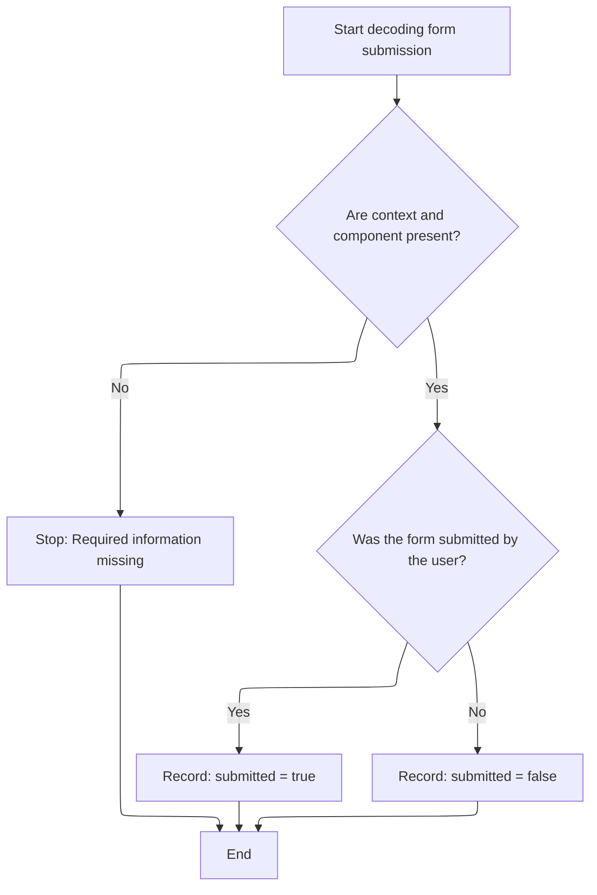

This document describes how integer literals in validation expressions are parsed and processed during form submission. The system identifies the type of integer literal, decodes its value, updates the form's state, and prepares any relevant validation messages, including localized feedback.

# Parsing Integer Literals in Validation Expressions

<SwmSnippet path="/core/src/main/java/org/apache/struts/validator/validwhen/ValidWhenParser.java" line="212">

---

In `ValidWhenParser.integer`, we're branching based on the type of integer literal detected (decimal, hex, octal). After matching the literal, we need to call ActionConfigMatcher to resolve any config-based substitutions or checks that might affect how the parsed value is used in validation.

```java
	public final void integer() throws RecognitionException, TokenStreamException {
		
		Token  d = null;
		Token  h = null;
		Token  o = null;
		
		switch ( LA(1)) {
		case DEC_INT_LITERAL:
		{
			d = LT(1);
			match(DEC_INT_LITERAL);
```

---

</SwmSnippet>

<SwmSnippet path="/core/src/main/java/org/apache/struts/validator/validwhen/ValidWhenParser.java" line="223">

---

Back in ValidWhenParser.integer, after resolving config details, we decode the matched literal and push it to the argument stack. Next, we call MessageRenderer to prepare any validation messages that might reference this value.

```java
			argStack.push(Integer.decode(d.getText()));
```

---

</SwmSnippet>

<SwmSnippet path="/core/src/main/java/org/apache/struts/validator/validwhen/ValidWhenParser.java" line="223">

---

Next, after handling messages, we break out of the case and move to <SwmToken path="faces/src/main/java/org/apache/struts/faces/renderer/FormRenderer.java" pos="49:4:4" line-data="public class FormRenderer extends AbstractRenderer {">`FormRenderer`</SwmToken>, which updates the form's state to reflect the processed input.

```java
			argStack.push(Integer.decode(d.getText()));
			break;
		}
```

---

</SwmSnippet>

## Processing Form Submission State



<SwmSnippet path="/faces/src/main/java/org/apache/struts/faces/renderer/FormRenderer.java" line="74">

---

FormRenderer.decode checks if the form component was submitted by looking for its <SwmToken path="faces/src/main/java/org/apache/struts/faces/renderer/FormRenderer.java" pos="79:3:3" line-data="        String clientId = component.getClientId(context);">`clientId`</SwmToken> in the request parameters, then marks the component as submitted. We call <SwmToken path="faces/src/main/java/org/apache/struts/faces/util/MessagesMap.java" pos="41:4:4" line-data="public class MessagesMap implements Map {">`MessagesMap`</SwmToken> next to see if there are any messages to show for this component.

```java
    public void decode(FacesContext context, UIComponent component) {

        if ((context == null) || (component == null)) {
            throw new NullPointerException();
        }
        String clientId = component.getClientId(context);
        Map map = context.getExternalContext().getRequestParameterMap();
        if (log.isDebugEnabled()) {
            log.debug("decode(" + clientId + ") --> " +
                      map.containsKey(clientId));
        }
        component.getAttributes().put
            ("submitted",
             map.containsKey(clientId) ? Boolean.TRUE : Boolean.FALSE);

    }
```

---

</SwmSnippet>

## Checking for Localized Validation Messages

<SwmSnippet path="/faces/src/main/java/org/apache/struts/faces/util/MessagesMap.java" line="107">

---

MessagesMap.containsKey checks if a message exists for the given key and locale by converting the key to a string. We call <SwmToken path="faces/src/main/java/org/apache/struts/faces/util/MessagesMap.java" pos="30:10:10" line-data="import org.apache.struts.util.MessageResources;">`MessageResources`</SwmToken> next to actually verify if the message is present for that locale.

```java
    public boolean containsKey(Object key) {

        if (key == null) {
            return (false);
        } else {
            return (messages.isPresent(locale, key.toString()));
        }

    }
```

---

</SwmSnippet>

<SwmSnippet path="/core/src/main/java/org/apache/struts/util/MessageResources.java" line="397">

---

MessageResources.isPresent checks if a message exists for the locale and key, returning false if the message is null or wrapped with '???', which is a local convention for missing messages.

```java
    public boolean isPresent(Locale locale, String key) {
        String message = getMessage(locale, key);

        if (message == null) {
            return false;
        } else if (message.startsWith("???") && message.endsWith("???")) {
            return false; // FIXME - Only valid for default implementation
        } else {
            return true;
        }
    }
```

---

</SwmSnippet>

## Handling Hex and Octal Literals in Validation

<SwmSnippet path="/core/src/main/java/org/apache/struts/validator/validwhen/ValidWhenParser.java" line="226">

---

Next in ValidWhenParser.integer, after updating the form state, we check for hex and octal literals. We call ActionConfigMatcher again to handle any config-based logic tied to these specific literal types.

```java
		case HEX_INT_LITERAL:
		{
			h = LT(1);
			match(HEX_INT_LITERAL);
```

---

</SwmSnippet>

<SwmSnippet path="/core/src/main/java/org/apache/struts/validator/validwhen/ValidWhenParser.java" line="230">

---

Back in ValidWhenParser.integer, after config matching, we decode the hex value and push it to the stack. MessageRenderer is called next to update any messages tied to this value.

```java
			argStack.push(Integer.decode(h.getText()));
```

---

</SwmSnippet>

<SwmSnippet path="/core/src/main/java/org/apache/struts/validator/validwhen/ValidWhenParser.java" line="230">

---

Next, after updating messages, we break and move to <SwmToken path="faces/src/main/java/org/apache/struts/faces/renderer/FormRenderer.java" pos="49:4:4" line-data="public class FormRenderer extends AbstractRenderer {">`FormRenderer`</SwmToken>, which updates the UI to reflect the processed hex value.

```java
			argStack.push(Integer.decode(h.getText()));
			break;
		}
```

---

</SwmSnippet>

<SwmSnippet path="/core/src/main/java/org/apache/struts/validator/validwhen/ValidWhenParser.java" line="233">

---

Next in ValidWhenParser.integer, after updating the UI for hex, we check for octal literals and call ActionConfigMatcher to handle any config logic for octal values.

```java
		case OCTAL_INT_LITERAL:
		{
			o = LT(1);
			match(OCTAL_INT_LITERAL);
```

---

</SwmSnippet>

<SwmSnippet path="/core/src/main/java/org/apache/struts/validator/validwhen/ValidWhenParser.java" line="237">

---

Back in ValidWhenParser.integer, after config matching, we decode the octal value and push it to the stack. MessageRenderer is called next to update any messages tied to this value.

```java
			argStack.push(Integer.decode(o.getText()));
```

---

</SwmSnippet>

<SwmSnippet path="/core/src/main/java/org/apache/struts/validator/validwhen/ValidWhenParser.java" line="237">

---

Finally, in ValidWhenParser.integer, if no valid literal is found, we throw an exception. <SwmToken path="faces/src/main/java/org/apache/struts/faces/renderer/FormRenderer.java" pos="49:4:4" line-data="public class FormRenderer extends AbstractRenderer {">`FormRenderer`</SwmToken> is called next to update the UI and reflect any validation errors.

```java
			argStack.push(Integer.decode(o.getText()));
			break;
		}
		default:
		{
			throw new NoViableAltException(LT(1), getFilename());
		}
		}
	}
```

---

</SwmSnippet>

&nbsp;

*This is an auto-generated document by Swimm 🌊 and has not yet been verified by a human*

<SwmMeta version="3.0.0" repo-id="Z2l0aHViJTNBJTNBc3RydXRzMSUzQSUzQVN3aW1tLURlbW8=" repo-name="struts1"><sup>Powered by [Swimm](https://app.swimm.io/)</sup></SwmMeta>
